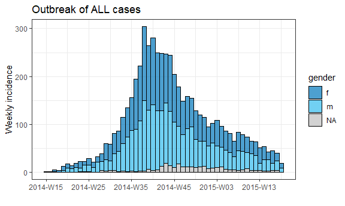
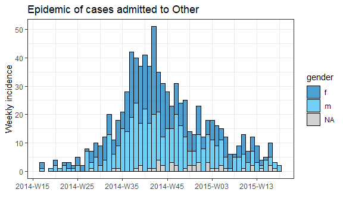
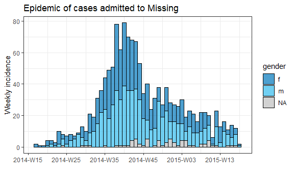
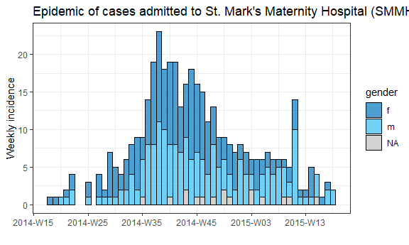
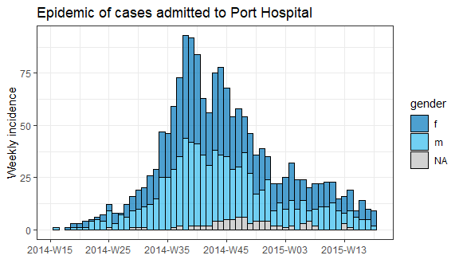
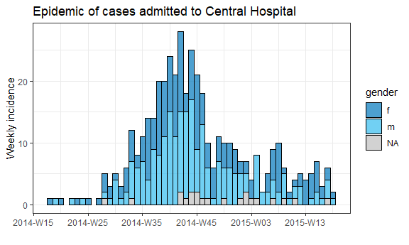
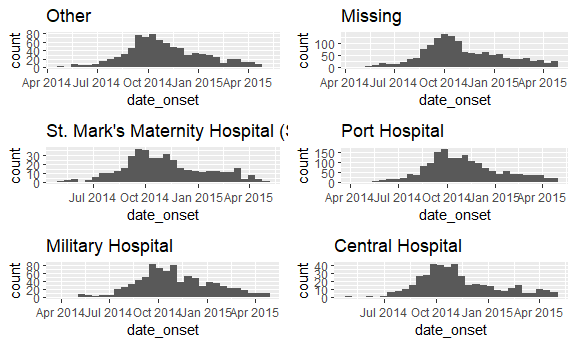

Data Management
================

## Load Linelist and Simple Loop

``` r
# import linelist
linelist <- import("./data/linelist_cleaned.rds") 


# Simple loop
for (num in c(1,2,3,4,5)) {  # the SEQUENCE is defined (numbers 1 to 5) and loop is opened with "{"
  print(num + 2)             # The OPERATIONS (add two to each sequence number and print)
}                            # The loop is closed with "}" 
```

    ## [1] 3
    ## [1] 4
    ## [1] 5
    ## [1] 6
    ## [1] 7

``` r
colnames(linelist)
```

    ##  [1] "case_id"              "generation"           "date_infection"      
    ##  [4] "date_onset"           "date_hospitalisation" "date_outcome"        
    ##  [7] "outcome"              "gender"               "age"                 
    ## [10] "age_unit"             "age_years"            "age_cat"             
    ## [13] "age_cat5"             "hospital"             "lon"                 
    ## [16] "lat"                  "infector"             "source"              
    ## [19] "wt_kg"                "ht_cm"                "ct_blood"            
    ## [22] "fever"                "chills"               "cough"               
    ## [25] "aches"                "vomit"                "temp"                
    ## [28] "time_admission"       "bmi"                  "days_onset_hosp"

# For Loops

Operations

``` r
# create container to store results - a character vector
cases_demographics <- vector(mode = "character", length = nrow(linelist))

# the for loop
for (i in 1:nrow(linelist)){
  
  # OPERATIONS
  # extract values from linelist for row i, using brackets for indexing
  row_gender  <- linelist$gender[[i]]
  row_age     <- linelist$age_years[[i]]    # don't forget to index!
     
  # combine gender-age and store in container vector at indexed location
  cases_demographics[[i]] <- str_c(row_gender, row_age, sep = ",") 

}  # end for loop


# display first 10 rows of container
head(cases_demographics, 10)
```

    ##  [1] "m,2"  "f,3"  "m,56" "f,18" "m,3"  "f,16" "f,16" "f,0"  "m,61" "f,27"

Empty vectors, dataframes, lists

``` r
# Vector
delays <- vector(
  mode = "double",                            # we expect to store numbers
  length = length(unique(linelist$hospital))) # the number of unique hospitals in the dataset

# List
plots <- vector(mode = "list", length = 16)

# DF
delays <- data.frame(matrix(ncol = 2, nrow = 3))
```

Printing

``` r
# make vector of the hospital names
hospital_names <- unique(linelist$hospital)
hospital_names # print
```

    ## [1] "Other"                               
    ## [2] "Missing"                             
    ## [3] "St. Mark's Maternity Hospital (SMMH)"
    ## [4] "Port Hospital"                       
    ## [5] "Military Hospital"                   
    ## [6] "Central Hospital"

``` r
for (hosp in hospital_names){ 
     hospital_cases <- linelist %>% filter(hospital == hosp)
     print(nrow(hospital_cases))
}
```

    ## [1] 885
    ## [1] 1469
    ## [1] 422
    ## [1] 1762
    ## [1] 896
    ## [1] 454

Looping plots- Original Plot

``` r
# create 'incidence' object
outbreak <- incidence2::incidence(   
     x = linelist,                   # dataframe - complete linelist
     date_index = date_onset,        # date column
     interval = "week",              # aggregate counts weekly
     groups = gender,                # group values by gender
     na_as_group = TRUE)             # missing gender is own group

# plot epi curve
plot(outbreak,                       # name of incidence object
     fill = "gender",                # color bars by gender
     color = "black",                # outline color of bars
     title = "Outbreak of ALL cases" # title
     )
```



Looping Plots

``` r
# make vector of the hospital names
hospital_names <- unique(linelist$hospital)

# for each name ("hosp") in hospital_names, create and print the epi curve
for (hosp in hospital_names) {
     
     # create incidence object specific to the current hospital
     outbreak_hosp <- incidence2::incidence(
          x = linelist %>% filter(hospital == hosp),   # linelist is filtered to the current hospital
          date_index = date_onset,
          interval = "week", 
          groups = gender,
          na_as_group = TRUE
     )
     
     # Create and save the plot. Title automatically adjusts to the current hospital
     plot_hosp <- plot(
       outbreak_hosp,
       fill = "gender",
       color = "black",
       title = stringr::str_glue("Epidemic of cases admitted to {hosp}")
     )
     
     # print the plot for the current hospital
     print(plot_hosp)
     
} # end the for loop when it has been run for every hospital in hospital_names 
```



Tracking Progress of Loop

``` r
# loop with code to print progress every 100 iterations
for (i in seq_len(nrow(linelist))){

  # print progress
  if(i %% 100==0){    # The %% operator is the remainder
    print(i)

}}
```

    ## [1] 100
    ## [1] 200
    ## [1] 300
    ## [1] 400
    ## [1] 500
    ## [1] 600
    ## [1] 700
    ## [1] 800
    ## [1] 900
    ## [1] 1000
    ## [1] 1100
    ## [1] 1200
    ## [1] 1300
    ## [1] 1400
    ## [1] 1500
    ## [1] 1600
    ## [1] 1700
    ## [1] 1800
    ## [1] 1900
    ## [1] 2000
    ## [1] 2100
    ## [1] 2200
    ## [1] 2300
    ## [1] 2400
    ## [1] 2500
    ## [1] 2600
    ## [1] 2700
    ## [1] 2800
    ## [1] 2900
    ## [1] 3000
    ## [1] 3100
    ## [1] 3200
    ## [1] 3300
    ## [1] 3400
    ## [1] 3500
    ## [1] 3600
    ## [1] 3700
    ## [1] 3800
    ## [1] 3900
    ## [1] 4000
    ## [1] 4100
    ## [1] 4200
    ## [1] 4300
    ## [1] 4400
    ## [1] 4500
    ## [1] 4600
    ## [1] 4700
    ## [1] 4800
    ## [1] 4900
    ## [1] 5000
    ## [1] 5100
    ## [1] 5200
    ## [1] 5300
    ## [1] 5400
    ## [1] 5500
    ## [1] 5600
    ## [1] 5700
    ## [1] 5800

## purrr and lists

``` r
pacman::p_load(
     rio,            # import/export
     here,           # relative filepaths
     tidyverse,      # data mgmt and viz
     writexl,        # write Excel file with multiple sheets
     readxl          # import Excel with multiple sheets
)
```

Import and combine Excel sheets

``` r
#Load data
get_data("hospital_linelists.xlsx")
```

    ## v File(s) successfully saved here: C:\Users\perry\OneDrive\Documents\epi_handbook_data_management\data

``` r
#Create sheet names
sheet_names <- readxl::excel_sheets("./data/hospital_linelists.xlsx")

sheet_names
```

    ## [1] "Central Hospital"              "Military Hospital"            
    ## [3] "Missing"                       "Other"                        
    ## [5] "Port Hospital"                 "St. Mark's Maternity Hospital"

Imports data and assigns each sheet a name

``` r
combined <- sheet_names %>% 
  purrr::set_names() %>% 
  map(.f = ~import("./data/hospital_linelists.xlsx", which = .x))
```

Combine previous steps with binds rows

``` r
sheet_names <- readxl::excel_sheets("./data/hospital_linelists.xlsx")  # extract sheet names
 
combined <- sheet_names %>%                                     # begin with sheet names
  purrr::set_names() %>%                                        # set their names
  map(.f = ~import("./data/hospital_linelists.xlsx", which = .x)) %>%  # iterate, import, save in list
  bind_rows(.id = "origin_sheet") # combine list of data frames, preserving origin in new column 
```

Similar example that uses map\_at() and c(-1) to skip the first sheet

``` r
sheet_names <- readxl::excel_sheets("./data/hospital_linelists.xlsx")

combined <- sheet_names %>% 
     purrr::set_names() %>% 
     # exclude the first sheet
     map_at(.f = ~import( "./data/hospital_linelists.xlsx", which = .x),
            .at = c(-1))
```

Split data set and export to separate sheets

``` r
linelist_split <- linelist %>% 
     group_split(hospital)

#Names
names(linelist_split) <- linelist_split %>%   # Assign to names of listed data frames 
     # Extract the names by doing the following to each data frame: 
     map(.f = ~pull(.x, hospital)) %>%        # Pull out hospital column
     map(.f = ~as.character(.x)) %>%          # Convert to character, just in case
     map(.f = ~unique(.x))                    # Take the unique hospital name

names(linelist_split)
```

    ## [1] "Central Hospital"                    
    ## [2] "Military Hospital"                   
    ## [3] "Missing"                             
    ## [4] "Other"                               
    ## [5] "Port Hospital"                       
    ## [6] "St. Mark's Maternity Hospital (SMMH)"

More than one group\_split()

``` r
# split linelist by unique hospital-gender combinations
linelist_split <- linelist %>% 
     group_split(hospital, gender)

# extract group_keys() as a dataframe
groupings <- linelist %>% 
     group_by(hospital, gender) %>%       
     group_keys()

groupings      # show unique groupings 
```

    ## # A tibble: 18 x 2
    ##    hospital                             gender
    ##    <chr>                                <chr> 
    ##  1 Central Hospital                     f     
    ##  2 Central Hospital                     m     
    ##  3 Central Hospital                     <NA>  
    ##  4 Military Hospital                    f     
    ##  5 Military Hospital                    m     
    ##  6 Military Hospital                    <NA>  
    ##  7 Missing                              f     
    ##  8 Missing                              m     
    ##  9 Missing                              <NA>  
    ## 10 Other                                f     
    ## 11 Other                                m     
    ## 12 Other                                <NA>  
    ## 13 Port Hospital                        f     
    ## 14 Port Hospital                        m     
    ## 15 Port Hospital                        <NA>  
    ## 16 St. Mark's Maternity Hospital (SMMH) f     
    ## 17 St. Mark's Maternity Hospital (SMMH) m     
    ## 18 St. Mark's Maternity Hospital (SMMH) <NA>

``` r
# Combine into one name value 
names(linelist_split) <- groupings %>% 
     mutate(across(everything(), replace_na, "Missing")) %>%  # replace NA with "Missing" in all columns
     unite("combined", sep = "-") %>%                         # Unite all column values into one
     setNames(NULL) %>% 
     as_vector() %>% 
     as.list()
```

Export as Excel sheets

``` r
linelist_split %>% 
     writexl::write_xlsx(path = here("data", "hospital_linelists.xlsx"))
```

    ## Warning in writexl::write_xlsx(., path = here("data",
    ## "hospital_linelists.xlsx")): Truncating sheet name(s) to 31 characters

    ## Warning in writexl::write_xlsx(., path = here("data",
    ## "hospital_linelists.xlsx")): Deduplicating sheet names

Export as CSV files

``` r
names(linelist_split) %>%
     map(.f = ~export(linelist_split[[.x]], file = str_glue("{here('data')}/{.x}.csv")))
```

    ## [[1]]
    ## [1] "C:/Users/perry/OneDrive/Documents/epi_handbook_data_management/data/Central Hospital-f.csv"
    ## 
    ## [[2]]
    ## [1] "C:/Users/perry/OneDrive/Documents/epi_handbook_data_management/data/Central Hospital-m.csv"
    ## 
    ## [[3]]
    ## [1] "C:/Users/perry/OneDrive/Documents/epi_handbook_data_management/data/Central Hospital-Missing.csv"
    ## 
    ## [[4]]
    ## [1] "C:/Users/perry/OneDrive/Documents/epi_handbook_data_management/data/Military Hospital-f.csv"
    ## 
    ## [[5]]
    ## [1] "C:/Users/perry/OneDrive/Documents/epi_handbook_data_management/data/Military Hospital-m.csv"
    ## 
    ## [[6]]
    ## [1] "C:/Users/perry/OneDrive/Documents/epi_handbook_data_management/data/Military Hospital-Missing.csv"
    ## 
    ## [[7]]
    ## [1] "C:/Users/perry/OneDrive/Documents/epi_handbook_data_management/data/Missing-f.csv"
    ## 
    ## [[8]]
    ## [1] "C:/Users/perry/OneDrive/Documents/epi_handbook_data_management/data/Missing-m.csv"
    ## 
    ## [[9]]
    ## [1] "C:/Users/perry/OneDrive/Documents/epi_handbook_data_management/data/Missing-Missing.csv"
    ## 
    ## [[10]]
    ## [1] "C:/Users/perry/OneDrive/Documents/epi_handbook_data_management/data/Other-f.csv"
    ## 
    ## [[11]]
    ## [1] "C:/Users/perry/OneDrive/Documents/epi_handbook_data_management/data/Other-m.csv"
    ## 
    ## [[12]]
    ## [1] "C:/Users/perry/OneDrive/Documents/epi_handbook_data_management/data/Other-Missing.csv"
    ## 
    ## [[13]]
    ## [1] "C:/Users/perry/OneDrive/Documents/epi_handbook_data_management/data/Port Hospital-f.csv"
    ## 
    ## [[14]]
    ## [1] "C:/Users/perry/OneDrive/Documents/epi_handbook_data_management/data/Port Hospital-m.csv"
    ## 
    ## [[15]]
    ## [1] "C:/Users/perry/OneDrive/Documents/epi_handbook_data_management/data/Port Hospital-Missing.csv"
    ## 
    ## [[16]]
    ## [1] "C:/Users/perry/OneDrive/Documents/epi_handbook_data_management/data/St. Mark's Maternity Hospital (SMMH)-f.csv"
    ## 
    ## [[17]]
    ## [1] "C:/Users/perry/OneDrive/Documents/epi_handbook_data_management/data/St. Mark's Maternity Hospital (SMMH)-m.csv"
    ## 
    ## [[18]]
    ## [1] "C:/Users/perry/OneDrive/Documents/epi_handbook_data_management/data/St. Mark's Maternity Hospital (SMMH)-Missing.csv"

Create a function- multiple plots using ggplots example

``` r
# load package for plotting elements from list
pacman::p_load(ggpubr)

# map across the vector of 6 hospital "names" (created earlier)
# use the ggplot function specified
# output is a list with 6 ggplots

hospital_names <- unique(linelist$hospital)

my_plots <- map(
  .x = hospital_names,
  .f = ~ggplot(data = linelist %>% filter(hospital == .x)) +
                geom_histogram(aes(x = date_onset)) +
                labs(title = .x)
)

# print the ggplots (they are stored in a list)
ggarrange(plotlist = my_plots, ncol = 2, nrow = 3)
```

    ## `stat_bin()` using `bins = 30`. Pick better value with `binwidth`.

    ## Warning: Removed 45 rows containing non-finite values (stat_bin).

    ## `stat_bin()` using `bins = 30`. Pick better value with `binwidth`.

    ## Warning: Removed 71 rows containing non-finite values (stat_bin).

    ## `stat_bin()` using `bins = 30`. Pick better value with `binwidth`.

    ## Warning: Removed 13 rows containing non-finite values (stat_bin).

    ## `stat_bin()` using `bins = 30`. Pick better value with `binwidth`.

    ## Warning: Removed 75 rows containing non-finite values (stat_bin).

    ## `stat_bin()` using `bins = 30`. Pick better value with `binwidth`.

    ## Warning: Removed 34 rows containing non-finite values (stat_bin).

    ## `stat_bin()` using `bins = 30`. Pick better value with `binwidth`.

    ## Warning: Removed 18 rows containing non-finite values (stat_bin).


