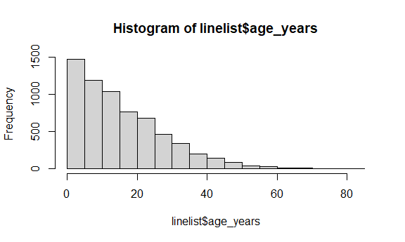

Data Management
================

## Load Linelist

``` r
linelist_raw <- import("./data/linelist_raw.xlsx") 
```

    ## New names:
    ## * `` -> ...28

``` r
linelist <- linelist_raw %>%
  janitor::clean_names() %>%
  rename(
    date_infection = infection_date,
    date_hospitalization = hosp_date,
    date_outcome = date_of_outcome
  )

#Review
skimr::skim(linelist_raw)
```

|                                                  |               |
|:-------------------------------------------------|:--------------|
| Name                                             | linelist\_raw |
| Number of rows                                   | 6611          |
| Number of columns                                | 28            |
| \_\_\_\_\_\_\_\_\_\_\_\_\_\_\_\_\_\_\_\_\_\_\_   |               |
| Column type frequency:                           |               |
| character                                        | 17            |
| numeric                                          | 8             |
| POSIXct                                          | 3             |
| \_\_\_\_\_\_\_\_\_\_\_\_\_\_\_\_\_\_\_\_\_\_\_\_ |               |
| Group variables                                  | None          |

Data summary

**Variable type: character**

| skim\_variable  | n\_missing | complete\_rate | min | max | empty | n\_unique | whitespace |
|:----------------|-----------:|---------------:|----:|----:|------:|----------:|-----------:|
| case\_id        |        137 |           0.98 |   6 |   6 |     0 |      5888 |          0 |
| date onset      |        293 |           0.96 |  10 |  10 |     0 |       580 |          0 |
| outcome         |       1500 |           0.77 |   5 |   7 |     0 |         2 |          0 |
| gender          |        324 |           0.95 |   1 |   1 |     0 |         2 |          0 |
| hospital        |       1512 |           0.77 |   5 |  36 |     0 |        13 |          0 |
| infector        |       2323 |           0.65 |   6 |   6 |     0 |      2697 |          0 |
| source          |       2323 |           0.65 |   5 |   7 |     0 |         2 |          0 |
| age             |        107 |           0.98 |   1 |   2 |     0 |        75 |          0 |
| age\_unit       |          7 |           1.00 |   5 |   6 |     0 |         2 |          0 |
| fever           |        258 |           0.96 |   2 |   3 |     0 |         2 |          0 |
| chills          |        258 |           0.96 |   2 |   3 |     0 |         2 |          0 |
| cough           |        258 |           0.96 |   2 |   3 |     0 |         2 |          0 |
| aches           |        258 |           0.96 |   2 |   3 |     0 |         2 |          0 |
| vomit           |        258 |           0.96 |   2 |   3 |     0 |         2 |          0 |
| time\_admission |        844 |           0.87 |   5 |   5 |     0 |      1091 |          0 |
| merged\_header  |          0 |           1.00 |   1 |   1 |     0 |         1 |          0 |
| …28             |          0 |           1.00 |   1 |   1 |     0 |         1 |          0 |

**Variable type: numeric**

| skim\_variable | n\_missing | complete\_rate |    mean |      sd |     p0 |     p25 |     p50 |     p75 |    p100 | hist  |
|:---------------|-----------:|---------------:|--------:|--------:|-------:|--------:|--------:|--------:|--------:|:------|
| generation     |          7 |           1.00 |   16.60 |    5.71 |   0.00 |   13.00 |   16.00 |   20.00 |   37.00 | ▁▆▇▂▁ |
| lon            |          7 |           1.00 |  -13.23 |    0.02 | -13.27 |  -13.25 |  -13.23 |  -13.22 |  -13.21 | ▅▃▃▅▇ |
| lat            |          7 |           1.00 |    8.47 |    0.01 |   8.45 |    8.46 |    8.47 |    8.48 |    8.49 | ▅▇▇▇▆ |
| row\_num       |          0 |           1.00 | 3240.91 | 1857.83 |   1.00 | 1647.50 | 3241.00 | 4836.50 | 6481.00 | ▇▇▇▇▇ |
| wt\_kg         |          7 |           1.00 |   52.69 |   18.59 | -11.00 |   41.00 |   54.00 |   66.00 |  111.00 | ▁▃▇▅▁ |
| ht\_cm         |          7 |           1.00 |  125.25 |   49.57 |   4.00 |   91.00 |  130.00 |  159.00 |  295.00 | ▂▅▇▂▁ |
| ct\_blood      |          7 |           1.00 |   21.26 |    1.67 |  16.00 |   20.00 |   22.00 |   22.00 |   26.00 | ▁▃▇▃▁ |
| temp           |        158 |           0.98 |   38.60 |    0.95 |  35.20 |   38.30 |   38.80 |   39.20 |   40.80 | ▁▂▂▇▁ |

**Variable type: POSIXct**

| skim\_variable    | n\_missing | complete\_rate | min        | max        | median     | n\_unique |
|:------------------|-----------:|---------------:|:-----------|:-----------|:-----------|----------:|
| infection date    |       2322 |           0.65 | 2012-04-09 | 2015-04-27 | 2014-10-04 |       538 |
| hosp date         |          7 |           1.00 | 2012-04-20 | 2015-04-30 | 2014-10-15 |       570 |
| date\_of\_outcome |       1068 |           0.84 | 2012-05-14 | 2015-06-04 | 2014-10-26 |       575 |

``` r
#Look at column names
names(linelist_raw)
```

    ##  [1] "case_id"         "generation"      "infection date"  "date onset"     
    ##  [5] "hosp date"       "date_of_outcome" "outcome"         "gender"         
    ##  [9] "hospital"        "lon"             "lat"             "infector"       
    ## [13] "source"          "age"             "age_unit"        "row_num"        
    ## [17] "wt_kg"           "ht_cm"           "ct_blood"        "fever"          
    ## [21] "chills"          "cough"           "aches"           "vomit"          
    ## [25] "temp"            "time_admission"  "merged_header"   "...28"

``` r
#Can reference column name with spaces using back-ticks ex: linelist$`x60\infection date\x60`
```

Manipulate Columns

``` r
# select
linelist %>%
  select(case_id, date_onset, date_hospitalization, fever) %>%
  names()
```

    ## [1] "case_id"              "date_onset"           "date_hospitalization"
    ## [4] "fever"

``` r
# everything- move onset and hospitaliation to front
linelist %>%
  select(date_onset, date_hospitalization, everything()) %>%
  names()
```

    ##  [1] "date_onset"           "date_hospitalization" "case_id"             
    ##  [4] "generation"           "date_infection"       "date_outcome"        
    ##  [7] "outcome"              "gender"               "hospital"            
    ## [10] "lon"                  "lat"                  "infector"            
    ## [13] "source"               "age"                  "age_unit"            
    ## [16] "row_num"              "wt_kg"                "ht_cm"               
    ## [19] "ct_blood"             "fever"                "chills"              
    ## [22] "cough"                "aches"                "vomit"               
    ## [25] "temp"                 "time_admission"       "merged_header"       
    ## [28] "x28"

``` r
# select columns that are class numeric
linelist %>%
  select(where(is.numeric)) %>%
  names()
```

    ## [1] "generation" "lon"        "lat"        "row_num"    "wt_kg"     
    ## [6] "ht_cm"      "ct_blood"   "temp"

``` r
# select columns containing certain characters
linelist %>%
  select(contains("date")) %>%
  names()
```

    ## [1] "date_infection"       "date_onset"           "date_hospitalization"
    ## [4] "date_outcome"

``` r
# searched for multiple character matches- needs to be exact or will generate an error
linelist %>%
  select(matches("onset|hosp|fev")) %>%
  names()
```

    ## [1] "date_onset"           "date_hospitalization" "hospital"            
    ## [4] "fever"

``` r
# consider using any_of to search for columns that may or may not exist
linelist %>%
  select(any_of(c("date_onset","village_origin","village_detection","village_residence","village_travel"))) %>%
  names()
```

    ## [1] "date_onset"

``` r
# remove columns
linelist %>%
  select(-c(date_onset, fever:vomit)) %>%
  names()
```

    ##  [1] "case_id"              "generation"           "date_infection"      
    ##  [4] "date_hospitalization" "date_outcome"         "outcome"             
    ##  [7] "gender"               "hospital"             "lon"                 
    ## [10] "lat"                  "infector"             "source"              
    ## [13] "age"                  "age_unit"             "row_num"             
    ## [16] "wt_kg"                "ht_cm"                "ct_blood"            
    ## [19] "temp"                 "time_admission"       "merged_header"       
    ## [22] "x28"

``` r
# create new linelist with id and age-realted columns
linelist_age <- select(linelist, case_id, contains("age"))

names(linelist_age)
```

    ## [1] "case_id"  "age"      "age_unit"

Addition to pipe chain

``` r
linelist <- linelist_raw %>%
  janitor::clean_names() %>%
  rename(date_infection       = infection_date,
           date_hospitalisation = hosp_date,
           date_outcome         = date_of_outcome) %>%
  select(-c(row_num, merged_header, x28)) %>%
  distinct()
```

New Columns

``` r
new_col_demo <- linelist %>%                       
  mutate(
    new_var_dup    = case_id,             # new column = duplicate/copy another existing column
    new_var_static = 7,                   # new column = all values the same
    new_var_static = new_var_static + 5,  # you can overwrite a column, and it can be a calculation using other variables
    new_var_paste  = stringr::str_glue("{hospital} on ({date_hospitalisation})") # new column = pasting together values from other columns
    ) %>% 
  select(case_id, hospital, date_hospitalisation, contains("new"))        # show only new columns, for demonstration purposes

linelist <- linelist %>%
  select(-contains("new_var"))
```

Grouped Data

``` r
class(linelist$age)
```

    ## [1] "character"

``` r
linelist <- linelist %>%
  mutate(age = as.numeric(age))

# age normalized to mean of all rows
linelist %>%
  mutate(age_norm = age / mean(age, na.rm = T))
```

    ##      case_id generation date_infection date_onset date_hospitalisation
    ## 1     5fe599          4     2014-05-08 2014-05-13           2014-05-15
    ## 2     8689b7          4           <NA> 2014-05-13           2014-05-14
    ## 3     11f8ea          2           <NA> 2014-05-16           2014-05-18
    ## 4     b8812a          3     2014-05-04 2014-05-18           2014-05-20
    ## 5     893f25          3     2014-05-18 2014-05-21           2014-05-22
    ## 6     be99c8          3     2014-05-03 2014-05-22           2014-05-23
    ## 7     07e3e8          4     2014-05-22 2014-05-27           2014-05-29
    ## 8     369449          4     2014-05-28 2014-06-02           2014-06-03
    ## 9     f393b4          4           <NA> 2014-06-05           2014-06-06
    ## 10    1389ca          4           <NA> 2014-06-05           2014-06-07
    ## 11    2978ac          4     2014-05-30 2014-06-06           2014-06-08
    ## 12    57a565          4     2014-05-28 2014-06-13           2014-06-15
    ## 13    fc15ef          6     2014-06-14 2014-06-16           2014-06-17
    ## 14    2eaa9a          5     2014-06-07 2014-06-17           2014-06-17
    ## 15    bbfa93          6     2014-06-09 2014-06-18           2014-06-20
    ## 16    c97dd9          9           <NA> 2014-06-19           2014-06-19
    ## 17    f50e8a         10           <NA> 2014-06-22           2014-06-23
    ## 18    3a7673          8           <NA> 2014-06-23           2014-06-24
    ## 19    7f5a01          7     2014-06-23 2014-06-25           2014-06-27
    ## 20    ddddee          6     2014-06-18 2014-06-26           2014-06-28
    ## 21    99e8fa          7     2014-06-24 2014-06-28           2014-06-29
    ## 22    567136          6           <NA> 2014-07-02           2014-07-03
    ## 23    9371a9          8           <NA> 2014-07-08           2014-07-09
    ## 24    bc2adf          6     2014-07-03 2014-07-09           2014-07-09
    ## 25    403057         10           <NA> 2014-07-09           2014-07-11
    ## 26    8bd1e8          8     2014-07-10 2014-07-10           2014-07-11
    ## 27    f327be          6     2014-06-14 2014-07-12           2014-07-13
    ## 28    42e1a9         12           <NA> 2014-07-12           2014-07-14
    ## 29    90e5fe          5     2014-06-18 2014-07-13           2014-07-14
    ## 30    959170          8     2014-06-29 2014-07-13           2014-07-13
    ## 31    8ebf6e          7     2014-07-02 2014-07-14           2014-07-14
    ## 32    e56412          9     2014-07-12 2014-07-15           2014-07-17
    ## 33    6d788e         11     2014-07-12 2014-07-16           2014-07-17
    ## 34    a47529          5     2014-06-13 2014-07-17           2014-07-18
    ## 35    67be4e          8     2014-07-15 2014-07-17           2014-07-19
    ## 36    da8ecb          5     2014-06-20 2014-07-18           2014-07-20
    ## 37    148f18          6           <NA> 2014-07-19           2014-07-20
    ## 38    2cb9a5         11           <NA> 2014-07-22           2014-07-22
    ## 39    f5c142          7     2014-07-20 2014-07-22           2014-07-24
    ## 40    70a9fe          9           <NA> 2014-07-24           2014-07-26
    ## 41    3ad520          7     2014-07-12 2014-07-24           2014-07-24
    ## 42    062638          8     2014-07-19 2014-07-25           2014-07-27
    ## 43    c76676          9     2014-07-18 2014-07-25           2014-07-25
    ## 44    baacc1         12     2014-07-18 2014-07-27           2014-07-27
    ## 45    497372         13     2014-07-27 2014-07-29           2014-07-31
    ## 46    23e499          9           <NA> 2014-07-30           2014-08-01
    ## 47    38cc4a          8     2014-07-19       <NA>           2014-08-03
    ## 48    3789ee         10     2014-07-26 2014-08-01           2014-08-02
    ## 49    c71dcd          8     2014-07-24 2014-08-02           2014-08-02
    ## 50    6b70f0          7           <NA> 2014-08-03           2014-08-04
    ## 51    316781          8     2014-07-22 2014-08-03           2014-08-04
    ## 52    72bb4b          9           <NA> 2014-08-03           2014-08-05
    ## 53    422831         12     2014-07-23 2014-08-03           2014-08-05
    ## 54    df2113         13     2014-07-28 2014-08-03           2014-08-05
    ## 55    2b36fa          8     2014-07-12 2014-08-03           2014-08-05
    ## 56    bbbd13          9           <NA> 2014-08-04           2014-08-05
    ## 57    eea609          9           <NA> 2014-08-04           2014-08-06
    ## 58    b6c0ed         13           <NA> 2014-08-05           2014-08-05
    ## 59    c13247         12     2014-07-22 2014-08-05           2014-08-05
    ## 60    4ade58         11     2014-08-02 2014-08-07           2014-08-09
    ## 61    9f0c37          8     2014-07-25 2014-08-07           2014-08-08
    ## 62    f97626         11     2014-07-30 2014-08-08           2014-08-09
    ## 63    7d99f2         12     2014-07-24 2014-08-08           2014-08-10
    ## 64    a2e5d2         13     2014-08-08 2014-08-09           2014-08-11
    ## 65    034a98         12           <NA> 2014-08-10           2014-08-12
    ## 66    d6a409         10           <NA> 2014-08-10           2014-08-12
    ## 67    92e129         10     2014-08-01 2014-08-10           2014-08-12
    ## 68    426446         10     2014-08-05 2014-08-11           2014-08-12
    ## 69    babc2d         13     2014-08-05 2014-08-12           2014-08-13
    ## 70    582196         16           <NA> 2014-08-12           2014-08-14
    ## 71    d5f3c0          9     2014-08-04 2014-08-13           2014-08-14
    ## 72    f750fe          6     2014-08-04 2014-08-13           2014-08-15
    ## 73    46e52d         14     2014-08-05 2014-08-15           2014-08-17
    ## 74    3e7820         11     2014-08-15 2014-08-16           2014-08-18
    ## 75    8b4b24          9     2014-08-12 2014-08-16           2014-08-18
    ## 76    bd5a25         10     2014-08-06 2014-08-16           2014-08-16
    ## 77    eaf447         10           <NA> 2014-08-17           2014-08-18
    ## 78    564652         11     2014-08-10 2014-08-19           2014-08-21
    ## 79    7276c8          8           <NA> 2014-08-19           2014-08-20
    ## 80    240da4         10           <NA> 2014-08-20           2014-08-20
    ## 81    890de4         11     2014-08-18 2014-08-20           2014-08-21
    ## 82    cc71ea          9     2014-08-05 2014-08-21           2014-08-22
    ## 83    320198         14     2014-08-20 2014-08-22           2014-08-23
    ## 84    effb9d         12     2014-08-19       <NA>           2014-08-24
    ## 85    3c0ca7         12     2014-08-16 2014-08-22           2014-08-23
    ## 86    568050         13     2014-08-19       <NA>           2014-08-24
    ## 87    7b46ff         15           <NA> 2014-08-23           2014-08-24
    ## 88    10b627         13     2014-08-19 2014-08-24           2014-08-26
    ## 89    036b0d         10           <NA>       <NA>           2014-08-25
    ## 90    cfae3b         11     2014-08-14       <NA>           2014-08-25
    ## 91    9c8045          9     2014-07-26 2014-08-25           2014-08-26
    ## 92    32118a         17           <NA> 2014-08-25           2014-08-26
    ## 93    c432cd         11           <NA>       <NA>           2014-08-28
    ## 94    c5caa6         11     2014-08-23 2014-08-26           2014-08-27
    ## 95    5f5f78         13     2014-08-17 2014-08-26           2014-08-27
    ## 96    97c128         14           <NA> 2014-08-27           2014-08-29
    ## 97    63618e         10     2014-08-22       <NA>           2014-08-27
    ## 98    607956         12     2014-08-21 2014-08-27           2014-08-29
    ## 99    fc674d         15     2014-08-17 2014-08-27           2014-08-28
    ## 100   b3c066          8     2014-08-20 2014-08-27           2014-08-28
    ## 101   e6d478         11           <NA> 2014-08-27           2014-08-29
    ## 102   ac760b         13     2014-08-27 2014-08-28           2014-08-29
    ## 103   bb791f         14           <NA> 2014-08-28           2014-08-29
    ## 104   ed514e         13           <NA> 2014-08-28           2014-08-29
    ## 105   a17a22         10           <NA> 2014-08-28           2014-08-28
    ## 106   edc86c         11           <NA> 2014-08-28           2014-08-29
    ## 107   b06702          9           <NA> 2014-08-29           2014-08-31
    ## 108   6647f1         13     2014-08-04 2014-08-29           2014-08-30
    ## 109   b694b3         15     2014-08-28 2014-08-30           2014-09-01
    ## 110   034082         15     2014-08-12 2014-08-30           2014-09-01
    ## 111   c10877          9     2014-08-24 2014-08-30           2014-09-01
    ## 112   635fd7         10     2014-08-24 2014-08-30           2014-09-01
    ## 113   c68c23         10     2014-08-24 2014-08-30           2014-08-30
    ## 114   aa3c55         10     2014-08-27 2014-08-30           2014-08-31
    ## 115   f137aa         12           <NA> 2014-09-01           2014-09-03
    ## 116   e898af         10     2014-08-26       <NA>           2014-09-02
    ## 117   a11d21         12           <NA>       <NA>           2014-09-01
    ## 118   5ab9fc         12     2014-08-29 2014-09-02           2014-09-02
    ## 119   511f56         10           <NA> 2014-09-03           2014-09-05
    ## 120   270603         11     2014-08-18 2014-09-03           2014-09-03
    ## 121   42086d         11     2014-08-19 2014-09-03           2014-09-03
    ## 122   f0251f         11           <NA> 2014-09-03           2014-09-03
    ## 123   597f6e          9           <NA> 2014-09-03           2014-09-04
    ## 124   09a876         11           <NA> 2014-09-03           2014-09-04
    ## 125   49e88d         10           <NA> 2014-09-04           2014-09-05
    ## 126   f08f3b         12           <NA> 2014-09-04           2014-09-05
    ## 127   bf4da8         11     2014-08-21       <NA>           2014-09-05
    ## 128   6a007d         11     2014-09-01 2014-09-05           2014-09-06
    ## 129   fd4dd4         13     2014-09-04 2014-09-05           2014-09-05
    ## 130   09915f         13     2014-08-31 2014-09-06           2014-09-06
    ## 131   181506         15     2014-08-31 2014-09-06           2014-09-06
    ## 132   0c69a9         16           <NA> 2014-09-06           2014-09-08
    ## 133   f4bb37         12     2014-09-03 2014-09-06           2014-09-08
    ## 134   027e28         11           <NA> 2014-09-06           2014-09-08
    ## 135   a84993         11     2014-08-31 2014-09-06           2014-09-07
    ## 136   8939e3         12           <NA>       <NA>           2014-09-08
    ## 137   93bb41          9     2014-08-14 2014-09-07           2014-09-09
    ## 138   08bf40         14     2014-09-03 2014-09-08           2014-09-09
    ## 139   32f781         11     2014-09-02       <NA>           2014-09-10
    ## 140   5a54ea         13           <NA> 2014-09-09           2014-09-10
    ## 141   1bc942         14     2014-09-07 2014-09-09           2014-09-10
    ## 142   cd182c         12     2014-08-31 2014-09-09           2014-09-09
    ## 143   f70e4c          9     2014-08-27 2014-09-10           2014-09-12
    ## 144   26aec8         14     2014-09-10 2014-09-11           2014-09-12
    ## 145   64b7b0         14     2014-09-03 2014-09-11           2014-09-11
    ## 146   1cc5e0         13     2014-09-11 2014-09-11           2014-09-12
    ## 147   f0b93e         15     2014-09-07 2014-09-11           2014-09-12
    ## 148   c800a4         14     2014-09-06 2014-09-11           2014-09-11
    ## 149   09c9b9         11     2014-09-09 2014-09-12           2014-09-13
    ## 150   b458e2         12     2014-09-06 2014-09-12           2014-09-13
    ## 151   7ea9a5         18     2014-09-09 2014-09-13           2014-09-15
    ## 152   a5ea95         13           <NA> 2014-09-13           2014-09-15
    ## 153   a851f3         12           <NA>       <NA>           2014-09-14
    ## 154   b2f5d7         15     2014-09-10 2014-09-13           2014-09-14
    ## 155   52f06c         11           <NA> 2014-09-14           2014-09-16
    ## 156   911ded         11     2014-09-06 2014-09-14           2014-09-16
    ## 157   315f76         10     2014-09-05 2014-09-14           2014-09-16
    ## 158   da1f29         14           <NA> 2014-09-14           2014-09-14
    ## 159   946a96         14           <NA> 2014-09-14           2014-09-16
    ## 160   414c20         15           <NA> 2014-09-14           2014-09-16
    ## 161   8e1819         16     2014-09-01 2014-09-14           2014-09-16
    ## 162   8a0025         17           <NA> 2014-09-14           2014-09-15
    ## 163   862f64         13     2014-09-12 2014-09-15           2014-09-15
    ## 164   c51081         14     2014-09-05 2014-09-15           2014-09-16
    ## 165   82aac6         12           <NA> 2014-09-15           2014-09-15
    ## 166   4cd1eb         12           <NA>       <NA>           2014-09-15
    ## 167   62048c         16     2014-09-10       <NA>           2014-09-17
    ## 168   34f7ac         12     2014-09-15 2014-09-15           2014-09-17
    ## 169   92daa4         13     2014-09-10 2014-09-15           2014-09-17
    ## 170   978157         17     2014-09-14       <NA>           2014-09-17
    ## 171   04415a         12           <NA> 2014-09-16           2014-09-18
    ## 172   60838b         15     2014-09-09 2014-09-16           2014-09-17
    ## 173   ed2d8f          8     2014-08-24 2014-09-16           2014-09-17
    ## 174   21c020         11           <NA> 2014-09-16           2014-09-17
    ## 175   2f29c3         12           <NA> 2014-09-16           2014-09-17
    ## 176   b6f403         12     2014-09-08 2014-09-17           2014-09-18
    ## 177   29734b         11     2014-09-13 2014-09-17           2014-09-18
    ## 178   ef8b5c         17     2014-09-14 2014-09-17           2014-09-17
    ## 179   fc0d62         20     2014-09-11 2014-09-17           2014-09-18
    ## 180   b1b252         13     2014-09-03 2014-09-17           2014-09-19
    ## 181   29235d         11     2014-09-14       <NA>           2014-09-17
    ## 182   7df257         11     2014-09-03       <NA>           2014-09-20
    ## 183   8d8972         11     2014-09-14 2014-09-18           2014-09-19
    ## 184   fcf236         13     2014-09-03 2014-09-19           2014-09-20
    ## 185   55c64b         14           <NA> 2014-09-19           2014-09-21
    ## 186   8d3858         14     2014-09-15       <NA>           2014-09-20
    ## 187   d7ff31         12     2014-09-07 2014-09-19           2014-09-20
    ## 188   95a292         14     2014-09-11 2014-09-19           2014-09-19
    ## 189   4d3855         11           <NA> 2014-09-19           2014-09-19
    ## 190   0db116         12     2014-09-15 2014-09-19           2014-09-21
    ## 191   70e542         14     2014-09-13 2014-09-19           2014-09-19
    ## 192   7c3e28         10     2014-09-05       <NA>           2014-09-22
    ## 193   3e4063         11     2014-09-17 2014-09-20           2014-09-21
    ## 194   507608         11     2014-09-11       <NA>           2014-09-20
    ## 195   4df686         16           <NA> 2014-09-20           2014-09-21
    ## 196   e68dd5         15           <NA> 2014-09-20           2014-09-21
    ## 197   056b1a         13     2014-09-16       <NA>           2014-09-20
    ## 198   d28360         14     2014-09-15       <NA>           2014-09-22
    ## 199   95b91a         14     2014-09-15 2014-09-20           2014-09-22
    ## 200   8a1530         13     2014-09-08 2014-09-20           2014-09-22
    ## 201   bcd672         14           <NA> 2014-09-20           2014-09-22
    ## 202   62e1be         14           <NA> 2014-09-20           2014-09-21
    ## 203   c6cdb2         13     2014-09-03 2014-09-20           2014-09-22
    ## 204   fa44c8         14           <NA> 2014-09-20           2014-09-21
    ## 205   b55ec2         18     2014-09-10 2014-09-20           2014-09-21
    ## 206   a248d0         12           <NA> 2014-09-21           2014-09-21
    ## 207   28d55a         14           <NA> 2014-09-21           2014-09-21
    ## 208   305144         12     2014-09-20       <NA>           2014-09-22
    ## 209   7f957c         15     2014-09-01 2014-09-21           2014-09-23
    ## 210   6d36d3         11           <NA> 2014-09-21           2014-09-22
    ## 211   39768c         14           <NA> 2014-09-22           2014-09-24
    ## 212   07a2bc         16     2014-09-18 2014-09-22           2014-09-23
    ## 213   b26166         15     2014-09-08 2014-09-22           2014-09-22
    ## 214   2b8802         14           <NA> 2014-09-22           2014-09-22
    ## 215   3bd788         13           <NA> 2014-09-22           2014-09-22
    ## 216   0dfe67         11           <NA> 2014-09-22           2014-09-23
    ## 217   919feb         16     2014-09-21 2014-09-22           2014-09-23
    ## 218   893b3a         20     2014-09-22 2014-09-22           2014-09-24
    ## 219   af4c4c         17           <NA> 2014-09-22           2014-09-23
    ## 220   1306c1         17     2014-09-22 2014-09-22           2014-09-22
    ## 221   54336c         12     2014-08-27 2014-09-22           2014-09-22
    ## 222   f96d1b         15           <NA> 2014-09-22           2014-09-24
    ## 223   8b100a         12           <NA> 2014-09-22           2014-09-24
    ## 224   556661         14           <NA> 2014-09-22           2014-09-24
    ## 225   1bb136         12     2014-09-12 2014-09-22           2014-09-24
    ## 226   9b07ad         13     2014-09-20 2014-09-23           2014-09-23
    ## 227   d0314a         18           <NA> 2014-09-23           2014-09-24
    ## 228   41c84b         15           <NA> 2014-09-23           2014-09-23
    ## 229   882ab5         14     2014-09-19 2014-09-23           2014-09-24
    ## 230   19b40a         13     2014-09-07 2014-09-23           2014-09-23
    ## 231   8028e7         12     2014-09-09 2014-09-23           2014-09-23
    ## 232   271218         12           <NA> 2014-09-23           2014-09-25
    ## 233   5d3b71         12           <NA> 2014-09-23           2014-09-23
    ## 234   ad9edb         18           <NA>       <NA>           2014-09-24
    ## 235   5c136c         14     2014-08-31 2014-09-23           2014-09-25
    ## 236   72cbb4         20     2014-09-21 2014-09-23           2014-09-23
    ## 237   ee1b06         12     2014-09-12 2014-09-23           2014-09-24
    ## 238   12a0e2         16           <NA>       <NA>           2014-09-25
    ## 239   b6c10f         16     2014-09-21 2014-09-24           2014-09-24
    ## 240   a12b9b         17           <NA> 2014-09-24           2014-09-26
    ## 241   27ce4e         13           <NA> 2014-09-24           2014-09-26
    ## 242   aac41c         13           <NA> 2014-09-24           2014-09-26
    ## 243   28f2a4         14     2014-09-03 2014-09-24           2014-09-25
    ## 244   00409c         14     2014-09-14       <NA>           2014-09-25
    ## 245   583f19         17     2014-09-17 2014-09-24           2014-09-25
    ## 246   5b2cbe         14     2014-09-15 2014-09-25           2014-09-26
    ## 247   9bef03         17           <NA> 2014-09-25           2014-09-25
    ## 248   25bfe6         14     2014-09-08 2014-09-25           2014-09-27
    ## 249   166302         11           <NA> 2014-09-25           2014-09-26
    ## 250   cb1336         16     2014-09-17 2014-09-25           2014-09-25
    ## 251   392896         12           <NA>       <NA>           2014-09-27
    ## 252   b5a6ee         16     2014-09-19 2014-09-25           2014-09-26
    ## 253   f73f58         16     2014-09-16       <NA>           2014-09-26
    ## 254   dc1730         17           <NA> 2014-09-26           2014-09-27
    ## 255   f17c55         12     2014-09-21 2014-09-26           2014-09-28
    ## 256   a003a1         18           <NA> 2014-09-26           2014-09-27
    ## 257   d224b5         17     2014-09-12 2014-09-26           2014-09-26
    ## 258   3d9f8e         15     2014-09-18       <NA>           2014-09-26
    ## 259   1e1733         17           <NA> 2014-09-26           2014-09-26
    ## 260   f832bd         14     2014-09-20 2014-09-26           2014-09-26
    ## 261   68aaf2         15     2014-09-16 2014-09-26           2014-09-27
    ## 262   77d9e0         15           <NA> 2014-09-26           2014-09-26
    ## 263   0e999d         19     2014-09-24 2014-09-26           2014-09-28
    ## 264   31403d         13           <NA> 2014-09-27           2014-09-27
    ## 265   4029d8         14     2014-09-21 2014-09-27           2014-09-28
    ## 266   579792         16     2014-09-21 2014-09-27           2014-09-29
    ## 267   7bdda7         16     2014-09-22 2014-09-27           2014-09-27
    ## 268   e185f9         10           <NA>       <NA>           2014-09-27
    ## 269   5fa181         12     2014-09-16 2014-09-27           2014-09-29
    ## 270   4d9850         16     2014-09-20 2014-09-27           2014-09-28
    ## 271   6c1185         14           <NA> 2014-09-27           2014-09-29
    ## 272   43e5b0         15     2014-09-14 2014-09-27           2014-09-27
    ## 273   471fd7         15           <NA> 2014-09-28           2014-09-29
    ## 274   00612b         11     2014-09-07 2014-09-28           2014-09-29
    ## 275   9f9bc0         13     2014-09-26 2014-09-28           2014-09-29
    ## 276   cfdcd3         18           <NA> 2014-09-28           2014-09-30
    ## 277   96a73e         13     2014-09-13 2014-09-28           2014-09-29
    ## 278   33da93         15     2014-09-24       <NA>           2014-09-30
    ## 279   04ebc8         15           <NA> 2014-09-28           2014-09-30
    ## 280   aa2c15         12     2014-09-09 2014-09-28           2014-09-29
    ## 281   f64442         16           <NA> 2014-09-28           2014-09-29
    ## 282   65f435         13           <NA> 2014-09-28           2014-09-29
    ## 283   973351         18     2014-09-23 2014-09-28           2014-09-28
    ## 284   da9565         13     2014-09-26 2014-09-28           2014-09-28
    ## 285   a44c7f         11     2014-09-17 2014-09-29           2014-09-30
    ## 286   351e27         12           <NA> 2014-09-29           2014-09-30
    ## 287   eb51dc         13     2014-09-06 2014-09-29           2014-09-30
    ## 288   f02cb8         17     2014-09-20 2014-09-29           2014-09-29
    ## 289   a95dd9         11     2014-09-27 2014-09-29           2014-09-30
    ## 290   2a3578         14           <NA>       <NA>           2014-09-29
    ## 291   712001         15     2014-09-17       <NA>           2014-09-29
    ## 292   6be1fc         12           <NA> 2014-09-30           2014-09-30
    ## 293   595529         11           <NA> 2014-09-30           2014-10-01
    ## 294   46bed2         15     2014-09-27 2014-09-30           2014-10-01
    ## 295   a2df92         12           <NA> 2014-09-30           2014-09-30
    ## 296   2adcc8         14     2014-09-28 2014-09-30           2014-10-01
    ## 297   7f3916         12     2014-08-31 2014-09-30           2014-10-02
    ## 298   747ece         16     2014-09-24 2014-09-30           2014-10-01
    ## 299   4086d0         14     2014-09-26 2014-09-30           2014-10-01
    ## 300   2b6134         14           <NA> 2014-09-30           2014-10-01
    ## 301   2c3a98         14     2014-09-23 2014-09-30           2014-10-02
    ## 302   37e101          9     2014-09-17 2014-09-30           2014-10-01
    ## 303   f3cc31         17     2014-09-28       <NA>           2014-10-02
    ## 304   e8a7e7         13     2014-09-22       <NA>           2014-10-02
    ## 305   f5bff6         15     2014-09-23 2014-10-01           2014-10-02
    ## 306   217b74         15     2014-09-13 2014-10-01           2014-10-03
    ## 307   ba66a6         14     2014-09-20 2014-10-01           2014-10-01
    ## 308   969195         13     2014-09-22       <NA>           2014-10-02
    ## 309   5e1c71         18           <NA>       <NA>           2014-10-02
    ## 310   4a9b27         12           <NA> 2014-10-01           2014-10-03
    ## 311   ccc31f         19     2014-09-20 2014-10-01           2014-10-02
    ## 312   8ba52d         13     2014-09-16 2014-10-01           2014-10-01
    ## 313   47dfcd         20     2014-09-28 2014-10-01           2014-10-01
    ## 314   9cd0c9         14           <NA>       <NA>           2014-10-01
    ## 315   022e0b         13     2014-09-29       <NA>           2014-10-02
    ## 316   464ebf         17           <NA> 2014-10-01           2014-10-02
    ## 317   5e9cf3         15     2014-09-21 2014-10-01           2014-10-02
    ## 318   c3f82b         15     2014-09-25       <NA>           2014-10-01
    ## 319   b3860b         17           <NA> 2014-10-02           2014-10-03
    ## 320   546037         13     2014-09-23 2014-10-02           2014-10-04
    ## 321   82d4cb         12     2014-09-30 2014-10-02           2014-10-03
    ## 322   3a4372         13     2014-09-17 2014-10-02           2014-10-02
    ## 323   366494         14     2014-09-27 2014-10-02           2014-10-04
    ## 324   b934da         16     2014-10-01 2014-10-02           2014-10-03
    ## 325   8e106e         11     2014-09-26 2014-10-02           2014-10-02
    ## 326   cc9a2d         14           <NA> 2014-10-02           2014-10-04
    ## 327   a33434         13           <NA> 2014-10-02           2014-10-02
    ## 328   c75eac         14     2014-09-20 2014-10-02           2014-10-03
    ## 329   808597         18     2014-10-01 2014-10-03           2014-10-04
    ## 330   96f892         15     2014-09-24 2014-10-03           2014-10-04
    ## 331   b7cc75         15     2014-09-20 2014-10-03           2014-10-05
    ## 332   11939c         13     2014-09-27 2014-10-03           2014-10-03
    ## 333   8c8cb0         13           <NA> 2014-10-03           2014-10-04
    ## 334   176b73         14     2014-10-02 2014-10-03           2014-10-04
    ## 335   75d401         17           <NA> 2014-10-04           2014-10-04
    ## 336   7a094b         18     2014-09-25 2014-10-04           2014-10-05
    ## 337   f1292f         14           <NA> 2014-10-04           2014-10-05
    ## 338   954a8b         13     2014-09-19       <NA>           2014-10-06
    ## 339   d5b8b2         15           <NA> 2014-10-04           2014-10-04
    ## 340   882b62         13           <NA>       <NA>           2014-10-06
    ## 341   8968ee         17     2014-10-03       <NA>           2014-10-04
    ## 342   9a889e         19           <NA> 2014-10-04           2014-10-04
    ## 343   deed70         16     2014-09-28 2014-10-04           2014-10-04
    ## 344   7ee824         14     2014-09-30 2014-10-04           2014-10-06
    ## 345   d24777         18           <NA> 2014-10-04           2014-10-04
    ## 346   3b9e24         16     2014-10-01 2014-10-04           2014-10-05
    ## 347   263041         15           <NA> 2014-10-04           2014-10-05
    ## 348   c24c42         13     2014-09-22 2014-10-05           2014-10-06
    ## 349   da5f22         13     2014-10-02 2014-10-05           2014-10-06
    ## 350   ad92f3         15           <NA> 2014-10-05           2014-10-07
    ## 351   a2bd77         19     2014-10-01 2014-10-05           2014-10-06
    ## 352   a1d509         16     2014-09-23 2014-10-05           2014-10-05
    ## 353   ed67c0         13           <NA> 2014-10-05           2014-10-06
    ## 354   05d68d         14           <NA> 2014-10-05           2014-10-05
    ## 355   90c6a8         16     2014-09-15 2014-10-06           2014-10-07
    ## 356   195a2f         14           <NA> 2014-10-06           2014-10-08
    ## 357   38fc71         14     2014-10-02 2014-10-06           2014-10-08
    ## 358   8399fe         18           <NA> 2014-10-06           2014-10-06
    ## 359   171f70         14           <NA> 2014-10-06           2014-10-08
    ## 360   3ac4d6          9     2014-09-01 2014-10-06           2014-10-07
    ## 361   c23f01         17     2014-09-22 2014-10-06           2014-10-06
    ## 362   e58272         15           <NA>       <NA>           2014-10-06
    ## 363   539523         12     2014-09-20 2014-10-06           2014-10-07
    ## 364   01fa91         16     2014-09-30 2014-10-06           2014-10-07
    ## 365   b18db1         14     2014-09-30 2014-10-07           2014-10-07
    ## 366   85cdf8         14     2014-10-01 2014-10-07           2014-10-09
    ## 367   f211ce         21     2014-10-05 2014-10-07           2014-10-07
    ## 368   dec104         12     2014-09-29 2014-10-07           2014-10-07
    ## 369   6c440c         14     2014-09-30 2014-10-07           2014-10-08
    ## 370   42c23b         13           <NA> 2014-10-07           2014-10-08
    ## 371   2dd2b6         14     2014-09-28 2014-10-07           2014-10-07
    ## 372   a986fe         18     2014-09-26 2014-10-07           2014-10-08
    ## 373   52df3e         13           <NA> 2014-10-07           2014-10-07
    ## 374   24e5bd         12     2014-09-20 2014-10-08           2014-10-09
    ## 375   90dd40         15           <NA> 2014-10-08           2014-10-09
    ## 376   cbce06         17     2014-09-21 2014-10-08           2014-10-09
    ## 377   d6d8d0         14           <NA> 2014-10-08           2014-10-09
    ## 378   4dcfb9         13     2014-10-03 2014-10-08           2014-10-08
    ## 379   3d63de         14     2014-10-02 2014-10-08           2014-10-09
    ## 380   96cf2e         18           <NA> 2014-10-08           2014-10-09
    ## 381   840cc4         16     2014-09-28       <NA>           2014-10-08
    ## 382   7cbe2e         16     2014-09-29 2014-10-08           2014-10-09
    ## 383   92fc4e         16     2014-09-29 2014-10-08           2014-10-09
    ## 384   82486a         15           <NA>       <NA>           2014-10-08
    ## 385   8cea01         16     2014-10-06 2014-10-08           2014-10-08
    ## 386   134e88         15     2014-10-06 2014-10-09           2014-10-09
    ## 387   55addb         17     2014-09-29 2014-10-09           2014-10-09
    ## 388   1793bb         12     2014-10-02 2014-10-09           2014-10-10
    ## 389   532394         21     2014-10-02 2014-10-09           2014-10-11
    ## 390   3e1e8d         18     2014-09-22       <NA>           2014-10-10
    ## 391   97905b         11     2014-10-07 2014-10-09           2014-10-10
    ## 392   0a5f4d         13     2014-09-27 2014-10-09           2014-10-10
    ## 393   2aedd6         15           <NA>       <NA>           2014-10-11
    ## 394   3eb7a7         13           <NA> 2014-10-09           2014-10-11
    ## 395   f32857         18           <NA> 2014-10-09           2014-10-10
    ## 396   e7d420         19     2014-10-06 2014-10-10           2014-10-11
    ## 397   afdee8         19     2014-10-04 2014-10-10           2014-10-12
    ## 398   80b1c9         13           <NA> 2014-10-10           2014-10-10
    ## 399   4ce742         16     2014-10-01 2014-10-10           2014-10-11
    ## 400   b4dd97         17           <NA> 2014-10-10           2014-10-10
    ## 401   ce203c         13     2014-10-09 2014-10-10           2014-10-12
    ## 402   b78719         15           <NA> 2014-10-10           2014-10-12
    ## 403   8fcead         18     2014-10-04 2014-10-10           2014-10-11
    ## 404   d02a8f         16           <NA> 2014-10-10           2014-10-11
    ## 405   91ef1d         15           <NA> 2014-10-10           2014-10-12
    ## 406   176fbe         14     2014-10-03 2014-10-11           2014-10-11
    ## 407   315f4a         19           <NA>       <NA>           2014-10-11
    ## 408   a356d4         14     2014-09-28 2014-10-11           2014-10-11
    ## 409   f162c3         19           <NA> 2014-10-11           2014-10-11
    ## 410   866ea2         13     2014-09-26 2014-10-11           2014-10-11
    ## 411   e12b54         14           <NA> 2014-10-11           2014-10-12
    ## 412   54c4c3         10     2014-09-30 2014-10-11           2014-10-12
    ## 413   6f7211         15     2014-10-07 2014-10-11           2014-10-11
    ## 414   7ba3ff         15     2014-10-10 2014-10-11           2014-10-13
    ## 415   a0e862         16     2014-10-01 2014-10-11           2014-10-12
    ## 416   14762d         18     2014-10-06 2014-10-11           2014-10-12
    ## 417   f4f203         16           <NA> 2014-10-12           2014-10-13
    ## 418   141b2d         16     2014-10-05 2014-10-12           2014-10-14
    ## 419   6e17b9         13           <NA> 2014-10-12           2014-10-12
    ## 420   62e038         18     2014-10-09 2014-10-12           2014-10-12
    ## 421   97a998         18           <NA> 2014-10-12           2014-10-12
    ## 422   c1978f         18     2014-10-02 2014-10-12           2014-10-14
    ## 423   69d8f9         12           <NA> 2014-10-12           2014-10-12
    ## 424   24f1d4         17     2014-10-01 2014-10-12           2014-10-14
    ## 425   db3c10         20     2014-10-11 2014-10-12           2014-10-13
    ## 426   0eb65c         14     2014-10-10 2014-10-12           2014-10-14
    ## 427   9b2b8f         16           <NA> 2014-10-13           2014-10-14
    ## 428   217fe6         17           <NA> 2014-10-13           2014-10-13
    ## 429   0406d7         15           <NA> 2014-10-13           2014-10-15
    ## 430   f839c6         15           <NA> 2014-10-13           2014-10-13
    ## 431   ff2492         18     2014-10-09 2014-10-13           2014-10-14
    ## 432   a8ff0e         15     2014-09-21 2014-10-13           2014-10-15
    ## 433   6e9e82         20     2014-10-06 2014-10-13           2014-10-15
    ## 434   8a06eb         15     2014-10-09 2014-10-13           2014-10-14
    ## 435   842e45         15     2014-10-09 2014-10-14           2014-10-16
    ## 436   9884eb         16           <NA> 2014-10-14           2014-10-14
    ## 437   e08df9         17     2014-10-04 2014-10-14           2014-10-15
    ## 438   e1c081         13     2014-10-13 2014-10-14           2014-10-14
    ## 439   88b898         14     2014-10-11       <NA>           2014-10-15
    ## 440   b18cb7         17           <NA> 2014-10-14           2014-10-15
    ## 441   15cd11         13           <NA> 2014-10-14           2014-10-15
    ## 442   90da47         14     2014-10-06 2014-10-14           2014-10-15
    ## 443   420b88         11           <NA> 2014-10-14           2014-10-15
    ## 444   8ab6bd         13           <NA> 2014-10-14           2014-10-14
    ## 445   a8543d         21     2014-10-08 2014-10-15           2014-10-17
    ## 446   f66f72         15           <NA> 2014-10-15           2014-10-16
    ## 447   cc5abd         15     2014-10-13 2014-10-15           2014-10-15
    ## 448   7174dc         17     2014-10-12 2014-10-15           2014-10-16
    ## 449   bb40ed         16     2014-10-11       <NA>           2014-10-16
    ## 450   b50434         16     2014-09-18 2014-10-15           2014-10-17
    ## 451   ec45fa         14     2014-10-07 2014-10-15           2014-10-17
    ## 452   4f4264         11     2014-09-21 2014-10-15           2014-10-16
    ## 453   86408f         13           <NA> 2014-10-16           2014-10-16
    ## 454   63f7af         15     2014-10-12 2014-10-16           2014-10-16
    ## 455   423f8c         15     2014-09-28 2014-10-16           2014-10-17
    ## 456   de5e37         20     2014-10-12 2014-10-16           2014-10-16
    ## 457   aed10b         12           <NA> 2014-10-16           2014-10-16
    ## 458   46f202         14           <NA> 2014-10-16           2014-10-17
    ## 459   3d93e5         16     2014-10-10 2014-10-16           2014-10-16
    ## 460   aa3ce1         19           <NA> 2014-10-16           2014-10-17
    ## 461   24e36a         17     2014-10-10 2014-10-16           2014-10-16
    ## 462   e11d3a         20           <NA> 2014-10-16           2014-10-16
    ## 463   883f9e         17     2014-10-12 2014-10-17           2014-10-17
    ## 464   331030         15     2014-09-19 2014-10-17           2014-10-17
    ## 465   dfcfa3         18           <NA> 2014-10-17           2014-10-18
    ## 466   3e0466         15           <NA>       <NA>           2014-10-17
    ## 467   318295         15           <NA> 2014-10-18           2014-10-19
    ## 468   0ae2de         15     2014-10-05 2014-10-18           2014-10-18
    ## 469   da5d58         20     2014-10-14 2014-10-18           2014-10-19
    ## 470   b37ed0         13     2014-10-16 2014-10-18           2014-10-18
    ## 471   98bf9a         15     2014-10-13       <NA>           2014-10-18
    ## 472   075855         17           <NA> 2014-10-18           2014-10-18
    ## 473   25b4c2         10     2014-10-01 2014-10-18           2014-10-19
    ## 474   9d8358         17     2014-10-01       <NA>           2014-10-18
    ## 475   65ed43         15     2014-10-09 2014-10-18           2014-10-19
    ## 476   f8cd8f         17     2014-10-11 2014-10-18           2014-10-19
    ## 477   0a9204         18           <NA> 2014-10-18           2014-10-20
    ## 478   722b68         13     2014-10-15 2014-10-19           2014-10-21
    ## 479   503cad         13     2014-10-14 2014-10-19           2014-10-21
    ## 480   e5cce5         14           <NA> 2014-10-19           2014-10-21
    ## 481   e06c58         19           <NA> 2014-10-19           2014-10-20
    ## 482   e962d2         14     2014-10-12 2014-10-19           2014-10-20
    ## 483   3f4174         16     2014-10-01 2014-10-19           2014-10-19
    ## 484   711357         15     2014-10-11 2014-10-19           2014-10-20
    ## 485   ed9bcb         16     2014-09-21 2014-10-19           2014-10-20
    ## 486   9ec3b0         18     2014-10-06       <NA>           2014-10-19
    ## 487   da5e7b         12     2014-10-11 2014-10-20           2014-10-20
    ## 488   1f7a60         13     2014-10-16 2014-10-20           2014-10-21
    ## 489   cf357f         15     2014-10-09 2014-10-20           2014-10-21
    ## 490   36d4b5         17           <NA> 2014-10-20           2014-10-21
    ## 491   c1d878         19     2014-10-14 2014-10-20           2014-10-21
    ## 492   99d5b7         13     2014-10-09 2014-10-20           2014-10-21
    ## 493   5a31a5         15           <NA> 2014-10-20           2014-10-20
    ## 494   b63de1         18     2014-10-09       <NA>           2014-10-22
    ## 495   ce86cc         18           <NA> 2014-10-20           2014-10-21
    ## 496   df931f         16     2014-09-27 2014-10-20           2014-10-22
    ## 497   76b7b3         17     2014-10-19       <NA>           2014-10-21
    ## 498   888907         10     2014-10-17 2014-10-20           2014-10-20
    ## 499   ca2688         15     2014-10-09 2014-10-20           2014-10-20
    ## 500   82d96e         15     2014-10-12       <NA>           2014-10-20
    ## 501   156665         15     2014-10-19 2014-10-20           2014-10-22
    ## 502   683d70         14     2014-10-13 2014-10-21           2014-10-22
    ## 503   b5e2ec         15     2014-10-13 2014-10-21           2014-10-23
    ## 504   c5c04b         17     2014-10-19 2014-10-21           2014-10-23
    ## 505   fc8149         15           <NA> 2014-10-21           2014-10-23
    ## 506   35e767         19     2014-10-02 2014-10-21           2014-10-23
    ## 507   e75433         13     2014-09-28 2014-10-21           2014-10-22
    ## 508   5f9f51         14           <NA> 2014-10-21           2014-10-22
    ## 509   668458         14           <NA> 2014-10-21           2014-10-23
    ## 510   1df3c0         16     2014-10-08 2014-10-21           2014-10-23
    ## 511   0a2d01         23     2014-10-15       <NA>           2014-10-21
    ## 512   169ce2         17           <NA> 2014-10-21           2014-10-21
    ## 513   a747f4         13     2014-09-24 2014-10-21           2014-10-21
    ## 514   9ff9e3         15     2014-10-19 2014-10-22           2014-10-23
    ## 515   f9fed8         14           <NA> 2014-10-22           2014-10-23
    ## 516   74e599         18     2014-10-12 2014-10-22           2014-10-24
    ## 517   446c5c         14           <NA> 2014-10-22           2014-10-23
    ## 518   1fa5a7         14     2014-10-16 2014-10-22           2014-10-24
    ## 519   e666e2         17     2014-09-29 2014-10-22           2014-10-24
    ## 520   d282b9         14     2014-10-05 2014-10-22           2014-10-24
    ## 521   dd9011         16           <NA> 2014-10-23           2014-10-23
    ## 522   f1b281         14     2014-10-14 2014-10-23           2014-10-24
    ## 523   ea61f3         15     2014-10-21 2014-10-23           2014-10-25
    ## 524   94b6ac         13     2014-10-04 2014-10-23           2014-10-24
    ## 525   0aa2e0         18     2014-10-11 2014-10-23           2014-10-25
    ## 526   c2a904         18           <NA> 2014-10-23           2014-10-24
    ## 527   6baf4d         14     2014-10-14 2014-10-23           2014-10-23
    ## 528   69c029         16     2014-10-03 2014-10-23           2014-10-24
    ## 529   6a18e6         14     2014-10-10 2014-10-23           2014-10-25
    ## 530   5b6cdd         13     2014-10-09 2014-10-23           2014-10-23
    ## 531   17948b         20     2014-10-08 2014-10-23           2014-10-23
    ## 532   770761         18           <NA> 2014-10-23           2014-10-24
    ## 533   febd83         16     2014-10-21 2014-10-23           2014-10-25
    ## 534   a748cf         15           <NA> 2014-10-24           2014-10-25
    ## 535   526e8d         13     2014-10-16 2014-10-24           2014-10-24
    ## 536   1e1ede         20     2014-10-09 2014-10-24           2014-10-25
    ## 537   8be43a         19           <NA> 2014-10-24           2014-10-25
    ## 538   cc4561         13           <NA> 2014-10-24           2014-10-26
    ## 539   960948         15     2014-10-18 2014-10-24           2014-10-24
    ## 540   801e50         16     2014-10-12 2014-10-24           2014-10-25
    ## 541   d5f42d         16     2014-10-20 2014-10-24           2014-10-26
    ## 542   18e7fd         10     2014-10-15 2014-10-24           2014-10-25
    ## 543   2d5aac         17     2014-10-12 2014-10-24           2014-10-24
    ## 544   30bda7         21     2014-10-17 2014-10-24           2014-10-24
    ## 545   160b12         14           <NA> 2014-10-24           2014-10-25
    ## 546   907407         12     2014-10-14 2014-10-25           2014-10-27
    ## 547   a38790         15           <NA> 2014-10-25           2014-10-25
    ## 548   33560f         12           <NA> 2014-10-25           2014-10-26
    ## 549   cc30ed         16           <NA> 2014-10-25           2014-10-26
    ## 550   0a9bbf         15     2014-10-14 2014-10-25           2014-10-26
    ## 551   5c3d96         14           <NA> 2014-10-25           2014-10-25
    ## 552   d3a411         24     2014-10-21 2014-10-26           2014-10-28
    ## 553   f9b5f2         19     2014-10-20 2014-10-26           2014-10-27
    ## 554   c4aaea         17     2014-09-21 2014-10-26           2014-10-27
    ## 555   7aee5b         12     2014-10-10 2014-10-26           2014-10-27
    ## 556   e83194         13           <NA> 2014-10-26           2014-10-28
    ## 557   f04116         20     2014-10-23 2014-10-26           2014-10-27
    ## 558   df9f64         16     2014-10-06 2014-10-26           2014-10-27
    ## 559   d43117         18           <NA> 2014-10-26           2014-10-26
    ## 560   6ee1a9         14     2014-10-02       <NA>           2014-10-28
    ## 561   813746         17           <NA> 2014-10-26           2014-10-26
    ## 562   b5faa3         19     2014-10-21       <NA>           2014-10-27
    ## 563   c94546         21     2014-10-17 2014-10-27           2014-10-27
    ## 564   b65355         18           <NA> 2014-10-27           2014-10-28
    ## 565   f3b360         17     2014-10-25 2014-10-27           2014-10-27
    ## 566   d9cc15         16     2014-10-20 2014-10-27           2014-10-28
    ## 567   6198a5         23     2014-10-18 2014-10-27           2014-10-28
    ## 568   259c1d         16           <NA> 2014-10-27           2014-10-29
    ## 569   f76807         18           <NA> 2014-10-27           2014-10-28
    ## 570   08f742         16           <NA> 2014-10-28           2014-10-29
    ## 571   754974         18     2014-10-24 2014-10-28           2014-10-29
    ## 572   35973a         19     2014-09-27 2014-10-28           2014-10-29
    ## 573   3e714e         14     2014-10-24 2014-10-29           2014-10-29
    ## 574   771638         16           <NA> 2014-10-29           2014-10-31
    ## 575   e41469         15     2014-10-23 2014-10-29           2014-10-31
    ## 576   e8d39b         14           <NA> 2014-10-29           2014-10-30
    ## 577   6f8a3e         16     2014-10-19 2014-10-29           2014-10-29
    ## 578   3094ce         17           <NA> 2014-10-29           2014-10-29
    ## 579   dfaaf5         15           <NA> 2014-10-30           2014-10-31
    ## 580   4e25eb         19     2014-10-23 2014-10-30           2014-11-01
    ## 581   bff648         18           <NA> 2014-10-30           2014-10-31
    ## 582   b8210c         15     2014-10-03 2014-10-30           2014-11-01
    ## 583   34713b         18           <NA> 2014-10-30           2014-10-30
    ## 584   f0b694         12     2014-10-22 2014-10-31           2014-10-31
    ## 585   dc4329         15           <NA> 2014-10-31           2014-11-02
    ## 586   69647e         18           <NA> 2014-10-31           2014-11-01
    ## 587   dde835         21     2014-10-19 2014-10-31           2014-10-31
    ## 588   80ba17         16     2014-10-29 2014-10-31           2014-10-31
    ## 589   88ed04         12     2014-10-12 2014-10-31           2014-11-01
    ## 590   e05f33         16     2014-10-24 2014-10-31           2014-11-01
    ## 591   4fa236         17     2014-10-29 2014-11-01           2014-11-02
    ## 592   bf9ee7         19           <NA> 2014-11-01           2014-11-03
    ## 593   bf30cc         16     2014-10-24 2014-11-01           2014-11-02
    ## 594   4e9ebd         14     2014-10-28 2014-11-01           2014-11-03
    ## 595   973c48         15     2014-10-23 2014-11-01           2014-11-01
    ## 596   058f21         15     2014-10-24 2014-11-01           2014-11-01
    ## 597   92ce82         16     2014-10-16 2014-11-01           2014-11-02
    ## 598   75d9f2         15     2014-10-23 2014-11-01           2014-11-02
    ## 599   dbc86f         16           <NA> 2014-11-02           2014-11-03
    ## 600   303410         16           <NA> 2014-11-02           2014-11-04
    ## 601   bb365d         23     2014-10-29 2014-11-02           2014-11-04
    ## 602   442a9a         17     2014-10-22 2014-11-02           2014-11-04
    ## 603   b1e763         21           <NA> 2014-11-03           2014-11-04
    ## 604   df2922         16     2014-10-25 2014-11-03           2014-11-05
    ## 605   08836a         18     2014-10-11 2014-11-03           2014-11-04
    ## 606   a3e4a3         20     2014-10-28 2014-11-03           2014-11-03
    ## 607   59c35e         15     2014-10-22 2014-11-03           2014-11-04
    ## 608   5b8293         14     2014-10-24 2014-11-03           2014-11-03
    ## 609   b59345         16     2014-10-27 2014-11-04           2014-11-04
    ## 610   12aa43         15     2014-10-29 2014-11-04           2014-11-05
    ## 611   b788f1         18           <NA> 2014-11-04           2014-11-04
    ## 612   71a4fe         14     2014-10-25 2014-11-04           2014-11-06
    ## 613   a91862         15     2014-10-16 2014-11-04           2014-11-06
    ## 614   ea4df1         13     2014-10-26       <NA>           2014-11-06
    ## 615   4e5920         15     2014-10-24 2014-11-05           2014-11-07
    ## 616   78b0f7         23     2014-10-29 2014-11-05           2014-11-05
    ## 617   355a4c         14     2014-10-30 2014-11-05           2014-11-07
    ## 618   195985         15     2014-11-02 2014-11-05           2014-11-06
    ## 619   2bac9c         20     2014-10-29 2014-11-06           2014-11-07
    ## 620   31fbdc         19     2014-10-31 2014-11-06           2014-11-08
    ## 621   c9092a         13     2014-10-09 2014-11-06           2014-11-07
    ## 622   a03147         16           <NA> 2014-11-07           2014-11-08
    ## 623   0c56e0         17     2014-11-06 2014-11-07           2014-11-08
    ## 624   a68dd6         13           <NA>       <NA>           2014-11-09
    ## 625   2fa71e         20           <NA> 2014-11-07           2014-11-08
    ## 626   064f56         12     2014-10-12 2014-11-07           2014-11-07
    ## 627   4b158a         18           <NA> 2014-11-07           2014-11-09
    ## 628   c926b1         14     2014-10-25 2014-11-07           2014-11-08
    ## 629   37868d         17     2014-10-31 2014-11-07           2014-11-08
    ## 630   a75fd1         16     2014-11-01 2014-11-07           2014-11-08
    ## 631   642146         16           <NA> 2014-11-07           2014-11-07
    ## 632   507655         19           <NA>       <NA>           2014-11-08
    ## 633   0b316e         19     2014-10-19 2014-11-07           2014-11-08
    ## 634   2e01d4         17           <NA> 2014-11-08           2014-11-08
    ## 635   8f32e8         17     2014-11-07 2014-11-08           2014-11-10
    ## 636   6c6bc5         18     2014-10-31 2014-11-08           2014-11-09
    ## 637   d8f569         21           <NA> 2014-11-08           2014-11-09
    ## 638   cffdea         14     2014-11-04 2014-11-08           2014-11-10
    ## 639   de3b80         19     2014-10-28 2014-11-08           2014-11-10
    ## 640   f65e8a         15     2014-11-01 2014-11-08           2014-11-10
    ## 641   fadea0         18           <NA> 2014-11-08           2014-11-09
    ## 642   055d3a         18           <NA> 2014-11-09           2014-11-10
    ## 643   32ce2a         23     2014-11-02 2014-11-09           2014-11-09
    ## 644   4f7847         19           <NA> 2014-11-09           2014-11-11
    ## 645   c08ed9         14           <NA>       <NA>           2014-11-09
    ## 646   f99f12         20     2014-10-31 2014-11-09           2014-11-10
    ## 647   1ebd20         14           <NA> 2014-11-09           2014-11-09
    ## 648   c1a0c6         16     2014-11-01 2014-11-10           2014-11-10
    ## 649   d7d495         19     2014-11-09 2014-11-10           2014-11-11
    ## 650   3668fc         14     2014-10-06 2014-11-10           2014-11-11
    ## 651   30af4f         20     2014-10-23 2014-11-10           2014-11-10
    ## 652   1f8fcc         14           <NA> 2014-11-10           2014-11-10
    ## 653   6ab7c9         21     2014-10-02 2014-11-10           2014-11-11
    ## 654   06ccc1         13     2014-11-04 2014-11-11           2014-11-13
    ## 655   60c8fd         12           <NA> 2014-11-11           2014-11-11
    ## 656   933bd7         20           <NA> 2014-11-11           2014-11-12
    ## 657   e1824c         18           <NA> 2014-11-11           2014-11-13
    ## 658   60e50c         16           <NA> 2014-11-11           2014-11-12
    ## 659   dba4a0         15     2014-10-28 2014-11-11           2014-11-12
    ## 660   1b9fb6         18           <NA> 2014-11-11           2014-11-12
    ## 661   f63811         16           <NA> 2014-11-11           2014-11-11
    ## 662   5b98ea         16           <NA> 2014-11-12           2014-11-13
    ## 663   f9d114         17     2014-11-04 2014-11-12           2014-11-13
    ## 664   af8dac         15     2014-11-07 2014-11-12           2014-11-13
    ## 665   8d45f5         17     2014-10-31 2014-11-12           2014-11-13
    ## 666   5966f0         17           <NA> 2014-11-13           2014-11-15
    ## 667   742868         15           <NA> 2014-11-13           2014-11-14
    ## 668   ec63d1         17     2014-10-31 2014-11-13           2014-11-14
    ## 669   6afa49         17     2014-10-30 2014-11-13           2014-11-14
    ## 670   72d62c         17     2014-11-04 2014-11-13           2014-11-15
    ## 671   571af3         16     2014-11-05 2014-11-13           2014-11-13
    ## 672   3a5700         20     2014-11-06 2014-11-13           2014-11-14
    ## 673   dd0341         16     2014-10-31 2014-11-13           2014-11-15
    ## 674   36b4be         16           <NA> 2014-11-13           2014-11-14
    ## 675   6254ff         13     2014-10-31 2014-11-13           2014-11-14
    ## 676   55f632         21     2014-11-05 2014-11-13           2014-11-13
    ## 677   ce1486         18           <NA> 2014-11-13           2014-11-13
    ## 678   5a25ce         16     2014-11-06 2014-11-14           2014-11-16
    ## 679   4179f8         15           <NA>       <NA>           2014-11-16
    ## 680   793fb2         25     2014-11-08       <NA>           2014-11-15
    ## 681   ceaf63         21     2014-11-09 2014-11-14           2014-11-15
    ## 682   7d96c6         19           <NA> 2014-11-14           2014-11-16
    ## 683   88f24c         17           <NA> 2014-11-15           2014-11-15
    ## 684   e09a19         16           <NA> 2014-11-15           2014-11-16
    ## 685   71eb44         16     2014-10-26 2014-11-15           2014-11-15
    ## 686   e4126f         11           <NA>       <NA>           2014-11-16
    ## 687   202fb7         17           <NA> 2014-11-15           2014-11-16
    ## 688   fa9559         18           <NA> 2014-11-15           2014-11-16
    ## 689   8c3dd9         17     2014-10-20 2014-11-15           2014-11-17
    ## 690   7daf91         18           <NA> 2014-11-15           2014-11-15
    ## 691   864934         13     2014-10-27 2014-11-16           2014-11-17
    ## 692   3ac06a         24           <NA> 2014-11-16           2014-11-17
    ## 693   371067         19     2014-11-12 2014-11-17           2014-11-19
    ## 694   e77d64         17     2014-11-03 2014-11-17           2014-11-17
    ## 695   0d386e         15     2014-10-31 2014-11-17           2014-11-18
    ## 696   2f0daf         17     2014-10-15 2014-11-17           2014-11-18
    ## 697   6f2ebd         16     2014-10-29 2014-11-18           2014-11-20
    ## 698   e453f5         14     2014-11-02 2014-11-18           2014-11-20
    ## 699   0c59eb         15     2014-11-10 2014-11-18           2014-11-19
    ## 700   d6c884         18           <NA> 2014-11-18           2014-11-20
    ## 701   067c16         16           <NA> 2014-11-19           2014-11-21
    ## 702   10d90d         14     2014-10-17 2014-11-20           2014-11-21
    ## 703   69685d         17           <NA> 2014-11-20           2014-11-21
    ## 704   853362         18           <NA> 2014-11-20           2014-11-21
    ## 705   54497f         18     2014-11-16 2014-11-21           2014-11-22
    ## 706   eff241         18           <NA> 2014-11-21           2014-11-22
    ## 707   0af57c         19     2014-11-16 2014-11-21           2014-11-21
    ## 708   b5d0bd         21     2014-11-01 2014-11-21           2014-11-22
    ## 709   3d2c0e         20           <NA> 2014-11-21           2014-11-22
    ## 710   2e440c         18           <NA> 2014-11-22           2014-11-23
    ## 711   5295cb         21           <NA> 2014-11-22           2014-11-23
    ## 712   be9457         16           <NA> 2014-11-23           2014-11-25
    ## 713   0ee7a0         20           <NA> 2014-11-23           2014-11-24
    ## 714   635fae         18     2014-11-07 2014-11-23           2014-11-23
    ## 715   fe86de         18           <NA>       <NA>           2014-11-24
    ## 716   4efc1d         19     2014-11-11 2014-11-23           2014-11-25
    ## 717   42a947         18           <NA> 2014-11-23           2014-11-23
    ## 718   41f83a         18     2014-11-01 2014-11-23           2014-11-25
    ## 719   8ec454         18           <NA> 2014-11-23           2014-11-24
    ## 720   620662         22     2014-10-31 2014-11-24           2014-11-25
    ## 721   c41866         17     2014-11-16 2014-11-24           2014-11-25
    ## 722   f1b6bc         20     2014-11-17 2014-11-24           2014-11-24
    ## 723   284b2e         20           <NA> 2014-11-24           2014-11-26
    ## 724   5db343         15     2014-11-11 2014-11-24           2014-11-24
    ## 725   8dcafb         19     2014-11-16 2014-11-25           2014-11-27
    ## 726   aa7fdf         21     2014-11-24 2014-11-25           2014-11-26
    ## 727   ffe8c4         18     2014-11-23 2014-11-25           2014-11-26
    ## 728   800b19         22     2014-11-23 2014-11-25           2014-11-26
    ## 729   5c8def         18     2014-11-21 2014-11-25           2014-11-27
    ## 730   d7290b         17     2014-11-16 2014-11-25           2014-11-26
    ## 731   d0196d         21     2014-11-10 2014-11-26           2014-11-27
    ## 732   ea186b         20     2014-11-18 2014-11-27           2014-11-28
    ## 733   d998d3         16     2014-11-23 2014-11-27           2014-11-28
    ## 734   24dbb9         18     2014-11-19 2014-11-27           2014-11-27
    ## 735   d8ec2f         20     2014-11-19       <NA>           2014-11-28
    ## 736   e81e6a         20     2014-11-21 2014-11-28           2014-11-29
    ## 737   b06109         18     2014-11-13 2014-11-28           2014-11-30
    ## 738   16bc5c         23     2014-11-08       <NA>           2014-11-29
    ## 739   d30117         18     2014-11-23 2014-11-28           2014-11-30
    ## 740   03ad36         20     2014-11-17 2014-11-28           2014-11-29
    ## 741   bf124b         22     2014-11-26 2014-11-29           2014-11-29
    ## 742   3e360a         19     2014-11-19 2014-11-29           2014-11-29
    ## 743   170cfb         17     2014-11-22 2014-11-29           2014-11-29
    ## 744   8daacb         18           <NA> 2014-11-30           2014-11-30
    ## 745   034846         16     2014-11-26 2014-12-01           2014-12-03
    ## 746   232b77         22     2014-11-26 2014-12-01           2014-12-03
    ## 747   149dab         16           <NA> 2014-12-01           2014-12-01
    ## 748   404b92         21     2014-11-16 2014-12-01           2014-12-02
    ## 749   305c03         18           <NA> 2014-12-01           2014-12-01
    ## 750   1557b7         20     2014-11-28 2014-12-01           2014-12-01
    ## 751   155671         17     2014-11-27 2014-12-02           2014-12-03
    ## 752   694522         17           <NA> 2014-12-03           2014-12-04
    ## 753   42d43a         15     2014-11-26 2014-12-03           2014-12-04
    ## 754   d6ae64         22     2014-11-23 2014-12-03           2014-12-04
    ## 755   576c96         21           <NA> 2014-12-03           2014-12-03
    ## 756   5a0442         19           <NA> 2014-12-04           2014-12-04
    ## 757   ccae08         19           <NA> 2014-12-04           2014-12-04
    ## 758   ca7187         18           <NA> 2014-12-04           2014-12-04
    ## 759   4102f2         16     2014-11-19 2014-12-04           2014-12-05
    ## 760   29a4fe         18     2014-11-02 2014-12-04           2014-12-04
    ## 761   d29a58         14     2014-11-19 2014-12-04           2014-12-04
    ## 762   c85ae3         17           <NA> 2014-12-04           2014-12-06
    ## 763   34aca4         19     2014-11-12 2014-12-04           2014-12-06
    ## 764   b3deb4         21     2014-11-25 2014-12-04           2014-12-05
    ## 765   2230ca         18     2014-11-27 2014-12-04           2014-12-04
    ## 766   58b05a         18           <NA> 2014-12-04           2014-12-05
    ## 767   5fcd83         19     2014-11-20 2014-12-04           2014-12-04
    ## 768   e56835         18     2014-11-22 2014-12-05           2014-12-06
    ## 769   e3df23         14           <NA> 2014-12-05           2014-12-06
    ## 770   571665         21           <NA> 2014-12-05           2014-12-06
    ## 771   39c58f         20           <NA> 2014-12-05           2014-12-05
    ## 772   4e16e9         16     2014-11-20 2014-12-05           2014-12-06
    ## 773   5e5fd0         22     2014-11-22 2014-12-06           2014-12-08
    ## 774   a5012e         17           <NA> 2014-12-06           2014-12-07
    ## 775   a188cd         19           <NA> 2014-12-06           2014-12-08
    ## 776   2e3c7a         17           <NA> 2014-12-06           2014-12-07
    ## 777   61c8e3         19           <NA> 2014-12-07           2014-12-07
    ## 778   df3399         14     2014-11-21 2014-12-07           2014-12-07
    ## 779   c9d8a3         16     2014-11-25 2014-12-07           2014-12-08
    ## 780   7933b4         17     2014-11-14 2014-12-08           2014-12-09
    ## 781   55ba20         21     2014-12-05 2014-12-08           2014-12-09
    ## 782   451df8         18     2014-12-05 2014-12-08           2014-12-08
    ## 783   eb0720         17     2014-12-03 2014-12-08           2014-12-08
    ## 784   2ed407         20     2014-11-10 2014-12-08           2014-12-09
    ## 785   98ff6b         21     2014-11-30 2014-12-08           2014-12-10
    ## 786   e39962         16           <NA> 2014-12-09           2014-12-09
    ## 787   28d9fa         23           <NA> 2014-12-09           2014-12-10
    ## 788   a9a376         17     2014-11-13 2014-12-09           2014-12-11
    ## 789   07a9d7         17     2014-11-16 2014-12-09           2014-12-09
    ## 790   5cf13b         16           <NA> 2014-12-10           2014-12-10
    ## 791   1ffb51         15     2014-11-18 2014-12-10           2014-12-11
    ## 792   498d22         22     2014-12-01 2014-12-10           2014-12-10
    ## 793   dacbc6         13     2014-11-21 2014-12-10           2014-12-11
    ## 794   da4d2c         16     2014-11-08 2014-12-10           2014-12-10
    ## 795   2ef602         21     2014-12-07 2014-12-10           2014-12-11
    ## 796   03a7c4         17     2014-11-22 2014-12-11           2014-12-13
    ## 797   0dfa70         21     2014-11-27 2014-12-11           2014-12-13
    ## 798   738d00         20           <NA> 2014-12-11           2014-12-12
    ## 799   f587f9         22     2014-11-25 2014-12-11           2014-12-13
    ## 800   f20095         19     2014-12-09 2014-12-11           2014-12-12
    ## 801   4e7da8         17     2014-11-30 2014-12-12           2014-12-13
    ## 802   201cea         20     2014-12-06 2014-12-12           2014-12-12
    ## 803   984db4         22           <NA> 2014-12-13           2014-12-13
    ## 804   542c65         18           <NA> 2014-12-13           2014-12-14
    ## 805   877f18         19     2014-12-01 2014-12-13           2014-12-13
    ## 806   4986a4         18     2014-12-10 2014-12-13           2014-12-15
    ## 807   9bb96e         24     2014-11-20 2014-12-13           2014-12-15
    ## 808   75a2d8         18           <NA> 2014-12-13           2014-12-14
    ## 809   5f9a46         19     2014-12-07 2014-12-14           2014-12-15
    ## 810   9b15b6         19     2014-12-09 2014-12-14           2014-12-15
    ## 811   8e672f         18     2014-11-27 2014-12-14           2014-12-14
    ## 812   d4d2ee         21     2014-12-06 2014-12-14           2014-12-15
    ## 813   a818f3         21     2014-11-27 2014-12-14           2014-12-16
    ## 814   7dfdc3         18           <NA> 2014-12-14           2014-12-14
    ## 815   7d98be         16           <NA> 2014-12-14           2014-12-15
    ## 816   55d08c         26           <NA> 2014-12-15           2014-12-15
    ## 817   41def8         18           <NA> 2014-12-15           2014-12-15
    ## 818   a9fb04         19     2014-12-12 2014-12-16           2014-12-18
    ## 819   6db85f         19     2014-12-04 2014-12-16           2014-12-16
    ## 820   6cef2b         19           <NA> 2014-12-16           2014-12-18
    ## 821   fe1c26         20     2014-11-19 2014-12-17           2014-12-17
    ## 822   c268bd         20     2014-12-11 2014-12-17           2014-12-17
    ## 823   47b031         14     2014-12-13 2014-12-17           2014-12-17
    ## 824   acf0b1         23     2014-12-11 2014-12-17           2014-12-19
    ## 825   3d282d         22     2014-11-30 2014-12-18           2014-12-19
    ## 826   e59e91         18           <NA> 2014-12-18           2014-12-18
    ## 827   e0c057         25           <NA> 2014-12-18           2014-12-20
    ## 828   893101         19     2014-12-06 2014-12-18           2014-12-19
    ## 829   837b15         21     2014-12-09 2014-12-19           2014-12-19
    ## 830   c4954b         22           <NA> 2014-12-19           2014-12-20
    ## 831   2be397         18     2014-12-08 2014-12-19           2014-12-20
    ## 832   2ca1a1         17     2014-12-10 2014-12-20           2014-12-20
    ## 833   d794cf         19     2014-12-07 2014-12-21           2014-12-23
    ## 834   9e70cc         17     2014-12-10 2014-12-21           2014-12-23
    ## 835   91c9d5         21           <NA> 2014-12-22           2014-12-22
    ## 836   3177f8         20           <NA> 2014-12-22           2014-12-22
    ## 837   4a29c5         22     2014-12-17 2014-12-22           2014-12-23
    ## 838   ac416a         19     2014-12-04 2014-12-22           2014-12-23
    ## 839   875c20         22     2014-12-18 2014-12-23           2014-12-25
    ## 840   6469ac         22     2014-12-21 2014-12-23           2014-12-24
    ## 841   b7cd3f         18     2014-12-09 2014-12-23           2014-12-25
    ## 842   2a438e         22           <NA> 2014-12-24           2014-12-24
    ## 843   5a2c39         21     2014-12-17 2014-12-25           2014-12-25
    ## 844   8be0d1         22           <NA> 2014-12-25           2014-12-26
    ## 845   93f8bb         22           <NA> 2014-12-26           2014-12-27
    ## 846   d5c6f8         20     2014-12-24 2014-12-26           2014-12-26
    ## 847   2fa04a         23           <NA> 2014-12-26           2014-12-27
    ## 848   d64a1d         22           <NA> 2014-12-27           2014-12-29
    ## 849   aac9b3         26     2014-12-24 2014-12-27           2014-12-28
    ## 850   84b603         23     2014-12-11 2014-12-27           2014-12-28
    ## 851   24eb61         19           <NA> 2014-12-27           2014-12-28
    ## 852   1f854a         22     2014-12-18 2014-12-27           2014-12-28
    ## 853   a5b683         20           <NA> 2014-12-27           2014-12-29
    ## 854   a751b6         22           <NA> 2014-12-28           2014-12-28
    ## 855   ca31dc         20     2014-11-30 2014-12-28           2014-12-30
    ## 856   2f9320         20           <NA> 2014-12-29           2014-12-30
    ## 857   9e6e85         20     2014-12-23 2014-12-29           2014-12-30
    ## 858   63a410         19     2014-12-21 2014-12-29           2014-12-30
    ## 859   054a82         21     2014-12-24 2014-12-29           2014-12-29
    ## 860   cc84f6         17     2014-12-26 2014-12-29           2014-12-29
    ## 861   d1497e         20           <NA> 2014-12-30           2015-01-01
    ## 862   2aef65         24           <NA> 2014-12-31           2015-01-01
    ## 863   5ed881         19     2014-12-12 2015-01-01           2015-01-01
    ## 864   7375d2         23     2015-01-01 2015-01-01           2015-01-02
    ## 865   399954         23           <NA> 2015-01-01           2015-01-01
    ## 866   092cd0         25     2014-12-22 2015-01-02           2015-01-03
    ## 867   c82c6c         21     2014-12-28 2015-01-03           2015-01-05
    ## 868   31f757         18           <NA> 2015-01-03           2015-01-04
    ## 869   7a4e7e         22     2015-01-02 2015-01-04           2015-01-05
    ## 870   35323d         20     2014-12-29 2015-01-04           2015-01-04
    ## 871   959a4d         20     2014-12-15 2015-01-04           2015-01-05
    ## 872   707e10         23           <NA> 2015-01-05           2015-01-05
    ## 873   80ef5b         21     2014-12-28 2015-01-06           2015-01-07
    ## 874   32e296         22     2015-01-05 2015-01-06           2015-01-06
    ## 875   ee9d55         24     2014-12-27 2015-01-06           2015-01-07
    ## 876   e798c4         20           <NA> 2015-01-06           2015-01-06
    ## 877   424758         27     2014-12-28 2015-01-06           2015-01-07
    ## 878   9f157b         19     2014-12-17 2015-01-07           2015-01-07
    ## 879   cb6862         23           <NA> 2015-01-07           2015-01-08
    ## 880   288dc4         23           <NA> 2015-01-07           2015-01-07
    ## 881   2868a7         20           <NA> 2015-01-07           2015-01-08
    ## 882   4d509f         22           <NA> 2015-01-08           2015-01-09
    ## 883   b74b2c         24           <NA> 2015-01-09           2015-01-10
    ## 884   7ead98         22     2014-12-31 2015-01-09           2015-01-10
    ## 885   13ac74         22     2014-12-20 2015-01-09           2015-01-09
    ## 886   72fbc1         22           <NA> 2015-01-10           2015-01-11
    ## 887   86e6ec         21     2015-01-04 2015-01-11           2015-01-12
    ## 888   56c9fc         24     2015-01-01 2015-01-12           2015-01-13
    ## 889   4dd6ba         23           <NA> 2015-01-12           2015-01-12
    ## 890   c49435         21     2015-01-06 2015-01-12           2015-01-12
    ## 891   725286         22     2015-01-10 2015-01-13           2015-01-14
    ## 892   5c5407         20     2015-01-01 2015-01-13           2015-01-14
    ## 893   ec0a4c         24     2015-01-01 2015-01-13           2015-01-15
    ## 894   e1b1fd         23     2014-12-27 2015-01-14           2015-01-15
    ## 895   af3507         21           <NA> 2015-01-15           2015-01-17
    ## 896   04a78f         22           <NA> 2015-01-15           2015-01-17
    ## 897   371a74         23     2014-12-25 2015-01-15           2015-01-17
    ## 898   30fbd8         25     2015-01-11 2015-01-16           2015-01-17
    ## 899   e6ccd6         22     2015-01-04 2015-01-16           2015-01-16
    ## 900   455bfc         16     2014-12-13 2015-01-16           2015-01-17
    ## 901   956213         22     2015-01-09 2015-01-18           2015-01-20
    ## 902   2baac8         25     2015-01-17 2015-01-19           2015-01-20
    ## 903   8c1f48         23           <NA> 2015-01-19           2015-01-20
    ## 904   e972f8         25           <NA> 2015-01-19           2015-01-19
    ## 905   a3ea15         21     2015-01-14 2015-01-19           2015-01-21
    ## 906   c0a732         21     2015-01-05 2015-01-19           2015-01-21
    ## 907   58351c         21           <NA> 2015-01-20           2015-01-20
    ## 908   3895b0         22     2015-01-20 2015-01-21           2015-01-23
    ## 909   068e38         21     2015-01-11 2015-01-22           2015-01-22
    ## 910   c69921         22           <NA> 2015-01-22           2015-01-23
    ## 911   ef70cd         21     2015-01-22 2015-01-22           2015-01-24
    ## 912   ebdead         20     2015-01-17 2015-01-23           2015-01-24
    ## 913   a9cf5a         25     2015-01-20 2015-01-23           2015-01-25
    ## 914   08465d         23     2015-01-14 2015-01-24           2015-01-26
    ## 915   7bc4d0         21     2015-01-06 2015-01-24           2015-01-25
    ## 916   7b55a4         21     2015-01-18 2015-01-24           2015-01-24
    ## 917   1439f9         26           <NA> 2015-01-24           2015-01-26
    ## 918   b1615d         22     2015-01-22 2015-01-25           2015-01-26
    ## 919   048ebc         23           <NA> 2015-01-25           2015-01-25
    ## 920   4a6075         21     2015-01-16 2015-01-26           2015-01-27
    ## 921   786ac0         18     2015-01-19 2015-01-26           2015-01-28
    ## 922   6bba7d         22     2015-01-21 2015-01-26           2015-01-26
    ## 923   541d47         23     2015-01-14 2015-01-27           2015-01-29
    ## 924   cb415b         20           <NA> 2015-01-27           2015-01-27
    ## 925   d7c738         25     2015-01-20 2015-01-28           2015-01-29
    ## 926   2ab9eb         23           <NA> 2015-01-28           2015-01-29
    ## 927   ffeff2         20     2015-01-10 2015-01-28           2015-01-30
    ## 928   8a335c         29           <NA> 2015-01-29           2015-01-30
    ## 929   bb6bfb         22           <NA> 2015-01-30           2015-02-01
    ## 930   0039db         23           <NA> 2015-01-30           2015-02-01
    ## 931   d86510         17           <NA> 2015-01-31           2015-02-01
    ## 932   409f64         23     2015-01-16 2015-01-31           2015-01-31
    ## 933   d311dd         23     2015-01-26 2015-01-31           2015-02-01
    ## 934   013644         22           <NA> 2015-01-31           2015-02-01
    ## 935   cafbb0         19     2015-01-20 2015-02-01           2015-02-03
    ## 936   db2b99         24     2015-01-23 2015-02-01           2015-02-03
    ## 937   0cef5c         25           <NA> 2015-02-02           2015-02-02
    ## 938   b4b458         27           <NA> 2015-02-02           2015-02-02
    ## 939   892abe         25     2015-01-22 2015-02-02           2015-02-04
    ## 940   65ea49         23           <NA> 2015-02-03           2015-02-05
    ## 941   675cb4         19           <NA> 2015-02-03           2015-02-04
    ## 942   87fca9         29           <NA> 2015-02-04           2015-02-05
    ## 943   95037f         30     2015-01-30 2015-02-04           2015-02-05
    ## 944   970084         23     2015-01-16 2015-02-05           2015-02-06
    ## 945   81db03         22     2015-01-31 2015-02-05           2015-02-06
    ## 946   c98936         25     2015-02-02 2015-02-05           2015-02-05
    ## 947   3a831d         23           <NA> 2015-02-05           2015-02-05
    ## 948   cabf28         24     2015-02-05 2015-02-06           2015-02-07
    ## 949   9635bd         22     2015-01-26 2015-02-07           2015-02-09
    ## 950   c8eca6         24           <NA> 2015-02-07           2015-02-08
    ## 951   55a24b         19     2015-01-17 2015-02-08           2015-02-09
    ## 952   688dfe         22           <NA> 2015-02-08           2015-02-09
    ## 953   758088         25           <NA> 2015-02-09           2015-02-09
    ## 954   6def8d         17           <NA> 2015-02-10           2015-02-11
    ## 955   a9107c         23     2015-02-01 2015-02-11           2015-02-12
    ## 956   77f183         24     2015-01-24 2015-02-11           2015-02-11
    ## 957   80e6cf         25           <NA> 2015-02-12           2015-02-12
    ## 958   3e763d         24     2015-01-28 2015-02-12           2015-02-13
    ## 959   d5d522         21     2015-01-22 2015-02-12           2015-02-13
    ## 960   2bf250         28     2015-02-07 2015-02-13           2015-02-13
    ## 961   f90512         24           <NA> 2015-02-13           2015-02-15
    ## 962   8d5295         24           <NA> 2015-02-13           2015-02-14
    ## 963   b083d0         26           <NA> 2015-02-14           2015-02-15
    ## 964   824388         25     2015-01-13 2015-02-15           2015-02-16
    ## 965   ade3e9         24     2015-02-16 2015-02-17           2015-02-18
    ## 966   830cd4         26     2015-02-13 2015-02-17           2015-02-18
    ## 967   22739e         21     2015-01-30 2015-02-17           2015-02-18
    ## 968   564958         25     2015-02-16 2015-02-17           2015-02-18
    ## 969   bf0b5e         22           <NA> 2015-02-18           2015-02-20
    ## 970   f7dcc9         29     2015-02-16 2015-02-18           2015-02-18
    ## 971   36b5fd         24           <NA> 2015-02-19           2015-02-19
    ## 972   b51296         23     2015-02-19 2015-02-19           2015-02-20
    ## 973   3556ce         22     2015-02-05 2015-02-19           2015-02-20
    ## 974   786b8c         18           <NA> 2015-02-19           2015-02-19
    ## 975   d9e084         28     2015-02-11 2015-02-20           2015-02-22
    ## 976   37e612         25     2015-02-15 2015-02-20           2015-02-21
    ## 977   b18861         24     2015-02-14 2015-02-20           2015-02-21
    ## 978   1dccec         25           <NA> 2015-02-20           2015-02-21
    ## 979   d8181f         21           <NA> 2015-02-20           2015-02-20
    ## 980   137813         29     2015-02-15 2015-02-21           2015-02-23
    ## 981   ee55ee         26     2015-02-19 2015-02-21           2015-02-21
    ## 982   f5f0ec         31     2015-02-12 2015-02-22           2015-02-23
    ## 983   673d0c         24           <NA> 2015-02-22           2015-02-23
    ## 984   e06706         25     2015-02-09 2015-02-22           2015-02-24
    ## 985   1b777f         22           <NA> 2015-02-23           2015-02-24
    ## 986   2b883d         23     2015-02-10 2015-02-23           2015-02-23
    ## 987   2fd955         29     2015-02-19 2015-02-24           2015-02-24
    ## 988   c7ae66         23     2015-02-19 2015-02-24           2015-02-24
    ## 989   54b117         24     2015-02-15 2015-02-26           2015-02-27
    ## 990   7e2883         24           <NA> 2015-02-26           2015-02-27
    ## 991   be537a         23           <NA> 2015-02-28           2015-03-02
    ## 992   33b030         26     2015-02-05 2015-02-28           2015-03-01
    ## 993   5fd8c8         26           <NA> 2015-02-28           2015-02-28
    ## 994   3c2fd4         25     2015-02-18 2015-03-01           2015-03-02
    ## 995   47b4ae         24     2015-02-20 2015-03-01           2015-03-02
    ## 996   ddbfdf         25     2015-02-24 2015-03-01           2015-03-01
    ## 997   095df3         19           <NA> 2015-03-02           2015-03-04
    ## 998   3348fa         24     2015-02-16 2015-03-02           2015-03-03
    ## 999   478c45         27     2015-02-19 2015-03-02           2015-03-03
    ## 1000  975680         27           <NA> 2015-03-02           2015-03-03
    ## 1001  d5870f         25           <NA> 2015-03-03           2015-03-05
    ## 1002  711539         26     2015-02-08 2015-03-03           2015-03-04
    ## 1003  92309f         25     2015-02-23 2015-03-03           2015-03-03
    ## 1004  cde621         26     2015-02-20 2015-03-03           2015-03-04
    ## 1005  a49469         26     2015-02-22 2015-03-04           2015-03-05
    ## 1006  50548e         27     2015-02-20 2015-03-04           2015-03-04
    ## 1007  70e019         29           <NA> 2015-03-04           2015-03-05
    ## 1008  957384         27     2015-03-01 2015-03-05           2015-03-06
    ## 1009  71a4ae         25           <NA> 2015-03-05           2015-03-05
    ## 1010  1b2feb         34     2015-02-23 2015-03-06           2015-03-06
    ## 1011  61d786         28     2015-03-03 2015-03-07           2015-03-08
    ## 1012  fc674a         32     2015-03-06 2015-03-09           2015-03-09
    ## 1013  61e513         25           <NA> 2015-03-10           2015-03-11
    ## 1014  4ca38f         27     2015-02-28 2015-03-11           2015-03-12
    ## 1015  cad7d9         26     2015-03-01 2015-03-11           2015-03-13
    ## 1016  aaea82         22     2015-02-17 2015-03-12           2015-03-12
    ## 1017  704af6         26           <NA> 2015-03-12           2015-03-14
    ## 1018  8c06b3         23           <NA> 2015-03-12           2015-03-13
    ## 1019  e8b57f         25     2015-02-22 2015-03-13           2015-03-15
    ## 1020  620b62         33           <NA> 2015-03-14           2015-03-15
    ## 1021  3eb2ba         24           <NA> 2015-03-15           2015-03-16
    ## 1022  b18217         24           <NA> 2015-03-16           2015-03-17
    ## 1023  489045         25           <NA> 2015-03-16           2015-03-17
    ## 1024  427fb1         26     2015-03-06 2015-03-16           2015-03-17
    ## 1025  c8a055         27           <NA> 2015-03-16           2015-03-16
    ## 1026  139b17         25     2015-03-02 2015-03-18           2015-03-19
    ## 1027  180f2d         30     2015-03-16 2015-03-18           2015-03-19
    ## 1028  83bad0         32     2015-02-20 2015-03-20           2015-03-20
    ## 1029  15f9e2         27     2015-03-17 2015-03-23           2015-03-25
    ## 1030  0d1fc6         28     2015-03-22 2015-03-25           2015-03-26
    ## 1031  6026c7         26     2015-03-22 2015-03-27           2015-03-27
    ## 1032  15da23         28           <NA> 2015-03-27           2015-03-28
    ## 1033  5395ec         26     2015-03-14 2015-03-28           2015-03-29
    ## 1034  f8e561         26           <NA> 2015-03-30           2015-04-01
    ## 1035  64ad98         26     2015-03-20 2015-04-02           2015-04-03
    ## 1036  9f685f         27     2015-03-28 2015-04-02           2015-04-02
    ## 1037  33deff         26     2015-03-17 2015-04-04           2015-04-05
    ## 1038  dd9090         26           <NA> 2015-04-06           2015-04-08
    ## 1039  cc3e84         30           <NA> 2015-04-07           2015-04-08
    ## 1040  147cf7         28     2015-04-07 2015-04-08           2015-04-10
    ## 1041  1655de         27     2015-03-21 2015-04-09           2015-04-10
    ## 1042  f06cde         31     2015-03-29 2015-04-09           2015-04-09
    ## 1043  908686         33     2015-04-07 2015-04-09           2015-04-10
    ## 1044  425802         28     2015-04-06 2015-04-10           2015-04-10
    ## 1045  231d93         28           <NA> 2015-04-12           2015-04-13
    ## 1046  4c9078         26     2015-04-11 2015-04-13           2015-04-14
    ## 1047  44db04         27     2015-04-03 2015-04-13           2015-04-14
    ## 1048  9dd60a         31     2015-04-09 2015-04-13           2015-04-14
    ## 1049  c529a2         30     2015-03-29 2015-04-16           2015-04-17
    ## 1050  bc5870         29     2015-04-05 2015-04-16           2015-04-18
    ## 1051  cbb8f4         29     2015-04-15 2015-04-19           2015-04-21
    ## 1052  358739         26     2015-04-19 2015-04-20           2015-04-22
    ## 1053  40d948         30           <NA> 2015-04-24           2015-04-24
    ## 1054  40db65         36     2015-04-20 2015-04-26           2015-04-26
    ## 1055  02e044         36     2015-04-27 2015-04-28           2015-04-28
    ## 1056  7f0cc8         32     2015-04-09 2015-04-29           2015-04-29
    ## 1057  e7e88e         30           <NA> 2015-04-30           2015-04-30
    ## 1058  881bd4          3     2014-04-26 2014-05-01           2014-05-05
    ## 1059  79ad06          4     2014-05-03 2014-05-06           2014-05-16
    ## 1060  974bc1          4     2014-05-05 2014-05-09           2014-05-13
    ## 1061  9d4019          4           <NA> 2014-05-13           2014-05-16
    ## 1062  900021          3     2014-05-09 2014-05-14           2014-05-17
    ## 1063  d4ff47          6     2014-05-14 2014-05-17           2014-05-20
    ## 1064  4b9ead          5           <NA> 2014-05-21           2014-05-27
    ## 1065  5837cf          4     2014-05-05 2014-06-02           2014-06-07
    ## 1066  7b82a8          6     2014-05-20 2014-06-09           2014-06-13
    ## 1067  a3c50c          5     2014-06-07 2014-06-09           2014-06-12
    ## 1068  528572          7     2014-05-31 2014-06-09           2014-06-18
    ## 1069  e33327          5     2014-06-06 2014-06-11           2014-06-18
    ## 1070  9f41d3          5     2014-06-06 2014-06-16           2014-07-02
    ## 1071  2afc42          8           <NA> 2014-06-17           2014-06-27
    ## 1072  3cf6cf          6     2014-06-21 2014-06-24           2014-06-27
    ## 1073  ea7119          6     2014-06-23 2014-06-27           2014-06-30
    ## 1074  f81c5e          6           <NA> 2014-06-30           2014-07-03
    ## 1075  df3a12         11           <NA> 2014-07-05           2014-07-09
    ## 1076  a33e38          6     2014-06-29 2014-07-10           2014-07-13
    ## 1077  dec212         11     2014-07-07 2014-07-10           2014-07-14
    ## 1078  823533         12     2014-07-10 2014-07-11           2014-07-14
    ## 1079  1cf6fc          7     2014-07-10 2014-07-17           2014-07-22
    ## 1080  989ed6          9     2014-07-15 2014-07-18           2014-07-21
    ## 1081  7e3dab         11     2014-07-17 2014-07-23           2014-07-26
    ## 1082  51b8e2          9           <NA> 2014-07-23           2014-07-26
    ## 1083  292db2         10     2014-07-17 2014-07-25           2014-08-03
    ## 1084  f77573          8     2014-07-11 2014-07-26           2014-08-01
    ## 1085  174288         12           <NA> 2014-07-27           2014-08-01
    ## 1086  3b8407          8     2014-07-27 2014-07-28           2014-08-01
    ## 1087  6f8d06         11     2014-07-22 2014-07-30           2014-08-07
    ## 1088  01c442         12           <NA> 2014-07-30           2014-08-04
    ## 1089  0f5c6e          8           <NA> 2014-07-30           2014-08-04
    ## 1090  517931          9           <NA> 2014-08-03           2014-08-06
    ## 1091  64e8e6          7           <NA> 2014-08-04           2014-08-08
    ## 1092  d49d6c         10           <NA> 2014-08-04           2014-08-09
    ## 1093  42022a          7     2014-07-26 2014-08-04           2014-08-08
    ## 1094  b801a2          9     2014-07-31 2014-08-04           2014-08-07
    ## 1095  6be0c7         11     2014-08-05 2014-08-05           2014-08-08
    ## 1096  35ab60          8     2014-07-21 2014-08-05           2014-08-08
    ## 1097  b44247         11     2014-08-05 2014-08-06           2014-08-11
    ## 1098  281dd1         11     2014-07-31 2014-08-07           2014-08-10
    ## 1099  1552a3          9           <NA> 2014-08-08           2014-08-11
    ## 1100  8dbd02         14     2014-08-07 2014-08-10           2014-08-15
    ## 1101  27adef         12     2014-08-03 2014-08-11           2014-08-14
    ## 1102  d2be27         12           <NA> 2014-08-11           2014-08-19
    ## 1103  af9abd         12     2014-07-24 2014-08-11           2014-08-18
    ## 1104  f9e3c4          9     2014-08-07 2014-08-11           2014-08-15
    ## 1105  7b6a3c         12     2014-08-04 2014-08-12           2014-08-23
    ## 1106  44de7a         12     2014-08-04 2014-08-13           2014-08-20
    ## 1107  c8c4d5         12     2014-08-11 2014-08-13           2014-08-19
    ## 1108  6af269         11           <NA> 2014-08-13           2014-08-19
    ## 1109  c4c05a          8           <NA> 2014-08-13           2014-08-21
    ## 1110  c9fc3d         10     2014-08-11 2014-08-14           2014-08-18
    ## 1111  c96992         12     2014-08-10 2014-08-14           2014-08-18
    ## 1112  bdb1a2         12           <NA> 2014-08-15           2014-08-19
    ## 1113  a4e1a8         10     2014-08-07 2014-08-15           2014-08-22
    ## 1114  7d25a6         14     2014-08-14 2014-08-16           2014-08-21
    ## 1115  088b66         11     2014-08-15 2014-08-16           2014-08-20
    ## 1116  fd7cfd          9           <NA> 2014-08-16           2014-08-19
    ## 1117  659025         10     2014-08-08 2014-08-17           2014-08-22
    ## 1118  2d864d          8           <NA> 2014-08-18           2014-08-21
    ## 1119  d7a0dd         10           <NA> 2014-08-18           2014-08-31
    ## 1120  cd76e0         13     2014-08-14 2014-08-18           2014-08-22
    ## 1121  68caa7          8     2014-08-01 2014-08-18           2014-08-21
    ## 1122  c3ba87         12     2014-08-07 2014-08-19           2014-08-24
    ## 1123  b2333b         12     2014-08-17 2014-08-21           2014-08-24
    ## 1124  852f36         11     2014-08-18 2014-08-21           2014-08-31
    ## 1125  0223d3         10     2014-08-13 2014-08-21           2014-08-26
    ## 1126  2f2ebc         14           <NA> 2014-08-22           2014-08-27
    ## 1127  47d0b3         14           <NA> 2014-08-22           2014-08-26
    ## 1128  96a12a         11     2014-08-18 2014-08-23           2014-08-28
    ## 1129  137b57         10     2014-08-23 2014-08-23           2014-08-26
    ## 1130  839951         13     2014-08-12 2014-08-24           2014-08-28
    ## 1131  3c5404         17     2014-08-18 2014-08-24           2014-08-29
    ## 1132  2d42a8         13           <NA> 2014-08-24           2014-08-27
    ## 1133  ed3983         14     2014-08-18 2014-08-24           2014-08-28
    ## 1134  d8e226         13           <NA> 2014-08-25           2014-08-28
    ## 1135  f2e84b         12           <NA> 2014-08-25           2014-08-29
    ## 1136  fa03ea         10     2014-08-07 2014-08-26           2014-08-29
    ## 1137  314c66         10     2014-08-14 2014-08-26           2014-08-31
    ## 1138  c44cba          9     2014-08-20 2014-08-26           2014-08-29
    ## 1139  28eea4         14     2014-08-21 2014-08-27           2014-08-31
    ## 1140  fd9e03          9           <NA> 2014-08-27           2014-08-31
    ## 1141  fa8d63         13     2014-08-23 2014-08-27           2014-09-02
    ## 1142  a38384         13     2014-08-21 2014-08-28           2014-08-31
    ## 1143  0bd916         11     2014-08-18 2014-08-28           2014-09-01
    ## 1144  67fa5e         13     2014-08-25 2014-08-28           2014-09-03
    ## 1145  3f7c0b         15     2014-08-24 2014-08-28           2014-09-02
    ## 1146  00086d         11           <NA> 2014-08-28           2014-09-13
    ## 1147  ae0163         11     2014-08-26 2014-08-29           2014-09-06
    ## 1148  9f9725         14     2014-08-27 2014-08-29           2014-09-01
    ## 1149  9acb86         11           <NA> 2014-08-29           2014-09-01
    ## 1150  05dc7d         12     2014-08-27 2014-08-29           2014-09-05
    ## 1151  145445         12     2014-08-21 2014-08-30           2014-09-02
    ## 1152  7633ea         11     2014-08-17 2014-08-30           2014-09-05
    ## 1153  9c7fb5         15     2014-08-11 2014-08-30           2014-09-04
    ## 1154  9e7f2c         12     2014-08-18 2014-08-30           2014-09-06
    ## 1155  dc67b4         11     2014-08-19 2014-08-30           2014-09-04
    ## 1156  3f8c71         16           <NA> 2014-08-31           2014-09-07
    ## 1157  fb1e59         10     2014-08-22 2014-08-31           2014-09-06
    ## 1158  6133b9          9     2014-07-24 2014-09-01           2014-09-05
    ## 1159  5a7acc          8     2014-08-12 2014-09-01           2014-09-12
    ## 1160  52735e         14     2014-08-18 2014-09-02           2014-09-08
    ## 1161  a26cae         10           <NA> 2014-09-02           2014-09-05
    ## 1162  cf428f         10     2014-08-21 2014-09-02           2014-09-05
    ## 1163  a190d3         16     2014-08-26 2014-09-02           2014-09-16
    ## 1164  d74499         10     2014-08-03 2014-09-04           2014-09-16
    ## 1165  70bcb6         12     2014-08-25 2014-09-04           2014-09-14
    ## 1166  2a812e         10     2014-09-03 2014-09-04           2014-09-11
    ## 1167  64a537         12     2014-08-26 2014-09-05           2014-09-08
    ## 1168  c4408d         15     2014-09-02 2014-09-05           2014-09-08
    ## 1169  2f8552         11     2014-09-03 2014-09-06           2014-09-10
    ## 1170  2e70ff         11     2014-09-03 2014-09-06           2014-09-14
    ## 1171  53f02f         11           <NA> 2014-09-06           2014-09-12
    ## 1172  215cee         13           <NA> 2014-09-07           2014-09-10
    ## 1173  eefbfa         12           <NA> 2014-09-07           2014-09-16
    ## 1174  47eaae         14     2014-08-31 2014-09-07           2014-09-16
    ## 1175  112c9b         16           <NA> 2014-09-07           2014-09-10
    ## 1176  0620d9         15     2014-09-02 2014-09-07           2014-09-11
    ## 1177  c9783b         14           <NA> 2014-09-08           2014-09-11
    ## 1178  9711b8         13           <NA> 2014-09-08           2014-09-15
    ## 1179  4b1adb         14     2014-09-06 2014-09-08           2014-09-12
    ## 1180  39223a          9           <NA> 2014-09-08           2014-09-13
    ## 1181  d26ed9         16     2014-09-07 2014-09-10           2014-09-18
    ## 1182  d78767         15     2014-09-07 2014-09-11           2014-09-14
    ## 1183  54b10f         12     2014-09-03 2014-09-11           2014-09-14
    ## 1184  78409a         15           <NA> 2014-09-12           2014-09-20
    ## 1185  9368c1         11     2014-09-07 2014-09-13           2014-09-18
    ## 1186  85c4bf         12     2014-09-11 2014-09-13           2014-09-17
    ## 1187  349ae7          8     2014-08-30 2014-09-14           2014-09-19
    ## 1188  261373         12     2014-09-06 2014-09-14           2014-09-17
    ## 1189  e13eb6         16     2014-09-11 2014-09-15           2014-09-18
    ## 1190  28e4d3          7     2014-08-26 2014-09-15           2014-09-19
    ## 1191  1ae61f         11     2014-09-11 2014-09-16           2014-09-19
    ## 1192  b66d08         16     2014-09-07 2014-09-16           2014-09-28
    ## 1193  e0424f         12     2014-09-09 2014-09-16           2014-09-19
    ## 1194  06da4f         14     2014-09-15 2014-09-16           2014-09-19
    ## 1195  62b067         12     2014-08-13 2014-09-17           2014-09-20
    ## 1196  a4df9d         15           <NA> 2014-09-17           2014-09-20
    ## 1197  788d03         17     2014-09-09 2014-09-17           2014-09-20
    ## 1198  cd52c0         11           <NA> 2014-09-17           2014-09-22
    ## 1199  7d8ecb         13           <NA> 2014-09-17           2014-09-22
    ## 1200  f78a0d         18     2014-09-10 2014-09-18           2014-09-23
    ## 1201  a6ed82         10           <NA> 2014-09-18           2014-09-22
    ## 1202  c46e1a         11     2014-09-06 2014-09-18           2014-09-21
    ## 1203  dd7512         14     2014-09-04 2014-09-18           2014-09-24
    ## 1204  7692e2         15     2014-09-13 2014-09-18           2014-09-23
    ## 1205  408c53          7           <NA> 2014-09-18           2014-09-28
    ## 1206  51c325         10     2014-09-05 2014-09-19           2014-09-22
    ## 1207  728730         12     2014-09-12 2014-09-19           2014-09-23
    ## 1208  6984fe         12           <NA> 2014-09-20           2014-09-26
    ## 1209  8ff05b         15           <NA> 2014-09-20           2014-09-24
    ## 1210  d97771         14     2014-09-17 2014-09-20           2014-09-23
    ## 1211  b2794b         10     2014-09-08 2014-09-20           2014-09-23
    ## 1212  2e3254         15           <NA> 2014-09-20           2014-09-24
    ## 1213  54bf32         12     2014-09-08 2014-09-21           2014-09-28
    ## 1214  b3ec9e         14           <NA> 2014-09-21           2014-09-27
    ## 1215  4c0be8         18     2014-09-14 2014-09-21           2014-09-24
    ## 1216  c55720          8           <NA> 2014-09-22           2014-09-25
    ## 1217  6032ec         14     2014-09-19 2014-09-23           2014-09-26
    ## 1218  9d522f         13     2014-09-09 2014-09-23           2014-09-26
    ## 1219  1f1cfd         14           <NA> 2014-09-24           2014-09-29
    ## 1220  e74fd9         14     2014-09-06 2014-09-24           2014-09-27
    ## 1221  26b565         16     2014-09-19 2014-09-25           2014-09-28
    ## 1222  a127a7         15     2014-09-22 2014-09-25           2014-09-29
    ## 1223  ed6805         16           <NA> 2014-09-25           2014-09-30
    ## 1224  7c39f5          9           <NA> 2014-09-26           2014-10-04
    ## 1225  ce1a9f         12     2014-09-03 2014-09-26           2014-10-01
    ## 1226  979ba4         16     2014-09-15 2014-09-28           2014-10-02
    ## 1227  2349f6         13     2014-09-03 2014-09-28           2014-10-05
    ## 1228  9a1d89         15     2014-09-17 2014-09-30           2014-10-04
    ## 1229  83820f         17     2014-09-30 2014-10-01           2014-10-08
    ## 1230  f8633d         15           <NA> 2014-10-01           2014-10-04
    ## 1231  36177d         16           <NA> 2014-10-02           2014-10-05
    ## 1232  ba2431         13     2014-09-30 2014-10-02           2014-10-05
    ## 1233  e42e33         13           <NA> 2014-10-02           2014-10-05
    ## 1234  dfb336         21     2014-09-23 2014-10-03           2014-10-06
    ## 1235  b73c71         14     2014-09-15 2014-10-03           2014-10-13
    ## 1236  c31a53         16           <NA> 2014-10-03           2014-10-09
    ## 1237  697194         17           <NA> 2014-10-04           2014-10-07
    ## 1238  b326fb         17     2014-09-23 2014-10-04           2014-10-07
    ## 1239  e64e04         20     2014-09-22 2014-10-06           2014-10-10
    ## 1240  a8e62e         14     2014-10-01 2014-10-07           2014-10-11
    ## 1241  7c0ab5         18     2014-10-03 2014-10-08           2014-10-11
    ## 1242  1cab0a         16     2014-09-26 2014-10-09           2014-10-13
    ## 1243  eca3d5         13     2014-10-09 2014-10-10           2014-10-16
    ## 1244  24717d         16           <NA> 2014-10-10           2014-10-13
    ## 1245  db52f0         12     2014-09-07 2014-10-12           2014-10-15
    ## 1246  648351         15     2014-09-23 2014-10-12           2014-10-15
    ## 1247  63be3a         12     2014-10-01 2014-10-13           2014-10-19
    ## 1248  5c05a9         14     2014-10-09 2014-10-13           2014-10-17
    ## 1249  fe2b09         11     2014-09-16 2014-10-14           2014-10-17
    ## 1250  b613da         23           <NA> 2014-10-15           2014-10-19
    ## 1251  ca5f7a         14     2014-10-13 2014-10-15           2014-10-18
    ## 1252  b24dc8         18     2014-10-10 2014-10-18           2014-10-21
    ## 1253  4231b0         12           <NA> 2014-10-18           2014-10-21
    ## 1254  7cb7a0         16           <NA> 2014-10-20           2014-10-23
    ## 1255  7bc2e6         18           <NA> 2014-10-20           2014-10-23
    ## 1256  37812a         13     2014-10-16 2014-10-21           2014-10-24
    ## 1257  381ae1         17     2014-10-06 2014-10-22           2014-10-25
    ## 1258  04a0c1         14     2014-10-10 2014-10-22           2014-10-26
    ## 1259  aac49d         16           <NA> 2014-10-26           2014-10-30
    ## 1260  f64754         18     2014-10-22 2014-10-29           2014-11-01
    ## 1261  fa7a87         18           <NA> 2014-10-31           2014-11-04
    ## 1262  72c803         15     2014-10-11 2014-11-02           2014-11-05
    ## 1263  393c00         16           <NA> 2014-11-04           2014-11-08
    ## 1264  7fad1e         14     2014-11-01 2014-11-04           2014-11-07
    ## 1265  84b86e         21           <NA> 2014-11-06           2014-11-09
    ## 1266  d47884         15     2014-11-01 2014-11-06           2014-11-09
    ## 1267  9432d0         16           <NA> 2014-11-07           2014-11-10
    ## 1268  a76671         17           <NA> 2014-11-09           2014-11-12
    ## 1269  baa1e5         19     2014-11-09 2014-11-09           2014-11-12
    ## 1270  2556b1         17     2014-10-26 2014-11-11           2014-11-14
    ## 1271  3d3a57         16     2014-10-21 2014-11-12           2014-11-15
    ## 1272  180823         15     2014-11-04 2014-11-17           2014-11-21
    ## 1273  e8108c         21     2014-11-13 2014-11-20           2014-11-25
    ## 1274  34fd7f         17     2014-11-07 2014-11-20           2014-11-24
    ## 1275  d85783         20           <NA> 2014-11-24           2014-11-28
    ## 1276  7c06a7         19           <NA> 2014-11-25           2014-11-28
    ## 1277  8eaee8         16     2014-11-03 2014-11-25           2014-11-29
    ## 1278  e83de5         18           <NA> 2014-11-27           2014-11-30
    ## 1279  789fa5         20           <NA> 2014-11-27           2014-11-30
    ## 1280  f33fdc         18           <NA> 2014-11-27           2014-12-03
    ## 1281  27cc4f         17     2014-11-28 2014-11-30           2014-12-03
    ## 1282  cf1768         19     2014-11-01 2014-12-01           2014-12-04
    ## 1283  cf15df         22     2014-11-20 2014-12-02           2014-12-07
    ## 1284  a81176         17           <NA> 2014-12-04           2014-12-07
    ## 1285  fca629         20           <NA> 2014-12-04           2014-12-07
    ## 1286  1ba59f         26           <NA> 2014-12-04           2014-12-07
    ## 1287  89e800         19     2014-11-25 2014-12-05           2014-12-10
    ## 1288  efba01         13     2014-11-29 2014-12-05           2014-12-10
    ## 1289  c1a29b         21     2014-12-06 2014-12-06           2014-12-09
    ## 1290  a6ae8e         21     2014-12-05 2014-12-07           2014-12-11
    ## 1291  dc0202         18           <NA> 2014-12-07           2014-12-10
    ## 1292  d363ac         20           <NA> 2014-12-07           2014-12-11
    ## 1293  3a347c         19     2014-11-21 2014-12-10           2014-12-14
    ## 1294  98e9a5         20           <NA> 2014-12-17           2014-12-20
    ## 1295  b0ea66         21     2014-12-17 2014-12-19           2014-12-25
    ## 1296  aed499         23           <NA> 2014-12-20           2014-12-24
    ## 1297  03449a         15           <NA> 2014-12-20           2014-12-23
    ## 1298  6517c9         19           <NA> 2014-12-21           2014-12-26
    ## 1299  4c510b         23           <NA> 2014-12-21           2014-12-25
    ## 1300  743129         22     2014-12-16 2014-12-23           2014-12-26
    ## 1301  abceb7         18           <NA> 2014-12-23           2014-12-26
    ## 1302  01e000         23     2014-12-15 2014-12-26           2014-12-29
    ## 1303  4506ad         24           <NA> 2015-01-01           2015-01-05
    ## 1304  5d1d95         23     2014-12-22 2015-01-03           2015-01-07
    ## 1305  c2384c         20     2015-01-02 2015-01-07           2015-01-11
    ## 1306  83f0cf         23           <NA> 2015-01-12           2015-01-18
    ## 1307  880ddb         18     2015-01-03 2015-01-14           2015-01-18
    ## 1308  515c01         22     2015-01-10 2015-01-16           2015-01-19
    ## 1309  dcecc6         23     2015-01-01 2015-01-16           2015-01-20
    ## 1310  9c81f7         24     2015-01-14 2015-01-17           2015-01-22
    ## 1311  4f0791         23           <NA> 2015-01-22           2015-01-25
    ## 1312  05467b         19     2015-01-12 2015-01-22           2015-01-26
    ## 1313  722b87         23           <NA> 2015-02-03           2015-02-06
    ## 1314  89983e         22     2015-01-12 2015-02-03           2015-02-06
    ## 1315  14b942         22     2015-01-27 2015-02-11           2015-02-14
    ## 1316  7eacda         23     2015-02-14 2015-02-17           2015-02-20
    ## 1317  1efaa7         27           <NA> 2015-02-22           2015-02-25
    ## 1318  c27215         24     2015-02-15 2015-02-25           2015-02-28
    ## 1319  defe6a         28     2015-02-23 2015-03-02           2015-03-05
    ## 1320  7f3040         22           <NA> 2015-03-07           2015-03-11
    ## 1321  7ebc55         29           <NA> 2015-03-08           2015-03-12
    ## 1322  456585         36           <NA> 2015-03-10           2015-03-14
    ## 1323  9d8c54         24     2015-02-26 2015-03-13           2015-03-16
    ## 1324  9faf1e         25           <NA> 2015-03-13           2015-03-22
    ## 1325  724d69         25           <NA> 2015-03-13           2015-03-16
    ## 1326  036c25         26     2015-02-18 2015-03-14           2015-03-18
    ## 1327  f713bf         30           <NA> 2015-03-14           2015-03-17
    ## 1328  8cea8b         23     2015-03-04 2015-03-14           2015-03-18
    ## 1329  a7bc09         23           <NA> 2015-03-16           2015-03-22
    ## 1330  5c9681         28     2015-03-16 2015-03-19           2015-03-26
    ## 1331  916793         27     2015-03-25 2015-03-27           2015-03-31
    ## 1332  11e7a6         29     2015-03-24 2015-03-27           2015-03-31
    ## 1333  6d6dbb         25     2015-03-20 2015-03-27           2015-03-30
    ## 1334  27dd47         30     2015-03-28 2015-03-30           2015-04-02
    ## 1335  b6b4d3         30     2015-04-01 2015-04-03           2015-04-06
    ## 1336  e59e18         26     2015-03-26 2015-04-04           2015-04-08
    ## 1337  374b59         28     2015-04-02 2015-04-11           2015-04-14
    ## 1338  287458         29     2015-04-14 2015-04-19           2015-04-22
    ## 1339  bee5e8         35     2015-04-22 2015-04-26           2015-04-29
    ## 1340  6c286a          2           <NA> 2014-04-27           2014-04-27
    ## 1341  f9149b          3           <NA> 2014-05-03           2014-05-04
    ## 1342  20b688          3           <NA> 2014-05-05           2014-05-06
    ## 1343  40ae5f          4     2014-05-04 2014-05-07           2014-05-08
    ## 1344  f547d6          3     2014-05-02 2014-05-07           2014-05-08
    ## 1345  a3c8b8          4     2014-05-07 2014-05-08           2014-05-10
    ## 1346  d8a13d          4     2014-05-06 2014-05-08           2014-05-10
    ## 1347  72b905          4     2014-05-06       <NA>           2014-05-13
    ## 1348  b8f2fd          5     2014-05-07 2014-05-12           2014-05-13
    ## 1349  6285c9          4     2014-05-04 2014-05-14           2014-05-14
    ## 1350  dce5cc          4     2014-05-03 2014-05-17           2014-05-18
    ## 1351  f96aa5          3     2014-05-17 2014-05-19           2014-05-20
    ## 1352  4b38b7          6     2014-05-17       <NA>           2014-05-20
    ## 1353  c4e706          5           <NA> 2014-05-23           2014-05-24
    ## 1354  d0523a          7     2014-05-20 2014-05-24           2014-05-26
    ## 1355  e02f66          4     2014-05-18       <NA>           2014-05-25
    ## 1356  dae8c7          3     2014-05-23 2014-05-25           2014-05-27
    ## 1357  9e0998          4           <NA> 2014-05-26           2014-05-27
    ## 1358  47a5f5          3     2014-05-03       <NA>           2014-05-26
    ## 1359  acf422          6     2014-05-25 2014-05-27           2014-05-28
    ## 1360  1a4ac9          6           <NA> 2014-05-27           2014-05-29
    ## 1361  ce9c02          5     2014-05-27 2014-05-27           2014-05-29
    ## 1362  566f9e          3     2014-05-24 2014-05-27           2014-05-28
    ## 1363  275cc7          5     2014-05-24       <NA>           2014-05-28
    ## 1364  133ee7          3     2014-05-23 2014-05-27           2014-05-29
    ## 1365  56d39e          5           <NA> 2014-05-27           2014-05-28
    ## 1366  db4b96          3     2014-05-16 2014-05-31           2014-06-01
    ## 1367  5387a2          4     2014-05-26 2014-05-31           2014-05-31
    ## 1368  8a4580          4           <NA> 2014-06-02           2014-06-02
    ## 1369  dbebea          7           <NA> 2014-06-02           2014-06-03
    ## 1370  ab034a          4           <NA> 2014-06-03           2014-06-05
    ## 1371  7e95d1          4     2014-05-25 2014-06-05           2014-06-07
    ## 1372  30c98c          3           <NA>       <NA>           2014-06-06
    ## 1373  788a99          5     2014-06-01 2014-06-06           2014-06-07
    ## 1374  2b8773          5     2014-05-31 2014-06-06           2014-06-07
    ## 1375  60f0c2          7     2014-06-04 2014-06-07           2014-06-08
    ## 1376  9f6884          4     2014-06-02 2014-06-07           2014-06-07
    ## 1377  211b45          5           <NA> 2014-06-07           2014-06-08
    ## 1378  fc05c1          4     2014-05-15 2014-06-08           2014-06-09
    ## 1379  50adde          6           <NA> 2014-06-09           2014-06-10
    ## 1380  d6f195          4           <NA> 2014-06-10           2014-06-12
    ## 1381  6fa4bf          5     2014-06-05 2014-06-10           2014-06-11
    ## 1382  e0fb09          6           <NA> 2014-06-11           2014-06-13
    ## 1383  057e7a          7     2014-06-04 2014-06-14           2014-06-15
    ## 1384  4cff96          6     2014-06-05 2014-06-15           2014-06-16
    ## 1385  be502d          5     2014-06-09 2014-06-15           2014-06-16
    ## 1386  bab455          5           <NA> 2014-06-15           2014-06-16
    ## 1387  9ae2d7          5     2014-06-12 2014-06-16           2014-06-16
    ## 1388  a6c614          5     2014-06-05 2014-06-16           2014-06-18
    ## 1389  c15f36          5           <NA> 2014-06-17           2014-06-19
    ## 1390  2ebf95          6           <NA> 2014-06-19           2014-06-21
    ## 1391  c36eb4          8     2014-06-15 2014-06-20           2014-06-21
    ## 1392  02d8fd          9     2014-06-14 2014-06-20           2014-06-20
    ## 1393  af9f9a          6           <NA> 2014-06-20           2014-06-20
    ## 1394  88eff2          5           <NA> 2014-06-20           2014-06-21
    ## 1395  bd14fc          6     2014-06-04 2014-06-20           2014-06-22
    ## 1396  9e74c4         10     2014-06-20 2014-06-22           2014-06-24
    ## 1397  542d07          5     2014-06-10 2014-06-22           2014-06-23
    ## 1398  88a4e0          6           <NA>       <NA>           2014-06-23
    ## 1399  341efa          9           <NA> 2014-06-24           2014-06-26
    ## 1400  589e9f          9     2014-06-11 2014-06-24           2014-06-26
    ## 1401  ae96ac         10     2014-06-20 2014-06-25           2014-06-25
    ## 1402  f86ce2          9           <NA> 2014-06-26           2014-06-26
    ## 1403  920c1b          5     2014-05-28 2014-06-26           2014-06-27
    ## 1404  c9e790          9     2014-06-12       <NA>           2014-06-29
    ## 1405  fdeb61          5           <NA> 2014-06-29           2014-07-01
    ## 1406  af1c1f          5           <NA> 2014-06-29           2014-06-29
    ## 1407  ec8ee4          6     2014-06-15 2014-06-30           2014-07-02
    ## 1408  bc648d          9           <NA> 2014-06-30           2014-07-02
    ## 1409  c62127          9     2014-06-20 2014-07-02           2014-07-03
    ## 1410  ab78c0          8           <NA>       <NA>           2014-07-02
    ## 1411  b799eb          5     2014-06-27 2014-07-03           2014-07-05
    ## 1412  0ae14e          7     2014-06-28 2014-07-03           2014-07-04
    ## 1413  f1d5e5          4     2014-07-01 2014-07-04           2014-07-06
    ## 1414  67184b          6           <NA>       <NA>           2014-07-06
    ## 1415  71577a          6     2014-06-23 2014-07-05           2014-07-06
    ## 1416  a6ff85          6           <NA> 2014-07-05           2014-07-07
    ## 1417  92b1ef         10           <NA> 2014-07-05           2014-07-06
    ## 1418  895618          8           <NA> 2014-07-06           2014-07-06
    ## 1419  415e3a          6           <NA> 2014-07-06           2014-07-08
    ## 1420  ceed40          5           <NA> 2014-07-07           2014-07-09
    ## 1421  c2e83e          8     2014-06-29 2014-07-07           2014-07-08
    ## 1422  188c88         10     2014-07-03 2014-07-09           2014-07-11
    ## 1423  170473          7     2014-07-05       <NA>           2014-07-10
    ## 1424  f3881f          6           <NA> 2014-07-10           2014-07-11
    ## 1425  abd4af          5     2014-06-08 2014-07-11           2014-07-12
    ## 1426  7fd086          7           <NA> 2014-07-11           2014-07-13
    ## 1427  f0461f          9     2014-07-09 2014-07-12           2014-07-12
    ## 1428  006e2f         11           <NA> 2014-07-12           2014-07-14
    ## 1429  1c1848          8     2014-07-09 2014-07-12           2014-07-14
    ## 1430  64c8ef          6           <NA>       <NA>           2014-07-15
    ## 1431  dd9d20          7           <NA> 2014-07-15           2014-07-17
    ## 1432  66f2cd          9           <NA> 2014-07-15           2014-07-17
    ## 1433  0b46a0          9     2014-07-12 2014-07-16           2014-07-16
    ## 1434  3c09c4          7     2014-07-09 2014-07-16           2014-07-17
    ## 1435  cfd79c          8           <NA> 2014-07-17           2014-07-18
    ## 1436  188619          7     2014-07-05 2014-07-17           2014-07-19
    ## 1437  62a2ef          9     2014-07-02 2014-07-17           2014-07-19
    ## 1438  52ea64          7     2014-07-15 2014-07-18           2014-07-20
    ## 1439  021718         10     2014-07-15 2014-07-18           2014-07-19
    ## 1440  d6867c          6     2014-06-29 2014-07-18           2014-07-19
    ## 1441  92ab68          8           <NA> 2014-07-19           2014-07-20
    ## 1442  a9feb3          6     2014-06-29 2014-07-19           2014-07-21
    ## 1443  a42ade          9           <NA> 2014-07-19           2014-07-20
    ## 1444  f81362          8           <NA> 2014-07-20           2014-07-21
    ## 1445  f36729          9     2014-07-05 2014-07-20           2014-07-21
    ## 1446  58b968         10     2014-07-18 2014-07-20           2014-07-21
    ## 1447  4c1040          7     2014-07-17 2014-07-20           2014-07-20
    ## 1448  d6584f          6     2014-07-14 2014-07-20           2014-07-21
    ## 1449  6670a5          9     2014-07-18       <NA>           2014-07-22
    ## 1450  342b03          7           <NA> 2014-07-22           2014-07-24
    ## 1451  92ddf7          9     2014-07-19 2014-07-23           2014-07-25
    ## 1452  69446e         12           <NA> 2014-07-23           2014-07-25
    ## 1453  386dfb          9     2014-07-19 2014-07-23           2014-07-23
    ## 1454  eae3e8          7     2014-06-26 2014-07-23           2014-07-25
    ## 1455  886626         11     2014-07-16 2014-07-23           2014-07-25
    ## 1456  3f5a00          7     2014-07-09 2014-07-24           2014-07-24
    ## 1457  ae50c8          9     2014-07-20 2014-07-25           2014-07-27
    ## 1458  896214         11     2014-07-18 2014-07-26           2014-07-28
    ## 1459  9735dc          8           <NA> 2014-07-26           2014-07-27
    ## 1460  1f1620          7     2014-07-15 2014-07-26           2014-07-26
    ## 1461  917506          9     2014-07-18 2014-07-27           2014-07-27
    ## 1462  583717         10           <NA> 2014-07-27           2014-07-28
    ## 1463  171c5d          7     2014-07-26 2014-07-27           2014-07-28
    ## 1464  0a9827          9           <NA> 2014-07-28           2014-07-30
    ## 1465  2ed605          9     2014-07-27 2014-07-28           2014-07-30
    ## 1466  9d69e4         10     2014-07-26 2014-07-29           2014-07-31
    ## 1467  5dc1e2          6     2014-07-29 2014-07-29           2014-07-31
    ## 1468  770e5e          7           <NA> 2014-07-29           2014-07-30
    ## 1469  1e1825          8           <NA> 2014-07-29           2014-07-31
    ## 1470  b013ab          8     2014-07-24 2014-07-30           2014-07-30
    ## 1471  0277c7          9     2014-07-22 2014-07-30           2014-07-30
    ## 1472  9fcf61         10           <NA> 2014-07-30           2014-07-31
    ## 1473  c5bc73          7     2014-07-27 2014-07-31           2014-08-02
    ## 1474  db7b54         14     2014-07-26 2014-07-31           2014-08-01
    ## 1475  09a68f         10           <NA> 2014-08-01           2014-08-01
    ## 1476  9c1ae9          9     2014-08-01 2014-08-01           2014-08-02
    ## 1477  cc7393          8           <NA> 2014-08-01           2014-08-03
    ## 1478  069ea8         10     2014-07-28 2014-08-01           2014-08-03
    ## 1479  6a3ea1         12           <NA> 2014-08-02           2014-08-03
    ## 1480  d9f1b9          8     2014-07-18 2014-08-02           2014-08-03
    ## 1481  e71272         11     2014-07-06 2014-08-02           2014-08-03
    ## 1482  14224c          8     2014-07-17 2014-08-02           2014-08-02
    ## 1483  c5d4ec          7     2014-07-21 2014-08-02           2014-08-02
    ## 1484  8188cd          7     2014-07-16 2014-08-02           2014-08-03
    ## 1485  53f4ae          7     2014-07-30 2014-08-02           2014-08-04
    ## 1486  c8c030          9           <NA> 2014-08-02           2014-08-02
    ## 1487  b56849         10     2014-07-20 2014-08-03           2014-08-04
    ## 1488  a81f7d         12     2014-08-02 2014-08-03           2014-08-04
    ## 1489  1e061f          9     2014-07-21 2014-08-03           2014-08-03
    ## 1490  30dc63         13           <NA> 2014-08-03           2014-08-03
    ## 1491  064dc0         10     2014-07-25 2014-08-04           2014-08-06
    ## 1492  90360f          9     2014-07-18 2014-08-04           2014-08-06
    ## 1493  52f612         11     2014-08-01 2014-08-04           2014-08-06
    ## 1494  730b25          9     2014-07-29 2014-08-04           2014-08-04
    ## 1495  111d92         10     2014-07-25 2014-08-04           2014-08-04
    ## 1496  675f57         11     2014-07-30 2014-08-04           2014-08-04
    ## 1497  1d1d8e         10     2014-07-30 2014-08-05           2014-08-07
    ## 1498  059cc0         10           <NA> 2014-08-05           2014-08-05
    ## 1499  1a9636         14           <NA> 2014-08-05           2014-08-06
    ## 1500  68623f          8     2014-07-29 2014-08-05           2014-08-06
    ## 1501  1f8797         12           <NA> 2014-08-05           2014-08-05
    ## 1502  472fef         11           <NA> 2014-08-05           2014-08-07
    ## 1503  bd0983          9     2014-06-26 2014-08-05           2014-08-06
    ## 1504  df8dbb         13           <NA> 2014-08-06           2014-08-08
    ## 1505  9cd6d0         12     2014-08-01 2014-08-06           2014-08-07
    ## 1506  b18be6         11           <NA> 2014-08-06           2014-08-08
    ## 1507  b2a4f5         13     2014-08-05 2014-08-07           2014-08-08
    ## 1508  969b08         11           <NA> 2014-08-07           2014-08-08
    ## 1509  42663b          8           <NA> 2014-08-07           2014-08-09
    ## 1510  571076         13     2014-08-06 2014-08-07           2014-08-08
    ## 1511  579c1d         11     2014-08-03 2014-08-09           2014-08-10
    ## 1512  ce6c0d          9     2014-08-05 2014-08-09           2014-08-10
    ## 1513  aecc48          9     2014-08-06 2014-08-09           2014-08-10
    ## 1514  6dca26         14           <NA> 2014-08-09           2014-08-10
    ## 1515  834a39          8     2014-07-24 2014-08-09           2014-08-09
    ## 1516  267434         15     2014-08-01 2014-08-10           2014-08-11
    ## 1517  590dc9         15           <NA> 2014-08-10           2014-08-12
    ## 1518  c2b809          9           <NA> 2014-08-10           2014-08-12
    ## 1519  5bddef          9     2014-08-05 2014-08-10           2014-08-10
    ## 1520  75ba0b         11     2014-08-02       <NA>           2014-08-12
    ## 1521  e13621         14     2014-08-08 2014-08-11           2014-08-12
    ## 1522  9cc857         12     2014-08-07 2014-08-11           2014-08-11
    ## 1523  29ea50         12           <NA> 2014-08-11           2014-08-12
    ## 1524  ba7db9         12           <NA> 2014-08-11           2014-08-13
    ## 1525  2999ed         11     2014-08-05 2014-08-11           2014-08-12
    ## 1526  feea26          9           <NA> 2014-08-12           2014-08-14
    ## 1527  866488         14           <NA> 2014-08-12           2014-08-12
    ## 1528  c9e824         10     2014-08-09 2014-08-13           2014-08-15
    ## 1529  6963ab          9     2014-08-12 2014-08-13           2014-08-13
    ## 1530  c094f6         11           <NA> 2014-08-14           2014-08-14
    ## 1531  a40341         14     2014-08-08 2014-08-14           2014-08-15
    ## 1532  1bdf6f         12           <NA>       <NA>           2014-08-15
    ## 1533  e15861         13           <NA> 2014-08-14           2014-08-16
    ## 1534  5c3fb4         13     2014-08-07 2014-08-14           2014-08-15
    ## 1535  55f73f         10     2014-08-08 2014-08-15           2014-08-15
    ## 1536  e5935b          9           <NA>       <NA>           2014-08-16
    ## 1537  fa058c         10     2014-08-11 2014-08-15           2014-08-15
    ## 1538  c41648          8     2014-08-08 2014-08-15           2014-08-16
    ## 1539  e01b69         10     2014-08-13       <NA>           2014-08-17
    ## 1540  bbdbda         13           <NA> 2014-08-15           2014-08-15
    ## 1541  469367         12     2014-08-13 2014-08-16           2014-08-17
    ## 1542  46ba9d         12     2014-08-08 2014-08-16           2014-08-18
    ## 1543  2cfb2f         16           <NA> 2014-08-16           2014-08-18
    ## 1544  4a5d1a          9           <NA> 2014-08-16           2014-08-18
    ## 1545  d75fe5          8           <NA> 2014-08-16           2014-08-18
    ## 1546  4178d1         12           <NA> 2014-08-16           2014-08-17
    ## 1547  a005bf         14     2014-08-14 2014-08-16           2014-08-18
    ## 1548  b3f687          7     2014-07-22 2014-08-16           2014-08-18
    ## 1549  2965bd         11     2014-08-15 2014-08-16           2014-08-17
    ## 1550  337df1         11           <NA> 2014-08-17           2014-08-19
    ## 1551  d2ad03          9           <NA> 2014-08-17           2014-08-18
    ## 1552  90d7c3         12           <NA> 2014-08-17           2014-08-18
    ## 1553  b03473         11           <NA> 2014-08-17           2014-08-17
    ## 1554  2c7786         15     2014-08-10 2014-08-17           2014-08-19
    ## 1555  baa64c         12     2014-08-10 2014-08-17           2014-08-19
    ## 1556  3ee0db         10     2014-08-02 2014-08-18           2014-08-19
    ## 1557  46eae7         13           <NA> 2014-08-18           2014-08-19
    ## 1558  3f8c8c         13     2014-08-16 2014-08-18           2014-08-20
    ## 1559  88632e          9     2014-08-08 2014-08-18           2014-08-20
    ## 1560  9a9a84         10     2014-08-12 2014-08-18           2014-08-19
    ## 1561  f87eb8          7     2014-08-12 2014-08-18           2014-08-19
    ## 1562  d8e8cd          9     2014-08-02 2014-08-18           2014-08-18
    ## 1563  d3da33         12     2014-08-11 2014-08-18           2014-08-20
    ## 1564  a182a5          7     2014-07-07 2014-08-19           2014-08-21
    ## 1565  2feb68         11           <NA> 2014-08-19           2014-08-19
    ## 1566  c6d726         11           <NA> 2014-08-19           2014-08-21
    ## 1567  f65235          6     2014-07-06 2014-08-19           2014-08-20
    ## 1568  a3a599         14     2014-08-05       <NA>           2014-08-21
    ## 1569  6856f4         14           <NA> 2014-08-20           2014-08-21
    ## 1570  f830d5         12           <NA>       <NA>           2014-08-21
    ## 1571  c63d35         11           <NA> 2014-08-20           2014-08-22
    ## 1572  08fa30         11     2014-08-18 2014-08-20           2014-08-22
    ## 1573  8ebf51         12           <NA> 2014-08-20           2014-08-22
    ## 1574  92ac32         12     2014-08-16 2014-08-20           2014-08-22
    ## 1575  0fc866         10           <NA> 2014-08-20           2014-08-22
    ## 1576  63bc2e         12     2014-07-31 2014-08-20           2014-08-22
    ## 1577  9ba10f          9     2014-08-17       <NA>           2014-08-23
    ## 1578  948d51         10           <NA>       <NA>           2014-08-22
    ## 1579  37d5ba         10     2014-08-04       <NA>           2014-08-22
    ## 1580  7b7d83          8           <NA> 2014-08-21           2014-08-23
    ## 1581  544af7         10     2014-08-12 2014-08-21           2014-08-23
    ## 1582  3dcaaa         11     2014-08-17 2014-08-21           2014-08-21
    ## 1583  3bbcd7         10     2014-08-18 2014-08-22           2014-08-23
    ## 1584  6696ec         12           <NA>       <NA>           2014-08-24
    ## 1585  94144a          9     2014-08-16 2014-08-22           2014-08-22
    ## 1586  1aa3cf          9           <NA> 2014-08-22           2014-08-24
    ## 1587  91247c         11           <NA> 2014-08-22           2014-08-23
    ## 1588  1eb9b6         11     2014-08-05 2014-08-22           2014-08-24
    ## 1589  3f5fe1         14           <NA> 2014-08-22           2014-08-24
    ## 1590  e444ca         15     2014-08-16 2014-08-23           2014-08-25
    ## 1591  a52437         11     2014-08-20 2014-08-23           2014-08-25
    ## 1592  cb451c          9           <NA> 2014-08-23           2014-08-23
    ## 1593  374fb5          9     2014-08-15 2014-08-23           2014-08-24
    ## 1594  e7dcdd         11           <NA> 2014-08-23           2014-08-25
    ## 1595  322dfe         11     2014-08-22 2014-08-23           2014-08-25
    ## 1596  269ddd         11     2014-08-23 2014-08-24           2014-08-25
    ## 1597  294457         10     2014-08-23 2014-08-24           2014-08-24
    ## 1598  7f8dd2          9           <NA> 2014-08-24           2014-08-25
    ## 1599  3f3a40         12           <NA> 2014-08-24           2014-08-26
    ## 1600  cb48bf         13           <NA> 2014-08-24           2014-08-25
    ## 1601  f61980         14     2014-08-22 2014-08-24           2014-08-25
    ## 1602  563994         11     2014-08-17 2014-08-24           2014-08-24
    ## 1603  d11927         13     2014-08-18 2014-08-24           2014-08-24
    ## 1604  e8c88c         10     2014-08-21 2014-08-24           2014-08-24
    ## 1605  f51a50         13     2014-08-21 2014-08-24           2014-08-26
    ## 1606  2e9570         11     2014-08-23 2014-08-25           2014-08-26
    ## 1607  884f1c         13     2014-08-22 2014-08-25           2014-08-26
    ## 1608  18a089         13           <NA> 2014-08-25           2014-08-26
    ## 1609  2591c9         13     2014-08-14       <NA>           2014-08-26
    ## 1610  4753ca         13     2014-08-20 2014-08-25           2014-08-26
    ## 1611  c86866         14     2014-08-24       <NA>           2014-08-27
    ## 1612  2b73f4         13           <NA> 2014-08-25           2014-08-27
    ## 1613  86b3df         11           <NA> 2014-08-26           2014-08-26
    ## 1614  31cd66         11           <NA> 2014-08-26           2014-08-28
    ## 1615  31e797         13     2014-08-21       <NA>           2014-08-28
    ## 1616  8b33bc         14     2014-08-17 2014-08-26           2014-08-26
    ## 1617  573a83         16     2014-08-17 2014-08-26           2014-08-28
    ## 1618  9eed85          9           <NA>       <NA>           2014-08-28
    ## 1619  70230e         12     2014-08-23 2014-08-27           2014-08-28
    ## 1620  480eea         11           <NA> 2014-08-27           2014-08-27
    ## 1621  0afd15          8     2014-08-03 2014-08-27           2014-08-28
    ## 1622  ab27c7         12     2014-08-18 2014-08-27           2014-08-27
    ## 1623  09b61b         12     2014-08-22 2014-08-27           2014-08-28
    ## 1624  3dca80         12           <NA> 2014-08-28           2014-08-30
    ## 1625  12d3e5         11     2014-08-25 2014-08-28           2014-08-28
    ## 1626  db97c6         12           <NA> 2014-08-28           2014-08-28
    ## 1627  75a20a         11           <NA> 2014-08-28           2014-08-28
    ## 1628  61c40f         12     2014-08-24 2014-08-28           2014-08-30
    ## 1629  805ca4          9     2014-07-30 2014-08-29           2014-08-30
    ## 1630  3f590f         13     2014-08-18       <NA>           2014-08-30
    ## 1631  0c97ee         14     2014-08-18 2014-08-29           2014-08-31
    ## 1632  c42468         10     2014-08-28 2014-08-29           2014-08-30
    ## 1633  b5c984         12     2014-08-22 2014-08-29           2014-08-31
    ## 1634  6f045a         12     2014-08-14 2014-08-29           2014-08-29
    ## 1635  9b4647          9     2014-08-03 2014-08-29           2014-08-29
    ## 1636  b3203c         14     2014-08-24 2014-08-29           2014-08-31
    ## 1637  e7f655         12           <NA> 2014-08-29           2014-08-31
    ## 1638  544bd1         11     2014-08-23 2014-08-29           2014-08-30
    ## 1639  911db7          8     2014-08-17 2014-08-29           2014-08-30
    ## 1640  3fa147         12     2014-08-11 2014-08-30           2014-08-31
    ## 1641  e90722         14     2014-08-23 2014-08-30           2014-09-01
    ## 1642  cd38d3         13           <NA> 2014-08-31           2014-09-02
    ## 1643  d7a110         14     2014-08-23 2014-08-31           2014-08-31
    ## 1644  5c8ec9         10           <NA> 2014-08-31           2014-09-02
    ## 1645  1f954e         13     2014-08-20 2014-08-31           2014-09-01
    ## 1646  61fcce         14           <NA> 2014-08-31           2014-09-01
    ## 1647  ecd845         15           <NA> 2014-08-31           2014-09-02
    ## 1648  ba0bd3         13     2014-08-25 2014-08-31           2014-09-01
    ## 1649  0d315c         10           <NA> 2014-08-31           2014-09-02
    ## 1650  c1ff7b         10     2014-08-19 2014-09-01           2014-09-03
    ## 1651  a759b6         13     2014-08-26       <NA>           2014-09-02
    ## 1652  1ced59         13     2014-08-17 2014-09-01           2014-09-03
    ## 1653  f775f4         13     2014-08-21 2014-09-01           2014-09-03
    ## 1654  c0bd90          9           <NA> 2014-09-01           2014-09-03
    ## 1655  2463fc         13     2014-08-16       <NA>           2014-09-02
    ## 1656  7e2732         13     2014-08-21 2014-09-01           2014-09-02
    ## 1657  7d0678         13           <NA> 2014-09-01           2014-09-03
    ## 1658  111ca6         15     2014-08-25       <NA>           2014-09-03
    ## 1659  ce13e7         17     2014-08-26 2014-09-02           2014-09-03
    ## 1660  cccca6         15     2014-08-29 2014-09-02           2014-09-04
    ## 1661  c1418a         12     2014-08-28 2014-09-02           2014-09-02
    ## 1662  213d39         12           <NA> 2014-09-02           2014-09-03
    ## 1663  e6982a         11           <NA> 2014-09-02           2014-09-03
    ## 1664  3c5666         12     2014-08-30       <NA>           2014-09-03
    ## 1665  2816f0         13     2014-09-03 2014-09-03           2014-09-05
    ## 1666  ad2bdb         13     2014-08-22 2014-09-03           2014-09-04
    ## 1667  cb7ca3         11           <NA> 2014-09-03           2014-09-03
    ## 1668  eefd21          9     2014-08-19 2014-09-03           2014-09-05
    ## 1669  74bea1         13     2014-08-19 2014-09-03           2014-09-04
    ## 1670  660b34         13     2014-08-26 2014-09-03           2014-09-05
    ## 1671  3749ef         13           <NA> 2014-09-03           2014-09-04
    ## 1672  0c7e8d         14     2014-08-26       <NA>           2014-09-04
    ## 1673  953cbc         11     2014-08-23 2014-09-03           2014-09-04
    ## 1674  e3278e         15     2014-08-24 2014-09-03           2014-09-04
    ## 1675  672ab9         12     2014-08-28 2014-09-03           2014-09-04
    ## 1676  d9fd28         10     2014-08-31 2014-09-03           2014-09-04
    ## 1677  707f4e         11           <NA> 2014-09-03           2014-09-05
    ## 1678  cf4399         11           <NA> 2014-09-03           2014-09-03
    ## 1679  9ae82c         10           <NA> 2014-09-03           2014-09-03
    ## 1680  723d2e         14     2014-08-27 2014-09-03           2014-09-03
    ## 1681  627db7          9     2014-08-08 2014-09-04           2014-09-06
    ## 1682  c939ba         12           <NA> 2014-09-04           2014-09-05
    ## 1683  730684          9     2014-08-19 2014-09-04           2014-09-05
    ## 1684  61751f         12     2014-08-17       <NA>           2014-09-04
    ## 1685  ed5a66         15     2014-09-02 2014-09-04           2014-09-05
    ## 1686  aebdac         10     2014-08-21 2014-09-04           2014-09-05
    ## 1687  21689b         10           <NA> 2014-09-04           2014-09-06
    ## 1688  c899b0         11     2014-08-26 2014-09-04           2014-09-04
    ## 1689  9a2d0d          9           <NA>       <NA>           2014-09-04
    ## 1690  40ecd2         14     2014-08-04 2014-09-04           2014-09-05
    ## 1691  8b1029         11     2014-08-31 2014-09-05           2014-09-07
    ## 1692  444590         13     2014-08-19 2014-09-05           2014-09-06
    ## 1693  cc7360         16     2014-08-31 2014-09-05           2014-09-06
    ## 1694  77eb09         15           <NA> 2014-09-05           2014-09-06
    ## 1695  ddd916         12           <NA> 2014-09-05           2014-09-06
    ## 1696  ff9ddd         13     2014-09-04 2014-09-05           2014-09-05
    ## 1697  c1a925         11     2014-08-14 2014-09-05           2014-09-06
    ## 1698  858426          9     2014-09-03 2014-09-05           2014-09-06
    ## 1699  41a390         12           <NA> 2014-09-06           2014-09-06
    ## 1700  ee82d4          9           <NA> 2014-09-06           2014-09-06
    ## 1701  6a5996         12           <NA> 2014-09-06           2014-09-08
    ## 1702  a3b05a         13     2014-09-05       <NA>           2014-09-07
    ## 1703  b4bb29         13     2014-09-04 2014-09-06           2014-09-08
    ## 1704  83e5cd         11           <NA> 2014-09-06           2014-09-07
    ## 1705  363c80         10     2014-08-30       <NA>           2014-09-08
    ## 1706  45d75d         12     2014-08-24       <NA>           2014-09-08
    ## 1707  9c244a         16     2014-08-27 2014-09-06           2014-09-07
    ## 1708  ab2418         11     2014-08-16 2014-09-06           2014-09-07
    ## 1709  18ae3d         12     2014-08-31 2014-09-06           2014-09-07
    ## 1710  8897a6          9     2014-08-19       <NA>           2014-09-07
    ## 1711  f42008         12     2014-08-28 2014-09-07           2014-09-07
    ## 1712  a8a69f         17     2014-09-05 2014-09-07           2014-09-08
    ## 1713  982559         13           <NA> 2014-09-07           2014-09-09
    ## 1714  508984         13     2014-09-03 2014-09-07           2014-09-07
    ## 1715  ee70dd         11           <NA> 2014-09-07           2014-09-08
    ## 1716  552efe         13     2014-09-02 2014-09-07           2014-09-08
    ## 1717  8d80da         11     2014-08-23 2014-09-07           2014-09-09
    ## 1718  3c9b29         16           <NA> 2014-09-07           2014-09-09
    ## 1719  9e2fb0         12     2014-09-06 2014-09-07           2014-09-08
    ## 1720  9feec9         11     2014-08-26 2014-09-07           2014-09-09
    ## 1721  ffb2d3         13     2014-09-05 2014-09-07           2014-09-09
    ## 1722  ac22bf         13           <NA> 2014-09-08           2014-09-10
    ## 1723  45042d         14     2014-09-07 2014-09-08           2014-09-09
    ## 1724  ffb30f         16           <NA> 2014-09-08           2014-09-08
    ## 1725  83d537          9           <NA> 2014-09-08           2014-09-09
    ## 1726  5faf51         15           <NA> 2014-09-08           2014-09-09
    ## 1727  770220         13           <NA> 2014-09-08           2014-09-09
    ## 1728  7f62e6         12     2014-09-05 2014-09-08           2014-09-10
    ## 1729  504452         14     2014-09-05 2014-09-08           2014-09-09
    ## 1730  407e7e         11     2014-09-01 2014-09-08           2014-09-08
    ## 1731  66e4e3         13     2014-08-22 2014-09-08           2014-09-10
    ## 1732  d0288c         10     2014-08-19 2014-09-08           2014-09-10
    ## 1733  59c557         11     2014-09-01 2014-09-08           2014-09-09
    ## 1734  d5d56f         14           <NA> 2014-09-09           2014-09-11
    ## 1735  7acd6f         11     2014-08-28 2014-09-09           2014-09-11
    ## 1736  8947cf         13     2014-09-04 2014-09-09           2014-09-10
    ## 1737  e256c8         12           <NA> 2014-09-09           2014-09-10
    ## 1738  464b83         13     2014-09-03       <NA>           2014-09-10
    ## 1739  6cd9e9         12           <NA> 2014-09-09           2014-09-11
    ## 1740  e4af66         14     2014-08-23 2014-09-09           2014-09-11
    ## 1741  8ce67b         15     2014-09-02 2014-09-09           2014-09-11
    ## 1742  10ae4c         10     2014-09-01       <NA>           2014-09-11
    ## 1743  87f699         13           <NA> 2014-09-09           2014-09-10
    ## 1744  e3d90b         15           <NA> 2014-09-09           2014-09-11
    ## 1745  aaf754         14     2014-08-31 2014-09-09           2014-09-10
    ## 1746  f027f8         11     2014-08-28 2014-09-09           2014-09-11
    ## 1747  303b01         13           <NA> 2014-09-09           2014-09-10
    ## 1748  098ddf         16     2014-09-01 2014-09-09           2014-09-10
    ## 1749  6e9925         12     2014-08-22 2014-09-09           2014-09-10
    ## 1750  0c7230         12     2014-08-29       <NA>           2014-09-11
    ## 1751  ab8deb         13     2014-09-07 2014-09-10           2014-09-12
    ## 1752  282013         16           <NA> 2014-09-10           2014-09-11
    ## 1753  eddc4e         11     2014-09-02 2014-09-10           2014-09-12
    ## 1754  f15ceb         12     2014-09-03 2014-09-10           2014-09-11
    ## 1755  0e7ec8         13           <NA> 2014-09-10           2014-09-10
    ## 1756  3b998d         12     2014-08-08 2014-09-10           2014-09-10
    ## 1757  056471         12     2014-09-06 2014-09-10           2014-09-11
    ## 1758  830af5         10     2014-09-08 2014-09-11           2014-09-13
    ## 1759  3857bf         13     2014-09-06 2014-09-11           2014-09-12
    ## 1760  bd6ed2         11     2014-09-07 2014-09-11           2014-09-13
    ## 1761  272fb6         12     2014-09-06 2014-09-11           2014-09-11
    ## 1762  0d14a0         13           <NA> 2014-09-11           2014-09-13
    ## 1763  1961e9         12           <NA> 2014-09-11           2014-09-12
    ## 1764  67e509         17           <NA> 2014-09-11           2014-09-11
    ## 1765  fe2849          8           <NA> 2014-09-11           2014-09-12
    ## 1766  a49172         11           <NA>       <NA>           2014-09-12
    ## 1767  8d81ff         13           <NA> 2014-09-11           2014-09-12
    ## 1768  fc57cc         15     2014-09-06 2014-09-11           2014-09-13
    ## 1769  89a628         17           <NA> 2014-09-11           2014-09-13
    ## 1770  d45263         12           <NA> 2014-09-11           2014-09-13
    ## 1771  28429e         15     2014-08-30 2014-09-11           2014-09-11
    ## 1772  eadc76         14     2014-09-07 2014-09-11           2014-09-12
    ## 1773  914ad2         11     2014-09-04 2014-09-12           2014-09-13
    ## 1774  51f606         18     2014-09-07 2014-09-12           2014-09-12
    ## 1775  c0c70a         15           <NA>       <NA>           2014-09-13
    ## 1776  474f41         11     2014-09-06 2014-09-12           2014-09-12
    ## 1777  24ef7d         11     2014-09-06       <NA>           2014-09-14
    ## 1778  e13cd9         11           <NA> 2014-09-12           2014-09-13
    ## 1779  f570e4         10     2014-08-23       <NA>           2014-09-13
    ## 1780  8d2424         13     2014-09-11 2014-09-12           2014-09-14
    ## 1781  a7f48b         12     2014-08-15 2014-09-12           2014-09-14
    ## 1782  ee9a23         11     2014-09-06       <NA>           2014-09-14
    ## 1783  53d721         10     2014-09-09 2014-09-12           2014-09-14
    ## 1784  43dea0         14           <NA> 2014-09-12           2014-09-14
    ## 1785  363eb4         13           <NA> 2014-09-12           2014-09-13
    ## 1786  93adc6         16     2014-09-11       <NA>           2014-09-12
    ## 1787  c3cd3c         17     2014-09-09       <NA>           2014-09-12
    ## 1788  58cf19         13     2014-09-06 2014-09-13           2014-09-14
    ## 1789  a0173e         11           <NA> 2014-09-13           2014-09-15
    ## 1790  4a5f7e         15           <NA> 2014-09-13           2014-09-15
    ## 1791  f18564         13           <NA> 2014-09-13           2014-09-14
    ## 1792  add239         16     2014-08-27 2014-09-13           2014-09-13
    ## 1793  acca05         15           <NA> 2014-09-13           2014-09-14
    ## 1794  9fa063         13     2014-09-09 2014-09-13           2014-09-14
    ## 1795  1c5a89         13           <NA> 2014-09-13           2014-09-14
    ## 1796  268b99         11     2014-09-09 2014-09-13           2014-09-13
    ## 1797  c40cd0         11           <NA> 2014-09-13           2014-09-14
    ## 1798  9f88b9         12           <NA>       <NA>           2014-09-14
    ## 1799  e61715         14     2014-09-09 2014-09-13           2014-09-14
    ## 1800  bb7af6         13     2014-09-07 2014-09-13           2014-09-14
    ## 1801  4288fd         17     2014-09-06 2014-09-13           2014-09-13
    ## 1802  f5e8d0         11     2014-09-06 2014-09-14           2014-09-14
    ## 1803  082607         14           <NA> 2014-09-14           2014-09-15
    ## 1804  fc6146         15     2014-09-05 2014-09-14           2014-09-15
    ## 1805  c07362         13           <NA> 2014-09-14           2014-09-15
    ## 1806  a23a64         13     2014-09-11 2014-09-14           2014-09-14
    ## 1807  c10e49         14     2014-09-06 2014-09-14           2014-09-15
    ## 1808  187a52         14     2014-09-05 2014-09-14           2014-09-16
    ## 1809  09a0eb          7           <NA> 2014-09-14           2014-09-16
    ## 1810  7c67f1         14     2014-09-08       <NA>           2014-09-14
    ## 1811  670a0a         15           <NA> 2014-09-14           2014-09-15
    ## 1812  bc0b51         11           <NA> 2014-09-14           2014-09-15
    ## 1813  d3cff4         13           <NA> 2014-09-14           2014-09-14
    ## 1814  1a1418         16           <NA> 2014-09-14           2014-09-15
    ## 1815  79f62b         12     2014-09-03 2014-09-14           2014-09-16
    ## 1816  41b557         11     2014-09-09 2014-09-15           2014-09-16
    ## 1817  decb2c         14     2014-09-12 2014-09-15           2014-09-17
    ## 1818  7256ff         12           <NA> 2014-09-15           2014-09-15
    ## 1819  7b51e1         14           <NA>       <NA>           2014-09-15
    ## 1820  b050c7         17     2014-09-11 2014-09-15           2014-09-15
    ## 1821  43b220         12     2014-09-07 2014-09-15           2014-09-16
    ## 1822  512f7e         18     2014-09-09 2014-09-15           2014-09-16
    ## 1823  7a14dd         13     2014-09-11 2014-09-15           2014-09-17
    ## 1824  efa34f         12     2014-09-13 2014-09-15           2014-09-15
    ## 1825  af46a6         11     2014-09-13 2014-09-15           2014-09-15
    ## 1826  ee4030         13           <NA> 2014-09-15           2014-09-16
    ## 1827  696e71         15     2014-09-11 2014-09-15           2014-09-16
    ## 1828  524eaf         15           <NA> 2014-09-15           2014-09-15
    ## 1829  45e942         14     2014-09-07 2014-09-15           2014-09-16
    ## 1830  deff45         13     2014-09-06 2014-09-15           2014-09-17
    ## 1831  8f6324         12     2014-09-06 2014-09-15           2014-09-15
    ## 1832  420837         14           <NA> 2014-09-15           2014-09-16
    ## 1833  b49023         13     2014-09-01 2014-09-15           2014-09-16
    ## 1834  544c75         14           <NA> 2014-09-15           2014-09-17
    ## 1835  29d9da         10           <NA> 2014-09-15           2014-09-17
    ## 1836  43c97c         15           <NA> 2014-09-15           2014-09-17
    ## 1837  d07c17         12     2014-09-05 2014-09-15           2014-09-16
    ## 1838  e9e372          8           <NA>       <NA>           2014-09-17
    ## 1839  cddde6         13           <NA> 2014-09-15           2014-09-17
    ## 1840  a6a35a         12     2014-09-09 2014-09-15           2014-09-16
    ## 1841  f4a472         16     2014-09-11 2014-09-15           2014-09-15
    ## 1842  5b1176         15     2014-09-14 2014-09-16           2014-09-16
    ## 1843  09f73e         14           <NA> 2014-09-16           2014-09-18
    ## 1844  620d08         11     2014-09-09 2014-09-16           2014-09-17
    ## 1845  e55bce         15     2014-09-07 2014-09-16           2014-09-17
    ## 1846  567255         13           <NA> 2014-09-16           2014-09-18
    ## 1847  25f3d9         13     2014-09-11 2014-09-16           2014-09-17
    ## 1848  3b0141         13           <NA> 2014-09-16           2014-09-18
    ## 1849  e4511f         13     2014-09-11 2014-09-16           2014-09-16
    ## 1850  f94a8f         13           <NA> 2014-09-16           2014-09-16
    ## 1851  db5332         12           <NA>       <NA>           2014-09-18
    ## 1852  fd9c82         12           <NA> 2014-09-16           2014-09-17
    ## 1853  4704e2         17     2014-09-14 2014-09-16           2014-09-18
    ## 1854  2ae536         12     2014-09-14       <NA>           2014-09-17
    ## 1855  4b0f10         14     2014-08-27 2014-09-16           2014-09-18
    ## 1856  35a38e         14     2014-09-11 2014-09-16           2014-09-17
    ## 1857  4d06ed         14     2014-09-14 2014-09-16           2014-09-17
    ## 1858  e1d798         12     2014-09-04 2014-09-16           2014-09-18
    ## 1859  7dacd2         14           <NA> 2014-09-16           2014-09-17
    ## 1860  083766         14     2014-09-02 2014-09-16           2014-09-17
    ## 1861  1411c3         15     2014-09-12 2014-09-16           2014-09-18
    ## 1862  d9f6dd         15     2014-09-13 2014-09-16           2014-09-16
    ## 1863  9bc1ff         12           <NA>       <NA>           2014-09-17
    ## 1864  251fec         13           <NA> 2014-09-16           2014-09-16
    ## 1865  1dffed         11     2014-09-12 2014-09-16           2014-09-16
    ## 1866  c06dc9         11     2014-09-08 2014-09-16           2014-09-18
    ## 1867  52c435         16           <NA> 2014-09-16           2014-09-17
    ## 1868  f1102e         14           <NA>       <NA>           2014-09-17
    ## 1869  68f609         14           <NA> 2014-09-17           2014-09-19
    ## 1870  d5091f         13           <NA> 2014-09-17           2014-09-17
    ## 1871  95c85f         12     2014-09-15       <NA>           2014-09-18
    ## 1872  08a632         13     2014-09-11 2014-09-17           2014-09-19
    ## 1873  e5998f         15           <NA> 2014-09-17           2014-09-18
    ## 1874  7b6887         16           <NA> 2014-09-17           2014-09-18
    ## 1875  cd9a93         12     2014-09-15 2014-09-17           2014-09-17
    ## 1876  1ea519         12     2014-09-06 2014-09-17           2014-09-17
    ## 1877  18f4ae         15     2014-09-09 2014-09-17           2014-09-18
    ## 1878  435e4f         14     2014-09-16 2014-09-17           2014-09-19
    ## 1879  b255c3         17     2014-09-10 2014-09-17           2014-09-17
    ## 1880  8a79c5         14           <NA> 2014-09-17           2014-09-18
    ## 1881  6f5d6a         13     2014-09-09 2014-09-17           2014-09-17
    ## 1882  a0bc11         12           <NA> 2014-09-17           2014-09-18
    ## 1883  aeace5         14           <NA> 2014-09-17           2014-09-18
    ## 1884  7aa231         16     2014-09-07 2014-09-17           2014-09-19
    ## 1885  5bc984         14           <NA> 2014-09-17           2014-09-18
    ## 1886  44163c         17     2014-09-16 2014-09-17           2014-09-18
    ## 1887  e6f47c         19     2014-09-13 2014-09-17           2014-09-17
    ## 1888  c41a43         10     2014-08-20 2014-09-18           2014-09-19
    ## 1889  08c2f2         12     2014-09-17 2014-09-18           2014-09-20
    ## 1890  edcb9c         13     2014-09-10       <NA>           2014-09-19
    ## 1891  60ba96         16     2014-09-16 2014-09-18           2014-09-18
    ## 1892  a9718b         11     2014-09-03       <NA>           2014-09-19
    ## 1893  adf13f          8     2014-09-15 2014-09-18           2014-09-20
    ## 1894  64b20d         13     2014-09-09 2014-09-18           2014-09-19
    ## 1895  7f8471         10           <NA> 2014-09-18           2014-09-20
    ## 1896  af2f4a         13           <NA> 2014-09-18           2014-09-20
    ## 1897  36391a         15           <NA> 2014-09-18           2014-09-19
    ## 1898  03a7ba         12     2014-09-06 2014-09-18           2014-09-20
    ## 1899  f90b8b         12     2014-09-18 2014-09-18           2014-09-18
    ## 1900  5d6f13          7           <NA> 2014-09-18           2014-09-20
    ## 1901  7e4b50         12           <NA> 2014-09-18           2014-09-19
    ## 1902  0f4976         13     2014-09-15 2014-09-18           2014-09-20
    ## 1903  64ef8d         13     2014-09-16 2014-09-18           2014-09-19
    ## 1904  816793         13           <NA> 2014-09-18           2014-09-19
    ## 1905  984166         13     2014-09-06       <NA>           2014-09-18
    ## 1906  21e293         17     2014-09-06 2014-09-18           2014-09-19
    ## 1907  9ed61d         14     2014-09-11 2014-09-18           2014-09-20
    ## 1908  d34c05         15     2014-09-17 2014-09-18           2014-09-19
    ## 1909  dbc17e         12           <NA> 2014-09-18           2014-09-20
    ## 1910  97ea41         12           <NA> 2014-09-18           2014-09-18
    ## 1911  156d44         17           <NA> 2014-09-18           2014-09-20
    ## 1912  097ab6         15     2014-09-15 2014-09-18           2014-09-20
    ## 1913  785e65         15     2014-09-12 2014-09-18           2014-09-19
    ## 1914  26b551         15     2014-09-03 2014-09-18           2014-09-20
    ## 1915  40b34f         16     2014-09-16 2014-09-19           2014-09-20
    ## 1916  7456e4         15     2014-09-01       <NA>           2014-09-20
    ## 1917  bd14cc         17     2014-09-12 2014-09-19           2014-09-21
    ## 1918  f40f7b         13     2014-09-06       <NA>           2014-09-20
    ## 1919  a1365c         17     2014-09-11 2014-09-19           2014-09-20
    ## 1920  0197b6         12     2014-09-07 2014-09-19           2014-09-19
    ## 1921  578219         12     2014-09-15 2014-09-19           2014-09-21
    ## 1922  2336b5         15     2014-09-08 2014-09-19           2014-09-19
    ## 1923  752c63         18     2014-09-15 2014-09-19           2014-09-20
    ## 1924  2b8fed         12     2014-09-02 2014-09-19           2014-09-20
    ## 1925  d9fc12         15           <NA> 2014-09-19           2014-09-19
    ## 1926  625d9d         11     2014-09-17 2014-09-19           2014-09-20
    ## 1927  c19ffd         13           <NA> 2014-09-19           2014-09-21
    ## 1928  8d58c4         13           <NA>       <NA>           2014-09-20
    ## 1929  0e2db1         13           <NA> 2014-09-19           2014-09-21
    ## 1930  671f40         15     2014-09-08 2014-09-19           2014-09-19
    ## 1931  dc0798         16     2014-09-19 2014-09-19           2014-09-19
    ## 1932  f07ae3         18           <NA> 2014-09-19           2014-09-20
    ## 1933  e25651         18     2014-09-13 2014-09-19           2014-09-20
    ## 1934  13de32         14     2014-09-16 2014-09-19           2014-09-20
    ## 1935  c4a7f0         15     2014-09-15 2014-09-19           2014-09-20
    ## 1936  152e9d         14           <NA> 2014-09-19           2014-09-19
    ## 1937  faf2aa         12           <NA> 2014-09-19           2014-09-19
    ## 1938  fdfabb         12           <NA> 2014-09-19           2014-09-20
    ## 1939  013ff1         12     2014-09-15 2014-09-19           2014-09-21
    ## 1940  da5cd3         18           <NA> 2014-09-20           2014-09-20
    ## 1941  61264e         16           <NA> 2014-09-20           2014-09-22
    ## 1942  6326c6         11     2014-09-10 2014-09-20           2014-09-22
    ## 1943  b4671f         14           <NA> 2014-09-20           2014-09-20
    ## 1944  ad7100         14     2014-09-01 2014-09-20           2014-09-21
    ## 1945  078628         21           <NA> 2014-09-20           2014-09-21
    ## 1946  656249         17     2014-09-15 2014-09-20           2014-09-22
    ## 1947  017b46         13           <NA> 2014-09-20           2014-09-22
    ## 1948  a7017b         14     2014-09-11 2014-09-20           2014-09-22
    ## 1949  8555ef          7           <NA> 2014-09-20           2014-09-21
    ## 1950  15de43         13           <NA> 2014-09-20           2014-09-20
    ## 1951  0fc6eb         17           <NA>       <NA>           2014-09-21
    ## 1952  018cec         14     2014-09-18 2014-09-20           2014-09-21
    ## 1953  b83511         12     2014-09-15 2014-09-20           2014-09-21
    ## 1954  6e0ea5         14           <NA> 2014-09-20           2014-09-21
    ## 1955  277c20         13     2014-09-06       <NA>           2014-09-21
    ## 1956  93f42a         13           <NA>       <NA>           2014-09-20
    ## 1957  acac6f         14     2014-09-17 2014-09-20           2014-09-21
    ## 1958  5ee95c         14           <NA> 2014-09-20           2014-09-20
    ## 1959  96217f         11           <NA> 2014-09-20           2014-09-20
    ## 1960  898509         14     2014-09-20       <NA>           2014-09-21
    ## 1961  843169         14           <NA> 2014-09-20           2014-09-21
    ## 1962  21368b         14     2014-09-16 2014-09-20           2014-09-22
    ## 1963  471584         13     2014-09-15 2014-09-20           2014-09-20
    ## 1964  25b337         17     2014-09-11 2014-09-20           2014-09-20
    ## 1965  dd44f3         12           <NA> 2014-09-20           2014-09-22
    ## 1966  44088e         12     2014-09-03 2014-09-20           2014-09-21
    ## 1967  e824bf         16           <NA> 2014-09-21           2014-09-23
    ## 1968  5a65bb         13     2014-09-18 2014-09-21           2014-09-22
    ## 1969  4615f4         12     2014-09-13 2014-09-21           2014-09-23
    ## 1970  9e2de0         13     2014-09-10 2014-09-21           2014-09-22
    ## 1971  bb0230         10     2014-09-05 2014-09-21           2014-09-22
    ## 1972  7e1951         14     2014-09-21 2014-09-21           2014-09-23
    ## 1973  26250e         16     2014-09-14 2014-09-21           2014-09-23
    ## 1974  1aae82         16           <NA> 2014-09-21           2014-09-21
    ## 1975  b8c40d         14     2014-09-15 2014-09-21           2014-09-23
    ## 1976  5ec9b2         19           <NA> 2014-09-21           2014-09-21
    ## 1977  0b33f5         15           <NA> 2014-09-21           2014-09-23
    ## 1978  1c7c3f         19     2014-09-17 2014-09-21           2014-09-23
    ## 1979  29dc06         12     2014-09-17 2014-09-21           2014-09-22
    ## 1980  32feca         15     2014-09-18 2014-09-21           2014-09-22
    ## 1981  9d0f57         14     2014-09-01 2014-09-21           2014-09-22
    ## 1982  4cf5da         12     2014-09-15 2014-09-21           2014-09-22
    ## 1983  5114fe         15     2014-09-15 2014-09-21           2014-09-23
    ## 1984  63de8a         14     2014-09-16 2014-09-21           2014-09-21
    ## 1985  5265ed         15           <NA> 2014-09-21           2014-09-22
    ## 1986  a1b9bd         14     2014-09-16 2014-09-21           2014-09-23
    ## 1987  f7b14d         15     2014-09-08 2014-09-21           2014-09-22
    ## 1988  51c203         16     2014-09-17 2014-09-21           2014-09-22
    ## 1989  506d04         12     2014-08-13 2014-09-22           2014-09-23
    ## 1990  5cc99a         12     2014-09-11 2014-09-22           2014-09-23
    ## 1991  fe60e3         11     2014-09-04 2014-09-22           2014-09-23
    ## 1992  2eda0a         15     2014-09-14 2014-09-22           2014-09-22
    ## 1993  17742d         18     2014-09-17 2014-09-22           2014-09-22
    ## 1994  b725fc         13           <NA> 2014-09-22           2014-09-22
    ## 1995  70e8b8         14     2014-09-13 2014-09-22           2014-09-23
    ## 1996  f9c682         14           <NA> 2014-09-22           2014-09-23
    ## 1997  5c27ca         12           <NA> 2014-09-22           2014-09-24
    ## 1998  635d93         13     2014-09-07 2014-09-22           2014-09-22
    ## 1999  17ba91         14     2014-09-18       <NA>           2014-09-23
    ## 2000  dc86e6         16     2014-09-18 2014-09-22           2014-09-22
    ## 2001  477506         17           <NA> 2014-09-22           2014-09-23
    ## 2002  dbab87         11     2014-09-20 2014-09-23           2014-09-25
    ## 2003  7289d1         13     2014-09-18 2014-09-23           2014-09-23
    ## 2004  a8b182         16     2014-09-22 2014-09-23           2014-09-23
    ## 2005  f6fd3e         13     2014-09-19 2014-09-23           2014-09-25
    ## 2006  9a008c         12     2014-09-06 2014-09-23           2014-09-24
    ## 2007  f8b2d0         12     2014-09-12 2014-09-23           2014-09-23
    ## 2008  3c006a         11     2014-09-09 2014-09-23           2014-09-23
    ## 2009  b25795         16     2014-09-19 2014-09-23           2014-09-23
    ## 2010  8b594f         12     2014-09-10       <NA>           2014-09-24
    ## 2011  dd977e         15           <NA> 2014-09-23           2014-09-25
    ## 2012  ff144a         13     2014-09-19 2014-09-23           2014-09-24
    ## 2013  a3f6dd         17     2014-09-22 2014-09-23           2014-09-24
    ## 2014  1f09be         16     2014-09-19 2014-09-23           2014-09-23
    ## 2015  d95c49         14           <NA> 2014-09-23           2014-09-23
    ## 2016  05490c         13     2014-09-14 2014-09-23           2014-09-23
    ## 2017  b03b29         17     2014-09-22 2014-09-23           2014-09-23
    ## 2018  8bf595         14     2014-09-16 2014-09-23           2014-09-24
    ## 2019  10ddce         19     2014-09-17 2014-09-23           2014-09-25
    ## 2020  e4b6b4         16     2014-09-19 2014-09-23           2014-09-25
    ## 2021  836f4a         14           <NA> 2014-09-23           2014-09-24
    ## 2022  ff2d9a         13           <NA> 2014-09-23           2014-09-23
    ## 2023  f320d4         12     2014-09-20 2014-09-23           2014-09-25
    ## 2024  742005         15           <NA> 2014-09-23           2014-09-23
    ## 2025  300cf2         12     2014-09-13 2014-09-23           2014-09-23
    ## 2026  0bafac         14     2014-09-01 2014-09-24           2014-09-25
    ## 2027  a8788d         17     2014-09-20 2014-09-24           2014-09-25
    ## 2028  9ef91f         12     2014-09-06 2014-09-24           2014-09-26
    ## 2029  c4f949         12           <NA> 2014-09-24           2014-09-25
    ## 2030  604a5e         12     2014-09-20       <NA>           2014-09-25
    ## 2031  9359e2         13           <NA> 2014-09-24           2014-09-25
    ## 2032  8164f6         13     2014-09-19 2014-09-24           2014-09-26
    ## 2033  efc197         17           <NA> 2014-09-24           2014-09-25
    ## 2034  4d0722         15           <NA> 2014-09-24           2014-09-25
    ## 2035  b0dd25         16           <NA> 2014-09-24           2014-09-24
    ## 2036  e9d18b         18           <NA> 2014-09-24           2014-09-26
    ## 2037  ad0218         13     2014-09-14       <NA>           2014-09-26
    ## 2038  e99fd4         19     2014-09-18 2014-09-24           2014-09-25
    ## 2039  5c9744         16           <NA> 2014-09-24           2014-09-24
    ## 2040  998070         17     2014-09-11       <NA>           2014-09-25
    ## 2041  7eb05e         13           <NA> 2014-09-24           2014-09-25
    ## 2042  4166d4         14     2014-09-21 2014-09-24           2014-09-25
    ## 2043  125c66         15     2014-09-19 2014-09-24           2014-09-24
    ## 2044  0e654f         12           <NA> 2014-09-24           2014-09-26
    ## 2045  e0fff0         15           <NA> 2014-09-24           2014-09-24
    ## 2046  133279         14     2014-09-13 2014-09-24           2014-09-25
    ## 2047  152abc         13           <NA> 2014-09-24           2014-09-25
    ## 2048  dd910c         15           <NA> 2014-09-24           2014-09-25
    ## 2049  633420         11     2014-09-08 2014-09-24           2014-09-24
    ## 2050  7d0cf6         17     2014-09-21       <NA>           2014-09-24
    ## 2051  745527         12           <NA> 2014-09-25           2014-09-27
    ## 2052  31f654         15           <NA>       <NA>           2014-09-27
    ## 2053  49a14d         15           <NA> 2014-09-25           2014-09-27
    ## 2054  42bd9e         14           <NA> 2014-09-25           2014-09-26
    ## 2055  fd655e         15           <NA> 2014-09-25           2014-09-26
    ## 2056  53a3e2         14     2014-09-22       <NA>           2014-09-26
    ## 2057  e1ec99         16     2014-09-24 2014-09-25           2014-09-25
    ## 2058  c2c8ac          7           <NA> 2014-09-25           2014-09-25
    ## 2059  327213         14           <NA> 2014-09-25           2014-09-27
    ## 2060  5715b7         13           <NA> 2014-09-25           2014-09-25
    ## 2061  9f62f1         13           <NA> 2014-09-25           2014-09-25
    ## 2062  a52491         17           <NA> 2014-09-25           2014-09-27
    ## 2063  47243a         11           <NA> 2014-09-25           2014-09-25
    ## 2064  fb2c5a         12     2014-09-16 2014-09-25           2014-09-27
    ## 2065  416072         11           <NA> 2014-09-25           2014-09-27
    ## 2066  26c491         17           <NA> 2014-09-25           2014-09-25
    ## 2067  292298         12     2014-09-21 2014-09-25           2014-09-26
    ## 2068  5fe731         12           <NA> 2014-09-26           2014-09-28
    ## 2069  ebe2aa         10     2014-08-30       <NA>           2014-09-27
    ## 2070  d4d8c4         15     2014-09-08 2014-09-26           2014-09-27
    ## 2071  ed373a         15           <NA> 2014-09-26           2014-09-28
    ## 2072  1f3f18         12     2014-09-09 2014-09-26           2014-09-27
    ## 2073  e97396         14     2014-09-16 2014-09-26           2014-09-27
    ## 2074  51995c         19     2014-09-20 2014-09-26           2014-09-26
    ## 2075  43915f         12     2014-09-23 2014-09-26           2014-09-27
    ## 2076  b18a1d          8     2014-09-18 2014-09-26           2014-09-26
    ## 2077  1f4955         14           <NA> 2014-09-26           2014-09-28
    ## 2078  439526         15           <NA> 2014-09-26           2014-09-27
    ## 2079  80107b         13     2014-09-24       <NA>           2014-09-27
    ## 2080  b6de8a         12     2014-09-09 2014-09-26           2014-09-26
    ## 2081  94899e         13     2014-09-20 2014-09-26           2014-09-26
    ## 2082  39f4e0         13     2014-09-17 2014-09-26           2014-09-28
    ## 2083  d0ff5f         13     2014-09-16 2014-09-27           2014-09-28
    ## 2084  ebe4df         13     2014-09-21 2014-09-27           2014-09-28
    ## 2085  3edb41         19     2014-09-26 2014-09-27           2014-09-28
    ## 2086  6cf8ac         14     2014-09-23 2014-09-27           2014-09-28
    ## 2087  baf868         17           <NA> 2014-09-27           2014-09-29
    ## 2088  10153b         13     2014-09-16 2014-09-27           2014-09-29
    ## 2089  17374f         14     2014-09-16 2014-09-27           2014-09-27
    ## 2090  ecb1de         13           <NA> 2014-09-27           2014-09-29
    ## 2091  ec465b         13     2014-09-11 2014-09-27           2014-09-28
    ## 2092  20a1ec         17     2014-09-22 2014-09-27           2014-09-29
    ## 2093  a4b72c         12     2014-09-15 2014-09-27           2014-09-28
    ## 2094  8a3c52         12     2014-09-23 2014-09-27           2014-09-27
    ## 2095  7c8fe4         15     2014-09-26 2014-09-27           2014-09-29
    ## 2096  e278e6         13           <NA>       <NA>           2014-09-29
    ## 2097  05f8a1         14     2014-09-17       <NA>           2014-09-28
    ## 2098  fe8345         12           <NA>       <NA>           2014-09-29
    ## 2099  02502c         16     2014-09-18 2014-09-27           2014-09-28
    ## 2100  039299         12           <NA> 2014-09-27           2014-09-29
    ## 2101  e98078         12     2014-09-26 2014-09-27           2014-09-28
    ## 2102  4e7571         12           <NA> 2014-09-27           2014-09-28
    ## 2103  3593e1         16     2014-09-26       <NA>           2014-09-27
    ## 2104  4d563f         15           <NA> 2014-09-27           2014-09-27
    ## 2105  60dbf4         12     2014-09-19       <NA>           2014-09-28
    ## 2106  227baf         13     2014-09-24 2014-09-28           2014-09-30
    ## 2107  a5d3bb         15     2014-09-21 2014-09-28           2014-09-29
    ## 2108  acbf49         12           <NA> 2014-09-28           2014-09-29
    ## 2109  4e54ad         18           <NA> 2014-09-28           2014-09-30
    ## 2110  e0a4cd         13     2014-09-27       <NA>           2014-09-29
    ## 2111  bb2f5e         13     2014-09-15       <NA>           2014-09-28
    ## 2112  1a4d67         16     2014-09-21 2014-09-28           2014-09-29
    ## 2113  e0ac78         16     2014-09-27 2014-09-28           2014-09-30
    ## 2114  aae55a         21     2014-09-23 2014-09-28           2014-09-29
    ## 2115  1d6ffd         14     2014-09-07       <NA>           2014-09-29
    ## 2116  c2ae34         13           <NA> 2014-09-28           2014-09-30
    ## 2117  aa3701          8           <NA> 2014-09-28           2014-09-29
    ## 2118  47b89e         12     2014-09-26 2014-09-28           2014-09-30
    ## 2119  237181         19     2014-09-26       <NA>           2014-09-28
    ## 2120  247cc4         12     2014-09-12 2014-09-28           2014-09-29
    ## 2121  717b92         22           <NA> 2014-09-28           2014-09-29
    ## 2122  2b3e98         14     2014-09-16 2014-09-28           2014-09-29
    ## 2123  47872e         12     2014-09-23 2014-09-28           2014-09-29
    ## 2124  beec14         13     2014-09-24 2014-09-28           2014-09-30
    ## 2125  b48c42         14     2014-09-27 2014-09-28           2014-09-29
    ## 2126  a2b371         12     2014-09-27 2014-09-28           2014-09-30
    ## 2127  441130         15     2014-09-24       <NA>           2014-09-30
    ## 2128  c45a92         15           <NA> 2014-09-28           2014-09-29
    ## 2129  9df611         18           <NA> 2014-09-28           2014-09-28
    ## 2130  45117a         15     2014-09-21 2014-09-28           2014-09-29
    ## 2131  f2fc3f         17           <NA> 2014-09-28           2014-09-28
    ## 2132  544c7f         14     2014-09-15 2014-09-29           2014-09-29
    ## 2133  e36e1f         16     2014-09-17 2014-09-29           2014-09-30
    ## 2134  aba6e2         14     2014-09-24 2014-09-29           2014-10-01
    ## 2135  1dcf17         14     2014-09-27 2014-09-29           2014-09-30
    ## 2136  633fbe         12     2014-09-23 2014-09-29           2014-09-29
    ## 2137  2a25c6         13     2014-09-27 2014-09-29           2014-09-30
    ## 2138  7632dd         18     2014-09-14 2014-09-29           2014-10-01
    ## 2139  7ca4c0         11           <NA> 2014-09-29           2014-09-30
    ## 2140  796c7c         14     2014-09-20 2014-09-29           2014-09-30
    ## 2141  9d197f         12     2014-09-25 2014-09-29           2014-09-30
    ## 2142  36c1f2         13     2014-09-21 2014-09-29           2014-09-29
    ## 2143  26d162         16     2014-09-27 2014-09-29           2014-10-01
    ## 2144  766add         13           <NA> 2014-09-29           2014-09-29
    ## 2145  203a9e         13     2014-09-22 2014-09-29           2014-09-30
    ## 2146  dcea0f         16     2014-09-21 2014-09-29           2014-09-30
    ## 2147  8905fc         15     2014-09-19 2014-09-29           2014-09-30
    ## 2148  ed507f         15     2014-09-15 2014-09-29           2014-10-01
    ## 2149  fd6a50         18     2014-09-25 2014-09-29           2014-09-30
    ## 2150  724b24         14     2014-09-16 2014-09-29           2014-09-30
    ## 2151  fef2b4         15           <NA> 2014-09-29           2014-10-01
    ## 2152  08a3ef         14     2014-09-16 2014-09-29           2014-09-29
    ## 2153  bab882         14     2014-09-17       <NA>           2014-09-29
    ## 2154  19374d         12           <NA> 2014-09-29           2014-09-30
    ## 2155  e227da         12     2014-09-26 2014-09-29           2014-09-29
    ## 2156  318ea3         16     2014-09-23 2014-09-29           2014-09-30
    ## 2157  9487e2         20     2014-09-22 2014-09-29           2014-09-29
    ## 2158  833a20         15     2014-09-20 2014-09-30           2014-10-02
    ## 2159  ab6e76         19           <NA> 2014-09-30           2014-09-30
    ## 2160  987c0a         18     2014-09-15 2014-09-30           2014-10-01
    ## 2161  bbefb9         12     2014-09-29 2014-09-30           2014-09-30
    ## 2162  3c498e         16     2014-09-10 2014-09-30           2014-10-02
    ## 2163  63d63e         15           <NA> 2014-09-30           2014-10-01
    ## 2164  4360db         19     2014-09-19 2014-09-30           2014-10-01
    ## 2165  140f9e         12     2014-09-27 2014-09-30           2014-09-30
    ## 2166  c9b9ce         11           <NA> 2014-09-30           2014-10-02
    ## 2167  3724e6         20           <NA> 2014-09-30           2014-09-30
    ## 2168  bb1899         13     2014-09-24 2014-09-30           2014-10-01
    ## 2169  8e5f6d         19           <NA> 2014-09-30           2014-10-02
    ## 2170  a6cbbc         13           <NA> 2014-09-30           2014-10-02
    ## 2171  856abf         19     2014-09-17 2014-09-30           2014-10-01
    ## 2172  6f0149         17     2014-09-23 2014-09-30           2014-09-30
    ## 2173  be940e         14           <NA> 2014-09-30           2014-10-01
    ## 2174  7791e0         14           <NA> 2014-09-30           2014-10-02
    ## 2175  30b41e         15     2014-09-22 2014-09-30           2014-10-02
    ## 2176  ae7509         18     2014-09-16 2014-09-30           2014-10-01
    ## 2177  42b86c         14           <NA> 2014-09-30           2014-10-02
    ## 2178  21089f         10     2014-09-11 2014-09-30           2014-09-30
    ## 2179  4b1a88         17           <NA> 2014-09-30           2014-10-01
    ## 2180  c2a1ce         13     2014-09-11 2014-09-30           2014-09-30
    ## 2181  17e418         17     2014-09-27 2014-09-30           2014-10-01
    ## 2182  1bb6bd         14     2014-09-28 2014-10-01           2014-10-01
    ## 2183  8a0cb1         16     2014-09-25 2014-10-01           2014-10-02
    ## 2184  b85356         13           <NA> 2014-10-01           2014-10-01
    ## 2185  e26a2e         13     2014-09-27       <NA>           2014-10-02
    ## 2186  a22ee3         13     2014-09-18 2014-10-01           2014-10-03
    ## 2187  a77514         15           <NA> 2014-10-01           2014-10-01
    ## 2188  b46a7a         13           <NA> 2014-10-01           2014-10-01
    ## 2189  690c9c         11     2014-09-27 2014-10-01           2014-10-01
    ## 2190  52d564         15     2014-09-20 2014-10-01           2014-10-02
    ## 2191  15b0f9         12     2014-09-13 2014-10-01           2014-10-02
    ## 2192  742243         14           <NA> 2014-10-01           2014-10-02
    ## 2193  7a7df9         13           <NA> 2014-10-01           2014-10-02
    ## 2194  07df1a         16     2014-09-25 2014-10-01           2014-10-02
    ## 2195  849de8         13           <NA> 2014-10-01           2014-10-02
    ## 2196  f85d5d         11     2014-09-05 2014-10-01           2014-10-03
    ## 2197  6ffce0         11           <NA> 2014-10-01           2014-10-02
    ## 2198  306557         13           <NA> 2014-10-01           2014-10-02
    ## 2199  e6b3fa         14     2014-09-27       <NA>           2014-10-01
    ## 2200  616a17         12           <NA>       <NA>           2014-10-03
    ## 2201  ac8a1d         17     2014-09-26 2014-10-01           2014-10-02
    ## 2202  67bbe8         14     2014-09-25 2014-10-02           2014-10-04
    ## 2203  7a590d         16           <NA> 2014-10-02           2014-10-03
    ## 2204  7f82f3         11     2014-09-17 2014-10-02           2014-10-04
    ## 2205  fc9869         13           <NA> 2014-10-02           2014-10-03
    ## 2206  3b925b         16           <NA> 2014-10-02           2014-10-03
    ## 2207  d17f34         16           <NA> 2014-10-02           2014-10-02
    ## 2208  b59de2         15     2014-09-21 2014-10-02           2014-10-03
    ## 2209  ab7dc1         16           <NA> 2014-10-02           2014-10-03
    ## 2210  6ad9f7         13     2014-09-28 2014-10-02           2014-10-04
    ## 2211  9d515f         16     2014-09-09       <NA>           2014-10-04
    ## 2212  8ec7e8         13           <NA> 2014-10-02           2014-10-04
    ## 2213  27ff7a         19           <NA> 2014-10-02           2014-10-02
    ## 2214  80a84a         12     2014-09-14 2014-10-02           2014-10-03
    ## 2215  10362e         14     2014-09-30 2014-10-02           2014-10-02
    ## 2216  fd960a         16     2014-09-22       <NA>           2014-10-03
    ## 2217  d8ff1e         18     2014-09-25 2014-10-02           2014-10-03
    ## 2218  721b5b         18     2014-09-17 2014-10-02           2014-10-04
    ## 2219  d4549a         16     2014-09-26 2014-10-02           2014-10-02
    ## 2220  5b0184         13     2014-09-24 2014-10-02           2014-10-03
    ## 2221  a46d91         13     2014-09-21 2014-10-02           2014-10-03
    ## 2222  2bf2f3         16           <NA> 2014-10-02           2014-10-02
    ## 2223  133f77         12     2014-09-28 2014-10-02           2014-10-04
    ## 2224  35ada6         18     2014-09-26 2014-10-02           2014-10-03
    ## 2225  130e2a         11     2014-09-14       <NA>           2014-10-03
    ## 2226  2d469a         20     2014-10-01 2014-10-02           2014-10-03
    ## 2227  d335b4         18     2014-09-17 2014-10-02           2014-10-03
    ## 2228  01e6cd         14     2014-10-02 2014-10-02           2014-10-02
    ## 2229  c94f47         16     2014-09-30       <NA>           2014-10-04
    ## 2230  50fb75         12     2014-09-19 2014-10-03           2014-10-04
    ## 2231  26615a         12     2014-09-27 2014-10-03           2014-10-04
    ## 2232  764d43         12     2014-09-24 2014-10-03           2014-10-03
    ## 2233  d582d0         13           <NA> 2014-10-03           2014-10-03
    ## 2234  aac953         16     2014-09-28 2014-10-03           2014-10-03
    ## 2235  686738         16           <NA> 2014-10-03           2014-10-04
    ## 2236  af18c5         10     2014-10-01       <NA>           2014-10-03
    ## 2237  9c6ca0         13     2014-09-24 2014-10-03           2014-10-05
    ## 2238  cfbd0a          9     2014-08-17 2014-10-03           2014-10-05
    ## 2239  efaaed         17     2014-09-26 2014-10-03           2014-10-04
    ## 2240  158b05         21     2014-09-29 2014-10-03           2014-10-05
    ## 2241  b502c5         13           <NA> 2014-10-03           2014-10-04
    ## 2242  c8aa5e         13     2014-09-19       <NA>           2014-10-05
    ## 2243  d53b99         18           <NA>       <NA>           2014-10-04
    ## 2244  686293         17     2014-09-27 2014-10-03           2014-10-04
    ## 2245  fe2e5a         18           <NA> 2014-10-03           2014-10-03
    ## 2246  7938aa         14     2014-10-01 2014-10-03           2014-10-05
    ## 2247  edf379         17     2014-09-28 2014-10-03           2014-10-03
    ## 2248  0687e1         13           <NA> 2014-10-04           2014-10-06
    ## 2249  df0c06         18     2014-09-29 2014-10-04           2014-10-06
    ## 2250  6937f8         12           <NA> 2014-10-04           2014-10-05
    ## 2251  a1c20a         14     2014-09-16 2014-10-04           2014-10-05
    ## 2252  df052c         16     2014-09-21 2014-10-04           2014-10-05
    ## 2253  5721f2         19     2014-09-25       <NA>           2014-10-04
    ## 2254  05c075         16     2014-10-01 2014-10-04           2014-10-05
    ## 2255  d07161         13           <NA> 2014-10-04           2014-10-05
    ## 2256  a0aa88         13     2014-09-30 2014-10-04           2014-10-05
    ## 2257  445b55         14     2014-09-20 2014-10-04           2014-10-05
    ## 2258  49ecbd         13     2014-09-11 2014-10-04           2014-10-05
    ## 2259  bd033e         11     2014-09-13 2014-10-04           2014-10-06
    ## 2260  6bc802         15     2014-09-14 2014-10-04           2014-10-06
    ## 2261  e8a743         12     2014-10-04 2014-10-04           2014-10-05
    ## 2262  c8fc59         13     2014-09-29 2014-10-04           2014-10-05
    ## 2263  473f30         14           <NA> 2014-10-04           2014-10-06
    ## 2264  72b4aa         16     2014-09-29 2014-10-04           2014-10-04
    ## 2265  b30365         14     2014-10-01 2014-10-04           2014-10-04
    ## 2266  9cd79f         13     2014-09-29 2014-10-04           2014-10-04
    ## 2267  013436         12           <NA> 2014-10-04           2014-10-05
    ## 2268  5355c3         16           <NA> 2014-10-04           2014-10-05
    ## 2269  5224aa         11           <NA> 2014-10-04           2014-10-04
    ## 2270  5439ab         15     2014-09-20 2014-10-04           2014-10-05
    ## 2271  b5fe63         12           <NA> 2014-10-04           2014-10-04
    ## 2272  216a1b         15           <NA> 2014-10-05           2014-10-05
    ## 2273  cb8d85         15           <NA> 2014-10-05           2014-10-06
    ## 2274  92da50         17     2014-09-16 2014-10-05           2014-10-07
    ## 2275  5b6843         14     2014-09-02 2014-10-05           2014-10-05
    ## 2276  1f4b5e         11     2014-09-27 2014-10-05           2014-10-06
    ## 2277  41fa1e         18           <NA> 2014-10-05           2014-10-05
    ## 2278  8c3a73         14           <NA> 2014-10-05           2014-10-06
    ## 2279  157310         18     2014-09-20 2014-10-05           2014-10-07
    ## 2280  1101b1         17     2014-10-03 2014-10-05           2014-10-06
    ## 2281  3ecbb1         14     2014-09-07 2014-10-05           2014-10-07
    ## 2282  05067a         13     2014-10-04 2014-10-05           2014-10-05
    ## 2283  9d547c         14     2014-09-22 2014-10-05           2014-10-06
    ## 2284  ca536f         14           <NA> 2014-10-05           2014-10-07
    ## 2285  2f05b5         14           <NA> 2014-10-05           2014-10-05
    ## 2286  a430ad         13     2014-09-23 2014-10-05           2014-10-06
    ## 2287  ca631f         17           <NA>       <NA>           2014-10-05
    ## 2288  c17eda         12     2014-09-20 2014-10-05           2014-10-05
    ## 2289  93dcbf         16     2014-09-26 2014-10-05           2014-10-05
    ## 2290  8d09f3         21           <NA> 2014-10-05           2014-10-05
    ## 2291  456f0f         13     2014-10-01 2014-10-05           2014-10-05
    ## 2292  c18e5f         14           <NA> 2014-10-05           2014-10-06
    ## 2293  8e65fc         16     2014-09-21 2014-10-05           2014-10-06
    ## 2294  7cf540         13     2014-09-30 2014-10-05           2014-10-05
    ## 2295  db9dc8         13     2014-09-15       <NA>           2014-10-05
    ## 2296  37262e         16     2014-09-28 2014-10-05           2014-10-06
    ## 2297  1feb95         14           <NA> 2014-10-05           2014-10-05
    ## 2298  33f478         15           <NA> 2014-10-05           2014-10-05
    ## 2299  952a19         18           <NA> 2014-10-05           2014-10-06
    ## 2300  320c06         13     2014-09-29       <NA>           2014-10-06
    ## 2301  8f5a90         18           <NA> 2014-10-05           2014-10-06
    ## 2302  6b7905         11     2014-09-24 2014-10-05           2014-10-06
    ## 2303  b1f49c         16           <NA> 2014-10-05           2014-10-05
    ## 2304  4545c9         11     2014-09-07       <NA>           2014-10-05
    ## 2305  b1ecb7         14           <NA> 2014-10-05           2014-10-05
    ## 2306  da99b7         15     2014-09-30 2014-10-05           2014-10-06
    ## 2307  2fd954         14           <NA> 2014-10-06           2014-10-07
    ## 2308  a4de87         13     2014-10-05 2014-10-06           2014-10-07
    ## 2309  1ab99c         11           <NA> 2014-10-06           2014-10-08
    ## 2310  2fc2f1         10           <NA> 2014-10-06           2014-10-07
    ## 2311  7d8aa7         14           <NA> 2014-10-06           2014-10-08
    ## 2312  7947aa         12           <NA> 2014-10-06           2014-10-07
    ## 2313  36db8b         14     2014-09-28 2014-10-06           2014-10-06
    ## 2314  159dbe         12     2014-09-20       <NA>           2014-10-08
    ## 2315  597f17         17     2014-09-17 2014-10-06           2014-10-06
    ## 2316  eb4d8f         18     2014-10-02 2014-10-06           2014-10-07
    ## 2317  c4757a         15     2014-09-27 2014-10-06           2014-10-07
    ## 2318  e7597f         12     2014-10-03       <NA>           2014-10-08
    ## 2319  02e50e         19           <NA> 2014-10-06           2014-10-07
    ## 2320  1759bd         15     2014-09-22 2014-10-06           2014-10-06
    ## 2321  dc6f96         18     2014-10-04 2014-10-06           2014-10-07
    ## 2322  5e7b87         16           <NA> 2014-10-06           2014-10-06
    ## 2323  ae5459          9     2014-09-22 2014-10-06           2014-10-07
    ## 2324  01dad0         13     2014-09-29 2014-10-06           2014-10-06
    ## 2325  93dc70         13     2014-09-18 2014-10-06           2014-10-06
    ## 2326  919b2c         16     2014-09-18 2014-10-06           2014-10-08
    ## 2327  8bb9f9         18     2014-09-26 2014-10-06           2014-10-07
    ## 2328  9705b8         16           <NA> 2014-10-06           2014-10-06
    ## 2329  ba4cfc         13           <NA> 2014-10-06           2014-10-07
    ## 2330  0eb978         15     2014-09-26 2014-10-06           2014-10-07
    ## 2331  eeecde         15     2014-10-06 2014-10-06           2014-10-06
    ## 2332  b9170e         13     2014-10-01 2014-10-07           2014-10-09
    ## 2333  0120b9         14     2014-09-27 2014-10-07           2014-10-08
    ## 2334  5da423         12           <NA> 2014-10-07           2014-10-08
    ## 2335  79b312         19     2014-09-17       <NA>           2014-10-08
    ## 2336  6cc65f         12     2014-09-26 2014-10-07           2014-10-08
    ## 2337  5d2847         13     2014-10-04 2014-10-07           2014-10-07
    ## 2338  045613         14           <NA> 2014-10-07           2014-10-07
    ## 2339  713171         17     2014-09-27 2014-10-07           2014-10-07
    ## 2340  a2a82c         10     2014-09-01 2014-10-07           2014-10-08
    ## 2341  7ca88d         15           <NA> 2014-10-07           2014-10-08
    ## 2342  eac0aa         10           <NA> 2014-10-07           2014-10-08
    ## 2343  7c321f         12     2014-09-14 2014-10-07           2014-10-07
    ## 2344  fd2622         19     2014-09-24       <NA>           2014-10-09
    ## 2345  55f107         16           <NA> 2014-10-07           2014-10-07
    ## 2346  18cb55         19     2014-09-30 2014-10-07           2014-10-09
    ## 2347  4cc78f         14     2014-09-25 2014-10-07           2014-10-07
    ## 2348  74af83         14     2014-10-03 2014-10-07           2014-10-07
    ## 2349  47b1e8         21           <NA> 2014-10-07           2014-10-07
    ## 2350  644875         16     2014-09-22 2014-10-07           2014-10-09
    ## 2351  fa21ad         13     2014-09-24 2014-10-07           2014-10-07
    ## 2352  e94fa8         14     2014-09-25 2014-10-07           2014-10-07
    ## 2353  7102d0         13     2014-10-04 2014-10-07           2014-10-07
    ## 2354  b42a17         15           <NA> 2014-10-07           2014-10-09
    ## 2355  ff3154         13           <NA>       <NA>           2014-10-09
    ## 2356  b3764d         13           <NA> 2014-10-07           2014-10-07
    ## 2357  84e685         19     2014-09-29 2014-10-08           2014-10-08
    ## 2358  b56b84         16     2014-09-28 2014-10-08           2014-10-09
    ## 2359  ac7f4b         13           <NA> 2014-10-08           2014-10-10
    ## 2360  aedcdb         18     2014-10-06 2014-10-08           2014-10-09
    ## 2361  db5dfa         18     2014-09-20 2014-10-08           2014-10-09
    ## 2362  2e312f         12     2014-09-15 2014-10-08           2014-10-10
    ## 2363  471b1e         12     2014-10-07       <NA>           2014-10-08
    ## 2364  7ffacc         18     2014-10-03       <NA>           2014-10-09
    ## 2365  8aba22         13     2014-10-03       <NA>           2014-10-08
    ## 2366  657880         14     2014-09-30 2014-10-08           2014-10-10
    ## 2367  fded07         16     2014-09-24 2014-10-08           2014-10-09
    ## 2368  a1e166         13           <NA>       <NA>           2014-10-10
    ## 2369  c82220         18           <NA>       <NA>           2014-10-09
    ## 2370  8f0879         13     2014-09-22 2014-10-08           2014-10-08
    ## 2371  5dc8fd         13     2014-10-04 2014-10-08           2014-10-10
    ## 2372  534e49         14     2014-10-01 2014-10-08           2014-10-08
    ## 2373  fd687c         15           <NA>       <NA>           2014-10-08
    ## 2374  7980f0         13     2014-09-30 2014-10-08           2014-10-09
    ## 2375  d5ef6e         12     2014-10-06 2014-10-08           2014-10-09
    ## 2376  17e34c         15           <NA> 2014-10-08           2014-10-08
    ## 2377  046a62         14     2014-10-03       <NA>           2014-10-09
    ## 2378  1fe8ce         17           <NA> 2014-10-08           2014-10-10
    ## 2379  13f546         19     2014-10-03 2014-10-08           2014-10-10
    ## 2380  ba6491         11     2014-08-26 2014-10-08           2014-10-09
    ## 2381  725dc1         14     2014-09-29 2014-10-08           2014-10-08
    ## 2382  3f4696         17     2014-10-04 2014-10-08           2014-10-09
    ## 2383  5cadcf         14           <NA> 2014-10-08           2014-10-10
    ## 2384  3372da         12     2014-09-18 2014-10-08           2014-10-08
    ## 2385  087daf         19     2014-09-24       <NA>           2014-10-10
    ## 2386  b8bd29         13           <NA> 2014-10-09           2014-10-11
    ## 2387  61f671         17     2014-09-21 2014-10-09           2014-10-09
    ## 2388  c2ba41         13     2014-10-07 2014-10-09           2014-10-10
    ## 2389  88cfe5         12     2014-09-15 2014-10-09           2014-10-11
    ## 2390  090d77         12           <NA> 2014-10-09           2014-10-09
    ## 2391  40a505         14     2014-10-06 2014-10-09           2014-10-11
    ## 2392  11c9f6         10     2014-10-03 2014-10-09           2014-10-10
    ## 2393  c3c129         19     2014-10-01 2014-10-09           2014-10-11
    ## 2394  3334d0         19           <NA> 2014-10-09           2014-10-09
    ## 2395  b0059b         12     2014-09-10 2014-10-09           2014-10-09
    ## 2396  3b0bb9         13     2014-09-28 2014-10-09           2014-10-10
    ## 2397  6c6fb3         13           <NA> 2014-10-09           2014-10-10
    ## 2398  1d662c         13           <NA> 2014-10-09           2014-10-09
    ## 2399  f2a707         14     2014-10-08       <NA>           2014-10-10
    ## 2400  766d3b         13     2014-09-24 2014-10-09           2014-10-11
    ## 2401  dab451         13           <NA> 2014-10-09           2014-10-10
    ## 2402  8e28d2         12     2014-09-22 2014-10-09           2014-10-10
    ## 2403  24cca5         16     2014-10-08 2014-10-10           2014-10-11
    ## 2404  c567eb         17     2014-09-29 2014-10-10           2014-10-10
    ## 2405  8bd6ee         19           <NA> 2014-10-10           2014-10-11
    ## 2406  a8be18         16     2014-09-26 2014-10-10           2014-10-11
    ## 2407  80fdfb         16     2014-10-08 2014-10-10           2014-10-12
    ## 2408  2d3467         20     2014-10-04       <NA>           2014-10-12
    ## 2409  37789b         14           <NA> 2014-10-10           2014-10-11
    ## 2410  bd6ae2         18           <NA> 2014-10-10           2014-10-11
    ## 2411  8f7522         17     2014-10-02 2014-10-10           2014-10-11
    ## 2412  2fc88e         13           <NA> 2014-10-10           2014-10-10
    ## 2413  900664         12     2014-09-27 2014-10-10           2014-10-12
    ## 2414  891cc7         13           <NA>       <NA>           2014-10-12
    ## 2415  04b083         13           <NA> 2014-10-10           2014-10-12
    ## 2416  499dad         19           <NA> 2014-10-10           2014-10-11
    ## 2417  4635f5         13     2014-09-28 2014-10-10           2014-10-10
    ## 2418  dccd79         18     2014-09-25 2014-10-10           2014-10-12
    ## 2419  52e0b8         16           <NA> 2014-10-10           2014-10-12
    ## 2420  9a0ec7         14           <NA>       <NA>           2014-10-11
    ## 2421  6181c6         16           <NA> 2014-10-10           2014-10-12
    ## 2422  1cc89a         14     2014-09-30 2014-10-10           2014-10-12
    ## 2423  d886fc         15     2014-09-26 2014-10-10           2014-10-10
    ## 2424  7f1314         15           <NA> 2014-10-10           2014-10-11
    ## 2425  b3b0b4         16           <NA> 2014-10-11           2014-10-12
    ## 2426  d3113c         14           <NA> 2014-10-11           2014-10-12
    ## 2427  1b1958         15     2014-09-12 2014-10-11           2014-10-13
    ## 2428  10dd7d         16           <NA> 2014-10-11           2014-10-12
    ## 2429  1a0bf0         15     2014-09-12 2014-10-11           2014-10-12
    ## 2430  8202a8         15     2014-10-05       <NA>           2014-10-13
    ## 2431  2e5369         11           <NA> 2014-10-11           2014-10-12
    ## 2432  bc4cc3         19     2014-10-03       <NA>           2014-10-11
    ## 2433  725b35         15     2014-10-07 2014-10-11           2014-10-11
    ## 2434  9b32a7         21           <NA> 2014-10-11           2014-10-11
    ## 2435  aa7ad1         11     2014-09-17 2014-10-11           2014-10-13
    ## 2436  9f2ac4         15     2014-09-27 2014-10-11           2014-10-11
    ## 2437  555d5c         15           <NA> 2014-10-11           2014-10-13
    ## 2438  0563d7         13           <NA> 2014-10-11           2014-10-11
    ## 2439  f2b27a         16     2014-10-07 2014-10-11           2014-10-12
    ## 2440  fa8459         15           <NA> 2014-10-11           2014-10-12
    ## 2441  f6c560         15           <NA> 2014-10-11           2014-10-13
    ## 2442  ad6cac         18     2014-09-21 2014-10-11           2014-10-13
    ## 2443  b0fa52         19           <NA>       <NA>           2014-10-13
    ## 2444  d083bd         15           <NA> 2014-10-11           2014-10-13
    ## 2445  7c1cfb         13           <NA> 2014-10-11           2014-10-12
    ## 2446  6bd22f         15     2014-10-07 2014-10-11           2014-10-12
    ## 2447  e8bbf8         21     2014-10-05 2014-10-11           2014-10-13
    ## 2448  f39d91         19     2014-10-03 2014-10-11           2014-10-11
    ## 2449  f6cf40         14     2014-10-07 2014-10-12           2014-10-13
    ## 2450  c39d06         13           <NA> 2014-10-12           2014-10-13
    ## 2451  ba945d         14     2014-10-08 2014-10-12           2014-10-14
    ## 2452  18399b         10           <NA> 2014-10-12           2014-10-13
    ## 2453  a5680b         17           <NA> 2014-10-12           2014-10-12
    ## 2454  df65a9         17           <NA> 2014-10-12           2014-10-12
    ## 2455  1003ff         19     2014-10-06 2014-10-12           2014-10-12
    ## 2456  2955ba         20     2014-10-11 2014-10-12           2014-10-13
    ## 2457  416c8a         16           <NA> 2014-10-12           2014-10-14
    ## 2458  e42dbc         18     2014-09-26 2014-10-12           2014-10-14
    ## 2459  7400b3         16     2014-10-07 2014-10-12           2014-10-13
    ## 2460  11945b         14           <NA> 2014-10-12           2014-10-14
    ## 2461  1ee9ac         12     2014-09-15 2014-10-12           2014-10-13
    ## 2462  731b71         14     2014-10-02 2014-10-12           2014-10-12
    ## 2463  0baf82         14     2014-10-02 2014-10-12           2014-10-12
    ## 2464  f2134d         13     2014-10-08 2014-10-12           2014-10-14
    ## 2465  bdef8f         14           <NA> 2014-10-12           2014-10-12
    ## 2466  82b353         20     2014-10-06 2014-10-12           2014-10-12
    ## 2467  dcdccb         10     2014-10-07 2014-10-12           2014-10-14
    ## 2468  e6ea96         17           <NA> 2014-10-12           2014-10-13
    ## 2469  d2f110         17           <NA> 2014-10-12           2014-10-12
    ## 2470  2ce30f         15     2014-10-09 2014-10-13           2014-10-13
    ## 2471  f8489a         14     2014-10-09 2014-10-13           2014-10-14
    ## 2472  55bf75         13           <NA> 2014-10-13           2014-10-15
    ## 2473  506dfc         12           <NA> 2014-10-13           2014-10-13
    ## 2474  32711a         12           <NA>       <NA>           2014-10-14
    ## 2475  6d1191         14     2014-10-11 2014-10-13           2014-10-15
    ## 2476  d64aef         10     2014-09-14 2014-10-13           2014-10-13
    ## 2477  2003a1         16     2014-10-04 2014-10-13           2014-10-14
    ## 2478  ae2350         19     2014-10-02 2014-10-13           2014-10-15
    ## 2479  749559         15     2014-10-12 2014-10-13           2014-10-14
    ## 2480  b9b671         14           <NA>       <NA>           2014-10-14
    ## 2481  b345c5         12           <NA> 2014-10-13           2014-10-14
    ## 2482  3ca785         14     2014-09-23 2014-10-13           2014-10-13
    ## 2483  e8da84         15           <NA>       <NA>           2014-10-14
    ## 2484  a4812b         15     2014-10-08 2014-10-13           2014-10-14
    ## 2485  6bcb8a         15     2014-10-04 2014-10-13           2014-10-14
    ## 2486  ea4d87         16     2014-10-05 2014-10-13           2014-10-13
    ## 2487  121e5b         14           <NA> 2014-10-13           2014-10-14
    ## 2488  44e1df         17     2014-10-11 2014-10-13           2014-10-13
    ## 2489  bfedf6         14     2014-10-02 2014-10-13           2014-10-14
    ## 2490  beb534         13     2014-09-29 2014-10-13           2014-10-13
    ## 2491  777761         15     2014-10-08 2014-10-13           2014-10-14
    ## 2492  479c75         16           <NA> 2014-10-13           2014-10-14
    ## 2493  d72009         14           <NA> 2014-10-13           2014-10-14
    ## 2494  ae27e9         14     2014-10-10 2014-10-13           2014-10-14
    ## 2495  08a5e0         17     2014-10-13 2014-10-14           2014-10-14
    ## 2496  0be051         13     2014-10-09 2014-10-14           2014-10-15
    ## 2497  3a96bc         13     2014-10-09 2014-10-14           2014-10-16
    ## 2498  aa33e2         12           <NA> 2014-10-14           2014-10-15
    ## 2499  7a5936         14     2014-09-18 2014-10-14           2014-10-16
    ## 2500  731a9a         19     2014-10-09 2014-10-14           2014-10-15
    ## 2501  021ca8         19     2014-10-10 2014-10-14           2014-10-14
    ## 2502  0ac325         19     2014-10-10 2014-10-14           2014-10-15
    ## 2503  81fcc9         16     2014-10-04 2014-10-14           2014-10-16
    ## 2504  433862         16     2014-10-12 2014-10-14           2014-10-15
    ## 2505  4fe96a         14     2014-10-01 2014-10-14           2014-10-14
    ## 2506  d6d90f         11     2014-09-24 2014-10-14           2014-10-15
    ## 2507  608039         15           <NA> 2014-10-14           2014-10-16
    ## 2508  c9eb1f         15     2014-10-03 2014-10-14           2014-10-14
    ## 2509  02d21b         16     2014-10-08 2014-10-14           2014-10-14
    ## 2510  6a37d9         13           <NA> 2014-10-14           2014-10-16
    ## 2511  41f5c5         14     2014-09-16 2014-10-14           2014-10-15
    ## 2512  809005         13     2014-10-03 2014-10-14           2014-10-14
    ## 2513  f7ea4a         17           <NA> 2014-10-14           2014-10-15
    ## 2514  e07bbf         14           <NA> 2014-10-14           2014-10-15
    ## 2515  953e83         16           <NA> 2014-10-14           2014-10-15
    ## 2516  874378         13           <NA> 2014-10-14           2014-10-16
    ## 2517  4f3db1         15           <NA> 2014-10-15           2014-10-16
    ## 2518  b48b63         14           <NA> 2014-10-15           2014-10-16
    ## 2519  518a00         18     2014-10-08 2014-10-15           2014-10-15
    ## 2520  fd9d9a         18     2014-10-10 2014-10-15           2014-10-16
    ## 2521  5b4020         15     2014-10-10 2014-10-15           2014-10-16
    ## 2522  bb2648         12     2014-10-01 2014-10-15           2014-10-15
    ## 2523  1034be         16     2014-10-01 2014-10-15           2014-10-15
    ## 2524  ffaebd         18     2014-10-07 2014-10-15           2014-10-15
    ## 2525  b3f116         12           <NA> 2014-10-15           2014-10-16
    ## 2526  da8432         15     2014-09-26 2014-10-15           2014-10-16
    ## 2527  18b45d         12     2014-10-09 2014-10-15           2014-10-16
    ## 2528  0e9eb1         17     2014-10-13 2014-10-15           2014-10-16
    ## 2529  1afabf         15           <NA> 2014-10-15           2014-10-17
    ## 2530  1e017c         21           <NA>       <NA>           2014-10-15
    ## 2531  a41107         14     2014-09-30 2014-10-15           2014-10-17
    ## 2532  1ecfd4         12     2014-09-29 2014-10-15           2014-10-15
    ## 2533  a55830         18           <NA> 2014-10-15           2014-10-16
    ## 2534  5dc1f8         14     2014-10-10       <NA>           2014-10-16
    ## 2535  85d280         15     2014-09-14 2014-10-15           2014-10-17
    ## 2536  0b0502         14           <NA> 2014-10-15           2014-10-16
    ## 2537  818a86         14           <NA> 2014-10-15           2014-10-16
    ## 2538  6b53e9         14           <NA> 2014-10-15           2014-10-16
    ## 2539  2e3e18         12     2014-10-02 2014-10-15           2014-10-16
    ## 2540  e63112         15           <NA> 2014-10-16           2014-10-16
    ## 2541  9e3394         13           <NA> 2014-10-16           2014-10-18
    ## 2542  9653dc         13           <NA> 2014-10-16           2014-10-18
    ## 2543  f68db4         15     2014-10-10 2014-10-16           2014-10-18
    ## 2544  1d5704         13     2014-10-06 2014-10-16           2014-10-16
    ## 2545  de305e         13     2014-10-10 2014-10-16           2014-10-17
    ## 2546  8f64df         20     2014-10-11 2014-10-16           2014-10-17
    ## 2547  f55792         19     2014-10-09 2014-10-16           2014-10-16
    ## 2548  9bb5d3         16           <NA> 2014-10-16           2014-10-17
    ## 2549  ea88e4         16     2014-10-09 2014-10-16           2014-10-18
    ## 2550  68382c         16     2014-10-09 2014-10-16           2014-10-17
    ## 2551  aade2b         15           <NA> 2014-10-16           2014-10-17
    ## 2552  fc08ed         16     2014-10-01 2014-10-16           2014-10-16
    ## 2553  922374         14           <NA> 2014-10-16           2014-10-16
    ## 2554  ebe5ff         19     2014-10-15       <NA>           2014-10-18
    ## 2555  d13aa8         20     2014-10-15 2014-10-16           2014-10-17
    ## 2556  f9870f         16           <NA> 2014-10-16           2014-10-17
    ## 2557  42adc5         17     2014-10-04 2014-10-16           2014-10-17
    ## 2558  e9eab9         12           <NA> 2014-10-16           2014-10-18
    ## 2559  08596c         12     2014-09-23 2014-10-16           2014-10-16
    ## 2560  cd2d3a         20           <NA> 2014-10-16           2014-10-17
    ## 2561  46823e         12           <NA> 2014-10-16           2014-10-17
    ## 2562  fcba89         14     2014-10-04 2014-10-16           2014-10-16
    ## 2563  28c5fe         12     2014-10-09 2014-10-16           2014-10-17
    ## 2564  4651d4         18           <NA> 2014-10-16           2014-10-17
    ## 2565  93e068         17     2014-10-10 2014-10-16           2014-10-18
    ## 2566  692ce9         20           <NA> 2014-10-16           2014-10-17
    ## 2567  07d67d         16           <NA> 2014-10-16           2014-10-17
    ## 2568  f16c92         14     2014-10-08 2014-10-16           2014-10-18
    ## 2569  19db82         12           <NA> 2014-10-16           2014-10-16
    ## 2570  cf7ef4         15     2014-09-22       <NA>           2014-10-18
    ## 2571  1cab44         17     2014-09-22 2014-10-17           2014-10-18
    ## 2572  ebf21a         19     2014-10-10 2014-10-17           2014-10-17
    ## 2573  e59fa0         14     2014-10-15 2014-10-17           2014-10-19
    ## 2574  e2d508         14     2014-10-07 2014-10-17           2014-10-17
    ## 2575  d92e21         13           <NA> 2014-10-17           2014-10-18
    ## 2576  89aaaa         18     2014-10-13 2014-10-17           2014-10-17
    ## 2577  47aa13         17           <NA> 2014-10-17           2014-10-19
    ## 2578  9c004b         11     2014-10-05 2014-10-17           2014-10-17
    ## 2579  7291ba         22     2014-10-03 2014-10-17           2014-10-18
    ## 2580  83fa8c         16     2014-10-11 2014-10-17           2014-10-17
    ## 2581  bdb196         19     2014-10-07 2014-10-17           2014-10-17
    ## 2582  1a7027         13     2014-10-09 2014-10-17           2014-10-17
    ## 2583  cc7c6a         14     2014-10-14 2014-10-17           2014-10-18
    ## 2584  162d45         12           <NA> 2014-10-17           2014-10-17
    ## 2585  d9e5bf         22     2014-10-15       <NA>           2014-10-19
    ## 2586  af1997         18     2014-10-14 2014-10-17           2014-10-18
    ## 2587  99e1a5         13     2014-10-02 2014-10-17           2014-10-18
    ## 2588  6e0ca9         19     2014-10-12 2014-10-17           2014-10-17
    ## 2589  0c6a2f         15     2014-10-15 2014-10-17           2014-10-18
    ## 2590  561cdc         13           <NA> 2014-10-17           2014-10-18
    ## 2591  0f2991         19     2014-10-10       <NA>           2014-10-18
    ## 2592  fa8529         18     2014-10-12 2014-10-17           2014-10-18
    ## 2593  4c68e7         12     2014-10-15 2014-10-18           2014-10-20
    ## 2594  d44890         20           <NA> 2014-10-18           2014-10-19
    ## 2595  55a837         22           <NA> 2014-10-18           2014-10-19
    ## 2596  a8921f         17     2014-10-14 2014-10-18           2014-10-20
    ## 2597  795410         14           <NA> 2014-10-18           2014-10-19
    ## 2598  c0967d         19     2014-10-10 2014-10-18           2014-10-19
    ## 2599  1abc82         14           <NA>       <NA>           2014-10-19
    ## 2600  38893c         14     2014-10-02 2014-10-18           2014-10-20
    ## 2601  385989         19     2014-09-25 2014-10-18           2014-10-19
    ## 2602  2759d7         14     2014-10-12 2014-10-18           2014-10-20
    ## 2603  573518         12     2014-10-04 2014-10-18           2014-10-20
    ## 2604  43fb82         10           <NA> 2014-10-18           2014-10-18
    ## 2605  e283cb         16           <NA> 2014-10-18           2014-10-19
    ## 2606  93be1b         22     2014-10-13 2014-10-18           2014-10-19
    ## 2607  10cae2         13     2014-09-22 2014-10-18           2014-10-18
    ## 2608  56cca2         16     2014-10-16 2014-10-18           2014-10-18
    ## 2609  f088b8         12     2014-09-22       <NA>           2014-10-19
    ## 2610  1b6f79         19     2014-09-22 2014-10-18           2014-10-19
    ## 2611  3bad74         13           <NA> 2014-10-18           2014-10-20
    ## 2612  064b7f         17     2014-10-16 2014-10-18           2014-10-19
    ## 2613  d3ad1c         12           <NA> 2014-10-18           2014-10-20
    ## 2614  b19f24         20     2014-10-08 2014-10-18           2014-10-20
    ## 2615  f819b1         19     2014-10-02 2014-10-18           2014-10-20
    ## 2616  2c8423         15           <NA>       <NA>           2014-10-20
    ## 2617  5993d0         20     2014-10-19 2014-10-19           2014-10-20
    ## 2618  cafb6d         18           <NA> 2014-10-19           2014-10-20
    ## 2619  18ee39         16           <NA> 2014-10-19           2014-10-20
    ## 2620  04f823         13           <NA> 2014-10-19           2014-10-21
    ## 2621  44c7b1         12           <NA> 2014-10-19           2014-10-20
    ## 2622  7e3883         13     2014-10-18 2014-10-19           2014-10-20
    ## 2623  fac12f         15     2014-10-03 2014-10-19           2014-10-20
    ## 2624  c7ac66         16     2014-09-29 2014-10-19           2014-10-19
    ## 2625  4e8443         13     2014-10-19 2014-10-19           2014-10-20
    ## 2626  a87fe4         16     2014-10-11 2014-10-19           2014-10-20
    ## 2627  300a9f         14     2014-10-10 2014-10-19           2014-10-20
    ## 2628  482948         13     2014-10-16 2014-10-19           2014-10-20
    ## 2629  e42e11         13           <NA> 2014-10-19           2014-10-20
    ## 2630  35b238         16     2014-10-12 2014-10-19           2014-10-20
    ## 2631  f39dc9         15     2014-10-05 2014-10-19           2014-10-19
    ## 2632  8f654c         21           <NA> 2014-10-19           2014-10-19
    ## 2633  686dd5         18           <NA> 2014-10-19           2014-10-20
    ## 2634  175f02         15     2014-10-15 2014-10-19           2014-10-20
    ## 2635  a96c30         17           <NA> 2014-10-19           2014-10-20
    ## 2636  ebfc5f         16           <NA> 2014-10-19           2014-10-21
    ## 2637  bc2924         14     2014-09-26 2014-10-20           2014-10-22
    ## 2638  6ef35b         20     2014-10-18 2014-10-20           2014-10-20
    ## 2639  a35667         16     2014-10-08 2014-10-20           2014-10-20
    ## 2640  6a9f62         19     2014-10-09 2014-10-20           2014-10-21
    ## 2641  626a3c         12     2014-10-05       <NA>           2014-10-21
    ## 2642  87713c         15           <NA> 2014-10-20           2014-10-21
    ## 2643  d60bc8         19           <NA> 2014-10-20           2014-10-21
    ## 2644  5cf6ac         18     2014-10-17 2014-10-20           2014-10-20
    ## 2645  cb38a4         21           <NA> 2014-10-20           2014-10-20
    ## 2646  eb9fd2         21     2014-09-29 2014-10-20           2014-10-21
    ## 2647  6056ba         16           <NA> 2014-10-20           2014-10-21
    ## 2648  e7eee2         19     2014-10-09 2014-10-20           2014-10-21
    ## 2649  d01454         15     2014-10-12 2014-10-20           2014-10-20
    ## 2650  b17606         14     2014-10-01 2014-10-20           2014-10-20
    ## 2651  e9c263         14           <NA> 2014-10-20           2014-10-21
    ## 2652  e78ac6         14           <NA> 2014-10-20           2014-10-22
    ## 2653  5dcccf         14     2014-10-14 2014-10-20           2014-10-21
    ## 2654  987c1f         17     2014-10-17 2014-10-21           2014-10-21
    ## 2655  7180ae         14     2014-10-07 2014-10-21           2014-10-21
    ## 2656  e642c5         14     2014-09-16 2014-10-21           2014-10-23
    ## 2657  6ba40d         19           <NA> 2014-10-21           2014-10-21
    ## 2658  e3f352         14     2014-10-16 2014-10-21           2014-10-22
    ## 2659  75da44         17     2014-10-20 2014-10-21           2014-10-21
    ## 2660  7bb784         15     2014-10-12 2014-10-21           2014-10-22
    ## 2661  240dd1         17     2014-10-11 2014-10-21           2014-10-21
    ## 2662  96c2fe         19     2014-10-09 2014-10-21           2014-10-23
    ## 2663  a9695f         14           <NA> 2014-10-21           2014-10-22
    ## 2664  2b8990         17     2014-10-07 2014-10-21           2014-10-23
    ## 2665  08b152         16     2014-10-14 2014-10-21           2014-10-22
    ## 2666  1cd849         17     2014-10-17 2014-10-21           2014-10-22
    ## 2667  1b46f4         16     2014-09-20 2014-10-21           2014-10-23
    ## 2668  136869         18     2014-10-03       <NA>           2014-10-23
    ## 2669  771728         13     2014-10-16 2014-10-21           2014-10-22
    ## 2670  e80000         14     2014-10-11 2014-10-21           2014-10-22
    ## 2671  576dfd         15     2014-10-10 2014-10-22           2014-10-23
    ## 2672  b1430b         20           <NA> 2014-10-22           2014-10-22
    ## 2673  dd658a         18           <NA> 2014-10-22           2014-10-23
    ## 2674  88fc0a         18           <NA>       <NA>           2014-10-23
    ## 2675  1ed136         16           <NA> 2014-10-22           2014-10-24
    ## 2676  5f3457         17     2014-10-21 2014-10-22           2014-10-23
    ## 2677  3dc582         15           <NA> 2014-10-22           2014-10-23
    ## 2678  1901ec         15           <NA>       <NA>           2014-10-23
    ## 2679  0dd0a1         19     2014-10-10 2014-10-22           2014-10-23
    ## 2680  98c40c         17           <NA> 2014-10-22           2014-10-23
    ## 2681  07c4ad         18     2014-10-17       <NA>           2014-10-23
    ## 2682  163567         13     2014-10-04       <NA>           2014-10-23
    ## 2683  0153e9         19           <NA> 2014-10-22           2014-10-23
    ## 2684  16b50d         14           <NA> 2014-10-22           2014-10-24
    ## 2685  008ea7         20     2014-09-26 2014-10-22           2014-10-22
    ## 2686  095c49         14     2014-10-13       <NA>           2014-10-23
    ## 2687  b54b56         17           <NA> 2014-10-22           2014-10-23
    ## 2688  0bd59d         18           <NA> 2014-10-22           2014-10-22
    ## 2689  9ad9f1         18           <NA> 2014-10-22           2014-10-23
    ## 2690  6e0760         13     2014-10-15 2014-10-22           2014-10-24
    ## 2691  e38b62         14     2014-10-18 2014-10-22           2014-10-23
    ## 2692  08da45         21           <NA> 2014-10-22           2014-10-22
    ## 2693  6f38aa         19           <NA> 2014-10-22           2014-10-22
    ## 2694  2eb14c         10     2014-10-18 2014-10-23           2014-10-23
    ## 2695  fccbd3         15     2014-10-16 2014-10-23           2014-10-23
    ## 2696  77c5fc         16           <NA> 2014-10-23           2014-10-24
    ## 2697  e4eaea         13     2014-10-19 2014-10-23           2014-10-25
    ## 2698  baae42         14     2014-10-08 2014-10-23           2014-10-25
    ## 2699  3a36b5         14     2014-09-15 2014-10-23           2014-10-23
    ## 2700  8bce15         20     2014-10-17 2014-10-23           2014-10-24
    ## 2701  9fa7a2         17     2014-10-14 2014-10-23           2014-10-25
    ## 2702  f036b1         15     2014-09-28 2014-10-23           2014-10-24
    ## 2703  1329a6         14     2014-10-03 2014-10-23           2014-10-23
    ## 2704  b69767         16     2014-10-17 2014-10-23           2014-10-23
    ## 2705  b16658         15     2014-10-21 2014-10-23           2014-10-25
    ## 2706  655168         14     2014-10-05 2014-10-23           2014-10-25
    ## 2707  b9a31a         15           <NA> 2014-10-23           2014-10-23
    ## 2708  a4abee         15     2014-10-11 2014-10-23           2014-10-23
    ## 2709  c3ad0d         16     2014-09-29 2014-10-23           2014-10-24
    ## 2710  0762c8         16           <NA> 2014-10-23           2014-10-24
    ## 2711  ad57b6         19     2014-10-13 2014-10-23           2014-10-23
    ## 2712  1c2447         11     2014-10-17 2014-10-23           2014-10-24
    ## 2713  684fd1         17           <NA> 2014-10-23           2014-10-24
    ## 2714  ced83e         16     2014-10-14 2014-10-23           2014-10-25
    ## 2715  db9a83         20           <NA> 2014-10-23           2014-10-24
    ## 2716  edf907         14           <NA> 2014-10-23           2014-10-23
    ## 2717  c6dcd9         14     2014-09-21 2014-10-23           2014-10-25
    ## 2718  7ffe9c         20     2014-10-06 2014-10-23           2014-10-25
    ## 2719  c0aeb4         20     2014-10-19 2014-10-23           2014-10-24
    ## 2720  278880         15     2014-10-07 2014-10-23           2014-10-23
    ## 2721  8a839c         14           <NA> 2014-10-23           2014-10-24
    ## 2722  e55ec4         15     2014-10-20 2014-10-24           2014-10-25
    ## 2723  e73be6         15           <NA> 2014-10-24           2014-10-25
    ## 2724  2772c3         15     2014-10-09 2014-10-24           2014-10-25
    ## 2725  6cba0e         20     2014-10-19 2014-10-24           2014-10-25
    ## 2726  915acd         18     2014-10-17 2014-10-24           2014-10-24
    ## 2727  d5674d         15           <NA>       <NA>           2014-10-25
    ## 2728  519263         18     2014-10-21 2014-10-24           2014-10-25
    ## 2729  eb8407         19           <NA> 2014-10-24           2014-10-25
    ## 2730  745cd8         16           <NA> 2014-10-24           2014-10-25
    ## 2731  1206a2         15           <NA> 2014-10-24           2014-10-25
    ## 2732  aac55e         14     2014-10-15 2014-10-24           2014-10-24
    ## 2733  225256         14           <NA> 2014-10-24           2014-10-25
    ## 2734  454412         19     2014-10-22 2014-10-24           2014-10-25
    ## 2735  3a314f         14     2014-10-20 2014-10-24           2014-10-24
    ## 2736  c80572         17     2014-10-05 2014-10-24           2014-10-24
    ## 2737  3b535e         16     2014-10-10 2014-10-24           2014-10-25
    ## 2738  740dcc         16     2014-10-16       <NA>           2014-10-24
    ## 2739  a64efd         18     2014-10-03 2014-10-24           2014-10-26
    ## 2740  6bc3c5         14     2014-10-11 2014-10-24           2014-10-24
    ## 2741  689cc9         20     2014-10-22 2014-10-24           2014-10-24
    ## 2742  925df2         12     2014-10-21 2014-10-24           2014-10-26
    ## 2743  a7634a         12     2014-10-13 2014-10-24           2014-10-24
    ## 2744  1a3bfb         15     2014-10-08 2014-10-24           2014-10-25
    ## 2745  ed026b         15     2014-09-21 2014-10-24           2014-10-26
    ## 2746  648cd7         17     2014-10-15       <NA>           2014-10-25
    ## 2747  443ded         17           <NA> 2014-10-24           2014-10-24
    ## 2748  598273         14           <NA> 2014-10-24           2014-10-26
    ## 2749  5aec1f         13     2014-10-16 2014-10-24           2014-10-24
    ## 2750  318954         16           <NA> 2014-10-24           2014-10-24
    ## 2751  a61e66         21     2014-10-13 2014-10-24           2014-10-24
    ## 2752  59eb95         13     2014-09-23 2014-10-25           2014-10-25
    ## 2753  8ec975         19     2014-10-03 2014-10-25           2014-10-25
    ## 2754  78f6dc         24           <NA> 2014-10-25           2014-10-26
    ## 2755  af48f4         13           <NA> 2014-10-25           2014-10-26
    ## 2756  15c9d3         14     2014-10-16 2014-10-25           2014-10-26
    ## 2757  1fb87a         13     2014-10-19 2014-10-25           2014-10-27
    ## 2758  9c03ca         20     2014-10-11 2014-10-25           2014-10-25
    ## 2759  b14e09         13           <NA> 2014-10-25           2014-10-26
    ## 2760  a24a8f         17     2014-10-22 2014-10-25           2014-10-26
    ## 2761  2aa439         14           <NA> 2014-10-25           2014-10-26
    ## 2762  3a768b         15     2014-10-05 2014-10-25           2014-10-26
    ## 2763  a0de7d         15     2014-10-19 2014-10-25           2014-10-25
    ## 2764  504fa3         12           <NA> 2014-10-25           2014-10-26
    ## 2765  98e870         17     2014-10-16 2014-10-25           2014-10-26
    ## 2766  c1a277         22     2014-10-07 2014-10-25           2014-10-26
    ## 2767  8afe86         12           <NA> 2014-10-25           2014-10-26
    ## 2768  e5a442         15     2014-09-27 2014-10-25           2014-10-25
    ## 2769  ec609f         15     2014-10-23 2014-10-26           2014-10-27
    ## 2770  742b0f         20     2014-10-14 2014-10-26           2014-10-27
    ## 2771  aa2db5         17     2014-09-30       <NA>           2014-10-27
    ## 2772  430f99         12     2014-10-13 2014-10-26           2014-10-27
    ## 2773  bd4da8         14           <NA> 2014-10-26           2014-10-27
    ## 2774  fc6667         13     2014-10-20 2014-10-26           2014-10-28
    ## 2775  efbc41         20           <NA> 2014-10-26           2014-10-27
    ## 2776  20266c         16     2014-10-09 2014-10-26           2014-10-26
    ## 2777  740c90         14     2014-10-23 2014-10-26           2014-10-27
    ## 2778  01b12d         17     2014-10-16 2014-10-26           2014-10-28
    ## 2779  c0f295         17     2014-10-03 2014-10-26           2014-10-27
    ## 2780  bc511d         14     2014-09-19 2014-10-26           2014-10-27
    ## 2781  b055e9         14           <NA>       <NA>           2014-10-27
    ## 2782  8e18bc         18     2014-10-19 2014-10-26           2014-10-26
    ## 2783  a0ba37         16           <NA> 2014-10-26           2014-10-26
    ## 2784  65d865         18     2014-10-23 2014-10-26           2014-10-28
    ## 2785  fbfcd2         14           <NA> 2014-10-26           2014-10-28
    ## 2786  164b90         12     2014-10-21 2014-10-26           2014-10-27
    ## 2787  54044b         15     2014-10-16 2014-10-26           2014-10-27
    ## 2788  88c284         19     2014-10-11 2014-10-26           2014-10-26
    ## 2789  339787         14     2014-10-09 2014-10-26           2014-10-27
    ## 2790  a8b41b         16     2014-10-11 2014-10-26           2014-10-28
    ## 2791  48da09         16     2014-10-08 2014-10-26           2014-10-28
    ## 2792  4c8369         13     2014-10-16 2014-10-26           2014-10-28
    ## 2793  2b9281         14           <NA> 2014-10-26           2014-10-27
    ## 2794  e8a583         16           <NA> 2014-10-27           2014-10-27
    ## 2795  6e90d7         24     2014-10-16 2014-10-27           2014-10-29
    ## 2796  afc484         18           <NA> 2014-10-27           2014-10-28
    ## 2797  10ff1e         18     2014-10-09 2014-10-27           2014-10-27
    ## 2798  7f9a91         18     2014-10-24 2014-10-27           2014-10-28
    ## 2799  1a454f         20     2014-10-23 2014-10-27           2014-10-28
    ## 2800  457f57         15     2014-10-25 2014-10-27           2014-10-29
    ## 2801  d580d6         15           <NA> 2014-10-27           2014-10-28
    ## 2802  7a7009         15     2014-10-24 2014-10-27           2014-10-27
    ## 2803  fc4476         17     2014-10-20 2014-10-27           2014-10-28
    ## 2804  6ed3df         18     2014-10-15 2014-10-27           2014-10-28
    ## 2805  7f0470         19     2014-10-18 2014-10-27           2014-10-29
    ## 2806  0d4a75         16           <NA> 2014-10-27           2014-10-29
    ## 2807  95556b         12     2014-10-24 2014-10-27           2014-10-28
    ## 2808  12d0c8         19     2014-10-18 2014-10-27           2014-10-28
    ## 2809  544e2c         14     2014-10-20 2014-10-27           2014-10-29
    ## 2810  cbfe3d         15           <NA> 2014-10-27           2014-10-28
    ## 2811  ff5ad5         17           <NA> 2014-10-27           2014-10-29
    ## 2812  b07435         14     2014-10-24 2014-10-28           2014-10-29
    ## 2813  192e36         18     2014-10-23 2014-10-28           2014-10-30
    ## 2814  4faaa7         14     2014-10-07 2014-10-28           2014-10-29
    ## 2815  02bb6c         18     2014-10-24 2014-10-28           2014-10-30
    ## 2816  97983e         16     2014-10-13 2014-10-28           2014-10-30
    ## 2817  de70d2         13           <NA> 2014-10-28           2014-10-29
    ## 2818  14f503         18     2014-10-02 2014-10-28           2014-10-29
    ## 2819  5ecf10         17     2014-10-22 2014-10-28           2014-10-30
    ## 2820  b9f71a         17           <NA> 2014-10-28           2014-10-29
    ## 2821  c2f748         15     2014-10-14 2014-10-28           2014-10-29
    ## 2822  25fb41         16           <NA> 2014-10-28           2014-10-28
    ## 2823  a4b625         20     2014-10-23 2014-10-28           2014-10-29
    ## 2824  7f82ff         12     2014-10-23 2014-10-28           2014-10-30
    ## 2825  60813f         21     2014-10-24 2014-10-28           2014-10-28
    ## 2826  72ae47         14     2014-10-09       <NA>           2014-10-30
    ## 2827  420004         14     2014-10-14       <NA>           2014-10-29
    ## 2828  79bfc6         15           <NA> 2014-10-28           2014-10-30
    ## 2829  46fc55         16     2014-10-24 2014-10-28           2014-10-29
    ## 2830  d304e0         12           <NA> 2014-10-28           2014-10-28
    ## 2831  363851         16     2014-10-21 2014-10-28           2014-10-29
    ## 2832  1bf83a         19           <NA>       <NA>           2014-10-29
    ## 2833  a507a8         15     2014-10-26 2014-10-28           2014-10-28
    ## 2834  3d623f         16           <NA> 2014-10-28           2014-10-29
    ## 2835  679c45         15     2014-10-12 2014-10-28           2014-10-28
    ## 2836  237167         14           <NA> 2014-10-28           2014-10-29
    ## 2837  cb8f4e         16           <NA> 2014-10-28           2014-10-29
    ## 2838  8a3edc         17     2014-10-22 2014-10-28           2014-10-28
    ## 2839  18f1c9         14           <NA> 2014-10-28           2014-10-28
    ## 2840  35b23e         14     2014-10-22 2014-10-28           2014-10-28
    ## 2841  1eea27         14     2014-10-24 2014-10-28           2014-10-29
    ## 2842  bf61a2         18     2014-10-26 2014-10-28           2014-10-29
    ## 2843  577af1         16           <NA> 2014-10-29           2014-10-30
    ## 2844  f29588         11     2014-10-23 2014-10-29           2014-10-31
    ## 2845  dd1867         17           <NA> 2014-10-29           2014-10-30
    ## 2846  6c9e8a         14     2014-10-25 2014-10-29           2014-10-29
    ## 2847  9e0ce3         16           <NA> 2014-10-29           2014-10-30
    ## 2848  9ba7a6         21     2014-10-19       <NA>           2014-10-29
    ## 2849  9caee0         16     2014-10-22 2014-10-29           2014-10-30
    ## 2850  31a7f9         22     2014-10-15 2014-10-29           2014-10-31
    ## 2851  21c3e6         20           <NA> 2014-10-29           2014-10-30
    ## 2852  0c4516         18           <NA> 2014-10-29           2014-10-29
    ## 2853  e6b106         16     2014-10-24 2014-10-29           2014-10-31
    ## 2854  57f450         16     2014-10-25 2014-10-30           2014-10-30
    ## 2855  c70ead         17     2014-10-22 2014-10-30           2014-10-30
    ## 2856  7c5c70         20     2014-10-29 2014-10-30           2014-10-31
    ## 2857  b832c7         18     2014-10-12 2014-10-30           2014-10-30
    ## 2858  7316ea         11     2014-10-23 2014-10-30           2014-10-30
    ## 2859  ffd122         18     2014-10-22       <NA>           2014-10-31
    ## 2860  c262cc         19     2014-10-09 2014-10-30           2014-10-31
    ## 2861  989688         13     2014-10-27 2014-10-30           2014-10-31
    ## 2862  a348f6         15     2014-10-29       <NA>           2014-10-31
    ## 2863  ef8aca         14           <NA> 2014-10-30           2014-10-30
    ## 2864  7120cc         13     2014-10-09 2014-10-30           2014-10-31
    ## 2865  af82b2         15     2014-10-24 2014-10-30           2014-10-31
    ## 2866  ae3ac3         17           <NA> 2014-10-30           2014-11-01
    ## 2867  62f4f2         14     2014-10-10 2014-10-30           2014-10-30
    ## 2868  107553         10     2014-10-06 2014-10-30           2014-10-31
    ## 2869  7e1591         18           <NA> 2014-10-30           2014-10-30
    ## 2870  8041e1         20           <NA> 2014-10-30           2014-10-30
    ## 2871  86340d         19     2014-10-25 2014-10-30           2014-10-31
    ## 2872  49434d         23     2014-10-18 2014-10-30           2014-10-30
    ## 2873  f804fd         23           <NA>       <NA>           2014-10-30
    ## 2874  f5b68a         11           <NA> 2014-10-30           2014-10-31
    ## 2875  23bb04         18           <NA> 2014-10-30           2014-10-30
    ## 2876  e018ae         14     2014-10-07 2014-10-30           2014-11-01
    ## 2877  37215e         12           <NA> 2014-10-30           2014-10-31
    ## 2878  7344ee         11     2014-10-27 2014-10-30           2014-10-31
    ## 2879  15024d         13     2014-10-23 2014-10-30           2014-11-01
    ## 2880  8fde72         16     2014-10-21 2014-10-30           2014-10-31
    ## 2881  c8226a         21     2014-10-24 2014-10-30           2014-10-31
    ## 2882  87a9aa         18     2014-10-24 2014-10-30           2014-11-01
    ## 2883  44255d         18     2014-10-05 2014-10-31           2014-10-31
    ## 2884  6bde04         12     2014-10-14 2014-10-31           2014-10-31
    ## 2885  c228f0         19     2014-10-28 2014-10-31           2014-11-01
    ## 2886  8a4b27         16           <NA> 2014-10-31           2014-11-01
    ## 2887  3cc3c2         15     2014-10-03 2014-10-31           2014-11-01
    ## 2888  9af4dd         15     2014-10-10 2014-10-31           2014-11-02
    ## 2889  01d4b5         14     2014-10-09 2014-10-31           2014-11-01
    ## 2890  676b4f         19           <NA> 2014-10-31           2014-10-31
    ## 2891  bc505d         16     2014-10-23 2014-10-31           2014-11-01
    ## 2892  e3b7b8         16     2014-10-26 2014-10-31           2014-11-02
    ## 2893  551aef         17     2014-10-29 2014-10-31           2014-11-01
    ## 2894  8979e3         15     2014-10-23 2014-10-31           2014-11-01
    ## 2895  c65dd0         11           <NA> 2014-10-31           2014-10-31
    ## 2896  d8d18a         15     2014-10-12 2014-10-31           2014-10-31
    ## 2897  70c0e6         16     2014-10-24 2014-10-31           2014-11-01
    ## 2898  0bdf6b         17     2014-10-29 2014-10-31           2014-11-01
    ## 2899  af82f5         15     2014-10-28 2014-10-31           2014-11-02
    ## 2900  6314d0         11     2014-10-23 2014-10-31           2014-11-02
    ## 2901  b1ccbe         19     2014-10-28 2014-10-31           2014-11-01
    ## 2902  e09242         22           <NA> 2014-10-31           2014-11-02
    ## 2903  dbebbe         14     2014-10-26 2014-10-31           2014-10-31
    ## 2904  3d7f21         17           <NA> 2014-10-31           2014-11-01
    ## 2905  550664         17           <NA> 2014-10-31           2014-11-01
    ## 2906  0cdcfd         18     2014-10-24 2014-10-31           2014-10-31
    ## 2907  c182ce         17           <NA> 2014-10-31           2014-11-01
    ## 2908  501241         15     2014-10-20 2014-10-31           2014-11-02
    ## 2909  5ccf35         20     2014-10-18 2014-10-31           2014-11-02
    ## 2910  df9d8c         15     2014-10-23 2014-10-31           2014-10-31
    ## 2911  337146         16           <NA> 2014-10-31           2014-10-31
    ## 2912  6dc6f7         19     2014-10-17 2014-10-31           2014-10-31
    ## 2913  d7854c         15           <NA> 2014-10-31           2014-10-31
    ## 2914  e27636         18     2014-10-18 2014-11-01           2014-11-02
    ## 2915  cfe2c7         17     2014-10-26 2014-11-01           2014-11-03
    ## 2916  72268f         17     2014-10-18 2014-11-01           2014-11-02
    ## 2917  b1b620         21     2014-11-01 2014-11-01           2014-11-01
    ## 2918  bf8221         14     2014-10-30 2014-11-01           2014-11-02
    ## 2919  a0ab0d         14     2014-10-18 2014-11-01           2014-11-02
    ## 2920  bdbc47         16     2014-10-23 2014-11-01           2014-11-02
    ## 2921  7f49f5         14           <NA> 2014-11-01           2014-11-02
    ## 2922  a74054         19     2014-10-31 2014-11-01           2014-11-02
    ## 2923  35cad9         13           <NA> 2014-11-01           2014-11-02
    ## 2924  f0332e         19     2014-10-23       <NA>           2014-11-01
    ## 2925  ed1336         17           <NA>       <NA>           2014-11-01
    ## 2926  21957a         16           <NA> 2014-11-01           2014-11-03
    ## 2927  00dda0         20     2014-10-27 2014-11-01           2014-11-02
    ## 2928  ca492f         20     2014-10-18 2014-11-01           2014-11-01
    ## 2929  1d5f62         14     2014-10-22       <NA>           2014-11-01
    ## 2930  b9c86f         13     2014-10-19 2014-11-01           2014-11-03
    ## 2931  7bb524         19           <NA> 2014-11-01           2014-11-02
    ## 2932  b3a86b         18     2014-10-28 2014-11-01           2014-11-02
    ## 2933  7719de         15           <NA> 2014-11-01           2014-11-01
    ## 2934  99b6b9         15           <NA> 2014-11-01           2014-11-02
    ## 2935  809a72         17     2014-10-15 2014-11-01           2014-11-03
    ## 2936  9f0522         14           <NA> 2014-11-01           2014-11-02
    ## 2937  27f706         16     2014-10-31 2014-11-01           2014-11-02
    ## 2938  2a16aa         19     2014-10-01 2014-11-01           2014-11-02
    ## 2939  00e35c         20     2014-10-24 2014-11-01           2014-11-02
    ## 2940  3b3e9f         19     2014-10-29 2014-11-02           2014-11-03
    ## 2941  bbfba1         16           <NA> 2014-11-02           2014-11-03
    ## 2942  2f1ab0         13     2014-10-14 2014-11-02           2014-11-04
    ## 2943  bd9f32         17     2014-10-24 2014-11-02           2014-11-03
    ## 2944  2d6a6a         22     2014-10-20 2014-11-02           2014-11-03
    ## 2945  1704ad         16     2014-10-26 2014-11-02           2014-11-03
    ## 2946  c5eb87         12           <NA> 2014-11-02           2014-11-02
    ## 2947  99b140         17     2014-10-22 2014-11-02           2014-11-03
    ## 2948  ffb17e         11     2014-10-17 2014-11-02           2014-11-02
    ## 2949  7923b4         17           <NA> 2014-11-02           2014-11-03
    ## 2950  3fd6e5         19           <NA> 2014-11-02           2014-11-04
    ## 2951  f19093         12           <NA> 2014-11-02           2014-11-03
    ## 2952  6c94f4         17     2014-10-20 2014-11-02           2014-11-04
    ## 2953  3a36da         22     2014-10-22 2014-11-02           2014-11-02
    ## 2954  639e4b         21           <NA> 2014-11-02           2014-11-03
    ## 2955  2725d3         11     2014-10-25 2014-11-02           2014-11-02
    ## 2956  a16e58         19     2014-10-28 2014-11-02           2014-11-02
    ## 2957  218438         13     2014-10-16 2014-11-02           2014-11-02
    ## 2958  d3dac6         20           <NA> 2014-11-02           2014-11-03
    ## 2959  8b1382         15           <NA> 2014-11-02           2014-11-02
    ## 2960  5da51f         17           <NA> 2014-11-02           2014-11-04
    ## 2961  570c28         17     2014-11-01 2014-11-02           2014-11-04
    ## 2962  cc4b7f         19     2014-10-21 2014-11-02           2014-11-04
    ## 2963  0a14e6         15           <NA> 2014-11-02           2014-11-03
    ## 2964  bb5957         15           <NA> 2014-11-02           2014-11-02
    ## 2965  623061         17     2014-10-20 2014-11-02           2014-11-03
    ## 2966  74f674         22           <NA> 2014-11-02           2014-11-03
    ## 2967  208be8         14     2014-09-28 2014-11-03           2014-11-04
    ## 2968  c9e829         16           <NA> 2014-11-03           2014-11-03
    ## 2969  f28e60         17     2014-10-12 2014-11-03           2014-11-03
    ## 2970  7c173f         16     2014-11-01 2014-11-03           2014-11-05
    ## 2971  f77994         19     2014-10-31 2014-11-03           2014-11-04
    ## 2972  ee154b         19     2014-10-29 2014-11-03           2014-11-04
    ## 2973  644c23         12           <NA> 2014-11-03           2014-11-05
    ## 2974  72d8f9         15           <NA> 2014-11-03           2014-11-03
    ## 2975  0701ee         19     2014-10-23 2014-11-03           2014-11-03
    ## 2976  62871e         14           <NA> 2014-11-03           2014-11-05
    ## 2977  391f22         17     2014-10-19 2014-11-03           2014-11-04
    ## 2978  3c0d38         18     2014-10-27       <NA>           2014-11-04
    ## 2979  d37291         16     2014-10-25 2014-11-03           2014-11-04
    ## 2980  395760         14           <NA> 2014-11-03           2014-11-05
    ## 2981  f0766b         21     2014-10-25 2014-11-03           2014-11-03
    ## 2982  db2887         14     2014-10-24 2014-11-03           2014-11-04
    ## 2983  165763         15     2014-11-01 2014-11-03           2014-11-04
    ## 2984  1a9f61         13           <NA> 2014-11-03           2014-11-03
    ## 2985  b4e767         19     2014-10-30 2014-11-03           2014-11-04
    ## 2986  7eb202         16     2014-10-16 2014-11-03           2014-11-04
    ## 2987  a9d36a         16     2014-10-22 2014-11-03           2014-11-05
    ## 2988  b7b32a         15     2014-10-22 2014-11-03           2014-11-03
    ## 2989  669242         16     2014-10-08 2014-11-04           2014-11-05
    ## 2990  54714a         14     2014-11-02 2014-11-04           2014-11-05
    ## 2991  13dd6e         17     2014-10-31 2014-11-04           2014-11-06
    ## 2992  0f73cb         16           <NA> 2014-11-04           2014-11-05
    ## 2993  b76e36         11     2014-10-31 2014-11-04           2014-11-06
    ## 2994  41611c         16           <NA> 2014-11-04           2014-11-04
    ## 2995  5d9a56         16     2014-10-22 2014-11-04           2014-11-04
    ## 2996  bd2990         19           <NA> 2014-11-04           2014-11-05
    ## 2997  71e717         17     2014-10-30 2014-11-04           2014-11-05
    ## 2998  6cbac9         17     2014-10-29 2014-11-04           2014-11-06
    ## 2999  f1dd78         18     2014-11-01 2014-11-04           2014-11-05
    ## 3000  85344a         19     2014-10-23 2014-11-04           2014-11-05
    ## 3001  d79279         15     2014-10-22 2014-11-04           2014-11-05
    ## 3002  9786fe         12     2014-11-02 2014-11-04           2014-11-04
    ## 3003  4c893e         13     2014-10-31 2014-11-04           2014-11-04
    ## 3004  cf6456         15     2014-10-10 2014-11-04           2014-11-06
    ## 3005  d9bb43         23     2014-10-19 2014-11-04           2014-11-05
    ## 3006  73fa25         23     2014-10-17       <NA>           2014-11-05
    ## 3007  0800f3         19     2014-10-23 2014-11-04           2014-11-06
    ## 3008  c8dad7         17     2014-10-29 2014-11-04           2014-11-04
    ## 3009  ee7060         15     2014-10-31 2014-11-04           2014-11-05
    ## 3010  d013c8         20           <NA> 2014-11-04           2014-11-05
    ## 3011  6d6a86         13     2014-10-21 2014-11-05           2014-11-06
    ## 3012  c31706         14     2014-10-26 2014-11-05           2014-11-06
    ## 3013  f1cf4c         17           <NA> 2014-11-05           2014-11-06
    ## 3014  7f9adf         17     2014-11-02 2014-11-05           2014-11-06
    ## 3015  3679a7         14           <NA> 2014-11-05           2014-11-07
    ## 3016  b0bddb         13           <NA> 2014-11-05           2014-11-07
    ## 3017  903cb3         15     2014-10-22 2014-11-05           2014-11-06
    ## 3018  8b6905         16           <NA> 2014-11-05           2014-11-06
    ## 3019  098a4b         15           <NA> 2014-11-05           2014-11-06
    ## 3020  525a03         14     2014-10-21 2014-11-05           2014-11-07
    ## 3021  66f81e         16     2014-10-20 2014-11-05           2014-11-06
    ## 3022  984d37         19     2014-10-26 2014-11-05           2014-11-05
    ## 3023  0f70b1         16     2014-10-22 2014-11-05           2014-11-06
    ## 3024  c3a2dc         16     2014-11-01 2014-11-05           2014-11-06
    ## 3025  255cda         20     2014-10-21 2014-11-05           2014-11-05
    ## 3026  2f8828         17     2014-11-01 2014-11-05           2014-11-05
    ## 3027  73c2f9         19     2014-10-29 2014-11-05           2014-11-06
    ## 3028  929bf3         13           <NA> 2014-11-05           2014-11-05
    ## 3029  1dad57         14           <NA> 2014-11-06           2014-11-06
    ## 3030  241b28         17     2014-11-02 2014-11-06           2014-11-07
    ## 3031  102152         21           <NA> 2014-11-06           2014-11-08
    ## 3032  f19723         14     2014-11-04 2014-11-06           2014-11-07
    ## 3033  022294         17     2014-10-20 2014-11-06           2014-11-07
    ## 3034  9a43c4         17           <NA> 2014-11-06           2014-11-06
    ## 3035  ff3bb2         16     2014-10-26 2014-11-06           2014-11-07
    ## 3036  504fe1         14     2014-10-25 2014-11-06           2014-11-07
    ## 3037  91bb6f         18     2014-11-04 2014-11-06           2014-11-06
    ## 3038  63d744         14           <NA> 2014-11-06           2014-11-08
    ## 3039  4e8054         19     2014-11-05 2014-11-06           2014-11-06
    ## 3040  996b5c         17     2014-10-26 2014-11-06           2014-11-08
    ## 3041  007df5         20           <NA> 2014-11-06           2014-11-06
    ## 3042  40202a         17           <NA> 2014-11-06           2014-11-07
    ## 3043  67c121         15           <NA> 2014-11-06           2014-11-06
    ## 3044  c48131         16           <NA> 2014-11-06           2014-11-06
    ## 3045  1ad5d8         15     2014-10-17 2014-11-06           2014-11-08
    ## 3046  73be6b         17     2014-11-01 2014-11-06           2014-11-07
    ## 3047  4cf607         19     2014-10-13 2014-11-06           2014-11-07
    ## 3048  e898d4         19     2014-10-28 2014-11-06           2014-11-07
    ## 3049  9d304f         17     2014-10-30 2014-11-07           2014-11-08
    ## 3050  bbd971         14     2014-10-24 2014-11-07           2014-11-07
    ## 3051  e4e1f7         20           <NA> 2014-11-07           2014-11-08
    ## 3052  46ecc2         20           <NA> 2014-11-07           2014-11-07
    ## 3053  d25ce3         17     2014-11-01 2014-11-07           2014-11-08
    ## 3054  7aecc8         18           <NA> 2014-11-07           2014-11-08
    ## 3055  db4198         20           <NA> 2014-11-07           2014-11-07
    ## 3056  ddc8d4         16     2014-11-06 2014-11-07           2014-11-07
    ## 3057  a3a354         21     2014-10-24 2014-11-07           2014-11-08
    ## 3058  506fbe         24     2014-10-30 2014-11-07           2014-11-09
    ## 3059  a7a506         16     2014-11-05 2014-11-07           2014-11-07
    ## 3060  b56856         17     2014-10-26 2014-11-07           2014-11-08
    ## 3061  3e8b91         17     2014-10-29       <NA>           2014-11-07
    ## 3062  f0b9c1         14           <NA> 2014-11-07           2014-11-08
    ## 3063  1f32da         17     2014-10-24 2014-11-07           2014-11-09
    ## 3064  41c979         15           <NA> 2014-11-07           2014-11-08
    ## 3065  2b6a9c         20     2014-10-31 2014-11-07           2014-11-09
    ## 3066  eefc49         17     2014-11-02 2014-11-07           2014-11-08
    ## 3067  10f43d         19     2014-10-28 2014-11-07           2014-11-09
    ## 3068  3f7fa4         18     2014-10-30 2014-11-08           2014-11-10
    ## 3069  1ec458         19     2014-11-07       <NA>           2014-11-09
    ## 3070  99358d         18     2014-11-05 2014-11-08           2014-11-08
    ## 3071  266760         16     2014-10-21 2014-11-08           2014-11-08
    ## 3072  9d46f7         21     2014-10-28 2014-11-08           2014-11-09
    ## 3073  8311d8         19     2014-10-28 2014-11-08           2014-11-10
    ## 3074  98c633         18     2014-11-02 2014-11-08           2014-11-09
    ## 3075  04c762         16     2014-10-16 2014-11-08           2014-11-09
    ## 3076  807db6         11     2014-10-13 2014-11-08           2014-11-09
    ## 3077  bc475c         19     2014-11-02 2014-11-08           2014-11-10
    ## 3078  82494c         20           <NA> 2014-11-08           2014-11-08
    ## 3079  9d3590         20           <NA> 2014-11-08           2014-11-09
    ## 3080  0349c7         22     2014-10-31 2014-11-08           2014-11-10
    ## 3081  40b9c7         14     2014-10-21 2014-11-08           2014-11-08
    ## 3082  980dd5         25           <NA> 2014-11-08           2014-11-10
    ## 3083  f3ca56         15           <NA> 2014-11-08           2014-11-09
    ## 3084  db2f5c         13           <NA>       <NA>           2014-11-09
    ## 3085  b47d41         17     2014-10-27 2014-11-08           2014-11-09
    ## 3086  e27c3c         16     2014-11-05 2014-11-08           2014-11-08
    ## 3087  f5aa94         17     2014-10-29 2014-11-08           2014-11-08
    ## 3088  62bb46         18           <NA> 2014-11-08           2014-11-10
    ## 3089  89006a         15     2014-10-24 2014-11-09           2014-11-09
    ## 3090  be0b16         16           <NA> 2014-11-09           2014-11-10
    ## 3091  3968f9         17     2014-10-18 2014-11-09           2014-11-11
    ## 3092  8ae775         17           <NA> 2014-11-09           2014-11-11
    ## 3093  694928         15           <NA> 2014-11-09           2014-11-09
    ## 3094  5ef186         16     2014-11-06 2014-11-09           2014-11-09
    ## 3095  21258e         15           <NA> 2014-11-09           2014-11-10
    ## 3096  99766a         20           <NA> 2014-11-09           2014-11-10
    ## 3097  0474d6         20     2014-10-28 2014-11-09           2014-11-09
    ## 3098  710ee1         21           <NA> 2014-11-09           2014-11-10
    ## 3099  1edcc2         16     2014-10-31 2014-11-09           2014-11-10
    ## 3100  012ea3         17     2014-10-27 2014-11-09           2014-11-10
    ## 3101  8e4378         16           <NA> 2014-11-10           2014-11-10
    ## 3102  18bd2a         19           <NA> 2014-11-10           2014-11-11
    ## 3103  e4c638         17           <NA> 2014-11-10           2014-11-12
    ## 3104  f56065         19     2014-11-09 2014-11-10           2014-11-11
    ## 3105  a98ae2         15           <NA> 2014-11-10           2014-11-11
    ## 3106  ea099c         13           <NA>       <NA>           2014-11-10
    ## 3107  45216b         22     2014-11-07 2014-11-10           2014-11-11
    ## 3108  c3d74c         14     2014-10-14 2014-11-10           2014-11-10
    ## 3109  0f0343         16     2014-11-01 2014-11-10           2014-11-11
    ## 3110  0b6eb8         18     2014-10-24 2014-11-10           2014-11-12
    ## 3111  7da59a         21     2014-11-04 2014-11-10           2014-11-10
    ## 3112  d1c4c7         18     2014-11-06 2014-11-10           2014-11-10
    ## 3113  d4a584         15     2014-11-07 2014-11-10           2014-11-10
    ## 3114  7a080f         14     2014-10-22 2014-11-10           2014-11-10
    ## 3115  19d151         20     2014-10-24 2014-11-10           2014-11-12
    ## 3116  6d7ce4         21     2014-11-06 2014-11-10           2014-11-11
    ## 3117  904052         21     2014-11-04 2014-11-10           2014-11-11
    ## 3118  3ea3c3         16     2014-10-31 2014-11-10           2014-11-11
    ## 3119  6c1a00         15     2014-11-07 2014-11-10           2014-11-11
    ## 3120  a7c306         15     2014-10-27 2014-11-10           2014-11-10
    ## 3121  e07a57         17     2014-11-02 2014-11-11           2014-11-12
    ## 3122  f5cc52         14     2014-10-06 2014-11-11           2014-11-12
    ## 3123  891dc7         13     2014-11-01 2014-11-11           2014-11-13
    ## 3124  7cbd05         18     2014-11-04 2014-11-11           2014-11-12
    ## 3125  f2b659         15     2014-11-08 2014-11-11           2014-11-11
    ## 3126  74a28f         16           <NA> 2014-11-11           2014-11-11
    ## 3127  8e6587         15     2014-11-10 2014-11-11           2014-11-13
    ## 3128  d05eaa         12           <NA> 2014-11-11           2014-11-11
    ## 3129  3740ce         17           <NA> 2014-11-11           2014-11-11
    ## 3130  2dd099         20     2014-10-24 2014-11-11           2014-11-13
    ## 3131  25d45b         17           <NA> 2014-11-11           2014-11-11
    ## 3132  ef99f8         18     2014-10-20 2014-11-11           2014-11-11
    ## 3133  501f29         17     2014-11-04 2014-11-11           2014-11-13
    ## 3134  68818b         19     2014-11-10 2014-11-11           2014-11-12
    ## 3135  39f3ee         21     2014-11-11 2014-11-12           2014-11-14
    ## 3136  90f4d8         14     2014-11-02 2014-11-12           2014-11-13
    ## 3137  d74a9e         12     2014-11-02 2014-11-12           2014-11-12
    ## 3138  1563fe         18           <NA> 2014-11-12           2014-11-13
    ## 3139  d98d4f         18           <NA> 2014-11-12           2014-11-13
    ## 3140  c322f7         18     2014-11-07 2014-11-12           2014-11-13
    ## 3141  de2094         23           <NA> 2014-11-12           2014-11-12
    ## 3142  22240f         20           <NA> 2014-11-12           2014-11-13
    ## 3143  c18fbe         20     2014-11-10 2014-11-12           2014-11-12
    ## 3144  839c88         16     2014-11-08 2014-11-12           2014-11-13
    ## 3145  57528b         19           <NA> 2014-11-12           2014-11-13
    ## 3146  fc801b         19     2014-11-10 2014-11-12           2014-11-12
    ## 3147  7864f6         18     2014-11-02 2014-11-12           2014-11-12
    ## 3148  d62bd7         12     2014-11-02       <NA>           2014-11-14
    ## 3149  a581b1         20           <NA> 2014-11-13           2014-11-14
    ## 3150  324581         22     2014-11-03 2014-11-13           2014-11-13
    ## 3151  c12cfc         20     2014-11-07 2014-11-13           2014-11-14
    ## 3152  8728f5         17           <NA> 2014-11-13           2014-11-13
    ## 3153  c8ee00         23           <NA> 2014-11-13           2014-11-13
    ## 3154  808669         14     2014-10-11 2014-11-13           2014-11-13
    ## 3155  7ee0e4         17           <NA> 2014-11-13           2014-11-13
    ## 3156  30706a         17     2014-11-11 2014-11-13           2014-11-15
    ## 3157  8d591b         16     2014-11-13 2014-11-13           2014-11-14
    ## 3158  2cbe04         19     2014-11-13 2014-11-13           2014-11-14
    ## 3159  a509e6         20     2014-11-08 2014-11-13           2014-11-13
    ## 3160  28c791         18           <NA> 2014-11-13           2014-11-13
    ## 3161  3a2317         20     2014-10-19 2014-11-13           2014-11-15
    ## 3162  50d699         16           <NA> 2014-11-13           2014-11-14
    ## 3163  bbda1c         19     2014-10-19 2014-11-13           2014-11-14
    ## 3164  19703e         17     2014-10-30 2014-11-13           2014-11-14
    ## 3165  716174         20           <NA> 2014-11-14           2014-11-16
    ## 3166  386c3e         18           <NA> 2014-11-14           2014-11-15
    ## 3167  0fbbeb         17     2014-11-07 2014-11-14           2014-11-14
    ## 3168  5f57a9         17     2014-10-29 2014-11-14           2014-11-14
    ## 3169  63b8fd         13     2014-10-29 2014-11-14           2014-11-16
    ## 3170  7050c6         17     2014-11-02 2014-11-14           2014-11-15
    ## 3171  4601f5         21           <NA> 2014-11-14           2014-11-14
    ## 3172  35f38e         18     2014-11-12 2014-11-14           2014-11-15
    ## 3173  02133b         20     2014-11-12 2014-11-14           2014-11-15
    ## 3174  c8a9f2         16           <NA> 2014-11-14           2014-11-15
    ## 3175  5024af         17           <NA> 2014-11-14           2014-11-15
    ## 3176  cdbced         15     2014-10-29 2014-11-14           2014-11-14
    ## 3177  e07f84         16     2014-11-05 2014-11-14           2014-11-14
    ## 3178  da8bdb         15     2014-11-04 2014-11-14           2014-11-16
    ## 3179  1051cc         19     2014-11-10 2014-11-14           2014-11-15
    ## 3180  f1551b         18     2014-11-14 2014-11-14           2014-11-15
    ## 3181  71db1e         23     2014-11-05 2014-11-14           2014-11-15
    ## 3182  c7b288         16     2014-11-01 2014-11-14           2014-11-16
    ## 3183  d42571         16     2014-11-11 2014-11-14           2014-11-15
    ## 3184  6909c3         15     2014-10-27 2014-11-15           2014-11-16
    ## 3185  e0beeb         17           <NA> 2014-11-15           2014-11-15
    ## 3186  c26f56         19     2014-11-06 2014-11-15           2014-11-16
    ## 3187  dab61c         18     2014-11-08 2014-11-15           2014-11-16
    ## 3188  c57c4a         19     2014-11-13 2014-11-15           2014-11-17
    ## 3189  e50de4         16           <NA> 2014-11-15           2014-11-16
    ## 3190  650236         17     2014-11-07 2014-11-15           2014-11-17
    ## 3191  186147         16           <NA> 2014-11-15           2014-11-16
    ## 3192  75f913         16           <NA> 2014-11-15           2014-11-17
    ## 3193  dbcfe8         16     2014-11-10 2014-11-15           2014-11-17
    ## 3194  5fca1a         19           <NA> 2014-11-15           2014-11-17
    ## 3195  41f6db         23     2014-11-13 2014-11-15           2014-11-17
    ## 3196  8bd6eb         15     2014-11-15 2014-11-15           2014-11-16
    ## 3197  ce6cb9         18     2014-11-11 2014-11-15           2014-11-16
    ## 3198  e9280a         21     2014-11-13 2014-11-15           2014-11-17
    ## 3199  863884         17           <NA> 2014-11-15           2014-11-16
    ## 3200  34667e         18     2014-11-07 2014-11-15           2014-11-16
    ## 3201  b491d8         15     2014-10-31 2014-11-15           2014-11-15
    ## 3202  c1f4d9         19     2014-11-03 2014-11-15           2014-11-15
    ## 3203  a7cc25         15           <NA> 2014-11-15           2014-11-15
    ## 3204  082cb7         20     2014-11-04 2014-11-16           2014-11-16
    ## 3205  da76ad         16           <NA> 2014-11-16           2014-11-18
    ## 3206  5167ee         16     2014-10-26 2014-11-16           2014-11-18
    ## 3207  d71709         15     2014-11-04 2014-11-16           2014-11-18
    ## 3208  9050d3         18     2014-11-09 2014-11-16           2014-11-17
    ## 3209  c230ae         16           <NA> 2014-11-16           2014-11-16
    ## 3210  82901a         18           <NA> 2014-11-16           2014-11-17
    ## 3211  da5dc9         17     2014-10-29 2014-11-16           2014-11-17
    ## 3212  e88337         15     2014-11-06 2014-11-16           2014-11-17
    ## 3213  b6e1ee         15           <NA> 2014-11-16           2014-11-18
    ## 3214  8f7caa         17     2014-11-01 2014-11-16           2014-11-18
    ## 3215  dc3af5         17           <NA> 2014-11-16           2014-11-18
    ## 3216  9b57c1         20     2014-11-15 2014-11-16           2014-11-17
    ## 3217  e83df3         18           <NA> 2014-11-16           2014-11-18
    ## 3218  2b49ad         16     2014-10-17 2014-11-16           2014-11-16
    ## 3219  00c3c7         18     2014-10-22 2014-11-16           2014-11-17
    ## 3220  9e9494         20     2014-11-11 2014-11-16           2014-11-17
    ## 3221  0920ac         24     2014-11-14 2014-11-16           2014-11-16
    ## 3222  73647d         17     2014-11-07 2014-11-16           2014-11-18
    ## 3223  8b1137         23           <NA> 2014-11-16           2014-11-16
    ## 3224  e7aef6         18           <NA> 2014-11-16           2014-11-18
    ## 3225  e8ce10         17     2014-10-13 2014-11-17           2014-11-19
    ## 3226  b61156         17           <NA> 2014-11-17           2014-11-17
    ## 3227  8a3ec0         21     2014-11-04 2014-11-17           2014-11-19
    ## 3228  33aa54         16     2014-10-16 2014-11-17           2014-11-19
    ## 3229  6f8014         17     2014-11-07 2014-11-17           2014-11-19
    ## 3230  f87f89         16           <NA> 2014-11-17           2014-11-19
    ## 3231  d69ca8         19           <NA> 2014-11-17           2014-11-18
    ## 3232  00031d         18     2014-11-17 2014-11-17           2014-11-17
    ## 3233  d71a6e         19     2014-11-12 2014-11-17           2014-11-17
    ## 3234  d25f17         15     2014-11-07 2014-11-17           2014-11-18
    ## 3235  c17746         25           <NA> 2014-11-18           2014-11-20
    ## 3236  f52668         23     2014-11-10 2014-11-18           2014-11-18
    ## 3237  d71777         20     2014-11-11 2014-11-18           2014-11-18
    ## 3238  b65499         16     2014-11-09 2014-11-18           2014-11-20
    ## 3239  f1b120         14     2014-11-02 2014-11-18           2014-11-20
    ## 3240  4ed620         16     2014-11-13 2014-11-18           2014-11-19
    ## 3241  5b62bc         17     2014-11-15 2014-11-18           2014-11-19
    ## 3242  49d337         20           <NA> 2014-11-18           2014-11-19
    ## 3243  983f4f         15     2014-11-12 2014-11-18           2014-11-20
    ## 3244  8ae111         18     2014-11-03 2014-11-18           2014-11-19
    ## 3245  af78c8         15           <NA> 2014-11-19           2014-11-20
    ## 3246  7de326         17           <NA> 2014-11-19           2014-11-21
    ## 3247  aa65c0         19     2014-11-12 2014-11-19           2014-11-19
    ## 3248  944303         20     2014-11-05 2014-11-19           2014-11-21
    ## 3249  751999         18     2014-11-15 2014-11-19           2014-11-21
    ## 3250  c322fc         18     2014-11-04 2014-11-19           2014-11-20
    ## 3251  597a72         15     2014-10-13 2014-11-19           2014-11-21
    ## 3252  da6eda         17     2014-11-15 2014-11-19           2014-11-21
    ## 3253  2dea67         17     2014-11-05 2014-11-19           2014-11-21
    ## 3254  f92857         16     2014-11-01 2014-11-20           2014-11-21
    ## 3255  31b16e         17     2014-11-07 2014-11-20           2014-11-22
    ## 3256  b2c53b         20           <NA> 2014-11-20           2014-11-21
    ## 3257  e29342         19     2014-11-17 2014-11-20           2014-11-21
    ## 3258  c8b4d8         20     2014-11-08 2014-11-20           2014-11-20
    ## 3259  b80d85         18     2014-11-03 2014-11-20           2014-11-22
    ## 3260  ceee63         19     2014-11-10 2014-11-20           2014-11-22
    ## 3261  6ebfe0         16           <NA> 2014-11-20           2014-11-21
    ## 3262  70efbf         16           <NA> 2014-11-20           2014-11-20
    ## 3263  b82030         14     2014-11-17 2014-11-20           2014-11-22
    ## 3264  178b04         18     2014-10-24 2014-11-20           2014-11-21
    ## 3265  f6cc13         19           <NA> 2014-11-20           2014-11-21
    ## 3266  4662eb         16     2014-11-18 2014-11-20           2014-11-21
    ## 3267  3d7e9a         20     2014-11-04 2014-11-21           2014-11-23
    ## 3268  cde85f         18     2014-11-14 2014-11-21           2014-11-22
    ## 3269  12bcef         18     2014-11-17 2014-11-21           2014-11-22
    ## 3270  7f1412         20           <NA> 2014-11-21           2014-11-22
    ## 3271  5ddb5d         17     2014-10-20 2014-11-21           2014-11-22
    ## 3272  8ddf66         16     2014-11-10 2014-11-21           2014-11-21
    ## 3273  f543f0         19           <NA> 2014-11-21           2014-11-21
    ## 3274  dac9a2         18     2014-11-08 2014-11-21           2014-11-22
    ## 3275  476f70         14           <NA> 2014-11-21           2014-11-21
    ## 3276  4a89d8         16     2014-11-11 2014-11-21           2014-11-21
    ## 3277  059b73         17     2014-10-31 2014-11-21           2014-11-23
    ## 3278  09f77f         18     2014-11-07 2014-11-21           2014-11-21
    ## 3279  39d2ee         15     2014-10-22 2014-11-21           2014-11-23
    ## 3280  c51ef1         19     2014-10-31 2014-11-21           2014-11-21
    ## 3281  cfeed3         18     2014-11-10 2014-11-21           2014-11-21
    ## 3282  db292c         17     2014-11-16       <NA>           2014-11-22
    ## 3283  ed6a8c         16           <NA> 2014-11-22           2014-11-23
    ## 3284  c32a35         19           <NA>       <NA>           2014-11-22
    ## 3285  a8914a         14     2014-11-18 2014-11-22           2014-11-22
    ## 3286  cb7a52         17     2014-11-21 2014-11-22           2014-11-22
    ## 3287  c266ad         18           <NA> 2014-11-22           2014-11-24
    ## 3288  445d1c         21           <NA> 2014-11-22           2014-11-23
    ## 3289  c6b046         18     2014-11-06 2014-11-22           2014-11-24
    ## 3290  0947fc         16           <NA> 2014-11-22           2014-11-23
    ## 3291  3eb2f8         19     2014-11-21 2014-11-22           2014-11-24
    ## 3292  1b806b         14     2014-11-02 2014-11-22           2014-11-24
    ## 3293  f53779         19     2014-11-12 2014-11-22           2014-11-24
    ## 3294  a81fcf         19           <NA> 2014-11-22           2014-11-23
    ## 3295  deb047         20     2014-11-14 2014-11-22           2014-11-22
    ## 3296  8d77e2         10           <NA> 2014-11-22           2014-11-24
    ## 3297  c8120b         16     2014-10-17 2014-11-22           2014-11-23
    ## 3298  e5e4e7         22           <NA> 2014-11-22           2014-11-23
    ## 3299  edfa52         20     2014-11-09 2014-11-22           2014-11-22
    ## 3300  503262         19     2014-10-04 2014-11-23           2014-11-23
    ## 3301  8ab063         21     2014-11-21 2014-11-23           2014-11-25
    ## 3302  b87c07         20     2014-11-14 2014-11-23           2014-11-24
    ## 3303  e2035e         20     2014-11-17 2014-11-23           2014-11-24
    ## 3304  1a4f6d         21     2014-11-22 2014-11-23           2014-11-24
    ## 3305  a4585b         21           <NA> 2014-11-23           2014-11-24
    ## 3306  faadaa         14           <NA> 2014-11-23           2014-11-25
    ## 3307  e5f980         15     2014-10-21 2014-11-23           2014-11-25
    ## 3308  dc7696         19     2014-11-19 2014-11-23           2014-11-24
    ## 3309  6cf2c0         19     2014-11-06 2014-11-23           2014-11-24
    ## 3310  cf8aac         19           <NA> 2014-11-23           2014-11-24
    ## 3311  942a30         18     2014-11-02 2014-11-23           2014-11-23
    ## 3312  afcfcb         16     2014-11-11 2014-11-23           2014-11-25
    ## 3313  77a257         15     2014-11-05 2014-11-23           2014-11-23
    ## 3314  cf2ef9         18     2014-10-28 2014-11-23           2014-11-25
    ## 3315  df37e2         19           <NA> 2014-11-23           2014-11-24
    ## 3316  ef8faa         21     2014-11-11 2014-11-23           2014-11-24
    ## 3317  03d33a         20     2014-11-23 2014-11-23           2014-11-25
    ## 3318  b12b2d         20     2014-11-21 2014-11-23           2014-11-24
    ## 3319  3b0741         18     2014-11-17 2014-11-24           2014-11-24
    ## 3320  84dcda         13     2014-11-07 2014-11-24           2014-11-25
    ## 3321  50053e         18     2014-11-19 2014-11-24           2014-11-24
    ## 3322  b7dcff         18           <NA> 2014-11-24           2014-11-25
    ## 3323  b6aa9a         21           <NA> 2014-11-24           2014-11-26
    ## 3324  0d8a0a         16     2014-11-15 2014-11-24           2014-11-25
    ## 3325  119a92         18     2014-11-02 2014-11-24           2014-11-25
    ## 3326  a47633         17           <NA> 2014-11-24           2014-11-26
    ## 3327  0bdf7c         17     2014-11-22 2014-11-24           2014-11-25
    ## 3328  587136         20           <NA> 2014-11-24           2014-11-25
    ## 3329  33b7cc         18           <NA> 2014-11-24           2014-11-24
    ## 3330  77fe44         18     2014-11-18       <NA>           2014-11-25
    ## 3331  15b191         18     2014-10-29       <NA>           2014-11-25
    ## 3332  0d3e11         15     2014-10-23 2014-11-24           2014-11-24
    ## 3333  b12a74         19     2014-11-15 2014-11-24           2014-11-26
    ## 3334  8b968c         18     2014-11-13 2014-11-24           2014-11-25
    ## 3335  3c86fe         20     2014-11-05 2014-11-24           2014-11-26
    ## 3336  483a29         20     2014-11-16 2014-11-24           2014-11-25
    ## 3337  7ff9ea         17     2014-11-13 2014-11-24           2014-11-24
    ## 3338  b7a231         16     2014-11-21 2014-11-24           2014-11-25
    ## 3339  318e94         22           <NA> 2014-11-24           2014-11-25
    ## 3340  9be14e         18     2014-11-21 2014-11-24           2014-11-26
    ## 3341  5c7da1         15     2014-11-21 2014-11-24           2014-11-24
    ## 3342  f2a4f7         13     2014-11-03 2014-11-24           2014-11-25
    ## 3343  f2091f         24     2014-11-18 2014-11-24           2014-11-25
    ## 3344  976b66         14     2014-10-17 2014-11-24           2014-11-26
    ## 3345  46037e         11           <NA> 2014-11-25           2014-11-26
    ## 3346  f1a18a         19     2014-11-17 2014-11-25           2014-11-26
    ## 3347  bef537         14           <NA> 2014-11-25           2014-11-25
    ## 3348  290508         16           <NA> 2014-11-25           2014-11-26
    ## 3349  30247e         22     2014-11-11 2014-11-25           2014-11-27
    ## 3350  26028b         18           <NA> 2014-11-25           2014-11-25
    ## 3351  32af98         20     2014-11-25 2014-11-25           2014-11-26
    ## 3352  4e28b0         22     2014-11-10       <NA>           2014-11-25
    ## 3353  c146f2         19           <NA> 2014-11-25           2014-11-26
    ## 3354  76403c         19           <NA> 2014-11-25           2014-11-26
    ## 3355  1dce38         19     2014-11-20 2014-11-25           2014-11-25
    ## 3356  0cc4d6         14           <NA> 2014-11-25           2014-11-27
    ## 3357  ed2c8b         19     2014-11-20 2014-11-25           2014-11-25
    ## 3358  d5cfb6         19     2014-11-17 2014-11-25           2014-11-25
    ## 3359  d79a0d         15     2014-11-06 2014-11-25           2014-11-26
    ## 3360  2bc6c4         14           <NA> 2014-11-25           2014-11-25
    ## 3361  300918         19     2014-11-17 2014-11-25           2014-11-26
    ## 3362  fb7295         21     2014-11-08 2014-11-25           2014-11-25
    ## 3363  1c4b18         14     2014-11-15 2014-11-25           2014-11-27
    ## 3364  89efc3         16     2014-11-11 2014-11-25           2014-11-26
    ## 3365  95c935         16           <NA> 2014-11-26           2014-11-26
    ## 3366  057487         17     2014-11-19 2014-11-26           2014-11-26
    ## 3367  3370a7         17     2014-11-11 2014-11-26           2014-11-27
    ## 3368  444af1         14     2014-10-25 2014-11-26           2014-11-26
    ## 3369  ecb046         17     2014-11-19 2014-11-26           2014-11-27
    ## 3370  7b7e0c         21           <NA> 2014-11-26           2014-11-27
    ## 3371  266c5d         21     2014-11-17 2014-11-26           2014-11-26
    ## 3372  d05a15         11     2014-11-20 2014-11-26           2014-11-27
    ## 3373  c96623         18     2014-11-22 2014-11-26           2014-11-27
    ## 3374  af345c         18           <NA> 2014-11-26           2014-11-27
    ## 3375  52d43a         15     2014-11-21 2014-11-26           2014-11-26
    ## 3376  64a71f         21     2014-10-24 2014-11-27           2014-11-27
    ## 3377  d86cb4         18           <NA> 2014-11-27           2014-11-28
    ## 3378  3749ca         16     2014-11-12 2014-11-27           2014-11-29
    ## 3379  444724         16           <NA> 2014-11-27           2014-11-28
    ## 3380  116312         18     2014-11-23 2014-11-27           2014-11-27
    ## 3381  699d82         19     2014-11-20 2014-11-27           2014-11-28
    ## 3382  72fdfe         16     2014-11-11 2014-11-27           2014-11-27
    ## 3383  5f1f62         19     2014-11-12 2014-11-27           2014-11-28
    ## 3384  1514fd         19     2014-11-19 2014-11-27           2014-11-29
    ## 3385  db0521         23     2014-11-23 2014-11-28           2014-11-28
    ## 3386  4a6f82         21     2014-11-05 2014-11-28           2014-11-29
    ## 3387  24195f         16     2014-11-12 2014-11-28           2014-11-30
    ## 3388  afb25a         21     2014-11-13 2014-11-28           2014-11-28
    ## 3389  2dab2c         17           <NA> 2014-11-28           2014-11-28
    ## 3390  9d77bf         25     2014-11-26 2014-11-28           2014-11-29
    ## 3391  f31627         17     2014-11-24 2014-11-28           2014-11-29
    ## 3392  dd6251         14     2014-11-18 2014-11-28           2014-11-30
    ## 3393  86f191         20     2014-11-24 2014-11-28           2014-11-28
    ## 3394  7a7106         19           <NA> 2014-11-28           2014-11-30
    ## 3395  79b15c         17     2014-11-13 2014-11-28           2014-11-29
    ## 3396  e0d026         22           <NA> 2014-11-28           2014-11-29
    ## 3397  3e5f4c         21           <NA> 2014-11-28           2014-11-28
    ## 3398  1ca6ca         18     2014-11-16 2014-11-28           2014-11-30
    ## 3399  e952ff         21     2014-11-21 2014-11-28           2014-11-28
    ## 3400  22bdc7         20     2014-11-21 2014-11-28           2014-11-28
    ## 3401  ed37d7         23           <NA> 2014-11-29           2014-11-29
    ## 3402  1afb0f         17     2014-11-04 2014-11-29           2014-11-30
    ## 3403  c7d42e         20           <NA> 2014-11-29           2014-12-01
    ## 3404  ba4442         19           <NA> 2014-11-29           2014-11-30
    ## 3405  2c4127         15     2014-11-22 2014-11-29           2014-11-30
    ## 3406  5ae160         19           <NA> 2014-11-29           2014-11-29
    ## 3407  dafc33         16           <NA> 2014-11-29           2014-11-30
    ## 3408  8667e4         17     2014-11-27 2014-11-29           2014-12-01
    ## 3409  291648         22           <NA> 2014-11-29           2014-12-01
    ## 3410  902617         17     2014-11-13 2014-11-29           2014-11-29
    ## 3411  90f9f0         18     2014-11-03 2014-11-29           2014-11-30
    ## 3412  faf0b1         20           <NA> 2014-11-30           2014-12-01
    ## 3413  661626         21     2014-11-23       <NA>           2014-11-30
    ## 3414  22f47e         17     2014-11-24 2014-11-30           2014-12-01
    ## 3415  6425b5         18     2014-11-29 2014-11-30           2014-12-01
    ## 3416  d736a3         20     2014-11-27 2014-11-30           2014-11-30
    ## 3417  5fbfbf         21     2014-11-10 2014-11-30           2014-12-01
    ## 3418  c1ac9f         19     2014-11-23 2014-11-30           2014-12-01
    ## 3419  34711d         20           <NA> 2014-11-30           2014-11-30
    ## 3420  c27ac9         18     2014-11-24 2014-11-30           2014-11-30
    ## 3421  b5d63f         17     2014-11-23 2014-11-30           2014-11-30
    ## 3422  536e69         22           <NA> 2014-11-30           2014-12-01
    ## 3423  3a77bc         21           <NA> 2014-11-30           2014-11-30
    ## 3424  637f72         20     2014-11-25 2014-11-30           2014-12-01
    ## 3425  f92947         16     2014-11-26 2014-11-30           2014-12-01
    ## 3426  1e4d59         20     2014-11-22 2014-11-30           2014-12-01
    ## 3427  61f3ac         22           <NA> 2014-12-01           2014-12-03
    ## 3428  ff5e78         16     2014-11-14 2014-12-01           2014-12-01
    ## 3429  8bbc6d         17           <NA> 2014-12-01           2014-12-02
    ## 3430  db103b         22     2014-11-28 2014-12-01           2014-12-01
    ## 3431  05b153         19     2014-11-15 2014-12-01           2014-12-02
    ## 3432  7c9fba         21     2014-11-24 2014-12-01           2014-12-02
    ## 3433  1f9217         17           <NA> 2014-12-01           2014-12-02
    ## 3434  204e59         17     2014-11-29       <NA>           2014-12-02
    ## 3435  7b45ca         14     2014-10-27 2014-12-01           2014-12-02
    ## 3436  2f2dd1         21     2014-11-16       <NA>           2014-12-02
    ## 3437  c69c94         21           <NA> 2014-12-01           2014-12-03
    ## 3438  23986e         21     2014-11-24 2014-12-01           2014-12-03
    ## 3439  b02a58         18           <NA> 2014-12-01           2014-12-03
    ## 3440  79b1c5         21           <NA> 2014-12-02           2014-12-03
    ## 3441  a37dc0         17     2014-11-12 2014-12-02           2014-12-02
    ## 3442  62773f         18     2014-11-24 2014-12-02           2014-12-03
    ## 3443  baa7fe         19     2014-11-09 2014-12-02           2014-12-03
    ## 3444  06440d         16           <NA> 2014-12-02           2014-12-02
    ## 3445  d5e973         17     2014-11-12 2014-12-02           2014-12-04
    ## 3446  502df7         20     2014-11-21 2014-12-02           2014-12-02
    ## 3447  0aea0e         18           <NA> 2014-12-02           2014-12-02
    ## 3448  9c8f19         19           <NA> 2014-12-02           2014-12-04
    ## 3449  35eeb6         18     2014-11-30       <NA>           2014-12-03
    ## 3450  334b0d         18     2014-11-18 2014-12-02           2014-12-03
    ## 3451  f2f2ca         19     2014-11-30 2014-12-02           2014-12-03
    ## 3452  d8c213         18     2014-11-16 2014-12-02           2014-12-03
    ## 3453  dc736d         21     2014-11-20 2014-12-02           2014-12-04
    ## 3454  d02ef4         20           <NA> 2014-12-02           2014-12-03
    ## 3455  804372         20     2014-11-26 2014-12-03           2014-12-05
    ## 3456  f14694         16     2014-11-24 2014-12-03           2014-12-03
    ## 3457  c333a6         21     2014-11-23 2014-12-03           2014-12-03
    ## 3458  740875         16     2014-11-23 2014-12-03           2014-12-03
    ## 3459  601ec1         17     2014-11-26 2014-12-03           2014-12-05
    ## 3460  14398d         22           <NA> 2014-12-03           2014-12-03
    ## 3461  2d43cd         18     2014-11-11 2014-12-03           2014-12-03
    ## 3462  2fb02d         16           <NA> 2014-12-03           2014-12-04
    ## 3463  213e93         22           <NA> 2014-12-03           2014-12-04
    ## 3464  f18538         17     2014-11-24 2014-12-03           2014-12-05
    ## 3465  a4d952         21           <NA>       <NA>           2014-12-04
    ## 3466  c20c11         20     2014-11-24 2014-12-03           2014-12-04
    ## 3467  6f5d1b         19     2014-11-27 2014-12-03           2014-12-03
    ## 3468  a784f5         20     2014-12-02 2014-12-04           2014-12-05
    ## 3469  d6628d         18     2014-12-03 2014-12-04           2014-12-05
    ## 3470  2abd63         18     2014-11-28 2014-12-04           2014-12-05
    ## 3471  08d719         22     2014-11-24 2014-12-04           2014-12-06
    ## 3472  9db989         21     2014-12-04 2014-12-04           2014-12-06
    ## 3473  bf9b9a         18     2014-11-30 2014-12-04           2014-12-04
    ## 3474  b7b47d         20     2014-11-23 2014-12-04           2014-12-05
    ## 3475  1ede6e         20     2014-12-01 2014-12-04           2014-12-05
    ## 3476  e1c629         21           <NA> 2014-12-04           2014-12-05
    ## 3477  8a8251         17     2014-11-27 2014-12-04           2014-12-06
    ## 3478  6cfedd         18           <NA> 2014-12-04           2014-12-06
    ## 3479  3b8b59         11     2014-11-24 2014-12-04           2014-12-05
    ## 3480  c48808         16     2014-11-24 2014-12-04           2014-12-05
    ## 3481  855a06         19           <NA> 2014-12-04           2014-12-05
    ## 3482  c20282         15           <NA> 2014-12-04           2014-12-05
    ## 3483  99be2e         21     2014-11-28 2014-12-05           2014-12-06
    ## 3484  9ab962         19     2014-11-17 2014-12-05           2014-12-05
    ## 3485  360a75         17     2014-11-20 2014-12-05           2014-12-07
    ## 3486  bca24d         20           <NA> 2014-12-05           2014-12-07
    ## 3487  23bba7         18     2014-11-26 2014-12-05           2014-12-06
    ## 3488  22e3fe         20     2014-11-23 2014-12-05           2014-12-05
    ## 3489  24c64b         19           <NA> 2014-12-05           2014-12-06
    ## 3490  4f859f         17     2014-11-24 2014-12-05           2014-12-05
    ## 3491  099c13         19           <NA> 2014-12-05           2014-12-06
    ## 3492  9daec5         22     2014-12-03 2014-12-05           2014-12-07
    ## 3493  b0cac9         19     2014-11-30 2014-12-05           2014-12-05
    ## 3494  63c094         17     2014-11-29 2014-12-05           2014-12-06
    ## 3495  6c258f         25           <NA> 2014-12-05           2014-12-06
    ## 3496  5c72dd         22     2014-12-01 2014-12-06           2014-12-06
    ## 3497  81eaae         22     2014-12-05 2014-12-06           2014-12-07
    ## 3498  9c9afb         17     2014-12-04 2014-12-06           2014-12-08
    ## 3499  6b490d         20     2014-11-14 2014-12-06           2014-12-07
    ## 3500  7c992e         19           <NA> 2014-12-06           2014-12-08
    ## 3501  7477c5         18           <NA> 2014-12-06           2014-12-07
    ## 3502  e975ce         19     2014-11-23 2014-12-06           2014-12-08
    ## 3503  d47204         17           <NA> 2014-12-06           2014-12-07
    ## 3504  3fad0c         18           <NA> 2014-12-06           2014-12-07
    ## 3505  efe556         20     2014-12-01 2014-12-06           2014-12-06
    ## 3506  c0c3f9         17           <NA> 2014-12-06           2014-12-07
    ## 3507  f856c9         17     2014-11-25 2014-12-07           2014-12-08
    ## 3508  824b21         14     2014-11-16 2014-12-07           2014-12-09
    ## 3509  fa0689         20           <NA> 2014-12-07           2014-12-09
    ## 3510  f457ea         19           <NA> 2014-12-07           2014-12-08
    ## 3511  9f1a43         20     2014-11-28 2014-12-07           2014-12-08
    ## 3512  f30bb7         20     2014-11-02 2014-12-07           2014-12-08
    ## 3513  df6123         20           <NA> 2014-12-07           2014-12-07
    ## 3514  9fb0bc         21     2014-11-28 2014-12-07           2014-12-08
    ## 3515  813af0         19           <NA> 2014-12-07           2014-12-08
    ## 3516  21722b         16           <NA> 2014-12-07           2014-12-08
    ## 3517  b091b5         21           <NA> 2014-12-07           2014-12-07
    ## 3518  e21920         11           <NA> 2014-12-07           2014-12-09
    ## 3519  3f4e2c         22           <NA> 2014-12-07           2014-12-08
    ## 3520  b4cf42         21     2014-12-05 2014-12-08           2014-12-09
    ## 3521  5fbeea         14     2014-11-11 2014-12-08           2014-12-09
    ## 3522  72ceda         18     2014-11-21 2014-12-08           2014-12-10
    ## 3523  b38a3c         22           <NA> 2014-12-08           2014-12-09
    ## 3524  45e07f         20     2014-12-03 2014-12-08           2014-12-08
    ## 3525  aa6a7a         18     2014-11-29 2014-12-08           2014-12-08
    ## 3526  ab2d3f         22     2014-12-08 2014-12-08           2014-12-09
    ## 3527  273ebf         17     2014-11-21 2014-12-08           2014-12-08
    ## 3528  fafe2a         22     2014-11-23 2014-12-08           2014-12-09
    ## 3529  bd95ac         17     2014-11-13 2014-12-09           2014-12-10
    ## 3530  fc8e30         17     2014-11-28 2014-12-09           2014-12-09
    ## 3531  38c933         21     2014-11-28 2014-12-09           2014-12-11
    ## 3532  d20eeb         19           <NA> 2014-12-09           2014-12-10
    ## 3533  7a626c         18     2014-11-27 2014-12-09           2014-12-09
    ## 3534  6a2c0c         19     2014-12-05 2014-12-09           2014-12-11
    ## 3535  6232eb         15           <NA> 2014-12-09           2014-12-10
    ## 3536  22ba3a         18     2014-12-01 2014-12-09           2014-12-09
    ## 3537  3846ba         19     2014-12-03 2014-12-09           2014-12-09
    ## 3538  66a19b         18     2014-11-16 2014-12-09           2014-12-11
    ## 3539  185ac2         20     2014-11-19 2014-12-10           2014-12-11
    ## 3540  b2645b         19     2014-12-05 2014-12-10           2014-12-12
    ## 3541  cddf12         21     2014-12-08 2014-12-10           2014-12-11
    ## 3542  d3a813         19           <NA> 2014-12-10           2014-12-10
    ## 3543  d0935a         14     2014-12-01 2014-12-10           2014-12-11
    ## 3544  f5bc7b         22     2014-11-18 2014-12-10           2014-12-12
    ## 3545  bfa806         26     2014-12-06 2014-12-10           2014-12-11
    ## 3546  7cfdb0         22     2014-11-25 2014-12-11           2014-12-11
    ## 3547  03908f         22     2014-12-03 2014-12-11           2014-12-12
    ## 3548  028e18         19     2014-12-05 2014-12-11           2014-12-13
    ## 3549  3a6cfd         18           <NA> 2014-12-11           2014-12-12
    ## 3550  092a68         18     2014-12-10 2014-12-11           2014-12-11
    ## 3551  cc2a1b         19     2014-11-26 2014-12-11           2014-12-13
    ## 3552  bb32b5         20     2014-12-08 2014-12-11           2014-12-11
    ## 3553  5495b2         20           <NA> 2014-12-11           2014-12-13
    ## 3554  814186         15     2014-12-08 2014-12-11           2014-12-13
    ## 3555  5b1ded         17           <NA> 2014-12-11           2014-12-12
    ## 3556  3e32bb         18     2014-12-04 2014-12-11           2014-12-12
    ## 3557  307db6         18     2014-12-07 2014-12-11           2014-12-12
    ## 3558  cf8c4b         19     2014-12-09 2014-12-12           2014-12-14
    ## 3559  d1f6d6         22     2014-11-29 2014-12-12           2014-12-13
    ## 3560  c70a36         19           <NA> 2014-12-12           2014-12-14
    ## 3561  1c8934         22     2014-12-10 2014-12-12           2014-12-12
    ## 3562  0a7fdc         22     2014-11-24 2014-12-12           2014-12-13
    ## 3563  0b6dd9         20           <NA> 2014-12-12           2014-12-13
    ## 3564  5f366f         15           <NA> 2014-12-12           2014-12-13
    ## 3565  6bec10         20     2014-11-24 2014-12-12           2014-12-14
    ## 3566  4415ef         14     2014-11-24 2014-12-12           2014-12-14
    ## 3567  09ed19         21     2014-12-03 2014-12-12           2014-12-14
    ## 3568  a5ed2a         17     2014-11-17 2014-12-12           2014-12-13
    ## 3569  f21b61         18           <NA> 2014-12-12           2014-12-12
    ## 3570  8da8dd         18     2014-12-03 2014-12-12           2014-12-14
    ## 3571  8ef882         22           <NA> 2014-12-12           2014-12-13
    ## 3572  cd425b         17     2014-11-21 2014-12-12           2014-12-13
    ## 3573  b35511         19           <NA> 2014-12-13           2014-12-14
    ## 3574  e913df         18     2014-12-04 2014-12-13           2014-12-13
    ## 3575  fcf892         20     2014-11-23 2014-12-13           2014-12-14
    ## 3576  93e764         22     2014-12-02 2014-12-13           2014-12-14
    ## 3577  f59aea         18     2014-12-07 2014-12-13           2014-12-14
    ## 3578  f862b5         14     2014-11-23 2014-12-13           2014-12-13
    ## 3579  7dc183         20           <NA> 2014-12-13           2014-12-14
    ## 3580  7c2c63         23           <NA> 2014-12-13           2014-12-15
    ## 3581  822ab9         23           <NA> 2014-12-13           2014-12-15
    ## 3582  138b00         19           <NA> 2014-12-13           2014-12-14
    ## 3583  cb24a0         15           <NA> 2014-12-14           2014-12-16
    ## 3584  9d0125         17     2014-11-24 2014-12-14           2014-12-15
    ## 3585  ca3045         15     2014-12-04 2014-12-14           2014-12-15
    ## 3586  be925b         22     2014-12-03 2014-12-14           2014-12-15
    ## 3587  9a37b0         21     2014-12-05 2014-12-14           2014-12-16
    ## 3588  dab3e4         19     2014-12-11 2014-12-14           2014-12-15
    ## 3589  410308         20     2014-12-05 2014-12-14           2014-12-15
    ## 3590  f5910d         19           <NA> 2014-12-14           2014-12-14
    ## 3591  410db8         22     2014-12-07 2014-12-14           2014-12-16
    ## 3592  8fb471         18     2014-12-08 2014-12-14           2014-12-15
    ## 3593  d9f981         18     2014-12-01 2014-12-14           2014-12-15
    ## 3594  376cb7         19     2014-12-04 2014-12-14           2014-12-16
    ## 3595  4f1274         22           <NA> 2014-12-15           2014-12-15
    ## 3596  417395         22           <NA> 2014-12-15           2014-12-16
    ## 3597  f3172a         18     2014-12-11 2014-12-15           2014-12-16
    ## 3598  d5aa1e         21     2014-12-07 2014-12-15           2014-12-16
    ## 3599  49d9e9         18     2014-12-12 2014-12-15           2014-12-17
    ## 3600  88019e         15           <NA> 2014-12-15           2014-12-15
    ## 3601  eb0258         18           <NA> 2014-12-15           2014-12-15
    ## 3602  91e900         16     2014-12-13 2014-12-15           2014-12-15
    ## 3603  55a332         23           <NA> 2014-12-15           2014-12-16
    ## 3604  3fb7ff         20     2014-12-13 2014-12-15           2014-12-17
    ## 3605  40f55d         21     2014-11-28 2014-12-15           2014-12-16
    ## 3606  e3a5f4         16           <NA> 2014-12-15           2014-12-16
    ## 3607  910d80         19     2014-12-04 2014-12-15           2014-12-17
    ## 3608  f07864         21           <NA> 2014-12-16           2014-12-18
    ## 3609  e56bd5         15           <NA> 2014-12-16           2014-12-16
    ## 3610  5600b6         18     2014-11-26 2014-12-16           2014-12-17
    ## 3611  c33f09         23     2014-12-08 2014-12-16           2014-12-16
    ## 3612  fa2e97         18           <NA> 2014-12-16           2014-12-18
    ## 3613  0e032d         15     2014-12-04 2014-12-16           2014-12-16
    ## 3614  e4eb71         19     2014-12-05       <NA>           2014-12-17
    ## 3615  5cc9fe         22     2014-12-06 2014-12-16           2014-12-16
    ## 3616  c5ab0c         21     2014-12-15 2014-12-16           2014-12-17
    ## 3617  fdc2f3         17           <NA> 2014-12-16           2014-12-16
    ## 3618  d4ca3a         21     2014-12-06 2014-12-16           2014-12-18
    ## 3619  b3975a         23           <NA> 2014-12-17           2014-12-18
    ## 3620  67a995         17     2014-12-12 2014-12-17           2014-12-17
    ## 3621  54894e         20     2014-12-11 2014-12-17           2014-12-18
    ## 3622  169a87         25     2014-12-04 2014-12-17           2014-12-18
    ## 3623  78a343         21     2014-12-14 2014-12-17           2014-12-18
    ## 3624  ab9826         21           <NA> 2014-12-17           2014-12-17
    ## 3625  129637         19     2014-12-13 2014-12-17           2014-12-18
    ## 3626  f023fd         22           <NA> 2014-12-17           2014-12-18
    ## 3627  6dd218         19           <NA> 2014-12-17           2014-12-18
    ## 3628  667306         17     2014-12-11 2014-12-17           2014-12-17
    ## 3629  34bb5b         20     2014-12-15 2014-12-17           2014-12-18
    ## 3630  bd9224         21     2014-12-13 2014-12-17           2014-12-18
    ## 3631  5ff856         19     2014-12-03 2014-12-17           2014-12-17
    ## 3632  584f90         21     2014-12-15 2014-12-17           2014-12-19
    ## 3633  b001a1         15     2014-12-05 2014-12-18           2014-12-18
    ## 3634  30ccf6         19     2014-11-21 2014-12-18           2014-12-18
    ## 3635  f81d7a         21     2014-12-10 2014-12-18           2014-12-19
    ## 3636  75f61e         20     2014-12-15 2014-12-18           2014-12-18
    ## 3637  b97c05         19           <NA> 2014-12-18           2014-12-20
    ## 3638  2cb848         20           <NA> 2014-12-18           2014-12-19
    ## 3639  14b6c3         22     2014-12-04       <NA>           2014-12-20
    ## 3640  1b3f3b         18     2014-11-26 2014-12-18           2014-12-19
    ## 3641  811fb2         19     2014-12-09 2014-12-18           2014-12-19
    ## 3642  c9a2c8         23     2014-12-16 2014-12-19           2014-12-19
    ## 3643  1da54a         19           <NA> 2014-12-19           2014-12-21
    ## 3644  5d14cf         24     2014-12-14 2014-12-19           2014-12-19
    ## 3645  01d241         21     2014-12-16 2014-12-19           2014-12-20
    ## 3646  e7c9b0         21           <NA> 2014-12-19           2014-12-20
    ## 3647  6a98de         22           <NA> 2014-12-19           2014-12-20
    ## 3648  85fdc7         13           <NA> 2014-12-19           2014-12-19
    ## 3649  f1015d         14     2014-11-09 2014-12-19           2014-12-20
    ## 3650  75e99b         19     2014-12-05 2014-12-19           2014-12-20
    ## 3651  f520b3         18     2014-12-11 2014-12-19           2014-12-19
    ## 3652  e26cc4         20           <NA> 2014-12-19           2014-12-19
    ## 3653  d01309         21           <NA> 2014-12-19           2014-12-20
    ## 3654  97abc7         23     2014-12-13 2014-12-20           2014-12-20
    ## 3655  c593b8         21           <NA> 2014-12-20           2014-12-21
    ## 3656  bb99b5         19           <NA> 2014-12-20           2014-12-22
    ## 3657  3cca0c         19           <NA> 2014-12-20           2014-12-21
    ## 3658  f5747f         20     2014-11-30 2014-12-20           2014-12-22
    ## 3659  b22b9f         23           <NA> 2014-12-20           2014-12-22
    ## 3660  2fb179         21     2014-12-06 2014-12-20           2014-12-21
    ## 3661  f3e81a         18           <NA> 2014-12-20           2014-12-21
    ## 3662  d81435         15     2014-12-06 2014-12-21           2014-12-22
    ## 3663  813666         16     2014-12-13 2014-12-21           2014-12-21
    ## 3664  bf2630         16     2014-11-23 2014-12-21           2014-12-22
    ## 3665  9f8894         23     2014-12-20 2014-12-21           2014-12-22
    ## 3666  6574f5         19     2014-12-14 2014-12-21           2014-12-22
    ## 3667  4941d4         23           <NA> 2014-12-21           2014-12-22
    ## 3668  e983d0         18           <NA> 2014-12-21           2014-12-23
    ## 3669  5cb908         25           <NA> 2014-12-21           2014-12-21
    ## 3670  706ccf         19     2014-12-17 2014-12-21           2014-12-23
    ## 3671  79755d         18     2014-12-01 2014-12-21           2014-12-22
    ## 3672  a12310         19     2014-12-19 2014-12-21           2014-12-21
    ## 3673  0d3aaa         22           <NA> 2014-12-21           2014-12-21
    ## 3674  7a0bbe         19     2014-12-14 2014-12-22           2014-12-22
    ## 3675  67c1d1         20     2014-12-10 2014-12-22           2014-12-23
    ## 3676  36b175         21     2014-12-11 2014-12-22           2014-12-23
    ## 3677  c0f45e         20     2014-12-18 2014-12-22           2014-12-22
    ## 3678  20403b         18     2014-11-20 2014-12-22           2014-12-22
    ## 3679  cf66b5         21     2014-12-08 2014-12-22           2014-12-23
    ## 3680  b11809         20           <NA> 2014-12-22           2014-12-24
    ## 3681  9913a3         17           <NA> 2014-12-22           2014-12-22
    ## 3682  cef98c         20     2014-12-17 2014-12-22           2014-12-22
    ## 3683  fd57a9         17     2014-11-29 2014-12-22           2014-12-23
    ## 3684  42072f         15           <NA> 2014-12-22           2014-12-23
    ## 3685  6422a2         22           <NA> 2014-12-23           2014-12-24
    ## 3686  33aaba         17           <NA> 2014-12-23           2014-12-24
    ## 3687  31225f         15     2014-11-20 2014-12-23           2014-12-25
    ## 3688  d09b0b         22     2014-12-22 2014-12-23           2014-12-25
    ## 3689  db3515         22     2014-12-21 2014-12-23           2014-12-24
    ## 3690  9a524a         25     2014-12-21 2014-12-23           2014-12-24
    ## 3691  792a9d         23           <NA> 2014-12-23           2014-12-23
    ## 3692  af94bc         20           <NA> 2014-12-23           2014-12-24
    ## 3693  9c3676         17     2014-12-12 2014-12-24           2014-12-25
    ## 3694  cefc19         17     2014-11-22 2014-12-24           2014-12-25
    ## 3695  935f13         17     2014-12-20 2014-12-24           2014-12-25
    ## 3696  02b80b         22     2014-12-19 2014-12-24           2014-12-24
    ## 3697  3ecc7d         22           <NA> 2014-12-24           2014-12-26
    ## 3698  be2797         19     2014-12-17 2014-12-24           2014-12-25
    ## 3699  934830         19     2014-12-09 2014-12-24           2014-12-25
    ## 3700  7bf9e9         19     2014-12-15 2014-12-24           2014-12-24
    ## 3701  774e90         21           <NA> 2014-12-24           2014-12-24
    ## 3702  4074e8         18     2014-12-08 2014-12-24           2014-12-26
    ## 3703  eaba47         18     2014-12-21 2014-12-24           2014-12-24
    ## 3704  0e8a61         25     2014-12-18 2014-12-24           2014-12-24
    ## 3705  fb49ca         22     2014-12-21 2014-12-24           2014-12-26
    ## 3706  b69c7c         18     2014-12-10 2014-12-25           2014-12-25
    ## 3707  e22e2b         19           <NA> 2014-12-25           2014-12-26
    ## 3708  2d3a3f         19           <NA> 2014-12-25           2014-12-25
    ## 3709  9017fd         23     2014-12-08 2014-12-25           2014-12-26
    ## 3710  3ac609         25     2014-12-22 2014-12-25           2014-12-26
    ## 3711  3a7614         21           <NA> 2014-12-25           2014-12-25
    ## 3712  053846         18           <NA> 2014-12-25           2014-12-26
    ## 3713  6deefb         18           <NA> 2014-12-25           2014-12-27
    ## 3714  fc387e         16     2014-12-16 2014-12-25           2014-12-26
    ## 3715  b0f129         20           <NA> 2014-12-25           2014-12-26
    ## 3716  633171         24           <NA> 2014-12-25           2014-12-25
    ## 3717  7fa4a3         14           <NA>       <NA>           2014-12-25
    ## 3718  994b0d         19     2014-12-12 2014-12-25           2014-12-25
    ## 3719  c4aefb         18     2014-12-24 2014-12-25           2014-12-26
    ## 3720  27a547         19           <NA> 2014-12-25           2014-12-27
    ## 3721  746883         22           <NA> 2014-12-25           2014-12-26
    ## 3722  ac574f         21           <NA> 2014-12-26           2014-12-27
    ## 3723  ccaff9         22           <NA>       <NA>           2014-12-28
    ## 3724  194db3         24     2014-12-20 2014-12-26           2014-12-27
    ## 3725  48e87e         22     2014-12-09 2014-12-26           2014-12-26
    ## 3726  ff37c3         19     2014-11-28 2014-12-26           2014-12-26
    ## 3727  fc2482         21     2014-12-16 2014-12-26           2014-12-27
    ## 3728  135bec         23           <NA> 2014-12-26           2014-12-27
    ## 3729  e8c2f6         20     2014-12-12 2014-12-26           2014-12-27
    ## 3730  1f4970         18     2014-12-13 2014-12-26           2014-12-26
    ## 3731  f6c282         20     2014-12-01 2014-12-26           2014-12-28
    ## 3732  a4c738         20     2014-12-01 2014-12-26           2014-12-27
    ## 3733  29a2b8         22           <NA> 2014-12-26           2014-12-27
    ## 3734  3eca68         24     2014-12-22 2014-12-26           2014-12-27
    ## 3735  3cc639         20           <NA> 2014-12-26           2014-12-26
    ## 3736  fd7cbe         20           <NA> 2014-12-27           2014-12-28
    ## 3737  64ace5         21           <NA> 2014-12-27           2014-12-27
    ## 3738  43979e         21           <NA> 2014-12-27           2014-12-29
    ## 3739  0631c9         22           <NA> 2014-12-27           2014-12-29
    ## 3740  31b15d         21           <NA> 2014-12-27           2014-12-29
    ## 3741  16e9eb         18     2014-12-21 2014-12-27           2014-12-28
    ## 3742  511953         21           <NA> 2014-12-27           2014-12-27
    ## 3743  7b1f2b         16     2014-12-11 2014-12-27           2014-12-29
    ## 3744  56bbfd         17     2014-12-07 2014-12-27           2014-12-28
    ## 3745  23f4a4         23           <NA> 2014-12-27           2014-12-27
    ## 3746  282cf3         16           <NA> 2014-12-27           2014-12-28
    ## 3747  97d5cf         20           <NA> 2014-12-27           2014-12-29
    ## 3748  de3026         25           <NA> 2014-12-28           2014-12-29
    ## 3749  0c9f13         21           <NA> 2014-12-28           2014-12-29
    ## 3750  22439d         20           <NA> 2014-12-28           2014-12-29
    ## 3751  a11a97         18           <NA> 2014-12-28           2014-12-29
    ## 3752  c8a598         20     2014-12-25 2014-12-28           2014-12-28
    ## 3753  b83aa4         18     2014-12-23 2014-12-28           2014-12-30
    ## 3754  a91f59         23           <NA> 2014-12-28           2014-12-29
    ## 3755  be4bd6         23           <NA> 2014-12-29           2014-12-30
    ## 3756  f0ef4f         19     2014-12-17 2014-12-29           2014-12-30
    ## 3757  26130e         19     2014-12-14 2014-12-29           2014-12-30
    ## 3758  02d91d         21           <NA> 2014-12-29           2014-12-29
    ## 3759  fd1d11         18     2014-12-12 2014-12-29           2014-12-31
    ## 3760  f12773         20     2014-12-25 2014-12-29           2014-12-30
    ## 3761  11c217         20     2014-12-19 2014-12-29           2014-12-30
    ## 3762  f22467         21     2014-12-19 2014-12-30           2015-01-01
    ## 3763  d225be         21     2014-12-28 2014-12-30           2014-12-31
    ## 3764  cb91e7         21           <NA> 2014-12-30           2015-01-01
    ## 3765  669316         25     2014-12-23 2014-12-30           2014-12-30
    ## 3766  445b9d         21           <NA> 2014-12-30           2015-01-01
    ## 3767  8c919d         18           <NA> 2014-12-30           2014-12-30
    ## 3768  4286f4         21     2014-12-29 2014-12-30           2014-12-31
    ## 3769  e07495         23     2014-12-29 2014-12-30           2014-12-31
    ## 3770  0095b0         20     2014-12-22 2014-12-30           2015-01-01
    ## 3771  772ccf         19     2014-12-18 2014-12-30           2015-01-01
    ## 3772  1631ed         22     2014-12-29 2014-12-30           2014-12-30
    ## 3773  1101ae         20     2014-12-26 2014-12-30           2014-12-31
    ## 3774  c7348c         18     2014-12-27 2014-12-31           2015-01-02
    ## 3775  755e43         16     2014-12-28 2014-12-31           2014-12-31
    ## 3776  02ee72         17     2014-12-20 2014-12-31           2014-12-31
    ## 3777  2e40ff         19           <NA> 2014-12-31           2015-01-01
    ## 3778  03afc1         20           <NA> 2014-12-31           2014-12-31
    ## 3779  c5dd13         21     2014-12-23 2014-12-31           2015-01-02
    ## 3780  30b607         22           <NA> 2014-12-31           2014-12-31
    ## 3781  3e1830         22     2014-12-27 2014-12-31           2015-01-01
    ## 3782  9c0dc3         21           <NA> 2015-01-01           2015-01-02
    ## 3783  5fd613         21     2014-12-29 2015-01-01           2015-01-01
    ## 3784  33fa7e         20     2014-12-20 2015-01-01           2015-01-02
    ## 3785  95d454         19           <NA> 2015-01-01           2015-01-03
    ## 3786  1e34f2         21     2014-12-25 2015-01-01           2015-01-02
    ## 3787  a929fd         21     2014-12-19 2015-01-01           2015-01-02
    ## 3788  9111a4         18     2014-12-31 2015-01-01           2015-01-03
    ## 3789  ae97e8         21     2014-12-24 2015-01-01           2015-01-03
    ## 3790  5d0389         21     2014-12-21 2015-01-02           2015-01-02
    ## 3791  92ef17         20     2014-12-24 2015-01-02           2015-01-03
    ## 3792  aa4584         22     2014-12-29 2015-01-02           2015-01-03
    ## 3793  123be5         19     2014-12-14 2015-01-02           2015-01-04
    ## 3794  5a05e2         21     2014-12-22 2015-01-02           2015-01-04
    ## 3795  61ba17         23     2014-12-27 2015-01-02           2015-01-04
    ## 3796  bda467         22           <NA> 2015-01-02           2015-01-02
    ## 3797  f740cb         22           <NA> 2015-01-02           2015-01-03
    ## 3798  4d4f6b         15     2014-12-13 2015-01-02           2015-01-02
    ## 3799  fa5b1c         22           <NA> 2015-01-02           2015-01-02
    ## 3800  26d2a7         23     2014-12-31 2015-01-03           2015-01-04
    ## 3801  75f09c         22     2014-12-27 2015-01-03           2015-01-04
    ## 3802  bc6562         22     2014-12-18 2015-01-03           2015-01-05
    ## 3803  b6956d         20     2014-12-06 2015-01-03           2015-01-05
    ## 3804  a6667a         22     2014-12-18 2015-01-03           2015-01-05
    ## 3805  dec59b         16     2014-12-16 2015-01-03           2015-01-05
    ## 3806  190647         20           <NA> 2015-01-03           2015-01-05
    ## 3807  ee79fb         21           <NA> 2015-01-03           2015-01-03
    ## 3808  1ae9d3         22     2014-12-27 2015-01-04           2015-01-06
    ## 3809  a75c4b         21     2014-12-26 2015-01-04           2015-01-04
    ## 3810  614c9e         22     2014-12-27 2015-01-04           2015-01-05
    ## 3811  beb67f         20     2014-12-25 2015-01-04           2015-01-06
    ## 3812  e6ddb0         17     2014-11-26 2015-01-04           2015-01-05
    ## 3813  2aa344         19     2014-12-16 2015-01-04           2015-01-06
    ## 3814  8bafed         19     2014-12-23 2015-01-05           2015-01-07
    ## 3815  fbf75d         25           <NA> 2015-01-05           2015-01-07
    ## 3816  ba1bc1         27     2014-12-28 2015-01-05           2015-01-05
    ## 3817  b3a5a8         24           <NA> 2015-01-05           2015-01-06
    ## 3818  2c368b         21           <NA> 2015-01-05           2015-01-06
    ## 3819  362338         24           <NA> 2015-01-05           2015-01-06
    ## 3820  91ca67         20           <NA> 2015-01-05           2015-01-07
    ## 3821  ffcf2b         18     2014-12-23 2015-01-05           2015-01-06
    ## 3822  cf65e1         21     2015-01-01 2015-01-05           2015-01-06
    ## 3823  a8742f         21     2015-01-03 2015-01-05           2015-01-06
    ## 3824  b9923b         19     2015-01-02 2015-01-05           2015-01-07
    ## 3825  52ae99         21           <NA> 2015-01-05           2015-01-05
    ## 3826  6bd49d         20     2015-01-02 2015-01-06           2015-01-06
    ## 3827  efccf6         24     2014-12-17 2015-01-06           2015-01-07
    ## 3828  d647e1         20     2015-01-03 2015-01-06           2015-01-07
    ## 3829  6aaae6         21     2014-12-30 2015-01-06           2015-01-06
    ## 3830  ba5d9e         18           <NA> 2015-01-06           2015-01-06
    ## 3831  6102bd         24     2014-12-31 2015-01-06           2015-01-07
    ## 3832  a8a0c7         22     2014-12-27 2015-01-06           2015-01-06
    ## 3833  ced958         18     2014-12-21 2015-01-06           2015-01-08
    ## 3834  61f4bb         22     2014-12-16 2015-01-06           2015-01-07
    ## 3835  03097a         22     2014-12-28 2015-01-06           2015-01-08
    ## 3836  36f617         23           <NA> 2015-01-06           2015-01-06
    ## 3837  fefb15         24     2014-12-30 2015-01-07           2015-01-09
    ## 3838  7b22fa         19     2014-12-31 2015-01-07           2015-01-07
    ## 3839  713b6f         22     2014-12-18 2015-01-07           2015-01-09
    ## 3840  b69258         19     2015-01-07 2015-01-07           2015-01-08
    ## 3841  fdd23c         20     2015-01-02 2015-01-07           2015-01-09
    ## 3842  567c3a         16           <NA> 2015-01-07           2015-01-08
    ## 3843  1ed966         25           <NA> 2015-01-07           2015-01-09
    ## 3844  0f6629         17           <NA> 2015-01-07           2015-01-08
    ## 3845  b5f8da         25     2014-12-28 2015-01-07           2015-01-07
    ## 3846  7e41ee         24           <NA> 2015-01-07           2015-01-07
    ##      date_outcome outcome gender                             hospital       lon
    ## 1            <NA>    <NA>      m                                Other -13.21574
    ## 2      2014-05-18 Recover      f                                 <NA> -13.21523
    ## 3      2014-05-30 Recover      m St. Mark's Maternity Hospital (SMMH) -13.21291
    ## 4            <NA>    <NA>      f                        Port Hospital -13.23637
    ## 5      2014-05-29 Recover      m                    Military Hospital -13.22286
    ## 6      2014-05-24 Recover      f                        Port Hospital -13.22263
    ## 7      2014-06-01 Recover      f                                 <NA> -13.23315
    ## 8      2014-06-07   Death      f                                 <NA> -13.23210
    ## 9      2014-06-18 Recover      m                                 <NA> -13.22255
    ## 10     2014-06-09   Death      f                                 <NA> -13.25722
    ## 11     2014-06-15   Death      m                        Port Hospital -13.22063
    ## 12           <NA>   Death      m                    Military Hospital -13.25399
    ## 13     2014-07-09 Recover      m                                 <NA> -13.23851
    ## 14           <NA> Recover      f                                 <NA> -13.20939
    ## 15     2014-06-30    <NA>      f                                Other -13.21573
    ## 16     2014-07-11 Recover      m                        Port Hospital -13.22434
    ## 17     2014-07-01    <NA>      f                        Port Hospital -13.23361
    ## 18     2014-06-25    <NA>      f                        Port Hospital -13.21422
    ## 19     2014-07-06   Death      f                                 <NA> -13.23397
    ## 20     2014-07-02   Death      f                                Other -13.25356
    ## 21     2014-07-09 Recover      m                        Port Hospital -13.22501
    ## 22     2014-07-07    <NA>      m                        Port Hospital -13.21607
    ## 23     2014-07-20    <NA>      f St. Mark's Maternity Hospital (SMMH) -13.26807
    ## 24           <NA>    <NA>      m                                 <NA> -13.22667
    ## 25     2014-07-22   Death      f                                Other -13.21602
    ## 26     2014-07-16    <NA>      m                                 <NA> -13.24826
    ## 27     2014-07-14   Death      m   St. Marks Maternity Hopital (SMMH) -13.21563
    ## 28     2014-07-20   Death      f                    Military Hospital -13.21424
    ## 29     2014-07-16    <NA>      m                        Port Hospital -13.26149
    ## 30     2014-07-19   Death      f                     Central Hospital -13.24530
    ## 31     2014-07-27 Recover      f                    Military Hospital -13.26306
    ## 32     2014-07-19   Death      f                     Central Hospital -13.23433
    ## 33           <NA> Recover      m                                 <NA> -13.21991
    ## 34     2014-07-26   Death      m                    Military Hospital -13.22273
    ## 35     2014-08-14 Recover      f                                Other -13.23431
    ## 36     2014-08-01    <NA>      m                                 <NA> -13.21878
    ## 37     2014-07-23   Death      f                                 <NA> -13.24837
    ## 38     2014-08-28 Recover      f                        Port Hospital -13.20975
    ## 39     2014-07-28 Recover      f                        Port Hospital -13.26809
    ## 40     2014-07-19   Death      m                        Port Hospital -13.25875
    ## 41           <NA>    <NA>      f                                 <NA> -13.26264
    ## 42     2014-08-03    <NA>      m                     Central Hospital -13.26972
    ## 43           <NA>   Death      f                    Military Hospital -13.22090
    ## 44           <NA>   Death      m                                Other -13.23307
    ## 45           <NA>   Death      m                                Other -13.26809
    ## 46     2014-08-06   Death      f                                Other -13.25472
    ## 47     2014-08-21 Recover      m                                 <NA> -13.25737
    ## 48     2014-09-13    <NA>      f St. Mark's Maternity Hospital (SMMH) -13.21374
    ## 49     2014-08-04   Death      m St. Mark's Maternity Hospital (SMMH) -13.21760
    ## 50           <NA>   Death      m                                 <NA> -13.24864
    ## 51     2014-08-07   Death      m                                Other -13.23318
    ## 52     2014-08-08    <NA>      f                                 <NA> -13.26481
    ## 53     2014-08-16   Death      f                        Port Hospital -13.22362
    ## 54     2014-08-09 Recover      f                    Military Hospital -13.26839
    ## 55     2014-08-22    <NA>      f                                 <NA> -13.21435
    ## 56     2014-08-24 Recover      m St. Mark's Maternity Hospital (SMMH) -13.21598
    ## 57           <NA>    <NA>      m                                 <NA> -13.23894
    ## 58     2014-08-14   Death      m                        Port Hospital -13.20783
    ## 59     2014-08-12   Death      m                                Other -13.26306
    ## 60     2014-09-08 Recover      m                                Other -13.25914
    ## 61     2014-08-13   Death      f                                Other -13.22357
    ## 62     2014-08-12   Death      m                    Mitylira Hospital -13.21518
    ## 63     2014-08-27 Recover      f                                 <NA> -13.23019
    ## 64     2014-08-24 Recover      f                                Other -13.20985
    ## 65     2014-08-25 Recover      m                        Port Hospital -13.24701
    ## 66     2014-08-15   Death      m                                Other -13.23636
    ## 67     2014-08-22 Recover      f                      Central Hopital -13.23573
    ## 68     2014-09-01 Recover      m                                 <NA> -13.26907
    ## 69     2014-08-22 Recover      m                        Port Hospital -13.26283
    ## 70     2014-09-08 Recover      m                                 <NA> -13.23485
    ## 71     2014-08-24 Recover      m                    Military Hospital -13.20825
    ## 72     2014-08-26   Death      f                    Military Hospital -13.23422
    ## 73     2014-09-15 Recover      m                                Other -13.25914
    ## 74     2014-09-24 Recover      m                                Other -13.21447
    ## 75     2014-08-22   Death      m                                 <NA> -13.26297
    ## 76     2014-08-15   Death      f                    Military Hospital -13.24737
    ## 77     2014-08-31    <NA>      m                                 <NA> -13.23777
    ## 78     2014-08-29   Death      m                                Other -13.26519
    ## 79     2014-09-02 Recover      f                                Other -13.20894
    ## 80           <NA>   Death      m                     Central Hospital -13.26799
    ## 81     2014-08-23    <NA>      f                        Port Hospital -13.23296
    ## 82     2014-08-31   Death      m                        Port Hospital -13.21309
    ## 83     2014-09-07   Death      m                     Central Hospital -13.23486
    ## 84     2014-08-24   Death      m                        Port Hospital -13.26301
    ## 85     2014-09-03   Death      f                        Port Hospital -13.24758
    ## 86     2014-08-26   Death      f                                Other -13.20698
    ## 87     2014-09-12 Recover      m                                Other -13.21281
    ## 88     2014-09-04 Recover      m                     Central Hospital -13.23088
    ## 89     2014-08-27    <NA>      m                                 <NA> -13.23716
    ## 90     2014-09-24 Recover      f                                Other -13.26531
    ## 91     2014-09-14 Recover      f                                 <NA> -13.21956
    ## 92     2014-09-02   Death      f                                 <NA> -13.21605
    ## 93     2014-09-01   Death      f                        Port Hospital -13.22149
    ## 94           <NA>   Death      f                                 <NA> -13.21656
    ## 95     2014-09-01 Recover      f                                Other -13.26152
    ## 96     2014-08-31    <NA>      m                                 <NA> -13.24750
    ## 97     2014-09-15   Death      f                        Port Hospital -13.21037
    ## 98           <NA> Recover      f                        Port Hospital -13.21469
    ## 99     2014-09-02    <NA>      f                        Port Hospital -13.23175
    ## 100    2014-09-01    <NA>      f                    Military Hospital -13.22236
    ## 101          <NA> Recover      f                                 <NA> -13.25661
    ## 102          <NA>   Death      m                                 <NA> -13.26099
    ## 103    2014-09-07    <NA>      m                        Port Hospital -13.23467
    ## 104          <NA>   Death      m                        Port Hospital -13.24013
    ## 105    2014-09-02   Death      m                        Port Hospital -13.22924
    ## 106    2014-08-30   Death      m                                Other -13.22504
    ## 107    2014-09-26 Recover      m                     Central Hospital -13.21631
    ## 108          <NA>   Death      f                    Military Hospital -13.21346
    ## 109    2014-09-03    <NA>      m                                 <NA> -13.21464
    ## 110    2014-09-14    <NA>      m                    Military Hospital -13.22272
    ## 111          <NA> Recover      m                        Port Hospital -13.21427
    ## 112          <NA>    <NA>      f                     Central Hospital -13.22958
    ## 113    2014-09-07    <NA>      f                                 <NA> -13.23511
    ## 114    2014-09-05    <NA>      f                         Port Hopital -13.25412
    ## 115    2014-09-08    <NA>      m                        Port Hospital -13.25738
    ## 116    2014-09-06 Recover      f                    Military Hospital -13.26040
    ## 117    2014-09-09   Death      f                        Port Hospital -13.21382
    ## 118    2014-08-27   Death      f                     Central Hospital -13.26698
    ## 119    2014-09-15   Death      m                                Other -13.25814
    ## 120    2014-09-09   Death      m                     Military Hopital -13.21998
    ## 121    2014-09-09   Death      m                    Mitylira Hospital -13.24833
    ## 122    2014-10-02 Recover      m                        Port Hospital -13.24911
    ## 123          <NA>   Death      f                                 <NA> -13.26482
    ## 124    2014-09-11 Recover      f                         Port Hopital -13.22721
    ## 125          <NA>   Death      m                    Military Hospital -13.21127
    ## 126    2014-09-11   Death      f                        Port Hospital -13.26515
    ## 127    2014-09-23 Recover      m                        Port Hospital -13.21586
    ## 128    2014-08-30   Death      m                        Port Hospital -13.23488
    ## 129    2014-09-07   Death      f                     Central Hospital -13.21277
    ## 130    2014-09-09   Death      m                        Port Hospital -13.26775
    ## 131          <NA> Recover      f                                 <NA> -13.26763
    ## 132    2014-09-25    <NA>      f                                 <NA> -13.23564
    ## 133    2014-09-11 Recover      f                                Other -13.23370
    ## 134          <NA> Recover      f                                 <NA> -13.21681
    ## 135          <NA>   Death      f St. Mark's Maternity Hospital (SMMH) -13.21368
    ## 136          <NA> Recover      f                                 <NA> -13.21373
    ## 137    2014-09-20 Recover      f St. Mark's Maternity Hospital (SMMH) -13.26204
    ## 138    2014-08-31    <NA>      f                                 <NA> -13.21482
    ## 139    2014-09-12   Death      m                     Central Hospital -13.21758
    ## 140          <NA>   Death      m                                 <NA> -13.25369
    ## 141    2014-09-16   Death      f                        Port Hospital -13.22255
    ## 142          <NA>   Death      f St. Mark's Maternity Hospital (SMMH) -13.22536
    ## 143    2014-09-22 Recover      m                    Military Hospital -13.25384
    ## 144    2014-09-14    <NA>      m                                 <NA> -13.26618
    ## 145    2014-09-29 Recover      m                                 <NA> -13.27062
    ## 146    2014-09-22   Death      f                        Port Hospital -13.21869
    ## 147    2014-09-14 Recover      f                                Other -13.26799
    ## 148    2014-09-15    <NA>      f                        Port Hospital -13.21887
    ## 149    2014-09-30    <NA>      m                                 <NA> -13.21367
    ## 150          <NA> Recover      f                                Other -13.21880
    ## 151    2014-09-23 Recover      f                                Other -13.25584
    ## 152          <NA>   Death      f                                Other -13.24756
    ## 153    2014-09-20   Death      f St. Mark's Maternity Hospital (SMMH) -13.23221
    ## 154    2014-09-23   Death      f                                 <NA> -13.20995
    ## 155          <NA>   Death      m   St. Marks Maternity Hopital (SMMH) -13.21866
    ## 156    2014-10-10    <NA>      m                        Port Hospital -13.23316
    ## 157    2014-10-05 Recover      f                        Port Hospital -13.23542
    ## 158    2014-09-18    <NA>      f St. Mark's Maternity Hospital (SMMH) -13.24811
    ## 159    2014-09-26 Recover      f                                Other -13.22173
    ## 160    2014-09-20    <NA>      f                     Central Hospital -13.21716
    ## 161    2014-09-19   Death      f                                 <NA> -13.21726
    ## 162    2014-09-21 Recover      f                                 <NA> -13.21501
    ## 163    2014-10-08    <NA>      m                                 <NA> -13.25974
    ## 164    2014-10-05    <NA>      m St. Mark's Maternity Hospital (SMMH) -13.25332
    ## 165    2014-09-29   Death      m                                Other -13.20969
    ## 166    2014-09-20 Recover      f                        Port Hospital -13.23322
    ## 167    2014-09-22   Death      f                    Military Hospital -13.21199
    ## 168    2014-09-23 Recover      f                        Port Hospital -13.20947
    ## 169          <NA>   Death      f St. Mark's Maternity Hospital (SMMH) -13.21953
    ## 170    2014-10-11    <NA>      f                                 <NA> -13.25361
    ## 171    2014-09-20   Death      m                        Port Hospital -13.26503
    ## 172    2014-10-07 Recover      m                        Port Hospital -13.24877
    ## 173    2014-09-24   Death      m                                 <NA> -13.26104
    ## 174    2014-09-24   Death      f                         Port Hopital -13.22635
    ## 175          <NA> Recover      f                    Military Hospital -13.23263
    ## 176          <NA>   Death      m                    Military Hospital -13.23589
    ## 177    2014-09-25 Recover      m                                Other -13.22413
    ## 178    2014-09-27    <NA>      f                                 <NA> -13.26282
    ## 179          <NA>   Death      f                                Other -13.21538
    ## 180    2014-10-02    <NA>      f                                 <NA> -13.22039
    ## 181    2014-09-23    <NA>      f                                 <NA> -13.22330
    ## 182    2014-09-29   Death      m                        Port Hospital -13.26249
    ## 183          <NA>    <NA>      f                     Central Hospital -13.25883
    ## 184    2014-09-29    <NA>      m                    Military Hospital -13.23627
    ## 185    2014-09-30   Death      m                                 <NA> -13.22567
    ## 186          <NA>   Death      m                                 <NA> -13.21329
    ## 187    2014-09-22   Death      m                        Port Hospital -13.21648
    ## 188    2014-09-23   Death      m                                Other -13.26786
    ## 189    2014-09-30   Death      m                                Other -13.26215
    ## 190    2014-09-24   Death      f                                 <NA> -13.22049
    ## 191    2014-09-20   Death      f                        Port Hospital -13.21796
    ## 192    2014-09-26    <NA>      m                                 <NA> -13.25843
    ## 193    2014-10-06 Recover      m                        Port Hospital -13.21959
    ## 194    2014-10-07 Recover      m                                 <NA> -13.23485
    ## 195          <NA>    <NA>      m                        Port Hospital -13.21348
    ## 196    2014-10-01    <NA>      m                                Other -13.21938
    ## 197    2014-10-02   Death      m                    Military Hospital -13.21604
    ## 198          <NA>   Death      m                        Port Hospital -13.26753
    ## 199    2014-10-02 Recover      m                        Port Hospital -13.21595
    ## 200    2014-09-30   Death      f                                Other -13.21743
    ## 201    2014-09-24   Death      f                        Port Hospital -13.26703
    ## 202    2014-10-06 Recover      f                        Port Hospital -13.20956
    ## 203          <NA>   Death      f                                Other -13.21160
    ## 204    2014-09-25   Death      f                                Other -13.26001
    ## 205    2014-10-10 Recover      f                                Other -13.24654
    ## 206    2014-09-30   Death      f                     Central Hospital -13.26802
    ## 207    2014-09-23    <NA>      f                    Military Hospital -13.22296
    ## 208    2014-09-24   Death      f                                Other -13.23837
    ## 209    2014-10-09 Recover      f                                 <NA> -13.23093
    ## 210          <NA>    <NA>      f                                 <NA> -13.22444
    ## 211    2014-10-01   Death      m                                 <NA> -13.21070
    ## 212    2014-09-28   Death      m                                Other -13.25502
    ## 213          <NA>   Death      m                        Port Hospital -13.26070
    ## 214          <NA> Recover      m                        Port Hospital -13.23186
    ## 215    2014-09-14    <NA>      m                         Port Hopital -13.25918
    ## 216    2014-10-01   Death      m                                 <NA> -13.21600
    ## 217    2014-09-29    <NA>      m                    Military Hospital -13.23471
    ## 218    2014-10-04    <NA>      m                        Port Hospital -13.23310
    ## 219          <NA>   Death      f                    Military Hospital -13.20948
    ## 220    2014-09-29 Recover      f                        Port Hospital -13.22336
    ## 221    2014-09-28   Death      f                                Other -13.22391
    ## 222    2014-10-04 Recover      f                                 <NA> -13.21448
    ## 223    2014-10-02 Recover      f                        Port Hospital -13.24604
    ## 224    2014-09-30    <NA>      f                    Mitylira Hospital -13.26634
    ## 225    2014-10-07    <NA>      f                                 <NA> -13.21778
    ## 226    2014-09-14    <NA>      m                    Military Hospital -13.22116
    ## 227    2014-10-01 Recover      m                                Other -13.23529
    ## 228    2014-10-01   Death      m                        Port Hospital -13.22406
    ## 229    2014-10-09 Recover      m                                Other -13.21146
    ## 230    2014-09-25 Recover      m                                 <NA> -13.21745
    ## 231    2014-10-01    <NA>      m                    Military Hospital -13.21264
    ## 232    2014-10-01 Recover      m                     Central Hospital -13.25809
    ## 233          <NA>   Death      f                        Port Hospital -13.21708
    ## 234    2014-09-26    <NA>      f                        Port Hospital -13.20760
    ## 235    2014-10-08 Recover      f                        Port Hospital -13.25642
    ## 236    2014-10-17 Recover   <NA>                        Port Hospital -13.24528
    ## 237    2014-10-09   Death      f St. Mark's Maternity Hospital (SMMH) -13.25373
    ## 238    2014-10-03 Recover      m                                 <NA> -13.22520
    ## 239    2014-10-01    <NA>      m                                 <NA> -13.21092
    ## 240          <NA> Recover      m                    Military Hospital -13.22648
    ## 241    2014-10-09 Recover      m                     Central Hospital -13.26099
    ## 242    2014-09-27   Death      f                                 <NA> -13.22668
    ## 243    2014-10-02   Death      f St. Mark's Maternity Hospital (SMMH) -13.20673
    ## 244          <NA>    <NA>      f                                 <NA> -13.23668
    ## 245          <NA>   Death      f                        Port Hospital -13.21533
    ## 246    2014-10-13   Death      m                     Central Hospital -13.21166
    ## 247          <NA>    <NA>      m                        Port Hospital -13.22992
    ## 248    2014-10-11 Recover      m                    Military Hospital -13.21116
    ## 249    2014-10-02   Death      m                    Military Hospital -13.24674
    ## 250    2014-09-29 Recover      f                        Port Hospital -13.26616
    ## 251          <NA>   Death      f                                 <NA> -13.24566
    ## 252    2014-10-17 Recover      f                        Port Hospital -13.22632
    ## 253          <NA>    <NA>      f                                Other -13.21585
    ## 254    2014-10-08   Death      m                     Central Hospital -13.26467
    ## 255          <NA>   Death      m St. Mark's Maternity Hospital (SMMH) -13.25355
    ## 256    2014-10-03    <NA>      m St. Mark's Maternity Hospital (SMMH) -13.22140
    ## 257    2014-10-04    <NA>      m                                 <NA> -13.21274
    ## 258    2014-10-23 Recover      f                                Other -13.21337
    ## 259    2014-10-02 Recover      f                                 <NA> -13.21887
    ## 260    2014-10-06 Recover      f                     Central Hospital -13.21348
    ## 261    2014-09-28 Recover      f                        Port Hospital -13.21914
    ## 262    2014-10-02   Death      f                                 <NA> -13.22393
    ## 263          <NA> Recover      f                                Other -13.24015
    ## 264    2014-10-13   Death      m St. Mark's Maternity Hospital (SMMH) -13.26757
    ## 265    2014-10-07 Recover      m                        Port Hospital -13.26842
    ## 266    2014-10-22 Recover      f                        Port Hospital -13.24868
    ## 267    2014-09-30   Death      f                        Port Hospital -13.24835
    ## 268    2014-09-19 Recover      f                        Port Hospital -13.21002
    ## 269    2014-10-09   Death      f                    Military Hospital -13.22311
    ## 270          <NA> Recover      f                    Military Hospital -13.21696
    ## 271    2014-10-01   Death      f                                 <NA> -13.23374
    ## 272    2014-10-11 Recover      f                                Other -13.21406
    ## 273    2014-10-04    <NA>      m                        Port Hospital -13.23372
    ## 274    2014-09-21 Recover      m                                 <NA> -13.21640
    ## 275    2014-10-10   Death   <NA>                        Port Hospital -13.20943
    ## 276    2014-10-19 Recover      m                        Port Hospital -13.21838
    ## 277    2014-10-04    <NA>      m                                 <NA> -13.26033
    ## 278    2014-10-06    <NA>      m                        Port Hospital -13.24743
    ## 279    2014-10-08   Death      f                                Other -13.23286
    ## 280    2014-10-14   Death      f                                Other -13.23148
    ## 281    2014-10-09   Death      f                        Port Hospital -13.21501
    ## 282    2014-10-11 Recover      f                        Port Hospital -13.21145
    ## 283    2014-09-18   Death      f St. Mark's Maternity Hospital (SMMH) -13.21236
    ## 284          <NA>    <NA>      f                                 <NA> -13.21765
    ## 285    2014-10-16   Death      m                                 <NA> -13.21372
    ## 286    2014-10-02    <NA>      m                                Other -13.26112
    ## 287    2014-10-13    <NA>      m                                 <NA> -13.26315
    ## 288    2014-10-06 Recover      m                                 <NA> -13.21290
    ## 289    2014-10-22    <NA>      m                    Military Hospital -13.23264
    ## 290          <NA>   Death      f                                Other -13.21761
    ## 291    2014-10-06   Death      f                    Military Hospital -13.22089
    ## 292    2014-10-08    <NA>      m                        Port Hospital -13.21188
    ## 293    2014-10-24 Recover      m                                 <NA> -13.26096
    ## 294    2014-10-12   Death      m                        Port Hospital -13.21934
    ## 295          <NA>   Death      m                        Port Hospital -13.21427
    ## 296          <NA> Recover      f                        Port Hospital -13.21990
    ## 297    2014-10-12 Recover      f                                 <NA> -13.21223
    ## 298    2014-10-12 Recover      f                                 <NA> -13.26129
    ## 299          <NA>   Death      f                                 <NA> -13.23743
    ## 300    2014-10-19 Recover      f                                 <NA> -13.23139
    ## 301    2014-10-13 Recover      f                                Other -13.26456
    ## 302    2014-10-02    <NA>      f                        Port Hospital -13.24355
    ## 303    2014-10-19 Recover      f                                 <NA> -13.24622
    ## 304    2014-10-29    <NA>      m                                 <NA> -13.21455
    ## 305    2014-10-13 Recover      m                        Port Hospital -13.21430
    ## 306    2014-10-22    <NA>      m                        Port Hospital -13.21909
    ## 307    2014-10-05   Death      m                    Military Hospital -13.21516
    ## 308    2014-10-07   Death      m St. Mark's Maternity Hospital (SMMH) -13.21858
    ## 309    2014-10-09   Death      m                                Other -13.21913
    ## 310    2014-11-06    <NA>      m                     Central Hospital -13.26678
    ## 311          <NA>   Death      m                                Other -13.26644
    ## 312          <NA>   Death      m                    Military Hospital -13.24695
    ## 313    2014-10-12 Recover      f                        Port Hospital -13.24650
    ## 314    2014-10-09   Death   <NA> St. Mark's Maternity Hospital (SMMH) -13.23159
    ## 315    2014-10-11 Recover      f                                 <NA> -13.22962
    ## 316    2014-10-19 Recover      f                                Other -13.21857
    ## 317          <NA>   Death      f                        Port Hospital -13.21567
    ## 318          <NA>   Death      f                        Port Hospital -13.22103
    ## 319          <NA>   Death      m                                Other -13.23692
    ## 320    2014-10-11    <NA>      m                        Port Hospital -13.21354
    ## 321          <NA>    <NA>      m                     Central Hospital -13.21267
    ## 322    2014-10-20 Recover      m                    Military Hospital -13.21819
    ## 323          <NA> Recover      m                        Port Hospital -13.24007
    ## 324    2014-10-21 Recover      f                                 <NA> -13.21886
    ## 325    2014-10-12   Death      f                                Other -13.22534
    ## 326          <NA> Recover      f St. Mark's Maternity Hospital (SMMH) -13.23183
    ## 327          <NA>   Death      f                        Port Hospital -13.25968
    ## 328    2014-10-06   Death      f St. Mark's Maternity Hospital (SMMH) -13.22065
    ## 329    2014-10-11   Death      m                                Other -13.23239
    ## 330    2014-10-15   Death      m                        Port Hospital -13.22965
    ## 331          <NA> Recover      f                     Central Hospital -13.22215
    ## 332    2014-10-06    <NA>      f                                 <NA> -13.20964
    ## 333          <NA>    <NA>      f                                Other -13.23643
    ## 334    2014-10-15 Recover      f                                 <NA> -13.26281
    ## 335    2014-10-12 Recover      m                     Central Hospital -13.22228
    ## 336          <NA>   Death      m St. Mark's Maternity Hospital (SMMH) -13.26753
    ## 337    2014-10-21   Death      m                                 <NA> -13.23375
    ## 338    2014-10-22 Recover      m                                Other -13.21284
    ## 339    2014-10-08 Recover      m                     Central Hospital -13.22334
    ## 340    2014-10-17   Death      m                        Port Hospital -13.25746
    ## 341    2014-10-08   Death      m                                Other -13.24839
    ## 342    2014-10-19    <NA>      f                        Port Hospital -13.23591
    ## 343    2014-10-07    <NA>      f                    Military Hospital -13.25961
    ## 344    2014-10-19    <NA>      f                                Other -13.25297
    ## 345    2014-10-11   Death      f                                 <NA> -13.21593
    ## 346    2014-10-15 Recover      f                        Port Hospital -13.23632
    ## 347    2014-10-08   Death      f                     Central Hospital -13.23879
    ## 348    2014-10-30    <NA>      m                                Other -13.23576
    ## 349    2014-10-12    <NA>      m                                 <NA> -13.25431
    ## 350    2014-10-19    <NA>      m                        Port Hospital -13.21031
    ## 351    2014-10-14   Death      m                                Other -13.22829
    ## 352    2014-10-14 Recover      f                                 <NA> -13.21897
    ## 353          <NA>   Death      f                                Other -13.21534
    ## 354    2014-10-01    <NA>      f                                 <NA> -13.21330
    ## 355    2014-11-13 Recover      m                                Other -13.22138
    ## 356    2014-10-18 Recover      m                                 <NA> -13.20946
    ## 357    2014-10-16   Death      m                        Port Hospital -13.21151
    ## 358    2014-10-31 Recover      m St. Mark's Maternity Hospital (SMMH) -13.26280
    ## 359    2014-10-18   Death      f                    Mitylira Hospital -13.21939
    ## 360    2014-10-09 Recover      f                        Port Hospital -13.23655
    ## 361    2014-10-09   Death      f                    Military Hospital -13.22266
    ## 362    2014-10-14   Death      f                        Port Hospital -13.21259
    ## 363    2014-10-12   Death      f                     Military Hopital -13.21708
    ## 364    2014-10-12    <NA>      f                        Port Hospital -13.21544
    ## 365          <NA>   Death      m                    Military Hospital -13.23382
    ## 366    2014-10-26    <NA>      m                        Port Hospital -13.21498
    ## 367    2014-11-01 Recover      m                     Central Hospital -13.21349
    ## 368    2014-10-06    <NA>      m                                 <NA> -13.24610
    ## 369          <NA>   Death      m                                 <NA> -13.26303
    ## 370    2014-10-11 Recover      f                        Port Hospital -13.22000
    ## 371    2014-11-09    <NA>      f                                Other -13.21126
    ## 372    2014-10-13 Recover      f                    Mitylira Hospital -13.25345
    ## 373    2014-10-25   Death      f                                 <NA> -13.23900
    ## 374    2014-10-10   Death      m                        Port Hospital -13.21475
    ## 375    2014-10-27 Recover      m                        Port Hospital -13.23506
    ## 376          <NA>   Death      m                        Port Hospital -13.23143
    ## 377    2014-10-24 Recover      m                     Central Hospital -13.21387
    ## 378    2014-10-10   Death      m                        Port Hospital -13.23425
    ## 379          <NA>   Death      m                        Port Hospital -13.21471
    ## 380    2014-10-17   Death      m                                 <NA> -13.22542
    ## 381    2014-11-04 Recover      m                        Port Hospital -13.22501
    ## 382          <NA> Recover      m                        Port Hospital -13.26572
    ## 383          <NA>   Death      m                                 <NA> -13.23214
    ## 384          <NA>    <NA>      f                                Other -13.21071
    ## 385    2014-10-15   Death      f                                Other -13.23085
    ## 386          <NA>   Death      m                    Military Hospital -13.24091
    ## 387          <NA>    <NA>      m                        Port Hospital -13.21999
    ## 388    2014-11-03 Recover      m                    Mitylira Hospital -13.25605
    ## 389    2014-10-18   Death      m                        Port Hospital -13.26640
    ## 390    2014-10-16    <NA>      m                        Port Hospital -13.26501
    ## 391    2014-10-17    <NA>      f                                 <NA> -13.21862
    ## 392    2014-10-28 Recover      f                        Port Hospital -13.22103
    ## 393    2014-10-25    <NA>      f                        Port Hospital -13.25856
    ## 394    2014-10-15   Death      f                                 <NA> -13.22106
    ## 395    2014-10-29 Recover      f                        Port Hospital -13.21209
    ## 396    2014-11-02   Death      m                    Military Hospital -13.25649
    ## 397    2014-10-09   Death      m                                 <NA> -13.22529
    ## 398    2014-10-14   Death      m                        Port Hospital -13.21301
    ## 399    2014-10-27    <NA>      f                                 <NA> -13.24619
    ## 400    2014-10-14   Death      f                        Port Hospital -13.25967
    ## 401    2014-10-17    <NA>      f                        Port Hospital -13.21068
    ## 402    2014-10-04   Death      f                        Port Hospital -13.20878
    ## 403          <NA>    <NA>      f                                 <NA> -13.25955
    ## 404    2014-10-26 Recover      f                     Central Hospital -13.22055
    ## 405          <NA>   Death      f St. Mark's Maternity Hospital (SMMH) -13.25996
    ## 406    2014-10-17    <NA>      m                                 <NA> -13.21579
    ## 407    2014-10-18    <NA>      m                                 <NA> -13.26190
    ## 408    2014-10-21    <NA>      m                        Port Hospital -13.21851
    ## 409          <NA> Recover      m                    Military Hospital -13.26947
    ## 410    2014-10-25 Recover      m                        Port Hospital -13.21443
    ## 411    2014-10-04    <NA>      f                    Military Hospital -13.26795
    ## 412    2014-10-23 Recover      f                        Port Hospital -13.25964
    ## 413    2014-10-29 Recover      f                    Military Hospital -13.21957
    ## 414    2014-10-17    <NA>      f                    Military Hospital -13.26476
    ## 415    2014-10-09 Recover      f                                Other -13.21055
    ## 416          <NA> Recover      f                    Mitylira Hospital -13.21237
    ## 417    2014-10-15   Death      m                     Central Hospital -13.26426
    ## 418    2014-11-06 Recover      m                         Port Hopital -13.22034
    ## 419          <NA>    <NA>      m                                Other -13.22040
    ## 420    2014-10-17   Death      f                    Military Hospital -13.22621
    ## 421          <NA>   Death      f St. Mark's Maternity Hospital (SMMH) -13.21837
    ## 422    2014-10-24 Recover      f                                Other -13.24750
    ## 423    2014-10-17   Death      f St. Mark's Maternity Hospital (SMMH) -13.23804
    ## 424    2014-10-22   Death      f                                Other -13.21487
    ## 425    2014-10-13   Death   <NA>                                 <NA> -13.26540
    ## 426    2014-10-17   Death      f                    Military Hospital -13.22504
    ## 427    2014-11-02 Recover      m                                Other -13.21277
    ## 428    2014-10-21   Death      m                     Central Hospital -13.24940
    ## 429    2014-10-18   Death      m                    Military Hospital -13.21105
    ## 430    2014-10-21    <NA>      f                        Port Hospital -13.23735
    ## 431          <NA>    <NA>      f St. Mark's Maternity Hospital (SMMH) -13.21630
    ## 432    2014-10-16    <NA>      f                                Other -13.23243
    ## 433    2014-10-19   Death      f                                Other -13.25265
    ## 434    2014-10-23   Death      f                                Other -13.21929
    ## 435    2014-10-20   Death      m                                 <NA> -13.21296
    ## 436    2014-10-24   Death      m                        Port Hospital -13.20925
    ## 437    2014-10-29 Recover      m St. Mark's Maternity Hospital (SMMH) -13.25431
    ## 438    2014-10-27   Death      m                        Port Hospital -13.21542
    ## 439    2014-10-19    <NA>      m                                 <NA> -13.22113
    ## 440    2014-10-21   Death      m                                Other -13.26588
    ## 441    2014-10-24   Death      f                        Port Hospital -13.26564
    ## 442          <NA> Recover      f                     Central Hospital -13.21873
    ## 443    2014-10-27 Recover      f                                 <NA> -13.21449
    ## 444    2014-11-20 Recover      f                        Port Hospital -13.21847
    ## 445    2014-10-30    <NA>      m                     Central Hospital -13.26735
    ## 446    2014-11-01 Recover      m                                 <NA> -13.26228
    ## 447          <NA> Recover      m                                Other -13.26215
    ## 448    2014-10-26   Death      m                                Other -13.25744
    ## 449          <NA> Recover      m                                Other -13.26827
    ## 450    2014-11-16 Recover      f                     Central Hospital -13.21981
    ## 451    2014-11-18 Recover      f                        Port Hospital -13.25254
    ## 452    2014-10-18   Death      f                                 <NA> -13.21409
    ## 453          <NA>    <NA>      m                                 <NA> -13.26034
    ## 454    2014-11-05   Death      m                                 <NA> -13.26517
    ## 455    2014-11-08 Recover      m                        Port Hospital -13.23395
    ## 456    2014-10-26   Death      m                        Port Hospital -13.26318
    ## 457          <NA> Recover      m                    Military Hospital -13.21530
    ## 458    2014-11-22 Recover      m                        Port Hospital -13.21974
    ## 459    2014-10-28 Recover      m                        Port Hospital -13.26023
    ## 460    2014-10-20   Death      f                                 <NA> -13.21447
    ## 461    2014-10-06 Recover      f                        Port Hospital -13.21040
    ## 462    2014-10-18   Death      f                                 <NA> -13.23703
    ## 463    2014-10-24   Death      m                        Port Hospital -13.26933
    ## 464          <NA>    <NA>      m St. Mark's Maternity Hospital (SMMH) -13.21023
    ## 465    2014-10-29 Recover      m St. Mark's Maternity Hospital (SMMH) -13.25272
    ## 466    2014-10-26 Recover      m                                 <NA> -13.26545
    ## 467          <NA> Recover      m                                 <NA> -13.24748
    ## 468    2014-10-30 Recover      m                    Military Hospital -13.21798
    ## 469    2014-11-20 Recover      m                                Other -13.24747
    ## 470    2014-10-22   Death      m                     Military Hopital -13.24927
    ## 471    2014-10-23   Death      m St. Mark's Maternity Hospital (SMMH) -13.23338
    ## 472    2014-10-20   Death   <NA>                        Port Hospital -13.23716
    ## 473    2014-10-21    <NA>      f                    Military Hospital -13.22327
    ## 474          <NA> Recover   <NA>                                 <NA> -13.21812
    ## 475    2014-10-21    <NA>      f                                 <NA> -13.24870
    ## 476    2014-10-25   Death      f                        Port Hospital -13.23348
    ## 477          <NA> Recover   <NA>                                 <NA> -13.26879
    ## 478          <NA>    <NA>      m                                Other -13.26542
    ## 479    2014-10-27   Death      m                        Port Hospital -13.21911
    ## 480    2014-11-05 Recover      m                                 <NA> -13.21095
    ## 481          <NA>    <NA>      f St. Mark's Maternity Hospital (SMMH) -13.21121
    ## 482          <NA>   Death      f St. Mark's Maternity Hospital (SMMH) -13.23267
    ## 483    2014-10-30   Death      f                                Other -13.21224
    ## 484    2014-10-26   Death      f                        Port Hospital -13.23352
    ## 485    2014-10-31 Recover      f                        Port Hospital -13.21604
    ## 486    2014-10-24   Death      f                                 <NA> -13.21200
    ## 487    2014-10-31 Recover      m                                Other -13.23897
    ## 488    2014-10-27   Death      m                    Military Hospital -13.23393
    ## 489          <NA>   Death      m                    Mitylira Hospital -13.26395
    ## 490    2014-11-08 Recover   <NA> St. Mark's Maternity Hospital (SMMH) -13.23033
    ## 491    2014-10-27   Death      m                                Other -13.21569
    ## 492    2014-11-01   Death      m                                 <NA> -13.25165
    ## 493    2014-11-02 Recover      m                                 <NA> -13.22006
    ## 494    2014-11-09 Recover      m                        Port Hospital -13.23154
    ## 495          <NA>   Death      m                        Port Hospital -13.23299
    ## 496    2014-11-01   Death      m                        Port Hospital -13.26838
    ## 497    2014-11-11 Recover      m                    Military Hospital -13.22125
    ## 498          <NA> Recover      m                        Port Hospital -13.24730
    ## 499    2014-10-26    <NA>      f                                 <NA> -13.21307
    ## 500    2014-10-24    <NA>      f                     Military Hopital -13.21753
    ## 501    2014-10-26   Death      f                        Port Hospital -13.21213
    ## 502    2014-10-23   Death      m                        Port Hospital -13.23872
    ## 503    2014-10-30   Death      m                        Port Hospital -13.23241
    ## 504    2014-11-17 Recover      m                                Other -13.25989
    ## 505    2014-11-11 Recover   <NA>                     Central Hospital -13.23881
    ## 506    2014-11-14 Recover      m                     Central Hospital -13.23081
    ## 507    2014-11-03   Death      m                        Port Hospital -13.21282
    ## 508    2014-11-03   Death      m                        Port Hospital -13.25589
    ## 509    2014-10-27    <NA>      m St. Mark's Maternity Hospital (SMMH) -13.26936
    ## 510    2014-10-25 Recover      f                    Military Hospital -13.21363
    ## 511    2014-12-01 Recover   <NA>                                 <NA> -13.21841
    ## 512    2014-10-31   Death      f                        Port Hospital -13.25830
    ## 513    2014-10-25   Death      f                                 <NA> -13.21851
    ## 514    2014-11-01   Death      m                                 <NA> -13.21555
    ## 515          <NA>   Death   <NA>                        Port Hospital -13.21638
    ## 516    2014-10-25   Death      m                    Military Hospital -13.21705
    ## 517    2014-10-30    <NA>      m                        Port Hospital -13.21939
    ## 518    2014-10-28   Death      f                        Port Hospital -13.21824
    ## 519    2014-10-27   Death      f                        Port Hospital -13.21865
    ## 520    2014-10-18 Recover      f                     Central Hospital -13.20911
    ## 521    2014-11-19 Recover      m St. Mark's Maternity Hospital (SMMH) -13.26037
    ## 522    2014-11-22 Recover      m                     Central Hospital -13.23352
    ## 523          <NA> Recover      m                                 <NA> -13.21552
    ## 524    2014-11-07 Recover      m                    Military Hospital -13.21042
    ## 525    2014-10-27   Death      m                     Central Hospital -13.23958
    ## 526    2014-11-02    <NA>      f                                 <NA> -13.24262
    ## 527    2014-11-20 Recover      f                                 <NA> -13.26090
    ## 528    2014-10-28   Death      f                                 <NA> -13.25059
    ## 529    2014-11-02   Death      f                    Military Hospital -13.23413
    ## 530    2014-10-29 Recover      f                                 <NA> -13.21451
    ## 531    2014-10-31   Death      f                                Other -13.22345
    ## 532    2014-10-29   Death      f                        Port Hospital -13.25218
    ## 533    2014-11-21 Recover      f                                Other -13.22038
    ## 534    2014-12-21    <NA>      m                     Central Hospital -13.21340
    ## 535    2014-11-03   Death      m St. Mark's Maternity Hospital (SMMH) -13.26222
    ## 536    2014-10-27   Death      m                                 <NA> -13.21173
    ## 537    2014-11-09    <NA>      m                        Port Hospital -13.25268
    ## 538    2014-10-27   Death      m                                Other -13.21525
    ## 539    2014-10-27   Death      f                                 <NA> -13.20822
    ## 540    2014-11-18 Recover      f                     Central Hospital -13.24900
    ## 541    2014-10-31 Recover      f                                Other -13.24845
    ## 542    2014-10-27    <NA>      f                        Port Hospital -13.24531
    ## 543    2014-10-18    <NA>      f                    Military Hospital -13.21056
    ## 544    2014-10-28 Recover   <NA>                                Other -13.26771
    ## 545    2014-11-05    <NA>      f St. Mark's Maternity Hospital (SMMH) -13.23829
    ## 546    2014-11-16 Recover      m                                 <NA> -13.21694
    ## 547    2014-10-31   Death      f                        Port Hospital -13.23548
    ## 548    2014-11-16 Recover      f                        Port Hospital -13.20757
    ## 549    2014-10-22 Recover      f                                 <NA> -13.26583
    ## 550    2014-11-05 Recover      f                        Port Hospital -13.22472
    ## 551    2014-11-02   Death      f                                 <NA> -13.21673
    ## 552    2014-10-29    <NA>   <NA>                                 <NA> -13.21257
    ## 553    2014-11-06 Recover      m                                 <NA> -13.26043
    ## 554    2014-11-01    <NA>      m                                Other -13.21056
    ## 555    2014-11-07 Recover      m                        Port Hospital -13.24200
    ## 556    2014-11-21    <NA>      m                    Military Hospital -13.21512
    ## 557    2014-11-03    <NA>      f                                 <NA> -13.26583
    ## 558    2014-11-06   Death      f                        Port Hospital -13.21128
    ## 559    2014-11-08   Death      f                    Military Hospital -13.21530
    ## 560    2014-10-29 Recover      f                                 <NA> -13.23322
    ## 561    2014-10-19 Recover      f                                Other -13.23276
    ## 562    2014-11-13   Death      f                                Other -13.26559
    ## 563          <NA>    <NA>      m                     Central Hospital -13.26153
    ## 564          <NA>   Death      m                    Military Hospital -13.25980
    ## 565    2014-11-13    <NA>      f                    Military Hospital -13.24707
    ## 566    2014-11-11   Death      f                        Port Hospital -13.23618
    ## 567    2014-11-07   Death   <NA>                        Port Hospital -13.21829
    ## 568    2014-11-16    <NA>      f                        Port Hospital -13.21765
    ## 569    2014-11-02   Death      f                        Port Hospital -13.26754
    ## 570    2014-11-11   Death      m                                Other -13.26605
    ## 571    2014-11-03 Recover      m                    Mitylira Hospital -13.23108
    ## 572    2014-10-30   Death   <NA>                        Port Hospital -13.23779
    ## 573    2014-10-31   Death      m                                 <NA> -13.22338
    ## 574    2014-11-08 Recover      m                    Military Hospital -13.22069
    ## 575    2014-10-27    <NA>      m                        Port Hospital -13.25389
    ## 576    2014-11-07   Death      f St. Mark's Maternity Hospital (SMMH) -13.20821
    ## 577          <NA> Recover      f                        Port Hospital -13.22138
    ## 578    2014-11-08    <NA>      f                                 <NA> -13.24544
    ## 579    2014-11-04   Death      m                     Central Hospital -13.26359
    ## 580    2014-11-22 Recover      m                        Port Hospital -13.23406
    ## 581    2014-10-25    <NA>      f                                 <NA> -13.23653
    ## 582          <NA> Recover      f                         Port Hopital -13.21455
    ## 583    2014-11-16 Recover      f                                 <NA> -13.25885
    ## 584    2014-11-12   Death      m                     Central Hospital -13.26974
    ## 585    2014-11-08    <NA>      m                    Military Hospital -13.21390
    ## 586    2014-12-05    <NA>      m                                 <NA> -13.23492
    ## 587    2014-11-10   Death      f                        Port Hospital -13.22248
    ## 588    2015-01-02 Recover      f                                Other -13.23362
    ## 589    2014-11-11   Death      f                                Other -13.23505
    ## 590    2014-12-13    <NA>      f St. Mark's Maternity Hospital (SMMH) -13.24671
    ## 591    2014-11-13    <NA>      m                        Port Hospital -13.21125
    ## 592    2014-11-28 Recover      m                        Port Hospital -13.26728
    ## 593    2014-11-09   Death   <NA>                        Port Hospital -13.23631
    ## 594          <NA> Recover      m                    Military Hospital -13.20825
    ## 595    2014-11-19   Death      f                                Other -13.23200
    ## 596    2014-11-11   Death      f                                 <NA> -13.23516
    ## 597    2014-11-11    <NA>      f                     Central Hospital -13.20924
    ## 598    2014-11-16 Recover      f                                Other -13.21189
    ## 599    2014-11-05   Death      m                        Port Hospital -13.23158
    ## 600    2014-11-14    <NA>      m                    Military Hospital -13.26842
    ## 601    2014-11-04    <NA>      f                                 <NA> -13.22941
    ## 602          <NA>   Death   <NA>                                Other -13.26920
    ## 603          <NA>   Death      m                    Military Hospital -13.24664
    ## 604    2014-11-21 Recover      m                        Port Hospital -13.23293
    ## 605    2014-11-11 Recover      f                    Military Hospital -13.21657
    ## 606    2014-11-09   Death      f                                 <NA> -13.21625
    ## 607    2014-11-10   Death      f                    Military Hospital -13.26311
    ## 608    2014-11-11 Recover      f                        Port Hospital -13.21188
    ## 609    2014-11-18   Death      m                        Port Hospital -13.21840
    ## 610    2014-11-07   Death      m                     Central Hospital -13.21581
    ## 611    2014-11-05   Death      f                     Central Hospital -13.21094
    ## 612    2014-11-17 Recover      f                                 <NA> -13.26635
    ## 613    2014-11-13    <NA>      f                        Port Hospital -13.26368
    ## 614    2014-11-19 Recover   <NA>                        Port Hospital -13.21336
    ## 615    2014-11-02   Death      m                                Other -13.26196
    ## 616    2014-11-19 Recover      f                                 <NA> -13.21527
    ## 617    2014-11-14    <NA>      f                     Central Hospital -13.25865
    ## 618    2014-11-10   Death      f                    Military Hospital -13.26842
    ## 619          <NA> Recover      m                    Military Hospital -13.20875
    ## 620    2014-12-03 Recover      m                                 <NA> -13.21076
    ## 621    2014-11-09   Death   <NA>                        Port Hospital -13.21015
    ## 622    2014-11-27 Recover      m                                 <NA> -13.22482
    ## 623    2014-11-23 Recover      m                                 <NA> -13.26351
    ## 624    2014-12-14 Recover      m                        Port Hospital -13.24107
    ## 625    2014-11-16   Death   <NA>                        Port Hospital -13.20912
    ## 626    2014-11-11   Death      m                        Port Hospital -13.24737
    ## 627    2014-12-08 Recover   <NA>                                 <NA> -13.23049
    ## 628    2014-11-11    <NA>      m                                 <NA> -13.22485
    ## 629    2014-11-15    <NA>      f                        Port Hospital -13.25896
    ## 630    2014-12-03 Recover      f                     Central Hospital -13.20830
    ## 631          <NA>    <NA>      f                     Central Hospital -13.21531
    ## 632          <NA>   Death      f                    Military Hospital -13.23076
    ## 633    2014-11-16   Death      f                        Port Hospital -13.24645
    ## 634    2014-11-16 Recover      m                                 <NA> -13.21525
    ## 635    2014-11-13   Death      m St. Mark's Maternity Hospital (SMMH) -13.24726
    ## 636          <NA> Recover      m                        Port Hospital -13.20848
    ## 637    2014-11-18 Recover      m                        Port Hospital -13.22941
    ## 638    2014-11-11   Death      m                    Military Hospital -13.24718
    ## 639    2014-11-13   Death      f                                 <NA> -13.23677
    ## 640    2014-12-01    <NA>      f                                 <NA> -13.21633
    ## 641    2014-11-13 Recover      f                                Other -13.22300
    ## 642    2014-11-15   Death      m                        Port Hospital -13.20964
    ## 643    2014-11-19   Death      m St. Mark's Maternity Hospital (SMMH) -13.25952
    ## 644    2014-11-20    <NA>      m St. Mark's Maternity Hospital (SMMH) -13.26208
    ## 645    2014-10-30    <NA>      f St. Mark's Maternity Hospital (SMMH) -13.23512
    ## 646    2014-12-17 Recover      f                        Port Hospital -13.21663
    ## 647    2014-11-16   Death      f                                Other -13.21181
    ## 648          <NA> Recover      m St. Mark's Maternity Hospital (SMMH) -13.22035
    ## 649          <NA>    <NA>      m                                 <NA> -13.21847
    ## 650    2014-11-17    <NA>      f                        Port Hospital -13.22510
    ## 651    2014-11-14   Death      f                        Port Hospital -13.24748
    ## 652    2014-11-14   Death      f St. Mark's Maternity Hospital (SMMH) -13.26978
    ## 653    2014-11-12   Death      f                        Port Hospital -13.21668
    ## 654          <NA> Recover   <NA>                        Port Hospital -13.25228
    ## 655          <NA>   Death      m                    Military Hospital -13.21604
    ## 656    2014-11-27   Death      m                                Other -13.26792
    ## 657    2014-11-17    <NA>      f                                 <NA> -13.22384
    ## 658    2014-11-30    <NA>      f                        Port Hospital -13.26229
    ## 659    2014-11-28   Death      f                        Port Hospital -13.21325
    ## 660    2014-11-17   Death      f St. Mark's Maternity Hospital (SMMH) -13.21871
    ## 661    2014-11-16   Death      f                        Port Hospital -13.21576
    ## 662    2014-11-22   Death      m                                Other -13.23643
    ## 663    2014-11-27 Recover   <NA>                     Central Hospital -13.22060
    ## 664    2014-12-06   Death      m                                 <NA> -13.21001
    ## 665    2014-11-28   Death      f                     Central Hospital -13.20926
    ## 666    2014-12-09 Recover      m                        Port Hospital -13.24803
    ## 667    2014-11-21   Death      m                                Other -13.22381
    ## 668    2014-11-17 Recover      m                        Port Hospital -13.26145
    ## 669    2014-11-20   Death   <NA>                    Mitylira Hospital -13.22587
    ## 670    2014-11-18   Death      m                    Military Hospital -13.26396
    ## 671    2014-11-18   Death      f                                 <NA> -13.22058
    ## 672    2014-11-19   Death      f                        Port Hospital -13.23682
    ## 673    2014-11-21   Death      f                        Port Hospital -13.26254
    ## 674    2014-11-22 Recover      f                        Port Hospital -13.23464
    ## 675    2014-11-15   Death      f                                Other -13.20937
    ## 676    2014-11-18   Death   <NA>                                 <NA> -13.23185
    ## 677          <NA>   Death      f                    Military Hospital -13.22218
    ## 678    2014-11-24    <NA>      m                        Port Hospital -13.21425
    ## 679    2014-11-18   Death      m                        Port Hospital -13.21781
    ## 680          <NA> Recover      m                                Other -13.26047
    ## 681    2014-11-29    <NA>      m                     Central Hospital -13.26716
    ## 682    2014-11-18   Death      f                    Military Hospital -13.20998
    ## 683    2014-11-19    <NA>      m                        Port Hospital -13.26098
    ## 684    2014-11-26   Death      m                    Military Hospital -13.26777
    ## 685    2014-11-22   Death      m                      Central Hopital -13.23215
    ## 686    2014-11-20    <NA>      m                                 <NA> -13.25419
    ## 687    2014-11-20 Recover      f                                 <NA> -13.21562
    ## 688    2014-11-20   Death      f                    Military Hospital -13.24572
    ## 689    2014-11-19   Death      f                                 <NA> -13.23780
    ## 690    2014-11-21   Death      f                    Military Hospital -13.25977
    ## 691          <NA>    <NA>      m                     Central Hospital -13.20902
    ## 692    2014-11-19   Death      m                                 <NA> -13.21616
    ## 693    2014-11-26   Death      m                                 <NA> -13.21840
    ## 694    2014-11-28   Death      f                        Port Hospital -13.22357
    ## 695    2014-12-17 Recover      f                    Military Hospital -13.21449
    ## 696    2014-11-22    <NA>      f St. Mark's Maternity Hospital (SMMH) -13.21495
    ## 697          <NA>   Death   <NA>                                Other -13.26372
    ## 698    2014-11-26   Death      m St. Mark's Maternity Hospital (SMMH) -13.26296
    ## 699          <NA>   Death      f                     Central Hospital -13.21546
    ## 700    2014-11-22   Death      f                                Other -13.25535
    ## 701    2014-11-28   Death      f                        Port Hospital -13.26611
    ## 702    2014-12-02 Recover      m                                Other -13.20996
    ## 703    2014-12-10 Recover      m                        Port Hospital -13.24611
    ## 704    2014-11-22   Death      f                    Military Hospital -13.21983
    ## 705    2014-11-25   Death      m                    Military Hospital -13.21499
    ## 706    2014-11-26   Death      f                        Port Hospital -13.21148
    ## 707    2014-11-30    <NA>      f                                Other -13.24787
    ## 708          <NA>   Death      f                        Port Hospital -13.23692
    ## 709    2014-12-16 Recover   <NA>                        Port Hospital -13.21560
    ## 710    2014-12-01   Death      f                        Port Hospital -13.25255
    ## 711    2014-12-01   Death      f St. Mark's Maternity Hospital (SMMH) -13.24849
    ## 712    2014-12-07    <NA>      m                                 <NA> -13.22854
    ## 713    2014-11-30   Death      m                        Port Hospital -13.21327
    ## 714    2014-12-01   Death      m St. Mark's Maternity Hospital (SMMH) -13.21327
    ## 715    2014-11-27    <NA>      m                         Port Hopital -13.24966
    ## 716          <NA>   Death      m                                 <NA> -13.21976
    ## 717          <NA>    <NA>      m                                Other -13.22387
    ## 718    2014-12-05   Death   <NA>                    Military Hospital -13.23784
    ## 719    2014-11-24 Recover      f                        Port Hospital -13.23464
    ## 720    2014-11-29 Recover      m                                Other -13.22958
    ## 721    2014-11-23   Death      f                                 <NA> -13.22059
    ## 722    2014-12-02   Death      f                         Port Hopital -13.21124
    ## 723          <NA>   Death      f                    Military Hospital -13.22484
    ## 724    2014-11-30   Death      f                        Port Hospital -13.21187
    ## 725    2014-12-03   Death      m                        Port Hospital -13.21144
    ## 726    2014-12-10 Recover      m                        Port Hospital -13.21185
    ## 727    2014-12-15 Recover      m                        Port Hospital -13.26748
    ## 728    2014-12-01   Death      f                                 <NA> -13.24103
    ## 729          <NA>   Death      f                        Port Hospital -13.22399
    ## 730    2014-12-05 Recover      f                                 <NA> -13.22421
    ## 731    2014-12-22 Recover      f                     Military Hopital -13.22948
    ## 732    2014-12-12 Recover      m                    Military Hospital -13.24801
    ## 733    2014-12-02   Death      m                    Military Hospital -13.21066
    ## 734    2014-11-21   Death      m                    Military Hospital -13.24791
    ## 735    2014-12-12   Death      f                                 <NA> -13.21962
    ## 736    2014-12-03   Death      m St. Mark's Maternity Hospital (SMMH) -13.22957
    ## 737    2014-12-05   Death      m                        Port Hospital -13.22357
    ## 738    2014-11-23   Death      m St. Mark's Maternity Hospital (SMMH) -13.21590
    ## 739    2014-12-08   Death   <NA>                        Port Hospital -13.26314
    ## 740          <NA>   Death      f                                 <NA> -13.25287
    ## 741    2014-12-08   Death      m                                 <NA> -13.23516
    ## 742    2014-12-24    <NA>      m                        Port Hospital -13.23304
    ## 743    2014-12-06    <NA>      f St. Mark's Maternity Hospital (SMMH) -13.23846
    ## 744    2014-12-19 Recover      m                                 <NA> -13.26304
    ## 745    2014-12-03   Death      m St. Mark's Maternity Hospital (SMMH) -13.25397
    ## 746    2014-12-03    <NA>      m                                 <NA> -13.24570
    ## 747    2015-01-02 Recover      m                        Port Hospital -13.26024
    ## 748          <NA>   Death      f                     Central Hospital -13.22109
    ## 749    2014-11-23    <NA>      f                                Other -13.22278
    ## 750    2014-12-08   Death      f                                 <NA> -13.21887
    ## 751    2014-12-05   Death      m                    Military Hospital -13.26673
    ## 752    2014-12-11   Death      m                                 <NA> -13.20899
    ## 753    2014-12-20 Recover      m                        Port Hospital -13.25961
    ## 754    2014-12-29   Death      m                                 <NA> -13.23536
    ## 755    2014-12-28 Recover   <NA>                    Military Hospital -13.21872
    ## 756    2014-12-23    <NA>      m St. Mark's Maternity Hospital (SMMH) -13.22720
    ## 757    2015-01-08 Recover      m                        Port Hospital -13.21207
    ## 758    2014-12-09   Death      m                        Port Hospital -13.26807
    ## 759          <NA>   Death      m                     Central Hospital -13.22128
    ## 760          <NA>    <NA>      f                                Other -13.23709
    ## 761    2015-01-10 Recover      f                        Port Hospital -13.22133
    ## 762    2014-12-13   Death      f                        Port Hospital -13.21707
    ## 763    2014-12-24    <NA>   <NA>                        Port Hospital -13.21704
    ## 764    2014-12-10   Death      f                                Other -13.26103
    ## 765    2014-12-13 Recover      f                                Other -13.22009
    ## 766          <NA> Recover   <NA>                    Military Hospital -13.22829
    ## 767    2014-12-18   Death   <NA>                        Port Hospital -13.26069
    ## 768    2014-12-11   Death      m                     Central Hospital -13.24708
    ## 769    2014-12-17    <NA>      m                                 <NA> -13.21814
    ## 770          <NA>   Death      m                                Other -13.26464
    ## 771          <NA>    <NA>      f                    Military Hospital -13.24995
    ## 772    2014-12-10   Death   <NA>                                 <NA> -13.26640
    ## 773    2015-01-01 Recover      m                    Mitylira Hospital -13.21671
    ## 774    2014-12-11   Death      m                                 <NA> -13.25248
    ## 775    2014-12-11 Recover      m                        Port Hospital -13.20843
    ## 776    2014-12-14   Death      f St. Mark's Maternity Hospital (SMMH) -13.20943
    ## 777          <NA>   Death      m                                Other -13.25866
    ## 778          <NA>   Death      m                        Port Hospital -13.21075
    ## 779    2014-12-18   Death   <NA>                                 <NA> -13.22005
    ## 780    2014-12-20   Death   <NA>                                Other -13.25064
    ## 781    2014-12-20 Recover      m                    Military Hospital -13.21006
    ## 782    2014-12-14   Death      m                    Military Hospital -13.21703
    ## 783    2014-12-16   Death      f                    Military Hospital -13.23482
    ## 784          <NA>   Death      f                    Military Hospital -13.21506
    ## 785    2014-12-14   Death      f                    Military Hospital -13.26343
    ## 786    2014-12-11    <NA>      m St. Mark's Maternity Hospital (SMMH) -13.23603
    ## 787    2014-12-25 Recover      m                    Military Hospital -13.23575
    ## 788    2014-12-28   Death      f                    Military Hospital -13.21643
    ## 789    2014-12-10   Death   <NA>                        Port Hospital -13.22334
    ## 790          <NA> Recover      m                                 <NA> -13.22046
    ## 791    2014-12-21    <NA>      m                        Port Hospital -13.25959
    ## 792          <NA> Recover      f                                Other -13.22043
    ## 793    2014-12-17   Death      f                        Port Hospital -13.21413
    ## 794    2014-12-16   Death   <NA>                                Other -13.20940
    ## 795    2014-12-15 Recover      f                        Port Hospital -13.21203
    ## 796    2014-12-16   Death      m                    Military Hospital -13.25822
    ## 797    2014-12-14   Death   <NA>   St. Marks Maternity Hopital (SMMH) -13.25926
    ## 798          <NA>    <NA>      f                     Central Hospital -13.24302
    ## 799          <NA>   Death      f                                 <NA> -13.21957
    ## 800          <NA> Recover      f                        Port Hospital -13.24287
    ## 801    2014-12-07 Recover      m                                Other -13.24319
    ## 802    2014-12-30 Recover      m                        Port Hospital -13.22485
    ## 803    2015-01-22 Recover      m                        Port Hospital -13.21700
    ## 804    2014-12-18   Death      m                    Military Hospital -13.24067
    ## 805    2014-12-19   Death      m                                 <NA> -13.23415
    ## 806    2014-12-17    <NA>      m                                 <NA> -13.20721
    ## 807    2015-01-03 Recover      m                     Central Hospital -13.20936
    ## 808    2015-01-14 Recover      f                                 <NA> -13.26053
    ## 809    2014-12-17   Death      m                                 <NA> -13.21867
    ## 810    2015-01-20 Recover      m                                 <NA> -13.21902
    ## 811    2014-12-29 Recover      m                                 <NA> -13.21716
    ## 812    2014-12-31   Death      m                        Port Hospital -13.21947
    ## 813    2014-12-28 Recover      m                        Port Hospital -13.23604
    ## 814    2015-01-07    <NA>      f                                Other -13.21577
    ## 815    2014-12-17    <NA>      f                    Military Hospital -13.26194
    ## 816          <NA> Recover   <NA>                        Port Hospital -13.22313
    ## 817          <NA> Recover      f                        Port Hospital -13.21438
    ## 818    2014-12-23   Death   <NA> St. Mark's Maternity Hospital (SMMH) -13.21439
    ## 819    2014-12-24 Recover      f                        Port Hospital -13.22278
    ## 820          <NA>    <NA>      f                                 <NA> -13.22379
    ## 821    2014-12-20   Death      f                        Port Hospital -13.21925
    ## 822    2014-12-23    <NA>      f                                 <NA> -13.21124
    ## 823    2014-12-23   Death      f                    Military Hospital -13.22235
    ## 824    2014-12-25    <NA>      f                                 <NA> -13.25447
    ## 825          <NA>    <NA>   <NA>                                 <NA> -13.23422
    ## 826    2014-12-24    <NA>      f                        Port Hospital -13.23527
    ## 827    2014-12-31   Death      f                        Port Hospital -13.26799
    ## 828    2014-12-17 Recover      f                                 <NA> -13.24786
    ## 829    2015-01-08    <NA>      m                                 <NA> -13.22220
    ## 830    2014-12-23   Death      m                                 <NA> -13.26615
    ## 831    2014-12-23   Death      f                                Other -13.24647
    ## 832          <NA>   Death      m                                Other -13.25948
    ## 833          <NA>   Death   <NA>                        Port Hospital -13.24816
    ## 834    2014-12-28    <NA>      m                        Port Hospital -13.23340
    ## 835    2014-12-29   Death      m                        Port Hospital -13.21121
    ## 836    2014-12-28    <NA>      f                                Other -13.25944
    ## 837    2014-12-29   Death      f St. Mark's Maternity Hospital (SMMH) -13.23544
    ## 838    2014-12-25   Death      f St. Mark's Maternity Hospital (SMMH) -13.26819
    ## 839    2015-01-04 Recover      m                        Port Hospital -13.25275
    ## 840    2015-01-06 Recover      m                        Port Hospital -13.23412
    ## 841    2014-12-26 Recover      f                        Port Hospital -13.24565
    ## 842    2014-12-31 Recover   <NA>                        Port Hospital -13.26695
    ## 843    2015-01-16 Recover      m                                Other -13.22533
    ## 844    2015-01-04   Death      m                        Port Hospital -13.22687
    ## 845    2014-12-31   Death      m                     Central Hospital -13.20976
    ## 846    2015-01-22 Recover      m                    Military Hospital -13.23516
    ## 847    2015-01-18 Recover      f                                 <NA> -13.24945
    ## 848    2014-12-31   Death      m                                Other -13.21242
    ## 849    2015-01-18    <NA>      m                        Port Hospital -13.22003
    ## 850    2015-01-07 Recover      f                        Port Hospital -13.25993
    ## 851    2015-01-11   Death      f                    Military Hospital -13.21915
    ## 852          <NA>    <NA>      f                                 <NA> -13.20907
    ## 853    2014-12-29   Death      f                                 <NA> -13.21924
    ## 854    2015-01-08 Recover      f                        Port Hospital -13.22255
    ## 855    2015-01-05   Death      f                        Port Hospital -13.21939
    ## 856    2015-01-13 Recover      m St. Mark's Maternity Hospital (SMMH) -13.26840
    ## 857    2015-01-01   Death   <NA>                                 <NA> -13.26208
    ## 858    2015-01-12 Recover      f                                 <NA> -13.26779
    ## 859    2015-01-04    <NA>      f                    Military Hospital -13.22375
    ## 860    2015-01-05    <NA>      f                        Port Hospital -13.22561
    ## 861    2015-01-26 Recover      f                        Port Hospital -13.26780
    ## 862    2015-01-12    <NA>      m                                Other -13.25857
    ## 863    2015-01-09 Recover      m                    Military Hospital -13.21448
    ## 864    2015-01-03   Death      m                                 <NA> -13.25850
    ## 865    2015-01-14 Recover      f                                 <NA> -13.25660
    ## 866    2015-01-17   Death      f                                Other -13.21685
    ## 867          <NA>   Death      m                                 <NA> -13.26426
    ## 868    2015-01-11    <NA>      f                    Mitylira Hospital -13.22471
    ## 869    2015-01-19 Recover      f                                 <NA> -13.26515
    ## 870    2015-01-10    <NA>      f                        Port Hospital -13.25227
    ## 871          <NA> Recover      f                        Port Hospital -13.21246
    ## 872    2015-01-20    <NA>      f                                 <NA> -13.22535
    ## 873    2015-01-14    <NA>      m                     Central Hospital -13.21124
    ## 874    2015-01-16   Death      m                                Other -13.25149
    ## 875    2015-01-22 Recover      m                        Port Hospital -13.24816
    ## 876          <NA> Recover      m                                Other -13.26001
    ## 877    2015-01-09 Recover      m                    Military Hospital -13.23910
    ## 878    2015-01-08   Death      m                    Mitylira Hospital -13.26638
    ## 879    2015-01-10   Death      m                                 <NA> -13.21748
    ## 880    2015-01-18   Death      f                        Port Hospital -13.21503
    ## 881          <NA>   Death      f                    Mitylira Hospital -13.22305
    ## 882    2015-01-24   Death      m                        Port Hospital -13.22204
    ## 883    2015-01-20 Recover      m                        Port Hospital -13.21934
    ## 884    2015-01-12   Death      m                                Other -13.22285
    ## 885    2015-02-09 Recover      f                                 <NA> -13.21995
    ## 886    2015-01-22 Recover   <NA>                     Central Hospital -13.24834
    ## 887    2015-01-26 Recover      m                                 <NA> -13.25332
    ## 888    2015-02-03 Recover      f                        Port Hospital -13.24743
    ## 889    2015-01-27    <NA>      f                        Port Hospital -13.23272
    ## 890    2015-01-16    <NA>      f                    Military Hospital -13.23453
    ## 891    2015-01-16    <NA>      m                        Port Hospital -13.23506
    ## 892          <NA>    <NA>      m                                Other -13.24700
    ## 893    2015-01-21   Death      m                        Port Hospital -13.26599
    ## 894    2015-01-24   Death      m                                Other -13.20856
    ## 895    2015-01-23 Recover      m                     Military Hopital -13.23447
    ## 896    2015-01-26 Recover      f                    Military Hospital -13.24614
    ## 897    2015-01-22   Death      f                        Port Hospital -13.22120
    ## 898    2015-01-20   Death   <NA> St. Mark's Maternity Hospital (SMMH) -13.24594
    ## 899          <NA>    <NA>      f                                 <NA> -13.25646
    ## 900    2015-01-26 Recover      f                                Other -13.26372
    ## 901    2015-01-13 Recover      f                        Port Hospital -13.21522
    ## 902    2015-01-27   Death   <NA>                                 <NA> -13.20756
    ## 903    2015-01-28    <NA>      m                    Military Hospital -13.25981
    ## 904          <NA>   Death      m                                Other -13.23298
    ## 905          <NA>   Death      f                        Port Hospital -13.22963
    ## 906    2015-01-23   Death      f                        Port Hospital -13.26143
    ## 907    2015-01-25   Death      f                        Port Hospital -13.22677
    ## 908    2015-01-27   Death      f                                 <NA> -13.22888
    ## 909    2015-01-26   Death      m                        Port Hospital -13.26565
    ## 910    2015-01-25   Death      m                     Central Hospital -13.22867
    ## 911    2015-01-25   Death      f                        Port Hospital -13.22143
    ## 912    2015-01-31 Recover      m                    Military Hospital -13.22000
    ## 913    2015-02-01   Death      m                     Central Hospital -13.21881
    ## 914    2015-01-30   Death      m                                Other -13.23416
    ## 915          <NA>    <NA>      f                                 <NA> -13.26895
    ## 916    2015-02-09    <NA>      f                        Port Hospital -13.21221
    ## 917    2015-01-31   Death      f                                Other -13.23258
    ## 918    2015-01-31 Recover      m                                Other -13.26353
    ## 919    2015-02-14 Recover      m                    Military Hospital -13.21685
    ## 920    2015-01-30   Death      f                        Port Hospital -13.20881
    ## 921    2015-02-25 Recover      f St. Mark's Maternity Hospital (SMMH) -13.21762
    ## 922    2015-02-12 Recover      f                    Military Hospital -13.20906
    ## 923    2015-02-06   Death      f                                 <NA> -13.21489
    ## 924    2015-01-19   Death      f                        Port Hospital -13.23500
    ## 925    2015-01-30    <NA>      m                        Port Hospital -13.23427
    ## 926    2015-02-13    <NA>      m                     Central Hospital -13.21219
    ## 927    2015-02-10    <NA>      m                        Port Hospital -13.21838
    ## 928    2015-02-05 Recover      m                    Military Hospital -13.21628
    ## 929    2015-02-06    <NA>      m                        Port Hospital -13.27002
    ## 930    2015-02-20 Recover      f                    Military Hospital -13.22439
    ## 931    2015-02-13 Recover      m                                Other -13.25987
    ## 932    2015-02-18 Recover      m St. Mark's Maternity Hospital (SMMH) -13.21490
    ## 933    2015-02-04    <NA>      f                    Military Hospital -13.24813
    ## 934    2015-02-19 Recover      f                        Port Hospital -13.26810
    ## 935    2015-02-23 Recover      m                                Other -13.20955
    ## 936    2015-02-12    <NA>      f                    Military Hospital -13.25484
    ## 937    2015-02-18 Recover      m                    Military Hospital -13.25823
    ## 938    2015-02-23 Recover      m                     Central Hospital -13.24754
    ## 939    2015-02-28 Recover      f                        Port Hospital -13.24350
    ## 940    2015-02-14   Death      f                    Military Hospital -13.26561
    ## 941    2015-02-09    <NA>      f                        Port Hospital -13.25425
    ## 942    2015-02-08   Death      m                        Port Hospital -13.20960
    ## 943    2015-03-02 Recover      f                     Central Hospital -13.26275
    ## 944          <NA>   Death      m                                 <NA> -13.25151
    ## 945    2015-03-10 Recover      m                        Port Hospital -13.21548
    ## 946    2015-02-18    <NA>   <NA>                        Port Hospital -13.20708
    ## 947    2015-02-09   Death      f                                 <NA> -13.26732
    ## 948    2015-02-11   Death      f                    Military Hospital -13.21683
    ## 949    2015-02-10   Death      f St. Mark's Maternity Hospital (SMMH) -13.26769
    ## 950    2015-02-17    <NA>      f                                 <NA> -13.21707
    ## 951    2015-02-12   Death      m                        Port Hospital -13.22606
    ## 952    2015-03-03 Recover      f                     Central Hospital -13.21212
    ## 953    2015-02-01 Recover      m                                 <NA> -13.26151
    ## 954    2015-02-20   Death      m                        Port Hospital -13.21970
    ## 955    2015-03-03 Recover      f                     Central Hospital -13.26700
    ## 956          <NA>   Death      f                        Port Hospital -13.22417
    ## 957    2015-02-22   Death      m                        Port Hospital -13.21772
    ## 958          <NA> Recover      m                                 <NA> -13.25968
    ## 959    2015-02-20   Death      m                    Military Hospital -13.25581
    ## 960    2015-02-18   Death      m                                 <NA> -13.26292
    ## 961    2015-02-19    <NA>      f                                Other -13.21875
    ## 962    2015-02-21   Death      f                        Port Hospital -13.24734
    ## 963    2015-02-20 Recover      f                                 <NA> -13.25203
    ## 964    2015-03-07   Death      m                     Central Hospital -13.24705
    ## 965          <NA>   Death      m                                 <NA> -13.23570
    ## 966    2015-03-16    <NA>      m                    Military Hospital -13.24769
    ## 967    2015-02-16 Recover      m St. Mark's Maternity Hospital (SMMH) -13.23567
    ## 968    2015-03-09 Recover      f                    Mitylira Hospital -13.26154
    ## 969    2015-02-21   Death      m                                Other -13.21399
    ## 970          <NA> Recover      f                     Central Hospital -13.22648
    ## 971          <NA>    <NA>      m                                 <NA> -13.26724
    ## 972    2015-02-25    <NA>      m                        Port Hospital -13.26148
    ## 973    2015-02-22   Death      f                                 <NA> -13.22215
    ## 974          <NA> Recover      f                        Port Hospital -13.26076
    ## 975    2015-03-18 Recover      m                        Port Hospital -13.23814
    ## 976    2015-03-08 Recover      m                    Military Hospital -13.25010
    ## 977    2015-03-04    <NA>      m St. Mark's Maternity Hospital (SMMH) -13.26910
    ## 978    2015-02-23   Death      f                        Port Hospital -13.21943
    ## 979          <NA>   Death      f                                 <NA> -13.21703
    ## 980    2015-03-01   Death      m                    Military Hospital -13.21740
    ## 981    2015-02-26 Recover      m                                 <NA> -13.21218
    ## 982    2015-03-04   Death      m St. Mark's Maternity Hospital (SMMH) -13.21960
    ## 983    2015-02-25   Death      m                        Port Hospital -13.23423
    ## 984    2015-03-06    <NA>      f                                 <NA> -13.21752
    ## 985    2015-03-01   Death      m                        Port Hospital -13.20991
    ## 986    2015-03-05   Death      m                     Central Hospital -13.25968
    ## 987    2015-02-28   Death      m                                 <NA> -13.22400
    ## 988    2015-03-08   Death      m St. Mark's Maternity Hospital (SMMH) -13.24136
    ## 989    2015-03-28 Recover      m                     Central Hospital -13.22321
    ## 990    2015-03-09 Recover      f                                Other -13.20811
    ## 991    2015-03-07    <NA>      m                                 <NA> -13.23399
    ## 992          <NA>    <NA>   <NA>                    Military Hospital -13.21554
    ## 993          <NA>    <NA>   <NA> St. Mark's Maternity Hospital (SMMH) -13.26254
    ## 994    2015-03-13    <NA>      m                                 <NA> -13.22916
    ## 995    2015-03-09 Recover      m                     Central Hospital -13.24760
    ## 996    2015-03-02    <NA>      f                    Military Hospital -13.23439
    ## 997    2015-03-09    <NA>      m                    Military Hospital -13.21713
    ## 998    2015-03-21 Recover   <NA>                                 <NA> -13.26086
    ## 999    2015-03-07   Death   <NA>                                 <NA> -13.25749
    ## 1000   2015-03-09   Death      f                        Port Hospital -13.21256
    ## 1001         <NA> Recover      m                                Other -13.26253
    ## 1002   2015-03-14 Recover      m                        Port Hospital -13.22083
    ## 1003   2015-03-12   Death      m                                Other -13.21829
    ## 1004         <NA>   Death      m                        Port Hospital -13.22405
    ## 1005         <NA>   Death   <NA>                                 <NA> -13.22566
    ## 1006   2015-03-30 Recover      m                                 <NA> -13.25568
    ## 1007   2015-03-14    <NA>      f                        Port Hospital -13.24155
    ## 1008   2015-03-18   Death      m                                 <NA> -13.26857
    ## 1009   2015-03-09    <NA>   <NA> St. Mark's Maternity Hospital (SMMH) -13.23668
    ## 1010         <NA> Recover      m                     Central Hospital -13.24812
    ## 1011         <NA>   Death      f                                Other -13.21714
    ## 1012   2015-03-14   Death      f                                 <NA> -13.24761
    ## 1013   2015-03-16   Death      m                     Central Hospital -13.20684
    ## 1014   2015-03-26    <NA>      m                        Port Hospital -13.21747
    ## 1015   2015-03-17   Death      f                     Military Hopital -13.21699
    ## 1016   2015-04-16 Recover      m St. Mark's Maternity Hospital (SMMH) -13.26727
    ## 1017   2015-03-19    <NA>      m St. Mark's Maternity Hospital (SMMH) -13.21623
    ## 1018   2015-05-01 Recover      m St. Mark's Maternity Hospital (SMMH) -13.21485
    ## 1019   2015-03-19   Death      f                         Port Hopital -13.20793
    ## 1020   2015-04-04    <NA>      f                                Other -13.21971
    ## 1021   2015-04-13    <NA>      m St. Mark's Maternity Hospital (SMMH) -13.21009
    ## 1022   2015-03-30    <NA>      m                        Port Hospital -13.23613
    ## 1023         <NA> Recover      m                                 <NA> -13.24698
    ## 1024   2015-03-25   Death   <NA>                                Other -13.22091
    ## 1025         <NA>   Death      f                     Central Hospital -13.26517
    ## 1026   2015-03-30   Death      m                                 <NA> -13.26406
    ## 1027   2015-03-24    <NA>      f                    Mitylira Hospital -13.21126
    ## 1028         <NA>    <NA>      m                        Port Hospital -13.21201
    ## 1029   2015-03-29   Death      m                        Port Hospital -13.21623
    ## 1030         <NA> Recover      f                                 <NA> -13.22394
    ## 1031   2015-04-11 Recover      m                                Other -13.21626
    ## 1032   2015-04-30    <NA>      f                     Central Hospital -13.26668
    ## 1033   2015-04-07   Death      f                     Central Hospital -13.21599
    ## 1034   2015-04-06   Death      f                                 <NA> -13.21524
    ## 1035         <NA>   Death      f St. Mark's Maternity Hospital (SMMH) -13.21327
    ## 1036   2015-04-04   Death      f                     Central Hospital -13.25434
    ## 1037         <NA>   Death      f                                Other -13.20978
    ## 1038   2015-04-12   Death      m                                Other -13.22083
    ## 1039   2015-04-20    <NA>      m                                 <NA> -13.21116
    ## 1040   2015-04-15   Death      m                                Other -13.21185
    ## 1041   2015-04-12 Recover      m                                 <NA> -13.26031
    ## 1042   2015-04-18   Death      f                        Port Hospital -13.21355
    ## 1043   2015-04-25    <NA>      f                                 <NA> -13.26571
    ## 1044   2015-06-01 Recover      f                    Military Hospital -13.26612
    ## 1045   2015-04-20 Recover      f                         Port Hopital -13.22071
    ## 1046   2015-05-09 Recover      m                        Port Hospital -13.26198
    ## 1047   2015-04-15   Death      f                        Port Hospital -13.20702
    ## 1048   2015-05-03 Recover      f                        Port Hospital -13.21934
    ## 1049   2015-04-19   Death      m                                 <NA> -13.21721
    ## 1050   2015-05-03   Death      f                                 <NA> -13.26839
    ## 1051   2015-04-28   Death      f                                 <NA> -13.21182
    ## 1052   2015-04-18 Recover      f                    Military Hospital -13.22032
    ## 1053   2015-04-16    <NA>      f St. Mark's Maternity Hospital (SMMH) -13.21200
    ## 1054   2015-05-01    <NA>      f                        Port Hospital -13.23641
    ## 1055   2015-05-07    <NA>      f                        Port Hospital -13.21572
    ## 1056   2015-05-01    <NA>      f                    Military Hospital -13.25610
    ## 1057   2015-05-02   Death      f                        Port Hospital -13.21526
    ## 1058         <NA>   Death      f St. Mark's Maternity Hospital (SMMH) -13.21694
    ## 1059   2014-05-23    <NA>      f                    Mitylira Hospital -13.22431
    ## 1060   2014-05-16   Death      f                    Military Hospital -13.26130
    ## 1061   2014-06-06    <NA>      m                    Military Hospital -13.26737
    ## 1062   2014-05-20    <NA>      f                                 <NA> -13.21330
    ## 1063   2014-05-24   Death      f                                Other -13.25180
    ## 1064   2014-06-07 Recover      m                        Port Hospital -13.22856
    ## 1065         <NA> Recover      f                                 <NA> -13.21669
    ## 1066   2014-06-24 Recover      m                    Military Hospital -13.20840
    ## 1067   2014-06-17   Death      m                                 <NA> -13.26250
    ## 1068   2014-07-12 Recover      m                        Port Hospital -13.22628
    ## 1069   2014-06-28   Death      f                                 <NA> -13.21266
    ## 1070   2014-07-04 Recover      m                        Port Hospital -13.25905
    ## 1071   2014-07-24 Recover   <NA>                        Port Hospital -13.23012
    ## 1072   2014-06-28   Death      m                                 <NA> -13.22667
    ## 1073   2014-08-24 Recover      f                                 <NA> -13.21076
    ## 1074   2014-07-06    <NA>      m                                Other -13.24533
    ## 1075   2014-07-13   Death      m                                 <NA> -13.21516
    ## 1076   2014-07-14   Death      m                                 <NA> -13.21015
    ## 1077   2014-07-29 Recover   <NA>                     Central Hospital -13.26449
    ## 1078   2014-07-28 Recover      m                                Other -13.26307
    ## 1079   2014-07-23   Death      m                        Port Hospital -13.21319
    ## 1080   2014-07-29 Recover      f                    Military Hospital -13.21462
    ## 1081   2014-08-05   Death      m                                 <NA> -13.23404
    ## 1082   2014-08-01   Death      f                                Other -13.23990
    ## 1083   2014-08-06   Death      f St. Mark's Maternity Hospital (SMMH) -13.21037
    ## 1084   2014-09-01 Recover      f                                 <NA> -13.23389
    ## 1085         <NA>   Death      m                        Port Hospital -13.24467
    ## 1086   2014-08-01    <NA>      f                                Other -13.23622
    ## 1087   2014-08-14 Recover      m                    Military Hospital -13.25709
    ## 1088   2014-08-28 Recover      f                                 <NA> -13.21459
    ## 1089   2014-08-05   Death      f                        Port Hospital -13.25939
    ## 1090   2014-08-02 Recover      f                                Other -13.26132
    ## 1091   2014-08-08   Death      m                                Other -13.26555
    ## 1092   2014-08-16    <NA>      m                     Central Hospital -13.25265
    ## 1093   2014-08-13    <NA>      m                                Other -13.23944
    ## 1094         <NA> Recover      f                                 <NA> -13.26671
    ## 1095         <NA> Recover      m                                Other -13.21285
    ## 1096   2014-08-28 Recover      f                        Port Hospital -13.24927
    ## 1097   2014-08-17    <NA>      f                                 <NA> -13.26589
    ## 1098         <NA>   Death      f                                Other -13.25962
    ## 1099   2014-08-27 Recover      m                         Port Hopital -13.26680
    ## 1100   2014-08-21   Death      f                        Port Hospital -13.21196
    ## 1101   2014-08-15   Death      m                                 <NA> -13.23240
    ## 1102   2014-08-27    <NA>      m St. Mark's Maternity Hospital (SMMH) -13.23710
    ## 1103   2014-08-19    <NA>      f                                 <NA> -13.21854
    ## 1104   2014-09-09 Recover      f                                 <NA> -13.22769
    ## 1105   2014-08-24   Death      f                                Other -13.21190
    ## 1106   2014-08-28    <NA>      m                                 <NA> -13.23279
    ## 1107   2014-09-03 Recover      m                        Port Hospital -13.25797
    ## 1108   2014-08-24   Death      m                                 <NA> -13.22206
    ## 1109   2014-08-24    <NA>      f                        Port Hospital -13.22040
    ## 1110   2014-09-01 Recover      m                    Mitylira Hospital -13.23463
    ## 1111   2014-08-18    <NA>      f                    Military Hospital -13.26121
    ## 1112         <NA> Recover      m                        Port Hospital -13.22091
    ## 1113   2014-08-26   Death      f                        Port Hospital -13.24490
    ## 1114         <NA>    <NA>   <NA>                     Central Hospital -13.23191
    ## 1115   2014-08-27    <NA>      m                     Central Hospital -13.24662
    ## 1116         <NA>   Death      m                     Central Hospital -13.21153
    ## 1117   2014-08-24   Death      f                    Military Hospital -13.24585
    ## 1118   2014-08-22    <NA>      m                                Other -13.22377
    ## 1119   2014-09-06    <NA>      m                        Port Hospital -13.23101
    ## 1120         <NA>   Death      f                    Military Hospital -13.21556
    ## 1121   2014-09-04 Recover      f                                 <NA> -13.21924
    ## 1122   2014-08-28    <NA>      m                                 <NA> -13.26560
    ## 1123   2014-08-28   Death      m                                Other -13.22659
    ## 1124   2014-09-04    <NA>      f                        Port Hospital -13.21525
    ## 1125   2014-09-04   Death      f                        Port Hospital -13.23690
    ## 1126   2014-09-12 Recover      m                                Other -13.26080
    ## 1127   2014-09-11    <NA>      f                                Other -13.21590
    ## 1128   2014-09-15    <NA>      m                                 <NA> -13.21650
    ## 1129   2014-09-21 Recover      m                        Port Hospital -13.26271
    ## 1130   2014-09-04 Recover      m                                 <NA> -13.23486
    ## 1131   2014-09-02   Death      f                        Port Hospital -13.21580
    ## 1132   2014-08-29    <NA>      f                        Port Hospital -13.26102
    ## 1133   2014-09-01   Death      f                        Port Hospital -13.26530
    ## 1134   2014-09-18    <NA>      m                                 <NA> -13.25916
    ## 1135   2014-09-02   Death      m                        Port Hospital -13.21854
    ## 1136   2014-08-31   Death      m                        Port Hospital -13.23150
    ## 1137   2014-09-02   Death      f                        Port Hospital -13.27009
    ## 1138   2014-09-10   Death      f                        Port Hospital -13.25973
    ## 1139   2014-09-04   Death      m                     Central Hospital -13.25764
    ## 1140   2014-09-05   Death      m                        Port Hospital -13.25914
    ## 1141   2014-09-02 Recover   <NA>                                 <NA> -13.23466
    ## 1142         <NA>    <NA>      m                     Central Hospital -13.22012
    ## 1143   2014-08-21 Recover      m                                 <NA> -13.27074
    ## 1144   2014-09-24 Recover      m St. Mark's Maternity Hospital (SMMH) -13.25761
    ## 1145         <NA> Recover      f                    Military Hospital -13.21158
    ## 1146   2014-09-15   Death      f                        Port Hospital -13.26553
    ## 1147   2014-09-19    <NA>      m                                 <NA> -13.21875
    ## 1148   2014-09-11 Recover      m                        Port Hospital -13.21943
    ## 1149   2014-09-25 Recover      m                    Military Hospital -13.23811
    ## 1150   2014-09-08 Recover      f                        Port Hospital -13.21937
    ## 1151   2014-09-14 Recover      m                                 <NA> -13.21602
    ## 1152   2014-09-10   Death      f                    Military Hospital -13.21439
    ## 1153   2014-09-04   Death      f                     Central Hospital -13.21985
    ## 1154   2014-09-07   Death      f                                 <NA> -13.25393
    ## 1155   2014-09-07   Death      f                                Other -13.27117
    ## 1156   2014-09-24 Recover      m                                Other -13.26246
    ## 1157   2014-09-07   Death      m                        Port Hospital -13.23178
    ## 1158   2014-09-06    <NA>      f                    Military Hospital -13.26785
    ## 1159   2014-09-21 Recover      f                     Central Hospital -13.23737
    ## 1160   2014-09-16 Recover      m                        Port Hospital -13.21891
    ## 1161   2014-09-22 Recover      m                                Other -13.26066
    ## 1162         <NA> Recover      f                        Port Hospital -13.23818
    ## 1163   2014-10-01 Recover      f                                 <NA> -13.22861
    ## 1164   2014-09-17    <NA>      f                        Port Hospital -13.26691
    ## 1165   2014-09-15    <NA>      f                                 <NA> -13.21514
    ## 1166         <NA>    <NA>      f St. Mark's Maternity Hospital (SMMH) -13.22580
    ## 1167   2014-09-18   Death      m                                Other -13.25827
    ## 1168   2014-09-14    <NA>      f                                 <NA> -13.21388
    ## 1169   2014-09-19 Recover      f                                 <NA> -13.21242
    ## 1170   2014-09-25    <NA>      f                        Port Hospital -13.21804
    ## 1171   2014-09-12   Death      f                        Port Hospital -13.21660
    ## 1172   2014-09-13   Death      m                        Port Hospital -13.25243
    ## 1173   2014-09-26    <NA>      f                     Central Hospital -13.20989
    ## 1174   2014-09-18   Death      f                                 <NA> -13.25324
    ## 1175   2014-09-18   Death      f                        Port Hospital -13.26745
    ## 1176   2014-09-27   Death      f                        Port Hospital -13.21209
    ## 1177         <NA>    <NA>      f                                Other -13.24653
    ## 1178   2014-09-19 Recover      f                                 <NA> -13.21378
    ## 1179   2014-09-16 Recover      f                                Other -13.23037
    ## 1180         <NA>   Death      f                     Central Hospital -13.25893
    ## 1181   2014-09-18   Death      m St. Mark's Maternity Hospital (SMMH) -13.21036
    ## 1182   2014-09-17    <NA>      m                                 <NA> -13.26885
    ## 1183   2014-09-16   Death      f                                Other -13.26851
    ## 1184   2014-09-24 Recover      m                        Port Hospital -13.22443
    ## 1185   2014-09-19    <NA>      m                                Other -13.22057
    ## 1186   2014-09-26   Death      m                        Port Hospital -13.21973
    ## 1187         <NA> Recover      m                                 <NA> -13.20904
    ## 1188   2014-09-28   Death      f St. Mark's Maternity Hospital (SMMH) -13.21967
    ## 1189         <NA>   Death      m                        Port Hospital -13.21971
    ## 1190   2014-09-22 Recover      m                    Military Hospital -13.21846
    ## 1191   2014-09-22   Death      m                                Other -13.23247
    ## 1192   2014-10-05   Death      m                        Port Hospital -13.26417
    ## 1193   2014-09-23   Death      f St. Mark's Maternity Hospital (SMMH) -13.24300
    ## 1194         <NA> Recover      f                        Port Hospital -13.24844
    ## 1195   2014-09-24    <NA>      m                        Port Hospital -13.24318
    ## 1196   2014-10-09    <NA>      m                                Other -13.22398
    ## 1197         <NA>   Death      m                                Other -13.21908
    ## 1198   2014-09-24    <NA>      f                                 <NA> -13.21700
    ## 1199   2014-10-04    <NA>      f                    Military Hospital -13.21009
    ## 1200   2014-09-28    <NA>      m                                 <NA> -13.26892
    ## 1201   2014-09-23   Death      m                                Other -13.22217
    ## 1202   2014-09-30 Recover      m                    Military Hospital -13.21770
    ## 1203   2014-09-25   Death      f                                 <NA> -13.23744
    ## 1204   2014-10-01    <NA>      f                                 <NA> -13.24008
    ## 1205   2014-10-12   Death      f St. Mark's Maternity Hospital (SMMH) -13.21430
    ## 1206   2014-09-28   Death      f                    Military Hospital -13.23316
    ## 1207   2014-09-25   Death      f                        Port Hospital -13.26969
    ## 1208   2014-10-23 Recover   <NA>                                Other -13.22307
    ## 1209   2014-09-28    <NA>      f                        Port Hospital -13.23692
    ## 1210   2014-10-12 Recover      f                     Central Hospital -13.22663
    ## 1211   2014-09-29   Death      f St. Mark's Maternity Hospital (SMMH) -13.21637
    ## 1212   2014-10-02 Recover      f                                 <NA> -13.21513
    ## 1213         <NA>    <NA>      m                    Military Hospital -13.24733
    ## 1214   2014-10-02   Death      f                     Central Hospital -13.21709
    ## 1215         <NA>    <NA>      f St. Mark's Maternity Hospital (SMMH) -13.25653
    ## 1216   2014-10-08 Recover      m                                Other -13.22495
    ## 1217         <NA> Recover      m St. Mark's Maternity Hospital (SMMH) -13.27005
    ## 1218   2014-10-02   Death      f                                Other -13.26858
    ## 1219   2014-10-10 Recover      m                        Port Hospital -13.21689
    ## 1220   2014-09-27   Death      f                                 <NA> -13.24681
    ## 1221   2014-09-30    <NA>      f                                Other -13.21539
    ## 1222         <NA>    <NA>      f                    Military Hospital -13.26649
    ## 1223   2014-10-02    <NA>      f                                 <NA> -13.26677
    ## 1224   2014-10-13    <NA>      m                                 <NA> -13.25757
    ## 1225         <NA> Recover      f                        Port Hospital -13.22002
    ## 1226   2014-09-27 Recover      m                        Port Hospital -13.21291
    ## 1227   2014-10-11    <NA>      f                                Other -13.22210
    ## 1228   2014-09-22   Death      m                        Port Hospital -13.24903
    ## 1229         <NA> Recover      m                                 <NA> -13.20990
    ## 1230   2014-10-04   Death      f                        Port Hospital -13.21783
    ## 1231   2014-10-08   Death      m                     Central Hospital -13.21827
    ## 1232   2014-10-11   Death      f                        Port Hospital -13.26326
    ## 1233   2014-10-17 Recover      f                    Military Hospital -13.22698
    ## 1234   2014-10-14    <NA>      f                                 <NA> -13.26378
    ## 1235   2014-10-17 Recover      f                     Military Hopital -13.21676
    ## 1236   2014-10-29 Recover      f                    Military Hospital -13.20960
    ## 1237   2014-10-11 Recover      f                        Port Hospital -13.21546
    ## 1238   2014-10-20 Recover      f                                 <NA> -13.26810
    ## 1239   2014-10-12   Death      f                                 <NA> -13.22029
    ## 1240   2014-10-11   Death      m                                 <NA> -13.21045
    ## 1241   2014-11-05 Recover      f St. Mark's Maternity Hospital (SMMH) -13.22410
    ## 1242   2014-10-30 Recover      f                                 <NA> -13.25386
    ## 1243   2014-10-27 Recover      m                                Other -13.21365
    ## 1244   2014-10-19   Death      m                                 <NA> -13.21174
    ## 1245   2014-10-23 Recover      m                                 <NA> -13.25137
    ## 1246   2014-11-02 Recover      f                        Port Hospital -13.22269
    ## 1247   2014-10-25   Death      m                                 <NA> -13.21520
    ## 1248   2014-11-03 Recover      f                        Port Hospital -13.21842
    ## 1249   2014-11-10    <NA>      m                                 <NA> -13.26255
    ## 1250   2014-10-28   Death      m                                 <NA> -13.26914
    ## 1251   2014-10-23   Death      m                     Central Hospital -13.22329
    ## 1252   2014-10-15    <NA>      m                                Other -13.26375
    ## 1253         <NA>   Death      f                                Other -13.21977
    ## 1254   2014-10-24   Death      f                        Port Hospital -13.26215
    ## 1255   2014-11-10 Recover      f                                 <NA> -13.21450
    ## 1256   2014-10-27   Death      m                        Port Hospital -13.21677
    ## 1257   2014-10-26   Death      m                        Port Hospital -13.21847
    ## 1258   2014-11-25 Recover      f                        Port Hospital -13.24207
    ## 1259   2014-11-18 Recover      m                                Other -13.26374
    ## 1260   2014-11-04   Death      f                                Other -13.26130
    ## 1261   2014-11-14 Recover      f                        Port Hospital -13.23438
    ## 1262   2014-11-28    <NA>      m                     Central Hospital -13.23632
    ## 1263   2014-11-14   Death      m                    Military Hospital -13.24627
    ## 1264   2014-11-10    <NA>      m                        Port Hospital -13.24041
    ## 1265         <NA>    <NA>      m                        Port Hospital -13.23404
    ## 1266   2014-10-30 Recover      f                        Port Hospital -13.22285
    ## 1267   2014-11-22   Death      f                                Other -13.22557
    ## 1268   2014-11-13    <NA>      m                        Port Hospital -13.23777
    ## 1269   2014-11-19    <NA>      f                                 <NA> -13.22693
    ## 1270   2014-12-06    <NA>      m                        Port Hospital -13.25975
    ## 1271   2014-11-23   Death      f St. Mark's Maternity Hospital (SMMH) -13.21924
    ## 1272   2014-12-01   Death      f                                Other -13.25000
    ## 1273   2014-12-01 Recover      m                                Other -13.23261
    ## 1274   2014-11-26   Death      f                                Other -13.22839
    ## 1275         <NA>    <NA>      f                                Other -13.21187
    ## 1276   2014-12-02    <NA>      m St. Mark's Maternity Hospital (SMMH) -13.26459
    ## 1277   2014-12-12 Recover      f                    Military Hospital -13.24770
    ## 1278   2014-12-11    <NA>      m                        Port Hospital -13.21866
    ## 1279   2014-12-05   Death      m                        Port Hospital -13.23255
    ## 1280         <NA>   Death      f                                 <NA> -13.21626
    ## 1281   2014-12-22 Recover      f                     Central Hospital -13.20994
    ## 1282         <NA> Recover      m                    Military Hospital -13.24832
    ## 1283   2014-11-30   Death      f St. Mark's Maternity Hospital (SMMH) -13.23773
    ## 1284   2014-12-14   Death      m                        Port Hospital -13.25890
    ## 1285   2014-12-30 Recover      f                     Central Hospital -13.26142
    ## 1286         <NA>    <NA>      f                        Port Hospital -13.25702
    ## 1287   2014-12-21 Recover      m                                Other -13.21658
    ## 1288   2014-12-12 Recover      f                                 <NA> -13.21944
    ## 1289   2014-12-13 Recover      m                                Other -13.25438
    ## 1290   2014-12-12    <NA>      f                                Other -13.25663
    ## 1291   2014-12-24   Death      f                        Port Hospital -13.23707
    ## 1292   2014-12-16   Death      f                        Port Hospital -13.21796
    ## 1293   2014-12-22 Recover      f                                Other -13.26654
    ## 1294   2014-12-30    <NA>      f                     Central Hospital -13.21845
    ## 1295   2015-01-09 Recover      m                        Port Hospital -13.22670
    ## 1296   2014-12-27    <NA>      m                                 <NA> -13.23481
    ## 1297   2015-01-20 Recover      f                     Central Hospital -13.23337
    ## 1298         <NA>   Death      m                    Military Hospital -13.24954
    ## 1299   2014-12-26   Death      m                                 <NA> -13.21524
    ## 1300   2015-01-07    <NA>      m                        Port Hospital -13.21605
    ## 1301   2015-01-08 Recover      f                     Central Hospital -13.25221
    ## 1302   2014-12-19    <NA>      m                        Port Hospital -13.21410
    ## 1303   2015-01-11    <NA>      m                        Port Hospital -13.21460
    ## 1304   2015-01-11   Death      f                    Military Hospital -13.22084
    ## 1305   2015-01-12    <NA>   <NA>                        Port Hospital -13.21397
    ## 1306   2015-01-20   Death      m                                 <NA> -13.21768
    ## 1307         <NA> Recover      f St. Mark's Maternity Hospital (SMMH) -13.25022
    ## 1308         <NA> Recover      m                     Military Hopital -13.21901
    ## 1309   2015-02-02    <NA>      m                                 <NA> -13.23367
    ## 1310   2015-01-28   Death      f                                Other -13.21489
    ## 1311   2015-01-28   Death      m                        Port Hospital -13.25877
    ## 1312   2015-01-27   Death      f                                 <NA> -13.23553
    ## 1313         <NA>   Death      m                                 <NA> -13.23480
    ## 1314   2015-02-07   Death      f                    Military Hospital -13.21337
    ## 1315   2015-02-21    <NA>      m                        Port Hospital -13.21188
    ## 1316   2015-02-23   Death      f                    Military Hospital -13.25968
    ## 1317   2015-03-06   Death      f                        Port Hospital -13.20766
    ## 1318   2015-04-14 Recover      f                        Port Hospital -13.22195
    ## 1319   2015-03-08   Death      m                    Military Hospital -13.24839
    ## 1320   2015-03-14   Death      f                        Port Hospital -13.23768
    ## 1321   2015-03-28 Recover      f St. Mark's Maternity Hospital (SMMH) -13.22337
    ## 1322         <NA>   Death      m St. Mark's Maternity Hospital (SMMH) -13.20797
    ## 1323   2015-04-07    <NA>      m                                Other -13.26150
    ## 1324   2015-04-01   Death      f                        Port Hospital -13.23713
    ## 1325   2015-03-25   Death      f                                 <NA> -13.22032
    ## 1326   2015-03-26   Death      m                                Other -13.26524
    ## 1327   2015-03-29   Death      f                        Port Hospital -13.24901
    ## 1328   2015-03-24   Death      f                        Port Hospital -13.26533
    ## 1329   2015-04-02 Recover      f                    Military Hospital -13.25401
    ## 1330   2015-03-30    <NA>      f                    Military Hospital -13.23432
    ## 1331   2015-04-03    <NA>      m                                Other -13.25999
    ## 1332   2015-04-01   Death      f                        Port Hospital -13.26616
    ## 1333   2015-03-17 Recover      f                                 <NA> -13.22591
    ## 1334   2015-04-02    <NA>      m                        Port Hospital -13.21363
    ## 1335   2015-04-24 Recover      m St. Mark's Maternity Hospital (SMMH) -13.21105
    ## 1336   2015-04-14 Recover      f                        Port Hospital -13.21296
    ## 1337         <NA>    <NA>      m                                 <NA> -13.21579
    ## 1338         <NA> Recover      m                                 <NA> -13.23317
    ## 1339   2015-05-02   Death      f                                 <NA> -13.21795
    ## 1340   2014-05-07   Death      f                                 <NA> -13.23112
    ## 1341         <NA> Recover      f                        Port Hospital -13.24816
    ## 1342   2014-05-14   Death      m                     Central Hospital -13.23308
    ## 1343         <NA>    <NA>      f                        Port Hospital -13.26207
    ## 1344   2014-05-15 Recover      f                        Port Hospital -13.21933
    ## 1345   2014-05-14 Recover      m                        Port Hospital -13.22319
    ## 1346         <NA>    <NA>      f St. Mark's Maternity Hospital (SMMH) -13.23547
    ## 1347         <NA> Recover      m                                Other -13.21226
    ## 1348   2014-05-18    <NA>      f                     Central Hospital -13.24037
    ## 1349   2014-05-17   Death      f                                 <NA> -13.22059
    ## 1350   2014-05-22   Death      f                                Other -13.22085
    ## 1351   2014-05-23 Recover      m St. Mark's Maternity Hospital (SMMH) -13.25236
    ## 1352   2014-05-31   Death      f                    Military Hospital -13.22280
    ## 1353   2014-06-02    <NA>      m                                 <NA> -13.21434
    ## 1354   2014-06-05    <NA>      f                                 <NA> -13.25656
    ## 1355   2014-05-31    <NA>      f                        Port Hospital -13.25992
    ## 1356   2014-05-30   Death      f                        Port Hospital -13.21973
    ## 1357   2014-06-02   Death      m                                Other -13.20954
    ## 1358   2014-06-06 Recover      m                                 <NA> -13.26243
    ## 1359   2014-06-27 Recover      m                     Central Hospital -13.26890
    ## 1360   2014-06-07   Death      m                        Port Hospital -13.26047
    ## 1361   2014-06-17   Death      m                        Port Hospital -13.22437
    ## 1362   2014-06-03 Recover      m                                Other -13.21294
    ## 1363   2014-06-07   Death      f                     Central Hospital -13.23694
    ## 1364   2014-05-29   Death      f                                 <NA> -13.22302
    ## 1365         <NA>   Death      f St. Mark's Maternity Hospital (SMMH) -13.21152
    ## 1366         <NA>   Death      m                                 <NA> -13.24863
    ## 1367   2014-06-17   Death      m                        Port Hospital -13.26284
    ## 1368         <NA>   Death   <NA>                    Military Hospital -13.22220
    ## 1369   2014-06-05    <NA>      m                        Port Hospital -13.21647
    ## 1370   2014-06-11   Death      f                        Port Hospital -13.22571
    ## 1371   2014-06-11   Death      f                                Other -13.21307
    ## 1372   2014-06-09 Recover      m                     Central Hospital -13.23939
    ## 1373   2014-06-25 Recover      m                        Port Hospital -13.21289
    ## 1374   2014-06-16    <NA>      f                                 <NA> -13.21495
    ## 1375   2014-05-30   Death      m                        Port Hospital -13.22702
    ## 1376   2014-07-01    <NA>      m                        Port Hospital -13.22421
    ## 1377   2014-06-22   Death      f                                Other -13.21287
    ## 1378   2014-05-31    <NA>      f                     Central Hospital -13.21335
    ## 1379   2014-06-23 Recover      m                                Other -13.22029
    ## 1380         <NA>   Death      m                                 <NA> -13.21833
    ## 1381         <NA>   Death      m                    Military Hospital -13.23818
    ## 1382   2014-06-16    <NA>      f                        Port Hospital -13.20722
    ## 1383         <NA> Recover      f                                 <NA> -13.21803
    ## 1384   2014-06-25    <NA>      m                        Port Hospital -13.21765
    ## 1385   2014-06-19   Death      m                    Military Hospital -13.25352
    ## 1386   2014-06-18   Death      f                        Port Hospital -13.23720
    ## 1387         <NA> Recover      m                    Military Hospital -13.26251
    ## 1388   2014-06-26 Recover      f                                Other -13.21907
    ## 1389   2014-06-28 Recover      f                                 <NA> -13.21895
    ## 1390   2014-06-23   Death      m                        Port Hospital -13.22658
    ## 1391   2014-06-24   Death      m                        Port Hospital -13.26197
    ## 1392   2014-07-01   Death      m                        Port Hospital -13.21243
    ## 1393   2014-07-13    <NA>      f                                 <NA> -13.23713
    ## 1394   2014-06-24   Death      f St. Mark's Maternity Hospital (SMMH) -13.21956
    ## 1395   2014-06-27   Death      f                        Port Hospital -13.23224
    ## 1396   2014-07-08 Recover      m St. Mark's Maternity Hospital (SMMH) -13.21164
    ## 1397   2014-06-28   Death      m                        Port Hospital -13.26289
    ## 1398   2014-06-26   Death      m                                 <NA> -13.20931
    ## 1399   2014-06-29   Death      m                                 <NA> -13.26052
    ## 1400   2014-06-30    <NA>      m                                 <NA> -13.20838
    ## 1401   2014-06-27   Death      m                        Port Hospital -13.21315
    ## 1402         <NA> Recover      m                    Military Hospital -13.22894
    ## 1403   2014-07-04   Death      f                                Other -13.21439
    ## 1404   2014-07-25 Recover      f                                 <NA> -13.23438
    ## 1405   2014-07-05    <NA>      f                        Port Hospital -13.25783
    ## 1406   2014-07-01    <NA>      f                        Port Hospital -13.23386
    ## 1407         <NA>   Death      m                                 <NA> -13.25785
    ## 1408   2014-07-14 Recover      m                        Port Hospital -13.21300
    ## 1409   2014-07-17 Recover      m                        Port Hospital -13.25931
    ## 1410   2014-07-14 Recover      m                                 <NA> -13.23975
    ## 1411   2014-07-12 Recover      m                                 <NA> -13.21630
    ## 1412         <NA>   Death      f                    Military Hospital -13.23941
    ## 1413         <NA> Recover      m                                Other -13.22556
    ## 1414   2014-07-09   Death      m                                Other -13.23559
    ## 1415   2014-07-11   Death      m                        Port Hospital -13.23386
    ## 1416   2014-07-09   Death      m                                 <NA> -13.22159
    ## 1417   2014-07-14   Death      m                                Other -13.23969
    ## 1418   2014-07-18   Death      f St. Mark's Maternity Hospital (SMMH) -13.22442
    ## 1419   2014-07-26 Recover      f                                Other -13.25310
    ## 1420   2014-07-31 Recover      m                        Port Hospital -13.24717
    ## 1421   2014-07-30    <NA>      m                                 <NA> -13.20938
    ## 1422   2014-07-16    <NA>      f                     Central Hospital -13.21238
    ## 1423   2014-08-09 Recover      f                    Military Hospital -13.24781
    ## 1424   2014-07-17 Recover   <NA>                    Military Hospital -13.24728
    ## 1425   2014-07-14    <NA>      m                                 <NA> -13.22207
    ## 1426   2014-07-27 Recover      m                        Port Hospital -13.23530
    ## 1427   2014-07-17    <NA>      m                                 <NA> -13.23624
    ## 1428   2014-07-16    <NA>      f                        Port Hospital -13.21934
    ## 1429   2014-07-14   Death      f                        Port Hospital -13.21135
    ## 1430   2014-07-25 Recover      m                     Central Hospital -13.26147
    ## 1431   2014-07-21 Recover      m                                 <NA> -13.21929
    ## 1432   2014-08-07    <NA>      m                                 <NA> -13.21603
    ## 1433   2014-08-11 Recover      f                                 <NA> -13.20870
    ## 1434   2014-07-18    <NA>      f                                Other -13.24854
    ## 1435         <NA> Recover      m                                Other -13.22777
    ## 1436   2014-07-24   Death      m                    Military Hospital -13.25812
    ## 1437   2014-07-23   Death      f                     Central Hospital -13.23794
    ## 1438   2014-07-26   Death      f                                 <NA> -13.21779
    ## 1439         <NA> Recover      f                        Port Hospital -13.25694
    ## 1440   2014-07-28 Recover      f                        Port Hospital -13.21058
    ## 1441   2014-08-05    <NA>      f                    Military Hospital -13.23335
    ## 1442   2014-08-03   Death      f St. Mark's Maternity Hospital (SMMH) -13.21557
    ## 1443   2014-07-25   Death      f                                 <NA> -13.21230
    ## 1444   2014-08-07   Death      m                                Other -13.21633
    ## 1445   2014-07-27    <NA>      m St. Mark's Maternity Hospital (SMMH) -13.21813
    ## 1446   2014-07-28    <NA>      m                        Port Hospital -13.23896
    ## 1447         <NA> Recover      f                                Other -13.23596
    ## 1448   2014-08-01 Recover      f                                Other -13.23410
    ## 1449   2014-08-01   Death      f                    Military Hospital -13.22179
    ## 1450   2014-08-24    <NA>      f                                Other -13.22095
    ## 1451         <NA> Recover      m                                 <NA> -13.22212
    ## 1452   2014-07-27   Death      f                    Military Hospital -13.23067
    ## 1453         <NA> Recover      f                    Military Hospital -13.25108
    ## 1454   2014-08-03 Recover      f                        Port Hospital -13.21818
    ## 1455         <NA> Recover      f                                 <NA> -13.21040
    ## 1456   2014-07-31   Death      f St. Mark's Maternity Hospital (SMMH) -13.26813
    ## 1457   2014-08-08   Death      f                        Port Hospital -13.24729
    ## 1458   2014-07-29   Death      m St. Mark's Maternity Hospital (SMMH) -13.22616
    ## 1459   2014-08-08   Death      f                                Other -13.26336
    ## 1460   2014-08-02   Death      f                                Other -13.21373
    ## 1461         <NA>   Death      m                        Port Hospital -13.25063
    ## 1462   2014-08-06   Death      m                                Other -13.25876
    ## 1463   2014-08-16 Recover      f                                 <NA> -13.23810
    ## 1464   2014-07-20    <NA>      m                        Port Hospital -13.22439
    ## 1465   2014-08-09    <NA>      f                    Military Hospital -13.25977
    ## 1466   2014-08-08 Recover      m                                 <NA> -13.23746
    ## 1467   2014-08-02   Death      f                    Military Hospital -13.24803
    ## 1468         <NA> Recover      f                        Port Hospital -13.23516
    ## 1469   2014-08-01   Death      f                        Port Hospital -13.20838
    ## 1470   2014-08-05   Death      m                                 <NA> -13.27003
    ## 1471         <NA>   Death      f                                 <NA> -13.24754
    ## 1472   2014-08-05 Recover      f                        Port Hospital -13.26314
    ## 1473   2014-08-11   Death      f                    Military Hospital -13.22242
    ## 1474         <NA>   Death      f                    Military Hospital -13.21949
    ## 1475   2014-08-04   Death      m                    Military Hospital -13.23445
    ## 1476   2014-08-23    <NA>      f                     Central Hospital -13.26582
    ## 1477   2014-08-09   Death      f                                 <NA> -13.25894
    ## 1478         <NA>   Death      f                    Military Hospital -13.26745
    ## 1479   2014-08-09   Death      m                    Military Hospital -13.22529
    ## 1480   2014-08-24    <NA>      m                    Military Hospital -13.22071
    ## 1481   2014-08-11   Death      m                    Military Hospital -13.22391
    ## 1482   2014-08-19    <NA>      m                                 <NA> -13.25647
    ## 1483         <NA>    <NA>      m St. Mark's Maternity Hospital (SMMH) -13.22581
    ## 1484   2014-08-29 Recover      f                        Port Hospital -13.26120
    ## 1485         <NA>   Death      f                    Military Hospital -13.22234
    ## 1486   2014-08-11    <NA>      f                                 <NA> -13.21060
    ## 1487         <NA>   Death      m                        Port Hospital -13.22203
    ## 1488   2014-09-05 Recover      m                        Port Hospital -13.24775
    ## 1489         <NA>   Death      f                                 <NA> -13.21972
    ## 1490   2014-08-08   Death      f                    Military Hospital -13.23403
    ## 1491   2014-08-21    <NA>      m                                 <NA> -13.21555
    ## 1492   2014-08-21 Recover      m                                 <NA> -13.22357
    ## 1493   2014-08-25    <NA>      f                                 <NA> -13.25200
    ## 1494   2014-08-09    <NA>      f                        Port Hospital -13.24384
    ## 1495   2014-08-26 Recover      f St. Mark's Maternity Hospital (SMMH) -13.21966
    ## 1496   2014-08-18 Recover      f                        Port Hospital -13.21880
    ## 1497   2014-08-13   Death      m                        Port Hospital -13.22712
    ## 1498   2014-08-24 Recover      m                                 <NA> -13.21236
    ## 1499   2014-08-13   Death      m                        Port Hospital -13.24618
    ## 1500   2014-08-19    <NA>      m                                 <NA> -13.25416
    ## 1501   2014-08-15 Recover      f                         Port Hopital -13.22817
    ## 1502   2014-08-22    <NA>      f                    Military Hospital -13.23927
    ## 1503   2014-08-11   Death      f                        Port Hospital -13.25239
    ## 1504   2014-08-10   Death      m                                Other -13.20697
    ## 1505   2014-08-13 Recover      m                        Port Hospital -13.21113
    ## 1506         <NA> Recover      f                        Port Hospital -13.21160
    ## 1507   2014-08-12   Death      m                                Other -13.22394
    ## 1508   2014-08-19   Death      m                                Other -13.24833
    ## 1509         <NA>    <NA>      m                                 <NA> -13.23239
    ## 1510   2014-08-24 Recover      f                    Military Hospital -13.21914
    ## 1511   2014-08-16   Death      f                                Other -13.21634
    ## 1512   2014-08-12    <NA>      f                                 <NA> -13.26034
    ## 1513   2014-08-21   Death      f                     Military Hopital -13.21746
    ## 1514   2014-08-14   Death      f                        Port Hospital -13.24817
    ## 1515   2014-08-15 Recover      f                                 <NA> -13.21126
    ## 1516   2014-08-21 Recover      m                                Other -13.21741
    ## 1517   2014-08-16 Recover      m St. Mark's Maternity Hospital (SMMH) -13.21108
    ## 1518   2014-08-17   Death      m                                 <NA> -13.21055
    ## 1519   2014-08-29 Recover      f                        Port Hospital -13.20908
    ## 1520   2014-08-15   Death      f                        Port Hospital -13.20895
    ## 1521   2014-08-22   Death      m                                 <NA> -13.23574
    ## 1522   2014-08-15   Death      f                    Military Hospital -13.21633
    ## 1523         <NA> Recover      f                    Military Hospital -13.21114
    ## 1524   2014-09-12 Recover      f                                 <NA> -13.24618
    ## 1525   2014-08-23   Death      f                                 <NA> -13.21727
    ## 1526   2014-08-18 Recover      f                     Central Hospital -13.26550
    ## 1527   2014-08-23   Death      f                                 <NA> -13.23990
    ## 1528   2014-09-12 Recover      m                                 <NA> -13.22131
    ## 1529   2014-08-17   Death      f                                 <NA> -13.21262
    ## 1530   2014-08-19   Death      m                        Port Hospital -13.26619
    ## 1531   2014-08-16    <NA>      m                    Military Hospital -13.21981
    ## 1532   2014-08-19 Recover      f                                 <NA> -13.21860
    ## 1533         <NA>   Death      f                         Port Hopital -13.22477
    ## 1534   2014-08-17   Death      f St. Mark's Maternity Hospital (SMMH) -13.21981
    ## 1535   2014-09-06   Death      m                    Military Hospital -13.23369
    ## 1536   2014-08-26   Death      m                        Port Hospital -13.23313
    ## 1537         <NA>   Death      m                                Other -13.26699
    ## 1538   2014-08-19   Death      f                                Other -13.23862
    ## 1539   2014-08-17    <NA>      f                                 <NA> -13.25921
    ## 1540   2014-08-17   Death      f                        Port Hospital -13.22026
    ## 1541         <NA>   Death      m                                 <NA> -13.26262
    ## 1542   2014-08-25   Death      m St. Mark's Maternity Hospital (SMMH) -13.22263
    ## 1543   2014-09-04    <NA>      m                    Military Hospital -13.21982
    ## 1544   2014-08-19 Recover      m                        Port Hospital -13.26713
    ## 1545   2014-08-25    <NA>      f                        Port Hospital -13.26719
    ## 1546   2014-08-27 Recover      f                                Other -13.26641
    ## 1547   2014-08-24   Death      f                        Port Hospital -13.21659
    ## 1548   2014-08-28 Recover      f                                Other -13.22795
    ## 1549   2014-08-25    <NA>      f St. Mark's Maternity Hospital (SMMH) -13.23606
    ## 1550         <NA>   Death      m                                Other -13.21646
    ## 1551   2014-09-15 Recover      m                        Port Hospital -13.21029
    ## 1552   2014-09-05    <NA>      m                        Port Hospital -13.21313
    ## 1553         <NA>   Death      f                                 <NA> -13.26347
    ## 1554         <NA> Recover      f                                 <NA> -13.21932
    ## 1555   2014-08-21   Death      f                        Port Hospital -13.23409
    ## 1556   2014-08-22   Death      m                                 <NA> -13.26542
    ## 1557         <NA>   Death      m                        Port Hospital -13.25254
    ## 1558   2014-08-25   Death      m                                 <NA> -13.21819
    ## 1559   2014-08-25 Recover      m                                 <NA> -13.25422
    ## 1560   2014-08-31 Recover      m                    Military Hospital -13.24604
    ## 1561   2014-08-22   Death      m                        Port Hospital -13.26472
    ## 1562   2014-08-22   Death      f                    Military Hospital -13.26439
    ## 1563   2014-08-22   Death      f                                 <NA> -13.24828
    ## 1564   2014-08-31 Recover      m                    Military Hospital -13.21589
    ## 1565   2014-09-19 Recover      m                        Port Hospital -13.24665
    ## 1566   2014-08-09 Recover      m                                 <NA> -13.23189
    ## 1567   2014-09-02 Recover      f                                 <NA> -13.23508
    ## 1568   2014-09-01   Death      f                                Other -13.23373
    ## 1569         <NA>   Death      m                        Port Hospital -13.21183
    ## 1570   2014-08-27   Death      m                    Mitylira Hospital -13.21076
    ## 1571   2014-09-06 Recover      m                                 <NA> -13.24773
    ## 1572   2014-09-04 Recover      f                     Central Hospital -13.26980
    ## 1573   2014-08-24   Death      f                        Port Hospital -13.23338
    ## 1574   2014-08-26   Death      f                                 <NA> -13.22198
    ## 1575   2014-08-28   Death      f St. Mark's Maternity Hospital (SMMH) -13.22203
    ## 1576   2014-09-25    <NA>      f                        Port Hospital -13.21668
    ## 1577   2014-09-03   Death      m                        Port Hospital -13.23339
    ## 1578   2014-09-01   Death      m                                 <NA> -13.20994
    ## 1579   2014-08-31   Death      m                        Port Hospital -13.26789
    ## 1580   2014-08-30   Death      m                        Port Hospital -13.21640
    ## 1581         <NA> Recover      f                                 <NA> -13.21787
    ## 1582   2014-09-01   Death      f                                 <NA> -13.22100
    ## 1583   2014-09-05   Death      m                        Port Hospital -13.21770
    ## 1584         <NA>   Death      m                                 <NA> -13.21490
    ## 1585   2014-09-20 Recover      m                     Central Hospital -13.21449
    ## 1586   2014-08-20    <NA>      m                     Central Hospital -13.23687
    ## 1587   2014-09-01   Death      m                                 <NA> -13.22739
    ## 1588   2014-09-16    <NA>      f St. Mark's Maternity Hospital (SMMH) -13.26021
    ## 1589   2014-09-03 Recover      f St. Mark's Maternity Hospital (SMMH) -13.25516
    ## 1590   2014-08-26   Death      m                    Military Hospital -13.21604
    ## 1591   2014-09-17 Recover      m                        Port Hospital -13.21108
    ## 1592   2014-08-30   Death      m                        Port Hospital -13.22724
    ## 1593   2014-09-06 Recover      f                                Other -13.25056
    ## 1594   2014-09-13    <NA>      f                                Other -13.22176
    ## 1595         <NA>   Death      f                                Other -13.26907
    ## 1596   2014-09-16 Recover      m                    Military Hospital -13.26001
    ## 1597         <NA> Recover      m                    Military Hospital -13.21160
    ## 1598   2014-09-05 Recover      m                                 <NA> -13.21536
    ## 1599   2014-08-18   Death      m                        Port Hospital -13.22057
    ## 1600   2014-09-06    <NA>      f                                Other -13.26465
    ## 1601   2014-08-29   Death      f                        Port Hospital -13.21819
    ## 1602   2014-08-28   Death      f                     Central Hospital -13.21808
    ## 1603   2014-08-26    <NA>      f                        Port Hospital -13.23008
    ## 1604   2014-09-08 Recover      f                        Port Hospital -13.21157
    ## 1605   2014-09-05    <NA>      f                                 <NA> -13.23541
    ## 1606   2014-08-30   Death      m                    Military Hospital -13.26018
    ## 1607         <NA> Recover      m                                 <NA> -13.21047
    ## 1608   2014-09-02   Death      m                        Port Hospital -13.23676
    ## 1609   2014-08-30   Death      m                     Central Hospital -13.22016
    ## 1610   2014-09-05 Recover      f                        Port Hospital -13.21585
    ## 1611   2014-09-02   Death      f                        Port Hospital -13.22729
    ## 1612   2014-08-29   Death      f                        Port Hospital -13.21879
    ## 1613   2014-09-02   Death      m                                Other -13.23829
    ## 1614   2014-08-29   Death      m                                Other -13.22012
    ## 1615         <NA>   Death      m                     Central Hospital -13.26021
    ## 1616   2014-09-01   Death      f                        Port Hospital -13.21871
    ## 1617   2014-09-12    <NA>      f                        Port Hospital -13.26217
    ## 1618   2014-09-05    <NA>      f                                Other -13.25211
    ## 1619   2014-08-17 Recover      m                                Other -13.21538
    ## 1620         <NA>   Death      m                                Other -13.21660
    ## 1621   2014-09-03   Death      m                     Central Hospital -13.23470
    ## 1622   2014-10-20 Recover      m                        Port Hospital -13.25969
    ## 1623   2014-09-03   Death      f                    Military Hospital -13.21473
    ## 1624   2014-09-02   Death      m                                Other -13.26493
    ## 1625   2014-08-31    <NA>      m                                 <NA> -13.22581
    ## 1626   2014-09-01 Recover      m                                 <NA> -13.21861
    ## 1627         <NA>    <NA>      f                        Port Hospital -13.22956
    ## 1628   2014-08-31    <NA>      f                                 <NA> -13.26257
    ## 1629         <NA>   Death      m                        Port Hospital -13.22073
    ## 1630   2014-09-17    <NA>      m                        Port Hospital -13.27004
    ## 1631   2014-09-10 Recover      m                                Other -13.22679
    ## 1632   2014-09-01    <NA>      m                                 <NA> -13.22117
    ## 1633   2014-09-10 Recover      m                                 <NA> -13.25527
    ## 1634   2014-09-05   Death      m                         Port Hopital -13.21120
    ## 1635   2014-08-27   Death      m                     Central Hospital -13.21540
    ## 1636   2014-09-09   Death      f                                 <NA> -13.26823
    ## 1637   2014-09-14   Death      f                    Mitylira Hospital -13.21176
    ## 1638   2014-09-02   Death      f                                 <NA> -13.22525
    ## 1639   2014-09-02   Death      f                        Port Hospital -13.23180
    ## 1640   2014-09-04   Death      m                                Other -13.21679
    ## 1641   2014-09-23    <NA>      f                     Central Hospital -13.26334
    ## 1642         <NA> Recover      m                                 <NA> -13.22004
    ## 1643   2014-09-05   Death      m                         Port Hopital -13.23329
    ## 1644   2014-08-26   Death      m                                 <NA> -13.21721
    ## 1645   2014-09-07   Death      f                    Military Hospital -13.25122
    ## 1646   2014-09-03    <NA>      f St. Mark's Maternity Hospital (SMMH) -13.21850
    ## 1647   2014-09-08    <NA>      f                                Other -13.24534
    ## 1648         <NA> Recover      f                                 <NA> -13.23982
    ## 1649   2014-08-25   Death      f St. Mark's Maternity Hospital (SMMH) -13.22095
    ## 1650   2014-09-20 Recover      m                    Military Hospital -13.21014
    ## 1651   2014-09-03    <NA>      m                    Military Hospital -13.22157
    ## 1652   2014-09-04   Death      m                                Other -13.23418
    ## 1653   2014-10-03 Recover      m                                 <NA> -13.21526
    ## 1654   2014-09-26 Recover      f                                 <NA> -13.22130
    ## 1655   2014-09-14   Death      f                        Port Hospital -13.21609
    ## 1656   2014-09-14 Recover      f                     Central Hospital -13.22021
    ## 1657         <NA>    <NA>      f                                Other -13.22059
    ## 1658   2014-09-09 Recover      f                     Central Hospital -13.24674
    ## 1659   2014-09-21 Recover      m                                 <NA> -13.21794
    ## 1660   2014-09-05   Death      m                                 <NA> -13.22478
    ## 1661   2014-09-14    <NA>      m                                 <NA> -13.22813
    ## 1662   2014-09-09    <NA>      m                        Port Hospital -13.21340
    ## 1663   2014-09-10 Recover      f                        Port Hospital -13.21566
    ## 1664   2014-09-10    <NA>      f                                 <NA> -13.23102
    ## 1665   2014-09-19    <NA>      m                        Port Hospital -13.21981
    ## 1666         <NA>    <NA>      m                        Port Hospital -13.23445
    ## 1667         <NA> Recover      m                    Military Hospital -13.21580
    ## 1668   2014-09-11 Recover      m                        Port Hospital -13.23354
    ## 1669   2014-09-14   Death      m                                Other -13.26850
    ## 1670   2014-09-09    <NA>      m                                 <NA> -13.24188
    ## 1671   2014-08-29   Death      m                        Port Hospital -13.21824
    ## 1672   2014-09-06    <NA>      m                        Port Hospital -13.22203
    ## 1673   2014-09-20 Recover      m St. Mark's Maternity Hospital (SMMH) -13.24838
    ## 1674   2014-09-22 Recover      m                        Port Hospital -13.21771
    ## 1675   2014-09-11 Recover      f                                Other -13.23175
    ## 1676   2014-09-20    <NA>      f                                 <NA> -13.26280
    ## 1677   2014-09-11    <NA>      f                        Port Hospital -13.21459
    ## 1678   2014-09-12 Recover      f                                Other -13.21412
    ## 1679   2014-09-16    <NA>      f                        Port Hospital -13.21730
    ## 1680   2014-09-12 Recover      f                                 <NA> -13.24175
    ## 1681   2014-09-14 Recover      m St. Mark's Maternity Hospital (SMMH) -13.21960
    ## 1682   2014-09-16   Death      m                                 <NA> -13.23464
    ## 1683   2014-09-13    <NA>      m                    Military Hospital -13.23525
    ## 1684         <NA>   Death      m                                 <NA> -13.23935
    ## 1685   2014-09-13   Death      m                    Military Hospital -13.21314
    ## 1686   2014-09-12   Death      m                        Port Hospital -13.21891
    ## 1687   2014-09-14   Death      f                     Central Hospital -13.22127
    ## 1688         <NA>   Death      f                                 <NA> -13.21568
    ## 1689   2014-09-09 Recover      f                        Port Hospital -13.24766
    ## 1690   2014-09-19   Death      f                        Port Hospital -13.21638
    ## 1691   2014-09-09   Death      m                                Other -13.26623
    ## 1692   2014-09-15   Death      m                                 <NA> -13.22327
    ## 1693   2014-10-17 Recover      m                                 <NA> -13.25622
    ## 1694   2014-09-06   Death      m                    Military Hospital -13.20950
    ## 1695   2014-09-09   Death      m                    Military Hospital -13.24761
    ## 1696   2014-10-16 Recover      f                                 <NA> -13.20925
    ## 1697   2014-09-16   Death      f                                Other -13.21806
    ## 1698   2014-09-25 Recover      f                        Port Hospital -13.25699
    ## 1699   2014-09-08    <NA>      m St. Mark's Maternity Hospital (SMMH) -13.23714
    ## 1700   2014-09-17   Death      m                        Port Hospital -13.21306
    ## 1701         <NA> Recover      m St. Mark's Maternity Hospital (SMMH) -13.25703
    ## 1702   2014-09-24 Recover      m                                 <NA> -13.23478
    ## 1703         <NA>   Death      m                        Port Hospital -13.23329
    ## 1704   2014-09-19   Death      m                                Other -13.25488
    ## 1705   2014-09-17   Death      f                                Other -13.23702
    ## 1706   2014-09-14   Death      f                                 <NA> -13.21491
    ## 1707   2014-09-16    <NA>      f                     Central Hospital -13.21156
    ## 1708   2014-09-13    <NA>      f                        Port Hospital -13.22996
    ## 1709   2014-09-14 Recover      f                        Port Hospital -13.23499
    ## 1710   2014-09-29 Recover      f                        Port Hospital -13.24761
    ## 1711   2014-09-26 Recover      m                    Military Hospital -13.24938
    ## 1712   2014-09-11 Recover      m                                 <NA> -13.26704
    ## 1713   2014-09-25    <NA>      m                        Port Hospital -13.22256
    ## 1714   2014-09-14    <NA>      m                                Other -13.21008
    ## 1715   2014-10-02    <NA>      f                        Port Hospital -13.23876
    ## 1716   2014-09-18   Death      f                        Port Hospital -13.24695
    ## 1717   2014-09-10   Death      f                     Central Hospital -13.21884
    ## 1718   2014-10-25 Recover      f                                Other -13.26397
    ## 1719   2014-09-12    <NA>      f                        Port Hospital -13.21317
    ## 1720   2014-09-30 Recover      f                    Military Hospital -13.26500
    ## 1721   2014-09-11   Death      f St. Mark's Maternity Hospital (SMMH) -13.25333
    ## 1722   2014-09-17   Death      m                                 <NA> -13.26094
    ## 1723   2014-09-11   Death      m                                 <NA> -13.21068
    ## 1724   2014-09-11 Recover      m                        Port Hospital -13.21757
    ## 1725   2014-10-06 Recover      m                        Port Hospital -13.21965
    ## 1726   2014-09-09   Death      m                        Port Hospital -13.21398
    ## 1727   2014-09-29    <NA>      m                                 <NA> -13.21381
    ## 1728   2014-09-15 Recover      f                    Military Hospital -13.26762
    ## 1729   2014-10-14    <NA>      f St. Mark's Maternity Hospital (SMMH) -13.21867
    ## 1730   2014-09-11    <NA>      f St. Mark's Maternity Hospital (SMMH) -13.24168
    ## 1731   2014-09-12 Recover      f                                 <NA> -13.24739
    ## 1732         <NA>    <NA>      f                    Military Hospital -13.26706
    ## 1733   2014-09-28 Recover      f                    Military Hospital -13.21348
    ## 1734   2014-10-13 Recover      m                                Other -13.22413
    ## 1735   2014-09-21 Recover      m St. Mark's Maternity Hospital (SMMH) -13.25873
    ## 1736   2014-09-12   Death      m St. Mark's Maternity Hospital (SMMH) -13.20756
    ## 1737   2014-09-19   Death      m                                 <NA> -13.25282
    ## 1738   2014-09-22 Recover      m                                Other -13.20972
    ## 1739         <NA>   Death      m                        Port Hospital -13.20920
    ## 1740   2014-09-13   Death      m                                Other -13.25261
    ## 1741   2014-09-21   Death      m                                Other -13.26579
    ## 1742   2014-09-13   Death      m                        Port Hospital -13.20970
    ## 1743   2014-09-17    <NA>      f St. Mark's Maternity Hospital (SMMH) -13.25209
    ## 1744   2014-09-15    <NA>      f                        Port Hospital -13.21843
    ## 1745   2014-10-01 Recover      f                        Port Hospital -13.24624
    ## 1746   2014-09-25    <NA>      f                        Port Hospital -13.22741
    ## 1747   2014-09-17   Death      f                        Port Hospital -13.21229
    ## 1748   2014-10-16 Recover      f                        Port Hospital -13.23833
    ## 1749   2014-09-23    <NA>      f                                Other -13.24692
    ## 1750   2014-09-14   Death      m                                 <NA> -13.26027
    ## 1751   2014-09-16   Death      m                     Central Hospital -13.21580
    ## 1752   2014-09-26 Recover      m                                 <NA> -13.25997
    ## 1753   2014-09-20 Recover      m                        Port Hospital -13.21448
    ## 1754   2014-09-15   Death      m                    Mitylira Hospital -13.22725
    ## 1755   2014-09-22   Death      f                    Military Hospital -13.21763
    ## 1756   2014-09-20 Recover      f                        Port Hospital -13.23674
    ## 1757   2014-09-19   Death      f                                 <NA> -13.22575
    ## 1758   2014-09-14   Death      m                                Other -13.23496
    ## 1759   2014-09-16   Death      m                                 <NA> -13.21394
    ## 1760   2014-09-18    <NA>      m                                Other -13.23450
    ## 1761   2014-09-28    <NA>      m                        Port Hospital -13.27016
    ## 1762   2014-09-19 Recover      m                        Port Hospital -13.21173
    ## 1763   2014-09-20   Death      m                    Military Hospital -13.21270
    ## 1764   2014-10-14 Recover      m                                Other -13.22126
    ## 1765   2014-09-16 Recover      f                        Port Hospital -13.23324
    ## 1766   2014-09-19   Death      f                                Other -13.21516
    ## 1767   2014-09-19   Death      f                        Port Hospital -13.26364
    ## 1768   2014-09-24   Death      f                                Other -13.22467
    ## 1769   2014-09-20    <NA>      f                                Other -13.22291
    ## 1770   2014-09-15   Death      f                        Port Hospital -13.22138
    ## 1771   2014-09-22 Recover      f                    Military Hospital -13.26516
    ## 1772   2014-09-23   Death      f                                 <NA> -13.23693
    ## 1773   2014-10-06 Recover      m                        Port Hospital -13.21189
    ## 1774   2014-10-09 Recover      m                        Port Hospital -13.21974
    ## 1775   2014-09-18    <NA>      m                        Port Hospital -13.24037
    ## 1776   2014-09-15   Death      m                        Port Hospital -13.26098
    ## 1777   2014-10-09 Recover      m                     Central Hospital -13.22377
    ## 1778   2014-09-22    <NA>      m                                Other -13.26172
    ## 1779   2014-09-18 Recover      m                                 <NA> -13.21502
    ## 1780   2014-09-04   Death      m                                 <NA> -13.25353
    ## 1781   2014-09-20   Death      m                        Port Hospital -13.25297
    ## 1782   2014-09-18 Recover      m                    Military Hospital -13.23090
    ## 1783         <NA>   Death      f                        Port Hospital -13.21953
    ## 1784   2014-09-21 Recover      f St. Mark's Maternity Hospital (SMMH) -13.26561
    ## 1785         <NA> Recover      f                                Other -13.25792
    ## 1786   2014-09-21   Death      f                        Port Hospital -13.23779
    ## 1787   2014-09-25 Recover      f                        Port Hospital -13.22406
    ## 1788   2014-09-23   Death      m                                 <NA> -13.24800
    ## 1789   2014-10-20 Recover      m                        Port Hospital -13.21531
    ## 1790   2014-09-19    <NA>      m                                Other -13.26567
    ## 1791   2014-10-02 Recover      m                     Central Hospital -13.21032
    ## 1792   2014-09-24    <NA>      m                                 <NA> -13.26372
    ## 1793   2014-09-24   Death      m                        Port Hospital -13.21681
    ## 1794   2014-09-21   Death      m                        Port Hospital -13.20902
    ## 1795   2014-10-04 Recover      m                        Port Hospital -13.26537
    ## 1796   2014-10-03    <NA>      m                        Port Hospital -13.21861
    ## 1797   2014-09-16 Recover      f                        Port Hospital -13.23705
    ## 1798   2014-09-29    <NA>      f                    Military Hospital -13.25792
    ## 1799         <NA>    <NA>      f                        Port Hospital -13.21933
    ## 1800   2014-09-21 Recover      f                        Port Hospital -13.21974
    ## 1801   2014-09-14    <NA>      f                                Other -13.26467
    ## 1802         <NA>    <NA>      m                     Central Hospital -13.25317
    ## 1803   2014-09-18 Recover      m                     Central Hospital -13.24641
    ## 1804   2014-09-29    <NA>      m                        Port Hospital -13.26622
    ## 1805         <NA> Recover      m                        Port Hospital -13.21517
    ## 1806   2014-09-20   Death      m                        Port Hospital -13.26458
    ## 1807   2014-09-25 Recover      m                                 <NA> -13.22434
    ## 1808         <NA> Recover      m                                Other -13.26625
    ## 1809   2014-09-23 Recover      f                        Port Hospital -13.21269
    ## 1810   2014-09-27 Recover      f                     Central Hospital -13.21197
    ## 1811   2014-09-17   Death      f                                 <NA> -13.23329
    ## 1812   2014-09-30 Recover      f St. Mark's Maternity Hospital (SMMH) -13.21726
    ## 1813   2014-09-17    <NA>      f                                 <NA> -13.26079
    ## 1814   2014-09-27    <NA>      f                        Port Hospital -13.24142
    ## 1815   2014-10-01    <NA>   <NA>                        Port Hospital -13.20545
    ## 1816   2014-10-06 Recover      m                        Port Hospital -13.26823
    ## 1817   2014-09-27   Death      m                        Port Hospital -13.21163
    ## 1818   2014-09-19   Death      m                        Port Hospital -13.26617
    ## 1819   2014-09-20    <NA>      m St. Mark's Maternity Hospital (SMMH) -13.21008
    ## 1820   2014-09-29 Recover      m                        Port Hospital -13.26636
    ## 1821   2014-09-18    <NA>      m                    Military Hospital -13.21243
    ## 1822   2014-09-28    <NA>      m St. Mark's Maternity Hospital (SMMH) -13.24873
    ## 1823   2014-10-16 Recover      m St. Mark's Maternity Hospital (SMMH) -13.21995
    ## 1824   2014-09-07    <NA>      m                                 <NA> -13.21765
    ## 1825   2014-10-17 Recover      m                        Port Hospital -13.23239
    ## 1826   2014-09-25    <NA>      m                     Central Hospital -13.21809
    ## 1827   2014-09-24   Death      m                        Port Hospital -13.21895
    ## 1828   2014-10-14 Recover      m St. Mark's Maternity Hospital (SMMH) -13.22709
    ## 1829   2014-09-23   Death      m                        Port Hospital -13.21464
    ## 1830   2014-09-20 Recover      f                     Central Hospital -13.22094
    ## 1831   2014-10-07 Recover      f                                 <NA> -13.21531
    ## 1832   2014-09-21   Death      f                     Mitylira Hopital -13.26203
    ## 1833         <NA>    <NA>      f                    Military Hospital -13.21582
    ## 1834         <NA>    <NA>      f                                 <NA> -13.26122
    ## 1835   2014-09-18   Death      f                    Military Hospital -13.21912
    ## 1836   2014-09-23   Death      f                                Other -13.24017
    ## 1837   2014-09-21    <NA>      f                                 <NA> -13.22316
    ## 1838   2014-09-24 Recover      f                                 <NA> -13.25169
    ## 1839   2014-09-23 Recover      f                                Other -13.21878
    ## 1840   2014-09-19   Death      f                                 <NA> -13.21370
    ## 1841   2014-09-26   Death      f                                 <NA> -13.26557
    ## 1842   2014-09-23   Death      m                    Military Hospital -13.26216
    ## 1843         <NA>   Death      m                        Port Hospital -13.23641
    ## 1844         <NA>    <NA>      m                                Other -13.21797
    ## 1845   2014-09-24   Death      m St. Mark's Maternity Hospital (SMMH) -13.21493
    ## 1846   2014-09-28   Death      m                    Military Hospital -13.22682
    ## 1847   2014-09-20   Death      m                    Military Hospital -13.25586
    ## 1848   2014-09-24   Death      m                     Central Hospital -13.27027
    ## 1849   2014-09-24    <NA>      m                    Military Hospital -13.21843
    ## 1850   2014-09-26   Death      m St. Mark's Maternity Hospital (SMMH) -13.21565
    ## 1851   2014-09-22 Recover      m                                Other -13.25970
    ## 1852   2014-09-22   Death      m                                 <NA> -13.26097
    ## 1853         <NA>    <NA>      m                        Port Hospital -13.23985
    ## 1854   2014-09-18   Death      m                        Port Hospital -13.21605
    ## 1855   2014-09-25 Recover      f                    Military Hospital -13.22284
    ## 1856   2014-09-26 Recover      f                        Port Hospital -13.21334
    ## 1857         <NA>    <NA>      f                        Port Hospital -13.26044
    ## 1858   2014-10-16 Recover      f                    Military Hospital -13.20865
    ## 1859   2014-09-21   Death      f                        Port Hospital -13.26000
    ## 1860   2014-09-27 Recover      f St. Mark's Maternity Hospital (SMMH) -13.23824
    ## 1861         <NA> Recover      f                    Military Hospital -13.26650
    ## 1862         <NA>   Death      f                     Central Hospital -13.23128
    ## 1863   2014-10-19 Recover      f St. Mark's Maternity Hospital (SMMH) -13.23468
    ## 1864   2014-10-01 Recover      f                    Military Hospital -13.25412
    ## 1865   2014-09-24   Death      f                                 <NA> -13.21996
    ## 1866   2014-09-25   Death      f                         Port Hopital -13.20992
    ## 1867   2014-10-08 Recover      f                        Port Hospital -13.21915
    ## 1868   2014-09-29 Recover      m                    Military Hospital -13.26062
    ## 1869   2014-09-20 Recover      m                                Other -13.20951
    ## 1870   2014-09-25   Death      m                                 <NA> -13.21330
    ## 1871   2014-09-23   Death      m                                 <NA> -13.26544
    ## 1872         <NA> Recover      m                                 <NA> -13.21849
    ## 1873   2014-10-02 Recover      m                    Military Hospital -13.23756
    ## 1874   2014-09-21   Death      m                                Other -13.25785
    ## 1875   2014-09-22   Death      m St. Mark's Maternity Hospital (SMMH) -13.21458
    ## 1876   2014-09-20    <NA>      m                                Other -13.22020
    ## 1877   2014-10-01    <NA>      f St. Mark's Maternity Hospital (SMMH) -13.23269
    ## 1878   2014-10-08   Death      f                                 <NA> -13.22045
    ## 1879   2014-09-25 Recover      f                                 <NA> -13.21552
    ## 1880   2014-09-28   Death      f                                 <NA> -13.22331
    ## 1881   2014-09-18   Death      f                                 <NA> -13.21927
    ## 1882   2014-09-10    <NA>      f                                Other -13.26134
    ## 1883   2014-09-21   Death      f                    Military Hospital -13.22044
    ## 1884         <NA>    <NA>      f                                 <NA> -13.21176
    ## 1885   2014-09-24    <NA>      f                        Port Hospital -13.26025
    ## 1886   2014-09-21   Death      f   St. Marks Maternity Hopital (SMMH) -13.21957
    ## 1887   2014-09-28   Death      f                                Other -13.21398
    ## 1888   2014-09-29   Death      m                     Central Hospital -13.21110
    ## 1889   2014-09-29    <NA>      m                                 <NA> -13.22334
    ## 1890   2014-09-27   Death      m                                Other -13.23945
    ## 1891   2014-09-26   Death      m                     Central Hospital -13.22291
    ## 1892   2014-09-25   Death      m                                Other -13.21907
    ## 1893   2014-10-06 Recover      m                                 <NA> -13.26982
    ## 1894         <NA>   Death      m                    Military Hospital -13.23475
    ## 1895   2014-09-11   Death   <NA>                                 <NA> -13.24695
    ## 1896   2014-09-24 Recover      m St. Mark's Maternity Hospital (SMMH) -13.24620
    ## 1897   2014-09-25   Death      m                                 <NA> -13.26314
    ## 1898   2014-10-16 Recover      m                        Port Hospital -13.21193
    ## 1899   2014-09-13 Recover      m                     Central Hospital -13.26562
    ## 1900         <NA> Recover      m                     Central Hospital -13.26767
    ## 1901   2014-09-24    <NA>      m                        Port Hospital -13.24962
    ## 1902   2014-09-22 Recover      m                                 <NA> -13.23236
    ## 1903   2014-09-22 Recover      m                        Port Hospital -13.25377
    ## 1904   2014-09-28   Death      m                                 <NA> -13.21967
    ## 1905   2014-09-25   Death      f                                 <NA> -13.23733
    ## 1906   2014-09-20   Death      f                        Port Hospital -13.23174
    ## 1907   2014-09-23   Death      f                        Port Hospital -13.23081
    ## 1908   2014-10-09 Recover      f                                 <NA> -13.21079
    ## 1909   2014-10-12 Recover      f                        Port Hospital -13.26585
    ## 1910   2014-10-05 Recover      f                                 <NA> -13.21563
    ## 1911   2014-09-23   Death      f                        Port Hospital -13.22335
    ## 1912   2014-09-23   Death      f                        Port Hospital -13.24052
    ## 1913   2014-09-26 Recover      f                        Port Hospital -13.22206
    ## 1914         <NA>    <NA>      f                                 <NA> -13.21908
    ## 1915   2014-10-23 Recover      m                    Military Hospital -13.23690
    ## 1916         <NA>   Death      m                        Port Hospital -13.22667
    ## 1917   2014-09-26    <NA>      m                        Port Hospital -13.22631
    ## 1918   2014-09-22   Death      m                                 <NA> -13.26664
    ## 1919   2014-09-24   Death      m                    Military Hospital -13.21283
    ## 1920   2014-09-22   Death      m                        Port Hospital -13.21653
    ## 1921   2014-10-10 Recover      m                    Military Hospital -13.21461
    ## 1922   2014-09-27   Death      m                                Other -13.26652
    ## 1923   2014-10-01 Recover      m                                 <NA> -13.22988
    ## 1924   2014-10-07   Death      m                        Port Hospital -13.22105
    ## 1925   2014-10-04    <NA>      m                        Port Hospital -13.21769
    ## 1926   2014-10-01   Death      m                                 <NA> -13.21044
    ## 1927   2014-09-13    <NA>      f                                 <NA> -13.21088
    ## 1928   2014-09-23   Death      f                                Other -13.26734
    ## 1929         <NA> Recover      f                                 <NA> -13.26192
    ## 1930   2014-10-12 Recover      f                         Port Hopital -13.23776
    ## 1931   2014-10-17    <NA>      f                        Port Hospital -13.24065
    ## 1932   2014-09-17   Death      f                     Central Hospital -13.25780
    ## 1933   2014-09-25    <NA>      f                                Other -13.23406
    ## 1934   2014-09-24   Death      f                        Port Hospital -13.24665
    ## 1935   2014-09-24   Death      f                    Military Hospital -13.24658
    ## 1936         <NA> Recover      f                     Central Hospital -13.26437
    ## 1937   2014-09-12    <NA>      f                        Port Hospital -13.21940
    ## 1938   2014-09-30 Recover      f                                 <NA> -13.21546
    ## 1939   2014-09-29    <NA>      f St. Mark's Maternity Hospital (SMMH) -13.21241
    ## 1940   2014-10-23 Recover      m                                Other -13.26084
    ## 1941         <NA> Recover      m                                 <NA> -13.23578
    ## 1942   2014-09-27   Death      m                        Port Hospital -13.21816
    ## 1943   2014-09-24   Death      m                        Port Hospital -13.21138
    ## 1944         <NA>   Death      m                        Port Hospital -13.23393
    ## 1945   2014-10-10    <NA>      m                        Port Hospital -13.26596
    ## 1946   2014-09-23    <NA>      m                                Other -13.24606
    ## 1947   2014-10-16 Recover      m                                 <NA> -13.21461
    ## 1948   2014-09-23   Death      m                    Military Hospital -13.20976
    ## 1949   2014-10-01   Death      m                                Other -13.24618
    ## 1950         <NA>    <NA>      m                        Port Hospital -13.24942
    ## 1951   2014-09-27   Death      m                                 <NA> -13.26083
    ## 1952   2014-09-30   Death      m                    Military Hospital -13.21833
    ## 1953   2014-10-09 Recover      f                        Port Hospital -13.26228
    ## 1954   2014-10-01 Recover      f                        Port Hospital -13.26737
    ## 1955   2014-10-20 Recover      f                                Other -13.25490
    ## 1956   2014-09-24 Recover      f                    Military Hospital -13.22767
    ## 1957         <NA> Recover      f                        Port Hospital -13.21756
    ## 1958   2014-09-30 Recover      f                        Port Hospital -13.21495
    ## 1959   2014-10-01 Recover      f St. Mark's Maternity Hospital (SMMH) -13.25807
    ## 1960   2014-10-12 Recover      f                                Other -13.24704
    ## 1961   2014-10-03 Recover      f                     Central Hospital -13.24156
    ## 1962   2014-10-08    <NA>      f                        Port Hospital -13.21491
    ## 1963   2014-10-10 Recover      f                    Military Hospital -13.26616
    ## 1964         <NA> Recover      f                    Military Hospital -13.21623
    ## 1965   2014-09-26   Death      f                                Other -13.26034
    ## 1966   2014-09-27   Death      f                                 <NA> -13.21303
    ## 1967   2014-09-26   Death      m                                Other -13.21287
    ## 1968         <NA> Recover      m                        Port Hospital -13.21564
    ## 1969   2014-10-02   Death      m                         Port Hopital -13.22149
    ## 1970   2014-10-01 Recover      m                        Port Hospital -13.21630
    ## 1971   2014-09-28 Recover      m                        Port Hospital -13.21894
    ## 1972   2014-10-01 Recover      m                                Other -13.21925
    ## 1973   2014-09-25   Death      m                     Central Hospital -13.26651
    ## 1974   2014-09-30   Death      m                                 <NA> -13.26431
    ## 1975         <NA>    <NA>      m                                 <NA> -13.26269
    ## 1976   2014-10-01 Recover      m                    Mitylira Hospital -13.21659
    ## 1977   2014-09-26   Death      m                                 <NA> -13.23044
    ## 1978         <NA>    <NA>      m                                 <NA> -13.24234
    ## 1979   2014-10-15 Recover      f                        Port Hospital -13.21636
    ## 1980   2014-09-26    <NA>      f                        Port Hospital -13.26503
    ## 1981   2014-10-01 Recover      f                                 <NA> -13.25451
    ## 1982   2014-09-24   Death      f                        Port Hospital -13.23014
    ## 1983   2014-09-26   Death      f                        Port Hospital -13.21768
    ## 1984         <NA> Recover      f                        Port Hospital -13.21520
    ## 1985   2014-10-20    <NA>      f                    Military Hospital -13.21583
    ## 1986   2014-09-26 Recover      f                                 <NA> -13.26587
    ## 1987   2014-09-30    <NA>      f                    Military Hospital -13.26688
    ## 1988         <NA> Recover      f                                 <NA> -13.21519
    ## 1989   2014-09-28   Death   <NA>                                Other -13.21069
    ## 1990   2014-10-03    <NA>      m                        Port Hospital -13.20770
    ## 1991   2014-09-27   Death      m                                Other -13.26787
    ## 1992   2014-09-26   Death      m                                Other -13.21781
    ## 1993   2014-09-28   Death      m                                Other -13.20838
    ## 1994   2014-10-05 Recover      m                                Other -13.24618
    ## 1995         <NA>   Death      m                    Military Hospital -13.21665
    ## 1996         <NA>   Death      f                        Port Hospital -13.21573
    ## 1997   2014-10-13 Recover      f                                 <NA> -13.26332
    ## 1998   2014-10-07 Recover      f                                 <NA> -13.20821
    ## 1999   2014-09-30    <NA>   <NA>                                 <NA> -13.26167
    ## 2000   2014-10-04   Death      f                        Port Hospital -13.26827
    ## 2001   2014-09-28   Death      f                    Military Hospital -13.24772
    ## 2002   2014-10-03   Death      m                        Port Hospital -13.22017
    ## 2003         <NA>   Death      m                        Port Hospital -13.26839
    ## 2004   2014-09-29    <NA>      m                                 <NA> -13.21716
    ## 2005   2014-10-04   Death      m                                Other -13.23057
    ## 2006         <NA>   Death      m St. Mark's Maternity Hospital (SMMH) -13.21328
    ## 2007   2014-11-01 Recover      m                        Port Hospital -13.20743
    ## 2008         <NA>    <NA>      m                     Central Hospital -13.22293
    ## 2009   2014-10-05    <NA>      m                        Port Hospital -13.21661
    ## 2010   2014-10-02   Death      m                        Port Hospital -13.23234
    ## 2011   2014-09-27   Death      f                        Port Hospital -13.23441
    ## 2012         <NA>    <NA>      f                        Port Hospital -13.26522
    ## 2013   2014-09-29   Death      f                    Military Hospital -13.21244
    ## 2014   2014-10-09 Recover      f                        Port Hospital -13.25992
    ## 2015   2014-10-07   Death      f                     Central Hospital -13.25495
    ## 2016         <NA>   Death      f                                 <NA> -13.22316
    ## 2017   2014-09-28   Death      f                        Port Hospital -13.21798
    ## 2018   2014-09-15   Death      f                                Other -13.21940
    ## 2019   2014-09-29    <NA>      f                                Other -13.25998
    ## 2020         <NA>   Death      f                        Port Hospital -13.22383
    ## 2021   2014-09-29   Death      f                    Mitylira Hospital -13.23574
    ## 2022   2014-10-05    <NA>      f                     Central Hospital -13.23517
    ## 2023   2014-10-01 Recover      f                     Central Hospital -13.23229
    ## 2024   2014-09-25   Death      f                        Port Hospital -13.22662
    ## 2025   2014-09-26    <NA>      f                                Other -13.24543
    ## 2026   2014-09-27   Death      m                                 <NA> -13.21810
    ## 2027   2014-10-05 Recover      m                     Central Hospital -13.22473
    ## 2028         <NA>   Death      m St. Mark's Maternity Hospital (SMMH) -13.23648
    ## 2029   2014-09-26   Death      m St. Mark's Maternity Hospital (SMMH) -13.23329
    ## 2030   2014-10-05   Death      m                                Other -13.26761
    ## 2031   2014-09-28   Death   <NA>                                Other -13.25253
    ## 2032         <NA> Recover      m                                 <NA> -13.21728
    ## 2033   2014-09-29   Death      m                                 <NA> -13.25913
    ## 2034   2014-10-07    <NA>      m                        Port Hospital -13.24003
    ## 2035   2014-10-11 Recover      f                                 <NA> -13.23438
    ## 2036   2014-10-07    <NA>      f                         Port Hopital -13.21474
    ## 2037   2014-09-27   Death      f                        Port Hospital -13.23232
    ## 2038   2014-10-05 Recover      f                        Port Hospital -13.21619
    ## 2039         <NA>    <NA>      f                     Central Hospital -13.26654
    ## 2040         <NA> Recover      f                     Central Hospital -13.23581
    ## 2041         <NA> Recover      f                                 <NA> -13.21927
    ## 2042   2014-09-30   Death      f                                 <NA> -13.21197
    ## 2043   2014-10-28 Recover      f                                 <NA> -13.25892
    ## 2044   2014-10-04 Recover      f                                Other -13.26350
    ## 2045         <NA>   Death      f                        Port Hospital -13.26626
    ## 2046   2014-09-27   Death   <NA>                    Military Hospital -13.26135
    ## 2047   2014-10-26 Recover      f                        Port Hospital -13.23438
    ## 2048   2014-09-29   Death      f                                Other -13.24779
    ## 2049   2014-10-07    <NA>      f                                 <NA> -13.26090
    ## 2050         <NA>    <NA>      f                        Port Hospital -13.22201
    ## 2051   2014-10-01    <NA>      m                        Port Hospital -13.21449
    ## 2052   2014-09-28    <NA>      m                    Military Hospital -13.26408
    ## 2053   2014-10-10    <NA>      m                                Other -13.24158
    ## 2054   2014-10-01 Recover      m                     Central Hospital -13.23100
    ## 2055   2014-10-09 Recover      m                        Port Hospital -13.21644
    ## 2056   2014-10-03 Recover      m                                Other -13.24852
    ## 2057   2014-09-28    <NA>      m                        Port Hospital -13.21010
    ## 2058   2014-09-30   Death      f                    Military Hospital -13.23240
    ## 2059   2014-10-11   Death      f                    Military Hospital -13.26607
    ## 2060   2014-10-09 Recover      f                    Military Hospital -13.26156
    ## 2061   2014-10-05   Death      f                        Port Hospital -13.22080
    ## 2062   2014-11-06 Recover      f                        Port Hospital -13.24666
    ## 2063   2014-09-30 Recover      f                                 <NA> -13.26943
    ## 2064   2014-10-05 Recover      f                     Central Hospital -13.21248
    ## 2065         <NA>   Death      f                    Military Hospital -13.22431
    ## 2066   2014-10-11   Death      f                        Port Hospital -13.20698
    ## 2067         <NA>   Death      f                        Port Hospital -13.23717
    ## 2068   2014-10-05   Death      m                        Port Hospital -13.23600
    ## 2069   2014-10-08   Death   <NA>                    Military Hospital -13.23744
    ## 2070   2014-10-04    <NA>      m                                 <NA> -13.20979
    ## 2071   2014-09-30   Death      m                        Port Hospital -13.21396
    ## 2072   2014-10-03   Death      m                        Port Hospital -13.24777
    ## 2073   2014-10-02   Death      m                        Port Hospital -13.26365
    ## 2074   2014-10-13    <NA>      m                        Port Hospital -13.21099
    ## 2075   2014-09-28    <NA>      m                        Port Hospital -13.21212
    ## 2076   2014-10-08 Recover      m                        Port Hospital -13.23269
    ## 2077   2014-10-14   Death      f                        Port Hospital -13.23598
    ## 2078   2014-11-16 Recover      f                        Port Hospital -13.21075
    ## 2079   2014-09-30   Death      f                    Mitylira Hospital -13.21530
    ## 2080   2014-10-08    <NA>      f                        Port Hospital -13.26589
    ## 2081   2014-10-13 Recover      f                                 <NA> -13.22052
    ## 2082         <NA>    <NA>      f                    Military Hospital -13.26272
    ## 2083   2014-09-29 Recover      m                                 <NA> -13.21601
    ## 2084   2014-10-05    <NA>      m                    Military Hospital -13.20866
    ## 2085   2014-09-30    <NA>      m                                Other -13.22462
    ## 2086   2014-10-21    <NA>      m                    Military Hospital -13.22807
    ## 2087   2014-10-07 Recover      m                                 <NA> -13.26680
    ## 2088   2014-10-10 Recover      m                        Port Hospital -13.24036
    ## 2089   2014-10-06   Death      m                    Military Hospital -13.22569
    ## 2090   2014-10-04   Death      m                                 <NA> -13.25167
    ## 2091   2014-10-18 Recover      m St. Mark's Maternity Hospital (SMMH) -13.21604
    ## 2092   2014-10-01   Death      m                                Other -13.26345
    ## 2093   2014-10-05 Recover      f                                Other -13.25307
    ## 2094   2014-10-06 Recover      f                        Port Hospital -13.23204
    ## 2095   2014-10-03    <NA>      f                    Military Hospital -13.26591
    ## 2096   2014-11-01 Recover      f                        Port Hospital -13.20920
    ## 2097   2014-10-15   Death      f                                Other -13.21747
    ## 2098   2014-09-30   Death      f                    Military Hospital -13.21498
    ## 2099   2014-10-01   Death      f                                 <NA> -13.26517
    ## 2100   2014-10-17 Recover      f                    Military Hospital -13.21198
    ## 2101   2014-10-02   Death      f                        Port Hospital -13.24575
    ## 2102         <NA> Recover      f                                Other -13.21835
    ## 2103   2014-10-07 Recover      f St. Mark's Maternity Hospital (SMMH) -13.25577
    ## 2104   2014-09-29   Death      f                                Other -13.21438
    ## 2105   2014-10-02    <NA>      f                        Port Hospital -13.26477
    ## 2106   2014-10-02   Death      m                        Port Hospital -13.25393
    ## 2107         <NA>   Death      m                        Port Hospital -13.25924
    ## 2108   2014-09-29   Death      m                    Mitylira Hospital -13.21536
    ## 2109   2014-10-02   Death      m                        Port Hospital -13.21516
    ## 2110         <NA>   Death      m                                 <NA> -13.21982
    ## 2111   2014-10-13 Recover      m                                 <NA> -13.24899
    ## 2112   2014-10-04   Death      m                    Military Hospital -13.23737
    ## 2113   2014-10-06    <NA>      m                                 <NA> -13.23766
    ## 2114   2014-10-03    <NA>      m                     Central Hospital -13.22772
    ## 2115   2014-10-05   Death      m                        Port Hospital -13.21929
    ## 2116         <NA> Recover      m                     Central Hospital -13.26059
    ## 2117   2014-10-04 Recover      f                    Military Hospital -13.21784
    ## 2118         <NA>   Death      f St. Mark's Maternity Hospital (SMMH) -13.26236
    ## 2119         <NA> Recover      f                                 <NA> -13.23211
    ## 2120   2014-10-10 Recover      f                        Port Hospital -13.22282
    ## 2121   2014-09-30   Death      f                        Port Hospital -13.26421
    ## 2122   2014-10-16 Recover      f St. Mark's Maternity Hospital (SMMH) -13.22706
    ## 2123   2014-10-10   Death      f                        Port Hospital -13.22232
    ## 2124         <NA>    <NA>      f                     Central Hospital -13.26057
    ## 2125   2014-09-25    <NA>      f                                 <NA> -13.26041
    ## 2126         <NA> Recover      f                        Port Hospital -13.20787
    ## 2127   2014-10-09   Death      f                        Port Hospital -13.20646
    ## 2128   2014-11-25 Recover      f                                 <NA> -13.26785
    ## 2129   2014-10-07   Death      f                                 <NA> -13.22632
    ## 2130   2014-10-01   Death      f                                 <NA> -13.22106
    ## 2131   2014-10-14 Recover      f                        Port Hospital -13.22509
    ## 2132   2014-10-27 Recover      m                        Port Hospital -13.26809
    ## 2133         <NA> Recover      m                     Central Hospital -13.23860
    ## 2134   2014-10-13    <NA>   <NA>                        Port Hospital -13.24750
    ## 2135   2014-09-19   Death      m                                 <NA> -13.21728
    ## 2136   2014-10-03    <NA>      m                                 <NA> -13.26526
    ## 2137         <NA> Recover      m                    Military Hospital -13.21427
    ## 2138         <NA> Recover      m                        Port Hospital -13.26152
    ## 2139   2014-10-08    <NA>      m                        Port Hospital -13.26695
    ## 2140   2014-10-09 Recover      m                        Port Hospital -13.21518
    ## 2141   2014-10-08   Death      m                        Port Hospital -13.26563
    ## 2142         <NA>   Death   <NA>                                 <NA> -13.22390
    ## 2143   2014-10-01    <NA>      m                        Port Hospital -13.23310
    ## 2144   2014-10-05 Recover      m                                Other -13.21257
    ## 2145   2014-10-14   Death      m                    Military Hospital -13.25813
    ## 2146   2014-10-08    <NA>      f                                 <NA> -13.21596
    ## 2147         <NA>   Death      f                                 <NA> -13.26729
    ## 2148         <NA> Recover      f                    Military Hospital -13.26723
    ## 2149   2014-10-02   Death      f                                 <NA> -13.24618
    ## 2150   2014-10-02   Death      f                                 <NA> -13.21634
    ## 2151         <NA>   Death      f                        Port Hospital -13.23482
    ## 2152   2014-10-06    <NA>      f                                 <NA> -13.21650
    ## 2153   2014-10-01   Death      f                                Other -13.21646
    ## 2154   2014-10-09   Death      f                     Military Hopital -13.21747
    ## 2155   2014-10-10   Death      f                                Other -13.23582
    ## 2156         <NA>    <NA>      f                        Port Hospital -13.21603
    ## 2157   2014-09-30 Recover      f St. Mark's Maternity Hospital (SMMH) -13.21722
    ## 2158   2014-10-05 Recover      m                        Port Hospital -13.24693
    ## 2159   2014-10-13 Recover      m                        Port Hospital -13.21762
    ## 2160   2014-10-13   Death      m                                 <NA> -13.26720
    ## 2161   2014-10-19 Recover      m                     Central Hospital -13.22117
    ## 2162   2014-10-06   Death      m                                 <NA> -13.24862
    ## 2163   2014-10-15    <NA>      m St. Mark's Maternity Hospital (SMMH) -13.24942
    ## 2164   2014-10-09   Death      m                                Other -13.21523
    ## 2165   2014-10-05   Death      m                                 <NA> -13.21459
    ## 2166   2014-11-03 Recover      m                                 <NA> -13.21256
    ## 2167   2014-10-25   Death      m                                Other -13.21597
    ## 2168   2014-10-04    <NA>      m                        Port Hospital -13.24697
    ## 2169   2014-10-30    <NA>      m                                 <NA> -13.23292
    ## 2170         <NA>   Death      f                        Port Hospital -13.26248
    ## 2171   2014-10-15    <NA>      f                                 <NA> -13.26847
    ## 2172         <NA>   Death      f                                Other -13.26294
    ## 2173         <NA>    <NA>      f                        Port Hospital -13.22435
    ## 2174   2014-10-03    <NA>      f                        Port Hospital -13.21408
    ## 2175   2014-10-11    <NA>      f                                Other -13.22398
    ## 2176   2014-10-31 Recover      f                        Port Hospital -13.26777
    ## 2177   2014-10-08   Death      f                        Port Hospital -13.25563
    ## 2178   2014-11-06 Recover      f St. Mark's Maternity Hospital (SMMH) -13.25467
    ## 2179   2014-10-03   Death      f                        Port Hospital -13.22188
    ## 2180   2014-10-05   Death      f                                Other -13.21130
    ## 2181   2014-10-05   Death      f                        Port Hospital -13.22544
    ## 2182   2014-10-06   Death      m                        Port Hospital -13.22520
    ## 2183   2014-10-08    <NA>      m                                Other -13.22121
    ## 2184   2014-10-21 Recover      m                    Military Hospital -13.24604
    ## 2185   2014-10-11   Death      m                                 <NA> -13.21608
    ## 2186   2014-10-04   Death      m                                Other -13.21898
    ## 2187   2014-10-17 Recover      m                     Central Hospital -13.22379
    ## 2188   2014-10-10 Recover      m St. Mark's Maternity Hospital (SMMH) -13.26676
    ## 2189   2014-10-19    <NA>      m                                 <NA> -13.21620
    ## 2190   2014-10-22 Recover      m                                Other -13.22545
    ## 2191         <NA>   Death      m                        Port Hospital -13.24895
    ## 2192   2014-11-01 Recover      m                                 <NA> -13.25241
    ## 2193   2014-10-05 Recover      f                         Port Hopital -13.24930
    ## 2194   2014-10-07   Death      f                    Military Hospital -13.24207
    ## 2195   2014-10-11 Recover      f St. Mark's Maternity Hospital (SMMH) -13.23823
    ## 2196         <NA> Recover      f                        Port Hospital -13.26090
    ## 2197   2014-10-07 Recover      f                                Other -13.22253
    ## 2198   2014-10-09   Death      f                    Mitylira Hospital -13.25146
    ## 2199   2014-10-05   Death      f                                Other -13.22069
    ## 2200         <NA>   Death      f                                Other -13.21299
    ## 2201         <NA> Recover      f St. Mark's Maternity Hospital (SMMH) -13.21038
    ## 2202   2014-10-08   Death      m                     Central Hospital -13.23489
    ## 2203   2014-10-06 Recover      m                                Other -13.26521
    ## 2204   2014-10-12    <NA>      m                                 <NA> -13.21188
    ## 2205         <NA> Recover      m                                Other -13.23306
    ## 2206   2014-10-10   Death      m                                Other -13.23427
    ## 2207   2014-10-21    <NA>      m                        Port Hospital -13.26747
    ## 2208         <NA>   Death      m St. Mark's Maternity Hospital (SMMH) -13.24755
    ## 2209   2014-10-10 Recover      m                    Military Hospital -13.21223
    ## 2210   2014-10-04 Recover      m                        Port Hospital -13.21867
    ## 2211   2014-10-10   Death      m                     Central Hospital -13.22313
    ## 2212   2014-10-04   Death      m                        Port Hospital -13.21554
    ## 2213   2014-10-14 Recover      m                     Central Hospital -13.25833
    ## 2214   2014-10-08 Recover      m                        Port Hospital -13.21724
    ## 2215   2014-10-14 Recover      m                        Port Hospital -13.26700
    ## 2216         <NA>   Death      f                        Port Hospital -13.21891
    ## 2217   2014-10-22 Recover      f                        Port Hospital -13.21603
    ## 2218   2014-10-09   Death      f                                 <NA> -13.26756
    ## 2219   2014-10-03   Death      f                        Port Hospital -13.22476
    ## 2220   2014-10-16 Recover      f                        Port Hospital -13.23777
    ## 2221   2014-10-18    <NA>      f                                 <NA> -13.20974
    ## 2222   2014-11-23 Recover      f                        Port Hospital -13.23381
    ## 2223   2014-10-08 Recover      f St. Mark's Maternity Hospital (SMMH) -13.22366
    ## 2224   2014-10-07   Death      f                        Port Hospital -13.21342
    ## 2225   2014-10-25   Death      f                    Military Hospital -13.21672
    ## 2226         <NA> Recover      f                        Port Hospital -13.21774
    ## 2227   2014-10-16    <NA>      f                     Central Hospital -13.21478
    ## 2228   2014-10-11    <NA>      f                    Military Hospital -13.21157
    ## 2229   2014-10-10   Death      m                     Central Hospital -13.23911
    ## 2230         <NA>   Death      m                                 <NA> -13.20864
    ## 2231   2014-10-15 Recover      m                     Military Hopital -13.23267
    ## 2232   2014-10-12    <NA>      m                                 <NA> -13.25417
    ## 2233   2014-10-15   Death      m                                Other -13.21020
    ## 2234         <NA> Recover      m                                 <NA> -13.23170
    ## 2235   2014-10-15   Death      m                                 <NA> -13.22161
    ## 2236   2014-10-09   Death      f                        Port Hospital -13.20891
    ## 2237   2014-11-04 Recover      f                     Central Hospital -13.22141
    ## 2238   2014-10-13   Death      f                                 <NA> -13.22158
    ## 2239   2014-10-14   Death      f                      Central Hopital -13.21726
    ## 2240   2014-10-14 Recover      f                        Port Hospital -13.21106
    ## 2241   2014-10-08   Death      f                                Other -13.23880
    ## 2242   2014-10-07   Death      f                                 <NA> -13.21962
    ## 2243         <NA>   Death      f                        Port Hospital -13.26036
    ## 2244   2014-10-08    <NA>      f                     Military Hopital -13.26753
    ## 2245   2014-10-16 Recover      f                                 <NA> -13.24692
    ## 2246   2014-10-19   Death      f                    Military Hospital -13.22861
    ## 2247   2014-10-10   Death      f                     Central Hospital -13.26688
    ## 2248   2014-10-07   Death      m                                Other -13.22098
    ## 2249         <NA>   Death      m                        Port Hospital -13.26105
    ## 2250   2014-10-18   Death      m                        Port Hospital -13.26683
    ## 2251         <NA> Recover      m                                Other -13.26747
    ## 2252   2014-10-12    <NA>      m                                 <NA> -13.25370
    ## 2253         <NA>   Death      m                    Mitylira Hospital -13.23186
    ## 2254   2014-10-20   Death      m                                 <NA> -13.21623
    ## 2255   2014-10-09    <NA>      m                         Port Hopital -13.21024
    ## 2256         <NA> Recover      m                                 <NA> -13.23440
    ## 2257   2014-10-23 Recover      m                     Central Hospital -13.27014
    ## 2258         <NA> Recover      m                        Port Hospital -13.21481
    ## 2259   2014-11-21 Recover      m                        Port Hospital -13.22443
    ## 2260   2014-10-19 Recover      m                    Military Hospital -13.23930
    ## 2261   2014-09-29   Death      f                    Military Hospital -13.26574
    ## 2262   2014-09-30   Death      f                        Port Hospital -13.25987
    ## 2263   2014-10-08   Death      f                                Other -13.21654
    ## 2264   2014-10-19   Death      f                        Port Hospital -13.26759
    ## 2265   2014-09-24   Death      f                        Port Hospital -13.20755
    ## 2266   2014-10-09   Death   <NA>                         Port Hopital -13.26608
    ## 2267   2014-10-24 Recover      f St. Mark's Maternity Hospital (SMMH) -13.21056
    ## 2268   2014-10-17    <NA>      f                        Port Hospital -13.21946
    ## 2269   2014-10-12   Death      f                    Military Hospital -13.24224
    ## 2270         <NA>    <NA>      f                                 <NA> -13.21640
    ## 2271         <NA> Recover      f                     Central Hospital -13.23259
    ## 2272   2014-10-23    <NA>      m                                 <NA> -13.22303
    ## 2273   2014-10-16   Death      m                                Other -13.23509
    ## 2274   2014-10-17   Death      m                                 <NA> -13.24890
    ## 2275   2014-10-08   Death      m                                 <NA> -13.21239
    ## 2276   2014-10-06   Death      m                    Military Hospital -13.20924
    ## 2277   2014-10-24    <NA>      m                                Other -13.21417
    ## 2278         <NA>   Death      m                                 <NA> -13.23749
    ## 2279         <NA>   Death      m                                 <NA> -13.21561
    ## 2280   2014-10-17 Recover      m                    Military Hospital -13.22290
    ## 2281   2014-10-08 Recover      m                                 <NA> -13.23347
    ## 2282   2014-10-13   Death      m                                 <NA> -13.21619
    ## 2283         <NA> Recover      m                        Port Hospital -13.22113
    ## 2284   2014-10-07   Death      m                                 <NA> -13.21797
    ## 2285   2014-10-17   Death      m                    Military Hospital -13.21485
    ## 2286   2014-10-08    <NA>      m                        Port Hospital -13.22432
    ## 2287   2014-10-03   Death      f                        Port Hospital -13.26194
    ## 2288   2014-10-11 Recover      f                        Port Hospital -13.26713
    ## 2289   2014-10-09   Death      f                                 <NA> -13.23164
    ## 2290   2014-11-04 Recover      f                                 <NA> -13.22024
    ## 2291   2014-10-16 Recover      f                        Port Hospital -13.26482
    ## 2292   2014-10-13   Death      f                                 <NA> -13.22081
    ## 2293   2014-10-09   Death   <NA> St. Mark's Maternity Hospital (SMMH) -13.21664
    ## 2294   2014-10-25    <NA>      f                        Port Hospital -13.22472
    ## 2295   2014-10-12   Death      f                                 <NA> -13.22528
    ## 2296   2014-10-18   Death      f                    Military Hospital -13.22041
    ## 2297   2014-10-08   Death      f                                Other -13.23702
    ## 2298         <NA> Recover      f                                 <NA> -13.22454
    ## 2299   2014-10-09   Death      f                    Military Hospital -13.20968
    ## 2300   2014-10-13 Recover      f                        Port Hospital -13.26317
    ## 2301   2014-10-28   Death      f                        Port Hospital -13.21074
    ## 2302   2014-10-23 Recover      f                                 <NA> -13.25794
    ## 2303   2014-10-20   Death      f                                 <NA> -13.21262
    ## 2304   2014-10-12   Death      f                    Military Hospital -13.26692
    ## 2305   2014-10-19   Death      f                                 <NA> -13.21394
    ## 2306   2014-10-10   Death      f                                Other -13.26915
    ## 2307   2014-10-11   Death      m                                Other -13.21420
    ## 2308   2014-10-20    <NA>      m                        Port Hospital -13.21499
    ## 2309   2014-11-03 Recover      m                    Military Hospital -13.20879
    ## 2310   2014-10-16    <NA>      m                                Other -13.21927
    ## 2311   2014-10-18 Recover      m St. Mark's Maternity Hospital (SMMH) -13.26266
    ## 2312         <NA>   Death      m                                 <NA> -13.25079
    ## 2313         <NA>   Death      m                    Military Hospital -13.21690
    ## 2314   2014-10-13 Recover      m                        Port Hospital -13.25822
    ## 2315   2014-10-16 Recover      f                                 <NA> -13.26327
    ## 2316   2014-10-11    <NA>      f                                Other -13.21608
    ## 2317   2014-10-15   Death      f                    Mitylira Hospital -13.26642
    ## 2318   2014-10-15   Death      f                                Other -13.25387
    ## 2319   2014-10-09   Death      f                    Military Hospital -13.21906
    ## 2320   2014-10-14 Recover      f                                 <NA> -13.21718
    ## 2321   2014-10-14    <NA>      f                        Port Hospital -13.21848
    ## 2322         <NA>   Death      f                                Other -13.26421
    ## 2323   2014-10-10   Death      f                    Military Hospital -13.21599
    ## 2324   2014-10-21   Death      f                                 <NA> -13.21790
    ## 2325   2014-10-15 Recover      f                                Other -13.27016
    ## 2326   2014-10-21    <NA>      f                                Other -13.26624
    ## 2327   2014-10-17    <NA>      f                                 <NA> -13.22626
    ## 2328   2014-10-07   Death      f St. Mark's Maternity Hospital (SMMH) -13.23677
    ## 2329   2014-10-26    <NA>      f                                 <NA> -13.21510
    ## 2330         <NA>   Death      f St. Mark's Maternity Hospital (SMMH) -13.22802
    ## 2331   2014-10-14   Death      f                        Port Hospital -13.26144
    ## 2332   2014-10-14 Recover      m                                 <NA> -13.23797
    ## 2333         <NA>    <NA>      m St. Mark's Maternity Hospital (SMMH) -13.21949
    ## 2334   2014-10-29 Recover      m                        Port Hospital -13.24540
    ## 2335   2014-10-13   Death      m                                 <NA> -13.22562
    ## 2336   2014-10-13   Death      m                        Port Hospital -13.25094
    ## 2337   2014-10-14   Death      m                     Central Hospital -13.21276
    ## 2338   2014-10-11   Death      m St. Mark's Maternity Hospital (SMMH) -13.24276
    ## 2339   2014-10-13   Death      m                    Military Hospital -13.26347
    ## 2340   2014-10-17   Death      m                                 <NA> -13.21969
    ## 2341   2014-10-04   Death      m                        Port Hospital -13.22098
    ## 2342   2014-10-18    <NA>      m                    Military Hospital -13.21154
    ## 2343   2014-10-23   Death      m                        Port Hospital -13.21650
    ## 2344   2014-10-15   Death      m                                Other -13.21499
    ## 2345   2014-10-28 Recover      m                                 <NA> -13.26170
    ## 2346   2014-10-22 Recover      m                        Port Hospital -13.21205
    ## 2347   2014-10-11   Death      m                     Central Hospital -13.25653
    ## 2348   2014-10-23 Recover      f                                 <NA> -13.21612
    ## 2349   2014-10-10   Death      f                                 <NA> -13.21891
    ## 2350   2014-10-22   Death      f St. Mark's Maternity Hospital (SMMH) -13.23469
    ## 2351   2014-10-19    <NA>      f                        Port Hospital -13.21422
    ## 2352   2014-10-19 Recover      f                        Port Hospital -13.23176
    ## 2353   2014-11-12 Recover      f                                Other -13.22356
    ## 2354   2014-10-18   Death      f                                 <NA> -13.25248
    ## 2355   2014-10-21   Death   <NA>                                 <NA> -13.21670
    ## 2356   2014-10-08   Death      f                                 <NA> -13.26737
    ## 2357   2014-10-13   Death      m                                 <NA> -13.24752
    ## 2358   2014-10-26   Death      m                                Other -13.23095
    ## 2359   2014-10-21 Recover      m                    Military Hospital -13.24771
    ## 2360   2014-10-11   Death      m                                Other -13.23321
    ## 2361   2014-10-13   Death      m                                 <NA> -13.22400
    ## 2362   2014-10-22    <NA>      m                     Central Hospital -13.26630
    ## 2363   2014-10-05   Death      m St. Mark's Maternity Hospital (SMMH) -13.26683
    ## 2364         <NA>   Death      m                        Port Hospital -13.21207
    ## 2365   2014-10-17   Death      m                        Port Hospital -13.24244
    ## 2366   2014-10-15    <NA>      m                        Port Hospital -13.23431
    ## 2367   2014-09-28 Recover      m                    Military Hospital -13.24607
    ## 2368   2014-10-10   Death      m                        Port Hospital -13.23251
    ## 2369   2014-10-17   Death      m                                Other -13.22996
    ## 2370   2014-10-18 Recover      m                                 <NA> -13.21182
    ## 2371         <NA>   Death      m                        Port Hospital -13.22061
    ## 2372   2014-10-29 Recover      m                                 <NA> -13.23414
    ## 2373   2014-11-02 Recover      m                        Port Hospital -13.22238
    ## 2374   2014-10-17   Death      m                                Other -13.26837
    ## 2375   2014-10-16    <NA>      f                     Central Hospital -13.21128
    ## 2376   2014-10-15   Death      f                        Port Hospital -13.21742
    ## 2377   2014-11-14 Recover      f                        Port Hospital -13.25762
    ## 2378         <NA>   Death      f                     Central Hospital -13.22480
    ## 2379         <NA>   Death      f                                 <NA> -13.26194
    ## 2380   2014-11-26 Recover      f                                Other -13.22216
    ## 2381         <NA>   Death      f St. Mark's Maternity Hospital (SMMH) -13.24809
    ## 2382   2014-10-13   Death      f                    Military Hospital -13.21075
    ## 2383   2014-10-13   Death      f                                 <NA> -13.21338
    ## 2384         <NA>   Death      f                                 <NA> -13.23694
    ## 2385   2014-09-28   Death      f                        Port Hospital -13.21553
    ## 2386   2014-10-13    <NA>      m St. Mark's Maternity Hospital (SMMH) -13.22886
    ## 2387   2014-10-25   Death      m                        Port Hospital -13.21134
    ## 2388   2014-10-14   Death      m                        Port Hospital -13.22513
    ## 2389   2014-10-22   Death      m                                 <NA> -13.24744
    ## 2390   2014-10-12 Recover      m                                 <NA> -13.21533
    ## 2391         <NA> Recover      m St. Mark's Maternity Hospital (SMMH) -13.22924
    ## 2392   2014-10-12   Death      m                                 <NA> -13.23321
    ## 2393   2014-10-15   Death      m                                 <NA> -13.23693
    ## 2394   2014-10-13 Recover      m                        Port Hospital -13.21032
    ## 2395   2014-10-18 Recover      m                    Military Hospital -13.22056
    ## 2396   2014-10-25   Death      m                                 <NA> -13.21402
    ## 2397   2014-10-17    <NA>      f                                 <NA> -13.26603
    ## 2398         <NA>   Death      f                        Port Hospital -13.22704
    ## 2399         <NA>   Death      f                    Military Hospital -13.21620
    ## 2400   2014-10-22 Recover      f                    Military Hospital -13.22030
    ## 2401   2014-10-12    <NA>      f                     Central Hospital -13.26343
    ## 2402   2014-10-10    <NA>      f                     Central Hospital -13.21744
    ## 2403   2014-10-15   Death      m                    Military Hospital -13.26181
    ## 2404   2014-10-13   Death      m                     Central Hospital -13.21201
    ## 2405         <NA>   Death      m                                 <NA> -13.26199
    ## 2406   2014-10-17 Recover      m                    Military Hospital -13.21953
    ## 2407   2014-10-15   Death      m                                 <NA> -13.21994
    ## 2408   2014-10-25 Recover      m St. Mark's Maternity Hospital (SMMH) -13.26073
    ## 2409   2014-10-25   Death      m                                Other -13.23708
    ## 2410   2014-10-13   Death      m                                Other -13.25962
    ## 2411         <NA> Recover      m                    Military Hospital -13.26477
    ## 2412   2014-10-15    <NA>      m St. Mark's Maternity Hospital (SMMH) -13.21238
    ## 2413   2014-10-20   Death      f                        Port Hospital -13.22210
    ## 2414   2014-10-25    <NA>      f                                Other -13.22950
    ## 2415   2014-10-08   Death      f St. Mark's Maternity Hospital (SMMH) -13.24696
    ## 2416   2014-10-22    <NA>      f                                 <NA> -13.21749
    ## 2417         <NA> Recover      f St. Mark's Maternity Hospital (SMMH) -13.22489
    ## 2418   2014-10-12   Death      f                                Other -13.26415
    ## 2419   2014-10-16    <NA>      f                        Port Hospital -13.23220
    ## 2420   2014-12-06 Recover      f                         Port Hopital -13.26601
    ## 2421   2014-10-17    <NA>      f                                 <NA> -13.21427
    ## 2422   2014-10-17   Death      f                                 <NA> -13.21339
    ## 2423   2014-10-17    <NA>      f                        Port Hospital -13.21767
    ## 2424   2014-10-31 Recover      f                                Other -13.21488
    ## 2425   2014-10-17 Recover   <NA>                                Other -13.23461
    ## 2426   2014-10-23 Recover      m                                Other -13.21923
    ## 2427   2014-10-18   Death      m                         Port Hopital -13.26836
    ## 2428         <NA> Recover      m                                 <NA> -13.26509
    ## 2429         <NA>   Death      m                                 <NA> -13.25210
    ## 2430   2014-10-24    <NA>      m                    Military Hospital -13.25046
    ## 2431   2014-10-24   Death      m                                 <NA> -13.21597
    ## 2432   2014-10-16    <NA>      m                     Central Hospital -13.23881
    ## 2433   2014-10-15   Death      m                    Military Hospital -13.23752
    ## 2434   2014-10-18    <NA>      m                                Other -13.23363
    ## 2435   2014-10-30 Recover      m                                 <NA> -13.24520
    ## 2436   2014-11-09    <NA>      m                     Central Hospital -13.23267
    ## 2437   2014-10-16   Death      m                        Port Hospital -13.22989
    ## 2438   2014-10-17   Death      f                     Central Hospital -13.21583
    ## 2439   2014-10-24    <NA>      f                     Military Hopital -13.26446
    ## 2440   2014-10-23    <NA>      f                        Port Hospital -13.21398
    ## 2441   2014-10-16    <NA>      f                                Other -13.21434
    ## 2442   2014-10-31    <NA>      f                                 <NA> -13.26369
    ## 2443   2014-10-21    <NA>   <NA>                                Other -13.23245
    ## 2444   2014-11-07 Recover      f                                Other -13.24660
    ## 2445   2014-10-17   Death   <NA>                    Military Hospital -13.21754
    ## 2446   2014-12-03 Recover      f                                 <NA> -13.26088
    ## 2447   2014-10-15   Death      f                     Central Hospital -13.22324
    ## 2448   2014-10-18   Death      f                                Other -13.26584
    ## 2449   2014-10-16   Death      m                        Port Hospital -13.25859
    ## 2450   2014-10-16   Death   <NA>                        Port Hospital -13.21559
    ## 2451   2014-10-29    <NA>      m                     Central Hospital -13.26463
    ## 2452   2014-10-25 Recover      m                                 <NA> -13.26203
    ## 2453   2014-10-18    <NA>      m                                Other -13.21438
    ## 2454         <NA>    <NA>      m                                Other -13.23027
    ## 2455   2014-10-19   Death      m                        Port Hospital -13.24469
    ## 2456   2014-10-19   Death      m                     Central Hospital -13.25229
    ## 2457   2014-10-25 Recover      m                                 <NA> -13.23421
    ## 2458   2014-10-24    <NA>      m                                 <NA> -13.24719
    ## 2459   2014-10-18   Death      f                        Port Hospital -13.21436
    ## 2460   2014-10-15 Recover      f                                 <NA> -13.25969
    ## 2461         <NA>   Death      f                                Other -13.23454
    ## 2462   2014-10-28   Death      f                     Central Hospital -13.24772
    ## 2463   2014-10-19   Death      f                                 <NA> -13.21148
    ## 2464   2014-10-27 Recover      f                                Other -13.21583
    ## 2465   2014-10-20   Death      f                        Port Hospital -13.21403
    ## 2466   2014-11-10   Death      f                    Mitylira Hospital -13.21158
    ## 2467   2014-10-15    <NA>      f                        Port Hospital -13.22086
    ## 2468   2014-10-27 Recover      f                                 <NA> -13.24419
    ## 2469   2014-10-26 Recover      f                    Military Hospital -13.24710
    ## 2470   2014-10-12   Death      m                        Port Hospital -13.22193
    ## 2471   2014-10-19   Death      m                        Port Hospital -13.26628
    ## 2472   2014-10-18   Death      m                                Other -13.21035
    ## 2473   2014-10-21   Death      m                     Central Hospital -13.24754
    ## 2474   2014-10-15   Death      m                    Military Hospital -13.23991
    ## 2475         <NA> Recover      m                                 <NA> -13.26610
    ## 2476         <NA>    <NA>      m                    Mitylira Hospital -13.22421
    ## 2477         <NA>   Death      m                        Port Hospital -13.23473
    ## 2478   2014-10-27    <NA>      m                        Port Hospital -13.21824
    ## 2479   2014-10-27   Death      m                    Military Hospital -13.26668
    ## 2480   2014-10-24   Death      m                                 <NA> -13.24592
    ## 2481         <NA> Recover      f                                Other -13.22861
    ## 2482         <NA>   Death      f                                Other -13.25258
    ## 2483   2014-10-26   Death      f                                 <NA> -13.21111
    ## 2484   2014-10-17   Death      f                                Other -13.26152
    ## 2485   2014-10-27 Recover      f                    Military Hospital -13.25924
    ## 2486         <NA>    <NA>      f                                Other -13.21814
    ## 2487   2014-10-23 Recover      f                    Military Hospital -13.21218
    ## 2488         <NA> Recover      f                                 <NA> -13.23080
    ## 2489         <NA>   Death      f                        Port Hospital -13.21567
    ## 2490   2014-11-07 Recover      f                        Port Hospital -13.26787
    ## 2491   2014-11-13    <NA>      f                     Central Hospital -13.21997
    ## 2492   2014-10-24   Death      f                                 <NA> -13.26889
    ## 2493   2014-10-23   Death      f                    Mitylira Hospital -13.24128
    ## 2494   2014-10-30   Death      f                    Military Hospital -13.26571
    ## 2495   2014-10-20   Death      m                        Port Hospital -13.20846
    ## 2496   2014-10-28 Recover   <NA>                    Mitylira Hospital -13.26585
    ## 2497   2014-10-19 Recover      m                        Port Hospital -13.22192
    ## 2498   2014-10-25   Death      m                                Other -13.26541
    ## 2499   2014-11-19    <NA>      m                                 <NA> -13.21614
    ## 2500   2014-10-26   Death      m                        Port Hospital -13.23239
    ## 2501   2014-10-25   Death      m                        Port Hospital -13.22152
    ## 2502         <NA>   Death      m St. Mark's Maternity Hospital (SMMH) -13.22076
    ## 2503   2014-10-23 Recover      m                    Military Hospital -13.24524
    ## 2504   2014-10-20   Death   <NA>                     Central Hospital -13.21943
    ## 2505   2014-10-28   Death      m                                Other -13.21866
    ## 2506   2014-11-09 Recover      m                                Other -13.21821
    ## 2507         <NA> Recover   <NA>                                Other -13.21667
    ## 2508   2014-10-26 Recover      f                        Port Hospital -13.26719
    ## 2509         <NA>   Death   <NA>                    Military Hospital -13.21453
    ## 2510   2014-10-21    <NA>      f                                 <NA> -13.23537
    ## 2511   2014-10-27   Death      f                                Other -13.25315
    ## 2512   2014-10-21   Death      f                      Central Hopital -13.22597
    ## 2513   2014-10-29    <NA>      f                    Mitylira Hospital -13.23352
    ## 2514   2014-10-06 Recover      f                                 <NA> -13.25959
    ## 2515   2014-10-20   Death      f                    Mitylira Hospital -13.23462
    ## 2516   2014-11-04 Recover      f                     Central Hospital -13.25287
    ## 2517         <NA>   Death      m                                 <NA> -13.22018
    ## 2518   2014-10-20    <NA>      m                                 <NA> -13.26080
    ## 2519         <NA> Recover      m                     Central Hospital -13.23342
    ## 2520   2014-10-19   Death   <NA>                                 <NA> -13.22475
    ## 2521   2014-10-28    <NA>      m                        Port Hospital -13.21855
    ## 2522   2014-10-23    <NA>      m                    Military Hospital -13.21735
    ## 2523   2014-10-27    <NA>      m                     Military Hopital -13.22302
    ## 2524   2014-10-26   Death      m                                 <NA> -13.25393
    ## 2525   2014-10-23   Death      m                     Central Hospital -13.21282
    ## 2526         <NA>   Death      m                        Port Hospital -13.23210
    ## 2527   2014-11-08 Recover      f                    Military Hospital -13.21724
    ## 2528   2014-10-06 Recover      f                                 <NA> -13.21392
    ## 2529   2014-10-20    <NA>      f                                 <NA> -13.22082
    ## 2530   2014-10-31 Recover      f                        Port Hospital -13.21285
    ## 2531         <NA>   Death      f                        Port Hospital -13.24712
    ## 2532   2014-10-29    <NA>      f                                 <NA> -13.25544
    ## 2533   2014-11-24    <NA>      f                                Other -13.23243
    ## 2534   2014-10-25 Recover      f                        Port Hospital -13.26083
    ## 2535   2014-10-23 Recover      f                                Other -13.23491
    ## 2536   2014-10-28   Death      f                                Other -13.21036
    ## 2537   2014-10-19 Recover      f                                Other -13.22193
    ## 2538         <NA>   Death      f St. Mark's Maternity Hospital (SMMH) -13.23869
    ## 2539   2014-10-25    <NA>      f St. Mark's Maternity Hospital (SMMH) -13.22381
    ## 2540   2014-10-27 Recover      m                                 <NA> -13.24696
    ## 2541         <NA>    <NA>      m                    Mitylira Hospital -13.22417
    ## 2542         <NA>   Death      m                                 <NA> -13.22672
    ## 2543   2014-10-24   Death      m                     Central Hospital -13.23094
    ## 2544   2014-10-23   Death      m                        Port Hospital -13.26863
    ## 2545   2014-10-27   Death   <NA>                    Military Hospital -13.21721
    ## 2546   2014-10-24   Death      m                      Central Hopital -13.21903
    ## 2547   2014-10-23   Death      m                                Other -13.21501
    ## 2548   2014-10-25   Death      m                                 <NA> -13.26832
    ## 2549   2014-10-25    <NA>      m                                 <NA> -13.21648
    ## 2550   2014-10-20   Death      m                                 <NA> -13.24047
    ## 2551   2014-10-23    <NA>   <NA>                                 <NA> -13.21216
    ## 2552   2014-11-04    <NA>      m                    Military Hospital -13.25717
    ## 2553   2014-10-11   Death      f                                 <NA> -13.26677
    ## 2554   2014-10-27   Death      f                                Other -13.22099
    ## 2555   2014-10-17   Death      f                                 <NA> -13.21012
    ## 2556   2014-11-05 Recover      f                                 <NA> -13.22032
    ## 2557         <NA> Recover      f                                 <NA> -13.22930
    ## 2558         <NA>    <NA>      f                                Other -13.26685
    ## 2559         <NA>   Death      f                                 <NA> -13.26009
    ## 2560   2014-10-24   Death      f                                Other -13.23426
    ## 2561   2014-11-30 Recover      f                                 <NA> -13.21106
    ## 2562   2014-10-28   Death      f                                Other -13.25994
    ## 2563   2014-11-03   Death      f                        Port Hospital -13.24558
    ## 2564   2014-10-30   Death      f St. Mark's Maternity Hospital (SMMH) -13.23278
    ## 2565   2014-10-20   Death      f                        Port Hospital -13.25254
    ## 2566   2014-10-24   Death      f                        Port Hospital -13.26064
    ## 2567   2014-11-03 Recover      f                        Port Hospital -13.23474
    ## 2568   2014-10-20   Death      f                        Port Hospital -13.26899
    ## 2569   2014-10-31 Recover   <NA>                                 <NA> -13.21175
    ## 2570   2014-10-28 Recover      m                                 <NA> -13.24075
    ## 2571   2014-10-26   Death      m                     Central Hospital -13.21825
    ## 2572         <NA>    <NA>      m                                 <NA> -13.21535
    ## 2573   2014-10-13 Recover      m                                 <NA> -13.24782
    ## 2574   2014-10-26    <NA>      m                                 <NA> -13.24992
    ## 2575   2014-10-28   Death      m                                 <NA> -13.21337
    ## 2576   2014-10-22   Death      m                        Port Hospital -13.25273
    ## 2577         <NA>   Death      m                                Other -13.22072
    ## 2578   2014-11-10 Recover      m                     Central Hospital -13.23383
    ## 2579   2014-10-22    <NA>      m                        Port Hospital -13.26552
    ## 2580   2014-10-22    <NA>      f                                 <NA> -13.22060
    ## 2581   2014-11-07   Death      f                     Central Hospital -13.22823
    ## 2582         <NA>   Death   <NA>                        Port Hospital -13.24782
    ## 2583         <NA>   Death      f                                 <NA> -13.26809
    ## 2584   2014-10-20   Death      f                                Other -13.23466
    ## 2585   2014-10-27   Death      f                     Central Hospital -13.25259
    ## 2586   2014-11-12   Death      f                                 <NA> -13.22005
    ## 2587         <NA>    <NA>      f                     Military Hopital -13.21924
    ## 2588   2014-10-24 Recover      f                     Central Hospital -13.25353
    ## 2589   2014-10-30 Recover      f                                Other -13.21859
    ## 2590   2014-10-31    <NA>      f                        Port Hospital -13.26215
    ## 2591   2014-10-21   Death      f                                 <NA> -13.26067
    ## 2592   2014-10-22   Death      f                                 <NA> -13.24929
    ## 2593   2014-10-21   Death      m                                 <NA> -13.21965
    ## 2594   2014-10-21   Death      m                    Military Hospital -13.26687
    ## 2595   2014-11-06 Recover      m                                 <NA> -13.23683
    ## 2596         <NA>   Death      m St. Mark's Maternity Hospital (SMMH) -13.24820
    ## 2597   2014-10-28   Death      m St. Mark's Maternity Hospital (SMMH) -13.25810
    ## 2598   2014-10-22   Death      m                                 <NA> -13.22116
    ## 2599   2014-10-30 Recover      m                        Port Hospital -13.21268
    ## 2600   2014-10-24   Death      m                        Port Hospital -13.26852
    ## 2601   2014-10-31 Recover      m                     Central Hospital -13.26795
    ## 2602   2014-11-13 Recover      f                        Port Hospital -13.23106
    ## 2603   2014-10-24   Death      f                                 <NA> -13.24669
    ## 2604   2014-11-10    <NA>      f                                Other -13.23212
    ## 2605   2014-10-24   Death      f                                 <NA> -13.25946
    ## 2606   2014-10-23   Death      f                                 <NA> -13.23200
    ## 2607   2014-10-27   Death      f                        Port Hospital -13.24713
    ## 2608   2014-11-28 Recover      f                    Military Hospital -13.24829
    ## 2609   2014-10-10   Death   <NA>                                 <NA> -13.23299
    ## 2610         <NA> Recover      f                     Central Hospital -13.21347
    ## 2611   2014-10-22   Death      f                        Port Hospital -13.21248
    ## 2612   2014-11-05 Recover      f                    Military Hospital -13.24950
    ## 2613   2014-10-28   Death      f                                Other -13.25960
    ## 2614         <NA>    <NA>      f                                Other -13.21599
    ## 2615   2014-10-22 Recover      f                     Central Hospital -13.21937
    ## 2616   2014-10-29 Recover      m                        Port Hospital -13.22423
    ## 2617   2014-11-01    <NA>      m                     Central Hospital -13.25292
    ## 2618   2014-10-27 Recover      m                     Central Hospital -13.23610
    ## 2619   2014-10-24   Death      m                        Port Hospital -13.26451
    ## 2620   2014-10-26 Recover      m                                 <NA> -13.23419
    ## 2621   2014-10-22   Death      m                                Other -13.22574
    ## 2622   2014-10-26   Death      m                    Military Hospital -13.26219
    ## 2623   2014-10-26    <NA>      m                        Port Hospital -13.22468
    ## 2624   2014-10-23 Recover      m                    Military Hospital -13.22354
    ## 2625   2014-10-27 Recover      m                                Other -13.26615
    ## 2626   2014-11-01 Recover      m                                Other -13.22359
    ## 2627   2014-11-04 Recover      f                     Central Hospital -13.22047
    ## 2628         <NA>   Death      f                                 <NA> -13.25909
    ## 2629   2014-10-23    <NA>      f                                Other -13.23629
    ## 2630   2014-10-29   Death      f                    Military Hospital -13.25309
    ## 2631         <NA>   Death      f                                Other -13.21563
    ## 2632   2014-11-13 Recover      f                    Military Hospital -13.23317
    ## 2633   2014-11-05 Recover      f                                Other -13.21123
    ## 2634   2014-10-25   Death   <NA>                     Central Hospital -13.25393
    ## 2635   2014-10-24   Death      f                                 <NA> -13.21571
    ## 2636   2014-10-30   Death      f                                 <NA> -13.26781
    ## 2637   2014-11-02    <NA>      m                        Port Hospital -13.21251
    ## 2638   2014-10-26    <NA>      m St. Mark's Maternity Hospital (SMMH) -13.23909
    ## 2639   2014-10-29   Death      m                                 <NA> -13.21468
    ## 2640   2014-10-27   Death      m                    Military Hospital -13.22649
    ## 2641   2014-10-28   Death      m                                Other -13.24164
    ## 2642   2014-10-23   Death      m                        Port Hospital -13.23439
    ## 2643         <NA>   Death      m                     Central Hospital -13.21694
    ## 2644   2014-10-17 Recover      m St. Mark's Maternity Hospital (SMMH) -13.22379
    ## 2645   2014-11-03 Recover      m                    Military Hospital -13.23824
    ## 2646         <NA>    <NA>      m                                 <NA> -13.23386
    ## 2647   2014-11-05   Death      f                                 <NA> -13.26645
    ## 2648   2014-11-09 Recover   <NA>                                Other -13.23233
    ## 2649   2014-10-21   Death   <NA>                                 <NA> -13.23749
    ## 2650   2014-11-13    <NA>      f                                 <NA> -13.26202
    ## 2651   2014-10-29   Death   <NA>                                Other -13.21633
    ## 2652   2014-11-05   Death   <NA>                                Other -13.22698
    ## 2653         <NA> Recover      f                                 <NA> -13.22475
    ## 2654   2014-10-28   Death      m                    Mitylira Hospital -13.26497
    ## 2655   2014-11-05    <NA>      m                        Port Hospital -13.26580
    ## 2656         <NA> Recover      m                    Military Hospital -13.22533
    ## 2657   2014-10-31   Death      m                                 <NA> -13.21312
    ## 2658   2014-11-03   Death      m                     Central Hospital -13.25215
    ## 2659   2014-10-30 Recover      m                                 <NA> -13.22052
    ## 2660   2014-11-07 Recover      m                     Central Hospital -13.21541
    ## 2661   2014-10-30 Recover      m                        Port Hospital -13.24989
    ## 2662         <NA> Recover      f                        Port Hospital -13.21160
    ## 2663   2014-10-27 Recover      f                        Port Hospital -13.23423
    ## 2664   2014-11-09 Recover      f                                 <NA> -13.23623
    ## 2665         <NA> Recover      f                        Port Hospital -13.21917
    ## 2666   2014-11-28 Recover      f                        Port Hospital -13.22211
    ## 2667   2014-10-29   Death      f                    Military Hospital -13.21277
    ## 2668         <NA>    <NA>      f                        Port Hospital -13.24799
    ## 2669   2014-10-27   Death      f                        Port Hospital -13.21513
    ## 2670   2014-10-22   Death      f                        Port Hospital -13.22639
    ## 2671   2014-11-01 Recover      m                                 <NA> -13.21712
    ## 2672   2014-11-18 Recover      m                        Port Hospital -13.21528
    ## 2673         <NA>   Death      m                        Port Hospital -13.26002
    ## 2674   2014-11-03   Death      m St. Mark's Maternity Hospital (SMMH) -13.21794
    ## 2675   2014-10-30   Death      m                         Port Hopital -13.21733
    ## 2676   2014-11-04   Death      m                        Port Hospital -13.21341
    ## 2677   2014-10-28   Death      m                        Port Hospital -13.21848
    ## 2678   2014-10-30   Death      m                                 <NA> -13.21848
    ## 2679         <NA>   Death      m                    Military Hospital -13.26146
    ## 2680   2014-11-04 Recover      m                        Port Hospital -13.26596
    ## 2681   2014-11-07 Recover      m                        Port Hospital -13.26367
    ## 2682   2014-11-17 Recover      m                        Port Hospital -13.24645
    ## 2683   2014-11-02 Recover      m                    Military Hospital -13.23823
    ## 2684   2014-11-13 Recover   <NA>                    Military Hospital -13.26552
    ## 2685   2014-11-06    <NA>      f                        Port Hospital -13.21337
    ## 2686   2014-10-28   Death      f                                Other -13.21603
    ## 2687         <NA> Recover      f                         Port Hopital -13.26899
    ## 2688   2014-10-27   Death      f                        Port Hospital -13.23864
    ## 2689   2014-11-19 Recover      f                                Other -13.24827
    ## 2690   2014-10-30   Death      f                                Other -13.21969
    ## 2691   2014-10-26   Death      f                                 <NA> -13.23439
    ## 2692   2014-10-24   Death      f                                 <NA> -13.21163
    ## 2693   2014-11-01    <NA>      f                        Port Hospital -13.22000
    ## 2694   2014-11-10    <NA>      m                        Port Hospital -13.22226
    ## 2695   2014-11-04   Death      m                                 <NA> -13.21411
    ## 2696   2014-11-06    <NA>      m                                 <NA> -13.22817
    ## 2697   2014-11-02   Death      m                                 <NA> -13.23569
    ## 2698   2014-10-27    <NA>      m                        Port Hospital -13.21973
    ## 2699   2014-11-01   Death      m                        Port Hospital -13.25386
    ## 2700   2014-10-28    <NA>   <NA>                        Port Hospital -13.21363
    ## 2701   2014-11-10   Death      m                                 <NA> -13.23375
    ## 2702   2014-10-25   Death      m                                Other -13.26324
    ## 2703   2014-11-08 Recover      m                     Central Hospital -13.21428
    ## 2704         <NA>   Death      m                                Other -13.21818
    ## 2705         <NA>   Death      m                                 <NA> -13.21346
    ## 2706   2014-11-22 Recover      m                        Port Hospital -13.22165
    ## 2707   2014-10-28   Death   <NA>                    Military Hospital -13.24822
    ## 2708   2014-11-04    <NA>      m                    Military Hospital -13.22134
    ## 2709         <NA> Recover      m                    Military Hospital -13.23290
    ## 2710   2014-11-06 Recover      f                                 <NA> -13.26908
    ## 2711   2014-10-30 Recover      f                                Other -13.21719
    ## 2712   2014-11-01   Death      f                                Other -13.21801
    ## 2713   2014-11-04    <NA>      f                    Military Hospital -13.25697
    ## 2714   2014-11-02   Death      f                                Other -13.23997
    ## 2715   2014-10-28   Death   <NA>                                 <NA> -13.21871
    ## 2716   2014-10-26   Death      f                        Port Hospital -13.21935
    ## 2717   2014-10-26    <NA>      f                                 <NA> -13.26731
    ## 2718   2014-11-05 Recover      f                        Port Hospital -13.21198
    ## 2719   2014-10-30   Death      f                                 <NA> -13.21007
    ## 2720   2014-10-25   Death      f St. Mark's Maternity Hospital (SMMH) -13.26201
    ## 2721         <NA>   Death      f St. Mark's Maternity Hospital (SMMH) -13.26911
    ## 2722   2014-11-05 Recover      m                                 <NA> -13.26084
    ## 2723   2014-11-09 Recover   <NA>                                 <NA> -13.21951
    ## 2724   2014-11-23    <NA>      m                                 <NA> -13.22138
    ## 2725   2014-10-28   Death      m                                 <NA> -13.23279
    ## 2726   2014-10-28    <NA>      m St. Mark's Maternity Hospital (SMMH) -13.21628
    ## 2727         <NA> Recover   <NA>                        Port Hospital -13.24787
    ## 2728   2014-11-07 Recover   <NA> St. Mark's Maternity Hospital (SMMH) -13.23717
    ## 2729   2014-11-01    <NA>   <NA>                        Port Hospital -13.22750
    ## 2730   2014-10-29   Death      m                                 <NA> -13.20929
    ## 2731   2014-11-17 Recover      m                    Military Hospital -13.21892
    ## 2732   2014-11-04   Death      m                                Other -13.24617
    ## 2733         <NA> Recover      m                        Port Hospital -13.26354
    ## 2734         <NA>   Death      m                      Central Hopital -13.21573
    ## 2735   2014-11-12 Recover      m                                 <NA> -13.22010
    ## 2736   2014-10-19 Recover      m                                 <NA> -13.23701
    ## 2737   2014-11-07 Recover      m                    Military Hospital -13.26071
    ## 2738   2014-11-09    <NA>   <NA>                                Other -13.26088
    ## 2739   2014-10-31   Death      m                     Central Hospital -13.24945
    ## 2740   2014-11-15 Recover      m                                 <NA> -13.22344
    ## 2741   2014-10-26   Death      m                                Other -13.23116
    ## 2742   2014-11-04    <NA>      m                                 <NA> -13.21651
    ## 2743   2014-11-04   Death      f                                 <NA> -13.20891
    ## 2744   2014-11-03 Recover      f                    Military Hospital -13.21753
    ## 2745   2014-11-01   Death      f                                Other -13.26625
    ## 2746   2014-10-26    <NA>      f                    Military Hospital -13.25378
    ## 2747         <NA> Recover      f                                Other -13.22666
    ## 2748   2014-11-05 Recover      f                    Military Hospital -13.22477
    ## 2749   2014-11-07 Recover      f                        Port Hospital -13.22590
    ## 2750   2014-11-06    <NA>      f                    Mitylira Hospital -13.21706
    ## 2751   2014-10-27    <NA>      f                                 <NA> -13.21787
    ## 2752   2014-11-18 Recover   <NA>                        Port Hospital -13.26567
    ## 2753   2014-11-03   Death      m                    Military Hospital -13.21434
    ## 2754   2014-10-27   Death      m   St. Marks Maternity Hopital (SMMH) -13.24564
    ## 2755   2014-11-01 Recover      m                        Port Hospital -13.24598
    ## 2756   2014-11-10 Recover      m                    Military Hospital -13.23792
    ## 2757   2014-11-01   Death      m                     Military Hopital -13.25003
    ## 2758   2014-10-29   Death      m                                 <NA> -13.21416
    ## 2759   2014-11-03    <NA>      m                                Other -13.26714
    ## 2760   2014-11-04 Recover      m                        Port Hospital -13.21441
    ## 2761         <NA>   Death      m                        Port Hospital -13.22494
    ## 2762         <NA>   Death      m                                Other -13.21245
    ## 2763         <NA> Recover      m                                Other -13.23588
    ## 2764   2014-11-04   Death      f                        Port Hospital -13.21727
    ## 2765   2014-11-04   Death      f                     Central Hospital -13.26687
    ## 2766   2014-10-30   Death      f                                Other -13.25988
    ## 2767   2014-11-08    <NA>   <NA>                                 <NA> -13.25158
    ## 2768         <NA>   Death      f                                 <NA> -13.21679
    ## 2769   2014-11-02   Death      m                    Military Hospital -13.23409
    ## 2770         <NA> Recover      m                        Port Hospital -13.25893
    ## 2771   2014-11-02   Death      m                    Military Hospital -13.23573
    ## 2772         <NA> Recover      m                        Port Hospital -13.20595
    ## 2773   2014-11-13 Recover      m                     Central Hospital -13.23382
    ## 2774         <NA> Recover      m                    Military Hospital -13.26470
    ## 2775         <NA>    <NA>      m                                Other -13.23810
    ## 2776   2014-11-17    <NA>      m                                 <NA> -13.21332
    ## 2777         <NA> Recover      m                                Other -13.22170
    ## 2778   2014-11-10 Recover      m                     Central Hospital -13.26422
    ## 2779   2014-12-13 Recover      m                                 <NA> -13.26628
    ## 2780         <NA>   Death      m                                 <NA> -13.26123
    ## 2781   2014-11-05 Recover      f                                Other -13.22307
    ## 2782   2014-10-30 Recover      f                        Port Hospital -13.24233
    ## 2783   2014-11-01    <NA>      f                                 <NA> -13.26465
    ## 2784   2014-10-28   Death      f                                Other -13.24919
    ## 2785   2014-11-01 Recover      f                        Port Hospital -13.21179
    ## 2786   2014-11-15 Recover      f                        Port Hospital -13.26530
    ## 2787   2014-11-09    <NA>      f                                 <NA> -13.26164
    ## 2788   2014-10-28   Death      f St. Mark's Maternity Hospital (SMMH) -13.25483
    ## 2789   2014-11-10   Death      f                        Port Hospital -13.24565
    ## 2790   2014-11-01    <NA>      f                                 <NA> -13.21822
    ## 2791   2014-12-02 Recover      f                        Port Hospital -13.26958
    ## 2792   2014-10-31   Death      f St. Mark's Maternity Hospital (SMMH) -13.23816
    ## 2793   2014-11-04   Death      f                    Military Hospital -13.26231
    ## 2794   2014-11-01    <NA>      m                                Other -13.22837
    ## 2795   2014-11-15 Recover      m                                Other -13.26623
    ## 2796   2014-11-05   Death      m                        Port Hospital -13.21626
    ## 2797   2014-10-30   Death      m                                 <NA> -13.24668
    ## 2798   2014-11-24 Recover      m                    Military Hospital -13.24637
    ## 2799   2014-11-03    <NA>      m                        Port Hospital -13.25988
    ## 2800   2014-11-14 Recover      m                     Central Hospital -13.21123
    ## 2801   2014-10-31    <NA>      m                     Central Hospital -13.20897
    ## 2802   2014-11-07   Death      f                    Military Hospital -13.23505
    ## 2803         <NA> Recover      f                        Port Hospital -13.21611
    ## 2804   2014-11-17 Recover      f St. Mark's Maternity Hospital (SMMH) -13.21198
    ## 2805         <NA> Recover      f                                Other -13.27101
    ## 2806   2014-11-03    <NA>      f                                 <NA> -13.21041
    ## 2807         <NA>   Death      f                        Port Hospital -13.22006
    ## 2808   2014-11-22 Recover      f                     Central Hospital -13.23554
    ## 2809   2014-11-05    <NA>      f                                 <NA> -13.21501
    ## 2810   2014-10-31    <NA>      f                        Port Hospital -13.25705
    ## 2811         <NA>   Death      f                        Port Hospital -13.21012
    ## 2812   2014-11-08    <NA>      m                                 <NA> -13.22451
    ## 2813   2014-10-31   Death      m                        Port Hospital -13.23747
    ## 2814   2014-11-04   Death      m                                 <NA> -13.23391
    ## 2815   2014-11-05   Death      m                                 <NA> -13.21661
    ## 2816         <NA> Recover      m                    Mitylira Hospital -13.22017
    ## 2817   2014-11-02   Death      m                    Military Hospital -13.26175
    ## 2818   2014-11-02   Death      m                                 <NA> -13.21779
    ## 2819   2014-11-11   Death      m                                Other -13.22481
    ## 2820   2014-11-03    <NA>      m                    Military Hospital -13.21611
    ## 2821   2014-11-06   Death   <NA>                    Military Hospital -13.21795
    ## 2822   2014-11-08    <NA>      m                     Central Hospital -13.26146
    ## 2823   2014-11-22 Recover      m                                 <NA> -13.21050
    ## 2824   2014-11-01 Recover      m                    Military Hospital -13.21097
    ## 2825   2014-11-06    <NA>      m                                 <NA> -13.22703
    ## 2826   2014-11-01 Recover      m                    Military Hospital -13.21312
    ## 2827   2014-10-30    <NA>      f                        Port Hospital -13.26783
    ## 2828   2014-10-31   Death      f St. Mark's Maternity Hospital (SMMH) -13.24768
    ## 2829   2014-10-31    <NA>      f                    Military Hospital -13.22659
    ## 2830   2014-11-01   Death      f                    Military Hospital -13.21679
    ## 2831   2014-11-07 Recover      f                                 <NA> -13.23475
    ## 2832   2014-11-02   Death      f                        Port Hospital -13.22100
    ## 2833   2014-11-13 Recover   <NA>                                 <NA> -13.21563
    ## 2834         <NA>   Death      f                                Other -13.21493
    ## 2835   2014-11-09 Recover      f                    Military Hospital -13.21146
    ## 2836   2014-11-27 Recover      f St. Mark's Maternity Hospital (SMMH) -13.23522
    ## 2837   2014-11-05   Death      f                        Port Hospital -13.21929
    ## 2838   2014-11-02    <NA>      f                        Port Hospital -13.26477
    ## 2839   2014-11-20 Recover      f                                 <NA> -13.25182
    ## 2840   2014-11-03   Death      f                    Mitylira Hospital -13.23790
    ## 2841   2014-11-01 Recover      f                        Port Hospital -13.21982
    ## 2842   2014-11-13   Death      f St. Mark's Maternity Hospital (SMMH) -13.26326
    ## 2843   2014-10-28 Recover      m                                 <NA> -13.22222
    ## 2844   2014-11-05 Recover      m                                 <NA> -13.20939
    ## 2845   2014-11-07 Recover      m                        Port Hospital -13.21468
    ## 2846         <NA>   Death      f                                 <NA> -13.26846
    ## 2847   2014-12-01    <NA>      f                        Port Hospital -13.26296
    ## 2848   2014-11-18 Recover      f                                 <NA> -13.23692
    ## 2849   2014-11-20 Recover      f                                 <NA> -13.22027
    ## 2850   2014-11-25 Recover      f                                 <NA> -13.21802
    ## 2851   2014-11-04   Death      f                        Port Hospital -13.21644
    ## 2852   2014-11-01   Death      f                                 <NA> -13.21318
    ## 2853   2014-11-01    <NA>      f                                 <NA> -13.21984
    ## 2854   2014-11-05   Death      m                                 <NA> -13.24826
    ## 2855   2014-11-04   Death      m                    Military Hospital -13.22476
    ## 2856   2014-11-17 Recover      m St. Mark's Maternity Hospital (SMMH) -13.21779
    ## 2857         <NA> Recover      m                                 <NA> -13.21838
    ## 2858   2014-11-06   Death      m                                 <NA> -13.22533
    ## 2859   2014-11-11   Death      m                        Port Hospital -13.21715
    ## 2860   2014-11-19 Recover      m                        Port Hospital -13.23712
    ## 2861         <NA>   Death      m                                 <NA> -13.26401
    ## 2862   2014-11-03   Death      m                        Port Hospital -13.23550
    ## 2863   2014-11-08   Death      m                        Port Hospital -13.21497
    ## 2864   2014-11-02   Death      m                        Port Hospital -13.21648
    ## 2865   2014-11-09    <NA>      m                        Port Hospital -13.26751
    ## 2866   2014-12-01 Recover      m                     Central Hospital -13.24105
    ## 2867   2014-11-22    <NA>      m                                Other -13.21207
    ## 2868   2014-11-08   Death      m                    Military Hospital -13.21268
    ## 2869   2014-11-05    <NA>      m                                 <NA> -13.21841
    ## 2870   2014-11-13   Death      m                                Other -13.21880
    ## 2871   2014-11-15 Recover      f                        Port Hospital -13.21314
    ## 2872   2014-11-08 Recover      f                    Military Hospital -13.21688
    ## 2873   2014-11-02   Death      f                     Central Hospital -13.26319
    ## 2874   2014-11-12   Death      f St. Mark's Maternity Hospital (SMMH) -13.26509
    ## 2875   2014-11-13 Recover      f                                Other -13.21883
    ## 2876   2014-11-02   Death      f                     Central Hospital -13.21177
    ## 2877   2014-11-11 Recover      f                        Port Hospital -13.24313
    ## 2878   2014-11-12 Recover      f                        Port Hospital -13.26372
    ## 2879         <NA>   Death      f                    Military Hospital -13.22339
    ## 2880   2014-11-24    <NA>      f                                Other -13.21795
    ## 2881   2014-11-16 Recover      f St. Mark's Maternity Hospital (SMMH) -13.26921
    ## 2882   2014-11-02    <NA>      f                        Port Hospital -13.24765
    ## 2883   2014-12-26 Recover      m                     Central Hospital -13.22180
    ## 2884         <NA>    <NA>      m                                 <NA> -13.23531
    ## 2885   2014-11-06   Death      m                        Port Hospital -13.21641
    ## 2886   2014-11-05   Death      m                                Other -13.23867
    ## 2887   2014-11-15   Death      m                        Port Hospital -13.21551
    ## 2888   2014-11-16 Recover      m                        Port Hospital -13.25328
    ## 2889   2014-11-19 Recover      m                                Other -13.23319
    ## 2890   2014-11-13    <NA>      m                      Central Hopital -13.22289
    ## 2891   2014-11-04    <NA>      m                        Port Hospital -13.20854
    ## 2892   2014-11-14 Recover      m St. Mark's Maternity Hospital (SMMH) -13.21263
    ## 2893   2014-11-11   Death      m                        Port Hospital -13.20589
    ## 2894   2014-11-06    <NA>   <NA>                                 <NA> -13.23518
    ## 2895   2014-11-08   Death      m                     Central Hospital -13.23459
    ## 2896   2014-11-02   Death      m                        Port Hospital -13.21627
    ## 2897   2014-11-08 Recover      m                                Other -13.23471
    ## 2898   2014-11-06 Recover   <NA>                                Other -13.21437
    ## 2899   2014-12-11 Recover   <NA>                    Military Hospital -13.24882
    ## 2900   2014-11-12    <NA>   <NA>                     Central Hospital -13.25814
    ## 2901         <NA>   Death      m                     Military Hopital -13.22324
    ## 2902   2014-11-05    <NA>      f                                Other -13.25418
    ## 2903   2014-11-03   Death      f                                Other -13.26730
    ## 2904   2014-11-15 Recover      f                        Port Hospital -13.21845
    ## 2905         <NA>    <NA>      f                        Port Hospital -13.24261
    ## 2906   2014-11-04    <NA>      f                        Port Hospital -13.21773
    ## 2907   2014-11-10 Recover      f                        Port Hospital -13.25301
    ## 2908         <NA>    <NA>      f                        Port Hospital -13.24927
    ## 2909   2014-11-06    <NA>      f                     Central Hospital -13.26615
    ## 2910   2014-11-13    <NA>      f                        Port Hospital -13.24674
    ## 2911         <NA>   Death      f                                 <NA> -13.26741
    ## 2912   2014-11-12    <NA>      f                                Other -13.26549
    ## 2913   2014-11-01   Death      f                     Central Hospital -13.23314
    ## 2914   2014-11-09   Death      m                     Central Hospital -13.21979
    ## 2915   2014-11-28    <NA>      m                    Mitylira Hospital -13.25964
    ## 2916   2014-11-25    <NA>      m                     Central Hospital -13.25408
    ## 2917   2014-12-08 Recover      m                        Port Hospital -13.21515
    ## 2918         <NA>    <NA>      m                                 <NA> -13.23689
    ## 2919   2014-11-19 Recover      m                        Port Hospital -13.25573
    ## 2920   2014-11-05   Death      m                    Military Hospital -13.21006
    ## 2921   2014-11-21    <NA>      m                     Central Hospital -13.23217
    ## 2922   2014-11-23    <NA>      m                                 <NA> -13.24693
    ## 2923   2014-11-10   Death      m                        Port Hospital -13.21593
    ## 2924         <NA>   Death      f                    Military Hospital -13.23447
    ## 2925   2014-11-20 Recover      f                        Port Hospital -13.26535
    ## 2926   2014-11-08 Recover      f                    Military Hospital -13.26575
    ## 2927   2014-11-18 Recover      f                                 <NA> -13.24681
    ## 2928         <NA>   Death      f                        Port Hospital -13.22182
    ## 2929   2014-11-03   Death      f                                 <NA> -13.23205
    ## 2930   2014-11-10   Death      f   St. Marks Maternity Hopital (SMMH) -13.22060
    ## 2931         <NA>   Death      f                    Military Hospital -13.21107
    ## 2932   2014-11-11 Recover      f                        Port Hospital -13.21423
    ## 2933   2014-11-05   Death      f                                Other -13.21888
    ## 2934   2014-11-25 Recover      f                     Central Hospital -13.21630
    ## 2935   2014-11-07   Death      f                        Port Hospital -13.26422
    ## 2936   2014-11-12 Recover   <NA>                        Port Hospital -13.26255
    ## 2937   2014-11-13   Death      f                        Port Hospital -13.23195
    ## 2938   2014-11-15 Recover      f                                Other -13.24703
    ## 2939   2014-11-27 Recover      f                        Port Hospital -13.24933
    ## 2940   2014-10-31   Death      m                         Port Hopital -13.21293
    ## 2941         <NA> Recover      m                                 <NA> -13.23321
    ## 2942         <NA>   Death      m                                 <NA> -13.21015
    ## 2943   2014-11-09   Death      m                                 <NA> -13.22018
    ## 2944   2014-11-10    <NA>      m                                 <NA> -13.21929
    ## 2945         <NA>   Death      m                                Other -13.23399
    ## 2946   2014-11-12   Death      m St. Mark's Maternity Hospital (SMMH) -13.23172
    ## 2947   2014-11-10   Death      m                        Port Hospital -13.21703
    ## 2948   2014-11-09    <NA>      m                        Port Hospital -13.22805
    ## 2949   2014-11-09   Death   <NA>                     Central Hospital -13.24714
    ## 2950   2014-11-05   Death   <NA>                     Military Hopital -13.25891
    ## 2951   2014-11-04   Death      m                                 <NA> -13.22132
    ## 2952   2014-11-07    <NA>      m                                 <NA> -13.22328
    ## 2953   2014-11-23 Recover      m                        Port Hospital -13.21570
    ## 2954   2014-11-04    <NA>      f                                 <NA> -13.21154
    ## 2955   2014-11-11    <NA>      f                                Other -13.25759
    ## 2956   2014-11-06   Death      f                     Central Hospital -13.21468
    ## 2957   2014-11-14 Recover      f St. Mark's Maternity Hospital (SMMH) -13.24763
    ## 2958   2014-10-24   Death      f St. Mark's Maternity Hospital (SMMH) -13.23407
    ## 2959   2014-12-21 Recover      f                                Other -13.20946
    ## 2960   2014-11-23   Death      f                                 <NA> -13.21308
    ## 2961   2014-11-23    <NA>      f                                 <NA> -13.22246
    ## 2962   2014-11-12   Death      f                                 <NA> -13.23155
    ## 2963   2014-11-05   Death      f                    Military Hospital -13.26533
    ## 2964   2014-11-06   Death      f                                Other -13.22521
    ## 2965   2014-10-23   Death      f                        Port Hospital -13.21973
    ## 2966   2014-11-09    <NA>      f                                Other -13.21443
    ## 2967   2014-12-05 Recover      m                    Military Hospital -13.21744
    ## 2968   2014-10-27   Death      m                                Other -13.26714
    ## 2969   2014-11-09    <NA>      m                    Military Hospital -13.22368
    ## 2970   2014-11-12    <NA>      m                    Military Hospital -13.22441
    ## 2971   2014-11-04   Death      m                        Port Hospital -13.21807
    ## 2972   2014-11-08   Death      m                                Other -13.21688
    ## 2973   2014-11-12 Recover      m                     Central Hospital -13.23414
    ## 2974   2014-11-07   Death      m                    Military Hospital -13.21549
    ## 2975   2014-11-07   Death      m                                 <NA> -13.24892
    ## 2976   2014-11-09   Death      m                                 <NA> -13.21205
    ## 2977         <NA>   Death      m                                Other -13.21882
    ## 2978   2014-11-15   Death      f                                Other -13.24804
    ## 2979         <NA> Recover      f                                 <NA> -13.25973
    ## 2980   2014-11-19 Recover   <NA>                     Central Hospital -13.22170
    ## 2981   2014-11-25    <NA>      f                                Other -13.22880
    ## 2982   2014-11-11 Recover      f                                 <NA> -13.21930
    ## 2983   2014-11-13    <NA>   <NA> St. Mark's Maternity Hospital (SMMH) -13.21160
    ## 2984   2014-12-01 Recover      f                        Port Hospital -13.23233
    ## 2985         <NA>   Death      f                     Central Hospital -13.21074
    ## 2986   2014-12-12 Recover      f St. Mark's Maternity Hospital (SMMH) -13.23050
    ## 2987   2014-11-16    <NA>      f                    Military Hospital -13.21947
    ## 2988   2014-11-08    <NA>      f St. Mark's Maternity Hospital (SMMH) -13.25151
    ## 2989   2014-11-15   Death      m                    Military Hospital -13.24204
    ## 2990   2014-11-11   Death      m                        Port Hospital -13.21342
    ## 2991   2014-11-10   Death      m                                Other -13.23514
    ## 2992   2014-11-13    <NA>      m                    Military Hospital -13.22057
    ## 2993   2014-11-14   Death      m                        Port Hospital -13.21019
    ## 2994   2014-11-13   Death      m                        Port Hospital -13.26611
    ## 2995   2014-11-16   Death      m                    Military Hospital -13.26223
    ## 2996   2014-11-12   Death      m                    Military Hospital -13.21132
    ## 2997   2014-11-14    <NA>      m                        Port Hospital -13.22475
    ## 2998         <NA>    <NA>      m                                Other -13.23287
    ## 2999   2014-10-25    <NA>   <NA>                     Central Hospital -13.25493
    ## 3000   2014-11-12   Death      m St. Mark's Maternity Hospital (SMMH) -13.23433
    ## 3001   2014-12-07 Recover      f                        Port Hospital -13.26210
    ## 3002   2014-10-25   Death      f                        Port Hospital -13.27122
    ## 3003   2014-11-10 Recover      f                        Port Hospital -13.21518
    ## 3004         <NA>   Death      f                        Port Hospital -13.23887
    ## 3005   2014-11-14 Recover      f                                 <NA> -13.26736
    ## 3006   2014-11-10   Death      f                                 <NA> -13.22906
    ## 3007         <NA>   Death      f                        Port Hospital -13.21372
    ## 3008   2014-11-15   Death      f                        Port Hospital -13.21845
    ## 3009   2014-11-09   Death      f                                Other -13.22423
    ## 3010         <NA>   Death      f                    Mitylira Hospital -13.22885
    ## 3011   2014-11-19   Death   <NA>                        Port Hospital -13.24628
    ## 3012         <NA> Recover      m                     Central Hospital -13.21527
    ## 3013   2014-11-09    <NA>      m                    Military Hospital -13.23496
    ## 3014         <NA>    <NA>      m                                Other -13.23490
    ## 3015   2014-11-14   Death      m                                Other -13.22330
    ## 3016         <NA> Recover      m                        Port Hospital -13.21078
    ## 3017         <NA> Recover      m                                Other -13.21286
    ## 3018   2014-11-13    <NA>      m                    Military Hospital -13.21499
    ## 3019   2014-11-24    <NA>      f                    Military Hospital -13.24742
    ## 3020   2014-11-16   Death      f St. Mark's Maternity Hospital (SMMH) -13.22085
    ## 3021   2014-11-10   Death      f                    Military Hospital -13.23622
    ## 3022   2014-11-25 Recover      f                    Military Hospital -13.21659
    ## 3023         <NA>    <NA>      f                                 <NA> -13.23493
    ## 3024   2014-11-12   Death      f                    Military Hospital -13.24139
    ## 3025   2014-11-14   Death      f                                Other -13.25396
    ## 3026   2014-11-13   Death      f                                 <NA> -13.21838
    ## 3027   2014-11-17   Death      f                        Port Hospital -13.23661
    ## 3028         <NA>   Death      f                                Other -13.20907
    ## 3029   2014-11-15 Recover      m                                 <NA> -13.26366
    ## 3030   2014-11-09 Recover      m                    Military Hospital -13.23805
    ## 3031         <NA>   Death      m                        Port Hospital -13.21673
    ## 3032   2014-11-15    <NA>      m                    Military Hospital -13.21931
    ## 3033         <NA>   Death      m                        Port Hospital -13.21334
    ## 3034         <NA> Recover      m                        Port Hospital -13.21329
    ## 3035   2014-11-10 Recover      m                    Military Hospital -13.26506
    ## 3036   2014-11-17   Death      m                        Port Hospital -13.21117
    ## 3037   2014-11-22    <NA>      f                    Military Hospital -13.25236
    ## 3038   2014-11-23    <NA>      f                        Port Hospital -13.21530
    ## 3039   2014-11-16   Death      f                                Other -13.21852
    ## 3040         <NA>    <NA>      f                        Port Hospital -13.21593
    ## 3041         <NA> Recover      f                    Mitylira Hospital -13.26364
    ## 3042   2014-11-23    <NA>      f                     Central Hospital -13.20826
    ## 3043         <NA>   Death      f                        Port Hospital -13.21702
    ## 3044   2014-11-11   Death      f                                Other -13.22103
    ## 3045   2014-11-17    <NA>      f                        Port Hospital -13.23365
    ## 3046   2014-11-22    <NA>      f                        Port Hospital -13.21209
    ## 3047         <NA> Recover   <NA>                    Military Hospital -13.23790
    ## 3048   2014-11-18 Recover      f                    Military Hospital -13.22499
    ## 3049   2014-11-10    <NA>      m                                 <NA> -13.26165
    ## 3050   2014-11-13    <NA>      m                        Port Hospital -13.25261
    ## 3051   2014-11-20    <NA>      m                        Port Hospital -13.21382
    ## 3052   2014-11-10   Death      m                    Military Hospital -13.21652
    ## 3053   2014-11-12   Death      m                        Port Hospital -13.25179
    ## 3054   2014-11-13 Recover      m                                 <NA> -13.26401
    ## 3055   2014-11-10    <NA>      m                                Other -13.23787
    ## 3056   2014-11-12 Recover      f                    Mitylira Hospital -13.22066
    ## 3057   2014-11-11   Death      f St. Mark's Maternity Hospital (SMMH) -13.26653
    ## 3058   2014-11-14   Death      f                        Port Hospital -13.20908
    ## 3059   2014-11-03 Recover      f                    Military Hospital -13.26117
    ## 3060   2014-11-17    <NA>      f                    Military Hospital -13.21556
    ## 3061   2014-11-09   Death      f                                 <NA> -13.21069
    ## 3062   2014-11-14    <NA>      f                        Port Hospital -13.26521
    ## 3063   2014-11-26   Death      f                        Port Hospital -13.25945
    ## 3064   2014-11-19 Recover      f                     Central Hospital -13.21471
    ## 3065   2014-11-26    <NA>      f                        Port Hospital -13.22019
    ## 3066         <NA>   Death      f                        Port Hospital -13.21267
    ## 3067   2014-11-20    <NA>      f St. Mark's Maternity Hospital (SMMH) -13.26249
    ## 3068         <NA>    <NA>   <NA>                        Port Hospital -13.22186
    ## 3069   2014-11-13 Recover      m                                 <NA> -13.26043
    ## 3070   2014-12-06 Recover      m                                 <NA> -13.22617
    ## 3071   2014-11-13   Death      m                        Port Hospital -13.22614
    ## 3072   2014-11-19    <NA>      m                        Port Hospital -13.21431
    ## 3073   2014-11-14   Death      f St. Mark's Maternity Hospital (SMMH) -13.22460
    ## 3074   2014-12-09 Recover      f                                 <NA> -13.26718
    ## 3075   2014-11-12 Recover      f                        Port Hospital -13.23359
    ## 3076   2014-11-11   Death      f                     Central Hospital -13.23305
    ## 3077   2014-11-01   Death      f                     Central Hospital -13.23576
    ## 3078   2014-11-25 Recover      f                        Port Hospital -13.22369
    ## 3079   2014-11-23    <NA>      f                                Other -13.24624
    ## 3080         <NA>    <NA>      f                     Central Hospital -13.24657
    ## 3081   2014-11-13   Death      f                        Port Hospital -13.21217
    ## 3082   2014-11-28    <NA>      f                        Port Hospital -13.21483
    ## 3083   2014-11-15 Recover      f                     Central Hospital -13.23231
    ## 3084   2014-11-16    <NA>      f                                Other -13.23137
    ## 3085   2014-11-16    <NA>   <NA>                        Port Hospital -13.21551
    ## 3086   2014-11-26 Recover      f                                Other -13.26760
    ## 3087   2014-11-16   Death      f                                Other -13.26134
    ## 3088   2014-11-16    <NA>      f                        Port Hospital -13.24732
    ## 3089   2014-11-27 Recover      m                     Central Hospital -13.26447
    ## 3090   2014-11-18   Death      m St. Mark's Maternity Hospital (SMMH) -13.22022
    ## 3091   2014-12-03   Death      m                        Port Hospital -13.21747
    ## 3092   2014-11-16   Death      m                                Other -13.24720
    ## 3093   2014-11-21    <NA>      m                                Other -13.20964
    ## 3094         <NA>   Death      f                        Port Hospital -13.20972
    ## 3095   2014-11-23    <NA>      f                                 <NA> -13.26566
    ## 3096   2014-11-13   Death      f                                 <NA> -13.22412
    ## 3097         <NA>    <NA>      f                                Other -13.21313
    ## 3098   2014-11-17   Death      f                     Central Hospital -13.21382
    ## 3099   2014-11-25   Death      f                                 <NA> -13.25985
    ## 3100   2014-11-25   Death      f St. Mark's Maternity Hospital (SMMH) -13.21610
    ## 3101   2014-11-17   Death      m                     Central Hospital -13.24149
    ## 3102   2014-11-17   Death      m St. Mark's Maternity Hospital (SMMH) -13.26538
    ## 3103   2014-11-16 Recover      m                                Other -13.26258
    ## 3104   2014-12-04 Recover      m                    Mitylira Hospital -13.21137
    ## 3105         <NA>    <NA>      m                                 <NA> -13.22700
    ## 3106   2014-11-14   Death      m                                 <NA> -13.23366
    ## 3107   2014-11-24    <NA>      m                        Port Hospital -13.26477
    ## 3108   2014-11-14   Death      f                        Port Hospital -13.25993
    ## 3109         <NA>    <NA>      f                    Military Hospital -13.21899
    ## 3110   2014-11-13   Death   <NA>                                Other -13.24541
    ## 3111   2014-11-19   Death      f St. Mark's Maternity Hospital (SMMH) -13.21226
    ## 3112   2014-11-26 Recover      f                                 <NA> -13.21663
    ## 3113   2014-11-15   Death      f                        Port Hospital -13.23783
    ## 3114   2014-12-03 Recover      f                        Port Hospital -13.26589
    ## 3115   2014-11-15   Death      f                     Central Hospital -13.25970
    ## 3116   2014-11-16    <NA>      f                                Other -13.22182
    ## 3117   2014-11-14   Death      f                                Other -13.24729
    ## 3118   2014-11-14    <NA>      f                                 <NA> -13.21410
    ## 3119         <NA> Recover      f                                 <NA> -13.23410
    ## 3120   2014-12-29 Recover      f                    Military Hospital -13.23315
    ## 3121   2014-12-16    <NA>   <NA>                                Other -13.21183
    ## 3122   2014-11-15   Death      m                    Military Hospital -13.21766
    ## 3123   2014-11-22   Death      m                    Military Hospital -13.22961
    ## 3124         <NA>    <NA>      m St. Mark's Maternity Hospital (SMMH) -13.23671
    ## 3125   2014-12-05    <NA>      m                        Port Hospital -13.26297
    ## 3126   2014-11-17   Death      m                    Military Hospital -13.24720
    ## 3127   2014-12-02 Recover      m                        Port Hospital -13.21146
    ## 3128   2014-11-24    <NA>      m                        Port Hospital -13.21892
    ## 3129   2014-11-14   Death      f                                 <NA> -13.21919
    ## 3130         <NA>   Death      f                        Port Hospital -13.21663
    ## 3131   2014-11-22   Death      f                                 <NA> -13.21400
    ## 3132         <NA> Recover      f                                 <NA> -13.23480
    ## 3133   2014-11-18    <NA>      f                                 <NA> -13.22259
    ## 3134         <NA> Recover      f                                 <NA> -13.21340
    ## 3135   2014-11-26    <NA>      m                        Port Hospital -13.26526
    ## 3136         <NA>    <NA>      m                    Military Hospital -13.26179
    ## 3137   2014-11-17   Death      m                                Other -13.21251
    ## 3138   2014-11-21 Recover   <NA>                                 <NA> -13.21687
    ## 3139   2014-11-23 Recover      m                                 <NA> -13.25339
    ## 3140         <NA>   Death      m                                Other -13.21912
    ## 3141   2014-12-03 Recover      m St. Mark's Maternity Hospital (SMMH) -13.21876
    ## 3142   2014-12-10    <NA>      f                     Central Hospital -13.25851
    ## 3143   2014-11-16    <NA>      f                                Other -13.24168
    ## 3144   2014-11-19   Death      f                        Port Hospital -13.21313
    ## 3145   2014-11-20   Death      f                        Port Hospital -13.20974
    ## 3146   2014-11-14   Death      f                                 <NA> -13.21520
    ## 3147   2014-11-25 Recover      f                        Port Hospital -13.23550
    ## 3148         <NA> Recover      m                                 <NA> -13.25706
    ## 3149   2014-12-15 Recover      m                        Port Hospital -13.21339
    ## 3150   2014-11-20   Death      m                                 <NA> -13.25787
    ## 3151   2014-11-23    <NA>      m                        Port Hospital -13.21226
    ## 3152         <NA>    <NA>      m                                Other -13.24574
    ## 3153         <NA> Recover      m                                Other -13.21327
    ## 3154   2014-11-29 Recover      m                        Port Hospital -13.20791
    ## 3155         <NA> Recover      f                        Port Hospital -13.23166
    ## 3156   2014-11-25 Recover      f                                 <NA> -13.27023
    ## 3157         <NA>    <NA>   <NA>                    Military Hospital -13.25993
    ## 3158   2014-11-15   Death      f St. Mark's Maternity Hospital (SMMH) -13.26583
    ## 3159   2014-11-22   Death      f                                 <NA> -13.23163
    ## 3160   2014-11-25   Death      f                                 <NA> -13.25923
    ## 3161   2014-11-20 Recover      f                    Military Hospital -13.25290
    ## 3162   2014-11-27    <NA>   <NA>                                 <NA> -13.24643
    ## 3163   2014-11-23 Recover      f                                Other -13.21161
    ## 3164   2014-12-08    <NA>      f                                 <NA> -13.26198
    ## 3165   2014-11-19   Death      m                    Military Hospital -13.21818
    ## 3166   2014-11-22   Death      m                                 <NA> -13.21452
    ## 3167   2014-11-16    <NA>      m                        Port Hospital -13.21136
    ## 3168   2014-11-19 Recover      m                    Military Hospital -13.22153
    ## 3169   2014-11-25    <NA>      m                                Other -13.25281
    ## 3170   2014-11-17 Recover      m                     Central Hospital -13.26643
    ## 3171   2014-11-26   Death      m                    Military Hospital -13.21673
    ## 3172   2014-11-16   Death      m                     Central Hospital -13.23430
    ## 3173   2014-11-15   Death      m                                Other -13.26566
    ## 3174   2014-11-20 Recover   <NA>                                Other -13.20828
    ## 3175   2014-11-22 Recover      f                                 <NA> -13.22589
    ## 3176         <NA>    <NA>      f                        Port Hospital -13.26731
    ## 3177   2014-11-04   Death   <NA>                        Port Hospital -13.22886
    ## 3178   2014-11-27   Death      f                     Central Hospital -13.24155
    ## 3179   2014-11-24   Death   <NA>                        Port Hospital -13.25370
    ## 3180         <NA> Recover      f                                Other -13.26714
    ## 3181   2014-11-25   Death      f                    Military Hospital -13.21122
    ## 3182   2014-11-16    <NA>      f                        Port Hospital -13.21502
    ## 3183   2014-11-20    <NA>      f St. Mark's Maternity Hospital (SMMH) -13.24736
    ## 3184   2014-11-18   Death      m                     Central Hospital -13.26072
    ## 3185         <NA> Recover      m                                 <NA> -13.24083
    ## 3186   2014-11-13   Death      m                        Port Hospital -13.22118
    ## 3187   2014-11-24   Death      m                        Port Hospital -13.24551
    ## 3188   2014-12-05 Recover      m                        Port Hospital -13.22658
    ## 3189         <NA> Recover      m St. Mark's Maternity Hospital (SMMH) -13.23781
    ## 3190   2014-12-23 Recover      m                        Port Hospital -13.24763
    ## 3191   2014-11-16   Death   <NA>                                 <NA> -13.22564
    ## 3192   2014-11-21 Recover      m                                 <NA> -13.21420
    ## 3193   2014-12-03   Death      m                        Port Hospital -13.22422
    ## 3194   2014-11-23 Recover      m                                 <NA> -13.23536
    ## 3195   2014-11-18    <NA>      f                                Other -13.25348
    ## 3196   2014-12-07   Death      f                    Military Hospital -13.22479
    ## 3197   2014-11-27    <NA>      f                                 <NA> -13.24835
    ## 3198   2014-11-19   Death      f                     Central Hospital -13.22931
    ## 3199   2014-11-17   Death      f St. Mark's Maternity Hospital (SMMH) -13.26495
    ## 3200   2014-11-21 Recover   <NA>                        Port Hospital -13.21470
    ## 3201   2014-11-20   Death      f                    Military Hospital -13.22339
    ## 3202   2014-11-19   Death      f                    Military Hospital -13.21450
    ## 3203   2014-12-22 Recover      f                                 <NA> -13.23168
    ## 3204   2014-11-21   Death      m                        Port Hospital -13.21628
    ## 3205   2014-12-03 Recover   <NA> St. Mark's Maternity Hospital (SMMH) -13.21970
    ## 3206   2014-11-27   Death      m                    Military Hospital -13.21175
    ## 3207   2014-11-20   Death      m                                 <NA> -13.22980
    ## 3208   2014-12-02 Recover      m                     Central Hospital -13.24442
    ## 3209         <NA>   Death      m                    Military Hospital -13.26145
    ## 3210   2014-11-24   Death      m                                 <NA> -13.24612
    ## 3211   2014-11-19    <NA>   <NA>                                 <NA> -13.23112
    ## 3212   2014-12-03   Death      m                     Central Hospital -13.22260
    ## 3213   2014-11-23   Death      m                         Port Hopital -13.22231
    ## 3214         <NA>    <NA>      m                    Military Hospital -13.21347
    ## 3215   2014-11-24   Death      m                                Other -13.21925
    ## 3216   2014-11-22   Death      m                        Port Hospital -13.21841
    ## 3217   2014-11-24 Recover      m                        Port Hospital -13.22328
    ## 3218   2014-11-29   Death      f                        Port Hospital -13.22909
    ## 3219   2014-11-20   Death      f                        Port Hospital -13.23329
    ## 3220   2014-11-24 Recover      f                        Port Hospital -13.21672
    ## 3221   2014-11-24   Death      f                                Other -13.25447
    ## 3222         <NA> Recover   <NA>                        Port Hospital -13.23600
    ## 3223   2014-11-23   Death      f St. Mark's Maternity Hospital (SMMH) -13.21710
    ## 3224   2014-11-10   Death      f                                 <NA> -13.25518
    ## 3225   2014-12-10 Recover      m                        Port Hospital -13.26677
    ## 3226   2014-12-01   Death   <NA>                                Other -13.21597
    ## 3227   2014-11-22   Death      m                                Other -13.24841
    ## 3228   2014-11-28 Recover      m                                Other -13.24877
    ## 3229   2014-11-22   Death      m                     Central Hospital -13.24671
    ## 3230   2014-12-02    <NA>      m                                 <NA> -13.26697
    ## 3231   2014-12-16 Recover      f                        Port Hospital -13.24757
    ## 3232   2014-11-24   Death      f                                 <NA> -13.24831
    ## 3233   2014-11-20   Death      f St. Mark's Maternity Hospital (SMMH) -13.21939
    ## 3234   2014-11-23   Death      f                        Port Hospital -13.21752
    ## 3235   2014-11-22   Death      m                        Port Hospital -13.25956
    ## 3236   2014-11-30 Recover      m                      Central Hopital -13.21814
    ## 3237   2014-12-02    <NA>      m                    Military Hospital -13.22017
    ## 3238         <NA>   Death      m                                Other -13.21703
    ## 3239   2014-11-28 Recover      f                        Port Hospital -13.26062
    ## 3240   2014-11-29   Death      f                                Other -13.25792
    ## 3241         <NA>   Death      f                                Other -13.21754
    ## 3242         <NA>    <NA>      f                                Other -13.24739
    ## 3243         <NA>    <NA>      f                                 <NA> -13.22334
    ## 3244   2014-12-16 Recover      f                                Other -13.21500
    ## 3245   2014-11-25    <NA>      m                        Port Hospital -13.20996
    ## 3246   2014-11-28   Death      m                                Other -13.22380
    ## 3247   2014-12-29 Recover      m                     Central Hospital -13.21840
    ## 3248   2014-11-24   Death      m                        Port Hospital -13.21377
    ## 3249   2014-11-26 Recover      m                        Port Hospital -13.22992
    ## 3250   2014-11-26   Death   <NA>                        Port Hospital -13.22263
    ## 3251   2014-12-03   Death      f                        Port Hospital -13.23573
    ## 3252   2014-12-06   Death      f                        Port Hospital -13.25776
    ## 3253   2014-12-14    <NA>      f                        Port Hospital -13.26336
    ## 3254   2014-11-29    <NA>   <NA>                        Port Hospital -13.21980
    ## 3255   2014-11-25 Recover      m St. Mark's Maternity Hospital (SMMH) -13.25866
    ## 3256   2014-11-22   Death      m                                 <NA> -13.22649
    ## 3257   2014-11-27   Death      m                         Port Hopital -13.21668
    ## 3258   2014-11-21   Death      m                        Port Hospital -13.26026
    ## 3259   2014-12-04   Death      m                    Military Hospital -13.21982
    ## 3260   2014-12-10 Recover      f                                 <NA> -13.21588
    ## 3261   2014-11-30   Death      f                                Other -13.21554
    ## 3262   2014-12-13 Recover      f                                 <NA> -13.26191
    ## 3263   2014-11-29   Death      f                        Port Hospital -13.26598
    ## 3264   2014-11-23    <NA>      f                        Port Hospital -13.26725
    ## 3265         <NA>   Death      f                        Port Hospital -13.22136
    ## 3266   2014-11-24   Death      f                                 <NA> -13.22203
    ## 3267   2014-12-02   Death      m                                Other -13.21062
    ## 3268   2014-12-17    <NA>      m                        Port Hospital -13.23290
    ## 3269   2014-11-27   Death      m                        Port Hospital -13.21119
    ## 3270   2014-11-23   Death      m                        Port Hospital -13.24941
    ## 3271   2014-12-17 Recover      m                        Port Hospital -13.21140
    ## 3272   2014-12-11    <NA>      m                        Port Hospital -13.20967
    ## 3273   2014-11-30   Death   <NA>                        Port Hospital -13.23948
    ## 3274   2014-11-26   Death      m                         Port Hopital -13.26132
    ## 3275         <NA>   Death      f                        Port Hospital -13.21987
    ## 3276   2014-12-07 Recover      f                        Port Hospital -13.21651
    ## 3277   2014-11-28 Recover      f                        Port Hospital -13.21945
    ## 3278   2014-11-28   Death      f                                 <NA> -13.22331
    ## 3279   2014-12-05   Death   <NA>                    Military Hospital -13.25874
    ## 3280   2014-12-05   Death      f                    Military Hospital -13.21276
    ## 3281   2014-11-28 Recover      f                        Port Hospital -13.21144
    ## 3282   2014-12-17 Recover      f                                Other -13.26643
    ## 3283   2014-11-28   Death      m                        Port Hospital -13.21354
    ## 3284   2014-11-20   Death      m                     Central Hospital -13.26520
    ## 3285         <NA> Recover      m                                Other -13.23879
    ## 3286   2014-11-28   Death      m                     Central Hospital -13.22898
    ## 3287   2014-12-30   Death      m                                Other -13.22325
    ## 3288   2014-12-08    <NA>      m                                Other -13.26013
    ## 3289   2014-12-02    <NA>      m                    Military Hospital -13.21454
    ## 3290   2014-11-28   Death      m                                Other -13.26906
    ## 3291   2014-11-27   Death   <NA>                        Port Hospital -13.21529
    ## 3292         <NA>    <NA>      f                        Port Hospital -13.22011
    ## 3293   2014-12-06    <NA>   <NA>                     Central Hospital -13.21576
    ## 3294   2014-12-01    <NA>      f                     Military Hopital -13.21891
    ## 3295   2014-11-27    <NA>      f                     Central Hospital -13.24731
    ## 3296         <NA>    <NA>      f St. Mark's Maternity Hospital (SMMH) -13.21798
    ## 3297   2014-11-26   Death      f                                 <NA> -13.26704
    ## 3298   2014-12-27    <NA>      f                     Central Hospital -13.21500
    ## 3299   2014-11-28    <NA>      f St. Mark's Maternity Hospital (SMMH) -13.21260
    ## 3300         <NA>   Death      m                    Mitylira Hospital -13.22557
    ## 3301         <NA> Recover      m St. Mark's Maternity Hospital (SMMH) -13.21672
    ## 3302   2014-12-06   Death      m                                Other -13.24810
    ## 3303   2014-11-29 Recover      m                    Military Hospital -13.22385
    ## 3304   2015-01-11 Recover      m                        Port Hospital -13.24882
    ## 3305   2014-12-08 Recover      m                      Central Hopital -13.22335
    ## 3306   2014-11-27   Death      m                        Port Hospital -13.22359
    ## 3307         <NA>    <NA>      m                        Port Hospital -13.25566
    ## 3308   2014-12-15 Recover      f St. Mark's Maternity Hospital (SMMH) -13.23541
    ## 3309   2014-11-28    <NA>      f                                 <NA> -13.23917
    ## 3310   2014-12-10   Death      f                        Port Hospital -13.21019
    ## 3311   2014-12-02   Death      f St. Mark's Maternity Hospital (SMMH) -13.26794
    ## 3312         <NA>   Death      f                     Central Hospital -13.26579
    ## 3313   2014-12-26 Recover   <NA>                        Port Hospital -13.25906
    ## 3314   2014-11-27   Death      f                        Port Hospital -13.20881
    ## 3315   2014-12-11 Recover      f                                 <NA> -13.22197
    ## 3316   2014-12-21 Recover      f                                 <NA> -13.26263
    ## 3317   2014-12-13 Recover      f                        Port Hospital -13.23711
    ## 3318   2014-11-27   Death      f                        Port Hospital -13.22327
    ## 3319   2014-12-16 Recover      m St. Mark's Maternity Hospital (SMMH) -13.26345
    ## 3320   2014-12-21 Recover      m                                 <NA> -13.21108
    ## 3321   2014-12-07    <NA>      m                        Port Hospital -13.24704
    ## 3322   2014-12-09 Recover      m                        Port Hospital -13.21957
    ## 3323         <NA>    <NA>      m                        Port Hospital -13.26610
    ## 3324   2014-11-30   Death      m                     Central Hospital -13.23379
    ## 3325   2014-11-29   Death      m                    Military Hospital -13.22311
    ## 3326   2014-11-29   Death      m St. Mark's Maternity Hospital (SMMH) -13.21833
    ## 3327   2014-11-30   Death      m                                Other -13.23781
    ## 3328         <NA>   Death      m                    Military Hospital -13.22058
    ## 3329   2014-11-27   Death      m                        Port Hospital -13.24752
    ## 3330         <NA>   Death      f                    Military Hospital -13.26701
    ## 3331         <NA>   Death      f                     Central Hospital -13.22566
    ## 3332         <NA> Recover   <NA>                        Port Hospital -13.26602
    ## 3333         <NA>    <NA>      f                                 <NA> -13.21350
    ## 3334   2014-12-02   Death      f                                 <NA> -13.26063
    ## 3335   2014-11-22   Death      f                                 <NA> -13.22427
    ## 3336   2014-12-13 Recover   <NA>                    Military Hospital -13.23354
    ## 3337   2014-12-06 Recover      f                    Military Hospital -13.26540
    ## 3338   2014-12-10   Death      f St. Mark's Maternity Hospital (SMMH) -13.26620
    ## 3339   2014-12-02 Recover      f                    Military Hospital -13.24042
    ## 3340   2014-12-12   Death      f                        Port Hospital -13.22344
    ## 3341   2014-12-02    <NA>      f                                 <NA> -13.26240
    ## 3342   2014-12-12 Recover      f                        Port Hospital -13.24762
    ## 3343   2014-11-29   Death      f                         Port Hopital -13.20765
    ## 3344         <NA>   Death      f                                 <NA> -13.25498
    ## 3345   2014-12-06 Recover      m St. Mark's Maternity Hospital (SMMH) -13.21806
    ## 3346   2014-12-04   Death      m                                Other -13.26145
    ## 3347         <NA>   Death      m                        Port Hospital -13.21437
    ## 3348   2014-12-04    <NA>      m                                Other -13.21014
    ## 3349   2014-12-13   Death      m                    Military Hospital -13.23622
    ## 3350   2014-12-21 Recover      m                                 <NA> -13.24509
    ## 3351   2014-12-08 Recover      m                        Port Hospital -13.26369
    ## 3352   2014-12-05   Death      m                        Port Hospital -13.21589
    ## 3353   2014-11-29   Death      m                                 <NA> -13.23837
    ## 3354   2014-11-24   Death      m                        Port Hospital -13.21637
    ## 3355   2014-11-29   Death      m                        Port Hospital -13.23722
    ## 3356   2014-12-04    <NA>      m                                 <NA> -13.20908
    ## 3357   2014-12-07   Death      f                    Mitylira Hospital -13.26245
    ## 3358   2014-11-20 Recover      f St. Mark's Maternity Hospital (SMMH) -13.21744
    ## 3359   2014-12-05   Death   <NA>                        Port Hospital -13.23500
    ## 3360   2014-12-12    <NA>      f                                 <NA> -13.22846
    ## 3361   2014-12-21 Recover   <NA>                    Mitylira Hospital -13.21781
    ## 3362   2014-12-04 Recover      f                    Military Hospital -13.21956
    ## 3363   2014-12-10 Recover      f                        Port Hospital -13.21429
    ## 3364   2014-11-27   Death      f St. Mark's Maternity Hospital (SMMH) -13.26166
    ## 3365   2014-12-07 Recover      m                                 <NA> -13.26686
    ## 3366   2014-11-22    <NA>      m                                Other -13.21543
    ## 3367   2014-12-11    <NA>      m                        Port Hospital -13.21066
    ## 3368         <NA>    <NA>      m St. Mark's Maternity Hospital (SMMH) -13.22085
    ## 3369   2014-11-29   Death      m                                 <NA> -13.22511
    ## 3370   2014-12-02   Death      m                                Other -13.21043
    ## 3371   2014-12-20 Recover      f                        Port Hospital -13.26583
    ## 3372   2014-12-26 Recover      f                     Central Hospital -13.23656
    ## 3373         <NA>   Death   <NA>                    Military Hospital -13.21032
    ## 3374   2014-11-30   Death      f                    Mitylira Hospital -13.22603
    ## 3375   2014-12-20    <NA>      f                        Port Hospital -13.23735
    ## 3376   2014-12-19    <NA>      m                        Port Hospital -13.26306
    ## 3377   2014-11-29   Death      m                        Port Hospital -13.22184
    ## 3378   2014-12-07   Death      m                                Other -13.24137
    ## 3379   2014-11-18 Recover      m                    Military Hospital -13.25579
    ## 3380   2014-12-01   Death      m                        Port Hospital -13.24232
    ## 3381   2014-12-05   Death      m                        Port Hospital -13.21178
    ## 3382   2014-12-08   Death      f                                 <NA> -13.26336
    ## 3383   2014-12-03 Recover      f                     Central Hospital -13.21025
    ## 3384   2014-12-30 Recover   <NA>                        Port Hospital -13.21391
    ## 3385         <NA>   Death      m                    Military Hospital -13.21397
    ## 3386   2014-12-05   Death      m                                Other -13.26811
    ## 3387   2014-12-01   Death      m                        Port Hospital -13.24360
    ## 3388   2014-12-19 Recover      m                        Port Hospital -13.22434
    ## 3389   2014-12-13    <NA>      m                                 <NA> -13.21776
    ## 3390   2014-12-04 Recover      m                        Port Hospital -13.20921
    ## 3391   2014-12-15   Death      f                                 <NA> -13.26950
    ## 3392   2014-12-14 Recover      f                                Other -13.21381
    ## 3393   2014-12-02   Death      f                                 <NA> -13.24125
    ## 3394         <NA>   Death      f                        Port Hospital -13.23221
    ## 3395   2014-12-17 Recover      f                                 <NA> -13.21234
    ## 3396   2014-12-09 Recover      f                        Port Hospital -13.21423
    ## 3397   2014-12-20 Recover      f                    Military Hospital -13.23597
    ## 3398   2014-12-06 Recover   <NA>                        Port Hospital -13.22250
    ## 3399   2014-12-13 Recover      f                                Other -13.24864
    ## 3400   2014-12-05    <NA>      f                                Other -13.26433
    ## 3401         <NA>   Death      m                    Military Hospital -13.23601
    ## 3402   2014-12-08   Death      m                                Other -13.21204
    ## 3403   2014-12-15   Death      m                    Military Hospital -13.21722
    ## 3404   2014-12-18    <NA>      m                                Other -13.23878
    ## 3405   2014-12-15   Death      m                        Port Hospital -13.22336
    ## 3406   2014-12-04   Death      m                    Military Hospital -13.24597
    ## 3407   2014-12-04   Death   <NA> St. Mark's Maternity Hospital (SMMH) -13.26372
    ## 3408   2014-12-16   Death      f                     Central Hospital -13.25279
    ## 3409         <NA>   Death   <NA>                        Port Hospital -13.21530
    ## 3410   2014-12-08   Death      f                     Central Hospital -13.23827
    ## 3411   2014-12-02   Death      f                                 <NA> -13.26124
    ## 3412   2014-12-12 Recover      m                        Port Hospital -13.26534
    ## 3413   2014-12-04   Death      m                        Port Hospital -13.23585
    ## 3414   2014-12-11 Recover      m                    Mitylira Hospital -13.21400
    ## 3415   2014-12-15   Death      m                        Port Hospital -13.21224
    ## 3416   2014-12-04 Recover      m                    Military Hospital -13.21528
    ## 3417   2014-12-05   Death      m                                Other -13.25547
    ## 3418   2014-12-21    <NA>      m                        Port Hospital -13.26610
    ## 3419   2014-12-01   Death   <NA>                                 <NA> -13.21521
    ## 3420   2014-12-02 Recover      f                                Other -13.22369
    ## 3421   2014-12-01   Death      f                    Military Hospital -13.23291
    ## 3422   2014-12-15 Recover      f                    Military Hospital -13.21678
    ## 3423         <NA>    <NA>      f                                Other -13.24644
    ## 3424   2014-12-02   Death      f                                Other -13.26155
    ## 3425   2014-12-03   Death      f                    Military Hospital -13.21512
    ## 3426   2014-12-06   Death      f                        Port Hospital -13.22567
    ## 3427   2014-12-07   Death      m                         Port Hopital -13.22229
    ## 3428   2014-12-11    <NA>      m                    Military Hospital -13.23246
    ## 3429   2014-12-14 Recover      m                                Other -13.26612
    ## 3430   2014-12-13 Recover      m                     Central Hospital -13.21693
    ## 3431   2014-12-07   Death      m                     Central Hospital -13.22932
    ## 3432   2014-12-06   Death      m                    Military Hospital -13.21557
    ## 3433   2014-12-17   Death      m                                 <NA> -13.20775
    ## 3434   2014-12-06   Death      m                    Military Hospital -13.21019
    ## 3435         <NA>   Death      m                        Port Hospital -13.22079
    ## 3436   2014-12-06   Death      f                                 <NA> -13.21031
    ## 3437   2014-12-08   Death      f                    Military Hospital -13.26968
    ## 3438   2014-12-23 Recover      f                                Other -13.23222
    ## 3439   2014-12-14 Recover      f                                 <NA> -13.21458
    ## 3440   2014-12-08   Death   <NA>                                Other -13.26185
    ## 3441   2014-12-21 Recover   <NA>                    Military Hospital -13.21343
    ## 3442   2014-12-16   Death      m                    Military Hospital -13.21150
    ## 3443         <NA>   Death      m                                 <NA> -13.21611
    ## 3444   2014-12-09    <NA>      m                    Military Hospital -13.21287
    ## 3445   2014-12-08    <NA>   <NA>                                 <NA> -13.21625
    ## 3446         <NA>   Death      m                        Port Hospital -13.25424
    ## 3447   2014-12-08   Death      f                        Port Hospital -13.21423
    ## 3448   2014-12-13   Death      f                        Port Hospital -13.21517
    ## 3449   2014-12-09   Death   <NA>                                 <NA> -13.22808
    ## 3450   2014-12-08   Death      f                                Other -13.21922
    ## 3451   2014-12-07   Death      f St. Mark's Maternity Hospital (SMMH) -13.24801
    ## 3452   2014-12-23 Recover      f                     Central Hospital -13.26417
    ## 3453   2014-12-01 Recover      f                    Military Hospital -13.23578
    ## 3454   2014-12-18    <NA>      f                        Port Hospital -13.21444
    ## 3455   2014-12-23 Recover      m                                 <NA> -13.21517
    ## 3456   2014-12-10   Death      m                        Port Hospital -13.21369
    ## 3457         <NA> Recover      m                                 <NA> -13.26685
    ## 3458   2014-12-17   Death      m                        Port Hospital -13.24596
    ## 3459   2014-12-20 Recover      m                                 <NA> -13.23286
    ## 3460   2014-12-12    <NA>      m                     Central Hospital -13.21201
    ## 3461   2014-12-16   Death      m                                 <NA> -13.22665
    ## 3462   2014-12-06   Death      f                        Port Hospital -13.24085
    ## 3463   2014-12-14 Recover      f                                Other -13.21675
    ## 3464   2014-12-09 Recover      f                        Port Hospital -13.25944
    ## 3465   2014-12-11 Recover      f                                 <NA> -13.24018
    ## 3466   2014-12-18   Death      f                    Military Hospital -13.21322
    ## 3467   2014-12-06   Death      f                                 <NA> -13.22088
    ## 3468   2015-01-03 Recover      m                                Other -13.21591
    ## 3469   2014-12-28 Recover      m                    Military Hospital -13.22183
    ## 3470   2014-12-07   Death      m                                 <NA> -13.22581
    ## 3471         <NA>    <NA>      m                                Other -13.26689
    ## 3472   2014-12-12   Death      m                                 <NA> -13.21466
    ## 3473   2014-12-11    <NA>      m                                Other -13.24042
    ## 3474   2014-12-08   Death      m                                 <NA> -13.26129
    ## 3475         <NA>    <NA>      m                        Port Hospital -13.20888
    ## 3476   2014-12-22   Death      m                        Port Hospital -13.26836
    ## 3477   2014-12-14   Death      m                        Port Hospital -13.22106
    ## 3478         <NA>   Death      m                                 <NA> -13.21274
    ## 3479   2014-12-22    <NA>      m                                 <NA> -13.21730
    ## 3480   2014-12-25 Recover      f                    Military Hospital -13.23273
    ## 3481         <NA>   Death      f                        Port Hospital -13.20966
    ## 3482   2014-12-08    <NA>      f                                 <NA> -13.26324
    ## 3483         <NA>    <NA>      m                                 <NA> -13.24443
    ## 3484   2014-12-19   Death      m                        Port Hospital -13.21794
    ## 3485   2014-12-21 Recover      m                                Other -13.21325
    ## 3486   2014-12-24    <NA>      m                                 <NA> -13.23406
    ## 3487   2014-12-19   Death      m                    Military Hospital -13.22289
    ## 3488   2014-12-14    <NA>      m                                 <NA> -13.26928
    ## 3489   2014-12-18   Death      m                                 <NA> -13.26509
    ## 3490   2014-12-11    <NA>      m                        Port Hospital -13.24625
    ## 3491   2014-12-09   Death      f                        Port Hospital -13.26774
    ## 3492         <NA> Recover      f                        Port Hospital -13.21755
    ## 3493   2014-12-28 Recover      f                    Military Hospital -13.21905
    ## 3494   2014-12-15   Death      f                    Military Hospital -13.21877
    ## 3495   2014-12-13    <NA>      f                                Other -13.26553
    ## 3496         <NA> Recover      m                        Port Hospital -13.21219
    ## 3497   2014-12-30 Recover      m                        Port Hospital -13.21877
    ## 3498   2014-12-15   Death      m                        Port Hospital -13.21511
    ## 3499   2014-12-17 Recover      m                                Other -13.23395
    ## 3500   2014-12-14 Recover      f                                Other -13.24493
    ## 3501   2014-12-11    <NA>   <NA>                                 <NA> -13.24705
    ## 3502   2014-12-25 Recover      f                        Port Hospital -13.26368
    ## 3503   2014-12-12   Death      f                        Port Hospital -13.26507
    ## 3504   2014-12-21   Death      f                        Port Hospital -13.21706
    ## 3505   2014-12-24   Death      f                                 <NA> -13.22006
    ## 3506   2014-12-11    <NA>      f                                Other -13.21600
    ## 3507   2014-12-13    <NA>      m                    Military Hospital -13.20937
    ## 3508   2014-12-17    <NA>      m                                Other -13.23556
    ## 3509   2015-01-10 Recover      m                                 <NA> -13.26725
    ## 3510   2014-12-20    <NA>      m                        Port Hospital -13.23035
    ## 3511         <NA>   Death      m                                 <NA> -13.22456
    ## 3512   2014-12-28 Recover      m                        Port Hospital -13.26369
    ## 3513         <NA> Recover      m                     Central Hospital -13.22343
    ## 3514   2014-12-22    <NA>   <NA>                        Port Hospital -13.21949
    ## 3515   2014-12-14   Death      m                                 <NA> -13.22916
    ## 3516   2014-12-15   Death      f                                 <NA> -13.26853
    ## 3517   2014-12-23    <NA>      f                        Port Hospital -13.26882
    ## 3518   2014-12-17 Recover      f                                Other -13.23158
    ## 3519   2015-01-09 Recover      f                                 <NA> -13.23723
    ## 3520   2014-12-24 Recover      m                        Port Hospital -13.23147
    ## 3521   2014-12-17 Recover      m St. Mark's Maternity Hospital (SMMH) -13.26599
    ## 3522   2014-12-13   Death      m                                 <NA> -13.21981
    ## 3523   2014-12-16 Recover      m                                 <NA> -13.24604
    ## 3524   2014-12-22    <NA>      m                                 <NA> -13.21468
    ## 3525   2014-12-15    <NA>      f                        Port Hospital -13.23811
    ## 3526   2014-12-16   Death      f                        Port Hospital -13.21589
    ## 3527   2014-12-14   Death   <NA>                        Port Hospital -13.24678
    ## 3528   2014-12-14 Recover      f                    Military Hospital -13.21956
    ## 3529   2014-12-19 Recover      m                     Central Hospital -13.21883
    ## 3530   2014-12-12   Death      m                     Central Hospital -13.23294
    ## 3531   2014-12-16    <NA>      m                                 <NA> -13.23567
    ## 3532   2014-12-16   Death      m                        Port Hospital -13.23658
    ## 3533   2014-12-29    <NA>      m                    Military Hospital -13.24943
    ## 3534         <NA> Recover      m                                Other -13.25366
    ## 3535   2014-12-13    <NA>      m St. Mark's Maternity Hospital (SMMH) -13.22058
    ## 3536         <NA> Recover      f                                 <NA> -13.23397
    ## 3537   2014-12-14   Death      f                                Other -13.26540
    ## 3538   2014-12-17 Recover      f                     Central Hospital -13.21458
    ## 3539   2014-12-20   Death      m                    Military Hospital -13.25619
    ## 3540   2014-12-19   Death      m                     Central Hospital -13.23419
    ## 3541   2014-12-16   Death      m                        Port Hospital -13.21339
    ## 3542   2014-12-31   Death   <NA>                        Port Hospital -13.21207
    ## 3543         <NA>   Death      f St. Mark's Maternity Hospital (SMMH) -13.23257
    ## 3544   2014-12-29 Recover      f                                 <NA> -13.25092
    ## 3545   2015-01-15    <NA>      f                        Port Hospital -13.25968
    ## 3546   2014-12-13    <NA>      m                        Port Hospital -13.21100
    ## 3547   2014-12-18    <NA>      m                        Port Hospital -13.25741
    ## 3548         <NA>    <NA>      m                                 <NA> -13.22031
    ## 3549   2014-12-20 Recover      f                    Mitylira Hospital -13.21858
    ## 3550   2015-01-02    <NA>   <NA>                                 <NA> -13.21689
    ## 3551   2014-12-24   Death      f                                 <NA> -13.21704
    ## 3552         <NA> Recover      f                        Port Hospital -13.20721
    ## 3553   2014-12-29 Recover      f                    Military Hospital -13.21244
    ## 3554   2014-12-23   Death      f                                 <NA> -13.26956
    ## 3555         <NA>    <NA>      f                        Port Hospital -13.24692
    ## 3556   2014-12-15   Death      f                    Military Hospital -13.21041
    ## 3557   2014-12-21   Death   <NA>                        Port Hospital -13.21799
    ## 3558   2015-01-03 Recover      m                    Military Hospital -13.21371
    ## 3559   2014-12-26 Recover      m                                 <NA> -13.26721
    ## 3560   2014-12-21   Death      m                    Military Hospital -13.22218
    ## 3561   2014-12-19    <NA>      f                        Port Hospital -13.23280
    ## 3562   2014-12-21   Death      f St. Mark's Maternity Hospital (SMMH) -13.24926
    ## 3563         <NA>    <NA>      f                    Military Hospital -13.24748
    ## 3564   2014-12-22    <NA>      f                        Port Hospital -13.26131
    ## 3565   2014-12-23   Death      f                    Military Hospital -13.24752
    ## 3566   2015-01-01 Recover      f                        Port Hospital -13.21654
    ## 3567   2015-01-31 Recover      f                                Other -13.21346
    ## 3568   2014-12-17    <NA>      f                        Port Hospital -13.20915
    ## 3569   2014-12-26    <NA>      f                        Port Hospital -13.26827
    ## 3570   2014-12-24 Recover      f                                Other -13.26441
    ## 3571   2014-12-14   Death      f                     Central Hospital -13.25094
    ## 3572   2014-12-04 Recover      f                        Port Hospital -13.21536
    ## 3573   2015-01-01    <NA>      m                        Port Hospital -13.23425
    ## 3574   2015-01-06    <NA>      m                                 <NA> -13.21661
    ## 3575   2014-12-31   Death      m                    Military Hospital -13.21629
    ## 3576         <NA>    <NA>      m                                 <NA> -13.21478
    ## 3577   2014-12-16   Death      m                    Military Hospital -13.27125
    ## 3578   2014-12-25    <NA>      f                                Other -13.21968
    ## 3579   2015-01-18    <NA>   <NA>                     Central Hospital -13.26278
    ## 3580   2014-12-25 Recover      f                    Military Hospital -13.21822
    ## 3581   2014-12-17   Death      f                    Military Hospital -13.21540
    ## 3582   2014-12-29 Recover      f                        Port Hospital -13.26480
    ## 3583   2015-01-08 Recover      m                     Central Hospital -13.26656
    ## 3584         <NA>   Death      m                    Military Hospital -13.22310
    ## 3585   2015-01-01 Recover      m                                Other -13.21920
    ## 3586   2014-12-20   Death      m                                 <NA> -13.20636
    ## 3587   2014-12-19    <NA>      m                                 <NA> -13.23738
    ## 3588   2014-12-16    <NA>      m                                Other -13.24735
    ## 3589   2014-12-20    <NA>      f                        Port Hospital -13.24734
    ## 3590   2014-12-22 Recover      f                                 <NA> -13.20725
    ## 3591   2014-12-20   Death      f                    Mitylira Hospital -13.23145
    ## 3592   2014-12-18   Death   <NA> St. Mark's Maternity Hospital (SMMH) -13.21134
    ## 3593   2014-12-30    <NA>      f                    Military Hospital -13.21403
    ## 3594   2014-12-22   Death      f                        Port Hospital -13.23828
    ## 3595   2014-12-23    <NA>      m                                 <NA> -13.21172
    ## 3596   2014-12-21 Recover      m                        Port Hospital -13.25763
    ## 3597   2014-12-24    <NA>      m                                 <NA> -13.21732
    ## 3598   2014-12-28    <NA>      m                        Port Hospital -13.22098
    ## 3599         <NA>   Death      m                     Central Hospital -13.21156
    ## 3600   2015-01-17    <NA>   <NA>                        Port Hospital -13.21010
    ## 3601   2014-12-19   Death      f                                 <NA> -13.21441
    ## 3602   2015-01-03    <NA>      f                        Port Hospital -13.25284
    ## 3603   2014-12-20   Death      f St. Mark's Maternity Hospital (SMMH) -13.20916
    ## 3604   2015-01-01 Recover      f                     Central Hospital -13.26822
    ## 3605   2014-12-23 Recover      f                                Other -13.24758
    ## 3606         <NA>    <NA>   <NA>                                Other -13.26706
    ## 3607   2014-12-24 Recover      f                        Port Hospital -13.21996
    ## 3608   2015-01-04    <NA>      m                                 <NA> -13.23106
    ## 3609   2015-01-03 Recover      m                                Other -13.23042
    ## 3610   2015-01-09 Recover      m                     Central Hospital -13.21699
    ## 3611   2014-12-31   Death      m                        Port Hospital -13.21894
    ## 3612   2014-12-28    <NA>      m                                 <NA> -13.22246
    ## 3613   2015-01-04    <NA>      m                                 <NA> -13.24274
    ## 3614   2014-12-19   Death      f                                 <NA> -13.26446
    ## 3615   2015-01-22 Recover      f                        Port Hospital -13.25262
    ## 3616   2014-12-25 Recover      f                        Port Hospital -13.22421
    ## 3617   2015-01-11 Recover      f                        Port Hospital -13.21760
    ## 3618   2014-12-22 Recover      f                    Military Hospital -13.22577
    ## 3619   2015-01-10 Recover      m                        Port Hospital -13.25933
    ## 3620   2015-01-04 Recover      m St. Mark's Maternity Hospital (SMMH) -13.24069
    ## 3621   2015-01-03   Death      m                    Military Hospital -13.22971
    ## 3622   2014-12-15    <NA>      m                                 <NA> -13.20921
    ## 3623   2014-12-10 Recover      f                                 <NA> -13.24587
    ## 3624   2015-01-03   Death      f                        Port Hospital -13.21061
    ## 3625   2015-01-03 Recover      f                        Port Hospital -13.25455
    ## 3626   2014-12-28    <NA>      f                                Other -13.26637
    ## 3627   2014-12-26   Death      f                        Port Hospital -13.21228
    ## 3628         <NA>    <NA>   <NA>                                 <NA> -13.25386
    ## 3629   2015-01-19 Recover   <NA>                                Other -13.21577
    ## 3630         <NA>    <NA>      f                                 <NA> -13.21148
    ## 3631   2015-01-19 Recover      f                                 <NA> -13.21007
    ## 3632   2014-12-28   Death      f                    Military Hospital -13.21497
    ## 3633         <NA>   Death      m                                 <NA> -13.25779
    ## 3634   2014-12-30 Recover      m                                 <NA> -13.27144
    ## 3635   2014-12-30   Death      m                        Port Hospital -13.26898
    ## 3636         <NA>   Death      f                                 <NA> -13.21459
    ## 3637   2014-12-23   Death   <NA>                                 <NA> -13.24598
    ## 3638         <NA> Recover      f                        Port Hospital -13.21471
    ## 3639   2014-12-22   Death      f                        Port Hospital -13.26322
    ## 3640   2014-12-28   Death      f St. Mark's Maternity Hospital (SMMH) -13.26679
    ## 3641   2014-12-29    <NA>      f                                Other -13.26702
    ## 3642         <NA> Recover      m                                 <NA> -13.21628
    ## 3643   2014-12-31 Recover      m                        Port Hospital -13.21212
    ## 3644   2015-01-04   Death      m                    Military Hospital -13.23951
    ## 3645   2014-12-26   Death      m St. Mark's Maternity Hospital (SMMH) -13.24006
    ## 3646   2014-12-31 Recover      m                                 <NA> -13.25302
    ## 3647   2015-01-03 Recover      f                        Port Hospital -13.21508
    ## 3648         <NA>   Death      f                        Port Hospital -13.24750
    ## 3649   2014-12-22   Death      f                                Other -13.21847
    ## 3650   2015-01-17    <NA>      f                    Military Hospital -13.24797
    ## 3651   2015-01-12 Recover   <NA>                    Military Hospital -13.26113
    ## 3652   2014-12-25   Death      f                                 <NA> -13.24746
    ## 3653   2015-01-03   Death      f St. Mark's Maternity Hospital (SMMH) -13.22943
    ## 3654         <NA> Recover      m                                Other -13.25692
    ## 3655   2015-01-07 Recover      m                                 <NA> -13.21160
    ## 3656   2014-12-25    <NA>   <NA>                        Port Hospital -13.21299
    ## 3657   2014-12-22    <NA>      m                        Port Hospital -13.21820
    ## 3658   2015-01-02    <NA>      m                        Port Hospital -13.21916
    ## 3659   2015-01-09    <NA>      m                    Military Hospital -13.26814
    ## 3660   2014-12-29 Recover      f                                 <NA> -13.21565
    ## 3661   2014-12-25   Death      f                                 <NA> -13.26185
    ## 3662         <NA>   Death      m                     Central Hospital -13.21465
    ## 3663   2014-12-27   Death      m                                 <NA> -13.21625
    ## 3664   2014-12-29    <NA>      m                     Central Hospital -13.20955
    ## 3665         <NA>   Death      m                        Port Hospital -13.22335
    ## 3666   2014-12-30   Death      m                                 <NA> -13.22644
    ## 3667   2014-12-27   Death      m                    Military Hospital -13.21608
    ## 3668         <NA>   Death      m                     Central Hospital -13.24706
    ## 3669         <NA>   Death      m St. Mark's Maternity Hospital (SMMH) -13.21367
    ## 3670   2014-12-26   Death      f                                Other -13.24656
    ## 3671   2014-12-30   Death      f                        Port Hospital -13.21407
    ## 3672   2015-01-02   Death      f                        Port Hospital -13.24842
    ## 3673   2015-01-02 Recover      f St. Mark's Maternity Hospital (SMMH) -13.24950
    ## 3674   2015-01-01 Recover      m                                 <NA> -13.26110
    ## 3675         <NA>   Death      m                                Other -13.20900
    ## 3676   2015-01-02   Death      m                         Port Hopital -13.21113
    ## 3677   2014-12-29   Death      m                                Other -13.21173
    ## 3678   2014-12-24    <NA>      m                                Other -13.21124
    ## 3679   2014-12-24   Death   <NA>                                 <NA> -13.21764
    ## 3680   2014-12-30    <NA>      f                                Other -13.21358
    ## 3681   2014-12-25 Recover   <NA>                                 <NA> -13.24312
    ## 3682   2014-12-24 Recover      f St. Mark's Maternity Hospital (SMMH) -13.23226
    ## 3683   2014-12-30   Death      f                        Port Hospital -13.22879
    ## 3684   2014-12-26   Death      f St. Mark's Maternity Hospital (SMMH) -13.21568
    ## 3685         <NA>   Death      m                     Central Hospital -13.21921
    ## 3686         <NA> Recover      m                        Port Hospital -13.26980
    ## 3687   2015-01-17 Recover      m                                 <NA> -13.26735
    ## 3688   2014-12-28   Death      f                                Other -13.23011
    ## 3689   2014-12-30 Recover      f                    Military Hospital -13.25263
    ## 3690   2014-12-30 Recover   <NA>                                 <NA> -13.22021
    ## 3691         <NA>   Death      f                                Other -13.22678
    ## 3692   2014-12-29   Death      f                    Military Hospital -13.21785
    ## 3693   2015-01-04 Recover      m                         Port Hopital -13.21030
    ## 3694   2014-12-19   Death      m                                Other -13.21407
    ## 3695   2015-01-20    <NA>      m                        Port Hospital -13.22945
    ## 3696         <NA>   Death      m                                Other -13.21571
    ## 3697   2014-12-15   Death      m                        Port Hospital -13.22801
    ## 3698   2015-01-03 Recover      m                                 <NA> -13.26522
    ## 3699   2014-12-31   Death      m                        Port Hospital -13.25999
    ## 3700   2014-12-21    <NA>      m                                Other -13.22401
    ## 3701   2015-01-19 Recover      m                                 <NA> -13.26760
    ## 3702         <NA>    <NA>   <NA>                                Other -13.21810
    ## 3703   2015-01-03   Death      f                                Other -13.24124
    ## 3704   2014-12-26    <NA>      f                                 <NA> -13.21623
    ## 3705   2015-01-13 Recover      f                        Port Hospital -13.25562
    ## 3706   2015-01-01 Recover      m                                 <NA> -13.23563
    ## 3707   2015-01-18    <NA>      m                                 <NA> -13.25240
    ## 3708   2015-01-07 Recover      m                        Port Hospital -13.22072
    ## 3709   2015-01-03   Death      m                        Port Hospital -13.21606
    ## 3710   2015-01-02   Death      m                                 <NA> -13.22427
    ## 3711   2014-12-29    <NA>      m                        Port Hospital -13.25171
    ## 3712   2015-01-01    <NA>      m                    Military Hospital -13.22011
    ## 3713   2015-01-05   Death      f                        Port Hospital -13.26826
    ## 3714         <NA>   Death   <NA>                        Port Hospital -13.23690
    ## 3715   2014-12-29   Death      f                                 <NA> -13.22717
    ## 3716   2015-01-02   Death      f                                Other -13.22388
    ## 3717   2015-01-03   Death      f St. Mark's Maternity Hospital (SMMH) -13.21071
    ## 3718   2015-01-02    <NA>   <NA>                                Other -13.26651
    ## 3719   2015-01-07 Recover      f                                 <NA> -13.21064
    ## 3720   2015-01-02    <NA>   <NA>                        Port Hospital -13.23453
    ## 3721   2014-12-30   Death      f                        Port Hospital -13.22612
    ## 3722   2015-01-11 Recover      m                                 <NA> -13.23460
    ## 3723   2015-01-23 Recover      m                                 <NA> -13.21154
    ## 3724   2015-01-03    <NA>      m                        Port Hospital -13.21278
    ## 3725   2015-01-01   Death      m St. Mark's Maternity Hospital (SMMH) -13.22069
    ## 3726   2015-01-07   Death      m                                 <NA> -13.22674
    ## 3727   2014-12-30    <NA>      m                     Central Hospital -13.21062
    ## 3728   2015-01-11   Death      m                        Port Hospital -13.26403
    ## 3729   2014-12-30   Death      m                     Central Hospital -13.23291
    ## 3730   2015-01-03   Death      f                        Port Hospital -13.25750
    ## 3731   2015-01-11 Recover      f                                 <NA> -13.21037
    ## 3732   2015-01-02   Death      f                    Military Hospital -13.23848
    ## 3733   2014-12-31   Death      f                                 <NA> -13.25299
    ## 3734   2014-12-29   Death   <NA>                                Other -13.25865
    ## 3735   2015-01-01    <NA>      f                                Other -13.21407
    ## 3736         <NA>    <NA>      m                                Other -13.24627
    ## 3737   2015-01-07    <NA>      m                    Military Hospital -13.21635
    ## 3738   2015-01-03 Recover      m                                 <NA> -13.21279
    ## 3739         <NA>   Death      m                                Other -13.25202
    ## 3740   2015-01-03    <NA>      m                         Port Hopital -13.26794
    ## 3741   2015-01-02   Death      f                                Other -13.22281
    ## 3742   2015-01-07 Recover      f                    Military Hospital -13.26137
    ## 3743   2015-01-03   Death      f                                 <NA> -13.25938
    ## 3744   2015-02-01 Recover      f St. Mark's Maternity Hospital (SMMH) -13.20990
    ## 3745         <NA>   Death      f                    Military Hospital -13.22372
    ## 3746   2015-01-14 Recover   <NA>                                 <NA> -13.20716
    ## 3747   2015-01-08 Recover      f                                 <NA> -13.26742
    ## 3748         <NA> Recover      m                                 <NA> -13.21573
    ## 3749   2015-01-05   Death      f                                Other -13.26750
    ## 3750   2015-01-08   Death   <NA>                        Port Hospital -13.21690
    ## 3751   2015-01-15 Recover      f                    Military Hospital -13.21980
    ## 3752   2015-01-08   Death      f                        Port Hospital -13.25177
    ## 3753   2015-01-20 Recover   <NA>                                 <NA> -13.24122
    ## 3754   2015-01-05   Death      f                                 <NA> -13.26478
    ## 3755         <NA>   Death      m                                Other -13.26500
    ## 3756   2015-01-05   Death      m                        Port Hospital -13.21060
    ## 3757   2015-01-04   Death      m                                 <NA> -13.21326
    ## 3758   2015-01-16 Recover      m                                 <NA> -13.26380
    ## 3759   2015-01-09    <NA>      f                    Military Hospital -13.21281
    ## 3760   2015-01-07   Death      f                        Port Hospital -13.21242
    ## 3761   2015-01-12   Death      f                        Port Hospital -13.24957
    ## 3762         <NA>   Death   <NA>                        Port Hospital -13.24180
    ## 3763   2015-01-05   Death      m St. Mark's Maternity Hospital (SMMH) -13.26924
    ## 3764   2014-12-22   Death      m                                 <NA> -13.24505
    ## 3765         <NA> Recover      m                        Port Hospital -13.23448
    ## 3766   2015-01-14 Recover      m                    Military Hospital -13.21624
    ## 3767   2014-12-22 Recover      m                    Military Hospital -13.21992
    ## 3768   2015-01-11   Death      m                                 <NA> -13.22274
    ## 3769   2015-01-08    <NA>      m                                 <NA> -13.21591
    ## 3770   2015-01-29 Recover      m                                 <NA> -13.22130
    ## 3771         <NA> Recover      m                        Port Hospital -13.22190
    ## 3772         <NA>   Death      f                                 <NA> -13.22481
    ## 3773   2015-01-11   Death      f                     Central Hospital -13.21703
    ## 3774   2015-01-10    <NA>      m                     Central Hospital -13.26809
    ## 3775   2015-01-02   Death      m St. Mark's Maternity Hospital (SMMH) -13.22111
    ## 3776   2015-01-06   Death      m                                Other -13.23609
    ## 3777         <NA>   Death      m                                Other -13.22412
    ## 3778         <NA>   Death      m                                 <NA> -13.20799
    ## 3779   2015-01-09   Death      m St. Mark's Maternity Hospital (SMMH) -13.23335
    ## 3780   2015-01-08    <NA>      f                                 <NA> -13.21786
    ## 3781   2015-01-02   Death      f                                 <NA> -13.22089
    ## 3782   2015-01-10   Death   <NA>                    Military Hospital -13.21914
    ## 3783   2015-01-07   Death      m                    Military Hospital -13.26609
    ## 3784   2015-01-07 Recover      m                                Other -13.26740
    ## 3785   2015-01-24    <NA>      m                    Military Hospital -13.26503
    ## 3786   2015-01-11    <NA>      m                        Port Hospital -13.23694
    ## 3787   2015-01-11   Death   <NA>                                 <NA> -13.21976
    ## 3788   2015-01-05    <NA>      f                                Other -13.23336
    ## 3789   2015-01-26 Recover      f                        Port Hospital -13.23792
    ## 3790   2015-01-07    <NA>      m                    Military Hospital -13.22641
    ## 3791         <NA>    <NA>      m                                 <NA> -13.21121
    ## 3792   2015-01-21 Recover      m                        Port Hospital -13.26565
    ## 3793   2015-01-14    <NA>      m                                Other -13.21465
    ## 3794   2015-01-13   Death      f                    Military Hospital -13.22454
    ## 3795   2015-01-01    <NA>      f                                 <NA> -13.26867
    ## 3796   2014-12-23   Death      f                                 <NA> -13.23571
    ## 3797   2015-01-09    <NA>      f                        Port Hospital -13.21840
    ## 3798   2015-01-06   Death      f                                 <NA> -13.26843
    ## 3799   2015-01-07   Death      f                    Military Hospital -13.21658
    ## 3800   2015-01-27 Recover      m                                 <NA> -13.21511
    ## 3801   2015-01-06   Death      m                     Central Hospital -13.22930
    ## 3802   2015-01-07   Death      m St. Mark's Maternity Hospital (SMMH) -13.21879
    ## 3803   2015-01-24 Recover   <NA>                                 <NA> -13.26148
    ## 3804   2015-01-09   Death      m                     Central Hospital -13.24858
    ## 3805         <NA>    <NA>   <NA>                     Central Hospital -13.26596
    ## 3806         <NA>    <NA>      m St. Mark's Maternity Hospital (SMMH) -13.21297
    ## 3807   2015-02-05    <NA>      f St. Mark's Maternity Hospital (SMMH) -13.22305
    ## 3808   2015-01-08    <NA>      m                     Central Hospital -13.24762
    ## 3809   2015-02-03 Recover      m                                Other -13.21861
    ## 3810   2015-01-16    <NA>   <NA>                        Port Hospital -13.23316
    ## 3811   2015-01-16 Recover      m                    Military Hospital -13.23220
    ## 3812   2015-01-10 Recover      f                                Other -13.24098
    ## 3813   2015-01-14 Recover      f                                 <NA> -13.20752
    ## 3814   2015-01-19   Death      m                    Military Hospital -13.21923
    ## 3815   2015-02-14 Recover      m                                 <NA> -13.26382
    ## 3816   2015-02-14    <NA>      m                                Other -13.20929
    ## 3817         <NA>   Death      m                                 <NA> -13.21505
    ## 3818   2015-01-14   Death      m                                Other -13.21541
    ## 3819   2015-01-22 Recover      f                        Port Hospital -13.23156
    ## 3820   2015-01-10   Death   <NA>                                Other -13.23945
    ## 3821   2015-01-08   Death      f                        Port Hospital -13.25243
    ## 3822   2015-01-30 Recover      f                     Central Hospital -13.21374
    ## 3823         <NA>    <NA>      f                    Military Hospital -13.25202
    ## 3824         <NA>   Death      f                                Other -13.23266
    ## 3825   2015-01-13   Death      f St. Mark's Maternity Hospital (SMMH) -13.21471
    ## 3826   2015-01-21    <NA>      m                        Port Hospital -13.21225
    ## 3827   2015-01-18 Recover      m St. Mark's Maternity Hospital (SMMH) -13.21452
    ## 3828   2015-01-14   Death      m                        Port Hospital -13.21765
    ## 3829   2015-01-19    <NA>      m                        Port Hospital -13.21850
    ## 3830   2015-01-27 Recover      m                                Other -13.26488
    ## 3831   2015-02-06 Recover      m                                 <NA> -13.23217
    ## 3832   2015-01-13 Recover      m St. Mark's Maternity Hospital (SMMH) -13.26300
    ## 3833   2015-01-18 Recover      f                                 <NA> -13.23377
    ## 3834   2015-01-20 Recover   <NA>                                Other -13.22064
    ## 3835   2015-01-12    <NA>      f                    Military Hospital -13.21576
    ## 3836   2015-01-10    <NA>      f                                 <NA> -13.23647
    ## 3837   2015-01-23   Death      m                     Central Hospital -13.21369
    ## 3838         <NA>   Death      m St. Mark's Maternity Hospital (SMMH) -13.23975
    ## 3839   2015-01-15   Death      m                                 <NA> -13.20911
    ## 3840         <NA>   Death      m St. Mark's Maternity Hospital (SMMH) -13.26536
    ## 3841   2015-01-30   Death      m                        Port Hospital -13.21196
    ## 3842   2015-01-17   Death      m                    Military Hospital -13.23406
    ## 3843   2015-01-16    <NA>      f                    Military Hospital -13.21916
    ## 3844   2015-01-11   Death      f St. Mark's Maternity Hospital (SMMH) -13.22457
    ## 3845   2015-01-17   Death      f                                Other -13.22751
    ## 3846   2015-01-10   Death      f                                 <NA> -13.21053
    ##           lat infector  source age age_unit wt_kg ht_cm ct_blood fever chills
    ## 1    8.468973   f547d6   other   2    years    27    48       22    no     no
    ## 2    8.451719     <NA>    <NA>   3    years    25    59       22  <NA>   <NA>
    ## 3    8.464817     <NA>    <NA>  56    years    91   238       21  <NA>   <NA>
    ## 4    8.475476   f90f5f   other  18    years    41   135       23    no     no
    ## 5    8.460824   11f8ea   other   3    years    36    71       23    no     no
    ## 6    8.461831   aec8ec   other  16    years    56   116       21    no     no
    ## 7    8.462729   893f25   other  16    years    47    87       21  <NA>   <NA>
    ## 8    8.461444   133ee7   other   0    years     0    11       22    no     no
    ## 9    8.461913     <NA>    <NA>  61    years    86   226       22    no     no
    ## 10   8.472923     <NA>    <NA>  27    years    69   174       22    no     no
    ## 11   8.484016   996f3a   other  12    years    67   112       22    no     no
    ## 12   8.458371   133ee7   other  42    years    84   186       22    no     no
    ## 13   8.477617   37a6f6   other  19    years    68   174       22    no     no
    ## 14   8.475702   9f6884   other   7    years    44    90       21    no     no
    ## 15   8.477799   4802b1   other   7    years    34    91       23    no     no
    ## 16   8.471451     <NA>    <NA>  13    years    66   152       22    no     no
    ## 17   8.478048     <NA>    <NA>  35    years    78   214       23    no    yes
    ## 18   8.485280     <NA>    <NA>  17    years    47   137       21    no     no
    ## 19   8.469575   a75c7f   other  11    years    53   117       22  <NA>   <NA>
    ## 20   8.459574   8e104d   other  11    years    47   131       23    no     no
    ## 21   8.474049   ab634e   other  19    years    71   150       21    no     no
    ## 22   8.488029     <NA>    <NA>  54    years    86   241       23    no     no
    ## 23   8.473437     <NA>    <NA>  14    years    53   131       21    no    yes
    ## 24   8.484083   b799eb   other  28    years    69   161       24    no     no
    ## 25   8.462422     <NA>    <NA>   6    years    38    80       23  <NA>   <NA>
    ## 26   8.470268   5d9e4d   other   3    years    46    69       22    no     no
    ## 27   8.463984   a15e13   other  31    years    68   188       24    no     no
    ## 28   8.464135     <NA>    <NA>   6    years    37    66       23    no    yes
    ## 29   8.456231   ea3740   other  67    years   100   233       20  <NA>   <NA>
    ## 30   8.483346   beb26e funeral  14    years    56   142       24  <NA>   <NA>
    ## 31   8.474940   567136   other  10    years    50   110       24    no     no
    ## 32   8.478321   894024 funeral  21    years    57   182       20    no     no
    ## 33   8.469393   36e2e7   other  20    years    65   164       24  <NA>   <NA>
    ## 34   8.484806   a2086d   other  45    years    72   214       21    no     no
    ## 35   8.471212   7baf73   other   1    years    29    26       22    no     no
    ## 36   8.484384   eb2277 funeral  12    years    69   157       21  <NA>   <NA>
    ## 37   8.484662     <NA>    <NA>   3    years    37    39       23  <NA>   <NA>
    ## 38   8.477142     <NA>    <NA>  15    years    48   154       22    no     no
    ## 39   8.462381   d6584f   other  20    years    54   133       23    no     no
    ## 40   8.455686     <NA>    <NA>  36    years    71   168       23  <NA>   <NA>
    ## 41   8.463288   312ecf   other   7    years    47   100       23    no     no
    ## 42   8.479407   52ea64   other  13    years    61   125       22    no     no
    ## 43   8.463539   cfd79c   other  14    years    47   123       23  <NA>   <NA>
    ## 44   8.461790   d145b7   other   3    years    35    67       22    no     no
    ## 45   8.475087   174288   other  10    years    53   134       22    no    yes
    ## 46   8.458258     <NA>    <NA>   1    years    16    31       22    no     no
    ## 47   8.453257   53608c funeral   0    years    13    36       23    no     no
    ## 48   8.473257   3b096b   other  20    years    59   125       22    no     no
    ## 49   8.479116   f5c142   other  26    years    69   183       22    no     no
    ## 50   8.484803     <NA>    <NA>  14    years    67   169       22  <NA>   <NA>
    ## 51   8.463823   d05405   other  22    years    61   182       22    no     no
    ## 52   8.476222     <NA>    <NA>  14    years    55   129       22    no     no
    ## 53   8.483073   700448   other  10    years    46   108       21    no     no
    ## 54   8.465231   a2e5cc   other   8    years    45    89       22    no     no
    ## 55   8.454069   7fd086   other  16    years    56   120       22    no    yes
    ## 56   8.460542     <NA>    <NA>   7    years    45   111       22  <NA>   <NA>
    ## 57   8.477028     <NA>    <NA>  39    years    72   232       23    no    yes
    ## 58   8.476654     <NA>    <NA>  11    years    58   123       22    no     no
    ## 59   8.484239   4e08f2   other  22    years    66   171       22    no    yes
    ## 60   8.452795   3789ee   other  46    years    78   215       23    no     no
    ## 61   8.483618   c2595d   other  11    years    46   135       24    no     no
    ## 62   8.483883   b7641e   other   9    years    42   124       21  <NA>   <NA>
    ## 63   8.477702   ce4ec6   other   9    years    49   112       21    no    yes
    ## 64   8.475602   09f7ab   other  21    years    52   142       23  <NA>   <NA>
    ## 65   8.481227     <NA>    <NA>  44    years   103   191       22    no     no
    ## 66   8.469665     <NA>    <NA>  19    years    72   162       21  <NA>   <NA>
    ## 67   8.474329   4b501e   other  12    years    51   125       22  <NA>   <NA>
    ## 68   8.480603   006775   other  30    years    69   180       21    no     no
    ## 69   8.483717   1f8797   other  21    years    55   146       23    no    yes
    ## 70   8.465152     <NA>    <NA>  18    years    60   128       22    no     no
    ## 71   8.474208   2b36fa   other   5    years    50    83       20    no     no
    ## 72   8.478098   068c6a   other  23    years    66   156       22  <NA>   <NA>
    ## 73   8.454859   535760   other  23    years    72   134       23    no     no
    ## 74   8.462975   fc3337 funeral  19    years    50   138       21    no     no
    ## 75   8.464489   108b95   other  17    years    63   135       20  <NA>   <NA>
    ## 76   8.472300   5b2dd9   other  21    years    62   140       22    no     no
    ## 77   8.478846     <NA>    <NA>   4    years    47    71       20    no     no
    ## 78   8.475136   92e129   other  19    years    66   179       22    no    yes
    ## 79   8.452124     <NA>    <NA>  21    years    61   157       23  <NA>   <NA>
    ## 80   8.462502     <NA>    <NA>  17    years    54   133       22    no     no
    ## 81   8.470057   9a9a84   other  30    years    68   185       20    no     no
    ## 82   8.459703   68623f   other  46    years    81   206       22    no     no
    ## 83   8.470827   172913   other   0    years     9    34       21    no     no
    ## 84   8.464317   62fe46   other  38    years    83   205       24    no     no
    ## 85   8.484335   088b66   other   5    years    46    86       24    no    yes
    ## 86   8.462389   c276a4   other   5    years    46    72       23    no     no
    ## 87   8.483523     <NA>    <NA>  27    years    71   152       22    no    yes
    ## 88   8.482756   c8c4d5   other   2    years    20    52       22  <NA>   <NA>
    ## 89   8.485751     <NA>    <NA>  49    years    78   186       22    no    yes
    ## 90   8.452953   818a12   other  12    years    50   123       24    no     no
    ## 91   8.474692   11c2c0   other  31    years    66   204       22  <NA>   <NA>
    ## 92   8.489216     <NA>    <NA>  27    years    70   180       22    no     no
    ## 93   8.481318     <NA>    <NA>   2    years    25    41       19  <NA>   <NA>
    ## 94   8.461725   9f2e47   other  13    years    47   127       23  <NA>   <NA>
    ## 95   8.455800   92d002   other   7    years    37    74       21    no    yes
    ## 96   8.465443     <NA>    <NA>  37    years    73   223       22    no     no
    ## 97   8.451283   9ba10f   other   0    years    12    17       21    no    yes
    ## 98   8.466803   890de4   other   3    years    33    52       21    no     no
    ## 99   8.466981   7d25a6   other  12    years    53   118       22    no     no
    ## 100  8.463586   a182a5   other  22    years    59   195       21    no    yes
    ## 101  8.457194     <NA>    <NA>  15    years    53   107       22    no     no
    ## 102  8.455217   05c410 funeral   9    years    55   144       22  <NA>   <NA>
    ## 103  8.478473     <NA>    <NA>  17    years    74   169       21    no    yes
    ## 104  8.478415     <NA>    <NA>  15    years    52   148       21    no     no
    ## 105  8.462255     <NA>    <NA>  57    years    87   244       22  <NA>   <NA>
    ## 106  8.480454     <NA>    <NA>  29    years    73   196       21    no     no
    ## 107  8.479734     <NA>    <NA>  39    years    76   214       22    no     no
    ## 108  8.484645   a81f7d   other   3    years    31    60       22  <NA>   <NA>
    ## 109  8.483273   553cc7   other  10    years    56   134       21    no    yes
    ## 110  8.479667   c0e0be   other  12    years    69   156       23  <NA>   <NA>
    ## 111  8.466621   decbf2   other  24    years    77   154       21    no     no
    ## 112  8.470204   d389dc   other   1    years    15    36       22  <NA>   <NA>
    ## 113  8.475770   423f24 funeral   2    years    20    33       22    no    yes
    ## 114  8.472644   a69043 funeral  18    years    73   167       24    no     no
    ## 115  8.484875     <NA>    <NA>   4    years    39    73       24    no     no
    ## 116  8.457665   9c8045   other  26    years    62   171       23  <NA>   <NA>
    ## 117  8.465117     <NA>    <NA>  30    years    78   180       21    no     no
    ## 118  8.452016   378436   other  22    years    62   118       21    no     no
    ## 119  8.454904     <NA>    <NA>   6    years    32    96       25  <NA>   <NA>
    ## 120  8.476449   ad8c07   other   7    years    48   105       23    no     no
    ## 121  8.484768   2763fd   other  41    years    83   202       22    no     no
    ## 122  8.469541     <NA>    <NA>  35    years    70   157       21  <NA>   <NA>
    ## 123  8.474815     <NA>    <NA>   4    years    44    64       21  <NA>   <NA>
    ## 124  8.484935     <NA>    <NA>   3    years    35    69       21    no     no
    ## 125  8.464630     <NA>    <NA>  18    years    65   122       22    no    yes
    ## 126  8.475174     <NA>    <NA>   1    years    16    38       21  <NA>   <NA>
    ## 127  8.471789   ac58ab   other   3    years    26    77       23    no     no
    ## 128  8.467028   b8d34e   other  16    years    57   143       21    no     no
    ## 129  8.464897   ea996f funeral  12    years    47   101       22    no     no
    ## 130  8.460147   de03eb   other  13    years    59   153       24  <NA>   <NA>
    ## 131  8.450210   553cc7   other   8    years    34    97       23    no     no
    ## 132  8.470319     <NA>    <NA>   8    years    32   111       23  <NA>   <NA>
    ## 133  8.467388   270603   other  12    years    60   110       21    no     no
    ## 134  8.488979     <NA>    <NA>  33    years    72   152       22    no     no
    ## 135  8.467846   5eeb7c   other  24    years    61   161       22    no     no
    ## 136  8.472633     <NA>    <NA>   5    years    49    60       21    no     no
    ## 137  8.484907   e72de4   other   8    years    33    75       22    no    yes
    ## 138  8.487035   a85c72   other   1    years    22    35       23    no     no
    ## 139  8.484746   e898af   other  31    years    73   161       21    no     no
    ## 140  8.457871     <NA>    <NA>  20    years    62   124       22    no     no
    ## 141  8.483720   336bf0   other   8    years    46   104       22  <NA>   <NA>
    ## 142  8.485609   48c6a2 funeral  33    years    67   190       21    no    yes
    ## 143  8.458798   9aeeca   other  24    years    68   165       23  <NA>   <NA>
    ## 144  8.467854   c5bfb8   other   7    years    43   112       19  <NA>   <NA>
    ## 145  8.478093   57b2cb   other  39    years    72   176       24    no     no
    ## 146  8.484936   9726df   other   1    years    18    40       23    no    yes
    ## 147  8.459825   47735b   other  13    years    49   125       22  <NA>   <NA>
    ## 148  8.472471   a013e6   other   8    years    26   115       21  <NA>   <NA>
    ## 149  8.470196   81217a   other  27    years    61   153       21  <NA>   <NA>
    ## 150  8.475507   2f8552   other   2    years    32    47       23  <NA>   <NA>
    ## 151  8.460814   b53f9a   other   3    years    33    49       22  <NA>   <NA>
    ## 152  8.470347     <NA>    <NA>  11    years    43   111       22    no     no
    ## 153  8.463844     <NA>    <NA>  20    years    62   144       20  <NA>   <NA>
    ## 154  8.475821   33b383   other  45    years    89   238       22    no     no
    ## 155  8.449437     <NA>    <NA>   8    years    57   114       22    no     no
    ## 156  8.480599   54dc90 funeral  48    years    79   192       22    no     no
    ## 157  8.479350   858426   other   2    years    30    31       22  <NA>   <NA>
    ## 158  8.464714     <NA>    <NA>   5    years    48    83       22    no     no
    ## 159  8.482117     <NA>    <NA>  11    years    46   111       21  <NA>   <NA>
    ## 160  8.451408     <NA>    <NA>  16    years    55   141       24  <NA>   <NA>
    ## 161  8.465353   cf448d funeral  25    years    52   168       22    no    yes
    ## 162  8.484570     <NA>    <NA>  22    years    59   139       21    no     no
    ## 163  8.454410   c169d3   other   9    years    54   127       23    no     no
    ## 164  8.476624   d9f8d9 funeral  13    years    66   149       23  <NA>   <NA>
    ## 165  8.477711     <NA>    <NA>  24    years    67   155       21    no     no
    ## 166  8.467670     <NA>    <NA>  13    years    53   132       22    no     no
    ## 167  8.481074   c36d02   other   6    years    31    85       22    no     no
    ## 168  8.450530   dfbcf1   other   8    years    38   107       21    no     no
    ## 169  8.448085   fcfe76 funeral  10    years    59   100       22    no     no
    ## 170  8.458576   1a1418   other  36    years    77   173       22    no     no
    ## 171  8.475737     <NA>    <NA>   5    years    47    98       22  <NA>   <NA>
    ## 172  8.485367   aaf754   other  30    years    66   143       21    no     no
    ## 173  8.458250   8ac013   other  51    years    83   207       23    no     no
    ## 174  8.473051     <NA>    <NA>   7    years    29    80       22    no    yes
    ## 175  8.468175     <NA>    <NA>  51    years    87   234       22    no    yes
    ## 176  8.470444   1270f2   other   9    years    54   113       22  <NA>   <NA>
    ## 177  8.472741   53d721   other  35    years    77   171       22    no    yes
    ## 178  8.465349   00ea5a funeral   0    years     5    19       23    no     no
    ## 179  8.468876   a334a0   other  34    years    76   162       21    no     no
    ## 180  8.482952   2718ef funeral  24    years    58   157       22  <NA>   <NA>
    ## 181  8.486345   315f76   other  20    years    56   135       19    no     no
    ## 182  8.480903   695392   other   7    years    48   107       23    no     no
    ## 183  8.454035   c72be4   other  11    years    50   124       24    no     no
    ## 184  8.486771   f461ef   other   2    years    26    56       22    no     no
    ## 185  8.474256     <NA>    <NA>  13    years    64   138       23  <NA>   <NA>
    ## 186  8.480562   deff45   other  11    years    55   146       22    no     no
    ## 187  8.487188   3c4c40   other  17    years    66   109       24    no     no
    ## 188  8.476825   87dacc funeral  17    years    70   176       24  <NA>   <NA>
    ## 189  8.486873     <NA>    <NA>  15    years    58   114       23    no     no
    ## 190  8.475039   927fb0   other   1    years    20    39       21    no     no
    ## 191  8.481169   a44cfe funeral  10    years    44   135       23    no    yes
    ## 192  8.456791   70886c   other   1    years    18    34       22  <NA>   <NA>
    ## 193  8.462690   be9727   other   3    years    28    64       21  <NA>   <NA>
    ## 194  8.476092   830af5   other   6    years    40   105       23    no     no
    ## 195  8.468553     <NA>    <NA>   8    years    52   104       22    no     no
    ## 196  8.472257     <NA>    <NA>  39    years    74   165       22  <NA>   <NA>
    ## 197  8.454678   e5cb01   other  16    years    53   143       22  <NA>   <NA>
    ## 198  8.460011   68bd03   other  20    years    61   209       22    no     no
    ## 199  8.464055   862f64   other  25    years    75   172       23  <NA>   <NA>
    ## 200  8.487500   3b7ae0   other   4    years    42    58       22    no     no
    ## 201  8.480785     <NA>    <NA>   9    years    36    98       21    no     no
    ## 202  8.451184     <NA>    <NA>  32    years    74   195       23  <NA>   <NA>
    ## 203  8.451286   f71019   other  15    years    52   145       20    no     no
    ## 204  8.484259     <NA>    <NA>  23    years    61   162       23  <NA>   <NA>
    ## 205  8.465635   b53f9a   other  27    years    61   168       22    no     no
    ## 206  8.462159     <NA>    <NA>   0    years    -1    15       22  <NA>   <NA>
    ## 207  8.483944     <NA>    <NA>   4    years    40    51       23    no    yes
    ## 208  8.475805   68240b   other   3    years    28    54       23  <NA>   <NA>
    ## 209  8.471334   9934c1   other  18    years    61   154       21    no     no
    ## 210  8.460370     <NA>    <NA>  17    years    51   141       22    no     no
    ## 211  8.453134     <NA>    <NA>   2    years    30    50       21  <NA>   <NA>
    ## 212  8.456892   d34c05   other  11    years    62   140       22    no     no
    ## 213  8.485870   e904cc   other  59    years    96   236       21  <NA>   <NA>
    ## 214  8.467555     <NA>    <NA>  50    years    75   202       22    no    yes
    ## 215  8.458933     <NA>    <NA>  46    years    91   208       22    no     no
    ## 216  8.470145     <NA>    <NA>  15    years    55   112       21    no    yes
    ## 217  8.470072   f2438e   other  58    years    89   253       21    no     no
    ## 218  8.466730   9d11f4   other  20    years    61   125       21    no     no
    ## 219  8.465207     <NA>    <NA>   5    years    44    71       23    no    yes
    ## 220  8.483234   61264e   other  12    years    47   129       23  <NA>   <NA>
    ## 221  8.463364   480eea   other   7    years    33   117       22  <NA>   <NA>
    ## 222  8.484597     <NA>    <NA>   9    years    37   115       22    no     no
    ## 223  8.469436     <NA>    <NA>  16    years    54   122       21    no    yes
    ## 224  8.467961     <NA>    <NA>  22    years    51   143       22    no    yes
    ## 225  8.451225   a4a7ae   other  17    years    54   130       22  <NA>   <NA>
    ## 226  8.461511   920445   other   6    years    50    98       23  <NA>   <NA>
    ## 227  8.469817     <NA>    <NA>  46    years    92   189       23  <NA>   <NA>
    ## 228  8.469510     <NA>    <NA>  48    years    79   236       21  <NA>   <NA>
    ## 229  8.457970   fcf236   other  27    years    62   207       20  <NA>   <NA>
    ## 230  8.473565   677383   other  23    years    60   146       23    no     no
    ## 231  8.480060   e6590f   other  37    years    67   179       21    no     no
    ## 232  8.453633     <NA>    <NA>  45    years    81   200       23    no     no
    ## 233  8.482638     <NA>    <NA>   2    years    24    37       21  <NA>   <NA>
    ## 234  8.455337     <NA>    <NA>   8    years    49    83       21  <NA>   <NA>
    ## 235  8.484607   3208c2   other  14    years    53   139       22    no     no
    ## 236  8.469582   5ec9b2   other  NA    years    39    82       23    no     no
    ## 237  8.462149   5f6943   other  22    years    58   120       22  <NA>   <NA>
    ## 238  8.485305     <NA>    <NA>   0    years    11    29       22    no     no
    ## 239  8.479679   81e476   other  33    years    78   165       20    no     no
    ## 240  8.473373     <NA>    <NA>  31    years    69   151       21    no     no
    ## 241  8.484749     <NA>    <NA>  19    years    55   185       24    no     no
    ## 242  8.487100     <NA>    <NA>  12    years    51   135       22    no     no
    ## 243  8.464490   78eb5a   other  10    years    42   105       22    no     no
    ## 244  8.487897   9fa063   other  15    years    53   108       22    no     no
    ## 245  8.485749   865010 funeral  24    years    69   146       22    no     no
    ## 246  8.452030   7a14dd   other   5    years    53    93       22  <NA>   <NA>
    ## 247  8.481441     <NA>    <NA>   4    years    37    93       22  <NA>   <NA>
    ## 248  8.479821   33acc6 funeral  32    years    71   186       22    no     no
    ## 249  8.486343     <NA>    <NA>  27    years    64   161       22  <NA>   <NA>
    ## 250  8.460898   e5998f   other   2    years    21    63       22  <NA>   <NA>
    ## 251  8.484852     <NA>    <NA>   3    years    30    53       21    no     no
    ## 252  8.485795   aa4798 funeral  13    years    53   136       22    no     no
    ## 253  8.483239   4d95b8   other  24    years    62   150       21    no     no
    ## 254  8.456338     <NA>    <NA>  13    years    62   148       21  <NA>   <NA>
    ## 255  8.475976   04a093   other   7    years    56    96       23    no    yes
    ## 256  8.479797     <NA>    <NA>  32    years    66   151       23    no    yes
    ## 257  8.485881   d26ed9   other  36    years    69   197       23    no    yes
    ## 258  8.467367   ee94f4   other   0    years     6    12       22    no     no
    ## 259  8.480380     <NA>    <NA>   4    years    41    52       23  <NA>   <NA>
    ## 260  8.483417   c9dba5   other   4    years    32    88       22    no     no
    ## 261  8.481995   fa9cc3   other  14    years    51   136       20  <NA>   <NA>
    ## 262  8.484805     <NA>    <NA>   8    years    48    94       21  <NA>   <NA>
    ## 263  8.451560   0e6823   other  24    years    56   164       22  <NA>   <NA>
    ## 264  8.451145     <NA>    <NA>  24    years    64   150       22  <NA>   <NA>
    ## 265  8.460079   c6cdb2   other  27    years    64   169       22    no     no
    ## 266  8.488411   c70a33   other   3    years    27    65       22    no     no
    ## 267  8.465753   2eda0a   other  13    years    60   136       22  <NA>   <NA>
    ## 268  8.451232     <NA>    <NA>   8    years    41    88       22    no     no
    ## 269  8.461978   b7cf2a   other  29    years    67   187       21  <NA>   <NA>
    ## 270  8.479449   7456e4   other  19    years    52   153       23    no     no
    ## 271  8.470262     <NA>    <NA>  29    years    66   152       23  <NA>   <NA>
    ## 272  8.466273   7c67f1   other  32    years    70   200       23    no     no
    ## 273  8.460002     <NA>    <NA>   1    years    13    43       21    no     no
    ## 274  8.461551   3ae04e   other   7    years    45   109       22  <NA>   <NA>
    ## 275  8.478510   2456a8   other  10    years    62   118       22  <NA>   <NA>
    ## 276  8.483214     <NA>    <NA>  41    years    75   209       23    no    yes
    ## 277  8.456228   5ccdec   other  17    years    61   142       23    no     no
    ## 278  8.484722   556661   other  27    years    64   191       23    no     no
    ## 279  8.478620     <NA>    <NA>   2    years    28    62       23    no    yes
    ## 280  8.479480   32f781   other   2    years    29    35       23    no     no
    ## 281  8.485020     <NA>    <NA>  11    years    53    91       23    no    yes
    ## 282  8.479676     <NA>    <NA>   6    years    25    93       21    no     no
    ## 283  8.487564   d77221 funeral   8    years    35   107       21  <NA>   <NA>
    ## 284  8.485722   a23ef7   other  24    years    62   164       19    no     no
    ## 285  8.478976   e70092   other   1    years    16    42       23  <NA>   <NA>
    ## 286  8.452401     <NA>    <NA>   5    years    45    92       23    no     no
    ## 287  8.482002   bbf32f   other  23    years    67   142       20    no     no
    ## 288  8.453964   40b34f   other  20    years    63   146       23    no     no
    ## 289  8.478662   e70092   other  19    years    72   125       22  <NA>   <NA>
    ## 290  8.487470     <NA>    <NA>   4    years    34    67       21    no     no
    ## 291  8.464666   5bc984   other  20    years    46   127       21  <NA>   <NA>
    ## 292  8.469850     <NA>    <NA>  18    years    72   156       22    no     no
    ## 293  8.486050     <NA>    <NA>  43    years    65   209       22  <NA>   <NA>
    ## 294  8.485147   960041   other  20    years    67   164       22    no    yes
    ## 295  8.467821     <NA>    <NA>  26    years    67   176       21  <NA>   <NA>
    ## 296  8.464558   c2ae34   other   1    years    18    36       23  <NA>   <NA>
    ## 297  8.458014   e8bcf6   other   2    years    19    53       22    no     no
    ## 298  8.465484   125c66   other   4    years    42    75       22    no     no
    ## 299  8.470866   e6be32   other   4    years    46    65       21  <NA>   <NA>
    ## 300  8.464407     <NA>    <NA>  12    years    53   126       21    no     no
    ## 301  8.474237   19b40a   other  13    years    44   134       23  <NA>   <NA>
    ## 302  8.451886   fc7595   other  16    years    58   108       23    no     no
    ## 303  8.464008   579792   other  20    years    54   141       23    no     no
    ## 304  8.471473   4cf5da funeral   1    years    20    56       22    no     no
    ## 305  8.487961   b29962   other   3    years    45    63       22    no     no
    ## 306  8.470803   43dea0   other  13    years    64   163       22    no    yes
    ## 307  8.461407   fcf236   other  18    years    70   162       24    no     no
    ## 308  8.487858   4615f4   other  37    years    78   201       22    no    yes
    ## 309  8.484382     <NA>    <NA>  23    years    52   188       20    no    yes
    ## 310  8.463885     <NA>    <NA>  15    years    51   126       23  <NA>   <NA>
    ## 311  8.455075   da5cd3   other  21    years    65   167       22    no     no
    ## 312  8.464259   04415a   other  48    years    82   221       24    no     no
    ## 313  8.471507   237181   other   1    years    23    34       23  <NA>   <NA>
    ## 314  8.480904     <NA>    <NA>  14    years    57   105       23  <NA>   <NA>
    ## 315  8.478608   ec36a5   other  30    years    70   185       22    no    yes
    ## 316  8.450707     <NA>    <NA>  25    years    55   124       22    no     no
    ## 317  8.462975   b3ec9e   other  34    years    71   214       21    no     no
    ## 318  8.481860   28f2a4   other  16    years    53   112       23  <NA>   <NA>
    ## 319  8.468723     <NA>    <NA>  10    years    56   145       21    no    yes
    ## 320  8.466223   8535d8   other  23    years    68   141       22    no     no
    ## 321  8.452659   41b304   other  15    years    56   147       21  <NA>   <NA>
    ## 322  8.474495   fd9c82   other  34    years    73   191       22    no     no
    ## 323  8.463708   f37052   other  17    years    62   149       23    no    yes
    ## 324  8.478828   cfea0b   other   2    years    28    46       22    no     no
    ## 325  8.487274   ebe2aa   other  14    years    46   150       22    no     no
    ## 326  8.463467     <NA>    <NA>  15    years    47   129       23  <NA>   <NA>
    ## 327  8.455533     <NA>    <NA>  32    years    64   204       22  <NA>   <NA>
    ## 328  8.480769   af4cab   other  22    years    55   134       22    no     no
    ## 329  8.467192   ac8a1d   other  12    years    57   136       21    no     no
    ## 330  8.476875   00409c   other  15    years    64   159       22    no    yes
    ## 331  8.463627   277d34   other   8    years    40   120       24  <NA>   <NA>
    ## 332  8.461485   741df4   other  13    years    50   103       19    no     no
    ## 333  8.489603     <NA>    <NA>  12    years    48   113       21  <NA>   <NA>
    ## 334  8.478471   3a4372   other  24    years    57   160       22    no     no
    ## 335  8.479898     <NA>    <NA>   1    years    18    46       22    no     no
    ## 336  8.461648   583f19   other   2    years    30    52       22  <NA>   <NA>
    ## 337  8.472266     <NA>    <NA>  10    years    55   134       22    no     no
    ## 338  8.466368   fdfabb   other   7    years    48    97       22    no     no
    ## 339  8.463436     <NA>    <NA>  17    years    65   145       21    no     no
    ## 340  8.485128     <NA>    <NA>  31    years    76   168       22  <NA>   <NA>
    ## 341  8.465598   c31a53   other  35    years    63   206       22  <NA>   <NA>
    ## 342  8.487499     <NA>    <NA>   4    years    32    58       23    no     no
    ## 343  8.456194   c45a92   other   9    years    42    84       21  <NA>   <NA>
    ## 344  8.459407   eb51dc   other  37    years    78   199       21    no    yes
    ## 345  8.463970     <NA>    <NA>  28    years    62   169       22  <NA>   <NA>
    ## 346  8.468366   2763b7   other  16    years    40   132       22  <NA>   <NA>
    ## 347  8.475504     <NA>    <NA>  23    years    51   121       20    no     no
    ## 348  8.468817   45e10c   other  20    years    53   131       22  <NA>   <NA>
    ## 349  8.472457   19374d   other  26    years    67   150       24    no     no
    ## 350  8.452452     <NA>    <NA>  32    years    77   164       24    no     no
    ## 351  8.482628   987c0a   other  44    years    83   206       24    no     no
    ## 352  8.485042   c70a33   other   4    years    47    64       22  <NA>   <NA>
    ## 353  8.470513     <NA>    <NA>  12    years    42   129       22    no     no
    ## 354  8.483405     <NA>    <NA>  42    years    83   219       22    no     no
    ## 355  8.461956   4d95b8   other   9    years    46   139       21    no     no
    ## 356  8.477543     <NA>    <NA>  30    years    55   179       24    no     no
    ## 357  8.462871   3a4372   other  19    years    67   135       23    no     no
    ## 358  8.479649     <NA>    <NA>  39    years    80   190       24    no     no
    ## 359  8.464637     <NA>    <NA>   5    years    42    68       23    no    yes
    ## 360  8.488145   a70ac4 funeral  12    years    49   154       21    no     no
    ## 361  8.464715   30efe5   other   9    years    26   105       22    no     no
    ## 362  8.464721     <NA>    <NA>  32    years    70   201       21    no     no
    ## 363  8.471823   507608   other  17    years    58   126       22  <NA>   <NA>
    ## 364  8.454313   712001 funeral  24    years    61   134       21    no     no
    ## 365  8.479626   29274a funeral   3    years    26    68       22    no     no
    ## 366  8.483334   10e6e7   other  13    years    60   132       24    no     no
    ## 367  8.480742   479e97 funeral   9    years    55   122       21  <NA>   <NA>
    ## 368  8.484404   7ca4c0   other  10    years    52   147       23    no     no
    ## 369  8.464508   95e386 funeral  30    years    68   189       25  <NA>   <NA>
    ## 370  8.465874     <NA>    <NA>   3    years    35    69       23    no     no
    ## 371  8.477286   c2ae34   other   4    years    37    72       23    no    yes
    ## 372  8.460203   a52491   other  10    years    45   123       20  <NA>   <NA>
    ## 373  8.477214     <NA>    <NA>  19    years    55   132       22    no    yes
    ## 374  8.465504   96217f   other   4    years    43    63       23  <NA>   <NA>
    ## 375  8.462155     <NA>    <NA>  12    years    57   170       21  <NA>   <NA>
    ## 376  8.466892   4814bd   other   6    years    46   117       21    no     no
    ## 377  8.463544     <NA>    <NA>   7    years    45   109       21  <NA>   <NA>
    ## 378  8.479576   80a84a   other  10    years    61   121       22  <NA>   <NA>
    ## 379  8.484651   849de8   other   9    years    60   106       21  <NA>   <NA>
    ## 380  8.470691     <NA>    <NA>   9    years    43   115       24  <NA>   <NA>
    ## 381  8.469640   33da93   other  14    years    57   149       25  <NA>   <NA>
    ## 382  8.472963   4cf2d4   other  39    years    76   202       21    no    yes
    ## 383  8.465303   9add10 funeral  43    years    83   191       23    no     no
    ## 384  8.479915     <NA>    <NA>   2    years    19    35       22    no     no
    ## 385  8.470920   685c2c   other   8    years    31   111       22    no     no
    ## 386  8.454088   fb7320   other   4    years    38    68       21  <NA>   <NA>
    ## 387  8.482825   318ea3   other   2    years    25    52       22    no     no
    ## 388  8.458196   927fd1 funeral  41    years    69   196       24  <NA>   <NA>
    ## 389  8.468252   2d469a   other  40    years    82   207       22    no    yes
    ## 390  8.479819   656249 funeral  33    years    76   184       23  <NA>   <NA>
    ## 391  8.483158   a2a82c   other   5    years    48    58       22    no     no
    ## 392  8.483104   c7fd2a   other   6    years    25    88       23  <NA>   <NA>
    ## 393  8.453381     <NA>    <NA>  25    years    57   142       22  <NA>   <NA>
    ## 394  8.475183     <NA>    <NA>  31    years    59   156       21  <NA>   <NA>
    ## 395  8.464461     <NA>    <NA>  31    years    74   196       23    no    yes
    ## 396  8.484362   e79a45 funeral   4    years    37    76       22  <NA>   <NA>
    ## 397  8.487751   d53b99   other  13    years    69   150       21    no     no
    ## 398  8.480192     <NA>    <NA>  23    years    68   131       21  <NA>   <NA>
    ## 399  8.463067   5e9cf3   other   1    years    19    35       22    no     no
    ## 400  8.452003     <NA>    <NA>   0    years     5    21       23  <NA>   <NA>
    ## 401  8.479296   2e312f   other  12    years    48   123       22    no     no
    ## 402  8.463625     <NA>    <NA>  10    years    36   122       21  <NA>   <NA>
    ## 403  8.453610   75d401   other  26    years    54   156       23    no     no
    ## 404  8.486768     <NA>    <NA>  23    years    67   120       23    no    yes
    ## 405  8.458500     <NA>    <NA>  42    years    86   225       21  <NA>   <NA>
    ## 406  8.471860   e466cc   other   3    years    39    76       22    no    yes
    ## 407  8.463735     <NA>    <NA>  12    years    62   145       22    no     no
    ## 408  8.479665   ec465b   other   7    years    38    93       21    no     no
    ## 409  8.460233     <NA>    <NA>  16    years    59   159       21    no     no
    ## 410  8.470113   fb2c5a   other  26    years    67   171       21    no     no
    ## 411  8.451552     <NA>    <NA>   9    years    42    95       21  <NA>   <NA>
    ## 412  8.451507   c5c8d3   other   7    years    28    97       23    no     no
    ## 413  8.448701   6c440c   other   8    years    34   118       22  <NA>   <NA>
    ## 414  8.475310   6df790   other  11    years    56    92       20  <NA>   <NA>
    ## 415  8.463414   5e9cf3   other  19    years    53   119       23    no    yes
    ## 416  8.483788   697194   other  15    years    52   136       21    no     no
    ## 417  8.481206     <NA>    <NA>  12    years    56   151       22  <NA>   <NA>
    ## 418  8.451029   33f478   other  10    years    51   123       21  <NA>   <NA>
    ## 419  8.449169     <NA>    <NA>  30    years    65   125       22    no     no
    ## 420  8.485769   1fe8ce   other   7    years    29   100       22    no     no
    ## 421  8.453090     <NA>    <NA>  10    years    46   125       20  <NA>   <NA>
    ## 422  8.468040   728f32   other  11    years    49   112       23  <NA>   <NA>
    ## 423  8.487508     <NA>    <NA>  10    years    50   109       22    no     no
    ## 424  8.463803   e9c92e   other  11    years    58   124       22    no     no
    ## 425  8.461130   eebf31   other   8    years    28    97       22  <NA>   <NA>
    ## 426  8.472838   dab451   other  15    years    53   123       21  <NA>   <NA>
    ## 427  8.464414     <NA>    <NA>  11    years    60   145       23    no     no
    ## 428  8.463780     <NA>    <NA>  30    years    65   149       21    no    yes
    ## 429  8.478156     <NA>    <NA>  24    years    70   149       24    no     no
    ## 430  8.487942     <NA>    <NA>  12    years    51   117       22    no     no
    ## 431  8.460041   5e8902   other  14    years    60   112       24    no     no
    ## 432  8.479677   9d0f57   other   6    years    33   107       20  <NA>   <NA>
    ## 433  8.457638   02e50e   other  47    years    81   235       24  <NA>   <NA>
    ## 434  8.451454   828d1d   other  23    years    50   117       23    no     no
    ## 435  8.455536   38fc71 funeral   4    years    57    94       21    no     no
    ## 436  8.462274     <NA>    <NA>  13    years    71   141       22  <NA>   <NA>
    ## 437  8.457542   deed70 funeral   9    years    47   134       23  <NA>   <NA>
    ## 438  8.473308   1ee9ac   other  24   months    68   138       20  <NA>   <NA>
    ## 439  8.463819   2fc88e funeral  31    years    74   144       23    no     no
    ## 440  8.461972     <NA>    <NA>  50    years    83   190       22  <NA>   <NA>
    ## 441  8.459386     <NA>    <NA>   3    years    41    60       23    no     no
    ## 442  8.476093   954a8b   other   8    years    43    80       23    no     no
    ## 443  8.469097     <NA>    <NA>  13    years    51   138       21  <NA>   <NA>
    ## 444  8.475961     <NA>    <NA>  29    years    59   171       22  <NA>   <NA>
    ## 445  8.466786   ff0d9a   other   4    years    44    92       22    no     no
    ## 446  8.463522     <NA>    <NA>  12    years    65   150       21  <NA>   <NA>
    ## 447  8.464384   ba945d   other   6    years    44   105       22    no     no
    ## 448  8.453545   416c8a   other  17    years    60   149       23  <NA>   <NA>
    ## 449  8.474681   7f1314   other  26    years    69   159       22    no     no
    ## 450  8.484839   6a7c6b funeral   3    years    36    71       21    no     no
    ## 451  8.472358   ba4cfc   other  11    years    40   126       23  <NA>   <NA>
    ## 452  8.464623   1f5cdd   other  17    years    51   110       23    no     no
    ## 453  8.453501     <NA>    <NA>   6    years    36   124       23  <NA>   <NA>
    ## 454  8.482174   3d4d87   other  11    years    73   119       21    no     no
    ## 455  8.465840   c259e2   other  37    years    78   194       21    no     no
    ## 456  8.474811   1003ff   other  30    years    72   160       22    no     no
    ## 457  8.489255     <NA>    <NA>  30    years    71   202       22    no     no
    ## 458  8.463307     <NA>    <NA>  26    years    60   167       21    no     no
    ## 459  8.465104   fbd564 funeral  16    years    58   151       21  <NA>   <NA>
    ## 460  8.485598     <NA>    <NA>  11    years    46   125       24    no     no
    ## 461  8.483006   96c70a funeral  14    years    43   140       21  <NA>   <NA>
    ## 462  8.476562     <NA>    <NA>  17    years    50   160       23    no     no
    ## 463  8.478626   b3b0b4   other   1    years    15    48       21  <NA>   <NA>
    ## 464  8.464659   70e542 funeral   4    years    43    79       24  <NA>   <NA>
    ## 465  8.457279     <NA>    <NA>  34    years    63   191       22    no     no
    ## 466  8.472049     <NA>    <NA>  45    years    80   234       22    no     no
    ## 467  8.466096     <NA>    <NA>   0    years    17    39       24  <NA>   <NA>
    ## 468  8.486064   473f30   other   4    years    51    65       24    no     no
    ## 469  8.468141   eebf31 funeral   6    years    45   114       22  <NA>   <NA>
    ## 470  8.485846   28c5fe   other  27    years    64   134       21  <NA>   <NA>
    ## 471  8.478020   49cfd9   other  17    years    62   152       21    no    yes
    ## 472  8.487320     <NA>    <NA>   1    years    13    36       22    no     no
    ## 473  8.484232   c9c621   other   3    years    30    52       22    no     no
    ## 474  8.463343   8a0cb1   other  NA   months    22    32       21    no     no
    ## 475  8.476301   38fc71 funeral  10    years    44   104       20    no     no
    ## 476  8.467451   72ad8f   other  11    years    47   114       20    no     no
    ## 477  8.468365     <NA>    <NA>  21    years    57   144       22    no     no
    ## 478  8.459447   bb2648   other   2    years    39    63       23    no     no
    ## 479  8.488597   bdde24   other  46    years    78   208       22  <NA>   <NA>
    ## 480  8.453745     <NA>    <NA>  22    years    70   164       22  <NA>   <NA>
    ## 481  8.460223     <NA>    <NA>   0    years     2     4       22    no     no
    ## 482  8.478042   fa016b   other  10    years    38   106       21    no     no
    ## 483  8.482684   c3f82b   other   9    years    39   129       21    no     no
    ## 484  8.459955   1619bc   other   6    years    41    65       21    no     no
    ## 485  8.470670   7bdc44   other  33    years    76   195       22    no     no
    ## 486  8.469708   597f17   other  16    years    31   107       20    no     no
    ## 487  8.488379   97aab1 funeral   0    years    12    37       21    no    yes
    ## 488  8.469933   19db82   other   1    years    20    51       23    no     no
    ## 489  8.480203   828d1d   other  11    years    49   143       23    no     no
    ## 490  8.477712     <NA>    <NA>  12    years    51   137       22    no     no
    ## 491  8.487930   aaa0e5   other   9    years    53   118       23    no     no
    ## 492  8.459314   24e5bd   other   7    years    47   105       23  <NA>   <NA>
    ## 493  8.476082     <NA>    <NA>   7    years    51   102       22    no     no
    ## 494  8.481076   55addb   other  32    years    61   171       22    no     no
    ## 495  8.487209     <NA>    <NA>  15    years    71   137       22    no     no
    ## 496  8.459475   a127a7   other  50    years    84   196       23    no     no
    ## 497  8.461882   ab43f9   other  21    years    63   143       22    no    yes
    ## 498  8.484376   5cf8e4   other  48    years    87   164       23  <NA>   <NA>
    ## 499  8.465646   38fc71 funeral   0    years    -3    31       22    no     no
    ## 500  8.451423   54cdcf   other  11    years    55   110       20  <NA>   <NA>
    ## 501  8.467819   61f3ae   other  11    years    46   118       21    no    yes
    ## 502  8.476350   0d88f8   other   1    years    12    50       22    no     no
    ## 503  8.471024   564dbb   other   9    years    58   119       22  <NA>   <NA>
    ## 504  8.457933   3f4174   other   6    years    51   109       22  <NA>   <NA>
    ## 505  8.476745     <NA>    <NA>  NA    years    63   149       22    no     no
    ## 506  8.465694   d335b4   other  19    years    62    88       22    no     no
    ## 507  8.468729   2456a8   other  49    years    77   220       21    no     no
    ## 508  8.483478     <NA>    <NA>  48    years    87   218       23  <NA>   <NA>
    ## 509  8.462788     <NA>    <NA>  19    years    68   153       22    no    yes
    ## 510  8.467459   fd687c   other   4    years    35    64       22  <NA>   <NA>
    ## 511  8.483420   456b88   other   9    years    45   101       23    no     no
    ## 512  8.458992     <NA>    <NA>  15    years    45   107       22  <NA>   <NA>
    ## 513  8.481998   54336c   other  27    years    62   151       21  <NA>   <NA>
    ## 514  8.488046   3562e6   other  13    years    65   163       23    no     no
    ## 515  8.449858     <NA>    <NA>  13    years    75   152       22  <NA>   <NA>
    ## 516  8.461441   86c0e6   other   6    years    55   117       23    no     no
    ## 517  8.475524     <NA>    <NA>  37    years    72   183       21    no     no
    ## 518  8.451489   81aedc   other   5    years    55    72       22    no    yes
    ## 519  8.483229   8866de   other   5    years    41    59       23  <NA>   <NA>
    ## 520  8.454216   e86451   other   6    years    26    79       23    no    yes
    ## 521  8.455431     <NA>    <NA>   0    years    14    24       23    no     no
    ## 522  8.460445   0be051   other  47    years    95   188       23  <NA>   <NA>
    ## 523  8.486580   7180ae   other  23    years    66   166       22    no     no
    ## 524  8.453380   50fb75 funeral  38    years    71   193       22    no     no
    ## 525  8.454106   8f7522   other  24    years    65   183       22    no    yes
    ## 526  8.453955     <NA>    <NA>  13    years    51   140       22    no     no
    ## 527  8.453110   0be051   other  11    years    42   116       21    no     no
    ## 528  8.472084   1f7517   other  14    years    66   150       23    no    yes
    ## 529  8.466115   46cd2f   other  10    years    43    99       23  <NA>   <NA>
    ## 530  8.469653   2e312f   other  13    years    46   148       22  <NA>   <NA>
    ## 531  8.483590   79b312   other  43    years    90   204       22    no    yes
    ## 532  8.458988     <NA>    <NA>  22    years    58   159       22    no     no
    ## 533  8.461665   156665   other  16    years    56   121       23  <NA>   <NA>
    ## 534  8.467463     <NA>    <NA>  11    years    64   155       22  <NA>   <NA>
    ## 535  8.462949   2e3e18   other   7    years    39   125       22    no     no
    ## 536  8.465573   8fac27   other  11    years    60   141       22    no     no
    ## 537  8.457482     <NA>    <NA>  37    years    72   192       22    no    yes
    ## 538  8.489444     <NA>    <NA>  51    years    86   202       22    no     no
    ## 539  8.453085   34dc9a   other   1    years    25    32       22    no    yes
    ## 540  8.486616   1b1958   other   9    years    36    99       22  <NA>   <NA>
    ## 541  8.485690   ae6fe1   other  13    years    45   122       23    no     no
    ## 542  8.484138   5cf8e4   other  22    years    66   157       22    no     no
    ## 543  8.456359   80fdfb   other  20    years    58   129       22    no     no
    ## 544  8.461728   7be7b6   other  NA    years    64   155       22    no     no
    ## 545  8.489217     <NA>    <NA>  17    years    54   143       21    no     no
    ## 546  8.483023   a35594   other  53    years    88   219       20    no     no
    ## 547  8.460734     <NA>    <NA>  10    years    45   121       20  <NA>   <NA>
    ## 548  8.452224     <NA>    <NA>  11    years    44   117       23    no     no
    ## 549  8.454491     <NA>    <NA>   9    years    47   104       21  <NA>   <NA>
    ## 550  8.483663   bfedf6   other  12    years    49   114       22  <NA>   <NA>
    ## 551  8.476420     <NA>    <NA>  21    years    48   145       21    no     no
    ## 552  8.452823   0a2d01   other   0    years    14    37       21    no    yes
    ## 553  8.456532   696f1a   other   4    years    41    65       22    no     no
    ## 554  8.480409   d423a2   other  30    years    65   194       21    no     no
    ## 555  8.453046   160730   other  18    years    66   149       23    no     no
    ## 556  8.487414     <NA>    <NA>  18    years    61   124       21  <NA>   <NA>
    ## 557  8.474540   0dd0a1   other   1    years    18    41       22  <NA>   <NA>
    ## 558  8.475302   cb8d85   other   7   months    49    72       22    no     no
    ## 559  8.486663     <NA>    <NA>   6    years    38    88       21  <NA>   <NA>
    ## 560  8.466846   3a4372   other  27    years    61   133       21    no     no
    ## 561  8.475899     <NA>    <NA>  16    years    54   102       23    no    yes
    ## 562  8.480220   ce86cc   other  20    years    49   141       22    no     no
    ## 563  8.456407   ee3f8b   other   4    years    40    69       22  <NA>   <NA>
    ## 564  8.457602     <NA>    <NA>  29    years    66   181       23    no     no
    ## 565  8.470611   745cd8 funeral   1    years    18    35       21  <NA>   <NA>
    ## 566  8.475799   2c8423   other   3    years    40    55       22  <NA>   <NA>
    ## 567  8.483310   55a837   other  13    years    44   117       23    no    yes
    ## 568  8.460468     <NA>    <NA>  13    years    52   122       23    no     no
    ## 569  8.476016     <NA>    <NA>   7   months    52   120       20    no    yes
    ## 570  8.476963     <NA>    <NA>   1    years    17    43       23    no     no
    ## 571  8.477999   6e2884   other  12    years    63   123       22    no     no
    ## 572  8.475270   a003a1   other  NA    years     4    19       22    no     no
    ## 573  8.462307   cfb521   other   6    years    31   104       22  <NA>   <NA>
    ## 574  8.462892     <NA>    <NA>  17    years    60   150       22  <NA>   <NA>
    ## 575  8.462323   6baf4d   other  36    years    74   162       22    no     no
    ## 576  8.455176     <NA>    <NA>   4    years    34    82       21  <NA>   <NA>
    ## 577  8.464182   2c8423   other   2    years    23    56       24    no     no
    ## 578  8.483605     <NA>    <NA>  35    years    76   211       22  <NA>   <NA>
    ## 579  8.464364     <NA>    <NA>   3    years    38    67       22    no     no
    ## 580  8.488537   07c4ad   other  12    years    72   132       21    no     no
    ## 581  8.475349     <NA>    <NA>  10    years    64   108       24    no     no
    ## 582  8.469177   67bbe8   other   7    years    27    94       23    no     no
    ## 583  8.484560     <NA>    <NA>  16    years    48   109       22    no     no
    ## 584  8.461869   657aa1   other   0    years    10    39       21    no     no
    ## 585  8.487908     <NA>    <NA>   3    years    30    55       23    no     no
    ## 586  8.468100     <NA>    <NA>   5    years    47    84       22    no     no
    ## 587  8.460972   897af2   other   0    years    10    16       24    no     no
    ## 588  8.464681   a2b582   other   1    years    25    31       21    no    yes
    ## 589  8.479465   2e5369   other   1    years    24    33       23    no    yes
    ## 590  8.463932   f17d9f   other  17    years    47   105       23  <NA>   <NA>
    ## 591  8.468173   363851   other   1    years    17    45       23    no     no
    ## 592  8.475094     <NA>    <NA>   2    years    27    50       22    no     no
    ## 593  8.468888   a2b582   other  19    years    61   162       24    no     no
    ## 594  8.458316   b4cf90   other  29    years    80   192       23    no     no
    ## 595  8.473367   095c49   other   5    years    46    72       22  <NA>   <NA>
    ## 596  8.479052   3a314f   other   2    years    28    47       23  <NA>   <NA>
    ## 597  8.461169   63f7af   other   6    years    33    80       22    no    yes
    ## 598  8.457900   04a0c1   other  26    years    57   152       22    no    yes
    ## 599  8.465372     <NA>    <NA>   7    years    51    98       22    no    yes
    ## 600  8.461322     <NA>    <NA>   7    years    49   112       22  <NA>   <NA>
    ## 601  8.477467   eb5aeb   other   9    years    40   124       23    no     no
    ## 602  8.479709   a2c363   other  10    years    44   119       23    no     no
    ## 603  8.465880     <NA>    <NA>   1    years    19    53       22    no     no
    ## 604  8.489248   49df1f   other  43    years    82   155       21    no     no
    ## 605  8.462042   8f7522   other   1    years    13    26       23  <NA>   <NA>
    ## 606  8.462059   35973a   other  14    years    62   131       22    no     no
    ## 607  8.465107   e38b62   other  19    years    57   140       22  <NA>   <NA>
    ## 608  8.453305   cfb521   other  22    years    59   152       24    no    yes
    ## 609  8.481466   cef03a funeral  45    years    79   205       23    no     no
    ## 610  8.449585   bd8dc0   other  46    years    83   204       23    no    yes
    ## 611  8.453044     <NA>    <NA>   2    years    37    35       23  <NA>   <NA>
    ## 612  8.472276   59eb95   other  21    years    52   123       22  <NA>   <NA>
    ## 613  8.481152   3038f6   other  15    years    49   145       22    no    yes
    ## 614  8.454741   a7b1ef   other   0    years    15    37       22    no     no
    ## 615  8.463625   655168   other  50    years    88   201       24    no     no
    ## 616  8.464293   eb5aeb   other   0    years    -6    19       23    no     no
    ## 617  8.457829   f30945   other   1    years    17    31       22    no     no
    ## 618  8.460130   826f6e   other   9    years    40   104       21  <NA>   <NA>
    ## 619  8.475290   1bf83a   other   3    years    49    71       21    no     no
    ## 620  8.475698   69647e   other  15    years    52   133       21  <NA>   <NA>
    ## 621  8.480473   b0059b   other  29    years    64   152       21    no     no
    ## 622  8.472320     <NA>    <NA>   0    years    11    28       21    no     no
    ## 623  8.464474   43ebaf   other   0    years    11    44       23    no    yes
    ## 624  8.477767     <NA>    <NA>   5    years    49    94       23    no     no
    ## 625  8.455071     <NA>    <NA>  12    years    58   144       21    no     no
    ## 626  8.481335   aa7ad1   other  27    years    71   178       23    no     no
    ## 627  8.482033     <NA>    <NA>  69    years    87   262       22    no     no
    ## 628  8.461750   2337e0   other  23    years    58   165       20    no     no
    ## 629  8.452877   8e965b   other   4    years    34    76       22    no     no
    ## 630  8.452783   dc4329   other   2    years    21    39       20    no     no
    ## 631  8.472554     <NA>    <NA>   4    years    37    60       23  <NA>   <NA>
    ## 632  8.481481     <NA>    <NA>  26    years    73   155       22    no     no
    ## 633  8.467764   cafb6d   other  23    years    51   165       22    no     no
    ## 634  8.463447     <NA>    <NA>  13    years    64   159       23  <NA>   <NA>
    ## 635  8.467495   e0e8f0   other  10    years    59   131       23    no     no
    ## 636  8.464067   bd89a5   other  50    years    88   202       23    no     no
    ## 637  8.476810     <NA>    <NA>  17    years    46   107       21    no     no
    ## 638  8.463643   5c2101   other  31    years    72   195       21  <NA>   <NA>
    ## 639  8.475543   65d865 funeral  16    years    56   100       22    no     no
    ## 640  8.462419   944943 funeral  33    years    77   153       21  <NA>   <NA>
    ## 641  8.463512     <NA>    <NA>  17    years    46   132       23    no     no
    ## 642  8.457390     <NA>    <NA>   2    years    36    53       24    no     no
    ## 643  8.456546   e09242 funeral  13    years    64   150       22  <NA>   <NA>
    ## 644  8.463141     <NA>    <NA>  17    years    65   137       22  <NA>   <NA>
    ## 645  8.460825     <NA>    <NA>   4    years    44    64       22    no    yes
    ## 646  8.483930   e7a220   other  18    years    50   136       21  <NA>   <NA>
    ## 647  8.469225     <NA>    <NA>  27    years    53   151       23    no     no
    ## 648  8.477015   7a5955   other   3    years    31    67       22    no    yes
    ## 649  8.482719   055d3a   other  14    years    74   144       21  <NA>   <NA>
    ## 650  8.486877   da5f22   other   4    years    45    61       22    no     no
    ## 651  8.478480   0dd0a1   other   6    years    30    75       22    no     no
    ## 652  8.455948     <NA>    <NA>   8    years    44    85       23  <NA>   <NA>
    ## 653  8.450414   2d469a   other  17    years    37   114       22  <NA>   <NA>
    ## 654  8.473545   4182f9 funeral   5    years    65    93       22    no     no
    ## 655  8.463101     <NA>    <NA>  21    years    59   152       23    no     no
    ## 656  8.453246     <NA>    <NA>  19    years    60   147       23    no     no
    ## 657  8.470474     <NA>    <NA>   1    years    12    39       22    no     no
    ## 658  8.461829     <NA>    <NA>   7    years    31    89       21    no     no
    ## 659  8.455478   35b23e   other  14    years    55   134       20    no     no
    ## 660  8.477954     <NA>    <NA>   9    years    50    92       22    no     no
    ## 661  8.483130     <NA>    <NA>   6    years    30    81       24    no     no
    ## 662  8.478006     <NA>    <NA>  12    years    60   144       22    no    yes
    ## 663  8.451105   23c5ae funeral  NA    years    90   254       23    no     no
    ## 664  8.479663   489116   other  20    years    71   153       21    no     no
    ## 665  8.457380   cad731   other   9    years    41    86       23    no     no
    ## 666  8.476591     <NA>    <NA>   4    years    46    76       21    no     no
    ## 667  8.474863     <NA>    <NA>   7    years    48   108       21    no     no
    ## 668  8.465746   e6b106 funeral  12    years    51   150       24  <NA>   <NA>
    ## 669  8.474159   e0e8f0   other  NA    years    75   170       22    no     no
    ## 670  8.475756   b59345   other  39    years    76   187       23    no     no
    ## 671  8.462320   156618   other   1    years    18    45       22    no     no
    ## 672  8.488174   cb28bc funeral   8    years    29   104       21    no     no
    ## 673  8.464622   110d32 funeral  10    years    45   113       23    no     no
    ## 674  8.464911     <NA>    <NA>  38    years    77   190       22    no     no
    ## 675  8.462601   37215e   other  42    years    86   207       23    no     no
    ## 676  8.468342   d013c8   other  21    years    52   153       22    no     no
    ## 677  8.464847     <NA>    <NA>  35    years    76   206       23    no     no
    ## 678  8.466533   12aa43 funeral  22    years    69   128       20    no     no
    ## 679  8.473606     <NA>    <NA>  57    years    94   240       21    no     no
    ## 680  8.481230   506fbe   other  63    years    97   225       23    no    yes
    ## 681  8.474429   916283   other  26    years    72   169       23    no     no
    ## 682  8.459313     <NA>    <NA>  26    years    65   160       20  <NA>   <NA>
    ## 683  8.458437     <NA>    <NA>   3    years    40    70       23  <NA>   <NA>
    ## 684  8.459797     <NA>    <NA>  28    years    56   200       22    no     no
    ## 685  8.466383   0a9bbf   other  56    years    94   223       22    no     no
    ## 686  8.458718     <NA>    <NA>  42    years    88   192       23    no    yes
    ## 687  8.487413     <NA>    <NA>   0    years     8    19       23    no     no
    ## 688  8.485157     <NA>    <NA>   0    years     6     9       21    no     no
    ## 689  8.477501   75b394   other   2    years    29    55       23    no     no
    ## 690  8.453915     <NA>    <NA>  18    years    65   122       21    no    yes
    ## 691  8.457891   545d16   other  11    years    62   134       23    no     no
    ## 692  8.464594     <NA>    <NA>  20    years    61   138       21    no     no
    ## 693  8.452838   7864f6   other  12    years    59   151       23  <NA>   <NA>
    ## 694  8.484709   b701b6   other  13    years    52   142       20    no     no
    ## 695  8.453275   7a0648 funeral   6    years    45    87       23    no     no
    ## 696  8.462876   b50434   other  24    years    62   143       22    no     no
    ## 697  8.474874   63ddac   other  15    years    62   161       23  <NA>   <NA>
    ## 698  8.479652   f30945   other  15    years    64   121       23    no    yes
    ## 699  8.452290   1f8fcc   other   8    years    41    95       23    no     no
    ## 700  8.457407     <NA>    <NA>  21    years    58   156       22    no     no
    ## 701  8.473040     <NA>    <NA>  12    years    51   120       22  <NA>   <NA>
    ## 702  8.453114   261aa4   other   8    years    41    94       20    no    yes
    ## 703  8.483105     <NA>    <NA>  32    years    68   160       23    no     no
    ## 704  8.475811     <NA>    <NA>   0    years     1    19       22    no     no
    ## 705  8.462335   1589b9   other  15    years    55   144       22    no     no
    ## 706  8.453740     <NA>    <NA>   5    years    45    81       22    no     no
    ## 707  8.477717   7daf91 funeral  11    years    49   103       23    no     no
    ## 708  8.475214   5ccf35   other   8    years    47   111       22    no     no
    ## 709  8.451073     <NA>    <NA>   8    years    34   101       22    no     no
    ## 710  8.472872     <NA>    <NA>   4    years    36    83       21    no     no
    ## 711  8.465759     <NA>    <NA>   3    years    21    68       22    no     no
    ## 712  8.477849     <NA>    <NA>   5    years    51    82       21    no    yes
    ## 713  8.466342     <NA>    <NA>   2    years    30    75       23  <NA>   <NA>
    ## 714  8.468268   0c56e0   other  10    years    55   125       22    no     no
    ## 715  8.479189     <NA>    <NA>   9    years    57   110       21    no     no
    ## 716  8.450006   824ad1   other  10    years    49   130       21    no     no
    ## 717  8.463418     <NA>    <NA>  42    years    76   234       23    no    yes
    ## 718  8.485853   bd89a5   other   7    years    32   107       23    no     no
    ## 719  8.460364     <NA>    <NA>  10    years    47   127       23    no    yes
    ## 720  8.472054   c8226a   other  34    years    70   219       23    no    yes
    ## 721  8.464743   8ee839   other   1    years    19    33       22    no     no
    ## 722  8.469259   4d1c91   other   3    years    33    62       22    no     no
    ## 723  8.473880     <NA>    <NA>   5    years    42    76       23  <NA>   <NA>
    ## 724  8.483012   489116   other   2    years    23    58       25    no     no
    ## 725  8.480243   dab61c   other   4    years    31   100       22  <NA>   <NA>
    ## 726  8.483154   3c86fe   other   7    years    52   118       22    no     no
    ## 727  8.461026   bf4188   other  22    years    74   143       23  <NA>   <NA>
    ## 728  8.454115   63cf46 funeral  10    years    52    84       21    no     no
    ## 729  8.461426   34fd7f   other  16    years    53   111       22  <NA>   <NA>
    ## 730  8.453256   186147 funeral  20    years    51   134       21    no     no
    ## 731  8.476714   38e146   other  22    years    58   155       23    no    yes
    ## 732  8.470639   cd1fc7   other   2    years    22    43       22    no     no
    ## 733  8.457025   6830d9   other  28    years    75   159       23    no     no
    ## 734  8.465939   8fcc04   other  19    years    59   144       22  <NA>   <NA>
    ## 735  8.484580   46a6ff   other   1    years    18    43       22    no     no
    ## 736  8.461199   c51ef1   other  13    years    67   146       22    no     no
    ## 737  8.462460   cf6820 funeral  68    years    85   268       22    no    yes
    ## 738  8.462460   0349c7   other  49    years    85   237       24    no     no
    ## 739  8.465052   aa985c   other  48    years    81   212       22  <NA>   <NA>
    ## 740  8.460224   31624f   other  26    years    54   152       23  <NA>   <NA>
    ## 741  8.456553   266c5d   other  67    years   104   252       21    no    yes
    ## 742  8.463174   bd62ca   other  49    years    84   195       21    no     no
    ## 743  8.479246   e15d45 funeral   4    years    42    83       22    no    yes
    ## 744  8.453857     <NA>    <NA>  18    years    68   151       21    no    yes
    ## 745  8.472776   52d43a   other  23    years    61   202       21    no     no
    ## 746  8.469702   266c5d   other  33    years    75   182       23  <NA>   <NA>
    ## 747  8.466110     <NA>    <NA>  34    years    61   170       21    no     no
    ## 748  8.462734   50ec85   other  14    years    55   136       22    no     no
    ## 749  8.461219     <NA>    <NA>  22    years    62   196       24    no     no
    ## 750  8.448387   699d82   other  34    years    80   203       21    no     no
    ## 751  8.467720   8eaee8   other  13    years    58   165       24    no     no
    ## 752  8.463790     <NA>    <NA>  26    years    68   153       21    no     no
    ## 753  8.455494   0cc4d6   other  24    years    72   164       22    no    yes
    ## 754  8.467382   63cf46 funeral  25    years    70   171       22    no     no
    ## 755  8.479335     <NA>    <NA>  17    years    46   146       22  <NA>   <NA>
    ## 756  8.472251     <NA>    <NA>  34    years    76   207       22    no     no
    ## 757  8.477310     <NA>    <NA>  37    years    74   196       24    no     no
    ## 758  8.462617     <NA>    <NA>  32    years    69   180       22    no     no
    ## 759  8.463614   d71709 funeral  18    years    65   132       22    no     no
    ## 760  8.468038   72268f   other   3    years    30    72       21    no     no
    ## 761  8.463617   b951d7 funeral   2    years    22    52       23    no     no
    ## 762  8.469500     <NA>    <NA>  14    years    62   146       21    no     no
    ## 763  8.488326   7cbd05   other  11    years    49   143       21    no    yes
    ## 764  8.464523   bb4832   other  13    years    51   115       23    no    yes
    ## 765  8.485285   c9783b   other  10    years    29   110       21    no     no
    ## 766  8.476689     <NA>    <NA>  24   months    49   123       22    no     no
    ## 767  8.456362   b254e2   other  22    years    60   114       21  <NA>   <NA>
    ## 768  8.466216   c8469c   other   8    years    45   108       24    no     no
    ## 769  8.486658     <NA>    <NA>  42    years    82   204       22    no     no
    ## 770  8.455743     <NA>    <NA>  37    years    76   182       21    no     no
    ## 771  8.484448     <NA>    <NA>  11    years    58   125       22    no     no
    ## 772  8.456891   983f4f   other  NA    years    49   128       22    no     no
    ## 773  8.461993   445d1c   other   3    years    36    89       22    no     no
    ## 774  8.473872     <NA>    <NA>  19    years    62   137       23    no     no
    ## 775  8.454685     <NA>    <NA>  36    years    83   209       23    no     no
    ## 776  8.467359     <NA>    <NA>  15    years    47   131       22    no    yes
    ## 777  8.452682     <NA>    <NA>  15    years    67   172       22    no     no
    ## 778  8.459866   9c1818   other  19    years    65   161       23    no     no
    ## 779  8.477826   691cf1 funeral  12    years    44   113       22  <NA>   <NA>
    ## 780  8.486058   3d3a57   other   1    years    17    47       22    no     no
    ## 781  8.457358   43fe99   other  39    years    78   198       22  <NA>   <NA>
    ## 782  8.487699   8fafbf   other  25    years    66   180       23    no     no
    ## 783  8.468144   740875   other   4    years    54    64       23    no     no
    ## 784  8.466591   d7d495   other   4    years    26    53       22    no     no
    ## 785  8.465324   c5cd9f   other  20    years    54   134       22    no     no
    ## 786  8.479407     <NA>    <NA>   9    years    59   122       22    no     no
    ## 787  8.469636     <NA>    <NA>  46    years    77   189       25    no     no
    ## 788  8.482690   5b98ea   other   1    years    21    34       21  <NA>   <NA>
    ## 789  8.484483   186147 funeral   9    years    46   111       23    no     no
    ## 790  8.484527     <NA>    <NA>  11    years    69   129       21    no     no
    ## 791  8.457690   e453f5   other  36    years    69   182       23    no    yes
    ## 792  8.452302   7c9fba   other   1    years    29    35       22  <NA>   <NA>
    ## 793  8.481517   970f4c   other  10    years    44   105       21    no     no
    ## 794  8.454034   f3ca56   other  15    years    60   138       20    no     no
    ## 795  8.458610   bca24d   other  16    years    56   131       23    no     no
    ## 796  8.455687   c18d9c   other   2    years    37    54       21    no     no
    ## 797  8.453905   ea186b   other  17    years    60   157       22    no    yes
    ## 798  8.454187     <NA>    <NA>   1    years    19    31       22    no    yes
    ## 799  8.484029   784acb   other  14    years    62   137       21    no     no
    ## 800  8.449018   e8cb57   other  16    years    46   129       23    no     no
    ## 801  8.451875   24195f funeral  29    years    70   152       22    no     no
    ## 802  8.471077   e975ce   other  20    years    66   152       21    no     no
    ## 803  8.488136     <NA>    <NA>   8    years    57   139       22    no     no
    ## 804  8.464372     <NA>    <NA>  22    years    53   125       22    no     no
    ## 805  8.466346   d48569 funeral  20    years    56   168       21    no     no
    ## 806  8.465579   a9a376   other  17    years    67   136       23    no     no
    ## 807  8.458457   881f69   other  50    years    90   233       23    no     no
    ## 808  8.464044     <NA>    <NA>   7    years    37    98       22    no     no
    ## 809  8.484916   002e6c   other   2    years    33    48       22    no     no
    ## 810  8.475460   8b225b   other   6    years    37    91       23    no     no
    ## 811  8.449942   393eaf   other  18    years    59   144       22    no     no
    ## 812  8.478498   efe556   other  38    years    81   182       22    no    yes
    ## 813  8.469739   e2cb2f funeral  29    years    67   147       21    no     no
    ## 814  8.463552     <NA>    <NA>   1    years    21    37       23    no     no
    ## 815  8.485186     <NA>    <NA>   2    years    17    48       21  <NA>   <NA>
    ## 816  8.479660     <NA>    <NA>  13    years    60   144       21    no     no
    ## 817  8.470647     <NA>    <NA>   2    years    28    42       22    no     no
    ## 818  8.454524   96920b   other   9    years    52   124       23    no     no
    ## 819  8.462820   ca7187   other   1    years    13    44       23    no    yes
    ## 820  8.462417     <NA>    <NA>   5    years    45    75       23    no     no
    ## 821  8.461466   cd1fc7   other   9    years    49    94       23    no     no
    ## 822  8.482718   6a2c0c   other  11    years    51   125       23    no     no
    ## 823  8.460800   5843ab funeral  16    years    42   122       21    no     no
    ## 824  8.459927   7cfdb0   other  16    years    46   124       22    no     no
    ## 825  8.463338   89e9e1   other  NA    years    90   216       21    no     no
    ## 826  8.460888     <NA>    <NA>   1    years    22    24       22  <NA>   <NA>
    ## 827  8.463216     <NA>    <NA>   7    years    40    71       22    no    yes
    ## 828  8.465303   23bba7   other  17    years    51   130       22    no     no
    ## 829  8.483675   d18841 funeral   7    years    48   102       19    no     no
    ## 830  8.451751     <NA>    <NA>  14    years    67   155       21    no     no
    ## 831  8.464389   af5955   other  21    years    55   158       21    no     no
    ## 832  8.457840   5cf13b   other  36    years    76   158       23    no     no
    ## 833  8.470142   3fad0c   other  37    years    80   178       23    no     no
    ## 834  8.471659   5cf13b   other  15    years    61   140       22    no    yes
    ## 835  8.482370     <NA>    <NA>   3    years    33    80       22    no     no
    ## 836  8.455634     <NA>    <NA>   3    years    34    59       21    no     no
    ## 837  8.468407   c5ab0c   other  10    years    35   115       22    no     no
    ## 838  8.461179   116fe3 funeral  13    years    53   140       22  <NA>   <NA>
    ## 839  8.458206   34818d   other   9    years    52   102       21    no     no
    ## 840  8.471634   c593b8   other  40    years    79   223       22    no     no
    ## 841  8.482938   af5955   other   9    years    38    93       23    no     no
    ## 842  8.462632     <NA>    <NA>   3    years    34    60       19    no     no
    ## 843  8.483833   c3c7f8   other  24   months    48    74       21    no    yes
    ## 844  8.486893     <NA>    <NA>  18    years    65   156       22    no     no
    ## 845  8.458145     <NA>    <NA>   2    years    36    62       22    no     no
    ## 846  8.467830   7bf9e9   other   6    years    43    99       22    no    yes
    ## 847  8.465827     <NA>    <NA>  12    years    55   138       22    no     no
    ## 848  8.467056     <NA>    <NA>   5    years    54    76       23    no    yes
    ## 849  8.451401   9a524a   other   6    years    48   109       22    no     no
    ## 850  8.454085   f5bc7b   other   4    years    48    64       21    no     no
    ## 851  8.479294     <NA>    <NA>  13    years    52   136       22    no     no
    ## 852  8.452114   f81d7a   other  15    years    47   139       23    no     no
    ## 853  8.483092     <NA>    <NA>  43    years    79   219       22    no     no
    ## 854  8.481825     <NA>    <NA>   5    years    50    64       22    no     no
    ## 855  8.484118   4be7f2   other   9    years    46    97       22    no     no
    ## 856  8.450235     <NA>    <NA>  11    years    60   128       21    no     no
    ## 857  8.454112   ac416a funeral  NA    years    78   154       21    no     no
    ## 858  8.475664   28ac73   other  23    years    61   134       22    no     no
    ## 859  8.484094   8a7328   other  18    years    52   136       22    no     no
    ## 860  8.484490   fc387e   other  22    years    54   162       22    no     no
    ## 861  8.462679     <NA>    <NA>  10    years    46   138       22    no     no
    ## 862  8.481940     <NA>    <NA>   3    years    51    75       21    no    yes
    ## 863  8.454291   f21b61   other   5    years    53    99       23    no     no
    ## 864  8.455848   3e1830   other   7    years    55   129       21    no     no
    ## 865  8.482074     <NA>    <NA>  20    years    54   130       20    no     no
    ## 866  8.485232   7c78d9   other   6   months    72   223       22    no    yes
    ## 867  8.478659   c8a598   other  15    years    53   153       22    no     no
    ## 868  8.463841     <NA>    <NA>   1    years    18    37       21    no     no
    ## 869  8.461662   1e34f2   other   3    years    22    60       22    no     no
    ## 870  8.474820   63a410   other   6    years    36   106       21    no     no
    ## 871  8.462764   847002   other  21    years    54   141       22    no     no
    ## 872  8.464261     <NA>    <NA>  22    years    57   164       22    no     no
    ## 873  8.477088   a74e04 funeral  11    years    58   155       23    no     no
    ## 874  8.475204   c82c6c   other   6    years    33   106       23    no     no
    ## 875  8.483427   23f4a4   other  11    years    62    97       24  <NA>   <NA>
    ## 876  8.456622     <NA>    <NA>  18    years    54   141       21    no     no
    ## 877  8.475935   0828fd   other  35    years    71   197       23    no     no
    ## 878  8.461833   0e6c31   other   4    years    50    69       21    no     no
    ## 879  8.475354     <NA>    <NA>  19    years    64   174       21    no     no
    ## 880  8.451667     <NA>    <NA>   5    years    40    91       21    no     no
    ## 881  8.480075     <NA>    <NA>  33    years    65   192       22    no     no
    ## 882  8.462332     <NA>    <NA>   1    years    15    58       22    no     no
    ## 883  8.483079     <NA>    <NA>   1    years    15    42       23    no     no
    ## 884  8.462284   f4bb1b   other   5    years    57    96       23    no     no
    ## 885  8.485402   d39d3b funeral   6    years    41    93       23    no     no
    ## 886  8.483241     <NA>    <NA>   3    years    30    61       22    no    yes
    ## 887  8.457821   beb67f   other  11    years    51   147       22    no     no
    ## 888  8.484907   931bcb   other  20    years    72   143       21  <NA>   <NA>
    ## 889  8.471737     <NA>    <NA>  24    years    55   167       24    no    yes
    ## 890  8.476688   704697 funeral  24    years    50   151       23    no     no
    ## 891  8.466643   468d3f funeral   2    years    34    53       22    no     no
    ## 892  8.483257   5ed881   other  19    years    71   152       22    no    yes
    ## 893  8.460870   3bbfd8 funeral  26    years    72   185       22    no     no
    ## 894  8.452261   e7176e funeral  30    years    70   180       22    no    yes
    ## 895  8.471470     <NA>    <NA>  14    years    49   152       21    no    yes
    ## 896  8.465333     <NA>    <NA>  36   months    43    65       23    no     no
    ## 897  8.472466   658278   other  10    years    39   125       22    no    yes
    ## 898  8.465937   065d05   other   5    years    49    89       22  <NA>   <NA>
    ## 899  8.485225   86b28f   other  11    years    52   102       21    no     no
    ## 900  8.484500   5f366f   other  15    years    49   112       22    no    yes
    ## 901  8.465665   d242b8   other  21    years    58   146       21    no     no
    ## 902  8.462994   4530fb   other   5    years    48    78       22    no     no
    ## 903  8.452715     <NA>    <NA>  41    years    86   191       22    no     no
    ## 904  8.462652     <NA>    <NA>  40    years    73   195       24  <NA>   <NA>
    ## 905  8.459409   fb3c23 funeral   1    years    17    34       22    no    yes
    ## 906  8.484997   9be9b3 funeral  27    years    63   170       22    no     no
    ## 907  8.472102     <NA>    <NA>   7    years    27    87       21    no     no
    ## 908  8.478784   a3ea15   other  13    years    67   137       24    no     no
    ## 909  8.462134   29e92c   other   2    years    30    57       21    no     no
    ## 910  8.480138     <NA>    <NA>  40    years    78   194       23    no    yes
    ## 911  8.462763   6235ed   other  16    years    60   127       21    no     no
    ## 912  8.484558   730563   other   2    years    32    55       21    no     no
    ## 913  8.476637   9c81f7   other  15    years    50   142       24    no     no
    ## 914  8.468150   725286 funeral   6    years    37   116       22    no     no
    ## 915  8.466706   e798c4   other   1    years     8    35       23    no     no
    ## 916  8.476984   fdf9d3   other   4    years    45    67       22    no     no
    ## 917  8.459956     <NA>    <NA>   7    years    30   100       22    no    yes
    ## 918  8.466101   cfd8c7   other   2    years    31    49       22    no     no
    ## 919  8.452315     <NA>    <NA>   7    years    46   100       22    no     no
    ## 920  8.453651   c9df4c   other   1    years    22    48       20    no    yes
    ## 921  8.487881   febc40   other   6    years    30    75       23    no     no
    ## 922  8.453723   a51b37 funeral  16    years    39   149       23    no     no
    ## 923  8.452930   725286 funeral  11    years    52   131       22    no    yes
    ## 924  8.463942     <NA>    <NA>  12    years    55    99       21    no     no
    ## 925  8.476675   ef5561 funeral   9    years    45   146       20    no     no
    ## 926  8.476292     <NA>    <NA>  19    years    64   193       22    no     no
    ## 927  8.453407   d1749b funeral  30    years    78   184       23    no     no
    ## 928  8.475167     <NA>    <NA>   8    years    49   129       21    no     no
    ## 929  8.479685     <NA>    <NA>  15    years    63   124       21    no    yes
    ## 930  8.473828     <NA>    <NA>  21    years    49   165       23    no     no
    ## 931  8.454113     <NA>    <NA>  10    years    63   121       21    no     no
    ## 932  8.481222   04a78f   other  44    years    75   215       23    no    yes
    ## 933  8.465268   c9adf6 funeral   8    years    32   100       22    no     no
    ## 934  8.453824     <NA>    <NA>  25    years    67   194       22    no     no
    ## 935  8.478060   29c3a0   other  14    years    73   160       22    no     no
    ## 936  8.483862   4f0791   other  16    years    56   136       21    no     no
    ## 937  8.456493     <NA>    <NA>  18    years    76   113       22    no     no
    ## 938  8.484036     <NA>    <NA>  43    years    80   202       21    no     no
    ## 939  8.455430   5862ff   other   3    years    28    53       21    no     no
    ## 940  8.471978     <NA>    <NA>   5    years    37    75       21    no    yes
    ## 941  8.473119     <NA>    <NA>   7    years    38    99       23    no     no
    ## 942  8.477740     <NA>    <NA>   7    years    36   107       23    no     no
    ## 943  8.465917   8a335c   other  23    years    70   191       20    no    yes
    ## 944  8.471478   2ca9ef   other   2    years    25    61       23    no     no
    ## 945  8.477092   35d712   other   5    years    41    90       22    no    yes
    ## 946  8.460662   4cefed   other   4    years    44    70       23    no     no
    ## 947  8.460705     <NA>    <NA>  20    years    57   151       20    no     no
    ## 948  8.463098   b0a018 funeral   1    years    20    38       22    no     no
    ## 949  8.460290   c9f81b   other   1    years    15    35       22    no     no
    ## 950  8.470156     <NA>    <NA>   2    years    26    51       20    no     no
    ## 951  8.475158   5c6b71   other   5    years    44    96       20    no     no
    ## 952  8.481482     <NA>    <NA>   1    years    16    37       23    no    yes
    ## 953  8.485115     <NA>    <NA>   8    years    49   121       22    no     no
    ## 954  8.484691     <NA>    <NA>  36    years    70   190       23    no     no
    ## 955  8.452987   fc4286   other   6    years    40    81       22    no     no
    ## 956  8.484539   ac03cf   other  11    years    43   135       23    no    yes
    ## 957  8.452613     <NA>    <NA>   0    years    12    40       21    no     no
    ## 958  8.452383   2ab9eb   other  39    years    78   189       21    no     no
    ## 959  8.484821   badea1   other  25    years    67   149       22    no     no
    ## 960  8.474201   d7684c   other   8    years    44   107       22    no     no
    ## 961  8.481350     <NA>    <NA>   1    years    17    35       22    no    yes
    ## 962  8.483407     <NA>    <NA>  23    years    73   164       21    no     no
    ## 963  8.473275     <NA>    <NA>  18    years    46   160       23    no    yes
    ## 964  8.466738   30656d   other  29    years    74   162       20    no     no
    ## 965  8.468036   68eca6   other   1    years    17    47       21    no     no
    ## 966  8.467462   fed3d7 funeral   6    years    36   134       23    no     no
    ## 967  8.471453   bcdc5c   other  32    years    81   159       21    no     no
    ## 968  8.463637   afa5ac   other   5    years    41    73       22    no    yes
    ## 969  8.453064     <NA>    <NA>  35    years    66   172       23    no     no
    ## 970  8.470957   200a8a   other   2    years    23    46       21    no     no
    ## 971  8.480671     <NA>    <NA>   7    years    36    85       22    no     no
    ## 972  8.465018   e18133   other  16    years    58   127       21    no     no
    ## 973  8.460066   5fdaea   other  28    years    61   175       24    no     no
    ## 974  8.452761     <NA>    <NA>  38    years    75   194       21    no     no
    ## 975  8.471962   87d192   other  29    years    75   151       23    no    yes
    ## 976  8.487435   cc5f4a   other  20    years    80   120       22    no     no
    ## 977  8.463531   efefbf   other  36    years    61   155       22    no     no
    ## 978  8.475183     <NA>    <NA>   7    years    38    92       22    no     no
    ## 979  8.451259     <NA>    <NA>  48    years    93   253       22    no    yes
    ## 980  8.471251   7a2378   other  42    years    74   192       22    no     no
    ## 981  8.481179   6b6de3   other  18    years    66   177       22    no     no
    ## 982  8.462119   96a3d4   other  28    years    70   170       22    no     no
    ## 983  8.471799     <NA>    <NA>  15    years    60   192       22    no     no
    ## 984  8.451997   bfb2d8   other   7    years    35    61       22    no     no
    ## 985  8.466979     <NA>    <NA>   2    years    38    66       22    no     no
    ## 986  8.453271   7b8864   other   2    years    23    47       22    no     no
    ## 987  8.486007   9950fa   other   1    years    20    54       21    no     no
    ## 988  8.453437   bf0b5e   other  13    years    79   152       21  <NA>   <NA>
    ## 989  8.464127   6c7b33   other  14    years    70   175       24    no    yes
    ## 990  8.480788     <NA>    <NA>  13    years    57   141       23    no    yes
    ## 991  8.478184     <NA>    <NA>  51    years    81   201       22    no     no
    ## 992  8.487473   c98936   other   1    years    10    36       22    no    yes
    ## 993  8.480826     <NA>    <NA>   7    years    40    94       23    no    yes
    ## 994  8.487108   f6dcd0   other   9    years    57   153       22    no    yes
    ## 995  8.462280   d4bab1   other  28    years    69   171       20    no     no
    ## 996  8.477247   748347   other  17    years    54   169       20    no     no
    ## 997  8.480837     <NA>    <NA>  43    years    79   192       22    no    yes
    ## 998  8.453184   68eca6   other  NA    years    55   131       22    no    yes
    ## 999  8.483357   8fcfc8 funeral  21    years    65   150       24    no     no
    ## 1000 8.467520     <NA>    <NA>  27    years    71   145       22    no    yes
    ## 1001 8.463223     <NA>    <NA>  14    years    69   153       22    no     no
    ## 1002 8.476707   ba5769   other  20    years    68   163       25    no    yes
    ## 1003 8.481964   748347   other  19    years    64   146       23    no     no
    ## 1004 8.485757   eacad3   other  27    years    64   172       22    no     no
    ## 1005 8.479783   1dccec funeral  NA    years    58   158       22    no     no
    ## 1006 8.459691   8fcfc8 funeral  16    years    64   157       22    no     no
    ## 1007 8.452802     <NA>    <NA>   1    years    18    43       23    no     no
    ## 1008 8.456992   945c22   other  18    years    65   182       23    no     no
    ## 1009 8.476607     <NA>    <NA>   7    years    34    95       21    no     no
    ## 1010 8.467550   a05b57 funeral   9    years    52   133       21    no    yes
    ## 1011 8.452502   118acd   other  16    years    44   113       22    no     no
    ## 1012 8.463371   20e25d   other   7    years    25   100       22    no     no
    ## 1013 8.462059     <NA>    <NA>  10    years    63   121       21    no     no
    ## 1014 8.483690   2c1bcf   other   6    years    53   106       21    no     no
    ## 1015 8.450431   5b7fa8   other  10    years    43   105       21    no     no
    ## 1016 8.458740   639893 funeral   2    years    25    56       22    no     no
    ## 1017 8.461503     <NA>    <NA>   8    years    52    92       23    no    yes
    ## 1018 8.465185     <NA>    <NA>  18    years    57   147       23    no     no
    ## 1019 8.461917   30ad0e   other  16    years    63   154       23    no    yes
    ## 1020 8.481785     <NA>    <NA>  32    years    74   187       21    no    yes
    ## 1021 8.484995     <NA>    <NA>   8    years    40    90       22    no     no
    ## 1022 8.470320     <NA>    <NA>  13    years    72   149       21    no     no
    ## 1023 8.484733     <NA>    <NA>  29    years    66   164       22    no     no
    ## 1024 8.484802   1c398f   other  NA    years    65   142       21    no     no
    ## 1025 8.460414     <NA>    <NA>   2    years    33    39       21    no     no
    ## 1026 8.469198   1dc470   other   4    years    42    77       22    no     no
    ## 1027 8.484498   8fc47f   other   2    years    17    47       22    no     no
    ## 1028 8.453266   e97fa4   other  15    years    66   131       22    no     no
    ## 1029 8.488884   b759bd   other  20    years    63   148       22    no     no
    ## 1030 8.462503   5066ce   other   2    years    28    34       23    no     no
    ## 1031 8.462214   b4f910   other  51    years    78   213       20    no     no
    ## 1032 8.460562     <NA>    <NA>   9    years    33    97       24    no     no
    ## 1033 8.464357   021093   other  22    years    53   143       20    no    yes
    ## 1034 8.453094     <NA>    <NA>  17    years    63   126       21    no     no
    ## 1035 8.468354   bc6660   other   7    years    28    99       23    no    yes
    ## 1036 8.471907   2eb4b6   other   8    years    43    91       22    no     no
    ## 1037 8.463747   3cdc00 funeral   8    years    27    78       21    no    yes
    ## 1038 8.461572     <NA>    <NA>  15    years    62   138       23    no     no
    ## 1039 8.484381     <NA>    <NA>  33    years    90   181       21    no     no
    ## 1040 8.467818   7ee14c funeral  12    years    48   126       23    no     no
    ## 1041 8.457142   a4956a funeral  42    years    81   183       23    no     no
    ## 1042 8.466050   0600ac   other   5    years    41    77       23    no     no
    ## 1043 8.458446   ea630b   other  30    years    65   154       21    no     no
    ## 1044 8.473839   7ee14c funeral   5    years    50    71       23    no     no
    ## 1045 8.475663     <NA>    <NA>  20    years    62   158       22    no     no
    ## 1046 8.465080   158f5a funeral  18    years    62   126       22    no    yes
    ## 1047 8.463458   45ce63   other   2    years    26    55       22    no     no
    ## 1048 8.484229   3cb126   other  12    years    53   119       23    no     no
    ## 1049 8.462044   596378 funeral  13    years    68   152       22    no    yes
    ## 1050 8.479863   de6ddf   other   3    years    57    62       22    no     no
    ## 1051 8.463783   43912c   other   3    years    19    49       20    no     no
    ## 1052 8.450169   241b41   other  12    years    55   115       22    no     no
    ## 1053 8.480911     <NA>    <NA>  13    years    60   110       22    no     no
    ## 1054 8.469945   1a69a1   other   9    years    43   119       22    no     no
    ## 1055 8.463691   928429   other  18    years    57   154       22    no     no
    ## 1056 8.484161   f06cde   other  22    years    54   146       22    no    yes
    ## 1057 8.470037     <NA>    <NA>  21    years    46   113       22    no     no
    ## 1058 8.485358   0f58c4   other   2    years    21    30       20    no     no
    ## 1059 8.470686   f9149b   other  28    years    73   180       19    no     no
    ## 1060 8.487110   20b688   other  18    years    39   117       18    no     no
    ## 1061 8.461098     <NA>    <NA>  17    years    61   130       20    no     no
    ## 1062 8.476508   d58402   other   2    years    24    47       18    no     no
    ## 1063 8.471976   5fa334   other  34    years    74   180       18    no    yes
    ## 1064 8.477852     <NA>    <NA>  23    years    59   185       19    no    yes
    ## 1065 8.487431   20b688   other   1    years    15    33       19    no     no
    ## 1066 8.463180   5fa334   other  10    years    63   126       17    no    yes
    ## 1067 8.464955   99ca4f funeral   6    years    44   107       18    no     no
    ## 1068 8.486558   d70824   other   8    years    50   125       20    no     no
    ## 1069 8.465777   a2086d   other   9    years    51    93       19    no     no
    ## 1070 8.482262   ba1abc   other  12    years    62   141       19    no     no
    ## 1071 8.481877     <NA>    <NA>  14    years    54   125       20    no     no
    ## 1072 8.473104   0ab365 funeral  14    years    67   143       20    no     no
    ## 1073 8.466156   15883d   other   6    years    35    89       18    no     no
    ## 1074 8.485759     <NA>    <NA>  51    years    86   208       18    no    yes
    ## 1075 8.461362     <NA>    <NA>  26    years    64   162       18    no     no
    ## 1076 8.480382   cbd647   other  54    years    82   214       20    no    yes
    ## 1077 8.475297   ea3c31 funeral   9    years    42   104       17    no     no
    ## 1078 8.480455   ca7a2c funeral  13    years    71   144       20    no     no
    ## 1079 8.480400   6bd4ae   other  28    years    73   151       20    no     no
    ## 1080 8.491748   c5f2fb   other   2    years    23    35       18    no     no
    ## 1081 8.488523   67b897   other  10    years    53   129       18    no     no
    ## 1082 8.485439     <NA>    <NA>  26    years    61   174       19    no     no
    ## 1083 8.488434   c75e82   other  13    years    53   140       20    no     no
    ## 1084 8.464805   c2a797   other  16    years    47   138       20    no     no
    ## 1085 8.483523     <NA>    <NA>  24    years    71   166       20    no    yes
    ## 1086 8.470799   90dc67   other   8    years    34   118       20    no     no
    ## 1087 8.485691   fd2ea2   other  23    years    57   154       17    no     no
    ## 1088 8.454410     <NA>    <NA>   2    years    27    52       17    no     no
    ## 1089 8.485840     <NA>    <NA>   8    years    42   106       19    no     no
    ## 1090 8.480238     <NA>    <NA>  11    years    50   121       18    no     no
    ## 1091 8.473228     <NA>    <NA>   2    years    26    62       18    no     no
    ## 1092 8.458738     <NA>    <NA>  15    years    60   127       19    no    yes
    ## 1093 8.476709   312ecf   other  25    years    72   201       18    no     no
    ## 1094 8.474981   77afbe   other  21    years    61   151       19    no     no
    ## 1095 8.470534   064dc0   other   4    years    45    76       19    no     no
    ## 1096 8.486975   07fc9b funeral   7    years    29   105       17    no    yes
    ## 1097 8.474821   3cf09b funeral   8    years    38   100       21    no     no
    ## 1098 8.452581   42414e funeral  21    years    58   144       19    no     no
    ## 1099 8.469735     <NA>    <NA>  50    years    87   208       19    no    yes
    ## 1100 8.469016   571076   other   7    years    41    89       18    no     no
    ## 1101 8.463045   d9e72d   other   3    years    46    73       20    no     no
    ## 1102 8.487907     <NA>    <NA>  23    years    63   145       17    no     no
    ## 1103 8.481296   ce4ec6   other   5    years    60    73       18    no     no
    ## 1104 8.480187   6af3cb   other  23    years    61   188       19    no     no
    ## 1105 8.452991   a5307c   other  10    years    50   120       17    no     no
    ## 1106 8.461879   675f57   other  33    years    57   170       18    no     no
    ## 1107 8.451791   813a7b   other  15    years    62   175       20    no     no
    ## 1108 8.463481     <NA>    <NA>  59    years   106   261       21    no     no
    ## 1109 8.483799     <NA>    <NA>   2    years    25    37       18  <NA>   <NA>
    ## 1110 8.467874   9b7a8f   other  41    years    79   211       16    no    yes
    ## 1111 8.465356   0e705a   other  24    years    66   134       20    no     no
    ## 1112 8.476065     <NA>    <NA>   2    years    39    65       21    no     no
    ## 1113 8.483824   e2cc47   other   3    years    35    59       19    no     no
    ## 1114 8.483170   5c3fb4   other  27    years    67   157       19    no     no
    ## 1115 8.484602   c9e824   other  38    years    75   162       18    no     no
    ## 1116 8.470421     <NA>    <NA>  17    years    60   142       18    no     no
    ## 1117 8.484111   e703d8   other  12    years    52   106       18    no    yes
    ## 1118 8.477061     <NA>    <NA>   3    years    36    56       17    no     no
    ## 1119 8.463551     <NA>    <NA>  27    years    75   205       20    no     no
    ## 1120 8.462198   b9f958   other  10    years    36   113       20    no     no
    ## 1121 8.464053   886dd1   other  25    years    62   183       19    no     no
    ## 1122 8.473227   5a782d   other  11    years    57   148       19    no     no
    ## 1123 8.470792   eb0e7c   other  14    years    70   154       19    no     no
    ## 1124 8.485123   5cbd2f   other   2    years    24    28       20    no     no
    ## 1125 8.474609   f7d2f7   other  22    years    59   157       19    no    yes
    ## 1126 8.451397     <NA>    <NA>  12    years    64   121       19    no    yes
    ## 1127 8.488751     <NA>    <NA>   7    years    36    86       20    no     no
    ## 1128 8.488620   9a9a84   other  28    years    77   167       18    no    yes
    ## 1129 8.481300   4f8253   other  15    years    68   129       20    no     no
    ## 1130 8.469294   3c4307   other   2    years    30    68       19    no     no
    ## 1131 8.462130   2cfb2f   other   8    years    40    90       20    no     no
    ## 1132 8.452491     <NA>    <NA>  21    years    56   151       20    no     no
    ## 1133 8.461460   44c9bf   other  33    years    74   186       19    no     no
    ## 1134 8.454679     <NA>    <NA>   4    years    36    72       19    no     no
    ## 1135 8.451682     <NA>    <NA>  32    years    71   174       19    no    yes
    ## 1136 8.481705   b00c5a funeral  26    years    61   158       19    no    yes
    ## 1137 8.461722   16c51a   other   2    years    31    55       19    no     no
    ## 1138 8.484963   5a779a funeral  10    years    49   104       19    no     no
    ## 1139 8.456892   e596ab   other  10    years    46   133       18    no    yes
    ## 1140 8.486108     <NA>    <NA>  19    years    57   100       19    no     no
    ## 1141 8.468282   64318a funeral  24    years    66   164       20    no     no
    ## 1142 8.476247   dcacd5   other  12    years    54   146       19    no     no
    ## 1143 8.480128   9a9a84   other  19    years    69   144       19    no     no
    ## 1144 8.485364   4e06e4 funeral  31    years    75   164       18    no     no
    ## 1145 8.458718   6b1cda   other   4    years    39    75       21    no     no
    ## 1146 8.459939     <NA>    <NA>   8    years    31   100       20    no     no
    ## 1147 8.453362   85f0a6 funeral  60    years    94   263       19    no    yes
    ## 1148 8.464245   4860a7   other  33    years    73   168       18    no     no
    ## 1149 8.487106     <NA>    <NA>  17    years    64   173       19    no     no
    ## 1150 8.465341   c432cd   other  15    years    51    90       18    no     no
    ## 1151 8.465965   564652   other  45    years    72   188       19    no     no
    ## 1152 8.452836   818a12   other   5    years    42    59       20    no     no
    ## 1153 8.475422   e13621   other   8    years    52    96       20    no     no
    ## 1154 8.473398   32c4d7   other   6    years    28    75       17    no     no
    ## 1155 8.479719   a4e1a8   other  32    years    71   172       20    no     no
    ## 1156 8.454865     <NA>    <NA>  10    years    52   153       19    no     no
    ## 1157 8.461821   8f95d7   other  31    years    61   120       18    no    yes
    ## 1158 8.459667   2a2ca0   other   5    years    40    81       18    no    yes
    ## 1159 8.469833   21dc16   other  13    years    63   148       20    no    yes
    ## 1160 8.482094   4618c1   other   6    years    45   106       20    no     no
    ## 1161 8.463248     <NA>    <NA>  32    years    77   175       18    no     no
    ## 1162 8.487281   68f4a0   other  14    years    50   128       18    no     no
    ## 1163 8.478319   3457f6   other  30    years    55   165       19    no     no
    ## 1164 8.469601   085802   other   3    years    29    54       19    no     no
    ## 1165 8.485177   96a12a   other  26    years    69   166       19    no     no
    ## 1166 8.485306   c0bd90   other  34    years    62   162       19    no     no
    ## 1167 8.458785   c5caa6   other  22    years    72   159       19    no     no
    ## 1168 8.449833   553cc7   other   2    years    23    35       18    no    yes
    ## 1169 8.482342   a31fc5 funeral   4    years    41    53       19    no     no
    ## 1170 8.451812   a83688 funeral   6    years    32    85       19    no     no
    ## 1171 8.453279     <NA>    <NA>  14    years    60   135       17    no    yes
    ## 1172 8.472910     <NA>    <NA>  32    years    65   189       19    no     no
    ## 1173 8.453577     <NA>    <NA>   1    years    15    38       20    no     no
    ## 1174 8.459599   e1e1f4   other  12    years    60   139       20    no     no
    ## 1175 8.463992     <NA>    <NA>  14    years    55   148       20    no     no
    ## 1176 8.485559   06964b   other  11    years    42   116       19    no    yes
    ## 1177 8.483679     <NA>    <NA>   2    years    19    26       20    no     no
    ## 1178 8.454100     <NA>    <NA>   2    years    21    44       17    no     no
    ## 1179 8.476761   4e1700   other  14    years    72   130       20    no     no
    ## 1180 8.459043     <NA>    <NA>   8    years    45   104       17    no     no
    ## 1181 8.478697   d400f0 funeral  18    years    65   122       20    no     no
    ## 1182 8.449626   47735b   other  27    years    73   175       17    no     no
    ## 1183 8.449973   cb7ca3   other  19    years    64    95       18    no     no
    ## 1184 8.463516     <NA>    <NA>   7    years    49   131       18    no     no
    ## 1185 8.473427   d1087f funeral   1    years    15    42       19    no     no
    ## 1186 8.473543   b38ca8   other   5    years    50    73       20    no     no
    ## 1187 8.478254   826cd5   other  17    years    51   156       20    no     no
    ## 1188 8.483978   49e2e8   other   9    years    46   103       20    no     no
    ## 1189 8.473461   28429e   other  46    years    88   244       22    no     no
    ## 1190 8.480053   0f7452   other  21    years    65   149       19    no    yes
    ## 1191 8.461963   830af5   other   3    years    38    74       18    no     no
    ## 1192 8.462435   c4408d   other  15    years    68   167       19    no    yes
    ## 1193 8.452486   f027f8   other   8    years    46    98       21    no     no
    ## 1194 8.465155   13cafd   other  33    years    75   178       18    no     no
    ## 1195 8.454190   813a7b   other   6    years    34   106       20    no    yes
    ## 1196 8.462270     <NA>    <NA>  12    years    55   144       19    no    yes
    ## 1197 8.485866   b61974 funeral  27    years    86   131       18    no     no
    ## 1198 8.485327     <NA>    <NA>   4    years    43    65       19    no     no
    ## 1199 8.479513     <NA>    <NA>   2    years    27    51       18    no     no
    ## 1200 8.460287   4d4af8   other   2    years    35    55       20    no     no
    ## 1201 8.451107     <NA>    <NA>  12    years    62   152       19    no     no
    ## 1202 8.479037   695392   other  24    years    64   179       20    no    yes
    ## 1203 8.474875   660b34   other   9    years    46   102       19    no     no
    ## 1204 8.451647   bf6471   other  10    years    56   116       19    no     no
    ## 1205 8.467824     <NA>    <NA>  40    years    78   197       19    no     no
    ## 1206 8.468624   858426   other   9    years    35    75       18    no    yes
    ## 1207 8.460028   538fa7 funeral  19    years    48   135       20    no     no
    ## 1208 8.464662     <NA>    <NA>  NA    years    59   130       20    no     no
    ## 1209 8.477882     <NA>    <NA>   2    years    24    36       20    no     no
    ## 1210 8.473067   899fb5   other  11    years    60   121       18    no    yes
    ## 1211 8.486166   d53b93 funeral  12    years    53   113       19    no     no
    ## 1212 8.461844     <NA>    <NA>  18    years    46   147       19    no     no
    ## 1213 8.483443   0965ae funeral   2    years    37    60       18    no     no
    ## 1214 8.450700     <NA>    <NA>   1    years    19    29       21    no     no
    ## 1215 8.455091   1e3f35   other  11    years    49    96       19    no     no
    ## 1216 8.462876     <NA>    <NA>  16    years    58   137       19    no     no
    ## 1217 8.477175   edcb9c   other  26    years    62   196       18    no     no
    ## 1218 8.461802   7f62e6   other   3    years    22    56       20    no     no
    ## 1219 8.475821     <NA>    <NA>  11    years    60   123       19    no    yes
    ## 1220 8.485139   586cb3   other  14    years    64   137       18    no     no
    ## 1221 8.468637   6b30d1   other   6    years    30    75       20    no     no
    ## 1222 8.476291   1213b1   other  10    years    46   110       18    no     no
    ## 1223 8.460776     <NA>    <NA>  18    years    53   101       19    no    yes
    ## 1224 8.485831     <NA>    <NA>   5    years    41    98       20    no     no
    ## 1225 8.449640   cb7ca3   other  17    years    54   164       20    no     no
    ## 1226 8.469926   e61c07   other  20    years    70   131       19    no     no
    ## 1227 8.486037   672ab9   other   2    years    13    56       18    no    yes
    ## 1228 8.466797   075e6f   other   6    years    36    94       18    no     no
    ## 1229 8.475274   cf2705   other  12    years    65   160       19    no     no
    ## 1230 8.471584     <NA>    <NA>  14    years    57   139       19    no     no
    ## 1231 8.483343     <NA>    <NA>  16    years    60   171       20    no     no
    ## 1232 8.464279   140f9e   other   1    years    24    34       20    no     no
    ## 1233 8.462319     <NA>    <NA>  16    years    54   117       20    no     no
    ## 1234 8.454695   72cbb4   other   9    years    40   105       19    no     no
    ## 1235 8.450641   e0e084 funeral  21    years    64   132       18    no     no
    ## 1236 8.451203     <NA>    <NA>  27    years    58   113       17    no     no
    ## 1237 8.454844     <NA>    <NA>  10    years    39   102       19    no     no
    ## 1238 8.460832   b25795   other  24    years    67   137       19    no    yes
    ## 1239 8.474794   1c7c3f   other   7    years    32    91       19    no     no
    ## 1240 8.452897   b06097 funeral  29    years    68   161       19    no     no
    ## 1241 8.479528   668993   other   2    years    32    37       20    no    yes
    ## 1242 8.458882   a074d3   other  11    years    42   131       18    no     no
    ## 1243 8.476538   57ddc2 funeral  14    years    63   169       21    no     no
    ## 1244 8.467897     <NA>    <NA>  15    years    50   149       18    no     no
    ## 1245 8.458850   a4a7ae   other  44    years    82   178       18    no     no
    ## 1246 8.478817   4f0793   other  30    years    71   194       19    no     no
    ## 1247 8.450849   6ffce0   other  24    years    76   146       20    no     no
    ## 1248 8.488333   c2ba41   other   4    years    40    78       18    no     no
    ## 1249 8.480720   333173   other  10    years    45   150       17    no     no
    ## 1250 8.480587     <NA>    <NA>  10    years    51   127       20    no    yes
    ## 1251 8.479738   0d88f8   other  40    years    75   224       17    no     no
    ## 1252 8.466048   8f7522   other  22    years    56   187       20    no     no
    ## 1253 8.477011     <NA>    <NA>  40    years    81   197       21    no     no
    ## 1254 8.464815     <NA>    <NA>   9    years    40   106       20    no    yes
    ## 1255 8.470979     <NA>    <NA>  13    years    64   120       20    no     no
    ## 1256 8.489789   2e3e18   other  17    years    60   158       18    no     no
    ## 1257 8.481473   90c6a8   other  35    years    75   157       19    no     no
    ## 1258 8.451679   46cd2f   other  17    years    58   111       20    no     no
    ## 1259 8.481149     <NA>    <NA>   1    years    16    50       18    no     no
    ## 1260 8.453236   1a2f47   other   9    years    38   118       19    no    yes
    ## 1261 8.477120     <NA>    <NA>   9    years    48    99       20    no    yes
    ## 1262 8.467704   cf870f funeral  12    years    57   136       20    no     no
    ## 1263 8.465695     <NA>    <NA>   6    years    57   132       17    no     no
    ## 1264 8.451646   b4cf90   other  38    years    81   199       19    no     no
    ## 1265 8.470418     <NA>    <NA>  19    years    64   171       19    no     no
    ## 1266 8.483169   32215b   other   6    years    29   105       21    no     no
    ## 1267 8.472928     <NA>    <NA>   8    years    38    97       19    no     no
    ## 1268 8.468819     <NA>    <NA>  40    years    75   178       18    no     no
    ## 1269 8.484813   6c6bc5   other   1    years    17    39       19    no     no
    ## 1270 8.457392   20266c   other  21    years    67   180       21    no     no
    ## 1271 8.481242   88ecb2 funeral  41    years    91   208       21    no    yes
    ## 1272 8.478005   395760   other  14    years    62   143       21    no    yes
    ## 1273 8.462269   a581b1   other  27    years    67   176       20    no    yes
    ## 1274 8.459698   a75fd1   other  14    years    58   146       19    no     no
    ## 1275 8.469974     <NA>    <NA>  30    years    86   176       20    no     no
    ## 1276 8.479980     <NA>    <NA>   1    years    17    42       18    no     no
    ## 1277 8.484478   0a14e6   other   0    years     0    17       20    no     no
    ## 1278 8.477429     <NA>    <NA>  27    years    76   174       20    no     no
    ## 1279 8.479821     <NA>    <NA>  28    years    65   171       18    no     no
    ## 1280 8.450498     <NA>    <NA>   1    years    22    31       18    no     no
    ## 1281 8.476788   43ebaf   other  12    years    55   129       19    no    yes
    ## 1282 8.484952   69647e   other  35    years    72   192       19    no     no
    ## 1283 8.476702   e8108c   other   6    years    24   100       19    no     no
    ## 1284 8.455239     <NA>    <NA>  37    years    75   174       20    no     no
    ## 1285 8.481574     <NA>    <NA>   0    years    -9    24       19    no     no
    ## 1286 8.482709     <NA>    <NA>  10    years    43   100       19    no     no
    ## 1287 8.451445   33b7cc funeral  33    years    75   196       20    no     no
    ## 1288 8.449547   91d9f3   other  19    years    57   112       19    no     no
    ## 1289 8.459362   fca629   other  57    years    87   250       20    no     no
    ## 1290 8.454210   769c19   other   8    years    43   123       21    no     no
    ## 1291 8.477526     <NA>    <NA>  17    years    61   140       18    no     no
    ## 1292 8.488049     <NA>    <NA>  17    years    52   110       19    no    yes
    ## 1293 8.462819   bd62ca funeral   8    years    40   102       19    no     no
    ## 1294 8.482446     <NA>    <NA>   5    years    56    78       18    no     no
    ## 1295 8.484219   58982e   other   8    years    45   113       19    no     no
    ## 1296 8.470794     <NA>    <NA>  14    years    83   159       19    no     no
    ## 1297 8.461133     <NA>    <NA>   8    years    41   121       19    no     no
    ## 1298 8.483913     <NA>    <NA>  10    years    53   126       17    no     no
    ## 1299 8.461878     <NA>    <NA>  21    years    67   143       19    no     no
    ## 1300 8.487816   400544   other  22    years    64   171       20    no     no
    ## 1301 8.458918     <NA>    <NA>  11    years    45   107       19    no     no
    ## 1302 8.463702   417395   other   2    years    33    70       20    no     no
    ## 1303 8.463798     <NA>    <NA>  27    years    62   162       18    no     no
    ## 1304 8.450376   4a29c5   other  20    years    57   175       17    no     no
    ## 1305 8.490102   95d454   other  20    years    57   138       17    no     no
    ## 1306 8.472346     <NA>    <NA>  32    years    76   166       18    no     no
    ## 1307 8.468684   6a85e2 funeral   2    years    30    48       19    no     no
    ## 1308 8.482893   1f5887   other  32    years    78   161       19    no     no
    ## 1309 8.463950   d47b3c   other  25    years    66   157       19    no    yes
    ## 1310 8.454198   967861   other  13    years    61   131       20    no     no
    ## 1311 8.453530     <NA>    <NA>   2    years    24    61       18    no     no
    ## 1312 8.467875   086d5d   other   4    years    37    63       18    no    yes
    ## 1313 8.477594     <NA>    <NA>  29    years    70   212       18    no    yes
    ## 1314 8.470946   28a146   other  19    years    55   111       20    no     no
    ## 1315 8.464368   c9f81b   other  11    years    56   137       18    no     no
    ## 1316 8.453595   49cf31   other   2    years    13    58       18    no     no
    ## 1317 8.464186     <NA>    <NA>  10    years    49   127       20    no     no
    ## 1318 8.477047   23acdc   other  18    years    54   125       19    no     no
    ## 1319 8.485432   1efaa7   other   0    years    13    37       18    no     no
    ## 1320 8.468434     <NA>    <NA>   6    years    33   103       20    no    yes
    ## 1321 8.464572     <NA>    <NA>  13    years    62   116       18    no     no
    ## 1322 8.454686     <NA>    <NA>  11    years    68   139       20    no     no
    ## 1323 8.462366   9f24e7 funeral  10    years    53   147       20    no     no
    ## 1324 8.488953     <NA>    <NA>   7    years    52    84       19    no     no
    ## 1325 8.464685     <NA>    <NA>   7    years    32   111       19    no     no
    ## 1326 8.460719   53a9e1   other   6    years    39   113       21    no    yes
    ## 1327 8.488357     <NA>    <NA>   4    years    41    59       18    no     no
    ## 1328 8.452991   241a7d   other  20    years    61   141       19    no     no
    ## 1329 8.459496     <NA>    <NA>   7    years    33    74       19    no    yes
    ## 1330 8.460896   99a397   other  10    years    57   129       19    no    yes
    ## 1331 8.457474   2afa31   other  20    years    65   157       19    no     no
    ## 1332 8.469279   06447a   other   5    years    58    83       20    no     no
    ## 1333 8.472716   bccfc2 funeral  12    years    55    92       19    no     no
    ## 1334 8.454091   8771e2   other  12    years    68   159       20    no     no
    ## 1335 8.481957   883055   other  13    years    68   151       19    no    yes
    ## 1336 8.478179   466c3b   other   4    years    44    69       20    no     no
    ## 1337 8.486737   aeac1e   other  17    years    62   137       18    no     no
    ## 1338 8.459707   028cee   other  23    years    62   181       19    no     no
    ## 1339 8.463314   1bd38b   other   8    years    31   111       19    no     no
    ## 1340 8.464776     <NA>    <NA>  12    years    59   124       22   yes     no
    ## 1341 8.464682     <NA>    <NA>  11    years    40   128       23   yes     no
    ## 1342 8.460030     <NA>    <NA>  11    years    51   116       22   yes    yes
    ## 1343 8.486169   8508df   other   4    years    34    49       21   yes     no
    ## 1344 8.476281   127d83 funeral  16    years    60   150       22   yes     no
    ## 1345 8.473251   2ae019   other  26    years    66   222       23   yes     no
    ## 1346 8.462768   20b688   other   6    years    30    94       22   yes     no
    ## 1347 8.468384   2ae019   other  17    years    56   168       21   yes    yes
    ## 1348 8.454377   40ae5f   other   2    years    21    25       21   yes    yes
    ## 1349 8.450569   f9149b   other  34    years    77   187       23   yes    yes
    ## 1350 8.483679   f9149b   other  16    years    55   145       23   yes    yes
    ## 1351 8.460107   11f8ea   other  20    years    59   133       22   yes     no
    ## 1352 8.462721   231807   other   5    years    51    79       22   yes     no
    ## 1353 8.489321     <NA>    <NA>  48    years    84   205       21   yes     no
    ## 1354 8.483792   4b38b7   other  14    years    69   126       23   yes    yes
    ## 1355 8.454363   bd8c0e   other  25    years    69   169       21   yes     no
    ## 1356 8.448522   be7f8a   other  21    years    57   172       22   yes     no
    ## 1357 8.481006     <NA>    <NA>   3    years    24    70       21   yes     no
    ## 1358 8.485050   7a9f33   other  30    years    85   182       22   yes    yes
    ## 1359 8.478460   1511c5   other  15    years    65   150       23   yes     no
    ## 1360 8.454215     <NA>    <NA>  33    years    63   173       21   yes    yes
    ## 1361 8.470248   53da57   other  20    years    66   147       23   yes     no
    ## 1362 8.483315   be7f8a   other  24    years    64   163       21   yes     no
    ## 1363 8.469161   e02f66   other   6    years    36   113       22   yes     no
    ## 1364 8.461428   76b97a   other  24    years    69   134       21   yes     no
    ## 1365 8.450944     <NA>    <NA>  35    years    77   200       22   yes     no
    ## 1366 8.477875   11f8ea   other   7    years    52   116       22   yes     no
    ## 1367 8.455242   e11027   other  23    years    66   148       21   yes     no
    ## 1368 8.463889     <NA>    <NA>   3    years    33    70       23   yes     no
    ## 1369 8.486664     <NA>    <NA>  24    years    47   154       25   yes    yes
    ## 1370 8.470969     <NA>    <NA>  19    years    63   145       20   yes     no
    ## 1371 8.477846   dae8c7   other  23    years    66   164       22   yes     no
    ## 1372 8.486772     <NA>    <NA>  41    years    81   226       22   yes     no
    ## 1373 8.468522   374728   other  35    years    61   181       21   yes    yes
    ## 1374 8.451930   5387a2   other   9    years    37   107       22   yes     no
    ## 1375 8.477454   cbbe78 funeral   1    years    15    49       23   yes     no
    ## 1376 8.486635   431135   other  18    years    65   174       21   yes     no
    ## 1377 8.458989     <NA>    <NA>  14    years    63   120       23   yes    yes
    ## 1378 8.466491   102363   other   9    years    57   111       23   yes     no
    ## 1379 8.465245     <NA>    <NA>  16    years    64   171       24   yes    yes
    ## 1380 8.479677     <NA>    <NA>  10    years    53   117       22   yes     no
    ## 1381 8.469641   7e95d1   other  34    years    75   169       22   yes     no
    ## 1382 8.458307     <NA>    <NA>  24    years    66   146       21   yes     no
    ## 1383 8.471555   cbbe78 funeral  25    years    58   139       23   yes     no
    ## 1384 8.462368   ba7326   other   5    years    58    87       23   yes     no
    ## 1385 8.458849   a2086d   other  16    years    61   169       20   yes     no
    ## 1386 8.469561     <NA>    <NA>   6    years    27    96       22   yes     no
    ## 1387 8.479400   ba1abc funeral  24    years    71   178       23   yes     no
    ## 1388 8.477376   3ff1bc funeral   9    years    39   101       23   yes     no
    ## 1389 8.451363     <NA>    <NA>  22    years    67   150       25   yes     no
    ## 1390 8.486767     <NA>    <NA>  36    years    78   217       22   yes     no
    ## 1391 8.484759   057e7a   other  35    years    68   183       22   yes     no
    ## 1392 8.453441   e61cb9   other  20    years    68   166       23   yes    yes
    ## 1393 8.487775     <NA>    <NA>   2    years    26    45       23   yes     no
    ## 1394 8.462108     <NA>    <NA>   7    years    42    90       23   yes     no
    ## 1395 8.477278   db11a9   other  16    years    62   144       20   yes    yes
    ## 1396 8.470845   02d8fd   other   4    years    50    64       20   yes    yes
    ## 1397 8.464796   4977bd funeral  17    years    57   140       22   yes     no
    ## 1398 8.454159     <NA>    <NA>  38    years    64   178       23   yes     no
    ## 1399 8.456233     <NA>    <NA>  17    years    56   138       22   yes     no
    ## 1400 8.463203   8b4c1c   other  28    years    72   168       21   yes     no
    ## 1401 8.463977   02d8fd   other  11    years    53   144       23   yes     no
    ## 1402 8.468869     <NA>    <NA>  23    years    74   155       22   yes    yes
    ## 1403 8.453792   07e3e8   other   5    years    51    69       22   yes     no
    ## 1404 8.469016   2671fa   other  14    years    45   140       21   yes     no
    ## 1405 8.486067     <NA>    <NA>  27    years    64   171       21   yes    yes
    ## 1406 8.479555     <NA>    <NA>  22    years    64   135       23   yes     no
    ## 1407 8.451962   be502d   other  14    years    56   162       21   yes     no
    ## 1408 8.471355     <NA>    <NA>  29    years    76   172       22   yes     no
    ## 1409 8.458107   c36eb4   other   5    years    60    87       21   yes     no
    ## 1410 8.486752     <NA>    <NA>  45    years    94   237       23   yes     no
    ## 1411 8.463951   ea3740   other  11    years    65   139       24   yes     no
    ## 1412 8.478590   1ab6a6   other  15    years    52    93       21   yes     no
    ## 1413 8.474206   949e14   other   3    years    34    65       21   yes     no
    ## 1414 8.472856     <NA>    <NA>   2    years    44    74       22   yes    yes
    ## 1415 8.484291   542d07   other  25    years    79   154       21   yes     no
    ## 1416 8.461936     <NA>    <NA>  21    years    63   154       21   yes     no
    ## 1417 8.453711     <NA>    <NA>  25    years    65   141       21   yes     no
    ## 1418 8.460715     <NA>    <NA>  12    years    55   128       21   yes    yes
    ## 1419 8.461107     <NA>    <NA>   6    years    33    86       21   yes     no
    ## 1420 8.488115     <NA>    <NA>  15    years    62   152       24   yes     no
    ## 1421 8.476559   beb26e funeral  52    years    63   219       21   yes     no
    ## 1422 8.459471   9d07e6 funeral  17    years    62   133       24   yes     no
    ## 1423 8.470387   71577a   other  23    years    59   139       23   yes     no
    ## 1424 8.465922     <NA>    <NA>  NA    years    54   139       21   yes     no
    ## 1425 8.462283   4977bd   other  14    years    64   149       21   yes     no
    ## 1426 8.468499     <NA>    <NA>  12    years    63   153       21   yes     no
    ## 1427 8.485447   b80480   other  21    years    71   123       22   yes     no
    ## 1428 8.450572     <NA>    <NA>  14    years    56   135       23   yes     no
    ## 1429 8.479824   3e6957   other  38    years    78   219       21   yes    yes
    ## 1430 8.457506     <NA>    <NA>  15    years    60   157       22   yes    yes
    ## 1431 8.485941     <NA>    <NA>  18    years    62   129       22   yes     no
    ## 1432 8.451116     <NA>    <NA>  44    years    84   177       22   yes     no
    ## 1433 8.476400   894024 funeral   7    years    36   113       22   yes     no
    ## 1434 8.485812   bc2adf   other  14    years    54   124       23   yes     no
    ## 1435 8.471311     <NA>    <NA>  14    years    69   140       24   yes    yes
    ## 1436 8.455353   71577a   other  25    years    67   155       22   yes     no
    ## 1437 8.469774   b0c500   other   7    years    40   104       21   yes     no
    ## 1438 8.450200   64c8ef   other  13    years    57   124       22   yes     no
    ## 1439 8.482408   66f2cd   other   6    years    33    84       23   yes     no
    ## 1440 8.471301   af1c1f   other  10    years    43   119       23   yes     no
    ## 1441 8.465171     <NA>    <NA>   2    years    30    49       21   yes    yes
    ## 1442 8.462785   af1c1f   other  13    years    65   124       22   yes     no
    ## 1443 8.456771     <NA>    <NA>  21    years    61   163       21   yes    yes
    ## 1444 8.463064     <NA>    <NA>   5    years    54   102       23   yes     no
    ## 1445 8.488549   b0c500   other  55    years    91   248       22   yes     no
    ## 1446 8.487767   62a2ef   other  29    years    66   161       21   yes     no
    ## 1447 8.477045   916d0a   other   7    years    27   102       23   yes     no
    ## 1448 8.468602   9e55ae funeral   9    years    52   136       23   yes     no
    ## 1449 8.462397   67be4e   other  14    years    53   149       21   yes     no
    ## 1450 8.484360     <NA>    <NA>  13    years    56   118       23   yes     no
    ## 1451 8.464210   d15be5   other  11    years    66   141       21   yes     no
    ## 1452 8.478088     <NA>    <NA>   5    years    47    78       22   yes     no
    ## 1453 8.471784   f36522   other   7    years    38   102       21   yes     no
    ## 1454 8.475773   8940e5   other  17    years    51   152       24   yes     no
    ## 1455 8.451110   67b897   other  18    years    67   126       22   yes     no
    ## 1456 8.449670   ed5e8e funeral  10    years    50   119       21   yes    yes
    ## 1457 8.484508   26c588   other  15    years    54   118       22   yes    yes
    ## 1458 8.472034   021718   other  13    years    77   153       22   yes     no
    ## 1459 8.484806     <NA>    <NA>   6    years    39    70       21   yes     no
    ## 1460 8.468914   916d0a   other   8    years    48   101       22   yes     no
    ## 1461 8.479477   cfd79c   other   7    years    49   126       21   yes     no
    ## 1462 8.455742     <NA>    <NA>  18    years    60   177       22   yes     no
    ## 1463 8.470819   38d740   other   5    years    49    74       22   yes     no
    ## 1464 8.483258     <NA>    <NA>  17    years    57   171       22   yes     no
    ## 1465 8.459252   e26da6   other   4    years    38    71       21   yes     no
    ## 1466 8.489058   0810f2 funeral  27    years    71   185       23   yes    yes
    ## 1467 8.464861   4c84f3 funeral   2    years    11    36       22   yes     no
    ## 1468 8.467652     <NA>    <NA>  17    years    49    97       24   yes    yes
    ## 1469 8.455708     <NA>    <NA>  15    years    47   105       23   yes    yes
    ## 1470 8.477653   eae3e8   other  66    years    86   237       22   yes    yes
    ## 1471 8.485432   0af49c   other   3    years    44    59       21   yes    yes
    ## 1472 8.465306     <NA>    <NA>  16    years    50   107       20   yes     no
    ## 1473 8.461868   4af3d1   other   3    years    25    60       22   yes     no
    ## 1474 8.450772   df7c34   other  17    years    50   119       20   yes     no
    ## 1475 8.471158     <NA>    <NA>  29    years    74   169       22   yes     no
    ## 1476 8.458813   50c78f funeral   2    years    21    45       24   yes     no
    ## 1477 8.454152     <NA>    <NA>   5    years    52    78       21   yes    yes
    ## 1478 8.459997   8637e7   other  16    years    52   134       22   yes     no
    ## 1479 8.470323     <NA>    <NA>  14    years    72   149       22   yes    yes
    ## 1480 8.475716   7baf73   other   6    years    42   114       23   yes     no
    ## 1481 8.463727   ea3c31   other  13    years    70   155       21   yes     no
    ## 1482 8.483298   d0eead   other  52    years    83   209       23   yes    yes
    ## 1483 8.473174   805a4f funeral  19    years    56   176       21   yes     no
    ## 1484 8.463342   916d0a   other   4    years    34    57       23   yes     no
    ## 1485 8.461362   4af3d1   other   6    years    37   114       22   yes     no
    ## 1486 8.477930     <NA>    <NA>  25    years    55   158       23   yes     no
    ## 1487 8.482274   626e6c   other   8    years    48   102       22   yes    yes
    ## 1488 8.485005   a5bda8 funeral  19    years    56   148       21   yes     no
    ## 1489 8.451865   bde233   other   7    years    35    91       21   yes     no
    ## 1490 8.470648     <NA>    <NA>  13    years    59   131       25   yes     no
    ## 1491 8.487488   e5c7b1   other  17    years    64   157       21   yes    yes
    ## 1492 8.463418   11c2c0   other  16    years    71   156       20   yes     no
    ## 1493 8.473100   f656a3   other   7    years    42    91       22   yes     no
    ## 1494 8.483044   3b8407   other  14    years    66   135       22   yes     no
    ## 1495 8.480503   ed700f   other   8    years    39    90       24   yes     no
    ## 1496 8.477825   7ee655   other  32    years    71   173       21   yes     no
    ## 1497 8.472829   8a1feb   other  19    years    76   136       23   yes     no
    ## 1498 8.483094     <NA>    <NA>  43    years    89   208       20   yes     no
    ## 1499 8.483135     <NA>    <NA>  32    years    73   201       22   yes    yes
    ## 1500 8.459233   770e5e   other  33    years    73   173       23   yes     no
    ## 1501 8.472661     <NA>    <NA>   5    years    52    89       21   yes     no
    ## 1502 8.476202     <NA>    <NA>   2    years    28    41       22   yes     no
    ## 1503 8.459624   9dd4f1 funeral  11    years    46   106       24   yes    yes
    ## 1504 8.454724     <NA>    <NA>   4    years    55    60       23   yes     no
    ## 1505 8.469750   0e3c82 funeral  66    years    96   259       22   yes     no
    ## 1506 8.482217     <NA>    <NA>  16    years    54    98       22   yes     no
    ## 1507 8.479466   c13247   other   1    years    13    44       22   yes     no
    ## 1508 8.484636     <NA>    <NA>  35    years    76   186       23   yes     no
    ## 1509 8.470463     <NA>    <NA>  27    years    68   153       23   yes    yes
    ## 1510 8.449332   9cd6d0   other  24    years    62   166       22   yes    yes
    ## 1511 8.486043   b56849   other   3    years    26    68       23   yes     no
    ## 1512 8.457880   35ab60   other   4    years    38    79       21   yes     no
    ## 1513 8.488221   4c14bd funeral  14    years    55   150       23   yes     no
    ## 1514 8.465562     <NA>    <NA>   8    years    48    88       22   yes     no
    ## 1515 8.465442   d7c1b4   other  13    years    48   116       22   yes     no
    ## 1516 8.475299   db7b54   other   8    years    62   133       24   yes     no
    ## 1517 8.460417     <NA>    <NA>   9    years    51   116       23   yes    yes
    ## 1518 8.459177     <NA>    <NA>  21    years    65   149       22   yes    yes
    ## 1519 8.456790   ecea91   other   1    years     5    30       22   yes     no
    ## 1520 8.451567   b24bb3   other  21    years    52   162       24   yes     no
    ## 1521 8.461293   571076   other   6    years    45    93       20   yes    yes
    ## 1522 8.484230   c81d85   other   3    years    28    56       22   yes     no
    ## 1523 8.481449     <NA>    <NA>   6    years    17    82       24   yes    yes
    ## 1524 8.483447     <NA>    <NA>  21    years    66   137       23   yes     no
    ## 1525 8.464040   059cc0   other  18    years    47   146       22   yes     no
    ## 1526 8.450102     <NA>    <NA>  14    years    52   127       22   yes     no
    ## 1527 8.475992     <NA>    <NA>  21    years    46   136       22   yes     no
    ## 1528 8.480025   66c98d   other  63    years    98   237       23   yes    yes
    ## 1529 8.482876   648639   other   3    years    20    52       21   yes    yes
    ## 1530 8.454054     <NA>    <NA>   1    years    20    51       22   yes     no
    ## 1531 8.452504   535760 funeral   9    years    50   113       22   yes     no
    ## 1532 8.470110     <NA>    <NA>   2    years    31    49       23   yes    yes
    ## 1533 8.462286     <NA>    <NA>   2    years    15    44       21   yes     no
    ## 1534 8.476020   253520   other  28    years    72   168       24   yes     no
    ## 1535 8.472869   ccba7c   other   5    years    48    99       22   yes    yes
    ## 1536 8.460875     <NA>    <NA>  38    years    82   191       21   yes    yes
    ## 1537 8.457319   ad3141   other  34    years    74   182       22   yes     no
    ## 1538 8.478030   2d4c92   other  11    years    51   126       24   yes     no
    ## 1539 8.458726   bd2927   other  27    years    77   174       22   yes     no
    ## 1540 8.484228     <NA>    <NA>  15    years    50   127       22   yes     no
    ## 1541 8.480001   86b2f1   other   1    years    14    48       22   yes     no
    ## 1542 8.482329   f97626   other   2    years    27    63       21   yes     no
    ## 1543 8.461066     <NA>    <NA>  10    years    57   130       20   yes     no
    ## 1544 8.462022     <NA>    <NA>  44    years    83   235       21   yes    yes
    ## 1545 8.459830     <NA>    <NA>   0    years    -3    33       22   yes     no
    ## 1546 8.457342     <NA>    <NA>   4    years    35    77       23   yes     no
    ## 1547 8.489178   5c3fb4   other   2    years    31    39       23   yes     no
    ## 1548 8.449704   83d213 funeral  14    years    55   109       24   yes     no
    ## 1549 8.459655   c9e824   other  21    years    65   158       23   yes     no
    ## 1550 8.450198     <NA>    <NA>   8    years    41   116       21   yes    yes
    ## 1551 8.462525     <NA>    <NA>   9    years    44   126       21   yes     no
    ## 1552 8.483597     <NA>    <NA>  34    years    68   168       22   yes     no
    ## 1553 8.451534     <NA>    <NA>   3    years    33    55       21   yes    yes
    ## 1554 8.478791   c0e0be   other   6    years    34    95       20   yes     no
    ## 1555 8.487713   b44247   other  23    years    58   158       22   yes     no
    ## 1556 8.456371   085802   other  10    years    52   135       23   yes     no
    ## 1557 8.473900     <NA>    <NA>   6    years    41   112       22   yes     no
    ## 1558 8.461399   bdb1a2   other  15    years    50   137       21   yes     no
    ## 1559 8.460642   9f0c37   other  22    years    64   154       23   yes     no
    ## 1560 8.467279   7d27e6   other  70    years    94   222       23   yes     no
    ## 1561 8.475538   d8c398   other  18    years    63   131       21   yes    yes
    ## 1562 8.480071   c71dcd   other   6    years    33    68       24   yes    yes
    ## 1563 8.465357   b509eb   other  25    years    73   146       24   yes     no
    ## 1564 8.451377   415e3a   other   7    years    50   117       22   yes     no
    ## 1565 8.481558     <NA>    <NA>  15    years    62   148       21   yes     no
    ## 1566 8.471679     <NA>    <NA>  44    years    90   204       23   yes     no
    ## 1567 8.460514   5fbc63   other  19    years    49   142       23   yes     no
    ## 1568 8.472810   b6c0ed   other  26    years    53   163       22   yes     no
    ## 1569 8.470076     <NA>    <NA>   2    years    21    53       21   yes    yes
    ## 1570 8.479179     <NA>    <NA>  15    years    69   140       23   yes     no
    ## 1571 8.476475     <NA>    <NA>  27    years    74   173       22   yes     no
    ## 1572 8.479783   62fb02 funeral   2    years    22    50       20   yes    yes
    ## 1573 8.464375     <NA>    <NA>   9    years    54   111       23   yes     no
    ## 1574 8.464508   dcd6ff   other   7    years    34   113       23   yes     no
    ## 1575 8.462503     <NA>    <NA>  14    years    56   158       22   yes     no
    ## 1576 8.488397   24f9d8   other  18    years    52   114       22   yes     no
    ## 1577 8.478063   c4c05a   other  13    years    75   146       22   yes     no
    ## 1578 8.452937     <NA>    <NA>  21    years    65   108       23   yes     no
    ## 1579 8.477043   2cdb95   other  21    years    66   130       22   yes     no
    ## 1580 8.462125     <NA>    <NA>  39    years    72   194       21   yes     no
    ## 1581 8.480143   e703d8 funeral   6    years    28    84       22   yes    yes
    ## 1582 8.462044   eaf447   other  14    years    45   145       21   yes     no
    ## 1583 8.461917   d8e8cd   other   9    years    49   125       22   yes     no
    ## 1584 8.452261     <NA>    <NA>  32    years    63   192       22   yes     no
    ## 1585 8.467197   d75fe5   other  48    years    82   207       22   yes     no
    ## 1586 8.476201     <NA>    <NA>  25    years    68   157       23   yes     no
    ## 1587 8.478203     <NA>    <NA>  43    years    69   204       22   yes    yes
    ## 1588 8.454566   18b7c3 funeral   3    years    21    45       22   yes     no
    ## 1589 8.459285     <NA>    <NA>  27    years    66   125       22   yes     no
    ## 1590 8.487797   46e52d   other  14    years    63   146       21   yes     no
    ## 1591 8.478739   dd8015   other  48    years    76   234       22   yes     no
    ## 1592 8.460620     <NA>    <NA>  32    years    74   184       22   yes     no
    ## 1593 8.457565   a5ee7f funeral  10    years    49   110       21   yes     no
    ## 1594 8.483402     <NA>    <NA>  37    years    78   185       21   yes     no
    ## 1595 8.450634   be8f66   other  20    years    66   127       21   yes    yes
    ## 1596 8.464928   ac58ab funeral   1    years    14    48       22   yes     no
    ## 1597 8.465451   5b5e38   other   6    years    45   106       23   yes     no
    ## 1598 8.488685     <NA>    <NA>  11    years    59   117       23   yes     no
    ## 1599 8.479535     <NA>    <NA>  36    years    69   195       22   yes     no
    ## 1600 8.480610     <NA>    <NA>   1    years    16    39       22   yes     no
    ## 1601 8.483005   26240e   other   3    years    28    54       23   yes     no
    ## 1602 8.481079   dd8015   other   7    years    50    95       22   yes     no
    ## 1603 8.477340   92d002   other   6    years    35    75       21   yes     no
    ## 1604 8.453069   24bd66 funeral   9    years    45   108       23   yes     no
    ## 1605 8.471017   8ebf51   other  33    years    67   176       24   yes    yes
    ## 1606 8.462235   6547a6 funeral  12    years    56   143       23   yes    yes
    ## 1607 8.458669   c8b95c funeral   9    years    64   140       20   yes     no
    ## 1608 8.478274     <NA>    <NA>  23    years    62   176       22   yes     no
    ## 1609 8.463424   b9f958   other  26    years    71   148       21   yes     no
    ## 1610 8.487929   7e6d37 funeral  13    years    59   119       22   yes     no
    ## 1611 8.485616   bb2398   other  15    years    51   123       23   yes     no
    ## 1612 8.479952     <NA>    <NA>  27    years    77   154       22   yes     no
    ## 1613 8.476498     <NA>    <NA>  37    years    73   163       23   yes     no
    ## 1614 8.483310     <NA>    <NA>  31    years    63   156       22   yes     no
    ## 1615 8.457613   c276a4   other  31    years    68   143       23   yes     no
    ## 1616 8.463947   44c9bf   other   5    years    45    73       20   yes     no
    ## 1617 8.456879   f5be7f funeral   6    years    35    58       21   yes     no
    ## 1618 8.459833     <NA>    <NA>  10    years    39   117       23   yes     no
    ## 1619 8.450527   3e69c0 funeral  12    years    63   149       21   yes    yes
    ## 1620 8.487275     <NA>    <NA>  46    years    80   194       23   yes     no
    ## 1621 8.477618   53f4ae   other  17    years    60   165       19   yes     no
    ## 1622 8.455222   1d119a funeral  17    years    66   132       24   yes     no
    ## 1623 8.450822   a5f628   other   1    years     4    25       21   yes     no
    ## 1624 8.454622     <NA>    <NA>  21    years    66   166       23   yes     no
    ## 1625 8.472525   2b57eb funeral  43    years    84   192       24   yes     no
    ## 1626 8.476518     <NA>    <NA>  42    years    85   183       23   yes    yes
    ## 1627 8.477000     <NA>    <NA>   4    years    37    60       20   yes     no
    ## 1628 8.465906   e7dcdd   other  24    years    62   143       23   yes     no
    ## 1629 8.481388   9eaf52 funeral  10    years    58   142       21   yes    yes
    ## 1630 8.477984   1e73c1 funeral   9    years    59   108       22   yes     no
    ## 1631 8.472649   a6c499   other  33    years    74   183       23   yes     no
    ## 1632 8.462328   29bf7e   other  36    years    61   194       22   yes    yes
    ## 1633 8.459611   cf6c0e   other  17    years    62   155       22   yes     no
    ## 1634 8.477748   43bc20 funeral  36    years    84   162       21   yes     no
    ## 1635 8.482433   2b36fa   other  19    years    57   158       22   yes     no
    ## 1636 8.461058   198a37   other   0    years     1    22       21   yes     no
    ## 1637 8.462941     <NA>    <NA>   1    years    22    44       20   yes     no
    ## 1638 8.484896   ada09d funeral  10    years    39   106       21   yes     no
    ## 1639 8.459484   63235e funeral  20    years    52   155       21   yes     no
    ## 1640 8.480765   813a7b   other  13    years    63   146       21   yes    yes
    ## 1641 8.460310   b1f1a8   other  20    years    54   125       21   yes     no
    ## 1642 8.482076     <NA>    <NA>   9    years    48   127       21   yes     no
    ## 1643 8.467614   a46957   other  23    years    72   153       21   yes    yes
    ## 1644 8.486111     <NA>    <NA>  16    years    50   145       21   yes    yes
    ## 1645 8.472988   71936f   other   3    years    35    72       22   yes     no
    ## 1646 8.450361     <NA>    <NA>   8    years    34    93       23   yes     no
    ## 1647 8.465860     <NA>    <NA>  39    years    70   215       24   yes    yes
    ## 1648 8.456497   3d26f2   other  15    years    49    97       23   yes     no
    ## 1649 8.477829     <NA>    <NA>  28    years    73   192       24   yes     no
    ## 1650 8.453552   06d22c   other  22    years    58   126       23   yes     no
    ## 1651 8.450106   25b854 funeral  21    years    63   136       21   yes    yes
    ## 1652 8.477330   828cdc   other  32    years    77   150       23   yes     no
    ## 1653 8.485750   840a9a   other  16    years    64   137       20   yes    yes
    ## 1654 8.462379     <NA>    <NA>   5    years    45    77       21   yes     no
    ## 1655 8.469583   c8c4d5   other   2    years    14    44       24   yes     no
    ## 1656 8.452029   8ebf51   other   6    years    31    76       23   yes    yes
    ## 1657 8.462136     <NA>    <NA>  16    years    46   150       23   yes     no
    ## 1658 8.470906   6b1cda funeral  29    years    73   170       21   yes    yes
    ## 1659 8.481107   573a83   other   2    years    38    50       21   yes     no
    ## 1660 8.485479   56a617   other   3    years    33    60       22   yes     no
    ## 1661 8.485496   7801c6   other  30    years    63   160       23   yes     no
    ## 1662 8.463911     <NA>    <NA>  24    years    67   145       23   yes     no
    ## 1663 8.486687     <NA>    <NA>   4    years    48    62       22   yes     no
    ## 1664 8.477286   352520   other  12    years    54   137       21   yes     no
    ## 1665 8.451784   f461ef   other   1    years    16    36       23   yes     no
    ## 1666 8.461557   8b7eb9   other   4    years    50    80       22   yes     no
    ## 1667 8.478646     <NA>    <NA>  14    years    58   160       21   yes     no
    ## 1668 8.461058   7a84e1   other  13    years    70   140       23   yes     no
    ## 1669 8.459520   bdb1a2   other   7    years    43   116       21   yes     no
    ## 1670 8.455469   572dc6 funeral   6    years    36    96       21   yes     no
    ## 1671 8.449593     <NA>    <NA>  12    years    72   135       22   yes    yes
    ## 1672 8.462211   1cb364   other  10    years    54   154       22   yes     no
    ## 1673 8.468059   ac58ab funeral  53    years    91   226       21   yes     no
    ## 1674 8.463888   2f2ebc   other  34    years    70   159       21   yes     no
    ## 1675 8.480667   12d3e5   other   5    years    41    78       21   yes    yes
    ## 1676 8.465729   de5eab   other  11    years    41   123       22   yes     no
    ## 1677 8.463585     <NA>    <NA>  13    years    50   124       21   yes    yes
    ## 1678 8.482674     <NA>    <NA>   6    years    36    90       22   yes     no
    ## 1679 8.487221     <NA>    <NA>  29    years    70   159       22   yes     no
    ## 1680 8.453826   1740df   other  19    years    59   133       21   yes     no
    ## 1681 8.462754   b4841f   other  16    years    55   133       23   yes     no
    ## 1682 8.472428     <NA>    <NA>  22    years    61   148       22   yes     no
    ## 1683 8.460555   7a84e1   other  34    years    82   168       22   yes     no
    ## 1684 8.474191   1d119a funeral  39    years    81   212       21   yes     no
    ## 1685 8.453740   9934c1   other  15    years    53   168       23   yes     no
    ## 1686 8.462543   e12efa   other  19    years    73   133       22   yes     no
    ## 1687 8.482614     <NA>    <NA>   9    years    41   102       22   yes     no
    ## 1688 8.488732   265c28   other  13    years    55   138       22   yes    yes
    ## 1689 8.484383     <NA>    <NA>   7    years    39   106       20   yes    yes
    ## 1690 8.460286   ddaa19   other  23    years    64   184       24   yes     no
    ## 1691 8.461420   5eeb7c   other   4    years    44    73       23   yes     no
    ## 1692 8.461900   c8c4d5   other   5    years    52    89       22   yes     no
    ## 1693 8.460773   cf448d funeral  11    years    56   116       23   yes     no
    ## 1694 8.451843     <NA>    <NA>   6    years    51    96       21   yes    yes
    ## 1695 8.465827     <NA>    <NA>  27    years    72   168       21   yes     no
    ## 1696 8.455393   c939ba   other   4    years    48    73       24   yes     no
    ## 1697 8.462806   5cbd2f   other   3    years    28    53       22   yes     no
    ## 1698 8.485965   961a9b   other   6    years    33    78       22   yes     no
    ## 1699 8.472534     <NA>    <NA>  11    years    61   130       22   yes     no
    ## 1700 8.468220     <NA>    <NA>  36    years    76   200       23   yes     no
    ## 1701 8.482725     <NA>    <NA>  18    years    67   138       23   yes    yes
    ## 1702 8.470847   0fde59   other  18    years    65   132       23   yes     no
    ## 1703 8.471204   672ab9   other  24    years    64   134       21   yes     no
    ## 1704 8.472693     <NA>    <NA>  40    years    83   223       22   yes     no
    ## 1705 8.467344   c26908   other   1    years    13    40       21   yes     no
    ## 1706 8.471514   269ddd   other   4    years    39    56       21   yes     no
    ## 1707 8.483432   fc674d   other  12    years    39   121       21   yes     no
    ## 1708 8.470257   4ce3aa funeral   8    years    43    83       24   yes     no
    ## 1709 8.471267   139f6f   other  14    years    60   145       21   yes     no
    ## 1710 8.464668   7276c8   other  11    years    43   100       20   yes     no
    ## 1711 8.488129   dda68a   other   3    years    29    57       23   yes     no
    ## 1712 8.450483   4deaea funeral  21    years    55   158       21   yes    yes
    ## 1713 8.461879     <NA>    <NA>  26    years    77   181       22   yes     no
    ## 1714 8.452672   70b8bc   other  27    years    68   179       21   yes     no
    ## 1715 8.477796     <NA>    <NA>   1    years    22    37       20   yes     no
    ## 1716 8.484144   3c6233 funeral   3    years    33    54       20   yes     no
    ## 1717 8.477741   544af7   other   6    years    36    69       21   yes     no
    ## 1718 8.461126     <NA>    <NA>  11    years    46   128       21   yes     no
    ## 1719 8.485820   027e28   other   7    years    39    91       19   yes    yes
    ## 1720 8.473869   c46418 funeral  23    years    52   164       20   yes     no
    ## 1721 8.460189   0fde59   other  19    years    62   128       21   yes     no
    ## 1722 8.463928     <NA>    <NA>   4    years    48    84       23   yes     no
    ## 1723 8.452081   02f54c   other   2    years    33    36       21   yes     no
    ## 1724 8.485729     <NA>    <NA>   6    years    42   101       23   yes     no
    ## 1725 8.481206     <NA>    <NA>  16    years    69   147       23   yes     no
    ## 1726 8.490662     <NA>    <NA>  32    years    75   186       22   yes     no
    ## 1727 8.486180     <NA>    <NA>  32    years    74   155       23   yes     no
    ## 1728 8.460736   200980 funeral   1    years    21    29       22   yes    yes
    ## 1729 8.462078   fd4dd4   other   2    years    24    46       23   yes    yes
    ## 1730 8.456026   d50b21   other   8    years    47    90       21   yes     no
    ## 1731 8.481333   6696ec   other   9    years    36    96       23   yes     no
    ## 1732 8.452429   a2b364   other  30    years    58   182       21   yes    yes
    ## 1733 8.452504   8cfa81   other  20    years    55   147       22   yes     no
    ## 1734 8.461235     <NA>    <NA>   4    years    47    70       22   yes     no
    ## 1735 8.457757   314c66   other   3    years    36    74       22   yes     no
    ## 1736 8.461272   0f10f4   other   9    years    48   146       22   yes     no
    ## 1737 8.473818     <NA>    <NA>   8    years    46   116       22   yes     no
    ## 1738 8.478661   f461ef   other   8    years    64   105       21   yes     no
    ## 1739 8.459197     <NA>    <NA>  21    years    68   148       23   yes     no
    ## 1740 8.460091   0ed97c funeral  32    years    70   167       22   yes     no
    ## 1741 8.454065   14f6d7 funeral  16    years    58   161       22   yes    yes
    ## 1742 8.450816   7938cb   other  51    years    83   195       23   yes     no
    ## 1743 8.471930     <NA>    <NA>   5    years    53    87       20   yes     no
    ## 1744 8.480977     <NA>    <NA>   3    years    31    62       23   yes     no
    ## 1745 8.462863   61fd0a   other   9    years    47    94       22   yes     no
    ## 1746 8.473475   1234bb   other  28    years    74   170       22   yes     no
    ## 1747 8.467458     <NA>    <NA>  15    years    45   136       22   yes    yes
    ## 1748 8.468092   2b5e06 funeral  27    years    64   203       22   yes    yes
    ## 1749 8.483711   cf6c0e   other  26    years    69   148       21   yes     no
    ## 1750 8.456792   e0c344   other   5    years    57    94       22   yes     no
    ## 1751 8.452210   926639   other  12    years    62   118       21   yes     no
    ## 1752 8.457559     <NA>    <NA>  34    years    77   165       23   yes     no
    ## 1753 8.465141   433de3 funeral  30    years    79   150       21   yes     no
    ## 1754 8.483557   d5bc2b funeral  16    years    50   139       21   yes     no
    ## 1755 8.485240     <NA>    <NA>   5    years    43    81       21   yes    yes
    ## 1756 8.471143   ea6ffe funeral   9    years    40    98       22   yes     no
    ## 1757 8.486204   fffa4f   other  15    years    46   140       22   yes    yes
    ## 1758 8.469969   0581bd funeral   3    years    32    68       23   yes     no
    ## 1759 8.464851   18ae3d   other   9    years    47   106       22   yes     no
    ## 1760 8.470864   245ae1   other  26    years    61   154       23   yes     no
    ## 1761 8.478442   6833d7   other  18    years    63   168       22   yes     no
    ## 1762 8.466908     <NA>    <NA>  18    years    71   158       23   yes     no
    ## 1763 8.464726     <NA>    <NA>  35    years    70   184       20   yes     no
    ## 1764 8.483695     <NA>    <NA>  25    years    79   148       22   yes    yes
    ## 1765 8.487444     <NA>    <NA>   5    years    53    79       21   yes     no
    ## 1766 8.455492     <NA>    <NA>   4    years    31    85       22   yes    yes
    ## 1767 8.465185     <NA>    <NA>   7    years    39    94       22   yes     no
    ## 1768 8.484197   277d34   other  11    years    46   117       22   yes    yes
    ## 1769 8.465251     <NA>    <NA>  10    years    53   125       22   yes     no
    ## 1770 8.464417     <NA>    <NA>  16    years    48    92       23   yes     no
    ## 1771 8.455562   f70b8f   other  17    years    58   126       23   yes     no
    ## 1772 8.475179   bd1037   other  19    years    65   122       21   yes     no
    ## 1773 8.483791   49e88d   other   2    years    33    49       21   yes    yes
    ## 1774 8.482757   b53f9a   other   4    years    45    80       22   yes     no
    ## 1775 8.451747     <NA>    <NA>   9    years    59   103       23   yes     no
    ## 1776 8.454816   3ae04e   other   8    years    46   116       22   yes     no
    ## 1777 8.461412   a8c00d   other  12    years    61   132       20   yes     no
    ## 1778 8.450669     <NA>    <NA>   9    years    55   120       23   yes     no
    ## 1779 8.487637   cb451c   other  12    years    54   139       23   yes     no
    ## 1780 8.476030   d45263   other  66    years    93   262       20   yes     no
    ## 1781 8.462089   f13395   other  33    years    69   175       23   yes     no
    ## 1782 8.479568   da87c8 funeral  22    years    65   117       22   yes    yes
    ## 1783 8.475634   691fc7   other   3    years    24    58       21   yes     no
    ## 1784 8.475123     <NA>    <NA>   8    years    35   106       21   yes     no
    ## 1785 8.486783     <NA>    <NA>  10    years    41   112       23   yes     no
    ## 1786 8.488063   28429e   other  21    years    50   161       20   yes     no
    ## 1787 8.449782   098ddf   other  42    years    83   208       21   yes     no
    ## 1788 8.484788   ddd916   other   1    years    14    36       22   yes     no
    ## 1789 8.454311     <NA>    <NA>   0    years     9    39       22   yes     no
    ## 1790 8.469093     <NA>    <NA>  11    years    61   152       22   yes    yes
    ## 1791 8.464052     <NA>    <NA>  24    years    68   171       22   yes     no
    ## 1792 8.479451   ebe4c3 funeral  29    years    73   166       22   yes     no
    ## 1793 8.449186     <NA>    <NA>  25    years    63   163       21   yes     no
    ## 1794 8.458878   62ccf5   other  34    years    81   230       21   yes     no
    ## 1795 8.474678     <NA>    <NA>  34    years    75   186       22   yes     no
    ## 1796 8.450542   5d9f25   other  15    years    61   148       21   yes     no
    ## 1797 8.472083     <NA>    <NA>  12    years    47   100       22   yes     no
    ## 1798 8.453304     <NA>    <NA>   7    years    31    90       22   yes     no
    ## 1799 8.482062   dd39c0   other  17    years    53   141       22   yes     no
    ## 1800 8.449620   32d4ad   other  52    years    87   258       22   yes     no
    ## 1801 8.467531   cc7360   other  16    years    60   109       23   yes     no
    ## 1802 8.457906   221970 funeral   3    years    23    53       22   yes     no
    ## 1803 8.468520     <NA>    <NA>  14    years    65   153       21   yes     no
    ## 1804 8.467828   3e9026   other   9    years    58   130       22   yes    yes
    ## 1805 8.470349     <NA>    <NA>  24    years    57   139       20   yes     no
    ## 1806 8.473213   70bcb6   other  24    years    59   155       22   yes     no
    ## 1807 8.460268   09915f   other  22    years    72   150       21   yes     no
    ## 1808 8.474383   4bd479   other  64    years    79   244       23   yes     no
    ## 1809 8.465303     <NA>    <NA>   3    years    40    65       23   yes     no
    ## 1810 8.483053   66e4e3   other   4    years    44    78       23   yes     no
    ## 1811 8.469583     <NA>    <NA>  11    years    37   119       23   yes     no
    ## 1812 8.476731     <NA>    <NA>  11    years    41   113       23   yes     no
    ## 1813 8.455975     <NA>    <NA>  14    years    61   152       23   yes     no
    ## 1814 8.455619     <NA>    <NA>  30    years    61   170       21   yes    yes
    ## 1815 8.462924   f62965   other  29    years    75   187       22   yes     no
    ## 1816 8.462634   ce2cb1   other  13    years    55   133       22   yes     no
    ## 1817 8.465006   78eb5a funeral   7    years    51   107       22   yes     no
    ## 1818 8.467356     <NA>    <NA>   7    years    47   101       22   yes     no
    ## 1819 8.476308     <NA>    <NA>   8    years    42   106       23   yes    yes
    ## 1820 8.461350   00ea5a   other   7    years    41   112       21   yes     no
    ## 1821 8.470647   3af813   other   8    years    44   119       22   yes     no
    ## 1822 8.480813   7fd65e   other  37    years    66   182       24   yes     no
    ## 1823 8.448376   62ccf5 funeral  17    years    64   143       22   yes     no
    ## 1824 8.471509   c1ee8a   other  28    years    67   149       23   yes     no
    ## 1825 8.461315   a10c6f   other  22    years    67   152       22   yes     no
    ## 1826 8.476215     <NA>    <NA>  32    years    67   169       21   yes     no
    ## 1827 8.477423   06964b   other  16    years    57   107       20   yes     no
    ## 1828 8.485685     <NA>    <NA>  20    years    57   184       21   yes     no
    ## 1829 8.453083   ff9ddd   other  20    years    64   194       21   yes     no
    ## 1830 8.460086   ced945   other   1    years    19    36       22   yes     no
    ## 1831 8.465326   027e28   other   3    years    29    56       20   yes    yes
    ## 1832 8.482594     <NA>    <NA>   5    years    40    67       19   yes     no
    ## 1833 8.450497   0c7850   other   2    years    21    30       22   yes     no
    ## 1834 8.454451     <NA>    <NA>   4    years    42    49       24   yes    yes
    ## 1835 8.448623     <NA>    <NA>   9    years    45   105       22   yes     no
    ## 1836 8.477974     <NA>    <NA>  14    years    65   150       20   yes     no
    ## 1837 8.462415   d6a881   other   8    years    45   103       22   yes     no
    ## 1838 8.472193     <NA>    <NA>  15    years    50   111       23   yes     no
    ## 1839 8.480148     <NA>    <NA>  20    years    61   130       21   yes     no
    ## 1840 8.485938   96bea3   other  28    years    66   179       21   yes     no
    ## 1841 8.459839   7a7d48   other  23    years    72   177       21   yes     no
    ## 1842 8.463930   da1f29   other   2    years    14    68       21   yes    yes
    ## 1843 8.461245     <NA>    <NA>  11    years    60   134       22   yes     no
    ## 1844 8.475704   ed1a0a   other  12    years    76   137       22   yes     no
    ## 1845 8.451757   6c234b   other  15    years    65   168       22   yes     no
    ## 1846 8.463919     <NA>    <NA>  25    years    66   112       22   yes     no
    ## 1847 8.459779   3b7ae0 funeral  35    years    78   193       19   yes     no
    ## 1848 8.452076     <NA>    <NA>  18    years    61   157       23   yes     no
    ## 1849 8.477415   fb76e3   other  16    years    67   153       22   yes     no
    ## 1850 8.482666     <NA>    <NA>  30    years    79   163       23   yes     no
    ## 1851 8.456974     <NA>    <NA>  33    years    70   145       21   yes    yes
    ## 1852 8.457779     <NA>    <NA>  17    years    65   151       21   yes     no
    ## 1853 8.477341   1a1418   other  31    years    67   181       23   yes     no
    ## 1854 8.452737   7ec4de   other  20    years    69   120       22   yes     no
    ## 1855 8.464952   01c606 funeral   1    years    17    40       21   yes     no
    ## 1856 8.455146   f0edd0   other   0    years    -6    23       22   yes    yes
    ## 1857 8.453773   aee2e3   other   4    years    50    64       24   yes     no
    ## 1858 8.475782   95c347   other  11    years    55   118       23   yes     no
    ## 1859 8.453209     <NA>    <NA>  10    years    51   124       22   yes     no
    ## 1860 8.470030   a013e6   other   6    years    40   100       22   yes     no
    ## 1861 8.451599   49272e funeral  11    years    39   113       23   yes     no
    ## 1862 8.469926   632d00   other   7    years    36    81       22   yes     no
    ## 1863 8.468457     <NA>    <NA>  10    years    43   132       19   yes     no
    ## 1864 8.460510     <NA>    <NA>  11    years    41   125       23   yes     no
    ## 1865 8.478868   53d721   other  20    years    67   149       23   yes     no
    ## 1866 8.474224   dc08fb   other  20    years    50   135       23   yes    yes
    ## 1867 8.473394     <NA>    <NA>  25    years    71   170       21   yes     no
    ## 1868 8.454028     <NA>    <NA>   0    years    13    33       23   yes     no
    ## 1869 8.451618     <NA>    <NA>   3    years    36    66       21   yes     no
    ## 1870 8.465785     <NA>    <NA>   9    years    63   141       22   yes     no
    ## 1871 8.480512   5c033b   other   6    years    39   100       23   yes     no
    ## 1872 8.460262   056471   other  12    years    55   143       19   yes    yes
    ## 1873 8.475869     <NA>    <NA>   7    years    43   121       22   yes     no
    ## 1874 8.456992     <NA>    <NA>  21    years    67   157       22   yes    yes
    ## 1875 8.483898   af46a6   other  65    years   100   231       21   yes     no
    ## 1876 8.450161   2f8552   other  30    years    78   165       21   yes     no
    ## 1877 8.460321   2da316 funeral   1    years    27    37       21   yes     no
    ## 1878 8.462444   deff45   other   0    years    -6    23       23   yes     no
    ## 1879 8.455504   282013   other  12    years    53   133       23   yes     no
    ## 1880 8.464492     <NA>    <NA>   9    years    44   114       21   yes     no
    ## 1881 8.483813   8c2e93   other  11    years    52   123       22   yes     no
    ## 1882 8.464149     <NA>    <NA>   6    years    21    77       21   yes     no
    ## 1883 8.481680     <NA>    <NA>  17    years    63   132       22   yes    yes
    ## 1884 8.478573   d400f0 funeral  27    years    67   154       20   yes     no
    ## 1885 8.452070     <NA>    <NA>  31    years    70   187       23   yes     no
    ## 1886 8.485921   1b9e8d   other  23    years    50   154       21   yes    yes
    ## 1887 8.486002   461198   other  23    years    69   126       21   yes     no
    ## 1888 8.468420   c94b98   other   1    years    19    30       22   yes     no
    ## 1889 8.481057   29734b   other   5    years    47    72       23   yes     no
    ## 1890 8.485568   5ccdec   other   4    years    45    97       23   yes     no
    ## 1891 8.459707   aa4798   other  11    years    56   138       21   yes     no
    ## 1892 8.449968   a83688 funeral   8    years    46   109       23   yes     no
    ## 1893 8.460223   28e4d3   other  12    years    73   144       22   yes    yes
    ## 1894 8.472036   ae7c6d funeral   8    years    43   116       22   yes     no
    ## 1895 8.469165     <NA>    <NA>   8    years    55   110       23   yes     no
    ## 1896 8.474212     <NA>    <NA>  12    years    63   146       22   yes     no
    ## 1897 8.475499     <NA>    <NA>  32    years    78   209       23   yes     no
    ## 1898 8.465646   027e28   other  16    years    56   115       22   yes    yes
    ## 1899 8.468240   dbfad8   other  26    years    63   193       23   yes     no
    ## 1900 8.462242     <NA>    <NA>  22    years    55   159       23   yes     no
    ## 1901 8.464707     <NA>    <NA>  22    years    63   141       21   yes     no
    ## 1902 8.463134   9e9114   other  35    years    78   201       22   yes     no
    ## 1903 8.472546   b5aa67   other  19    years    70   151       22   yes     no
    ## 1904 8.486348     <NA>    <NA>  36    years    75   190       22   yes     no
    ## 1905 8.477241   8e9f87   other   2    years    28    53       22   yes     no
    ## 1906 8.466947   9c244a   other   3    years    20    44       23   yes     no
    ## 1907 8.480567   b86397 funeral   2    years    11    50       22   yes    yes
    ## 1908 8.451637   4d06ed   other   2    years    30    25       22   yes     no
    ## 1909 8.475890     <NA>    <NA>  10    years    36   111       23   yes     no
    ## 1910 8.488302     <NA>    <NA>   6    years    32   100       23   yes     no
    ## 1911 8.463278     <NA>    <NA>   6    years    39    79       23   yes    yes
    ## 1912 8.453057   43dea0   other  10    years    42    92       22   yes     no
    ## 1913 8.461991   632d00   other   9    years    56   124       21   yes     no
    ## 1914 8.464955   ebb14f   other  41    years    82   225       23   yes    yes
    ## 1915 8.476009   e61c07   other   1    years    16    36       21   yes     no
    ## 1916 8.487516   d9dc59   other   2    years    37    54       21   yes    yes
    ## 1917 8.471497   8f9f6f   other   5    years    55   105       23   yes     no
    ## 1918 8.476472   41a390   other   5    years    51   100       20   yes    yes
    ## 1919 8.453570   8a081f funeral  14    years    57   140       22   yes    yes
    ## 1920 8.452964   2e70ff   other   7    years    47    81       22   yes    yes
    ## 1921 8.465073   bc0b51   other  11    years    59   132       22   yes     no
    ## 1922 8.460560   bf302f   other  12    years    61   141       22   yes     no
    ## 1923 8.460594   8a0025   other  33    years    68   169       22   yes     no
    ## 1924 8.486201   8f0055   other  47    years    75   209       23   yes     no
    ## 1925 8.479185     <NA>    <NA>  36    years    76   180       22   yes     no
    ## 1926 8.463943   287a6b   other  24    years    67   156       23   yes     no
    ## 1927 8.474893     <NA>    <NA>   2    years    33    46       22   yes     no
    ## 1928 8.451986     <NA>    <NA>   4    years    42    55       22   yes    yes
    ## 1929 8.454695     <NA>    <NA>   4    years    40    74       23   yes     no
    ## 1930 8.469715   08bf40   other   2    years    19    50       22   yes     no
    ## 1931 8.479631   d34c05   other   5    years    49    72       22   yes     no
    ## 1932 8.451864     <NA>    <NA>   7    years    38    73       22   yes    yes
    ## 1933 8.488576   4288fd   other  10    years    36   107       22   yes    yes
    ## 1934 8.482646   d24a27   other  21    years    57   157       23   yes     no
    ## 1935 8.484901   ec10ca   other  24    years    48   143       23   yes     no
    ## 1936 8.480793     <NA>    <NA>  32    years    83   178       21   yes     no
    ## 1937 8.481878     <NA>    <NA>  29    years    62   173       21   yes    yes
    ## 1938 8.485710     <NA>    <NA>  45    years    81   238       23   yes     no
    ## 1939 8.464056   bc0b51   other  17    years    51   144       23   yes    yes
    ## 1940 8.482391     <NA>    <NA>   2    years    29    46       23   yes    yes
    ## 1941 8.466556     <NA>    <NA>   5    years    44    97       21   yes    yes
    ## 1942 8.463657   ce2cb1 funeral  14    years    67   147       25   yes     no
    ## 1943 8.481146     <NA>    <NA>  11    years    49   134       22   yes    yes
    ## 1944 8.461304   d6a852   other  10    years    54   114       22   yes     no
    ## 1945 8.463028     <NA>    <NA>  18    years    59   145       23   yes    yes
    ## 1946 8.469006   1a1418   other  15    years    65   178       24   yes    yes
    ## 1947 8.467806     <NA>    <NA>  22    years    61   164       24   yes     no
    ## 1948 8.460311   3003dc funeral  41    years    74   200       21   yes     no
    ## 1949 8.465101     <NA>    <NA>  22    years    70   161       21   yes     no
    ## 1950 8.468092     <NA>    <NA>  57    years    93   226       22   yes     no
    ## 1951 8.465150     <NA>    <NA>  73    years    98   246       23   yes    yes
    ## 1952 8.488437   0f4976   other  32    years    78   205       21   yes     no
    ## 1953 8.486488   f5e8d0   other   0    years     2    20       21   yes    yes
    ## 1954 8.461571     <NA>    <NA>   0    years     2    25       22   yes     no
    ## 1955 8.472106   cb980a   other   4    years    46    78       23   yes    yes
    ## 1956 8.486483     <NA>    <NA>   3    years    28    57       23   yes    yes
    ## 1957 8.487296   92daa4 funeral   9    years    30   100       20   yes     no
    ## 1958 8.467996     <NA>    <NA>  13    years    52   130       23   yes     no
    ## 1959 8.486525     <NA>    <NA>  11    years    46   107       22   yes     no
    ## 1960 8.465761   7e68fe   other  22    years    58   168       20   yes    yes
    ## 1961 8.478276     <NA>    <NA>  21    years    65   142       22   yes     no
    ## 1962 8.450790   902720   other  36    years    63   179       23   yes     no
    ## 1963 8.474302   72f91d   other  22    years    61   148       21   yes     no
    ## 1964 8.486154   8f971a   other  36    years    78   186       22   yes     no
    ## 1965 8.458680     <NA>    <NA>  16    years    59   135       21   yes    yes
    ## 1966 8.484533   42086d   other  20    years    58   127       22   yes     no
    ## 1967 8.451947     <NA>    <NA>   0    years    11    25       23   yes     no
    ## 1968 8.462900   2f29c3   other   4    years    41    74       21   yes    yes
    ## 1969 8.462189   7ec4de   other   7    years    51   100       22   yes     no
    ## 1970 8.487759   4a17d6   other  10    years    58   131       22   yes     no
    ## 1971 8.475443   858426   other  20    years    66   106       22   yes     no
    ## 1972 8.483758   c19ffd   other  26    years    70   173       23   yes    yes
    ## 1973 8.462763   217140 funeral  16    years    54   146       22   yes     no
    ## 1974 8.474293     <NA>    <NA>  25    years    66   164       25   yes     no
    ## 1975 8.484331   862f64   other  16    years    66   160       21   yes     no
    ## 1976 8.488409     <NA>    <NA>  35    years    86   180       21   yes    yes
    ## 1977 8.479578     <NA>    <NA>  55    years    86   205       21   yes    yes
    ## 1978 8.452874   bb0a5e   other  24    years    65   179       21   yes     no
    ## 1979 8.487275   e87706   other   3    years    32    57       23   yes    yes
    ## 1980 8.468039   f1102e   other   2    years    30    38       23   yes     no
    ## 1981 8.457653   ba0bd3   other   8    years    46   101       22   yes    yes
    ## 1982 8.480358   af46a6   other   6    years    23    70       22   yes     no
    ## 1983 8.484859   fa9cc3   other   9    years    50   109       24   yes     no
    ## 1984 8.487167   2b8d07   other   7    years    34   108       23   yes     no
    ## 1985 8.485716     <NA>    <NA>   8    years    48    98       20   yes     no
    ## 1986 8.473782   c8b489   other  24    years    53   138       21   yes    yes
    ## 1987 8.461962   bf302f   other  31    years    72   165       23   yes     no
    ## 1988 8.463480   6a7c6b funeral  18    years    51   146       23   yes     no
    ## 1989 8.468353   f13395   other   2    years    29    66       22   yes     no
    ## 1990 8.481193   5f6943   other   6    years    41   106       22   yes     no
    ## 1991 8.474494   94ef81 funeral  13    years    70   166       22   yes     no
    ## 1992 8.477551   632d00   other  13    years    69   136       22   yes     no
    ## 1993 8.456228   b255c3   other  17    years    69   143       21   yes    yes
    ## 1994 8.468302     <NA>    <NA>  28    years    72   128       21   yes     no
    ## 1995 8.484368   a44cfe funeral  25    years    66   141       23   yes    yes
    ## 1996 8.487954     <NA>    <NA>   3    years    29    58       22   yes     no
    ## 1997 8.484847     <NA>    <NA>   2    years    21    39       22   yes     no
    ## 1998 8.457025   0fde59   other   9    years    42   108       22   yes     no
    ## 1999 8.484703   edcb9c   other  12    years    62   125       24   yes     no
    ## 2000 8.462493   e5998f   other   7    years    26    98       22   yes     no
    ## 2001 8.483482     <NA>    <NA>  25    years    68   124       22   yes     no
    ## 2002 8.484577   245ae1 funeral   0    years    13    40       21   yes    yes
    ## 2003 8.463934   6ad8b1   other   2    years    34    62       21   yes     no
    ## 2004 8.461726   229914   other   8    years    52   123       22   yes     no
    ## 2005 8.476163   728730   other  10    years    61   130       20   yes     no
    ## 2006 8.471038   6833d7   other   6    years    56    89       21   yes     no
    ## 2007 8.453390   ad461c   other  14    years    59   152       20   yes     no
    ## 2008 8.462576   695392   other   8    years    49   137       22   yes     no
    ## 2009 8.470617   aa4798 funeral  17    years    64   159       21   yes     no
    ## 2010 8.480459   eddc4e   other  17    years    54   145       21   yes     no
    ## 2011 8.461192     <NA>    <NA>   0    years    -5    15       23   yes    yes
    ## 2012 8.481420   a23bee   other   5    years    42    75       23   yes     no
    ## 2013 8.484665   1cf7a4   other  11    years    36   100       22   yes     no
    ## 2014 8.453757   8d1589   other  13    years    59   109       21   yes     no
    ## 2015 8.480123     <NA>    <NA>   8    years    32    99       22   yes     no
    ## 2016 8.464870   c276a4   other  19    years    59   138       23   yes     no
    ## 2017 8.462020   776a16   other  26    years    61   168       22   yes     no
    ## 2018 8.451618   deff45   other  21    years    52   141       22   yes     no
    ## 2019 8.455033   1e7b26   other  23    years    63   172       22   yes     no
    ## 2020 8.464376   d34c05   other  18    years    59   136       22   yes     no
    ## 2021 8.490183     <NA>    <NA>  22    years    51   157       22   yes     no
    ## 2022 8.470523     <NA>    <NA>  21    years    64   137       23   yes     no
    ## 2023 8.467250   507608   other  20    years    50   146       20   yes     no
    ## 2024 8.460909     <NA>    <NA>  21    years    56   167       20   yes     no
    ## 2025 8.470779   f2daa7   other  28    years    65   184       20   yes     no
    ## 2026 8.450151   586cb3   other   3    years    42    64       22   yes     no
    ## 2027 8.471383   61264e   other   2    years    31    84       23   yes     no
    ## 2028 8.478888   6833d7   other  10    years    60   130       23   yes     no
    ## 2029 8.460267     <NA>    <NA>   9    years    56   110       22   yes     no
    ## 2030 8.461620   aec887 funeral   9    years    47   136       22   yes     no
    ## 2031 8.478965     <NA>    <NA>  14    years    76   176       23   yes     no
    ## 2032 8.476377   f1d2ce   other  11    years    67   127       20   yes     no
    ## 2033 8.454671     <NA>    <NA>  45    years    90   183       22   yes     no
    ## 2034 8.455880     <NA>    <NA>  24    years    61   113       23   yes     no
    ## 2035 8.477067     <NA>    <NA>   1    years    20    45       23   yes     no
    ## 2036 8.488427     <NA>    <NA>   5    years    47    87       22   yes     no
    ## 2037 8.482263   836f67   other   4    years    29    74       22   yes    yes
    ## 2038 8.488201   323ade   other   8    years    45   111       21   yes     no
    ## 2039 8.459999     <NA>    <NA>  10    years    42   112       23   yes     no
    ## 2040 8.469372   8a081f funeral   6    years    31    73       22   yes     no
    ## 2041 8.479579     <NA>    <NA>  10    years    37   119       22   yes     no
    ## 2042 8.465244   9e2de0   other  11    years    49   111       23   yes     no
    ## 2043 8.456677   d9b38b   other  26    years    55   166       23   yes     no
    ## 2044 8.462400     <NA>    <NA>  24    years    67   150       22   yes     no
    ## 2045 8.455224     <NA>    <NA>  17    years    56   137       22   yes     no
    ## 2046 8.452429   e0e084   other  15    years    44   120       23   yes    yes
    ## 2047 8.471778     <NA>    <NA>  22    years    52   131       22   yes     no
    ## 2048 8.464551     <NA>    <NA>  17    years    48   111       22   yes     no
    ## 2049 8.453476   5d9f25   other  43    years    76   222       23   yes     no
    ## 2050 8.462474   52c435   other  15    years    54   145       21   yes     no
    ## 2051 8.467501     <NA>    <NA>   9    years    52   113       23   yes     no
    ## 2052 8.471589     <NA>    <NA>  14    years    63   159       21   yes    yes
    ## 2053 8.452499     <NA>    <NA>   9    years    54   118       21   yes     no
    ## 2054 8.471498     <NA>    <NA>  32    years    78   176       23   yes    yes
    ## 2055 8.487100     <NA>    <NA>  21    years    65   165       24   yes    yes
    ## 2056 8.482015   635d93   other  29    years    66   170       22   yes    yes
    ## 2057 8.479539   125c66   other  39    years    72   200       24   yes     no
    ## 2058 8.469882     <NA>    <NA>   2    years    32    42       21   yes     no
    ## 2059 8.473767     <NA>    <NA>   3    years    36    60       23   yes     no
    ## 2060 8.463526     <NA>    <NA>   8    years    39    97       23   yes    yes
    ## 2061 8.464451     <NA>    <NA>  13    years    52   121       23   yes     no
    ## 2062 8.467039     <NA>    <NA>  12    years    55   118       23   yes     no
    ## 2063 8.461046     <NA>    <NA>   9    years    27    94       23   yes    yes
    ## 2064 8.485544   c42cf1   other  17    years    54   132       22   yes     no
    ## 2065 8.473229     <NA>    <NA>  27    years    56   147       23   yes     no
    ## 2066 8.462934     <NA>    <NA>  15    years    58   122       22   yes     no
    ## 2067 8.470242   c42cf1   other  22    years    60   136       21   yes     no
    ## 2068 8.467959     <NA>    <NA>   2    years    25    50       22   yes    yes
    ## 2069 8.469981   0581bd   other   8    years    56   137       22   yes     no
    ## 2070 8.452635   45042d   other  45    years    79   199       20   yes    yes
    ## 2071 8.469376     <NA>    <NA>  18    years    58   155       20   yes    yes
    ## 2072 8.464785   8b798f   other  16    years    62   117       22   yes    yes
    ## 2073 8.465054   f714ea   other  27    years    65   115       21   yes     no
    ## 2074 8.464360   da5cd3   other  32    years    76   190       22   yes     no
    ## 2075 8.454977   dbab87   other  31    years    85   173       23   yes    yes
    ## 2076 8.460597   f273ab   other  55    years    80   253       20   yes     no
    ## 2077 8.460004     <NA>    <NA>   0    years     2    17       23   yes     no
    ## 2078 8.459656     <NA>    <NA>   5    years    49    81       22   yes     no
    ## 2079 8.484088   271218   other   4    years    36    78       23   yes     no
    ## 2080 8.480719   32f781   other   6    years    29    87       22   yes     no
    ## 2081 8.484612   bfe53c   other   6    years    31    83       23   yes    yes
    ## 2082 8.455192   fd9c82 funeral  16    years    47   137       22   yes    yes
    ## 2083 8.484184   a5f03d funeral   0    years    10    31       21   yes     no
    ## 2084 8.452004   b83511   other  12    years    56   157       24   yes     no
    ## 2085 8.484040   0e6823   other   7    years    47   112       21   yes     no
    ## 2086 8.486921   19b40a   other  30    years    64   193       21   yes    yes
    ## 2087 8.450349     <NA>    <NA>  21    years    68   180       22   yes     no
    ## 2088 8.457966   5ccdec   other  25    years    64   166       22   yes     no
    ## 2089 8.485949   899fb5   other  23    years    71   141       23   yes     no
    ## 2090 8.473050     <NA>    <NA>  24    years    82   156       23   yes     no
    ## 2091 8.452100   2ae08e   other  44    years    64   194       25   yes    yes
    ## 2092 8.464134   776a16   other  22    years    68   155       23   yes     no
    ## 2093 8.458753   f47e5c   other   0    years     3     8       22   yes    yes
    ## 2094 8.466989   033ccb   other   2    years    17    33       22   yes     no
    ## 2095 8.473983   42bd9e   other   5    years    52    95       23   yes     no
    ## 2096 8.474853     <NA>    <NA>  14    years    57   133       21   yes     no
    ## 2097 8.474928   3b0141   other  11    years    49   110       21   yes     no
    ## 2098 8.486052     <NA>    <NA>   7    years    39    90       21   yes     no
    ## 2099 8.453672   36391a   other  12    years    50   118       24   yes    yes
    ## 2100 8.465521     <NA>    <NA>  12    years    48   135       22   yes    yes
    ## 2101 8.464254   c472e7 funeral  38    years    80   217       22   yes     no
    ## 2102 8.476748     <NA>    <NA>  20    years    60   146       22   yes     no
    ## 2103 8.485702   66c8ee   other  20    years    67   140       22   yes     no
    ## 2104 8.462425     <NA>    <NA>  21    years    58   167       22   yes     no
    ## 2105 8.480993   dbfad8   other  21    years    63   165       22   yes    yes
    ## 2106 8.458650   45e10c   other   1    years    17    50       21   yes     no
    ## 2107 8.456019   63de8a   other   3    years    33    68       23   yes     no
    ## 2108 8.485055     <NA>    <NA>   4    years    44    76       25   yes    yes
    ## 2109 8.480485     <NA>    <NA>   4    years    42    70       21   yes    yes
    ## 2110 8.478680   ce1a9f   other   2    years    39    44       21   yes    yes
    ## 2111 8.472357   a6a35a   other   8    years    46    96       22   yes     no
    ## 2112 8.475035   229914   other  18    years    52   163       23   yes     no
    ## 2113 8.475734   a127a7   other  24    years    65   163       22   yes     no
    ## 2114 8.477175   72cbb4   other  36    years    81   189       21   yes     no
    ## 2115 8.481918   8d5183 funeral  43    years    78   204       23   yes     no
    ## 2116 8.457556     <NA>    <NA>  19    years    78   159       22   yes     no
    ## 2117 8.462002     <NA>    <NA>   3    years    34    51       23   yes     no
    ## 2118 8.449931   166302   other   3    years    30    64       21   yes     no
    ## 2119 8.460725   0e6823   other  10    years    49   105       19   yes     no
    ## 2120 8.463911   d4d95e funeral   8    years    43   101       21   yes     no
    ## 2121 8.483687     <NA>    <NA>  11    years    44   125       20   yes     no
    ## 2122 8.471098   b49023   other   7    years    34    95       23   yes     no
    ## 2123 8.479399   4c8fcc   other  13    years    52   143       22   yes     no
    ## 2124 8.452920   7df159   other  11    years    48   126       24   yes     no
    ## 2125 8.458239   80107b   other  16    years    47   132       22   yes     no
    ## 2126 8.463919   500d8e   other  17    years    58   135       21   yes     no
    ## 2127 8.463865   39768c   other  32    years    59   194       20   yes     no
    ## 2128 8.461842     <NA>    <NA>  22    years    54   134       21   yes     no
    ## 2129 8.473056     <NA>    <NA>  30    years    61   159       22   yes    yes
    ## 2130 8.463541   63de8a   other  19    years    60   141       23   yes    yes
    ## 2131 8.485842     <NA>    <NA>  20    years    63   134       21   yes     no
    ## 2132 8.468249   7a14dd   other   0    years    12    39       23   yes     no
    ## 2133 8.468739   c885c9   other   5    years    54    64       23   yes     no
    ## 2134 8.482730   f6fd3e   other  NA    years    48    68       25   yes     no
    ## 2135 8.482408   31403d   other   2    years    29    45       21   yes     no
    ## 2136 8.456203   fe60e3   other   9    years    59   130       22   yes     no
    ## 2137 8.485442   ce1a9f   other   8    years    56   111       19   yes    yes
    ## 2138 8.464268   240a34   other   7    years    54   117       22   yes     no
    ## 2139 8.456236     <NA>    <NA>  11    years    56   163       22   yes     no
    ## 2140 8.486353   c6cdb2   other   9    years    56   135       20   yes     no
    ## 2141 8.475037   767320   other  38    years    84   184       24   yes     no
    ## 2142 8.472284   29dc06   other  NA    years    76   139       23   yes     no
    ## 2143 8.476462   305fcc   other  31    years    67   176       24   yes    yes
    ## 2144 8.479281     <NA>    <NA>  41    years    83   196       24   yes     no
    ## 2145 8.455819   8b100a   other  25    years    72   162       22   yes     no
    ## 2146 8.461143   e68dd5   other   3    years    29    64       23   yes     no
    ## 2147 8.462394   152e9d   other   3    years    28    51       22   yes     no
    ## 2148 8.455299   a4869d funeral   6    years    39    87       22   yes     no
    ## 2149 8.484414   9bef03   other   9    years    51   112       24   yes    yes
    ## 2150 8.476331   ad3119   other   8    years    44   106       22   yes     no
    ## 2151 8.489678     <NA>    <NA>   6    years    35    82       21   yes     no
    ## 2152 8.472173   f714ea   other  15    years    55   133       22   yes     no
    ## 2153 8.489031   f714ea   other  28    years    64   176       23   yes     no
    ## 2154 8.449511     <NA>    <NA>  24    years    58   135       24   yes    yes
    ## 2155 8.485931   f309db   other  23    years    58   157       21   yes    yes
    ## 2156 8.454842   7666bc funeral  22    years    54   131       22   yes     no
    ## 2157 8.473574   9d11f4   other  17    years    48    95       23   yes    yes
    ## 2158 8.467034   21368b   other   4   months    40    65       23   yes     no
    ## 2159 8.475465     <NA>    <NA>   4    years    46    64       24   yes     no
    ## 2160 8.462354   8a0025   other  11    years    58   159       22   yes     no
    ## 2161 8.461446   845d44   other   6    years    37   100       22   yes    yes
    ## 2162 8.464916   19d49c   other  21    years    63   140       21   yes     no
    ## 2163 8.471726     <NA>    <NA>  59    years    97   245       21   yes     no
    ## 2164 8.485395   bcd8c5 funeral  22    years    60   159       22   yes     no
    ## 2165 8.450858   3015b9   other  38    years    86   176       21   yes     no
    ## 2166 8.467732     <NA>    <NA>  44    years    74   228       22   yes     no
    ## 2167 8.479789     <NA>    <NA>  26    years    61   161       22   yes    yes
    ## 2168 8.482861   9f9bf9   other  39    years    77   181       23   yes     no
    ## 2169 8.463242     <NA>    <NA>  40    years    80   205       20   yes     no
    ## 2170 8.463619     <NA>    <NA>   1    years    32    40       21   yes     no
    ## 2171 8.451025   461198 funeral   5    years    45    63       20   yes     no
    ## 2172 8.453986   b25795   other   4    years    39    42       22   yes     no
    ## 2173 8.480530     <NA>    <NA>   5    years    32    74       22   yes     no
    ## 2174 8.463023     <NA>    <NA>   6    years    35    90       22   yes    yes
    ## 2175 8.461758   95b91a   other  12    years    56   116       21   yes     no
    ## 2176 8.469171   23a93d   other  12    years    48   119       22   yes     no
    ## 2177 8.485687     <NA>    <NA>  14    years    60   141       22   yes     no
    ## 2178 8.458790   b9ebe2   other   7    years    24    84       23   yes     no
    ## 2179 8.462879     <NA>    <NA>  14    years    53   161       22   yes    yes
    ## 2180 8.466551   9af15b   other   8    years    38   105       22   yes     no
    ## 2181 8.472748   4d9850   other  20    years    61   159       22   yes     no
    ## 2182 8.472308   10153b   other   3    years    38    69       23   yes     no
    ## 2183 8.463217   fd655e   other  10    years    50   117       22   yes     no
    ## 2184 8.464081     <NA>    <NA>   8    years    53   113       22   yes    yes
    ## 2185 8.452533   b85a69   other  15    years    68   127       21   yes     no
    ## 2186 8.450628   e0424f   other  23    years    60   157       21   yes     no
    ## 2187 8.471375     <NA>    <NA>  21    years    67   168       23   yes    yes
    ## 2188 8.461548     <NA>    <NA>  29    years    61   178       23   yes     no
    ## 2189 8.470681   1b0591   other  25    years    71   166       21   yes     no
    ## 2190 8.473206   9d0b57   other  61    years    79   225       23   yes     no
    ## 2191 8.465021   dfbcf1   other  32    years    73   159       23   yes     no
    ## 2192 8.458561     <NA>    <NA>  35    years    66   192       20   yes    yes
    ## 2193 8.485862     <NA>    <NA>   1    years    18    33       22   yes    yes
    ## 2194 8.452498   4d0722   other   4    years    37    61       22   yes     no
    ## 2195 8.476809     <NA>    <NA>   8    years    23   102       23   yes     no
    ## 2196 8.463066   aebdac   other   9    years    48    68       22   yes     no
    ## 2197 8.461453     <NA>    <NA>  10    years    54   122       22   yes    yes
    ## 2198 8.472403     <NA>    <NA>   8    years    32    90       22   yes    yes
    ## 2199 8.463474   3be7aa   other  29    years    55   197       22   yes     no
    ## 2200 8.463816     <NA>    <NA>  34    years    66   172       21   yes     no
    ## 2201 8.478539   f08829   other  19    years    57   140       23   yes     no
    ## 2202 8.461640   f6d54c   other   3    years    36    73       26   yes     no
    ## 2203 8.460074     <NA>    <NA>   3    years    37    69       20   yes     no
    ## 2204 8.469186   fe3097 funeral  13    years    69   155       21   yes     no
    ## 2205 8.466107     <NA>    <NA>  10    years    59   118       24   yes     no
    ## 2206 8.470274     <NA>    <NA>  13    years    62   174       24   yes     no
    ## 2207 8.462179     <NA>    <NA>  33    years    72   170       22   yes    yes
    ## 2208 8.470855   63de8a   other  16    years    69   153       20   yes    yes
    ## 2209 8.465781     <NA>    <NA>  52    years    85   245       21   yes     no
    ## 2210 8.463510   039299   other  39    years    71   204       22   yes    yes
    ## 2211 8.462238   b1c664   other  58    years    91   216       22   yes     no
    ## 2212 8.462578     <NA>    <NA>  33    years    68   188       21   yes     no
    ## 2213 8.453053     <NA>    <NA>  35    years    53   157       22   yes     no
    ## 2214 8.465408   8b643c   other  49    years    92   193       22   yes     no
    ## 2215 8.463212   f6d54c   other  46    years    74   216       20   yes     no
    ## 2216 8.476562   b26166   other   5    years    56    77       22   yes     no
    ## 2217 8.462250   efc197 funeral   2    years    26    60       21   yes     no
    ## 2218 8.464371   23a93d   other   2    years    29    32       21   yes     no
    ## 2219 8.472496   77d9e0   other   5    years    44    73       21   yes     no
    ## 2220 8.487901   571e55   other   5    years    44    80       22   yes    yes
    ## 2221 8.456315   95042d   other   9    years    45    99       21   yes    yes
    ## 2222 8.479096     <NA>    <NA>   6    years    44    86       23   yes     no
    ## 2223 8.478312   4716c9   other  34    years    74   201       22   yes     no
    ## 2224 8.476437   51c93a funeral  15    years    55   107       23   yes     no
    ## 2225 8.485549   f570e4   other  22    years    63   124       22   yes     no
    ## 2226 8.488988   856abf   other  27    years    60   170       23   yes     no
    ## 2227 8.454422   23a93d   other  34    years    75   199       22   yes     no
    ## 2228 8.467951   849de8   other  15    years    55   149       23   yes     no
    ## 2229 8.475567   f334d9 funeral   1    years    20    35       22   yes    yes
    ## 2230 8.455735   625d9d   other   5    years    52    96       23   yes    yes
    ## 2231 8.470183   635246   other  46    years    78   183       25   yes     no
    ## 2232 8.473818   70ef1f   other  22    years    67   142       24   yes     no
    ## 2233 8.462531     <NA>    <NA>  15    years    56   121       22   yes    yes
    ## 2234 8.466695   a5d3bb   other  18    years    59   162       21   yes     no
    ## 2235 8.481747     <NA>    <NA>  24    years    63   157       21   yes     no
    ## 2236 8.457293   5e81f0   other   0    years    16    14       21   yes     no
    ## 2237 8.484094   8b100a   other   2    years    24    68       22   yes    yes
    ## 2238 8.461789   f2f95b funeral   4    years    41    70       23   yes    yes
    ## 2239 8.487535   e1ec99 funeral   7    years    38    85       23   yes     no
    ## 2240 8.463653   9487e2   other  12    years    47   144       22   yes     no
    ## 2241 8.487358     <NA>    <NA>  15    years    57   118       21   yes    yes
    ## 2242 8.475217   a23ef7   other  33    years    79   166       20   yes     no
    ## 2243 8.464349     <NA>    <NA>  37    years    72   175       21   yes     no
    ## 2244 8.459563   4d9850   other  23    years    61   129       21   yes     no
    ## 2245 8.469134     <NA>    <NA>  16    years    54   141       21   yes     no
    ## 2246 8.481705   b46a7a   other  22    years    61   163       21   yes     no
    ## 2247 8.462608   4fd45f   other  21    years    56   130       22   yes     no
    ## 2248 8.475698     <NA>    <NA>  12    years    63   127       22   yes     no
    ## 2249 8.456198   d8e140   other   7    years    47   110       21   yes     no
    ## 2250 8.470973     <NA>    <NA>  11    years    66   154       21   yes     no
    ## 2251 8.461036   899fb5   other   6    years    43   114       24   yes     no
    ## 2252 8.473587   c70a33   other   8    years    47   118       22   yes     no
    ## 2253 8.462070   fac577 funeral   9    years    51   105       20   yes     no
    ## 2254 8.487837   46bed2   other  11    years    60   146       23   yes     no
    ## 2255 8.452688     <NA>    <NA>  14    years    67   172       23   yes     no
    ## 2256 8.467613   fe8345 funeral  22    years    60   187       23   yes    yes
    ## 2257 8.477839   3a41c5   other  49    years    81   236       21   yes     no
    ## 2258 8.466962   d45263   other  41    years    74   142       21   yes     no
    ## 2259 8.479340   177918   other  43    years    88   182       22   yes     no
    ## 2260 8.479172   32f095 funeral  15    years    55   115       22   yes     no
    ## 2261 8.449613   5ab39c   other   0    years    11    23       21   yes     no
    ## 2262 8.453183   ce1a9f   other   4    years    53    76       21   yes     no
    ## 2263 8.452659     <NA>    <NA>  12    years    44   125       22   yes     no
    ## 2264 8.450618   57f892   other  10    years    45   118       23   yes     no
    ## 2265 8.464447   b46a7a   other   9    years    39   113       22   yes     no
    ## 2266 8.461120   a2b371   other  13    years    57   144       21   yes    yes
    ## 2267 8.459238     <NA>    <NA>  12    years    44   134       23   yes     no
    ## 2268 8.481999     <NA>    <NA>  24    years    63   153       23   yes     no
    ## 2269 8.453787     <NA>    <NA>  25    years    47   151       23   yes     no
    ## 2270 8.471490   53f6ed   other   4   months    58   125       23   yes     no
    ## 2271 8.465124     <NA>    <NA>  25    years    68   218       22   yes     no
    ## 2272 8.461988     <NA>    <NA>   3    years    42    54       22   yes     no
    ## 2273 8.467905     <NA>    <NA>   4    years    43    80       22   yes     no
    ## 2274 8.486769   b72eed   other   8    years    45   135       23   yes     no
    ## 2275 8.481218   39cb95 funeral   9    years    56   114       22   yes     no
    ## 2276 8.464967   1b0591   other  13    years    57   140       23   yes     no
    ## 2277 8.450738     <NA>    <NA>  14    years    65   172       23   yes     no
    ## 2278 8.469109     <NA>    <NA>  11    years    69   148       23   yes     no
    ## 2279 8.462981   0fc6eb   other  13    years    57   155       21   yes     no
    ## 2280 8.479594   c31a53   other   7    years    51    89       21   yes     no
    ## 2281 8.476238   cbbbee   other  34    years    62   152       24   yes     no
    ## 2282 8.451049   4dc891   other  22    years    68   171       23   yes     no
    ## 2283 8.474083   b725fc   other  38    years    79   214       21   yes     no
    ## 2284 8.451666     <NA>    <NA>  33    years    79   183       23   yes     no
    ## 2285 8.454176     <NA>    <NA>  34    years    73   199       23   yes    yes
    ## 2286 8.463152   a23ef7   other  15    years    67   157       20   yes     no
    ## 2287 8.480568     <NA>    <NA>   4    years    44    67       22   yes     no
    ## 2288 8.461010   3e4063   other   3    years    38    66       24   yes     no
    ## 2289 8.464360   49a14d   other   2    years    27    58       22   yes    yes
    ## 2290 8.479176     <NA>    <NA>  11    years    45   129       21   yes     no
    ## 2291 8.475548   b3851b   other  10    years    43   114       22   yes     no
    ## 2292 8.462469     <NA>    <NA>   9    years    29    95       21   yes     no
    ## 2293 8.461931   7f957c   other  12    years    46   140       22   yes     no
    ## 2294 8.486646   a2df92   other  13    years    63   134       23   yes     no
    ## 2295 8.470230   9e9114   other  12    years    61   114       23   yes     no
    ## 2296 8.461046   a5d3bb   other  10    years    52   106       22   yes     no
    ## 2297 8.485829     <NA>    <NA>  10    years    34   115       22   yes     no
    ## 2298 8.461931     <NA>    <NA>   7    years    39    97       22   yes    yes
    ## 2299 8.452664     <NA>    <NA>  20    years    63   160       21   yes     no
    ## 2300 8.454128   a2b371   other  44    years    96   228       21   yes    yes
    ## 2301 8.465848     <NA>    <NA>  16    years    56   126       23   yes     no
    ## 2302 8.457708   be9727   other  28    years    57   162       21   yes     no
    ## 2303 8.466463     <NA>    <NA>  43    years    97   214       22   yes     no
    ## 2304 8.461691   eac828 funeral  17    years    59   115       21   yes     no
    ## 2305 8.463133     <NA>    <NA>  31    years    69   212       24   yes     no
    ## 2306 8.468574   c259e2   other  37    years    67   198       21   yes     no
    ## 2307 8.482730     <NA>    <NA>   1    years    12    43       20   yes    yes
    ## 2308 8.487992   c17eda   other   6    years    44   113       21   yes     no
    ## 2309 8.454060     <NA>    <NA>   7    years    52   109       23   yes     no
    ## 2310 8.484260     <NA>    <NA>  11    years    66   138       23   yes     no
    ## 2311 8.463473     <NA>    <NA>  23    years    64   173       21   yes     no
    ## 2312 8.473695     <NA>    <NA>  19    years    68   160       21   yes     no
    ## 2313 8.465039   eb5026   other  16    years    65   148       21   yes     no
    ## 2314 8.452688   3e4063   other  39    years    69   206       21   yes     no
    ## 2315 8.465316   52c435   other   1    years    14    51       24   yes     no
    ## 2316 8.465020   ac8a1d   other   0    years    -8    22       22   yes     no
    ## 2317 8.455875   0335d5   other   3    years    33    62       23   yes     no
    ## 2318 8.483130   17ee3f   other   2    years    22    59       22   yes     no
    ## 2319 8.447753     <NA>    <NA>   5    years    44    77       22   yes     no
    ## 2320 8.484086   b3ec9e   other  12    years    52   138       21   yes     no
    ## 2321 8.460299   686293   other   6    years    25    77       22   yes     no
    ## 2322 8.481648     <NA>    <NA>   6    years    37    94       23   yes    yes
    ## 2323 8.451386   c55720   other  13    years    64   123       23   yes     no
    ## 2324 8.476648   a2b371   other  12    years    43   111       23   yes    yes
    ## 2325 8.462978   08c2f2   other   8    years    28   109       23   yes     no
    ## 2326 8.459200   6b30d1   other   8    years    41   118       21   yes     no
    ## 2327 8.483988   efc197 funeral  12    years    59   131       21   yes    yes
    ## 2328 8.476002     <NA>    <NA>  13    years    58   141       21   yes     no
    ## 2329 8.464734     <NA>    <NA>  16    years    51   128       23   yes     no
    ## 2330 8.458409   42bd9e   other  20    years    44   154       22   yes     no
    ## 2331 8.465503   2f05b5 funeral  20    years    54   148       22   yes     no
    ## 2332 8.468756   7605e7   other   5    years    53    90       22   yes     no
    ## 2333 8.474962   ecb1de   other  12    years    73   143       24   yes     no
    ## 2334 8.484667     <NA>    <NA>   7    years    42   108       22   yes     no
    ## 2335 8.485242   461198 funeral   6    years    42   119       21   yes     no
    ## 2336 8.456832   635246   other  13    years    77   157       23   yes     no
    ## 2337 8.481777   50fb75   other  14    years    68   153       22   yes    yes
    ## 2338 8.451911     <NA>    <NA>  20    years    50   132       23   yes     no
    ## 2339 8.463388   26b565   other  34    years    70   202       20   yes     no
    ## 2340 8.477771   c0bd90   other  48    years    73   165       20   yes     no
    ## 2341 8.451283     <NA>    <NA>  35    years    71   146       22   yes     no
    ## 2342 8.458365     <NA>    <NA>  27    years    78   163       23   yes     no
    ## 2343 8.463444   5c033b   other  38    years    80   199       23   yes     no
    ## 2344 8.454325   ad9edb   other  34    years    77   222       21   yes     no
    ## 2345 8.452279     <NA>    <NA>  29    years    67   191       20   yes     no
    ## 2346 8.468153   8cc0d6   other  56    years    84   233       22   yes     no
    ## 2347 8.482027   e81454 funeral  42    years    85   174       22   yes     no
    ## 2348 8.463408   6ad9f7   other   5    years    38    95       21   yes    yes
    ## 2349 8.470684     <NA>    <NA>   2    years    22    42       21   yes     no
    ## 2350 8.467128   b26166   other  12    years    51   122       22   yes     no
    ## 2351 8.469561   271218   other  12    years    50   104       23   yes    yes
    ## 2352 8.469317   05490c   other  12    years    46   126       21   yes     no
    ## 2353 8.461425   df37cf   other   6    years    39    77       23   yes    yes
    ## 2354 8.472161     <NA>    <NA>  16    years    44   134       22   yes     no
    ## 2355 8.487558     <NA>    <NA>  NA    years    47   151       21   yes    yes
    ## 2356 8.451240     <NA>    <NA>  30    years    70   222       25   yes     no
    ## 2357 8.467025   4e54ad   other   1    years    17    33       23   yes    yes
    ## 2358 8.464400   a93984   other   4    years    49    82       22   yes     no
    ## 2359 8.487160     <NA>    <NA>  12    years    56   140       22   yes     no
    ## 2360 8.471349   5e8902   other  13    years    72   162       22   yes     no
    ## 2361 8.477972   0fc6eb   other  14    years    73   156       22   yes     no
    ## 2362 8.461060   af46a6   other  12    years    64   131       21   yes     no
    ## 2363 8.451041   3015b9   other  10    years    65   141       20   yes     no
    ## 2364 8.458453   940520   other  33    years    76   187       21   yes     no
    ## 2365 8.450758   50fb75   other  22    years    64   145       22   yes     no
    ## 2366 8.471421   f6d54c   other  20    years    56   163       22   yes     no
    ## 2367 8.466970   8d99c9   other  26    years    67   163       23   yes     no
    ## 2368 8.476927     <NA>    <NA>  33    years    76   180       20   yes    yes
    ## 2369 8.480613     <NA>    <NA>  23    years    67   171       24   yes     no
    ## 2370 8.464533   7d9d18 funeral  30    years    64   171       22   yes     no
    ## 2371 8.465394   50fb75 funeral  16    years    65   161       23   yes     no
    ## 2372 8.472080   eb51dc   other  31    years    70   179       21   yes     no
    ## 2373 8.463767     <NA>    <NA>  41    years    84   222       21   yes     no
    ## 2374 8.462940   140f9e   other  33    years    55   170       23   yes    yes
    ## 2375 8.456097   93b316   other   5    years    47    88       23   yes    yes
    ## 2376 8.450565     <NA>    <NA>   2    years    31    39       23   yes     no
    ## 2377 8.453524   5b0184   other   8    years    39    81       22   yes     no
    ## 2378 8.460518     <NA>    <NA>   9    years    40   113       21   yes     no
    ## 2379 8.484749   721b5b   other  11    years    52   133       22   yes     no
    ## 2380 8.461240   9f2e47   other  20    years    52   147       23   yes     no
    ## 2381 8.468175   2349f6   other  18    years    54   122       23   yes    yes
    ## 2382 8.459007   c984ef funeral  21    years    53   119       22   yes    yes
    ## 2383 8.464178     <NA>    <NA>  15    years    50   108       22   yes    yes
    ## 2384 8.476187   b7cf2a   other  29    years    63   167       21   yes     no
    ## 2385 8.464748   ad9edb   other  15    years    58   115       23   yes     no
    ## 2386 8.477374     <NA>    <NA>   2    years    40    39       24   yes     no
    ## 2387 8.464345   30efe5   other   4    years    47   104       22   yes     no
    ## 2388 8.472024   dec104   other  14    years    66   145       22   yes     no
    ## 2389 8.466332   433450 funeral  10    years    51   119       23   yes     no
    ## 2390 8.470195     <NA>    <NA>   9    years    55   124       24   yes     no
    ## 2391 8.467973   93dc70   other  13    years    74   174       22   yes     no
    ## 2392 8.479184   c5c8d3 funeral  16    years    60   139       22   yes     no
    ## 2393 8.469806   4e54ad funeral  23    years    67   150       20   yes    yes
    ## 2394 8.470388     <NA>    <NA>  23    years    67   155       24   yes     no
    ## 2395 8.485276   85f0fa   other  31    years    74   179       22   yes     no
    ## 2396 8.452742   039299   other  17    years    70   134       20   yes     no
    ## 2397 8.462220     <NA>    <NA>   4    years    39    61       21   yes     no
    ## 2398 8.484671     <NA>    <NA>  14    years    63   136       23   yes     no
    ## 2399 8.485698   25d635   other  14    years    60   127       22   yes     no
    ## 2400 8.476302   daa8c8   other  24    years    53   155       21   yes     no
    ## 2401 8.482226     <NA>    <NA>  37    years    78   178       22   yes    yes
    ## 2402 8.479143   31e0ca   other  31    years    73   176       20   yes     no
    ## 2403 8.464176   fd687c   other   1    years    14    52       21   yes     no
    ## 2404 8.467952   1a4d67   other   5    years    53    91       22   yes     no
    ## 2405 8.485891     <NA>    <NA>  23    years    60   206       23   yes     no
    ## 2406 8.483104   fd655e   other  41    years    80   167       22   yes     no
    ## 2407 8.477752   7ca88d   other  20    years    67   105       23   yes     no
    ## 2408 8.455385   9a889e   other  21    years    60   178       20   yes     no
    ## 2409 8.487313     <NA>    <NA>  27    years    80   187       21   yes     no
    ## 2410 8.452639     <NA>    <NA>  35    years    86   207       22   yes     no
    ## 2411 8.473148   fd960a   other  24    years    69   174       22   yes     no
    ## 2412 8.484436     <NA>    <NA>  25    years    62   154       22   yes     no
    ## 2413 8.481325   17ee3f   other   1    years    25    39       22   yes     no
    ## 2414 8.476970     <NA>    <NA>   1    years    14    25       23   yes     no
    ## 2415 8.482767     <NA>    <NA>   4    years    38    88       24   yes     no
    ## 2416 8.472080     <NA>    <NA>   3    years    31    51       21   yes    yes
    ## 2417 8.486973   039299   other   3    years    26    43       23   yes     no
    ## 2418 8.480419   28a3c3   other   2    years    15    59       20   yes     no
    ## 2419 8.463938     <NA>    <NA>  13    years    53   124       22   yes     no
    ## 2420 8.461446     <NA>    <NA>  14    years    52   137       23   yes     no
    ## 2421 8.470306     <NA>    <NA>   7    years    50   107       21   yes     no
    ## 2422 8.470122   a6cbbc   other  11    years    58   116       22   yes     no
    ## 2423 8.485765   136ae9   other  19    years    50   169       20   yes     no
    ## 2424 8.489949     <NA>    <NA>  24    years    61   168       22   yes     no
    ## 2425 8.468532     <NA>    <NA>   5    years    57    82       22   yes     no
    ## 2426 8.472775     <NA>    <NA>   6    years    40   108       21   yes     no
    ## 2427 8.462822   eadc76   other  11    years    45   139       23   yes     no
    ## 2428 8.475906     <NA>    <NA>  11    years    62   121       24   yes     no
    ## 2429 8.457270   43dea0   other  42    years    88   182       23   yes     no
    ## 2430 8.458547   05d68d   other  15    years    62   137       23   yes     no
    ## 2431 8.451566     <NA>    <NA>  24    years    67   174       21   yes     no
    ## 2432 8.487087   2f8e83   other  52    years    96   213       23   yes     no
    ## 2433 8.470642   74af83   other  18    years    74   134       21   yes     no
    ## 2434 8.477682     <NA>    <NA>  32    years    61   162       22   yes     no
    ## 2435 8.465155   333173   other  32    years    75   159       20   yes     no
    ## 2436 8.462871   d9b53c   other  31    years    76   195       21   yes     no
    ## 2437 8.480879     <NA>    <NA>  16    years    57   139       23   yes     no
    ## 2438 8.464091     <NA>    <NA>   1    years    27    34       22   yes     no
    ## 2439 8.478737   f87cea funeral   3    years    40    68       22   yes     no
    ## 2440 8.470774     <NA>    <NA>  11    years    54   138       21   yes     no
    ## 2441 8.455338     <NA>    <NA>   6    years    30    80       23   yes     no
    ## 2442 8.455014   b8bf6e   other   8    years    47    83       20   yes     no
    ## 2443 8.470331     <NA>    <NA>   6    years    35   102       22   yes     no
    ## 2444 8.485591     <NA>    <NA>   8    years    36    82       23   yes    yes
    ## 2445 8.475117     <NA>    <NA>   7    years    35   110       21   yes    yes
    ## 2446 8.457741   b18db1   other  17    years    58   110       19   yes     no
    ## 2447 8.471027   479e97 funeral  41    years    74   226       22   yes     no
    ## 2448 8.461650   d335b4   other  17    years    47   111       22   yes     no
    ## 2449 8.482147   52df3e   other   0    years    12    22       25   yes     no
    ## 2450 8.451976     <NA>    <NA>   8    years    41   123       20   yes     no
    ## 2451 8.477648   2ef4da   other  35    years    80   193       23   yes     no
    ## 2452 8.464454     <NA>    <NA>  28    years    72   151       24   yes     no
    ## 2453 8.465764     <NA>    <NA>  19    years    66   164       23   yes     no
    ## 2454 8.470511     <NA>    <NA>  30    years    77   164       22   yes     no
    ## 2455 8.465048   8f5a90   other  24    years    70   170       22   yes    yes
    ## 2456 8.460007   8bd6ee   other  31    years    72   205       24   yes     no
    ## 2457 8.487702     <NA>    <NA>  73    years   108   211       21   yes     no
    ## 2458 8.469606   1e1733   other  22    years    63   189       22   yes     no
    ## 2459 8.478532   7ca88d   other   0    years   -10    13       22   yes     no
    ## 2460 8.457996     <NA>    <NA>   4    years    46    72       19   yes    yes
    ## 2461 8.479000   5c033b   other  10    years    47   107       22   yes     no
    ## 2462 8.483937   77fdea funeral  11    years    52   121       23   yes     no
    ## 2463 8.466876   e86451   other   6    years    28    94       21   yes    yes
    ## 2464 8.461973   b3851b   other  27    years    65   157       22   yes     no
    ## 2465 8.483566     <NA>    <NA>  29    years    55   167       23   yes     no
    ## 2466 8.481194   a2bd77   other  29    years    50   160       22   yes     no
    ## 2467 8.480731   ae5459   other  35    years    72   183       21   yes     no
    ## 2468 8.465723     <NA>    <NA>  21    years    61   173       21   yes     no
    ## 2469 8.466598     <NA>    <NA>  29    years    70   150       23   yes     no
    ## 2470 8.460694   14caaf   other   0    years    13    22       22   yes     no
    ## 2471 8.462263   a424ae   other   2    years    26    59       21   yes    yes
    ## 2472 8.453175     <NA>    <NA>   4    years    29    75       23   yes     no
    ## 2473 8.485211     <NA>    <NA>  11    years    54   122       22   yes     no
    ## 2474 8.475982     <NA>    <NA>  11    years    63   121       21   yes     no
    ## 2475 8.477716   9dd19c   other   6    years    47   120       23   yes     no
    ## 2476 8.472308   56c3f9   other  17    years    53   147       22   yes     no
    ## 2477 8.478248   263041   other  31    years    69   170       22   yes     no
    ## 2478 8.461161   d8ff1e   other  19    years    55   167       21   yes     no
    ## 2479 8.455666   14caaf   other  48    years    94   195       22   yes    yes
    ## 2480 8.471924     <NA>    <NA>  18    years    60   136       22   yes     no
    ## 2481 8.469415     <NA>    <NA>   1    years    12    44       23   yes     no
    ## 2482 8.457118   19b40a   other   1    years    16    30       22   yes     no
    ## 2483 8.475342     <NA>    <NA>   3    years    30    39       21   yes     no
    ## 2484 8.452156   3d031d   other   2    years    27    38       23   yes     no
    ## 2485 8.452808   1af90c   other   6    years    39   106       21   yes     no
    ## 2486 8.463119   9264e2   other  11    years    48   129       22   yes     no
    ## 2487 8.465879     <NA>    <NA>  31    years    69   165       21   yes     no
    ## 2488 8.470792   1cab0a   other  25    years    71   142       22   yes    yes
    ## 2489 8.488905   a33434   other  26    years    55   169       21   yes    yes
    ## 2490 8.454635   a2b371   other  20    years    64   160       22   yes     no
    ## 2491 8.475972   38fc71 funeral  20    years    55   168       21   yes     no
    ## 2492 8.474971     <NA>    <NA>  20    years    58   106       22   yes     no
    ## 2493 8.451728     <NA>    <NA>  21    years    54   122       23   yes     no
    ## 2494 8.462341   a1e166 funeral  17    years    54   119       22   yes     no
    ## 2495 8.453441   1cab0a   other   3    years    39    73       21   yes     no
    ## 2496 8.471660   57ddc2   other   3    years    39    78       22   yes    yes
    ## 2497 8.483580   2e312f   other   8    years    47   117       21   yes     no
    ## 2498 8.459351     <NA>    <NA>   8    years    53   122       22   yes     no
    ## 2499 8.487843   78841b   other  13    years    63   146       20   yes    yes
    ## 2500 8.471136   7ffacc   other  10    years    58   120       22   yes     no
    ## 2501 8.480605   3e1e8d   other  26    years    68   169       23   yes     no
    ## 2502 8.482172   dccd79   other  41    years    73   224       21   yes     no
    ## 2503 8.465273   1f7517   other  36    years    79   184       22   yes     no
    ## 2504 8.479840   1a0bf0   other  NA    years    65   139       23   yes     no
    ## 2505 8.452808   f6d54c   other  23    years    78   156       22   yes    yes
    ## 2506 8.461484   be9727   other  18    years    68   159       23   yes    yes
    ## 2507 8.452491     <NA>    <NA>  50    years    85   213       23   yes     no
    ## 2508 8.459239   27f0e3 funeral   1    years     7    35       22   yes     no
    ## 2509 8.455620   7ca88d   other   4    years    47    66       23   yes    yes
    ## 2510 8.490227     <NA>    <NA>  14    years    42   132       23   yes     no
    ## 2511 8.459406   2ef4da   other   9    years    40   104       22   yes     no
    ## 2512 8.489375   764d43   other  10    years    53   117       22   yes     no
    ## 2513 8.477462     <NA>    <NA>   8    years    39    98       22   yes     no
    ## 2514 8.454769     <NA>    <NA>   7    years    36    97       23   yes     no
    ## 2515 8.472501     <NA>    <NA>   8    years    47    85       23   yes    yes
    ## 2516 8.474063     <NA>    <NA>  18    years    60   101       21   yes     no
    ## 2517 8.448486     <NA>    <NA>   0    years    13    45       19   yes    yes
    ## 2518 8.457007     <NA>    <NA>  14    years    71   153       21   yes     no
    ## 2519 8.460624   5e8902   other  12    years    64   139       24   yes     no
    ## 2520 8.449270   5e8902   other  13    years    63   152       22   yes     no
    ## 2521 8.478122   d5798b   other   9    years    52   127       22   yes    yes
    ## 2522 8.450822   c9b9ce   other  59    years    94   228       22   yes     no
    ## 2523 8.461087   9e4014   other  24    years    67   142       19   yes     no
    ## 2524 8.474590   5e8902   other  38    years    68   204       23   yes     no
    ## 2525 8.465291     <NA>    <NA>  22    years    68   135       22   yes     no
    ## 2526 8.462084   a4b263   other  34    years    77   205       21   yes     no
    ## 2527 8.463295   3015b9   other   1    years    16    29       24   yes     no
    ## 2528 8.451811   141b2d   other   2    years    19    25       24   yes     no
    ## 2529 8.485534     <NA>    <NA>  10    years    40   122       21   yes     no
    ## 2530 8.479038     <NA>    <NA>   7    years    35    79       22   yes     no
    ## 2531 8.486415   95e386 funeral   9    years    44   105       20   yes    yes
    ## 2532 8.459174   500d8e funeral  13    years    46   135       21   yes     no
    ## 2533 8.472580     <NA>    <NA>  12    years    54   140       22   yes     no
    ## 2534 8.484594   6c6fb3   other  24    years    64   163       22   yes    yes
    ## 2535 8.467345   187a52   other  17    years    40   138       22   yes     no
    ## 2536 8.477285     <NA>    <NA>  38    years    76   164       21   yes     no
    ## 2537 8.484231     <NA>    <NA>  21    years    57   122       22   yes     no
    ## 2538 8.489803     <NA>    <NA>  40    years    75   240       23   yes     no
    ## 2539 8.464139   f85d5d   other  42    years    73   206       22   yes     no
    ## 2540 8.464388     <NA>    <NA>   3    years    36    89       20   yes     no
    ## 2541 8.480196     <NA>    <NA>   5    years    58    87       21   yes     no
    ## 2542 8.486338     <NA>    <NA>   4    years    30    64       21   yes     no
    ## 2543 8.477264   48aa60   other   3    years    30    68       21   yes     no
    ## 2544 8.452221   2e2be5   other  14    years    72   138       21   yes     no
    ## 2545 8.488118   801afd   other  NA    years    68   133       23   yes     no
    ## 2546 8.450838   8bd6ee   other  16    years    62   141       21   yes     no
    ## 2547 8.464004   f32857   other  37    years    77   205       23   yes     no
    ## 2548 8.468677     <NA>    <NA>  16    years    58   136       21   yes    yes
    ## 2549 8.487972   129d17   other  20    years    63   175       22   yes     no
    ## 2550 8.451727   129d17   other  29    years    74   174       22   yes    yes
    ## 2551 8.478156     <NA>    <NA>  NA    years    68   147       22   yes     no
    ## 2552 8.453845   5e9cf3   other  27    years    66   129       22   yes    yes
    ## 2553 8.475300     <NA>    <NA>   0    years     8    30       23   yes     no
    ## 2554 8.483063   518a00   other   2    years    14    33       23   yes     no
    ## 2555 8.453481   ae2350   other   2    years    19    62       21   yes     no
    ## 2556 8.462007     <NA>    <NA>   6    years    44    81       22   yes     no
    ## 2557 8.470287   f14ff6 funeral   8    years    46    75       22   yes     no
    ## 2558 8.464464     <NA>    <NA>  13    years    54   132       23   yes    yes
    ## 2559 8.456331   033ccb   other  12    years    51   119       22   yes     no
    ## 2560 8.474102     <NA>    <NA>   7    years    30    94       22   yes     no
    ## 2561 8.455596     <NA>    <NA>  26    years    72   145       24   yes     no
    ## 2562 8.458755   ba2431   other  29    years    60   178       21   yes     no
    ## 2563 8.470724   928277   other  15    years    50   136       21   yes     no
    ## 2564 8.460785     <NA>    <NA>  28    years    72   146       24   yes     no
    ## 2565 8.474567   427639   other  29    years    69   161       21   yes     no
    ## 2566 8.452916     <NA>    <NA>  16    years    45   141       22   yes     no
    ## 2567 8.488712     <NA>    <NA>  26    years    60   140       21   yes    yes
    ## 2568 8.462023   8aba22   other  31    years    68   186       22   yes     no
    ## 2569 8.449712     <NA>    <NA>  16    years    46    76       22   yes     no
    ## 2570 8.451348   855468   other   0    years     8    34       23   yes     no
    ## 2571 8.483327   1cf7a4   other   1    years    19    38       23   yes     no
    ## 2572 8.462917   f32857   other   2    years    31    59       22   yes     no
    ## 2573 8.469541   6a37d9   other   5    years    63    99       23   yes     no
    ## 2574 8.486109   fa016b   other   6    years    39    98       22   yes     no
    ## 2575 8.453857     <NA>    <NA>   7    years    43   122       23   yes     no
    ## 2576 8.458567   e6ea96   other  16    years    58   149       22   yes    yes
    ## 2577 8.464131     <NA>    <NA>  15    years    63   124       22   yes     no
    ## 2578 8.463643   8673bf   other  37    years    71   218       22   yes     no
    ## 2579 8.474345   dfb336   other  16    years    60   154       22   yes     no
    ## 2580 8.475282   1b1958   other   1    years    14    32       23   yes    yes
    ## 2581 8.459374   1478bd   other   1    years    17    32       21   yes     no
    ## 2582 8.483127   b6fce0   other   3    years    27    55       22   yes     no
    ## 2583 8.455637   8ab6bd   other   2    years    26    41       21   yes     no
    ## 2584 8.463408     <NA>    <NA>   5    years    47    67       23   yes    yes
    ## 2585 8.462850   1e017c   other  11    years    50   115       22   yes     no
    ## 2586 8.478912   4e6102 funeral   7    years    35   110       23   yes    yes
    ## 2587 8.486537   70907e   other   8    years    35   113       23   yes     no
    ## 2588 8.458171   97a998   other  12    years    59   126       25   yes     no
    ## 2589 8.485150   49cfd9 funeral  26    years    56   151       23   yes     no
    ## 2590 8.463703     <NA>    <NA>  23    years    69   199       23   yes     no
    ## 2591 8.456645   8fcead   other  17    years    56   125       22   yes     no
    ## 2592 8.478855   4e6102   other  15    years    45   124       24   yes     no
    ## 2593 8.471323   b58b24   other   1    years    14    50       21   yes    yes
    ## 2594 8.482442     <NA>    <NA>   1    years    13    46       20   yes     no
    ## 2595 8.476998     <NA>    <NA>  31    years    74   154       21   yes     no
    ## 2596 8.483540   2003a1   other  42    years    78   192       24   yes    yes
    ## 2597 8.454077     <NA>    <NA>  36    years    73   188       22   yes    yes
    ## 2598 8.463328   849c97   other  39    years    77   207       20   yes     no
    ## 2599 8.468910     <NA>    <NA>  42    years    86   205       21   yes     no
    ## 2600 8.477119   3a4372   other  38    years    67   192       22   yes     no
    ## 2601 8.462155   0e6823   other  27    years    58   148       22   yes    yes
    ## 2602 8.483106   81aedc   other   5    years    41    62       22   yes     no
    ## 2603 8.482358   5224aa   other  11    years    65   133       21   yes     no
    ## 2604 8.467148     <NA>    <NA>  11    years    52   101       21   yes     no
    ## 2605 8.462701     <NA>    <NA>   9    years    37   104       24   yes     no
    ## 2606 8.469203   e8bbf8 funeral   9    years    40   122       24   yes     no
    ## 2607 8.467880   4615f4   other  10    years    52   127       22   yes     no
    ## 2608 8.484649   543c36 funeral   8    years    44    95       22   yes    yes
    ## 2609 8.461760   9453c1 funeral  NA    years    53   151       22   yes     no
    ## 2610 8.480928   17742d   other  18    years    50    89       21   yes     no
    ## 2611 8.463183     <NA>    <NA>  23    years    56   150       21   yes     no
    ## 2612 8.486301   bb40ed   other  40    years    87   214       24   yes     no
    ## 2613 8.455621     <NA>    <NA>  19    years    63   176       21   yes    yes
    ## 2614 8.484414   84e685   other  25    years    58   166       22   yes     no
    ## 2615 8.448185   2f8e83   other  15    years    46    85       20   yes    yes
    ## 2616 8.469355     <NA>    <NA>   1    years    19    36       22   yes     no
    ## 2617 8.456837   1b6f79   other   4    years    40    75       23   yes     no
    ## 2618 8.469483     <NA>    <NA>   4    years    43    84       22   yes     no
    ## 2619 8.457180     <NA>    <NA>  14    years    58   144       23   yes    yes
    ## 2620 8.467297     <NA>    <NA>  11    years    68   116       23   yes     no
    ## 2621 8.481895     <NA>    <NA>  20    years    64   151       22   yes    yes
    ## 2622 8.463176   573518   other  26    years    68   142       21   yes     no
    ## 2623 8.487976   366494   other  26    years    69   151       23   yes     no
    ## 2624 8.484754   9add10 funeral  48    years    84   208       23   yes     no
    ## 2625 8.475470   573518   other  25    years    77   188       22   yes     no
    ## 2626 8.464009   7f1314   other  15    years    72   195       21   yes     no
    ## 2627 8.464529   07c718   other   1    years    22    37       22   yes     no
    ## 2628 8.481291   19db82   other   5    years    48    78       22   yes     no
    ## 2629 8.476642     <NA>    <NA>   2    years    35    49       23   yes     no
    ## 2630 8.457383   1a0bf0   other   4    years    41    67       19   yes     no
    ## 2631 8.465850   d369cf funeral   5    years    55    88       21   yes    yes
    ## 2632 8.465708     <NA>    <NA>   6    years    37    86       21   yes     no
    ## 2633 8.479484     <NA>    <NA>  11    years    39   114       21   yes     no
    ## 2634 8.458452   88b898   other  NA    years    62   236       23   yes     no
    ## 2635 8.481972     <NA>    <NA>  19    years    49   110       23   yes     no
    ## 2636 8.463250     <NA>    <NA>  16    years    38   136       21   yes     no
    ## 2637 8.469427   95e386   other   1    years    18    52       23   yes     no
    ## 2638 8.476809   1b6f79   other   4    years    36    97       21   yes     no
    ## 2639 8.453318   82486a   other  10    years    48   164       22   yes     no
    ## 2640 8.485155   f32857   other   6    years    38    98       20   yes     no
    ## 2641 8.453548   3bda93   other  16    years    58   167       23   yes    yes
    ## 2642 8.476943     <NA>    <NA>  40    years    65   182       23   yes     no
    ## 2643 8.449296     <NA>    <NA>  20    years    59   147       24   yes    yes
    ## 2644 8.475869   9eb75c   other  19    years    61   185       23   yes     no
    ## 2645 8.469542     <NA>    <NA>  17    years    63   127       20   yes     no
    ## 2646 8.470915   9487e2   other  17    years    66   132       23   yes     no
    ## 2647 8.467533     <NA>    <NA>   0    years   -11    24       22   yes    yes
    ## 2648 8.462945   849c97   other   2    years    34    29       23   yes     no
    ## 2649 8.477569   f6cf40   other  12    years    43   125       23   yes     no
    ## 2650 8.454432   eb5026   other   8    years    38    81       22   yes    yes
    ## 2651 8.487486     <NA>    <NA>  NA    years    40    96       21   yes     no
    ## 2652 8.461666     <NA>    <NA>  23    years    53   137       22   yes    yes
    ## 2653 8.486099   8ab6bd   other  24    years    70   111       21   yes     no
    ## 2654 8.481201   9bb5d3   other   0    years    12    25       23   yes    yes
    ## 2655 8.482224   29beb4   other   3    years    32    64       22   yes    yes
    ## 2656 8.454796   68bd03   other   3    years    38    48       22   yes     no
    ## 2657 8.469318     <NA>    <NA>   5    years    48    85       21   yes     no
    ## 2658 8.457750   7d09be funeral  12    years    62   150       24   yes     no
    ## 2659 8.447961   35b238   other   9    years    53   117       23   yes     no
    ## 2660 8.463370   e12b54   other   9   months    79   175       21   yes     no
    ## 2661 8.466002   4ce742   other  27    years    73   175       22   yes     no
    ## 2662 8.479733   7c0ab5   other   3    years    22    55       24   yes     no
    ## 2663 8.468473     <NA>    <NA>   2    years    30    36       23   yes     no
    ## 2664 8.486786   90c6a8   other   2    years    10    45       24   yes     no
    ## 2665 8.476434   6af787   other   2    years    18    51       21   yes    yes
    ## 2666 8.461511   9bb5d3   other   4    years    42    66       22   yes     no
    ## 2667 8.480825   238ac3   other   5    years    40    93       22   yes     no
    ## 2668 8.467519   686293   other   6    years    44    63       22   yes     no
    ## 2669 8.487081   aed10b   other   7    years    32    93       20   yes     no
    ## 2670 8.470396   04b083   other  16    years    40   129       22   yes     no
    ## 2671 8.451937   3d031d   other   1    years    16    51       23   yes     no
    ## 2672 8.489353     <NA>    <NA>   2    years    39    54       21   yes     no
    ## 2673 8.464440     <NA>    <NA>   3    years    42    72       21   yes     no
    ## 2674 8.483405     <NA>    <NA>   4    years    46    82       20   yes    yes
    ## 2675 8.475674     <NA>    <NA>   2    years    22    60       23   yes     no
    ## 2676 8.468484   df931f   other  11    years    64   146       25   yes     no
    ## 2677 8.483259     <NA>    <NA>   7    years    48   125       22   yes     no
    ## 2678 8.472675     <NA>    <NA>  47    years    88   218       23   yes     no
    ## 2679 8.465430   5dc0ce   other  31    years    63   167       22   yes    yes
    ## 2680 8.456316     <NA>    <NA>  24    years    77   152       22   yes     no
    ## 2681 8.480934   883f9e   other  20    years    61   155       23   yes     no
    ## 2682 8.468390   df37cf   other  24    years    56   185       23   yes     no
    ## 2683 8.477087     <NA>    <NA>  17    years    56   159       23   yes    yes
    ## 2684 8.468201     <NA>    <NA>  18    years    65   133       22   yes    yes
    ## 2685 8.468635   562992   other   5    years    47    78       21   yes     no
    ## 2686 8.485028   46cd2f   other   2    years    12    43       22   yes    yes
    ## 2687 8.460922     <NA>    <NA>   7    years    34    88       23   yes     no
    ## 2688 8.484584     <NA>    <NA>  11    years    46   113       23   yes     no
    ## 2689 8.487126     <NA>    <NA>   8    years    39   113       25   yes     no
    ## 2690 8.484024   bdde24   other  13    years    51   128       21   yes     no
    ## 2691 8.467328   b37ed0   other   9    years    48   118       21   yes     no
    ## 2692 8.479885     <NA>    <NA>  14    years    54   124       23   yes     no
    ## 2693 8.450453     <NA>    <NA>  23    years    63   135       23   yes     no
    ## 2694 8.463993   a191d6   other   2    years    19    63       21   yes     no
    ## 2695 8.483542   818a86   other   4    years    42    79       21   yes    yes
    ## 2696 8.477059     <NA>    <NA>  13    years    67   126       22   yes     no
    ## 2697 8.467950   44c7b1   other   8    years    36   125       21   yes     no
    ## 2698 8.475038   b9170e   other  13    years    73   116       22   yes     no
    ## 2699 8.457160   d210c5   other   6    years    44    91       23   yes     no
    ## 2700 8.467873   ebf21a   other  NA    years    67   155       22   yes     no
    ## 2701 8.476664   f08829   other  17    years    59   123       22   yes    yes
    ## 2702 8.480923   7cb668   other  15    years    60   146       23   yes     no
    ## 2703 8.452831   69a353   other  38    years    71   201       22   yes    yes
    ## 2704 8.476112   c72a5c   other  26    years    71   150       21   yes     no
    ## 2705 8.455700   c3c5da   other  27    years    70   142       22   yes     no
    ## 2706 8.484045   d07161   other  22    years    57   158       22   yes     no
    ## 2707 8.468760     <NA>    <NA>  NA    years    68   195       22   yes    yes
    ## 2708 8.464504   e12b54   other  24    years    65   161       21   yes     no
    ## 2709 8.465858   c45a92   other  40    years    86   219       22   yes     no
    ## 2710 8.467041     <NA>    <NA>   8    years    54   110       24   yes     no
    ## 2711 8.463906   1c88f3 funeral   7    years    44   105       21   yes     no
    ## 2712 8.475534   1ffd33   other  11    years    52   113       22   yes     no
    ## 2713 8.453572     <NA>    <NA>  10    years    41   117       22   yes     no
    ## 2714 8.479569   3beeca funeral  13    years    45   127       23   yes     no
    ## 2715 8.476546     <NA>    <NA>  13    years    43   130       22   yes    yes
    ## 2716 8.476445     <NA>    <NA>  13    years    61   132       23   yes     no
    ## 2717 8.462492   a22479   other  12    years    50   126       20   yes     no
    ## 2718 8.466422   a2bd77   other  17    years    60   105       22   yes     no
    ## 2719 8.452153   212d29   other  34    years    61   189       23   yes     no
    ## 2720 8.465187   e94fa8   other  22    years    56   153       22   yes     no
    ## 2721 8.468349     <NA>    <NA>  16    years    55   138       20   yes     no
    ## 2722 8.453411   fb7320   other   1    years    17    53       23   yes    yes
    ## 2723 8.485918     <NA>    <NA>  NA    years    13    34       24   yes     no
    ## 2724 8.462216   a8e62e   other   2    years    30    67       23   yes     no
    ## 2725 8.471278   f819b1   other   2    years    24    62       22   yes    yes
    ## 2726 8.489545   883f9e   other   2    years    28    42       22   yes     no
    ## 2727 8.469455     <NA>    <NA>  NA    years    66   147       21   yes     no
    ## 2728 8.488543   14dcc9   other  14    years    66   139       22   yes     no
    ## 2729 8.469608     <NA>    <NA>  10    years    56   136       23   yes     no
    ## 2730 8.451417     <NA>    <NA>   7    years    42   111       23   yes    yes
    ## 2731 8.481773     <NA>    <NA>   9    years    51   113       22   yes     no
    ## 2732 8.467587   46cd2f   other  12    years    58   143       20   yes    yes
    ## 2733 8.464698     <NA>    <NA>  10    years    55   117       23   yes     no
    ## 2734 8.469557   07c4ad   other  14    years    79   159       22   yes    yes
    ## 2735 8.475675   ebac21   other  29    years    70   168       21   yes    yes
    ## 2736 8.469832   deed70 funeral  32    years    74   178       22   yes     no
    ## 2737 8.454674   e12f11   other  33    years    75   162       22   yes     no
    ## 2738 8.485912   0406d7 funeral  46    years    84   195       24   yes    yes
    ## 2739 8.483671   686293   other  21    years    57   158       20   yes     no
    ## 2740 8.482798   2fc88e funeral  20    years    59   145       20   yes     no
    ## 2741 8.466805   0153e9   other  21    years    62   145       23   yes     no
    ## 2742 8.464097   f0a69f   other  15    years    55   120       20   yes    yes
    ## 2743 8.453408   474805   other   4    years    40    65       23   yes     no
    ## 2744 8.479381   046a62   other   5    years    37    53       23   yes     no
    ## 2745 8.473582   b3ec9e   other   2    years    27    32       22   yes     no
    ## 2746 8.458273   65b646   other  11    years    52   103       23   yes    yes
    ## 2747 8.485673     <NA>    <NA>  12    years    39   121       21   yes     no
    ## 2748 8.483543     <NA>    <NA>  11    years    51   114       22   yes     no
    ## 2749 8.470398   aed10b   other  13    years    50   125       22   yes     no
    ## 2750 8.464597     <NA>    <NA>  23    years    56   118       22   yes     no
    ## 2751 8.477318   6e9e82   other  18    years    60   139       23   yes     no
    ## 2752 8.460540   da7515   other  NA    years    61   120       23   yes     no
    ## 2753 8.464009   2f8e83   other  13    years    69   148       22   yes     no
    ## 2754 8.483037     <NA>    <NA>  13    years    61   173       21   yes     no
    ## 2755 8.484133     <NA>    <NA>  14    years    74   148       24   yes     no
    ## 2756 8.476597   c41075   other  24    years    65   164       22   yes     no
    ## 2757 8.480347   b3851b   other  22    years    63   164       21   yes     no
    ## 2758 8.450586   8bd6ee   other  20    years    54   146       22   yes     no
    ## 2759 8.464537     <NA>    <NA>  24    years    74   165       23   yes     no
    ## 2760 8.487760   fc8a98   other  49    years    76   201       22   yes     no
    ## 2761 8.463106     <NA>    <NA>  39    years    75   176       24   yes     no
    ## 2762 8.469324   bdec7d   other  29    years    73   188       23   yes     no
    ## 2763 8.478491   f53aa8   other  69    years    97   240       22   yes     no
    ## 2764 8.488745     <NA>    <NA>   2    years    23    59       20   yes    yes
    ## 2765 8.474486   9bb5d3   other   3    years    30    53       21   yes     no
    ## 2766 8.451775   47b1e8   other  10    years    47   141       22   yes     no
    ## 2767 8.458938     <NA>    <NA>  15    years    51   122       22   yes     no
    ## 2768 8.486894   9b0887   other  18    years    47   150       22   yes     no
    ## 2769 8.460865   e38b62   other   0    years    10    39       23   yes     no
    ## 2770 8.452527   ae2350   other   1    years    17    48       22   yes     no
    ## 2771 8.489774   318ea3   other   1    years    19    53       21   yes     no
    ## 2772 8.462697   b4e8f5   other   5    years    40    71       22   yes     no
    ## 2773 8.471015     <NA>    <NA>   6    years    38   121       21   yes    yes
    ## 2774 8.480481   de2f3f   other  30    years    73   128       21   yes     no
    ## 2775 8.485899     <NA>    <NA>  39    years    87   199       23   yes     no
    ## 2776 8.488473   ee63dd funeral  20    years    80   157       23   yes     no
    ## 2777 8.462129   5b6cdd   other  28    years    77   166       21   yes     no
    ## 2778 8.452109   fc08ed   other  20    years    62   135       22   yes     no
    ## 2779 8.460875   7a590d   other  16    years    66   121       21   yes    yes
    ## 2780 8.464522   c19ffd   other  41    years    86   185       21   yes    yes
    ## 2781 8.478449     <NA>    <NA>   3    years    33    61       22   yes     no
    ## 2782 8.455508   a8921f   other   2    years    31    37       24   yes     no
    ## 2783 8.478828     <NA>    <NA>  13    years    65   136       21   yes     no
    ## 2784 8.483098   b54b56   other  12    years    47   111       23   yes     no
    ## 2785 8.452809     <NA>    <NA>  13    years    52   133       22   yes     no
    ## 2786 8.460924   657aa1   other   6    years    24    78       23   yes     no
    ## 2787 8.456387   ec45fa   other  12    years    44   125       23   yes    yes
    ## 2788 8.459486   dccd79   other   6    years    38   106       23   yes     no
    ## 2789 8.466582   3a571b   other  13    years    63   140       22   yes     no
    ## 2790 8.469659   9f2ac4   other   8    years    36    94       21   yes     no
    ## 2791 8.460761   82486a   other  15    years    59    83       22   yes     no
    ## 2792 8.486417   2e3e18   other  27    years    66   135       22   yes     no
    ## 2793 8.483566     <NA>    <NA>  38    years    87   204       21   yes     no
    ## 2794 8.457658     <NA>    <NA>   1    years    15    45       22   yes     no
    ## 2795 8.453195   b613da   other   5    years    47    87       22   yes     no
    ## 2796 8.452671     <NA>    <NA>  13    years    61   141       22   yes     no
    ## 2797 8.467031   55addb   other  14    years    79   181       21   yes    yes
    ## 2798 8.469959   c80572   other  23    years    66   163       24   yes     no
    ## 2799 8.457769   0dd0a1   other  15    years    73   156       22   yes     no
    ## 2800 8.482295   655168   other  17    years    63   143       23   yes     no
    ## 2801 8.481165     <NA>    <NA>  17    years    51   165       22   yes    yes
    ## 2802 8.468139   edf907 funeral   4    years    49    58       22   yes     no
    ## 2803 8.461432   a87fe4   other  13    years    51   109       22   yes     no
    ## 2804 8.466840   0e9eb1   other  14    years    59   134       21   yes     no
    ## 2805 8.469859   0304f3   other   9    years    46   111       23   yes    yes
    ## 2806 8.480441     <NA>    <NA>   6    years    39    96       21   yes     no
    ## 2807 8.484776   1c2447   other  11    years    46   121       22   yes     no
    ## 2808 8.458337   0a9204   other  16    years    51   103       23   yes     no
    ## 2809 8.452917   4e8443   other  16    years    57   134       22   yes     no
    ## 2810 8.452014     <NA>    <NA>  43    years    81   215       24   yes     no
    ## 2811 8.454118     <NA>    <NA>  24    years    74   128       21   yes     no
    ## 2812 8.474574   526e8d   other   1    years    18    46       21   yes     no
    ## 2813 8.468837   1a2f47   other   3    years    46    65       23   yes     no
    ## 2814 8.472603   81aedc   other   2    years    36    54       20   yes     no
    ## 2815 8.463086   c80572   other  12    years    58   131       22   yes     no
    ## 2816 8.461391   1b1958   other  13    years    69   153       22   yes     no
    ## 2817 8.463019     <NA>    <NA>   8    years    54   108       23   yes     no
    ## 2818 8.483508   17e418 funeral  28    years    67   170       23   yes     no
    ## 2819 8.471096   1df3c0   other  18    years    47   187       23   yes     no
    ## 2820 8.490746     <NA>    <NA>  38    years    74   162       22   yes     no
    ## 2821 8.476052   a24371   other  26    years    65   202       21   yes     no
    ## 2822 8.463175     <NA>    <NA>  24    years    72   143       24   yes     no
    ## 2823 8.457609   ad57b6   other  17    years    66   151       22   yes     no
    ## 2824 8.476643   ad555b   other  27    years    75   179       21   yes     no
    ## 2825 8.484850   db9a83   other  27    years    59   173       24   yes     no
    ## 2826 8.485248   1d0dd8   other  17    years    66   154       22   yes     no
    ## 2827 8.461116   0be051   other   0    years    -1    24       20   yes     no
    ## 2828 8.464546     <NA>    <NA>   5    years    50    80       23   yes     no
    ## 2829 8.483346   d5674d   other   3    years    34    50       21   yes     no
    ## 2830 8.452705     <NA>    <NA>  14    years    60   151       23   yes    yes
    ## 2831 8.467656   88ecb2 funeral  11    years    57   106       23   yes     no
    ## 2832 8.470742     <NA>    <NA>   8    years    47   106       22   yes     no
    ## 2833 8.486419   b055e9   other   6    years    39    75       21   yes     no
    ## 2834 8.482727     <NA>    <NA>  14    years    69   160       23   yes     no
    ## 2835 8.464961   b8381a funeral   9    years    39   131       22   yes     no
    ## 2836 8.485997     <NA>    <NA>   6    years    33   112       23   yes     no
    ## 2837 8.483079     <NA>    <NA>  21    years    62   128       21   yes    yes
    ## 2838 8.472545   08b152   other  20    years    70   140       21   yes     no
    ## 2839 8.459411     <NA>    <NA>  28    years    67   160       22   yes    yes
    ## 2840 8.489254   771728 funeral  22    years    48   127       23   yes     no
    ## 2841 8.447887   cfb521   other  31    years    76   217       22   yes     no
    ## 2842 8.464491   813746   other  22    years    63   153       21   yes     no
    ## 2843 8.462931     <NA>    <NA>  55    years    90   225       24   yes     no
    ## 2844 8.475805   6cccc6   other  26    years    65   148       23   yes     no
    ## 2845 8.463196     <NA>    <NA>  23    years    61   136       21   yes    yes
    ## 2846 8.461222   59eb95   other   2    years    21    34       22   yes     no
    ## 2847 8.479773     <NA>    <NA>   2    years    42    45       21   yes     no
    ## 2848 8.469764   5993d0   other   7    years    30    79       22   yes     no
    ## 2849 8.449765   7bb784   other   8    years    42   105       22   yes     no
    ## 2850 8.489838   1e017c   other   8   months    40   119       20   yes     no
    ## 2851 8.484106     <NA>    <NA>  15    years    47   123       21   yes     no
    ## 2852 8.467042     <NA>    <NA>  20    years    56   105       22   yes     no
    ## 2853 8.450982   e495a0 funeral  33    years    68   177       23   yes     no
    ## 2854 8.478577   e55ec4   other   0    years    11    36       22   yes     no
    ## 2855 8.479803   08b152   other   1    years    15    39       22   yes     no
    ## 2856 8.471373   bacb90   other   1    years    16    47       22   yes     no
    ## 2857 8.477873   28a3c3   other  13    years    64   155       21   yes     no
    ## 2858 8.472967   2eb14c   other   8    years    49   132       21   yes     no
    ## 2859 8.481383   381ae1   other  12    years    65   153       21   yes     no
    ## 2860 8.475441   3e1e8d   other   9    years    52   131       23   yes     no
    ## 2861 8.452661   39dec8   other   8    years    45    99       21   yes     no
    ## 2862 8.477603   170c8d   other  27    years    73   182       22   yes     no
    ## 2863 8.455797     <NA>    <NA>  44    years    80   194       21   yes     no
    ## 2864 8.483038   8e28d2   other  46    years    84   185       22   yes    yes
    ## 2865 8.461085   655168   other  17    years    74   133       22   yes    yes
    ## 2866 8.457087     <NA>    <NA>  22    years    69   186       23   yes    yes
    ## 2867 8.463365   6c6fb3   other  16    years    61   146       22   yes     no
    ## 2868 8.466709   ae5459   other  27    years    65   178       19   yes     no
    ## 2869 8.483617     <NA>    <NA>  23    years    61   168       20   yes     no
    ## 2870 8.449091     <NA>    <NA>  46    years    82   210       21   yes     no
    ## 2871 8.470122   519263   other   1    years    18    29       23   yes     no
    ## 2872 8.490177   7291ba   other   1    years    27    31       23   yes    yes
    ## 2873 8.480888     <NA>    <NA>   1    years    15    35       22   yes     no
    ## 2874 8.455902     <NA>    <NA>  12    years    54   141       22   yes     no
    ## 2875 8.451219     <NA>    <NA>  11    years    55   102       21   yes     no
    ## 2876 8.459405   fa016b   other   6    years    39    85       22   yes     no
    ## 2877 8.450754     <NA>    <NA>  12    years    53   124       24   yes    yes
    ## 2878 8.463922   0cc879   other   9    years    38   121       25   yes     no
    ## 2879 8.483939   1a4c75   other  32    years    82   153       22   yes     no
    ## 2880 8.484409   cf357f funeral  20    years    56   150       22   yes     no
    ## 2881 8.478818   db9a83   other  21    years    53   138       23   yes     no
    ## 2882 8.483934   c80572   other  35    years    75   195       20   yes     no
    ## 2883 8.484886   1101b1   other   0    years    14    26       21   yes     no
    ## 2884 8.468264   420b88   other   1    years    17    42       21   yes     no
    ## 2885 8.483080   65d865 funeral   1    years    16    45       22   yes     no
    ## 2886 8.487512     <NA>    <NA>   2    years    28    62       21   yes    yes
    ## 2887 8.487841   67bbe8   other   7    years    47   120       24   yes     no
    ## 2888 8.458484   975ed4   other   9    years    51   140       24   yes     no
    ## 2889 8.470720   1d662c   other  14    years    69   154       22   yes     no
    ## 2890 8.482292     <NA>    <NA>   9    years    59   104       20   yes    yes
    ## 2891 8.455228   fccbd3   other  18    years    57   167       23   yes     no
    ## 2892 8.469025   3a768b   other  19    years    69   153       22   yes     no
    ## 2893 8.461359   363851   other  38    years    77   203       23   yes     no
    ## 2894 8.467761   1af90c   other  30    years    71   140       22   yes    yes
    ## 2895 8.466672     <NA>    <NA>  19    years    59   188       22   yes     no
    ## 2896 8.484958   e12b54   other  28    years    85   142       22   yes     no
    ## 2897 8.477432   2772c3   other  35    years    63   197       23   yes     no
    ## 2898 8.468703   7395f1 funeral  NA    years    55   161       21   yes    yes
    ## 2899 8.478444   32215b   other  36   months    92   246       22   yes     no
    ## 2900 8.482769   c6dfa7   other  21    years    68   152       20   yes     no
    ## 2901 8.462690   7f9a91   other  21    years    53   146       21   yes     no
    ## 2902 8.472486     <NA>    <NA>   0    years    -1    18       22   yes     no
    ## 2903 8.469475   03704d   other   3    years    29    70       23   yes     no
    ## 2904 8.478279     <NA>    <NA>   3    years    42    60       22   yes    yes
    ## 2905 8.452938     <NA>    <NA>   4    years    54    65       23   yes    yes
    ## 2906 8.489287   684fd1   other   5    years    43    67       22   yes     no
    ## 2907 8.459497     <NA>    <NA>   4    years    34    82       22   yes     no
    ## 2908 8.468357   5dcccf   other   2    years    16    54       22   yes     no
    ## 2909 8.473914   5fa179   other  13    years    56   105       22   yes     no
    ## 2910 8.470331   6a18e6   other   6    years    22    87       23   yes     no
    ## 2911 8.461971     <NA>    <NA>   7    years    34    71       22   yes     no
    ## 2912 8.475906   4651d4   other  18    years    61   160       22   yes     no
    ## 2913 8.460554     <NA>    <NA>  24    years    52   136       20   yes     no
    ## 2914 8.482355   14dcc9   other   2    years    27    62       24   yes     no
    ## 2915 8.452889   a8b41b   other   3    years    48    68       23   yes     no
    ## 2916 8.456701   978475   other   7    years    50   112       20   yes     no
    ## 2917 8.487530   7af8f3 funeral  14    years    76   177       23   yes     no
    ## 2918 8.460424   f2a213   other  16    years    62   180       20   yes     no
    ## 2919 8.483293   6877f8   other  28    years    62   161       23   yes     no
    ## 2920 8.458099   fc8149   other  23    years    66   152       23   yes     no
    ## 2921 8.469766     <NA>    <NA>   7   months    74   164       21   yes     no
    ## 2922 8.478581   0cdcfd   other  30    years    75   167       21   yes     no
    ## 2923 8.453816     <NA>    <NA>  18    years    65   137       21   yes     no
    ## 2924 8.462414   dd658a   other   1    years    11    35       21   yes     no
    ## 2925 8.473018     <NA>    <NA>   1    years    21    36       24   yes     no
    ## 2926 8.455428     <NA>    <NA>   4    years    39    82       22   yes     no
    ## 2927 8.466616   12d0c8   other   7    years    33    92       21   yes     no
    ## 2928 8.464250   212d29   other   7    years    25    81       23   yes     no
    ## 2929 8.470674   722b68 funeral   9    years    44   124       22   yes     no
    ## 2930 8.476641   573518   other   9    years    48   111       22   yes     no
    ## 2931 8.458109     <NA>    <NA>  13    years    60   132       23   yes     no
    ## 2932 8.451918   ff5ad5   other  18   months    51   124       22   yes     no
    ## 2933 8.452765     <NA>    <NA>  13    years    53   135       22   yes     no
    ## 2934 8.490110     <NA>    <NA>  23    years    62   162       21   yes     no
    ## 2935 8.473849   65b646   other  38    years    71   164       22   yes     no
    ## 2936 8.464698     <NA>    <NA>  32    years    68   177       21   yes     no
    ## 2937 8.478113   110d32 funeral  15    years    53   153       23   yes    yes
    ## 2938 8.469650   4af3aa   other  25    years    56   170       22   yes     no
    ## 2939 8.483869   8be43a   other  23    years    65   150       22   yes    yes
    ## 2940 8.469782   d14223   other   1    years    15    44       22   yes    yes
    ## 2941 8.468057     <NA>    <NA>   4    years    47    81       22   yes     no
    ## 2942 8.456316   c63eb8   other   8    years    52   109       24   yes     no
    ## 2943 8.477406   69c029   other  10    years    52   154       22   yes     no
    ## 2944 8.475571   eb9fd2   other  14    years    66   156       23   yes     no
    ## 2945 8.472398   49df1f funeral  35    years    74   154       21   yes    yes
    ## 2946 8.471096     <NA>    <NA>  24    years    73   171       20   yes    yes
    ## 2947 8.481529   df931f   other  58    years    91   221       23   yes     no
    ## 2948 8.449599   6cccc6   other  24    years    55   159       22   yes     no
    ## 2949 8.484212     <NA>    <NA>  27    years    61   175       22   yes     no
    ## 2950 8.453608     <NA>    <NA>  47    years    82   170       20   yes     no
    ## 2951 8.448913     <NA>    <NA>  35    years    75   171       20   yes     no
    ## 2952 8.462733   a35667   other  40    years    76   192       21   yes     no
    ## 2953 8.484061   08da45   other  32    years    76   182       22   yes     no
    ## 2954 8.453877     <NA>    <NA>   0    years    13    30       21   yes    yes
    ## 2955 8.485202   18e7fd   other   0    years    16    18       20   yes     no
    ## 2956 8.472033   7f9a91   other   3    years    26    59       22   yes     no
    ## 2957 8.483549   2e3e18   other   3    years    32    45       22   yes     no
    ## 2958 8.471645     <NA>    <NA>  10    years    52   116       22   yes     no
    ## 2959 8.457414     <NA>    <NA>  11    years    46   134       23   yes     no
    ## 2960 8.464373     <NA>    <NA>   6    years    18    87       22   yes     no
    ## 2961 8.473723   e05f33   other   8    years    51    98       22   yes     no
    ## 2962 8.464877   957ddc   other  12    years    53   124       21   yes    yes
    ## 2963 8.468891     <NA>    <NA>   7    years    36    71       21   yes    yes
    ## 2964 8.473402     <NA>    <NA>  26    years    62   159       22   yes     no
    ## 2965 8.480350   18ee39   other  22    years    63   170       22   yes     no
    ## 2966 8.488274     <NA>    <NA>  17    years    47   125       22   yes    yes
    ## 2967 8.464795   c2ae34   other   1    years    14    46       24   yes     no
    ## 2968 8.461837     <NA>    <NA>   6    years    34   101       21   yes    yes
    ## 2969 8.482273   72ad8f   other  12    years    63   138       22   yes     no
    ## 2970 8.478908   75d9f2   other  18    years    62   159       23   yes     no
    ## 2971 8.489570   69647e   other  46    years    78   193       24   yes    yes
    ## 2972 8.468197   754974   other  33    years    79   170       21   yes     no
    ## 2973 8.470260     <NA>    <NA>  21    years    67   161       21   yes     no
    ## 2974 8.487130     <NA>    <NA>  26    years    71   185       21   yes     no
    ## 2975 8.488237   07c4ad   other  40    years    76   195       24   yes     no
    ## 2976 8.453884     <NA>    <NA>  15    years    53   128       24   yes    yes
    ## 2977 8.479333   a2c363   other  40    years    80   195       24   yes     no
    ## 2978 8.465485   ce8f66   other   3    years    38    59       23   yes    yes
    ## 2979 8.462152   a0de7d   other   5    years    52    83       21   yes     no
    ## 2980 8.481932     <NA>    <NA>   5    years    50    76       22   yes     no
    ## 2981 8.481071   1e1ede   other   2    years    28    39       22   yes     no
    ## 2982 8.482882   526e8d   other  13    years    54   131       20   yes     no
    ## 2983 8.478931   01d4b5   other   9    years    38   131       22   yes     no
    ## 2984 8.464564     <NA>    <NA>  20    years    59   114       22   yes     no
    ## 2985 8.480565   34713b   other  47    years    83   235       21   yes    yes
    ## 2986 8.476319   543c36 funeral  18    years    60   134       21   yes     no
    ## 2987 8.483222   f17d9f   other  34    years    70   178       21   yes     no
    ## 2988 8.475702   3038f6   other  19    years    52   119       24   yes     no
    ## 2989 8.455969   7ca88d   other   1    years    14    45       23   yes    yes
    ## 2990 8.466388   193040   other   3    years    39    55       21   yes     no
    ## 2991 8.467549   8fde72   other   3    years    31    66       19   yes     no
    ## 2992 8.464967     <NA>    <NA>   8    years    50   110       21   yes     no
    ## 2993 8.454605   dc2bc1   other   9    years    51   110       24   yes     no
    ## 2994 8.468031     <NA>    <NA>  11    years    59   147       22   yes     no
    ## 2995 8.465029   fc8149   other  14    years    71   149       22   yes     no
    ## 2996 8.480272     <NA>    <NA>  22    years    68   161       22   yes     no
    ## 2997 8.489801   29e583 funeral  51    years    94   203       21   yes     no
    ## 2998 8.462358   6f8a3e   other  25    years    72   167       19   yes    yes
    ## 2999 8.456455   ed1336   other  26    years    62   180       24   yes     no
    ## 3000 8.479315   7bc2e6   other  15    years    50   153       24   yes     no
    ## 3001 8.464403   5e7803 funeral   1    years    24    30       21   yes     no
    ## 3002 8.478529   2725d3   other   3    years    27    45       24   yes     no
    ## 3003 8.452502   37215e   other   7    years    37    97       21   yes     no
    ## 3004 8.487556   6df790   other   9    years    51   109       21   yes     no
    ## 3005 8.463470   55a837   other  13    years    57   138       23   yes     no
    ## 3006 8.461214   7291ba   other   7    years    34    92       23   yes     no
    ## 3007 8.453390   07c4ad   other  14    years    72   155       21   yes     no
    ## 3008 8.452554   7395f1 funeral  16    years    59   125       23   yes    yes
    ## 3009 8.485914   01d4b5   other  27    years    60   181       21   yes    yes
    ## 3010 8.475035     <NA>    <NA>  19    years    48   121       23   yes     no
    ## 3011 8.466879   de2f3f   other   0    years    12    33       22   yes     no
    ## 3012 8.452462   72aea2   other   2    years    30    57       24   yes     no
    ## 3013 8.488923     <NA>    <NA>   4    years    47    66       22   yes     no
    ## 3014 8.466947   1b4458   other  11    years    59   139       25   yes     no
    ## 3015 8.483310     <NA>    <NA>  35    years    78   190       22   yes    yes
    ## 3016 8.459144     <NA>    <NA>  18    years    68   138       22   yes     no
    ## 3017 8.457564   7e3fdd   other  65    years   101   225       22   yes     no
    ## 3018 8.453182     <NA>    <NA>  32    years    76   207       22   yes     no
    ## 3019 8.482276     <NA>    <NA>   0    years     6    24       22   yes     no
    ## 3020 8.453176   5bc9be   other   5    years    46    71       23   yes     no
    ## 3021 8.467646   5a31a5   other   7    years    41    91       21   yes     no
    ## 3022 8.485176   0aa2e0 funeral  15    years    61   132       22   yes     no
    ## 3023 8.459934   fc8149   other  27    years    61   176       20   yes     no
    ## 3024 8.453332   af82f5   other  16    years    53   148       23   yes     no
    ## 3025 8.457770   b8e46e funeral  24    years    60   155       19   yes     no
    ## 3026 8.476377   21957a   other  22    years    67   153       20   yes     no
    ## 3027 8.469637   754974   other  28    years    71   167       23   yes     no
    ## 3028 8.464941     <NA>    <NA>  19    years    45   129       22   yes     no
    ## 3029 8.484952     <NA>    <NA>   5    years    48    82       22   yes     no
    ## 3030 8.486818   e5303a   other  11    years    69   146       22   yes     no
    ## 3031 8.452797     <NA>    <NA>   9    years    51   122       21   yes     no
    ## 3032 8.484205   a3dc1f   other  14    years    63   154       24   yes     no
    ## 3033 8.471427   75b394   other  52    years    84   218       21   yes     no
    ## 3034 8.464201     <NA>    <NA>  31    years    74   187       23   yes     no
    ## 3035 8.476464   f32e91   other  28    years    72   152       23   yes     no
    ## 3036 8.459621   cc9d3a   other  30    years    64   167       21   yes     no
    ## 3037 8.488780   d36447 funeral   0    years     7    24       21   yes     no
    ## 3038 8.463494     <NA>    <NA>   4    years    44    61       24   yes     no
    ## 3039 8.462114   f1dd78   other   9    years    42   125       23   yes     no
    ## 3040 8.471544   d5f42d   other  14    years    58   134       22   yes     no
    ## 3041 8.454702     <NA>    <NA>   9    years    36   100       23   yes     no
    ## 3042 8.454241     <NA>    <NA>   6    years    43    95       22   yes     no
    ## 3043 8.477598     <NA>    <NA>  10    years    44   108       21   yes     no
    ## 3044 8.480413     <NA>    <NA>  10    years    44    97       22   yes     no
    ## 3045 8.471514   fb7320   other  16    years    54   121       22   yes    yes
    ## 3046 8.478791   8a4b27   other  19    years    60   161       23   yes     no
    ## 3047 8.467924   5dc0ce funeral  27    years    64   162       23   yes     no
    ## 3048 8.484797   65d865 funeral  21    years    56   151       23   yes    yes
    ## 3049 8.463296   3437bc   other   1    years    19    42       22   yes     no
    ## 3050 8.487592   cfb521   other   4    years    42    61       21   yes     no
    ## 3051 8.488860     <NA>    <NA>   9    years    50   132       22   yes    yes
    ## 3052 8.463434     <NA>    <NA>  13    years    60   148       23   yes     no
    ## 3053 8.476348   424a3e   other  30    years    78   162       22   yes     no
    ## 3054 8.485272     <NA>    <NA>  36    years    70   180       22   yes     no
    ## 3055 8.470433     <NA>    <NA>  23    years    62   138       23   yes     no
    ## 3056 8.463640   67c121   other   1    years    19    33       23   yes     no
    ## 3057 8.458773   db9a83   other   2    years    29    46       23   yes     no
    ## 3058 8.463750   f804fd   other   2    years    16    40       22   yes     no
    ## 3059 8.464206   12aa43   other  10    years    51   105       22   yes     no
    ## 3060 8.451158   f54ca3   other  10    years    55    99       22   yes     no
    ## 3061 8.454611   6f8a3e   other   7    years    46    93       22   yes     no
    ## 3062 8.456529     <NA>    <NA>   7    years    35    91       20   yes     no
    ## 3063 8.458457   e5303a   other   6    years    35    84       22   yes    yes
    ## 3064 8.454272     <NA>    <NA>  15    years    52    95       22   yes     no
    ## 3065 8.474485   b5a39e   other  33    years    61   187       21   yes     no
    ## 3066 8.481554   f54ca3   other  16    years    45   130       21   yes     no
    ## 3067 8.486115   754974   other  25    years    56   151       23   yes     no
    ## 3068 8.463111   d2f337 funeral  11    years    59   147       22   yes     no
    ## 3069 8.457411   78c495   other  16    years    57   118       23   yes     no
    ## 3070 8.483793   26f1a1   other  23    years    63   153       22   yes     no
    ## 3071 8.485086   156665   other  19    years    63   127       22   yes     no
    ## 3072 8.485929   efbc41 funeral  25    years    69   159       23   yes     no
    ## 3073 8.474086   d14223   other   1    years    13    44       21   yes     no
    ## 3074 8.470516   72268f   other   1    years    25    36       21   yes     no
    ## 3075 8.470016   bfdeb7   other   3    years    29    50       20   yes     no
    ## 3076 8.465995   5926dc   other   4    years    41    62       23   yes     no
    ## 3077 8.469632   b3a86b   other   4    years    35    63       22   yes     no
    ## 3078 8.485958     <NA>    <NA>   9    years    52   102       21   yes     no
    ## 3079 8.482213     <NA>    <NA>   7    years    27   111       21   yes     no
    ## 3080 8.481558   dde835   other  34    years    57   213       23   yes    yes
    ## 3081 8.483414   36c856   other  21    years    53   102       21   yes     no
    ## 3082 8.484382     <NA>    <NA>  18    years    56   121       22   yes     no
    ## 3083 8.482351     <NA>    <NA>  35    years    69   200       22   yes     no
    ## 3084 8.478570     <NA>    <NA>  22    years    63   147       22   yes    yes
    ## 3085 8.452748   a8b41b   other  21    years    62   144       21   yes     no
    ## 3086 8.460213   12aa43 funeral  22    years    62   142       22   yes     no
    ## 3087 8.458485   9e0ce3   other  17    years    56   122       24   yes     no
    ## 3088 8.463821     <NA>    <NA>  25    years    60   173       22   yes    yes
    ## 3089 8.479505   edf907 funeral   7    years    40   115       24   yes     no
    ## 3090 8.478121     <NA>    <NA>  13    years    55   152       22   yes     no
    ## 3091 8.461058   e7b9b4 funeral  12    years    68   135       23   yes     no
    ## 3092 8.470283     <NA>    <NA>  35    years    84   168       22   yes     no
    ## 3093 8.453539     <NA>    <NA>  23    years    70   147       22   yes     no
    ## 3094 8.483861   b03a83   other   5    years    50    79       21   yes    yes
    ## 3095 8.459863     <NA>    <NA>   8    years    40   103       22   yes    yes
    ## 3096 8.460779     <NA>    <NA>  11    years    49   104       21   yes     no
    ## 3097 8.470253   4c5d77   other  10    years    41   124       22   yes     no
    ## 3098 8.470255     <NA>    <NA>   7    years    41    91       22   yes     no
    ## 3099 8.464554   dc4329   other  15    years    54   152       22   yes     no
    ## 3100 8.463282   a8b41b   other  34    years    81   177       22   yes     no
    ## 3101 8.476931     <NA>    <NA>   6    years    49    98       23   yes     no
    ## 3102 8.475413     <NA>    <NA>  12    years    77   137       23   yes     no
    ## 3103 8.463714     <NA>    <NA>  11    years    44   118       24   yes     no
    ## 3104 8.475309   e851e8   other  39    years    84   221       21   yes     no
    ## 3105 8.486372     <NA>    <NA>  22    years    72   126       22   yes     no
    ## 3106 8.476836     <NA>    <NA>  24    years    72   164       22   yes     no
    ## 3107 8.474685   682a7a   other  17    years    60   156       21   yes     no
    ## 3108 8.451836   8ab6bd   other   1    years    20    36       24   yes     no
    ## 3109 8.474411   7719de   other   1    years     9    38       22   yes     no
    ## 3110 8.464745   381ae1   other   4    years    46    50       21   yes     no
    ## 3111 8.464226   d3dac6 funeral   4    years    45    63       21   yes     no
    ## 3112 8.467558   73be6b   other   5    years    47    63       21   yes     no
    ## 3113 8.471217   2f2963   other   8    years    32   117       24   yes     no
    ## 3114 8.465543   722b68 funeral   7    years    31   102       23   yes     no
    ## 3115 8.453362   8be43a   other  18    years    65   112       23   yes     no
    ## 3116 8.484188   2a0001   other  19    years    57   129       24   yes     no
    ## 3117 8.468084   d3dac6 funeral  19    years    56   111       22   yes     no
    ## 3118 8.466769   af82f5   other  18    years    49   149       22   yes     no
    ## 3119 8.463572   63d744   other  15    years    56   155       20   yes     no
    ## 3120 8.461801   170c8d   other  20    years    59   143       23   yes     no
    ## 3121 8.458941   36e205   other  NA    years    42   117       21   yes     no
    ## 3122 8.462644   93dc70   other   6    years    39   105       23   yes    yes
    ## 3123 8.481937   d6edea   other  28    years    74   138       22   yes     no
    ## 3124 8.469378   fe9196   other  24    years    67   162       21   yes    yes
    ## 3125 8.463737   40b9c7   other  45    years    79   231       23   yes     no
    ## 3126 8.483339     <NA>    <NA>  18    years    63   157       24   yes     no
    ## 3127 8.468170   7a080f   other  39    years    74   164       24   yes     no
    ## 3128 8.477886     <NA>    <NA>  43    years    80   208       23   yes    yes
    ## 3129 8.465486     <NA>    <NA>   9    years    44   116       23   yes     no
    ## 3130 8.465417   ecfbd7   other   9    years    42   103       21   yes     no
    ## 3131 8.472832     <NA>    <NA>  21    years    58   142       24   yes     no
    ## 3132 8.472437   76b7b3   other  28    years    62   164       21   yes     no
    ## 3133 8.483358   b59345   other  28    years    70   150       23   yes     no
    ## 3134 8.463651   e851e8   other  24    years    59   163       20   yes     no
    ## 3135 8.458957   88bd76   other   4    years    31    84       21   yes     no
    ## 3136 8.465778   b9c86f   other  17    years    68   167       22   yes     no
    ## 3137 8.482723   ffb17e funeral  18    years    59   153       22   yes     no
    ## 3138 8.469929     <NA>    <NA>  22    years    55   152       20   yes     no
    ## 3139 8.473050     <NA>    <NA>  46    years    76   206       22   yes     no
    ## 3140 8.475197   996b5c   other  16    years    57   132       24   yes     no
    ## 3141 8.488569     <NA>    <NA>  22    years    59   162       22   yes     no
    ## 3142 8.456620     <NA>    <NA>   2    years    22    55       23   yes    yes
    ## 3143 8.453987   4f7847   other   7    years    34    92       23   yes     no
    ## 3144 8.465243   f3ca56   other   7    years    37    97       22   yes     no
    ## 3145 8.475366     <NA>    <NA>   8    years    50    99       22   yes     no
    ## 3146 8.450033   0b6eb8   other  17    years    49   114       22   yes     no
    ## 3147 8.470776   26f1a1   other  16    years    52   122       23   yes     no
    ## 3148 8.455727   2725d3   other   9    years    54   135       24   yes     no
    ## 3149 8.464054     <NA>    <NA>   8    years    43   112       22   yes     no
    ## 3150 8.456178   305005   other   8    years    50   114       21   yes     no
    ## 3151 8.455284   3f1ce9   other  40    years    75   191       24   yes     no
    ## 3152 8.469156     <NA>    <NA>  43    years    79   177       23   yes     no
    ## 3153 8.462757     <NA>    <NA>   3   months    70   179       22   yes     no
    ## 3154 8.454776   3a571b   other  33    years    72   203       23   yes     no
    ## 3155 8.462714     <NA>    <NA>   0    years    22    17       21   yes     no
    ## 3156 8.462128   f63811 funeral   1    years    18    35       22   yes     no
    ## 3157 8.454327   681e75   other   4    years    39    63       22   yes     no
    ## 3158 8.462764   f7b76f   other   2    years    30    54       23   yes     no
    ## 3159 8.478547   31fbdc   other   7    years    35    89       23   yes     no
    ## 3160 8.453884     <NA>    <NA>   6    years    36    84       21   yes     no
    ## 3161 8.457724   4c5d77   other   9    years    42   112       23   yes    yes
    ## 3162 8.478184     <NA>    <NA>  38    years    78   201       22   yes    yes
    ## 3163 8.467091   0a9204   other  19    years    60   117       22   yes     no
    ## 3164 8.485419   577af1   other  15    years    48   130       24   yes     no
    ## 3165 8.483067     <NA>    <NA>   9    years    48   135       22   yes     no
    ## 3166 8.489459     <NA>    <NA>   7    years    40   118       21   yes     no
    ## 3167 8.453645   a7a506   other   9    years    43   126       22   yes     no
    ## 3168 8.463729   3437bc   other   6    years    49   128       23   yes     no
    ## 3169 8.472527   7f82ff   other  22    years    65   155       22   yes     no
    ## 3170 8.475016   e3b7b8   other  19    years    72   175       23   yes     no
    ## 3171 8.479672     <NA>    <NA>  21    years    62   162       21   yes     no
    ## 3172 8.472475   209e05   other  26    years    69   157       23   yes     no
    ## 3173 8.475177   68818b   other  22    years    62   153       22   yes    yes
    ## 3174 8.462224     <NA>    <NA>   1    years    22    28       21   yes    yes
    ## 3175 8.486177     <NA>    <NA>   5    years    56    63       21   yes     no
    ## 3176 8.462596   420004   other   8    years    35   132       23   yes     no
    ## 3177 8.483014   ee7060 funeral  10    years    37   121       22   yes     no
    ## 3178 8.450843   9bd54b   other  12    years    51   140       23   yes    yes
    ## 3179 8.475349   e362fa funeral  10    years    48    91       23   yes     no
    ## 3180 8.476049   22faf5 funeral  34    years    67   184       23   yes     no
    ## 3181 8.468869   d49419   other  16    years    43   138       21   yes     no
    ## 3182 8.464336   87e0c5   other  23    years    61   145       22   yes     no
    ## 3183 8.479046   f2b659   other  20    years    56   138       22   yes    yes
    ## 3184 8.466498   bd4da8   other   3    years    40    68       22   yes     no
    ## 3185 8.454832     <NA>    <NA>   4    years    38    62       23   yes     no
    ## 3186 8.481360   e851e8   other   3    years    37    64       24   yes     no
    ## 3187 8.465477   2e01d4   other  14    years    78   148       22   yes    yes
    ## 3188 8.483866   824ad1   other   9    years    59   122       21   yes     no
    ## 3189 8.477183     <NA>    <NA>  11    years    48   134       23   yes     no
    ## 3190 8.466411   a7a506   other  27    years    64   163       23   yes     no
    ## 3191 8.486205     <NA>    <NA>  24    years    69   202       21   yes     no
    ## 3192 8.488473     <NA>    <NA>  29    years    63   134       21   yes     no
    ## 3193 8.459932   d4a584   other  18    years    62   160       22   yes     no
    ## 3194 8.468332     <NA>    <NA>  22    years    52   151       22   yes     no
    ## 3195 8.459296   199453   other   1    years    18    36       22   yes     no
    ## 3196 8.471030   24f941   other   4    years    44    66       24   yes     no
    ## 3197 8.463565   e4c638   other   7    years    36    84       23   yes     no
    ## 3198 8.479202   a581b1   other   7    years    38   103       23   yes     no
    ## 3199 8.473186     <NA>    <NA>   8    years    38   104       20   yes     no
    ## 3200 8.452800   0c56e0   other  NA    years    43   122       21   yes     no
    ## 3201 8.462557   944943 funeral  13    years    56   127       22   yes     no
    ## 3202 8.451341   acf386   other  12    years    44   105       23   yes     no
    ## 3203 8.476810     <NA>    <NA>  28    years    65   174       22   yes     no
    ## 3204 8.461925   1c80e2   other   1    years    14    37       22   yes     no
    ## 3205 8.450250     <NA>    <NA>   5    years    38    81       21   yes     no
    ## 3206 8.469030   0a9bbf   other   2    years    30    55       20   yes    yes
    ## 3207 8.476745   6f3609   other   6    years    44    82       22   yes     no
    ## 3208 8.483211   b47d41   other   9    years    58   132       21   yes     no
    ## 3209 8.453783     <NA>    <NA>  15    years    59   152       22   yes     no
    ## 3210 8.484101     <NA>    <NA>  43    years    87   190       22   yes    yes
    ## 3211 8.482114   6f8a3e   other  NA    years    94   216       21   yes     no
    ## 3212 8.463263   1dad57   other  41    years    87   211       22   yes    yes
    ## 3213 8.484148     <NA>    <NA>  29    years    79   175       22   yes     no
    ## 3214 8.481946   e3b7b8   other  30    years    81   180       22   yes     no
    ## 3215 8.474527     <NA>    <NA>  31    years    70   180       21   yes     no
    ## 3216 8.462687   bf44ec   other  31    years    62   178       22   yes     no
    ## 3217 8.461222     <NA>    <NA>  22    years    68   169       24   yes     no
    ## 3218 8.480351   63ef14   other   4    years    39    85       23   yes     no
    ## 3219 8.466388   e666e2   other  13    years    62   139       21   yes     no
    ## 3220 8.464025   18bd2a   other   6    years    31   103       21   yes     no
    ## 3221 8.459106   71db1e   other  12    years    46    95       21   yes     no
    ## 3222 8.472254   a7a506   other  NA    years    32    95       22   yes     no
    ## 3223 8.481076     <NA>    <NA>  12    years    48   123       22   yes     no
    ## 3224 8.459656     <NA>    <NA>  22    years    63   164       23   yes     no
    ## 3225 8.462793   ea4d87   other   9    years    46   125       21   yes     no
    ## 3226 8.455555     <NA>    <NA>   9    years    59   136       21   yes    yes
    ## 3227 8.466964   d013c8   other  28    years    76   160       21   yes     no
    ## 3228 8.464912   ed606e   other  28    years    72   146       21   yes     no
    ## 3229 8.468415   a7a506   other  16    years    63   141       20   yes     no
    ## 3230 8.459715     <NA>    <NA>  46    years    82   229       22   yes     no
    ## 3231 8.482840     <NA>    <NA>  26    years    77   151       22   yes     no
    ## 3232 8.486500   b8b91a funeral  17    years    53   155       21   yes     no
    ## 3233 8.463039   c322f7   other  27    years    50   162       23   yes     no
    ## 3234 8.489713   63d744   other  19    years    51   122       22   yes     no
    ## 3235 8.454830     <NA>    <NA>   7    years    45   101       21   yes    yes
    ## 3236 8.461706   45216b   other  12    years    64   154       22   yes     no
    ## 3237 8.480109   d7d495   other  16    years    59   153       21   yes     no
    ## 3238 8.459667   f3ca56   other  37    years    75   196       23   yes    yes
    ## 3239 8.457314   b9c86f   other   0    years    -1    27       23   yes     no
    ## 3240 8.456642   6c7fa3   other   1    years     8    41       20   yes     no
    ## 3241 8.463056   45d9ee   other  10    years    48   128       21   yes     no
    ## 3242 8.482858     <NA>    <NA>  10    years    47   116       23   yes     no
    ## 3243 8.486307   f5cc52   other  10    years    44   114       20   yes     no
    ## 3244 8.480149   99b140   other  22    years    62   167       22   yes     no
    ## 3245 8.480011     <NA>    <NA>   4    years    49    76       20   yes     no
    ## 3246 8.484537     <NA>    <NA>  10    years    49   146       21   yes     no
    ## 3247 8.475727   d98d4f   other  27    years    63   145       24   yes    yes
    ## 3248 8.482122   0800f3   other  20    years    61   157       20   yes    yes
    ## 3249 8.478430   567ef7   other  33    years    71   187       23   yes    yes
    ## 3250 8.462385   82dd7e funeral  30    years    79   179       22   yes    yes
    ## 3251 8.469408   f6cf40 funeral   1    years     7    31       23   yes     no
    ## 3252 8.483109   c8a9f2   other   3    years    30    67       20   yes    yes
    ## 3253 8.480589   8b6905   other   5    years    46    70       22   yes     no
    ## 3254 8.477000   87e0c5   other  14    years    64   135       23   yes     no
    ## 3255 8.486264   a03147   other  10    years    54   141       22   yes     no
    ## 3256 8.472647     <NA>    <NA>  36    years    65   186       22   yes     no
    ## 3257 8.450605   e83df3   other  37    years    72   217       21   yes     no
    ## 3258 8.456368   507655   other  19    years    60   149       24   yes     no
    ## 3259 8.483443   851858   other  37    years    76   200       23   yes    yes
    ## 3260 8.487489   d1c4c7   other  13    years    53   122       23   yes    yes
    ## 3261 8.486932     <NA>    <NA>  14    years    65   143       23   yes     no
    ## 3262 8.456212     <NA>    <NA>  25    years    60   147       23   yes     no
    ## 3263 8.466351   3c06b6 funeral  24    years    65   167       21   yes     no
    ## 3264 8.468217   684fd1   other  33    years    70   160       22   yes    yes
    ## 3265 8.485343     <NA>    <NA>  35    years    86   186       24   yes     no
    ## 3266 8.463520   0d386e   other  15    years    55   150       23   yes     no
    ## 3267 8.452278   b5a39e funeral   4    years    47    98       23   yes     no
    ## 3268 8.457268   22faf5 funeral   2    years    29    46       21   yes    yes
    ## 3269 8.480734   b9d43b   other  12    years    66   130       23   yes    yes
    ## 3270 8.469816     <NA>    <NA>   7    years    47   113       20   yes     no
    ## 3271 8.457247   a87fe4   other  14    years    86   149       21   yes     no
    ## 3272 8.453467   b03a83 funeral  38    years    76   241       22   yes     no
    ## 3273 8.476196     <NA>    <NA>  NA    years    65   172       22   yes     no
    ## 3274 8.455913   d25ce3   other  31    years    67   186       22   yes     no
    ## 3275 8.475221     <NA>    <NA>   1    years    20    26       21   yes     no
    ## 3276 8.477875   a98ae2   other   9    years    44   100       23   yes     no
    ## 3277 8.483603   1b4458   other  11   months    55   129       24   yes     no
    ## 3278 8.483789   37868d   other   9    years    46    85       20   yes     no
    ## 3279 8.483010   e38b62   other  NA    years    78   177       21   yes    yes
    ## 3280 8.479996   44255d   other  20    years    61   160       24   yes     no
    ## 3281 8.460869   e4c638   other  24    years    69   159       22   yes     no
    ## 3282 8.467638   c230ae funeral  23    years    65   172       23   yes     no
    ## 3283 8.466191     <NA>    <NA>   9    years    68   104       23   yes    yes
    ## 3284 8.476224     <NA>    <NA>   6    years    40   134       24   yes     no
    ## 3285 8.476157   3c06b6 funeral  11    years    57   134       22   yes     no
    ## 3286 8.460267   4662eb   other  20    years    67   154       22   yes    yes
    ## 3287 8.482900     <NA>    <NA>  22    years    65   170       22   yes     no
    ## 3288 8.465448     <NA>    <NA>  26    years    65   188       23   yes     no
    ## 3289 8.453819   7f9adf   other  21    years    70   167       21   yes     no
    ## 3290 8.462472     <NA>    <NA>  32    years    78   161       23   yes     no
    ## 3291 8.465209   74a9e5   other  18    years    58   111       19   yes    yes
    ## 3292 8.478026   cc9d3a   other   3    years    42    44       21   yes    yes
    ## 3293 8.487398   e1824c   other  NA    years    35   103       22   yes     no
    ## 3294 8.478765     <NA>    <NA>  14    years    42   147       22   yes     no
    ## 3295 8.470734   1051cc   other   9    years    42    95       21   yes    yes
    ## 3296 8.461969     <NA>    <NA>   7    years    36   112       21   yes    yes
    ## 3297 8.475161   aeb4d1   other   9    years    50    91       23   yes     no
    ## 3298 8.482789     <NA>    <NA>  12    years    53   133       21   yes     no
    ## 3299 8.466732   b412b6   other  24   months    62   115       22   yes     no
    ## 3300 8.488056   c88e7b funeral   1    years    13    48       22   yes     no
    ## 3301 8.486608   4ffad3 funeral   3    years    39    82       22   yes    yes
    ## 3302 8.465734   bbda1c   other   6   months    61    82       22   yes     no
    ## 3303 8.460272   d69ca8   other   5    years    42    98       21   yes     no
    ## 3304 8.463740   edfa52   other   2    years    25    72       23   yes     no
    ## 3305 8.472701     <NA>    <NA>  23    years    65   162       22   yes     no
    ## 3306 8.450983     <NA>    <NA>  25    years    68   150       22   yes    yes
    ## 3307 8.483944   5ddccf funeral  21    years    55   159       21   yes    yes
    ## 3308 8.470227   bd62ca   other   5    years    48    83       23   yes    yes
    ## 3309 8.475642   e851e8   other   8    years    43   102       22   yes     no
    ## 3310 8.464136     <NA>    <NA>   9    years    46   107       21   yes    yes
    ## 3311 8.462329   92c496   other   8    years    42    92       23   yes     no
    ## 3312 8.453500   d2d5d0   other  14    years    52   131       22   yes     no
    ## 3313 8.455144   54714a   other   9    years    42    99       21   yes     no
    ## 3314 8.458773   8a3edc   other   6    years    30    78       22   yes    yes
    ## 3315 8.464313     <NA>    <NA>  20    years    63   133       22   yes     no
    ## 3316 8.464378   2dd099   other  27    years    58   165       20   yes    yes
    ## 3317 8.476159   6cf2c0   other  16    years    55    95       22   yes     no
    ## 3318 8.459388   2a8450 funeral  19    years    58   119       22   yes     no
    ## 3319 8.483219   b8b91a funeral   9    years    56   125       22   yes     no
    ## 3320 8.451216   064f56   other  10    years    54   141       23   yes     no
    ## 3321 8.483395   0df553   other  50    years    92   198       22   yes     no
    ## 3322 8.476015     <NA>    <NA>  19    years    68   120       23   yes     no
    ## 3323 8.454767     <NA>    <NA>  19    years    67   135       22   yes     no
    ## 3324 8.468373   229e1e   other  27    years    60   152       24   yes     no
    ## 3325 8.483291   bd89a5   other  22    years    56   165       23   yes     no
    ## 3326 8.450690     <NA>    <NA>  21    years    70   167       22   yes     no
    ## 3327 8.470602   0947fc   other  62    years    88   258       22   yes     no
    ## 3328 8.463667     <NA>    <NA>  33    years    67   152       21   yes     no
    ## 3329 8.481786     <NA>    <NA>  24    years    72   182       21   yes     no
    ## 3330 8.460240   8fcc04   other   0    years     2    21       22   yes     no
    ## 3331 8.472412   ff5ad5   other   4    years    47    72       23   yes     no
    ## 3332 8.451297   655168   other  12    years    48   124       21   yes     no
    ## 3333 8.453634   3ebb3e   other   6    years    26    88       21   yes     no
    ## 3334 8.453506   cf6820 funeral  12    years    46   126       20   yes     no
    ## 3335 8.461701   3f1ce9   other  12    years    52   139       22   yes     no
    ## 3336 8.479320   1c80e2   other  NA    years    28    82       21   yes     no
    ## 3337 8.473742   b2e9e2   other   9    years    48   118       22   yes    yes
    ## 3338 8.481933   d25b2a funeral   9    years    47   102       22   yes     no
    ## 3339 8.481344     <NA>    <NA>  11    years    46   123       21   yes     no
    ## 3340 8.463290   54ed12   other  22    years    61   149       23   yes     no
    ## 3341 8.464414   c07ba2   other  24    years    63   166       22   yes     no
    ## 3342 8.464227   4182f9 funeral  18    years    54   158       22   yes     no
    ## 3343 8.464200   f52668   other  18    years    60   150       22   yes     no
    ## 3344 8.484219   08fc67   other  31    years    64   186       21   yes     no
    ## 3345 8.477468     <NA>    <NA>   1    years    17    44       22   yes     no
    ## 3346 8.463169   9050d3   other   0    years    12    35       23   yes     no
    ## 3347 8.484407     <NA>    <NA>   2    years    36    48       22   yes     no
    ## 3348 8.459722     <NA>    <NA>   8    years    51   101       22   yes    yes
    ## 3349 8.466894   6d7ce4   other   9    years    42   134       21   yes    yes
    ## 3350 8.464669     <NA>    <NA>   8    years    46   101       22   yes    yes
    ## 3351 8.479313   b12a74   other  14    years    67   155       23   yes     no
    ## 3352 8.489642   7da59a   other  41    years    74   204       22   yes     no
    ## 3353 8.470024     <NA>    <NA>  16    years    62   175       22   yes     no
    ## 3354 8.462695     <NA>    <NA>  21    years    74   172       20   yes     no
    ## 3355 8.470495   d5b33e   other  33    years    71   205       23   yes     no
    ## 3356 8.454736     <NA>    <NA>  23    years    70   155       21   yes     no
    ## 3357 8.465763   b680a2 funeral   3    years    36    69       24   yes     no
    ## 3358 8.480736   00031d   other  12    years    51   120       19   yes    yes
    ## 3359 8.479828   63d744   other  13    years    51   113       23   yes     no
    ## 3360 8.470231     <NA>    <NA>  13    years    56   145       22   yes     no
    ## 3361 8.480136   9050d3   other   6    years    26   107       21   yes     no
    ## 3362 8.478993   2b6a9c   other  21    years    56   150       21   yes     no
    ## 3363 8.454425   8704ff   other  16    years    57   101       22   yes     no
    ## 3364 8.464384   4420da   other  25    years    64   167       23   yes     no
    ## 3365 8.463433     <NA>    <NA>   5    years    55    96       24   yes    yes
    ## 3366 8.487920   43ebaf   other  10    years    58   126       21   yes     no
    ## 3367 8.480217   e5303a   other  14    years    68   148       22   yes    yes
    ## 3368 8.477545   cc9d3a   other  28    years    64   188       23   yes     no
    ## 3369 8.472503   45d9ee   other  17    years    63   107       21   yes     no
    ## 3370 8.476803     <NA>    <NA>  20    years    63   153       22   yes    yes
    ## 3371 8.465534   23ba4c funeral   5    years    53    80       21   yes     no
    ## 3372 8.489046   dc2bc1   other   8    years    33   118       22   yes    yes
    ## 3373 8.479762   c177d5 funeral  13    years    56   137       21   yes     no
    ## 3374 8.485419     <NA>    <NA>  18    years    64   142       21   yes     no
    ## 3375 8.477847   476f70   other  22    years    45   121       21   yes     no
    ## 3376 8.484160   0b9f56 funeral  14    years    69   142       22   yes     no
    ## 3377 8.464003     <NA>    <NA>  14    years    69   140       21   yes     no
    ## 3378 8.453912   af8dac   other  11    years    67   132       21   yes     no
    ## 3379 8.483409     <NA>    <NA>  11    years    59   157       23   yes     no
    ## 3380 8.475547   54ed12   other  26    years    67   173       23   yes     no
    ## 3381 8.465821   853362   other  27    years    76   178       21   yes    yes
    ## 3382 8.463348   a98ae2   other   9    years    41   100       22   yes     no
    ## 3383 8.479294   7cbd05   other  13    years    67   130       21   yes     no
    ## 3384 8.489515   b05cd7   other  NA    years    62   153       21   yes     no
    ## 3385 8.485682   e5e4e7   other  14    years    72   161       21   yes     no
    ## 3386 8.450400   62464b   other  13    years    54   154       24   yes     no
    ## 3387 8.457080   328bee   other  22    years    70   159       23   yes     no
    ## 3388 8.471601   a581b1   other  28    years    68   154       23   yes     no
    ## 3389 8.452419     <NA>    <NA>  28    years    75   143       23   yes    yes
    ## 3390 8.454744   6d5ecc   other  48    years    85   225       22   yes     no
    ## 3391 8.463479   0d8a0a   other   1    years    24    44       21   yes     no
    ## 3392 8.463980   3c06b6 funeral   4    years    36    53       21   yes    yes
    ## 3393 8.453016   df37e2   other  14    years    45   120       21   yes     no
    ## 3394 8.473008     <NA>    <NA>   8    years    45    97       23   yes     no
    ## 3395 8.466685   06dfb6 funeral   7    years    38    73       22   yes     no
    ## 3396 8.485924     <NA>    <NA>  15    years    49   150       23   yes     no
    ## 3397 8.468306     <NA>    <NA>  29    years    61   161       23   yes     no
    ## 3398 8.463074   71196f   other  22    years    55   145       22   yes    yes
    ## 3399 8.463940   944303   other  20    years    58   126       23   yes     no
    ## 3400 8.473885   f543f0   other  21    years    57   119       23   yes    yes
    ## 3401 8.476944     <NA>    <NA>   1    years    17    44       21   yes     no
    ## 3402 8.481186   b701b6   other   2    years    34    62       22   yes     no
    ## 3403 8.489063     <NA>    <NA>   2    years    33    54       20   yes     no
    ## 3404 8.475363     <NA>    <NA>   8    years    56   113       22   yes     no
    ## 3405 8.462132   c07ba2   other  32    years    72   174       22   yes     no
    ## 3406 8.487577     <NA>    <NA>  44    years    75   214       23   yes     no
    ## 3407 8.475159     <NA>    <NA>   5    years    51    71       22   yes     no
    ## 3408 8.457078   c3882d   other   5    years    39    68       22   yes     no
    ## 3409 8.450124     <NA>    <NA>  11    years    54   138       23   yes     no
    ## 3410 8.486729   45d9ee   other  22    years    53   135       24   yes     no
    ## 3411 8.482001   e37439   other  21    years    62   156       23   yes    yes
    ## 3412 8.474006     <NA>    <NA>   2    years    28    54       22   yes    yes
    ## 3413 8.470070   0ee7a0   other  12    years    69   173       21   yes    yes
    ## 3414 8.484528   be9457   other  23    years    67   194       22   yes     no
    ## 3415 8.467449   141dda   other  29    years    72   179       22   yes     no
    ## 3416 8.488020   20a001   other  35    years    72   184       22   yes     no
    ## 3417 8.484561   88bd76   other  26    years    66   159       24   yes     no
    ## 3418 8.481670   42a947   other  27    years    69   180       22   yes    yes
    ## 3419 8.464199     <NA>    <NA>  46    years    91   226       22   yes     no
    ## 3420 8.461228   2b8aa2   other   5    years    45    78       23   yes    yes
    ## 3421 8.471228   c3882d   other  13    years    47   140       21   yes    yes
    ## 3422 8.461086     <NA>    <NA>   6    years    34    76       21   yes     no
    ## 3423 8.463830     <NA>    <NA>  14    years    53   130       24   yes    yes
    ## 3424 8.459911   b12a74   other   6   months    33    85       22   yes    yes
    ## 3425 8.487395   6830d9   other  14    years    53   146       24   yes     no
    ## 3426 8.486949   e7c655   other  21    years    60   140       20   yes     no
    ## 3427 8.478071     <NA>    <NA>   5    years    40    89       23   yes    yes
    ## 3428 8.464386   cdbced   other   7    years    36   116       22   yes     no
    ## 3429 8.454140     <NA>    <NA>  10    years    50   126       21   yes     no
    ## 3430 8.488802   784acb   other   9    years    52   142       22   yes    yes
    ## 3431 8.465470   b05cd7   other  12    years    66   155       21   yes     no
    ## 3432 8.487473   0b5501   other  24    years    61   191       23   yes     no
    ## 3433 8.453766     <NA>    <NA>  27    years    79   152       22   yes     no
    ## 3434 8.459115   c52658   other  41    years    79   194       22   yes     no
    ## 3435 8.482642   03704d   other  21    years    62   175       22   yes     no
    ## 3436 8.481595   082cb7   other   6    years    27    89       23   yes     no
    ## 3437 8.478056     <NA>    <NA>   9    years    40   114       21   yes     no
    ## 3438 8.466206   e2035e   other  22    years    54   155       21   yes     no
    ## 3439 8.488009     <NA>    <NA>  17    years    58   121       21   yes     no
    ## 3440 8.475366     <NA>    <NA>  NA    years    48   101       23   yes     no
    ## 3441 8.482282   f63811 funeral   9    years    45   117       21   yes     no
    ## 3442 8.468889   2569c2   other  28    years    62   180       21   yes     no
    ## 3443 8.489561   fadea0   other  37    years    76   197       20   yes     no
    ## 3444 8.468725     <NA>    <NA>  21    years    62   167       21   yes     no
    ## 3445 8.486004   5b98ea   other  NA    years    64   151       22   yes    yes
    ## 3446 8.473772   0af57c   other  18    years    55   176       21   yes    yes
    ## 3447 8.463817     <NA>    <NA>   1    years    27    37       20   yes     no
    ## 3448 8.470281     <NA>    <NA>   2    years    23    53       21   yes     no
    ## 3449 8.477954   5575e3 funeral   4    years    36    68       23   yes     no
    ## 3450 8.479070   da5dc9 funeral   6    years    25    97       23   yes     no
    ## 3451 8.483898   6425b5   other  13    years    49   108       20   yes     no
    ## 3452 8.461494   da5dc9   other  18    years    61   142       23   yes     no
    ## 3453 8.469256   7166a5   other  27    years    66   169       22   yes    yes
    ## 3454 8.452943     <NA>    <NA>  23    years    65   149       19   yes     no
    ## 3455 8.486643   20a001   other   5    years    45    92       22   yes     no
    ## 3456 8.483402   0d3e11   other  12    years    55   149       22   yes     no
    ## 3457 8.461662   b4f713   other   6    years    42   100       21   yes     no
    ## 3458 8.483999   9f6253 funeral  39    years    77   198       22   yes     no
    ## 3459 8.481914   06bed2   other  25    years    67   164       24   yes     no
    ## 3460 8.481934     <NA>    <NA>  32    years    69   192       22   yes     no
    ## 3461 8.485324   eacace funeral  29    years    67   173       22   yes     no
    ## 3462 8.456616     <NA>    <NA>   1    years    26    32       22   yes     no
    ## 3463 8.482359     <NA>    <NA>   4    years    29    64       21   yes     no
    ## 3464 8.464009   0e4462   other  14    years    56   147       22   yes     no
    ## 3465 8.480300     <NA>    <NA>  19    years    68   149       23   yes    yes
    ## 3466 8.478741   f53779   other  21    years    65   162       21   yes     no
    ## 3467 8.476464   116312   other  18    years    51   149       22   yes    yes
    ## 3468 8.487112   f093ea   other   2    years    31    61       22   yes    yes
    ## 3469 8.482956   694522   other   8    years    53   110       21   yes     no
    ## 3470 8.485943   f31627   other   8    years    41   116       21   yes     no
    ## 3471 8.461888   63cf46 funeral   9    years    41   134       21   yes     no
    ## 3472 8.488438   a8e879   other  40    years    75   238       24   yes    yes
    ## 3473 8.464835   b5d63f   other  15    years    50   124       22   yes    yes
    ## 3474 8.485231   df37e2   other  25    years    67   172       22   yes     no
    ## 3475 8.476768   f093ea   other  24    years    67   148       23   yes     no
    ## 3476 8.449527     <NA>    <NA>  21    years    67   182       23   yes     no
    ## 3477 8.462858   72fdfe   other  21    years    67   148       22   yes     no
    ## 3478 8.465191     <NA>    <NA>  39    years    86   197       21   yes    yes
    ## 3479 8.470896   dc2bc1   other  21    years    62   148       22   yes     no
    ## 3480 8.460176   e5f980   other  37    years    72   194       22   yes    yes
    ## 3481 8.464388     <NA>    <NA>  37    years    78   194       23   yes     no
    ## 3482 8.484350     <NA>    <NA>  16    years    62   127       20   yes    yes
    ## 3483 8.485495   d8ec2f   other   5    years    45   101       23   yes     no
    ## 3484 8.478453   b05cd7   other  12    years    72   144       23   yes     no
    ## 3485 8.477190   469b43   other  13    years    58   164       23   yes     no
    ## 3486 8.467611     <NA>    <NA>  23    years    58   157       24   yes     no
    ## 3487 8.483396   3370a7   other  21    years    57   192       21   yes     no
    ## 3488 8.461627   dc7696   other  15    years    50   119       21   yes    yes
    ## 3489 8.451107     <NA>    <NA>  26    years    57   126       22   yes     no
    ## 3490 8.482592   ed6a8c funeral  25    years    69   134       21   yes     no
    ## 3491 8.460822     <NA>    <NA>   7    years    29    70       23   yes     no
    ## 3492 8.487949   c333a6   other  21    years    51   137       22   yes    yes
    ## 3493 8.485385   c27ac9   other  15    years    54   107       22   yes     no
    ## 3494 8.474290   43ebaf   other  16    years    51   102       21   yes     no
    ## 3495 8.467597     <NA>    <NA>  19    years    56    99       23   yes     no
    ## 3496 8.453341   7c9fba   other  10    years    60   137       24   yes     no
    ## 3497 8.478002   9db989   other  19    years    53   180       21   yes    yes
    ## 3498 8.484382   2fb02d   other  22    years    60   169       23   yes    yes
    ## 3499 8.460852   7aca61   other  32    years    68   196       23   yes     no
    ## 3500 8.465297     <NA>    <NA>   1    years    19    35       24   yes     no
    ## 3501 8.463766     <NA>    <NA>  NA    years    17    28       22   yes     no
    ## 3502 8.485002   b444bf   other   4    years    34    69       22   yes    yes
    ## 3503 8.462817     <NA>    <NA>   2    years    25    51       23   yes     no
    ## 3504 8.488859     <NA>    <NA>   5    years    46    76       22   yes     no
    ## 3505 8.450191   4be7f2   other   7    years    38    87       23   yes     no
    ## 3506 8.461974     <NA>    <NA>   9    years    33   114       21   yes     no
    ## 3507 8.460138   06033e   other   0    years    11    35       22   yes    yes
    ## 3508 8.490523   63b8fd   other   1    years    17    43       23   yes     no
    ## 3509 8.449740     <NA>    <NA>   5    years    62    83       23   yes     no
    ## 3510 8.479115     <NA>    <NA>   2    years    21    87       24   yes     no
    ## 3511 8.461496   699d82   other   2    years    33    54       23   yes     no
    ## 3512 8.462512   a74054   other   9    years    48   132       22   yes     no
    ## 3513 8.462506     <NA>    <NA>   8    years    53   128       22   yes     no
    ## 3514 8.464297   e81e6a   other  33    years    72   212       22   yes     no
    ## 3515 8.478797     <NA>    <NA>  34    years    74   172       23   yes     no
    ## 3516 8.465015     <NA>    <NA>   5    years    49    71       22   yes    yes
    ## 3517 8.479294     <NA>    <NA>   3    years    24    44       23   yes     no
    ## 3518 8.471810     <NA>    <NA>  22    years    52   174       22   yes     no
    ## 3519 8.470066     <NA>    <NA>  21    years    64   140       21   yes     no
    ## 3520 8.480449   a784f5   other   0    years    17    31       22   yes     no
    ## 3521 8.473993   b38c3a   other   8    years    51   105       20   yes    yes
    ## 3522 8.477075   34fd7f   other  10    years    56   138       24   yes    yes
    ## 3523 8.467457     <NA>    <NA>  25    years    70   155       20   yes     no
    ## 3524 8.485151   6f5d1b   other  21    years    67   168       22   yes     no
    ## 3525 8.469959   8fafbf   other   3    years    36    67       21   yes     no
    ## 3526 8.462556   c1a29b   other   6    years    31    86       21   yes     no
    ## 3527 8.484973   4a89d8   other   9    years    41   114       22   yes    yes
    ## 3528 8.474247   a4585b   other  27    years    62   146       22   yes    yes
    ## 3529 8.450519   06dfb6 funeral  11    years    62   139       22   yes     no
    ## 3530 8.472400   8eaee8   other   7    years    42   110       22   yes     no
    ## 3531 8.466903   03ad36   other  10    years    51   141       24   yes     no
    ## 3532 8.479242     <NA>    <NA>   6    years    49   114       21   yes     no
    ## 3533 8.477683   564804   other  10    years    58   128       21   yes     no
    ## 3534 8.474362   a0f854   other  33    years    66   190       23   yes     no
    ## 3535 8.481383     <NA>    <NA>  51    years    96   190       21   yes    yes
    ## 3536 8.467928   1dfe77   other   5    years    39    61       22   yes     no
    ## 3537 8.474839   9db256   other   7    years    35    79       22   yes     no
    ## 3538 8.484900   8fcc04   other  20    years    52   129       21   yes     no
    ## 3539 8.483108   4d1c91   other   5    years    48    93       22   yes     no
    ## 3540 8.460623   9db256   other  12    years    69   132       21   yes     no
    ## 3541 8.464598   2ed407   other  19    years    71   129       21   yes     no
    ## 3542 8.470128     <NA>    <NA>   1    years    13    40       22   yes    yes
    ## 3543 8.482143   ecaec7   other   4    years    41    77       22   yes     no
    ## 3544 8.459330   8a3ec0   other  29    years    68   182       23   yes     no
    ## 3545 8.452708   26c5f1   other  17    years    57   121       21   yes     no
    ## 3546 8.466934   8d416e   other   3    years    30    75       22   yes    yes
    ## 3547 8.484325   c333a6   other  12    years    55   143       24   yes     no
    ## 3548 8.461601   2abd63   other  29    years    64   155       21   yes     no
    ## 3549 8.476576     <NA>    <NA>   1    years    21    33       22   yes     no
    ## 3550 8.471184   93345a   other   3    years    28    57       21   yes    yes
    ## 3551 8.489949   b873d7   other  10    years    44   114       21   yes     no
    ## 3552 8.476402   e975ce   other   7    years    35    88       21   yes     no
    ## 3553 8.470426     <NA>    <NA>  11    years    47   134       23   yes    yes
    ## 3554 8.469029   824b21   other  21    years    49   119       24   yes     no
    ## 3555 8.485495     <NA>    <NA>  21    years    62   157       21   yes     no
    ## 3556 8.482916   2569c2   other  31    years    62   172       22   yes     no
    ## 3557 8.461055   8fafbf   other  17    years    54   102       22   yes     no
    ## 3558 8.462203   e8cb57   other  38    years    70   165       21   yes    yes
    ## 3559 8.476830   784acb   other  15    years    56   145       25   yes     no
    ## 3560 8.463259     <NA>    <NA>  31    years    68   164       22   yes    yes
    ## 3561 8.461233   6a957d funeral   1    years    24    38       22   yes     no
    ## 3562 8.465383   1a4f6d   other   2    years    23    57       23   yes     no
    ## 3563 8.482913     <NA>    <NA>   3    years    24    61       20   yes     no
    ## 3564 8.462927     <NA>    <NA>   4    years    50    74       22   yes     no
    ## 3565 8.468575   3eb2f8   other  14    years    58   141       22   yes    yes
    ## 3566 8.489598   8704ff   other  24    years    57   141       22   yes     no
    ## 3567 8.484428   286f10   other  21    years    61   114       21   yes     no
    ## 3568 8.453428   8ee839   other  15    years    58    69       23   yes     no
    ## 3569 8.450995     <NA>    <NA>  25    years    70   169       22   yes     no
    ## 3570 8.464257   54af85   other  23    years    66   150       21   yes     no
    ## 3571 8.459703     <NA>    <NA>  26    years    66   151       22   yes    yes
    ## 3572 8.471402   4a89d8   other  18    years    58    87       22   yes     no
    ## 3573 8.462228     <NA>    <NA>   0    years    14    32       23   yes     no
    ## 3574 8.453457   601ec1   other  12    years    60   135       24   yes     no
    ## 3575 8.489506   f53779   other   8    years    40   116       23   yes     no
    ## 3576 8.451466   23986e   other  13    years    54   141       22   yes     no
    ## 3577 8.461757   c0c3f9 funeral  18    years    51   151       22   yes     no
    ## 3578 8.469967   5c2101   other   5    years    51    86       20   yes     no
    ## 3579 8.465176     <NA>    <NA>  NA    years    57   108       23   yes     no
    ## 3580 8.488657     <NA>    <NA>   8    years    34    67       22   yes     no
    ## 3581 8.472017     <NA>    <NA>   8    years    34   106       22   yes     no
    ## 3582 8.455740     <NA>    <NA>  23    years    56   155       22   yes     no
    ## 3583 8.469518     <NA>    <NA>   5    years    36    96       21   yes     no
    ## 3584 8.462613   158bd9   other   5    years    57    92       23   yes     no
    ## 3585 8.476517   d29a58   other   1   months    52   131       22   yes     no
    ## 3586 8.462811   c333a6   other   6    years    46   100       23   yes    yes
    ## 3587 8.474620   a8e879   other  35    years    72   196       21   yes     no
    ## 3588 8.471465   092a68   other  23    years    70   136       23   yes     no
    ## 3589 8.483076   099c13   other   0    years    -3    23       22   yes     no
    ## 3590 8.455515     <NA>    <NA>   0    years     4    21       23   yes     no
    ## 3591 8.473720   93ac94   other   5    years    42    85       23   yes     no
    ## 3592 8.465293   7933b4   other  NA    years    37   103       21   yes     no
    ## 3593 8.464236   2b8aa2   other  28    years    65   172       24   yes     no
    ## 3594 8.468792   116fe3 funeral  27    years    61   171       23   yes     no
    ## 3595 8.479213     <NA>    <NA>   4    years    41    75       22   yes     no
    ## 3596 8.483511     <NA>    <NA>   7    years    49   102       22   yes     no
    ## 3597 8.450258   af5955 funeral  10    years    48   140       21   yes     no
    ## 3598 8.459231   bca24d   other  38    years    74   182       24   yes     no
    ## 3599 8.479236   79558a   other  31    years    70   177       21   yes    yes
    ## 3600 8.457991     <NA>    <NA>  41    years    69   187       22   yes     no
    ## 3601 8.468359     <NA>    <NA>   1    years    16    24       23   yes     no
    ## 3602 8.459633   25d23a funeral  13    years    53   133       22   yes     no
    ## 3603 8.461893     <NA>    <NA>  10    years    62   128       24   yes     no
    ## 3604 8.460763   b35511   other  11    years    42   104       24   yes     no
    ## 3605 8.475378   e81e6a   other  19    years    51   173       23   yes     no
    ## 3606 8.463107     <NA>    <NA>  17    years    61   169       21   yes    yes
    ## 3607 8.475294   6cf27b   other  17    years    38   161       23   yes     no
    ## 3608 8.478180     <NA>    <NA>   4    years    48    81       22   yes     no
    ## 3609 8.477370     <NA>    <NA>   3    years    47    77       22   yes     no
    ## 3610 8.483796   c9783b   other   4    years    36    85       23   yes     no
    ## 3611 8.466082   ab2d3f   other  12    years    72   135       22   yes     no
    ## 3612 8.477031     <NA>    <NA>   8    years    42   121       21   yes     no
    ## 3613 8.453456   d29a58   other  45    years    77   191       23   yes     no
    ## 3614 8.467522   f87908   other   3    years    25    47       21   yes     no
    ## 3615 8.460737   99be2e   other   3    years    26    57       20   yes     no
    ## 3616 8.479970   e6807a   other  16    years    59   128       21   yes     no
    ## 3617 8.462816     <NA>    <NA>  31    years    69   175       22   yes     no
    ## 3618 8.472655   5950b0   other  30    years    62   141       21   yes     no
    ## 3619 8.454539     <NA>    <NA>   3    years    39    71       21   yes    yes
    ## 3620 8.477835   364186   other  20    years    47   174       22   yes     no
    ## 3621 8.476787   b2645b   other  15    years    65   136       23   yes     no
    ## 3622 8.456792   6d5ecc   other  26    years    67   141       21   yes     no
    ## 3623 8.486774   ba2296   other   0    years    -5    23       21   yes     no
    ## 3624 8.457991     <NA>    <NA>   2    years    28    51       22   yes     no
    ## 3625 8.459501   8da8dd   other   5    years    44    72       21   yes     no
    ## 3626 8.450712     <NA>    <NA>   3    years    28    57       21   yes    yes
    ## 3627 8.470029     <NA>    <NA>   3    years    34    55       21   yes     no
    ## 3628 8.458322   364186   other  NA    years    32   107       22   yes     no
    ## 3629 8.487087   08a387   other   9    years    37    88       23   yes     no
    ## 3630 8.468464   13e538   other   6    years    36    90       23   yes     no
    ## 3631 8.463931   2d43cd   other  17    years    50   150       21   yes     no
    ## 3632 8.464392   58982e   other  21    years    49   138       22   yes     no
    ## 3633 8.454066   e3df23   other   2    years    30    59       22   yes     no
    ## 3634 8.478523   6cf27b   other  32    years    67   164       22   yes     no
    ## 3635 8.460880   28582f   other  29    years    68   190       24   yes     no
    ## 3636 8.483837   5f9a46   other   1    years    11    38       22   yes     no
    ## 3637 8.464553     <NA>    <NA>  NA    years     3    22       22   yes     no
    ## 3638 8.487731     <NA>    <NA>   0    years    -5    12       22   yes     no
    ## 3639 8.456607   2d2ad8   other   8    years    38    98       21   yes     no
    ## 3640 8.451659   53ae69   other  30    years    70   174       22   yes    yes
    ## 3641 8.456449   4210ad   other  15    years    50   136       22   yes     no
    ## 3642 8.487587   5bf94a funeral  11    years    50   121       24   yes    yes
    ## 3643 8.459740     <NA>    <NA>   9    years    53   102       22   yes    yes
    ## 3644 8.468194   822ab9   other  32    years    79   176       24   yes     no
    ## 3645 8.454847   e94748   other  24    years    63   158       22   yes     no
    ## 3646 8.459229     <NA>    <NA>  26    years    65   166       22   yes     no
    ## 3647 8.467102     <NA>    <NA>   2    years    34    57       22   yes     no
    ## 3648 8.485185     <NA>    <NA>   5    years    50    56       23   yes     no
    ## 3649 8.479300   db2f5c   other   5    years    42    69       22   yes    yes
    ## 3650 8.466091   d6628d   other  11    years    52   125       22   yes     no
    ## 3651 8.452030   7b4de9   other   9    years    42   118       22   yes     no
    ## 3652 8.482203     <NA>    <NA>  15    years    43   141       22   yes     no
    ## 3653 8.476506     <NA>    <NA>  20    years    49   135       23   yes     no
    ## 3654 8.482210   984db4   other  25    years    73   154       23   yes     no
    ## 3655 8.481920     <NA>    <NA>  25    years    64   164       22   yes     no
    ## 3656 8.486679     <NA>    <NA>  NA    years    66   177       23   yes     no
    ## 3657 8.480906     <NA>    <NA>  23    years    72   147       24   yes     no
    ## 3658 8.450609   8f31b0   other  57    years    97   230       23   yes     no
    ## 3659 8.460727     <NA>    <NA>  39    years    79   182       23   yes    yes
    ## 3660 8.489848   bca24d   other  21    years    51   165       21   yes     no
    ## 3661 8.486554     <NA>    <NA>  27    years    64   147       23   yes     no
    ## 3662 8.483490   e3df23   other  12    years    63   159       22   yes     no
    ## 3663 8.487185   5f366f   other  13    years    65   140       23   yes     no
    ## 3664 8.478993   9f6253 funeral  19    years    65   166       23   yes     no
    ## 3665 8.462702   f72081 funeral  20    years    59   187       23   yes     no
    ## 3666 8.469917   8e672f   other  37    years    76   192       21   yes     no
    ## 3667 8.469029     <NA>    <NA>  25    years    60   154       21   yes    yes
    ## 3668 8.483817     <NA>    <NA>  16    years    58   142       25   yes     no
    ## 3669 8.483157     <NA>    <NA>  20    years    66   119       21   yes     no
    ## 3670 8.478018   0e6c31   other   2    years    22    44       22   yes     no
    ## 3671 8.469544   141dda   other  44    years    87   226       22   yes     no
    ## 3672 8.470160   f520b3   other  20    years    58   116       24   yes     no
    ## 3673 8.488023     <NA>    <NA>  46    years    92   236       24   yes     no
    ## 3674 8.451939   709eb5   other   1    years    11    46       22   yes     no
    ## 3675 8.455942   61632b   other   4    years    47    69       22   yes     no
    ## 3676 8.460377   f6a5a3   other  10    years    56   138       23   yes     no
    ## 3677 8.480343   30ccf6   other  25    years    71   137       22   yes     no
    ## 3678 8.477066   ae1551 funeral  28    years    72   187       22   yes     no
    ## 3679 8.452953   45e07f   other   0    years     1    25       22   yes     no
    ## 3680 8.470574     <NA>    <NA>   1    years    17    56       22   yes     no
    ## 3681 8.478740     <NA>    <NA>  NA    years    38   109       22   yes     no
    ## 3682 8.460751   e4eb71   other  12    years    48   114       21   yes     no
    ## 3683 8.477301   61a2a6 funeral  11    years    37   134       22   yes     no
    ## 3684 8.463693     <NA>    <NA>  28    years    53   204       22   yes     no
    ## 3685 8.465455     <NA>    <NA>  51    years    93   196       22   yes    yes
    ## 3686 8.467106     <NA>    <NA>  34    years    76   155       21   yes     no
    ## 3687 8.463704   ef9e7d   other  37    years    69   195       23   yes     no
    ## 3688 8.479748   edba80   other   2    years    24    55       22   yes     no
    ## 3689 8.458978   c593b8   other   6    years    32    83       23   yes     no
    ## 3690 8.462050   7c78d9   other  20    years    58   143       21   yes     no
    ## 3691 8.486099     <NA>    <NA>  31    years    65   182       22   yes     no
    ## 3692 8.451551     <NA>    <NA>  23    years    66   153       21   yes    yes
    ## 3693 8.466647   364186   other   1    years    16    43       22   yes     no
    ## 3694 8.451957   e15d45 funeral   2    years    28    47       22   yes    yes
    ## 3695 8.479629   2161c0 funeral   2    years    30    45       21   yes     no
    ## 3696 8.463513   e7c9b0   other   5    years    48    95       22   yes    yes
    ## 3697 8.479028     <NA>    <NA>   4    years    53    79       23   yes     no
    ## 3698 8.451961   0e6c31   other   5    years    53    99       23   yes     no
    ## 3699 8.458111   002e6c   other   7    years    49   141       22   yes     no
    ## 3700 8.464989   8fb471   other  19    years    67   135       23   yes     no
    ## 3701 8.462854     <NA>    <NA>  27    years    77   161       20   yes    yes
    ## 3702 8.475427   eb0720   other  NA    years    17    44       23   yes     no
    ## 3703 8.453126   9e70cc   other   4    years    38    74       24   yes     no
    ## 3704 8.451744   89dadc   other  11    years    51   120       22   yes     no
    ## 3705 8.459149   b0ea66   other  14    years    58   139       21   yes    yes
    ## 3706 8.471182   7960d8   other   0    years    12    31       23   yes     no
    ## 3707 8.457409     <NA>    <NA>   1    years    20    42       22   yes     no
    ## 3708 8.462657     <NA>    <NA>   3    years    50    56       22   yes     no
    ## 3709 8.452149   ab2d3f   other  21    years    63   134       22   yes     no
    ## 3710 8.471008   89dadc   other  27    years    63   172       21   yes     no
    ## 3711 8.470482     <NA>    <NA>  15    years    64   137       21   yes     no
    ## 3712 8.451521     <NA>    <NA>  19    years    61   149       23   yes     no
    ## 3713 8.460785     <NA>    <NA>   0    years    16    23       22   yes     no
    ## 3714 8.475008   cb24a0   other  NA    years    27    64       23   yes     no
    ## 3715 8.485849     <NA>    <NA>   6    years    31    96       20   yes    yes
    ## 3716 8.475315     <NA>    <NA>   8    years    22   112       23   yes     no
    ## 3717 8.463098     <NA>    <NA>  11    years    56   135       22   yes    yes
    ## 3718 8.449919   f21b61   other  13    years    56   145       21   yes     no
    ## 3719 8.480571   53cb68 funeral  27    years    61   161       20   yes    yes
    ## 3720 8.466909     <NA>    <NA>  NA    years    63   178       24   yes     no
    ## 3721 8.472421     <NA>    <NA>  16    years    50   157       24   yes    yes
    ## 3722 8.480471     <NA>    <NA>  10    years    48   134       23   yes     no
    ## 3723 8.478558     <NA>    <NA>   7    years    39    86       22   yes     no
    ## 3724 8.478928   aabba8   other   9    years    50   125       21   yes     no
    ## 3725 8.449656   6a957d funeral  32    years    66   195       24   yes     no
    ## 3726 8.471518   2e89fa   other  29    years    66   186       23   yes     no
    ## 3727 8.477711   13e538   other  44    years    86   219       25   yes     no
    ## 3728 8.475445     <NA>    <NA>  46    years    85   205       21   yes     no
    ## 3729 8.460045   028e18   other  25    years    62   155       23   yes     no
    ## 3730 8.485106   a5ed2a   other   3    years    30    55       21   yes     no
    ## 3731 8.478131   f093ea   other   2    years    20    54       21   yes     no
    ## 3732 8.475865   f093ea   other   5    years    52    71       23   yes    yes
    ## 3733 8.471128     <NA>    <NA>   4    years    40    71       22   yes     no
    ## 3734 8.455872   9f8894   other   7    years    40    85       22   yes     no
    ## 3735 8.464542     <NA>    <NA>   8    years    35    92       23   yes     no
    ## 3736 8.463928     <NA>    <NA>   7    years    54    88       22   yes     no
    ## 3737 8.485853     <NA>    <NA>  45    years    82   212       23   yes     no
    ## 3738 8.468327     <NA>    <NA>  22    years    61   143       20   yes     no
    ## 3739 8.474977     <NA>    <NA>  40    years    81   199       22   yes     no
    ## 3740 8.462453     <NA>    <NA>  16    years    61   147       22   yes     no
    ## 3741 8.460683   9e70cc   other   5    years    57    56       22   yes    yes
    ## 3742 8.450899     <NA>    <NA>   9    years    43   103       23   yes     no
    ## 3743 8.453956   1ffb51   other   8    years    33   117       22   yes     no
    ## 3744 8.479775   21722b   other   9    years    39    99       23   yes    yes
    ## 3745 8.483132     <NA>    <NA>  19    years    55   125       20   yes     no
    ## 3746 8.463834     <NA>    <NA>  NA    years    44   151       21   yes     no
    ## 3747 8.461067     <NA>    <NA>  24    years    59   184       20   yes     no
    ## 3748 8.486111     <NA>    <NA>  18    years    66   141       21   yes     no
    ## 3749 8.475580     <NA>    <NA>   3    years    40    64       22   yes     no
    ## 3750 8.470766     <NA>    <NA>   5    years    47    67       22   yes     no
    ## 3751 8.484386     <NA>    <NA>   3    years    34    68       21   yes     no
    ## 3752 8.473577   2d3a3f   other  14    years    52   152       22   yes    yes
    ## 3753 8.453621   9e70cc   other  NA    years    49    90       21   yes     no
    ## 3754 8.454283     <NA>    <NA>  15    years    58   110       22   yes     no
    ## 3755 8.474213     <NA>    <NA>  12    years    62   143       25   yes     no
    ## 3756 8.449168   fa2e97   other  14    years    72   128       20   yes     no
    ## 3757 8.478606   7dfdc3   other  27    years    67   173       22   yes     no
    ## 3758 8.454809     <NA>    <NA>  24    years    72   156       22   yes     no
    ## 3759 8.463728   564804   other   2    years    28    38       22   yes     no
    ## 3760 8.469231   27a547   other  33    years    73   168       22   yes     no
    ## 3761 8.466043   f4954c   other  21    years    54   145       22   yes     no
    ## 3762 8.456050   98e9a5   other   2    years    22    43       21   yes     no
    ## 3763 8.448383   a5b683   other   9    years    40   128       22   yes    yes
    ## 3764 8.484487     <NA>    <NA>   7    years    49   112       22   yes     no
    ## 3765 8.462406   7c78d9   other  27    years    67   225       21   yes     no
    ## 3766 8.461589     <NA>    <NA>  47    years    88   231       22   yes    yes
    ## 3767 8.481395     <NA>    <NA>  30    years    87   178       20   yes     no
    ## 3768 8.472506   ca31dc   other  40    years    80   208       22   yes     no
    ## 3769 8.453543   5aed53   other  35    years    79   159       24   yes     no
    ## 3770 8.477960   bb99b5   other  23    years    63   139       21   yes     no
    ## 3771 8.463454   e59e91   other  29    years    71   174       22   yes     no
    ## 3772 8.485896   43979e   other   4    years    56    86       22   yes     no
    ## 3773 8.488730   f4df8a   other   7    years    41    84       21   yes     no
    ## 3774 8.455619   56bbfd   other   0    years     7    28       22   yes     no
    ## 3775 8.484913   31d199 funeral   3    years    30    75       23   yes     no
    ## 3776 8.464683   2477d6   other   8    years    60   126       22   yes    yes
    ## 3777 8.462104     <NA>    <NA>  15    years    64   139       22   yes     no
    ## 3778 8.452408     <NA>    <NA>  26    years    56   179       24   yes     no
    ## 3779 8.463533   67c1d1   other  22    years    70   134       23   yes     no
    ## 3780 8.482140     <NA>    <NA>   5    years    30    70       23   yes     no
    ## 3781 8.483919   511953   other  18    years    49   111       24   yes     no
    ## 3782 8.473756     <NA>    <NA>  NA    years    51   120       22   yes    yes
    ## 3783 8.449794   d6ea99   other  14    years    70   158       24   yes     no
    ## 3784 8.462251   bb99b5   other  31    years    77   152       22   yes     no
    ## 3785 8.480163     <NA>    <NA>  35    years    70   187       23   yes     no
    ## 3786 8.473805   b0f129   other  26    years    68   150       20   yes     no
    ## 3787 8.463051   9026c8   other  NA    years    15    33       23   yes    yes
    ## 3788 8.462058   02ee72   other  14    years    57   154       23   yes     no
    ## 3789 8.486407   8a7328   other  38    years    80   197       23   yes     no
    ## 3790 8.484304   f5747f   other   5    years    62    85       23   yes     no
    ## 3791 8.459845   f4df8a   other  23    years    68   190       21   yes     no
    ## 3792 8.473810   1e5c3a   other  36    years    77   192       22   yes     no
    ## 3793 8.469547   75a2d8   other  44    years    84   217       22   yes     no
    ## 3794 8.485708   966a09   other   7    years    29    96       21   yes     no
    ## 3795 8.451953   ccaff9   other   6    years    44    91       20   yes     no
    ## 3796 8.467859     <NA>    <NA>  48    years    85   258       23   yes     no
    ## 3797 8.475264     <NA>    <NA>  17    years    50   130       22   yes     no
    ## 3798 8.461209   4415ef   other  21    years    64   118       22   yes    yes
    ## 3799 8.490211     <NA>    <NA>  33    years    78   200       22   yes     no
    ## 3800 8.487789   1631ed funeral   2    years    28    64       20   yes     no
    ## 3801 8.464760   511953   other  11    years    61   141       21   yes    yes
    ## 3802 8.463824   d39d3b   other  30    years    75   183       22   yes     no
    ## 3803 8.464723   c35305 funeral  NA    years    65   158       23   yes     no
    ## 3804 8.484864   78a343   other  21    years    56   137       22   yes     no
    ## 3805 8.454180   e56bd5   other  NA    years    81   179       22   yes    yes
    ## 3806 8.452903     <NA>    <NA>  16    years    53   143       23   yes     no
    ## 3807 8.462358     <NA>    <NA>  11    years    43   105       23   yes     no
    ## 3808 8.487386   511953   other   0    years    11    30       22   yes     no
    ## 3809 8.477173   d5c6f8   other   7    years    44   133       22   yes    yes
    ## 3810 8.461111   511953   other  25    years    67   158       23   yes     no
    ## 3811 8.472805   994b0d   other  44    years    78   190       21   yes     no
    ## 3812 8.479143   95c935   other   8    years    32    91       22   yes     no
    ## 3813 8.464655   0e6c31   other  13    years    61   145       22   yes     no
    ## 3814 8.450723   429fca   other   8    years    47   113       22   yes     no
    ## 3815 8.470034     <NA>    <NA>  13    years    62   148       20   yes    yes
    ## 3816 8.480596   0828fd   other  19    years    75   156       23   yes     no
    ## 3817 8.451439     <NA>    <NA>  24    years    72   157       22   yes     no
    ## 3818 8.483835     <NA>    <NA>  26    years    75   161       22   yes     no
    ## 3819 8.465337     <NA>    <NA>   5    years    49    78       23   yes     no
    ## 3820 8.475959     <NA>    <NA>   4    years    33    51       20   yes     no
    ## 3821 8.478785   33aaba   other   9    years    38   126       22   yes     no
    ## 3822 8.467310   674201   other   6    years    32    88       21   yes     no
    ## 3823 8.459876   9b1f4c   other  24    years    64   140       21   yes     no
    ## 3824 8.478260   676d60 funeral  16    years    55   164       22   yes     no
    ## 3825 8.482608     <NA>    <NA>  25    years    66   143       22   yes    yes
    ## 3826 8.452468   95d454   other   4    years    43    71       22   yes     no
    ## 3827 8.485034   acf0b1   other   5    years    44    82       22   yes     no
    ## 3828 8.450801   95d454   other   8    years    52   121       22   yes     no
    ## 3829 8.450375   14d84c   other  20    years    53   152       21   yes     no
    ## 3830 8.480548     <NA>    <NA>  27    years    61   166       21   yes     no
    ## 3831 8.480940   586ecd   other  16    years    61   134       22   yes     no
    ## 3832 8.467053   511953   other  18    years    57   207       22   yes    yes
    ## 3833 8.471588   cdf591   other   8    years    38    97       22   yes     no
    ## 3834 8.481444   2f5fcc   other  NA    years    45   126       23   yes     no
    ## 3835 8.452966   dbf54d   other  34    years    68   206       22   yes    yes
    ## 3836 8.470443     <NA>    <NA>  15    years    48   152       22   yes     no
    ## 3837 8.462899   931bcb   other   4    years    43    83       22   yes     no
    ## 3838 8.489089   a1e4f3   other  13    years    60   151       21   yes     no
    ## 3839 8.462547   400544   other  10    years    56   159       23   yes     no
    ## 3840 8.472692   ffcf2b funeral  27    years    77   187       21   yes     no
    ## 3841 8.468381   95d454   other  25    years    67   174       22   yes     no
    ## 3842 8.463195     <NA>    <NA>  24    years    68   133       21   yes     no
    ## 3843 8.482530     <NA>    <NA>   2    years    29    53       21   yes    yes
    ## 3844 8.485262     <NA>    <NA>   5    years    41    78       23   yes     no
    ## 3845 8.485236   7c78d9   other   7    years    26   107       22   yes    yes
    ## 3846 8.476169     <NA>    <NA>  10    years    47   122       22   yes     no
    ##      cough aches vomit temp time_admission   age_norm
    ## 1      yes    no   yes 36.8           <NA> 0.12424865
    ## 2     <NA>  <NA>  <NA> 36.9          09:36 0.18637298
    ## 3     <NA>  <NA>  <NA> 36.9          16:48 3.47896221
    ## 4       no    no    no 36.8          11:22 1.11823785
    ## 5      yes    no   yes 36.9          12:60 0.18637298
    ## 6      yes    no   yes 37.6          14:13 0.99398920
    ## 7     <NA>  <NA>  <NA> 37.3          14:33 0.99398920
    ## 8      yes    no   yes 37.0          09:25 0.00000000
    ## 9      yes    no   yes 36.4          11:16 3.78958383
    ## 10     yes    no    no 35.9          10:55 1.67735678
    ## 11     yes    no   yes 36.5          16:03 0.74549190
    ## 12     yes    no    no 36.9          11:14 2.60922165
    ## 13     yes    no    no 36.5          12:42 1.18036218
    ## 14     yes    no    no 37.1          11:06 0.43487028
    ## 15     yes    no   yes 36.5          09:10 0.43487028
    ## 16     yes   yes    no 37.3          08:45 0.80761623
    ## 17     yes    no    no 37.0           <NA> 2.17435138
    ## 18     yes    no    no 38.0          15:41 1.05611353
    ## 19    <NA>  <NA>  <NA> 38.0          13:34 0.68336758
    ## 20     yes    no    no 36.0          18:58 0.68336758
    ## 21     yes    no   yes 37.0          12:43 1.18036218
    ## 22     yes    no    no 36.7          16:33 3.35471356
    ## 23     yes    no    no 36.9          14:29 0.86974055
    ## 24     yes    no    no 36.5          07:18 1.73948110
    ## 25    <NA>  <NA>  <NA> 37.0          08:11 0.37274595
    ## 26     yes    no    no 36.5          16:32 0.18637298
    ## 27     yes    no    no 37.6          16:17 1.92585408
    ## 28     yes    no    no 36.6          07:32 0.37274595
    ## 29    <NA>  <NA>  <NA> 36.6          17:45 4.16232978
    ## 30    <NA>  <NA>  <NA> 36.2           <NA> 0.86974055
    ## 31     yes    no    no 36.4          13:24 0.62124325
    ## 32     yes    no   yes 37.1          14:43 1.30461083
    ## 33    <NA>  <NA>  <NA> 37.5          02:33 1.24248650
    ## 34     yes    no   yes 37.5          11:36 2.79559463
    ## 35     yes    no   yes 37.4          17:28 0.06212433
    ## 36    <NA>  <NA>  <NA> 36.9          16:27 0.74549190
    ## 37    <NA>  <NA>  <NA> 36.4           <NA> 0.18637298
    ## 38     yes   yes   yes 37.3          20:49 0.93186488
    ## 39     yes   yes   yes 37.0           <NA> 1.24248650
    ## 40    <NA>  <NA>  <NA> 37.8          11:38 2.23647570
    ## 41     yes    no   yes 36.5          14:25 0.43487028
    ## 42     yes    no   yes 37.5          13:42 0.80761623
    ## 43    <NA>  <NA>  <NA> 36.7          21:22 0.86974055
    ## 44     yes    no   yes 37.0          13:33 0.18637298
    ## 45     yes    no   yes 37.3          19:06 0.62124325
    ## 46     yes    no    no 36.6          17:14 0.06212433
    ## 47     yes    no   yes 36.5          20:09 0.00000000
    ## 48     yes    no   yes 36.6           <NA> 1.24248650
    ## 49      no    no   yes 37.6          10:23 1.61523245
    ## 50    <NA>  <NA>  <NA> 36.8          09:09 0.86974055
    ## 51     yes    no    no 36.6          09:40 1.36673515
    ## 52     yes    no   yes 36.9          18:19 0.86974055
    ## 53     yes    no   yes 36.5          17:38 0.62124325
    ## 54     yes    no   yes 37.1          15:34 0.49699460
    ## 55     yes    no    no 37.1          05:33 0.99398920
    ## 56    <NA>  <NA>  <NA> 36.8          11:25 0.43487028
    ## 57     yes    no    no 37.4           <NA> 2.42284868
    ## 58      no    no    no 37.2          20:14 0.68336758
    ## 59      no    no    no 37.5          19:27 1.36673515
    ## 60      no    no   yes 37.0          18:19 2.85771895
    ## 61     yes    no   yes 37.4           <NA> 0.68336758
    ## 62    <NA>  <NA>  <NA> 37.0          14:13 0.55911893
    ## 63     yes    no   yes 37.0          10:06 0.55911893
    ## 64    <NA>  <NA>  <NA> 37.0          17:30 1.30461083
    ## 65      no   yes   yes 36.5          05:10 2.73347030
    ## 66    <NA>  <NA>  <NA> 37.3          16:30 1.18036218
    ## 67    <NA>  <NA>  <NA> 36.6          12:15 0.74549190
    ## 68     yes    no   yes 37.0          13:26 1.86372975
    ## 69     yes    no   yes 37.2          11:07 1.30461083
    ## 70     yes    no   yes 36.5          11:23 1.11823785
    ## 71     yes    no    no 37.1          14:36 0.31062163
    ## 72    <NA>  <NA>  <NA> 37.3           <NA> 1.42885948
    ## 73     yes    no    no 36.9          08:45 1.42885948
    ## 74     yes    no   yes 37.5          13:60 1.18036218
    ## 75    <NA>  <NA>  <NA> 36.9          19:41 1.05611353
    ## 76     yes    no    no 37.1          16:49 1.30461083
    ## 77     yes    no    no 36.4           <NA> 0.24849730
    ## 78     yes    no    no 37.9           <NA> 1.18036218
    ## 79    <NA>  <NA>  <NA> 36.1          13:11 1.30461083
    ## 80     yes    no   yes 36.1          03:32 1.05611353
    ## 81     yes   yes    no 37.4          07:17 1.86372975
    ## 82     yes    no   yes 37.4          08:45 2.85771895
    ## 83     yes    no   yes 36.7          17:11 0.00000000
    ## 84     yes   yes   yes 37.1          17:37 2.36072435
    ## 85      no    no   yes 37.5          08:51 0.31062163
    ## 86      no    no    no 37.5          16:01 0.31062163
    ## 87     yes    no   yes 36.4           <NA> 1.67735678
    ## 88    <NA>  <NA>  <NA> 36.0           <NA> 0.12424865
    ## 89     yes    no    no 36.9          09:13 3.04409193
    ## 90     yes    no   yes 37.1          18:35 0.74549190
    ## 91    <NA>  <NA>  <NA> 37.2          12:34 1.92585408
    ## 92      no    no    no 37.6          14:43 1.67735678
    ## 93    <NA>  <NA>  <NA> 37.0          07:23 0.12424865
    ## 94    <NA>  <NA>  <NA> 37.6          12:49 0.80761623
    ## 95     yes    no    no 37.0           <NA> 0.43487028
    ## 96     yes    no   yes 36.2          11:47 2.29860003
    ## 97      no   yes    no 36.3          13:23 0.00000000
    ## 98      no    no   yes 37.5          14:49 0.18637298
    ## 99     yes    no    no 37.2           <NA> 0.74549190
    ## 100    yes    no    no 35.9          19:21 1.36673515
    ## 101    yes    no    no 37.0          10:20 0.93186488
    ## 102   <NA>  <NA>  <NA> 36.5          18:48 0.55911893
    ## 103    yes    no   yes 37.5          10:33 1.05611353
    ## 104    yes    no   yes 36.6          13:08 0.93186488
    ## 105   <NA>  <NA>  <NA> 37.6          16:52 3.54108653
    ## 106    yes    no   yes 36.5          14:55 1.80160543
    ## 107    yes    no    no 37.4           <NA> 2.42284868
    ## 108   <NA>  <NA>  <NA> 37.2          10:18 0.18637298
    ## 109     no    no   yes 36.4          11:05 0.62124325
    ## 110   <NA>  <NA>  <NA> 36.8          12:37 0.74549190
    ## 111    yes    no    no 37.9           <NA> 1.49098380
    ## 112   <NA>  <NA>  <NA> 37.3           <NA> 0.06212433
    ## 113    yes    no    no 37.3          08:49 0.12424865
    ## 114    yes    no   yes 37.0          15:49 1.11823785
    ## 115    yes    no   yes 36.9           <NA> 0.24849730
    ## 116   <NA>  <NA>  <NA> 36.4          06:38 1.61523245
    ## 117    yes    no   yes 37.5          08:03 1.86372975
    ## 118    yes    no   yes 36.8          15:37 1.36673515
    ## 119   <NA>  <NA>  <NA> 37.1          17:23 0.37274595
    ## 120    yes    no    no 37.3          08:49 0.43487028
    ## 121    yes    no    no 37.3          15:44 2.54709733
    ## 122   <NA>  <NA>  <NA> 37.4          17:29 2.17435138
    ## 123   <NA>  <NA>  <NA> 37.4          20:15 0.24849730
    ## 124    yes    no   yes 36.5          10:16 0.18637298
    ## 125    yes    no   yes 37.0           <NA> 1.11823785
    ## 126   <NA>  <NA>  <NA> 36.7          16:33 0.06212433
    ## 127     no    no    no 36.4          12:17 0.18637298
    ## 128    yes    no   yes 35.9          14:14 0.99398920
    ## 129    yes    no   yes 37.5          18:32 0.74549190
    ## 130   <NA>  <NA>  <NA> 36.2          20:03 0.80761623
    ## 131    yes    no   yes 37.1          10:20 0.49699460
    ## 132   <NA>  <NA>  <NA> 36.2           <NA> 0.49699460
    ## 133    yes    no   yes 36.9          13:37 0.74549190
    ## 134    yes    no   yes 37.4          12:30 2.05010273
    ## 135     no    no   yes 36.9          16:24 1.49098380
    ## 136    yes    no    no 36.1          16:07 0.31062163
    ## 137    yes    no   yes 36.5          09:33 0.49699460
    ## 138    yes    no   yes 37.4          11:37 0.06212433
    ## 139     no    no    no 37.0          13:56 1.92585408
    ## 140     no    no   yes 35.8          21:18 1.24248650
    ## 141   <NA>  <NA>  <NA> 36.7          14:59 0.49699460
    ## 142    yes    no   yes 36.4          15:09 2.05010273
    ## 143   <NA>  <NA>  <NA> 37.2          11:36 1.49098380
    ## 144   <NA>  <NA>  <NA> 37.5          06:60 0.43487028
    ## 145    yes   yes    no 36.7          11:35 2.42284868
    ## 146    yes    no    no 36.7          15:49 0.06212433
    ## 147   <NA>  <NA>  <NA> 37.9           <NA> 0.80761623
    ## 148   <NA>  <NA>  <NA> 36.9          05:45 0.49699460
    ## 149   <NA>  <NA>  <NA> 37.0          17:28 1.67735678
    ## 150   <NA>  <NA>  <NA> 36.8          16:22 0.12424865
    ## 151   <NA>  <NA>  <NA> 37.5           <NA> 0.18637298
    ## 152    yes    no   yes 37.9          11:31 0.68336758
    ## 153   <NA>  <NA>  <NA> 36.9          15:22 1.24248650
    ## 154    yes    no    no 37.3          15:18 2.79559463
    ## 155    yes    no    no 37.4          10:14 0.49699460
    ## 156    yes    no    no 37.4           <NA> 2.98196760
    ## 157   <NA>  <NA>  <NA> 37.3          21:29 0.12424865
    ## 158    yes    no   yes 37.9          08:04 0.31062163
    ## 159   <NA>  <NA>  <NA> 37.0          13:47 0.68336758
    ## 160   <NA>  <NA>  <NA> 35.9          07:55 0.99398920
    ## 161    yes    no    no 37.1          14:08 1.55310813
    ## 162    yes    no   yes 37.6          07:41 1.36673515
    ## 163    yes   yes    no 36.8          08:16 0.55911893
    ## 164   <NA>  <NA>  <NA> 36.4          12:48 0.80761623
    ## 165    yes    no    no 37.6          19:43 1.49098380
    ## 166    yes    no    no 36.3           <NA> 0.80761623
    ## 167    yes    no   yes 36.9          12:41 0.37274595
    ## 168    yes   yes   yes 37.4          09:13 0.49699460
    ## 169    yes    no   yes 37.1          20:05 0.62124325
    ## 170     no    no   yes 36.4          10:53 2.23647570
    ## 171   <NA>  <NA>  <NA> 36.9          08:40 0.31062163
    ## 172    yes    no    no 36.6          11:36 1.86372975
    ## 173     no    no    no 36.8          19:19 3.16834058
    ## 174    yes    no   yes 36.6          19:47 0.43487028
    ## 175    yes    no   yes 37.3          18:36 3.16834058
    ## 176   <NA>  <NA>  <NA> 36.9           <NA> 0.55911893
    ## 177    yes    no   yes 36.7          13:36 2.17435138
    ## 178    yes    no   yes 37.2          19:30 0.00000000
    ## 179    yes    no    no 37.2          13:44 2.11222705
    ## 180   <NA>  <NA>  <NA> 37.2          12:37 1.49098380
    ## 181    yes    no    no 37.4          13:26 1.24248650
    ## 182    yes   yes   yes 37.1           <NA> 0.43487028
    ## 183    yes    no   yes 36.9          09:17 0.68336758
    ## 184    yes    no   yes 36.6          12:21 0.12424865
    ## 185   <NA>  <NA>  <NA> 37.5          15:33 0.80761623
    ## 186    yes    no   yes 37.1          13:41 0.68336758
    ## 187    yes    no   yes 36.7           <NA> 1.05611353
    ## 188   <NA>  <NA>  <NA> 36.2          09:41 1.05611353
    ## 189    yes    no   yes 37.0          07:17 0.93186488
    ## 190    yes    no   yes 36.5          16:24 0.06212433
    ## 191     no    no    no 37.1          06:20 0.62124325
    ## 192   <NA>  <NA>  <NA> 36.8           <NA> 0.06212433
    ## 193   <NA>  <NA>  <NA> 36.7          14:41 0.18637298
    ## 194    yes   yes    no 36.9          15:01 0.37274595
    ## 195    yes    no    no 36.6          11:31 0.49699460
    ## 196   <NA>  <NA>  <NA> 37.5          09:08 2.42284868
    ## 197   <NA>  <NA>  <NA> 37.7          05:35 0.99398920
    ## 198    yes    no    no 37.3          11:23 1.24248650
    ## 199   <NA>  <NA>  <NA> 36.8          14:35 1.55310813
    ## 200    yes    no   yes 36.7          00:10 0.24849730
    ## 201    yes    no    no 36.9          13:27 0.55911893
    ## 202   <NA>  <NA>  <NA> 36.6          17:14 1.98797840
    ## 203     no    no   yes 37.6          14:05 0.93186488
    ## 204   <NA>  <NA>  <NA> 37.5          17:54 1.42885948
    ## 205    yes    no   yes 37.2          08:45 1.67735678
    ## 206   <NA>  <NA>  <NA> 36.9          10:17 0.00000000
    ## 207    yes   yes    no 36.9          20:30 0.24849730
    ## 208   <NA>  <NA>  <NA> 35.9          13:46 0.18637298
    ## 209    yes    no   yes 37.2          13:60 1.11823785
    ## 210     no    no   yes 37.5          10:45 1.05611353
    ## 211   <NA>  <NA>  <NA> 36.9          14:29 0.12424865
    ## 212    yes    no    no 36.9          24:14 0.68336758
    ## 213   <NA>  <NA>  <NA> 37.2          14:18 3.66533518
    ## 214    yes    no    no 37.1          11:05 3.10621625
    ## 215    yes    no   yes 36.5          15:53 2.85771895
    ## 216    yes    no    no 36.3          11:16 0.93186488
    ## 217     no    no    no 37.5          18:44 3.60321086
    ## 218    yes    no   yes 36.7          10:07 1.24248650
    ## 219    yes    no   yes 37.7          10:42 0.31062163
    ## 220   <NA>  <NA>  <NA> 37.5          13:17 0.74549190
    ## 221   <NA>  <NA>  <NA> 36.8          10:36 0.43487028
    ## 222    yes    no    no 37.8          12:40 0.55911893
    ## 223    yes    no    no 36.5          14:22 0.99398920
    ## 224     no    no    no 36.8          13:28 1.36673515
    ## 225   <NA>  <NA>  <NA> 37.9          20:35 1.05611353
    ## 226   <NA>  <NA>  <NA> 36.7          15:57 0.37274595
    ## 227   <NA>  <NA>  <NA> 37.1          16:32 2.85771895
    ## 228   <NA>  <NA>  <NA> 37.3          13:30 2.98196760
    ## 229   <NA>  <NA>  <NA> 37.0           <NA> 1.67735678
    ## 230    yes    no    no 36.8          14:33 1.42885948
    ## 231    yes    no    no 37.2          14:17 2.29860003
    ## 232    yes    no    no 36.7           <NA> 2.79559463
    ## 233   <NA>  <NA>  <NA> 36.7          10:09 0.12424865
    ## 234   <NA>  <NA>  <NA> 37.3           <NA> 0.49699460
    ## 235    yes    no    no 36.7          05:59 0.86974055
    ## 236    yes    no   yes 35.9          17:29         NA
    ## 237   <NA>  <NA>  <NA> 37.0           <NA> 1.36673515
    ## 238    yes    no   yes 36.3          18:51 0.00000000
    ## 239    yes    no    no 37.3          18:46 2.05010273
    ## 240    yes    no    no 36.3          08:38 1.92585408
    ## 241    yes    no   yes 36.8          13:48 1.18036218
    ## 242    yes    no   yes 37.3          13:09 0.74549190
    ## 243    yes    no   yes 37.3          15:27 0.62124325
    ## 244    yes    no    no 36.9          17:09 0.93186488
    ## 245    yes    no   yes 37.2          14:33 1.49098380
    ## 246   <NA>  <NA>  <NA> 36.0          14:25 0.31062163
    ## 247   <NA>  <NA>  <NA> 36.1          13:38 0.24849730
    ## 248     no    no   yes 37.8          11:49 1.98797840
    ## 249   <NA>  <NA>  <NA> 36.7           <NA> 1.67735678
    ## 250   <NA>  <NA>  <NA> 37.2          13:24 0.12424865
    ## 251    yes    no    no 37.4           <NA> 0.18637298
    ## 252    yes   yes   yes 36.4          13:24 0.80761623
    ## 253    yes    no    no 36.9           <NA> 1.49098380
    ## 254   <NA>  <NA>  <NA> 36.2          15:24 0.80761623
    ## 255     no    no    no 36.9          07:30 0.43487028
    ## 256    yes   yes   yes 36.4          13:09 1.98797840
    ## 257    yes    no   yes 36.9          03:41 2.23647570
    ## 258    yes    no    no 37.4          13:23 0.00000000
    ## 259   <NA>  <NA>  <NA> 37.4          20:18 0.24849730
    ## 260     no    no   yes 37.1          18:37 0.24849730
    ## 261   <NA>  <NA>  <NA> 37.1           <NA> 0.86974055
    ## 262   <NA>  <NA>  <NA> 37.1          17:11 0.49699460
    ## 263   <NA>  <NA>  <NA> 36.6          16:24 1.49098380
    ## 264   <NA>  <NA>  <NA> 36.7          08:33 1.49098380
    ## 265    yes   yes    no 36.7          15:23 1.67735678
    ## 266    yes    no    no 36.9          10:06 0.18637298
    ## 267   <NA>  <NA>  <NA> 37.5          17:56 0.80761623
    ## 268    yes    no    no 37.4          15:34 0.49699460
    ## 269   <NA>  <NA>  <NA> 36.8          20:10 1.80160543
    ## 270    yes    no    no 37.3          12:36 1.18036218
    ## 271   <NA>  <NA>  <NA> 36.5          10:16 1.80160543
    ## 272    yes   yes   yes 36.5          14:52 1.98797840
    ## 273    yes    no   yes 37.9          13:12 0.06212433
    ## 274   <NA>  <NA>  <NA> 37.6          18:26 0.43487028
    ## 275   <NA>  <NA>  <NA> 37.2          04:22 0.62124325
    ## 276    yes    no   yes 37.0          07:42 2.54709733
    ## 277    yes    no   yes 36.6          08:25 1.05611353
    ## 278    yes    no    no 37.6          13:44 1.67735678
    ## 279    yes    no    no 37.5          16:58 0.12424865
    ## 280    yes   yes   yes 36.9          14:43 0.12424865
    ## 281    yes    no    no 37.3          20:31 0.68336758
    ## 282    yes    no   yes 37.2          17:27 0.37274595
    ## 283   <NA>  <NA>  <NA> 37.0          11:40 0.49699460
    ## 284    yes    no    no 36.9           <NA> 1.49098380
    ## 285   <NA>  <NA>  <NA> 36.6          14:26 0.06212433
    ## 286    yes    no   yes 36.0          16:20 0.31062163
    ## 287    yes    no   yes 36.8          14:51 1.42885948
    ## 288    yes    no   yes 36.4           <NA> 1.24248650
    ## 289   <NA>  <NA>  <NA> 37.3          16:18 1.18036218
    ## 290    yes    no   yes 36.7           <NA> 0.24849730
    ## 291   <NA>  <NA>  <NA> 37.1          11:08 1.24248650
    ## 292    yes    no    no 36.9           <NA> 1.11823785
    ## 293   <NA>  <NA>  <NA> 37.5          11:57 2.67134598
    ## 294    yes    no   yes 37.0          14:29 1.24248650
    ## 295   <NA>  <NA>  <NA> 36.3          10:12 1.61523245
    ## 296   <NA>  <NA>  <NA> 37.2           <NA> 0.06212433
    ## 297    yes    no    no 36.5          11:34 0.12424865
    ## 298     no    no    no 36.2          16:56 0.24849730
    ## 299   <NA>  <NA>  <NA> 36.7          16:32 0.24849730
    ## 300    yes    no   yes 36.7          07:21 0.74549190
    ## 301   <NA>  <NA>  <NA> 37.5          09:25 0.80761623
    ## 302    yes    no   yes 37.0          10:32 0.99398920
    ## 303    yes    no    no 37.3          13:17 1.24248650
    ## 304    yes    no   yes 36.6          10:22 0.06212433
    ## 305    yes    no    no 37.4          09:19 0.18637298
    ## 306    yes    no    no 37.1          13:17 0.80761623
    ## 307    yes    no    no 36.7           <NA> 1.11823785
    ## 308    yes    no   yes 36.1          17:47 2.29860003
    ## 309    yes    no   yes 37.0          08:31 1.42885948
    ## 310   <NA>  <NA>  <NA> 36.9          15:18 0.93186488
    ## 311    yes   yes   yes 37.0          12:32 1.30461083
    ## 312     no    no    no 37.8          11:22 2.98196760
    ## 313   <NA>  <NA>  <NA> 36.9          09:30 0.06212433
    ## 314   <NA>  <NA>  <NA> 37.4          15:42 0.86974055
    ## 315     no    no   yes 37.1          14:06 1.86372975
    ## 316    yes    no   yes 37.4          10:20 1.55310813
    ## 317    yes    no   yes 37.4          11:31 2.11222705
    ## 318   <NA>  <NA>  <NA> 36.6          14:53 0.99398920
    ## 319    yes    no   yes 37.6          12:17 0.62124325
    ## 320    yes    no   yes 37.5          18:32 1.42885948
    ## 321   <NA>  <NA>  <NA> 37.5          16:12 0.93186488
    ## 322    yes    no    no 36.9           <NA> 2.11222705
    ## 323    yes    no    no 37.5          06:12 1.05611353
    ## 324     no    no    no 36.5          07:12 0.12424865
    ## 325    yes    no    no 36.4          12:11 0.86974055
    ## 326   <NA>  <NA>  <NA> 36.9          18:14 0.93186488
    ## 327   <NA>  <NA>  <NA> 37.4          13:10 1.98797840
    ## 328    yes    no    no 36.8          14:25 1.36673515
    ## 329    yes    no    no 37.1          19:23 0.74549190
    ## 330    yes    no   yes 37.3          17:45 0.93186488
    ## 331   <NA>  <NA>  <NA> 36.6          15:01 0.49699460
    ## 332    yes    no   yes 37.0          15:37 0.80761623
    ## 333   <NA>  <NA>  <NA> 37.3           <NA> 0.74549190
    ## 334    yes    no    no 36.3          10:30 1.49098380
    ## 335    yes    no    no 36.6          08:06 0.06212433
    ## 336   <NA>  <NA>  <NA> 36.9          12:43 0.12424865
    ## 337    yes    no    no 36.7          19:33 0.62124325
    ## 338    yes    no   yes 37.2          09:11 0.43487028
    ## 339     no    no    no 37.3           <NA> 1.05611353
    ## 340   <NA>  <NA>  <NA> 36.8          07:05 1.92585408
    ## 341   <NA>  <NA>  <NA> 37.0          17:17 2.17435138
    ## 342    yes    no   yes 37.2          19:08 0.24849730
    ## 343   <NA>  <NA>  <NA> 37.7          12:53 0.55911893
    ## 344    yes    no   yes 37.0          13:21 2.29860003
    ## 345   <NA>  <NA>  <NA> 36.6          09:08 1.73948110
    ## 346   <NA>  <NA>  <NA> 37.4          20:23 0.99398920
    ## 347    yes    no   yes 36.5          05:10 1.42885948
    ## 348   <NA>  <NA>  <NA> 36.5          15:04 1.24248650
    ## 349    yes    no    no 37.3          11:15 1.61523245
    ## 350    yes    no    no 36.8          12:26 1.98797840
    ## 351    yes    no   yes 36.9          15:22 2.73347030
    ## 352   <NA>  <NA>  <NA> 37.8          09:14 0.24849730
    ## 353    yes   yes   yes 37.7          15:37 0.74549190
    ## 354    yes    no    no 37.2          11:42 2.60922165
    ## 355    yes    no   yes 37.5          12:27 0.55911893
    ## 356     no    no    no 36.9          14:37 1.86372975
    ## 357    yes    no    no 36.3          10:28 1.18036218
    ## 358    yes    no    no 37.3          18:35 2.42284868
    ## 359    yes   yes   yes 37.8          09:24 0.31062163
    ## 360     no    no   yes 36.9          16:40 0.74549190
    ## 361    yes    no   yes 36.8          15:43 0.55911893
    ## 362    yes    no   yes 36.7          13:44 1.98797840
    ## 363   <NA>  <NA>  <NA> 37.3           <NA> 1.05611353
    ## 364    yes    no    no 36.7          15:48 1.49098380
    ## 365    yes    no    no 36.1          17:34 0.18637298
    ## 366     no    no   yes 37.5           <NA> 0.80761623
    ## 367   <NA>  <NA>  <NA> 36.7          15:18 0.55911893
    ## 368    yes    no   yes 37.2          10:41 0.62124325
    ## 369   <NA>  <NA>  <NA> 37.2          15:05 1.86372975
    ## 370    yes    no   yes 36.7          18:25 0.18637298
    ## 371    yes    no    no 36.9          17:33 0.24849730
    ## 372   <NA>  <NA>  <NA> 36.7          19:28 0.62124325
    ## 373    yes   yes   yes 37.9          18:24 1.18036218
    ## 374   <NA>  <NA>  <NA> 36.2          13:31 0.24849730
    ## 375   <NA>  <NA>  <NA> 36.7          07:52 0.74549190
    ## 376    yes    no   yes 36.9          15:26 0.37274595
    ## 377   <NA>  <NA>  <NA> 37.3          08:38 0.43487028
    ## 378   <NA>  <NA>  <NA> 37.1          12:43 0.62124325
    ## 379   <NA>  <NA>  <NA> 36.8          09:15 0.55911893
    ## 380   <NA>  <NA>  <NA> 36.5          13:18 0.55911893
    ## 381   <NA>  <NA>  <NA> 36.8          12:09 0.86974055
    ## 382    yes    no    no 36.3          14:44 2.42284868
    ## 383    yes   yes    no 36.7          06:33 2.67134598
    ## 384    yes    no    no 36.7          20:18 0.12424865
    ## 385    yes    no    no 36.6          09:49 0.49699460
    ## 386   <NA>  <NA>  <NA> 36.4          14:34 0.24849730
    ## 387    yes    no   yes 36.7          17:34 0.12424865
    ## 388   <NA>  <NA>  <NA> 37.0          12:43 2.54709733
    ## 389    yes    no   yes 36.6          09:13 2.48497300
    ## 390   <NA>  <NA>  <NA> 36.9          08:52 2.05010273
    ## 391    yes    no    no 36.2          12:25 0.31062163
    ## 392   <NA>  <NA>  <NA> 37.5          18:29 0.37274595
    ## 393   <NA>  <NA>  <NA> 36.1          10:46 1.55310813
    ## 394   <NA>  <NA>  <NA> 37.8          09:42 1.92585408
    ## 395    yes    no   yes 36.8           <NA> 1.92585408
    ## 396   <NA>  <NA>  <NA> 36.7          04:13 0.24849730
    ## 397    yes    no   yes 37.5          13:10 0.80761623
    ## 398   <NA>  <NA>  <NA> 36.7          18:26 1.42885948
    ## 399    yes    no   yes 37.7          16:35 0.06212433
    ## 400   <NA>  <NA>  <NA> 36.8          22:54 0.00000000
    ## 401    yes    no    no 37.2          13:37 0.74549190
    ## 402   <NA>  <NA>  <NA> 37.4          16:41 0.62124325
    ## 403    yes    no   yes 37.1          15:27 1.61523245
    ## 404    yes    no    no 36.8          19:32 1.42885948
    ## 405   <NA>  <NA>  <NA> 36.3          08:00 2.60922165
    ## 406     no    no    no 37.6           <NA> 0.18637298
    ## 407    yes    no    no 36.7          13:48 0.74549190
    ## 408    yes    no    no 37.1          08:28 0.43487028
    ## 409    yes    no   yes 37.8          10:39 0.99398920
    ## 410    yes    no    no 37.4          13:18 1.61523245
    ## 411   <NA>  <NA>  <NA> 36.8          18:28 0.55911893
    ## 412    yes    no   yes 37.1          11:38 0.43487028
    ## 413   <NA>  <NA>  <NA> 35.5          16:41 0.49699460
    ## 414   <NA>  <NA>  <NA> 36.9          17:17 0.68336758
    ## 415    yes    no    no 37.5          18:14 1.18036218
    ## 416     no    no    no 36.2          14:37 0.93186488
    ## 417   <NA>  <NA>  <NA> 37.0          04:26 0.74549190
    ## 418   <NA>  <NA>  <NA> 37.2          18:30 0.62124325
    ## 419    yes    no    no 35.8          17:34 1.86372975
    ## 420    yes    no    no 37.1          07:13 0.43487028
    ## 421   <NA>  <NA>  <NA> 37.6          15:48 0.62124325
    ## 422   <NA>  <NA>  <NA> 36.8          11:39 0.68336758
    ## 423    yes    no   yes 37.1          13:59 0.62124325
    ## 424    yes    no    no 36.9          12:22 0.68336758
    ## 425   <NA>  <NA>  <NA> 36.4          07:22 0.49699460
    ## 426   <NA>  <NA>  <NA> 37.0           <NA> 0.93186488
    ## 427    yes    no   yes 36.9          14:35 0.68336758
    ## 428    yes    no   yes 37.7          15:31 1.86372975
    ## 429    yes    no   yes 36.8           <NA> 1.49098380
    ## 430    yes    no   yes 37.1          10:03 0.74549190
    ## 431     no    no    no 36.3          12:25 0.86974055
    ## 432   <NA>  <NA>  <NA> 37.6           <NA> 0.37274595
    ## 433   <NA>  <NA>  <NA> 36.7          13:37 2.91984328
    ## 434     no    no    no 37.3          14:49 1.42885948
    ## 435    yes    no    no 37.2           <NA> 0.24849730
    ## 436   <NA>  <NA>  <NA> 36.3          12:10 0.80761623
    ## 437   <NA>  <NA>  <NA> 36.9          15:48 0.55911893
    ## 438   <NA>  <NA>  <NA> 35.9          20:52 1.49098380
    ## 439    yes    no   yes 36.4          03:54 1.92585408
    ## 440   <NA>  <NA>  <NA> 37.3          09:07 3.10621625
    ## 441    yes    no    no 37.4          08:42 0.18637298
    ## 442    yes    no    no 37.2          20:14 0.49699460
    ## 443   <NA>  <NA>  <NA> 37.4          15:35 0.80761623
    ## 444   <NA>  <NA>  <NA> 37.0          10:23 1.80160543
    ## 445    yes    no    no 36.5           <NA> 0.24849730
    ## 446   <NA>  <NA>  <NA> 37.0          06:19 0.74549190
    ## 447     no    no   yes 37.8           <NA> 0.37274595
    ## 448   <NA>  <NA>  <NA> 37.8           <NA> 1.05611353
    ## 449    yes    no   yes 36.6          17:28 1.61523245
    ## 450    yes    no    no 37.5          08:41 0.18637298
    ## 451   <NA>  <NA>  <NA> 37.4           <NA> 0.68336758
    ## 452    yes    no    no 36.9          07:17 1.05611353
    ## 453   <NA>  <NA>  <NA> 37.1          18:37 0.37274595
    ## 454    yes    no   yes 36.8          10:36 0.68336758
    ## 455    yes    no   yes 37.6          12:13 2.29860003
    ## 456     no    no   yes 36.8          14:27 1.86372975
    ## 457    yes    no    no 36.9          14:54 1.86372975
    ## 458    yes    no   yes 36.9          09:23 1.61523245
    ## 459   <NA>  <NA>  <NA> 36.1          09:53 0.99398920
    ## 460    yes    no   yes 37.6          15:54 0.68336758
    ## 461   <NA>  <NA>  <NA> 37.6          10:33 0.86974055
    ## 462    yes    no   yes 37.2          17:40 1.05611353
    ## 463   <NA>  <NA>  <NA> 37.2          21:29 0.06212433
    ## 464   <NA>  <NA>  <NA> 37.5          18:42 0.24849730
    ## 465    yes    no   yes 37.2          13:45 2.11222705
    ## 466    yes    no    no 37.3          16:54 2.79559463
    ## 467   <NA>  <NA>  <NA> 37.7          06:30 0.00000000
    ## 468    yes    no    no 37.5          18:52 0.24849730
    ## 469   <NA>  <NA>  <NA> 37.2          10:36 0.37274595
    ## 470   <NA>  <NA>  <NA> 37.0          05:30 1.67735678
    ## 471    yes    no    no 37.4          16:19 1.05611353
    ## 472    yes    no   yes 37.1          08:08 0.06212433
    ## 473    yes    no    no 37.9          22:22 0.18637298
    ## 474    yes    no   yes 37.0          12:30         NA
    ## 475    yes    no    no 37.8          11:22 0.62124325
    ## 476    yes    no   yes 37.5          10:49 0.68336758
    ## 477    yes    no   yes 37.7          13:32 1.30461083
    ## 478     no   yes    no 36.8          14:59 0.12424865
    ## 479   <NA>  <NA>  <NA> 37.2          14:42 2.85771895
    ## 480   <NA>  <NA>  <NA> 37.2          17:21 1.36673515
    ## 481     no    no    no 37.6          17:18 0.00000000
    ## 482     no    no    no 37.0          08:24 0.62124325
    ## 483    yes    no   yes 36.8           <NA> 0.55911893
    ## 484    yes    no   yes 37.0          12:37 0.37274595
    ## 485    yes    no   yes 36.4          11:30 2.05010273
    ## 486     no    no   yes 36.6          05:54 0.99398920
    ## 487    yes    no    no 37.2          12:41 0.00000000
    ## 488    yes    no    no 37.3          10:05 0.06212433
    ## 489    yes    no   yes 36.8          07:34 0.68336758
    ## 490     no    no   yes 37.2          14:25 0.74549190
    ## 491    yes    no   yes 36.9          08:35 0.55911893
    ## 492   <NA>  <NA>  <NA> 36.9          19:58 0.43487028
    ## 493    yes    no    no 36.8           <NA> 0.43487028
    ## 494    yes    no   yes 36.9          11:34 1.98797840
    ## 495    yes    no   yes 37.0          06:41 0.93186488
    ## 496    yes    no    no 36.6          16:11 3.10621625
    ## 497    yes    no   yes 36.8          07:40 1.30461083
    ## 498   <NA>  <NA>  <NA> 37.2          16:34 2.98196760
    ## 499     no    no    no 37.1          17:39 0.00000000
    ## 500   <NA>  <NA>  <NA> 36.9          14:34 0.68336758
    ## 501    yes    no    no 36.4          10:16 0.68336758
    ## 502    yes    no    no 36.9          10:27 0.06212433
    ## 503   <NA>  <NA>  <NA> 37.3           <NA> 0.55911893
    ## 504   <NA>  <NA>  <NA> 36.6          10:33 0.37274595
    ## 505    yes    no   yes 36.8          19:59         NA
    ## 506    yes    no   yes 36.9          15:36 1.18036218
    ## 507    yes    no   yes 37.4           <NA> 3.04409193
    ## 508   <NA>  <NA>  <NA> 36.8          11:46 2.98196760
    ## 509    yes    no    no 37.2          15:50 1.18036218
    ## 510   <NA>  <NA>  <NA> 37.2          11:30 0.24849730
    ## 511    yes    no    no 36.8          15:53 0.55911893
    ## 512   <NA>  <NA>  <NA> 37.8          13:25 0.93186488
    ## 513   <NA>  <NA>  <NA> 36.0          09:33 1.67735678
    ## 514     no    no    no 36.4          16:46 0.80761623
    ## 515   <NA>  <NA>  <NA> 37.3          10:22 0.80761623
    ## 516    yes    no    no 37.3          13:15 0.37274595
    ## 517    yes    no    no 36.4          07:39 2.29860003
    ## 518    yes    no   yes 37.6          08:08 0.31062163
    ## 519   <NA>  <NA>  <NA> 37.4          13:10 0.31062163
    ## 520    yes    no    no 37.2          09:50 0.37274595
    ## 521     no    no    no 36.6          04:14 0.00000000
    ## 522   <NA>  <NA>  <NA> 37.7          09:32 2.91984328
    ## 523    yes    no    no 36.2          10:45 1.42885948
    ## 524    yes    no    no 37.1           <NA> 2.36072435
    ## 525    yes    no    no 36.9          07:52 1.49098380
    ## 526    yes    no    no 36.8          08:41 0.80761623
    ## 527    yes    no   yes 37.4          10:18 0.68336758
    ## 528    yes    no    no 37.0          12:19 0.86974055
    ## 529   <NA>  <NA>  <NA> 37.1           <NA> 0.62124325
    ## 530   <NA>  <NA>  <NA> 37.2          09:46 0.80761623
    ## 531    yes    no    no 37.2           <NA> 2.67134598
    ## 532    yes    no    no 37.2          09:28 1.36673515
    ## 533   <NA>  <NA>  <NA> 37.3          12:36 0.99398920
    ## 534   <NA>  <NA>  <NA> 36.9          06:31 0.68336758
    ## 535    yes    no    no 37.5          14:51 0.43487028
    ## 536    yes    no    no 37.4          21:21 0.68336758
    ## 537    yes    no    no 37.4           <NA> 2.29860003
    ## 538     no   yes    no 37.1          13:10 3.16834058
    ## 539    yes    no   yes 37.3          17:54 0.06212433
    ## 540   <NA>  <NA>  <NA> 36.9          12:25 0.55911893
    ## 541    yes    no   yes 37.2          13:58 0.80761623
    ## 542    yes   yes    no 37.4          14:29 1.36673515
    ## 543    yes    no    no 37.3          13:17 1.24248650
    ## 544    yes    no   yes 36.1           <NA>         NA
    ## 545    yes   yes    no 37.0          11:27 1.05611353
    ## 546    yes   yes   yes 35.9           <NA> 3.29258923
    ## 547   <NA>  <NA>  <NA> 37.5          16:42 0.62124325
    ## 548    yes    no   yes 37.3          18:53 0.68336758
    ## 549   <NA>  <NA>  <NA> 36.8          12:17 0.55911893
    ## 550   <NA>  <NA>  <NA> 37.5          10:38 0.74549190
    ## 551    yes    no   yes 37.1          11:34 1.30461083
    ## 552    yes    no   yes 37.5          12:34 0.00000000
    ## 553    yes    no    no 37.0          17:39 0.24849730
    ## 554    yes    no   yes 37.0          13:08 1.86372975
    ## 555    yes    no   yes 37.0          10:10 1.11823785
    ## 556   <NA>  <NA>  <NA> 37.3          19:35 1.11823785
    ## 557   <NA>  <NA>  <NA> 37.1          13:44 0.06212433
    ## 558    yes    no   yes 36.3           <NA> 0.43487028
    ## 559   <NA>  <NA>  <NA> 37.9          22:47 0.37274595
    ## 560    yes   yes    no 36.6           <NA> 1.67735678
    ## 561    yes    no   yes 36.1          15:33 0.99398920
    ## 562    yes    no   yes 37.5          11:25 1.24248650
    ## 563   <NA>  <NA>  <NA> 37.4          16:31 0.24849730
    ## 564    yes    no   yes 37.8          22:29 1.80160543
    ## 565   <NA>  <NA>  <NA> 37.7          14:19 0.06212433
    ## 566   <NA>  <NA>  <NA> 37.9          10:53 0.18637298
    ## 567    yes    no    no 36.2          06:34 0.80761623
    ## 568     no    no    no 36.0          11:44 0.80761623
    ## 569     no   yes    no 36.3           <NA> 0.43487028
    ## 570    yes    no    no 36.3          13:27 0.06212433
    ## 571    yes    no   yes 35.8          20:39 0.74549190
    ## 572    yes    no   yes 37.3          07:16         NA
    ## 573   <NA>  <NA>  <NA> 37.5          11:12 0.37274595
    ## 574   <NA>  <NA>  <NA> 37.4          16:43 1.05611353
    ## 575    yes    no    no 37.1          18:11 2.23647570
    ## 576   <NA>  <NA>  <NA> 36.8          15:01 0.24849730
    ## 577    yes    no   yes 36.6          10:40 0.12424865
    ## 578   <NA>  <NA>  <NA> 36.7          18:28 2.17435138
    ## 579    yes    no    no 36.6          15:34 0.18637298
    ## 580    yes    no    no 37.3          06:45 0.74549190
    ## 581    yes    no    no 37.5          09:49 0.62124325
    ## 582     no    no   yes 36.5           <NA> 0.43487028
    ## 583    yes    no   yes 36.4          16:29 0.99398920
    ## 584     no    no   yes 36.6          17:15 0.00000000
    ## 585    yes    no    no 37.4          11:15 0.18637298
    ## 586    yes   yes   yes 36.8          22:44 0.31062163
    ## 587     no    no   yes 36.6           <NA> 0.00000000
    ## 588     no    no   yes 37.0          12:31 0.06212433
    ## 589    yes    no    no 36.5          09:34 0.06212433
    ## 590   <NA>  <NA>  <NA> 37.3          14:55 1.05611353
    ## 591     no    no    no 37.3          08:15 0.06212433
    ## 592    yes    no    no 37.5          13:23 0.12424865
    ## 593    yes   yes    no 37.8           <NA> 1.18036218
    ## 594    yes    no   yes 36.9          13:14 1.80160543
    ## 595   <NA>  <NA>  <NA> 36.6          13:33 0.31062163
    ## 596   <NA>  <NA>  <NA> 37.3          20:43 0.12424865
    ## 597    yes    no    no 37.7           <NA> 0.37274595
    ## 598    yes   yes    no 36.1          15:47 1.61523245
    ## 599    yes    no    no 36.7          09:02 0.43487028
    ## 600   <NA>  <NA>  <NA> 36.5          12:23 0.43487028
    ## 601    yes    no    no 37.7          13:60 0.55911893
    ## 602    yes    no   yes 36.1          10:28 0.62124325
    ## 603     no    no    no 37.9          10:15 0.06212433
    ## 604    yes    no    no 36.9           <NA> 2.67134598
    ## 605   <NA>  <NA>  <NA> 37.9          06:30 0.06212433
    ## 606    yes    no   yes 37.6          20:16 0.86974055
    ## 607   <NA>  <NA>  <NA> 37.3          14:36 1.18036218
    ## 608    yes    no   yes 37.1          13:13 1.36673515
    ## 609    yes    no    no 37.5          12:53 2.79559463
    ## 610    yes    no   yes 37.0          19:49 2.85771895
    ## 611   <NA>  <NA>  <NA> 36.4          11:20 0.12424865
    ## 612   <NA>  <NA>  <NA> 36.1           <NA> 1.30461083
    ## 613    yes    no    no 36.4          02:17 0.93186488
    ## 614    yes    no   yes 37.3           <NA> 0.00000000
    ## 615    yes    no    no 36.9           <NA> 3.10621625
    ## 616    yes    no   yes 37.2          02:19 0.00000000
    ## 617    yes    no   yes 37.6           <NA> 0.06212433
    ## 618   <NA>  <NA>  <NA> 36.4           <NA> 0.55911893
    ## 619    yes    no    no 37.3          08:40 0.18637298
    ## 620   <NA>  <NA>  <NA> 37.0          10:45 0.93186488
    ## 621     no    no   yes 37.1          12:34 1.80160543
    ## 622    yes    no    no 36.9          16:29 0.00000000
    ## 623    yes    no   yes 36.5          12:15 0.00000000
    ## 624    yes    no   yes 36.4          15:50 0.31062163
    ## 625    yes    no   yes 37.1          13:18 0.74549190
    ## 626    yes    no    no 37.3          11:09 1.67735678
    ## 627    yes    no   yes 37.4          17:32 4.28657843
    ## 628    yes    no    no 37.7           <NA> 1.42885948
    ## 629    yes    no    no 37.2          10:21 0.24849730
    ## 630     no    no   yes 37.3          13:38 0.12424865
    ## 631   <NA>  <NA>  <NA> 36.4          11:11 0.24849730
    ## 632    yes    no   yes 36.5          18:03 1.61523245
    ## 633    yes    no   yes 36.6          15:37 1.42885948
    ## 634   <NA>  <NA>  <NA> 37.1           <NA> 0.80761623
    ## 635    yes    no   yes 37.1           <NA> 0.62124325
    ## 636    yes    no    no 35.9          08:20 3.10621625
    ## 637    yes    no    no 36.9          12:08 1.05611353
    ## 638   <NA>  <NA>  <NA> 37.8          17:59 1.92585408
    ## 639    yes    no   yes 37.2          09:13 0.99398920
    ## 640   <NA>  <NA>  <NA> 36.7          13:49 2.05010273
    ## 641    yes    no   yes 36.4          03:41 1.05611353
    ## 642    yes    no    no 37.6          20:17 0.12424865
    ## 643   <NA>  <NA>  <NA> 37.1          08:12 0.80761623
    ## 644   <NA>  <NA>  <NA> 36.4          08:57 1.05611353
    ## 645    yes    no   yes 36.8          12:35 0.24849730
    ## 646   <NA>  <NA>  <NA> 36.5          07:26 1.11823785
    ## 647    yes    no   yes 37.6          16:05 1.67735678
    ## 648    yes    no   yes 36.6          08:06 0.18637298
    ## 649   <NA>  <NA>  <NA> 37.2          17:39 0.86974055
    ## 650    yes    no   yes 37.2          09:27 0.24849730
    ## 651    yes    no   yes 37.5           <NA> 0.37274595
    ## 652   <NA>  <NA>  <NA> 37.1          14:43 0.49699460
    ## 653   <NA>  <NA>  <NA> 36.9          07:53 1.05611353
    ## 654    yes    no    no 36.8          15:03 0.31062163
    ## 655    yes    no    no 37.3          13:00 1.30461083
    ## 656    yes    no   yes 37.6          16:53 1.18036218
    ## 657    yes    no    no 36.6          15:25 0.06212433
    ## 658    yes    no    no 37.3          06:35 0.43487028
    ## 659    yes    no    no 37.3          18:59 0.86974055
    ## 660    yes    no    no 36.6          10:32 0.55911893
    ## 661    yes    no    no 37.2          11:00 0.37274595
    ## 662    yes    no    no 36.3          21:15 0.74549190
    ## 663    yes    no   yes 37.0           <NA>         NA
    ## 664     no    no    no 36.9          15:00 1.24248650
    ## 665    yes   yes   yes 35.8          07:04 0.55911893
    ## 666    yes   yes   yes 37.4          10:39 0.24849730
    ## 667    yes    no    no 36.3          17:37 0.43487028
    ## 668   <NA>  <NA>  <NA> 36.4           <NA> 0.74549190
    ## 669    yes    no    no 37.7          18:46         NA
    ## 670    yes    no   yes 37.5          10:55 2.42284868
    ## 671     no    no   yes 36.9          08:18 0.06212433
    ## 672    yes    no    no 37.2          10:33 0.49699460
    ## 673    yes    no    no 36.1          16:38 0.62124325
    ## 674    yes    no    no 36.8          15:48 2.36072435
    ## 675    yes    no   yes 36.2          12:30 2.60922165
    ## 676    yes    no    no 37.5          08:54 1.30461083
    ## 677    yes    no   yes 37.4          12:36 2.17435138
    ## 678    yes    no   yes 37.0          11:32 1.36673515
    ## 679    yes    no    no 36.8          09:23 3.54108653
    ## 680    yes   yes   yes 36.9          19:56 3.91383248
    ## 681    yes    no   yes 37.4          13:26 1.61523245
    ## 682   <NA>  <NA>  <NA> 36.7           <NA> 1.61523245
    ## 683   <NA>  <NA>  <NA> 36.5          07:55 0.18637298
    ## 684    yes    no   yes 36.6          15:43 1.73948110
    ## 685    yes    no    no 38.0          08:08 3.47896221
    ## 686    yes    no    no 37.0           <NA> 2.60922165
    ## 687    yes    no   yes 37.3          13:36 0.00000000
    ## 688    yes    no   yes 37.6          07:43 0.00000000
    ## 689     no    no   yes 37.2          15:57 0.12424865
    ## 690    yes    no    no 37.0          09:10 1.11823785
    ## 691    yes    no    no 36.6          18:33 0.68336758
    ## 692    yes    no    no 36.9           <NA> 1.24248650
    ## 693   <NA>  <NA>  <NA> 37.9          17:43 0.74549190
    ## 694    yes    no   yes 37.5          14:17 0.80761623
    ## 695    yes    no    no 37.5          14:22 0.37274595
    ## 696    yes    no    no 37.4          13:06 1.49098380
    ## 697   <NA>  <NA>  <NA> 37.8          19:41 0.93186488
    ## 698    yes    no    no 36.5          14:26 0.93186488
    ## 699    yes    no   yes 37.0          13:50 0.49699460
    ## 700    yes    no   yes 36.4          11:10 1.30461083
    ## 701   <NA>  <NA>  <NA> 36.9          05:26 0.74549190
    ## 702    yes    no   yes 36.4          14:43 0.49699460
    ## 703    yes    no    no 37.7          13:31 1.98797840
    ## 704    yes    no   yes 37.0          14:49 0.00000000
    ## 705    yes    no   yes 36.6          19:35 0.93186488
    ## 706    yes    no   yes 37.4           <NA> 0.31062163
    ## 707    yes    no   yes 37.2          11:22 0.68336758
    ## 708    yes   yes    no 37.6          11:24 0.49699460
    ## 709     no    no    no 36.4          14:38 0.49699460
    ## 710    yes    no   yes 37.1          13:44 0.24849730
    ## 711    yes    no    no 36.3          06:38 0.18637298
    ## 712    yes    no    no 37.9          07:52 0.31062163
    ## 713   <NA>  <NA>  <NA> 37.7           <NA> 0.12424865
    ## 714    yes    no    no 36.8          10:47 0.62124325
    ## 715    yes    no   yes 37.3          06:17 0.55911893
    ## 716    yes    no   yes 36.8          17:14 0.62124325
    ## 717    yes    no   yes 37.0          19:25 2.60922165
    ## 718    yes    no    no 36.8          08:06 0.43487028
    ## 719    yes    no   yes 37.6          11:14 0.62124325
    ## 720    yes    no   yes 37.1          11:31 2.11222705
    ## 721    yes    no   yes 37.0          09:07 0.06212433
    ## 722    yes    no    no 36.8          11:12 0.18637298
    ## 723   <NA>  <NA>  <NA> 37.1          10:11 0.31062163
    ## 724    yes    no   yes 37.4          11:01 0.12424865
    ## 725   <NA>  <NA>  <NA> 36.4          14:22 0.24849730
    ## 726    yes    no   yes 36.8          11:34 0.43487028
    ## 727   <NA>  <NA>  <NA> 36.9          11:33 1.36673515
    ## 728    yes   yes   yes 37.0          18:33 0.62124325
    ## 729   <NA>  <NA>  <NA> 37.2          11:20 0.99398920
    ## 730    yes    no    no 36.7          10:37 1.24248650
    ## 731    yes    no    no 37.4          17:41 1.36673515
    ## 732    yes    no    no 37.0          15:29 0.12424865
    ## 733    yes    no    no 36.4          13:52 1.73948110
    ## 734   <NA>  <NA>  <NA> 37.6          07:42 1.18036218
    ## 735    yes    no    no 36.6           <NA> 0.06212433
    ## 736    yes    no   yes 36.8           <NA> 0.80761623
    ## 737    yes    no    no 37.0          11:35 4.22445411
    ## 738    yes   yes   yes 36.5          08:34 3.04409193
    ## 739   <NA>  <NA>  <NA> 35.8          20:40 2.98196760
    ## 740   <NA>  <NA>  <NA> 36.8          20:11 1.61523245
    ## 741    yes    no   yes 37.5          13:53 4.16232978
    ## 742    yes    no    no 36.7          21:31 3.04409193
    ## 743     no    no   yes 37.8          12:46 0.24849730
    ## 744    yes    no   yes 36.5          07:50 1.11823785
    ## 745    yes    no   yes 36.5          18:14 1.42885948
    ## 746   <NA>  <NA>  <NA> 37.0          06:41 2.05010273
    ## 747    yes    no    no 37.2          14:34 2.11222705
    ## 748    yes    no    no 36.4           <NA> 0.86974055
    ## 749    yes    no   yes 37.5          15:54 1.36673515
    ## 750    yes    no   yes 36.9          17:52 2.11222705
    ## 751    yes    no   yes 36.5           <NA> 0.80761623
    ## 752    yes    no    no 36.9          14:60 1.61523245
    ## 753    yes    no    no 37.2          12:17 1.49098380
    ## 754    yes    no   yes 36.9          19:34 1.55310813
    ## 755   <NA>  <NA>  <NA> 36.6          13:37 1.05611353
    ## 756    yes    no    no 37.7          15:32 2.11222705
    ## 757    yes   yes    no 36.7          19:26 2.29860003
    ## 758    yes    no   yes 36.7          12:09 1.98797840
    ## 759    yes   yes   yes 37.4          14:29 1.11823785
    ## 760    yes    no   yes 37.1          12:27 0.18637298
    ## 761     no    no    no 37.0          14:44 0.12424865
    ## 762    yes    no   yes 36.6           <NA> 0.86974055
    ## 763     no    no   yes 37.5          15:33 0.68336758
    ## 764     no    no    no 37.1          15:22 0.80761623
    ## 765    yes    no   yes 36.4           <NA> 0.62124325
    ## 766    yes    no   yes 36.3          15:19 1.49098380
    ## 767   <NA>  <NA>  <NA> 35.6          12:33 1.36673515
    ## 768    yes    no    no 37.0           <NA> 0.49699460
    ## 769    yes    no    no 36.8          14:56 2.60922165
    ## 770    yes    no   yes 36.8          05:50 2.29860003
    ## 771    yes    no   yes 37.3          19:00 0.68336758
    ## 772    yes    no    no 37.4          13:28         NA
    ## 773    yes    no    no 37.2          14:13 0.18637298
    ## 774    yes    no    no 37.1          11:30 1.18036218
    ## 775    yes    no    no 36.9          09:20 2.23647570
    ## 776    yes    no   yes 37.4          11:21 0.93186488
    ## 777    yes    no   yes 37.2           <NA> 0.93186488
    ## 778    yes    no   yes 36.8          10:48 1.18036218
    ## 779   <NA>  <NA>  <NA> 36.9           <NA> 0.74549190
    ## 780    yes    no   yes 36.9          09:10 0.06212433
    ## 781   <NA>  <NA>  <NA> 37.1          07:35 2.42284868
    ## 782     no    no   yes 37.5          14:38 1.55310813
    ## 783    yes    no   yes 37.0          17:03 0.24849730
    ## 784    yes    no   yes 36.4          11:21 0.24849730
    ## 785     no    no   yes 35.3          22:24 1.24248650
    ## 786    yes    no   yes 37.4          14:60 0.55911893
    ## 787    yes    no   yes 37.2          03:43 2.85771895
    ## 788   <NA>  <NA>  <NA> 37.1          14:44 0.06212433
    ## 789    yes    no    no 36.6          06:30 0.55911893
    ## 790    yes    no    no 37.3          11:29 0.68336758
    ## 791    yes    no   yes 37.6          14:10 2.23647570
    ## 792   <NA>  <NA>  <NA> 36.6          12:35 0.06212433
    ## 793     no    no    no 37.6          18:14 0.62124325
    ## 794     no    no   yes 37.7          13:34 0.93186488
    ## 795    yes    no    no 37.6          16:29 0.99398920
    ## 796     no    no   yes 37.5          16:44 0.12424865
    ## 797    yes    no   yes 37.1          13:49 1.05611353
    ## 798    yes    no   yes 37.4           <NA> 0.06212433
    ## 799    yes    no   yes 37.2           <NA> 0.86974055
    ## 800    yes    no    no 36.7          11:18 0.99398920
    ## 801     no    no   yes 36.7          19:30 1.80160543
    ## 802    yes    no    no 36.9          13:54 1.24248650
    ## 803     no    no   yes 36.7          08:35 0.49699460
    ## 804    yes    no   yes 37.2          05:25 1.36673515
    ## 805    yes    no   yes 37.1          18:26 1.24248650
    ## 806    yes    no    no 37.4          08:10 1.05611353
    ## 807    yes    no   yes 36.7          08:38 3.10621625
    ## 808    yes    no    no 36.5          10:34 0.43487028
    ## 809    yes    no    no 36.6           <NA> 0.12424865
    ## 810    yes    no   yes 37.2           <NA> 0.37274595
    ## 811    yes    no   yes 36.9          13:24 1.11823785
    ## 812    yes    no    no 37.9          12:48 2.36072435
    ## 813    yes    no   yes 36.7          16:35 1.80160543
    ## 814    yes    no    no 36.9          08:34 0.06212433
    ## 815   <NA>  <NA>  <NA> 37.1          07:14 0.12424865
    ## 816    yes    no   yes 36.6          13:23 0.80761623
    ## 817    yes    no    no 36.7          13:31 0.12424865
    ## 818    yes    no   yes 36.2          16:11 0.55911893
    ## 819    yes    no   yes 36.5          13:46 0.06212433
    ## 820    yes    no    no 36.9          13:28 0.31062163
    ## 821    yes    no    no 37.2          13:36 0.55911893
    ## 822     no   yes    no 37.5           <NA> 0.68336758
    ## 823    yes    no   yes 36.3          15:23 0.99398920
    ## 824    yes   yes   yes 37.9          11:43 0.99398920
    ## 825    yes   yes    no 36.7          12:16         NA
    ## 826   <NA>  <NA>  <NA> 37.9          10:33 0.06212433
    ## 827    yes    no    no 37.3          07:11 0.43487028
    ## 828    yes    no   yes 37.2          07:24 1.05611353
    ## 829    yes    no   yes 36.4          13:39 0.43487028
    ## 830    yes    no    no 37.4          09:03 0.86974055
    ## 831    yes    no   yes 36.2          14:19 1.30461083
    ## 832    yes    no    no 37.3          13:24 2.23647570
    ## 833    yes    no    no 37.1           <NA> 2.29860003
    ## 834    yes    no    no 37.2          07:06 0.93186488
    ## 835    yes    no   yes 37.0          16:41 0.18637298
    ## 836     no    no   yes 37.1          08:52 0.18637298
    ## 837    yes    no   yes 37.0          05:34 0.62124325
    ## 838   <NA>  <NA>  <NA> 37.6          16:46 0.80761623
    ## 839     no    no   yes 36.7          15:50 0.55911893
    ## 840    yes    no   yes 37.1          18:29 2.48497300
    ## 841    yes    no    no 36.7          20:30 0.55911893
    ## 842    yes    no   yes 37.1          16:39 0.18637298
    ## 843    yes    no   yes 37.6          14:14 1.49098380
    ## 844     no    no   yes 36.4          16:48 1.11823785
    ## 845    yes   yes    no 37.7          20:15 0.12424865
    ## 846    yes    no   yes 37.0          18:42 0.37274595
    ## 847    yes    no   yes 37.3          13:19 0.74549190
    ## 848    yes    no   yes 36.6          13:46 0.31062163
    ## 849    yes   yes    no 37.1          12:07 0.37274595
    ## 850    yes    no    no 37.1          05:31 0.24849730
    ## 851    yes    no   yes 37.1          14:26 0.80761623
    ## 852    yes    no   yes 37.3          13:33 0.93186488
    ## 853    yes    no    no 36.2          17:38 2.67134598
    ## 854     no    no   yes 37.2          07:31 0.31062163
    ## 855    yes    no   yes 37.7          16:54 0.55911893
    ## 856    yes    no    no 37.9          08:46 0.68336758
    ## 857    yes    no   yes 36.6          13:36         NA
    ## 858    yes    no    no 36.7          21:42 1.42885948
    ## 859    yes   yes    no 37.3          11:22 1.11823785
    ## 860    yes    no   yes 36.6          17:23 1.36673515
    ## 861     no    no    no 36.5          09:35 0.62124325
    ## 862    yes    no    no 37.6          09:47 0.18637298
    ## 863    yes    no    no 36.2           <NA> 0.31062163
    ## 864    yes    no    no 37.1          10:11 0.43487028
    ## 865    yes    no   yes 36.6          16:38 1.24248650
    ## 866    yes    no   yes 36.5          11:28 0.37274595
    ## 867    yes    no    no 36.9          07:00 0.93186488
    ## 868    yes   yes   yes 36.9          17:54 0.06212433
    ## 869    yes    no    no 37.6          17:36 0.18637298
    ## 870    yes    no    no 36.8          16:10 0.37274595
    ## 871    yes    no   yes 37.7          09:10 1.30461083
    ## 872    yes   yes   yes 37.0          11:16 1.36673515
    ## 873    yes    no    no 37.6          11:50 0.68336758
    ## 874    yes    no   yes 36.5          14:37 0.37274595
    ## 875   <NA>  <NA>  <NA> 37.1          10:23 0.68336758
    ## 876    yes    no   yes 37.1          11:14 1.11823785
    ## 877    yes    no    no 36.8          15:05 2.17435138
    ## 878     no    no    no 37.5          22:22 0.24849730
    ## 879    yes    no    no 36.2           <NA> 1.18036218
    ## 880    yes    no   yes 36.7           <NA> 0.31062163
    ## 881    yes    no    no 37.3          11:08 2.05010273
    ## 882    yes    no   yes 36.5          15:24 0.06212433
    ## 883    yes    no    no 36.7          13:32 0.06212433
    ## 884    yes    no   yes 37.3          14:17 0.31062163
    ## 885     no    no    no 36.2          15:36 0.37274595
    ## 886    yes    no    no 37.4          18:07 0.18637298
    ## 887    yes    no   yes 37.4           <NA> 0.68336758
    ## 888   <NA>  <NA>  <NA> 36.2          17:12 1.24248650
    ## 889    yes    no    no 36.6          09:04 1.49098380
    ## 890    yes    no   yes 37.6           <NA> 1.49098380
    ## 891    yes   yes   yes 36.4          20:40 0.12424865
    ## 892    yes    no   yes 37.7          14:20 1.18036218
    ## 893     no   yes   yes 36.6          06:35 1.61523245
    ## 894    yes    no    no 36.1          17:54 1.86372975
    ## 895    yes    no    no 37.4          20:36 0.86974055
    ## 896    yes    no   yes 36.5          15:21 2.23647570
    ## 897    yes    no    no 36.2          07:46 0.62124325
    ## 898   <NA>  <NA>  <NA> 37.9          07:09 0.31062163
    ## 899    yes    no   yes 36.8           <NA> 0.68336758
    ## 900     no    no   yes 37.3          15:35 0.93186488
    ## 901    yes   yes   yes 36.6          11:15 1.30461083
    ## 902    yes   yes   yes 37.0          16:28 0.31062163
    ## 903     no    no    no 37.3          08:03 2.54709733
    ## 904   <NA>  <NA>  <NA> 36.9           <NA> 2.48497300
    ## 905    yes    no    no 37.0          19:30 0.06212433
    ## 906    yes   yes    no 37.0           <NA> 1.67735678
    ## 907    yes    no   yes 37.1          10:41 0.43487028
    ## 908     no    no    no 37.8          12:54 0.80761623
    ## 909     no   yes   yes 37.6          13:44 0.12424865
    ## 910    yes    no    no 37.0          05:41 2.48497300
    ## 911    yes    no    no 37.4           <NA> 0.99398920
    ## 912    yes    no    no 36.8          14:15 0.12424865
    ## 913    yes    no   yes 35.9          14:34 0.93186488
    ## 914    yes    no    no 36.2          14:36 0.37274595
    ## 915    yes    no    no 36.4           <NA> 0.06212433
    ## 916    yes    no   yes 37.0          17:00 0.24849730
    ## 917     no    no   yes 37.7           <NA> 0.43487028
    ## 918    yes    no    no 37.0          12:38 0.12424865
    ## 919    yes    no    no 36.9          11:39 0.43487028
    ## 920    yes    no    no 37.2          14:54 0.06212433
    ## 921    yes    no    no 37.0          11:34 0.37274595
    ## 922    yes    no   yes 37.2          09:06 0.99398920
    ## 923    yes    no   yes 37.0          12:26 0.68336758
    ## 924    yes    no   yes 37.7          10:53 0.74549190
    ## 925    yes    no   yes 36.8          07:15 0.55911893
    ## 926    yes    no   yes 37.6          15:42 1.18036218
    ## 927    yes    no    no 36.8          08:25 1.86372975
    ## 928    yes    no   yes 36.4          17:27 0.49699460
    ## 929    yes    no   yes 36.6          14:39 0.93186488
    ## 930    yes    no   yes 36.6          23:32 1.30461083
    ## 931     no    no   yes 36.1          09:17 0.62124325
    ## 932    yes    no    no 36.6          12:48 2.73347030
    ## 933    yes    no   yes 36.7          12:02 0.49699460
    ## 934    yes    no   yes 36.5           <NA> 1.55310813
    ## 935    yes    no   yes 37.1          14:32 0.86974055
    ## 936    yes    no   yes 37.2          14:54 0.99398920
    ## 937    yes    no    no 35.9          11:04 1.11823785
    ## 938    yes    no   yes 36.9           <NA> 2.67134598
    ## 939     no   yes   yes 36.3          18:34 0.18637298
    ## 940    yes    no    no 36.4          16:17 0.31062163
    ## 941     no    no    no 37.6           <NA> 0.43487028
    ## 942    yes    no    no 37.2          21:26 0.43487028
    ## 943    yes    no   yes 37.9          16:35 1.42885948
    ## 944    yes   yes    no 37.0          05:33 0.12424865
    ## 945    yes   yes   yes 36.6          17:08 0.31062163
    ## 946    yes    no    no 37.2          11:41 0.24849730
    ## 947    yes    no   yes 37.4          12:21 1.24248650
    ## 948    yes   yes   yes 36.5          11:35 0.06212433
    ## 949     no    no    no 35.9          12:15 0.06212433
    ## 950    yes    no    no 37.3          08:49 0.12424865
    ## 951    yes    no   yes 36.8          13:28 0.31062163
    ## 952    yes    no    no 36.8          05:07 0.06212433
    ## 953    yes    no    no 36.8          15:44 0.49699460
    ## 954    yes    no    no 36.5          09:23 2.23647570
    ## 955    yes    no   yes 36.7           <NA> 0.37274595
    ## 956    yes    no   yes 36.7          16:56 0.68336758
    ## 957    yes    no   yes 37.3          15:15 0.00000000
    ## 958    yes    no    no 37.4          09:29 2.42284868
    ## 959    yes    no    no 37.9           <NA> 1.55310813
    ## 960    yes    no   yes 37.0           <NA> 0.49699460
    ## 961    yes    no   yes 37.2          18:36 0.06212433
    ## 962     no    no   yes 37.9          05:25 1.42885948
    ## 963    yes    no    no 36.9          15:28 1.11823785
    ## 964    yes    no    no 36.8          19:21 1.80160543
    ## 965    yes   yes   yes 37.0          20:57 0.06212433
    ## 966    yes    no    no 37.3          15:24 0.37274595
    ## 967    yes    no   yes 36.9          10:50 1.98797840
    ## 968    yes    no    no 36.7          11:45 0.31062163
    ## 969    yes    no   yes 37.2          15:12 2.17435138
    ## 970    yes    no    no 36.3          19:05 0.12424865
    ## 971    yes    no   yes 37.8          10:04 0.43487028
    ## 972     no    no   yes 37.8           <NA> 0.99398920
    ## 973    yes    no    no 37.4          11:54 1.73948110
    ## 974    yes    no   yes 36.2          10:46 2.36072435
    ## 975     no   yes    no 36.6          21:19 1.80160543
    ## 976    yes    no    no 36.5          13:13 1.24248650
    ## 977    yes    no   yes 37.4          12:17 2.23647570
    ## 978    yes    no   yes 36.8          15:31 0.43487028
    ## 979     no    no   yes 37.2          12:49 2.98196760
    ## 980    yes    no    no 38.0          08:45 2.60922165
    ## 981    yes    no    no 37.2          13:55 1.11823785
    ## 982    yes    no   yes 36.5          16:39 1.73948110
    ## 983    yes    no   yes 36.4          21:51 0.93186488
    ## 984    yes    no   yes 36.5           <NA> 0.43487028
    ## 985    yes    no   yes 36.7          12:24 0.12424865
    ## 986    yes    no    no 37.0          14:20 0.12424865
    ## 987    yes    no   yes 36.7           <NA> 0.06212433
    ## 988   <NA>  <NA>  <NA> 36.4           <NA> 0.80761623
    ## 989    yes    no   yes 36.9           <NA> 0.86974055
    ## 990    yes    no    no 37.3          12:53 0.80761623
    ## 991    yes    no   yes 36.8          21:30 3.16834058
    ## 992    yes    no    no 36.7           <NA> 0.06212433
    ## 993    yes   yes   yes 37.5          03:07 0.43487028
    ## 994    yes    no    no 36.3          16:28 0.55911893
    ## 995    yes   yes   yes 37.0          17:12 1.73948110
    ## 996    yes    no   yes 36.3          13:47 1.05611353
    ## 997    yes    no   yes 36.5          07:58 2.67134598
    ## 998    yes    no    no 36.5          15:41         NA
    ## 999     no    no   yes 37.6          17:37 1.30461083
    ## 1000   yes    no   yes 37.1          14:08 1.67735678
    ## 1001   yes    no    no 37.0          15:21 0.86974055
    ## 1002   yes    no    no 37.1          18:13 1.24248650
    ## 1003   yes    no    no 36.9          16:15 1.18036218
    ## 1004   yes    no   yes 37.1          11:37 1.67735678
    ## 1005   yes    no    no 37.1          12:37         NA
    ## 1006   yes    no    no 37.4          19:49 0.99398920
    ## 1007   yes    no    no 37.7          16:55 0.06212433
    ## 1008   yes    no   yes 36.5          12:48 1.11823785
    ## 1009   yes   yes   yes 36.6          08:29 0.43487028
    ## 1010    no    no   yes 37.4          09:30 0.55911893
    ## 1011   yes    no    no 37.1          18:24 0.99398920
    ## 1012    no    no   yes 37.3           <NA> 0.43487028
    ## 1013   yes    no    no 36.9          13:15 0.62124325
    ## 1014   yes    no   yes 37.0          15:49 0.37274595
    ## 1015   yes    no    no 36.8          15:31 0.62124325
    ## 1016    no    no    no 37.9          13:38 0.12424865
    ## 1017   yes    no    no 36.5          05:31 0.49699460
    ## 1018   yes    no    no 36.1          11:23 1.11823785
    ## 1019   yes    no    no 36.9          13:25 0.99398920
    ## 1020    no    no   yes 37.4          12:17 1.98797840
    ## 1021   yes    no    no 36.8          08:02 0.49699460
    ## 1022   yes    no    no 36.8          16:53 0.80761623
    ## 1023   yes    no   yes 36.1          12:18 1.80160543
    ## 1024   yes    no    no 37.9          19:15         NA
    ## 1025   yes    no   yes 37.4          18:41 0.12424865
    ## 1026   yes    no    no 37.5          12:22 0.24849730
    ## 1027   yes    no    no 37.3          14:11 0.12424865
    ## 1028   yes    no   yes 37.8          08:43 0.93186488
    ## 1029    no    no    no 36.8          08:48 1.24248650
    ## 1030   yes    no   yes 37.1          18:18 0.12424865
    ## 1031   yes    no    no 36.2          12:51 3.16834058
    ## 1032    no    no    no 36.8          14:35 0.55911893
    ## 1033   yes    no   yes 37.5          06:17 1.36673515
    ## 1034   yes    no   yes 36.4          11:54 1.05611353
    ## 1035   yes    no   yes 37.0          15:18 0.43487028
    ## 1036   yes    no   yes 36.3          17:03 0.49699460
    ## 1037   yes    no   yes 36.6           <NA> 0.49699460
    ## 1038   yes    no    no 37.5          09:14 0.93186488
    ## 1039    no   yes    no 36.8          17:20 2.05010273
    ## 1040   yes    no    no 36.5          15:42 0.74549190
    ## 1041   yes    no    no 37.0          08:25 2.60922165
    ## 1042   yes    no   yes 37.1          16:27 0.31062163
    ## 1043   yes    no    no 37.7          15:01 1.86372975
    ## 1044   yes    no   yes 36.8          18:33 0.31062163
    ## 1045   yes    no   yes 35.5          10:38 1.24248650
    ## 1046   yes    no   yes 37.1          12:32 1.11823785
    ## 1047    no    no   yes 36.4          09:28 0.12424865
    ## 1048   yes    no    no 36.0          16:47 0.74549190
    ## 1049   yes    no    no 36.4          09:30 0.80761623
    ## 1050   yes    no    no 37.4          05:07 0.18637298
    ## 1051   yes    no    no 37.6          15:06 0.18637298
    ## 1052    no    no   yes 37.5          12:60 0.74549190
    ## 1053   yes    no    no 36.5          08:24 0.80761623
    ## 1054   yes    no    no 37.9           <NA> 0.55911893
    ## 1055   yes    no   yes 37.0          11:04 1.11823785
    ## 1056   yes    no    no 36.8          16:51 1.36673515
    ## 1057   yes    no    no 36.2          07:15 1.30461083
    ## 1058    no    no    no 37.4          12:57 0.12424865
    ## 1059   yes    no    no 37.2          14:44 1.73948110
    ## 1060   yes    no   yes 37.7          15:10 1.11823785
    ## 1061   yes    no   yes 37.6          12:11 1.05611353
    ## 1062   yes   yes    no 36.6          21:16 0.12424865
    ## 1063   yes    no    no 37.0          19:29 2.11222705
    ## 1064    no    no   yes 37.1           <NA> 1.42885948
    ## 1065   yes    no   yes 37.2           <NA> 0.06212433
    ## 1066   yes    no   yes 37.0          20:27 0.62124325
    ## 1067   yes    no    no 37.0          18:01 0.37274595
    ## 1068   yes    no   yes 36.9          15:09 0.49699460
    ## 1069   yes    no    no 36.4           <NA> 0.55911893
    ## 1070   yes    no    no 37.4          10:16 0.74549190
    ## 1071   yes   yes   yes 37.4           <NA> 0.86974055
    ## 1072   yes    no   yes 37.8          14:28 0.86974055
    ## 1073   yes    no    no 37.0          18:53 0.37274595
    ## 1074   yes    no    no 37.0          13:49 3.16834058
    ## 1075   yes   yes    no 37.7          12:41 1.61523245
    ## 1076    no    no   yes 37.8          12:28 3.35471356
    ## 1077   yes    no   yes 37.4          14:11 0.55911893
    ## 1078   yes    no   yes 37.3          17:03 0.80761623
    ## 1079   yes   yes   yes 37.0          06:28 1.73948110
    ## 1080   yes    no   yes 37.6          05:44 0.12424865
    ## 1081   yes    no   yes 37.5          15:21 0.62124325
    ## 1082   yes   yes   yes 37.0          13:41 1.61523245
    ## 1083   yes    no    no 37.4          10:36 0.80761623
    ## 1084    no    no    no 37.1          06:20 0.99398920
    ## 1085   yes    no    no 37.7          15:19 1.49098380
    ## 1086   yes    no   yes 36.7          14:42 0.49699460
    ## 1087   yes    no    no 36.5          12:11 1.42885948
    ## 1088   yes    no    no 37.5          14:28 0.12424865
    ## 1089   yes    no   yes 37.1          07:32 0.49699460
    ## 1090   yes    no    no 36.4          10:22 0.68336758
    ## 1091   yes    no   yes 37.1           <NA> 0.12424865
    ## 1092   yes    no   yes 37.4          17:29 0.93186488
    ## 1093   yes    no    no 36.4          14:09 1.55310813
    ## 1094   yes    no   yes 36.3          11:33 1.30461083
    ## 1095   yes   yes   yes 37.8          17:17 0.24849730
    ## 1096    no    no   yes 36.4          10:44 0.43487028
    ## 1097   yes    no    no 37.9           <NA> 0.49699460
    ## 1098    no   yes    no 37.8           <NA> 1.30461083
    ## 1099   yes    no   yes 36.4          10:28 3.10621625
    ## 1100    no    no   yes 37.8          05:25 0.43487028
    ## 1101   yes    no    no 36.9          20:26 0.18637298
    ## 1102   yes    no    no 36.9          11:41 1.42885948
    ## 1103   yes    no    no 37.0          07:24 0.31062163
    ## 1104   yes    no    no 36.0          21:33 1.42885948
    ## 1105   yes    no    no 37.9          11:43 0.62124325
    ## 1106   yes    no    no 37.3          16:32 2.05010273
    ## 1107   yes   yes   yes 36.5          19:30 0.93186488
    ## 1108    no    no    no 36.6          17:09 3.66533518
    ## 1109  <NA>  <NA>  <NA> 37.3          20:10 0.12424865
    ## 1110   yes    no   yes 37.3           <NA> 2.54709733
    ## 1111   yes    no    no 37.3          11:37 1.49098380
    ## 1112   yes    no   yes 37.4          21:40 0.12424865
    ## 1113    no    no   yes 36.8          12:18 0.18637298
    ## 1114   yes    no   yes 37.9          15:38 1.67735678
    ## 1115   yes    no    no 37.6           <NA> 2.36072435
    ## 1116   yes    no   yes 36.8          12:46 1.05611353
    ## 1117   yes    no   yes 35.6          13:25 0.74549190
    ## 1118   yes    no    no 37.5          12:60 0.18637298
    ## 1119   yes    no   yes 37.1          11:34 1.67735678
    ## 1120   yes    no    no 36.9          09:05 0.62124325
    ## 1121   yes    no   yes 37.4          05:36 1.55310813
    ## 1122   yes    no   yes 36.3          16:43 0.68336758
    ## 1123   yes    no    no 36.9          13:33 0.86974055
    ## 1124   yes    no   yes 36.3          20:13 0.12424865
    ## 1125   yes    no    no 36.7          15:34 1.36673515
    ## 1126   yes    no    no 36.2          14:59 0.74549190
    ## 1127   yes    no    no 37.1          13:59 0.43487028
    ## 1128   yes    no   yes 37.0          14:43 1.73948110
    ## 1129   yes    no   yes 37.4          09:10 0.93186488
    ## 1130   yes    no    no 37.6          08:51 0.12424865
    ## 1131   yes    no    no 36.5          15:49 0.49699460
    ## 1132   yes    no    no 36.3          11:17 1.30461083
    ## 1133   yes   yes    no 37.5          11:36 2.05010273
    ## 1134   yes    no   yes 36.4          14:18 0.24849730
    ## 1135   yes    no    no 36.9          07:17 1.98797840
    ## 1136   yes    no    no 37.5          11:41 1.61523245
    ## 1137   yes   yes    no 37.6          12:52 0.12424865
    ## 1138   yes    no   yes 36.4           <NA> 0.62124325
    ## 1139   yes    no    no 36.3           <NA> 0.62124325
    ## 1140    no    no   yes 37.0           <NA> 1.18036218
    ## 1141   yes    no   yes 36.2          10:37 1.49098380
    ## 1142    no    no    no 37.5          20:40 0.74549190
    ## 1143   yes    no   yes 36.5           <NA> 1.18036218
    ## 1144   yes    no   yes 37.0          16:14 1.92585408
    ## 1145   yes    no    no 36.8          18:12 0.24849730
    ## 1146    no    no    no 37.0          15:16 0.49699460
    ## 1147   yes    no    no 38.0          11:41 3.72745951
    ## 1148    no    no    no 37.0          19:24 2.05010273
    ## 1149   yes    no   yes 37.2          09:14 1.05611353
    ## 1150   yes    no   yes 36.5          08:21 0.93186488
    ## 1151    no    no   yes 37.2          06:12 2.79559463
    ## 1152   yes    no    no 37.3          08:09 0.31062163
    ## 1153   yes    no   yes 37.1          12:55 0.49699460
    ## 1154   yes    no    no 37.3          14:34 0.37274595
    ## 1155   yes   yes   yes 35.7          10:34 1.98797840
    ## 1156   yes   yes   yes 36.5          13:26 0.62124325
    ## 1157   yes    no    no 37.2           <NA> 1.92585408
    ## 1158   yes    no    no 36.1          08:18 0.31062163
    ## 1159   yes   yes   yes 36.2          14:57 0.80761623
    ## 1160   yes    no   yes 36.6          07:35 0.37274595
    ## 1161   yes   yes    no 37.0          09:02 1.98797840
    ## 1162   yes    no    no 37.4           <NA> 0.86974055
    ## 1163   yes    no   yes 36.7          20:43 1.86372975
    ## 1164   yes   yes    no 37.8          11:21 0.18637298
    ## 1165   yes    no    no 37.1           <NA> 1.61523245
    ## 1166   yes    no   yes 37.3          08:58 2.11222705
    ## 1167   yes    no    no 37.1          09:33 1.36673515
    ## 1168   yes    no    no 36.7          13:37 0.12424865
    ## 1169    no    no    no 36.3          18:54 0.24849730
    ## 1170    no    no    no 37.3          22:07 0.37274595
    ## 1171    no    no   yes 36.4          08:12 0.86974055
    ## 1172   yes    no    no 37.3          22:02 1.98797840
    ## 1173   yes    no    no 37.5          13:23 0.06212433
    ## 1174   yes    no   yes 37.2          15:13 0.74549190
    ## 1175   yes    no   yes 37.6          20:54 0.86974055
    ## 1176   yes    no   yes 37.3          18:45 0.68336758
    ## 1177   yes    no   yes 36.6          16:14 0.12424865
    ## 1178   yes    no    no 36.6          15:11 0.12424865
    ## 1179   yes   yes    no 36.7          12:32 0.86974055
    ## 1180   yes    no   yes 37.0          12:34 0.49699460
    ## 1181   yes    no   yes 37.4          11:31 1.11823785
    ## 1182   yes    no   yes 36.9          17:52 1.67735678
    ## 1183   yes    no    no 37.4          21:56 1.18036218
    ## 1184   yes    no    no 36.9          09:31 0.43487028
    ## 1185    no    no    no 36.7           <NA> 0.06212433
    ## 1186   yes    no    no 36.9          06:27 0.31062163
    ## 1187   yes   yes   yes 37.1          11:05 1.05611353
    ## 1188   yes    no    no 37.5          14:42 0.55911893
    ## 1189    no    no    no 37.2           <NA> 2.85771895
    ## 1190   yes    no    no 36.7          06:28 1.30461083
    ## 1191   yes    no    no 37.5          19:43 0.18637298
    ## 1192   yes    no    no 36.5          13:35 0.93186488
    ## 1193   yes   yes   yes 36.6          11:30 0.49699460
    ## 1194   yes    no    no 37.1          12:35 2.05010273
    ## 1195   yes    no    no 37.2           <NA> 0.37274595
    ## 1196    no    no   yes 37.0          13:14 0.74549190
    ## 1197   yes    no   yes 36.5          12:12 1.67735678
    ## 1198   yes    no    no 36.2           <NA> 0.24849730
    ## 1199   yes    no   yes 37.6          15:09 0.12424865
    ## 1200   yes   yes   yes 37.2          14:28 0.12424865
    ## 1201    no    no   yes 35.9          20:32 0.74549190
    ## 1202    no   yes   yes 36.9          11:44 1.49098380
    ## 1203   yes    no   yes 37.3          10:19 0.55911893
    ## 1204   yes    no   yes 37.2           <NA> 0.62124325
    ## 1205   yes    no    no 37.5          07:26 2.48497300
    ## 1206   yes    no   yes 36.0          10:27 0.55911893
    ## 1207   yes    no    no 37.1           <NA> 1.18036218
    ## 1208   yes    no   yes 36.3          12:28         NA
    ## 1209   yes    no    no 36.7          10:40 0.12424865
    ## 1210   yes    no    no 35.2          22:38 0.68336758
    ## 1211   yes    no    no 37.1          10:16 0.74549190
    ## 1212   yes    no   yes 37.1          13:49 1.11823785
    ## 1213   yes   yes    no 37.5          14:19 0.12424865
    ## 1214    no    no    no 36.9          13:56 0.06212433
    ## 1215   yes    no   yes 36.3          19:11 0.68336758
    ## 1216   yes    no   yes 36.5          17:21 0.99398920
    ## 1217   yes    no   yes 36.5           <NA> 1.61523245
    ## 1218   yes   yes   yes 37.3          15:13 0.18637298
    ## 1219   yes    no   yes 36.3          18:01 0.68336758
    ## 1220   yes    no    no 37.0          14:46 0.86974055
    ## 1221   yes    no   yes 36.1          16:58 0.37274595
    ## 1222   yes    no    no 36.6          12:35 0.62124325
    ## 1223   yes    no   yes 37.0          10:44 1.11823785
    ## 1224    no    no   yes 36.8          11:43 0.31062163
    ## 1225   yes    no    no 37.3           <NA> 1.05611353
    ## 1226   yes    no    no 37.7          12:20 1.24248650
    ## 1227   yes    no    no 36.8          10:39 0.12424865
    ## 1228   yes    no    no 37.0          07:07 0.37274595
    ## 1229   yes    no    no 35.9          14:34 0.74549190
    ## 1230   yes    no   yes 37.6          15:03 0.86974055
    ## 1231   yes    no    no 37.2          13:11 0.99398920
    ## 1232   yes    no   yes 37.1           <NA> 0.06212433
    ## 1233   yes    no    no 36.7          13:14 0.99398920
    ## 1234   yes    no    no 36.4          11:11 0.55911893
    ## 1235    no    no   yes 37.8           <NA> 1.30461083
    ## 1236   yes   yes   yes 36.8          20:57 1.67735678
    ## 1237   yes    no    no 37.0          13:11 0.62124325
    ## 1238   yes    no   yes 37.2          19:29 1.49098380
    ## 1239   yes   yes   yes 36.5          09:42 0.43487028
    ## 1240   yes    no    no 37.6          09:05 1.80160543
    ## 1241   yes    no   yes 37.6           <NA> 0.12424865
    ## 1242    no    no   yes 37.6          08:22 0.68336758
    ## 1243   yes    no   yes 36.8          15:59 0.86974055
    ## 1244   yes    no   yes 38.0          12:48 0.93186488
    ## 1245   yes    no    no 37.5          06:11 2.73347030
    ## 1246   yes   yes   yes 37.1          09:12 1.86372975
    ## 1247   yes    no   yes 36.3           <NA> 1.49098380
    ## 1248   yes    no   yes 36.5          10:23 0.24849730
    ## 1249   yes    no    no 36.4          14:15 0.62124325
    ## 1250   yes    no   yes 36.0          13:37 0.62124325
    ## 1251    no    no    no 37.4          15:47 2.48497300
    ## 1252    no    no    no 36.2          19:14 1.36673515
    ## 1253   yes    no    no 36.3          14:19 2.48497300
    ## 1254   yes    no   yes 37.4          10:43 0.55911893
    ## 1255   yes    no   yes 37.2          10:17 0.80761623
    ## 1256   yes    no   yes 36.0          13:21 1.05611353
    ## 1257   yes    no    no 37.6          15:24 2.17435138
    ## 1258   yes    no    no 36.3           <NA> 1.05611353
    ## 1259   yes    no   yes 36.9          17:55 0.06212433
    ## 1260    no    no    no 36.7          04:47 0.55911893
    ## 1261   yes    no    no 37.1          12:17 0.55911893
    ## 1262   yes    no   yes 37.2          19:51 0.74549190
    ## 1263    no    no    no 37.9          12:13 0.37274595
    ## 1264   yes    no    no 36.6          10:42 2.36072435
    ## 1265   yes    no   yes 37.6          04:39 1.18036218
    ## 1266    no    no   yes 37.2          05:41 0.37274595
    ## 1267    no    no   yes 36.9          14:33 0.49699460
    ## 1268   yes    no   yes 37.4           <NA> 2.48497300
    ## 1269   yes    no    no 37.6          16:47 0.06212433
    ## 1270   yes    no   yes 37.6          13:45 1.30461083
    ## 1271   yes    no    no 37.3          13:35 2.54709733
    ## 1272   yes   yes    no 36.6          09:13 0.86974055
    ## 1273   yes    no    no 37.1          11:45 1.67735678
    ## 1274    no    no   yes 37.1          10:34 0.86974055
    ## 1275   yes    no   yes 36.6          11:60 1.86372975
    ## 1276    no    no    no 36.7          14:47 0.06212433
    ## 1277    no    no   yes 36.9          16:34 0.00000000
    ## 1278   yes    no   yes 36.4          21:18 1.67735678
    ## 1279   yes    no    no 36.2          09:14 1.73948110
    ## 1280   yes    no   yes 37.5          18:33 0.06212433
    ## 1281    no    no   yes 37.1          18:55 0.74549190
    ## 1282   yes    no    no 36.8          19:37 2.17435138
    ## 1283   yes   yes   yes 36.3          17:42 0.37274595
    ## 1284   yes   yes   yes 36.7          18:42 2.29860003
    ## 1285   yes    no   yes 37.3          10:38 0.00000000
    ## 1286   yes    no    no 36.5          11:20 0.62124325
    ## 1287    no    no   yes 36.5          14:25 2.05010273
    ## 1288   yes    no    no 36.4          11:10 1.18036218
    ## 1289   yes    no    no 36.5          12:50 3.54108653
    ## 1290   yes    no    no 36.5          13:22 0.49699460
    ## 1291   yes    no   yes 37.2          18:11 1.05611353
    ## 1292    no    no   yes 36.7          09:27 1.05611353
    ## 1293   yes    no    no 36.3           <NA> 0.49699460
    ## 1294   yes    no   yes 37.0           <NA> 0.31062163
    ## 1295   yes    no    no 36.9          14:07 0.49699460
    ## 1296   yes    no   yes 37.2          08:27 0.86974055
    ## 1297   yes    no    no 37.3          17:47 0.49699460
    ## 1298   yes    no   yes 36.1          10:59 0.62124325
    ## 1299   yes    no    no 36.4          09:14 1.30461083
    ## 1300   yes    no    no   NA          16:42 1.36673515
    ## 1301   yes    no   yes   NA          12:45 0.68336758
    ## 1302   yes    no    no   NA          21:27 0.12424865
    ## 1303   yes    no    no   NA           <NA> 1.67735678
    ## 1304   yes    no    no   NA          15:15 1.24248650
    ## 1305   yes    no    no   NA           <NA> 1.24248650
    ## 1306   yes    no   yes   NA          07:36 1.98797840
    ## 1307   yes    no   yes   NA          10:51 0.12424865
    ## 1308   yes    no   yes   NA          12:55 1.98797840
    ## 1309   yes    no    no   NA          15:34 1.55310813
    ## 1310   yes    no    no   NA          19:30 0.80761623
    ## 1311   yes    no   yes   NA          12:22 0.12424865
    ## 1312   yes    no    no   NA          09:18 0.24849730
    ## 1313   yes   yes   yes   NA          17:08 1.80160543
    ## 1314   yes    no    no   NA           <NA> 1.18036218
    ## 1315   yes    no    no   NA          11:30 0.68336758
    ## 1316   yes    no   yes   NA          17:13 0.12424865
    ## 1317   yes    no    no   NA          11:00 0.62124325
    ## 1318   yes    no    no   NA          17:26 1.11823785
    ## 1319   yes    no    no   NA          18:37 0.00000000
    ## 1320   yes   yes    no   NA          11:24 0.37274595
    ## 1321   yes    no   yes   NA          14:22 0.80761623
    ## 1322   yes    no    no   NA          13:31 0.68336758
    ## 1323   yes    no   yes   NA          13:08 0.62124325
    ## 1324   yes    no    no   NA          11:34 0.43487028
    ## 1325   yes   yes   yes   NA          14:08 0.43487028
    ## 1326   yes    no   yes   NA          05:21 0.37274595
    ## 1327    no    no   yes   NA          17:29 0.24849730
    ## 1328   yes    no   yes   NA          11:50 1.24248650
    ## 1329    no    no   yes   NA          10:40 0.43487028
    ## 1330    no    no   yes   NA          10:21 0.62124325
    ## 1331   yes    no   yes   NA           <NA> 1.24248650
    ## 1332   yes    no   yes   NA          12:13 0.31062163
    ## 1333   yes    no   yes   NA          20:49 0.74549190
    ## 1334   yes    no   yes   NA          19:48 0.74549190
    ## 1335    no    no    no   NA           <NA> 0.80761623
    ## 1336   yes    no   yes   NA          10:46 0.24849730
    ## 1337    no    no   yes   NA          15:08 1.05611353
    ## 1338   yes    no    no   NA          19:40 1.42885948
    ## 1339   yes    no   yes   NA          12:10 0.49699460
    ## 1340   yes    no    no 39.8          06:46 0.74549190
    ## 1341   yes    no   yes 39.7           <NA> 0.68336758
    ## 1342   yes    no   yes 39.5          13:47 0.68336758
    ## 1343   yes    no    no 39.1          10:10 0.24849730
    ## 1344   yes    no   yes 39.9          13:16 0.99398920
    ## 1345    no    no    no 39.4          15:12 1.61523245
    ## 1346   yes    no    no 38.7          15:31 0.37274595
    ## 1347    no    no   yes 39.2          09:29 1.05611353
    ## 1348   yes    no    no 39.0          08:51 0.12424865
    ## 1349   yes    no   yes 39.3          09:22 2.11222705
    ## 1350   yes    no    no 38.8          08:23 0.99398920
    ## 1351   yes    no   yes 38.9          14:11 1.24248650
    ## 1352   yes    no    no 39.4          06:25 0.31062163
    ## 1353   yes   yes    no 39.4          07:34 2.98196760
    ## 1354   yes    no   yes 39.2          18:31 0.86974055
    ## 1355   yes    no    no 39.6           <NA> 1.55310813
    ## 1356   yes    no   yes 38.9          17:51 1.30461083
    ## 1357   yes    no    no 38.7          15:22 0.18637298
    ## 1358   yes    no   yes 38.5          07:33 1.86372975
    ## 1359   yes    no   yes 39.2          12:56 0.93186488
    ## 1360    no    no    no 39.3          16:08 2.05010273
    ## 1361   yes    no   yes 39.0          24:13 1.24248650
    ## 1362   yes    no    no 39.7          13:39 1.49098380
    ## 1363   yes    no    no 39.1          10:09 0.37274595
    ## 1364   yes    no    no 38.9          14:42 1.49098380
    ## 1365   yes    no    no 39.8          09:37 2.17435138
    ## 1366   yes    no   yes 39.1          14:13 0.43487028
    ## 1367   yes    no   yes 39.3           <NA> 1.42885948
    ## 1368   yes    no   yes 39.4          18:11 0.18637298
    ## 1369   yes    no    no 39.5          07:60 1.49098380
    ## 1370    no    no    no 39.4          12:42 1.18036218
    ## 1371   yes    no    no 39.1          14:16 1.42885948
    ## 1372   yes    no   yes 39.7          16:41 2.54709733
    ## 1373   yes    no   yes 39.0          17:55 2.17435138
    ## 1374   yes    no   yes 39.1          13:13 0.55911893
    ## 1375    no    no    no 39.2          14:13 0.06212433
    ## 1376   yes    no    no 38.9          10:20 1.11823785
    ## 1377   yes    no   yes 38.6          16:31 0.86974055
    ## 1378   yes    no   yes 38.9           <NA> 0.55911893
    ## 1379   yes    no    no 38.1          08:22 0.99398920
    ## 1380   yes    no    no 40.1          08:19 0.62124325
    ## 1381   yes    no   yes 39.1          18:45 2.11222705
    ## 1382   yes    no   yes 39.3          05:46 1.49098380
    ## 1383    no    no    no 38.8          10:29 1.55310813
    ## 1384   yes    no   yes 39.4          09:31 0.31062163
    ## 1385   yes   yes    no 39.6          18:48 0.99398920
    ## 1386   yes    no    no 39.0          12:17 0.37274595
    ## 1387    no    no    no 38.3          11:30 1.49098380
    ## 1388   yes    no   yes 39.5           <NA> 0.55911893
    ## 1389   yes    no    no 39.5          10:37 1.36673515
    ## 1390    no    no    no 38.4          17:41 2.23647570
    ## 1391   yes    no   yes 39.3          18:49 2.17435138
    ## 1392    no    no    no 39.9          08:30 1.24248650
    ## 1393   yes    no    no 38.9          15:34 0.12424865
    ## 1394   yes    no   yes 39.3           <NA> 0.43487028
    ## 1395   yes    no   yes 38.5          08:06 0.99398920
    ## 1396    no    no    no 39.0          11:40 0.24849730
    ## 1397   yes   yes    no 38.5          03:35 1.05611353
    ## 1398    no    no    no 38.7          13:51 2.36072435
    ## 1399   yes    no    no 39.6          15:48 1.05611353
    ## 1400   yes    no    no 40.2          13:40 1.73948110
    ## 1401   yes    no   yes 38.4          18:59 0.68336758
    ## 1402   yes    no    no 38.9          18:25 1.42885948
    ## 1403   yes    no   yes 39.6          13:38 0.31062163
    ## 1404   yes    no    no 38.6          15:31 0.86974055
    ## 1405   yes    no    no 38.7          08:08 1.67735678
    ## 1406   yes    no    no 39.2          15:16 1.36673515
    ## 1407   yes    no   yes 39.0          20:12 0.86974055
    ## 1408   yes   yes   yes 39.2          16:22 1.80160543
    ## 1409   yes    no    no 38.9          16:37 0.31062163
    ## 1410   yes    no   yes 39.6          14:49 2.79559463
    ## 1411   yes    no    no 39.5          19:24 0.68336758
    ## 1412   yes    no   yes 38.6          06:30 0.93186488
    ## 1413    no    no    no 39.2          09:17 0.18637298
    ## 1414   yes   yes    no 38.7          07:28 0.12424865
    ## 1415   yes    no    no 38.6           <NA> 1.55310813
    ## 1416   yes    no   yes 39.4          07:25 1.30461083
    ## 1417    no    no    no 39.4          12:41 1.55310813
    ## 1418   yes    no   yes 38.3          09:14 0.74549190
    ## 1419   yes    no    no 39.4          18:26 0.37274595
    ## 1420   yes    no    no 39.4          08:23 0.93186488
    ## 1421   yes    no   yes 39.3          08:33 3.23046491
    ## 1422   yes    no    no 38.7          15:41 1.05611353
    ## 1423    no    no   yes 38.6          14:44 1.42885948
    ## 1424   yes    no   yes 38.8          14:24         NA
    ## 1425   yes   yes    no 38.4          12:19 0.86974055
    ## 1426   yes    no   yes 39.2          15:27 0.74549190
    ## 1427   yes    no    no 40.1          06:57 1.30461083
    ## 1428   yes    no    no 38.7          10:19 0.86974055
    ## 1429    no    no   yes 39.2          09:02 2.36072435
    ## 1430   yes    no   yes 38.7          05:41 0.93186488
    ## 1431   yes    no   yes 38.9          10:18 1.11823785
    ## 1432   yes    no    no 40.0          14:34 2.73347030
    ## 1433   yes    no    no 38.9          10:19 0.43487028
    ## 1434   yes    no   yes 39.8          21:21 0.86974055
    ## 1435   yes    no    no 38.7          12:19 0.86974055
    ## 1436    no    no   yes 38.2          08:37 1.55310813
    ## 1437   yes    no   yes 39.1          16:52 0.43487028
    ## 1438   yes    no    no 40.3          13:06 0.80761623
    ## 1439   yes    no   yes 39.3          10:32 0.37274595
    ## 1440   yes    no    no 39.1          13:31 0.62124325
    ## 1441   yes    no    no 39.1          18:44 0.12424865
    ## 1442   yes    no    no 39.7          12:34 0.80761623
    ## 1443   yes    no   yes 38.7          20:05 1.30461083
    ## 1444   yes    no    no 38.9           <NA> 0.31062163
    ## 1445    no    no    no 38.7           <NA> 3.41683788
    ## 1446   yes    no   yes 39.7          09:50 1.80160543
    ## 1447   yes    no    no 39.4          07:37 0.43487028
    ## 1448   yes    no   yes 38.8          02:48 0.55911893
    ## 1449   yes    no   yes 38.7          16:14 0.86974055
    ## 1450   yes    no   yes 38.7          12:06 0.80761623
    ## 1451   yes    no   yes 39.4          07:29 0.68336758
    ## 1452   yes    no    no 38.4          14:33 0.31062163
    ## 1453   yes    no    no 38.9           <NA> 0.43487028
    ## 1454   yes    no    no 38.6          12:25 1.05611353
    ## 1455   yes    no    no 39.8          06:10 1.11823785
    ## 1456   yes    no    no 39.9          16:53 0.62124325
    ## 1457   yes    no   yes 39.1          20:17 0.93186488
    ## 1458    no    no   yes 39.1          20:32 0.80761623
    ## 1459   yes    no    no 38.9           <NA> 0.37274595
    ## 1460   yes    no   yes 39.0          07:26 0.49699460
    ## 1461    no    no   yes 39.3          11:42 0.43487028
    ## 1462   yes    no   yes 39.2          10:41 1.11823785
    ## 1463   yes   yes    no 38.4          15:44 0.31062163
    ## 1464   yes    no    no 38.6          11:43 1.05611353
    ## 1465    no    no    no 39.9          09:33 0.24849730
    ## 1466   yes    no    no 40.0          11:13 1.67735678
    ## 1467   yes   yes   yes 38.8          19:33 0.12424865
    ## 1468   yes    no   yes 38.6          12:22 1.05611353
    ## 1469   yes    no    no 38.9          16:49 0.93186488
    ## 1470   yes    no   yes 39.6          06:32 4.10020546
    ## 1471   yes    no    no 39.7          13:46 0.18637298
    ## 1472   yes    no   yes 39.4           <NA> 0.99398920
    ## 1473   yes    no   yes 39.1          15:06 0.18637298
    ## 1474   yes    no   yes 38.4          08:17 1.05611353
    ## 1475   yes    no   yes 39.5          05:23 1.80160543
    ## 1476   yes    no    no 38.5          18:39 0.12424865
    ## 1477   yes    no    no 39.3          08:35 0.31062163
    ## 1478   yes    no    no 39.5          10:09 0.99398920
    ## 1479   yes    no    no 40.3           <NA> 0.86974055
    ## 1480   yes    no   yes 38.9          11:55 0.37274595
    ## 1481   yes    no   yes 38.9          11:33 0.80761623
    ## 1482   yes    no   yes 39.1           <NA> 3.23046491
    ## 1483   yes    no   yes 39.0          11:09 1.18036218
    ## 1484   yes   yes    no 39.4          16:31 0.24849730
    ## 1485   yes   yes   yes 38.6          12:22 0.37274595
    ## 1486   yes    no    no 39.2          19:25 1.55310813
    ## 1487   yes    no    no 39.8          10:31 0.49699460
    ## 1488   yes    no    no 39.2          13:02 1.18036218
    ## 1489   yes    no    no 39.2           <NA> 0.43487028
    ## 1490   yes    no    no 39.4          09:11 0.80761623
    ## 1491    no    no   yes 39.2          12:36 1.05611353
    ## 1492   yes    no    no 38.4           <NA> 0.99398920
    ## 1493   yes    no    no 38.0          13:12 0.43487028
    ## 1494   yes    no    no 38.7          12:51 0.86974055
    ## 1495   yes   yes    no 38.9          19:60 0.49699460
    ## 1496   yes    no    no 39.0          08:43 1.98797840
    ## 1497   yes    no   yes 38.7           <NA> 1.18036218
    ## 1498   yes    no    no 38.3          14:24 2.67134598
    ## 1499   yes    no   yes 39.1           <NA> 1.98797840
    ## 1500    no    no   yes 39.3          17:06 2.05010273
    ## 1501   yes    no   yes 39.0          17:15 0.31062163
    ## 1502   yes    no   yes 38.3          15:52 0.12424865
    ## 1503   yes    no   yes 39.5          16:28 0.68336758
    ## 1504   yes    no   yes 38.6           <NA> 0.24849730
    ## 1505   yes    no    no 39.4          16:34 4.10020546
    ## 1506   yes    no   yes 39.2          12:46 0.99398920
    ## 1507   yes    no    no 38.7          13:29 0.06212433
    ## 1508   yes    no    no 38.8          11:56 2.17435138
    ## 1509   yes   yes    no 39.2          14:39 1.67735678
    ## 1510   yes   yes    no 38.2          11:27 1.49098380
    ## 1511   yes    no   yes 38.9          14:10 0.18637298
    ## 1512   yes   yes    no 39.0          11:09 0.24849730
    ## 1513   yes   yes    no 39.2          08:18 0.86974055
    ## 1514   yes    no   yes 38.9          12:55 0.49699460
    ## 1515    no    no   yes 38.9           <NA> 0.80761623
    ## 1516    no    no    no 38.7          07:09 0.49699460
    ## 1517   yes    no    no 38.4          13:00 0.55911893
    ## 1518   yes    no   yes 38.7          16:36 1.30461083
    ## 1519   yes    no   yes 38.9          12:45 0.06212433
    ## 1520   yes    no    no 38.4          17:29 1.30461083
    ## 1521   yes    no   yes 38.5          21:00 0.37274595
    ## 1522   yes    no   yes 38.6          15:28 0.18637298
    ## 1523   yes   yes   yes 39.8          14:46 0.37274595
    ## 1524   yes    no   yes 39.2          16:46 1.30461083
    ## 1525   yes    no    no 40.6          18:48 1.11823785
    ## 1526   yes   yes    no 38.9          08:52 0.86974055
    ## 1527   yes   yes   yes 39.3           <NA> 1.30461083
    ## 1528   yes    no   yes 39.6          16:05 3.91383248
    ## 1529   yes    no    no 39.7          11:03 0.18637298
    ## 1530   yes    no    no 38.4          17:47 0.06212433
    ## 1531   yes    no    no 38.3          09:35 0.55911893
    ## 1532   yes    no   yes 38.8          22:45 0.12424865
    ## 1533   yes    no    no 38.0          09:38 0.12424865
    ## 1534   yes   yes   yes 38.5          11:33 1.73948110
    ## 1535   yes    no   yes 38.7          13:08 0.31062163
    ## 1536    no    no   yes 40.1          12:19 2.36072435
    ## 1537    no   yes   yes 38.9          10:32 2.11222705
    ## 1538    no    no    no 39.1          17:50 0.68336758
    ## 1539    no    no   yes 38.9          16:22 1.67735678
    ## 1540    no    no   yes 39.0          10:36 0.93186488
    ## 1541   yes    no   yes 39.2          08:22 0.06212433
    ## 1542   yes    no   yes 39.2          13:51 0.12424865
    ## 1543   yes    no   yes 39.0          16:44 0.62124325
    ## 1544   yes    no   yes 38.2          18:27 2.73347030
    ## 1545   yes    no    no 39.1          11:31 0.00000000
    ## 1546   yes    no   yes 40.0          11:05 0.24849730
    ## 1547   yes    no   yes 39.1          11:28 0.12424865
    ## 1548   yes    no   yes 39.0          19:44 0.86974055
    ## 1549   yes    no    no 38.3          16:37 1.30461083
    ## 1550   yes    no   yes 39.2           <NA> 0.49699460
    ## 1551   yes    no   yes 38.9          15:41 0.55911893
    ## 1552   yes   yes    no 38.8          14:40 2.11222705
    ## 1553   yes    no   yes 39.2          11:32 0.18637298
    ## 1554   yes    no    no 38.7          10:53 0.37274595
    ## 1555   yes    no   yes 38.0          15:40 1.42885948
    ## 1556   yes    no    no 38.4          16:44 0.62124325
    ## 1557   yes    no   yes 39.4          08:32 0.37274595
    ## 1558   yes    no    no 40.2          18:40 0.93186488
    ## 1559   yes   yes   yes 39.0          16:25 1.36673515
    ## 1560   yes    no    no 38.1           <NA> 4.34870276
    ## 1561   yes    no   yes 39.1          14:28 1.11823785
    ## 1562   yes   yes    no 38.8          17:19 0.37274595
    ## 1563   yes   yes   yes 38.9          10:39 1.55310813
    ## 1564   yes   yes   yes 38.3          11:27 0.43487028
    ## 1565   yes    no   yes 38.7          03:40 0.93186488
    ## 1566    no    no    no 39.5          15:37 2.73347030
    ## 1567   yes   yes    no 40.0          19:31 1.18036218
    ## 1568    no    no    no 39.6          11:46 1.61523245
    ## 1569   yes    no    no 39.4          12:34 0.12424865
    ## 1570   yes    no    no 38.5          05:36 0.93186488
    ## 1571   yes    no    no 39.3          11:43 1.67735678
    ## 1572    no    no   yes 38.8          13:22 0.12424865
    ## 1573   yes    no   yes 39.0           <NA> 0.55911893
    ## 1574   yes    no   yes 38.7          12:46 0.43487028
    ## 1575   yes    no    no 38.7           <NA> 0.86974055
    ## 1576    no    no    no 39.1          21:38 1.11823785
    ## 1577   yes    no   yes 38.9          10:21 0.80761623
    ## 1578   yes    no   yes 39.3          14:43 1.30461083
    ## 1579   yes   yes    no 39.0          12:55 1.30461083
    ## 1580   yes    no   yes 38.5           <NA> 2.42284868
    ## 1581   yes    no    no 38.9          08:47 0.37274595
    ## 1582   yes    no    no 38.5          07:18 0.86974055
    ## 1583   yes    no    no 38.5          17:26 0.55911893
    ## 1584   yes    no    no 39.1          09:10 1.98797840
    ## 1585    no    no    no 39.8          10:57 2.98196760
    ## 1586    no    no    no 38.6          10:06 1.55310813
    ## 1587   yes    no   yes 39.5           <NA> 2.67134598
    ## 1588   yes    no   yes 39.3          14:13 0.18637298
    ## 1589    no    no    no 39.1          08:53 1.67735678
    ## 1590   yes    no    no 38.2          14:42 0.86974055
    ## 1591   yes    no    no 38.9          19:41 2.98196760
    ## 1592   yes    no    no 38.7          15:27 1.98797840
    ## 1593   yes    no   yes 39.0          10:28 0.62124325
    ## 1594   yes    no   yes 38.3          19:33 2.29860003
    ## 1595   yes    no    no 39.2          11:43 1.24248650
    ## 1596   yes    no   yes 38.8          15:07 0.06212433
    ## 1597    no    no   yes 38.8          19:54 0.37274595
    ## 1598    no    no    no 40.4          08:07 0.68336758
    ## 1599   yes    no   yes 39.7          05:59 2.23647570
    ## 1600   yes    no   yes 38.2          17:11 0.06212433
    ## 1601   yes   yes   yes 40.1          20:08 0.18637298
    ## 1602   yes    no   yes 39.5          13:49 0.43487028
    ## 1603   yes    no    no 39.3           <NA> 0.37274595
    ## 1604   yes    no    no 39.5          18:58 0.55911893
    ## 1605    no    no    no 39.5          12:37 2.05010273
    ## 1606   yes    no   yes 38.7          14:10 0.74549190
    ## 1607   yes    no    no 39.2          14:23 0.55911893
    ## 1608   yes    no   yes 38.8          16:29 1.42885948
    ## 1609   yes    no   yes 38.7          16:25 1.61523245
    ## 1610    no    no    no 39.5          19:39 0.80761623
    ## 1611   yes    no    no 39.0          11:41 0.93186488
    ## 1612    no   yes    no 38.7          20:57 1.67735678
    ## 1613   yes    no   yes 39.4          12:16 2.29860003
    ## 1614   yes    no   yes 38.9          16:42 1.92585408
    ## 1615    no    no    no 39.0          09:44 1.92585408
    ## 1616   yes    no   yes 39.0          11:51 0.31062163
    ## 1617   yes    no    no 38.5          18:55 0.37274595
    ## 1618   yes    no   yes 39.1          09:38 0.62124325
    ## 1619    no    no    no 38.9          15:23 0.74549190
    ## 1620   yes    no   yes 38.9          10:20 2.85771895
    ## 1621   yes    no   yes 39.1          15:50 1.05611353
    ## 1622   yes    no   yes 39.0          14:38 1.05611353
    ## 1623   yes    no   yes 39.0          14:42 0.06212433
    ## 1624   yes   yes    no 39.5          12:11 1.30461083
    ## 1625   yes    no    no 39.7           <NA> 2.67134598
    ## 1626   yes    no   yes 38.9          10:24 2.60922165
    ## 1627   yes   yes   yes 38.1          18:42 0.24849730
    ## 1628   yes    no   yes 39.7          11:16 1.49098380
    ## 1629   yes    no   yes 39.4          08:35 0.62124325
    ## 1630   yes    no   yes 38.4          10:37 0.55911893
    ## 1631   yes    no    no 38.5          14:24 2.05010273
    ## 1632   yes    no    no 38.8          09:05 2.23647570
    ## 1633   yes   yes    no 38.7          13:15 1.05611353
    ## 1634   yes    no    no 38.6          10:37 2.23647570
    ## 1635   yes   yes   yes 38.8          14:15 1.18036218
    ## 1636   yes    no   yes 39.3          15:18 0.00000000
    ## 1637   yes    no    no 39.7          01:15 0.06212433
    ## 1638   yes    no   yes 39.3          13:24 0.62124325
    ## 1639   yes    no   yes 38.5          13:36 1.24248650
    ## 1640   yes    no    no 39.7          13:51 0.80761623
    ## 1641    no    no   yes 39.2          14:58 1.24248650
    ## 1642   yes    no    no 39.1          15:39 0.55911893
    ## 1643   yes    no   yes 39.4           <NA> 1.42885948
    ## 1644   yes    no    no 38.7          17:35 0.99398920
    ## 1645   yes    no    no 39.3          11:27 0.18637298
    ## 1646   yes    no    no 38.8          12:39 0.49699460
    ## 1647   yes    no   yes 39.6          17:34 2.42284868
    ## 1648   yes    no    no 38.9          20:09 0.93186488
    ## 1649    no    no   yes 38.2          12:16 1.73948110
    ## 1650    no    no   yes 39.0          19:33 1.36673515
    ## 1651   yes    no    no 38.9           <NA> 1.30461083
    ## 1652   yes    no    no 39.1          17:58 1.98797840
    ## 1653   yes    no   yes 38.9          13:17 0.99398920
    ## 1654   yes    no   yes 38.5          18:33 0.31062163
    ## 1655   yes    no    no 39.1          16:47 0.12424865
    ## 1656   yes    no    no 38.9          10:31 0.37274595
    ## 1657   yes    no    no 38.5           <NA> 0.99398920
    ## 1658   yes    no    no 38.6          24:44 1.80160543
    ## 1659    no    no   yes 38.5          15:44 0.12424865
    ## 1660   yes    no    no 39.8          22:27 0.18637298
    ## 1661   yes   yes    no 38.0          13:09 1.86372975
    ## 1662   yes    no    no 39.5          16:26 1.49098380
    ## 1663   yes    no   yes 38.5          11:16 0.24849730
    ## 1664   yes    no   yes 38.7          12:38 0.74549190
    ## 1665   yes    no    no 38.2          14:28 0.06212433
    ## 1666   yes    no    no 40.0          15:26 0.24849730
    ## 1667   yes    no    no 38.1          17:45 0.86974055
    ## 1668   yes    no   yes 38.9          20:27 0.80761623
    ## 1669   yes    no    no 39.2          11:30 0.43487028
    ## 1670   yes    no    no 39.0          14:29 0.37274595
    ## 1671   yes   yes   yes 39.3          12:22 0.74549190
    ## 1672   yes    no    no 39.1          16:36 0.62124325
    ## 1673   yes    no    no 39.9          13:40 3.29258923
    ## 1674   yes    no    no 38.4           <NA> 2.11222705
    ## 1675   yes    no    no 39.2          13:18 0.31062163
    ## 1676   yes    no   yes 40.0          16:36 0.68336758
    ## 1677    no    no    no 38.6          13:33 0.80761623
    ## 1678    no    no   yes 38.7          14:27 0.37274595
    ## 1679   yes   yes   yes 39.5          13:04 1.80160543
    ## 1680   yes    no   yes 38.4          11:28 1.18036218
    ## 1681    no    no   yes 39.3          13:24 0.99398920
    ## 1682   yes   yes   yes 39.6          16:24 1.36673515
    ## 1683   yes    no    no 39.5           <NA> 2.11222705
    ## 1684   yes    no    no 38.7          22:33 2.42284868
    ## 1685    no    no   yes 39.4          05:27 0.93186488
    ## 1686   yes    no   yes 38.6           <NA> 1.18036218
    ## 1687   yes    no   yes 39.4           <NA> 0.55911893
    ## 1688    no    no    no 39.2          14:15 0.80761623
    ## 1689   yes    no   yes 39.3          15:30 0.43487028
    ## 1690   yes    no    no 39.4           <NA> 1.42885948
    ## 1691   yes    no   yes 40.4          16:30 0.24849730
    ## 1692    no    no    no 38.5           <NA> 0.31062163
    ## 1693   yes    no    no 39.9          16:40 0.68336758
    ## 1694   yes    no    no 38.7          18:58 0.37274595
    ## 1695   yes    no    no 38.7          13:27 1.67735678
    ## 1696   yes    no   yes 39.5          12:31 0.24849730
    ## 1697    no    no    no 38.6          07:26 0.18637298
    ## 1698    no    no    no 39.4           <NA> 0.37274595
    ## 1699   yes    no    no 38.9          13:34 0.68336758
    ## 1700    no   yes   yes 38.9          14:04 2.23647570
    ## 1701   yes    no    no 40.6          20:56 1.11823785
    ## 1702   yes    no    no 39.1          11:59 1.11823785
    ## 1703   yes    no    no 38.5          15:30 1.49098380
    ## 1704   yes    no   yes 38.9          09:19 2.48497300
    ## 1705   yes    no    no 38.6           <NA> 0.06212433
    ## 1706   yes    no   yes 39.2           <NA> 0.24849730
    ## 1707   yes    no   yes 39.1          12:36 0.74549190
    ## 1708   yes    no   yes 38.3          13:53 0.49699460
    ## 1709   yes    no   yes 38.9          09:10 0.86974055
    ## 1710   yes    no   yes 39.2          17:13 0.68336758
    ## 1711   yes    no    no 39.8          14:39 0.18637298
    ## 1712   yes   yes   yes 38.3           <NA> 1.30461083
    ## 1713   yes    no   yes 38.9          10:47 1.61523245
    ## 1714   yes   yes   yes 39.3          13:58 1.67735678
    ## 1715   yes    no    no 39.1          11:48 0.06212433
    ## 1716   yes    no    no 39.5          12:39 0.18637298
    ## 1717   yes   yes   yes 39.1          11:31 0.37274595
    ## 1718   yes    no    no 38.8          14:54 0.68336758
    ## 1719   yes    no    no 39.2          10:20 0.43487028
    ## 1720   yes    no    no 38.9          13:23 1.42885948
    ## 1721   yes    no    no 38.3          12:39 1.18036218
    ## 1722   yes    no    no 38.9           <NA> 0.24849730
    ## 1723   yes    no    no 38.9          18:00 0.12424865
    ## 1724   yes    no   yes 39.4           <NA> 0.37274595
    ## 1725   yes   yes   yes 39.7          21:18 0.99398920
    ## 1726   yes    no    no 38.3          12:59 1.98797840
    ## 1727   yes    no   yes 39.0          14:02 1.98797840
    ## 1728   yes    no    no 39.3          15:36 0.06212433
    ## 1729   yes    no   yes 38.8          21:49 0.12424865
    ## 1730   yes    no   yes 39.1           <NA> 0.49699460
    ## 1731   yes    no    no 38.8          06:49 0.55911893
    ## 1732   yes    no    no 38.6          14:11 1.86372975
    ## 1733   yes    no   yes 39.2          14:49 1.24248650
    ## 1734   yes    no   yes 38.6           <NA> 0.24849730
    ## 1735   yes    no   yes 38.5           <NA> 0.18637298
    ## 1736   yes    no   yes 38.6          12:52 0.55911893
    ## 1737   yes   yes   yes 39.0          14:04 0.49699460
    ## 1738   yes    no    no 38.8          12:49 0.49699460
    ## 1739   yes    no    no 39.6          13:26 1.30461083
    ## 1740   yes   yes    no 38.4          10:49 1.98797840
    ## 1741   yes    no    no 38.6          16:42 0.99398920
    ## 1742   yes    no   yes 38.6          13:49 3.16834058
    ## 1743   yes    no    no 39.3           <NA> 0.31062163
    ## 1744   yes   yes    no 40.5          15:16 0.18637298
    ## 1745   yes    no    no 39.2          08:09 0.55911893
    ## 1746   yes    no   yes 39.5          16:26 1.73948110
    ## 1747   yes   yes   yes 39.7          13:16 0.93186488
    ## 1748   yes    no    no 38.9          11:12 1.67735678
    ## 1749    no    no   yes 39.1          16:31 1.61523245
    ## 1750   yes    no    no 38.7          14:53 0.31062163
    ## 1751   yes   yes    no 38.6           <NA> 0.74549190
    ## 1752   yes   yes    no 39.2          18:19 2.11222705
    ## 1753   yes    no   yes 38.0           <NA> 1.86372975
    ## 1754   yes    no    no 38.5          06:14 0.99398920
    ## 1755   yes    no   yes 39.4          15:50 0.31062163
    ## 1756    no    no    no 39.3          09:19 0.55911893
    ## 1757   yes    no    no 39.3          13:38 0.93186488
    ## 1758   yes    no   yes 39.9          15:33 0.18637298
    ## 1759   yes    no    no 39.6          16:08 0.55911893
    ## 1760   yes    no   yes 39.0          21:53 1.61523245
    ## 1761   yes    no   yes 38.1          20:37 1.11823785
    ## 1762    no    no   yes 39.8          08:60 1.11823785
    ## 1763   yes    no    no 38.7          13:59 2.17435138
    ## 1764   yes    no   yes 39.0          10:41 1.55310813
    ## 1765   yes    no    no 40.0          11:50 0.31062163
    ## 1766   yes    no   yes 39.3          11:47 0.24849730
    ## 1767   yes    no   yes 39.0          08:00 0.43487028
    ## 1768   yes   yes   yes 38.6           <NA> 0.68336758
    ## 1769   yes    no   yes 39.6          14:21 0.62124325
    ## 1770   yes    no    no 38.8          17:25 0.99398920
    ## 1771   yes    no    no 38.4          16:50 1.05611353
    ## 1772   yes   yes   yes 38.8           <NA> 1.18036218
    ## 1773   yes    no   yes 38.6          10:43 0.12424865
    ## 1774   yes    no    no 38.8          11:01 0.24849730
    ## 1775   yes    no    no 39.3          09:54 0.55911893
    ## 1776   yes    no    no 39.2          09:33 0.49699460
    ## 1777   yes    no   yes 39.4          17:43 0.74549190
    ## 1778   yes    no   yes 39.4          16:13 0.55911893
    ## 1779   yes    no    no 38.6           <NA> 0.74549190
    ## 1780   yes    no    no 39.6           <NA> 4.10020546
    ## 1781   yes    no   yes 38.7          08:42 2.05010273
    ## 1782   yes    no    no 40.0          12:07 1.36673515
    ## 1783   yes    no    no 39.2          16:35 0.18637298
    ## 1784   yes    no   yes 39.9           <NA> 0.49699460
    ## 1785   yes   yes   yes 38.2          13:44 0.62124325
    ## 1786   yes    no    no 39.0          12:31 1.30461083
    ## 1787   yes    no    no 39.1          09:20 2.60922165
    ## 1788   yes    no    no 39.0          16:12 0.06212433
    ## 1789   yes    no    no 39.2          14:21 0.00000000
    ## 1790   yes    no   yes 38.9          10:24 0.68336758
    ## 1791    no    no    no 39.3          16:31 1.49098380
    ## 1792   yes    no    no 39.2          04:51 1.80160543
    ## 1793   yes    no   yes 39.5          12:20 1.55310813
    ## 1794   yes    no    no 38.7          13:37 2.11222705
    ## 1795   yes    no   yes 38.7          10:20 2.11222705
    ## 1796   yes    no   yes 39.7          13:36 0.93186488
    ## 1797    no    no    no 38.9          12:31 0.74549190
    ## 1798   yes    no   yes 39.9          15:14 0.43487028
    ## 1799   yes    no   yes 39.3          15:32 1.05611353
    ## 1800   yes    no   yes 38.9          14:48 3.23046491
    ## 1801   yes    no    no 39.3          10:47 0.99398920
    ## 1802   yes    no   yes 38.6          12:54 0.18637298
    ## 1803   yes    no    no 39.5          10:42 0.86974055
    ## 1804   yes    no   yes 38.3          09:47 0.55911893
    ## 1805   yes    no   yes 39.7          13:22 1.49098380
    ## 1806   yes    no    no 39.4          16:28 1.49098380
    ## 1807   yes    no    no 38.6          19:26 1.36673515
    ## 1808   yes    no    no 39.0          13:33 3.97595681
    ## 1809   yes    no    no 38.7          07:06 0.18637298
    ## 1810   yes   yes   yes 38.5          13:18 0.24849730
    ## 1811   yes    no   yes 39.2          09:22 0.68336758
    ## 1812   yes    no    no 38.8           <NA> 0.68336758
    ## 1813   yes    no    no 39.7          16:29 0.86974055
    ## 1814   yes    no   yes 39.8          15:36 1.86372975
    ## 1815   yes    no    no 39.7          16:08 1.80160543
    ## 1816   yes   yes   yes 39.5          19:18 0.80761623
    ## 1817   yes    no   yes 38.4           <NA> 0.43487028
    ## 1818   yes    no    no 38.7          18:15 0.43487028
    ## 1819   yes    no   yes 38.7          13:00 0.49699460
    ## 1820    no    no   yes 39.1          14:37 0.43487028
    ## 1821   yes    no    no 39.1          19:20 0.49699460
    ## 1822   yes    no    no 38.6          17:19 2.29860003
    ## 1823   yes    no   yes 38.7          13:11 1.05611353
    ## 1824   yes    no    no 39.0          17:38 1.73948110
    ## 1825   yes    no   yes 38.7          13:57 1.36673515
    ## 1826   yes    no    no 38.7          13:36 1.98797840
    ## 1827   yes    no    no 38.9           <NA> 0.99398920
    ## 1828   yes    no   yes 39.2          11:00 1.24248650
    ## 1829   yes    no    no 39.3          05:13 1.24248650
    ## 1830   yes    no    no 39.2          10:27 0.06212433
    ## 1831   yes    no   yes 38.5          07:25 0.18637298
    ## 1832   yes    no    no 39.2          11:37 0.31062163
    ## 1833   yes    no    no 38.2          15:30 0.12424865
    ## 1834   yes    no   yes 38.4          15:49 0.24849730
    ## 1835    no    no    no 39.3          14:13 0.55911893
    ## 1836   yes    no    no 38.9          16:34 0.86974055
    ## 1837   yes    no    no 39.2          08:26 0.49699460
    ## 1838    no   yes    no 39.3           <NA> 0.93186488
    ## 1839   yes    no    no 40.2          16:25 1.24248650
    ## 1840   yes    no   yes 39.2           <NA> 1.73948110
    ## 1841   yes    no    no 39.4          13:14 1.42885948
    ## 1842   yes    no    no 38.9          04:38 0.12424865
    ## 1843   yes    no   yes 38.5          15:34 0.68336758
    ## 1844   yes    no   yes 39.1          13:15 0.74549190
    ## 1845   yes   yes   yes 39.4           <NA> 0.93186488
    ## 1846    no    no   yes 39.3          15:37 1.55310813
    ## 1847   yes    no    no 39.3          12:58 2.17435138
    ## 1848   yes    no    no 39.4           <NA> 1.11823785
    ## 1849   yes    no   yes 39.4          12:50 0.99398920
    ## 1850   yes    no    no 39.4           <NA> 1.86372975
    ## 1851   yes    no    no 38.7          21:24 2.05010273
    ## 1852    no    no    no 38.9          13:11 1.05611353
    ## 1853    no    no   yes 38.4           <NA> 1.92585408
    ## 1854   yes    no   yes 38.8          12:01 1.24248650
    ## 1855   yes    no   yes 39.7          17:54 0.06212433
    ## 1856   yes    no    no 39.1          10:32 0.00000000
    ## 1857   yes    no   yes 39.1          17:23 0.24849730
    ## 1858    no   yes    no 39.7           <NA> 0.68336758
    ## 1859   yes    no    no 39.4          17:30 0.62124325
    ## 1860   yes   yes    no 38.8          15:27 0.37274595
    ## 1861   yes    no   yes 39.9          04:44 0.68336758
    ## 1862   yes    no    no 39.7          15:08 0.43487028
    ## 1863   yes    no   yes 38.6          19:30 0.62124325
    ## 1864   yes    no    no 39.2          11:52 0.68336758
    ## 1865   yes    no    no 39.4          22:43 1.24248650
    ## 1866   yes    no   yes 39.3          10:39 1.24248650
    ## 1867    no    no   yes 39.0          12:38 1.55310813
    ## 1868   yes   yes   yes 38.5          08:38 0.00000000
    ## 1869   yes    no   yes 38.8          13:03 0.18637298
    ## 1870   yes   yes   yes 39.1          15:09 0.55911893
    ## 1871   yes   yes   yes 38.2           <NA> 0.37274595
    ## 1872   yes    no    no 38.2          11:46 0.74549190
    ## 1873    no    no    no 40.0           <NA> 0.43487028
    ## 1874    no    no   yes 39.9          13:42 1.30461083
    ## 1875   yes    no   yes 39.2          20:28 4.03808113
    ## 1876   yes    no    no 38.5          04:43 1.86372975
    ## 1877   yes    no    no 39.5          07:57 0.06212433
    ## 1878   yes    no    no 38.4          13:43 0.00000000
    ## 1879   yes    no    no 38.9          14:52 0.74549190
    ## 1880   yes    no    no 39.6          20:47 0.55911893
    ## 1881   yes    no   yes 38.5           <NA> 0.68336758
    ## 1882   yes    no   yes 38.6          12:55 0.37274595
    ## 1883   yes    no    no 39.4          09:42 1.05611353
    ## 1884   yes    no   yes 38.9          16:26 1.67735678
    ## 1885    no    no   yes 38.5          11:35 1.92585408
    ## 1886   yes    no    no 39.0          19:55 1.42885948
    ## 1887   yes    no    no 38.4          12:20 1.42885948
    ## 1888   yes    no    no 38.8          18:36 0.06212433
    ## 1889   yes    no    no 38.3           <NA> 0.31062163
    ## 1890   yes   yes    no 39.1          13:30 0.24849730
    ## 1891   yes    no   yes 38.1           <NA> 0.68336758
    ## 1892   yes    no    no 38.5          23:41 0.49699460
    ## 1893   yes    no    no 38.9          11:11 0.74549190
    ## 1894   yes   yes   yes 38.8          12:53 0.49699460
    ## 1895   yes    no    no 39.3          16:18 0.49699460
    ## 1896   yes    no   yes 39.7          11:36 0.74549190
    ## 1897    no    no   yes 38.0           <NA> 1.98797840
    ## 1898   yes    no   yes 38.9          10:27 0.99398920
    ## 1899   yes    no    no 38.6          09:34 1.61523245
    ## 1900   yes    no   yes 38.9          09:01 1.36673515
    ## 1901   yes    no    no 39.3           <NA> 1.36673515
    ## 1902   yes    no    no 38.8          20:21 2.17435138
    ## 1903   yes    no   yes 38.1          15:37 1.18036218
    ## 1904   yes    no   yes 38.5          18:57 2.23647570
    ## 1905   yes    no   yes 38.3          13:10 0.12424865
    ## 1906   yes    no   yes 38.5          16:26 0.18637298
    ## 1907   yes    no   yes 39.5          13:13 0.12424865
    ## 1908   yes   yes   yes 39.7          13:50 0.12424865
    ## 1909   yes    no   yes 39.1          16:58 0.62124325
    ## 1910   yes    no    no 38.9          14:50 0.37274595
    ## 1911   yes    no    no 38.7          10:24 0.37274595
    ## 1912   yes    no   yes 39.2          17:38 0.62124325
    ## 1913   yes    no    no 38.4          17:00 0.55911893
    ## 1914   yes   yes   yes 38.7          18:53 2.54709733
    ## 1915   yes    no    no 39.0          09:07 0.06212433
    ## 1916   yes    no    no 39.2           <NA> 0.12424865
    ## 1917   yes    no   yes 38.3          12:42 0.31062163
    ## 1918   yes    no   yes 38.4          15:22 0.31062163
    ## 1919   yes    no    no 39.4          09:30 0.86974055
    ## 1920   yes    no    no 39.3          17:42 0.43487028
    ## 1921   yes    no    no 38.7           <NA> 0.68336758
    ## 1922   yes    no   yes 39.0          16:11 0.74549190
    ## 1923   yes    no    no 38.9          14:38 2.05010273
    ## 1924   yes    no   yes 38.5           <NA> 2.91984328
    ## 1925   yes    no   yes 39.1          11:40 2.23647570
    ## 1926   yes    no    no 39.2          17:54 1.49098380
    ## 1927   yes    no   yes 39.3          11:49 0.12424865
    ## 1928   yes    no    no 38.5          07:29 0.24849730
    ## 1929   yes    no    no 38.9           <NA> 0.24849730
    ## 1930   yes    no    no 39.4          12:43 0.12424865
    ## 1931   yes    no   yes 39.4           <NA> 0.31062163
    ## 1932   yes    no   yes 39.4          10:23 0.43487028
    ## 1933   yes    no   yes 39.3          20:49 0.62124325
    ## 1934   yes    no   yes 39.3           <NA> 1.30461083
    ## 1935   yes    no   yes 38.9          17:20 1.49098380
    ## 1936   yes    no    no 39.3          15:55 1.98797840
    ## 1937   yes    no   yes 39.0          08:56 1.80160543
    ## 1938   yes    no    no 39.6          14:42 2.79559463
    ## 1939   yes    no    no 38.6          16:02 1.05611353
    ## 1940   yes    no    no 39.3          13:54 0.12424865
    ## 1941   yes    no    no 39.1          12:30 0.31062163
    ## 1942    no    no   yes 38.0          17:57 0.86974055
    ## 1943   yes    no   yes 39.3          12:58 0.68336758
    ## 1944   yes    no    no 38.8           <NA> 0.62124325
    ## 1945    no    no   yes 40.3          15:35 1.11823785
    ## 1946   yes    no    no 39.2          13:51 0.93186488
    ## 1947   yes    no    no 38.7          17:03 1.36673515
    ## 1948   yes    no    no 38.6           <NA> 2.54709733
    ## 1949   yes   yes    no 39.4           <NA> 1.36673515
    ## 1950   yes    no    no 39.5          12:09 3.54108653
    ## 1951   yes    no   yes 39.3          12:31 4.53507573
    ## 1952   yes    no   yes 39.0          11:31 1.98797840
    ## 1953    no    no   yes 39.1          13:41 0.00000000
    ## 1954    no    no    no 39.3          17:08 0.00000000
    ## 1955   yes    no    no 38.8          16:32 0.24849730
    ## 1956   yes   yes   yes 39.5          16:07 0.18637298
    ## 1957   yes    no    no 38.4          15:48 0.55911893
    ## 1958   yes    no   yes 39.3          08:42 0.80761623
    ## 1959    no    no   yes 38.4          09:54 0.68336758
    ## 1960   yes    no   yes 38.7          16:51 1.36673515
    ## 1961   yes    no    no 39.1          10:42 1.30461083
    ## 1962   yes    no   yes 39.0          07:20 2.23647570
    ## 1963   yes    no   yes 38.8          12:12 1.36673515
    ## 1964   yes    no   yes 39.5          08:52 2.23647570
    ## 1965   yes    no   yes 38.4          18:39 0.99398920
    ## 1966   yes    no    no 39.3          08:25 1.24248650
    ## 1967   yes    no   yes 38.8           <NA> 0.00000000
    ## 1968   yes    no   yes 39.1          15:19 0.24849730
    ## 1969   yes    no    no 38.9          08:60 0.43487028
    ## 1970   yes    no   yes 39.1          13:48 0.62124325
    ## 1971   yes   yes    no 38.8          12:12 1.24248650
    ## 1972   yes    no    no 38.9          09:58 1.61523245
    ## 1973   yes    no   yes 39.2           <NA> 0.99398920
    ## 1974   yes    no   yes 39.0          13:18 1.55310813
    ## 1975   yes    no   yes 38.5          15:60 0.99398920
    ## 1976   yes    no    no 38.8          16:38 2.17435138
    ## 1977   yes   yes   yes 39.2           <NA> 3.41683788
    ## 1978   yes    no   yes 39.5          12:05 1.49098380
    ## 1979   yes    no    no 38.9          14:01 0.18637298
    ## 1980   yes    no   yes 39.5          14:35 0.12424865
    ## 1981   yes    no   yes 39.4          09:14 0.49699460
    ## 1982   yes   yes    no 39.4          07:60 0.37274595
    ## 1983    no    no    no 39.2           <NA> 0.55911893
    ## 1984   yes    no   yes 39.5          08:23 0.43487028
    ## 1985    no    no    no 39.2           <NA> 0.49699460
    ## 1986   yes   yes    no 38.6           <NA> 1.49098380
    ## 1987   yes    no    no 39.1          02:19 1.92585408
    ## 1988    no    no    no 38.9          13:18 1.11823785
    ## 1989   yes    no   yes 38.9          13:44 0.12424865
    ## 1990   yes    no    no 38.8           <NA> 0.37274595
    ## 1991    no    no   yes 39.4          20:44 0.80761623
    ## 1992   yes    no   yes 39.1          15:25 0.80761623
    ## 1993   yes    no   yes 38.9          13:10 1.05611353
    ## 1994   yes    no    no 38.8          18:53 1.73948110
    ## 1995   yes    no    no 38.4          17:33 1.55310813
    ## 1996   yes    no   yes 39.2          16:50 0.18637298
    ## 1997   yes    no    no 39.1          18:46 0.12424865
    ## 1998   yes    no    no 38.9          18:34 0.55911893
    ## 1999   yes    no    no 39.2          11:31 0.74549190
    ## 2000   yes    no   yes 39.2          15:51 0.43487028
    ## 2001   yes    no    no 38.8          06:49 1.55310813
    ## 2002   yes    no    no 39.7          14:58 0.00000000
    ## 2003    no    no    no 39.5          17:25 0.12424865
    ## 2004   yes    no    no 38.8          09:47 0.49699460
    ## 2005   yes    no   yes 40.1          08:08 0.62124325
    ## 2006   yes   yes   yes 39.0          12:17 0.37274595
    ## 2007   yes    no    no 39.1          18:20 0.86974055
    ## 2008   yes    no   yes 38.6          15:12 0.49699460
    ## 2009   yes    no    no 39.6           <NA> 1.05611353
    ## 2010   yes   yes    no 38.2          12:38 1.05611353
    ## 2011   yes   yes   yes 39.5          09:50 0.00000000
    ## 2012   yes    no    no 38.5          11:29 0.31062163
    ## 2013   yes    no    no 38.5          18:22 0.68336758
    ## 2014   yes    no    no 39.0          12:38 0.80761623
    ## 2015   yes    no    no 39.4          16:04 0.49699460
    ## 2016   yes    no   yes 39.2          14:35 1.18036218
    ## 2017    no    no   yes 38.4          13:12 1.61523245
    ## 2018   yes    no    no 39.3          08:29 1.30461083
    ## 2019   yes   yes    no 38.7          15:37 1.42885948
    ## 2020   yes    no    no 39.3          10:17 1.11823785
    ## 2021   yes    no    no 38.7          15:18 1.36673515
    ## 2022   yes    no   yes 39.4           <NA> 1.30461083
    ## 2023   yes    no    no 39.0          11:19 1.24248650
    ## 2024    no    no    no 39.2          09:17 1.30461083
    ## 2025   yes    no   yes 38.5          11:40 1.73948110
    ## 2026   yes    no    no 38.5          10:04 0.18637298
    ## 2027   yes    no   yes 39.2          10:44 0.12424865
    ## 2028   yes    no    no 39.0           <NA> 0.62124325
    ## 2029   yes    no   yes 39.2          10:32 0.55911893
    ## 2030   yes   yes   yes 39.6          16:47 0.55911893
    ## 2031   yes    no   yes 38.9          08:38 0.86974055
    ## 2032   yes    no   yes 39.8          16:47 0.68336758
    ## 2033   yes    no    no 38.8          14:42 2.79559463
    ## 2034   yes    no    no 39.2          21:15 1.49098380
    ## 2035   yes    no   yes 38.8          08:49 0.06212433
    ## 2036   yes    no   yes 38.7           <NA> 0.31062163
    ## 2037   yes   yes   yes 39.2          12:36 0.24849730
    ## 2038   yes    no    no 39.0          15:06 0.49699460
    ## 2039   yes    no   yes 39.0          09:46 0.62124325
    ## 2040   yes    no   yes 39.0           <NA> 0.37274595
    ## 2041   yes    no    no 39.2          18:33 0.62124325
    ## 2042   yes    no   yes 39.0          16:36 0.68336758
    ## 2043   yes    no    no 39.2          15:19 1.61523245
    ## 2044   yes    no    no 39.3          12:13 1.49098380
    ## 2045   yes   yes   yes 38.9          11:53 1.05611353
    ## 2046   yes    no    no 38.7          24:31 0.93186488
    ## 2047    no    no    no 39.3          11:41 1.36673515
    ## 2048   yes   yes    no 38.5          07:23 1.05611353
    ## 2049   yes    no    no 39.0          09:05 2.67134598
    ## 2050    no    no   yes 38.8           <NA> 0.93186488
    ## 2051    no    no   yes 39.1          12:48 0.55911893
    ## 2052   yes   yes    no 39.2          13:25 0.86974055
    ## 2053   yes    no   yes 39.1          18:14 0.55911893
    ## 2054   yes    no   yes 38.7          16:29 1.98797840
    ## 2055   yes    no    no 38.7          16:42 1.30461083
    ## 2056    no   yes    no 38.9          19:36 1.80160543
    ## 2057   yes    no    no 38.9          12:06 2.42284868
    ## 2058   yes    no    no 39.5          10:53 0.12424865
    ## 2059    no    no    no 39.5          10:54 0.18637298
    ## 2060   yes    no    no 38.8          12:01 0.49699460
    ## 2061   yes    no    no 38.7           <NA> 0.80761623
    ## 2062   yes   yes   yes 38.3          10:26 0.74549190
    ## 2063   yes    no   yes 39.4          13:41 0.55911893
    ## 2064   yes    no    no 38.6          18:49 1.05611353
    ## 2065   yes    no    no 38.5          14:46 1.67735678
    ## 2066    no    no   yes 38.8          12:15 0.93186488
    ## 2067   yes    no   yes 38.7          11:49 1.36673515
    ## 2068   yes    no    no 38.4          16:55 0.12424865
    ## 2069   yes    no    no 38.9          11:28 0.49699460
    ## 2070   yes    no    no 39.2           <NA> 2.79559463
    ## 2071   yes    no   yes 39.7          09:39 1.11823785
    ## 2072   yes    no   yes 39.2          15:34 0.99398920
    ## 2073   yes    no    no 38.1          09:35 1.67735678
    ## 2074   yes   yes   yes 39.1          16:13 1.98797840
    ## 2075   yes    no    no 39.0          08:34 1.92585408
    ## 2076   yes    no   yes 38.8          12:40 3.41683788
    ## 2077   yes    no   yes 39.4          10:47 0.00000000
    ## 2078   yes    no    no 39.8          15:56 0.31062163
    ## 2079   yes    no    no 38.6          17:36 0.24849730
    ## 2080   yes    no    no 39.4          14:43 0.37274595
    ## 2081   yes    no    no 38.6          12:36 0.37274595
    ## 2082   yes    no    no 39.5          09:39 0.99398920
    ## 2083   yes    no   yes 38.3          11:13 0.00000000
    ## 2084   yes    no    no 38.3          10:33 0.74549190
    ## 2085   yes    no    no 38.7           <NA> 0.43487028
    ## 2086   yes    no    no 38.7          18:52 1.86372975
    ## 2087   yes    no    no 38.6          14:41 1.30461083
    ## 2088    no    no   yes 40.0          17:21 1.55310813
    ## 2089   yes    no   yes 38.9          11:46 1.42885948
    ## 2090    no    no   yes 38.8          10:17 1.49098380
    ## 2091   yes    no   yes 38.1          13:14 2.73347030
    ## 2092   yes    no    no 39.2           <NA> 1.36673515
    ## 2093   yes   yes    no 38.2           <NA> 0.00000000
    ## 2094   yes    no   yes 38.9          11:36 0.12424865
    ## 2095   yes    no   yes 40.2          20:44 0.31062163
    ## 2096   yes    no    no 39.0          14:06 0.86974055
    ## 2097   yes    no    no 39.1          20:08 0.68336758
    ## 2098    no    no    no 38.4          11:58 0.43487028
    ## 2099   yes    no   yes 39.0          11:53 0.74549190
    ## 2100   yes    no    no 39.7          12:22 0.74549190
    ## 2101   yes    no   yes 39.0          13:27 2.36072435
    ## 2102   yes    no    no 38.4           <NA> 1.24248650
    ## 2103   yes    no   yes 39.0          17:40 1.24248650
    ## 2104   yes    no   yes 38.7          10:19 1.30461083
    ## 2105   yes    no    no 39.0          16:33 1.30461083
    ## 2106    no    no    no 39.4          09:55 0.06212433
    ## 2107   yes    no    no 39.1          16:28 0.18637298
    ## 2108    no    no   yes 39.0          18:43 0.24849730
    ## 2109    no   yes   yes 38.9          10:47 0.24849730
    ## 2110    no    no    no 38.8          12:38 0.12424865
    ## 2111   yes    no    no 39.4          19:09 0.49699460
    ## 2112   yes    no   yes 39.3           <NA> 1.11823785
    ## 2113   yes    no   yes 39.7          11:22 1.49098380
    ## 2114    no    no    no 39.6          14:18 2.23647570
    ## 2115   yes    no    no 38.4          15:38 2.67134598
    ## 2116    no    no    no 39.2           <NA> 1.18036218
    ## 2117   yes   yes    no 39.2          11:36 0.18637298
    ## 2118   yes    no    no 38.9          21:31 0.18637298
    ## 2119    no    no   yes 39.3          11:55 0.62124325
    ## 2120   yes    no   yes 38.7          13:22 0.49699460
    ## 2121    no    no    no 38.0          12:47 0.68336758
    ## 2122   yes   yes    no 39.0           <NA> 0.43487028
    ## 2123   yes   yes    no 40.6           <NA> 0.80761623
    ## 2124    no    no   yes 39.6          11:16 0.68336758
    ## 2125   yes    no   yes 38.9          16:57 0.99398920
    ## 2126   yes    no    no 40.2          07:54 1.05611353
    ## 2127    no    no    no 39.1          07:45 1.98797840
    ## 2128    no   yes    no 39.1           <NA> 1.36673515
    ## 2129   yes    no   yes 38.3          10:33 1.86372975
    ## 2130   yes    no   yes 38.7          18:14 1.18036218
    ## 2131   yes    no    no 38.9          10:20 1.24248650
    ## 2132   yes    no   yes 38.9          12:24 0.00000000
    ## 2133   yes    no   yes 39.4           <NA> 0.31062163
    ## 2134   yes    no   yes 38.7          11:14         NA
    ## 2135   yes    no   yes 39.3          17:43 0.12424865
    ## 2136   yes    no   yes 38.7          08:31 0.55911893
    ## 2137   yes    no   yes 38.6           <NA> 0.49699460
    ## 2138   yes    no    no 39.2          14:09 0.43487028
    ## 2139   yes    no    no 38.9           <NA> 0.68336758
    ## 2140   yes    no   yes 38.5          16:32 0.55911893
    ## 2141   yes    no    no 39.3          16:17 2.36072435
    ## 2142   yes    no    no 38.3          14:35         NA
    ## 2143   yes    no   yes 40.2          09:54 1.92585408
    ## 2144   yes    no    no 38.7           <NA> 2.54709733
    ## 2145   yes   yes    no 38.1          14:24 1.55310813
    ## 2146   yes    no   yes 38.8          15:37 0.18637298
    ## 2147   yes    no   yes 39.4          13:34 0.18637298
    ## 2148   yes    no    no 39.1          02:23 0.37274595
    ## 2149   yes    no   yes 39.1          16:13 0.55911893
    ## 2150   yes    no    no 38.4          14:48 0.49699460
    ## 2151   yes    no   yes 39.3          06:23 0.37274595
    ## 2152   yes    no   yes 39.6          21:16 0.93186488
    ## 2153   yes    no    no 38.5          15:33 1.73948110
    ## 2154   yes    no   yes 39.1          12:33 1.49098380
    ## 2155   yes    no    no 38.7          04:40 1.42885948
    ## 2156   yes    no   yes 39.3          14:02 1.36673515
    ## 2157   yes   yes   yes 39.6           <NA> 1.05611353
    ## 2158    no    no    no 38.9           <NA> 0.24849730
    ## 2159   yes    no    no 40.0          13:14 0.24849730
    ## 2160    no    no   yes 38.2          11:30 0.68336758
    ## 2161   yes    no    no 38.8          13:55 0.37274595
    ## 2162   yes    no   yes 39.5          08:49 1.30461083
    ## 2163   yes   yes   yes 38.9          14:30 3.66533518
    ## 2164   yes    no    no 38.6          12:00 1.36673515
    ## 2165   yes    no   yes 38.8          10:54 2.36072435
    ## 2166   yes    no    no 38.9          07:08 2.73347030
    ## 2167   yes    no    no 38.9          17:39 1.61523245
    ## 2168   yes    no   yes 39.1          13:15 2.42284868
    ## 2169   yes    no    no 39.1          12:44 2.48497300
    ## 2170   yes    no    no 39.4           <NA> 0.06212433
    ## 2171   yes    no   yes 38.9          10:34 0.31062163
    ## 2172   yes    no   yes 38.6          11:33 0.24849730
    ## 2173    no    no    no 39.2          14:25 0.31062163
    ## 2174   yes    no    no 38.8          15:31 0.37274595
    ## 2175    no    no   yes 39.6          08:30 0.74549190
    ## 2176   yes    no    no 39.9          05:27 0.74549190
    ## 2177   yes    no   yes 38.7          18:37 0.86974055
    ## 2178   yes    no    no 39.9          21:35 0.43487028
    ## 2179   yes    no    no 39.6          09:37 0.86974055
    ## 2180   yes    no   yes 39.1          14:46 0.49699460
    ## 2181   yes    no    no 38.4          11:37 1.24248650
    ## 2182   yes    no    no 39.3          15:21 0.18637298
    ## 2183   yes    no    no 38.3          12:14 0.62124325
    ## 2184   yes   yes    no 38.6          14:38 0.49699460
    ## 2185   yes    no   yes 38.9          13:14 0.93186488
    ## 2186    no    no   yes 39.0          13:42 1.42885948
    ## 2187   yes    no    no 39.3          06:40 1.30461083
    ## 2188   yes    no   yes 38.9          16:29 1.80160543
    ## 2189   yes    no   yes 39.2          06:11 1.55310813
    ## 2190   yes    no    no 39.5          07:24 3.78958383
    ## 2191    no    no   yes 39.6          16:45 1.98797840
    ## 2192   yes    no   yes 38.4          16:17 2.17435138
    ## 2193   yes    no   yes 38.8          15:34 0.06212433
    ## 2194   yes    no   yes 38.8          11:05 0.24849730
    ## 2195   yes    no   yes 38.9          10:31 0.49699460
    ## 2196   yes   yes   yes 39.3          17:56 0.55911893
    ## 2197   yes    no   yes 39.1          21:31 0.62124325
    ## 2198   yes    no   yes 38.8          13:30 0.49699460
    ## 2199   yes    no   yes 38.5          20:49 1.80160543
    ## 2200   yes    no   yes 38.4          14:46 2.11222705
    ## 2201   yes   yes   yes 38.4          23:16 1.18036218
    ## 2202   yes    no    no 38.6          07:44 0.18637298
    ## 2203   yes    no   yes 38.7           <NA> 0.18637298
    ## 2204   yes    no    no 39.2          11:10 0.80761623
    ## 2205   yes    no   yes 39.5          19:49 0.62124325
    ## 2206   yes    no    no 39.1          14:22 0.80761623
    ## 2207   yes    no   yes 38.8          11:43 2.05010273
    ## 2208   yes    no   yes 39.6           <NA> 0.99398920
    ## 2209   yes    no    no 38.3          06:36 3.23046491
    ## 2210   yes    no    no 39.5          13:52 2.42284868
    ## 2211   yes    no    no 38.6          15:50 3.60321086
    ## 2212   yes    no   yes 38.1          15:36 2.05010273
    ## 2213   yes    no   yes 38.4          14:37 2.17435138
    ## 2214   yes    no    no 40.3          08:48 3.04409193
    ## 2215   yes    no    no 39.0           <NA> 2.85771895
    ## 2216   yes    no    no 38.5          13:06 0.31062163
    ## 2217   yes    no   yes 39.1          03:57 0.12424865
    ## 2218   yes    no    no 39.2          15:35 0.12424865
    ## 2219   yes    no   yes 39.2          08:28 0.31062163
    ## 2220   yes    no    no 39.5          14:18 0.31062163
    ## 2221   yes    no    no 38.4          10:25 0.55911893
    ## 2222   yes    no    no 40.3          15:42 0.37274595
    ## 2223   yes    no   yes 39.4           <NA> 2.11222705
    ## 2224   yes    no    no 38.8          09:13 0.93186488
    ## 2225   yes    no    no 38.7          15:27 1.36673515
    ## 2226   yes    no   yes 38.8          21:58 1.67735678
    ## 2227   yes    no    no 38.8           <NA> 2.11222705
    ## 2228   yes    no   yes 40.1          15:56 0.93186488
    ## 2229   yes    no    no 38.6           <NA> 0.06212433
    ## 2230   yes    no    no 38.5           <NA> 0.31062163
    ## 2231   yes    no    no 39.6          19:53 2.85771895
    ## 2232   yes    no    no 40.1          17:27 1.36673515
    ## 2233   yes    no    no 40.0           <NA> 0.93186488
    ## 2234   yes    no    no 39.3          17:11 1.11823785
    ## 2235   yes   yes    no 38.3          06:12 1.49098380
    ## 2236   yes   yes    no 38.3           <NA> 0.00000000
    ## 2237   yes    no   yes 38.1          07:05 0.12424865
    ## 2238   yes    no   yes 39.4          18:41 0.24849730
    ## 2239   yes    no   yes 38.3          18:39 0.43487028
    ## 2240   yes    no    no 39.0          15:13 0.74549190
    ## 2241   yes    no    no 38.3          14:32 0.93186488
    ## 2242   yes    no    no 38.7          14:18 2.05010273
    ## 2243   yes    no    no 39.3          09:32 2.29860003
    ## 2244   yes    no    no 40.3          11:34 1.42885948
    ## 2245   yes    no    no 39.1          18:42 0.99398920
    ## 2246   yes    no   yes 38.7          15:49 1.36673515
    ## 2247   yes    no    no 39.0          13:15 1.30461083
    ## 2248   yes    no    no 38.8          14:52 0.74549190
    ## 2249   yes    no    no 39.1          23:43 0.43487028
    ## 2250   yes    no   yes 39.6          17:46 0.68336758
    ## 2251   yes    no    no 39.2          10:28 0.37274595
    ## 2252    no   yes   yes 39.0          08:55 0.49699460
    ## 2253   yes    no    no 38.9          17:26 0.55911893
    ## 2254   yes    no   yes 39.0          14:17 0.68336758
    ## 2255   yes    no    no 39.0          23:14 0.86974055
    ## 2256   yes    no   yes 39.2          22:08 1.36673515
    ## 2257   yes    no    no 39.0          10:30 3.04409193
    ## 2258   yes    no   yes 39.0          20:49 2.54709733
    ## 2259   yes    no   yes 38.9          06:20 2.67134598
    ## 2260   yes    no   yes 39.3           <NA> 0.93186488
    ## 2261   yes    no    no 38.3          11:41 0.00000000
    ## 2262   yes    no    no 39.2          19:35 0.24849730
    ## 2263   yes    no    no 39.0          17:59 0.74549190
    ## 2264   yes    no    no 38.8          11:30 0.62124325
    ## 2265   yes    no    no 38.5          12:12 0.55911893
    ## 2266   yes    no   yes 38.1          17:50 0.80761623
    ## 2267   yes    no    no 38.7          18:57 0.74549190
    ## 2268   yes   yes    no 39.7          12:52 1.49098380
    ## 2269   yes    no    no 39.6          16:33 1.55310813
    ## 2270   yes    no   yes 39.1          15:54 0.24849730
    ## 2271   yes    no    no 38.5          16:10 1.55310813
    ## 2272    no    no   yes 38.9          14:45 0.18637298
    ## 2273    no    no    no 39.0          11:37 0.24849730
    ## 2274   yes    no   yes 39.2          14:36 0.49699460
    ## 2275   yes    no   yes 38.7          13:37 0.55911893
    ## 2276    no   yes   yes 39.0          18:57 0.80761623
    ## 2277   yes    no   yes 39.5           <NA> 0.86974055
    ## 2278   yes    no    no 39.2           <NA> 0.68336758
    ## 2279   yes    no    no 39.2          12:19 0.80761623
    ## 2280   yes    no    no 39.7          13:00 0.43487028
    ## 2281   yes    no    no 39.4          13:35 2.11222705
    ## 2282   yes    no    no 39.0          13:20 1.36673515
    ## 2283   yes    no    no 39.7          16:34 2.36072435
    ## 2284   yes    no   yes 38.1          13:07 2.05010273
    ## 2285   yes    no    no 39.1          12:25 2.11222705
    ## 2286   yes    no    no 39.4          17:33 0.93186488
    ## 2287   yes    no   yes 39.3          13:26 0.24849730
    ## 2288   yes    no   yes 38.6          22:23 0.18637298
    ## 2289   yes    no   yes 39.9           <NA> 0.12424865
    ## 2290   yes    no    no 38.8          20:00 0.68336758
    ## 2291   yes    no   yes 38.5          06:36 0.62124325
    ## 2292   yes    no   yes 39.0          13:38 0.55911893
    ## 2293    no    no    no 39.3          17:51 0.74549190
    ## 2294   yes    no    no 39.5          19:55 0.80761623
    ## 2295   yes    no   yes 39.4           <NA> 0.74549190
    ## 2296    no    no   yes 38.2          06:55 0.62124325
    ## 2297   yes    no    no 39.1          19:30 0.62124325
    ## 2298   yes    no    no 38.6          14:46 0.43487028
    ## 2299   yes    no    no 39.2          04:60 1.24248650
    ## 2300   yes   yes   yes 38.6           <NA> 2.73347030
    ## 2301   yes    no   yes 39.1          15:38 0.99398920
    ## 2302   yes    no   yes 39.2          09:16 1.73948110
    ## 2303   yes    no   yes 39.2          09:21 2.67134598
    ## 2304   yes    no   yes 38.8          17:20 1.05611353
    ## 2305   yes    no    no 38.8          15:41 1.92585408
    ## 2306   yes    no   yes 38.4          08:30 2.29860003
    ## 2307   yes    no    no 39.5          08:21 0.06212433
    ## 2308   yes    no   yes 39.4          19:19 0.37274595
    ## 2309    no    no    no 38.8          20:43 0.43487028
    ## 2310   yes    no   yes 38.1          16:31 0.68336758
    ## 2311   yes    no    no 39.7          12:01 1.42885948
    ## 2312   yes    no    no 38.7           <NA> 1.18036218
    ## 2313   yes    no    no 40.0          13:45 0.99398920
    ## 2314   yes    no    no 39.3          15:39 2.42284868
    ## 2315   yes    no    no 38.7          08:06 0.06212433
    ## 2316   yes    no    no 39.1          12:27 0.00000000
    ## 2317   yes    no    no 38.7          13:23 0.18637298
    ## 2318   yes    no   yes 39.1          12:09 0.12424865
    ## 2319    no    no    no 39.5          14:30 0.31062163
    ## 2320   yes    no    no 39.4          21:07 0.74549190
    ## 2321   yes    no   yes 39.9          11:15 0.37274595
    ## 2322   yes    no   yes 38.9          14:35 0.37274595
    ## 2323    no    no   yes 38.3          06:16 0.80761623
    ## 2324   yes    no   yes 38.9          13:35 0.74549190
    ## 2325   yes    no    no 39.0          18:44 0.49699460
    ## 2326   yes    no   yes 38.8          18:41 0.49699460
    ## 2327   yes    no   yes 38.3          15:20 0.74549190
    ## 2328   yes    no    no 38.8          15:57 0.80761623
    ## 2329   yes    no   yes 38.7           <NA> 0.99398920
    ## 2330   yes    no   yes 38.7          13:42 1.24248650
    ## 2331   yes    no   yes 39.1          11:32 1.24248650
    ## 2332    no    no    no 39.2          14:07 0.31062163
    ## 2333   yes    no   yes 38.8          15:30 0.74549190
    ## 2334   yes    no    no 39.3          12:47 0.43487028
    ## 2335   yes    no   yes 39.2          10:38 0.37274595
    ## 2336   yes    no    no 38.3           <NA> 0.80761623
    ## 2337   yes    no    no 39.4          15:18 0.86974055
    ## 2338   yes    no   yes 38.5          18:05 1.24248650
    ## 2339   yes    no   yes 39.2          10:47 2.11222705
    ## 2340   yes    no   yes 39.2          15:49 2.98196760
    ## 2341   yes    no    no 39.4          11:15 2.17435138
    ## 2342   yes    no    no 39.1          14:21 1.67735678
    ## 2343   yes   yes   yes 38.5          11:07 2.36072435
    ## 2344   yes    no   yes 39.7          14:47 2.11222705
    ## 2345    no    no    no 39.3           <NA> 1.80160543
    ## 2346   yes    no    no 38.8          06:25 3.47896221
    ## 2347   yes    no    no 39.2          09:47 2.60922165
    ## 2348   yes    no   yes 38.8          14:25 0.31062163
    ## 2349   yes    no    no 38.8          14:25 0.12424865
    ## 2350   yes    no    no 38.5          14:35 0.74549190
    ## 2351   yes    no    no 39.5          08:49 0.74549190
    ## 2352   yes    no    no 38.7          11:37 0.74549190
    ## 2353    no    no    no 39.2          11:35 0.37274595
    ## 2354   yes    no   yes 39.7           <NA> 0.99398920
    ## 2355   yes    no    no 39.5          16:30         NA
    ## 2356   yes    no   yes 38.9          11:36 1.86372975
    ## 2357   yes    no    no 39.0          15:12 0.06212433
    ## 2358   yes   yes    no 39.2          22:45 0.24849730
    ## 2359   yes    no    no 38.3          15:24 0.74549190
    ## 2360   yes    no    no 39.5          15:28 0.80761623
    ## 2361   yes    no   yes 39.7          17:27 0.86974055
    ## 2362   yes    no   yes 39.1          17:32 0.74549190
    ## 2363   yes    no   yes 38.8          10:40 0.62124325
    ## 2364   yes    no   yes 39.3          12:60 2.05010273
    ## 2365   yes    no   yes 38.9          16:25 1.36673515
    ## 2366   yes    no    no 38.7          12:19 1.24248650
    ## 2367    no    no    no 38.7          14:21 1.61523245
    ## 2368   yes    no   yes 39.0          17:36 2.05010273
    ## 2369   yes    no   yes 38.8          15:36 1.42885948
    ## 2370   yes    no   yes 39.5          11:15 1.86372975
    ## 2371   yes    no    no 39.5          09:52 0.99398920
    ## 2372   yes    no   yes 38.9          13:40 1.92585408
    ## 2373   yes    no   yes 38.5          15:47 2.54709733
    ## 2374   yes   yes    no 39.0          15:00 2.05010273
    ## 2375   yes    no   yes 38.7           <NA> 0.31062163
    ## 2376   yes    no    no 38.6          16:11 0.12424865
    ## 2377    no    no   yes 39.0          14:39 0.49699460
    ## 2378   yes    no   yes 39.0          06:40 0.55911893
    ## 2379   yes    no    no 38.3          10:02 0.68336758
    ## 2380   yes    no    no 39.0          12:35 1.24248650
    ## 2381    no    no    no 39.1          11:37 1.11823785
    ## 2382   yes    no    no 38.7          08:09 1.30461083
    ## 2383    no    no   yes 39.4          11:10 0.93186488
    ## 2384   yes    no    no 38.3          16:05 1.80160543
    ## 2385   yes    no    no 39.2          11:45 0.93186488
    ## 2386   yes    no    no 39.1          08:08 0.12424865
    ## 2387   yes    no   yes 39.2          17:29 0.24849730
    ## 2388   yes    no    no 39.8          15:21 0.86974055
    ## 2389   yes   yes   yes 40.0          18:10 0.62124325
    ## 2390    no    no    no 38.1           <NA> 0.55911893
    ## 2391   yes    no    no 39.1          19:19 0.80761623
    ## 2392   yes    no   yes 38.0          13:40 0.99398920
    ## 2393    no    no    no 38.5          10:44 1.42885948
    ## 2394   yes    no    no 39.1          14:19 1.42885948
    ## 2395   yes    no    no 39.2          15:43 1.92585408
    ## 2396   yes    no   yes 39.1          08:53 1.05611353
    ## 2397   yes    no   yes 38.3           <NA> 0.24849730
    ## 2398   yes    no    no 38.8           <NA> 0.86974055
    ## 2399   yes    no    no 39.4          14:22 0.86974055
    ## 2400   yes    no   yes 38.9          12:38 1.49098380
    ## 2401   yes    no    no 39.1          14:13 2.29860003
    ## 2402   yes    no    no 39.4          18:54 1.92585408
    ## 2403    no    no   yes 39.0          15:05 0.06212433
    ## 2404   yes   yes   yes 38.8          10:42 0.31062163
    ## 2405   yes   yes    no 39.2           <NA> 1.42885948
    ## 2406   yes    no    no 38.7           <NA> 2.54709733
    ## 2407   yes    no    no 39.2          08:24 1.24248650
    ## 2408    no    no    no 38.4          18:30 1.30461083
    ## 2409   yes    no   yes 39.4          14:39 1.67735678
    ## 2410   yes    no    no 39.0          15:38 2.17435138
    ## 2411   yes    no    no 38.7           <NA> 1.49098380
    ## 2412    no    no   yes 39.2          13:23 1.55310813
    ## 2413   yes    no   yes 39.1          15:22 0.06212433
    ## 2414   yes    no   yes 39.1          04:15 0.06212433
    ## 2415   yes    no    no 39.1          12:36 0.24849730
    ## 2416    no    no   yes 39.1          07:17 0.18637298
    ## 2417   yes    no    no 39.0           <NA> 0.18637298
    ## 2418   yes    no    no 38.4           <NA> 0.12424865
    ## 2419   yes    no    no 38.4          15:14 0.80761623
    ## 2420   yes    no   yes 39.8          10:27 0.86974055
    ## 2421   yes    no   yes 39.2          12:48 0.43487028
    ## 2422   yes    no   yes 38.9           <NA> 0.68336758
    ## 2423    no    no    no 38.9          10:36 1.18036218
    ## 2424   yes    no   yes 39.3          06:07 1.49098380
    ## 2425   yes    no    no 38.3          09:33 0.31062163
    ## 2426   yes    no    no 39.7          14:18 0.37274595
    ## 2427    no    no   yes 39.1          08:42 0.68336758
    ## 2428   yes    no    no 39.6           <NA> 0.68336758
    ## 2429   yes    no   yes 39.4          15:22 2.60922165
    ## 2430   yes    no    no 39.6          12:46 0.93186488
    ## 2431    no    no    no 39.4          14:19 1.49098380
    ## 2432   yes    no    no 39.0          11:20 3.23046491
    ## 2433   yes    no   yes 40.3          11:19 1.11823785
    ## 2434   yes    no   yes 39.1          07:41 1.98797840
    ## 2435   yes    no   yes 38.4          09:12 1.98797840
    ## 2436   yes   yes    no 38.3          16:17 1.92585408
    ## 2437   yes    no    no 39.2          13:51 0.99398920
    ## 2438   yes    no    no 38.7          13:15 0.06212433
    ## 2439   yes    no    no 38.7           <NA> 0.18637298
    ## 2440   yes    no    no 38.1          08:56 0.68336758
    ## 2441   yes    no   yes 38.7          14:39 0.37274595
    ## 2442   yes    no    no 38.3          09:20 0.49699460
    ## 2443   yes    no   yes 39.2          19:43 0.37274595
    ## 2444   yes    no    no 38.5          07:52 0.49699460
    ## 2445   yes    no    no 39.0          11:14 0.43487028
    ## 2446    no    no    no 39.6          17:54 1.05611353
    ## 2447   yes    no   yes 39.1          15:30 2.54709733
    ## 2448   yes    no    no 38.8          16:39 1.05611353
    ## 2449   yes    no    no 38.8          16:26 0.00000000
    ## 2450    no    no    no 39.2          18:37 0.49699460
    ## 2451   yes    no   yes 38.8          11:54 2.17435138
    ## 2452   yes    no    no 38.4          19:09 1.73948110
    ## 2453   yes    no    no 39.5          14:29 1.18036218
    ## 2454   yes    no    no 39.2           <NA> 1.86372975
    ## 2455   yes    no   yes 38.7          11:29 1.49098380
    ## 2456   yes    no   yes 39.1          17:28 1.92585408
    ## 2457   yes    no    no 38.5          11:21 4.53507573
    ## 2458   yes    no    no 38.8          11:19 1.36673515
    ## 2459   yes    no   yes 39.0          12:49 0.00000000
    ## 2460   yes    no    no 39.1          18:18 0.24849730
    ## 2461   yes   yes    no 39.0           <NA> 0.62124325
    ## 2462    no    no   yes 39.0          13:31 0.68336758
    ## 2463   yes    no    no 38.5          12:50 0.37274595
    ## 2464   yes    no   yes 38.1          11:12 1.67735678
    ## 2465   yes   yes   yes 38.5          18:21 1.80160543
    ## 2466   yes    no    no 38.1          13:05 1.80160543
    ## 2467    no    no    no 38.6          09:23 2.17435138
    ## 2468   yes    no    no 39.7          18:29 1.30461083
    ## 2469    no    no    no 38.8          09:42 1.80160543
    ## 2470   yes    no   yes 39.2          15:43 0.00000000
    ## 2471   yes    no    no 38.5          15:18 0.12424865
    ## 2472   yes    no   yes 39.3           <NA> 0.24849730
    ## 2473   yes    no    no 38.8          18:19 0.68336758
    ## 2474   yes    no   yes 38.8          11:09 0.68336758
    ## 2475   yes    no    no 39.0          15:53 0.37274595
    ## 2476   yes    no   yes 39.2          11:53 1.05611353
    ## 2477   yes    no    no 39.0          16:13 1.92585408
    ## 2478   yes    no    no 39.0          05:37 1.18036218
    ## 2479   yes    no   yes 38.6          17:32 2.98196760
    ## 2480   yes    no   yes 39.7          13:43 1.11823785
    ## 2481   yes   yes   yes 39.2          10:28 0.06212433
    ## 2482    no    no   yes 39.0          12:21 0.06212433
    ## 2483   yes    no    no 38.7          13:32 0.18637298
    ## 2484   yes    no   yes 39.1          13:36 0.12424865
    ## 2485   yes    no    no 38.9          10:39 0.37274595
    ## 2486    no    no   yes 38.6          09:40 0.68336758
    ## 2487   yes    no   yes 38.9          16:42 1.92585408
    ## 2488    no    no    no 39.7          18:52 1.55310813
    ## 2489   yes    no   yes 38.9          11:27 1.61523245
    ## 2490   yes    no   yes 39.2          09:23 1.24248650
    ## 2491   yes    no    no 39.3          17:24 1.24248650
    ## 2492   yes    no    no 38.9          15:06 1.24248650
    ## 2493   yes    no   yes 39.1           <NA> 1.30461083
    ## 2494   yes    no   yes 39.3          18:40 1.05611353
    ## 2495   yes    no    no 38.2          19:56 0.18637298
    ## 2496   yes    no   yes 39.1          15:34 0.18637298
    ## 2497   yes   yes   yes 38.4          07:40 0.49699460
    ## 2498   yes   yes    no 39.4          17:25 0.49699460
    ## 2499   yes    no   yes 38.2          16:12 0.80761623
    ## 2500   yes    no    no 39.3          17:22 0.62124325
    ## 2501   yes   yes   yes 39.9          15:06 1.61523245
    ## 2502   yes    no   yes 39.2          06:09 2.54709733
    ## 2503   yes    no   yes 39.1          10:11 2.23647570
    ## 2504   yes    no    no 39.0          14:00         NA
    ## 2505   yes    no   yes 38.4          15:07 1.42885948
    ## 2506    no    no    no 39.0           <NA> 1.11823785
    ## 2507   yes    no    no 39.3          14:19 3.10621625
    ## 2508   yes    no   yes 39.5          19:09 0.06212433
    ## 2509   yes    no    no 38.4          10:03 0.24849730
    ## 2510   yes    no   yes 39.0          12:08 0.86974055
    ## 2511   yes    no    no 39.1          13:41 0.55911893
    ## 2512   yes    no    no 38.1          13:04 0.62124325
    ## 2513   yes    no   yes 38.5          12:24 0.49699460
    ## 2514   yes    no    no 39.7          13:36 0.43487028
    ## 2515   yes    no    no 38.6          09:01 0.49699460
    ## 2516   yes    no    no 39.2          15:41 1.11823785
    ## 2517   yes    no    no 38.1          12:50 0.00000000
    ## 2518   yes    no    no 38.5          15:52 0.86974055
    ## 2519   yes    no   yes 38.6          12:17 0.74549190
    ## 2520   yes    no    no 39.9          11:15 0.80761623
    ## 2521   yes    no    no 40.0           <NA> 0.55911893
    ## 2522   yes    no   yes 39.3          20:44 3.66533518
    ## 2523   yes    no    no 39.7          19:49 1.49098380
    ## 2524    no    no   yes 39.0          17:33 2.36072435
    ## 2525   yes    no   yes 38.8          18:19 1.36673515
    ## 2526    no    no   yes 39.4          13:47 2.11222705
    ## 2527   yes    no    no 39.1          13:48 0.06212433
    ## 2528   yes   yes    no 39.6          09:27 0.12424865
    ## 2529   yes    no    no 39.2          10:28 0.62124325
    ## 2530   yes    no   yes 39.2          11:06 0.43487028
    ## 2531   yes    no   yes 38.7          13:43 0.55911893
    ## 2532   yes    no   yes 38.3          11:33 0.80761623
    ## 2533    no    no   yes 38.7          17:08 0.74549190
    ## 2534   yes   yes   yes 39.7          08:55 1.49098380
    ## 2535   yes    no    no 38.6          11:49 1.05611353
    ## 2536   yes    no   yes 38.8          13:13 2.36072435
    ## 2537   yes    no    no 40.2           <NA> 1.30461083
    ## 2538    no   yes    no 39.0          17:28 2.48497300
    ## 2539   yes    no    no 38.2           <NA> 2.60922165
    ## 2540   yes    no    no 40.1          16:43 0.18637298
    ## 2541   yes    no    no 39.1          15:45 0.31062163
    ## 2542   yes    no    no 38.6          09:36 0.24849730
    ## 2543   yes    no   yes 39.1           <NA> 0.18637298
    ## 2544   yes    no   yes 39.8           <NA> 0.86974055
    ## 2545   yes    no   yes 38.4           <NA>         NA
    ## 2546   yes    no    no 38.7           <NA> 0.99398920
    ## 2547   yes    no   yes 38.8          23:06 2.29860003
    ## 2548   yes    no   yes 39.6          12:42 0.99398920
    ## 2549   yes    no   yes 38.8          20:37 1.24248650
    ## 2550   yes    no   yes 38.6          12:16 1.80160543
    ## 2551   yes    no   yes 39.1          16:48         NA
    ## 2552   yes    no   yes 39.3          13:37 1.67735678
    ## 2553   yes    no    no 38.4          23:11 0.00000000
    ## 2554   yes    no   yes 38.8          14:35 0.12424865
    ## 2555   yes    no   yes 38.9           <NA> 0.12424865
    ## 2556    no    no   yes 39.4          13:18 0.37274595
    ## 2557    no    no   yes 39.5          13:08 0.49699460
    ## 2558   yes   yes   yes 38.6          12:01 0.80761623
    ## 2559   yes    no   yes 39.8          18:55 0.74549190
    ## 2560   yes    no   yes 38.5          13:22 0.43487028
    ## 2561   yes   yes   yes 39.4          11:58 1.61523245
    ## 2562   yes    no   yes 39.3          16:24 1.80160543
    ## 2563   yes    no   yes 39.6          17:12 0.93186488
    ## 2564   yes    no    no 39.0          11:02 1.73948110
    ## 2565   yes    no    no 39.8          20:27 1.80160543
    ## 2566   yes   yes    no 38.7          23:35 0.99398920
    ## 2567   yes    no    no 39.0          12:19 1.61523245
    ## 2568   yes    no   yes 38.3          10:19 1.92585408
    ## 2569   yes    no   yes 38.3           <NA> 0.99398920
    ## 2570   yes    no    no 39.2          08:44 0.00000000
    ## 2571   yes    no   yes 38.5          13:07 0.06212433
    ## 2572   yes    no    no 39.6           <NA> 0.12424865
    ## 2573   yes    no    no 39.6          11:34 0.31062163
    ## 2574   yes    no    no 39.2           <NA> 0.37274595
    ## 2575   yes   yes   yes 39.1          16:45 0.43487028
    ## 2576   yes    no   yes 38.2          20:35 0.99398920
    ## 2577   yes    no    no 39.0           <NA> 0.93186488
    ## 2578   yes    no    no 39.8          13:50 2.29860003
    ## 2579   yes    no   yes 39.5          10:39 0.99398920
    ## 2580   yes    no    no 38.7          09:32 0.06212433
    ## 2581   yes    no    no 38.2           <NA> 0.06212433
    ## 2582   yes    no   yes 39.4          11:31 0.18637298
    ## 2583   yes    no    no 39.4          17:10 0.12424865
    ## 2584   yes    no    no 39.5          08:29 0.31062163
    ## 2585   yes    no   yes 39.6          08:12 0.68336758
    ## 2586   yes    no   yes 38.7           <NA> 0.43487028
    ## 2587   yes    no    no 39.2          15:55 0.49699460
    ## 2588   yes    no   yes 38.7           <NA> 0.74549190
    ## 2589   yes    no   yes 38.8          12:49 1.61523245
    ## 2590   yes    no    no 39.1          23:26 1.42885948
    ## 2591   yes    no    no 40.1          12:14 1.05611353
    ## 2592   yes    no   yes 38.9          20:48 0.93186488
    ## 2593    no    no   yes 39.5          14:14 0.06212433
    ## 2594   yes    no    no 39.4          04:18 0.06212433
    ## 2595   yes    no    no 39.2          22:43 1.92585408
    ## 2596    no    no    no 38.6          08:44 2.60922165
    ## 2597   yes    no   yes 38.5          14:28 2.23647570
    ## 2598   yes    no    no 39.0          12:21 2.42284868
    ## 2599   yes    no    no 39.0          14:29 2.60922165
    ## 2600   yes    no   yes 38.9          10:03 2.36072435
    ## 2601   yes    no   yes 39.1          17:48 1.67735678
    ## 2602   yes    no    no 39.4          14:08 0.31062163
    ## 2603   yes    no   yes 39.4          20:57 0.68336758
    ## 2604   yes    no   yes 39.3          10:20 0.68336758
    ## 2605   yes   yes    no 39.1           <NA> 0.55911893
    ## 2606   yes    no    no 38.5          16:44 0.55911893
    ## 2607   yes    no   yes 39.0          13:42 0.62124325
    ## 2608   yes    no    no 38.6          08:36 0.49699460
    ## 2609   yes   yes    no 39.5          10:04         NA
    ## 2610    no    no    no 38.5          16:31 1.11823785
    ## 2611   yes    no   yes 38.8          14:41 1.42885948
    ## 2612   yes    no    no 39.4          16:39 2.48497300
    ## 2613    no    no    no 39.6          09:10 1.18036218
    ## 2614   yes    no    no 39.5           <NA> 1.55310813
    ## 2615   yes    no    no 39.3          17:52 0.93186488
    ## 2616    no    no   yes 38.8          05:53 0.06212433
    ## 2617   yes    no    no 39.2           <NA> 0.24849730
    ## 2618   yes    no   yes 38.5          11:56 0.24849730
    ## 2619   yes    no    no 38.5          11:54 0.86974055
    ## 2620    no    no   yes 38.8          08:35 0.68336758
    ## 2621   yes    no    no 39.0          09:38 1.24248650
    ## 2622   yes    no   yes 38.5          11:42 1.61523245
    ## 2623   yes    no   yes 38.9           <NA> 1.61523245
    ## 2624   yes    no    no 39.0          12:14 2.98196760
    ## 2625   yes    no   yes 39.0          04:04 1.55310813
    ## 2626   yes    no    no 39.2          05:23 0.93186488
    ## 2627   yes    no    no 39.2          07:55 0.06212433
    ## 2628   yes   yes    no 39.0          13:40 0.31062163
    ## 2629   yes    no   yes 39.2          15:16 0.12424865
    ## 2630   yes    no   yes 39.2          11:44 0.24849730
    ## 2631   yes    no    no 38.5          09:45 0.31062163
    ## 2632    no    no   yes 39.2           <NA> 0.37274595
    ## 2633   yes    no   yes 39.1          12:52 0.68336758
    ## 2634    no    no    no 38.7           <NA>         NA
    ## 2635   yes    no    no 39.3          16:45 1.18036218
    ## 2636   yes    no    no 38.1          12:29 0.99398920
    ## 2637   yes    no   yes 38.4          15:29 0.06212433
    ## 2638   yes   yes    no 39.2          19:44 0.24849730
    ## 2639   yes    no   yes 39.3          17:42 0.62124325
    ## 2640   yes    no   yes 39.2          19:26 0.37274595
    ## 2641   yes    no   yes 38.8          13:14 0.99398920
    ## 2642   yes    no    no 38.0          10:13 2.48497300
    ## 2643   yes    no   yes 39.1          14:40 1.24248650
    ## 2644   yes    no   yes 38.4          16:11 1.18036218
    ## 2645    no    no    no 38.5          19:05 1.05611353
    ## 2646   yes    no   yes 38.8          14:45 1.05611353
    ## 2647   yes    no   yes 38.6           <NA> 0.00000000
    ## 2648    no    no   yes 38.6           <NA> 0.12424865
    ## 2649   yes    no    no 38.6          05:56 0.74549190
    ## 2650   yes    no   yes 39.3          12:21 0.49699460
    ## 2651   yes    no   yes 38.8          14:05         NA
    ## 2652    no    no    no 39.7          19:20 1.42885948
    ## 2653   yes    no    no 39.4          19:17 1.49098380
    ## 2654   yes    no    no 38.9          11:22 0.00000000
    ## 2655   yes    no    no 39.0          14:35 0.18637298
    ## 2656   yes   yes    no 38.8          09:27 0.18637298
    ## 2657   yes    no   yes 38.6          14:15 0.31062163
    ## 2658   yes    no   yes 39.7           <NA> 0.74549190
    ## 2659   yes    no    no 38.6          16:31 0.55911893
    ## 2660   yes    no    no 38.7          07:22 0.55911893
    ## 2661    no    no    no 39.2          16:20 1.67735678
    ## 2662    no    no   yes 38.7          16:20 0.18637298
    ## 2663   yes    no    no 38.1          05:14 0.12424865
    ## 2664   yes    no    no 40.0           <NA> 0.12424865
    ## 2665   yes    no    no 39.5          11:48 0.12424865
    ## 2666   yes    no   yes 39.0          16:33 0.24849730
    ## 2667   yes    no    no 38.5          10:20 0.31062163
    ## 2668   yes    no    no 39.0          17:38 0.37274595
    ## 2669   yes    no   yes 39.1           <NA> 0.43487028
    ## 2670   yes    no    no 39.1          08:39 0.99398920
    ## 2671   yes   yes    no 39.1          15:02 0.06212433
    ## 2672   yes   yes   yes 38.9          15:10 0.12424865
    ## 2673   yes   yes   yes 39.2           <NA> 0.18637298
    ## 2674   yes   yes   yes 38.2          11:32 0.24849730
    ## 2675   yes    no    no 39.4          11:36 0.12424865
    ## 2676   yes    no   yes 39.0          15:26 0.68336758
    ## 2677    no    no    no 38.6          12:04 0.43487028
    ## 2678   yes    no   yes 38.2          11:52 2.91984328
    ## 2679   yes    no   yes 38.8          13:08 1.92585408
    ## 2680   yes   yes    no 38.2          16:10 1.49098380
    ## 2681    no    no   yes 38.9          06:30 1.24248650
    ## 2682   yes    no   yes 39.0          06:18 1.49098380
    ## 2683   yes    no   yes 39.2           <NA> 1.05611353
    ## 2684    no    no    no 39.4           <NA> 1.11823785
    ## 2685   yes    no    no 39.0          18:33 0.31062163
    ## 2686    no    no   yes 38.6          13:01 0.12424865
    ## 2687   yes    no    no 39.3          07:25 0.43487028
    ## 2688   yes    no   yes 39.4           <NA> 0.68336758
    ## 2689   yes    no   yes 38.8           <NA> 0.49699460
    ## 2690    no    no    no 38.9          20:16 0.80761623
    ## 2691   yes    no   yes 39.6          09:07 0.55911893
    ## 2692   yes    no    no 38.6          12:34 0.86974055
    ## 2693   yes    no    no 39.2          15:55 1.42885948
    ## 2694   yes    no    no 39.8          15:34 0.12424865
    ## 2695   yes   yes    no 39.6          12:49 0.24849730
    ## 2696   yes    no    no 39.4          10:28 0.80761623
    ## 2697   yes   yes    no 38.8          07:23 0.49699460
    ## 2698   yes    no    no 38.2          14:29 0.80761623
    ## 2699   yes    no   yes 38.9          09:50 0.37274595
    ## 2700   yes    no    no 38.8           <NA>         NA
    ## 2701   yes    no   yes 38.1          09:48 1.05611353
    ## 2702   yes    no    no 39.5          11:47 0.93186488
    ## 2703   yes    no    no 39.6          13:52 2.36072435
    ## 2704   yes   yes    no 39.2          12:32 1.61523245
    ## 2705   yes    no   yes 39.5          08:47 1.67735678
    ## 2706   yes    no   yes 39.5          08:47 1.36673515
    ## 2707   yes    no   yes 39.3          07:29         NA
    ## 2708    no    no    no 39.2          12:13 1.49098380
    ## 2709   yes    no   yes 39.3          10:39 2.48497300
    ## 2710   yes   yes   yes 38.7           <NA> 0.49699460
    ## 2711    no   yes   yes 39.3          14:22 0.43487028
    ## 2712   yes    no   yes 39.9          05:04 0.68336758
    ## 2713   yes    no   yes 38.8          13:06 0.62124325
    ## 2714   yes    no    no 38.9          15:49 0.80761623
    ## 2715   yes    no   yes 38.9          12:50 0.80761623
    ## 2716   yes    no    no 38.8          18:27 0.80761623
    ## 2717    no   yes    no 39.5          12:48 0.74549190
    ## 2718   yes    no    no 39.9          24:44 1.05611353
    ## 2719   yes    no    no 39.4          12:03 2.11222705
    ## 2720   yes    no   yes 39.0          12:26 1.36673515
    ## 2721   yes    no    no 38.8          13:08 0.99398920
    ## 2722   yes    no   yes 38.9          08:44 0.06212433
    ## 2723   yes    no   yes 39.4          11:47         NA
    ## 2724   yes    no    no 39.8          11:15 0.12424865
    ## 2725   yes    no    no 39.6          13:02 0.12424865
    ## 2726    no    no   yes 39.5          14:30 0.12424865
    ## 2727   yes   yes   yes 39.0          16:31         NA
    ## 2728   yes    no    no 39.1          11:08 0.86974055
    ## 2729   yes    no    no 40.4          11:27 0.62124325
    ## 2730    no    no    no 38.6          14:48 0.43487028
    ## 2731   yes    no    no 38.4           <NA> 0.55911893
    ## 2732   yes   yes   yes 39.5          16:32 0.74549190
    ## 2733    no    no   yes 39.5          18:43 0.62124325
    ## 2734   yes    no    no 38.3          10:19 0.86974055
    ## 2735   yes    no   yes 39.2          16:40 1.80160543
    ## 2736   yes   yes    no 38.8          09:23 1.98797840
    ## 2737   yes    no    no 39.5          09:30 2.05010273
    ## 2738   yes    no    no 39.2          15:40 2.85771895
    ## 2739   yes    no   yes 38.4          13:20 1.30461083
    ## 2740   yes    no    no 38.7          12:25 1.24248650
    ## 2741    no    no    no 39.5          19:55 1.30461083
    ## 2742   yes    no   yes 39.7          07:20 0.93186488
    ## 2743   yes    no   yes 38.6          11:22 0.24849730
    ## 2744   yes    no   yes 39.5          15:11 0.31062163
    ## 2745   yes   yes    no 38.9          14:29 0.12424865
    ## 2746   yes   yes    no 39.2          19:43 0.68336758
    ## 2747   yes    no   yes 38.2          20:47 0.74549190
    ## 2748    no    no    no 39.9          09:37 0.68336758
    ## 2749   yes    no   yes 38.4          11:08 0.80761623
    ## 2750   yes    no    no 39.6          16:07 1.42885948
    ## 2751   yes    no    no 39.0          11:29 1.11823785
    ## 2752   yes    no   yes 39.4          15:41         NA
    ## 2753   yes   yes   yes 38.4          14:25 0.80761623
    ## 2754   yes    no    no 39.2           <NA> 0.80761623
    ## 2755   yes    no   yes 39.5          13:37 0.86974055
    ## 2756   yes    no   yes 38.7           <NA> 1.49098380
    ## 2757    no    no    no 39.9          13:18 1.36673515
    ## 2758   yes    no    no 38.9          12:52 1.24248650
    ## 2759   yes    no   yes 38.6          07:21 1.49098380
    ## 2760   yes    no   yes 39.0          10:28 3.04409193
    ## 2761   yes    no   yes 39.0          07:13 2.42284868
    ## 2762   yes    no   yes 38.7          07:06 1.80160543
    ## 2763    no    no   yes 39.6          13:20 4.28657843
    ## 2764   yes    no   yes 39.8          15:26 0.12424865
    ## 2765   yes    no   yes 40.2          17:45 0.18637298
    ## 2766   yes    no   yes 38.6          04:29 0.62124325
    ## 2767   yes    no    no 38.3          11:14 0.93186488
    ## 2768   yes    no   yes 39.4          05:30 1.11823785
    ## 2769   yes    no    no 39.3          11:39 0.00000000
    ## 2770   yes    no    no 38.6          08:44 0.06212433
    ## 2771   yes    no    no 39.2          18:57 0.06212433
    ## 2772   yes   yes   yes 38.7          09:02 0.31062163
    ## 2773   yes   yes   yes 38.4          13:31 0.37274595
    ## 2774   yes   yes    no 39.4          12:47 1.86372975
    ## 2775   yes    no    no 38.9          18:22 2.42284868
    ## 2776   yes    no   yes 39.2          10:46 1.24248650
    ## 2777   yes    no   yes 39.6          15:37 1.73948110
    ## 2778   yes    no    no 39.3          13:21 1.24248650
    ## 2779   yes   yes   yes 38.6          17:50 0.99398920
    ## 2780   yes    no    no 39.1          09:39 2.54709733
    ## 2781   yes    no   yes 39.7          18:38 0.18637298
    ## 2782   yes    no   yes 38.4          15:04 0.12424865
    ## 2783   yes    no   yes 38.0          16:14 0.80761623
    ## 2784   yes    no   yes 38.8          14:39 0.74549190
    ## 2785   yes    no    no 39.1          08:58 0.80761623
    ## 2786   yes    no    no 39.1          13:41 0.37274595
    ## 2787   yes    no   yes 39.1          13:35 0.74549190
    ## 2788    no    no   yes 38.9           <NA> 0.37274595
    ## 2789   yes    no   yes 39.8           <NA> 0.80761623
    ## 2790   yes    no    no 38.9          10:41 0.49699460
    ## 2791   yes    no   yes 38.8          04:48 0.93186488
    ## 2792   yes    no   yes 39.2          12:56 1.67735678
    ## 2793   yes    no    no 39.2          08:18 2.36072435
    ## 2794   yes   yes    no 39.5           <NA> 0.06212433
    ## 2795   yes    no    no 39.5          07:18 0.31062163
    ## 2796   yes   yes    no 39.1          09:13 0.80761623
    ## 2797   yes    no   yes 38.4          13:41 0.86974055
    ## 2798    no    no   yes 39.0          02:25 1.42885948
    ## 2799   yes    no   yes 39.2          08:20 0.93186488
    ## 2800    no    no   yes 38.1          16:47 1.05611353
    ## 2801   yes   yes    no 38.4          13:52 1.05611353
    ## 2802   yes   yes   yes 39.5          08:39 0.24849730
    ## 2803   yes    no   yes 39.2          14:18 0.80761623
    ## 2804   yes    no   yes 39.2           <NA> 0.86974055
    ## 2805   yes    no    no 39.2          12:27 0.55911893
    ## 2806   yes    no   yes 39.3          10:21 0.37274595
    ## 2807   yes    no    no 38.2          14:55 0.68336758
    ## 2808   yes    no   yes 39.4          14:16 0.99398920
    ## 2809   yes    no   yes 38.9          15:40 0.99398920
    ## 2810   yes    no   yes 38.2          15:09 2.67134598
    ## 2811   yes    no    no 39.5          08:33 1.49098380
    ## 2812   yes    no   yes 38.8          12:34 0.06212433
    ## 2813   yes    no   yes 38.5          09:46 0.18637298
    ## 2814   yes    no   yes 38.6          12:07 0.12424865
    ## 2815   yes    no    no 39.1          15:15 0.74549190
    ## 2816   yes    no   yes 38.7          16:11 0.80761623
    ## 2817   yes    no   yes 39.4          22:41 0.49699460
    ## 2818   yes    no   yes 38.6          13:46 1.73948110
    ## 2819   yes    no   yes 40.0          14:30 1.11823785
    ## 2820   yes    no    no 38.1          12:34 2.36072435
    ## 2821   yes    no   yes 38.8          16:09 1.61523245
    ## 2822   yes    no   yes 38.4          15:33 1.49098380
    ## 2823    no    no   yes 39.3          14:44 1.05611353
    ## 2824    no    no    no 39.3          14:59 1.67735678
    ## 2825   yes   yes    no 39.7          15:43 1.67735678
    ## 2826   yes    no    no 40.1          05:33 1.05611353
    ## 2827   yes   yes    no 39.9          13:50 0.00000000
    ## 2828   yes    no   yes 38.7           <NA> 0.31062163
    ## 2829   yes    no   yes 39.1          10:50 0.18637298
    ## 2830   yes    no    no 39.3          20:36 0.86974055
    ## 2831   yes   yes    no 38.7          18:35 0.68336758
    ## 2832   yes    no   yes 38.7          07:17 0.49699460
    ## 2833   yes    no   yes 38.8          18:32 0.37274595
    ## 2834    no    no    no 38.5          13:32 0.86974055
    ## 2835    no    no   yes 38.8          08:32 0.55911893
    ## 2836   yes    no    no 39.5          18:22 0.37274595
    ## 2837   yes    no    no 38.9          16:22 1.30461083
    ## 2838   yes    no   yes 39.0          18:41 1.24248650
    ## 2839   yes   yes   yes 39.1          10:56 1.73948110
    ## 2840   yes    no    no 39.3          13:52 1.36673515
    ## 2841    no    no   yes 39.0          11:27 1.92585408
    ## 2842   yes    no    no 38.8          14:10 1.36673515
    ## 2843   yes    no   yes 38.6          12:06 3.41683788
    ## 2844   yes   yes   yes 39.2          17:32 1.61523245
    ## 2845   yes    no   yes 38.9          08:42 1.42885948
    ## 2846   yes    no   yes 38.6           <NA> 0.12424865
    ## 2847   yes    no    no 40.3          07:27 0.12424865
    ## 2848   yes    no   yes 39.4          13:32 0.43487028
    ## 2849   yes    no   yes 39.7          12:11 0.49699460
    ## 2850   yes   yes    no 38.8          23:06 0.49699460
    ## 2851   yes    no   yes 38.7          04:53 0.93186488
    ## 2852   yes    no    no 39.6           <NA> 1.24248650
    ## 2853   yes    no    no 38.5           <NA> 2.05010273
    ## 2854   yes    no   yes 39.1          11:30 0.00000000
    ## 2855   yes    no   yes 39.1          14:01 0.06212433
    ## 2856   yes    no    no 39.3           <NA> 0.06212433
    ## 2857   yes    no   yes 39.6          17:25 0.80761623
    ## 2858   yes    no   yes 39.0          20:55 0.49699460
    ## 2859   yes   yes   yes 38.5          12:47 0.74549190
    ## 2860   yes    no    no 39.6          09:46 0.55911893
    ## 2861   yes    no    no 39.1           <NA> 0.49699460
    ## 2862   yes    no   yes 38.9          17:37 1.67735678
    ## 2863   yes    no    no 38.9           <NA> 2.73347030
    ## 2864   yes    no   yes 38.6          16:20 2.85771895
    ## 2865   yes   yes    no 39.7          09:26 1.05611353
    ## 2866   yes    no   yes 38.9          05:06 1.36673515
    ## 2867   yes    no    no 39.0          08:26 0.99398920
    ## 2868   yes   yes   yes 38.5          14:04 1.67735678
    ## 2869    no    no   yes 38.9          05:35 1.42885948
    ## 2870   yes    no    no 38.7          09:13 2.85771895
    ## 2871   yes    no    no 39.4          12:36 0.06212433
    ## 2872   yes    no    no 38.8           <NA> 0.06212433
    ## 2873   yes    no    no 38.7           <NA> 0.06212433
    ## 2874   yes    no    no 38.9          16:44 0.74549190
    ## 2875   yes    no   yes 39.0          19:23 0.68336758
    ## 2876   yes    no    no 39.2           <NA> 0.37274595
    ## 2877    no    no   yes 39.0          14:27 0.74549190
    ## 2878   yes    no   yes 39.7          19:23 0.55911893
    ## 2879   yes    no   yes 39.4          09:33 1.98797840
    ## 2880   yes    no   yes 40.0          06:12 1.24248650
    ## 2881   yes    no    no 39.3           <NA> 1.30461083
    ## 2882   yes   yes   yes 38.1          12:57 2.17435138
    ## 2883    no    no   yes 39.3          18:01 0.00000000
    ## 2884   yes    no    no 40.1          11:01 0.06212433
    ## 2885   yes    no    no 39.0           <NA> 0.06212433
    ## 2886   yes    no   yes 38.3          20:24 0.12424865
    ## 2887    no    no    no 39.6          13:23 0.43487028
    ## 2888    no    no    no 38.7           <NA> 0.55911893
    ## 2889   yes    no    no 38.7          18:12 0.86974055
    ## 2890   yes    no   yes 39.1          10:37 0.55911893
    ## 2891   yes    no   yes 39.0          12:14 1.11823785
    ## 2892   yes    no    no 38.2          11:56 1.18036218
    ## 2893   yes    no    no 39.6          10:56 2.36072435
    ## 2894   yes    no   yes 38.9          13:06 1.86372975
    ## 2895   yes    no   yes 38.3          09:23 1.18036218
    ## 2896   yes    no   yes 38.4          10:36 1.73948110
    ## 2897   yes    no    no 38.8           <NA> 2.17435138
    ## 2898   yes    no    no 39.1          08:53         NA
    ## 2899   yes    no   yes 39.0          04:49 2.23647570
    ## 2900   yes    no   yes 39.1          13:06 1.30461083
    ## 2901    no    no    no 39.2          11:24 1.30461083
    ## 2902   yes   yes    no 38.6          18:51 0.00000000
    ## 2903   yes    no    no 39.4          13:39 0.18637298
    ## 2904   yes    no    no 39.1          13:23 0.18637298
    ## 2905   yes    no   yes 39.0          11:48 0.24849730
    ## 2906   yes    no    no 38.8          11:46 0.31062163
    ## 2907   yes    no   yes 39.1          09:57 0.24849730
    ## 2908   yes    no   yes 39.4          12:26 0.12424865
    ## 2909   yes    no    no 38.8          16:43 0.80761623
    ## 2910   yes    no    no 39.8          18:17 0.37274595
    ## 2911   yes    no    no 39.2          20:18 0.43487028
    ## 2912   yes    no    no 39.7          11:18 1.11823785
    ## 2913   yes    no    no 39.0           <NA> 1.49098380
    ## 2914   yes    no    no 38.3          12:18 0.12424865
    ## 2915    no    no   yes 38.6          13:33 0.18637298
    ## 2916   yes    no   yes 39.0          13:56 0.43487028
    ## 2917   yes   yes   yes 38.4          17:29 0.86974055
    ## 2918    no    no    no 39.3          10:13 0.99398920
    ## 2919    no    no   yes 39.5          13:00 1.73948110
    ## 2920   yes    no    no 38.9           <NA> 1.42885948
    ## 2921   yes    no    no 39.0          07:58 0.43487028
    ## 2922    no   yes    no 39.4          18:28 1.86372975
    ## 2923    no   yes    no 39.3          15:29 1.11823785
    ## 2924    no    no   yes 39.0           <NA> 0.06212433
    ## 2925   yes    no   yes 39.4          21:22 0.06212433
    ## 2926   yes    no   yes 39.5          12:41 0.24849730
    ## 2927   yes    no    no 38.9           <NA> 0.43487028
    ## 2928   yes    no    no 38.8          07:15 0.43487028
    ## 2929   yes    no   yes 38.6          12:18 0.55911893
    ## 2930   yes    no   yes 38.3           <NA> 0.55911893
    ## 2931   yes    no    no 38.5          15:35 0.80761623
    ## 2932   yes    no    no 39.5          05:38 1.11823785
    ## 2933   yes    no   yes 38.9          13:08 0.80761623
    ## 2934   yes    no   yes 38.5          09:41 1.42885948
    ## 2935   yes    no   yes 38.6          16:19 2.36072435
    ## 2936   yes    no    no 39.4          12:05 1.98797840
    ## 2937   yes    no   yes 39.5          10:25 0.93186488
    ## 2938   yes    no   yes 39.6          11:51 1.55310813
    ## 2939   yes    no    no 39.6          13:19 1.42885948
    ## 2940    no    no   yes 39.2          15:33 0.06212433
    ## 2941   yes   yes   yes 39.6          18:03 0.24849730
    ## 2942   yes    no    no 38.8          15:17 0.49699460
    ## 2943   yes    no    no 38.2          18:35 0.62124325
    ## 2944   yes   yes   yes 39.5          18:14 0.86974055
    ## 2945   yes    no    no 39.1          11:48 2.17435138
    ## 2946   yes    no   yes 38.5          17:33 1.49098380
    ## 2947   yes    no    no 38.7          07:43 3.60321086
    ## 2948   yes    no    no 39.5          16:59 1.49098380
    ## 2949   yes    no   yes 39.9          23:56 1.67735678
    ## 2950   yes    no    no 38.1          17:31 2.91984328
    ## 2951   yes    no    no 38.1          05:21 2.17435138
    ## 2952   yes    no    no 38.8          12:14 2.48497300
    ## 2953   yes    no    no 38.6          14:40 1.98797840
    ## 2954   yes    no    no 38.8          16:38 0.00000000
    ## 2955   yes   yes    no 38.8          10:17 0.00000000
    ## 2956   yes    no   yes 38.8          10:32 0.18637298
    ## 2957   yes    no    no 38.6           <NA> 0.18637298
    ## 2958   yes    no   yes 39.0          16:27 0.62124325
    ## 2959   yes    no    no 39.8          11:44 0.68336758
    ## 2960   yes    no   yes 39.5           <NA> 0.37274595
    ## 2961    no    no    no 39.6          16:04 0.49699460
    ## 2962   yes   yes   yes 38.1          16:24 0.74549190
    ## 2963   yes    no   yes 40.5          07:29 0.43487028
    ## 2964   yes   yes   yes 38.1           <NA> 1.61523245
    ## 2965   yes    no   yes 39.2          06:31 1.36673515
    ## 2966   yes    no    no 38.6          08:53 1.05611353
    ## 2967   yes    no   yes 38.6          19:01 0.06212433
    ## 2968   yes    no    no 39.7          18:10 0.37274595
    ## 2969   yes    no    no 38.6          11:28 0.74549190
    ## 2970   yes    no    no 38.5          20:02 1.11823785
    ## 2971   yes    no   yes 39.1          12:45 2.85771895
    ## 2972   yes    no    no 38.9           <NA> 2.05010273
    ## 2973   yes    no    no 38.9          16:40 1.30461083
    ## 2974   yes    no   yes 38.4          09:22 1.61523245
    ## 2975    no    no   yes 38.9          11:22 2.48497300
    ## 2976   yes    no   yes 38.7          11:21 0.93186488
    ## 2977   yes    no    no 39.2          09:12 2.48497300
    ## 2978   yes    no    no 38.5          21:14 0.18637298
    ## 2979   yes    no   yes 38.9          14:18 0.31062163
    ## 2980   yes    no    no 38.9          17:08 0.31062163
    ## 2981    no    no   yes 39.1          01:24 0.12424865
    ## 2982    no    no   yes 40.0          10:42 0.80761623
    ## 2983   yes    no   yes 38.6          16:27 0.55911893
    ## 2984   yes    no   yes 39.4          15:59 1.24248650
    ## 2985   yes    no   yes 39.5          11:39 2.91984328
    ## 2986   yes    no    no 39.2          18:40 1.11823785
    ## 2987   yes    no    no 38.6          14:42 2.11222705
    ## 2988   yes    no   yes 38.4          16:31 1.18036218
    ## 2989   yes    no    no 39.0          12:29 0.06212433
    ## 2990   yes    no    no 38.9          21:14 0.18637298
    ## 2991    no   yes    no 38.5           <NA> 0.18637298
    ## 2992   yes    no   yes 39.4          08:19 0.49699460
    ## 2993    no    no    no 38.8          11:07 0.55911893
    ## 2994   yes   yes    no 38.7          09:17 0.68336758
    ## 2995   yes   yes    no 39.5          15:19 0.86974055
    ## 2996   yes   yes   yes 38.6          10:15 1.36673515
    ## 2997   yes    no    no 39.5          16:53 3.16834058
    ## 2998   yes    no    no 39.5          09:23 1.55310813
    ## 2999   yes    no   yes 38.8           <NA> 1.61523245
    ## 3000   yes    no   yes 39.3          12:15 0.93186488
    ## 3001   yes    no   yes 39.2          12:05 0.06212433
    ## 3002   yes    no   yes 38.4          19:37 0.18637298
    ## 3003    no    no   yes 38.1          16:27 0.43487028
    ## 3004   yes    no   yes 39.1          14:26 0.55911893
    ## 3005   yes    no   yes 39.5          13:10 0.80761623
    ## 3006   yes    no    no 38.4          16:42 0.43487028
    ## 3007   yes    no    no 38.7          13:02 0.86974055
    ## 3008   yes    no    no 38.6          12:39 0.99398920
    ## 3009   yes    no   yes 38.7          15:20 1.67735678
    ## 3010    no    no   yes 40.0          10:47 1.18036218
    ## 3011   yes    no   yes 38.8          12:40 0.00000000
    ## 3012    no    no   yes 38.6           <NA> 0.12424865
    ## 3013   yes    no   yes 38.6          09:16 0.24849730
    ## 3014   yes   yes    no 38.8          13:19 0.68336758
    ## 3015   yes   yes   yes 38.5          14:27 2.17435138
    ## 3016   yes    no   yes 38.8          16:45 1.11823785
    ## 3017   yes    no   yes 39.5          17:09 4.03808113
    ## 3018   yes    no    no 39.6          13:52 1.98797840
    ## 3019    no    no   yes 38.4          11:11 0.00000000
    ## 3020   yes    no   yes 38.9          11:25 0.31062163
    ## 3021   yes    no    no 39.6           <NA> 0.43487028
    ## 3022   yes    no    no 39.6          12:55 0.93186488
    ## 3023    no    no    no 39.7           <NA> 1.67735678
    ## 3024   yes    no    no 39.5          15:37 0.99398920
    ## 3025   yes   yes   yes 38.1          11:05 1.49098380
    ## 3026   yes   yes   yes 38.6          19:46 1.36673515
    ## 3027   yes    no    no 39.7          10:31 1.73948110
    ## 3028   yes    no    no 39.1          13:13 1.18036218
    ## 3029    no    no    no 38.3          07:20 0.31062163
    ## 3030   yes    no   yes 39.2          19:13 0.68336758
    ## 3031   yes    no   yes 39.1          16:08 0.55911893
    ## 3032   yes    no   yes 39.8          13:12 0.86974055
    ## 3033   yes    no   yes 39.2          14:41 3.23046491
    ## 3034   yes    no    no 39.7          14:09 1.92585408
    ## 3035   yes    no    no 39.5          09:13 1.73948110
    ## 3036   yes    no   yes 38.3          11:36 1.86372975
    ## 3037   yes    no   yes 38.8           <NA> 0.00000000
    ## 3038    no    no    no 38.9          13:23 0.24849730
    ## 3039   yes    no   yes 38.7          16:28 0.55911893
    ## 3040   yes    no   yes 38.7          09:53 0.86974055
    ## 3041   yes   yes    no 38.8          09:47 0.55911893
    ## 3042   yes    no    no 39.3          21:03 0.37274595
    ## 3043   yes    no   yes 39.5          21:03 0.62124325
    ## 3044   yes    no   yes 39.5          13:02 0.62124325
    ## 3045   yes    no    no 39.3          12:42 0.99398920
    ## 3046   yes    no    no 39.5          10:42 1.18036218
    ## 3047   yes    no    no 38.5          15:17 1.67735678
    ## 3048   yes    no   yes 39.1          10:22 1.30461083
    ## 3049   yes    no   yes 39.0          15:32 0.06212433
    ## 3050   yes    no    no 39.6          14:03 0.24849730
    ## 3051    no    no    no 38.7          15:29 0.55911893
    ## 3052    no    no    no 38.1          10:51 0.80761623
    ## 3053    no    no    no 40.0          10:19 1.86372975
    ## 3054    no    no   yes 39.8          23:30 2.23647570
    ## 3055   yes    no    no 40.2          18:34 1.42885948
    ## 3056   yes    no   yes 39.4           <NA> 0.06212433
    ## 3057   yes    no   yes 39.7          12:19 0.12424865
    ## 3058   yes    no    no 38.7          12:01 0.12424865
    ## 3059   yes    no   yes 39.7          18:43 0.62124325
    ## 3060   yes    no    no 38.5           <NA> 0.62124325
    ## 3061   yes    no   yes 38.5          12:07 0.43487028
    ## 3062   yes    no   yes 38.1          11:34 0.43487028
    ## 3063   yes    no   yes 38.7          15:40 0.37274595
    ## 3064   yes    no   yes 39.7          09:14 0.93186488
    ## 3065   yes    no    no 39.3          16:46 2.05010273
    ## 3066   yes    no   yes 38.3          16:28 0.99398920
    ## 3067   yes    no   yes 39.3          08:19 1.55310813
    ## 3068   yes    no   yes 39.5          09:40 0.68336758
    ## 3069   yes    no   yes 38.1          10:03 0.99398920
    ## 3070   yes    no    no 39.7           <NA> 1.42885948
    ## 3071   yes    no   yes 39.0          14:12 1.18036218
    ## 3072   yes    no    no 38.7          14:35 1.55310813
    ## 3073   yes   yes   yes 39.2          12:42 0.06212433
    ## 3074   yes   yes   yes 38.2          10:43 0.06212433
    ## 3075   yes   yes   yes 39.0          13:26 0.18637298
    ## 3076   yes    no   yes 40.2          17:10 0.24849730
    ## 3077   yes    no   yes 39.4          05:20 0.24849730
    ## 3078   yes    no    no 38.9          13:59 0.55911893
    ## 3079   yes    no    no 39.3          09:33 0.43487028
    ## 3080   yes   yes    no 39.0           <NA> 2.11222705
    ## 3081   yes    no    no 38.1          13:39 1.30461083
    ## 3082   yes    no   yes 38.4          15:54 1.11823785
    ## 3083    no    no    no 38.1          15:59 2.17435138
    ## 3084    no    no    no 39.0          13:20 1.36673515
    ## 3085    no   yes    no 38.6          16:22 1.30461083
    ## 3086   yes    no   yes 39.1          15:09 1.36673515
    ## 3087   yes    no   yes 38.6          15:01 1.05611353
    ## 3088   yes    no    no 39.3           <NA> 1.55310813
    ## 3089   yes    no   yes 38.1          03:01 0.43487028
    ## 3090   yes    no   yes 39.8           <NA> 0.80761623
    ## 3091   yes    no    no 39.7          13:60 0.74549190
    ## 3092   yes    no    no 39.2          17:46 2.17435138
    ## 3093   yes    no    no 39.2          04:37 1.42885948
    ## 3094   yes    no   yes 39.2          14:47 0.31062163
    ## 3095    no    no    no 39.3          15:17 0.49699460
    ## 3096   yes   yes    no 39.2           <NA> 0.68336758
    ## 3097    no    no    no 39.2          16:18 0.62124325
    ## 3098   yes    no   yes 39.0          09:20 0.43487028
    ## 3099   yes    no    no 39.7           <NA> 0.93186488
    ## 3100   yes    no    no 38.6           <NA> 2.11222705
    ## 3101   yes    no   yes 39.4          18:17 0.37274595
    ## 3102   yes    no   yes 39.3          19:33 0.74549190
    ## 3103   yes   yes   yes 38.8          15:40 0.68336758
    ## 3104    no    no   yes 38.6          10:47 2.42284868
    ## 3105   yes    no   yes 39.3          18:26 1.36673515
    ## 3106   yes    no    no 39.7          13:58 1.49098380
    ## 3107   yes    no   yes 39.0          16:23 1.05611353
    ## 3108   yes    no   yes 38.4          15:21 0.06212433
    ## 3109   yes    no    no 38.9          10:48 0.06212433
    ## 3110   yes    no   yes 39.4          18:38 0.24849730
    ## 3111   yes    no    no 39.2          15:25 0.24849730
    ## 3112   yes    no    no 39.1          06:41 0.31062163
    ## 3113    no    no   yes 38.7          12:20 0.49699460
    ## 3114   yes    no   yes 38.7          14:09 0.43487028
    ## 3115   yes    no    no 38.6          17:01 1.11823785
    ## 3116   yes   yes   yes 38.6          06:48 1.18036218
    ## 3117   yes    no    no 38.6          07:58 1.18036218
    ## 3118   yes   yes    no 39.0          18:44 1.11823785
    ## 3119   yes    no   yes 38.7           <NA> 0.93186488
    ## 3120   yes    no   yes 38.9          14:21 1.24248650
    ## 3121   yes    no    no 38.3          11:23         NA
    ## 3122   yes    no    no 39.0          11:47 0.37274595
    ## 3123    no    no    no 38.0          14:43 1.73948110
    ## 3124   yes    no   yes 38.5          14:29 1.49098380
    ## 3125   yes    no   yes 39.3           <NA> 2.79559463
    ## 3126    no    no   yes 39.1          17:22 1.11823785
    ## 3127    no    no   yes 38.4          21:19 2.42284868
    ## 3128   yes    no    no 39.4          18:31 2.67134598
    ## 3129    no   yes    no 39.4          20:30 0.55911893
    ## 3130   yes    no    no 39.6           <NA> 0.55911893
    ## 3131   yes    no   yes 39.9          12:30 1.30461083
    ## 3132   yes    no   yes 39.1          07:19 1.73948110
    ## 3133   yes    no    no 39.3          06:45 1.73948110
    ## 3134   yes    no    no 38.4          10:39 1.49098380
    ## 3135   yes    no    no 38.6          11:26 0.24849730
    ## 3136   yes    no    no 39.9          19:36 1.05611353
    ## 3137   yes    no   yes 38.9           <NA> 1.11823785
    ## 3138   yes    no    no 38.3          10:28 1.36673515
    ## 3139   yes    no   yes 39.1          12:07 2.85771895
    ## 3140   yes    no   yes 39.1          14:51 0.99398920
    ## 3141    no    no    no 39.0          10:09 1.36673515
    ## 3142   yes    no    no 38.3          09:03 0.12424865
    ## 3143    no    no    no 38.2          15:03 0.43487028
    ## 3144   yes    no   yes 39.0          08:13 0.43487028
    ## 3145   yes    no   yes 38.8          09:24 0.49699460
    ## 3146    no    no   yes 39.4          12:52 1.05611353
    ## 3147   yes    no   yes 39.5          11:07 0.99398920
    ## 3148   yes    no   yes 38.2           <NA> 0.55911893
    ## 3149   yes    no   yes 38.6          11:30 0.49699460
    ## 3150   yes    no   yes 39.1          19:55 0.49699460
    ## 3151   yes    no   yes 39.1          17:33 2.48497300
    ## 3152   yes    no   yes 38.8          13:42 2.67134598
    ## 3153   yes    no   yes 38.2          13:52 0.18637298
    ## 3154   yes    no    no 38.9           <NA> 2.05010273
    ## 3155   yes    no   yes 38.7           <NA> 0.00000000
    ## 3156   yes    no    no 39.4           <NA> 0.06212433
    ## 3157   yes   yes    no 39.2          12:39 0.24849730
    ## 3158   yes    no   yes 38.9           <NA> 0.12424865
    ## 3159    no    no   yes 38.8          09:15 0.43487028
    ## 3160   yes    no   yes 38.9          19:21 0.37274595
    ## 3161   yes    no   yes 39.1          14:40 0.55911893
    ## 3162   yes    no   yes 40.0          11:16 2.36072435
    ## 3163   yes    no   yes 39.5          21:31 1.18036218
    ## 3164   yes   yes   yes 38.7          15:26 0.93186488
    ## 3165    no    no    no 38.7          11:16 0.55911893
    ## 3166   yes    no   yes 39.0          11:50 0.43487028
    ## 3167    no    no   yes 39.3           <NA> 0.55911893
    ## 3168   yes    no   yes 39.5          13:49 0.37274595
    ## 3169   yes    no   yes 39.5          18:23 1.36673515
    ## 3170   yes    no   yes 38.8          19:40 1.18036218
    ## 3171    no    no   yes 39.3          15:20 1.30461083
    ## 3172   yes    no   yes 38.7          13:23 1.61523245
    ## 3173   yes    no   yes 39.0          24:30 1.36673515
    ## 3174   yes    no   yes 38.7          10:48 0.06212433
    ## 3175    no    no    no 39.9          14:49 0.31062163
    ## 3176   yes    no   yes 38.5          08:40 0.49699460
    ## 3177   yes    no   yes 38.8          21:53 0.62124325
    ## 3178   yes    no   yes 38.7          15:31 0.74549190
    ## 3179    no   yes    no 39.3          16:38 0.62124325
    ## 3180   yes    no   yes 39.2          11:30 2.11222705
    ## 3181   yes    no    no 39.4          13:32 0.99398920
    ## 3182   yes    no   yes 38.5          08:18 1.42885948
    ## 3183   yes    no    no 38.8          11:53 1.24248650
    ## 3184   yes    no   yes 38.7          13:40 0.18637298
    ## 3185   yes    no    no 39.1          05:30 0.24849730
    ## 3186   yes    no   yes 39.8          11:22 0.18637298
    ## 3187   yes    no    no 39.0          14:21 0.86974055
    ## 3188   yes   yes    no 38.6          10:58 0.55911893
    ## 3189   yes    no    no 38.8          10:28 0.68336758
    ## 3190    no    no   yes 38.8          02:51 1.67735678
    ## 3191    no    no   yes 39.3          15:25 1.49098380
    ## 3192   yes    no    no 38.9          17:23 1.80160543
    ## 3193   yes   yes    no 38.6          12:59 1.11823785
    ## 3194   yes   yes    no 39.5          11:45 1.36673515
    ## 3195   yes    no    no 38.3           <NA> 0.06212433
    ## 3196   yes    no    no 39.0          13:47 0.24849730
    ## 3197   yes   yes    no 39.0          17:25 0.43487028
    ## 3198   yes   yes   yes 39.4          12:35 0.43487028
    ## 3199   yes    no   yes 38.9          16:13 0.49699460
    ## 3200   yes    no   yes 39.2          13:46         NA
    ## 3201   yes   yes   yes 39.0          12:05 0.80761623
    ## 3202   yes    no    no 39.6          17:20 0.74549190
    ## 3203   yes    no    no 38.7          11:20 1.73948110
    ## 3204   yes    no   yes 39.3          14:11 0.06212433
    ## 3205   yes    no   yes 39.0          13:46 0.31062163
    ## 3206   yes    no    no 39.3          15:39 0.12424865
    ## 3207   yes    no   yes 39.4          17:45 0.37274595
    ## 3208   yes    no    no 39.5          14:39 0.55911893
    ## 3209   yes    no   yes 39.5          12:16 0.93186488
    ## 3210    no    no    no 39.1          05:30 2.67134598
    ## 3211   yes   yes   yes 38.8          17:24         NA
    ## 3212   yes    no   yes 39.4          10:46 2.54709733
    ## 3213    no    no   yes 39.2          06:49 1.80160543
    ## 3214   yes    no   yes 39.4          15:33 1.86372975
    ## 3215   yes    no   yes 39.4          14:47 1.92585408
    ## 3216   yes    no    no 39.1          11:26 1.92585408
    ## 3217   yes    no   yes 38.8          08:38 1.36673515
    ## 3218   yes    no    no 38.7          03:21 0.24849730
    ## 3219   yes    no    no 39.0          14:30 0.80761623
    ## 3220   yes    no   yes 39.0          06:26 0.37274595
    ## 3221   yes    no   yes 39.3          12:09 0.74549190
    ## 3222   yes    no    no 39.2          13:27         NA
    ## 3223   yes    no    no 39.1          10:26 0.74549190
    ## 3224   yes    no   yes 39.3          06:29 1.36673515
    ## 3225   yes    no    no 39.2          05:49 0.55911893
    ## 3226   yes    no   yes 39.1          03:15 0.55911893
    ## 3227   yes    no   yes 39.6          19:19 1.73948110
    ## 3228   yes    no    no 39.3          10:60 1.73948110
    ## 3229   yes    no    no 38.7          06:39 0.99398920
    ## 3230   yes    no   yes 39.3          14:33 2.85771895
    ## 3231   yes    no   yes 39.4          17:22 1.61523245
    ## 3232    no    no    no 39.7          13:32 1.05611353
    ## 3233    no    no   yes 39.0          14:46 1.67735678
    ## 3234   yes    no    no 39.5          13:26 1.18036218
    ## 3235   yes    no   yes 39.0          10:40 0.43487028
    ## 3236   yes    no    no 38.8          15:38 0.74549190
    ## 3237   yes    no   yes 38.8          12:22 0.99398920
    ## 3238   yes    no   yes 38.4          15:08 2.29860003
    ## 3239   yes    no    no 39.1          14:43 0.00000000
    ## 3240   yes    no   yes 39.5          19:53 0.06212433
    ## 3241   yes    no   yes 39.2          14:48 0.62124325
    ## 3242    no    no    no 39.3          14:13 0.62124325
    ## 3243   yes    no   yes 39.9          18:31 0.62124325
    ## 3244   yes    no   yes 38.0           <NA> 1.36673515
    ## 3245   yes    no   yes 39.3           <NA> 0.24849730
    ## 3246    no    no    no 40.0          09:60 0.62124325
    ## 3247    no    no   yes 38.8          09:30 1.67735678
    ## 3248   yes    no   yes 38.5          16:11 1.24248650
    ## 3249   yes    no   yes 38.3          21:00 2.05010273
    ## 3250   yes    no   yes 39.3          16:19 1.86372975
    ## 3251    no    no    no 38.8          12:24 0.06212433
    ## 3252    no    no    no 39.1          13:37 0.18637298
    ## 3253   yes    no    no 38.9          13:10 0.31062163
    ## 3254    no    no    no 39.1          12:04 0.86974055
    ## 3255   yes    no    no 38.8          11:46 0.62124325
    ## 3256   yes    no    no 38.4           <NA> 2.23647570
    ## 3257   yes    no   yes 39.2          12:58 2.29860003
    ## 3258    no   yes    no 39.5          12:35 1.18036218
    ## 3259   yes    no   yes 38.2          08:14 2.29860003
    ## 3260   yes    no    no 39.0          13:46 0.80761623
    ## 3261   yes    no   yes 38.8          11:27 0.86974055
    ## 3262   yes    no    no 39.0          09:00 1.55310813
    ## 3263    no    no   yes 38.9          20:43 1.49098380
    ## 3264   yes    no    no 39.4          16:53 2.05010273
    ## 3265   yes    no   yes 38.6          09:41 2.17435138
    ## 3266   yes    no    no 39.0          14:59 0.93186488
    ## 3267   yes    no   yes 39.7          06:47 0.24849730
    ## 3268   yes    no   yes 39.8          16:22 0.12424865
    ## 3269    no    no    no 38.9          14:52 0.74549190
    ## 3270   yes    no   yes 38.8          16:40 0.43487028
    ## 3271   yes    no    no 38.1          13:03 0.86974055
    ## 3272   yes    no   yes 39.0          13:12 2.36072435
    ## 3273   yes    no   yes 38.0          11:32         NA
    ## 3274    no    no   yes 40.1          14:11 1.92585408
    ## 3275    no    no   yes 39.3          09:50 0.06212433
    ## 3276    no    no   yes 39.2          13:17 0.55911893
    ## 3277   yes    no    no 39.4          22:40 0.68336758
    ## 3278   yes    no    no 38.5          15:60 0.55911893
    ## 3279   yes    no   yes 39.4          15:53         NA
    ## 3280   yes    no   yes 38.4          13:32 1.24248650
    ## 3281    no    no   yes 39.6          14:39 1.49098380
    ## 3282   yes    no    no 39.4          12:44 1.42885948
    ## 3283   yes    no   yes 39.0          09:21 0.55911893
    ## 3284   yes    no    no 38.4          13:45 0.37274595
    ## 3285   yes    no   yes 39.1          13:09 0.68336758
    ## 3286   yes   yes    no 39.4          09:44 1.24248650
    ## 3287   yes    no   yes 38.9          15:18 1.36673515
    ## 3288   yes    no    no 39.1          11:27 1.61523245
    ## 3289   yes    no    no 39.0          08:51 1.30461083
    ## 3290   yes    no   yes 39.3          15:02 1.98797840
    ## 3291   yes   yes    no 38.1          09:20 1.11823785
    ## 3292   yes    no   yes 38.8          09:11 0.18637298
    ## 3293    no    no   yes 38.1          17:18         NA
    ## 3294   yes    no   yes 39.9          23:52 0.86974055
    ## 3295   yes    no    no 38.4          08:34 0.55911893
    ## 3296   yes    no    no 38.7          16:17 0.43487028
    ## 3297   yes    no   yes 38.5           <NA> 0.55911893
    ## 3298   yes    no   yes 38.7          13:46 0.74549190
    ## 3299   yes    no    no 39.3          11:47 1.49098380
    ## 3300   yes   yes   yes 38.7          04:22 0.06212433
    ## 3301   yes    no    no 38.4          09:26 0.18637298
    ## 3302   yes    no   yes 39.6          19:27 0.37274595
    ## 3303   yes    no    no 38.3          15:56 0.31062163
    ## 3304   yes    no   yes 38.4           <NA> 0.12424865
    ## 3305   yes    no    no 39.6          17:29 1.42885948
    ## 3306   yes    no    no 38.6          12:32 1.55310813
    ## 3307   yes    no   yes 39.4          20:20 1.30461083
    ## 3308   yes    no   yes 38.5          14:14 0.31062163
    ## 3309   yes    no    no 39.7          17:47 0.49699460
    ## 3310   yes    no    no 39.9           <NA> 0.55911893
    ## 3311   yes    no   yes 38.8           <NA> 0.49699460
    ## 3312   yes   yes    no 39.4          17:32 0.86974055
    ## 3313   yes    no   yes 38.5           <NA> 0.55911893
    ## 3314   yes    no    no 39.0          13:22 0.37274595
    ## 3315   yes    no   yes 39.2          16:40 1.24248650
    ## 3316   yes    no   yes 38.5          19:33 1.67735678
    ## 3317    no   yes   yes 38.2          10:56 0.99398920
    ## 3318   yes    no    no 38.3          15:38 1.18036218
    ## 3319   yes    no   yes 38.6          16:24 0.55911893
    ## 3320   yes    no   yes 40.1          03:32 0.62124325
    ## 3321   yes    no    no 39.3          12:54 3.10621625
    ## 3322   yes    no    no 40.3          08:19 1.18036218
    ## 3323   yes    no    no 38.7          04:35 1.18036218
    ## 3324    no    no   yes 40.0          11:08 1.67735678
    ## 3325   yes   yes   yes 38.5          20:38 1.36673515
    ## 3326   yes    no    no 39.8          16:45 1.30461083
    ## 3327   yes    no   yes 39.4          09:31 3.85170816
    ## 3328   yes    no   yes 38.6          15:09 2.05010273
    ## 3329   yes    no    no 39.3          08:45 1.49098380
    ## 3330    no    no   yes 39.4          11:34 0.00000000
    ## 3331   yes    no    no 39.1           <NA> 0.24849730
    ## 3332    no    no   yes 39.0          14:54 0.74549190
    ## 3333   yes    no    no 39.4          09:49 0.37274595
    ## 3334    no    no    no 38.3          11:34 0.74549190
    ## 3335   yes    no   yes 38.8          09:18 0.74549190
    ## 3336   yes    no    no 40.1          11:36         NA
    ## 3337   yes    no    no 39.4          15:30 0.55911893
    ## 3338   yes    no    no 39.7           <NA> 0.55911893
    ## 3339   yes    no   yes 38.6          05:19 0.68336758
    ## 3340   yes    no   yes 38.8          15:49 1.36673515
    ## 3341   yes    no   yes 38.9           <NA> 1.49098380
    ## 3342   yes    no   yes 38.7          17:07 1.11823785
    ## 3343   yes    no    no 39.0          09:30 1.11823785
    ## 3344   yes    no    no 38.8          13:44 1.92585408
    ## 3345   yes    no    no 38.6          09:28 0.06212433
    ## 3346   yes    no    no 39.3          17:24 0.00000000
    ## 3347   yes    no   yes 39.6          13:46 0.12424865
    ## 3348   yes    no    no 38.9          07:55 0.49699460
    ## 3349   yes   yes   yes 38.8          20:13 0.55911893
    ## 3350   yes    no   yes 39.3          16:25 0.49699460
    ## 3351    no    no   yes 39.1          14:22 0.86974055
    ## 3352    no    no   yes 39.2          15:19 2.54709733
    ## 3353   yes    no    no 40.0          16:41 0.99398920
    ## 3354   yes    no   yes 38.7          10:56 1.30461083
    ## 3355   yes    no    no 38.8          10:33 2.05010273
    ## 3356   yes    no    no 39.3          10:28 1.42885948
    ## 3357   yes    no    no 38.9           <NA> 0.18637298
    ## 3358   yes    no   yes 40.0          13:29 0.74549190
    ## 3359   yes    no    no 39.8          13:34 0.80761623
    ## 3360   yes    no   yes 39.0          08:51 0.80761623
    ## 3361    no    no   yes 39.8           <NA> 0.37274595
    ## 3362   yes    no    no 38.4          11:01 1.30461083
    ## 3363   yes    no    no 39.0          17:15 0.99398920
    ## 3364   yes    no   yes 38.6           <NA> 1.55310813
    ## 3365    no    no   yes 39.1          15:34 0.31062163
    ## 3366   yes    no    no 39.5           <NA> 0.62124325
    ## 3367   yes    no    no 39.3          10:38 0.86974055
    ## 3368   yes    no    no 39.2          11:53 1.73948110
    ## 3369   yes    no    no 38.8          11:57 1.05611353
    ## 3370   yes    no    no 39.0          02:34 1.24248650
    ## 3371    no    no    no 39.3          13:05 0.31062163
    ## 3372   yes    no    no 38.5          15:32 0.49699460
    ## 3373    no    no    no 38.7          15:17 0.80761623
    ## 3374   yes    no    no 38.9          11:53 1.11823785
    ## 3375   yes    no    no 38.6           <NA> 1.36673515
    ## 3376   yes    no   yes 39.4          10:50 0.86974055
    ## 3377    no   yes    no 39.5          17:45 0.86974055
    ## 3378   yes    no    no 39.2          15:35 0.68336758
    ## 3379    no    no    no 39.2          09:38 0.68336758
    ## 3380   yes    no   yes 39.3          11:28 1.61523245
    ## 3381   yes    no    no 39.4          19:41 1.67735678
    ## 3382   yes    no   yes 39.4          18:21 0.55911893
    ## 3383   yes    no    no 38.5          16:33 0.80761623
    ## 3384   yes    no    no 39.1          14:34         NA
    ## 3385   yes    no   yes 39.6          12:52 0.86974055
    ## 3386   yes    no   yes 38.1          08:52 0.80761623
    ## 3387    no    no   yes 38.9          13:35 1.36673515
    ## 3388   yes    no   yes 38.8          12:53 1.73948110
    ## 3389   yes    no    no 38.6          19:16 1.73948110
    ## 3390   yes    no    no 39.2          00:29 2.98196760
    ## 3391   yes    no    no 39.8          15:21 0.06212433
    ## 3392   yes   yes   yes 38.9          12:17 0.24849730
    ## 3393   yes    no   yes 38.9          12:17 0.86974055
    ## 3394   yes    no    no 38.6          14:59 0.49699460
    ## 3395   yes    no    no 38.6          18:37 0.43487028
    ## 3396   yes    no   yes 38.6          13:30 0.93186488
    ## 3397    no    no   yes 39.1          16:38 1.80160543
    ## 3398   yes    no    no 39.6          15:15 1.36673515
    ## 3399   yes    no    no 39.6           <NA> 1.24248650
    ## 3400    no    no   yes 38.5          11:22 1.30461083
    ## 3401   yes    no    no 39.2          09:29 0.06212433
    ## 3402    no    no   yes 38.6          13:26 0.12424865
    ## 3403   yes    no    no 38.8          12:21 0.12424865
    ## 3404   yes   yes   yes 40.1          10:28 0.49699460
    ## 3405   yes    no   yes 39.1          11:06 1.98797840
    ## 3406   yes    no    no 38.9          09:30 2.73347030
    ## 3407   yes    no   yes 40.1          18:15 0.31062163
    ## 3408   yes    no   yes 38.7          23:27 0.31062163
    ## 3409   yes    no    no 38.1          14:53 0.68336758
    ## 3410   yes    no    no 39.2          11:25 1.36673515
    ## 3411   yes    no   yes 38.1          17:07 1.30461083
    ## 3412   yes    no   yes 38.9          10:50 0.12424865
    ## 3413   yes    no    no 39.2          08:28 0.74549190
    ## 3414   yes    no   yes 39.7          10:15 1.42885948
    ## 3415   yes    no    no 38.3          11:35 1.80160543
    ## 3416    no    no    no 39.2          16:30 2.17435138
    ## 3417   yes    no   yes 38.9          09:51 1.61523245
    ## 3418   yes    no   yes 39.0          04:22 1.67735678
    ## 3419   yes    no    no 39.0          08:20 2.85771895
    ## 3420   yes    no    no 39.4          12:38 0.31062163
    ## 3421    no    no    no 39.2          19:29 0.80761623
    ## 3422   yes    no    no 39.2          11:59 0.37274595
    ## 3423   yes    no    no 39.1           <NA> 0.86974055
    ## 3424   yes    no    no 39.3          15:37 0.37274595
    ## 3425   yes    no    no 39.9          15:46 0.86974055
    ## 3426   yes    no   yes 38.3          12:27 1.30461083
    ## 3427   yes    no    no 38.8          07:33 0.31062163
    ## 3428   yes    no   yes 38.3          11:60 0.43487028
    ## 3429    no    no   yes 39.2          14:44 0.62124325
    ## 3430   yes    no    no 38.2          15:27 0.55911893
    ## 3431   yes    no   yes 39.5          11:26 0.74549190
    ## 3432   yes    no    no 39.3          23:41 1.49098380
    ## 3433   yes    no   yes 38.8          08:25 1.67735678
    ## 3434    no    no    no 39.6          18:44 2.54709733
    ## 3435    no    no    no 38.2          14:41 1.30461083
    ## 3436    no    no    no 39.1           <NA> 0.37274595
    ## 3437   yes    no    no 39.4          09:30 0.55911893
    ## 3438   yes    no    no 39.7          09:25 1.36673515
    ## 3439    no    no   yes 39.1          05:27 1.05611353
    ## 3440   yes    no    no 38.9          14:35         NA
    ## 3441   yes    no    no 38.8          19:21 0.55911893
    ## 3442   yes    no    no 38.4          12:33 1.73948110
    ## 3443   yes    no   yes 38.9          17:21 2.29860003
    ## 3444   yes    no   yes 38.8          13:25 1.30461083
    ## 3445   yes   yes   yes 39.0          12:21         NA
    ## 3446   yes   yes   yes 38.9          13:18 1.11823785
    ## 3447   yes    no    no 39.3           <NA> 0.06212433
    ## 3448   yes    no   yes 39.8          12:45 0.12424865
    ## 3449   yes    no   yes 39.3          12:48 0.24849730
    ## 3450   yes    no   yes 38.7          13:26 0.37274595
    ## 3451   yes    no   yes 39.4          12:34 0.80761623
    ## 3452    no    no    no 38.9           <NA> 1.11823785
    ## 3453   yes    no   yes 39.4          12:26 1.67735678
    ## 3454    no   yes   yes 38.9          15:31 1.42885948
    ## 3455   yes    no   yes 38.5           <NA> 0.31062163
    ## 3456    no    no    no 39.4          17:13 0.74549190
    ## 3457   yes    no   yes 38.6          15:26 0.37274595
    ## 3458    no    no    no 39.1          11:45 2.42284868
    ## 3459    no    no    no 39.3          10:13 1.55310813
    ## 3460   yes    no   yes 38.9          06:39 1.98797840
    ## 3461   yes    no   yes 39.5          06:09 1.80160543
    ## 3462    no    no    no 38.8          17:15 0.06212433
    ## 3463    no   yes   yes 38.8          12:51 0.24849730
    ## 3464   yes    no    no 38.8           <NA> 0.86974055
    ## 3465   yes    no   yes 39.6           <NA> 1.18036218
    ## 3466   yes    no   yes 38.6          17:52 1.30461083
    ## 3467   yes   yes   yes 38.1          07:58 1.11823785
    ## 3468   yes    no    no 39.1          22:24 0.12424865
    ## 3469   yes    no    no 38.6          16:14 0.49699460
    ## 3470   yes    no   yes 38.4          16:24 0.49699460
    ## 3471   yes    no    no 38.1          10:36 0.55911893
    ## 3472   yes    no   yes 38.4          10:55 2.48497300
    ## 3473   yes    no   yes 38.9          16:02 0.93186488
    ## 3474   yes    no    no 38.7          14:59 1.55310813
    ## 3475   yes    no   yes 39.3          10:27 1.49098380
    ## 3476   yes    no   yes 39.2          05:15 1.30461083
    ## 3477    no   yes   yes 38.4          14:35 1.30461083
    ## 3478   yes    no    no 38.9          13:42 2.42284868
    ## 3479   yes   yes   yes 38.4           <NA> 1.30461083
    ## 3480   yes    no   yes 38.6          15:43 2.29860003
    ## 3481   yes    no   yes 39.0          15:46 2.29860003
    ## 3482   yes    no   yes 39.3          07:14 0.99398920
    ## 3483   yes    no   yes 38.9           <NA> 0.31062163
    ## 3484    no    no   yes 38.4          12:19 0.74549190
    ## 3485   yes    no   yes 38.6          10:48 0.80761623
    ## 3486   yes    no   yes 39.3          18:22 1.42885948
    ## 3487   yes   yes   yes 40.0          16:22 1.30461083
    ## 3488   yes    no    no 38.6          16:57 0.93186488
    ## 3489   yes    no   yes 38.2          16:52 1.61523245
    ## 3490   yes    no    no 38.2          16:44 1.55310813
    ## 3491   yes    no   yes 40.0          12:32 0.43487028
    ## 3492   yes    no   yes 39.2          17:27 1.30461083
    ## 3493   yes    no    no 39.3           <NA> 0.93186488
    ## 3494   yes    no   yes 39.0          15:33 0.99398920
    ## 3495   yes   yes   yes 38.9          08:20 1.18036218
    ## 3496   yes   yes   yes 38.1          06:39 0.62124325
    ## 3497   yes    no   yes 38.7           <NA> 1.18036218
    ## 3498   yes    no    no 39.0          20:37 1.36673515
    ## 3499   yes   yes   yes 39.1          13:14 1.98797840
    ## 3500   yes    no    no 39.1          08:29 0.06212433
    ## 3501   yes    no    no 38.8          12:38         NA
    ## 3502   yes    no   yes 38.6          14:27 0.24849730
    ## 3503   yes    no   yes 38.6          15:10 0.12424865
    ## 3504    no    no   yes 39.0          13:27 0.31062163
    ## 3505   yes    no   yes 39.5           <NA> 0.43487028
    ## 3506   yes    no    no 39.3          14:07 0.55911893
    ## 3507   yes    no    no 38.7          08:40 0.00000000
    ## 3508   yes    no    no 39.5          15:46 0.06212433
    ## 3509   yes   yes   yes 38.9          15:48 0.31062163
    ## 3510   yes    no    no 38.6          08:50 0.12424865
    ## 3511   yes    no    no 38.4          11:42 0.12424865
    ## 3512   yes    no    no 38.6          15:11 0.55911893
    ## 3513   yes   yes    no 39.9          16:24 0.49699460
    ## 3514   yes    no   yes 38.7          10:44 2.05010273
    ## 3515   yes   yes    no 39.3          15:15 2.11222705
    ## 3516   yes    no   yes 38.7          15:45 0.31062163
    ## 3517   yes    no   yes 39.0          15:25 0.18637298
    ## 3518   yes    no    no 39.4          13:26 1.36673515
    ## 3519   yes    no   yes 38.7          20:06 1.30461083
    ## 3520   yes    no   yes 38.9          11:43 0.00000000
    ## 3521   yes    no    no 38.9          08:00 0.49699460
    ## 3522   yes    no   yes 38.3          10:02 0.62124325
    ## 3523   yes    no    no 39.2          11:39 1.55310813
    ## 3524   yes    no    no 38.9          14:26 1.30461083
    ## 3525   yes    no    no 39.3          17:34 0.18637298
    ## 3526   yes    no    no 38.9          15:17 0.37274595
    ## 3527   yes    no    no 38.9           <NA> 0.55911893
    ## 3528   yes    no    no 39.1          12:27 1.67735678
    ## 3529   yes    no   yes 39.3          14:06 0.68336758
    ## 3530   yes    no   yes 39.1          15:06 0.43487028
    ## 3531   yes    no    no 39.2          15:29 0.62124325
    ## 3532    no    no   yes 38.4          13:26 0.37274595
    ## 3533   yes    no    no 38.6          20:32 0.62124325
    ## 3534   yes    no   yes 39.3           <NA> 2.05010273
    ## 3535   yes    no   yes 38.8          11:24 3.16834058
    ## 3536   yes    no    no 39.5          17:48 0.31062163
    ## 3537   yes    no    no 38.6          16:21 0.43487028
    ## 3538   yes    no    no 38.6          10:32 1.24248650
    ## 3539   yes    no    no 38.8          13:25 0.31062163
    ## 3540   yes    no    no 39.4          18:30 0.74549190
    ## 3541   yes    no    no 39.0          19:24 1.18036218
    ## 3542   yes    no    no 38.7          11:01 0.06212433
    ## 3543   yes    no   yes 38.3           <NA> 0.24849730
    ## 3544   yes    no   yes 39.5          08:29 1.80160543
    ## 3545   yes   yes    no 38.6          14:04 1.05611353
    ## 3546    no    no    no 38.5          15:36 0.18637298
    ## 3547   yes    no    no 39.0          13:19 0.74549190
    ## 3548   yes    no    no 38.8           <NA> 1.80160543
    ## 3549   yes    no   yes 39.4          16:21 0.06212433
    ## 3550    no    no    no 39.3          23:16 0.18637298
    ## 3551   yes    no    no 40.2          11:45 0.62124325
    ## 3552   yes    no   yes 39.2           <NA> 0.43487028
    ## 3553    no   yes   yes 39.6           <NA> 0.68336758
    ## 3554   yes    no   yes 39.4          12:49 1.30461083
    ## 3555    no    no    no 39.1           <NA> 1.30461083
    ## 3556   yes    no    no 40.0           <NA> 1.92585408
    ## 3557   yes    no   yes 38.9           <NA> 1.05611353
    ## 3558    no   yes   yes 39.1          12:26 2.36072435
    ## 3559   yes    no   yes 39.2           <NA> 0.93186488
    ## 3560   yes    no    no 38.9           <NA> 1.92585408
    ## 3561   yes   yes    no 39.6          17:49 0.06212433
    ## 3562   yes    no    no 39.3          13:30 0.12424865
    ## 3563   yes    no    no 39.4          13:47 0.18637298
    ## 3564    no    no    no 38.8          14:14 0.24849730
    ## 3565   yes    no   yes 39.2           <NA> 0.86974055
    ## 3566   yes    no   yes 38.9          10:42 1.49098380
    ## 3567   yes    no    no 38.8          10:37 1.30461083
    ## 3568   yes    no   yes 39.1          19:38 0.93186488
    ## 3569   yes    no    no 38.2          09:04 1.55310813
    ## 3570   yes    no    no 39.0           <NA> 1.42885948
    ## 3571   yes    no    no 39.1          13:56 1.61523245
    ## 3572   yes    no    no 40.1          14:12 1.11823785
    ## 3573   yes    no   yes 38.1           <NA> 0.00000000
    ## 3574   yes    no   yes 39.2          09:16 0.74549190
    ## 3575   yes    no    no 39.7          03:50 0.49699460
    ## 3576    no    no    no 39.2          05:23 0.80761623
    ## 3577   yes    no    no 40.3           <NA> 1.11823785
    ## 3578   yes    no   yes 38.9          12:43 0.31062163
    ## 3579   yes    no   yes 38.2          08:48         NA
    ## 3580   yes    no    no 39.7          18:50 0.49699460
    ## 3581   yes    no    no 39.2          15:56 0.49699460
    ## 3582   yes   yes    no 39.0          12:37 1.42885948
    ## 3583   yes    no   yes 38.8          09:51 0.31062163
    ## 3584   yes    no    no 39.2          11:47 0.31062163
    ## 3585   yes    no   yes 38.4          17:22 0.06212433
    ## 3586   yes    no   yes 39.0          14:12 0.37274595
    ## 3587   yes    no   yes 38.7          18:40 2.17435138
    ## 3588    no   yes   yes 38.8          14:35 1.42885948
    ## 3589   yes    no    no 38.7          14:45 0.00000000
    ## 3590   yes    no    no 38.2          14:27 0.00000000
    ## 3591   yes    no   yes 38.4          07:21 0.31062163
    ## 3592   yes    no    no 39.0          20:30         NA
    ## 3593    no    no    no 38.2          12:43 1.73948110
    ## 3594   yes    no    no 38.9          16:19 1.67735678
    ## 3595   yes    no    no 39.0          14:05 0.24849730
    ## 3596   yes    no    no 39.1          05:16 0.43487028
    ## 3597   yes    no    no 39.2          12:24 0.62124325
    ## 3598    no    no    no 38.6          14:23 2.36072435
    ## 3599   yes    no   yes 38.5          13:34 1.92585408
    ## 3600    no    no   yes 38.9          18:26 2.54709733
    ## 3601   yes    no   yes 38.6          17:18 0.06212433
    ## 3602   yes    no    no 38.6          08:36 0.80761623
    ## 3603   yes    no    no 39.0          10:41 0.62124325
    ## 3604    no    no    no 39.6          09:33 0.68336758
    ## 3605    no    no    no 38.1          14:13 1.18036218
    ## 3606   yes    no    no 39.6          10:35 1.05611353
    ## 3607   yes    no    no 39.0          13:51 1.05611353
    ## 3608   yes    no    no 38.5          12:19 0.24849730
    ## 3609   yes    no    no 39.0          13:44 0.18637298
    ## 3610   yes   yes    no 38.1          12:01 0.24849730
    ## 3611   yes    no   yes 38.1           <NA> 0.74549190
    ## 3612   yes    no    no 38.6           <NA> 0.49699460
    ## 3613   yes    no    no 39.4          11:16 2.79559463
    ## 3614   yes   yes    no 39.2           <NA> 0.18637298
    ## 3615   yes   yes   yes 38.2           <NA> 0.18637298
    ## 3616   yes    no   yes 38.6          09:16 0.99398920
    ## 3617   yes    no    no 39.2          14:25 1.92585408
    ## 3618   yes    no   yes 39.4          14:30 1.86372975
    ## 3619   yes    no    no 39.2          15:37 0.18637298
    ## 3620   yes    no   yes 38.9          07:08 1.24248650
    ## 3621   yes    no    no 39.0          08:15 0.93186488
    ## 3622   yes    no    no 38.5          13:29 1.61523245
    ## 3623   yes    no   yes 38.5          19:34 0.00000000
    ## 3624    no    no   yes 39.5          17:42 0.12424865
    ## 3625    no    no    no 39.1          13:19 0.31062163
    ## 3626   yes    no    no 39.5          12:32 0.18637298
    ## 3627   yes    no    no 39.4          17:50 0.18637298
    ## 3628   yes    no    no 38.7          22:51         NA
    ## 3629   yes    no    no 38.7          10:31 0.55911893
    ## 3630   yes   yes   yes 38.7          04:27 0.37274595
    ## 3631   yes    no   yes 39.5          11:25 1.05611353
    ## 3632   yes    no   yes 39.1           <NA> 1.30461083
    ## 3633   yes    no    no 39.2          18:12 0.12424865
    ## 3634   yes    no    no 39.1           <NA> 1.98797840
    ## 3635   yes    no    no 38.7          14:42 1.80160543
    ## 3636   yes    no    no 38.9          06:33 0.06212433
    ## 3637   yes    no    no 38.9           <NA>         NA
    ## 3638    no    no    no 39.0          13:31 0.00000000
    ## 3639   yes   yes    no 38.2          12:32 0.49699460
    ## 3640   yes    no    no 39.1          12:17 1.86372975
    ## 3641   yes   yes    no 39.5          13:28 0.93186488
    ## 3642   yes    no   yes 38.6           <NA> 0.68336758
    ## 3643   yes    no    no 39.7          14:33 0.55911893
    ## 3644   yes    no   yes 38.8          08:36 1.98797840
    ## 3645   yes    no   yes 38.2          13:13 1.49098380
    ## 3646   yes   yes   yes 39.6          14:49 1.61523245
    ## 3647   yes    no   yes 39.4          11:52 0.12424865
    ## 3648   yes   yes   yes 38.3          10:19 0.31062163
    ## 3649   yes    no    no 39.3          08:10 0.31062163
    ## 3650   yes    no    no 38.2          13:06 0.68336758
    ## 3651   yes   yes   yes 39.5          10:48 0.55911893
    ## 3652   yes    no    no 38.7          15:25 0.93186488
    ## 3653   yes    no   yes 39.5          18:04 1.24248650
    ## 3654   yes   yes    no 38.6          12:32 1.55310813
    ## 3655   yes    no   yes 38.6          17:21 1.55310813
    ## 3656   yes    no    no 39.8          10:06         NA
    ## 3657   yes    no    no 39.9          21:42 1.42885948
    ## 3658   yes    no   yes 38.6          14:16 3.54108653
    ## 3659   yes    no   yes 38.9          21:08 2.42284868
    ## 3660    no    no    no 39.4          17:04 1.30461083
    ## 3661   yes    no    no 38.4          14:54 1.67735678
    ## 3662   yes    no   yes 38.8           <NA> 0.74549190
    ## 3663   yes    no   yes 39.4          06:25 0.80761623
    ## 3664   yes    no   yes 39.4          11:35 1.18036218
    ## 3665   yes   yes    no 38.7          08:25 1.24248650
    ## 3666   yes    no   yes 39.1          13:07 2.29860003
    ## 3667   yes    no    no 38.9          14:28 1.55310813
    ## 3668   yes    no   yes 38.5          13:45 0.99398920
    ## 3669   yes    no    no 38.3          04:32 1.24248650
    ## 3670    no    no    no 38.9          11:29 0.12424865
    ## 3671   yes    no   yes 39.0           <NA> 2.73347030
    ## 3672   yes    no   yes 39.4          20:24 1.24248650
    ## 3673   yes    no   yes 38.8           <NA> 2.85771895
    ## 3674   yes    no    no 38.6           <NA> 0.06212433
    ## 3675   yes    no    no 39.5           <NA> 0.24849730
    ## 3676   yes    no   yes 38.8          10:03 0.62124325
    ## 3677   yes   yes    no 39.3          07:15 1.55310813
    ## 3678   yes    no   yes 38.3          10:24 1.73948110
    ## 3679   yes    no   yes 39.4          11:47 0.00000000
    ## 3680   yes    no    no 38.4          15:18 0.06212433
    ## 3681   yes   yes   yes 39.1          14:58         NA
    ## 3682   yes    no   yes 39.3          17:14 0.74549190
    ## 3683    no   yes   yes 39.6          13:02 0.68336758
    ## 3684   yes    no    no 39.5          16:03 1.73948110
    ## 3685   yes    no    no 38.7          07:35 3.16834058
    ## 3686   yes   yes   yes 38.4           <NA> 2.11222705
    ## 3687   yes    no   yes 39.3          17:45 2.29860003
    ## 3688   yes    no    no 38.8           <NA> 0.12424865
    ## 3689   yes    no    no 39.3           <NA> 0.37274595
    ## 3690   yes    no   yes 38.3          10:21 1.24248650
    ## 3691   yes    no    no 39.6          17:17 1.92585408
    ## 3692   yes    no   yes 38.7          15:14 1.42885948
    ## 3693   yes    no    no 39.5          19:55 0.06212433
    ## 3694   yes    no   yes 38.3          17:22 0.12424865
    ## 3695   yes    no   yes 38.3          09:09 0.12424865
    ## 3696   yes   yes   yes 38.1          15:17 0.31062163
    ## 3697   yes    no    no 39.5          15:37 0.24849730
    ## 3698   yes    no   yes 39.7          13:29 0.31062163
    ## 3699   yes    no    no 39.3          12:35 0.43487028
    ## 3700   yes    no    no 38.9          13:36 1.18036218
    ## 3701   yes    no   yes 39.2          19:02 1.67735678
    ## 3702    no    no   yes 39.1          16:07         NA
    ## 3703    no    no   yes 39.3          14:23 0.24849730
    ## 3704   yes    no    no 39.7          09:14 0.68336758
    ## 3705   yes    no    no 39.0          08:50 0.86974055
    ## 3706   yes    no   yes 38.6          16:39 0.00000000
    ## 3707   yes    no   yes 38.8          18:05 0.06212433
    ## 3708   yes    no    no 38.6           <NA> 0.18637298
    ## 3709   yes    no    no 38.8           <NA> 1.30461083
    ## 3710   yes    no   yes 38.8          16:35 1.67735678
    ## 3711   yes    no   yes 39.6          18:33 0.93186488
    ## 3712    no    no   yes 38.3          13:14 1.18036218
    ## 3713   yes   yes   yes 38.5           <NA> 0.00000000
    ## 3714   yes    no   yes 38.9          11:31         NA
    ## 3715    no    no   yes 39.2          14:47 0.37274595
    ## 3716   yes    no    no 39.6          16:32 0.49699460
    ## 3717    no   yes   yes 38.1          17:57 0.68336758
    ## 3718   yes   yes   yes 38.9          17:21 0.80761623
    ## 3719   yes    no   yes 38.6          18:46 1.67735678
    ## 3720   yes    no    no 38.9          08:06         NA
    ## 3721   yes    no   yes 38.8          10:23 0.99398920
    ## 3722   yes    no    no 38.3          14:13 0.62124325
    ## 3723   yes   yes    no 38.6          09:48 0.43487028
    ## 3724   yes    no   yes 38.8          10:50 0.55911893
    ## 3725   yes    no   yes 39.4           <NA> 1.98797840
    ## 3726   yes   yes   yes 39.0          13:37 1.80160543
    ## 3727   yes    no    no 38.9          05:36 2.73347030
    ## 3728   yes    no    no 38.9           <NA> 2.85771895
    ## 3729   yes    no   yes 39.8          16:22 1.55310813
    ## 3730   yes    no   yes 40.0          11:01 0.18637298
    ## 3731   yes    no   yes 38.4          04:28 0.12424865
    ## 3732   yes    no    no 39.1          14:00 0.31062163
    ## 3733   yes    no   yes 39.1          11:28 0.24849730
    ## 3734   yes   yes   yes 39.6          21:27 0.43487028
    ## 3735   yes    no   yes 38.3          12:41 0.49699460
    ## 3736   yes    no    no 38.9          17:21 0.43487028
    ## 3737   yes    no    no 38.9           <NA> 2.79559463
    ## 3738    no    no    no 38.8          15:45 1.36673515
    ## 3739   yes    no   yes 38.5           <NA> 2.48497300
    ## 3740   yes   yes    no 39.3          11:03 0.99398920
    ## 3741    no    no   yes 38.8          12:57 0.31062163
    ## 3742    no   yes   yes 38.7          12:31 0.55911893
    ## 3743   yes    no   yes 39.3          19:31 0.49699460
    ## 3744   yes    no   yes 39.4           <NA> 0.55911893
    ## 3745    no    no   yes 39.2           <NA> 1.18036218
    ## 3746   yes    no    no 39.2          16:31         NA
    ## 3747   yes    no    no 38.8           <NA> 1.49098380
    ## 3748   yes    no    no 38.6          14:20 1.11823785
    ## 3749   yes    no    no 39.0          13:25 0.18637298
    ## 3750   yes    no    no 39.2          09:41 0.31062163
    ## 3751   yes    no    no 39.2          08:01 0.18637298
    ## 3752   yes    no   yes 39.1          11:22 0.86974055
    ## 3753   yes    no    no 38.3           <NA>         NA
    ## 3754   yes    no   yes 38.4           <NA> 0.93186488
    ## 3755   yes   yes   yes 38.8           <NA> 0.74549190
    ## 3756    no    no    no 38.3          16:07 0.86974055
    ## 3757   yes    no   yes 38.8          09:49 1.67735678
    ## 3758   yes    no    no 39.3          12:43 1.49098380
    ## 3759   yes    no    no 38.8          03:16 0.12424865
    ## 3760   yes    no   yes 38.4          07:60 2.05010273
    ## 3761   yes    no    no 39.4          17:19 1.30461083
    ## 3762   yes    no    no 39.0          16:04 0.12424865
    ## 3763   yes    no   yes 39.2          07:23 0.55911893
    ## 3764   yes    no    no 39.0          16:46 0.43487028
    ## 3765   yes    no   yes 39.3          13:22 1.67735678
    ## 3766   yes   yes    no 39.7          13:27 2.91984328
    ## 3767   yes    no    no 38.7          13:25 1.86372975
    ## 3768   yes    no    no 40.1          15:13 2.48497300
    ## 3769   yes    no   yes 39.7          12:33 2.17435138
    ## 3770   yes    no    no 38.4          13:43 1.42885948
    ## 3771   yes    no    no 39.5          19:31 1.80160543
    ## 3772   yes    no    no 38.4          16:42 0.24849730
    ## 3773   yes    no    no 38.4          17:51 0.43487028
    ## 3774    no    no   yes 38.5          15:55 0.00000000
    ## 3775    no    no   yes 38.8          03:36 0.18637298
    ## 3776   yes    no    no 38.5           <NA> 0.49699460
    ## 3777   yes    no    no 38.5          09:13 0.93186488
    ## 3778   yes    no   yes 39.8          16:42 1.61523245
    ## 3779    no    no   yes 40.0          12:19 1.36673515
    ## 3780   yes    no    no 38.6           <NA> 0.31062163
    ## 3781   yes    no   yes 39.0           <NA> 1.11823785
    ## 3782   yes    no    no 39.0          09:31         NA
    ## 3783   yes    no    no 39.4          11:32 0.86974055
    ## 3784   yes    no   yes 38.5          11:07 1.92585408
    ## 3785   yes    no    no 39.7          09:18 2.17435138
    ## 3786   yes    no    no 38.7           <NA> 1.61523245
    ## 3787    no    no   yes 39.2          14:19         NA
    ## 3788    no    no   yes 38.5          12:27 0.86974055
    ## 3789   yes    no    no 38.8          14:13 2.36072435
    ## 3790   yes    no    no 38.5          13:32 0.31062163
    ## 3791   yes    no    no 39.5          09:15 1.42885948
    ## 3792   yes    no   yes 38.4          14:49 2.23647570
    ## 3793   yes    no    no 39.3          07:37 2.73347030
    ## 3794    no    no   yes 38.8          10:43 0.43487028
    ## 3795   yes    no   yes 39.2          15:28 0.37274595
    ## 3796   yes    no    no 40.4          16:42 2.98196760
    ## 3797   yes    no    no 38.8          15:17 1.05611353
    ## 3798    no    no    no 39.3          17:23 1.30461083
    ## 3799   yes    no   yes 39.0          12:10 2.05010273
    ## 3800   yes    no    no 39.2          08:17 0.12424865
    ## 3801   yes    no   yes 39.6          16:44 0.68336758
    ## 3802    no    no   yes 38.3          11:15 1.86372975
    ## 3803   yes    no   yes 38.1          14:43         NA
    ## 3804    no    no    no 39.6          16:55 1.30461083
    ## 3805   yes    no    no 39.1          13:27         NA
    ## 3806   yes    no   yes 39.4           <NA> 0.99398920
    ## 3807    no    no   yes 39.3          19:56 0.68336758
    ## 3808    no    no   yes 38.7          12:30 0.00000000
    ## 3809    no    no    no 39.0          10:25 0.43487028
    ## 3810   yes    no   yes 39.7          15:38 1.55310813
    ## 3811   yes    no    no 38.5          17:08 2.73347030
    ## 3812    no    no    no 38.3          15:16 0.49699460
    ## 3813   yes    no    no 39.2          16:34 0.80761623
    ## 3814   yes    no   yes 39.1          05:21 0.49699460
    ## 3815   yes    no   yes 38.6          14:37 0.80761623
    ## 3816   yes   yes   yes 39.5          11:38 1.18036218
    ## 3817   yes    no   yes 39.8          13:20 1.49098380
    ## 3818    no    no   yes 38.5          11:28 1.61523245
    ## 3819   yes    no    no 39.2          11:04 0.31062163
    ## 3820   yes    no    no 39.9          17:10 0.24849730
    ## 3821   yes    no    no 38.8          16:21 0.55911893
    ## 3822   yes    no    no 38.9          18:10 0.37274595
    ## 3823   yes    no   yes 39.8          05:16 1.49098380
    ## 3824   yes    no   yes 39.2           <NA> 0.99398920
    ## 3825    no    no   yes 38.3          12:33 1.55310813
    ## 3826   yes    no   yes 39.2          09:37 0.24849730
    ## 3827   yes    no    no 39.6          08:11 0.31062163
    ## 3828   yes   yes    no 39.5          08:05 0.49699460
    ## 3829   yes    no   yes 38.9          08:24 1.24248650
    ## 3830   yes    no    no 38.5          18:38 1.67735678
    ## 3831   yes    no   yes 39.4          16:20 0.99398920
    ## 3832   yes    no    no 39.6          03:49 1.11823785
    ## 3833   yes    no    no 38.9          14:50 0.49699460
    ## 3834   yes   yes   yes 39.1           <NA>         NA
    ## 3835   yes    no    no 39.1          12:45 2.11222705
    ## 3836   yes    no   yes 39.3          17:49 0.93186488
    ## 3837   yes    no    no 39.1          13:50 0.24849730
    ## 3838   yes    no    no 39.2           <NA> 0.80761623
    ## 3839   yes   yes    no 38.9          08:37 0.62124325
    ## 3840   yes    no   yes 38.5          16:40 1.67735678
    ## 3841   yes   yes   yes 39.7          18:47 1.55310813
    ## 3842   yes    no    no 38.5           <NA> 1.49098380
    ## 3843   yes    no   yes 38.8          14:20 0.12424865
    ## 3844   yes    no    no 38.2          14:13 0.31062163
    ## 3845   yes    no   yes 38.7          13:34 0.43487028
    ## 3846   yes    no   yes 39.8          13:42 0.62124325
    ##  [ reached 'max' / getOption("max.print") -- omitted 2762 rows ]

``` r
# age normalized to mean of hospital group
linelist %>%
  group_by(hospital) %>%
  mutate(age_norm = age / mean(age, na.rm = T))
```

    ## # A tibble: 6,608 x 26
    ## # Groups:   hospital [14]
    ##    case_id generation date_infection      date_onset date_hospitalisation
    ##    <chr>        <dbl> <dttm>              <chr>      <dttm>              
    ##  1 5fe599           4 2014-05-08 00:00:00 2014-05-13 2014-05-15 00:00:00 
    ##  2 8689b7           4 NA                  2014-05-13 2014-05-14 00:00:00 
    ##  3 11f8ea           2 NA                  2014-05-16 2014-05-18 00:00:00 
    ##  4 b8812a           3 2014-05-04 00:00:00 2014-05-18 2014-05-20 00:00:00 
    ##  5 893f25           3 2014-05-18 00:00:00 2014-05-21 2014-05-22 00:00:00 
    ##  6 be99c8           3 2014-05-03 00:00:00 2014-05-22 2014-05-23 00:00:00 
    ##  7 07e3e8           4 2014-05-22 00:00:00 2014-05-27 2014-05-29 00:00:00 
    ##  8 369449           4 2014-05-28 00:00:00 2014-06-02 2014-06-03 00:00:00 
    ##  9 f393b4           4 NA                  2014-06-05 2014-06-06 00:00:00 
    ## 10 1389ca           4 NA                  2014-06-05 2014-06-07 00:00:00 
    ## # ... with 6,598 more rows, and 21 more variables: date_outcome <dttm>,
    ## #   outcome <chr>, gender <chr>, hospital <chr>, lon <dbl>, lat <dbl>,
    ## #   infector <chr>, source <chr>, age <dbl>, age_unit <chr>, wt_kg <dbl>,
    ## #   ht_cm <dbl>, ct_blood <dbl>, fever <chr>, chills <chr>, cough <chr>,
    ## #   aches <chr>, vomit <chr>, temp <dbl>, time_admission <chr>, age_norm <dbl>

Transform multiple columns

across()

``` r
# specify argument .cols = and the function(s) to apply to .fns

# as.character applied to specific columns named within across()
linelist <- linelist %>%
  mutate(across(.cols = c(temp, ht_cm, wt_kg), .fns = as.character))

# change all columns to character class
linelist <- linelist %>%
  mutate(across(.cols = everything(), .fns = as.character))
         
# to change all columns to character class
linelist <- linelist %>%
  mutate(across(.cols = contains("date"), .fns = as.character))

# apply date function to posixct objects
linelist <- linelist %>%
  mutate(across(.cols = where(is.POSIXct), .fns = as.Date))
```

coalesce()

``` r
village_detection <- c("a","b",NA, NA)
village_residence <- c("a","b","a","d")

village <- coalesce(village_detection, village_residence)
village
```

    ## [1] "a" "b" "a" "d"

cumulative math

``` r
cumsum(c(2,4,15,10))
```

    ## [1]  2  6 21 31

``` r
cumulative_case_counts <- linelist %>%
  count(date_onset) %>%
  mutate(cumulative_cases = cumsum(n))

head(cumulative_case_counts, 10)
```

    ##    date_onset n cumulative_cases
    ## 1  2012-04-15 1                1
    ## 2  2012-05-05 1                2
    ## 3  2012-05-08 1                3
    ## 4  2012-05-31 1                4
    ## 5  2012-06-02 1                5
    ## 6  2012-06-07 1                6
    ## 7  2012-06-14 1                7
    ## 8  2012-06-21 1                8
    ## 9  2012-06-24 1                9
    ## 10 2012-06-25 1               10

add to pipe chain

``` r
linelist <- linelist_raw %>%
    
    janitor::clean_names() %>% 

    rename(date_infection       = infection_date,
           date_hospitalisation = hosp_date,
           date_outcome         = date_of_outcome) %>% 
    
    select(-c(row_num, merged_header, x28)) %>% 
    distinct() %>% 
  
    mutate(bmi = wt_kg / (ht_cm/100)^2) %>% 
  
    mutate(across(contains("date"), as.Date), 
           generation = as.numeric(generation),
           age        = as.numeric(age)) 
```

# Re-code values

Specific changes

``` r
#linelist <- linelist %>% 
  #mutate(date_onset = recode(date_onset, "2014-14-15" = "2014-04-15"))

table(linelist$hospital, useNA = "always")
```

    ## 
    ##                      Central Hopital                     Central Hospital 
    ##                                   11                                  457 
    ##                           Hospital A                           Hospital B 
    ##                                  290                                  289 
    ##                     Military Hopital                    Military Hospital 
    ##                                   32                                  798 
    ##                     Mitylira Hopital                    Mitylira Hospital 
    ##                                    1                                   79 
    ##                                Other                         Port Hopital 
    ##                                  907                                   48 
    ##                        Port Hospital St. Mark's Maternity Hospital (SMMH) 
    ##                                 1756                                  417 
    ##   St. Marks Maternity Hopital (SMMH)                                 <NA> 
    ##                                   11                                 1512

``` r
linelist <- linelist %>%
  mutate(hospital = recode(hospital,
                      "Mitylira Hopital"  = "Military Hospital",
                      "Mitylira Hospital" = "Military Hospital",
                      "Military Hopital"  = "Military Hospital",
                      "Port Hopital"      = "Port Hospital",
                      "Central Hopital"   = "Central Hospital",
                      "other"             = "Other",
                      "St. Marks Maternity Hopital (SMMH)" = "St. Mark's Maternity Hospital (SMMH)"
                      ))
```

By Logic

``` r
## Simple Logic

# Example: change gender of one specific observation to "Female"

# replace()
linelist <- linelist %>%
  mutate(gender = replace(gender, case_id == "2195","Female"))

# ifelse() and if_else()
linelist <- linelist %>%
  mutate(source_known = ifelse(!is.na(source), "known","unknown"))

# Create a date of death column, which is NA if patient has not died
linelist <- linelist %>%
  mutate(date_death = if_else(outcome == "Death", date_outcome,NA_real_))


## Complex Logic
linelist <- linelist %>%
  mutate(age_years = case_when(
    age_unit == "years"  ~ age,       # if age is given in years
    age_unit == "months" ~ age/12,    # if age is given in months
    is.na(age_unit)      ~ age,       # if age unit is missing
    TRUE                 ~ NA_real_)) # any other circumstance, assign missing
```

Missing Values

``` r
# replace_na()
linelist <- linelist %>%
  mutate(hospital = replace_na(hospital, "Missing"))

# fct_explicit_na()- deals specifically with factors
linelist %>%
  mutate(hospital = fct_explicit_na(hospital))
```

    ##      case_id generation date_infection date_onset date_hospitalisation
    ## 1     5fe599          4     2014-05-08 2014-05-13           2014-05-15
    ## 2     8689b7          4           <NA> 2014-05-13           2014-05-14
    ## 3     11f8ea          2           <NA> 2014-05-16           2014-05-18
    ## 4     b8812a          3     2014-05-04 2014-05-18           2014-05-20
    ## 5     893f25          3     2014-05-18 2014-05-21           2014-05-22
    ## 6     be99c8          3     2014-05-03 2014-05-22           2014-05-23
    ## 7     07e3e8          4     2014-05-22 2014-05-27           2014-05-29
    ## 8     369449          4     2014-05-28 2014-06-02           2014-06-03
    ## 9     f393b4          4           <NA> 2014-06-05           2014-06-06
    ## 10    1389ca          4           <NA> 2014-06-05           2014-06-07
    ## 11    2978ac          4     2014-05-30 2014-06-06           2014-06-08
    ## 12    57a565          4     2014-05-28 2014-06-13           2014-06-15
    ## 13    fc15ef          6     2014-06-14 2014-06-16           2014-06-17
    ## 14    2eaa9a          5     2014-06-07 2014-06-17           2014-06-17
    ## 15    bbfa93          6     2014-06-09 2014-06-18           2014-06-20
    ## 16    c97dd9          9           <NA> 2014-06-19           2014-06-19
    ## 17    f50e8a         10           <NA> 2014-06-22           2014-06-23
    ## 18    3a7673          8           <NA> 2014-06-23           2014-06-24
    ## 19    7f5a01          7     2014-06-23 2014-06-25           2014-06-27
    ## 20    ddddee          6     2014-06-18 2014-06-26           2014-06-28
    ## 21    99e8fa          7     2014-06-24 2014-06-28           2014-06-29
    ## 22    567136          6           <NA> 2014-07-02           2014-07-03
    ## 23    9371a9          8           <NA> 2014-07-08           2014-07-09
    ## 24    bc2adf          6     2014-07-03 2014-07-09           2014-07-09
    ## 25    403057         10           <NA> 2014-07-09           2014-07-11
    ## 26    8bd1e8          8     2014-07-10 2014-07-10           2014-07-11
    ## 27    f327be          6     2014-06-14 2014-07-12           2014-07-13
    ## 28    42e1a9         12           <NA> 2014-07-12           2014-07-14
    ## 29    90e5fe          5     2014-06-18 2014-07-13           2014-07-14
    ## 30    959170          8     2014-06-29 2014-07-13           2014-07-13
    ## 31    8ebf6e          7     2014-07-02 2014-07-14           2014-07-14
    ## 32    e56412          9     2014-07-12 2014-07-15           2014-07-17
    ## 33    6d788e         11     2014-07-12 2014-07-16           2014-07-17
    ## 34    a47529          5     2014-06-13 2014-07-17           2014-07-18
    ## 35    67be4e          8     2014-07-15 2014-07-17           2014-07-19
    ## 36    da8ecb          5     2014-06-20 2014-07-18           2014-07-20
    ## 37    148f18          6           <NA> 2014-07-19           2014-07-20
    ## 38    2cb9a5         11           <NA> 2014-07-22           2014-07-22
    ## 39    f5c142          7     2014-07-20 2014-07-22           2014-07-24
    ## 40    70a9fe          9           <NA> 2014-07-24           2014-07-26
    ## 41    3ad520          7     2014-07-12 2014-07-24           2014-07-24
    ## 42    062638          8     2014-07-19 2014-07-25           2014-07-27
    ## 43    c76676          9     2014-07-18 2014-07-25           2014-07-25
    ## 44    baacc1         12     2014-07-18 2014-07-27           2014-07-27
    ## 45    497372         13     2014-07-27 2014-07-29           2014-07-31
    ## 46    23e499          9           <NA> 2014-07-30           2014-08-01
    ## 47    38cc4a          8     2014-07-19       <NA>           2014-08-03
    ## 48    3789ee         10     2014-07-26 2014-08-01           2014-08-02
    ## 49    c71dcd          8     2014-07-24 2014-08-02           2014-08-02
    ## 50    6b70f0          7           <NA> 2014-08-03           2014-08-04
    ## 51    316781          8     2014-07-22 2014-08-03           2014-08-04
    ## 52    72bb4b          9           <NA> 2014-08-03           2014-08-05
    ## 53    422831         12     2014-07-23 2014-08-03           2014-08-05
    ## 54    df2113         13     2014-07-28 2014-08-03           2014-08-05
    ## 55    2b36fa          8     2014-07-12 2014-08-03           2014-08-05
    ## 56    bbbd13          9           <NA> 2014-08-04           2014-08-05
    ## 57    eea609          9           <NA> 2014-08-04           2014-08-06
    ## 58    b6c0ed         13           <NA> 2014-08-05           2014-08-05
    ## 59    c13247         12     2014-07-22 2014-08-05           2014-08-05
    ## 60    4ade58         11     2014-08-02 2014-08-07           2014-08-09
    ## 61    9f0c37          8     2014-07-25 2014-08-07           2014-08-08
    ## 62    f97626         11     2014-07-30 2014-08-08           2014-08-09
    ## 63    7d99f2         12     2014-07-24 2014-08-08           2014-08-10
    ## 64    a2e5d2         13     2014-08-08 2014-08-09           2014-08-11
    ## 65    034a98         12           <NA> 2014-08-10           2014-08-12
    ## 66    d6a409         10           <NA> 2014-08-10           2014-08-12
    ## 67    92e129         10     2014-08-01 2014-08-10           2014-08-12
    ## 68    426446         10     2014-08-05 2014-08-11           2014-08-12
    ## 69    babc2d         13     2014-08-05 2014-08-12           2014-08-13
    ## 70    582196         16           <NA> 2014-08-12           2014-08-14
    ## 71    d5f3c0          9     2014-08-04 2014-08-13           2014-08-14
    ## 72    f750fe          6     2014-08-04 2014-08-13           2014-08-15
    ## 73    46e52d         14     2014-08-05 2014-08-15           2014-08-17
    ## 74    3e7820         11     2014-08-15 2014-08-16           2014-08-18
    ## 75    8b4b24          9     2014-08-12 2014-08-16           2014-08-18
    ## 76    bd5a25         10     2014-08-06 2014-08-16           2014-08-16
    ## 77    eaf447         10           <NA> 2014-08-17           2014-08-18
    ## 78    564652         11     2014-08-10 2014-08-19           2014-08-21
    ## 79    7276c8          8           <NA> 2014-08-19           2014-08-20
    ## 80    240da4         10           <NA> 2014-08-20           2014-08-20
    ## 81    890de4         11     2014-08-18 2014-08-20           2014-08-21
    ## 82    cc71ea          9     2014-08-05 2014-08-21           2014-08-22
    ## 83    320198         14     2014-08-20 2014-08-22           2014-08-23
    ## 84    effb9d         12     2014-08-19       <NA>           2014-08-24
    ## 85    3c0ca7         12     2014-08-16 2014-08-22           2014-08-23
    ## 86    568050         13     2014-08-19       <NA>           2014-08-24
    ## 87    7b46ff         15           <NA> 2014-08-23           2014-08-24
    ## 88    10b627         13     2014-08-19 2014-08-24           2014-08-26
    ## 89    036b0d         10           <NA>       <NA>           2014-08-25
    ## 90    cfae3b         11     2014-08-14       <NA>           2014-08-25
    ## 91    9c8045          9     2014-07-26 2014-08-25           2014-08-26
    ## 92    32118a         17           <NA> 2014-08-25           2014-08-26
    ## 93    c432cd         11           <NA>       <NA>           2014-08-28
    ## 94    c5caa6         11     2014-08-23 2014-08-26           2014-08-27
    ## 95    5f5f78         13     2014-08-17 2014-08-26           2014-08-27
    ## 96    97c128         14           <NA> 2014-08-27           2014-08-29
    ## 97    63618e         10     2014-08-22       <NA>           2014-08-27
    ## 98    607956         12     2014-08-21 2014-08-27           2014-08-29
    ## 99    fc674d         15     2014-08-17 2014-08-27           2014-08-28
    ## 100   b3c066          8     2014-08-20 2014-08-27           2014-08-28
    ## 101   e6d478         11           <NA> 2014-08-27           2014-08-29
    ## 102   ac760b         13     2014-08-27 2014-08-28           2014-08-29
    ## 103   bb791f         14           <NA> 2014-08-28           2014-08-29
    ## 104   ed514e         13           <NA> 2014-08-28           2014-08-29
    ## 105   a17a22         10           <NA> 2014-08-28           2014-08-28
    ## 106   edc86c         11           <NA> 2014-08-28           2014-08-29
    ## 107   b06702          9           <NA> 2014-08-29           2014-08-31
    ## 108   6647f1         13     2014-08-04 2014-08-29           2014-08-30
    ## 109   b694b3         15     2014-08-28 2014-08-30           2014-09-01
    ## 110   034082         15     2014-08-12 2014-08-30           2014-09-01
    ## 111   c10877          9     2014-08-24 2014-08-30           2014-09-01
    ## 112   635fd7         10     2014-08-24 2014-08-30           2014-09-01
    ## 113   c68c23         10     2014-08-24 2014-08-30           2014-08-30
    ## 114   aa3c55         10     2014-08-27 2014-08-30           2014-08-31
    ## 115   f137aa         12           <NA> 2014-09-01           2014-09-03
    ## 116   e898af         10     2014-08-26       <NA>           2014-09-02
    ## 117   a11d21         12           <NA>       <NA>           2014-09-01
    ## 118   5ab9fc         12     2014-08-29 2014-09-02           2014-09-02
    ## 119   511f56         10           <NA> 2014-09-03           2014-09-05
    ## 120   270603         11     2014-08-18 2014-09-03           2014-09-03
    ## 121   42086d         11     2014-08-19 2014-09-03           2014-09-03
    ## 122   f0251f         11           <NA> 2014-09-03           2014-09-03
    ## 123   597f6e          9           <NA> 2014-09-03           2014-09-04
    ## 124   09a876         11           <NA> 2014-09-03           2014-09-04
    ## 125   49e88d         10           <NA> 2014-09-04           2014-09-05
    ## 126   f08f3b         12           <NA> 2014-09-04           2014-09-05
    ## 127   bf4da8         11     2014-08-21       <NA>           2014-09-05
    ## 128   6a007d         11     2014-09-01 2014-09-05           2014-09-06
    ## 129   fd4dd4         13     2014-09-04 2014-09-05           2014-09-05
    ## 130   09915f         13     2014-08-31 2014-09-06           2014-09-06
    ## 131   181506         15     2014-08-31 2014-09-06           2014-09-06
    ## 132   0c69a9         16           <NA> 2014-09-06           2014-09-08
    ## 133   f4bb37         12     2014-09-03 2014-09-06           2014-09-08
    ## 134   027e28         11           <NA> 2014-09-06           2014-09-08
    ## 135   a84993         11     2014-08-31 2014-09-06           2014-09-07
    ## 136   8939e3         12           <NA>       <NA>           2014-09-08
    ## 137   93bb41          9     2014-08-14 2014-09-07           2014-09-09
    ## 138   08bf40         14     2014-09-03 2014-09-08           2014-09-09
    ## 139   32f781         11     2014-09-02       <NA>           2014-09-10
    ## 140   5a54ea         13           <NA> 2014-09-09           2014-09-10
    ## 141   1bc942         14     2014-09-07 2014-09-09           2014-09-10
    ## 142   cd182c         12     2014-08-31 2014-09-09           2014-09-09
    ## 143   f70e4c          9     2014-08-27 2014-09-10           2014-09-12
    ## 144   26aec8         14     2014-09-10 2014-09-11           2014-09-12
    ## 145   64b7b0         14     2014-09-03 2014-09-11           2014-09-11
    ## 146   1cc5e0         13     2014-09-11 2014-09-11           2014-09-12
    ## 147   f0b93e         15     2014-09-07 2014-09-11           2014-09-12
    ## 148   c800a4         14     2014-09-06 2014-09-11           2014-09-11
    ## 149   09c9b9         11     2014-09-09 2014-09-12           2014-09-13
    ## 150   b458e2         12     2014-09-06 2014-09-12           2014-09-13
    ## 151   7ea9a5         18     2014-09-09 2014-09-13           2014-09-15
    ## 152   a5ea95         13           <NA> 2014-09-13           2014-09-15
    ## 153   a851f3         12           <NA>       <NA>           2014-09-14
    ## 154   b2f5d7         15     2014-09-10 2014-09-13           2014-09-14
    ## 155   52f06c         11           <NA> 2014-09-14           2014-09-16
    ## 156   911ded         11     2014-09-06 2014-09-14           2014-09-16
    ## 157   315f76         10     2014-09-05 2014-09-14           2014-09-16
    ## 158   da1f29         14           <NA> 2014-09-14           2014-09-14
    ## 159   946a96         14           <NA> 2014-09-14           2014-09-16
    ## 160   414c20         15           <NA> 2014-09-14           2014-09-16
    ## 161   8e1819         16     2014-09-01 2014-09-14           2014-09-16
    ## 162   8a0025         17           <NA> 2014-09-14           2014-09-15
    ## 163   862f64         13     2014-09-12 2014-09-15           2014-09-15
    ## 164   c51081         14     2014-09-05 2014-09-15           2014-09-16
    ## 165   82aac6         12           <NA> 2014-09-15           2014-09-15
    ## 166   4cd1eb         12           <NA>       <NA>           2014-09-15
    ## 167   62048c         16     2014-09-10       <NA>           2014-09-17
    ## 168   34f7ac         12     2014-09-15 2014-09-15           2014-09-17
    ## 169   92daa4         13     2014-09-10 2014-09-15           2014-09-17
    ## 170   978157         17     2014-09-14       <NA>           2014-09-17
    ## 171   04415a         12           <NA> 2014-09-16           2014-09-18
    ## 172   60838b         15     2014-09-09 2014-09-16           2014-09-17
    ## 173   ed2d8f          8     2014-08-24 2014-09-16           2014-09-17
    ## 174   21c020         11           <NA> 2014-09-16           2014-09-17
    ## 175   2f29c3         12           <NA> 2014-09-16           2014-09-17
    ## 176   b6f403         12     2014-09-08 2014-09-17           2014-09-18
    ## 177   29734b         11     2014-09-13 2014-09-17           2014-09-18
    ## 178   ef8b5c         17     2014-09-14 2014-09-17           2014-09-17
    ## 179   fc0d62         20     2014-09-11 2014-09-17           2014-09-18
    ## 180   b1b252         13     2014-09-03 2014-09-17           2014-09-19
    ## 181   29235d         11     2014-09-14       <NA>           2014-09-17
    ## 182   7df257         11     2014-09-03       <NA>           2014-09-20
    ## 183   8d8972         11     2014-09-14 2014-09-18           2014-09-19
    ## 184   fcf236         13     2014-09-03 2014-09-19           2014-09-20
    ## 185   55c64b         14           <NA> 2014-09-19           2014-09-21
    ## 186   8d3858         14     2014-09-15       <NA>           2014-09-20
    ## 187   d7ff31         12     2014-09-07 2014-09-19           2014-09-20
    ## 188   95a292         14     2014-09-11 2014-09-19           2014-09-19
    ## 189   4d3855         11           <NA> 2014-09-19           2014-09-19
    ## 190   0db116         12     2014-09-15 2014-09-19           2014-09-21
    ## 191   70e542         14     2014-09-13 2014-09-19           2014-09-19
    ## 192   7c3e28         10     2014-09-05       <NA>           2014-09-22
    ## 193   3e4063         11     2014-09-17 2014-09-20           2014-09-21
    ## 194   507608         11     2014-09-11       <NA>           2014-09-20
    ## 195   4df686         16           <NA> 2014-09-20           2014-09-21
    ## 196   e68dd5         15           <NA> 2014-09-20           2014-09-21
    ## 197   056b1a         13     2014-09-16       <NA>           2014-09-20
    ## 198   d28360         14     2014-09-15       <NA>           2014-09-22
    ## 199   95b91a         14     2014-09-15 2014-09-20           2014-09-22
    ## 200   8a1530         13     2014-09-08 2014-09-20           2014-09-22
    ## 201   bcd672         14           <NA> 2014-09-20           2014-09-22
    ## 202   62e1be         14           <NA> 2014-09-20           2014-09-21
    ## 203   c6cdb2         13     2014-09-03 2014-09-20           2014-09-22
    ## 204   fa44c8         14           <NA> 2014-09-20           2014-09-21
    ## 205   b55ec2         18     2014-09-10 2014-09-20           2014-09-21
    ## 206   a248d0         12           <NA> 2014-09-21           2014-09-21
    ## 207   28d55a         14           <NA> 2014-09-21           2014-09-21
    ## 208   305144         12     2014-09-20       <NA>           2014-09-22
    ## 209   7f957c         15     2014-09-01 2014-09-21           2014-09-23
    ## 210   6d36d3         11           <NA> 2014-09-21           2014-09-22
    ## 211   39768c         14           <NA> 2014-09-22           2014-09-24
    ## 212   07a2bc         16     2014-09-18 2014-09-22           2014-09-23
    ## 213   b26166         15     2014-09-08 2014-09-22           2014-09-22
    ## 214   2b8802         14           <NA> 2014-09-22           2014-09-22
    ## 215   3bd788         13           <NA> 2014-09-22           2014-09-22
    ## 216   0dfe67         11           <NA> 2014-09-22           2014-09-23
    ## 217   919feb         16     2014-09-21 2014-09-22           2014-09-23
    ## 218   893b3a         20     2014-09-22 2014-09-22           2014-09-24
    ## 219   af4c4c         17           <NA> 2014-09-22           2014-09-23
    ## 220   1306c1         17     2014-09-22 2014-09-22           2014-09-22
    ## 221   54336c         12     2014-08-27 2014-09-22           2014-09-22
    ## 222   f96d1b         15           <NA> 2014-09-22           2014-09-24
    ## 223   8b100a         12           <NA> 2014-09-22           2014-09-24
    ## 224   556661         14           <NA> 2014-09-22           2014-09-24
    ## 225   1bb136         12     2014-09-12 2014-09-22           2014-09-24
    ## 226   9b07ad         13     2014-09-20 2014-09-23           2014-09-23
    ## 227   d0314a         18           <NA> 2014-09-23           2014-09-24
    ## 228   41c84b         15           <NA> 2014-09-23           2014-09-23
    ## 229   882ab5         14     2014-09-19 2014-09-23           2014-09-24
    ## 230   19b40a         13     2014-09-07 2014-09-23           2014-09-23
    ## 231   8028e7         12     2014-09-09 2014-09-23           2014-09-23
    ## 232   271218         12           <NA> 2014-09-23           2014-09-25
    ## 233   5d3b71         12           <NA> 2014-09-23           2014-09-23
    ## 234   ad9edb         18           <NA>       <NA>           2014-09-24
    ## 235   5c136c         14     2014-08-31 2014-09-23           2014-09-25
    ## 236   72cbb4         20     2014-09-21 2014-09-23           2014-09-23
    ## 237   ee1b06         12     2014-09-12 2014-09-23           2014-09-24
    ## 238   12a0e2         16           <NA>       <NA>           2014-09-25
    ## 239   b6c10f         16     2014-09-21 2014-09-24           2014-09-24
    ## 240   a12b9b         17           <NA> 2014-09-24           2014-09-26
    ## 241   27ce4e         13           <NA> 2014-09-24           2014-09-26
    ## 242   aac41c         13           <NA> 2014-09-24           2014-09-26
    ## 243   28f2a4         14     2014-09-03 2014-09-24           2014-09-25
    ## 244   00409c         14     2014-09-14       <NA>           2014-09-25
    ## 245   583f19         17     2014-09-17 2014-09-24           2014-09-25
    ## 246   5b2cbe         14     2014-09-15 2014-09-25           2014-09-26
    ## 247   9bef03         17           <NA> 2014-09-25           2014-09-25
    ## 248   25bfe6         14     2014-09-08 2014-09-25           2014-09-27
    ## 249   166302         11           <NA> 2014-09-25           2014-09-26
    ## 250   cb1336         16     2014-09-17 2014-09-25           2014-09-25
    ## 251   392896         12           <NA>       <NA>           2014-09-27
    ## 252   b5a6ee         16     2014-09-19 2014-09-25           2014-09-26
    ## 253   f73f58         16     2014-09-16       <NA>           2014-09-26
    ## 254   dc1730         17           <NA> 2014-09-26           2014-09-27
    ## 255   f17c55         12     2014-09-21 2014-09-26           2014-09-28
    ## 256   a003a1         18           <NA> 2014-09-26           2014-09-27
    ## 257   d224b5         17     2014-09-12 2014-09-26           2014-09-26
    ## 258   3d9f8e         15     2014-09-18       <NA>           2014-09-26
    ## 259   1e1733         17           <NA> 2014-09-26           2014-09-26
    ## 260   f832bd         14     2014-09-20 2014-09-26           2014-09-26
    ## 261   68aaf2         15     2014-09-16 2014-09-26           2014-09-27
    ## 262   77d9e0         15           <NA> 2014-09-26           2014-09-26
    ## 263   0e999d         19     2014-09-24 2014-09-26           2014-09-28
    ## 264   31403d         13           <NA> 2014-09-27           2014-09-27
    ## 265   4029d8         14     2014-09-21 2014-09-27           2014-09-28
    ## 266   579792         16     2014-09-21 2014-09-27           2014-09-29
    ## 267   7bdda7         16     2014-09-22 2014-09-27           2014-09-27
    ## 268   e185f9         10           <NA>       <NA>           2014-09-27
    ## 269   5fa181         12     2014-09-16 2014-09-27           2014-09-29
    ## 270   4d9850         16     2014-09-20 2014-09-27           2014-09-28
    ## 271   6c1185         14           <NA> 2014-09-27           2014-09-29
    ## 272   43e5b0         15     2014-09-14 2014-09-27           2014-09-27
    ## 273   471fd7         15           <NA> 2014-09-28           2014-09-29
    ## 274   00612b         11     2014-09-07 2014-09-28           2014-09-29
    ## 275   9f9bc0         13     2014-09-26 2014-09-28           2014-09-29
    ## 276   cfdcd3         18           <NA> 2014-09-28           2014-09-30
    ## 277   96a73e         13     2014-09-13 2014-09-28           2014-09-29
    ## 278   33da93         15     2014-09-24       <NA>           2014-09-30
    ## 279   04ebc8         15           <NA> 2014-09-28           2014-09-30
    ## 280   aa2c15         12     2014-09-09 2014-09-28           2014-09-29
    ## 281   f64442         16           <NA> 2014-09-28           2014-09-29
    ## 282   65f435         13           <NA> 2014-09-28           2014-09-29
    ## 283   973351         18     2014-09-23 2014-09-28           2014-09-28
    ## 284   da9565         13     2014-09-26 2014-09-28           2014-09-28
    ## 285   a44c7f         11     2014-09-17 2014-09-29           2014-09-30
    ## 286   351e27         12           <NA> 2014-09-29           2014-09-30
    ## 287   eb51dc         13     2014-09-06 2014-09-29           2014-09-30
    ## 288   f02cb8         17     2014-09-20 2014-09-29           2014-09-29
    ## 289   a95dd9         11     2014-09-27 2014-09-29           2014-09-30
    ## 290   2a3578         14           <NA>       <NA>           2014-09-29
    ## 291   712001         15     2014-09-17       <NA>           2014-09-29
    ## 292   6be1fc         12           <NA> 2014-09-30           2014-09-30
    ## 293   595529         11           <NA> 2014-09-30           2014-10-01
    ## 294   46bed2         15     2014-09-27 2014-09-30           2014-10-01
    ## 295   a2df92         12           <NA> 2014-09-30           2014-09-30
    ## 296   2adcc8         14     2014-09-28 2014-09-30           2014-10-01
    ## 297   7f3916         12     2014-08-31 2014-09-30           2014-10-02
    ## 298   747ece         16     2014-09-24 2014-09-30           2014-10-01
    ## 299   4086d0         14     2014-09-26 2014-09-30           2014-10-01
    ## 300   2b6134         14           <NA> 2014-09-30           2014-10-01
    ## 301   2c3a98         14     2014-09-23 2014-09-30           2014-10-02
    ## 302   37e101          9     2014-09-17 2014-09-30           2014-10-01
    ## 303   f3cc31         17     2014-09-28       <NA>           2014-10-02
    ## 304   e8a7e7         13     2014-09-22       <NA>           2014-10-02
    ## 305   f5bff6         15     2014-09-23 2014-10-01           2014-10-02
    ## 306   217b74         15     2014-09-13 2014-10-01           2014-10-03
    ## 307   ba66a6         14     2014-09-20 2014-10-01           2014-10-01
    ## 308   969195         13     2014-09-22       <NA>           2014-10-02
    ## 309   5e1c71         18           <NA>       <NA>           2014-10-02
    ## 310   4a9b27         12           <NA> 2014-10-01           2014-10-03
    ## 311   ccc31f         19     2014-09-20 2014-10-01           2014-10-02
    ## 312   8ba52d         13     2014-09-16 2014-10-01           2014-10-01
    ## 313   47dfcd         20     2014-09-28 2014-10-01           2014-10-01
    ## 314   9cd0c9         14           <NA>       <NA>           2014-10-01
    ## 315   022e0b         13     2014-09-29       <NA>           2014-10-02
    ## 316   464ebf         17           <NA> 2014-10-01           2014-10-02
    ## 317   5e9cf3         15     2014-09-21 2014-10-01           2014-10-02
    ## 318   c3f82b         15     2014-09-25       <NA>           2014-10-01
    ## 319   b3860b         17           <NA> 2014-10-02           2014-10-03
    ## 320   546037         13     2014-09-23 2014-10-02           2014-10-04
    ## 321   82d4cb         12     2014-09-30 2014-10-02           2014-10-03
    ## 322   3a4372         13     2014-09-17 2014-10-02           2014-10-02
    ## 323   366494         14     2014-09-27 2014-10-02           2014-10-04
    ## 324   b934da         16     2014-10-01 2014-10-02           2014-10-03
    ## 325   8e106e         11     2014-09-26 2014-10-02           2014-10-02
    ## 326   cc9a2d         14           <NA> 2014-10-02           2014-10-04
    ## 327   a33434         13           <NA> 2014-10-02           2014-10-02
    ## 328   c75eac         14     2014-09-20 2014-10-02           2014-10-03
    ## 329   808597         18     2014-10-01 2014-10-03           2014-10-04
    ## 330   96f892         15     2014-09-24 2014-10-03           2014-10-04
    ## 331   b7cc75         15     2014-09-20 2014-10-03           2014-10-05
    ## 332   11939c         13     2014-09-27 2014-10-03           2014-10-03
    ## 333   8c8cb0         13           <NA> 2014-10-03           2014-10-04
    ## 334   176b73         14     2014-10-02 2014-10-03           2014-10-04
    ## 335   75d401         17           <NA> 2014-10-04           2014-10-04
    ## 336   7a094b         18     2014-09-25 2014-10-04           2014-10-05
    ## 337   f1292f         14           <NA> 2014-10-04           2014-10-05
    ## 338   954a8b         13     2014-09-19       <NA>           2014-10-06
    ## 339   d5b8b2         15           <NA> 2014-10-04           2014-10-04
    ## 340   882b62         13           <NA>       <NA>           2014-10-06
    ## 341   8968ee         17     2014-10-03       <NA>           2014-10-04
    ## 342   9a889e         19           <NA> 2014-10-04           2014-10-04
    ## 343   deed70         16     2014-09-28 2014-10-04           2014-10-04
    ## 344   7ee824         14     2014-09-30 2014-10-04           2014-10-06
    ## 345   d24777         18           <NA> 2014-10-04           2014-10-04
    ## 346   3b9e24         16     2014-10-01 2014-10-04           2014-10-05
    ## 347   263041         15           <NA> 2014-10-04           2014-10-05
    ## 348   c24c42         13     2014-09-22 2014-10-05           2014-10-06
    ## 349   da5f22         13     2014-10-02 2014-10-05           2014-10-06
    ## 350   ad92f3         15           <NA> 2014-10-05           2014-10-07
    ## 351   a2bd77         19     2014-10-01 2014-10-05           2014-10-06
    ## 352   a1d509         16     2014-09-23 2014-10-05           2014-10-05
    ## 353   ed67c0         13           <NA> 2014-10-05           2014-10-06
    ## 354   05d68d         14           <NA> 2014-10-05           2014-10-05
    ## 355   90c6a8         16     2014-09-15 2014-10-06           2014-10-07
    ## 356   195a2f         14           <NA> 2014-10-06           2014-10-08
    ## 357   38fc71         14     2014-10-02 2014-10-06           2014-10-08
    ## 358   8399fe         18           <NA> 2014-10-06           2014-10-06
    ## 359   171f70         14           <NA> 2014-10-06           2014-10-08
    ## 360   3ac4d6          9     2014-09-01 2014-10-06           2014-10-07
    ## 361   c23f01         17     2014-09-22 2014-10-06           2014-10-06
    ## 362   e58272         15           <NA>       <NA>           2014-10-06
    ## 363   539523         12     2014-09-20 2014-10-06           2014-10-07
    ## 364   01fa91         16     2014-09-30 2014-10-06           2014-10-07
    ## 365   b18db1         14     2014-09-30 2014-10-07           2014-10-07
    ## 366   85cdf8         14     2014-10-01 2014-10-07           2014-10-09
    ## 367   f211ce         21     2014-10-05 2014-10-07           2014-10-07
    ## 368   dec104         12     2014-09-29 2014-10-07           2014-10-07
    ## 369   6c440c         14     2014-09-30 2014-10-07           2014-10-08
    ## 370   42c23b         13           <NA> 2014-10-07           2014-10-08
    ## 371   2dd2b6         14     2014-09-28 2014-10-07           2014-10-07
    ## 372   a986fe         18     2014-09-26 2014-10-07           2014-10-08
    ## 373   52df3e         13           <NA> 2014-10-07           2014-10-07
    ## 374   24e5bd         12     2014-09-20 2014-10-08           2014-10-09
    ## 375   90dd40         15           <NA> 2014-10-08           2014-10-09
    ## 376   cbce06         17     2014-09-21 2014-10-08           2014-10-09
    ## 377   d6d8d0         14           <NA> 2014-10-08           2014-10-09
    ## 378   4dcfb9         13     2014-10-03 2014-10-08           2014-10-08
    ## 379   3d63de         14     2014-10-02 2014-10-08           2014-10-09
    ## 380   96cf2e         18           <NA> 2014-10-08           2014-10-09
    ## 381   840cc4         16     2014-09-28       <NA>           2014-10-08
    ## 382   7cbe2e         16     2014-09-29 2014-10-08           2014-10-09
    ## 383   92fc4e         16     2014-09-29 2014-10-08           2014-10-09
    ## 384   82486a         15           <NA>       <NA>           2014-10-08
    ## 385   8cea01         16     2014-10-06 2014-10-08           2014-10-08
    ## 386   134e88         15     2014-10-06 2014-10-09           2014-10-09
    ## 387   55addb         17     2014-09-29 2014-10-09           2014-10-09
    ## 388   1793bb         12     2014-10-02 2014-10-09           2014-10-10
    ## 389   532394         21     2014-10-02 2014-10-09           2014-10-11
    ## 390   3e1e8d         18     2014-09-22       <NA>           2014-10-10
    ## 391   97905b         11     2014-10-07 2014-10-09           2014-10-10
    ## 392   0a5f4d         13     2014-09-27 2014-10-09           2014-10-10
    ## 393   2aedd6         15           <NA>       <NA>           2014-10-11
    ## 394   3eb7a7         13           <NA> 2014-10-09           2014-10-11
    ## 395   f32857         18           <NA> 2014-10-09           2014-10-10
    ## 396   e7d420         19     2014-10-06 2014-10-10           2014-10-11
    ## 397   afdee8         19     2014-10-04 2014-10-10           2014-10-12
    ## 398   80b1c9         13           <NA> 2014-10-10           2014-10-10
    ## 399   4ce742         16     2014-10-01 2014-10-10           2014-10-11
    ## 400   b4dd97         17           <NA> 2014-10-10           2014-10-10
    ## 401   ce203c         13     2014-10-09 2014-10-10           2014-10-12
    ## 402   b78719         15           <NA> 2014-10-10           2014-10-12
    ## 403   8fcead         18     2014-10-04 2014-10-10           2014-10-11
    ## 404   d02a8f         16           <NA> 2014-10-10           2014-10-11
    ## 405   91ef1d         15           <NA> 2014-10-10           2014-10-12
    ## 406   176fbe         14     2014-10-03 2014-10-11           2014-10-11
    ## 407   315f4a         19           <NA>       <NA>           2014-10-11
    ## 408   a356d4         14     2014-09-28 2014-10-11           2014-10-11
    ## 409   f162c3         19           <NA> 2014-10-11           2014-10-11
    ## 410   866ea2         13     2014-09-26 2014-10-11           2014-10-11
    ## 411   e12b54         14           <NA> 2014-10-11           2014-10-12
    ## 412   54c4c3         10     2014-09-30 2014-10-11           2014-10-12
    ## 413   6f7211         15     2014-10-07 2014-10-11           2014-10-11
    ## 414   7ba3ff         15     2014-10-10 2014-10-11           2014-10-13
    ## 415   a0e862         16     2014-10-01 2014-10-11           2014-10-12
    ## 416   14762d         18     2014-10-06 2014-10-11           2014-10-12
    ## 417   f4f203         16           <NA> 2014-10-12           2014-10-13
    ## 418   141b2d         16     2014-10-05 2014-10-12           2014-10-14
    ## 419   6e17b9         13           <NA> 2014-10-12           2014-10-12
    ## 420   62e038         18     2014-10-09 2014-10-12           2014-10-12
    ## 421   97a998         18           <NA> 2014-10-12           2014-10-12
    ## 422   c1978f         18     2014-10-02 2014-10-12           2014-10-14
    ## 423   69d8f9         12           <NA> 2014-10-12           2014-10-12
    ## 424   24f1d4         17     2014-10-01 2014-10-12           2014-10-14
    ## 425   db3c10         20     2014-10-11 2014-10-12           2014-10-13
    ## 426   0eb65c         14     2014-10-10 2014-10-12           2014-10-14
    ## 427   9b2b8f         16           <NA> 2014-10-13           2014-10-14
    ## 428   217fe6         17           <NA> 2014-10-13           2014-10-13
    ## 429   0406d7         15           <NA> 2014-10-13           2014-10-15
    ## 430   f839c6         15           <NA> 2014-10-13           2014-10-13
    ## 431   ff2492         18     2014-10-09 2014-10-13           2014-10-14
    ## 432   a8ff0e         15     2014-09-21 2014-10-13           2014-10-15
    ## 433   6e9e82         20     2014-10-06 2014-10-13           2014-10-15
    ## 434   8a06eb         15     2014-10-09 2014-10-13           2014-10-14
    ## 435   842e45         15     2014-10-09 2014-10-14           2014-10-16
    ## 436   9884eb         16           <NA> 2014-10-14           2014-10-14
    ## 437   e08df9         17     2014-10-04 2014-10-14           2014-10-15
    ## 438   e1c081         13     2014-10-13 2014-10-14           2014-10-14
    ## 439   88b898         14     2014-10-11       <NA>           2014-10-15
    ## 440   b18cb7         17           <NA> 2014-10-14           2014-10-15
    ## 441   15cd11         13           <NA> 2014-10-14           2014-10-15
    ## 442   90da47         14     2014-10-06 2014-10-14           2014-10-15
    ## 443   420b88         11           <NA> 2014-10-14           2014-10-15
    ## 444   8ab6bd         13           <NA> 2014-10-14           2014-10-14
    ## 445   a8543d         21     2014-10-08 2014-10-15           2014-10-17
    ## 446   f66f72         15           <NA> 2014-10-15           2014-10-16
    ## 447   cc5abd         15     2014-10-13 2014-10-15           2014-10-15
    ## 448   7174dc         17     2014-10-12 2014-10-15           2014-10-16
    ## 449   bb40ed         16     2014-10-11       <NA>           2014-10-16
    ## 450   b50434         16     2014-09-18 2014-10-15           2014-10-17
    ## 451   ec45fa         14     2014-10-07 2014-10-15           2014-10-17
    ## 452   4f4264         11     2014-09-21 2014-10-15           2014-10-16
    ## 453   86408f         13           <NA> 2014-10-16           2014-10-16
    ## 454   63f7af         15     2014-10-12 2014-10-16           2014-10-16
    ## 455   423f8c         15     2014-09-28 2014-10-16           2014-10-17
    ## 456   de5e37         20     2014-10-12 2014-10-16           2014-10-16
    ## 457   aed10b         12           <NA> 2014-10-16           2014-10-16
    ## 458   46f202         14           <NA> 2014-10-16           2014-10-17
    ## 459   3d93e5         16     2014-10-10 2014-10-16           2014-10-16
    ## 460   aa3ce1         19           <NA> 2014-10-16           2014-10-17
    ## 461   24e36a         17     2014-10-10 2014-10-16           2014-10-16
    ## 462   e11d3a         20           <NA> 2014-10-16           2014-10-16
    ## 463   883f9e         17     2014-10-12 2014-10-17           2014-10-17
    ## 464   331030         15     2014-09-19 2014-10-17           2014-10-17
    ## 465   dfcfa3         18           <NA> 2014-10-17           2014-10-18
    ## 466   3e0466         15           <NA>       <NA>           2014-10-17
    ## 467   318295         15           <NA> 2014-10-18           2014-10-19
    ## 468   0ae2de         15     2014-10-05 2014-10-18           2014-10-18
    ## 469   da5d58         20     2014-10-14 2014-10-18           2014-10-19
    ## 470   b37ed0         13     2014-10-16 2014-10-18           2014-10-18
    ## 471   98bf9a         15     2014-10-13       <NA>           2014-10-18
    ## 472   075855         17           <NA> 2014-10-18           2014-10-18
    ## 473   25b4c2         10     2014-10-01 2014-10-18           2014-10-19
    ## 474   9d8358         17     2014-10-01       <NA>           2014-10-18
    ## 475   65ed43         15     2014-10-09 2014-10-18           2014-10-19
    ## 476   f8cd8f         17     2014-10-11 2014-10-18           2014-10-19
    ## 477   0a9204         18           <NA> 2014-10-18           2014-10-20
    ## 478   722b68         13     2014-10-15 2014-10-19           2014-10-21
    ## 479   503cad         13     2014-10-14 2014-10-19           2014-10-21
    ## 480   e5cce5         14           <NA> 2014-10-19           2014-10-21
    ## 481   e06c58         19           <NA> 2014-10-19           2014-10-20
    ## 482   e962d2         14     2014-10-12 2014-10-19           2014-10-20
    ## 483   3f4174         16     2014-10-01 2014-10-19           2014-10-19
    ## 484   711357         15     2014-10-11 2014-10-19           2014-10-20
    ## 485   ed9bcb         16     2014-09-21 2014-10-19           2014-10-20
    ## 486   9ec3b0         18     2014-10-06       <NA>           2014-10-19
    ## 487   da5e7b         12     2014-10-11 2014-10-20           2014-10-20
    ## 488   1f7a60         13     2014-10-16 2014-10-20           2014-10-21
    ## 489   cf357f         15     2014-10-09 2014-10-20           2014-10-21
    ## 490   36d4b5         17           <NA> 2014-10-20           2014-10-21
    ## 491   c1d878         19     2014-10-14 2014-10-20           2014-10-21
    ## 492   99d5b7         13     2014-10-09 2014-10-20           2014-10-21
    ## 493   5a31a5         15           <NA> 2014-10-20           2014-10-20
    ## 494   b63de1         18     2014-10-09       <NA>           2014-10-22
    ## 495   ce86cc         18           <NA> 2014-10-20           2014-10-21
    ## 496   df931f         16     2014-09-27 2014-10-20           2014-10-22
    ## 497   76b7b3         17     2014-10-19       <NA>           2014-10-21
    ## 498   888907         10     2014-10-17 2014-10-20           2014-10-20
    ## 499   ca2688         15     2014-10-09 2014-10-20           2014-10-20
    ## 500   82d96e         15     2014-10-12       <NA>           2014-10-20
    ## 501   156665         15     2014-10-19 2014-10-20           2014-10-22
    ## 502   683d70         14     2014-10-13 2014-10-21           2014-10-22
    ## 503   b5e2ec         15     2014-10-13 2014-10-21           2014-10-23
    ## 504   c5c04b         17     2014-10-19 2014-10-21           2014-10-23
    ## 505   fc8149         15           <NA> 2014-10-21           2014-10-23
    ## 506   35e767         19     2014-10-02 2014-10-21           2014-10-23
    ## 507   e75433         13     2014-09-28 2014-10-21           2014-10-22
    ## 508   5f9f51         14           <NA> 2014-10-21           2014-10-22
    ## 509   668458         14           <NA> 2014-10-21           2014-10-23
    ## 510   1df3c0         16     2014-10-08 2014-10-21           2014-10-23
    ## 511   0a2d01         23     2014-10-15       <NA>           2014-10-21
    ## 512   169ce2         17           <NA> 2014-10-21           2014-10-21
    ## 513   a747f4         13     2014-09-24 2014-10-21           2014-10-21
    ## 514   9ff9e3         15     2014-10-19 2014-10-22           2014-10-23
    ## 515   f9fed8         14           <NA> 2014-10-22           2014-10-23
    ## 516   74e599         18     2014-10-12 2014-10-22           2014-10-24
    ## 517   446c5c         14           <NA> 2014-10-22           2014-10-23
    ## 518   1fa5a7         14     2014-10-16 2014-10-22           2014-10-24
    ## 519   e666e2         17     2014-09-29 2014-10-22           2014-10-24
    ## 520   d282b9         14     2014-10-05 2014-10-22           2014-10-24
    ## 521   dd9011         16           <NA> 2014-10-23           2014-10-23
    ## 522   f1b281         14     2014-10-14 2014-10-23           2014-10-24
    ## 523   ea61f3         15     2014-10-21 2014-10-23           2014-10-25
    ## 524   94b6ac         13     2014-10-04 2014-10-23           2014-10-24
    ## 525   0aa2e0         18     2014-10-11 2014-10-23           2014-10-25
    ## 526   c2a904         18           <NA> 2014-10-23           2014-10-24
    ## 527   6baf4d         14     2014-10-14 2014-10-23           2014-10-23
    ## 528   69c029         16     2014-10-03 2014-10-23           2014-10-24
    ## 529   6a18e6         14     2014-10-10 2014-10-23           2014-10-25
    ## 530   5b6cdd         13     2014-10-09 2014-10-23           2014-10-23
    ## 531   17948b         20     2014-10-08 2014-10-23           2014-10-23
    ## 532   770761         18           <NA> 2014-10-23           2014-10-24
    ## 533   febd83         16     2014-10-21 2014-10-23           2014-10-25
    ## 534   a748cf         15           <NA> 2014-10-24           2014-10-25
    ## 535   526e8d         13     2014-10-16 2014-10-24           2014-10-24
    ## 536   1e1ede         20     2014-10-09 2014-10-24           2014-10-25
    ## 537   8be43a         19           <NA> 2014-10-24           2014-10-25
    ## 538   cc4561         13           <NA> 2014-10-24           2014-10-26
    ## 539   960948         15     2014-10-18 2014-10-24           2014-10-24
    ## 540   801e50         16     2014-10-12 2014-10-24           2014-10-25
    ## 541   d5f42d         16     2014-10-20 2014-10-24           2014-10-26
    ## 542   18e7fd         10     2014-10-15 2014-10-24           2014-10-25
    ## 543   2d5aac         17     2014-10-12 2014-10-24           2014-10-24
    ## 544   30bda7         21     2014-10-17 2014-10-24           2014-10-24
    ## 545   160b12         14           <NA> 2014-10-24           2014-10-25
    ## 546   907407         12     2014-10-14 2014-10-25           2014-10-27
    ## 547   a38790         15           <NA> 2014-10-25           2014-10-25
    ## 548   33560f         12           <NA> 2014-10-25           2014-10-26
    ## 549   cc30ed         16           <NA> 2014-10-25           2014-10-26
    ## 550   0a9bbf         15     2014-10-14 2014-10-25           2014-10-26
    ## 551   5c3d96         14           <NA> 2014-10-25           2014-10-25
    ## 552   d3a411         24     2014-10-21 2014-10-26           2014-10-28
    ## 553   f9b5f2         19     2014-10-20 2014-10-26           2014-10-27
    ## 554   c4aaea         17     2014-09-21 2014-10-26           2014-10-27
    ## 555   7aee5b         12     2014-10-10 2014-10-26           2014-10-27
    ## 556   e83194         13           <NA> 2014-10-26           2014-10-28
    ## 557   f04116         20     2014-10-23 2014-10-26           2014-10-27
    ## 558   df9f64         16     2014-10-06 2014-10-26           2014-10-27
    ## 559   d43117         18           <NA> 2014-10-26           2014-10-26
    ## 560   6ee1a9         14     2014-10-02       <NA>           2014-10-28
    ## 561   813746         17           <NA> 2014-10-26           2014-10-26
    ## 562   b5faa3         19     2014-10-21       <NA>           2014-10-27
    ## 563   c94546         21     2014-10-17 2014-10-27           2014-10-27
    ## 564   b65355         18           <NA> 2014-10-27           2014-10-28
    ## 565   f3b360         17     2014-10-25 2014-10-27           2014-10-27
    ## 566   d9cc15         16     2014-10-20 2014-10-27           2014-10-28
    ## 567   6198a5         23     2014-10-18 2014-10-27           2014-10-28
    ## 568   259c1d         16           <NA> 2014-10-27           2014-10-29
    ## 569   f76807         18           <NA> 2014-10-27           2014-10-28
    ## 570   08f742         16           <NA> 2014-10-28           2014-10-29
    ## 571   754974         18     2014-10-24 2014-10-28           2014-10-29
    ## 572   35973a         19     2014-09-27 2014-10-28           2014-10-29
    ## 573   3e714e         14     2014-10-24 2014-10-29           2014-10-29
    ## 574   771638         16           <NA> 2014-10-29           2014-10-31
    ## 575   e41469         15     2014-10-23 2014-10-29           2014-10-31
    ## 576   e8d39b         14           <NA> 2014-10-29           2014-10-30
    ## 577   6f8a3e         16     2014-10-19 2014-10-29           2014-10-29
    ## 578   3094ce         17           <NA> 2014-10-29           2014-10-29
    ## 579   dfaaf5         15           <NA> 2014-10-30           2014-10-31
    ## 580   4e25eb         19     2014-10-23 2014-10-30           2014-11-01
    ## 581   bff648         18           <NA> 2014-10-30           2014-10-31
    ## 582   b8210c         15     2014-10-03 2014-10-30           2014-11-01
    ## 583   34713b         18           <NA> 2014-10-30           2014-10-30
    ## 584   f0b694         12     2014-10-22 2014-10-31           2014-10-31
    ## 585   dc4329         15           <NA> 2014-10-31           2014-11-02
    ## 586   69647e         18           <NA> 2014-10-31           2014-11-01
    ## 587   dde835         21     2014-10-19 2014-10-31           2014-10-31
    ## 588   80ba17         16     2014-10-29 2014-10-31           2014-10-31
    ## 589   88ed04         12     2014-10-12 2014-10-31           2014-11-01
    ## 590   e05f33         16     2014-10-24 2014-10-31           2014-11-01
    ## 591   4fa236         17     2014-10-29 2014-11-01           2014-11-02
    ## 592   bf9ee7         19           <NA> 2014-11-01           2014-11-03
    ## 593   bf30cc         16     2014-10-24 2014-11-01           2014-11-02
    ## 594   4e9ebd         14     2014-10-28 2014-11-01           2014-11-03
    ## 595   973c48         15     2014-10-23 2014-11-01           2014-11-01
    ## 596   058f21         15     2014-10-24 2014-11-01           2014-11-01
    ## 597   92ce82         16     2014-10-16 2014-11-01           2014-11-02
    ## 598   75d9f2         15     2014-10-23 2014-11-01           2014-11-02
    ## 599   dbc86f         16           <NA> 2014-11-02           2014-11-03
    ## 600   303410         16           <NA> 2014-11-02           2014-11-04
    ## 601   bb365d         23     2014-10-29 2014-11-02           2014-11-04
    ## 602   442a9a         17     2014-10-22 2014-11-02           2014-11-04
    ## 603   b1e763         21           <NA> 2014-11-03           2014-11-04
    ## 604   df2922         16     2014-10-25 2014-11-03           2014-11-05
    ## 605   08836a         18     2014-10-11 2014-11-03           2014-11-04
    ## 606   a3e4a3         20     2014-10-28 2014-11-03           2014-11-03
    ## 607   59c35e         15     2014-10-22 2014-11-03           2014-11-04
    ## 608   5b8293         14     2014-10-24 2014-11-03           2014-11-03
    ## 609   b59345         16     2014-10-27 2014-11-04           2014-11-04
    ## 610   12aa43         15     2014-10-29 2014-11-04           2014-11-05
    ## 611   b788f1         18           <NA> 2014-11-04           2014-11-04
    ## 612   71a4fe         14     2014-10-25 2014-11-04           2014-11-06
    ## 613   a91862         15     2014-10-16 2014-11-04           2014-11-06
    ## 614   ea4df1         13     2014-10-26       <NA>           2014-11-06
    ## 615   4e5920         15     2014-10-24 2014-11-05           2014-11-07
    ## 616   78b0f7         23     2014-10-29 2014-11-05           2014-11-05
    ## 617   355a4c         14     2014-10-30 2014-11-05           2014-11-07
    ## 618   195985         15     2014-11-02 2014-11-05           2014-11-06
    ## 619   2bac9c         20     2014-10-29 2014-11-06           2014-11-07
    ## 620   31fbdc         19     2014-10-31 2014-11-06           2014-11-08
    ## 621   c9092a         13     2014-10-09 2014-11-06           2014-11-07
    ## 622   a03147         16           <NA> 2014-11-07           2014-11-08
    ## 623   0c56e0         17     2014-11-06 2014-11-07           2014-11-08
    ## 624   a68dd6         13           <NA>       <NA>           2014-11-09
    ## 625   2fa71e         20           <NA> 2014-11-07           2014-11-08
    ## 626   064f56         12     2014-10-12 2014-11-07           2014-11-07
    ## 627   4b158a         18           <NA> 2014-11-07           2014-11-09
    ## 628   c926b1         14     2014-10-25 2014-11-07           2014-11-08
    ## 629   37868d         17     2014-10-31 2014-11-07           2014-11-08
    ## 630   a75fd1         16     2014-11-01 2014-11-07           2014-11-08
    ## 631   642146         16           <NA> 2014-11-07           2014-11-07
    ## 632   507655         19           <NA>       <NA>           2014-11-08
    ## 633   0b316e         19     2014-10-19 2014-11-07           2014-11-08
    ## 634   2e01d4         17           <NA> 2014-11-08           2014-11-08
    ## 635   8f32e8         17     2014-11-07 2014-11-08           2014-11-10
    ## 636   6c6bc5         18     2014-10-31 2014-11-08           2014-11-09
    ## 637   d8f569         21           <NA> 2014-11-08           2014-11-09
    ## 638   cffdea         14     2014-11-04 2014-11-08           2014-11-10
    ## 639   de3b80         19     2014-10-28 2014-11-08           2014-11-10
    ## 640   f65e8a         15     2014-11-01 2014-11-08           2014-11-10
    ## 641   fadea0         18           <NA> 2014-11-08           2014-11-09
    ## 642   055d3a         18           <NA> 2014-11-09           2014-11-10
    ## 643   32ce2a         23     2014-11-02 2014-11-09           2014-11-09
    ## 644   4f7847         19           <NA> 2014-11-09           2014-11-11
    ## 645   c08ed9         14           <NA>       <NA>           2014-11-09
    ## 646   f99f12         20     2014-10-31 2014-11-09           2014-11-10
    ## 647   1ebd20         14           <NA> 2014-11-09           2014-11-09
    ## 648   c1a0c6         16     2014-11-01 2014-11-10           2014-11-10
    ## 649   d7d495         19     2014-11-09 2014-11-10           2014-11-11
    ## 650   3668fc         14     2014-10-06 2014-11-10           2014-11-11
    ## 651   30af4f         20     2014-10-23 2014-11-10           2014-11-10
    ## 652   1f8fcc         14           <NA> 2014-11-10           2014-11-10
    ## 653   6ab7c9         21     2014-10-02 2014-11-10           2014-11-11
    ## 654   06ccc1         13     2014-11-04 2014-11-11           2014-11-13
    ## 655   60c8fd         12           <NA> 2014-11-11           2014-11-11
    ## 656   933bd7         20           <NA> 2014-11-11           2014-11-12
    ## 657   e1824c         18           <NA> 2014-11-11           2014-11-13
    ## 658   60e50c         16           <NA> 2014-11-11           2014-11-12
    ## 659   dba4a0         15     2014-10-28 2014-11-11           2014-11-12
    ## 660   1b9fb6         18           <NA> 2014-11-11           2014-11-12
    ## 661   f63811         16           <NA> 2014-11-11           2014-11-11
    ## 662   5b98ea         16           <NA> 2014-11-12           2014-11-13
    ## 663   f9d114         17     2014-11-04 2014-11-12           2014-11-13
    ## 664   af8dac         15     2014-11-07 2014-11-12           2014-11-13
    ## 665   8d45f5         17     2014-10-31 2014-11-12           2014-11-13
    ## 666   5966f0         17           <NA> 2014-11-13           2014-11-15
    ## 667   742868         15           <NA> 2014-11-13           2014-11-14
    ## 668   ec63d1         17     2014-10-31 2014-11-13           2014-11-14
    ## 669   6afa49         17     2014-10-30 2014-11-13           2014-11-14
    ## 670   72d62c         17     2014-11-04 2014-11-13           2014-11-15
    ## 671   571af3         16     2014-11-05 2014-11-13           2014-11-13
    ## 672   3a5700         20     2014-11-06 2014-11-13           2014-11-14
    ## 673   dd0341         16     2014-10-31 2014-11-13           2014-11-15
    ## 674   36b4be         16           <NA> 2014-11-13           2014-11-14
    ## 675   6254ff         13     2014-10-31 2014-11-13           2014-11-14
    ## 676   55f632         21     2014-11-05 2014-11-13           2014-11-13
    ## 677   ce1486         18           <NA> 2014-11-13           2014-11-13
    ## 678   5a25ce         16     2014-11-06 2014-11-14           2014-11-16
    ## 679   4179f8         15           <NA>       <NA>           2014-11-16
    ## 680   793fb2         25     2014-11-08       <NA>           2014-11-15
    ## 681   ceaf63         21     2014-11-09 2014-11-14           2014-11-15
    ## 682   7d96c6         19           <NA> 2014-11-14           2014-11-16
    ## 683   88f24c         17           <NA> 2014-11-15           2014-11-15
    ## 684   e09a19         16           <NA> 2014-11-15           2014-11-16
    ## 685   71eb44         16     2014-10-26 2014-11-15           2014-11-15
    ## 686   e4126f         11           <NA>       <NA>           2014-11-16
    ## 687   202fb7         17           <NA> 2014-11-15           2014-11-16
    ## 688   fa9559         18           <NA> 2014-11-15           2014-11-16
    ## 689   8c3dd9         17     2014-10-20 2014-11-15           2014-11-17
    ## 690   7daf91         18           <NA> 2014-11-15           2014-11-15
    ## 691   864934         13     2014-10-27 2014-11-16           2014-11-17
    ## 692   3ac06a         24           <NA> 2014-11-16           2014-11-17
    ## 693   371067         19     2014-11-12 2014-11-17           2014-11-19
    ## 694   e77d64         17     2014-11-03 2014-11-17           2014-11-17
    ## 695   0d386e         15     2014-10-31 2014-11-17           2014-11-18
    ## 696   2f0daf         17     2014-10-15 2014-11-17           2014-11-18
    ## 697   6f2ebd         16     2014-10-29 2014-11-18           2014-11-20
    ## 698   e453f5         14     2014-11-02 2014-11-18           2014-11-20
    ## 699   0c59eb         15     2014-11-10 2014-11-18           2014-11-19
    ## 700   d6c884         18           <NA> 2014-11-18           2014-11-20
    ## 701   067c16         16           <NA> 2014-11-19           2014-11-21
    ## 702   10d90d         14     2014-10-17 2014-11-20           2014-11-21
    ## 703   69685d         17           <NA> 2014-11-20           2014-11-21
    ## 704   853362         18           <NA> 2014-11-20           2014-11-21
    ## 705   54497f         18     2014-11-16 2014-11-21           2014-11-22
    ## 706   eff241         18           <NA> 2014-11-21           2014-11-22
    ## 707   0af57c         19     2014-11-16 2014-11-21           2014-11-21
    ## 708   b5d0bd         21     2014-11-01 2014-11-21           2014-11-22
    ## 709   3d2c0e         20           <NA> 2014-11-21           2014-11-22
    ## 710   2e440c         18           <NA> 2014-11-22           2014-11-23
    ## 711   5295cb         21           <NA> 2014-11-22           2014-11-23
    ## 712   be9457         16           <NA> 2014-11-23           2014-11-25
    ## 713   0ee7a0         20           <NA> 2014-11-23           2014-11-24
    ## 714   635fae         18     2014-11-07 2014-11-23           2014-11-23
    ## 715   fe86de         18           <NA>       <NA>           2014-11-24
    ## 716   4efc1d         19     2014-11-11 2014-11-23           2014-11-25
    ## 717   42a947         18           <NA> 2014-11-23           2014-11-23
    ## 718   41f83a         18     2014-11-01 2014-11-23           2014-11-25
    ## 719   8ec454         18           <NA> 2014-11-23           2014-11-24
    ## 720   620662         22     2014-10-31 2014-11-24           2014-11-25
    ## 721   c41866         17     2014-11-16 2014-11-24           2014-11-25
    ## 722   f1b6bc         20     2014-11-17 2014-11-24           2014-11-24
    ## 723   284b2e         20           <NA> 2014-11-24           2014-11-26
    ## 724   5db343         15     2014-11-11 2014-11-24           2014-11-24
    ## 725   8dcafb         19     2014-11-16 2014-11-25           2014-11-27
    ## 726   aa7fdf         21     2014-11-24 2014-11-25           2014-11-26
    ## 727   ffe8c4         18     2014-11-23 2014-11-25           2014-11-26
    ## 728   800b19         22     2014-11-23 2014-11-25           2014-11-26
    ## 729   5c8def         18     2014-11-21 2014-11-25           2014-11-27
    ## 730   d7290b         17     2014-11-16 2014-11-25           2014-11-26
    ## 731   d0196d         21     2014-11-10 2014-11-26           2014-11-27
    ## 732   ea186b         20     2014-11-18 2014-11-27           2014-11-28
    ## 733   d998d3         16     2014-11-23 2014-11-27           2014-11-28
    ## 734   24dbb9         18     2014-11-19 2014-11-27           2014-11-27
    ## 735   d8ec2f         20     2014-11-19       <NA>           2014-11-28
    ## 736   e81e6a         20     2014-11-21 2014-11-28           2014-11-29
    ## 737   b06109         18     2014-11-13 2014-11-28           2014-11-30
    ## 738   16bc5c         23     2014-11-08       <NA>           2014-11-29
    ## 739   d30117         18     2014-11-23 2014-11-28           2014-11-30
    ## 740   03ad36         20     2014-11-17 2014-11-28           2014-11-29
    ## 741   bf124b         22     2014-11-26 2014-11-29           2014-11-29
    ## 742   3e360a         19     2014-11-19 2014-11-29           2014-11-29
    ## 743   170cfb         17     2014-11-22 2014-11-29           2014-11-29
    ## 744   8daacb         18           <NA> 2014-11-30           2014-11-30
    ## 745   034846         16     2014-11-26 2014-12-01           2014-12-03
    ## 746   232b77         22     2014-11-26 2014-12-01           2014-12-03
    ## 747   149dab         16           <NA> 2014-12-01           2014-12-01
    ## 748   404b92         21     2014-11-16 2014-12-01           2014-12-02
    ## 749   305c03         18           <NA> 2014-12-01           2014-12-01
    ## 750   1557b7         20     2014-11-28 2014-12-01           2014-12-01
    ## 751   155671         17     2014-11-27 2014-12-02           2014-12-03
    ## 752   694522         17           <NA> 2014-12-03           2014-12-04
    ## 753   42d43a         15     2014-11-26 2014-12-03           2014-12-04
    ## 754   d6ae64         22     2014-11-23 2014-12-03           2014-12-04
    ## 755   576c96         21           <NA> 2014-12-03           2014-12-03
    ## 756   5a0442         19           <NA> 2014-12-04           2014-12-04
    ## 757   ccae08         19           <NA> 2014-12-04           2014-12-04
    ## 758   ca7187         18           <NA> 2014-12-04           2014-12-04
    ## 759   4102f2         16     2014-11-19 2014-12-04           2014-12-05
    ## 760   29a4fe         18     2014-11-02 2014-12-04           2014-12-04
    ## 761   d29a58         14     2014-11-19 2014-12-04           2014-12-04
    ## 762   c85ae3         17           <NA> 2014-12-04           2014-12-06
    ## 763   34aca4         19     2014-11-12 2014-12-04           2014-12-06
    ## 764   b3deb4         21     2014-11-25 2014-12-04           2014-12-05
    ## 765   2230ca         18     2014-11-27 2014-12-04           2014-12-04
    ## 766   58b05a         18           <NA> 2014-12-04           2014-12-05
    ## 767   5fcd83         19     2014-11-20 2014-12-04           2014-12-04
    ## 768   e56835         18     2014-11-22 2014-12-05           2014-12-06
    ## 769   e3df23         14           <NA> 2014-12-05           2014-12-06
    ## 770   571665         21           <NA> 2014-12-05           2014-12-06
    ## 771   39c58f         20           <NA> 2014-12-05           2014-12-05
    ## 772   4e16e9         16     2014-11-20 2014-12-05           2014-12-06
    ## 773   5e5fd0         22     2014-11-22 2014-12-06           2014-12-08
    ## 774   a5012e         17           <NA> 2014-12-06           2014-12-07
    ## 775   a188cd         19           <NA> 2014-12-06           2014-12-08
    ## 776   2e3c7a         17           <NA> 2014-12-06           2014-12-07
    ## 777   61c8e3         19           <NA> 2014-12-07           2014-12-07
    ## 778   df3399         14     2014-11-21 2014-12-07           2014-12-07
    ## 779   c9d8a3         16     2014-11-25 2014-12-07           2014-12-08
    ## 780   7933b4         17     2014-11-14 2014-12-08           2014-12-09
    ## 781   55ba20         21     2014-12-05 2014-12-08           2014-12-09
    ## 782   451df8         18     2014-12-05 2014-12-08           2014-12-08
    ## 783   eb0720         17     2014-12-03 2014-12-08           2014-12-08
    ## 784   2ed407         20     2014-11-10 2014-12-08           2014-12-09
    ## 785   98ff6b         21     2014-11-30 2014-12-08           2014-12-10
    ## 786   e39962         16           <NA> 2014-12-09           2014-12-09
    ## 787   28d9fa         23           <NA> 2014-12-09           2014-12-10
    ## 788   a9a376         17     2014-11-13 2014-12-09           2014-12-11
    ## 789   07a9d7         17     2014-11-16 2014-12-09           2014-12-09
    ## 790   5cf13b         16           <NA> 2014-12-10           2014-12-10
    ## 791   1ffb51         15     2014-11-18 2014-12-10           2014-12-11
    ## 792   498d22         22     2014-12-01 2014-12-10           2014-12-10
    ## 793   dacbc6         13     2014-11-21 2014-12-10           2014-12-11
    ## 794   da4d2c         16     2014-11-08 2014-12-10           2014-12-10
    ## 795   2ef602         21     2014-12-07 2014-12-10           2014-12-11
    ## 796   03a7c4         17     2014-11-22 2014-12-11           2014-12-13
    ## 797   0dfa70         21     2014-11-27 2014-12-11           2014-12-13
    ## 798   738d00         20           <NA> 2014-12-11           2014-12-12
    ## 799   f587f9         22     2014-11-25 2014-12-11           2014-12-13
    ## 800   f20095         19     2014-12-09 2014-12-11           2014-12-12
    ## 801   4e7da8         17     2014-11-30 2014-12-12           2014-12-13
    ## 802   201cea         20     2014-12-06 2014-12-12           2014-12-12
    ## 803   984db4         22           <NA> 2014-12-13           2014-12-13
    ## 804   542c65         18           <NA> 2014-12-13           2014-12-14
    ## 805   877f18         19     2014-12-01 2014-12-13           2014-12-13
    ## 806   4986a4         18     2014-12-10 2014-12-13           2014-12-15
    ## 807   9bb96e         24     2014-11-20 2014-12-13           2014-12-15
    ## 808   75a2d8         18           <NA> 2014-12-13           2014-12-14
    ## 809   5f9a46         19     2014-12-07 2014-12-14           2014-12-15
    ## 810   9b15b6         19     2014-12-09 2014-12-14           2014-12-15
    ## 811   8e672f         18     2014-11-27 2014-12-14           2014-12-14
    ## 812   d4d2ee         21     2014-12-06 2014-12-14           2014-12-15
    ## 813   a818f3         21     2014-11-27 2014-12-14           2014-12-16
    ## 814   7dfdc3         18           <NA> 2014-12-14           2014-12-14
    ## 815   7d98be         16           <NA> 2014-12-14           2014-12-15
    ## 816   55d08c         26           <NA> 2014-12-15           2014-12-15
    ## 817   41def8         18           <NA> 2014-12-15           2014-12-15
    ## 818   a9fb04         19     2014-12-12 2014-12-16           2014-12-18
    ## 819   6db85f         19     2014-12-04 2014-12-16           2014-12-16
    ## 820   6cef2b         19           <NA> 2014-12-16           2014-12-18
    ## 821   fe1c26         20     2014-11-19 2014-12-17           2014-12-17
    ## 822   c268bd         20     2014-12-11 2014-12-17           2014-12-17
    ## 823   47b031         14     2014-12-13 2014-12-17           2014-12-17
    ## 824   acf0b1         23     2014-12-11 2014-12-17           2014-12-19
    ## 825   3d282d         22     2014-11-30 2014-12-18           2014-12-19
    ## 826   e59e91         18           <NA> 2014-12-18           2014-12-18
    ## 827   e0c057         25           <NA> 2014-12-18           2014-12-20
    ## 828   893101         19     2014-12-06 2014-12-18           2014-12-19
    ## 829   837b15         21     2014-12-09 2014-12-19           2014-12-19
    ## 830   c4954b         22           <NA> 2014-12-19           2014-12-20
    ## 831   2be397         18     2014-12-08 2014-12-19           2014-12-20
    ## 832   2ca1a1         17     2014-12-10 2014-12-20           2014-12-20
    ## 833   d794cf         19     2014-12-07 2014-12-21           2014-12-23
    ## 834   9e70cc         17     2014-12-10 2014-12-21           2014-12-23
    ## 835   91c9d5         21           <NA> 2014-12-22           2014-12-22
    ## 836   3177f8         20           <NA> 2014-12-22           2014-12-22
    ## 837   4a29c5         22     2014-12-17 2014-12-22           2014-12-23
    ## 838   ac416a         19     2014-12-04 2014-12-22           2014-12-23
    ## 839   875c20         22     2014-12-18 2014-12-23           2014-12-25
    ## 840   6469ac         22     2014-12-21 2014-12-23           2014-12-24
    ## 841   b7cd3f         18     2014-12-09 2014-12-23           2014-12-25
    ## 842   2a438e         22           <NA> 2014-12-24           2014-12-24
    ## 843   5a2c39         21     2014-12-17 2014-12-25           2014-12-25
    ## 844   8be0d1         22           <NA> 2014-12-25           2014-12-26
    ## 845   93f8bb         22           <NA> 2014-12-26           2014-12-27
    ## 846   d5c6f8         20     2014-12-24 2014-12-26           2014-12-26
    ## 847   2fa04a         23           <NA> 2014-12-26           2014-12-27
    ## 848   d64a1d         22           <NA> 2014-12-27           2014-12-29
    ## 849   aac9b3         26     2014-12-24 2014-12-27           2014-12-28
    ## 850   84b603         23     2014-12-11 2014-12-27           2014-12-28
    ## 851   24eb61         19           <NA> 2014-12-27           2014-12-28
    ## 852   1f854a         22     2014-12-18 2014-12-27           2014-12-28
    ## 853   a5b683         20           <NA> 2014-12-27           2014-12-29
    ## 854   a751b6         22           <NA> 2014-12-28           2014-12-28
    ## 855   ca31dc         20     2014-11-30 2014-12-28           2014-12-30
    ## 856   2f9320         20           <NA> 2014-12-29           2014-12-30
    ## 857   9e6e85         20     2014-12-23 2014-12-29           2014-12-30
    ## 858   63a410         19     2014-12-21 2014-12-29           2014-12-30
    ## 859   054a82         21     2014-12-24 2014-12-29           2014-12-29
    ## 860   cc84f6         17     2014-12-26 2014-12-29           2014-12-29
    ## 861   d1497e         20           <NA> 2014-12-30           2015-01-01
    ## 862   2aef65         24           <NA> 2014-12-31           2015-01-01
    ## 863   5ed881         19     2014-12-12 2015-01-01           2015-01-01
    ## 864   7375d2         23     2015-01-01 2015-01-01           2015-01-02
    ## 865   399954         23           <NA> 2015-01-01           2015-01-01
    ## 866   092cd0         25     2014-12-22 2015-01-02           2015-01-03
    ## 867   c82c6c         21     2014-12-28 2015-01-03           2015-01-05
    ## 868   31f757         18           <NA> 2015-01-03           2015-01-04
    ## 869   7a4e7e         22     2015-01-02 2015-01-04           2015-01-05
    ## 870   35323d         20     2014-12-29 2015-01-04           2015-01-04
    ## 871   959a4d         20     2014-12-15 2015-01-04           2015-01-05
    ## 872   707e10         23           <NA> 2015-01-05           2015-01-05
    ## 873   80ef5b         21     2014-12-28 2015-01-06           2015-01-07
    ## 874   32e296         22     2015-01-05 2015-01-06           2015-01-06
    ## 875   ee9d55         24     2014-12-27 2015-01-06           2015-01-07
    ## 876   e798c4         20           <NA> 2015-01-06           2015-01-06
    ## 877   424758         27     2014-12-28 2015-01-06           2015-01-07
    ## 878   9f157b         19     2014-12-17 2015-01-07           2015-01-07
    ## 879   cb6862         23           <NA> 2015-01-07           2015-01-08
    ## 880   288dc4         23           <NA> 2015-01-07           2015-01-07
    ## 881   2868a7         20           <NA> 2015-01-07           2015-01-08
    ## 882   4d509f         22           <NA> 2015-01-08           2015-01-09
    ## 883   b74b2c         24           <NA> 2015-01-09           2015-01-10
    ## 884   7ead98         22     2014-12-31 2015-01-09           2015-01-10
    ## 885   13ac74         22     2014-12-20 2015-01-09           2015-01-09
    ## 886   72fbc1         22           <NA> 2015-01-10           2015-01-11
    ## 887   86e6ec         21     2015-01-04 2015-01-11           2015-01-12
    ## 888   56c9fc         24     2015-01-01 2015-01-12           2015-01-13
    ## 889   4dd6ba         23           <NA> 2015-01-12           2015-01-12
    ## 890   c49435         21     2015-01-06 2015-01-12           2015-01-12
    ## 891   725286         22     2015-01-10 2015-01-13           2015-01-14
    ## 892   5c5407         20     2015-01-01 2015-01-13           2015-01-14
    ## 893   ec0a4c         24     2015-01-01 2015-01-13           2015-01-15
    ## 894   e1b1fd         23     2014-12-27 2015-01-14           2015-01-15
    ## 895   af3507         21           <NA> 2015-01-15           2015-01-17
    ## 896   04a78f         22           <NA> 2015-01-15           2015-01-17
    ## 897   371a74         23     2014-12-25 2015-01-15           2015-01-17
    ## 898   30fbd8         25     2015-01-11 2015-01-16           2015-01-17
    ## 899   e6ccd6         22     2015-01-04 2015-01-16           2015-01-16
    ## 900   455bfc         16     2014-12-13 2015-01-16           2015-01-17
    ## 901   956213         22     2015-01-09 2015-01-18           2015-01-20
    ## 902   2baac8         25     2015-01-17 2015-01-19           2015-01-20
    ## 903   8c1f48         23           <NA> 2015-01-19           2015-01-20
    ## 904   e972f8         25           <NA> 2015-01-19           2015-01-19
    ## 905   a3ea15         21     2015-01-14 2015-01-19           2015-01-21
    ## 906   c0a732         21     2015-01-05 2015-01-19           2015-01-21
    ## 907   58351c         21           <NA> 2015-01-20           2015-01-20
    ## 908   3895b0         22     2015-01-20 2015-01-21           2015-01-23
    ## 909   068e38         21     2015-01-11 2015-01-22           2015-01-22
    ## 910   c69921         22           <NA> 2015-01-22           2015-01-23
    ## 911   ef70cd         21     2015-01-22 2015-01-22           2015-01-24
    ## 912   ebdead         20     2015-01-17 2015-01-23           2015-01-24
    ## 913   a9cf5a         25     2015-01-20 2015-01-23           2015-01-25
    ## 914   08465d         23     2015-01-14 2015-01-24           2015-01-26
    ## 915   7bc4d0         21     2015-01-06 2015-01-24           2015-01-25
    ## 916   7b55a4         21     2015-01-18 2015-01-24           2015-01-24
    ## 917   1439f9         26           <NA> 2015-01-24           2015-01-26
    ## 918   b1615d         22     2015-01-22 2015-01-25           2015-01-26
    ## 919   048ebc         23           <NA> 2015-01-25           2015-01-25
    ## 920   4a6075         21     2015-01-16 2015-01-26           2015-01-27
    ## 921   786ac0         18     2015-01-19 2015-01-26           2015-01-28
    ## 922   6bba7d         22     2015-01-21 2015-01-26           2015-01-26
    ## 923   541d47         23     2015-01-14 2015-01-27           2015-01-29
    ## 924   cb415b         20           <NA> 2015-01-27           2015-01-27
    ## 925   d7c738         25     2015-01-20 2015-01-28           2015-01-29
    ## 926   2ab9eb         23           <NA> 2015-01-28           2015-01-29
    ## 927   ffeff2         20     2015-01-10 2015-01-28           2015-01-30
    ## 928   8a335c         29           <NA> 2015-01-29           2015-01-30
    ## 929   bb6bfb         22           <NA> 2015-01-30           2015-02-01
    ## 930   0039db         23           <NA> 2015-01-30           2015-02-01
    ## 931   d86510         17           <NA> 2015-01-31           2015-02-01
    ## 932   409f64         23     2015-01-16 2015-01-31           2015-01-31
    ## 933   d311dd         23     2015-01-26 2015-01-31           2015-02-01
    ## 934   013644         22           <NA> 2015-01-31           2015-02-01
    ## 935   cafbb0         19     2015-01-20 2015-02-01           2015-02-03
    ## 936   db2b99         24     2015-01-23 2015-02-01           2015-02-03
    ## 937   0cef5c         25           <NA> 2015-02-02           2015-02-02
    ## 938   b4b458         27           <NA> 2015-02-02           2015-02-02
    ## 939   892abe         25     2015-01-22 2015-02-02           2015-02-04
    ## 940   65ea49         23           <NA> 2015-02-03           2015-02-05
    ## 941   675cb4         19           <NA> 2015-02-03           2015-02-04
    ## 942   87fca9         29           <NA> 2015-02-04           2015-02-05
    ## 943   95037f         30     2015-01-30 2015-02-04           2015-02-05
    ## 944   970084         23     2015-01-16 2015-02-05           2015-02-06
    ## 945   81db03         22     2015-01-31 2015-02-05           2015-02-06
    ## 946   c98936         25     2015-02-02 2015-02-05           2015-02-05
    ## 947   3a831d         23           <NA> 2015-02-05           2015-02-05
    ## 948   cabf28         24     2015-02-05 2015-02-06           2015-02-07
    ## 949   9635bd         22     2015-01-26 2015-02-07           2015-02-09
    ## 950   c8eca6         24           <NA> 2015-02-07           2015-02-08
    ## 951   55a24b         19     2015-01-17 2015-02-08           2015-02-09
    ## 952   688dfe         22           <NA> 2015-02-08           2015-02-09
    ## 953   758088         25           <NA> 2015-02-09           2015-02-09
    ## 954   6def8d         17           <NA> 2015-02-10           2015-02-11
    ## 955   a9107c         23     2015-02-01 2015-02-11           2015-02-12
    ## 956   77f183         24     2015-01-24 2015-02-11           2015-02-11
    ## 957   80e6cf         25           <NA> 2015-02-12           2015-02-12
    ## 958   3e763d         24     2015-01-28 2015-02-12           2015-02-13
    ## 959   d5d522         21     2015-01-22 2015-02-12           2015-02-13
    ## 960   2bf250         28     2015-02-07 2015-02-13           2015-02-13
    ## 961   f90512         24           <NA> 2015-02-13           2015-02-15
    ## 962   8d5295         24           <NA> 2015-02-13           2015-02-14
    ## 963   b083d0         26           <NA> 2015-02-14           2015-02-15
    ## 964   824388         25     2015-01-13 2015-02-15           2015-02-16
    ## 965   ade3e9         24     2015-02-16 2015-02-17           2015-02-18
    ## 966   830cd4         26     2015-02-13 2015-02-17           2015-02-18
    ## 967   22739e         21     2015-01-30 2015-02-17           2015-02-18
    ## 968   564958         25     2015-02-16 2015-02-17           2015-02-18
    ## 969   bf0b5e         22           <NA> 2015-02-18           2015-02-20
    ## 970   f7dcc9         29     2015-02-16 2015-02-18           2015-02-18
    ## 971   36b5fd         24           <NA> 2015-02-19           2015-02-19
    ## 972   b51296         23     2015-02-19 2015-02-19           2015-02-20
    ## 973   3556ce         22     2015-02-05 2015-02-19           2015-02-20
    ## 974   786b8c         18           <NA> 2015-02-19           2015-02-19
    ## 975   d9e084         28     2015-02-11 2015-02-20           2015-02-22
    ## 976   37e612         25     2015-02-15 2015-02-20           2015-02-21
    ## 977   b18861         24     2015-02-14 2015-02-20           2015-02-21
    ## 978   1dccec         25           <NA> 2015-02-20           2015-02-21
    ## 979   d8181f         21           <NA> 2015-02-20           2015-02-20
    ## 980   137813         29     2015-02-15 2015-02-21           2015-02-23
    ## 981   ee55ee         26     2015-02-19 2015-02-21           2015-02-21
    ## 982   f5f0ec         31     2015-02-12 2015-02-22           2015-02-23
    ## 983   673d0c         24           <NA> 2015-02-22           2015-02-23
    ## 984   e06706         25     2015-02-09 2015-02-22           2015-02-24
    ## 985   1b777f         22           <NA> 2015-02-23           2015-02-24
    ## 986   2b883d         23     2015-02-10 2015-02-23           2015-02-23
    ## 987   2fd955         29     2015-02-19 2015-02-24           2015-02-24
    ## 988   c7ae66         23     2015-02-19 2015-02-24           2015-02-24
    ## 989   54b117         24     2015-02-15 2015-02-26           2015-02-27
    ## 990   7e2883         24           <NA> 2015-02-26           2015-02-27
    ## 991   be537a         23           <NA> 2015-02-28           2015-03-02
    ## 992   33b030         26     2015-02-05 2015-02-28           2015-03-01
    ## 993   5fd8c8         26           <NA> 2015-02-28           2015-02-28
    ## 994   3c2fd4         25     2015-02-18 2015-03-01           2015-03-02
    ## 995   47b4ae         24     2015-02-20 2015-03-01           2015-03-02
    ## 996   ddbfdf         25     2015-02-24 2015-03-01           2015-03-01
    ## 997   095df3         19           <NA> 2015-03-02           2015-03-04
    ## 998   3348fa         24     2015-02-16 2015-03-02           2015-03-03
    ## 999   478c45         27     2015-02-19 2015-03-02           2015-03-03
    ## 1000  975680         27           <NA> 2015-03-02           2015-03-03
    ## 1001  d5870f         25           <NA> 2015-03-03           2015-03-05
    ## 1002  711539         26     2015-02-08 2015-03-03           2015-03-04
    ## 1003  92309f         25     2015-02-23 2015-03-03           2015-03-03
    ## 1004  cde621         26     2015-02-20 2015-03-03           2015-03-04
    ## 1005  a49469         26     2015-02-22 2015-03-04           2015-03-05
    ## 1006  50548e         27     2015-02-20 2015-03-04           2015-03-04
    ## 1007  70e019         29           <NA> 2015-03-04           2015-03-05
    ## 1008  957384         27     2015-03-01 2015-03-05           2015-03-06
    ## 1009  71a4ae         25           <NA> 2015-03-05           2015-03-05
    ## 1010  1b2feb         34     2015-02-23 2015-03-06           2015-03-06
    ## 1011  61d786         28     2015-03-03 2015-03-07           2015-03-08
    ## 1012  fc674a         32     2015-03-06 2015-03-09           2015-03-09
    ## 1013  61e513         25           <NA> 2015-03-10           2015-03-11
    ## 1014  4ca38f         27     2015-02-28 2015-03-11           2015-03-12
    ## 1015  cad7d9         26     2015-03-01 2015-03-11           2015-03-13
    ## 1016  aaea82         22     2015-02-17 2015-03-12           2015-03-12
    ## 1017  704af6         26           <NA> 2015-03-12           2015-03-14
    ## 1018  8c06b3         23           <NA> 2015-03-12           2015-03-13
    ## 1019  e8b57f         25     2015-02-22 2015-03-13           2015-03-15
    ## 1020  620b62         33           <NA> 2015-03-14           2015-03-15
    ## 1021  3eb2ba         24           <NA> 2015-03-15           2015-03-16
    ## 1022  b18217         24           <NA> 2015-03-16           2015-03-17
    ## 1023  489045         25           <NA> 2015-03-16           2015-03-17
    ## 1024  427fb1         26     2015-03-06 2015-03-16           2015-03-17
    ## 1025  c8a055         27           <NA> 2015-03-16           2015-03-16
    ## 1026  139b17         25     2015-03-02 2015-03-18           2015-03-19
    ## 1027  180f2d         30     2015-03-16 2015-03-18           2015-03-19
    ## 1028  83bad0         32     2015-02-20 2015-03-20           2015-03-20
    ## 1029  15f9e2         27     2015-03-17 2015-03-23           2015-03-25
    ## 1030  0d1fc6         28     2015-03-22 2015-03-25           2015-03-26
    ## 1031  6026c7         26     2015-03-22 2015-03-27           2015-03-27
    ## 1032  15da23         28           <NA> 2015-03-27           2015-03-28
    ## 1033  5395ec         26     2015-03-14 2015-03-28           2015-03-29
    ## 1034  f8e561         26           <NA> 2015-03-30           2015-04-01
    ## 1035  64ad98         26     2015-03-20 2015-04-02           2015-04-03
    ## 1036  9f685f         27     2015-03-28 2015-04-02           2015-04-02
    ## 1037  33deff         26     2015-03-17 2015-04-04           2015-04-05
    ## 1038  dd9090         26           <NA> 2015-04-06           2015-04-08
    ## 1039  cc3e84         30           <NA> 2015-04-07           2015-04-08
    ## 1040  147cf7         28     2015-04-07 2015-04-08           2015-04-10
    ## 1041  1655de         27     2015-03-21 2015-04-09           2015-04-10
    ## 1042  f06cde         31     2015-03-29 2015-04-09           2015-04-09
    ## 1043  908686         33     2015-04-07 2015-04-09           2015-04-10
    ## 1044  425802         28     2015-04-06 2015-04-10           2015-04-10
    ## 1045  231d93         28           <NA> 2015-04-12           2015-04-13
    ## 1046  4c9078         26     2015-04-11 2015-04-13           2015-04-14
    ## 1047  44db04         27     2015-04-03 2015-04-13           2015-04-14
    ## 1048  9dd60a         31     2015-04-09 2015-04-13           2015-04-14
    ## 1049  c529a2         30     2015-03-29 2015-04-16           2015-04-17
    ## 1050  bc5870         29     2015-04-05 2015-04-16           2015-04-18
    ## 1051  cbb8f4         29     2015-04-15 2015-04-19           2015-04-21
    ## 1052  358739         26     2015-04-19 2015-04-20           2015-04-22
    ## 1053  40d948         30           <NA> 2015-04-24           2015-04-24
    ## 1054  40db65         36     2015-04-20 2015-04-26           2015-04-26
    ## 1055  02e044         36     2015-04-27 2015-04-28           2015-04-28
    ## 1056  7f0cc8         32     2015-04-09 2015-04-29           2015-04-29
    ## 1057  e7e88e         30           <NA> 2015-04-30           2015-04-30
    ## 1058  881bd4          3     2014-04-26 2014-05-01           2014-05-05
    ## 1059  79ad06          4     2014-05-03 2014-05-06           2014-05-16
    ## 1060  974bc1          4     2014-05-05 2014-05-09           2014-05-13
    ## 1061  9d4019          4           <NA> 2014-05-13           2014-05-16
    ## 1062  900021          3     2014-05-09 2014-05-14           2014-05-17
    ## 1063  d4ff47          6     2014-05-14 2014-05-17           2014-05-20
    ## 1064  4b9ead          5           <NA> 2014-05-21           2014-05-27
    ## 1065  5837cf          4     2014-05-05 2014-06-02           2014-06-07
    ## 1066  7b82a8          6     2014-05-20 2014-06-09           2014-06-13
    ## 1067  a3c50c          5     2014-06-07 2014-06-09           2014-06-12
    ## 1068  528572          7     2014-05-31 2014-06-09           2014-06-18
    ## 1069  e33327          5     2014-06-06 2014-06-11           2014-06-18
    ## 1070  9f41d3          5     2014-06-06 2014-06-16           2014-07-02
    ## 1071  2afc42          8           <NA> 2014-06-17           2014-06-27
    ## 1072  3cf6cf          6     2014-06-21 2014-06-24           2014-06-27
    ## 1073  ea7119          6     2014-06-23 2014-06-27           2014-06-30
    ## 1074  f81c5e          6           <NA> 2014-06-30           2014-07-03
    ## 1075  df3a12         11           <NA> 2014-07-05           2014-07-09
    ## 1076  a33e38          6     2014-06-29 2014-07-10           2014-07-13
    ## 1077  dec212         11     2014-07-07 2014-07-10           2014-07-14
    ## 1078  823533         12     2014-07-10 2014-07-11           2014-07-14
    ## 1079  1cf6fc          7     2014-07-10 2014-07-17           2014-07-22
    ## 1080  989ed6          9     2014-07-15 2014-07-18           2014-07-21
    ## 1081  7e3dab         11     2014-07-17 2014-07-23           2014-07-26
    ## 1082  51b8e2          9           <NA> 2014-07-23           2014-07-26
    ## 1083  292db2         10     2014-07-17 2014-07-25           2014-08-03
    ## 1084  f77573          8     2014-07-11 2014-07-26           2014-08-01
    ## 1085  174288         12           <NA> 2014-07-27           2014-08-01
    ## 1086  3b8407          8     2014-07-27 2014-07-28           2014-08-01
    ## 1087  6f8d06         11     2014-07-22 2014-07-30           2014-08-07
    ## 1088  01c442         12           <NA> 2014-07-30           2014-08-04
    ## 1089  0f5c6e          8           <NA> 2014-07-30           2014-08-04
    ## 1090  517931          9           <NA> 2014-08-03           2014-08-06
    ## 1091  64e8e6          7           <NA> 2014-08-04           2014-08-08
    ## 1092  d49d6c         10           <NA> 2014-08-04           2014-08-09
    ## 1093  42022a          7     2014-07-26 2014-08-04           2014-08-08
    ## 1094  b801a2          9     2014-07-31 2014-08-04           2014-08-07
    ## 1095  6be0c7         11     2014-08-05 2014-08-05           2014-08-08
    ## 1096  35ab60          8     2014-07-21 2014-08-05           2014-08-08
    ## 1097  b44247         11     2014-08-05 2014-08-06           2014-08-11
    ## 1098  281dd1         11     2014-07-31 2014-08-07           2014-08-10
    ## 1099  1552a3          9           <NA> 2014-08-08           2014-08-11
    ## 1100  8dbd02         14     2014-08-07 2014-08-10           2014-08-15
    ## 1101  27adef         12     2014-08-03 2014-08-11           2014-08-14
    ## 1102  d2be27         12           <NA> 2014-08-11           2014-08-19
    ## 1103  af9abd         12     2014-07-24 2014-08-11           2014-08-18
    ## 1104  f9e3c4          9     2014-08-07 2014-08-11           2014-08-15
    ## 1105  7b6a3c         12     2014-08-04 2014-08-12           2014-08-23
    ## 1106  44de7a         12     2014-08-04 2014-08-13           2014-08-20
    ## 1107  c8c4d5         12     2014-08-11 2014-08-13           2014-08-19
    ## 1108  6af269         11           <NA> 2014-08-13           2014-08-19
    ## 1109  c4c05a          8           <NA> 2014-08-13           2014-08-21
    ## 1110  c9fc3d         10     2014-08-11 2014-08-14           2014-08-18
    ## 1111  c96992         12     2014-08-10 2014-08-14           2014-08-18
    ## 1112  bdb1a2         12           <NA> 2014-08-15           2014-08-19
    ## 1113  a4e1a8         10     2014-08-07 2014-08-15           2014-08-22
    ## 1114  7d25a6         14     2014-08-14 2014-08-16           2014-08-21
    ## 1115  088b66         11     2014-08-15 2014-08-16           2014-08-20
    ## 1116  fd7cfd          9           <NA> 2014-08-16           2014-08-19
    ## 1117  659025         10     2014-08-08 2014-08-17           2014-08-22
    ## 1118  2d864d          8           <NA> 2014-08-18           2014-08-21
    ## 1119  d7a0dd         10           <NA> 2014-08-18           2014-08-31
    ## 1120  cd76e0         13     2014-08-14 2014-08-18           2014-08-22
    ## 1121  68caa7          8     2014-08-01 2014-08-18           2014-08-21
    ## 1122  c3ba87         12     2014-08-07 2014-08-19           2014-08-24
    ## 1123  b2333b         12     2014-08-17 2014-08-21           2014-08-24
    ## 1124  852f36         11     2014-08-18 2014-08-21           2014-08-31
    ## 1125  0223d3         10     2014-08-13 2014-08-21           2014-08-26
    ## 1126  2f2ebc         14           <NA> 2014-08-22           2014-08-27
    ## 1127  47d0b3         14           <NA> 2014-08-22           2014-08-26
    ## 1128  96a12a         11     2014-08-18 2014-08-23           2014-08-28
    ## 1129  137b57         10     2014-08-23 2014-08-23           2014-08-26
    ## 1130  839951         13     2014-08-12 2014-08-24           2014-08-28
    ## 1131  3c5404         17     2014-08-18 2014-08-24           2014-08-29
    ## 1132  2d42a8         13           <NA> 2014-08-24           2014-08-27
    ## 1133  ed3983         14     2014-08-18 2014-08-24           2014-08-28
    ## 1134  d8e226         13           <NA> 2014-08-25           2014-08-28
    ## 1135  f2e84b         12           <NA> 2014-08-25           2014-08-29
    ## 1136  fa03ea         10     2014-08-07 2014-08-26           2014-08-29
    ## 1137  314c66         10     2014-08-14 2014-08-26           2014-08-31
    ## 1138  c44cba          9     2014-08-20 2014-08-26           2014-08-29
    ## 1139  28eea4         14     2014-08-21 2014-08-27           2014-08-31
    ## 1140  fd9e03          9           <NA> 2014-08-27           2014-08-31
    ## 1141  fa8d63         13     2014-08-23 2014-08-27           2014-09-02
    ## 1142  a38384         13     2014-08-21 2014-08-28           2014-08-31
    ## 1143  0bd916         11     2014-08-18 2014-08-28           2014-09-01
    ## 1144  67fa5e         13     2014-08-25 2014-08-28           2014-09-03
    ## 1145  3f7c0b         15     2014-08-24 2014-08-28           2014-09-02
    ## 1146  00086d         11           <NA> 2014-08-28           2014-09-13
    ## 1147  ae0163         11     2014-08-26 2014-08-29           2014-09-06
    ## 1148  9f9725         14     2014-08-27 2014-08-29           2014-09-01
    ## 1149  9acb86         11           <NA> 2014-08-29           2014-09-01
    ## 1150  05dc7d         12     2014-08-27 2014-08-29           2014-09-05
    ## 1151  145445         12     2014-08-21 2014-08-30           2014-09-02
    ## 1152  7633ea         11     2014-08-17 2014-08-30           2014-09-05
    ## 1153  9c7fb5         15     2014-08-11 2014-08-30           2014-09-04
    ## 1154  9e7f2c         12     2014-08-18 2014-08-30           2014-09-06
    ## 1155  dc67b4         11     2014-08-19 2014-08-30           2014-09-04
    ## 1156  3f8c71         16           <NA> 2014-08-31           2014-09-07
    ## 1157  fb1e59         10     2014-08-22 2014-08-31           2014-09-06
    ## 1158  6133b9          9     2014-07-24 2014-09-01           2014-09-05
    ## 1159  5a7acc          8     2014-08-12 2014-09-01           2014-09-12
    ## 1160  52735e         14     2014-08-18 2014-09-02           2014-09-08
    ## 1161  a26cae         10           <NA> 2014-09-02           2014-09-05
    ## 1162  cf428f         10     2014-08-21 2014-09-02           2014-09-05
    ## 1163  a190d3         16     2014-08-26 2014-09-02           2014-09-16
    ## 1164  d74499         10     2014-08-03 2014-09-04           2014-09-16
    ## 1165  70bcb6         12     2014-08-25 2014-09-04           2014-09-14
    ## 1166  2a812e         10     2014-09-03 2014-09-04           2014-09-11
    ## 1167  64a537         12     2014-08-26 2014-09-05           2014-09-08
    ## 1168  c4408d         15     2014-09-02 2014-09-05           2014-09-08
    ## 1169  2f8552         11     2014-09-03 2014-09-06           2014-09-10
    ## 1170  2e70ff         11     2014-09-03 2014-09-06           2014-09-14
    ## 1171  53f02f         11           <NA> 2014-09-06           2014-09-12
    ## 1172  215cee         13           <NA> 2014-09-07           2014-09-10
    ## 1173  eefbfa         12           <NA> 2014-09-07           2014-09-16
    ## 1174  47eaae         14     2014-08-31 2014-09-07           2014-09-16
    ## 1175  112c9b         16           <NA> 2014-09-07           2014-09-10
    ## 1176  0620d9         15     2014-09-02 2014-09-07           2014-09-11
    ## 1177  c9783b         14           <NA> 2014-09-08           2014-09-11
    ## 1178  9711b8         13           <NA> 2014-09-08           2014-09-15
    ## 1179  4b1adb         14     2014-09-06 2014-09-08           2014-09-12
    ## 1180  39223a          9           <NA> 2014-09-08           2014-09-13
    ## 1181  d26ed9         16     2014-09-07 2014-09-10           2014-09-18
    ## 1182  d78767         15     2014-09-07 2014-09-11           2014-09-14
    ## 1183  54b10f         12     2014-09-03 2014-09-11           2014-09-14
    ## 1184  78409a         15           <NA> 2014-09-12           2014-09-20
    ## 1185  9368c1         11     2014-09-07 2014-09-13           2014-09-18
    ## 1186  85c4bf         12     2014-09-11 2014-09-13           2014-09-17
    ## 1187  349ae7          8     2014-08-30 2014-09-14           2014-09-19
    ## 1188  261373         12     2014-09-06 2014-09-14           2014-09-17
    ## 1189  e13eb6         16     2014-09-11 2014-09-15           2014-09-18
    ## 1190  28e4d3          7     2014-08-26 2014-09-15           2014-09-19
    ## 1191  1ae61f         11     2014-09-11 2014-09-16           2014-09-19
    ## 1192  b66d08         16     2014-09-07 2014-09-16           2014-09-28
    ## 1193  e0424f         12     2014-09-09 2014-09-16           2014-09-19
    ## 1194  06da4f         14     2014-09-15 2014-09-16           2014-09-19
    ## 1195  62b067         12     2014-08-13 2014-09-17           2014-09-20
    ## 1196  a4df9d         15           <NA> 2014-09-17           2014-09-20
    ## 1197  788d03         17     2014-09-09 2014-09-17           2014-09-20
    ## 1198  cd52c0         11           <NA> 2014-09-17           2014-09-22
    ## 1199  7d8ecb         13           <NA> 2014-09-17           2014-09-22
    ## 1200  f78a0d         18     2014-09-10 2014-09-18           2014-09-23
    ## 1201  a6ed82         10           <NA> 2014-09-18           2014-09-22
    ## 1202  c46e1a         11     2014-09-06 2014-09-18           2014-09-21
    ## 1203  dd7512         14     2014-09-04 2014-09-18           2014-09-24
    ## 1204  7692e2         15     2014-09-13 2014-09-18           2014-09-23
    ## 1205  408c53          7           <NA> 2014-09-18           2014-09-28
    ## 1206  51c325         10     2014-09-05 2014-09-19           2014-09-22
    ## 1207  728730         12     2014-09-12 2014-09-19           2014-09-23
    ## 1208  6984fe         12           <NA> 2014-09-20           2014-09-26
    ## 1209  8ff05b         15           <NA> 2014-09-20           2014-09-24
    ## 1210  d97771         14     2014-09-17 2014-09-20           2014-09-23
    ## 1211  b2794b         10     2014-09-08 2014-09-20           2014-09-23
    ## 1212  2e3254         15           <NA> 2014-09-20           2014-09-24
    ## 1213  54bf32         12     2014-09-08 2014-09-21           2014-09-28
    ## 1214  b3ec9e         14           <NA> 2014-09-21           2014-09-27
    ## 1215  4c0be8         18     2014-09-14 2014-09-21           2014-09-24
    ## 1216  c55720          8           <NA> 2014-09-22           2014-09-25
    ## 1217  6032ec         14     2014-09-19 2014-09-23           2014-09-26
    ## 1218  9d522f         13     2014-09-09 2014-09-23           2014-09-26
    ## 1219  1f1cfd         14           <NA> 2014-09-24           2014-09-29
    ## 1220  e74fd9         14     2014-09-06 2014-09-24           2014-09-27
    ## 1221  26b565         16     2014-09-19 2014-09-25           2014-09-28
    ## 1222  a127a7         15     2014-09-22 2014-09-25           2014-09-29
    ## 1223  ed6805         16           <NA> 2014-09-25           2014-09-30
    ## 1224  7c39f5          9           <NA> 2014-09-26           2014-10-04
    ## 1225  ce1a9f         12     2014-09-03 2014-09-26           2014-10-01
    ## 1226  979ba4         16     2014-09-15 2014-09-28           2014-10-02
    ## 1227  2349f6         13     2014-09-03 2014-09-28           2014-10-05
    ## 1228  9a1d89         15     2014-09-17 2014-09-30           2014-10-04
    ## 1229  83820f         17     2014-09-30 2014-10-01           2014-10-08
    ## 1230  f8633d         15           <NA> 2014-10-01           2014-10-04
    ## 1231  36177d         16           <NA> 2014-10-02           2014-10-05
    ## 1232  ba2431         13     2014-09-30 2014-10-02           2014-10-05
    ## 1233  e42e33         13           <NA> 2014-10-02           2014-10-05
    ## 1234  dfb336         21     2014-09-23 2014-10-03           2014-10-06
    ## 1235  b73c71         14     2014-09-15 2014-10-03           2014-10-13
    ## 1236  c31a53         16           <NA> 2014-10-03           2014-10-09
    ## 1237  697194         17           <NA> 2014-10-04           2014-10-07
    ## 1238  b326fb         17     2014-09-23 2014-10-04           2014-10-07
    ## 1239  e64e04         20     2014-09-22 2014-10-06           2014-10-10
    ## 1240  a8e62e         14     2014-10-01 2014-10-07           2014-10-11
    ## 1241  7c0ab5         18     2014-10-03 2014-10-08           2014-10-11
    ## 1242  1cab0a         16     2014-09-26 2014-10-09           2014-10-13
    ## 1243  eca3d5         13     2014-10-09 2014-10-10           2014-10-16
    ## 1244  24717d         16           <NA> 2014-10-10           2014-10-13
    ## 1245  db52f0         12     2014-09-07 2014-10-12           2014-10-15
    ## 1246  648351         15     2014-09-23 2014-10-12           2014-10-15
    ## 1247  63be3a         12     2014-10-01 2014-10-13           2014-10-19
    ## 1248  5c05a9         14     2014-10-09 2014-10-13           2014-10-17
    ## 1249  fe2b09         11     2014-09-16 2014-10-14           2014-10-17
    ## 1250  b613da         23           <NA> 2014-10-15           2014-10-19
    ## 1251  ca5f7a         14     2014-10-13 2014-10-15           2014-10-18
    ## 1252  b24dc8         18     2014-10-10 2014-10-18           2014-10-21
    ## 1253  4231b0         12           <NA> 2014-10-18           2014-10-21
    ## 1254  7cb7a0         16           <NA> 2014-10-20           2014-10-23
    ## 1255  7bc2e6         18           <NA> 2014-10-20           2014-10-23
    ## 1256  37812a         13     2014-10-16 2014-10-21           2014-10-24
    ## 1257  381ae1         17     2014-10-06 2014-10-22           2014-10-25
    ## 1258  04a0c1         14     2014-10-10 2014-10-22           2014-10-26
    ## 1259  aac49d         16           <NA> 2014-10-26           2014-10-30
    ## 1260  f64754         18     2014-10-22 2014-10-29           2014-11-01
    ## 1261  fa7a87         18           <NA> 2014-10-31           2014-11-04
    ## 1262  72c803         15     2014-10-11 2014-11-02           2014-11-05
    ## 1263  393c00         16           <NA> 2014-11-04           2014-11-08
    ## 1264  7fad1e         14     2014-11-01 2014-11-04           2014-11-07
    ## 1265  84b86e         21           <NA> 2014-11-06           2014-11-09
    ## 1266  d47884         15     2014-11-01 2014-11-06           2014-11-09
    ## 1267  9432d0         16           <NA> 2014-11-07           2014-11-10
    ## 1268  a76671         17           <NA> 2014-11-09           2014-11-12
    ## 1269  baa1e5         19     2014-11-09 2014-11-09           2014-11-12
    ## 1270  2556b1         17     2014-10-26 2014-11-11           2014-11-14
    ## 1271  3d3a57         16     2014-10-21 2014-11-12           2014-11-15
    ## 1272  180823         15     2014-11-04 2014-11-17           2014-11-21
    ## 1273  e8108c         21     2014-11-13 2014-11-20           2014-11-25
    ## 1274  34fd7f         17     2014-11-07 2014-11-20           2014-11-24
    ## 1275  d85783         20           <NA> 2014-11-24           2014-11-28
    ## 1276  7c06a7         19           <NA> 2014-11-25           2014-11-28
    ## 1277  8eaee8         16     2014-11-03 2014-11-25           2014-11-29
    ## 1278  e83de5         18           <NA> 2014-11-27           2014-11-30
    ## 1279  789fa5         20           <NA> 2014-11-27           2014-11-30
    ## 1280  f33fdc         18           <NA> 2014-11-27           2014-12-03
    ## 1281  27cc4f         17     2014-11-28 2014-11-30           2014-12-03
    ## 1282  cf1768         19     2014-11-01 2014-12-01           2014-12-04
    ## 1283  cf15df         22     2014-11-20 2014-12-02           2014-12-07
    ## 1284  a81176         17           <NA> 2014-12-04           2014-12-07
    ## 1285  fca629         20           <NA> 2014-12-04           2014-12-07
    ## 1286  1ba59f         26           <NA> 2014-12-04           2014-12-07
    ## 1287  89e800         19     2014-11-25 2014-12-05           2014-12-10
    ## 1288  efba01         13     2014-11-29 2014-12-05           2014-12-10
    ## 1289  c1a29b         21     2014-12-06 2014-12-06           2014-12-09
    ## 1290  a6ae8e         21     2014-12-05 2014-12-07           2014-12-11
    ## 1291  dc0202         18           <NA> 2014-12-07           2014-12-10
    ## 1292  d363ac         20           <NA> 2014-12-07           2014-12-11
    ## 1293  3a347c         19     2014-11-21 2014-12-10           2014-12-14
    ## 1294  98e9a5         20           <NA> 2014-12-17           2014-12-20
    ## 1295  b0ea66         21     2014-12-17 2014-12-19           2014-12-25
    ## 1296  aed499         23           <NA> 2014-12-20           2014-12-24
    ## 1297  03449a         15           <NA> 2014-12-20           2014-12-23
    ## 1298  6517c9         19           <NA> 2014-12-21           2014-12-26
    ## 1299  4c510b         23           <NA> 2014-12-21           2014-12-25
    ## 1300  743129         22     2014-12-16 2014-12-23           2014-12-26
    ## 1301  abceb7         18           <NA> 2014-12-23           2014-12-26
    ## 1302  01e000         23     2014-12-15 2014-12-26           2014-12-29
    ## 1303  4506ad         24           <NA> 2015-01-01           2015-01-05
    ## 1304  5d1d95         23     2014-12-22 2015-01-03           2015-01-07
    ## 1305  c2384c         20     2015-01-02 2015-01-07           2015-01-11
    ## 1306  83f0cf         23           <NA> 2015-01-12           2015-01-18
    ## 1307  880ddb         18     2015-01-03 2015-01-14           2015-01-18
    ## 1308  515c01         22     2015-01-10 2015-01-16           2015-01-19
    ## 1309  dcecc6         23     2015-01-01 2015-01-16           2015-01-20
    ## 1310  9c81f7         24     2015-01-14 2015-01-17           2015-01-22
    ## 1311  4f0791         23           <NA> 2015-01-22           2015-01-25
    ## 1312  05467b         19     2015-01-12 2015-01-22           2015-01-26
    ## 1313  722b87         23           <NA> 2015-02-03           2015-02-06
    ## 1314  89983e         22     2015-01-12 2015-02-03           2015-02-06
    ## 1315  14b942         22     2015-01-27 2015-02-11           2015-02-14
    ## 1316  7eacda         23     2015-02-14 2015-02-17           2015-02-20
    ## 1317  1efaa7         27           <NA> 2015-02-22           2015-02-25
    ## 1318  c27215         24     2015-02-15 2015-02-25           2015-02-28
    ## 1319  defe6a         28     2015-02-23 2015-03-02           2015-03-05
    ## 1320  7f3040         22           <NA> 2015-03-07           2015-03-11
    ## 1321  7ebc55         29           <NA> 2015-03-08           2015-03-12
    ## 1322  456585         36           <NA> 2015-03-10           2015-03-14
    ## 1323  9d8c54         24     2015-02-26 2015-03-13           2015-03-16
    ## 1324  9faf1e         25           <NA> 2015-03-13           2015-03-22
    ## 1325  724d69         25           <NA> 2015-03-13           2015-03-16
    ## 1326  036c25         26     2015-02-18 2015-03-14           2015-03-18
    ## 1327  f713bf         30           <NA> 2015-03-14           2015-03-17
    ## 1328  8cea8b         23     2015-03-04 2015-03-14           2015-03-18
    ## 1329  a7bc09         23           <NA> 2015-03-16           2015-03-22
    ## 1330  5c9681         28     2015-03-16 2015-03-19           2015-03-26
    ## 1331  916793         27     2015-03-25 2015-03-27           2015-03-31
    ## 1332  11e7a6         29     2015-03-24 2015-03-27           2015-03-31
    ## 1333  6d6dbb         25     2015-03-20 2015-03-27           2015-03-30
    ## 1334  27dd47         30     2015-03-28 2015-03-30           2015-04-02
    ## 1335  b6b4d3         30     2015-04-01 2015-04-03           2015-04-06
    ## 1336  e59e18         26     2015-03-26 2015-04-04           2015-04-08
    ## 1337  374b59         28     2015-04-02 2015-04-11           2015-04-14
    ## 1338  287458         29     2015-04-14 2015-04-19           2015-04-22
    ## 1339  bee5e8         35     2015-04-22 2015-04-26           2015-04-29
    ## 1340  6c286a          2           <NA> 2014-04-27           2014-04-27
    ## 1341  f9149b          3           <NA> 2014-05-03           2014-05-04
    ## 1342  20b688          3           <NA> 2014-05-05           2014-05-06
    ## 1343  40ae5f          4     2014-05-04 2014-05-07           2014-05-08
    ## 1344  f547d6          3     2014-05-02 2014-05-07           2014-05-08
    ## 1345  a3c8b8          4     2014-05-07 2014-05-08           2014-05-10
    ## 1346  d8a13d          4     2014-05-06 2014-05-08           2014-05-10
    ## 1347  72b905          4     2014-05-06       <NA>           2014-05-13
    ## 1348  b8f2fd          5     2014-05-07 2014-05-12           2014-05-13
    ## 1349  6285c9          4     2014-05-04 2014-05-14           2014-05-14
    ## 1350  dce5cc          4     2014-05-03 2014-05-17           2014-05-18
    ## 1351  f96aa5          3     2014-05-17 2014-05-19           2014-05-20
    ## 1352  4b38b7          6     2014-05-17       <NA>           2014-05-20
    ## 1353  c4e706          5           <NA> 2014-05-23           2014-05-24
    ## 1354  d0523a          7     2014-05-20 2014-05-24           2014-05-26
    ## 1355  e02f66          4     2014-05-18       <NA>           2014-05-25
    ## 1356  dae8c7          3     2014-05-23 2014-05-25           2014-05-27
    ## 1357  9e0998          4           <NA> 2014-05-26           2014-05-27
    ## 1358  47a5f5          3     2014-05-03       <NA>           2014-05-26
    ## 1359  acf422          6     2014-05-25 2014-05-27           2014-05-28
    ## 1360  1a4ac9          6           <NA> 2014-05-27           2014-05-29
    ## 1361  ce9c02          5     2014-05-27 2014-05-27           2014-05-29
    ## 1362  566f9e          3     2014-05-24 2014-05-27           2014-05-28
    ## 1363  275cc7          5     2014-05-24       <NA>           2014-05-28
    ## 1364  133ee7          3     2014-05-23 2014-05-27           2014-05-29
    ## 1365  56d39e          5           <NA> 2014-05-27           2014-05-28
    ## 1366  db4b96          3     2014-05-16 2014-05-31           2014-06-01
    ## 1367  5387a2          4     2014-05-26 2014-05-31           2014-05-31
    ## 1368  8a4580          4           <NA> 2014-06-02           2014-06-02
    ## 1369  dbebea          7           <NA> 2014-06-02           2014-06-03
    ## 1370  ab034a          4           <NA> 2014-06-03           2014-06-05
    ## 1371  7e95d1          4     2014-05-25 2014-06-05           2014-06-07
    ## 1372  30c98c          3           <NA>       <NA>           2014-06-06
    ## 1373  788a99          5     2014-06-01 2014-06-06           2014-06-07
    ## 1374  2b8773          5     2014-05-31 2014-06-06           2014-06-07
    ## 1375  60f0c2          7     2014-06-04 2014-06-07           2014-06-08
    ## 1376  9f6884          4     2014-06-02 2014-06-07           2014-06-07
    ## 1377  211b45          5           <NA> 2014-06-07           2014-06-08
    ## 1378  fc05c1          4     2014-05-15 2014-06-08           2014-06-09
    ## 1379  50adde          6           <NA> 2014-06-09           2014-06-10
    ## 1380  d6f195          4           <NA> 2014-06-10           2014-06-12
    ## 1381  6fa4bf          5     2014-06-05 2014-06-10           2014-06-11
    ## 1382  e0fb09          6           <NA> 2014-06-11           2014-06-13
    ## 1383  057e7a          7     2014-06-04 2014-06-14           2014-06-15
    ## 1384  4cff96          6     2014-06-05 2014-06-15           2014-06-16
    ## 1385  be502d          5     2014-06-09 2014-06-15           2014-06-16
    ## 1386  bab455          5           <NA> 2014-06-15           2014-06-16
    ## 1387  9ae2d7          5     2014-06-12 2014-06-16           2014-06-16
    ## 1388  a6c614          5     2014-06-05 2014-06-16           2014-06-18
    ## 1389  c15f36          5           <NA> 2014-06-17           2014-06-19
    ## 1390  2ebf95          6           <NA> 2014-06-19           2014-06-21
    ## 1391  c36eb4          8     2014-06-15 2014-06-20           2014-06-21
    ## 1392  02d8fd          9     2014-06-14 2014-06-20           2014-06-20
    ## 1393  af9f9a          6           <NA> 2014-06-20           2014-06-20
    ## 1394  88eff2          5           <NA> 2014-06-20           2014-06-21
    ## 1395  bd14fc          6     2014-06-04 2014-06-20           2014-06-22
    ## 1396  9e74c4         10     2014-06-20 2014-06-22           2014-06-24
    ## 1397  542d07          5     2014-06-10 2014-06-22           2014-06-23
    ## 1398  88a4e0          6           <NA>       <NA>           2014-06-23
    ## 1399  341efa          9           <NA> 2014-06-24           2014-06-26
    ## 1400  589e9f          9     2014-06-11 2014-06-24           2014-06-26
    ## 1401  ae96ac         10     2014-06-20 2014-06-25           2014-06-25
    ## 1402  f86ce2          9           <NA> 2014-06-26           2014-06-26
    ## 1403  920c1b          5     2014-05-28 2014-06-26           2014-06-27
    ## 1404  c9e790          9     2014-06-12       <NA>           2014-06-29
    ## 1405  fdeb61          5           <NA> 2014-06-29           2014-07-01
    ## 1406  af1c1f          5           <NA> 2014-06-29           2014-06-29
    ## 1407  ec8ee4          6     2014-06-15 2014-06-30           2014-07-02
    ## 1408  bc648d          9           <NA> 2014-06-30           2014-07-02
    ## 1409  c62127          9     2014-06-20 2014-07-02           2014-07-03
    ## 1410  ab78c0          8           <NA>       <NA>           2014-07-02
    ## 1411  b799eb          5     2014-06-27 2014-07-03           2014-07-05
    ## 1412  0ae14e          7     2014-06-28 2014-07-03           2014-07-04
    ## 1413  f1d5e5          4     2014-07-01 2014-07-04           2014-07-06
    ## 1414  67184b          6           <NA>       <NA>           2014-07-06
    ## 1415  71577a          6     2014-06-23 2014-07-05           2014-07-06
    ## 1416  a6ff85          6           <NA> 2014-07-05           2014-07-07
    ## 1417  92b1ef         10           <NA> 2014-07-05           2014-07-06
    ## 1418  895618          8           <NA> 2014-07-06           2014-07-06
    ## 1419  415e3a          6           <NA> 2014-07-06           2014-07-08
    ## 1420  ceed40          5           <NA> 2014-07-07           2014-07-09
    ## 1421  c2e83e          8     2014-06-29 2014-07-07           2014-07-08
    ## 1422  188c88         10     2014-07-03 2014-07-09           2014-07-11
    ## 1423  170473          7     2014-07-05       <NA>           2014-07-10
    ## 1424  f3881f          6           <NA> 2014-07-10           2014-07-11
    ## 1425  abd4af          5     2014-06-08 2014-07-11           2014-07-12
    ## 1426  7fd086          7           <NA> 2014-07-11           2014-07-13
    ## 1427  f0461f          9     2014-07-09 2014-07-12           2014-07-12
    ## 1428  006e2f         11           <NA> 2014-07-12           2014-07-14
    ## 1429  1c1848          8     2014-07-09 2014-07-12           2014-07-14
    ## 1430  64c8ef          6           <NA>       <NA>           2014-07-15
    ## 1431  dd9d20          7           <NA> 2014-07-15           2014-07-17
    ## 1432  66f2cd          9           <NA> 2014-07-15           2014-07-17
    ## 1433  0b46a0          9     2014-07-12 2014-07-16           2014-07-16
    ## 1434  3c09c4          7     2014-07-09 2014-07-16           2014-07-17
    ## 1435  cfd79c          8           <NA> 2014-07-17           2014-07-18
    ## 1436  188619          7     2014-07-05 2014-07-17           2014-07-19
    ## 1437  62a2ef          9     2014-07-02 2014-07-17           2014-07-19
    ## 1438  52ea64          7     2014-07-15 2014-07-18           2014-07-20
    ## 1439  021718         10     2014-07-15 2014-07-18           2014-07-19
    ## 1440  d6867c          6     2014-06-29 2014-07-18           2014-07-19
    ## 1441  92ab68          8           <NA> 2014-07-19           2014-07-20
    ## 1442  a9feb3          6     2014-06-29 2014-07-19           2014-07-21
    ## 1443  a42ade          9           <NA> 2014-07-19           2014-07-20
    ## 1444  f81362          8           <NA> 2014-07-20           2014-07-21
    ## 1445  f36729          9     2014-07-05 2014-07-20           2014-07-21
    ## 1446  58b968         10     2014-07-18 2014-07-20           2014-07-21
    ## 1447  4c1040          7     2014-07-17 2014-07-20           2014-07-20
    ## 1448  d6584f          6     2014-07-14 2014-07-20           2014-07-21
    ## 1449  6670a5          9     2014-07-18       <NA>           2014-07-22
    ## 1450  342b03          7           <NA> 2014-07-22           2014-07-24
    ## 1451  92ddf7          9     2014-07-19 2014-07-23           2014-07-25
    ## 1452  69446e         12           <NA> 2014-07-23           2014-07-25
    ## 1453  386dfb          9     2014-07-19 2014-07-23           2014-07-23
    ## 1454  eae3e8          7     2014-06-26 2014-07-23           2014-07-25
    ## 1455  886626         11     2014-07-16 2014-07-23           2014-07-25
    ## 1456  3f5a00          7     2014-07-09 2014-07-24           2014-07-24
    ## 1457  ae50c8          9     2014-07-20 2014-07-25           2014-07-27
    ## 1458  896214         11     2014-07-18 2014-07-26           2014-07-28
    ## 1459  9735dc          8           <NA> 2014-07-26           2014-07-27
    ## 1460  1f1620          7     2014-07-15 2014-07-26           2014-07-26
    ## 1461  917506          9     2014-07-18 2014-07-27           2014-07-27
    ## 1462  583717         10           <NA> 2014-07-27           2014-07-28
    ## 1463  171c5d          7     2014-07-26 2014-07-27           2014-07-28
    ## 1464  0a9827          9           <NA> 2014-07-28           2014-07-30
    ## 1465  2ed605          9     2014-07-27 2014-07-28           2014-07-30
    ## 1466  9d69e4         10     2014-07-26 2014-07-29           2014-07-31
    ## 1467  5dc1e2          6     2014-07-29 2014-07-29           2014-07-31
    ## 1468  770e5e          7           <NA> 2014-07-29           2014-07-30
    ## 1469  1e1825          8           <NA> 2014-07-29           2014-07-31
    ## 1470  b013ab          8     2014-07-24 2014-07-30           2014-07-30
    ## 1471  0277c7          9     2014-07-22 2014-07-30           2014-07-30
    ## 1472  9fcf61         10           <NA> 2014-07-30           2014-07-31
    ## 1473  c5bc73          7     2014-07-27 2014-07-31           2014-08-02
    ## 1474  db7b54         14     2014-07-26 2014-07-31           2014-08-01
    ## 1475  09a68f         10           <NA> 2014-08-01           2014-08-01
    ## 1476  9c1ae9          9     2014-08-01 2014-08-01           2014-08-02
    ## 1477  cc7393          8           <NA> 2014-08-01           2014-08-03
    ## 1478  069ea8         10     2014-07-28 2014-08-01           2014-08-03
    ## 1479  6a3ea1         12           <NA> 2014-08-02           2014-08-03
    ## 1480  d9f1b9          8     2014-07-18 2014-08-02           2014-08-03
    ## 1481  e71272         11     2014-07-06 2014-08-02           2014-08-03
    ## 1482  14224c          8     2014-07-17 2014-08-02           2014-08-02
    ## 1483  c5d4ec          7     2014-07-21 2014-08-02           2014-08-02
    ## 1484  8188cd          7     2014-07-16 2014-08-02           2014-08-03
    ## 1485  53f4ae          7     2014-07-30 2014-08-02           2014-08-04
    ## 1486  c8c030          9           <NA> 2014-08-02           2014-08-02
    ## 1487  b56849         10     2014-07-20 2014-08-03           2014-08-04
    ## 1488  a81f7d         12     2014-08-02 2014-08-03           2014-08-04
    ## 1489  1e061f          9     2014-07-21 2014-08-03           2014-08-03
    ## 1490  30dc63         13           <NA> 2014-08-03           2014-08-03
    ## 1491  064dc0         10     2014-07-25 2014-08-04           2014-08-06
    ## 1492  90360f          9     2014-07-18 2014-08-04           2014-08-06
    ## 1493  52f612         11     2014-08-01 2014-08-04           2014-08-06
    ## 1494  730b25          9     2014-07-29 2014-08-04           2014-08-04
    ## 1495  111d92         10     2014-07-25 2014-08-04           2014-08-04
    ## 1496  675f57         11     2014-07-30 2014-08-04           2014-08-04
    ## 1497  1d1d8e         10     2014-07-30 2014-08-05           2014-08-07
    ## 1498  059cc0         10           <NA> 2014-08-05           2014-08-05
    ## 1499  1a9636         14           <NA> 2014-08-05           2014-08-06
    ## 1500  68623f          8     2014-07-29 2014-08-05           2014-08-06
    ## 1501  1f8797         12           <NA> 2014-08-05           2014-08-05
    ## 1502  472fef         11           <NA> 2014-08-05           2014-08-07
    ## 1503  bd0983          9     2014-06-26 2014-08-05           2014-08-06
    ## 1504  df8dbb         13           <NA> 2014-08-06           2014-08-08
    ## 1505  9cd6d0         12     2014-08-01 2014-08-06           2014-08-07
    ## 1506  b18be6         11           <NA> 2014-08-06           2014-08-08
    ## 1507  b2a4f5         13     2014-08-05 2014-08-07           2014-08-08
    ## 1508  969b08         11           <NA> 2014-08-07           2014-08-08
    ## 1509  42663b          8           <NA> 2014-08-07           2014-08-09
    ## 1510  571076         13     2014-08-06 2014-08-07           2014-08-08
    ## 1511  579c1d         11     2014-08-03 2014-08-09           2014-08-10
    ## 1512  ce6c0d          9     2014-08-05 2014-08-09           2014-08-10
    ## 1513  aecc48          9     2014-08-06 2014-08-09           2014-08-10
    ## 1514  6dca26         14           <NA> 2014-08-09           2014-08-10
    ## 1515  834a39          8     2014-07-24 2014-08-09           2014-08-09
    ## 1516  267434         15     2014-08-01 2014-08-10           2014-08-11
    ## 1517  590dc9         15           <NA> 2014-08-10           2014-08-12
    ## 1518  c2b809          9           <NA> 2014-08-10           2014-08-12
    ## 1519  5bddef          9     2014-08-05 2014-08-10           2014-08-10
    ## 1520  75ba0b         11     2014-08-02       <NA>           2014-08-12
    ## 1521  e13621         14     2014-08-08 2014-08-11           2014-08-12
    ## 1522  9cc857         12     2014-08-07 2014-08-11           2014-08-11
    ## 1523  29ea50         12           <NA> 2014-08-11           2014-08-12
    ## 1524  ba7db9         12           <NA> 2014-08-11           2014-08-13
    ## 1525  2999ed         11     2014-08-05 2014-08-11           2014-08-12
    ## 1526  feea26          9           <NA> 2014-08-12           2014-08-14
    ## 1527  866488         14           <NA> 2014-08-12           2014-08-12
    ## 1528  c9e824         10     2014-08-09 2014-08-13           2014-08-15
    ## 1529  6963ab          9     2014-08-12 2014-08-13           2014-08-13
    ## 1530  c094f6         11           <NA> 2014-08-14           2014-08-14
    ## 1531  a40341         14     2014-08-08 2014-08-14           2014-08-15
    ## 1532  1bdf6f         12           <NA>       <NA>           2014-08-15
    ## 1533  e15861         13           <NA> 2014-08-14           2014-08-16
    ## 1534  5c3fb4         13     2014-08-07 2014-08-14           2014-08-15
    ## 1535  55f73f         10     2014-08-08 2014-08-15           2014-08-15
    ## 1536  e5935b          9           <NA>       <NA>           2014-08-16
    ## 1537  fa058c         10     2014-08-11 2014-08-15           2014-08-15
    ## 1538  c41648          8     2014-08-08 2014-08-15           2014-08-16
    ## 1539  e01b69         10     2014-08-13       <NA>           2014-08-17
    ## 1540  bbdbda         13           <NA> 2014-08-15           2014-08-15
    ## 1541  469367         12     2014-08-13 2014-08-16           2014-08-17
    ## 1542  46ba9d         12     2014-08-08 2014-08-16           2014-08-18
    ## 1543  2cfb2f         16           <NA> 2014-08-16           2014-08-18
    ## 1544  4a5d1a          9           <NA> 2014-08-16           2014-08-18
    ## 1545  d75fe5          8           <NA> 2014-08-16           2014-08-18
    ## 1546  4178d1         12           <NA> 2014-08-16           2014-08-17
    ## 1547  a005bf         14     2014-08-14 2014-08-16           2014-08-18
    ## 1548  b3f687          7     2014-07-22 2014-08-16           2014-08-18
    ## 1549  2965bd         11     2014-08-15 2014-08-16           2014-08-17
    ## 1550  337df1         11           <NA> 2014-08-17           2014-08-19
    ## 1551  d2ad03          9           <NA> 2014-08-17           2014-08-18
    ## 1552  90d7c3         12           <NA> 2014-08-17           2014-08-18
    ## 1553  b03473         11           <NA> 2014-08-17           2014-08-17
    ## 1554  2c7786         15     2014-08-10 2014-08-17           2014-08-19
    ## 1555  baa64c         12     2014-08-10 2014-08-17           2014-08-19
    ## 1556  3ee0db         10     2014-08-02 2014-08-18           2014-08-19
    ## 1557  46eae7         13           <NA> 2014-08-18           2014-08-19
    ## 1558  3f8c8c         13     2014-08-16 2014-08-18           2014-08-20
    ## 1559  88632e          9     2014-08-08 2014-08-18           2014-08-20
    ## 1560  9a9a84         10     2014-08-12 2014-08-18           2014-08-19
    ## 1561  f87eb8          7     2014-08-12 2014-08-18           2014-08-19
    ## 1562  d8e8cd          9     2014-08-02 2014-08-18           2014-08-18
    ## 1563  d3da33         12     2014-08-11 2014-08-18           2014-08-20
    ## 1564  a182a5          7     2014-07-07 2014-08-19           2014-08-21
    ## 1565  2feb68         11           <NA> 2014-08-19           2014-08-19
    ## 1566  c6d726         11           <NA> 2014-08-19           2014-08-21
    ## 1567  f65235          6     2014-07-06 2014-08-19           2014-08-20
    ## 1568  a3a599         14     2014-08-05       <NA>           2014-08-21
    ## 1569  6856f4         14           <NA> 2014-08-20           2014-08-21
    ## 1570  f830d5         12           <NA>       <NA>           2014-08-21
    ## 1571  c63d35         11           <NA> 2014-08-20           2014-08-22
    ## 1572  08fa30         11     2014-08-18 2014-08-20           2014-08-22
    ## 1573  8ebf51         12           <NA> 2014-08-20           2014-08-22
    ## 1574  92ac32         12     2014-08-16 2014-08-20           2014-08-22
    ## 1575  0fc866         10           <NA> 2014-08-20           2014-08-22
    ## 1576  63bc2e         12     2014-07-31 2014-08-20           2014-08-22
    ## 1577  9ba10f          9     2014-08-17       <NA>           2014-08-23
    ## 1578  948d51         10           <NA>       <NA>           2014-08-22
    ## 1579  37d5ba         10     2014-08-04       <NA>           2014-08-22
    ## 1580  7b7d83          8           <NA> 2014-08-21           2014-08-23
    ## 1581  544af7         10     2014-08-12 2014-08-21           2014-08-23
    ## 1582  3dcaaa         11     2014-08-17 2014-08-21           2014-08-21
    ## 1583  3bbcd7         10     2014-08-18 2014-08-22           2014-08-23
    ## 1584  6696ec         12           <NA>       <NA>           2014-08-24
    ## 1585  94144a          9     2014-08-16 2014-08-22           2014-08-22
    ## 1586  1aa3cf          9           <NA> 2014-08-22           2014-08-24
    ## 1587  91247c         11           <NA> 2014-08-22           2014-08-23
    ## 1588  1eb9b6         11     2014-08-05 2014-08-22           2014-08-24
    ## 1589  3f5fe1         14           <NA> 2014-08-22           2014-08-24
    ## 1590  e444ca         15     2014-08-16 2014-08-23           2014-08-25
    ## 1591  a52437         11     2014-08-20 2014-08-23           2014-08-25
    ## 1592  cb451c          9           <NA> 2014-08-23           2014-08-23
    ## 1593  374fb5          9     2014-08-15 2014-08-23           2014-08-24
    ## 1594  e7dcdd         11           <NA> 2014-08-23           2014-08-25
    ## 1595  322dfe         11     2014-08-22 2014-08-23           2014-08-25
    ## 1596  269ddd         11     2014-08-23 2014-08-24           2014-08-25
    ## 1597  294457         10     2014-08-23 2014-08-24           2014-08-24
    ## 1598  7f8dd2          9           <NA> 2014-08-24           2014-08-25
    ## 1599  3f3a40         12           <NA> 2014-08-24           2014-08-26
    ## 1600  cb48bf         13           <NA> 2014-08-24           2014-08-25
    ## 1601  f61980         14     2014-08-22 2014-08-24           2014-08-25
    ## 1602  563994         11     2014-08-17 2014-08-24           2014-08-24
    ## 1603  d11927         13     2014-08-18 2014-08-24           2014-08-24
    ## 1604  e8c88c         10     2014-08-21 2014-08-24           2014-08-24
    ## 1605  f51a50         13     2014-08-21 2014-08-24           2014-08-26
    ## 1606  2e9570         11     2014-08-23 2014-08-25           2014-08-26
    ## 1607  884f1c         13     2014-08-22 2014-08-25           2014-08-26
    ## 1608  18a089         13           <NA> 2014-08-25           2014-08-26
    ## 1609  2591c9         13     2014-08-14       <NA>           2014-08-26
    ## 1610  4753ca         13     2014-08-20 2014-08-25           2014-08-26
    ## 1611  c86866         14     2014-08-24       <NA>           2014-08-27
    ## 1612  2b73f4         13           <NA> 2014-08-25           2014-08-27
    ## 1613  86b3df         11           <NA> 2014-08-26           2014-08-26
    ## 1614  31cd66         11           <NA> 2014-08-26           2014-08-28
    ## 1615  31e797         13     2014-08-21       <NA>           2014-08-28
    ## 1616  8b33bc         14     2014-08-17 2014-08-26           2014-08-26
    ## 1617  573a83         16     2014-08-17 2014-08-26           2014-08-28
    ## 1618  9eed85          9           <NA>       <NA>           2014-08-28
    ## 1619  70230e         12     2014-08-23 2014-08-27           2014-08-28
    ## 1620  480eea         11           <NA> 2014-08-27           2014-08-27
    ## 1621  0afd15          8     2014-08-03 2014-08-27           2014-08-28
    ## 1622  ab27c7         12     2014-08-18 2014-08-27           2014-08-27
    ## 1623  09b61b         12     2014-08-22 2014-08-27           2014-08-28
    ## 1624  3dca80         12           <NA> 2014-08-28           2014-08-30
    ## 1625  12d3e5         11     2014-08-25 2014-08-28           2014-08-28
    ## 1626  db97c6         12           <NA> 2014-08-28           2014-08-28
    ## 1627  75a20a         11           <NA> 2014-08-28           2014-08-28
    ## 1628  61c40f         12     2014-08-24 2014-08-28           2014-08-30
    ## 1629  805ca4          9     2014-07-30 2014-08-29           2014-08-30
    ## 1630  3f590f         13     2014-08-18       <NA>           2014-08-30
    ## 1631  0c97ee         14     2014-08-18 2014-08-29           2014-08-31
    ## 1632  c42468         10     2014-08-28 2014-08-29           2014-08-30
    ## 1633  b5c984         12     2014-08-22 2014-08-29           2014-08-31
    ## 1634  6f045a         12     2014-08-14 2014-08-29           2014-08-29
    ## 1635  9b4647          9     2014-08-03 2014-08-29           2014-08-29
    ## 1636  b3203c         14     2014-08-24 2014-08-29           2014-08-31
    ## 1637  e7f655         12           <NA> 2014-08-29           2014-08-31
    ## 1638  544bd1         11     2014-08-23 2014-08-29           2014-08-30
    ## 1639  911db7          8     2014-08-17 2014-08-29           2014-08-30
    ## 1640  3fa147         12     2014-08-11 2014-08-30           2014-08-31
    ## 1641  e90722         14     2014-08-23 2014-08-30           2014-09-01
    ## 1642  cd38d3         13           <NA> 2014-08-31           2014-09-02
    ## 1643  d7a110         14     2014-08-23 2014-08-31           2014-08-31
    ## 1644  5c8ec9         10           <NA> 2014-08-31           2014-09-02
    ## 1645  1f954e         13     2014-08-20 2014-08-31           2014-09-01
    ## 1646  61fcce         14           <NA> 2014-08-31           2014-09-01
    ## 1647  ecd845         15           <NA> 2014-08-31           2014-09-02
    ## 1648  ba0bd3         13     2014-08-25 2014-08-31           2014-09-01
    ## 1649  0d315c         10           <NA> 2014-08-31           2014-09-02
    ## 1650  c1ff7b         10     2014-08-19 2014-09-01           2014-09-03
    ## 1651  a759b6         13     2014-08-26       <NA>           2014-09-02
    ## 1652  1ced59         13     2014-08-17 2014-09-01           2014-09-03
    ## 1653  f775f4         13     2014-08-21 2014-09-01           2014-09-03
    ## 1654  c0bd90          9           <NA> 2014-09-01           2014-09-03
    ## 1655  2463fc         13     2014-08-16       <NA>           2014-09-02
    ## 1656  7e2732         13     2014-08-21 2014-09-01           2014-09-02
    ## 1657  7d0678         13           <NA> 2014-09-01           2014-09-03
    ## 1658  111ca6         15     2014-08-25       <NA>           2014-09-03
    ## 1659  ce13e7         17     2014-08-26 2014-09-02           2014-09-03
    ## 1660  cccca6         15     2014-08-29 2014-09-02           2014-09-04
    ## 1661  c1418a         12     2014-08-28 2014-09-02           2014-09-02
    ## 1662  213d39         12           <NA> 2014-09-02           2014-09-03
    ## 1663  e6982a         11           <NA> 2014-09-02           2014-09-03
    ## 1664  3c5666         12     2014-08-30       <NA>           2014-09-03
    ## 1665  2816f0         13     2014-09-03 2014-09-03           2014-09-05
    ## 1666  ad2bdb         13     2014-08-22 2014-09-03           2014-09-04
    ## 1667  cb7ca3         11           <NA> 2014-09-03           2014-09-03
    ## 1668  eefd21          9     2014-08-19 2014-09-03           2014-09-05
    ## 1669  74bea1         13     2014-08-19 2014-09-03           2014-09-04
    ## 1670  660b34         13     2014-08-26 2014-09-03           2014-09-05
    ## 1671  3749ef         13           <NA> 2014-09-03           2014-09-04
    ## 1672  0c7e8d         14     2014-08-26       <NA>           2014-09-04
    ## 1673  953cbc         11     2014-08-23 2014-09-03           2014-09-04
    ## 1674  e3278e         15     2014-08-24 2014-09-03           2014-09-04
    ## 1675  672ab9         12     2014-08-28 2014-09-03           2014-09-04
    ## 1676  d9fd28         10     2014-08-31 2014-09-03           2014-09-04
    ## 1677  707f4e         11           <NA> 2014-09-03           2014-09-05
    ## 1678  cf4399         11           <NA> 2014-09-03           2014-09-03
    ## 1679  9ae82c         10           <NA> 2014-09-03           2014-09-03
    ## 1680  723d2e         14     2014-08-27 2014-09-03           2014-09-03
    ## 1681  627db7          9     2014-08-08 2014-09-04           2014-09-06
    ## 1682  c939ba         12           <NA> 2014-09-04           2014-09-05
    ## 1683  730684          9     2014-08-19 2014-09-04           2014-09-05
    ## 1684  61751f         12     2014-08-17       <NA>           2014-09-04
    ## 1685  ed5a66         15     2014-09-02 2014-09-04           2014-09-05
    ## 1686  aebdac         10     2014-08-21 2014-09-04           2014-09-05
    ## 1687  21689b         10           <NA> 2014-09-04           2014-09-06
    ## 1688  c899b0         11     2014-08-26 2014-09-04           2014-09-04
    ## 1689  9a2d0d          9           <NA>       <NA>           2014-09-04
    ## 1690  40ecd2         14     2014-08-04 2014-09-04           2014-09-05
    ## 1691  8b1029         11     2014-08-31 2014-09-05           2014-09-07
    ## 1692  444590         13     2014-08-19 2014-09-05           2014-09-06
    ## 1693  cc7360         16     2014-08-31 2014-09-05           2014-09-06
    ## 1694  77eb09         15           <NA> 2014-09-05           2014-09-06
    ## 1695  ddd916         12           <NA> 2014-09-05           2014-09-06
    ## 1696  ff9ddd         13     2014-09-04 2014-09-05           2014-09-05
    ## 1697  c1a925         11     2014-08-14 2014-09-05           2014-09-06
    ## 1698  858426          9     2014-09-03 2014-09-05           2014-09-06
    ## 1699  41a390         12           <NA> 2014-09-06           2014-09-06
    ## 1700  ee82d4          9           <NA> 2014-09-06           2014-09-06
    ## 1701  6a5996         12           <NA> 2014-09-06           2014-09-08
    ## 1702  a3b05a         13     2014-09-05       <NA>           2014-09-07
    ## 1703  b4bb29         13     2014-09-04 2014-09-06           2014-09-08
    ## 1704  83e5cd         11           <NA> 2014-09-06           2014-09-07
    ## 1705  363c80         10     2014-08-30       <NA>           2014-09-08
    ## 1706  45d75d         12     2014-08-24       <NA>           2014-09-08
    ## 1707  9c244a         16     2014-08-27 2014-09-06           2014-09-07
    ## 1708  ab2418         11     2014-08-16 2014-09-06           2014-09-07
    ## 1709  18ae3d         12     2014-08-31 2014-09-06           2014-09-07
    ## 1710  8897a6          9     2014-08-19       <NA>           2014-09-07
    ## 1711  f42008         12     2014-08-28 2014-09-07           2014-09-07
    ## 1712  a8a69f         17     2014-09-05 2014-09-07           2014-09-08
    ## 1713  982559         13           <NA> 2014-09-07           2014-09-09
    ## 1714  508984         13     2014-09-03 2014-09-07           2014-09-07
    ## 1715  ee70dd         11           <NA> 2014-09-07           2014-09-08
    ## 1716  552efe         13     2014-09-02 2014-09-07           2014-09-08
    ## 1717  8d80da         11     2014-08-23 2014-09-07           2014-09-09
    ## 1718  3c9b29         16           <NA> 2014-09-07           2014-09-09
    ## 1719  9e2fb0         12     2014-09-06 2014-09-07           2014-09-08
    ## 1720  9feec9         11     2014-08-26 2014-09-07           2014-09-09
    ## 1721  ffb2d3         13     2014-09-05 2014-09-07           2014-09-09
    ## 1722  ac22bf         13           <NA> 2014-09-08           2014-09-10
    ## 1723  45042d         14     2014-09-07 2014-09-08           2014-09-09
    ## 1724  ffb30f         16           <NA> 2014-09-08           2014-09-08
    ## 1725  83d537          9           <NA> 2014-09-08           2014-09-09
    ## 1726  5faf51         15           <NA> 2014-09-08           2014-09-09
    ## 1727  770220         13           <NA> 2014-09-08           2014-09-09
    ## 1728  7f62e6         12     2014-09-05 2014-09-08           2014-09-10
    ## 1729  504452         14     2014-09-05 2014-09-08           2014-09-09
    ## 1730  407e7e         11     2014-09-01 2014-09-08           2014-09-08
    ## 1731  66e4e3         13     2014-08-22 2014-09-08           2014-09-10
    ## 1732  d0288c         10     2014-08-19 2014-09-08           2014-09-10
    ## 1733  59c557         11     2014-09-01 2014-09-08           2014-09-09
    ## 1734  d5d56f         14           <NA> 2014-09-09           2014-09-11
    ## 1735  7acd6f         11     2014-08-28 2014-09-09           2014-09-11
    ## 1736  8947cf         13     2014-09-04 2014-09-09           2014-09-10
    ## 1737  e256c8         12           <NA> 2014-09-09           2014-09-10
    ## 1738  464b83         13     2014-09-03       <NA>           2014-09-10
    ## 1739  6cd9e9         12           <NA> 2014-09-09           2014-09-11
    ## 1740  e4af66         14     2014-08-23 2014-09-09           2014-09-11
    ## 1741  8ce67b         15     2014-09-02 2014-09-09           2014-09-11
    ## 1742  10ae4c         10     2014-09-01       <NA>           2014-09-11
    ## 1743  87f699         13           <NA> 2014-09-09           2014-09-10
    ## 1744  e3d90b         15           <NA> 2014-09-09           2014-09-11
    ## 1745  aaf754         14     2014-08-31 2014-09-09           2014-09-10
    ## 1746  f027f8         11     2014-08-28 2014-09-09           2014-09-11
    ## 1747  303b01         13           <NA> 2014-09-09           2014-09-10
    ## 1748  098ddf         16     2014-09-01 2014-09-09           2014-09-10
    ## 1749  6e9925         12     2014-08-22 2014-09-09           2014-09-10
    ## 1750  0c7230         12     2014-08-29       <NA>           2014-09-11
    ## 1751  ab8deb         13     2014-09-07 2014-09-10           2014-09-12
    ## 1752  282013         16           <NA> 2014-09-10           2014-09-11
    ## 1753  eddc4e         11     2014-09-02 2014-09-10           2014-09-12
    ## 1754  f15ceb         12     2014-09-03 2014-09-10           2014-09-11
    ## 1755  0e7ec8         13           <NA> 2014-09-10           2014-09-10
    ## 1756  3b998d         12     2014-08-08 2014-09-10           2014-09-10
    ## 1757  056471         12     2014-09-06 2014-09-10           2014-09-11
    ## 1758  830af5         10     2014-09-08 2014-09-11           2014-09-13
    ## 1759  3857bf         13     2014-09-06 2014-09-11           2014-09-12
    ## 1760  bd6ed2         11     2014-09-07 2014-09-11           2014-09-13
    ## 1761  272fb6         12     2014-09-06 2014-09-11           2014-09-11
    ## 1762  0d14a0         13           <NA> 2014-09-11           2014-09-13
    ## 1763  1961e9         12           <NA> 2014-09-11           2014-09-12
    ## 1764  67e509         17           <NA> 2014-09-11           2014-09-11
    ## 1765  fe2849          8           <NA> 2014-09-11           2014-09-12
    ## 1766  a49172         11           <NA>       <NA>           2014-09-12
    ## 1767  8d81ff         13           <NA> 2014-09-11           2014-09-12
    ## 1768  fc57cc         15     2014-09-06 2014-09-11           2014-09-13
    ## 1769  89a628         17           <NA> 2014-09-11           2014-09-13
    ## 1770  d45263         12           <NA> 2014-09-11           2014-09-13
    ## 1771  28429e         15     2014-08-30 2014-09-11           2014-09-11
    ## 1772  eadc76         14     2014-09-07 2014-09-11           2014-09-12
    ## 1773  914ad2         11     2014-09-04 2014-09-12           2014-09-13
    ## 1774  51f606         18     2014-09-07 2014-09-12           2014-09-12
    ## 1775  c0c70a         15           <NA>       <NA>           2014-09-13
    ## 1776  474f41         11     2014-09-06 2014-09-12           2014-09-12
    ## 1777  24ef7d         11     2014-09-06       <NA>           2014-09-14
    ## 1778  e13cd9         11           <NA> 2014-09-12           2014-09-13
    ## 1779  f570e4         10     2014-08-23       <NA>           2014-09-13
    ## 1780  8d2424         13     2014-09-11 2014-09-12           2014-09-14
    ## 1781  a7f48b         12     2014-08-15 2014-09-12           2014-09-14
    ## 1782  ee9a23         11     2014-09-06       <NA>           2014-09-14
    ## 1783  53d721         10     2014-09-09 2014-09-12           2014-09-14
    ## 1784  43dea0         14           <NA> 2014-09-12           2014-09-14
    ## 1785  363eb4         13           <NA> 2014-09-12           2014-09-13
    ## 1786  93adc6         16     2014-09-11       <NA>           2014-09-12
    ## 1787  c3cd3c         17     2014-09-09       <NA>           2014-09-12
    ## 1788  58cf19         13     2014-09-06 2014-09-13           2014-09-14
    ## 1789  a0173e         11           <NA> 2014-09-13           2014-09-15
    ## 1790  4a5f7e         15           <NA> 2014-09-13           2014-09-15
    ## 1791  f18564         13           <NA> 2014-09-13           2014-09-14
    ## 1792  add239         16     2014-08-27 2014-09-13           2014-09-13
    ## 1793  acca05         15           <NA> 2014-09-13           2014-09-14
    ## 1794  9fa063         13     2014-09-09 2014-09-13           2014-09-14
    ## 1795  1c5a89         13           <NA> 2014-09-13           2014-09-14
    ## 1796  268b99         11     2014-09-09 2014-09-13           2014-09-13
    ## 1797  c40cd0         11           <NA> 2014-09-13           2014-09-14
    ## 1798  9f88b9         12           <NA>       <NA>           2014-09-14
    ## 1799  e61715         14     2014-09-09 2014-09-13           2014-09-14
    ## 1800  bb7af6         13     2014-09-07 2014-09-13           2014-09-14
    ## 1801  4288fd         17     2014-09-06 2014-09-13           2014-09-13
    ## 1802  f5e8d0         11     2014-09-06 2014-09-14           2014-09-14
    ## 1803  082607         14           <NA> 2014-09-14           2014-09-15
    ## 1804  fc6146         15     2014-09-05 2014-09-14           2014-09-15
    ## 1805  c07362         13           <NA> 2014-09-14           2014-09-15
    ## 1806  a23a64         13     2014-09-11 2014-09-14           2014-09-14
    ## 1807  c10e49         14     2014-09-06 2014-09-14           2014-09-15
    ## 1808  187a52         14     2014-09-05 2014-09-14           2014-09-16
    ## 1809  09a0eb          7           <NA> 2014-09-14           2014-09-16
    ## 1810  7c67f1         14     2014-09-08       <NA>           2014-09-14
    ## 1811  670a0a         15           <NA> 2014-09-14           2014-09-15
    ## 1812  bc0b51         11           <NA> 2014-09-14           2014-09-15
    ## 1813  d3cff4         13           <NA> 2014-09-14           2014-09-14
    ## 1814  1a1418         16           <NA> 2014-09-14           2014-09-15
    ## 1815  79f62b         12     2014-09-03 2014-09-14           2014-09-16
    ## 1816  41b557         11     2014-09-09 2014-09-15           2014-09-16
    ## 1817  decb2c         14     2014-09-12 2014-09-15           2014-09-17
    ## 1818  7256ff         12           <NA> 2014-09-15           2014-09-15
    ## 1819  7b51e1         14           <NA>       <NA>           2014-09-15
    ## 1820  b050c7         17     2014-09-11 2014-09-15           2014-09-15
    ## 1821  43b220         12     2014-09-07 2014-09-15           2014-09-16
    ## 1822  512f7e         18     2014-09-09 2014-09-15           2014-09-16
    ## 1823  7a14dd         13     2014-09-11 2014-09-15           2014-09-17
    ## 1824  efa34f         12     2014-09-13 2014-09-15           2014-09-15
    ## 1825  af46a6         11     2014-09-13 2014-09-15           2014-09-15
    ## 1826  ee4030         13           <NA> 2014-09-15           2014-09-16
    ## 1827  696e71         15     2014-09-11 2014-09-15           2014-09-16
    ## 1828  524eaf         15           <NA> 2014-09-15           2014-09-15
    ## 1829  45e942         14     2014-09-07 2014-09-15           2014-09-16
    ## 1830  deff45         13     2014-09-06 2014-09-15           2014-09-17
    ## 1831  8f6324         12     2014-09-06 2014-09-15           2014-09-15
    ## 1832  420837         14           <NA> 2014-09-15           2014-09-16
    ## 1833  b49023         13     2014-09-01 2014-09-15           2014-09-16
    ## 1834  544c75         14           <NA> 2014-09-15           2014-09-17
    ## 1835  29d9da         10           <NA> 2014-09-15           2014-09-17
    ## 1836  43c97c         15           <NA> 2014-09-15           2014-09-17
    ## 1837  d07c17         12     2014-09-05 2014-09-15           2014-09-16
    ## 1838  e9e372          8           <NA>       <NA>           2014-09-17
    ## 1839  cddde6         13           <NA> 2014-09-15           2014-09-17
    ## 1840  a6a35a         12     2014-09-09 2014-09-15           2014-09-16
    ## 1841  f4a472         16     2014-09-11 2014-09-15           2014-09-15
    ## 1842  5b1176         15     2014-09-14 2014-09-16           2014-09-16
    ## 1843  09f73e         14           <NA> 2014-09-16           2014-09-18
    ## 1844  620d08         11     2014-09-09 2014-09-16           2014-09-17
    ## 1845  e55bce         15     2014-09-07 2014-09-16           2014-09-17
    ## 1846  567255         13           <NA> 2014-09-16           2014-09-18
    ## 1847  25f3d9         13     2014-09-11 2014-09-16           2014-09-17
    ## 1848  3b0141         13           <NA> 2014-09-16           2014-09-18
    ## 1849  e4511f         13     2014-09-11 2014-09-16           2014-09-16
    ## 1850  f94a8f         13           <NA> 2014-09-16           2014-09-16
    ## 1851  db5332         12           <NA>       <NA>           2014-09-18
    ## 1852  fd9c82         12           <NA> 2014-09-16           2014-09-17
    ## 1853  4704e2         17     2014-09-14 2014-09-16           2014-09-18
    ## 1854  2ae536         12     2014-09-14       <NA>           2014-09-17
    ## 1855  4b0f10         14     2014-08-27 2014-09-16           2014-09-18
    ## 1856  35a38e         14     2014-09-11 2014-09-16           2014-09-17
    ## 1857  4d06ed         14     2014-09-14 2014-09-16           2014-09-17
    ## 1858  e1d798         12     2014-09-04 2014-09-16           2014-09-18
    ## 1859  7dacd2         14           <NA> 2014-09-16           2014-09-17
    ## 1860  083766         14     2014-09-02 2014-09-16           2014-09-17
    ## 1861  1411c3         15     2014-09-12 2014-09-16           2014-09-18
    ## 1862  d9f6dd         15     2014-09-13 2014-09-16           2014-09-16
    ## 1863  9bc1ff         12           <NA>       <NA>           2014-09-17
    ## 1864  251fec         13           <NA> 2014-09-16           2014-09-16
    ## 1865  1dffed         11     2014-09-12 2014-09-16           2014-09-16
    ## 1866  c06dc9         11     2014-09-08 2014-09-16           2014-09-18
    ## 1867  52c435         16           <NA> 2014-09-16           2014-09-17
    ## 1868  f1102e         14           <NA>       <NA>           2014-09-17
    ## 1869  68f609         14           <NA> 2014-09-17           2014-09-19
    ## 1870  d5091f         13           <NA> 2014-09-17           2014-09-17
    ## 1871  95c85f         12     2014-09-15       <NA>           2014-09-18
    ## 1872  08a632         13     2014-09-11 2014-09-17           2014-09-19
    ## 1873  e5998f         15           <NA> 2014-09-17           2014-09-18
    ## 1874  7b6887         16           <NA> 2014-09-17           2014-09-18
    ## 1875  cd9a93         12     2014-09-15 2014-09-17           2014-09-17
    ## 1876  1ea519         12     2014-09-06 2014-09-17           2014-09-17
    ## 1877  18f4ae         15     2014-09-09 2014-09-17           2014-09-18
    ## 1878  435e4f         14     2014-09-16 2014-09-17           2014-09-19
    ## 1879  b255c3         17     2014-09-10 2014-09-17           2014-09-17
    ## 1880  8a79c5         14           <NA> 2014-09-17           2014-09-18
    ## 1881  6f5d6a         13     2014-09-09 2014-09-17           2014-09-17
    ## 1882  a0bc11         12           <NA> 2014-09-17           2014-09-18
    ## 1883  aeace5         14           <NA> 2014-09-17           2014-09-18
    ## 1884  7aa231         16     2014-09-07 2014-09-17           2014-09-19
    ## 1885  5bc984         14           <NA> 2014-09-17           2014-09-18
    ## 1886  44163c         17     2014-09-16 2014-09-17           2014-09-18
    ## 1887  e6f47c         19     2014-09-13 2014-09-17           2014-09-17
    ## 1888  c41a43         10     2014-08-20 2014-09-18           2014-09-19
    ## 1889  08c2f2         12     2014-09-17 2014-09-18           2014-09-20
    ## 1890  edcb9c         13     2014-09-10       <NA>           2014-09-19
    ## 1891  60ba96         16     2014-09-16 2014-09-18           2014-09-18
    ## 1892  a9718b         11     2014-09-03       <NA>           2014-09-19
    ## 1893  adf13f          8     2014-09-15 2014-09-18           2014-09-20
    ## 1894  64b20d         13     2014-09-09 2014-09-18           2014-09-19
    ## 1895  7f8471         10           <NA> 2014-09-18           2014-09-20
    ## 1896  af2f4a         13           <NA> 2014-09-18           2014-09-20
    ## 1897  36391a         15           <NA> 2014-09-18           2014-09-19
    ## 1898  03a7ba         12     2014-09-06 2014-09-18           2014-09-20
    ## 1899  f90b8b         12     2014-09-18 2014-09-18           2014-09-18
    ## 1900  5d6f13          7           <NA> 2014-09-18           2014-09-20
    ## 1901  7e4b50         12           <NA> 2014-09-18           2014-09-19
    ## 1902  0f4976         13     2014-09-15 2014-09-18           2014-09-20
    ## 1903  64ef8d         13     2014-09-16 2014-09-18           2014-09-19
    ## 1904  816793         13           <NA> 2014-09-18           2014-09-19
    ## 1905  984166         13     2014-09-06       <NA>           2014-09-18
    ## 1906  21e293         17     2014-09-06 2014-09-18           2014-09-19
    ## 1907  9ed61d         14     2014-09-11 2014-09-18           2014-09-20
    ## 1908  d34c05         15     2014-09-17 2014-09-18           2014-09-19
    ## 1909  dbc17e         12           <NA> 2014-09-18           2014-09-20
    ## 1910  97ea41         12           <NA> 2014-09-18           2014-09-18
    ## 1911  156d44         17           <NA> 2014-09-18           2014-09-20
    ## 1912  097ab6         15     2014-09-15 2014-09-18           2014-09-20
    ## 1913  785e65         15     2014-09-12 2014-09-18           2014-09-19
    ## 1914  26b551         15     2014-09-03 2014-09-18           2014-09-20
    ## 1915  40b34f         16     2014-09-16 2014-09-19           2014-09-20
    ## 1916  7456e4         15     2014-09-01       <NA>           2014-09-20
    ## 1917  bd14cc         17     2014-09-12 2014-09-19           2014-09-21
    ## 1918  f40f7b         13     2014-09-06       <NA>           2014-09-20
    ## 1919  a1365c         17     2014-09-11 2014-09-19           2014-09-20
    ## 1920  0197b6         12     2014-09-07 2014-09-19           2014-09-19
    ## 1921  578219         12     2014-09-15 2014-09-19           2014-09-21
    ## 1922  2336b5         15     2014-09-08 2014-09-19           2014-09-19
    ## 1923  752c63         18     2014-09-15 2014-09-19           2014-09-20
    ## 1924  2b8fed         12     2014-09-02 2014-09-19           2014-09-20
    ## 1925  d9fc12         15           <NA> 2014-09-19           2014-09-19
    ## 1926  625d9d         11     2014-09-17 2014-09-19           2014-09-20
    ## 1927  c19ffd         13           <NA> 2014-09-19           2014-09-21
    ## 1928  8d58c4         13           <NA>       <NA>           2014-09-20
    ## 1929  0e2db1         13           <NA> 2014-09-19           2014-09-21
    ## 1930  671f40         15     2014-09-08 2014-09-19           2014-09-19
    ## 1931  dc0798         16     2014-09-19 2014-09-19           2014-09-19
    ## 1932  f07ae3         18           <NA> 2014-09-19           2014-09-20
    ## 1933  e25651         18     2014-09-13 2014-09-19           2014-09-20
    ## 1934  13de32         14     2014-09-16 2014-09-19           2014-09-20
    ## 1935  c4a7f0         15     2014-09-15 2014-09-19           2014-09-20
    ## 1936  152e9d         14           <NA> 2014-09-19           2014-09-19
    ## 1937  faf2aa         12           <NA> 2014-09-19           2014-09-19
    ## 1938  fdfabb         12           <NA> 2014-09-19           2014-09-20
    ## 1939  013ff1         12     2014-09-15 2014-09-19           2014-09-21
    ## 1940  da5cd3         18           <NA> 2014-09-20           2014-09-20
    ## 1941  61264e         16           <NA> 2014-09-20           2014-09-22
    ## 1942  6326c6         11     2014-09-10 2014-09-20           2014-09-22
    ## 1943  b4671f         14           <NA> 2014-09-20           2014-09-20
    ## 1944  ad7100         14     2014-09-01 2014-09-20           2014-09-21
    ## 1945  078628         21           <NA> 2014-09-20           2014-09-21
    ## 1946  656249         17     2014-09-15 2014-09-20           2014-09-22
    ## 1947  017b46         13           <NA> 2014-09-20           2014-09-22
    ## 1948  a7017b         14     2014-09-11 2014-09-20           2014-09-22
    ## 1949  8555ef          7           <NA> 2014-09-20           2014-09-21
    ## 1950  15de43         13           <NA> 2014-09-20           2014-09-20
    ## 1951  0fc6eb         17           <NA>       <NA>           2014-09-21
    ## 1952  018cec         14     2014-09-18 2014-09-20           2014-09-21
    ## 1953  b83511         12     2014-09-15 2014-09-20           2014-09-21
    ## 1954  6e0ea5         14           <NA> 2014-09-20           2014-09-21
    ## 1955  277c20         13     2014-09-06       <NA>           2014-09-21
    ## 1956  93f42a         13           <NA>       <NA>           2014-09-20
    ## 1957  acac6f         14     2014-09-17 2014-09-20           2014-09-21
    ## 1958  5ee95c         14           <NA> 2014-09-20           2014-09-20
    ## 1959  96217f         11           <NA> 2014-09-20           2014-09-20
    ## 1960  898509         14     2014-09-20       <NA>           2014-09-21
    ## 1961  843169         14           <NA> 2014-09-20           2014-09-21
    ## 1962  21368b         14     2014-09-16 2014-09-20           2014-09-22
    ## 1963  471584         13     2014-09-15 2014-09-20           2014-09-20
    ## 1964  25b337         17     2014-09-11 2014-09-20           2014-09-20
    ## 1965  dd44f3         12           <NA> 2014-09-20           2014-09-22
    ## 1966  44088e         12     2014-09-03 2014-09-20           2014-09-21
    ## 1967  e824bf         16           <NA> 2014-09-21           2014-09-23
    ## 1968  5a65bb         13     2014-09-18 2014-09-21           2014-09-22
    ## 1969  4615f4         12     2014-09-13 2014-09-21           2014-09-23
    ## 1970  9e2de0         13     2014-09-10 2014-09-21           2014-09-22
    ## 1971  bb0230         10     2014-09-05 2014-09-21           2014-09-22
    ## 1972  7e1951         14     2014-09-21 2014-09-21           2014-09-23
    ## 1973  26250e         16     2014-09-14 2014-09-21           2014-09-23
    ## 1974  1aae82         16           <NA> 2014-09-21           2014-09-21
    ## 1975  b8c40d         14     2014-09-15 2014-09-21           2014-09-23
    ## 1976  5ec9b2         19           <NA> 2014-09-21           2014-09-21
    ## 1977  0b33f5         15           <NA> 2014-09-21           2014-09-23
    ## 1978  1c7c3f         19     2014-09-17 2014-09-21           2014-09-23
    ## 1979  29dc06         12     2014-09-17 2014-09-21           2014-09-22
    ## 1980  32feca         15     2014-09-18 2014-09-21           2014-09-22
    ## 1981  9d0f57         14     2014-09-01 2014-09-21           2014-09-22
    ## 1982  4cf5da         12     2014-09-15 2014-09-21           2014-09-22
    ## 1983  5114fe         15     2014-09-15 2014-09-21           2014-09-23
    ## 1984  63de8a         14     2014-09-16 2014-09-21           2014-09-21
    ## 1985  5265ed         15           <NA> 2014-09-21           2014-09-22
    ## 1986  a1b9bd         14     2014-09-16 2014-09-21           2014-09-23
    ## 1987  f7b14d         15     2014-09-08 2014-09-21           2014-09-22
    ## 1988  51c203         16     2014-09-17 2014-09-21           2014-09-22
    ## 1989  506d04         12     2014-08-13 2014-09-22           2014-09-23
    ## 1990  5cc99a         12     2014-09-11 2014-09-22           2014-09-23
    ## 1991  fe60e3         11     2014-09-04 2014-09-22           2014-09-23
    ## 1992  2eda0a         15     2014-09-14 2014-09-22           2014-09-22
    ## 1993  17742d         18     2014-09-17 2014-09-22           2014-09-22
    ## 1994  b725fc         13           <NA> 2014-09-22           2014-09-22
    ## 1995  70e8b8         14     2014-09-13 2014-09-22           2014-09-23
    ## 1996  f9c682         14           <NA> 2014-09-22           2014-09-23
    ## 1997  5c27ca         12           <NA> 2014-09-22           2014-09-24
    ## 1998  635d93         13     2014-09-07 2014-09-22           2014-09-22
    ## 1999  17ba91         14     2014-09-18       <NA>           2014-09-23
    ## 2000  dc86e6         16     2014-09-18 2014-09-22           2014-09-22
    ## 2001  477506         17           <NA> 2014-09-22           2014-09-23
    ## 2002  dbab87         11     2014-09-20 2014-09-23           2014-09-25
    ## 2003  7289d1         13     2014-09-18 2014-09-23           2014-09-23
    ## 2004  a8b182         16     2014-09-22 2014-09-23           2014-09-23
    ## 2005  f6fd3e         13     2014-09-19 2014-09-23           2014-09-25
    ## 2006  9a008c         12     2014-09-06 2014-09-23           2014-09-24
    ## 2007  f8b2d0         12     2014-09-12 2014-09-23           2014-09-23
    ## 2008  3c006a         11     2014-09-09 2014-09-23           2014-09-23
    ## 2009  b25795         16     2014-09-19 2014-09-23           2014-09-23
    ## 2010  8b594f         12     2014-09-10       <NA>           2014-09-24
    ## 2011  dd977e         15           <NA> 2014-09-23           2014-09-25
    ## 2012  ff144a         13     2014-09-19 2014-09-23           2014-09-24
    ## 2013  a3f6dd         17     2014-09-22 2014-09-23           2014-09-24
    ## 2014  1f09be         16     2014-09-19 2014-09-23           2014-09-23
    ## 2015  d95c49         14           <NA> 2014-09-23           2014-09-23
    ## 2016  05490c         13     2014-09-14 2014-09-23           2014-09-23
    ## 2017  b03b29         17     2014-09-22 2014-09-23           2014-09-23
    ## 2018  8bf595         14     2014-09-16 2014-09-23           2014-09-24
    ## 2019  10ddce         19     2014-09-17 2014-09-23           2014-09-25
    ## 2020  e4b6b4         16     2014-09-19 2014-09-23           2014-09-25
    ## 2021  836f4a         14           <NA> 2014-09-23           2014-09-24
    ## 2022  ff2d9a         13           <NA> 2014-09-23           2014-09-23
    ## 2023  f320d4         12     2014-09-20 2014-09-23           2014-09-25
    ## 2024  742005         15           <NA> 2014-09-23           2014-09-23
    ## 2025  300cf2         12     2014-09-13 2014-09-23           2014-09-23
    ## 2026  0bafac         14     2014-09-01 2014-09-24           2014-09-25
    ## 2027  a8788d         17     2014-09-20 2014-09-24           2014-09-25
    ## 2028  9ef91f         12     2014-09-06 2014-09-24           2014-09-26
    ## 2029  c4f949         12           <NA> 2014-09-24           2014-09-25
    ## 2030  604a5e         12     2014-09-20       <NA>           2014-09-25
    ## 2031  9359e2         13           <NA> 2014-09-24           2014-09-25
    ## 2032  8164f6         13     2014-09-19 2014-09-24           2014-09-26
    ## 2033  efc197         17           <NA> 2014-09-24           2014-09-25
    ## 2034  4d0722         15           <NA> 2014-09-24           2014-09-25
    ## 2035  b0dd25         16           <NA> 2014-09-24           2014-09-24
    ## 2036  e9d18b         18           <NA> 2014-09-24           2014-09-26
    ## 2037  ad0218         13     2014-09-14       <NA>           2014-09-26
    ## 2038  e99fd4         19     2014-09-18 2014-09-24           2014-09-25
    ## 2039  5c9744         16           <NA> 2014-09-24           2014-09-24
    ## 2040  998070         17     2014-09-11       <NA>           2014-09-25
    ## 2041  7eb05e         13           <NA> 2014-09-24           2014-09-25
    ## 2042  4166d4         14     2014-09-21 2014-09-24           2014-09-25
    ## 2043  125c66         15     2014-09-19 2014-09-24           2014-09-24
    ## 2044  0e654f         12           <NA> 2014-09-24           2014-09-26
    ## 2045  e0fff0         15           <NA> 2014-09-24           2014-09-24
    ## 2046  133279         14     2014-09-13 2014-09-24           2014-09-25
    ## 2047  152abc         13           <NA> 2014-09-24           2014-09-25
    ## 2048  dd910c         15           <NA> 2014-09-24           2014-09-25
    ## 2049  633420         11     2014-09-08 2014-09-24           2014-09-24
    ## 2050  7d0cf6         17     2014-09-21       <NA>           2014-09-24
    ## 2051  745527         12           <NA> 2014-09-25           2014-09-27
    ## 2052  31f654         15           <NA>       <NA>           2014-09-27
    ## 2053  49a14d         15           <NA> 2014-09-25           2014-09-27
    ## 2054  42bd9e         14           <NA> 2014-09-25           2014-09-26
    ## 2055  fd655e         15           <NA> 2014-09-25           2014-09-26
    ## 2056  53a3e2         14     2014-09-22       <NA>           2014-09-26
    ## 2057  e1ec99         16     2014-09-24 2014-09-25           2014-09-25
    ## 2058  c2c8ac          7           <NA> 2014-09-25           2014-09-25
    ## 2059  327213         14           <NA> 2014-09-25           2014-09-27
    ## 2060  5715b7         13           <NA> 2014-09-25           2014-09-25
    ## 2061  9f62f1         13           <NA> 2014-09-25           2014-09-25
    ## 2062  a52491         17           <NA> 2014-09-25           2014-09-27
    ## 2063  47243a         11           <NA> 2014-09-25           2014-09-25
    ## 2064  fb2c5a         12     2014-09-16 2014-09-25           2014-09-27
    ## 2065  416072         11           <NA> 2014-09-25           2014-09-27
    ## 2066  26c491         17           <NA> 2014-09-25           2014-09-25
    ## 2067  292298         12     2014-09-21 2014-09-25           2014-09-26
    ## 2068  5fe731         12           <NA> 2014-09-26           2014-09-28
    ## 2069  ebe2aa         10     2014-08-30       <NA>           2014-09-27
    ## 2070  d4d8c4         15     2014-09-08 2014-09-26           2014-09-27
    ## 2071  ed373a         15           <NA> 2014-09-26           2014-09-28
    ## 2072  1f3f18         12     2014-09-09 2014-09-26           2014-09-27
    ## 2073  e97396         14     2014-09-16 2014-09-26           2014-09-27
    ## 2074  51995c         19     2014-09-20 2014-09-26           2014-09-26
    ## 2075  43915f         12     2014-09-23 2014-09-26           2014-09-27
    ## 2076  b18a1d          8     2014-09-18 2014-09-26           2014-09-26
    ## 2077  1f4955         14           <NA> 2014-09-26           2014-09-28
    ## 2078  439526         15           <NA> 2014-09-26           2014-09-27
    ## 2079  80107b         13     2014-09-24       <NA>           2014-09-27
    ## 2080  b6de8a         12     2014-09-09 2014-09-26           2014-09-26
    ## 2081  94899e         13     2014-09-20 2014-09-26           2014-09-26
    ## 2082  39f4e0         13     2014-09-17 2014-09-26           2014-09-28
    ## 2083  d0ff5f         13     2014-09-16 2014-09-27           2014-09-28
    ## 2084  ebe4df         13     2014-09-21 2014-09-27           2014-09-28
    ## 2085  3edb41         19     2014-09-26 2014-09-27           2014-09-28
    ## 2086  6cf8ac         14     2014-09-23 2014-09-27           2014-09-28
    ## 2087  baf868         17           <NA> 2014-09-27           2014-09-29
    ## 2088  10153b         13     2014-09-16 2014-09-27           2014-09-29
    ## 2089  17374f         14     2014-09-16 2014-09-27           2014-09-27
    ## 2090  ecb1de         13           <NA> 2014-09-27           2014-09-29
    ## 2091  ec465b         13     2014-09-11 2014-09-27           2014-09-28
    ## 2092  20a1ec         17     2014-09-22 2014-09-27           2014-09-29
    ## 2093  a4b72c         12     2014-09-15 2014-09-27           2014-09-28
    ## 2094  8a3c52         12     2014-09-23 2014-09-27           2014-09-27
    ## 2095  7c8fe4         15     2014-09-26 2014-09-27           2014-09-29
    ## 2096  e278e6         13           <NA>       <NA>           2014-09-29
    ## 2097  05f8a1         14     2014-09-17       <NA>           2014-09-28
    ## 2098  fe8345         12           <NA>       <NA>           2014-09-29
    ## 2099  02502c         16     2014-09-18 2014-09-27           2014-09-28
    ## 2100  039299         12           <NA> 2014-09-27           2014-09-29
    ## 2101  e98078         12     2014-09-26 2014-09-27           2014-09-28
    ## 2102  4e7571         12           <NA> 2014-09-27           2014-09-28
    ## 2103  3593e1         16     2014-09-26       <NA>           2014-09-27
    ## 2104  4d563f         15           <NA> 2014-09-27           2014-09-27
    ## 2105  60dbf4         12     2014-09-19       <NA>           2014-09-28
    ## 2106  227baf         13     2014-09-24 2014-09-28           2014-09-30
    ## 2107  a5d3bb         15     2014-09-21 2014-09-28           2014-09-29
    ## 2108  acbf49         12           <NA> 2014-09-28           2014-09-29
    ## 2109  4e54ad         18           <NA> 2014-09-28           2014-09-30
    ## 2110  e0a4cd         13     2014-09-27       <NA>           2014-09-29
    ## 2111  bb2f5e         13     2014-09-15       <NA>           2014-09-28
    ## 2112  1a4d67         16     2014-09-21 2014-09-28           2014-09-29
    ## 2113  e0ac78         16     2014-09-27 2014-09-28           2014-09-30
    ## 2114  aae55a         21     2014-09-23 2014-09-28           2014-09-29
    ## 2115  1d6ffd         14     2014-09-07       <NA>           2014-09-29
    ## 2116  c2ae34         13           <NA> 2014-09-28           2014-09-30
    ## 2117  aa3701          8           <NA> 2014-09-28           2014-09-29
    ## 2118  47b89e         12     2014-09-26 2014-09-28           2014-09-30
    ## 2119  237181         19     2014-09-26       <NA>           2014-09-28
    ## 2120  247cc4         12     2014-09-12 2014-09-28           2014-09-29
    ## 2121  717b92         22           <NA> 2014-09-28           2014-09-29
    ## 2122  2b3e98         14     2014-09-16 2014-09-28           2014-09-29
    ## 2123  47872e         12     2014-09-23 2014-09-28           2014-09-29
    ## 2124  beec14         13     2014-09-24 2014-09-28           2014-09-30
    ## 2125  b48c42         14     2014-09-27 2014-09-28           2014-09-29
    ## 2126  a2b371         12     2014-09-27 2014-09-28           2014-09-30
    ## 2127  441130         15     2014-09-24       <NA>           2014-09-30
    ## 2128  c45a92         15           <NA> 2014-09-28           2014-09-29
    ## 2129  9df611         18           <NA> 2014-09-28           2014-09-28
    ## 2130  45117a         15     2014-09-21 2014-09-28           2014-09-29
    ## 2131  f2fc3f         17           <NA> 2014-09-28           2014-09-28
    ## 2132  544c7f         14     2014-09-15 2014-09-29           2014-09-29
    ## 2133  e36e1f         16     2014-09-17 2014-09-29           2014-09-30
    ## 2134  aba6e2         14     2014-09-24 2014-09-29           2014-10-01
    ## 2135  1dcf17         14     2014-09-27 2014-09-29           2014-09-30
    ## 2136  633fbe         12     2014-09-23 2014-09-29           2014-09-29
    ## 2137  2a25c6         13     2014-09-27 2014-09-29           2014-09-30
    ## 2138  7632dd         18     2014-09-14 2014-09-29           2014-10-01
    ## 2139  7ca4c0         11           <NA> 2014-09-29           2014-09-30
    ## 2140  796c7c         14     2014-09-20 2014-09-29           2014-09-30
    ## 2141  9d197f         12     2014-09-25 2014-09-29           2014-09-30
    ## 2142  36c1f2         13     2014-09-21 2014-09-29           2014-09-29
    ## 2143  26d162         16     2014-09-27 2014-09-29           2014-10-01
    ## 2144  766add         13           <NA> 2014-09-29           2014-09-29
    ## 2145  203a9e         13     2014-09-22 2014-09-29           2014-09-30
    ## 2146  dcea0f         16     2014-09-21 2014-09-29           2014-09-30
    ## 2147  8905fc         15     2014-09-19 2014-09-29           2014-09-30
    ## 2148  ed507f         15     2014-09-15 2014-09-29           2014-10-01
    ## 2149  fd6a50         18     2014-09-25 2014-09-29           2014-09-30
    ## 2150  724b24         14     2014-09-16 2014-09-29           2014-09-30
    ## 2151  fef2b4         15           <NA> 2014-09-29           2014-10-01
    ## 2152  08a3ef         14     2014-09-16 2014-09-29           2014-09-29
    ## 2153  bab882         14     2014-09-17       <NA>           2014-09-29
    ## 2154  19374d         12           <NA> 2014-09-29           2014-09-30
    ## 2155  e227da         12     2014-09-26 2014-09-29           2014-09-29
    ## 2156  318ea3         16     2014-09-23 2014-09-29           2014-09-30
    ## 2157  9487e2         20     2014-09-22 2014-09-29           2014-09-29
    ## 2158  833a20         15     2014-09-20 2014-09-30           2014-10-02
    ## 2159  ab6e76         19           <NA> 2014-09-30           2014-09-30
    ## 2160  987c0a         18     2014-09-15 2014-09-30           2014-10-01
    ## 2161  bbefb9         12     2014-09-29 2014-09-30           2014-09-30
    ## 2162  3c498e         16     2014-09-10 2014-09-30           2014-10-02
    ## 2163  63d63e         15           <NA> 2014-09-30           2014-10-01
    ## 2164  4360db         19     2014-09-19 2014-09-30           2014-10-01
    ## 2165  140f9e         12     2014-09-27 2014-09-30           2014-09-30
    ## 2166  c9b9ce         11           <NA> 2014-09-30           2014-10-02
    ## 2167  3724e6         20           <NA> 2014-09-30           2014-09-30
    ## 2168  bb1899         13     2014-09-24 2014-09-30           2014-10-01
    ## 2169  8e5f6d         19           <NA> 2014-09-30           2014-10-02
    ## 2170  a6cbbc         13           <NA> 2014-09-30           2014-10-02
    ## 2171  856abf         19     2014-09-17 2014-09-30           2014-10-01
    ## 2172  6f0149         17     2014-09-23 2014-09-30           2014-09-30
    ## 2173  be940e         14           <NA> 2014-09-30           2014-10-01
    ## 2174  7791e0         14           <NA> 2014-09-30           2014-10-02
    ## 2175  30b41e         15     2014-09-22 2014-09-30           2014-10-02
    ## 2176  ae7509         18     2014-09-16 2014-09-30           2014-10-01
    ## 2177  42b86c         14           <NA> 2014-09-30           2014-10-02
    ## 2178  21089f         10     2014-09-11 2014-09-30           2014-09-30
    ## 2179  4b1a88         17           <NA> 2014-09-30           2014-10-01
    ## 2180  c2a1ce         13     2014-09-11 2014-09-30           2014-09-30
    ## 2181  17e418         17     2014-09-27 2014-09-30           2014-10-01
    ## 2182  1bb6bd         14     2014-09-28 2014-10-01           2014-10-01
    ## 2183  8a0cb1         16     2014-09-25 2014-10-01           2014-10-02
    ## 2184  b85356         13           <NA> 2014-10-01           2014-10-01
    ## 2185  e26a2e         13     2014-09-27       <NA>           2014-10-02
    ## 2186  a22ee3         13     2014-09-18 2014-10-01           2014-10-03
    ## 2187  a77514         15           <NA> 2014-10-01           2014-10-01
    ## 2188  b46a7a         13           <NA> 2014-10-01           2014-10-01
    ## 2189  690c9c         11     2014-09-27 2014-10-01           2014-10-01
    ## 2190  52d564         15     2014-09-20 2014-10-01           2014-10-02
    ## 2191  15b0f9         12     2014-09-13 2014-10-01           2014-10-02
    ## 2192  742243         14           <NA> 2014-10-01           2014-10-02
    ## 2193  7a7df9         13           <NA> 2014-10-01           2014-10-02
    ## 2194  07df1a         16     2014-09-25 2014-10-01           2014-10-02
    ## 2195  849de8         13           <NA> 2014-10-01           2014-10-02
    ## 2196  f85d5d         11     2014-09-05 2014-10-01           2014-10-03
    ## 2197  6ffce0         11           <NA> 2014-10-01           2014-10-02
    ## 2198  306557         13           <NA> 2014-10-01           2014-10-02
    ## 2199  e6b3fa         14     2014-09-27       <NA>           2014-10-01
    ## 2200  616a17         12           <NA>       <NA>           2014-10-03
    ## 2201  ac8a1d         17     2014-09-26 2014-10-01           2014-10-02
    ## 2202  67bbe8         14     2014-09-25 2014-10-02           2014-10-04
    ## 2203  7a590d         16           <NA> 2014-10-02           2014-10-03
    ## 2204  7f82f3         11     2014-09-17 2014-10-02           2014-10-04
    ## 2205  fc9869         13           <NA> 2014-10-02           2014-10-03
    ## 2206  3b925b         16           <NA> 2014-10-02           2014-10-03
    ## 2207  d17f34         16           <NA> 2014-10-02           2014-10-02
    ## 2208  b59de2         15     2014-09-21 2014-10-02           2014-10-03
    ## 2209  ab7dc1         16           <NA> 2014-10-02           2014-10-03
    ## 2210  6ad9f7         13     2014-09-28 2014-10-02           2014-10-04
    ## 2211  9d515f         16     2014-09-09       <NA>           2014-10-04
    ## 2212  8ec7e8         13           <NA> 2014-10-02           2014-10-04
    ## 2213  27ff7a         19           <NA> 2014-10-02           2014-10-02
    ## 2214  80a84a         12     2014-09-14 2014-10-02           2014-10-03
    ## 2215  10362e         14     2014-09-30 2014-10-02           2014-10-02
    ## 2216  fd960a         16     2014-09-22       <NA>           2014-10-03
    ## 2217  d8ff1e         18     2014-09-25 2014-10-02           2014-10-03
    ## 2218  721b5b         18     2014-09-17 2014-10-02           2014-10-04
    ## 2219  d4549a         16     2014-09-26 2014-10-02           2014-10-02
    ## 2220  5b0184         13     2014-09-24 2014-10-02           2014-10-03
    ## 2221  a46d91         13     2014-09-21 2014-10-02           2014-10-03
    ## 2222  2bf2f3         16           <NA> 2014-10-02           2014-10-02
    ## 2223  133f77         12     2014-09-28 2014-10-02           2014-10-04
    ## 2224  35ada6         18     2014-09-26 2014-10-02           2014-10-03
    ## 2225  130e2a         11     2014-09-14       <NA>           2014-10-03
    ## 2226  2d469a         20     2014-10-01 2014-10-02           2014-10-03
    ## 2227  d335b4         18     2014-09-17 2014-10-02           2014-10-03
    ## 2228  01e6cd         14     2014-10-02 2014-10-02           2014-10-02
    ## 2229  c94f47         16     2014-09-30       <NA>           2014-10-04
    ## 2230  50fb75         12     2014-09-19 2014-10-03           2014-10-04
    ## 2231  26615a         12     2014-09-27 2014-10-03           2014-10-04
    ## 2232  764d43         12     2014-09-24 2014-10-03           2014-10-03
    ## 2233  d582d0         13           <NA> 2014-10-03           2014-10-03
    ## 2234  aac953         16     2014-09-28 2014-10-03           2014-10-03
    ## 2235  686738         16           <NA> 2014-10-03           2014-10-04
    ## 2236  af18c5         10     2014-10-01       <NA>           2014-10-03
    ## 2237  9c6ca0         13     2014-09-24 2014-10-03           2014-10-05
    ## 2238  cfbd0a          9     2014-08-17 2014-10-03           2014-10-05
    ## 2239  efaaed         17     2014-09-26 2014-10-03           2014-10-04
    ## 2240  158b05         21     2014-09-29 2014-10-03           2014-10-05
    ## 2241  b502c5         13           <NA> 2014-10-03           2014-10-04
    ## 2242  c8aa5e         13     2014-09-19       <NA>           2014-10-05
    ## 2243  d53b99         18           <NA>       <NA>           2014-10-04
    ## 2244  686293         17     2014-09-27 2014-10-03           2014-10-04
    ## 2245  fe2e5a         18           <NA> 2014-10-03           2014-10-03
    ## 2246  7938aa         14     2014-10-01 2014-10-03           2014-10-05
    ## 2247  edf379         17     2014-09-28 2014-10-03           2014-10-03
    ## 2248  0687e1         13           <NA> 2014-10-04           2014-10-06
    ## 2249  df0c06         18     2014-09-29 2014-10-04           2014-10-06
    ## 2250  6937f8         12           <NA> 2014-10-04           2014-10-05
    ## 2251  a1c20a         14     2014-09-16 2014-10-04           2014-10-05
    ## 2252  df052c         16     2014-09-21 2014-10-04           2014-10-05
    ## 2253  5721f2         19     2014-09-25       <NA>           2014-10-04
    ## 2254  05c075         16     2014-10-01 2014-10-04           2014-10-05
    ## 2255  d07161         13           <NA> 2014-10-04           2014-10-05
    ## 2256  a0aa88         13     2014-09-30 2014-10-04           2014-10-05
    ## 2257  445b55         14     2014-09-20 2014-10-04           2014-10-05
    ## 2258  49ecbd         13     2014-09-11 2014-10-04           2014-10-05
    ## 2259  bd033e         11     2014-09-13 2014-10-04           2014-10-06
    ## 2260  6bc802         15     2014-09-14 2014-10-04           2014-10-06
    ## 2261  e8a743         12     2014-10-04 2014-10-04           2014-10-05
    ## 2262  c8fc59         13     2014-09-29 2014-10-04           2014-10-05
    ## 2263  473f30         14           <NA> 2014-10-04           2014-10-06
    ## 2264  72b4aa         16     2014-09-29 2014-10-04           2014-10-04
    ## 2265  b30365         14     2014-10-01 2014-10-04           2014-10-04
    ## 2266  9cd79f         13     2014-09-29 2014-10-04           2014-10-04
    ## 2267  013436         12           <NA> 2014-10-04           2014-10-05
    ## 2268  5355c3         16           <NA> 2014-10-04           2014-10-05
    ## 2269  5224aa         11           <NA> 2014-10-04           2014-10-04
    ## 2270  5439ab         15     2014-09-20 2014-10-04           2014-10-05
    ## 2271  b5fe63         12           <NA> 2014-10-04           2014-10-04
    ## 2272  216a1b         15           <NA> 2014-10-05           2014-10-05
    ## 2273  cb8d85         15           <NA> 2014-10-05           2014-10-06
    ## 2274  92da50         17     2014-09-16 2014-10-05           2014-10-07
    ## 2275  5b6843         14     2014-09-02 2014-10-05           2014-10-05
    ## 2276  1f4b5e         11     2014-09-27 2014-10-05           2014-10-06
    ## 2277  41fa1e         18           <NA> 2014-10-05           2014-10-05
    ## 2278  8c3a73         14           <NA> 2014-10-05           2014-10-06
    ## 2279  157310         18     2014-09-20 2014-10-05           2014-10-07
    ## 2280  1101b1         17     2014-10-03 2014-10-05           2014-10-06
    ## 2281  3ecbb1         14     2014-09-07 2014-10-05           2014-10-07
    ## 2282  05067a         13     2014-10-04 2014-10-05           2014-10-05
    ## 2283  9d547c         14     2014-09-22 2014-10-05           2014-10-06
    ## 2284  ca536f         14           <NA> 2014-10-05           2014-10-07
    ## 2285  2f05b5         14           <NA> 2014-10-05           2014-10-05
    ## 2286  a430ad         13     2014-09-23 2014-10-05           2014-10-06
    ## 2287  ca631f         17           <NA>       <NA>           2014-10-05
    ## 2288  c17eda         12     2014-09-20 2014-10-05           2014-10-05
    ## 2289  93dcbf         16     2014-09-26 2014-10-05           2014-10-05
    ## 2290  8d09f3         21           <NA> 2014-10-05           2014-10-05
    ## 2291  456f0f         13     2014-10-01 2014-10-05           2014-10-05
    ## 2292  c18e5f         14           <NA> 2014-10-05           2014-10-06
    ## 2293  8e65fc         16     2014-09-21 2014-10-05           2014-10-06
    ## 2294  7cf540         13     2014-09-30 2014-10-05           2014-10-05
    ## 2295  db9dc8         13     2014-09-15       <NA>           2014-10-05
    ## 2296  37262e         16     2014-09-28 2014-10-05           2014-10-06
    ## 2297  1feb95         14           <NA> 2014-10-05           2014-10-05
    ## 2298  33f478         15           <NA> 2014-10-05           2014-10-05
    ## 2299  952a19         18           <NA> 2014-10-05           2014-10-06
    ## 2300  320c06         13     2014-09-29       <NA>           2014-10-06
    ## 2301  8f5a90         18           <NA> 2014-10-05           2014-10-06
    ## 2302  6b7905         11     2014-09-24 2014-10-05           2014-10-06
    ## 2303  b1f49c         16           <NA> 2014-10-05           2014-10-05
    ## 2304  4545c9         11     2014-09-07       <NA>           2014-10-05
    ## 2305  b1ecb7         14           <NA> 2014-10-05           2014-10-05
    ## 2306  da99b7         15     2014-09-30 2014-10-05           2014-10-06
    ## 2307  2fd954         14           <NA> 2014-10-06           2014-10-07
    ## 2308  a4de87         13     2014-10-05 2014-10-06           2014-10-07
    ## 2309  1ab99c         11           <NA> 2014-10-06           2014-10-08
    ## 2310  2fc2f1         10           <NA> 2014-10-06           2014-10-07
    ## 2311  7d8aa7         14           <NA> 2014-10-06           2014-10-08
    ## 2312  7947aa         12           <NA> 2014-10-06           2014-10-07
    ## 2313  36db8b         14     2014-09-28 2014-10-06           2014-10-06
    ## 2314  159dbe         12     2014-09-20       <NA>           2014-10-08
    ## 2315  597f17         17     2014-09-17 2014-10-06           2014-10-06
    ## 2316  eb4d8f         18     2014-10-02 2014-10-06           2014-10-07
    ## 2317  c4757a         15     2014-09-27 2014-10-06           2014-10-07
    ## 2318  e7597f         12     2014-10-03       <NA>           2014-10-08
    ## 2319  02e50e         19           <NA> 2014-10-06           2014-10-07
    ## 2320  1759bd         15     2014-09-22 2014-10-06           2014-10-06
    ## 2321  dc6f96         18     2014-10-04 2014-10-06           2014-10-07
    ## 2322  5e7b87         16           <NA> 2014-10-06           2014-10-06
    ## 2323  ae5459          9     2014-09-22 2014-10-06           2014-10-07
    ## 2324  01dad0         13     2014-09-29 2014-10-06           2014-10-06
    ## 2325  93dc70         13     2014-09-18 2014-10-06           2014-10-06
    ## 2326  919b2c         16     2014-09-18 2014-10-06           2014-10-08
    ## 2327  8bb9f9         18     2014-09-26 2014-10-06           2014-10-07
    ## 2328  9705b8         16           <NA> 2014-10-06           2014-10-06
    ## 2329  ba4cfc         13           <NA> 2014-10-06           2014-10-07
    ## 2330  0eb978         15     2014-09-26 2014-10-06           2014-10-07
    ## 2331  eeecde         15     2014-10-06 2014-10-06           2014-10-06
    ## 2332  b9170e         13     2014-10-01 2014-10-07           2014-10-09
    ## 2333  0120b9         14     2014-09-27 2014-10-07           2014-10-08
    ## 2334  5da423         12           <NA> 2014-10-07           2014-10-08
    ## 2335  79b312         19     2014-09-17       <NA>           2014-10-08
    ## 2336  6cc65f         12     2014-09-26 2014-10-07           2014-10-08
    ## 2337  5d2847         13     2014-10-04 2014-10-07           2014-10-07
    ## 2338  045613         14           <NA> 2014-10-07           2014-10-07
    ## 2339  713171         17     2014-09-27 2014-10-07           2014-10-07
    ## 2340  a2a82c         10     2014-09-01 2014-10-07           2014-10-08
    ## 2341  7ca88d         15           <NA> 2014-10-07           2014-10-08
    ## 2342  eac0aa         10           <NA> 2014-10-07           2014-10-08
    ## 2343  7c321f         12     2014-09-14 2014-10-07           2014-10-07
    ## 2344  fd2622         19     2014-09-24       <NA>           2014-10-09
    ## 2345  55f107         16           <NA> 2014-10-07           2014-10-07
    ## 2346  18cb55         19     2014-09-30 2014-10-07           2014-10-09
    ## 2347  4cc78f         14     2014-09-25 2014-10-07           2014-10-07
    ## 2348  74af83         14     2014-10-03 2014-10-07           2014-10-07
    ## 2349  47b1e8         21           <NA> 2014-10-07           2014-10-07
    ## 2350  644875         16     2014-09-22 2014-10-07           2014-10-09
    ## 2351  fa21ad         13     2014-09-24 2014-10-07           2014-10-07
    ## 2352  e94fa8         14     2014-09-25 2014-10-07           2014-10-07
    ## 2353  7102d0         13     2014-10-04 2014-10-07           2014-10-07
    ## 2354  b42a17         15           <NA> 2014-10-07           2014-10-09
    ## 2355  ff3154         13           <NA>       <NA>           2014-10-09
    ## 2356  b3764d         13           <NA> 2014-10-07           2014-10-07
    ## 2357  84e685         19     2014-09-29 2014-10-08           2014-10-08
    ## 2358  b56b84         16     2014-09-28 2014-10-08           2014-10-09
    ## 2359  ac7f4b         13           <NA> 2014-10-08           2014-10-10
    ## 2360  aedcdb         18     2014-10-06 2014-10-08           2014-10-09
    ## 2361  db5dfa         18     2014-09-20 2014-10-08           2014-10-09
    ## 2362  2e312f         12     2014-09-15 2014-10-08           2014-10-10
    ## 2363  471b1e         12     2014-10-07       <NA>           2014-10-08
    ## 2364  7ffacc         18     2014-10-03       <NA>           2014-10-09
    ## 2365  8aba22         13     2014-10-03       <NA>           2014-10-08
    ## 2366  657880         14     2014-09-30 2014-10-08           2014-10-10
    ## 2367  fded07         16     2014-09-24 2014-10-08           2014-10-09
    ## 2368  a1e166         13           <NA>       <NA>           2014-10-10
    ## 2369  c82220         18           <NA>       <NA>           2014-10-09
    ## 2370  8f0879         13     2014-09-22 2014-10-08           2014-10-08
    ## 2371  5dc8fd         13     2014-10-04 2014-10-08           2014-10-10
    ## 2372  534e49         14     2014-10-01 2014-10-08           2014-10-08
    ## 2373  fd687c         15           <NA>       <NA>           2014-10-08
    ## 2374  7980f0         13     2014-09-30 2014-10-08           2014-10-09
    ## 2375  d5ef6e         12     2014-10-06 2014-10-08           2014-10-09
    ## 2376  17e34c         15           <NA> 2014-10-08           2014-10-08
    ## 2377  046a62         14     2014-10-03       <NA>           2014-10-09
    ## 2378  1fe8ce         17           <NA> 2014-10-08           2014-10-10
    ## 2379  13f546         19     2014-10-03 2014-10-08           2014-10-10
    ## 2380  ba6491         11     2014-08-26 2014-10-08           2014-10-09
    ## 2381  725dc1         14     2014-09-29 2014-10-08           2014-10-08
    ## 2382  3f4696         17     2014-10-04 2014-10-08           2014-10-09
    ## 2383  5cadcf         14           <NA> 2014-10-08           2014-10-10
    ## 2384  3372da         12     2014-09-18 2014-10-08           2014-10-08
    ## 2385  087daf         19     2014-09-24       <NA>           2014-10-10
    ## 2386  b8bd29         13           <NA> 2014-10-09           2014-10-11
    ## 2387  61f671         17     2014-09-21 2014-10-09           2014-10-09
    ## 2388  c2ba41         13     2014-10-07 2014-10-09           2014-10-10
    ## 2389  88cfe5         12     2014-09-15 2014-10-09           2014-10-11
    ## 2390  090d77         12           <NA> 2014-10-09           2014-10-09
    ## 2391  40a505         14     2014-10-06 2014-10-09           2014-10-11
    ## 2392  11c9f6         10     2014-10-03 2014-10-09           2014-10-10
    ## 2393  c3c129         19     2014-10-01 2014-10-09           2014-10-11
    ## 2394  3334d0         19           <NA> 2014-10-09           2014-10-09
    ## 2395  b0059b         12     2014-09-10 2014-10-09           2014-10-09
    ## 2396  3b0bb9         13     2014-09-28 2014-10-09           2014-10-10
    ## 2397  6c6fb3         13           <NA> 2014-10-09           2014-10-10
    ## 2398  1d662c         13           <NA> 2014-10-09           2014-10-09
    ## 2399  f2a707         14     2014-10-08       <NA>           2014-10-10
    ## 2400  766d3b         13     2014-09-24 2014-10-09           2014-10-11
    ## 2401  dab451         13           <NA> 2014-10-09           2014-10-10
    ## 2402  8e28d2         12     2014-09-22 2014-10-09           2014-10-10
    ## 2403  24cca5         16     2014-10-08 2014-10-10           2014-10-11
    ## 2404  c567eb         17     2014-09-29 2014-10-10           2014-10-10
    ## 2405  8bd6ee         19           <NA> 2014-10-10           2014-10-11
    ## 2406  a8be18         16     2014-09-26 2014-10-10           2014-10-11
    ## 2407  80fdfb         16     2014-10-08 2014-10-10           2014-10-12
    ## 2408  2d3467         20     2014-10-04       <NA>           2014-10-12
    ## 2409  37789b         14           <NA> 2014-10-10           2014-10-11
    ## 2410  bd6ae2         18           <NA> 2014-10-10           2014-10-11
    ## 2411  8f7522         17     2014-10-02 2014-10-10           2014-10-11
    ## 2412  2fc88e         13           <NA> 2014-10-10           2014-10-10
    ## 2413  900664         12     2014-09-27 2014-10-10           2014-10-12
    ## 2414  891cc7         13           <NA>       <NA>           2014-10-12
    ## 2415  04b083         13           <NA> 2014-10-10           2014-10-12
    ## 2416  499dad         19           <NA> 2014-10-10           2014-10-11
    ## 2417  4635f5         13     2014-09-28 2014-10-10           2014-10-10
    ## 2418  dccd79         18     2014-09-25 2014-10-10           2014-10-12
    ## 2419  52e0b8         16           <NA> 2014-10-10           2014-10-12
    ## 2420  9a0ec7         14           <NA>       <NA>           2014-10-11
    ## 2421  6181c6         16           <NA> 2014-10-10           2014-10-12
    ## 2422  1cc89a         14     2014-09-30 2014-10-10           2014-10-12
    ## 2423  d886fc         15     2014-09-26 2014-10-10           2014-10-10
    ## 2424  7f1314         15           <NA> 2014-10-10           2014-10-11
    ## 2425  b3b0b4         16           <NA> 2014-10-11           2014-10-12
    ## 2426  d3113c         14           <NA> 2014-10-11           2014-10-12
    ## 2427  1b1958         15     2014-09-12 2014-10-11           2014-10-13
    ## 2428  10dd7d         16           <NA> 2014-10-11           2014-10-12
    ## 2429  1a0bf0         15     2014-09-12 2014-10-11           2014-10-12
    ## 2430  8202a8         15     2014-10-05       <NA>           2014-10-13
    ## 2431  2e5369         11           <NA> 2014-10-11           2014-10-12
    ## 2432  bc4cc3         19     2014-10-03       <NA>           2014-10-11
    ## 2433  725b35         15     2014-10-07 2014-10-11           2014-10-11
    ## 2434  9b32a7         21           <NA> 2014-10-11           2014-10-11
    ## 2435  aa7ad1         11     2014-09-17 2014-10-11           2014-10-13
    ## 2436  9f2ac4         15     2014-09-27 2014-10-11           2014-10-11
    ## 2437  555d5c         15           <NA> 2014-10-11           2014-10-13
    ## 2438  0563d7         13           <NA> 2014-10-11           2014-10-11
    ## 2439  f2b27a         16     2014-10-07 2014-10-11           2014-10-12
    ## 2440  fa8459         15           <NA> 2014-10-11           2014-10-12
    ## 2441  f6c560         15           <NA> 2014-10-11           2014-10-13
    ## 2442  ad6cac         18     2014-09-21 2014-10-11           2014-10-13
    ## 2443  b0fa52         19           <NA>       <NA>           2014-10-13
    ## 2444  d083bd         15           <NA> 2014-10-11           2014-10-13
    ## 2445  7c1cfb         13           <NA> 2014-10-11           2014-10-12
    ## 2446  6bd22f         15     2014-10-07 2014-10-11           2014-10-12
    ## 2447  e8bbf8         21     2014-10-05 2014-10-11           2014-10-13
    ## 2448  f39d91         19     2014-10-03 2014-10-11           2014-10-11
    ## 2449  f6cf40         14     2014-10-07 2014-10-12           2014-10-13
    ## 2450  c39d06         13           <NA> 2014-10-12           2014-10-13
    ## 2451  ba945d         14     2014-10-08 2014-10-12           2014-10-14
    ## 2452  18399b         10           <NA> 2014-10-12           2014-10-13
    ## 2453  a5680b         17           <NA> 2014-10-12           2014-10-12
    ## 2454  df65a9         17           <NA> 2014-10-12           2014-10-12
    ## 2455  1003ff         19     2014-10-06 2014-10-12           2014-10-12
    ## 2456  2955ba         20     2014-10-11 2014-10-12           2014-10-13
    ## 2457  416c8a         16           <NA> 2014-10-12           2014-10-14
    ## 2458  e42dbc         18     2014-09-26 2014-10-12           2014-10-14
    ## 2459  7400b3         16     2014-10-07 2014-10-12           2014-10-13
    ## 2460  11945b         14           <NA> 2014-10-12           2014-10-14
    ## 2461  1ee9ac         12     2014-09-15 2014-10-12           2014-10-13
    ## 2462  731b71         14     2014-10-02 2014-10-12           2014-10-12
    ## 2463  0baf82         14     2014-10-02 2014-10-12           2014-10-12
    ## 2464  f2134d         13     2014-10-08 2014-10-12           2014-10-14
    ## 2465  bdef8f         14           <NA> 2014-10-12           2014-10-12
    ## 2466  82b353         20     2014-10-06 2014-10-12           2014-10-12
    ## 2467  dcdccb         10     2014-10-07 2014-10-12           2014-10-14
    ## 2468  e6ea96         17           <NA> 2014-10-12           2014-10-13
    ## 2469  d2f110         17           <NA> 2014-10-12           2014-10-12
    ## 2470  2ce30f         15     2014-10-09 2014-10-13           2014-10-13
    ## 2471  f8489a         14     2014-10-09 2014-10-13           2014-10-14
    ## 2472  55bf75         13           <NA> 2014-10-13           2014-10-15
    ## 2473  506dfc         12           <NA> 2014-10-13           2014-10-13
    ## 2474  32711a         12           <NA>       <NA>           2014-10-14
    ## 2475  6d1191         14     2014-10-11 2014-10-13           2014-10-15
    ## 2476  d64aef         10     2014-09-14 2014-10-13           2014-10-13
    ## 2477  2003a1         16     2014-10-04 2014-10-13           2014-10-14
    ## 2478  ae2350         19     2014-10-02 2014-10-13           2014-10-15
    ## 2479  749559         15     2014-10-12 2014-10-13           2014-10-14
    ## 2480  b9b671         14           <NA>       <NA>           2014-10-14
    ## 2481  b345c5         12           <NA> 2014-10-13           2014-10-14
    ## 2482  3ca785         14     2014-09-23 2014-10-13           2014-10-13
    ## 2483  e8da84         15           <NA>       <NA>           2014-10-14
    ## 2484  a4812b         15     2014-10-08 2014-10-13           2014-10-14
    ## 2485  6bcb8a         15     2014-10-04 2014-10-13           2014-10-14
    ## 2486  ea4d87         16     2014-10-05 2014-10-13           2014-10-13
    ## 2487  121e5b         14           <NA> 2014-10-13           2014-10-14
    ## 2488  44e1df         17     2014-10-11 2014-10-13           2014-10-13
    ## 2489  bfedf6         14     2014-10-02 2014-10-13           2014-10-14
    ## 2490  beb534         13     2014-09-29 2014-10-13           2014-10-13
    ## 2491  777761         15     2014-10-08 2014-10-13           2014-10-14
    ## 2492  479c75         16           <NA> 2014-10-13           2014-10-14
    ## 2493  d72009         14           <NA> 2014-10-13           2014-10-14
    ## 2494  ae27e9         14     2014-10-10 2014-10-13           2014-10-14
    ## 2495  08a5e0         17     2014-10-13 2014-10-14           2014-10-14
    ## 2496  0be051         13     2014-10-09 2014-10-14           2014-10-15
    ## 2497  3a96bc         13     2014-10-09 2014-10-14           2014-10-16
    ## 2498  aa33e2         12           <NA> 2014-10-14           2014-10-15
    ## 2499  7a5936         14     2014-09-18 2014-10-14           2014-10-16
    ## 2500  731a9a         19     2014-10-09 2014-10-14           2014-10-15
    ## 2501  021ca8         19     2014-10-10 2014-10-14           2014-10-14
    ## 2502  0ac325         19     2014-10-10 2014-10-14           2014-10-15
    ## 2503  81fcc9         16     2014-10-04 2014-10-14           2014-10-16
    ## 2504  433862         16     2014-10-12 2014-10-14           2014-10-15
    ## 2505  4fe96a         14     2014-10-01 2014-10-14           2014-10-14
    ## 2506  d6d90f         11     2014-09-24 2014-10-14           2014-10-15
    ## 2507  608039         15           <NA> 2014-10-14           2014-10-16
    ## 2508  c9eb1f         15     2014-10-03 2014-10-14           2014-10-14
    ## 2509  02d21b         16     2014-10-08 2014-10-14           2014-10-14
    ## 2510  6a37d9         13           <NA> 2014-10-14           2014-10-16
    ## 2511  41f5c5         14     2014-09-16 2014-10-14           2014-10-15
    ## 2512  809005         13     2014-10-03 2014-10-14           2014-10-14
    ## 2513  f7ea4a         17           <NA> 2014-10-14           2014-10-15
    ## 2514  e07bbf         14           <NA> 2014-10-14           2014-10-15
    ## 2515  953e83         16           <NA> 2014-10-14           2014-10-15
    ## 2516  874378         13           <NA> 2014-10-14           2014-10-16
    ## 2517  4f3db1         15           <NA> 2014-10-15           2014-10-16
    ## 2518  b48b63         14           <NA> 2014-10-15           2014-10-16
    ## 2519  518a00         18     2014-10-08 2014-10-15           2014-10-15
    ## 2520  fd9d9a         18     2014-10-10 2014-10-15           2014-10-16
    ## 2521  5b4020         15     2014-10-10 2014-10-15           2014-10-16
    ## 2522  bb2648         12     2014-10-01 2014-10-15           2014-10-15
    ## 2523  1034be         16     2014-10-01 2014-10-15           2014-10-15
    ## 2524  ffaebd         18     2014-10-07 2014-10-15           2014-10-15
    ## 2525  b3f116         12           <NA> 2014-10-15           2014-10-16
    ## 2526  da8432         15     2014-09-26 2014-10-15           2014-10-16
    ## 2527  18b45d         12     2014-10-09 2014-10-15           2014-10-16
    ## 2528  0e9eb1         17     2014-10-13 2014-10-15           2014-10-16
    ## 2529  1afabf         15           <NA> 2014-10-15           2014-10-17
    ## 2530  1e017c         21           <NA>       <NA>           2014-10-15
    ## 2531  a41107         14     2014-09-30 2014-10-15           2014-10-17
    ## 2532  1ecfd4         12     2014-09-29 2014-10-15           2014-10-15
    ## 2533  a55830         18           <NA> 2014-10-15           2014-10-16
    ## 2534  5dc1f8         14     2014-10-10       <NA>           2014-10-16
    ## 2535  85d280         15     2014-09-14 2014-10-15           2014-10-17
    ## 2536  0b0502         14           <NA> 2014-10-15           2014-10-16
    ## 2537  818a86         14           <NA> 2014-10-15           2014-10-16
    ## 2538  6b53e9         14           <NA> 2014-10-15           2014-10-16
    ## 2539  2e3e18         12     2014-10-02 2014-10-15           2014-10-16
    ## 2540  e63112         15           <NA> 2014-10-16           2014-10-16
    ## 2541  9e3394         13           <NA> 2014-10-16           2014-10-18
    ## 2542  9653dc         13           <NA> 2014-10-16           2014-10-18
    ## 2543  f68db4         15     2014-10-10 2014-10-16           2014-10-18
    ## 2544  1d5704         13     2014-10-06 2014-10-16           2014-10-16
    ## 2545  de305e         13     2014-10-10 2014-10-16           2014-10-17
    ## 2546  8f64df         20     2014-10-11 2014-10-16           2014-10-17
    ## 2547  f55792         19     2014-10-09 2014-10-16           2014-10-16
    ## 2548  9bb5d3         16           <NA> 2014-10-16           2014-10-17
    ## 2549  ea88e4         16     2014-10-09 2014-10-16           2014-10-18
    ## 2550  68382c         16     2014-10-09 2014-10-16           2014-10-17
    ## 2551  aade2b         15           <NA> 2014-10-16           2014-10-17
    ## 2552  fc08ed         16     2014-10-01 2014-10-16           2014-10-16
    ## 2553  922374         14           <NA> 2014-10-16           2014-10-16
    ## 2554  ebe5ff         19     2014-10-15       <NA>           2014-10-18
    ## 2555  d13aa8         20     2014-10-15 2014-10-16           2014-10-17
    ## 2556  f9870f         16           <NA> 2014-10-16           2014-10-17
    ## 2557  42adc5         17     2014-10-04 2014-10-16           2014-10-17
    ## 2558  e9eab9         12           <NA> 2014-10-16           2014-10-18
    ## 2559  08596c         12     2014-09-23 2014-10-16           2014-10-16
    ## 2560  cd2d3a         20           <NA> 2014-10-16           2014-10-17
    ## 2561  46823e         12           <NA> 2014-10-16           2014-10-17
    ## 2562  fcba89         14     2014-10-04 2014-10-16           2014-10-16
    ## 2563  28c5fe         12     2014-10-09 2014-10-16           2014-10-17
    ## 2564  4651d4         18           <NA> 2014-10-16           2014-10-17
    ## 2565  93e068         17     2014-10-10 2014-10-16           2014-10-18
    ## 2566  692ce9         20           <NA> 2014-10-16           2014-10-17
    ## 2567  07d67d         16           <NA> 2014-10-16           2014-10-17
    ## 2568  f16c92         14     2014-10-08 2014-10-16           2014-10-18
    ## 2569  19db82         12           <NA> 2014-10-16           2014-10-16
    ## 2570  cf7ef4         15     2014-09-22       <NA>           2014-10-18
    ## 2571  1cab44         17     2014-09-22 2014-10-17           2014-10-18
    ## 2572  ebf21a         19     2014-10-10 2014-10-17           2014-10-17
    ## 2573  e59fa0         14     2014-10-15 2014-10-17           2014-10-19
    ## 2574  e2d508         14     2014-10-07 2014-10-17           2014-10-17
    ## 2575  d92e21         13           <NA> 2014-10-17           2014-10-18
    ## 2576  89aaaa         18     2014-10-13 2014-10-17           2014-10-17
    ## 2577  47aa13         17           <NA> 2014-10-17           2014-10-19
    ## 2578  9c004b         11     2014-10-05 2014-10-17           2014-10-17
    ## 2579  7291ba         22     2014-10-03 2014-10-17           2014-10-18
    ## 2580  83fa8c         16     2014-10-11 2014-10-17           2014-10-17
    ## 2581  bdb196         19     2014-10-07 2014-10-17           2014-10-17
    ## 2582  1a7027         13     2014-10-09 2014-10-17           2014-10-17
    ## 2583  cc7c6a         14     2014-10-14 2014-10-17           2014-10-18
    ## 2584  162d45         12           <NA> 2014-10-17           2014-10-17
    ## 2585  d9e5bf         22     2014-10-15       <NA>           2014-10-19
    ## 2586  af1997         18     2014-10-14 2014-10-17           2014-10-18
    ## 2587  99e1a5         13     2014-10-02 2014-10-17           2014-10-18
    ## 2588  6e0ca9         19     2014-10-12 2014-10-17           2014-10-17
    ## 2589  0c6a2f         15     2014-10-15 2014-10-17           2014-10-18
    ## 2590  561cdc         13           <NA> 2014-10-17           2014-10-18
    ## 2591  0f2991         19     2014-10-10       <NA>           2014-10-18
    ## 2592  fa8529         18     2014-10-12 2014-10-17           2014-10-18
    ## 2593  4c68e7         12     2014-10-15 2014-10-18           2014-10-20
    ## 2594  d44890         20           <NA> 2014-10-18           2014-10-19
    ## 2595  55a837         22           <NA> 2014-10-18           2014-10-19
    ## 2596  a8921f         17     2014-10-14 2014-10-18           2014-10-20
    ## 2597  795410         14           <NA> 2014-10-18           2014-10-19
    ## 2598  c0967d         19     2014-10-10 2014-10-18           2014-10-19
    ## 2599  1abc82         14           <NA>       <NA>           2014-10-19
    ## 2600  38893c         14     2014-10-02 2014-10-18           2014-10-20
    ## 2601  385989         19     2014-09-25 2014-10-18           2014-10-19
    ## 2602  2759d7         14     2014-10-12 2014-10-18           2014-10-20
    ## 2603  573518         12     2014-10-04 2014-10-18           2014-10-20
    ## 2604  43fb82         10           <NA> 2014-10-18           2014-10-18
    ## 2605  e283cb         16           <NA> 2014-10-18           2014-10-19
    ## 2606  93be1b         22     2014-10-13 2014-10-18           2014-10-19
    ## 2607  10cae2         13     2014-09-22 2014-10-18           2014-10-18
    ## 2608  56cca2         16     2014-10-16 2014-10-18           2014-10-18
    ## 2609  f088b8         12     2014-09-22       <NA>           2014-10-19
    ## 2610  1b6f79         19     2014-09-22 2014-10-18           2014-10-19
    ## 2611  3bad74         13           <NA> 2014-10-18           2014-10-20
    ## 2612  064b7f         17     2014-10-16 2014-10-18           2014-10-19
    ## 2613  d3ad1c         12           <NA> 2014-10-18           2014-10-20
    ## 2614  b19f24         20     2014-10-08 2014-10-18           2014-10-20
    ## 2615  f819b1         19     2014-10-02 2014-10-18           2014-10-20
    ## 2616  2c8423         15           <NA>       <NA>           2014-10-20
    ## 2617  5993d0         20     2014-10-19 2014-10-19           2014-10-20
    ## 2618  cafb6d         18           <NA> 2014-10-19           2014-10-20
    ## 2619  18ee39         16           <NA> 2014-10-19           2014-10-20
    ## 2620  04f823         13           <NA> 2014-10-19           2014-10-21
    ## 2621  44c7b1         12           <NA> 2014-10-19           2014-10-20
    ## 2622  7e3883         13     2014-10-18 2014-10-19           2014-10-20
    ## 2623  fac12f         15     2014-10-03 2014-10-19           2014-10-20
    ## 2624  c7ac66         16     2014-09-29 2014-10-19           2014-10-19
    ## 2625  4e8443         13     2014-10-19 2014-10-19           2014-10-20
    ## 2626  a87fe4         16     2014-10-11 2014-10-19           2014-10-20
    ## 2627  300a9f         14     2014-10-10 2014-10-19           2014-10-20
    ## 2628  482948         13     2014-10-16 2014-10-19           2014-10-20
    ## 2629  e42e11         13           <NA> 2014-10-19           2014-10-20
    ## 2630  35b238         16     2014-10-12 2014-10-19           2014-10-20
    ## 2631  f39dc9         15     2014-10-05 2014-10-19           2014-10-19
    ## 2632  8f654c         21           <NA> 2014-10-19           2014-10-19
    ## 2633  686dd5         18           <NA> 2014-10-19           2014-10-20
    ## 2634  175f02         15     2014-10-15 2014-10-19           2014-10-20
    ## 2635  a96c30         17           <NA> 2014-10-19           2014-10-20
    ## 2636  ebfc5f         16           <NA> 2014-10-19           2014-10-21
    ## 2637  bc2924         14     2014-09-26 2014-10-20           2014-10-22
    ## 2638  6ef35b         20     2014-10-18 2014-10-20           2014-10-20
    ## 2639  a35667         16     2014-10-08 2014-10-20           2014-10-20
    ## 2640  6a9f62         19     2014-10-09 2014-10-20           2014-10-21
    ## 2641  626a3c         12     2014-10-05       <NA>           2014-10-21
    ## 2642  87713c         15           <NA> 2014-10-20           2014-10-21
    ## 2643  d60bc8         19           <NA> 2014-10-20           2014-10-21
    ## 2644  5cf6ac         18     2014-10-17 2014-10-20           2014-10-20
    ## 2645  cb38a4         21           <NA> 2014-10-20           2014-10-20
    ## 2646  eb9fd2         21     2014-09-29 2014-10-20           2014-10-21
    ## 2647  6056ba         16           <NA> 2014-10-20           2014-10-21
    ## 2648  e7eee2         19     2014-10-09 2014-10-20           2014-10-21
    ## 2649  d01454         15     2014-10-12 2014-10-20           2014-10-20
    ## 2650  b17606         14     2014-10-01 2014-10-20           2014-10-20
    ## 2651  e9c263         14           <NA> 2014-10-20           2014-10-21
    ## 2652  e78ac6         14           <NA> 2014-10-20           2014-10-22
    ## 2653  5dcccf         14     2014-10-14 2014-10-20           2014-10-21
    ## 2654  987c1f         17     2014-10-17 2014-10-21           2014-10-21
    ## 2655  7180ae         14     2014-10-07 2014-10-21           2014-10-21
    ## 2656  e642c5         14     2014-09-16 2014-10-21           2014-10-23
    ## 2657  6ba40d         19           <NA> 2014-10-21           2014-10-21
    ## 2658  e3f352         14     2014-10-16 2014-10-21           2014-10-22
    ## 2659  75da44         17     2014-10-20 2014-10-21           2014-10-21
    ## 2660  7bb784         15     2014-10-12 2014-10-21           2014-10-22
    ## 2661  240dd1         17     2014-10-11 2014-10-21           2014-10-21
    ## 2662  96c2fe         19     2014-10-09 2014-10-21           2014-10-23
    ## 2663  a9695f         14           <NA> 2014-10-21           2014-10-22
    ## 2664  2b8990         17     2014-10-07 2014-10-21           2014-10-23
    ## 2665  08b152         16     2014-10-14 2014-10-21           2014-10-22
    ## 2666  1cd849         17     2014-10-17 2014-10-21           2014-10-22
    ## 2667  1b46f4         16     2014-09-20 2014-10-21           2014-10-23
    ## 2668  136869         18     2014-10-03       <NA>           2014-10-23
    ## 2669  771728         13     2014-10-16 2014-10-21           2014-10-22
    ## 2670  e80000         14     2014-10-11 2014-10-21           2014-10-22
    ## 2671  576dfd         15     2014-10-10 2014-10-22           2014-10-23
    ## 2672  b1430b         20           <NA> 2014-10-22           2014-10-22
    ## 2673  dd658a         18           <NA> 2014-10-22           2014-10-23
    ## 2674  88fc0a         18           <NA>       <NA>           2014-10-23
    ## 2675  1ed136         16           <NA> 2014-10-22           2014-10-24
    ## 2676  5f3457         17     2014-10-21 2014-10-22           2014-10-23
    ## 2677  3dc582         15           <NA> 2014-10-22           2014-10-23
    ## 2678  1901ec         15           <NA>       <NA>           2014-10-23
    ## 2679  0dd0a1         19     2014-10-10 2014-10-22           2014-10-23
    ## 2680  98c40c         17           <NA> 2014-10-22           2014-10-23
    ## 2681  07c4ad         18     2014-10-17       <NA>           2014-10-23
    ## 2682  163567         13     2014-10-04       <NA>           2014-10-23
    ## 2683  0153e9         19           <NA> 2014-10-22           2014-10-23
    ## 2684  16b50d         14           <NA> 2014-10-22           2014-10-24
    ## 2685  008ea7         20     2014-09-26 2014-10-22           2014-10-22
    ## 2686  095c49         14     2014-10-13       <NA>           2014-10-23
    ## 2687  b54b56         17           <NA> 2014-10-22           2014-10-23
    ## 2688  0bd59d         18           <NA> 2014-10-22           2014-10-22
    ## 2689  9ad9f1         18           <NA> 2014-10-22           2014-10-23
    ## 2690  6e0760         13     2014-10-15 2014-10-22           2014-10-24
    ## 2691  e38b62         14     2014-10-18 2014-10-22           2014-10-23
    ## 2692  08da45         21           <NA> 2014-10-22           2014-10-22
    ## 2693  6f38aa         19           <NA> 2014-10-22           2014-10-22
    ## 2694  2eb14c         10     2014-10-18 2014-10-23           2014-10-23
    ## 2695  fccbd3         15     2014-10-16 2014-10-23           2014-10-23
    ## 2696  77c5fc         16           <NA> 2014-10-23           2014-10-24
    ## 2697  e4eaea         13     2014-10-19 2014-10-23           2014-10-25
    ## 2698  baae42         14     2014-10-08 2014-10-23           2014-10-25
    ## 2699  3a36b5         14     2014-09-15 2014-10-23           2014-10-23
    ## 2700  8bce15         20     2014-10-17 2014-10-23           2014-10-24
    ## 2701  9fa7a2         17     2014-10-14 2014-10-23           2014-10-25
    ## 2702  f036b1         15     2014-09-28 2014-10-23           2014-10-24
    ## 2703  1329a6         14     2014-10-03 2014-10-23           2014-10-23
    ## 2704  b69767         16     2014-10-17 2014-10-23           2014-10-23
    ## 2705  b16658         15     2014-10-21 2014-10-23           2014-10-25
    ## 2706  655168         14     2014-10-05 2014-10-23           2014-10-25
    ## 2707  b9a31a         15           <NA> 2014-10-23           2014-10-23
    ## 2708  a4abee         15     2014-10-11 2014-10-23           2014-10-23
    ## 2709  c3ad0d         16     2014-09-29 2014-10-23           2014-10-24
    ## 2710  0762c8         16           <NA> 2014-10-23           2014-10-24
    ## 2711  ad57b6         19     2014-10-13 2014-10-23           2014-10-23
    ## 2712  1c2447         11     2014-10-17 2014-10-23           2014-10-24
    ## 2713  684fd1         17           <NA> 2014-10-23           2014-10-24
    ## 2714  ced83e         16     2014-10-14 2014-10-23           2014-10-25
    ## 2715  db9a83         20           <NA> 2014-10-23           2014-10-24
    ## 2716  edf907         14           <NA> 2014-10-23           2014-10-23
    ## 2717  c6dcd9         14     2014-09-21 2014-10-23           2014-10-25
    ## 2718  7ffe9c         20     2014-10-06 2014-10-23           2014-10-25
    ## 2719  c0aeb4         20     2014-10-19 2014-10-23           2014-10-24
    ## 2720  278880         15     2014-10-07 2014-10-23           2014-10-23
    ## 2721  8a839c         14           <NA> 2014-10-23           2014-10-24
    ## 2722  e55ec4         15     2014-10-20 2014-10-24           2014-10-25
    ## 2723  e73be6         15           <NA> 2014-10-24           2014-10-25
    ## 2724  2772c3         15     2014-10-09 2014-10-24           2014-10-25
    ## 2725  6cba0e         20     2014-10-19 2014-10-24           2014-10-25
    ## 2726  915acd         18     2014-10-17 2014-10-24           2014-10-24
    ## 2727  d5674d         15           <NA>       <NA>           2014-10-25
    ## 2728  519263         18     2014-10-21 2014-10-24           2014-10-25
    ## 2729  eb8407         19           <NA> 2014-10-24           2014-10-25
    ## 2730  745cd8         16           <NA> 2014-10-24           2014-10-25
    ## 2731  1206a2         15           <NA> 2014-10-24           2014-10-25
    ## 2732  aac55e         14     2014-10-15 2014-10-24           2014-10-24
    ## 2733  225256         14           <NA> 2014-10-24           2014-10-25
    ## 2734  454412         19     2014-10-22 2014-10-24           2014-10-25
    ## 2735  3a314f         14     2014-10-20 2014-10-24           2014-10-24
    ## 2736  c80572         17     2014-10-05 2014-10-24           2014-10-24
    ## 2737  3b535e         16     2014-10-10 2014-10-24           2014-10-25
    ## 2738  740dcc         16     2014-10-16       <NA>           2014-10-24
    ## 2739  a64efd         18     2014-10-03 2014-10-24           2014-10-26
    ## 2740  6bc3c5         14     2014-10-11 2014-10-24           2014-10-24
    ## 2741  689cc9         20     2014-10-22 2014-10-24           2014-10-24
    ## 2742  925df2         12     2014-10-21 2014-10-24           2014-10-26
    ## 2743  a7634a         12     2014-10-13 2014-10-24           2014-10-24
    ## 2744  1a3bfb         15     2014-10-08 2014-10-24           2014-10-25
    ## 2745  ed026b         15     2014-09-21 2014-10-24           2014-10-26
    ## 2746  648cd7         17     2014-10-15       <NA>           2014-10-25
    ## 2747  443ded         17           <NA> 2014-10-24           2014-10-24
    ## 2748  598273         14           <NA> 2014-10-24           2014-10-26
    ## 2749  5aec1f         13     2014-10-16 2014-10-24           2014-10-24
    ## 2750  318954         16           <NA> 2014-10-24           2014-10-24
    ## 2751  a61e66         21     2014-10-13 2014-10-24           2014-10-24
    ## 2752  59eb95         13     2014-09-23 2014-10-25           2014-10-25
    ## 2753  8ec975         19     2014-10-03 2014-10-25           2014-10-25
    ## 2754  78f6dc         24           <NA> 2014-10-25           2014-10-26
    ## 2755  af48f4         13           <NA> 2014-10-25           2014-10-26
    ## 2756  15c9d3         14     2014-10-16 2014-10-25           2014-10-26
    ## 2757  1fb87a         13     2014-10-19 2014-10-25           2014-10-27
    ## 2758  9c03ca         20     2014-10-11 2014-10-25           2014-10-25
    ## 2759  b14e09         13           <NA> 2014-10-25           2014-10-26
    ## 2760  a24a8f         17     2014-10-22 2014-10-25           2014-10-26
    ## 2761  2aa439         14           <NA> 2014-10-25           2014-10-26
    ## 2762  3a768b         15     2014-10-05 2014-10-25           2014-10-26
    ## 2763  a0de7d         15     2014-10-19 2014-10-25           2014-10-25
    ## 2764  504fa3         12           <NA> 2014-10-25           2014-10-26
    ## 2765  98e870         17     2014-10-16 2014-10-25           2014-10-26
    ## 2766  c1a277         22     2014-10-07 2014-10-25           2014-10-26
    ## 2767  8afe86         12           <NA> 2014-10-25           2014-10-26
    ## 2768  e5a442         15     2014-09-27 2014-10-25           2014-10-25
    ## 2769  ec609f         15     2014-10-23 2014-10-26           2014-10-27
    ## 2770  742b0f         20     2014-10-14 2014-10-26           2014-10-27
    ## 2771  aa2db5         17     2014-09-30       <NA>           2014-10-27
    ## 2772  430f99         12     2014-10-13 2014-10-26           2014-10-27
    ## 2773  bd4da8         14           <NA> 2014-10-26           2014-10-27
    ## 2774  fc6667         13     2014-10-20 2014-10-26           2014-10-28
    ## 2775  efbc41         20           <NA> 2014-10-26           2014-10-27
    ## 2776  20266c         16     2014-10-09 2014-10-26           2014-10-26
    ## 2777  740c90         14     2014-10-23 2014-10-26           2014-10-27
    ## 2778  01b12d         17     2014-10-16 2014-10-26           2014-10-28
    ## 2779  c0f295         17     2014-10-03 2014-10-26           2014-10-27
    ## 2780  bc511d         14     2014-09-19 2014-10-26           2014-10-27
    ## 2781  b055e9         14           <NA>       <NA>           2014-10-27
    ## 2782  8e18bc         18     2014-10-19 2014-10-26           2014-10-26
    ## 2783  a0ba37         16           <NA> 2014-10-26           2014-10-26
    ## 2784  65d865         18     2014-10-23 2014-10-26           2014-10-28
    ## 2785  fbfcd2         14           <NA> 2014-10-26           2014-10-28
    ## 2786  164b90         12     2014-10-21 2014-10-26           2014-10-27
    ## 2787  54044b         15     2014-10-16 2014-10-26           2014-10-27
    ## 2788  88c284         19     2014-10-11 2014-10-26           2014-10-26
    ## 2789  339787         14     2014-10-09 2014-10-26           2014-10-27
    ## 2790  a8b41b         16     2014-10-11 2014-10-26           2014-10-28
    ## 2791  48da09         16     2014-10-08 2014-10-26           2014-10-28
    ## 2792  4c8369         13     2014-10-16 2014-10-26           2014-10-28
    ## 2793  2b9281         14           <NA> 2014-10-26           2014-10-27
    ## 2794  e8a583         16           <NA> 2014-10-27           2014-10-27
    ## 2795  6e90d7         24     2014-10-16 2014-10-27           2014-10-29
    ## 2796  afc484         18           <NA> 2014-10-27           2014-10-28
    ## 2797  10ff1e         18     2014-10-09 2014-10-27           2014-10-27
    ## 2798  7f9a91         18     2014-10-24 2014-10-27           2014-10-28
    ## 2799  1a454f         20     2014-10-23 2014-10-27           2014-10-28
    ## 2800  457f57         15     2014-10-25 2014-10-27           2014-10-29
    ## 2801  d580d6         15           <NA> 2014-10-27           2014-10-28
    ## 2802  7a7009         15     2014-10-24 2014-10-27           2014-10-27
    ## 2803  fc4476         17     2014-10-20 2014-10-27           2014-10-28
    ## 2804  6ed3df         18     2014-10-15 2014-10-27           2014-10-28
    ## 2805  7f0470         19     2014-10-18 2014-10-27           2014-10-29
    ## 2806  0d4a75         16           <NA> 2014-10-27           2014-10-29
    ## 2807  95556b         12     2014-10-24 2014-10-27           2014-10-28
    ## 2808  12d0c8         19     2014-10-18 2014-10-27           2014-10-28
    ## 2809  544e2c         14     2014-10-20 2014-10-27           2014-10-29
    ## 2810  cbfe3d         15           <NA> 2014-10-27           2014-10-28
    ## 2811  ff5ad5         17           <NA> 2014-10-27           2014-10-29
    ## 2812  b07435         14     2014-10-24 2014-10-28           2014-10-29
    ## 2813  192e36         18     2014-10-23 2014-10-28           2014-10-30
    ## 2814  4faaa7         14     2014-10-07 2014-10-28           2014-10-29
    ## 2815  02bb6c         18     2014-10-24 2014-10-28           2014-10-30
    ## 2816  97983e         16     2014-10-13 2014-10-28           2014-10-30
    ## 2817  de70d2         13           <NA> 2014-10-28           2014-10-29
    ## 2818  14f503         18     2014-10-02 2014-10-28           2014-10-29
    ## 2819  5ecf10         17     2014-10-22 2014-10-28           2014-10-30
    ## 2820  b9f71a         17           <NA> 2014-10-28           2014-10-29
    ## 2821  c2f748         15     2014-10-14 2014-10-28           2014-10-29
    ## 2822  25fb41         16           <NA> 2014-10-28           2014-10-28
    ## 2823  a4b625         20     2014-10-23 2014-10-28           2014-10-29
    ## 2824  7f82ff         12     2014-10-23 2014-10-28           2014-10-30
    ## 2825  60813f         21     2014-10-24 2014-10-28           2014-10-28
    ## 2826  72ae47         14     2014-10-09       <NA>           2014-10-30
    ## 2827  420004         14     2014-10-14       <NA>           2014-10-29
    ## 2828  79bfc6         15           <NA> 2014-10-28           2014-10-30
    ## 2829  46fc55         16     2014-10-24 2014-10-28           2014-10-29
    ## 2830  d304e0         12           <NA> 2014-10-28           2014-10-28
    ## 2831  363851         16     2014-10-21 2014-10-28           2014-10-29
    ## 2832  1bf83a         19           <NA>       <NA>           2014-10-29
    ## 2833  a507a8         15     2014-10-26 2014-10-28           2014-10-28
    ## 2834  3d623f         16           <NA> 2014-10-28           2014-10-29
    ## 2835  679c45         15     2014-10-12 2014-10-28           2014-10-28
    ## 2836  237167         14           <NA> 2014-10-28           2014-10-29
    ## 2837  cb8f4e         16           <NA> 2014-10-28           2014-10-29
    ## 2838  8a3edc         17     2014-10-22 2014-10-28           2014-10-28
    ## 2839  18f1c9         14           <NA> 2014-10-28           2014-10-28
    ## 2840  35b23e         14     2014-10-22 2014-10-28           2014-10-28
    ## 2841  1eea27         14     2014-10-24 2014-10-28           2014-10-29
    ## 2842  bf61a2         18     2014-10-26 2014-10-28           2014-10-29
    ## 2843  577af1         16           <NA> 2014-10-29           2014-10-30
    ## 2844  f29588         11     2014-10-23 2014-10-29           2014-10-31
    ## 2845  dd1867         17           <NA> 2014-10-29           2014-10-30
    ## 2846  6c9e8a         14     2014-10-25 2014-10-29           2014-10-29
    ## 2847  9e0ce3         16           <NA> 2014-10-29           2014-10-30
    ## 2848  9ba7a6         21     2014-10-19       <NA>           2014-10-29
    ## 2849  9caee0         16     2014-10-22 2014-10-29           2014-10-30
    ## 2850  31a7f9         22     2014-10-15 2014-10-29           2014-10-31
    ## 2851  21c3e6         20           <NA> 2014-10-29           2014-10-30
    ## 2852  0c4516         18           <NA> 2014-10-29           2014-10-29
    ## 2853  e6b106         16     2014-10-24 2014-10-29           2014-10-31
    ## 2854  57f450         16     2014-10-25 2014-10-30           2014-10-30
    ## 2855  c70ead         17     2014-10-22 2014-10-30           2014-10-30
    ## 2856  7c5c70         20     2014-10-29 2014-10-30           2014-10-31
    ## 2857  b832c7         18     2014-10-12 2014-10-30           2014-10-30
    ## 2858  7316ea         11     2014-10-23 2014-10-30           2014-10-30
    ## 2859  ffd122         18     2014-10-22       <NA>           2014-10-31
    ## 2860  c262cc         19     2014-10-09 2014-10-30           2014-10-31
    ## 2861  989688         13     2014-10-27 2014-10-30           2014-10-31
    ## 2862  a348f6         15     2014-10-29       <NA>           2014-10-31
    ## 2863  ef8aca         14           <NA> 2014-10-30           2014-10-30
    ## 2864  7120cc         13     2014-10-09 2014-10-30           2014-10-31
    ## 2865  af82b2         15     2014-10-24 2014-10-30           2014-10-31
    ## 2866  ae3ac3         17           <NA> 2014-10-30           2014-11-01
    ## 2867  62f4f2         14     2014-10-10 2014-10-30           2014-10-30
    ## 2868  107553         10     2014-10-06 2014-10-30           2014-10-31
    ## 2869  7e1591         18           <NA> 2014-10-30           2014-10-30
    ## 2870  8041e1         20           <NA> 2014-10-30           2014-10-30
    ## 2871  86340d         19     2014-10-25 2014-10-30           2014-10-31
    ## 2872  49434d         23     2014-10-18 2014-10-30           2014-10-30
    ## 2873  f804fd         23           <NA>       <NA>           2014-10-30
    ## 2874  f5b68a         11           <NA> 2014-10-30           2014-10-31
    ## 2875  23bb04         18           <NA> 2014-10-30           2014-10-30
    ## 2876  e018ae         14     2014-10-07 2014-10-30           2014-11-01
    ## 2877  37215e         12           <NA> 2014-10-30           2014-10-31
    ## 2878  7344ee         11     2014-10-27 2014-10-30           2014-10-31
    ## 2879  15024d         13     2014-10-23 2014-10-30           2014-11-01
    ## 2880  8fde72         16     2014-10-21 2014-10-30           2014-10-31
    ## 2881  c8226a         21     2014-10-24 2014-10-30           2014-10-31
    ## 2882  87a9aa         18     2014-10-24 2014-10-30           2014-11-01
    ## 2883  44255d         18     2014-10-05 2014-10-31           2014-10-31
    ## 2884  6bde04         12     2014-10-14 2014-10-31           2014-10-31
    ## 2885  c228f0         19     2014-10-28 2014-10-31           2014-11-01
    ## 2886  8a4b27         16           <NA> 2014-10-31           2014-11-01
    ## 2887  3cc3c2         15     2014-10-03 2014-10-31           2014-11-01
    ## 2888  9af4dd         15     2014-10-10 2014-10-31           2014-11-02
    ## 2889  01d4b5         14     2014-10-09 2014-10-31           2014-11-01
    ## 2890  676b4f         19           <NA> 2014-10-31           2014-10-31
    ## 2891  bc505d         16     2014-10-23 2014-10-31           2014-11-01
    ## 2892  e3b7b8         16     2014-10-26 2014-10-31           2014-11-02
    ## 2893  551aef         17     2014-10-29 2014-10-31           2014-11-01
    ## 2894  8979e3         15     2014-10-23 2014-10-31           2014-11-01
    ## 2895  c65dd0         11           <NA> 2014-10-31           2014-10-31
    ## 2896  d8d18a         15     2014-10-12 2014-10-31           2014-10-31
    ## 2897  70c0e6         16     2014-10-24 2014-10-31           2014-11-01
    ## 2898  0bdf6b         17     2014-10-29 2014-10-31           2014-11-01
    ## 2899  af82f5         15     2014-10-28 2014-10-31           2014-11-02
    ## 2900  6314d0         11     2014-10-23 2014-10-31           2014-11-02
    ## 2901  b1ccbe         19     2014-10-28 2014-10-31           2014-11-01
    ## 2902  e09242         22           <NA> 2014-10-31           2014-11-02
    ## 2903  dbebbe         14     2014-10-26 2014-10-31           2014-10-31
    ## 2904  3d7f21         17           <NA> 2014-10-31           2014-11-01
    ## 2905  550664         17           <NA> 2014-10-31           2014-11-01
    ## 2906  0cdcfd         18     2014-10-24 2014-10-31           2014-10-31
    ## 2907  c182ce         17           <NA> 2014-10-31           2014-11-01
    ## 2908  501241         15     2014-10-20 2014-10-31           2014-11-02
    ## 2909  5ccf35         20     2014-10-18 2014-10-31           2014-11-02
    ## 2910  df9d8c         15     2014-10-23 2014-10-31           2014-10-31
    ## 2911  337146         16           <NA> 2014-10-31           2014-10-31
    ## 2912  6dc6f7         19     2014-10-17 2014-10-31           2014-10-31
    ## 2913  d7854c         15           <NA> 2014-10-31           2014-10-31
    ## 2914  e27636         18     2014-10-18 2014-11-01           2014-11-02
    ## 2915  cfe2c7         17     2014-10-26 2014-11-01           2014-11-03
    ## 2916  72268f         17     2014-10-18 2014-11-01           2014-11-02
    ## 2917  b1b620         21     2014-11-01 2014-11-01           2014-11-01
    ## 2918  bf8221         14     2014-10-30 2014-11-01           2014-11-02
    ## 2919  a0ab0d         14     2014-10-18 2014-11-01           2014-11-02
    ## 2920  bdbc47         16     2014-10-23 2014-11-01           2014-11-02
    ## 2921  7f49f5         14           <NA> 2014-11-01           2014-11-02
    ## 2922  a74054         19     2014-10-31 2014-11-01           2014-11-02
    ## 2923  35cad9         13           <NA> 2014-11-01           2014-11-02
    ## 2924  f0332e         19     2014-10-23       <NA>           2014-11-01
    ## 2925  ed1336         17           <NA>       <NA>           2014-11-01
    ## 2926  21957a         16           <NA> 2014-11-01           2014-11-03
    ## 2927  00dda0         20     2014-10-27 2014-11-01           2014-11-02
    ## 2928  ca492f         20     2014-10-18 2014-11-01           2014-11-01
    ## 2929  1d5f62         14     2014-10-22       <NA>           2014-11-01
    ## 2930  b9c86f         13     2014-10-19 2014-11-01           2014-11-03
    ## 2931  7bb524         19           <NA> 2014-11-01           2014-11-02
    ## 2932  b3a86b         18     2014-10-28 2014-11-01           2014-11-02
    ## 2933  7719de         15           <NA> 2014-11-01           2014-11-01
    ## 2934  99b6b9         15           <NA> 2014-11-01           2014-11-02
    ## 2935  809a72         17     2014-10-15 2014-11-01           2014-11-03
    ## 2936  9f0522         14           <NA> 2014-11-01           2014-11-02
    ## 2937  27f706         16     2014-10-31 2014-11-01           2014-11-02
    ## 2938  2a16aa         19     2014-10-01 2014-11-01           2014-11-02
    ## 2939  00e35c         20     2014-10-24 2014-11-01           2014-11-02
    ## 2940  3b3e9f         19     2014-10-29 2014-11-02           2014-11-03
    ## 2941  bbfba1         16           <NA> 2014-11-02           2014-11-03
    ## 2942  2f1ab0         13     2014-10-14 2014-11-02           2014-11-04
    ## 2943  bd9f32         17     2014-10-24 2014-11-02           2014-11-03
    ## 2944  2d6a6a         22     2014-10-20 2014-11-02           2014-11-03
    ## 2945  1704ad         16     2014-10-26 2014-11-02           2014-11-03
    ## 2946  c5eb87         12           <NA> 2014-11-02           2014-11-02
    ## 2947  99b140         17     2014-10-22 2014-11-02           2014-11-03
    ## 2948  ffb17e         11     2014-10-17 2014-11-02           2014-11-02
    ## 2949  7923b4         17           <NA> 2014-11-02           2014-11-03
    ## 2950  3fd6e5         19           <NA> 2014-11-02           2014-11-04
    ## 2951  f19093         12           <NA> 2014-11-02           2014-11-03
    ## 2952  6c94f4         17     2014-10-20 2014-11-02           2014-11-04
    ## 2953  3a36da         22     2014-10-22 2014-11-02           2014-11-02
    ## 2954  639e4b         21           <NA> 2014-11-02           2014-11-03
    ## 2955  2725d3         11     2014-10-25 2014-11-02           2014-11-02
    ## 2956  a16e58         19     2014-10-28 2014-11-02           2014-11-02
    ## 2957  218438         13     2014-10-16 2014-11-02           2014-11-02
    ## 2958  d3dac6         20           <NA> 2014-11-02           2014-11-03
    ## 2959  8b1382         15           <NA> 2014-11-02           2014-11-02
    ## 2960  5da51f         17           <NA> 2014-11-02           2014-11-04
    ## 2961  570c28         17     2014-11-01 2014-11-02           2014-11-04
    ## 2962  cc4b7f         19     2014-10-21 2014-11-02           2014-11-04
    ## 2963  0a14e6         15           <NA> 2014-11-02           2014-11-03
    ## 2964  bb5957         15           <NA> 2014-11-02           2014-11-02
    ## 2965  623061         17     2014-10-20 2014-11-02           2014-11-03
    ## 2966  74f674         22           <NA> 2014-11-02           2014-11-03
    ## 2967  208be8         14     2014-09-28 2014-11-03           2014-11-04
    ## 2968  c9e829         16           <NA> 2014-11-03           2014-11-03
    ## 2969  f28e60         17     2014-10-12 2014-11-03           2014-11-03
    ## 2970  7c173f         16     2014-11-01 2014-11-03           2014-11-05
    ## 2971  f77994         19     2014-10-31 2014-11-03           2014-11-04
    ## 2972  ee154b         19     2014-10-29 2014-11-03           2014-11-04
    ## 2973  644c23         12           <NA> 2014-11-03           2014-11-05
    ## 2974  72d8f9         15           <NA> 2014-11-03           2014-11-03
    ## 2975  0701ee         19     2014-10-23 2014-11-03           2014-11-03
    ## 2976  62871e         14           <NA> 2014-11-03           2014-11-05
    ## 2977  391f22         17     2014-10-19 2014-11-03           2014-11-04
    ## 2978  3c0d38         18     2014-10-27       <NA>           2014-11-04
    ## 2979  d37291         16     2014-10-25 2014-11-03           2014-11-04
    ## 2980  395760         14           <NA> 2014-11-03           2014-11-05
    ## 2981  f0766b         21     2014-10-25 2014-11-03           2014-11-03
    ## 2982  db2887         14     2014-10-24 2014-11-03           2014-11-04
    ## 2983  165763         15     2014-11-01 2014-11-03           2014-11-04
    ## 2984  1a9f61         13           <NA> 2014-11-03           2014-11-03
    ## 2985  b4e767         19     2014-10-30 2014-11-03           2014-11-04
    ## 2986  7eb202         16     2014-10-16 2014-11-03           2014-11-04
    ## 2987  a9d36a         16     2014-10-22 2014-11-03           2014-11-05
    ## 2988  b7b32a         15     2014-10-22 2014-11-03           2014-11-03
    ## 2989  669242         16     2014-10-08 2014-11-04           2014-11-05
    ## 2990  54714a         14     2014-11-02 2014-11-04           2014-11-05
    ## 2991  13dd6e         17     2014-10-31 2014-11-04           2014-11-06
    ## 2992  0f73cb         16           <NA> 2014-11-04           2014-11-05
    ## 2993  b76e36         11     2014-10-31 2014-11-04           2014-11-06
    ## 2994  41611c         16           <NA> 2014-11-04           2014-11-04
    ## 2995  5d9a56         16     2014-10-22 2014-11-04           2014-11-04
    ## 2996  bd2990         19           <NA> 2014-11-04           2014-11-05
    ## 2997  71e717         17     2014-10-30 2014-11-04           2014-11-05
    ## 2998  6cbac9         17     2014-10-29 2014-11-04           2014-11-06
    ## 2999  f1dd78         18     2014-11-01 2014-11-04           2014-11-05
    ## 3000  85344a         19     2014-10-23 2014-11-04           2014-11-05
    ## 3001  d79279         15     2014-10-22 2014-11-04           2014-11-05
    ## 3002  9786fe         12     2014-11-02 2014-11-04           2014-11-04
    ## 3003  4c893e         13     2014-10-31 2014-11-04           2014-11-04
    ## 3004  cf6456         15     2014-10-10 2014-11-04           2014-11-06
    ## 3005  d9bb43         23     2014-10-19 2014-11-04           2014-11-05
    ## 3006  73fa25         23     2014-10-17       <NA>           2014-11-05
    ## 3007  0800f3         19     2014-10-23 2014-11-04           2014-11-06
    ## 3008  c8dad7         17     2014-10-29 2014-11-04           2014-11-04
    ## 3009  ee7060         15     2014-10-31 2014-11-04           2014-11-05
    ## 3010  d013c8         20           <NA> 2014-11-04           2014-11-05
    ## 3011  6d6a86         13     2014-10-21 2014-11-05           2014-11-06
    ## 3012  c31706         14     2014-10-26 2014-11-05           2014-11-06
    ## 3013  f1cf4c         17           <NA> 2014-11-05           2014-11-06
    ## 3014  7f9adf         17     2014-11-02 2014-11-05           2014-11-06
    ## 3015  3679a7         14           <NA> 2014-11-05           2014-11-07
    ## 3016  b0bddb         13           <NA> 2014-11-05           2014-11-07
    ## 3017  903cb3         15     2014-10-22 2014-11-05           2014-11-06
    ## 3018  8b6905         16           <NA> 2014-11-05           2014-11-06
    ## 3019  098a4b         15           <NA> 2014-11-05           2014-11-06
    ## 3020  525a03         14     2014-10-21 2014-11-05           2014-11-07
    ## 3021  66f81e         16     2014-10-20 2014-11-05           2014-11-06
    ## 3022  984d37         19     2014-10-26 2014-11-05           2014-11-05
    ## 3023  0f70b1         16     2014-10-22 2014-11-05           2014-11-06
    ## 3024  c3a2dc         16     2014-11-01 2014-11-05           2014-11-06
    ## 3025  255cda         20     2014-10-21 2014-11-05           2014-11-05
    ## 3026  2f8828         17     2014-11-01 2014-11-05           2014-11-05
    ## 3027  73c2f9         19     2014-10-29 2014-11-05           2014-11-06
    ## 3028  929bf3         13           <NA> 2014-11-05           2014-11-05
    ## 3029  1dad57         14           <NA> 2014-11-06           2014-11-06
    ## 3030  241b28         17     2014-11-02 2014-11-06           2014-11-07
    ## 3031  102152         21           <NA> 2014-11-06           2014-11-08
    ## 3032  f19723         14     2014-11-04 2014-11-06           2014-11-07
    ## 3033  022294         17     2014-10-20 2014-11-06           2014-11-07
    ## 3034  9a43c4         17           <NA> 2014-11-06           2014-11-06
    ## 3035  ff3bb2         16     2014-10-26 2014-11-06           2014-11-07
    ## 3036  504fe1         14     2014-10-25 2014-11-06           2014-11-07
    ## 3037  91bb6f         18     2014-11-04 2014-11-06           2014-11-06
    ## 3038  63d744         14           <NA> 2014-11-06           2014-11-08
    ## 3039  4e8054         19     2014-11-05 2014-11-06           2014-11-06
    ## 3040  996b5c         17     2014-10-26 2014-11-06           2014-11-08
    ## 3041  007df5         20           <NA> 2014-11-06           2014-11-06
    ## 3042  40202a         17           <NA> 2014-11-06           2014-11-07
    ## 3043  67c121         15           <NA> 2014-11-06           2014-11-06
    ## 3044  c48131         16           <NA> 2014-11-06           2014-11-06
    ## 3045  1ad5d8         15     2014-10-17 2014-11-06           2014-11-08
    ## 3046  73be6b         17     2014-11-01 2014-11-06           2014-11-07
    ## 3047  4cf607         19     2014-10-13 2014-11-06           2014-11-07
    ## 3048  e898d4         19     2014-10-28 2014-11-06           2014-11-07
    ## 3049  9d304f         17     2014-10-30 2014-11-07           2014-11-08
    ## 3050  bbd971         14     2014-10-24 2014-11-07           2014-11-07
    ## 3051  e4e1f7         20           <NA> 2014-11-07           2014-11-08
    ## 3052  46ecc2         20           <NA> 2014-11-07           2014-11-07
    ## 3053  d25ce3         17     2014-11-01 2014-11-07           2014-11-08
    ## 3054  7aecc8         18           <NA> 2014-11-07           2014-11-08
    ## 3055  db4198         20           <NA> 2014-11-07           2014-11-07
    ## 3056  ddc8d4         16     2014-11-06 2014-11-07           2014-11-07
    ## 3057  a3a354         21     2014-10-24 2014-11-07           2014-11-08
    ## 3058  506fbe         24     2014-10-30 2014-11-07           2014-11-09
    ## 3059  a7a506         16     2014-11-05 2014-11-07           2014-11-07
    ## 3060  b56856         17     2014-10-26 2014-11-07           2014-11-08
    ## 3061  3e8b91         17     2014-10-29       <NA>           2014-11-07
    ## 3062  f0b9c1         14           <NA> 2014-11-07           2014-11-08
    ## 3063  1f32da         17     2014-10-24 2014-11-07           2014-11-09
    ## 3064  41c979         15           <NA> 2014-11-07           2014-11-08
    ## 3065  2b6a9c         20     2014-10-31 2014-11-07           2014-11-09
    ## 3066  eefc49         17     2014-11-02 2014-11-07           2014-11-08
    ## 3067  10f43d         19     2014-10-28 2014-11-07           2014-11-09
    ## 3068  3f7fa4         18     2014-10-30 2014-11-08           2014-11-10
    ## 3069  1ec458         19     2014-11-07       <NA>           2014-11-09
    ## 3070  99358d         18     2014-11-05 2014-11-08           2014-11-08
    ## 3071  266760         16     2014-10-21 2014-11-08           2014-11-08
    ## 3072  9d46f7         21     2014-10-28 2014-11-08           2014-11-09
    ## 3073  8311d8         19     2014-10-28 2014-11-08           2014-11-10
    ## 3074  98c633         18     2014-11-02 2014-11-08           2014-11-09
    ## 3075  04c762         16     2014-10-16 2014-11-08           2014-11-09
    ## 3076  807db6         11     2014-10-13 2014-11-08           2014-11-09
    ## 3077  bc475c         19     2014-11-02 2014-11-08           2014-11-10
    ## 3078  82494c         20           <NA> 2014-11-08           2014-11-08
    ## 3079  9d3590         20           <NA> 2014-11-08           2014-11-09
    ## 3080  0349c7         22     2014-10-31 2014-11-08           2014-11-10
    ## 3081  40b9c7         14     2014-10-21 2014-11-08           2014-11-08
    ## 3082  980dd5         25           <NA> 2014-11-08           2014-11-10
    ## 3083  f3ca56         15           <NA> 2014-11-08           2014-11-09
    ## 3084  db2f5c         13           <NA>       <NA>           2014-11-09
    ## 3085  b47d41         17     2014-10-27 2014-11-08           2014-11-09
    ## 3086  e27c3c         16     2014-11-05 2014-11-08           2014-11-08
    ## 3087  f5aa94         17     2014-10-29 2014-11-08           2014-11-08
    ## 3088  62bb46         18           <NA> 2014-11-08           2014-11-10
    ## 3089  89006a         15     2014-10-24 2014-11-09           2014-11-09
    ## 3090  be0b16         16           <NA> 2014-11-09           2014-11-10
    ## 3091  3968f9         17     2014-10-18 2014-11-09           2014-11-11
    ## 3092  8ae775         17           <NA> 2014-11-09           2014-11-11
    ## 3093  694928         15           <NA> 2014-11-09           2014-11-09
    ## 3094  5ef186         16     2014-11-06 2014-11-09           2014-11-09
    ## 3095  21258e         15           <NA> 2014-11-09           2014-11-10
    ## 3096  99766a         20           <NA> 2014-11-09           2014-11-10
    ## 3097  0474d6         20     2014-10-28 2014-11-09           2014-11-09
    ## 3098  710ee1         21           <NA> 2014-11-09           2014-11-10
    ## 3099  1edcc2         16     2014-10-31 2014-11-09           2014-11-10
    ## 3100  012ea3         17     2014-10-27 2014-11-09           2014-11-10
    ## 3101  8e4378         16           <NA> 2014-11-10           2014-11-10
    ## 3102  18bd2a         19           <NA> 2014-11-10           2014-11-11
    ## 3103  e4c638         17           <NA> 2014-11-10           2014-11-12
    ## 3104  f56065         19     2014-11-09 2014-11-10           2014-11-11
    ## 3105  a98ae2         15           <NA> 2014-11-10           2014-11-11
    ## 3106  ea099c         13           <NA>       <NA>           2014-11-10
    ## 3107  45216b         22     2014-11-07 2014-11-10           2014-11-11
    ## 3108  c3d74c         14     2014-10-14 2014-11-10           2014-11-10
    ## 3109  0f0343         16     2014-11-01 2014-11-10           2014-11-11
    ## 3110  0b6eb8         18     2014-10-24 2014-11-10           2014-11-12
    ## 3111  7da59a         21     2014-11-04 2014-11-10           2014-11-10
    ## 3112  d1c4c7         18     2014-11-06 2014-11-10           2014-11-10
    ## 3113  d4a584         15     2014-11-07 2014-11-10           2014-11-10
    ## 3114  7a080f         14     2014-10-22 2014-11-10           2014-11-10
    ## 3115  19d151         20     2014-10-24 2014-11-10           2014-11-12
    ## 3116  6d7ce4         21     2014-11-06 2014-11-10           2014-11-11
    ## 3117  904052         21     2014-11-04 2014-11-10           2014-11-11
    ## 3118  3ea3c3         16     2014-10-31 2014-11-10           2014-11-11
    ## 3119  6c1a00         15     2014-11-07 2014-11-10           2014-11-11
    ## 3120  a7c306         15     2014-10-27 2014-11-10           2014-11-10
    ## 3121  e07a57         17     2014-11-02 2014-11-11           2014-11-12
    ## 3122  f5cc52         14     2014-10-06 2014-11-11           2014-11-12
    ## 3123  891dc7         13     2014-11-01 2014-11-11           2014-11-13
    ## 3124  7cbd05         18     2014-11-04 2014-11-11           2014-11-12
    ## 3125  f2b659         15     2014-11-08 2014-11-11           2014-11-11
    ## 3126  74a28f         16           <NA> 2014-11-11           2014-11-11
    ## 3127  8e6587         15     2014-11-10 2014-11-11           2014-11-13
    ## 3128  d05eaa         12           <NA> 2014-11-11           2014-11-11
    ## 3129  3740ce         17           <NA> 2014-11-11           2014-11-11
    ## 3130  2dd099         20     2014-10-24 2014-11-11           2014-11-13
    ## 3131  25d45b         17           <NA> 2014-11-11           2014-11-11
    ## 3132  ef99f8         18     2014-10-20 2014-11-11           2014-11-11
    ## 3133  501f29         17     2014-11-04 2014-11-11           2014-11-13
    ## 3134  68818b         19     2014-11-10 2014-11-11           2014-11-12
    ## 3135  39f3ee         21     2014-11-11 2014-11-12           2014-11-14
    ## 3136  90f4d8         14     2014-11-02 2014-11-12           2014-11-13
    ## 3137  d74a9e         12     2014-11-02 2014-11-12           2014-11-12
    ## 3138  1563fe         18           <NA> 2014-11-12           2014-11-13
    ## 3139  d98d4f         18           <NA> 2014-11-12           2014-11-13
    ## 3140  c322f7         18     2014-11-07 2014-11-12           2014-11-13
    ## 3141  de2094         23           <NA> 2014-11-12           2014-11-12
    ## 3142  22240f         20           <NA> 2014-11-12           2014-11-13
    ## 3143  c18fbe         20     2014-11-10 2014-11-12           2014-11-12
    ## 3144  839c88         16     2014-11-08 2014-11-12           2014-11-13
    ## 3145  57528b         19           <NA> 2014-11-12           2014-11-13
    ## 3146  fc801b         19     2014-11-10 2014-11-12           2014-11-12
    ## 3147  7864f6         18     2014-11-02 2014-11-12           2014-11-12
    ## 3148  d62bd7         12     2014-11-02       <NA>           2014-11-14
    ## 3149  a581b1         20           <NA> 2014-11-13           2014-11-14
    ## 3150  324581         22     2014-11-03 2014-11-13           2014-11-13
    ## 3151  c12cfc         20     2014-11-07 2014-11-13           2014-11-14
    ## 3152  8728f5         17           <NA> 2014-11-13           2014-11-13
    ## 3153  c8ee00         23           <NA> 2014-11-13           2014-11-13
    ## 3154  808669         14     2014-10-11 2014-11-13           2014-11-13
    ## 3155  7ee0e4         17           <NA> 2014-11-13           2014-11-13
    ## 3156  30706a         17     2014-11-11 2014-11-13           2014-11-15
    ## 3157  8d591b         16     2014-11-13 2014-11-13           2014-11-14
    ## 3158  2cbe04         19     2014-11-13 2014-11-13           2014-11-14
    ## 3159  a509e6         20     2014-11-08 2014-11-13           2014-11-13
    ## 3160  28c791         18           <NA> 2014-11-13           2014-11-13
    ## 3161  3a2317         20     2014-10-19 2014-11-13           2014-11-15
    ## 3162  50d699         16           <NA> 2014-11-13           2014-11-14
    ## 3163  bbda1c         19     2014-10-19 2014-11-13           2014-11-14
    ## 3164  19703e         17     2014-10-30 2014-11-13           2014-11-14
    ## 3165  716174         20           <NA> 2014-11-14           2014-11-16
    ## 3166  386c3e         18           <NA> 2014-11-14           2014-11-15
    ## 3167  0fbbeb         17     2014-11-07 2014-11-14           2014-11-14
    ## 3168  5f57a9         17     2014-10-29 2014-11-14           2014-11-14
    ## 3169  63b8fd         13     2014-10-29 2014-11-14           2014-11-16
    ## 3170  7050c6         17     2014-11-02 2014-11-14           2014-11-15
    ## 3171  4601f5         21           <NA> 2014-11-14           2014-11-14
    ## 3172  35f38e         18     2014-11-12 2014-11-14           2014-11-15
    ## 3173  02133b         20     2014-11-12 2014-11-14           2014-11-15
    ## 3174  c8a9f2         16           <NA> 2014-11-14           2014-11-15
    ## 3175  5024af         17           <NA> 2014-11-14           2014-11-15
    ## 3176  cdbced         15     2014-10-29 2014-11-14           2014-11-14
    ## 3177  e07f84         16     2014-11-05 2014-11-14           2014-11-14
    ## 3178  da8bdb         15     2014-11-04 2014-11-14           2014-11-16
    ## 3179  1051cc         19     2014-11-10 2014-11-14           2014-11-15
    ## 3180  f1551b         18     2014-11-14 2014-11-14           2014-11-15
    ## 3181  71db1e         23     2014-11-05 2014-11-14           2014-11-15
    ## 3182  c7b288         16     2014-11-01 2014-11-14           2014-11-16
    ## 3183  d42571         16     2014-11-11 2014-11-14           2014-11-15
    ## 3184  6909c3         15     2014-10-27 2014-11-15           2014-11-16
    ## 3185  e0beeb         17           <NA> 2014-11-15           2014-11-15
    ## 3186  c26f56         19     2014-11-06 2014-11-15           2014-11-16
    ## 3187  dab61c         18     2014-11-08 2014-11-15           2014-11-16
    ## 3188  c57c4a         19     2014-11-13 2014-11-15           2014-11-17
    ## 3189  e50de4         16           <NA> 2014-11-15           2014-11-16
    ## 3190  650236         17     2014-11-07 2014-11-15           2014-11-17
    ## 3191  186147         16           <NA> 2014-11-15           2014-11-16
    ## 3192  75f913         16           <NA> 2014-11-15           2014-11-17
    ## 3193  dbcfe8         16     2014-11-10 2014-11-15           2014-11-17
    ## 3194  5fca1a         19           <NA> 2014-11-15           2014-11-17
    ## 3195  41f6db         23     2014-11-13 2014-11-15           2014-11-17
    ## 3196  8bd6eb         15     2014-11-15 2014-11-15           2014-11-16
    ## 3197  ce6cb9         18     2014-11-11 2014-11-15           2014-11-16
    ## 3198  e9280a         21     2014-11-13 2014-11-15           2014-11-17
    ## 3199  863884         17           <NA> 2014-11-15           2014-11-16
    ## 3200  34667e         18     2014-11-07 2014-11-15           2014-11-16
    ## 3201  b491d8         15     2014-10-31 2014-11-15           2014-11-15
    ## 3202  c1f4d9         19     2014-11-03 2014-11-15           2014-11-15
    ## 3203  a7cc25         15           <NA> 2014-11-15           2014-11-15
    ## 3204  082cb7         20     2014-11-04 2014-11-16           2014-11-16
    ## 3205  da76ad         16           <NA> 2014-11-16           2014-11-18
    ## 3206  5167ee         16     2014-10-26 2014-11-16           2014-11-18
    ## 3207  d71709         15     2014-11-04 2014-11-16           2014-11-18
    ## 3208  9050d3         18     2014-11-09 2014-11-16           2014-11-17
    ## 3209  c230ae         16           <NA> 2014-11-16           2014-11-16
    ## 3210  82901a         18           <NA> 2014-11-16           2014-11-17
    ## 3211  da5dc9         17     2014-10-29 2014-11-16           2014-11-17
    ## 3212  e88337         15     2014-11-06 2014-11-16           2014-11-17
    ## 3213  b6e1ee         15           <NA> 2014-11-16           2014-11-18
    ## 3214  8f7caa         17     2014-11-01 2014-11-16           2014-11-18
    ## 3215  dc3af5         17           <NA> 2014-11-16           2014-11-18
    ## 3216  9b57c1         20     2014-11-15 2014-11-16           2014-11-17
    ## 3217  e83df3         18           <NA> 2014-11-16           2014-11-18
    ## 3218  2b49ad         16     2014-10-17 2014-11-16           2014-11-16
    ## 3219  00c3c7         18     2014-10-22 2014-11-16           2014-11-17
    ## 3220  9e9494         20     2014-11-11 2014-11-16           2014-11-17
    ## 3221  0920ac         24     2014-11-14 2014-11-16           2014-11-16
    ## 3222  73647d         17     2014-11-07 2014-11-16           2014-11-18
    ## 3223  8b1137         23           <NA> 2014-11-16           2014-11-16
    ## 3224  e7aef6         18           <NA> 2014-11-16           2014-11-18
    ## 3225  e8ce10         17     2014-10-13 2014-11-17           2014-11-19
    ## 3226  b61156         17           <NA> 2014-11-17           2014-11-17
    ## 3227  8a3ec0         21     2014-11-04 2014-11-17           2014-11-19
    ## 3228  33aa54         16     2014-10-16 2014-11-17           2014-11-19
    ## 3229  6f8014         17     2014-11-07 2014-11-17           2014-11-19
    ## 3230  f87f89         16           <NA> 2014-11-17           2014-11-19
    ## 3231  d69ca8         19           <NA> 2014-11-17           2014-11-18
    ## 3232  00031d         18     2014-11-17 2014-11-17           2014-11-17
    ## 3233  d71a6e         19     2014-11-12 2014-11-17           2014-11-17
    ## 3234  d25f17         15     2014-11-07 2014-11-17           2014-11-18
    ## 3235  c17746         25           <NA> 2014-11-18           2014-11-20
    ## 3236  f52668         23     2014-11-10 2014-11-18           2014-11-18
    ## 3237  d71777         20     2014-11-11 2014-11-18           2014-11-18
    ## 3238  b65499         16     2014-11-09 2014-11-18           2014-11-20
    ## 3239  f1b120         14     2014-11-02 2014-11-18           2014-11-20
    ## 3240  4ed620         16     2014-11-13 2014-11-18           2014-11-19
    ## 3241  5b62bc         17     2014-11-15 2014-11-18           2014-11-19
    ## 3242  49d337         20           <NA> 2014-11-18           2014-11-19
    ## 3243  983f4f         15     2014-11-12 2014-11-18           2014-11-20
    ## 3244  8ae111         18     2014-11-03 2014-11-18           2014-11-19
    ## 3245  af78c8         15           <NA> 2014-11-19           2014-11-20
    ## 3246  7de326         17           <NA> 2014-11-19           2014-11-21
    ## 3247  aa65c0         19     2014-11-12 2014-11-19           2014-11-19
    ## 3248  944303         20     2014-11-05 2014-11-19           2014-11-21
    ## 3249  751999         18     2014-11-15 2014-11-19           2014-11-21
    ## 3250  c322fc         18     2014-11-04 2014-11-19           2014-11-20
    ## 3251  597a72         15     2014-10-13 2014-11-19           2014-11-21
    ## 3252  da6eda         17     2014-11-15 2014-11-19           2014-11-21
    ## 3253  2dea67         17     2014-11-05 2014-11-19           2014-11-21
    ## 3254  f92857         16     2014-11-01 2014-11-20           2014-11-21
    ## 3255  31b16e         17     2014-11-07 2014-11-20           2014-11-22
    ## 3256  b2c53b         20           <NA> 2014-11-20           2014-11-21
    ## 3257  e29342         19     2014-11-17 2014-11-20           2014-11-21
    ## 3258  c8b4d8         20     2014-11-08 2014-11-20           2014-11-20
    ## 3259  b80d85         18     2014-11-03 2014-11-20           2014-11-22
    ## 3260  ceee63         19     2014-11-10 2014-11-20           2014-11-22
    ## 3261  6ebfe0         16           <NA> 2014-11-20           2014-11-21
    ## 3262  70efbf         16           <NA> 2014-11-20           2014-11-20
    ## 3263  b82030         14     2014-11-17 2014-11-20           2014-11-22
    ## 3264  178b04         18     2014-10-24 2014-11-20           2014-11-21
    ## 3265  f6cc13         19           <NA> 2014-11-20           2014-11-21
    ## 3266  4662eb         16     2014-11-18 2014-11-20           2014-11-21
    ## 3267  3d7e9a         20     2014-11-04 2014-11-21           2014-11-23
    ## 3268  cde85f         18     2014-11-14 2014-11-21           2014-11-22
    ## 3269  12bcef         18     2014-11-17 2014-11-21           2014-11-22
    ## 3270  7f1412         20           <NA> 2014-11-21           2014-11-22
    ## 3271  5ddb5d         17     2014-10-20 2014-11-21           2014-11-22
    ## 3272  8ddf66         16     2014-11-10 2014-11-21           2014-11-21
    ## 3273  f543f0         19           <NA> 2014-11-21           2014-11-21
    ## 3274  dac9a2         18     2014-11-08 2014-11-21           2014-11-22
    ## 3275  476f70         14           <NA> 2014-11-21           2014-11-21
    ## 3276  4a89d8         16     2014-11-11 2014-11-21           2014-11-21
    ## 3277  059b73         17     2014-10-31 2014-11-21           2014-11-23
    ## 3278  09f77f         18     2014-11-07 2014-11-21           2014-11-21
    ## 3279  39d2ee         15     2014-10-22 2014-11-21           2014-11-23
    ## 3280  c51ef1         19     2014-10-31 2014-11-21           2014-11-21
    ## 3281  cfeed3         18     2014-11-10 2014-11-21           2014-11-21
    ## 3282  db292c         17     2014-11-16       <NA>           2014-11-22
    ## 3283  ed6a8c         16           <NA> 2014-11-22           2014-11-23
    ## 3284  c32a35         19           <NA>       <NA>           2014-11-22
    ## 3285  a8914a         14     2014-11-18 2014-11-22           2014-11-22
    ## 3286  cb7a52         17     2014-11-21 2014-11-22           2014-11-22
    ## 3287  c266ad         18           <NA> 2014-11-22           2014-11-24
    ## 3288  445d1c         21           <NA> 2014-11-22           2014-11-23
    ## 3289  c6b046         18     2014-11-06 2014-11-22           2014-11-24
    ## 3290  0947fc         16           <NA> 2014-11-22           2014-11-23
    ## 3291  3eb2f8         19     2014-11-21 2014-11-22           2014-11-24
    ## 3292  1b806b         14     2014-11-02 2014-11-22           2014-11-24
    ## 3293  f53779         19     2014-11-12 2014-11-22           2014-11-24
    ## 3294  a81fcf         19           <NA> 2014-11-22           2014-11-23
    ## 3295  deb047         20     2014-11-14 2014-11-22           2014-11-22
    ## 3296  8d77e2         10           <NA> 2014-11-22           2014-11-24
    ## 3297  c8120b         16     2014-10-17 2014-11-22           2014-11-23
    ## 3298  e5e4e7         22           <NA> 2014-11-22           2014-11-23
    ## 3299  edfa52         20     2014-11-09 2014-11-22           2014-11-22
    ## 3300  503262         19     2014-10-04 2014-11-23           2014-11-23
    ## 3301  8ab063         21     2014-11-21 2014-11-23           2014-11-25
    ## 3302  b87c07         20     2014-11-14 2014-11-23           2014-11-24
    ## 3303  e2035e         20     2014-11-17 2014-11-23           2014-11-24
    ## 3304  1a4f6d         21     2014-11-22 2014-11-23           2014-11-24
    ## 3305  a4585b         21           <NA> 2014-11-23           2014-11-24
    ## 3306  faadaa         14           <NA> 2014-11-23           2014-11-25
    ## 3307  e5f980         15     2014-10-21 2014-11-23           2014-11-25
    ## 3308  dc7696         19     2014-11-19 2014-11-23           2014-11-24
    ## 3309  6cf2c0         19     2014-11-06 2014-11-23           2014-11-24
    ## 3310  cf8aac         19           <NA> 2014-11-23           2014-11-24
    ## 3311  942a30         18     2014-11-02 2014-11-23           2014-11-23
    ## 3312  afcfcb         16     2014-11-11 2014-11-23           2014-11-25
    ## 3313  77a257         15     2014-11-05 2014-11-23           2014-11-23
    ## 3314  cf2ef9         18     2014-10-28 2014-11-23           2014-11-25
    ## 3315  df37e2         19           <NA> 2014-11-23           2014-11-24
    ## 3316  ef8faa         21     2014-11-11 2014-11-23           2014-11-24
    ## 3317  03d33a         20     2014-11-23 2014-11-23           2014-11-25
    ## 3318  b12b2d         20     2014-11-21 2014-11-23           2014-11-24
    ## 3319  3b0741         18     2014-11-17 2014-11-24           2014-11-24
    ## 3320  84dcda         13     2014-11-07 2014-11-24           2014-11-25
    ## 3321  50053e         18     2014-11-19 2014-11-24           2014-11-24
    ## 3322  b7dcff         18           <NA> 2014-11-24           2014-11-25
    ## 3323  b6aa9a         21           <NA> 2014-11-24           2014-11-26
    ## 3324  0d8a0a         16     2014-11-15 2014-11-24           2014-11-25
    ## 3325  119a92         18     2014-11-02 2014-11-24           2014-11-25
    ## 3326  a47633         17           <NA> 2014-11-24           2014-11-26
    ## 3327  0bdf7c         17     2014-11-22 2014-11-24           2014-11-25
    ## 3328  587136         20           <NA> 2014-11-24           2014-11-25
    ## 3329  33b7cc         18           <NA> 2014-11-24           2014-11-24
    ## 3330  77fe44         18     2014-11-18       <NA>           2014-11-25
    ## 3331  15b191         18     2014-10-29       <NA>           2014-11-25
    ## 3332  0d3e11         15     2014-10-23 2014-11-24           2014-11-24
    ## 3333  b12a74         19     2014-11-15 2014-11-24           2014-11-26
    ## 3334  8b968c         18     2014-11-13 2014-11-24           2014-11-25
    ## 3335  3c86fe         20     2014-11-05 2014-11-24           2014-11-26
    ## 3336  483a29         20     2014-11-16 2014-11-24           2014-11-25
    ## 3337  7ff9ea         17     2014-11-13 2014-11-24           2014-11-24
    ## 3338  b7a231         16     2014-11-21 2014-11-24           2014-11-25
    ## 3339  318e94         22           <NA> 2014-11-24           2014-11-25
    ## 3340  9be14e         18     2014-11-21 2014-11-24           2014-11-26
    ## 3341  5c7da1         15     2014-11-21 2014-11-24           2014-11-24
    ## 3342  f2a4f7         13     2014-11-03 2014-11-24           2014-11-25
    ## 3343  f2091f         24     2014-11-18 2014-11-24           2014-11-25
    ## 3344  976b66         14     2014-10-17 2014-11-24           2014-11-26
    ## 3345  46037e         11           <NA> 2014-11-25           2014-11-26
    ## 3346  f1a18a         19     2014-11-17 2014-11-25           2014-11-26
    ## 3347  bef537         14           <NA> 2014-11-25           2014-11-25
    ## 3348  290508         16           <NA> 2014-11-25           2014-11-26
    ## 3349  30247e         22     2014-11-11 2014-11-25           2014-11-27
    ## 3350  26028b         18           <NA> 2014-11-25           2014-11-25
    ## 3351  32af98         20     2014-11-25 2014-11-25           2014-11-26
    ## 3352  4e28b0         22     2014-11-10       <NA>           2014-11-25
    ## 3353  c146f2         19           <NA> 2014-11-25           2014-11-26
    ## 3354  76403c         19           <NA> 2014-11-25           2014-11-26
    ## 3355  1dce38         19     2014-11-20 2014-11-25           2014-11-25
    ## 3356  0cc4d6         14           <NA> 2014-11-25           2014-11-27
    ## 3357  ed2c8b         19     2014-11-20 2014-11-25           2014-11-25
    ## 3358  d5cfb6         19     2014-11-17 2014-11-25           2014-11-25
    ## 3359  d79a0d         15     2014-11-06 2014-11-25           2014-11-26
    ## 3360  2bc6c4         14           <NA> 2014-11-25           2014-11-25
    ## 3361  300918         19     2014-11-17 2014-11-25           2014-11-26
    ## 3362  fb7295         21     2014-11-08 2014-11-25           2014-11-25
    ## 3363  1c4b18         14     2014-11-15 2014-11-25           2014-11-27
    ## 3364  89efc3         16     2014-11-11 2014-11-25           2014-11-26
    ## 3365  95c935         16           <NA> 2014-11-26           2014-11-26
    ## 3366  057487         17     2014-11-19 2014-11-26           2014-11-26
    ## 3367  3370a7         17     2014-11-11 2014-11-26           2014-11-27
    ## 3368  444af1         14     2014-10-25 2014-11-26           2014-11-26
    ## 3369  ecb046         17     2014-11-19 2014-11-26           2014-11-27
    ## 3370  7b7e0c         21           <NA> 2014-11-26           2014-11-27
    ## 3371  266c5d         21     2014-11-17 2014-11-26           2014-11-26
    ## 3372  d05a15         11     2014-11-20 2014-11-26           2014-11-27
    ## 3373  c96623         18     2014-11-22 2014-11-26           2014-11-27
    ## 3374  af345c         18           <NA> 2014-11-26           2014-11-27
    ## 3375  52d43a         15     2014-11-21 2014-11-26           2014-11-26
    ## 3376  64a71f         21     2014-10-24 2014-11-27           2014-11-27
    ## 3377  d86cb4         18           <NA> 2014-11-27           2014-11-28
    ## 3378  3749ca         16     2014-11-12 2014-11-27           2014-11-29
    ## 3379  444724         16           <NA> 2014-11-27           2014-11-28
    ## 3380  116312         18     2014-11-23 2014-11-27           2014-11-27
    ## 3381  699d82         19     2014-11-20 2014-11-27           2014-11-28
    ## 3382  72fdfe         16     2014-11-11 2014-11-27           2014-11-27
    ## 3383  5f1f62         19     2014-11-12 2014-11-27           2014-11-28
    ## 3384  1514fd         19     2014-11-19 2014-11-27           2014-11-29
    ## 3385  db0521         23     2014-11-23 2014-11-28           2014-11-28
    ## 3386  4a6f82         21     2014-11-05 2014-11-28           2014-11-29
    ## 3387  24195f         16     2014-11-12 2014-11-28           2014-11-30
    ## 3388  afb25a         21     2014-11-13 2014-11-28           2014-11-28
    ## 3389  2dab2c         17           <NA> 2014-11-28           2014-11-28
    ## 3390  9d77bf         25     2014-11-26 2014-11-28           2014-11-29
    ## 3391  f31627         17     2014-11-24 2014-11-28           2014-11-29
    ## 3392  dd6251         14     2014-11-18 2014-11-28           2014-11-30
    ## 3393  86f191         20     2014-11-24 2014-11-28           2014-11-28
    ## 3394  7a7106         19           <NA> 2014-11-28           2014-11-30
    ## 3395  79b15c         17     2014-11-13 2014-11-28           2014-11-29
    ## 3396  e0d026         22           <NA> 2014-11-28           2014-11-29
    ## 3397  3e5f4c         21           <NA> 2014-11-28           2014-11-28
    ## 3398  1ca6ca         18     2014-11-16 2014-11-28           2014-11-30
    ## 3399  e952ff         21     2014-11-21 2014-11-28           2014-11-28
    ## 3400  22bdc7         20     2014-11-21 2014-11-28           2014-11-28
    ## 3401  ed37d7         23           <NA> 2014-11-29           2014-11-29
    ## 3402  1afb0f         17     2014-11-04 2014-11-29           2014-11-30
    ## 3403  c7d42e         20           <NA> 2014-11-29           2014-12-01
    ## 3404  ba4442         19           <NA> 2014-11-29           2014-11-30
    ## 3405  2c4127         15     2014-11-22 2014-11-29           2014-11-30
    ## 3406  5ae160         19           <NA> 2014-11-29           2014-11-29
    ## 3407  dafc33         16           <NA> 2014-11-29           2014-11-30
    ## 3408  8667e4         17     2014-11-27 2014-11-29           2014-12-01
    ## 3409  291648         22           <NA> 2014-11-29           2014-12-01
    ## 3410  902617         17     2014-11-13 2014-11-29           2014-11-29
    ## 3411  90f9f0         18     2014-11-03 2014-11-29           2014-11-30
    ## 3412  faf0b1         20           <NA> 2014-11-30           2014-12-01
    ## 3413  661626         21     2014-11-23       <NA>           2014-11-30
    ## 3414  22f47e         17     2014-11-24 2014-11-30           2014-12-01
    ## 3415  6425b5         18     2014-11-29 2014-11-30           2014-12-01
    ## 3416  d736a3         20     2014-11-27 2014-11-30           2014-11-30
    ## 3417  5fbfbf         21     2014-11-10 2014-11-30           2014-12-01
    ## 3418  c1ac9f         19     2014-11-23 2014-11-30           2014-12-01
    ## 3419  34711d         20           <NA> 2014-11-30           2014-11-30
    ## 3420  c27ac9         18     2014-11-24 2014-11-30           2014-11-30
    ## 3421  b5d63f         17     2014-11-23 2014-11-30           2014-11-30
    ## 3422  536e69         22           <NA> 2014-11-30           2014-12-01
    ## 3423  3a77bc         21           <NA> 2014-11-30           2014-11-30
    ## 3424  637f72         20     2014-11-25 2014-11-30           2014-12-01
    ## 3425  f92947         16     2014-11-26 2014-11-30           2014-12-01
    ## 3426  1e4d59         20     2014-11-22 2014-11-30           2014-12-01
    ## 3427  61f3ac         22           <NA> 2014-12-01           2014-12-03
    ## 3428  ff5e78         16     2014-11-14 2014-12-01           2014-12-01
    ## 3429  8bbc6d         17           <NA> 2014-12-01           2014-12-02
    ## 3430  db103b         22     2014-11-28 2014-12-01           2014-12-01
    ## 3431  05b153         19     2014-11-15 2014-12-01           2014-12-02
    ## 3432  7c9fba         21     2014-11-24 2014-12-01           2014-12-02
    ## 3433  1f9217         17           <NA> 2014-12-01           2014-12-02
    ## 3434  204e59         17     2014-11-29       <NA>           2014-12-02
    ## 3435  7b45ca         14     2014-10-27 2014-12-01           2014-12-02
    ## 3436  2f2dd1         21     2014-11-16       <NA>           2014-12-02
    ## 3437  c69c94         21           <NA> 2014-12-01           2014-12-03
    ## 3438  23986e         21     2014-11-24 2014-12-01           2014-12-03
    ## 3439  b02a58         18           <NA> 2014-12-01           2014-12-03
    ## 3440  79b1c5         21           <NA> 2014-12-02           2014-12-03
    ## 3441  a37dc0         17     2014-11-12 2014-12-02           2014-12-02
    ## 3442  62773f         18     2014-11-24 2014-12-02           2014-12-03
    ## 3443  baa7fe         19     2014-11-09 2014-12-02           2014-12-03
    ## 3444  06440d         16           <NA> 2014-12-02           2014-12-02
    ## 3445  d5e973         17     2014-11-12 2014-12-02           2014-12-04
    ## 3446  502df7         20     2014-11-21 2014-12-02           2014-12-02
    ## 3447  0aea0e         18           <NA> 2014-12-02           2014-12-02
    ## 3448  9c8f19         19           <NA> 2014-12-02           2014-12-04
    ##      date_outcome outcome gender                             hospital       lon
    ## 1            <NA>    <NA>      m                                Other -13.21574
    ## 2      2014-05-18 Recover      f                              Missing -13.21523
    ## 3      2014-05-30 Recover      m St. Mark's Maternity Hospital (SMMH) -13.21291
    ## 4            <NA>    <NA>      f                        Port Hospital -13.23637
    ## 5      2014-05-29 Recover      m                    Military Hospital -13.22286
    ## 6      2014-05-24 Recover      f                        Port Hospital -13.22263
    ## 7      2014-06-01 Recover      f                              Missing -13.23315
    ## 8      2014-06-07   Death      f                              Missing -13.23210
    ## 9      2014-06-18 Recover      m                              Missing -13.22255
    ## 10     2014-06-09   Death      f                              Missing -13.25722
    ## 11     2014-06-15   Death      m                        Port Hospital -13.22063
    ## 12           <NA>   Death      m                    Military Hospital -13.25399
    ## 13     2014-07-09 Recover      m                              Missing -13.23851
    ## 14           <NA> Recover      f                              Missing -13.20939
    ## 15     2014-06-30    <NA>      f                                Other -13.21573
    ## 16     2014-07-11 Recover      m                        Port Hospital -13.22434
    ## 17     2014-07-01    <NA>      f                        Port Hospital -13.23361
    ## 18     2014-06-25    <NA>      f                        Port Hospital -13.21422
    ## 19     2014-07-06   Death      f                              Missing -13.23397
    ## 20     2014-07-02   Death      f                                Other -13.25356
    ## 21     2014-07-09 Recover      m                        Port Hospital -13.22501
    ## 22     2014-07-07    <NA>      m                        Port Hospital -13.21607
    ## 23     2014-07-20    <NA>      f St. Mark's Maternity Hospital (SMMH) -13.26807
    ## 24           <NA>    <NA>      m                              Missing -13.22667
    ## 25     2014-07-22   Death      f                                Other -13.21602
    ## 26     2014-07-16    <NA>      m                              Missing -13.24826
    ## 27     2014-07-14   Death      m St. Mark's Maternity Hospital (SMMH) -13.21563
    ## 28     2014-07-20   Death      f                    Military Hospital -13.21424
    ## 29     2014-07-16    <NA>      m                        Port Hospital -13.26149
    ## 30     2014-07-19   Death      f                     Central Hospital -13.24530
    ## 31     2014-07-27 Recover      f                    Military Hospital -13.26306
    ## 32     2014-07-19   Death      f                     Central Hospital -13.23433
    ## 33           <NA> Recover      m                              Missing -13.21991
    ## 34     2014-07-26   Death      m                    Military Hospital -13.22273
    ## 35     2014-08-14 Recover      f                                Other -13.23431
    ## 36     2014-08-01    <NA>      m                              Missing -13.21878
    ## 37     2014-07-23   Death      f                              Missing -13.24837
    ## 38     2014-08-28 Recover      f                        Port Hospital -13.20975
    ## 39     2014-07-28 Recover      f                        Port Hospital -13.26809
    ## 40     2014-07-19   Death      m                        Port Hospital -13.25875
    ## 41           <NA>    <NA>      f                              Missing -13.26264
    ## 42     2014-08-03    <NA>      m                     Central Hospital -13.26972
    ## 43           <NA>   Death      f                    Military Hospital -13.22090
    ## 44           <NA>   Death      m                                Other -13.23307
    ## 45           <NA>   Death      m                                Other -13.26809
    ## 46     2014-08-06   Death      f                                Other -13.25472
    ## 47     2014-08-21 Recover      m                              Missing -13.25737
    ## 48     2014-09-13    <NA>      f St. Mark's Maternity Hospital (SMMH) -13.21374
    ## 49     2014-08-04   Death      m St. Mark's Maternity Hospital (SMMH) -13.21760
    ## 50           <NA>   Death      m                              Missing -13.24864
    ## 51     2014-08-07   Death      m                                Other -13.23318
    ## 52     2014-08-08    <NA>      f                              Missing -13.26481
    ## 53     2014-08-16   Death      f                        Port Hospital -13.22362
    ## 54     2014-08-09 Recover      f                    Military Hospital -13.26839
    ## 55     2014-08-22    <NA>      f                              Missing -13.21435
    ## 56     2014-08-24 Recover      m St. Mark's Maternity Hospital (SMMH) -13.21598
    ## 57           <NA>    <NA>      m                              Missing -13.23894
    ## 58     2014-08-14   Death      m                        Port Hospital -13.20783
    ## 59     2014-08-12   Death      m                                Other -13.26306
    ## 60     2014-09-08 Recover      m                                Other -13.25914
    ## 61     2014-08-13   Death      f                                Other -13.22357
    ## 62     2014-08-12   Death      m                    Military Hospital -13.21518
    ## 63     2014-08-27 Recover      f                              Missing -13.23019
    ## 64     2014-08-24 Recover      f                                Other -13.20985
    ## 65     2014-08-25 Recover      m                        Port Hospital -13.24701
    ## 66     2014-08-15   Death      m                                Other -13.23636
    ## 67     2014-08-22 Recover      f                     Central Hospital -13.23573
    ## 68     2014-09-01 Recover      m                              Missing -13.26907
    ## 69     2014-08-22 Recover      m                        Port Hospital -13.26283
    ## 70     2014-09-08 Recover      m                              Missing -13.23485
    ## 71     2014-08-24 Recover      m                    Military Hospital -13.20825
    ## 72     2014-08-26   Death      f                    Military Hospital -13.23422
    ## 73     2014-09-15 Recover      m                                Other -13.25914
    ## 74     2014-09-24 Recover      m                                Other -13.21447
    ## 75     2014-08-22   Death      m                              Missing -13.26297
    ## 76     2014-08-15   Death      f                    Military Hospital -13.24737
    ## 77     2014-08-31    <NA>      m                              Missing -13.23777
    ## 78     2014-08-29   Death      m                                Other -13.26519
    ## 79     2014-09-02 Recover      f                                Other -13.20894
    ## 80           <NA>   Death      m                     Central Hospital -13.26799
    ## 81     2014-08-23    <NA>      f                        Port Hospital -13.23296
    ## 82     2014-08-31   Death      m                        Port Hospital -13.21309
    ## 83     2014-09-07   Death      m                     Central Hospital -13.23486
    ## 84     2014-08-24   Death      m                        Port Hospital -13.26301
    ## 85     2014-09-03   Death      f                        Port Hospital -13.24758
    ## 86     2014-08-26   Death      f                                Other -13.20698
    ## 87     2014-09-12 Recover      m                                Other -13.21281
    ## 88     2014-09-04 Recover      m                     Central Hospital -13.23088
    ## 89     2014-08-27    <NA>      m                              Missing -13.23716
    ## 90     2014-09-24 Recover      f                                Other -13.26531
    ## 91     2014-09-14 Recover      f                              Missing -13.21956
    ## 92     2014-09-02   Death      f                              Missing -13.21605
    ## 93     2014-09-01   Death      f                        Port Hospital -13.22149
    ## 94           <NA>   Death      f                              Missing -13.21656
    ## 95     2014-09-01 Recover      f                                Other -13.26152
    ## 96     2014-08-31    <NA>      m                              Missing -13.24750
    ## 97     2014-09-15   Death      f                        Port Hospital -13.21037
    ## 98           <NA> Recover      f                        Port Hospital -13.21469
    ## 99     2014-09-02    <NA>      f                        Port Hospital -13.23175
    ## 100    2014-09-01    <NA>      f                    Military Hospital -13.22236
    ## 101          <NA> Recover      f                              Missing -13.25661
    ## 102          <NA>   Death      m                              Missing -13.26099
    ## 103    2014-09-07    <NA>      m                        Port Hospital -13.23467
    ## 104          <NA>   Death      m                        Port Hospital -13.24013
    ## 105    2014-09-02   Death      m                        Port Hospital -13.22924
    ## 106    2014-08-30   Death      m                                Other -13.22504
    ## 107    2014-09-26 Recover      m                     Central Hospital -13.21631
    ## 108          <NA>   Death      f                    Military Hospital -13.21346
    ## 109    2014-09-03    <NA>      m                              Missing -13.21464
    ## 110    2014-09-14    <NA>      m                    Military Hospital -13.22272
    ## 111          <NA> Recover      m                        Port Hospital -13.21427
    ## 112          <NA>    <NA>      f                     Central Hospital -13.22958
    ## 113    2014-09-07    <NA>      f                              Missing -13.23511
    ## 114    2014-09-05    <NA>      f                        Port Hospital -13.25412
    ## 115    2014-09-08    <NA>      m                        Port Hospital -13.25738
    ## 116    2014-09-06 Recover      f                    Military Hospital -13.26040
    ## 117    2014-09-09   Death      f                        Port Hospital -13.21382
    ## 118    2014-08-27   Death      f                     Central Hospital -13.26698
    ## 119    2014-09-15   Death      m                                Other -13.25814
    ## 120    2014-09-09   Death      m                    Military Hospital -13.21998
    ## 121    2014-09-09   Death      m                    Military Hospital -13.24833
    ## 122    2014-10-02 Recover      m                        Port Hospital -13.24911
    ## 123          <NA>   Death      f                              Missing -13.26482
    ## 124    2014-09-11 Recover      f                        Port Hospital -13.22721
    ## 125          <NA>   Death      m                    Military Hospital -13.21127
    ## 126    2014-09-11   Death      f                        Port Hospital -13.26515
    ## 127    2014-09-23 Recover      m                        Port Hospital -13.21586
    ## 128    2014-08-30   Death      m                        Port Hospital -13.23488
    ## 129    2014-09-07   Death      f                     Central Hospital -13.21277
    ## 130    2014-09-09   Death      m                        Port Hospital -13.26775
    ## 131          <NA> Recover      f                              Missing -13.26763
    ## 132    2014-09-25    <NA>      f                              Missing -13.23564
    ## 133    2014-09-11 Recover      f                                Other -13.23370
    ## 134          <NA> Recover      f                              Missing -13.21681
    ## 135          <NA>   Death      f St. Mark's Maternity Hospital (SMMH) -13.21368
    ## 136          <NA> Recover      f                              Missing -13.21373
    ## 137    2014-09-20 Recover      f St. Mark's Maternity Hospital (SMMH) -13.26204
    ## 138    2014-08-31    <NA>      f                              Missing -13.21482
    ## 139    2014-09-12   Death      m                     Central Hospital -13.21758
    ## 140          <NA>   Death      m                              Missing -13.25369
    ## 141    2014-09-16   Death      f                        Port Hospital -13.22255
    ## 142          <NA>   Death      f St. Mark's Maternity Hospital (SMMH) -13.22536
    ## 143    2014-09-22 Recover      m                    Military Hospital -13.25384
    ## 144    2014-09-14    <NA>      m                              Missing -13.26618
    ## 145    2014-09-29 Recover      m                              Missing -13.27062
    ## 146    2014-09-22   Death      f                        Port Hospital -13.21869
    ## 147    2014-09-14 Recover      f                                Other -13.26799
    ## 148    2014-09-15    <NA>      f                        Port Hospital -13.21887
    ## 149    2014-09-30    <NA>      m                              Missing -13.21367
    ## 150          <NA> Recover      f                                Other -13.21880
    ## 151    2014-09-23 Recover      f                                Other -13.25584
    ## 152          <NA>   Death      f                                Other -13.24756
    ## 153    2014-09-20   Death      f St. Mark's Maternity Hospital (SMMH) -13.23221
    ## 154    2014-09-23   Death      f                              Missing -13.20995
    ## 155          <NA>   Death      m St. Mark's Maternity Hospital (SMMH) -13.21866
    ## 156    2014-10-10    <NA>      m                        Port Hospital -13.23316
    ## 157    2014-10-05 Recover      f                        Port Hospital -13.23542
    ## 158    2014-09-18    <NA>      f St. Mark's Maternity Hospital (SMMH) -13.24811
    ## 159    2014-09-26 Recover      f                                Other -13.22173
    ## 160    2014-09-20    <NA>      f                     Central Hospital -13.21716
    ## 161    2014-09-19   Death      f                              Missing -13.21726
    ## 162    2014-09-21 Recover      f                              Missing -13.21501
    ## 163    2014-10-08    <NA>      m                              Missing -13.25974
    ## 164    2014-10-05    <NA>      m St. Mark's Maternity Hospital (SMMH) -13.25332
    ## 165    2014-09-29   Death      m                                Other -13.20969
    ## 166    2014-09-20 Recover      f                        Port Hospital -13.23322
    ## 167    2014-09-22   Death      f                    Military Hospital -13.21199
    ## 168    2014-09-23 Recover      f                        Port Hospital -13.20947
    ## 169          <NA>   Death      f St. Mark's Maternity Hospital (SMMH) -13.21953
    ## 170    2014-10-11    <NA>      f                              Missing -13.25361
    ## 171    2014-09-20   Death      m                        Port Hospital -13.26503
    ## 172    2014-10-07 Recover      m                        Port Hospital -13.24877
    ## 173    2014-09-24   Death      m                              Missing -13.26104
    ## 174    2014-09-24   Death      f                        Port Hospital -13.22635
    ## 175          <NA> Recover      f                    Military Hospital -13.23263
    ## 176          <NA>   Death      m                    Military Hospital -13.23589
    ## 177    2014-09-25 Recover      m                                Other -13.22413
    ## 178    2014-09-27    <NA>      f                              Missing -13.26282
    ## 179          <NA>   Death      f                                Other -13.21538
    ## 180    2014-10-02    <NA>      f                              Missing -13.22039
    ## 181    2014-09-23    <NA>      f                              Missing -13.22330
    ## 182    2014-09-29   Death      m                        Port Hospital -13.26249
    ## 183          <NA>    <NA>      f                     Central Hospital -13.25883
    ## 184    2014-09-29    <NA>      m                    Military Hospital -13.23627
    ## 185    2014-09-30   Death      m                              Missing -13.22567
    ## 186          <NA>   Death      m                              Missing -13.21329
    ## 187    2014-09-22   Death      m                        Port Hospital -13.21648
    ## 188    2014-09-23   Death      m                                Other -13.26786
    ## 189    2014-09-30   Death      m                                Other -13.26215
    ## 190    2014-09-24   Death      f                              Missing -13.22049
    ## 191    2014-09-20   Death      f                        Port Hospital -13.21796
    ## 192    2014-09-26    <NA>      m                              Missing -13.25843
    ## 193    2014-10-06 Recover      m                        Port Hospital -13.21959
    ## 194    2014-10-07 Recover      m                              Missing -13.23485
    ## 195          <NA>    <NA>      m                        Port Hospital -13.21348
    ## 196    2014-10-01    <NA>      m                                Other -13.21938
    ## 197    2014-10-02   Death      m                    Military Hospital -13.21604
    ## 198          <NA>   Death      m                        Port Hospital -13.26753
    ## 199    2014-10-02 Recover      m                        Port Hospital -13.21595
    ## 200    2014-09-30   Death      f                                Other -13.21743
    ## 201    2014-09-24   Death      f                        Port Hospital -13.26703
    ## 202    2014-10-06 Recover      f                        Port Hospital -13.20956
    ## 203          <NA>   Death      f                                Other -13.21160
    ## 204    2014-09-25   Death      f                                Other -13.26001
    ## 205    2014-10-10 Recover      f                                Other -13.24654
    ## 206    2014-09-30   Death      f                     Central Hospital -13.26802
    ## 207    2014-09-23    <NA>      f                    Military Hospital -13.22296
    ## 208    2014-09-24   Death      f                                Other -13.23837
    ## 209    2014-10-09 Recover      f                              Missing -13.23093
    ## 210          <NA>    <NA>      f                              Missing -13.22444
    ## 211    2014-10-01   Death      m                              Missing -13.21070
    ## 212    2014-09-28   Death      m                                Other -13.25502
    ## 213          <NA>   Death      m                        Port Hospital -13.26070
    ## 214          <NA> Recover      m                        Port Hospital -13.23186
    ## 215    2014-09-14    <NA>      m                        Port Hospital -13.25918
    ## 216    2014-10-01   Death      m                              Missing -13.21600
    ## 217    2014-09-29    <NA>      m                    Military Hospital -13.23471
    ## 218    2014-10-04    <NA>      m                        Port Hospital -13.23310
    ## 219          <NA>   Death      f                    Military Hospital -13.20948
    ## 220    2014-09-29 Recover      f                        Port Hospital -13.22336
    ## 221    2014-09-28   Death      f                                Other -13.22391
    ## 222    2014-10-04 Recover      f                              Missing -13.21448
    ## 223    2014-10-02 Recover      f                        Port Hospital -13.24604
    ## 224    2014-09-30    <NA>      f                    Military Hospital -13.26634
    ## 225    2014-10-07    <NA>      f                              Missing -13.21778
    ## 226    2014-09-14    <NA>      m                    Military Hospital -13.22116
    ## 227    2014-10-01 Recover      m                                Other -13.23529
    ## 228    2014-10-01   Death      m                        Port Hospital -13.22406
    ## 229    2014-10-09 Recover      m                                Other -13.21146
    ## 230    2014-09-25 Recover      m                              Missing -13.21745
    ## 231    2014-10-01    <NA>      m                    Military Hospital -13.21264
    ## 232    2014-10-01 Recover      m                     Central Hospital -13.25809
    ## 233          <NA>   Death      f                        Port Hospital -13.21708
    ## 234    2014-09-26    <NA>      f                        Port Hospital -13.20760
    ## 235    2014-10-08 Recover      f                        Port Hospital -13.25642
    ## 236    2014-10-17 Recover   <NA>                        Port Hospital -13.24528
    ## 237    2014-10-09   Death      f St. Mark's Maternity Hospital (SMMH) -13.25373
    ## 238    2014-10-03 Recover      m                              Missing -13.22520
    ## 239    2014-10-01    <NA>      m                              Missing -13.21092
    ## 240          <NA> Recover      m                    Military Hospital -13.22648
    ## 241    2014-10-09 Recover      m                     Central Hospital -13.26099
    ## 242    2014-09-27   Death      f                              Missing -13.22668
    ## 243    2014-10-02   Death      f St. Mark's Maternity Hospital (SMMH) -13.20673
    ## 244          <NA>    <NA>      f                              Missing -13.23668
    ## 245          <NA>   Death      f                        Port Hospital -13.21533
    ## 246    2014-10-13   Death      m                     Central Hospital -13.21166
    ## 247          <NA>    <NA>      m                        Port Hospital -13.22992
    ## 248    2014-10-11 Recover      m                    Military Hospital -13.21116
    ## 249    2014-10-02   Death      m                    Military Hospital -13.24674
    ## 250    2014-09-29 Recover      f                        Port Hospital -13.26616
    ## 251          <NA>   Death      f                              Missing -13.24566
    ## 252    2014-10-17 Recover      f                        Port Hospital -13.22632
    ## 253          <NA>    <NA>      f                                Other -13.21585
    ## 254    2014-10-08   Death      m                     Central Hospital -13.26467
    ## 255          <NA>   Death      m St. Mark's Maternity Hospital (SMMH) -13.25355
    ## 256    2014-10-03    <NA>      m St. Mark's Maternity Hospital (SMMH) -13.22140
    ## 257    2014-10-04    <NA>      m                              Missing -13.21274
    ## 258    2014-10-23 Recover      f                                Other -13.21337
    ## 259    2014-10-02 Recover      f                              Missing -13.21887
    ## 260    2014-10-06 Recover      f                     Central Hospital -13.21348
    ## 261    2014-09-28 Recover      f                        Port Hospital -13.21914
    ## 262    2014-10-02   Death      f                              Missing -13.22393
    ## 263          <NA> Recover      f                                Other -13.24015
    ## 264    2014-10-13   Death      m St. Mark's Maternity Hospital (SMMH) -13.26757
    ## 265    2014-10-07 Recover      m                        Port Hospital -13.26842
    ## 266    2014-10-22 Recover      f                        Port Hospital -13.24868
    ## 267    2014-09-30   Death      f                        Port Hospital -13.24835
    ## 268    2014-09-19 Recover      f                        Port Hospital -13.21002
    ## 269    2014-10-09   Death      f                    Military Hospital -13.22311
    ## 270          <NA> Recover      f                    Military Hospital -13.21696
    ## 271    2014-10-01   Death      f                              Missing -13.23374
    ## 272    2014-10-11 Recover      f                                Other -13.21406
    ## 273    2014-10-04    <NA>      m                        Port Hospital -13.23372
    ## 274    2014-09-21 Recover      m                              Missing -13.21640
    ## 275    2014-10-10   Death   <NA>                        Port Hospital -13.20943
    ## 276    2014-10-19 Recover      m                        Port Hospital -13.21838
    ## 277    2014-10-04    <NA>      m                              Missing -13.26033
    ## 278    2014-10-06    <NA>      m                        Port Hospital -13.24743
    ## 279    2014-10-08   Death      f                                Other -13.23286
    ## 280    2014-10-14   Death      f                                Other -13.23148
    ## 281    2014-10-09   Death      f                        Port Hospital -13.21501
    ## 282    2014-10-11 Recover      f                        Port Hospital -13.21145
    ## 283    2014-09-18   Death      f St. Mark's Maternity Hospital (SMMH) -13.21236
    ## 284          <NA>    <NA>      f                              Missing -13.21765
    ## 285    2014-10-16   Death      m                              Missing -13.21372
    ## 286    2014-10-02    <NA>      m                                Other -13.26112
    ## 287    2014-10-13    <NA>      m                              Missing -13.26315
    ## 288    2014-10-06 Recover      m                              Missing -13.21290
    ## 289    2014-10-22    <NA>      m                    Military Hospital -13.23264
    ## 290          <NA>   Death      f                                Other -13.21761
    ## 291    2014-10-06   Death      f                    Military Hospital -13.22089
    ## 292    2014-10-08    <NA>      m                        Port Hospital -13.21188
    ## 293    2014-10-24 Recover      m                              Missing -13.26096
    ## 294    2014-10-12   Death      m                        Port Hospital -13.21934
    ## 295          <NA>   Death      m                        Port Hospital -13.21427
    ## 296          <NA> Recover      f                        Port Hospital -13.21990
    ## 297    2014-10-12 Recover      f                              Missing -13.21223
    ## 298    2014-10-12 Recover      f                              Missing -13.26129
    ## 299          <NA>   Death      f                              Missing -13.23743
    ## 300    2014-10-19 Recover      f                              Missing -13.23139
    ## 301    2014-10-13 Recover      f                                Other -13.26456
    ## 302    2014-10-02    <NA>      f                        Port Hospital -13.24355
    ## 303    2014-10-19 Recover      f                              Missing -13.24622
    ## 304    2014-10-29    <NA>      m                              Missing -13.21455
    ## 305    2014-10-13 Recover      m                        Port Hospital -13.21430
    ## 306    2014-10-22    <NA>      m                        Port Hospital -13.21909
    ## 307    2014-10-05   Death      m                    Military Hospital -13.21516
    ## 308    2014-10-07   Death      m St. Mark's Maternity Hospital (SMMH) -13.21858
    ## 309    2014-10-09   Death      m                                Other -13.21913
    ## 310    2014-11-06    <NA>      m                     Central Hospital -13.26678
    ## 311          <NA>   Death      m                                Other -13.26644
    ## 312          <NA>   Death      m                    Military Hospital -13.24695
    ## 313    2014-10-12 Recover      f                        Port Hospital -13.24650
    ## 314    2014-10-09   Death   <NA> St. Mark's Maternity Hospital (SMMH) -13.23159
    ## 315    2014-10-11 Recover      f                              Missing -13.22962
    ## 316    2014-10-19 Recover      f                                Other -13.21857
    ## 317          <NA>   Death      f                        Port Hospital -13.21567
    ## 318          <NA>   Death      f                        Port Hospital -13.22103
    ## 319          <NA>   Death      m                                Other -13.23692
    ## 320    2014-10-11    <NA>      m                        Port Hospital -13.21354
    ## 321          <NA>    <NA>      m                     Central Hospital -13.21267
    ## 322    2014-10-20 Recover      m                    Military Hospital -13.21819
    ## 323          <NA> Recover      m                        Port Hospital -13.24007
    ## 324    2014-10-21 Recover      f                              Missing -13.21886
    ## 325    2014-10-12   Death      f                                Other -13.22534
    ## 326          <NA> Recover      f St. Mark's Maternity Hospital (SMMH) -13.23183
    ## 327          <NA>   Death      f                        Port Hospital -13.25968
    ## 328    2014-10-06   Death      f St. Mark's Maternity Hospital (SMMH) -13.22065
    ## 329    2014-10-11   Death      m                                Other -13.23239
    ## 330    2014-10-15   Death      m                        Port Hospital -13.22965
    ## 331          <NA> Recover      f                     Central Hospital -13.22215
    ## 332    2014-10-06    <NA>      f                              Missing -13.20964
    ## 333          <NA>    <NA>      f                                Other -13.23643
    ## 334    2014-10-15 Recover      f                              Missing -13.26281
    ## 335    2014-10-12 Recover      m                     Central Hospital -13.22228
    ## 336          <NA>   Death      m St. Mark's Maternity Hospital (SMMH) -13.26753
    ## 337    2014-10-21   Death      m                              Missing -13.23375
    ## 338    2014-10-22 Recover      m                                Other -13.21284
    ## 339    2014-10-08 Recover      m                     Central Hospital -13.22334
    ## 340    2014-10-17   Death      m                        Port Hospital -13.25746
    ## 341    2014-10-08   Death      m                                Other -13.24839
    ## 342    2014-10-19    <NA>      f                        Port Hospital -13.23591
    ## 343    2014-10-07    <NA>      f                    Military Hospital -13.25961
    ## 344    2014-10-19    <NA>      f                                Other -13.25297
    ## 345    2014-10-11   Death      f                              Missing -13.21593
    ## 346    2014-10-15 Recover      f                        Port Hospital -13.23632
    ## 347    2014-10-08   Death      f                     Central Hospital -13.23879
    ## 348    2014-10-30    <NA>      m                                Other -13.23576
    ## 349    2014-10-12    <NA>      m                              Missing -13.25431
    ## 350    2014-10-19    <NA>      m                        Port Hospital -13.21031
    ## 351    2014-10-14   Death      m                                Other -13.22829
    ## 352    2014-10-14 Recover      f                              Missing -13.21897
    ## 353          <NA>   Death      f                                Other -13.21534
    ## 354    2014-10-01    <NA>      f                              Missing -13.21330
    ## 355    2014-11-13 Recover      m                                Other -13.22138
    ## 356    2014-10-18 Recover      m                              Missing -13.20946
    ## 357    2014-10-16   Death      m                        Port Hospital -13.21151
    ## 358    2014-10-31 Recover      m St. Mark's Maternity Hospital (SMMH) -13.26280
    ## 359    2014-10-18   Death      f                    Military Hospital -13.21939
    ## 360    2014-10-09 Recover      f                        Port Hospital -13.23655
    ## 361    2014-10-09   Death      f                    Military Hospital -13.22266
    ## 362    2014-10-14   Death      f                        Port Hospital -13.21259
    ## 363    2014-10-12   Death      f                    Military Hospital -13.21708
    ## 364    2014-10-12    <NA>      f                        Port Hospital -13.21544
    ## 365          <NA>   Death      m                    Military Hospital -13.23382
    ## 366    2014-10-26    <NA>      m                        Port Hospital -13.21498
    ## 367    2014-11-01 Recover      m                     Central Hospital -13.21349
    ## 368    2014-10-06    <NA>      m                              Missing -13.24610
    ## 369          <NA>   Death      m                              Missing -13.26303
    ## 370    2014-10-11 Recover      f                        Port Hospital -13.22000
    ## 371    2014-11-09    <NA>      f                                Other -13.21126
    ## 372    2014-10-13 Recover      f                    Military Hospital -13.25345
    ## 373    2014-10-25   Death      f                              Missing -13.23900
    ## 374    2014-10-10   Death      m                        Port Hospital -13.21475
    ## 375    2014-10-27 Recover      m                        Port Hospital -13.23506
    ## 376          <NA>   Death      m                        Port Hospital -13.23143
    ## 377    2014-10-24 Recover      m                     Central Hospital -13.21387
    ## 378    2014-10-10   Death      m                        Port Hospital -13.23425
    ## 379          <NA>   Death      m                        Port Hospital -13.21471
    ## 380    2014-10-17   Death      m                              Missing -13.22542
    ## 381    2014-11-04 Recover      m                        Port Hospital -13.22501
    ## 382          <NA> Recover      m                        Port Hospital -13.26572
    ## 383          <NA>   Death      m                              Missing -13.23214
    ## 384          <NA>    <NA>      f                                Other -13.21071
    ## 385    2014-10-15   Death      f                                Other -13.23085
    ## 386          <NA>   Death      m                    Military Hospital -13.24091
    ## 387          <NA>    <NA>      m                        Port Hospital -13.21999
    ## 388    2014-11-03 Recover      m                    Military Hospital -13.25605
    ## 389    2014-10-18   Death      m                        Port Hospital -13.26640
    ## 390    2014-10-16    <NA>      m                        Port Hospital -13.26501
    ## 391    2014-10-17    <NA>      f                              Missing -13.21862
    ## 392    2014-10-28 Recover      f                        Port Hospital -13.22103
    ## 393    2014-10-25    <NA>      f                        Port Hospital -13.25856
    ## 394    2014-10-15   Death      f                              Missing -13.22106
    ## 395    2014-10-29 Recover      f                        Port Hospital -13.21209
    ## 396    2014-11-02   Death      m                    Military Hospital -13.25649
    ## 397    2014-10-09   Death      m                              Missing -13.22529
    ## 398    2014-10-14   Death      m                        Port Hospital -13.21301
    ## 399    2014-10-27    <NA>      f                              Missing -13.24619
    ## 400    2014-10-14   Death      f                        Port Hospital -13.25967
    ## 401    2014-10-17    <NA>      f                        Port Hospital -13.21068
    ## 402    2014-10-04   Death      f                        Port Hospital -13.20878
    ## 403          <NA>    <NA>      f                              Missing -13.25955
    ## 404    2014-10-26 Recover      f                     Central Hospital -13.22055
    ## 405          <NA>   Death      f St. Mark's Maternity Hospital (SMMH) -13.25996
    ## 406    2014-10-17    <NA>      m                              Missing -13.21579
    ## 407    2014-10-18    <NA>      m                              Missing -13.26190
    ## 408    2014-10-21    <NA>      m                        Port Hospital -13.21851
    ## 409          <NA> Recover      m                    Military Hospital -13.26947
    ## 410    2014-10-25 Recover      m                        Port Hospital -13.21443
    ## 411    2014-10-04    <NA>      f                    Military Hospital -13.26795
    ## 412    2014-10-23 Recover      f                        Port Hospital -13.25964
    ## 413    2014-10-29 Recover      f                    Military Hospital -13.21957
    ## 414    2014-10-17    <NA>      f                    Military Hospital -13.26476
    ## 415    2014-10-09 Recover      f                                Other -13.21055
    ## 416          <NA> Recover      f                    Military Hospital -13.21237
    ## 417    2014-10-15   Death      m                     Central Hospital -13.26426
    ## 418    2014-11-06 Recover      m                        Port Hospital -13.22034
    ## 419          <NA>    <NA>      m                                Other -13.22040
    ## 420    2014-10-17   Death      f                    Military Hospital -13.22621
    ## 421          <NA>   Death      f St. Mark's Maternity Hospital (SMMH) -13.21837
    ## 422    2014-10-24 Recover      f                                Other -13.24750
    ## 423    2014-10-17   Death      f St. Mark's Maternity Hospital (SMMH) -13.23804
    ## 424    2014-10-22   Death      f                                Other -13.21487
    ## 425    2014-10-13   Death   <NA>                              Missing -13.26540
    ## 426    2014-10-17   Death      f                    Military Hospital -13.22504
    ## 427    2014-11-02 Recover      m                                Other -13.21277
    ## 428    2014-10-21   Death      m                     Central Hospital -13.24940
    ## 429    2014-10-18   Death      m                    Military Hospital -13.21105
    ## 430    2014-10-21    <NA>      f                        Port Hospital -13.23735
    ## 431          <NA>    <NA>      f St. Mark's Maternity Hospital (SMMH) -13.21630
    ## 432    2014-10-16    <NA>      f                                Other -13.23243
    ## 433    2014-10-19   Death      f                                Other -13.25265
    ## 434    2014-10-23   Death      f                                Other -13.21929
    ## 435    2014-10-20   Death      m                              Missing -13.21296
    ## 436    2014-10-24   Death      m                        Port Hospital -13.20925
    ## 437    2014-10-29 Recover      m St. Mark's Maternity Hospital (SMMH) -13.25431
    ## 438    2014-10-27   Death      m                        Port Hospital -13.21542
    ## 439    2014-10-19    <NA>      m                              Missing -13.22113
    ## 440    2014-10-21   Death      m                                Other -13.26588
    ## 441    2014-10-24   Death      f                        Port Hospital -13.26564
    ## 442          <NA> Recover      f                     Central Hospital -13.21873
    ## 443    2014-10-27 Recover      f                              Missing -13.21449
    ## 444    2014-11-20 Recover      f                        Port Hospital -13.21847
    ## 445    2014-10-30    <NA>      m                     Central Hospital -13.26735
    ## 446    2014-11-01 Recover      m                              Missing -13.26228
    ## 447          <NA> Recover      m                                Other -13.26215
    ## 448    2014-10-26   Death      m                                Other -13.25744
    ## 449          <NA> Recover      m                                Other -13.26827
    ## 450    2014-11-16 Recover      f                     Central Hospital -13.21981
    ## 451    2014-11-18 Recover      f                        Port Hospital -13.25254
    ## 452    2014-10-18   Death      f                              Missing -13.21409
    ## 453          <NA>    <NA>      m                              Missing -13.26034
    ## 454    2014-11-05   Death      m                              Missing -13.26517
    ## 455    2014-11-08 Recover      m                        Port Hospital -13.23395
    ## 456    2014-10-26   Death      m                        Port Hospital -13.26318
    ## 457          <NA> Recover      m                    Military Hospital -13.21530
    ## 458    2014-11-22 Recover      m                        Port Hospital -13.21974
    ## 459    2014-10-28 Recover      m                        Port Hospital -13.26023
    ## 460    2014-10-20   Death      f                              Missing -13.21447
    ## 461    2014-10-06 Recover      f                        Port Hospital -13.21040
    ## 462    2014-10-18   Death      f                              Missing -13.23703
    ## 463    2014-10-24   Death      m                        Port Hospital -13.26933
    ## 464          <NA>    <NA>      m St. Mark's Maternity Hospital (SMMH) -13.21023
    ## 465    2014-10-29 Recover      m St. Mark's Maternity Hospital (SMMH) -13.25272
    ## 466    2014-10-26 Recover      m                              Missing -13.26545
    ## 467          <NA> Recover      m                              Missing -13.24748
    ## 468    2014-10-30 Recover      m                    Military Hospital -13.21798
    ## 469    2014-11-20 Recover      m                                Other -13.24747
    ## 470    2014-10-22   Death      m                    Military Hospital -13.24927
    ## 471    2014-10-23   Death      m St. Mark's Maternity Hospital (SMMH) -13.23338
    ## 472    2014-10-20   Death   <NA>                        Port Hospital -13.23716
    ## 473    2014-10-21    <NA>      f                    Military Hospital -13.22327
    ## 474          <NA> Recover   <NA>                              Missing -13.21812
    ## 475    2014-10-21    <NA>      f                              Missing -13.24870
    ## 476    2014-10-25   Death      f                        Port Hospital -13.23348
    ## 477          <NA> Recover   <NA>                              Missing -13.26879
    ## 478          <NA>    <NA>      m                                Other -13.26542
    ## 479    2014-10-27   Death      m                        Port Hospital -13.21911
    ## 480    2014-11-05 Recover      m                              Missing -13.21095
    ## 481          <NA>    <NA>      f St. Mark's Maternity Hospital (SMMH) -13.21121
    ## 482          <NA>   Death      f St. Mark's Maternity Hospital (SMMH) -13.23267
    ## 483    2014-10-30   Death      f                                Other -13.21224
    ## 484    2014-10-26   Death      f                        Port Hospital -13.23352
    ## 485    2014-10-31 Recover      f                        Port Hospital -13.21604
    ## 486    2014-10-24   Death      f                              Missing -13.21200
    ## 487    2014-10-31 Recover      m                                Other -13.23897
    ## 488    2014-10-27   Death      m                    Military Hospital -13.23393
    ## 489          <NA>   Death      m                    Military Hospital -13.26395
    ## 490    2014-11-08 Recover   <NA> St. Mark's Maternity Hospital (SMMH) -13.23033
    ## 491    2014-10-27   Death      m                                Other -13.21569
    ## 492    2014-11-01   Death      m                              Missing -13.25165
    ## 493    2014-11-02 Recover      m                              Missing -13.22006
    ## 494    2014-11-09 Recover      m                        Port Hospital -13.23154
    ## 495          <NA>   Death      m                        Port Hospital -13.23299
    ## 496    2014-11-01   Death      m                        Port Hospital -13.26838
    ## 497    2014-11-11 Recover      m                    Military Hospital -13.22125
    ## 498          <NA> Recover      m                        Port Hospital -13.24730
    ## 499    2014-10-26    <NA>      f                              Missing -13.21307
    ## 500    2014-10-24    <NA>      f                    Military Hospital -13.21753
    ## 501    2014-10-26   Death      f                        Port Hospital -13.21213
    ## 502    2014-10-23   Death      m                        Port Hospital -13.23872
    ## 503    2014-10-30   Death      m                        Port Hospital -13.23241
    ## 504    2014-11-17 Recover      m                                Other -13.25989
    ## 505    2014-11-11 Recover   <NA>                     Central Hospital -13.23881
    ## 506    2014-11-14 Recover      m                     Central Hospital -13.23081
    ## 507    2014-11-03   Death      m                        Port Hospital -13.21282
    ## 508    2014-11-03   Death      m                        Port Hospital -13.25589
    ## 509    2014-10-27    <NA>      m St. Mark's Maternity Hospital (SMMH) -13.26936
    ## 510    2014-10-25 Recover      f                    Military Hospital -13.21363
    ## 511    2014-12-01 Recover   <NA>                              Missing -13.21841
    ## 512    2014-10-31   Death      f                        Port Hospital -13.25830
    ## 513    2014-10-25   Death      f                              Missing -13.21851
    ## 514    2014-11-01   Death      m                              Missing -13.21555
    ## 515          <NA>   Death   <NA>                        Port Hospital -13.21638
    ## 516    2014-10-25   Death      m                    Military Hospital -13.21705
    ## 517    2014-10-30    <NA>      m                        Port Hospital -13.21939
    ## 518    2014-10-28   Death      f                        Port Hospital -13.21824
    ## 519    2014-10-27   Death      f                        Port Hospital -13.21865
    ## 520    2014-10-18 Recover      f                     Central Hospital -13.20911
    ## 521    2014-11-19 Recover      m St. Mark's Maternity Hospital (SMMH) -13.26037
    ## 522    2014-11-22 Recover      m                     Central Hospital -13.23352
    ## 523          <NA> Recover      m                              Missing -13.21552
    ## 524    2014-11-07 Recover      m                    Military Hospital -13.21042
    ## 525    2014-10-27   Death      m                     Central Hospital -13.23958
    ## 526    2014-11-02    <NA>      f                              Missing -13.24262
    ## 527    2014-11-20 Recover      f                              Missing -13.26090
    ## 528    2014-10-28   Death      f                              Missing -13.25059
    ## 529    2014-11-02   Death      f                    Military Hospital -13.23413
    ## 530    2014-10-29 Recover      f                              Missing -13.21451
    ## 531    2014-10-31   Death      f                                Other -13.22345
    ## 532    2014-10-29   Death      f                        Port Hospital -13.25218
    ## 533    2014-11-21 Recover      f                                Other -13.22038
    ## 534    2014-12-21    <NA>      m                     Central Hospital -13.21340
    ## 535    2014-11-03   Death      m St. Mark's Maternity Hospital (SMMH) -13.26222
    ## 536    2014-10-27   Death      m                              Missing -13.21173
    ## 537    2014-11-09    <NA>      m                        Port Hospital -13.25268
    ## 538    2014-10-27   Death      m                                Other -13.21525
    ## 539    2014-10-27   Death      f                              Missing -13.20822
    ## 540    2014-11-18 Recover      f                     Central Hospital -13.24900
    ## 541    2014-10-31 Recover      f                                Other -13.24845
    ## 542    2014-10-27    <NA>      f                        Port Hospital -13.24531
    ## 543    2014-10-18    <NA>      f                    Military Hospital -13.21056
    ## 544    2014-10-28 Recover   <NA>                                Other -13.26771
    ## 545    2014-11-05    <NA>      f St. Mark's Maternity Hospital (SMMH) -13.23829
    ## 546    2014-11-16 Recover      m                              Missing -13.21694
    ## 547    2014-10-31   Death      f                        Port Hospital -13.23548
    ## 548    2014-11-16 Recover      f                        Port Hospital -13.20757
    ## 549    2014-10-22 Recover      f                              Missing -13.26583
    ## 550    2014-11-05 Recover      f                        Port Hospital -13.22472
    ## 551    2014-11-02   Death      f                              Missing -13.21673
    ## 552    2014-10-29    <NA>   <NA>                              Missing -13.21257
    ## 553    2014-11-06 Recover      m                              Missing -13.26043
    ## 554    2014-11-01    <NA>      m                                Other -13.21056
    ## 555    2014-11-07 Recover      m                        Port Hospital -13.24200
    ## 556    2014-11-21    <NA>      m                    Military Hospital -13.21512
    ## 557    2014-11-03    <NA>      f                              Missing -13.26583
    ## 558    2014-11-06   Death      f                        Port Hospital -13.21128
    ## 559    2014-11-08   Death      f                    Military Hospital -13.21530
    ## 560    2014-10-29 Recover      f                              Missing -13.23322
    ## 561    2014-10-19 Recover      f                                Other -13.23276
    ## 562    2014-11-13   Death      f                                Other -13.26559
    ## 563          <NA>    <NA>      m                     Central Hospital -13.26153
    ## 564          <NA>   Death      m                    Military Hospital -13.25980
    ## 565    2014-11-13    <NA>      f                    Military Hospital -13.24707
    ## 566    2014-11-11   Death      f                        Port Hospital -13.23618
    ## 567    2014-11-07   Death   <NA>                        Port Hospital -13.21829
    ## 568    2014-11-16    <NA>      f                        Port Hospital -13.21765
    ## 569    2014-11-02   Death      f                        Port Hospital -13.26754
    ## 570    2014-11-11   Death      m                                Other -13.26605
    ## 571    2014-11-03 Recover      m                    Military Hospital -13.23108
    ## 572    2014-10-30   Death   <NA>                        Port Hospital -13.23779
    ## 573    2014-10-31   Death      m                              Missing -13.22338
    ## 574    2014-11-08 Recover      m                    Military Hospital -13.22069
    ## 575    2014-10-27    <NA>      m                        Port Hospital -13.25389
    ## 576    2014-11-07   Death      f St. Mark's Maternity Hospital (SMMH) -13.20821
    ## 577          <NA> Recover      f                        Port Hospital -13.22138
    ## 578    2014-11-08    <NA>      f                              Missing -13.24544
    ## 579    2014-11-04   Death      m                     Central Hospital -13.26359
    ## 580    2014-11-22 Recover      m                        Port Hospital -13.23406
    ## 581    2014-10-25    <NA>      f                              Missing -13.23653
    ## 582          <NA> Recover      f                        Port Hospital -13.21455
    ## 583    2014-11-16 Recover      f                              Missing -13.25885
    ## 584    2014-11-12   Death      m                     Central Hospital -13.26974
    ## 585    2014-11-08    <NA>      m                    Military Hospital -13.21390
    ## 586    2014-12-05    <NA>      m                              Missing -13.23492
    ## 587    2014-11-10   Death      f                        Port Hospital -13.22248
    ## 588    2015-01-02 Recover      f                                Other -13.23362
    ## 589    2014-11-11   Death      f                                Other -13.23505
    ## 590    2014-12-13    <NA>      f St. Mark's Maternity Hospital (SMMH) -13.24671
    ## 591    2014-11-13    <NA>      m                        Port Hospital -13.21125
    ## 592    2014-11-28 Recover      m                        Port Hospital -13.26728
    ## 593    2014-11-09   Death   <NA>                        Port Hospital -13.23631
    ## 594          <NA> Recover      m                    Military Hospital -13.20825
    ## 595    2014-11-19   Death      f                                Other -13.23200
    ## 596    2014-11-11   Death      f                              Missing -13.23516
    ## 597    2014-11-11    <NA>      f                     Central Hospital -13.20924
    ## 598    2014-11-16 Recover      f                                Other -13.21189
    ## 599    2014-11-05   Death      m                        Port Hospital -13.23158
    ## 600    2014-11-14    <NA>      m                    Military Hospital -13.26842
    ## 601    2014-11-04    <NA>      f                              Missing -13.22941
    ## 602          <NA>   Death   <NA>                                Other -13.26920
    ## 603          <NA>   Death      m                    Military Hospital -13.24664
    ## 604    2014-11-21 Recover      m                        Port Hospital -13.23293
    ## 605    2014-11-11 Recover      f                    Military Hospital -13.21657
    ## 606    2014-11-09   Death      f                              Missing -13.21625
    ## 607    2014-11-10   Death      f                    Military Hospital -13.26311
    ## 608    2014-11-11 Recover      f                        Port Hospital -13.21188
    ## 609    2014-11-18   Death      m                        Port Hospital -13.21840
    ## 610    2014-11-07   Death      m                     Central Hospital -13.21581
    ## 611    2014-11-05   Death      f                     Central Hospital -13.21094
    ## 612    2014-11-17 Recover      f                              Missing -13.26635
    ## 613    2014-11-13    <NA>      f                        Port Hospital -13.26368
    ## 614    2014-11-19 Recover   <NA>                        Port Hospital -13.21336
    ## 615    2014-11-02   Death      m                                Other -13.26196
    ## 616    2014-11-19 Recover      f                              Missing -13.21527
    ## 617    2014-11-14    <NA>      f                     Central Hospital -13.25865
    ## 618    2014-11-10   Death      f                    Military Hospital -13.26842
    ## 619          <NA> Recover      m                    Military Hospital -13.20875
    ## 620    2014-12-03 Recover      m                              Missing -13.21076
    ## 621    2014-11-09   Death   <NA>                        Port Hospital -13.21015
    ## 622    2014-11-27 Recover      m                              Missing -13.22482
    ## 623    2014-11-23 Recover      m                              Missing -13.26351
    ## 624    2014-12-14 Recover      m                        Port Hospital -13.24107
    ## 625    2014-11-16   Death   <NA>                        Port Hospital -13.20912
    ## 626    2014-11-11   Death      m                        Port Hospital -13.24737
    ## 627    2014-12-08 Recover   <NA>                              Missing -13.23049
    ## 628    2014-11-11    <NA>      m                              Missing -13.22485
    ## 629    2014-11-15    <NA>      f                        Port Hospital -13.25896
    ## 630    2014-12-03 Recover      f                     Central Hospital -13.20830
    ## 631          <NA>    <NA>      f                     Central Hospital -13.21531
    ## 632          <NA>   Death      f                    Military Hospital -13.23076
    ## 633    2014-11-16   Death      f                        Port Hospital -13.24645
    ## 634    2014-11-16 Recover      m                              Missing -13.21525
    ## 635    2014-11-13   Death      m St. Mark's Maternity Hospital (SMMH) -13.24726
    ## 636          <NA> Recover      m                        Port Hospital -13.20848
    ## 637    2014-11-18 Recover      m                        Port Hospital -13.22941
    ## 638    2014-11-11   Death      m                    Military Hospital -13.24718
    ## 639    2014-11-13   Death      f                              Missing -13.23677
    ## 640    2014-12-01    <NA>      f                              Missing -13.21633
    ## 641    2014-11-13 Recover      f                                Other -13.22300
    ## 642    2014-11-15   Death      m                        Port Hospital -13.20964
    ## 643    2014-11-19   Death      m St. Mark's Maternity Hospital (SMMH) -13.25952
    ## 644    2014-11-20    <NA>      m St. Mark's Maternity Hospital (SMMH) -13.26208
    ## 645    2014-10-30    <NA>      f St. Mark's Maternity Hospital (SMMH) -13.23512
    ## 646    2014-12-17 Recover      f                        Port Hospital -13.21663
    ## 647    2014-11-16   Death      f                                Other -13.21181
    ## 648          <NA> Recover      m St. Mark's Maternity Hospital (SMMH) -13.22035
    ## 649          <NA>    <NA>      m                              Missing -13.21847
    ## 650    2014-11-17    <NA>      f                        Port Hospital -13.22510
    ## 651    2014-11-14   Death      f                        Port Hospital -13.24748
    ## 652    2014-11-14   Death      f St. Mark's Maternity Hospital (SMMH) -13.26978
    ## 653    2014-11-12   Death      f                        Port Hospital -13.21668
    ## 654          <NA> Recover   <NA>                        Port Hospital -13.25228
    ## 655          <NA>   Death      m                    Military Hospital -13.21604
    ## 656    2014-11-27   Death      m                                Other -13.26792
    ## 657    2014-11-17    <NA>      f                              Missing -13.22384
    ## 658    2014-11-30    <NA>      f                        Port Hospital -13.26229
    ## 659    2014-11-28   Death      f                        Port Hospital -13.21325
    ## 660    2014-11-17   Death      f St. Mark's Maternity Hospital (SMMH) -13.21871
    ## 661    2014-11-16   Death      f                        Port Hospital -13.21576
    ## 662    2014-11-22   Death      m                                Other -13.23643
    ## 663    2014-11-27 Recover   <NA>                     Central Hospital -13.22060
    ## 664    2014-12-06   Death      m                              Missing -13.21001
    ## 665    2014-11-28   Death      f                     Central Hospital -13.20926
    ## 666    2014-12-09 Recover      m                        Port Hospital -13.24803
    ## 667    2014-11-21   Death      m                                Other -13.22381
    ## 668    2014-11-17 Recover      m                        Port Hospital -13.26145
    ## 669    2014-11-20   Death   <NA>                    Military Hospital -13.22587
    ## 670    2014-11-18   Death      m                    Military Hospital -13.26396
    ## 671    2014-11-18   Death      f                              Missing -13.22058
    ## 672    2014-11-19   Death      f                        Port Hospital -13.23682
    ## 673    2014-11-21   Death      f                        Port Hospital -13.26254
    ## 674    2014-11-22 Recover      f                        Port Hospital -13.23464
    ## 675    2014-11-15   Death      f                                Other -13.20937
    ## 676    2014-11-18   Death   <NA>                              Missing -13.23185
    ## 677          <NA>   Death      f                    Military Hospital -13.22218
    ## 678    2014-11-24    <NA>      m                        Port Hospital -13.21425
    ## 679    2014-11-18   Death      m                        Port Hospital -13.21781
    ## 680          <NA> Recover      m                                Other -13.26047
    ## 681    2014-11-29    <NA>      m                     Central Hospital -13.26716
    ## 682    2014-11-18   Death      f                    Military Hospital -13.20998
    ## 683    2014-11-19    <NA>      m                        Port Hospital -13.26098
    ## 684    2014-11-26   Death      m                    Military Hospital -13.26777
    ## 685    2014-11-22   Death      m                     Central Hospital -13.23215
    ## 686    2014-11-20    <NA>      m                              Missing -13.25419
    ## 687    2014-11-20 Recover      f                              Missing -13.21562
    ## 688    2014-11-20   Death      f                    Military Hospital -13.24572
    ## 689    2014-11-19   Death      f                              Missing -13.23780
    ## 690    2014-11-21   Death      f                    Military Hospital -13.25977
    ## 691          <NA>    <NA>      m                     Central Hospital -13.20902
    ## 692    2014-11-19   Death      m                              Missing -13.21616
    ## 693    2014-11-26   Death      m                              Missing -13.21840
    ## 694    2014-11-28   Death      f                        Port Hospital -13.22357
    ## 695    2014-12-17 Recover      f                    Military Hospital -13.21449
    ## 696    2014-11-22    <NA>      f St. Mark's Maternity Hospital (SMMH) -13.21495
    ## 697          <NA>   Death   <NA>                                Other -13.26372
    ## 698    2014-11-26   Death      m St. Mark's Maternity Hospital (SMMH) -13.26296
    ## 699          <NA>   Death      f                     Central Hospital -13.21546
    ## 700    2014-11-22   Death      f                                Other -13.25535
    ## 701    2014-11-28   Death      f                        Port Hospital -13.26611
    ## 702    2014-12-02 Recover      m                                Other -13.20996
    ## 703    2014-12-10 Recover      m                        Port Hospital -13.24611
    ## 704    2014-11-22   Death      f                    Military Hospital -13.21983
    ## 705    2014-11-25   Death      m                    Military Hospital -13.21499
    ## 706    2014-11-26   Death      f                        Port Hospital -13.21148
    ## 707    2014-11-30    <NA>      f                                Other -13.24787
    ## 708          <NA>   Death      f                        Port Hospital -13.23692
    ## 709    2014-12-16 Recover   <NA>                        Port Hospital -13.21560
    ## 710    2014-12-01   Death      f                        Port Hospital -13.25255
    ## 711    2014-12-01   Death      f St. Mark's Maternity Hospital (SMMH) -13.24849
    ## 712    2014-12-07    <NA>      m                              Missing -13.22854
    ## 713    2014-11-30   Death      m                        Port Hospital -13.21327
    ## 714    2014-12-01   Death      m St. Mark's Maternity Hospital (SMMH) -13.21327
    ## 715    2014-11-27    <NA>      m                        Port Hospital -13.24966
    ## 716          <NA>   Death      m                              Missing -13.21976
    ## 717          <NA>    <NA>      m                                Other -13.22387
    ## 718    2014-12-05   Death   <NA>                    Military Hospital -13.23784
    ## 719    2014-11-24 Recover      f                        Port Hospital -13.23464
    ## 720    2014-11-29 Recover      m                                Other -13.22958
    ## 721    2014-11-23   Death      f                              Missing -13.22059
    ## 722    2014-12-02   Death      f                        Port Hospital -13.21124
    ## 723          <NA>   Death      f                    Military Hospital -13.22484
    ## 724    2014-11-30   Death      f                        Port Hospital -13.21187
    ## 725    2014-12-03   Death      m                        Port Hospital -13.21144
    ## 726    2014-12-10 Recover      m                        Port Hospital -13.21185
    ## 727    2014-12-15 Recover      m                        Port Hospital -13.26748
    ## 728    2014-12-01   Death      f                              Missing -13.24103
    ## 729          <NA>   Death      f                        Port Hospital -13.22399
    ## 730    2014-12-05 Recover      f                              Missing -13.22421
    ## 731    2014-12-22 Recover      f                    Military Hospital -13.22948
    ## 732    2014-12-12 Recover      m                    Military Hospital -13.24801
    ## 733    2014-12-02   Death      m                    Military Hospital -13.21066
    ## 734    2014-11-21   Death      m                    Military Hospital -13.24791
    ## 735    2014-12-12   Death      f                              Missing -13.21962
    ## 736    2014-12-03   Death      m St. Mark's Maternity Hospital (SMMH) -13.22957
    ## 737    2014-12-05   Death      m                        Port Hospital -13.22357
    ## 738    2014-11-23   Death      m St. Mark's Maternity Hospital (SMMH) -13.21590
    ## 739    2014-12-08   Death   <NA>                        Port Hospital -13.26314
    ## 740          <NA>   Death      f                              Missing -13.25287
    ## 741    2014-12-08   Death      m                              Missing -13.23516
    ## 742    2014-12-24    <NA>      m                        Port Hospital -13.23304
    ## 743    2014-12-06    <NA>      f St. Mark's Maternity Hospital (SMMH) -13.23846
    ## 744    2014-12-19 Recover      m                              Missing -13.26304
    ## 745    2014-12-03   Death      m St. Mark's Maternity Hospital (SMMH) -13.25397
    ## 746    2014-12-03    <NA>      m                              Missing -13.24570
    ## 747    2015-01-02 Recover      m                        Port Hospital -13.26024
    ## 748          <NA>   Death      f                     Central Hospital -13.22109
    ## 749    2014-11-23    <NA>      f                                Other -13.22278
    ## 750    2014-12-08   Death      f                              Missing -13.21887
    ## 751    2014-12-05   Death      m                    Military Hospital -13.26673
    ## 752    2014-12-11   Death      m                              Missing -13.20899
    ## 753    2014-12-20 Recover      m                        Port Hospital -13.25961
    ## 754    2014-12-29   Death      m                              Missing -13.23536
    ## 755    2014-12-28 Recover   <NA>                    Military Hospital -13.21872
    ## 756    2014-12-23    <NA>      m St. Mark's Maternity Hospital (SMMH) -13.22720
    ## 757    2015-01-08 Recover      m                        Port Hospital -13.21207
    ## 758    2014-12-09   Death      m                        Port Hospital -13.26807
    ## 759          <NA>   Death      m                     Central Hospital -13.22128
    ## 760          <NA>    <NA>      f                                Other -13.23709
    ## 761    2015-01-10 Recover      f                        Port Hospital -13.22133
    ## 762    2014-12-13   Death      f                        Port Hospital -13.21707
    ## 763    2014-12-24    <NA>   <NA>                        Port Hospital -13.21704
    ## 764    2014-12-10   Death      f                                Other -13.26103
    ## 765    2014-12-13 Recover      f                                Other -13.22009
    ## 766          <NA> Recover   <NA>                    Military Hospital -13.22829
    ## 767    2014-12-18   Death   <NA>                        Port Hospital -13.26069
    ## 768    2014-12-11   Death      m                     Central Hospital -13.24708
    ## 769    2014-12-17    <NA>      m                              Missing -13.21814
    ## 770          <NA>   Death      m                                Other -13.26464
    ## 771          <NA>    <NA>      f                    Military Hospital -13.24995
    ## 772    2014-12-10   Death   <NA>                              Missing -13.26640
    ## 773    2015-01-01 Recover      m                    Military Hospital -13.21671
    ## 774    2014-12-11   Death      m                              Missing -13.25248
    ## 775    2014-12-11 Recover      m                        Port Hospital -13.20843
    ## 776    2014-12-14   Death      f St. Mark's Maternity Hospital (SMMH) -13.20943
    ## 777          <NA>   Death      m                                Other -13.25866
    ## 778          <NA>   Death      m                        Port Hospital -13.21075
    ## 779    2014-12-18   Death   <NA>                              Missing -13.22005
    ## 780    2014-12-20   Death   <NA>                                Other -13.25064
    ## 781    2014-12-20 Recover      m                    Military Hospital -13.21006
    ## 782    2014-12-14   Death      m                    Military Hospital -13.21703
    ## 783    2014-12-16   Death      f                    Military Hospital -13.23482
    ## 784          <NA>   Death      f                    Military Hospital -13.21506
    ## 785    2014-12-14   Death      f                    Military Hospital -13.26343
    ## 786    2014-12-11    <NA>      m St. Mark's Maternity Hospital (SMMH) -13.23603
    ## 787    2014-12-25 Recover      m                    Military Hospital -13.23575
    ## 788    2014-12-28   Death      f                    Military Hospital -13.21643
    ## 789    2014-12-10   Death   <NA>                        Port Hospital -13.22334
    ## 790          <NA> Recover      m                              Missing -13.22046
    ## 791    2014-12-21    <NA>      m                        Port Hospital -13.25959
    ## 792          <NA> Recover      f                                Other -13.22043
    ## 793    2014-12-17   Death      f                        Port Hospital -13.21413
    ## 794    2014-12-16   Death   <NA>                                Other -13.20940
    ## 795    2014-12-15 Recover      f                        Port Hospital -13.21203
    ## 796    2014-12-16   Death      m                    Military Hospital -13.25822
    ## 797    2014-12-14   Death   <NA> St. Mark's Maternity Hospital (SMMH) -13.25926
    ## 798          <NA>    <NA>      f                     Central Hospital -13.24302
    ## 799          <NA>   Death      f                              Missing -13.21957
    ## 800          <NA> Recover      f                        Port Hospital -13.24287
    ## 801    2014-12-07 Recover      m                                Other -13.24319
    ## 802    2014-12-30 Recover      m                        Port Hospital -13.22485
    ## 803    2015-01-22 Recover      m                        Port Hospital -13.21700
    ## 804    2014-12-18   Death      m                    Military Hospital -13.24067
    ## 805    2014-12-19   Death      m                              Missing -13.23415
    ## 806    2014-12-17    <NA>      m                              Missing -13.20721
    ## 807    2015-01-03 Recover      m                     Central Hospital -13.20936
    ## 808    2015-01-14 Recover      f                              Missing -13.26053
    ## 809    2014-12-17   Death      m                              Missing -13.21867
    ## 810    2015-01-20 Recover      m                              Missing -13.21902
    ## 811    2014-12-29 Recover      m                              Missing -13.21716
    ## 812    2014-12-31   Death      m                        Port Hospital -13.21947
    ## 813    2014-12-28 Recover      m                        Port Hospital -13.23604
    ## 814    2015-01-07    <NA>      f                                Other -13.21577
    ## 815    2014-12-17    <NA>      f                    Military Hospital -13.26194
    ## 816          <NA> Recover   <NA>                        Port Hospital -13.22313
    ## 817          <NA> Recover      f                        Port Hospital -13.21438
    ## 818    2014-12-23   Death   <NA> St. Mark's Maternity Hospital (SMMH) -13.21439
    ## 819    2014-12-24 Recover      f                        Port Hospital -13.22278
    ## 820          <NA>    <NA>      f                              Missing -13.22379
    ## 821    2014-12-20   Death      f                        Port Hospital -13.21925
    ## 822    2014-12-23    <NA>      f                              Missing -13.21124
    ## 823    2014-12-23   Death      f                    Military Hospital -13.22235
    ## 824    2014-12-25    <NA>      f                              Missing -13.25447
    ## 825          <NA>    <NA>   <NA>                              Missing -13.23422
    ## 826    2014-12-24    <NA>      f                        Port Hospital -13.23527
    ## 827    2014-12-31   Death      f                        Port Hospital -13.26799
    ## 828    2014-12-17 Recover      f                              Missing -13.24786
    ## 829    2015-01-08    <NA>      m                              Missing -13.22220
    ## 830    2014-12-23   Death      m                              Missing -13.26615
    ## 831    2014-12-23   Death      f                                Other -13.24647
    ## 832          <NA>   Death      m                                Other -13.25948
    ## 833          <NA>   Death   <NA>                        Port Hospital -13.24816
    ## 834    2014-12-28    <NA>      m                        Port Hospital -13.23340
    ## 835    2014-12-29   Death      m                        Port Hospital -13.21121
    ## 836    2014-12-28    <NA>      f                                Other -13.25944
    ## 837    2014-12-29   Death      f St. Mark's Maternity Hospital (SMMH) -13.23544
    ## 838    2014-12-25   Death      f St. Mark's Maternity Hospital (SMMH) -13.26819
    ## 839    2015-01-04 Recover      m                        Port Hospital -13.25275
    ## 840    2015-01-06 Recover      m                        Port Hospital -13.23412
    ## 841    2014-12-26 Recover      f                        Port Hospital -13.24565
    ## 842    2014-12-31 Recover   <NA>                        Port Hospital -13.26695
    ## 843    2015-01-16 Recover      m                                Other -13.22533
    ## 844    2015-01-04   Death      m                        Port Hospital -13.22687
    ## 845    2014-12-31   Death      m                     Central Hospital -13.20976
    ## 846    2015-01-22 Recover      m                    Military Hospital -13.23516
    ## 847    2015-01-18 Recover      f                              Missing -13.24945
    ## 848    2014-12-31   Death      m                                Other -13.21242
    ## 849    2015-01-18    <NA>      m                        Port Hospital -13.22003
    ## 850    2015-01-07 Recover      f                        Port Hospital -13.25993
    ## 851    2015-01-11   Death      f                    Military Hospital -13.21915
    ## 852          <NA>    <NA>      f                              Missing -13.20907
    ## 853    2014-12-29   Death      f                              Missing -13.21924
    ## 854    2015-01-08 Recover      f                        Port Hospital -13.22255
    ## 855    2015-01-05   Death      f                        Port Hospital -13.21939
    ## 856    2015-01-13 Recover      m St. Mark's Maternity Hospital (SMMH) -13.26840
    ## 857    2015-01-01   Death   <NA>                              Missing -13.26208
    ## 858    2015-01-12 Recover      f                              Missing -13.26779
    ## 859    2015-01-04    <NA>      f                    Military Hospital -13.22375
    ## 860    2015-01-05    <NA>      f                        Port Hospital -13.22561
    ## 861    2015-01-26 Recover      f                        Port Hospital -13.26780
    ## 862    2015-01-12    <NA>      m                                Other -13.25857
    ## 863    2015-01-09 Recover      m                    Military Hospital -13.21448
    ## 864    2015-01-03   Death      m                              Missing -13.25850
    ## 865    2015-01-14 Recover      f                              Missing -13.25660
    ## 866    2015-01-17   Death      f                                Other -13.21685
    ## 867          <NA>   Death      m                              Missing -13.26426
    ## 868    2015-01-11    <NA>      f                    Military Hospital -13.22471
    ## 869    2015-01-19 Recover      f                              Missing -13.26515
    ## 870    2015-01-10    <NA>      f                        Port Hospital -13.25227
    ## 871          <NA> Recover      f                        Port Hospital -13.21246
    ## 872    2015-01-20    <NA>      f                              Missing -13.22535
    ## 873    2015-01-14    <NA>      m                     Central Hospital -13.21124
    ## 874    2015-01-16   Death      m                                Other -13.25149
    ## 875    2015-01-22 Recover      m                        Port Hospital -13.24816
    ## 876          <NA> Recover      m                                Other -13.26001
    ## 877    2015-01-09 Recover      m                    Military Hospital -13.23910
    ## 878    2015-01-08   Death      m                    Military Hospital -13.26638
    ## 879    2015-01-10   Death      m                              Missing -13.21748
    ## 880    2015-01-18   Death      f                        Port Hospital -13.21503
    ## 881          <NA>   Death      f                    Military Hospital -13.22305
    ## 882    2015-01-24   Death      m                        Port Hospital -13.22204
    ## 883    2015-01-20 Recover      m                        Port Hospital -13.21934
    ## 884    2015-01-12   Death      m                                Other -13.22285
    ## 885    2015-02-09 Recover      f                              Missing -13.21995
    ## 886    2015-01-22 Recover   <NA>                     Central Hospital -13.24834
    ## 887    2015-01-26 Recover      m                              Missing -13.25332
    ## 888    2015-02-03 Recover      f                        Port Hospital -13.24743
    ## 889    2015-01-27    <NA>      f                        Port Hospital -13.23272
    ## 890    2015-01-16    <NA>      f                    Military Hospital -13.23453
    ## 891    2015-01-16    <NA>      m                        Port Hospital -13.23506
    ## 892          <NA>    <NA>      m                                Other -13.24700
    ## 893    2015-01-21   Death      m                        Port Hospital -13.26599
    ## 894    2015-01-24   Death      m                                Other -13.20856
    ## 895    2015-01-23 Recover      m                    Military Hospital -13.23447
    ## 896    2015-01-26 Recover      f                    Military Hospital -13.24614
    ## 897    2015-01-22   Death      f                        Port Hospital -13.22120
    ## 898    2015-01-20   Death   <NA> St. Mark's Maternity Hospital (SMMH) -13.24594
    ## 899          <NA>    <NA>      f                              Missing -13.25646
    ## 900    2015-01-26 Recover      f                                Other -13.26372
    ## 901    2015-01-13 Recover      f                        Port Hospital -13.21522
    ## 902    2015-01-27   Death   <NA>                              Missing -13.20756
    ## 903    2015-01-28    <NA>      m                    Military Hospital -13.25981
    ## 904          <NA>   Death      m                                Other -13.23298
    ## 905          <NA>   Death      f                        Port Hospital -13.22963
    ## 906    2015-01-23   Death      f                        Port Hospital -13.26143
    ## 907    2015-01-25   Death      f                        Port Hospital -13.22677
    ## 908    2015-01-27   Death      f                              Missing -13.22888
    ## 909    2015-01-26   Death      m                        Port Hospital -13.26565
    ## 910    2015-01-25   Death      m                     Central Hospital -13.22867
    ## 911    2015-01-25   Death      f                        Port Hospital -13.22143
    ## 912    2015-01-31 Recover      m                    Military Hospital -13.22000
    ## 913    2015-02-01   Death      m                     Central Hospital -13.21881
    ## 914    2015-01-30   Death      m                                Other -13.23416
    ## 915          <NA>    <NA>      f                              Missing -13.26895
    ## 916    2015-02-09    <NA>      f                        Port Hospital -13.21221
    ## 917    2015-01-31   Death      f                                Other -13.23258
    ## 918    2015-01-31 Recover      m                                Other -13.26353
    ## 919    2015-02-14 Recover      m                    Military Hospital -13.21685
    ## 920    2015-01-30   Death      f                        Port Hospital -13.20881
    ## 921    2015-02-25 Recover      f St. Mark's Maternity Hospital (SMMH) -13.21762
    ## 922    2015-02-12 Recover      f                    Military Hospital -13.20906
    ## 923    2015-02-06   Death      f                              Missing -13.21489
    ## 924    2015-01-19   Death      f                        Port Hospital -13.23500
    ## 925    2015-01-30    <NA>      m                        Port Hospital -13.23427
    ## 926    2015-02-13    <NA>      m                     Central Hospital -13.21219
    ## 927    2015-02-10    <NA>      m                        Port Hospital -13.21838
    ## 928    2015-02-05 Recover      m                    Military Hospital -13.21628
    ## 929    2015-02-06    <NA>      m                        Port Hospital -13.27002
    ## 930    2015-02-20 Recover      f                    Military Hospital -13.22439
    ## 931    2015-02-13 Recover      m                                Other -13.25987
    ## 932    2015-02-18 Recover      m St. Mark's Maternity Hospital (SMMH) -13.21490
    ## 933    2015-02-04    <NA>      f                    Military Hospital -13.24813
    ## 934    2015-02-19 Recover      f                        Port Hospital -13.26810
    ## 935    2015-02-23 Recover      m                                Other -13.20955
    ## 936    2015-02-12    <NA>      f                    Military Hospital -13.25484
    ## 937    2015-02-18 Recover      m                    Military Hospital -13.25823
    ## 938    2015-02-23 Recover      m                     Central Hospital -13.24754
    ## 939    2015-02-28 Recover      f                        Port Hospital -13.24350
    ## 940    2015-02-14   Death      f                    Military Hospital -13.26561
    ## 941    2015-02-09    <NA>      f                        Port Hospital -13.25425
    ## 942    2015-02-08   Death      m                        Port Hospital -13.20960
    ## 943    2015-03-02 Recover      f                     Central Hospital -13.26275
    ## 944          <NA>   Death      m                              Missing -13.25151
    ## 945    2015-03-10 Recover      m                        Port Hospital -13.21548
    ## 946    2015-02-18    <NA>   <NA>                        Port Hospital -13.20708
    ## 947    2015-02-09   Death      f                              Missing -13.26732
    ## 948    2015-02-11   Death      f                    Military Hospital -13.21683
    ## 949    2015-02-10   Death      f St. Mark's Maternity Hospital (SMMH) -13.26769
    ## 950    2015-02-17    <NA>      f                              Missing -13.21707
    ## 951    2015-02-12   Death      m                        Port Hospital -13.22606
    ## 952    2015-03-03 Recover      f                     Central Hospital -13.21212
    ## 953    2015-02-01 Recover      m                              Missing -13.26151
    ## 954    2015-02-20   Death      m                        Port Hospital -13.21970
    ## 955    2015-03-03 Recover      f                     Central Hospital -13.26700
    ## 956          <NA>   Death      f                        Port Hospital -13.22417
    ## 957    2015-02-22   Death      m                        Port Hospital -13.21772
    ## 958          <NA> Recover      m                              Missing -13.25968
    ## 959    2015-02-20   Death      m                    Military Hospital -13.25581
    ## 960    2015-02-18   Death      m                              Missing -13.26292
    ## 961    2015-02-19    <NA>      f                                Other -13.21875
    ## 962    2015-02-21   Death      f                        Port Hospital -13.24734
    ## 963    2015-02-20 Recover      f                              Missing -13.25203
    ## 964    2015-03-07   Death      m                     Central Hospital -13.24705
    ## 965          <NA>   Death      m                              Missing -13.23570
    ## 966    2015-03-16    <NA>      m                    Military Hospital -13.24769
    ## 967    2015-02-16 Recover      m St. Mark's Maternity Hospital (SMMH) -13.23567
    ## 968    2015-03-09 Recover      f                    Military Hospital -13.26154
    ## 969    2015-02-21   Death      m                                Other -13.21399
    ## 970          <NA> Recover      f                     Central Hospital -13.22648
    ## 971          <NA>    <NA>      m                              Missing -13.26724
    ## 972    2015-02-25    <NA>      m                        Port Hospital -13.26148
    ## 973    2015-02-22   Death      f                              Missing -13.22215
    ## 974          <NA> Recover      f                        Port Hospital -13.26076
    ## 975    2015-03-18 Recover      m                        Port Hospital -13.23814
    ## 976    2015-03-08 Recover      m                    Military Hospital -13.25010
    ## 977    2015-03-04    <NA>      m St. Mark's Maternity Hospital (SMMH) -13.26910
    ## 978    2015-02-23   Death      f                        Port Hospital -13.21943
    ## 979          <NA>   Death      f                              Missing -13.21703
    ## 980    2015-03-01   Death      m                    Military Hospital -13.21740
    ## 981    2015-02-26 Recover      m                              Missing -13.21218
    ## 982    2015-03-04   Death      m St. Mark's Maternity Hospital (SMMH) -13.21960
    ## 983    2015-02-25   Death      m                        Port Hospital -13.23423
    ## 984    2015-03-06    <NA>      f                              Missing -13.21752
    ## 985    2015-03-01   Death      m                        Port Hospital -13.20991
    ## 986    2015-03-05   Death      m                     Central Hospital -13.25968
    ## 987    2015-02-28   Death      m                              Missing -13.22400
    ## 988    2015-03-08   Death      m St. Mark's Maternity Hospital (SMMH) -13.24136
    ## 989    2015-03-28 Recover      m                     Central Hospital -13.22321
    ## 990    2015-03-09 Recover      f                                Other -13.20811
    ## 991    2015-03-07    <NA>      m                              Missing -13.23399
    ## 992          <NA>    <NA>   <NA>                    Military Hospital -13.21554
    ## 993          <NA>    <NA>   <NA> St. Mark's Maternity Hospital (SMMH) -13.26254
    ## 994    2015-03-13    <NA>      m                              Missing -13.22916
    ## 995    2015-03-09 Recover      m                     Central Hospital -13.24760
    ## 996    2015-03-02    <NA>      f                    Military Hospital -13.23439
    ## 997    2015-03-09    <NA>      m                    Military Hospital -13.21713
    ## 998    2015-03-21 Recover   <NA>                              Missing -13.26086
    ## 999    2015-03-07   Death   <NA>                              Missing -13.25749
    ## 1000   2015-03-09   Death      f                        Port Hospital -13.21256
    ## 1001         <NA> Recover      m                                Other -13.26253
    ## 1002   2015-03-14 Recover      m                        Port Hospital -13.22083
    ## 1003   2015-03-12   Death      m                                Other -13.21829
    ## 1004         <NA>   Death      m                        Port Hospital -13.22405
    ## 1005         <NA>   Death   <NA>                              Missing -13.22566
    ## 1006   2015-03-30 Recover      m                              Missing -13.25568
    ## 1007   2015-03-14    <NA>      f                        Port Hospital -13.24155
    ## 1008   2015-03-18   Death      m                              Missing -13.26857
    ## 1009   2015-03-09    <NA>   <NA> St. Mark's Maternity Hospital (SMMH) -13.23668
    ## 1010         <NA> Recover      m                     Central Hospital -13.24812
    ## 1011         <NA>   Death      f                                Other -13.21714
    ## 1012   2015-03-14   Death      f                              Missing -13.24761
    ## 1013   2015-03-16   Death      m                     Central Hospital -13.20684
    ## 1014   2015-03-26    <NA>      m                        Port Hospital -13.21747
    ## 1015   2015-03-17   Death      f                    Military Hospital -13.21699
    ## 1016   2015-04-16 Recover      m St. Mark's Maternity Hospital (SMMH) -13.26727
    ## 1017   2015-03-19    <NA>      m St. Mark's Maternity Hospital (SMMH) -13.21623
    ## 1018   2015-05-01 Recover      m St. Mark's Maternity Hospital (SMMH) -13.21485
    ## 1019   2015-03-19   Death      f                        Port Hospital -13.20793
    ## 1020   2015-04-04    <NA>      f                                Other -13.21971
    ## 1021   2015-04-13    <NA>      m St. Mark's Maternity Hospital (SMMH) -13.21009
    ## 1022   2015-03-30    <NA>      m                        Port Hospital -13.23613
    ## 1023         <NA> Recover      m                              Missing -13.24698
    ## 1024   2015-03-25   Death   <NA>                                Other -13.22091
    ## 1025         <NA>   Death      f                     Central Hospital -13.26517
    ## 1026   2015-03-30   Death      m                              Missing -13.26406
    ## 1027   2015-03-24    <NA>      f                    Military Hospital -13.21126
    ## 1028         <NA>    <NA>      m                        Port Hospital -13.21201
    ## 1029   2015-03-29   Death      m                        Port Hospital -13.21623
    ## 1030         <NA> Recover      f                              Missing -13.22394
    ## 1031   2015-04-11 Recover      m                                Other -13.21626
    ## 1032   2015-04-30    <NA>      f                     Central Hospital -13.26668
    ## 1033   2015-04-07   Death      f                     Central Hospital -13.21599
    ## 1034   2015-04-06   Death      f                              Missing -13.21524
    ## 1035         <NA>   Death      f St. Mark's Maternity Hospital (SMMH) -13.21327
    ## 1036   2015-04-04   Death      f                     Central Hospital -13.25434
    ## 1037         <NA>   Death      f                                Other -13.20978
    ## 1038   2015-04-12   Death      m                                Other -13.22083
    ## 1039   2015-04-20    <NA>      m                              Missing -13.21116
    ## 1040   2015-04-15   Death      m                                Other -13.21185
    ## 1041   2015-04-12 Recover      m                              Missing -13.26031
    ## 1042   2015-04-18   Death      f                        Port Hospital -13.21355
    ## 1043   2015-04-25    <NA>      f                              Missing -13.26571
    ## 1044   2015-06-01 Recover      f                    Military Hospital -13.26612
    ## 1045   2015-04-20 Recover      f                        Port Hospital -13.22071
    ## 1046   2015-05-09 Recover      m                        Port Hospital -13.26198
    ## 1047   2015-04-15   Death      f                        Port Hospital -13.20702
    ## 1048   2015-05-03 Recover      f                        Port Hospital -13.21934
    ## 1049   2015-04-19   Death      m                              Missing -13.21721
    ## 1050   2015-05-03   Death      f                              Missing -13.26839
    ## 1051   2015-04-28   Death      f                              Missing -13.21182
    ## 1052   2015-04-18 Recover      f                    Military Hospital -13.22032
    ## 1053   2015-04-16    <NA>      f St. Mark's Maternity Hospital (SMMH) -13.21200
    ## 1054   2015-05-01    <NA>      f                        Port Hospital -13.23641
    ## 1055   2015-05-07    <NA>      f                        Port Hospital -13.21572
    ## 1056   2015-05-01    <NA>      f                    Military Hospital -13.25610
    ## 1057   2015-05-02   Death      f                        Port Hospital -13.21526
    ## 1058         <NA>   Death      f St. Mark's Maternity Hospital (SMMH) -13.21694
    ## 1059   2014-05-23    <NA>      f                    Military Hospital -13.22431
    ## 1060   2014-05-16   Death      f                    Military Hospital -13.26130
    ## 1061   2014-06-06    <NA>      m                    Military Hospital -13.26737
    ## 1062   2014-05-20    <NA>      f                              Missing -13.21330
    ## 1063   2014-05-24   Death      f                                Other -13.25180
    ## 1064   2014-06-07 Recover      m                        Port Hospital -13.22856
    ## 1065         <NA> Recover      f                              Missing -13.21669
    ## 1066   2014-06-24 Recover      m                    Military Hospital -13.20840
    ## 1067   2014-06-17   Death      m                              Missing -13.26250
    ## 1068   2014-07-12 Recover      m                        Port Hospital -13.22628
    ## 1069   2014-06-28   Death      f                              Missing -13.21266
    ## 1070   2014-07-04 Recover      m                        Port Hospital -13.25905
    ## 1071   2014-07-24 Recover   <NA>                        Port Hospital -13.23012
    ## 1072   2014-06-28   Death      m                              Missing -13.22667
    ## 1073   2014-08-24 Recover      f                              Missing -13.21076
    ## 1074   2014-07-06    <NA>      m                                Other -13.24533
    ## 1075   2014-07-13   Death      m                              Missing -13.21516
    ## 1076   2014-07-14   Death      m                              Missing -13.21015
    ## 1077   2014-07-29 Recover   <NA>                     Central Hospital -13.26449
    ## 1078   2014-07-28 Recover      m                                Other -13.26307
    ## 1079   2014-07-23   Death      m                        Port Hospital -13.21319
    ## 1080   2014-07-29 Recover      f                    Military Hospital -13.21462
    ## 1081   2014-08-05   Death      m                              Missing -13.23404
    ## 1082   2014-08-01   Death      f                                Other -13.23990
    ## 1083   2014-08-06   Death      f St. Mark's Maternity Hospital (SMMH) -13.21037
    ## 1084   2014-09-01 Recover      f                              Missing -13.23389
    ## 1085         <NA>   Death      m                        Port Hospital -13.24467
    ## 1086   2014-08-01    <NA>      f                                Other -13.23622
    ## 1087   2014-08-14 Recover      m                    Military Hospital -13.25709
    ## 1088   2014-08-28 Recover      f                              Missing -13.21459
    ## 1089   2014-08-05   Death      f                        Port Hospital -13.25939
    ## 1090   2014-08-02 Recover      f                                Other -13.26132
    ## 1091   2014-08-08   Death      m                                Other -13.26555
    ## 1092   2014-08-16    <NA>      m                     Central Hospital -13.25265
    ## 1093   2014-08-13    <NA>      m                                Other -13.23944
    ## 1094         <NA> Recover      f                              Missing -13.26671
    ## 1095         <NA> Recover      m                                Other -13.21285
    ## 1096   2014-08-28 Recover      f                        Port Hospital -13.24927
    ## 1097   2014-08-17    <NA>      f                              Missing -13.26589
    ## 1098         <NA>   Death      f                                Other -13.25962
    ## 1099   2014-08-27 Recover      m                        Port Hospital -13.26680
    ## 1100   2014-08-21   Death      f                        Port Hospital -13.21196
    ## 1101   2014-08-15   Death      m                              Missing -13.23240
    ## 1102   2014-08-27    <NA>      m St. Mark's Maternity Hospital (SMMH) -13.23710
    ## 1103   2014-08-19    <NA>      f                              Missing -13.21854
    ## 1104   2014-09-09 Recover      f                              Missing -13.22769
    ## 1105   2014-08-24   Death      f                                Other -13.21190
    ## 1106   2014-08-28    <NA>      m                              Missing -13.23279
    ## 1107   2014-09-03 Recover      m                        Port Hospital -13.25797
    ## 1108   2014-08-24   Death      m                              Missing -13.22206
    ## 1109   2014-08-24    <NA>      f                        Port Hospital -13.22040
    ## 1110   2014-09-01 Recover      m                    Military Hospital -13.23463
    ## 1111   2014-08-18    <NA>      f                    Military Hospital -13.26121
    ## 1112         <NA> Recover      m                        Port Hospital -13.22091
    ## 1113   2014-08-26   Death      f                        Port Hospital -13.24490
    ## 1114         <NA>    <NA>   <NA>                     Central Hospital -13.23191
    ## 1115   2014-08-27    <NA>      m                     Central Hospital -13.24662
    ## 1116         <NA>   Death      m                     Central Hospital -13.21153
    ## 1117   2014-08-24   Death      f                    Military Hospital -13.24585
    ## 1118   2014-08-22    <NA>      m                                Other -13.22377
    ## 1119   2014-09-06    <NA>      m                        Port Hospital -13.23101
    ## 1120         <NA>   Death      f                    Military Hospital -13.21556
    ## 1121   2014-09-04 Recover      f                              Missing -13.21924
    ## 1122   2014-08-28    <NA>      m                              Missing -13.26560
    ## 1123   2014-08-28   Death      m                                Other -13.22659
    ## 1124   2014-09-04    <NA>      f                        Port Hospital -13.21525
    ## 1125   2014-09-04   Death      f                        Port Hospital -13.23690
    ## 1126   2014-09-12 Recover      m                                Other -13.26080
    ## 1127   2014-09-11    <NA>      f                                Other -13.21590
    ## 1128   2014-09-15    <NA>      m                              Missing -13.21650
    ## 1129   2014-09-21 Recover      m                        Port Hospital -13.26271
    ## 1130   2014-09-04 Recover      m                              Missing -13.23486
    ## 1131   2014-09-02   Death      f                        Port Hospital -13.21580
    ## 1132   2014-08-29    <NA>      f                        Port Hospital -13.26102
    ## 1133   2014-09-01   Death      f                        Port Hospital -13.26530
    ## 1134   2014-09-18    <NA>      m                              Missing -13.25916
    ## 1135   2014-09-02   Death      m                        Port Hospital -13.21854
    ## 1136   2014-08-31   Death      m                        Port Hospital -13.23150
    ## 1137   2014-09-02   Death      f                        Port Hospital -13.27009
    ## 1138   2014-09-10   Death      f                        Port Hospital -13.25973
    ## 1139   2014-09-04   Death      m                     Central Hospital -13.25764
    ## 1140   2014-09-05   Death      m                        Port Hospital -13.25914
    ## 1141   2014-09-02 Recover   <NA>                              Missing -13.23466
    ## 1142         <NA>    <NA>      m                     Central Hospital -13.22012
    ## 1143   2014-08-21 Recover      m                              Missing -13.27074
    ## 1144   2014-09-24 Recover      m St. Mark's Maternity Hospital (SMMH) -13.25761
    ## 1145         <NA> Recover      f                    Military Hospital -13.21158
    ## 1146   2014-09-15   Death      f                        Port Hospital -13.26553
    ## 1147   2014-09-19    <NA>      m                              Missing -13.21875
    ## 1148   2014-09-11 Recover      m                        Port Hospital -13.21943
    ## 1149   2014-09-25 Recover      m                    Military Hospital -13.23811
    ## 1150   2014-09-08 Recover      f                        Port Hospital -13.21937
    ## 1151   2014-09-14 Recover      m                              Missing -13.21602
    ## 1152   2014-09-10   Death      f                    Military Hospital -13.21439
    ## 1153   2014-09-04   Death      f                     Central Hospital -13.21985
    ## 1154   2014-09-07   Death      f                              Missing -13.25393
    ## 1155   2014-09-07   Death      f                                Other -13.27117
    ## 1156   2014-09-24 Recover      m                                Other -13.26246
    ## 1157   2014-09-07   Death      m                        Port Hospital -13.23178
    ## 1158   2014-09-06    <NA>      f                    Military Hospital -13.26785
    ## 1159   2014-09-21 Recover      f                     Central Hospital -13.23737
    ## 1160   2014-09-16 Recover      m                        Port Hospital -13.21891
    ## 1161   2014-09-22 Recover      m                                Other -13.26066
    ## 1162         <NA> Recover      f                        Port Hospital -13.23818
    ## 1163   2014-10-01 Recover      f                              Missing -13.22861
    ## 1164   2014-09-17    <NA>      f                        Port Hospital -13.26691
    ## 1165   2014-09-15    <NA>      f                              Missing -13.21514
    ## 1166         <NA>    <NA>      f St. Mark's Maternity Hospital (SMMH) -13.22580
    ## 1167   2014-09-18   Death      m                                Other -13.25827
    ## 1168   2014-09-14    <NA>      f                              Missing -13.21388
    ## 1169   2014-09-19 Recover      f                              Missing -13.21242
    ## 1170   2014-09-25    <NA>      f                        Port Hospital -13.21804
    ## 1171   2014-09-12   Death      f                        Port Hospital -13.21660
    ## 1172   2014-09-13   Death      m                        Port Hospital -13.25243
    ## 1173   2014-09-26    <NA>      f                     Central Hospital -13.20989
    ## 1174   2014-09-18   Death      f                              Missing -13.25324
    ## 1175   2014-09-18   Death      f                        Port Hospital -13.26745
    ## 1176   2014-09-27   Death      f                        Port Hospital -13.21209
    ## 1177         <NA>    <NA>      f                                Other -13.24653
    ## 1178   2014-09-19 Recover      f                              Missing -13.21378
    ## 1179   2014-09-16 Recover      f                                Other -13.23037
    ## 1180         <NA>   Death      f                     Central Hospital -13.25893
    ## 1181   2014-09-18   Death      m St. Mark's Maternity Hospital (SMMH) -13.21036
    ## 1182   2014-09-17    <NA>      m                              Missing -13.26885
    ## 1183   2014-09-16   Death      f                                Other -13.26851
    ## 1184   2014-09-24 Recover      m                        Port Hospital -13.22443
    ## 1185   2014-09-19    <NA>      m                                Other -13.22057
    ## 1186   2014-09-26   Death      m                        Port Hospital -13.21973
    ## 1187         <NA> Recover      m                              Missing -13.20904
    ## 1188   2014-09-28   Death      f St. Mark's Maternity Hospital (SMMH) -13.21967
    ## 1189         <NA>   Death      m                        Port Hospital -13.21971
    ## 1190   2014-09-22 Recover      m                    Military Hospital -13.21846
    ## 1191   2014-09-22   Death      m                                Other -13.23247
    ## 1192   2014-10-05   Death      m                        Port Hospital -13.26417
    ## 1193   2014-09-23   Death      f St. Mark's Maternity Hospital (SMMH) -13.24300
    ## 1194         <NA> Recover      f                        Port Hospital -13.24844
    ## 1195   2014-09-24    <NA>      m                        Port Hospital -13.24318
    ## 1196   2014-10-09    <NA>      m                                Other -13.22398
    ## 1197         <NA>   Death      m                                Other -13.21908
    ## 1198   2014-09-24    <NA>      f                              Missing -13.21700
    ## 1199   2014-10-04    <NA>      f                    Military Hospital -13.21009
    ## 1200   2014-09-28    <NA>      m                              Missing -13.26892
    ## 1201   2014-09-23   Death      m                                Other -13.22217
    ## 1202   2014-09-30 Recover      m                    Military Hospital -13.21770
    ## 1203   2014-09-25   Death      f                              Missing -13.23744
    ## 1204   2014-10-01    <NA>      f                              Missing -13.24008
    ## 1205   2014-10-12   Death      f St. Mark's Maternity Hospital (SMMH) -13.21430
    ## 1206   2014-09-28   Death      f                    Military Hospital -13.23316
    ## 1207   2014-09-25   Death      f                        Port Hospital -13.26969
    ## 1208   2014-10-23 Recover   <NA>                                Other -13.22307
    ## 1209   2014-09-28    <NA>      f                        Port Hospital -13.23692
    ## 1210   2014-10-12 Recover      f                     Central Hospital -13.22663
    ## 1211   2014-09-29   Death      f St. Mark's Maternity Hospital (SMMH) -13.21637
    ## 1212   2014-10-02 Recover      f                              Missing -13.21513
    ## 1213         <NA>    <NA>      m                    Military Hospital -13.24733
    ## 1214   2014-10-02   Death      f                     Central Hospital -13.21709
    ## 1215         <NA>    <NA>      f St. Mark's Maternity Hospital (SMMH) -13.25653
    ## 1216   2014-10-08 Recover      m                                Other -13.22495
    ## 1217         <NA> Recover      m St. Mark's Maternity Hospital (SMMH) -13.27005
    ## 1218   2014-10-02   Death      f                                Other -13.26858
    ## 1219   2014-10-10 Recover      m                        Port Hospital -13.21689
    ## 1220   2014-09-27   Death      f                              Missing -13.24681
    ## 1221   2014-09-30    <NA>      f                                Other -13.21539
    ## 1222         <NA>    <NA>      f                    Military Hospital -13.26649
    ## 1223   2014-10-02    <NA>      f                              Missing -13.26677
    ## 1224   2014-10-13    <NA>      m                              Missing -13.25757
    ## 1225         <NA> Recover      f                        Port Hospital -13.22002
    ## 1226   2014-09-27 Recover      m                        Port Hospital -13.21291
    ## 1227   2014-10-11    <NA>      f                                Other -13.22210
    ## 1228   2014-09-22   Death      m                        Port Hospital -13.24903
    ## 1229         <NA> Recover      m                              Missing -13.20990
    ## 1230   2014-10-04   Death      f                        Port Hospital -13.21783
    ## 1231   2014-10-08   Death      m                     Central Hospital -13.21827
    ## 1232   2014-10-11   Death      f                        Port Hospital -13.26326
    ## 1233   2014-10-17 Recover      f                    Military Hospital -13.22698
    ## 1234   2014-10-14    <NA>      f                              Missing -13.26378
    ## 1235   2014-10-17 Recover      f                    Military Hospital -13.21676
    ## 1236   2014-10-29 Recover      f                    Military Hospital -13.20960
    ## 1237   2014-10-11 Recover      f                        Port Hospital -13.21546
    ## 1238   2014-10-20 Recover      f                              Missing -13.26810
    ## 1239   2014-10-12   Death      f                              Missing -13.22029
    ## 1240   2014-10-11   Death      m                              Missing -13.21045
    ## 1241   2014-11-05 Recover      f St. Mark's Maternity Hospital (SMMH) -13.22410
    ## 1242   2014-10-30 Recover      f                              Missing -13.25386
    ## 1243   2014-10-27 Recover      m                                Other -13.21365
    ## 1244   2014-10-19   Death      m                              Missing -13.21174
    ## 1245   2014-10-23 Recover      m                              Missing -13.25137
    ## 1246   2014-11-02 Recover      f                        Port Hospital -13.22269
    ## 1247   2014-10-25   Death      m                              Missing -13.21520
    ## 1248   2014-11-03 Recover      f                        Port Hospital -13.21842
    ## 1249   2014-11-10    <NA>      m                              Missing -13.26255
    ## 1250   2014-10-28   Death      m                              Missing -13.26914
    ## 1251   2014-10-23   Death      m                     Central Hospital -13.22329
    ## 1252   2014-10-15    <NA>      m                                Other -13.26375
    ## 1253         <NA>   Death      f                                Other -13.21977
    ## 1254   2014-10-24   Death      f                        Port Hospital -13.26215
    ## 1255   2014-11-10 Recover      f                              Missing -13.21450
    ## 1256   2014-10-27   Death      m                        Port Hospital -13.21677
    ## 1257   2014-10-26   Death      m                        Port Hospital -13.21847
    ## 1258   2014-11-25 Recover      f                        Port Hospital -13.24207
    ## 1259   2014-11-18 Recover      m                                Other -13.26374
    ## 1260   2014-11-04   Death      f                                Other -13.26130
    ## 1261   2014-11-14 Recover      f                        Port Hospital -13.23438
    ## 1262   2014-11-28    <NA>      m                     Central Hospital -13.23632
    ## 1263   2014-11-14   Death      m                    Military Hospital -13.24627
    ## 1264   2014-11-10    <NA>      m                        Port Hospital -13.24041
    ## 1265         <NA>    <NA>      m                        Port Hospital -13.23404
    ## 1266   2014-10-30 Recover      f                        Port Hospital -13.22285
    ## 1267   2014-11-22   Death      f                                Other -13.22557
    ## 1268   2014-11-13    <NA>      m                        Port Hospital -13.23777
    ## 1269   2014-11-19    <NA>      f                              Missing -13.22693
    ## 1270   2014-12-06    <NA>      m                        Port Hospital -13.25975
    ## 1271   2014-11-23   Death      f St. Mark's Maternity Hospital (SMMH) -13.21924
    ## 1272   2014-12-01   Death      f                                Other -13.25000
    ## 1273   2014-12-01 Recover      m                                Other -13.23261
    ## 1274   2014-11-26   Death      f                                Other -13.22839
    ## 1275         <NA>    <NA>      f                                Other -13.21187
    ## 1276   2014-12-02    <NA>      m St. Mark's Maternity Hospital (SMMH) -13.26459
    ## 1277   2014-12-12 Recover      f                    Military Hospital -13.24770
    ## 1278   2014-12-11    <NA>      m                        Port Hospital -13.21866
    ## 1279   2014-12-05   Death      m                        Port Hospital -13.23255
    ## 1280         <NA>   Death      f                              Missing -13.21626
    ## 1281   2014-12-22 Recover      f                     Central Hospital -13.20994
    ## 1282         <NA> Recover      m                    Military Hospital -13.24832
    ## 1283   2014-11-30   Death      f St. Mark's Maternity Hospital (SMMH) -13.23773
    ## 1284   2014-12-14   Death      m                        Port Hospital -13.25890
    ## 1285   2014-12-30 Recover      f                     Central Hospital -13.26142
    ## 1286         <NA>    <NA>      f                        Port Hospital -13.25702
    ## 1287   2014-12-21 Recover      m                                Other -13.21658
    ## 1288   2014-12-12 Recover      f                              Missing -13.21944
    ## 1289   2014-12-13 Recover      m                                Other -13.25438
    ## 1290   2014-12-12    <NA>      f                                Other -13.25663
    ## 1291   2014-12-24   Death      f                        Port Hospital -13.23707
    ## 1292   2014-12-16   Death      f                        Port Hospital -13.21796
    ## 1293   2014-12-22 Recover      f                                Other -13.26654
    ## 1294   2014-12-30    <NA>      f                     Central Hospital -13.21845
    ## 1295   2015-01-09 Recover      m                        Port Hospital -13.22670
    ## 1296   2014-12-27    <NA>      m                              Missing -13.23481
    ## 1297   2015-01-20 Recover      f                     Central Hospital -13.23337
    ## 1298         <NA>   Death      m                    Military Hospital -13.24954
    ## 1299   2014-12-26   Death      m                              Missing -13.21524
    ## 1300   2015-01-07    <NA>      m                        Port Hospital -13.21605
    ## 1301   2015-01-08 Recover      f                     Central Hospital -13.25221
    ## 1302   2014-12-19    <NA>      m                        Port Hospital -13.21410
    ## 1303   2015-01-11    <NA>      m                        Port Hospital -13.21460
    ## 1304   2015-01-11   Death      f                    Military Hospital -13.22084
    ## 1305   2015-01-12    <NA>   <NA>                        Port Hospital -13.21397
    ## 1306   2015-01-20   Death      m                              Missing -13.21768
    ## 1307         <NA> Recover      f St. Mark's Maternity Hospital (SMMH) -13.25022
    ## 1308         <NA> Recover      m                    Military Hospital -13.21901
    ## 1309   2015-02-02    <NA>      m                              Missing -13.23367
    ## 1310   2015-01-28   Death      f                                Other -13.21489
    ## 1311   2015-01-28   Death      m                        Port Hospital -13.25877
    ## 1312   2015-01-27   Death      f                              Missing -13.23553
    ## 1313         <NA>   Death      m                              Missing -13.23480
    ## 1314   2015-02-07   Death      f                    Military Hospital -13.21337
    ## 1315   2015-02-21    <NA>      m                        Port Hospital -13.21188
    ## 1316   2015-02-23   Death      f                    Military Hospital -13.25968
    ## 1317   2015-03-06   Death      f                        Port Hospital -13.20766
    ## 1318   2015-04-14 Recover      f                        Port Hospital -13.22195
    ## 1319   2015-03-08   Death      m                    Military Hospital -13.24839
    ## 1320   2015-03-14   Death      f                        Port Hospital -13.23768
    ## 1321   2015-03-28 Recover      f St. Mark's Maternity Hospital (SMMH) -13.22337
    ## 1322         <NA>   Death      m St. Mark's Maternity Hospital (SMMH) -13.20797
    ## 1323   2015-04-07    <NA>      m                                Other -13.26150
    ## 1324   2015-04-01   Death      f                        Port Hospital -13.23713
    ## 1325   2015-03-25   Death      f                              Missing -13.22032
    ## 1326   2015-03-26   Death      m                                Other -13.26524
    ## 1327   2015-03-29   Death      f                        Port Hospital -13.24901
    ## 1328   2015-03-24   Death      f                        Port Hospital -13.26533
    ## 1329   2015-04-02 Recover      f                    Military Hospital -13.25401
    ## 1330   2015-03-30    <NA>      f                    Military Hospital -13.23432
    ## 1331   2015-04-03    <NA>      m                                Other -13.25999
    ## 1332   2015-04-01   Death      f                        Port Hospital -13.26616
    ## 1333   2015-03-17 Recover      f                              Missing -13.22591
    ## 1334   2015-04-02    <NA>      m                        Port Hospital -13.21363
    ## 1335   2015-04-24 Recover      m St. Mark's Maternity Hospital (SMMH) -13.21105
    ## 1336   2015-04-14 Recover      f                        Port Hospital -13.21296
    ## 1337         <NA>    <NA>      m                              Missing -13.21579
    ## 1338         <NA> Recover      m                              Missing -13.23317
    ## 1339   2015-05-02   Death      f                              Missing -13.21795
    ## 1340   2014-05-07   Death      f                              Missing -13.23112
    ## 1341         <NA> Recover      f                        Port Hospital -13.24816
    ## 1342   2014-05-14   Death      m                     Central Hospital -13.23308
    ## 1343         <NA>    <NA>      f                        Port Hospital -13.26207
    ## 1344   2014-05-15 Recover      f                        Port Hospital -13.21933
    ## 1345   2014-05-14 Recover      m                        Port Hospital -13.22319
    ## 1346         <NA>    <NA>      f St. Mark's Maternity Hospital (SMMH) -13.23547
    ## 1347         <NA> Recover      m                                Other -13.21226
    ## 1348   2014-05-18    <NA>      f                     Central Hospital -13.24037
    ## 1349   2014-05-17   Death      f                              Missing -13.22059
    ## 1350   2014-05-22   Death      f                                Other -13.22085
    ## 1351   2014-05-23 Recover      m St. Mark's Maternity Hospital (SMMH) -13.25236
    ## 1352   2014-05-31   Death      f                    Military Hospital -13.22280
    ## 1353   2014-06-02    <NA>      m                              Missing -13.21434
    ## 1354   2014-06-05    <NA>      f                              Missing -13.25656
    ## 1355   2014-05-31    <NA>      f                        Port Hospital -13.25992
    ## 1356   2014-05-30   Death      f                        Port Hospital -13.21973
    ## 1357   2014-06-02   Death      m                                Other -13.20954
    ## 1358   2014-06-06 Recover      m                              Missing -13.26243
    ## 1359   2014-06-27 Recover      m                     Central Hospital -13.26890
    ## 1360   2014-06-07   Death      m                        Port Hospital -13.26047
    ## 1361   2014-06-17   Death      m                        Port Hospital -13.22437
    ## 1362   2014-06-03 Recover      m                                Other -13.21294
    ## 1363   2014-06-07   Death      f                     Central Hospital -13.23694
    ## 1364   2014-05-29   Death      f                              Missing -13.22302
    ## 1365         <NA>   Death      f St. Mark's Maternity Hospital (SMMH) -13.21152
    ## 1366         <NA>   Death      m                              Missing -13.24863
    ## 1367   2014-06-17   Death      m                        Port Hospital -13.26284
    ## 1368         <NA>   Death   <NA>                    Military Hospital -13.22220
    ## 1369   2014-06-05    <NA>      m                        Port Hospital -13.21647
    ## 1370   2014-06-11   Death      f                        Port Hospital -13.22571
    ## 1371   2014-06-11   Death      f                                Other -13.21307
    ## 1372   2014-06-09 Recover      m                     Central Hospital -13.23939
    ## 1373   2014-06-25 Recover      m                        Port Hospital -13.21289
    ## 1374   2014-06-16    <NA>      f                              Missing -13.21495
    ## 1375   2014-05-30   Death      m                        Port Hospital -13.22702
    ## 1376   2014-07-01    <NA>      m                        Port Hospital -13.22421
    ## 1377   2014-06-22   Death      f                                Other -13.21287
    ## 1378   2014-05-31    <NA>      f                     Central Hospital -13.21335
    ## 1379   2014-06-23 Recover      m                                Other -13.22029
    ## 1380         <NA>   Death      m                              Missing -13.21833
    ## 1381         <NA>   Death      m                    Military Hospital -13.23818
    ## 1382   2014-06-16    <NA>      f                        Port Hospital -13.20722
    ## 1383         <NA> Recover      f                              Missing -13.21803
    ## 1384   2014-06-25    <NA>      m                        Port Hospital -13.21765
    ## 1385   2014-06-19   Death      m                    Military Hospital -13.25352
    ## 1386   2014-06-18   Death      f                        Port Hospital -13.23720
    ## 1387         <NA> Recover      m                    Military Hospital -13.26251
    ## 1388   2014-06-26 Recover      f                                Other -13.21907
    ## 1389   2014-06-28 Recover      f                              Missing -13.21895
    ## 1390   2014-06-23   Death      m                        Port Hospital -13.22658
    ## 1391   2014-06-24   Death      m                        Port Hospital -13.26197
    ## 1392   2014-07-01   Death      m                        Port Hospital -13.21243
    ## 1393   2014-07-13    <NA>      f                              Missing -13.23713
    ## 1394   2014-06-24   Death      f St. Mark's Maternity Hospital (SMMH) -13.21956
    ## 1395   2014-06-27   Death      f                        Port Hospital -13.23224
    ## 1396   2014-07-08 Recover      m St. Mark's Maternity Hospital (SMMH) -13.21164
    ## 1397   2014-06-28   Death      m                        Port Hospital -13.26289
    ## 1398   2014-06-26   Death      m                              Missing -13.20931
    ## 1399   2014-06-29   Death      m                              Missing -13.26052
    ## 1400   2014-06-30    <NA>      m                              Missing -13.20838
    ## 1401   2014-06-27   Death      m                        Port Hospital -13.21315
    ## 1402         <NA> Recover      m                    Military Hospital -13.22894
    ## 1403   2014-07-04   Death      f                                Other -13.21439
    ## 1404   2014-07-25 Recover      f                              Missing -13.23438
    ## 1405   2014-07-05    <NA>      f                        Port Hospital -13.25783
    ## 1406   2014-07-01    <NA>      f                        Port Hospital -13.23386
    ## 1407         <NA>   Death      m                              Missing -13.25785
    ## 1408   2014-07-14 Recover      m                        Port Hospital -13.21300
    ## 1409   2014-07-17 Recover      m                        Port Hospital -13.25931
    ## 1410   2014-07-14 Recover      m                              Missing -13.23975
    ## 1411   2014-07-12 Recover      m                              Missing -13.21630
    ## 1412         <NA>   Death      f                    Military Hospital -13.23941
    ## 1413         <NA> Recover      m                                Other -13.22556
    ## 1414   2014-07-09   Death      m                                Other -13.23559
    ## 1415   2014-07-11   Death      m                        Port Hospital -13.23386
    ## 1416   2014-07-09   Death      m                              Missing -13.22159
    ## 1417   2014-07-14   Death      m                                Other -13.23969
    ## 1418   2014-07-18   Death      f St. Mark's Maternity Hospital (SMMH) -13.22442
    ## 1419   2014-07-26 Recover      f                                Other -13.25310
    ## 1420   2014-07-31 Recover      m                        Port Hospital -13.24717
    ## 1421   2014-07-30    <NA>      m                              Missing -13.20938
    ## 1422   2014-07-16    <NA>      f                     Central Hospital -13.21238
    ## 1423   2014-08-09 Recover      f                    Military Hospital -13.24781
    ## 1424   2014-07-17 Recover   <NA>                    Military Hospital -13.24728
    ## 1425   2014-07-14    <NA>      m                              Missing -13.22207
    ## 1426   2014-07-27 Recover      m                        Port Hospital -13.23530
    ## 1427   2014-07-17    <NA>      m                              Missing -13.23624
    ## 1428   2014-07-16    <NA>      f                        Port Hospital -13.21934
    ## 1429   2014-07-14   Death      f                        Port Hospital -13.21135
    ## 1430   2014-07-25 Recover      m                     Central Hospital -13.26147
    ## 1431   2014-07-21 Recover      m                              Missing -13.21929
    ## 1432   2014-08-07    <NA>      m                              Missing -13.21603
    ## 1433   2014-08-11 Recover      f                              Missing -13.20870
    ## 1434   2014-07-18    <NA>      f                                Other -13.24854
    ## 1435         <NA> Recover      m                                Other -13.22777
    ## 1436   2014-07-24   Death      m                    Military Hospital -13.25812
    ## 1437   2014-07-23   Death      f                     Central Hospital -13.23794
    ## 1438   2014-07-26   Death      f                              Missing -13.21779
    ## 1439         <NA> Recover      f                        Port Hospital -13.25694
    ## 1440   2014-07-28 Recover      f                        Port Hospital -13.21058
    ## 1441   2014-08-05    <NA>      f                    Military Hospital -13.23335
    ## 1442   2014-08-03   Death      f St. Mark's Maternity Hospital (SMMH) -13.21557
    ## 1443   2014-07-25   Death      f                              Missing -13.21230
    ## 1444   2014-08-07   Death      m                                Other -13.21633
    ## 1445   2014-07-27    <NA>      m St. Mark's Maternity Hospital (SMMH) -13.21813
    ## 1446   2014-07-28    <NA>      m                        Port Hospital -13.23896
    ## 1447         <NA> Recover      f                                Other -13.23596
    ## 1448   2014-08-01 Recover      f                                Other -13.23410
    ## 1449   2014-08-01   Death      f                    Military Hospital -13.22179
    ## 1450   2014-08-24    <NA>      f                                Other -13.22095
    ## 1451         <NA> Recover      m                              Missing -13.22212
    ## 1452   2014-07-27   Death      f                    Military Hospital -13.23067
    ## 1453         <NA> Recover      f                    Military Hospital -13.25108
    ## 1454   2014-08-03 Recover      f                        Port Hospital -13.21818
    ## 1455         <NA> Recover      f                              Missing -13.21040
    ## 1456   2014-07-31   Death      f St. Mark's Maternity Hospital (SMMH) -13.26813
    ## 1457   2014-08-08   Death      f                        Port Hospital -13.24729
    ## 1458   2014-07-29   Death      m St. Mark's Maternity Hospital (SMMH) -13.22616
    ## 1459   2014-08-08   Death      f                                Other -13.26336
    ## 1460   2014-08-02   Death      f                                Other -13.21373
    ## 1461         <NA>   Death      m                        Port Hospital -13.25063
    ## 1462   2014-08-06   Death      m                                Other -13.25876
    ## 1463   2014-08-16 Recover      f                              Missing -13.23810
    ## 1464   2014-07-20    <NA>      m                        Port Hospital -13.22439
    ## 1465   2014-08-09    <NA>      f                    Military Hospital -13.25977
    ## 1466   2014-08-08 Recover      m                              Missing -13.23746
    ## 1467   2014-08-02   Death      f                    Military Hospital -13.24803
    ## 1468         <NA> Recover      f                        Port Hospital -13.23516
    ## 1469   2014-08-01   Death      f                        Port Hospital -13.20838
    ## 1470   2014-08-05   Death      m                              Missing -13.27003
    ## 1471         <NA>   Death      f                              Missing -13.24754
    ## 1472   2014-08-05 Recover      f                        Port Hospital -13.26314
    ## 1473   2014-08-11   Death      f                    Military Hospital -13.22242
    ## 1474         <NA>   Death      f                    Military Hospital -13.21949
    ## 1475   2014-08-04   Death      m                    Military Hospital -13.23445
    ## 1476   2014-08-23    <NA>      f                     Central Hospital -13.26582
    ## 1477   2014-08-09   Death      f                              Missing -13.25894
    ## 1478         <NA>   Death      f                    Military Hospital -13.26745
    ## 1479   2014-08-09   Death      m                    Military Hospital -13.22529
    ## 1480   2014-08-24    <NA>      m                    Military Hospital -13.22071
    ## 1481   2014-08-11   Death      m                    Military Hospital -13.22391
    ## 1482   2014-08-19    <NA>      m                              Missing -13.25647
    ## 1483         <NA>    <NA>      m St. Mark's Maternity Hospital (SMMH) -13.22581
    ## 1484   2014-08-29 Recover      f                        Port Hospital -13.26120
    ## 1485         <NA>   Death      f                    Military Hospital -13.22234
    ## 1486   2014-08-11    <NA>      f                              Missing -13.21060
    ## 1487         <NA>   Death      m                        Port Hospital -13.22203
    ## 1488   2014-09-05 Recover      m                        Port Hospital -13.24775
    ## 1489         <NA>   Death      f                              Missing -13.21972
    ## 1490   2014-08-08   Death      f                    Military Hospital -13.23403
    ## 1491   2014-08-21    <NA>      m                              Missing -13.21555
    ## 1492   2014-08-21 Recover      m                              Missing -13.22357
    ## 1493   2014-08-25    <NA>      f                              Missing -13.25200
    ## 1494   2014-08-09    <NA>      f                        Port Hospital -13.24384
    ## 1495   2014-08-26 Recover      f St. Mark's Maternity Hospital (SMMH) -13.21966
    ## 1496   2014-08-18 Recover      f                        Port Hospital -13.21880
    ## 1497   2014-08-13   Death      m                        Port Hospital -13.22712
    ## 1498   2014-08-24 Recover      m                              Missing -13.21236
    ## 1499   2014-08-13   Death      m                        Port Hospital -13.24618
    ## 1500   2014-08-19    <NA>      m                              Missing -13.25416
    ## 1501   2014-08-15 Recover      f                        Port Hospital -13.22817
    ## 1502   2014-08-22    <NA>      f                    Military Hospital -13.23927
    ## 1503   2014-08-11   Death      f                        Port Hospital -13.25239
    ## 1504   2014-08-10   Death      m                                Other -13.20697
    ## 1505   2014-08-13 Recover      m                        Port Hospital -13.21113
    ## 1506         <NA> Recover      f                        Port Hospital -13.21160
    ## 1507   2014-08-12   Death      m                                Other -13.22394
    ## 1508   2014-08-19   Death      m                                Other -13.24833
    ## 1509         <NA>    <NA>      m                              Missing -13.23239
    ## 1510   2014-08-24 Recover      f                    Military Hospital -13.21914
    ## 1511   2014-08-16   Death      f                                Other -13.21634
    ## 1512   2014-08-12    <NA>      f                              Missing -13.26034
    ## 1513   2014-08-21   Death      f                    Military Hospital -13.21746
    ## 1514   2014-08-14   Death      f                        Port Hospital -13.24817
    ## 1515   2014-08-15 Recover      f                              Missing -13.21126
    ## 1516   2014-08-21 Recover      m                                Other -13.21741
    ## 1517   2014-08-16 Recover      m St. Mark's Maternity Hospital (SMMH) -13.21108
    ## 1518   2014-08-17   Death      m                              Missing -13.21055
    ## 1519   2014-08-29 Recover      f                        Port Hospital -13.20908
    ## 1520   2014-08-15   Death      f                        Port Hospital -13.20895
    ## 1521   2014-08-22   Death      m                              Missing -13.23574
    ## 1522   2014-08-15   Death      f                    Military Hospital -13.21633
    ## 1523         <NA> Recover      f                    Military Hospital -13.21114
    ## 1524   2014-09-12 Recover      f                              Missing -13.24618
    ## 1525   2014-08-23   Death      f                              Missing -13.21727
    ## 1526   2014-08-18 Recover      f                     Central Hospital -13.26550
    ## 1527   2014-08-23   Death      f                              Missing -13.23990
    ## 1528   2014-09-12 Recover      m                              Missing -13.22131
    ## 1529   2014-08-17   Death      f                              Missing -13.21262
    ## 1530   2014-08-19   Death      m                        Port Hospital -13.26619
    ## 1531   2014-08-16    <NA>      m                    Military Hospital -13.21981
    ## 1532   2014-08-19 Recover      f                              Missing -13.21860
    ## 1533         <NA>   Death      f                        Port Hospital -13.22477
    ## 1534   2014-08-17   Death      f St. Mark's Maternity Hospital (SMMH) -13.21981
    ## 1535   2014-09-06   Death      m                    Military Hospital -13.23369
    ## 1536   2014-08-26   Death      m                        Port Hospital -13.23313
    ## 1537         <NA>   Death      m                                Other -13.26699
    ## 1538   2014-08-19   Death      f                                Other -13.23862
    ## 1539   2014-08-17    <NA>      f                              Missing -13.25921
    ## 1540   2014-08-17   Death      f                        Port Hospital -13.22026
    ## 1541         <NA>   Death      m                              Missing -13.26262
    ## 1542   2014-08-25   Death      m St. Mark's Maternity Hospital (SMMH) -13.22263
    ## 1543   2014-09-04    <NA>      m                    Military Hospital -13.21982
    ## 1544   2014-08-19 Recover      m                        Port Hospital -13.26713
    ## 1545   2014-08-25    <NA>      f                        Port Hospital -13.26719
    ## 1546   2014-08-27 Recover      f                                Other -13.26641
    ## 1547   2014-08-24   Death      f                        Port Hospital -13.21659
    ## 1548   2014-08-28 Recover      f                                Other -13.22795
    ## 1549   2014-08-25    <NA>      f St. Mark's Maternity Hospital (SMMH) -13.23606
    ## 1550         <NA>   Death      m                                Other -13.21646
    ## 1551   2014-09-15 Recover      m                        Port Hospital -13.21029
    ## 1552   2014-09-05    <NA>      m                        Port Hospital -13.21313
    ## 1553         <NA>   Death      f                              Missing -13.26347
    ## 1554         <NA> Recover      f                              Missing -13.21932
    ## 1555   2014-08-21   Death      f                        Port Hospital -13.23409
    ## 1556   2014-08-22   Death      m                              Missing -13.26542
    ## 1557         <NA>   Death      m                        Port Hospital -13.25254
    ## 1558   2014-08-25   Death      m                              Missing -13.21819
    ## 1559   2014-08-25 Recover      m                              Missing -13.25422
    ## 1560   2014-08-31 Recover      m                    Military Hospital -13.24604
    ## 1561   2014-08-22   Death      m                        Port Hospital -13.26472
    ## 1562   2014-08-22   Death      f                    Military Hospital -13.26439
    ## 1563   2014-08-22   Death      f                              Missing -13.24828
    ## 1564   2014-08-31 Recover      m                    Military Hospital -13.21589
    ## 1565   2014-09-19 Recover      m                        Port Hospital -13.24665
    ## 1566   2014-08-09 Recover      m                              Missing -13.23189
    ## 1567   2014-09-02 Recover      f                              Missing -13.23508
    ## 1568   2014-09-01   Death      f                                Other -13.23373
    ## 1569         <NA>   Death      m                        Port Hospital -13.21183
    ## 1570   2014-08-27   Death      m                    Military Hospital -13.21076
    ## 1571   2014-09-06 Recover      m                              Missing -13.24773
    ## 1572   2014-09-04 Recover      f                     Central Hospital -13.26980
    ## 1573   2014-08-24   Death      f                        Port Hospital -13.23338
    ## 1574   2014-08-26   Death      f                              Missing -13.22198
    ## 1575   2014-08-28   Death      f St. Mark's Maternity Hospital (SMMH) -13.22203
    ## 1576   2014-09-25    <NA>      f                        Port Hospital -13.21668
    ## 1577   2014-09-03   Death      m                        Port Hospital -13.23339
    ## 1578   2014-09-01   Death      m                              Missing -13.20994
    ## 1579   2014-08-31   Death      m                        Port Hospital -13.26789
    ## 1580   2014-08-30   Death      m                        Port Hospital -13.21640
    ## 1581         <NA> Recover      f                              Missing -13.21787
    ## 1582   2014-09-01   Death      f                              Missing -13.22100
    ## 1583   2014-09-05   Death      m                        Port Hospital -13.21770
    ## 1584         <NA>   Death      m                              Missing -13.21490
    ## 1585   2014-09-20 Recover      m                     Central Hospital -13.21449
    ## 1586   2014-08-20    <NA>      m                     Central Hospital -13.23687
    ## 1587   2014-09-01   Death      m                              Missing -13.22739
    ## 1588   2014-09-16    <NA>      f St. Mark's Maternity Hospital (SMMH) -13.26021
    ## 1589   2014-09-03 Recover      f St. Mark's Maternity Hospital (SMMH) -13.25516
    ## 1590   2014-08-26   Death      m                    Military Hospital -13.21604
    ## 1591   2014-09-17 Recover      m                        Port Hospital -13.21108
    ## 1592   2014-08-30   Death      m                        Port Hospital -13.22724
    ## 1593   2014-09-06 Recover      f                                Other -13.25056
    ## 1594   2014-09-13    <NA>      f                                Other -13.22176
    ## 1595         <NA>   Death      f                                Other -13.26907
    ## 1596   2014-09-16 Recover      m                    Military Hospital -13.26001
    ## 1597         <NA> Recover      m                    Military Hospital -13.21160
    ## 1598   2014-09-05 Recover      m                              Missing -13.21536
    ## 1599   2014-08-18   Death      m                        Port Hospital -13.22057
    ## 1600   2014-09-06    <NA>      f                                Other -13.26465
    ## 1601   2014-08-29   Death      f                        Port Hospital -13.21819
    ## 1602   2014-08-28   Death      f                     Central Hospital -13.21808
    ## 1603   2014-08-26    <NA>      f                        Port Hospital -13.23008
    ## 1604   2014-09-08 Recover      f                        Port Hospital -13.21157
    ## 1605   2014-09-05    <NA>      f                              Missing -13.23541
    ## 1606   2014-08-30   Death      m                    Military Hospital -13.26018
    ## 1607         <NA> Recover      m                              Missing -13.21047
    ## 1608   2014-09-02   Death      m                        Port Hospital -13.23676
    ## 1609   2014-08-30   Death      m                     Central Hospital -13.22016
    ## 1610   2014-09-05 Recover      f                        Port Hospital -13.21585
    ## 1611   2014-09-02   Death      f                        Port Hospital -13.22729
    ## 1612   2014-08-29   Death      f                        Port Hospital -13.21879
    ## 1613   2014-09-02   Death      m                                Other -13.23829
    ## 1614   2014-08-29   Death      m                                Other -13.22012
    ## 1615         <NA>   Death      m                     Central Hospital -13.26021
    ## 1616   2014-09-01   Death      f                        Port Hospital -13.21871
    ## 1617   2014-09-12    <NA>      f                        Port Hospital -13.26217
    ## 1618   2014-09-05    <NA>      f                                Other -13.25211
    ## 1619   2014-08-17 Recover      m                                Other -13.21538
    ## 1620         <NA>   Death      m                                Other -13.21660
    ## 1621   2014-09-03   Death      m                     Central Hospital -13.23470
    ## 1622   2014-10-20 Recover      m                        Port Hospital -13.25969
    ## 1623   2014-09-03   Death      f                    Military Hospital -13.21473
    ## 1624   2014-09-02   Death      m                                Other -13.26493
    ## 1625   2014-08-31    <NA>      m                              Missing -13.22581
    ## 1626   2014-09-01 Recover      m                              Missing -13.21861
    ## 1627         <NA>    <NA>      f                        Port Hospital -13.22956
    ## 1628   2014-08-31    <NA>      f                              Missing -13.26257
    ## 1629         <NA>   Death      m                        Port Hospital -13.22073
    ## 1630   2014-09-17    <NA>      m                        Port Hospital -13.27004
    ## 1631   2014-09-10 Recover      m                                Other -13.22679
    ## 1632   2014-09-01    <NA>      m                              Missing -13.22117
    ## 1633   2014-09-10 Recover      m                              Missing -13.25527
    ## 1634   2014-09-05   Death      m                        Port Hospital -13.21120
    ## 1635   2014-08-27   Death      m                     Central Hospital -13.21540
    ## 1636   2014-09-09   Death      f                              Missing -13.26823
    ## 1637   2014-09-14   Death      f                    Military Hospital -13.21176
    ## 1638   2014-09-02   Death      f                              Missing -13.22525
    ## 1639   2014-09-02   Death      f                        Port Hospital -13.23180
    ## 1640   2014-09-04   Death      m                                Other -13.21679
    ## 1641   2014-09-23    <NA>      f                     Central Hospital -13.26334
    ## 1642         <NA> Recover      m                              Missing -13.22004
    ## 1643   2014-09-05   Death      m                        Port Hospital -13.23329
    ## 1644   2014-08-26   Death      m                              Missing -13.21721
    ## 1645   2014-09-07   Death      f                    Military Hospital -13.25122
    ## 1646   2014-09-03    <NA>      f St. Mark's Maternity Hospital (SMMH) -13.21850
    ## 1647   2014-09-08    <NA>      f                                Other -13.24534
    ## 1648         <NA> Recover      f                              Missing -13.23982
    ## 1649   2014-08-25   Death      f St. Mark's Maternity Hospital (SMMH) -13.22095
    ## 1650   2014-09-20 Recover      m                    Military Hospital -13.21014
    ## 1651   2014-09-03    <NA>      m                    Military Hospital -13.22157
    ## 1652   2014-09-04   Death      m                                Other -13.23418
    ## 1653   2014-10-03 Recover      m                              Missing -13.21526
    ## 1654   2014-09-26 Recover      f                              Missing -13.22130
    ## 1655   2014-09-14   Death      f                        Port Hospital -13.21609
    ## 1656   2014-09-14 Recover      f                     Central Hospital -13.22021
    ## 1657         <NA>    <NA>      f                                Other -13.22059
    ## 1658   2014-09-09 Recover      f                     Central Hospital -13.24674
    ## 1659   2014-09-21 Recover      m                              Missing -13.21794
    ## 1660   2014-09-05   Death      m                              Missing -13.22478
    ## 1661   2014-09-14    <NA>      m                              Missing -13.22813
    ## 1662   2014-09-09    <NA>      m                        Port Hospital -13.21340
    ## 1663   2014-09-10 Recover      f                        Port Hospital -13.21566
    ## 1664   2014-09-10    <NA>      f                              Missing -13.23102
    ## 1665   2014-09-19    <NA>      m                        Port Hospital -13.21981
    ## 1666         <NA>    <NA>      m                        Port Hospital -13.23445
    ## 1667         <NA> Recover      m                    Military Hospital -13.21580
    ## 1668   2014-09-11 Recover      m                        Port Hospital -13.23354
    ## 1669   2014-09-14   Death      m                                Other -13.26850
    ## 1670   2014-09-09    <NA>      m                              Missing -13.24188
    ## 1671   2014-08-29   Death      m                        Port Hospital -13.21824
    ## 1672   2014-09-06    <NA>      m                        Port Hospital -13.22203
    ## 1673   2014-09-20 Recover      m St. Mark's Maternity Hospital (SMMH) -13.24838
    ## 1674   2014-09-22 Recover      m                        Port Hospital -13.21771
    ## 1675   2014-09-11 Recover      f                                Other -13.23175
    ## 1676   2014-09-20    <NA>      f                              Missing -13.26280
    ## 1677   2014-09-11    <NA>      f                        Port Hospital -13.21459
    ## 1678   2014-09-12 Recover      f                                Other -13.21412
    ## 1679   2014-09-16    <NA>      f                        Port Hospital -13.21730
    ## 1680   2014-09-12 Recover      f                              Missing -13.24175
    ## 1681   2014-09-14 Recover      m St. Mark's Maternity Hospital (SMMH) -13.21960
    ## 1682   2014-09-16   Death      m                              Missing -13.23464
    ## 1683   2014-09-13    <NA>      m                    Military Hospital -13.23525
    ## 1684         <NA>   Death      m                              Missing -13.23935
    ## 1685   2014-09-13   Death      m                    Military Hospital -13.21314
    ## 1686   2014-09-12   Death      m                        Port Hospital -13.21891
    ## 1687   2014-09-14   Death      f                     Central Hospital -13.22127
    ## 1688         <NA>   Death      f                              Missing -13.21568
    ## 1689   2014-09-09 Recover      f                        Port Hospital -13.24766
    ## 1690   2014-09-19   Death      f                        Port Hospital -13.21638
    ## 1691   2014-09-09   Death      m                                Other -13.26623
    ## 1692   2014-09-15   Death      m                              Missing -13.22327
    ## 1693   2014-10-17 Recover      m                              Missing -13.25622
    ## 1694   2014-09-06   Death      m                    Military Hospital -13.20950
    ## 1695   2014-09-09   Death      m                    Military Hospital -13.24761
    ## 1696   2014-10-16 Recover      f                              Missing -13.20925
    ## 1697   2014-09-16   Death      f                                Other -13.21806
    ## 1698   2014-09-25 Recover      f                        Port Hospital -13.25699
    ## 1699   2014-09-08    <NA>      m St. Mark's Maternity Hospital (SMMH) -13.23714
    ## 1700   2014-09-17   Death      m                        Port Hospital -13.21306
    ## 1701         <NA> Recover      m St. Mark's Maternity Hospital (SMMH) -13.25703
    ## 1702   2014-09-24 Recover      m                              Missing -13.23478
    ## 1703         <NA>   Death      m                        Port Hospital -13.23329
    ## 1704   2014-09-19   Death      m                                Other -13.25488
    ## 1705   2014-09-17   Death      f                                Other -13.23702
    ## 1706   2014-09-14   Death      f                              Missing -13.21491
    ## 1707   2014-09-16    <NA>      f                     Central Hospital -13.21156
    ## 1708   2014-09-13    <NA>      f                        Port Hospital -13.22996
    ## 1709   2014-09-14 Recover      f                        Port Hospital -13.23499
    ## 1710   2014-09-29 Recover      f                        Port Hospital -13.24761
    ## 1711   2014-09-26 Recover      m                    Military Hospital -13.24938
    ## 1712   2014-09-11 Recover      m                              Missing -13.26704
    ## 1713   2014-09-25    <NA>      m                        Port Hospital -13.22256
    ## 1714   2014-09-14    <NA>      m                                Other -13.21008
    ## 1715   2014-10-02    <NA>      f                        Port Hospital -13.23876
    ## 1716   2014-09-18   Death      f                        Port Hospital -13.24695
    ## 1717   2014-09-10   Death      f                     Central Hospital -13.21884
    ## 1718   2014-10-25 Recover      f                                Other -13.26397
    ## 1719   2014-09-12    <NA>      f                        Port Hospital -13.21317
    ## 1720   2014-09-30 Recover      f                    Military Hospital -13.26500
    ## 1721   2014-09-11   Death      f St. Mark's Maternity Hospital (SMMH) -13.25333
    ## 1722   2014-09-17   Death      m                              Missing -13.26094
    ## 1723   2014-09-11   Death      m                              Missing -13.21068
    ## 1724   2014-09-11 Recover      m                        Port Hospital -13.21757
    ## 1725   2014-10-06 Recover      m                        Port Hospital -13.21965
    ## 1726   2014-09-09   Death      m                        Port Hospital -13.21398
    ## 1727   2014-09-29    <NA>      m                              Missing -13.21381
    ## 1728   2014-09-15 Recover      f                    Military Hospital -13.26762
    ## 1729   2014-10-14    <NA>      f St. Mark's Maternity Hospital (SMMH) -13.21867
    ## 1730   2014-09-11    <NA>      f St. Mark's Maternity Hospital (SMMH) -13.24168
    ## 1731   2014-09-12 Recover      f                              Missing -13.24739
    ## 1732         <NA>    <NA>      f                    Military Hospital -13.26706
    ## 1733   2014-09-28 Recover      f                    Military Hospital -13.21348
    ## 1734   2014-10-13 Recover      m                                Other -13.22413
    ## 1735   2014-09-21 Recover      m St. Mark's Maternity Hospital (SMMH) -13.25873
    ## 1736   2014-09-12   Death      m St. Mark's Maternity Hospital (SMMH) -13.20756
    ## 1737   2014-09-19   Death      m                              Missing -13.25282
    ## 1738   2014-09-22 Recover      m                                Other -13.20972
    ## 1739         <NA>   Death      m                        Port Hospital -13.20920
    ## 1740   2014-09-13   Death      m                                Other -13.25261
    ## 1741   2014-09-21   Death      m                                Other -13.26579
    ## 1742   2014-09-13   Death      m                        Port Hospital -13.20970
    ## 1743   2014-09-17    <NA>      f St. Mark's Maternity Hospital (SMMH) -13.25209
    ## 1744   2014-09-15    <NA>      f                        Port Hospital -13.21843
    ## 1745   2014-10-01 Recover      f                        Port Hospital -13.24624
    ## 1746   2014-09-25    <NA>      f                        Port Hospital -13.22741
    ## 1747   2014-09-17   Death      f                        Port Hospital -13.21229
    ## 1748   2014-10-16 Recover      f                        Port Hospital -13.23833
    ## 1749   2014-09-23    <NA>      f                                Other -13.24692
    ## 1750   2014-09-14   Death      m                              Missing -13.26027
    ## 1751   2014-09-16   Death      m                     Central Hospital -13.21580
    ## 1752   2014-09-26 Recover      m                              Missing -13.25997
    ## 1753   2014-09-20 Recover      m                        Port Hospital -13.21448
    ## 1754   2014-09-15   Death      m                    Military Hospital -13.22725
    ## 1755   2014-09-22   Death      f                    Military Hospital -13.21763
    ## 1756   2014-09-20 Recover      f                        Port Hospital -13.23674
    ## 1757   2014-09-19   Death      f                              Missing -13.22575
    ## 1758   2014-09-14   Death      m                                Other -13.23496
    ## 1759   2014-09-16   Death      m                              Missing -13.21394
    ## 1760   2014-09-18    <NA>      m                                Other -13.23450
    ## 1761   2014-09-28    <NA>      m                        Port Hospital -13.27016
    ## 1762   2014-09-19 Recover      m                        Port Hospital -13.21173
    ## 1763   2014-09-20   Death      m                    Military Hospital -13.21270
    ## 1764   2014-10-14 Recover      m                                Other -13.22126
    ## 1765   2014-09-16 Recover      f                        Port Hospital -13.23324
    ## 1766   2014-09-19   Death      f                                Other -13.21516
    ## 1767   2014-09-19   Death      f                        Port Hospital -13.26364
    ## 1768   2014-09-24   Death      f                                Other -13.22467
    ## 1769   2014-09-20    <NA>      f                                Other -13.22291
    ## 1770   2014-09-15   Death      f                        Port Hospital -13.22138
    ## 1771   2014-09-22 Recover      f                    Military Hospital -13.26516
    ## 1772   2014-09-23   Death      f                              Missing -13.23693
    ## 1773   2014-10-06 Recover      m                        Port Hospital -13.21189
    ## 1774   2014-10-09 Recover      m                        Port Hospital -13.21974
    ## 1775   2014-09-18    <NA>      m                        Port Hospital -13.24037
    ## 1776   2014-09-15   Death      m                        Port Hospital -13.26098
    ## 1777   2014-10-09 Recover      m                     Central Hospital -13.22377
    ## 1778   2014-09-22    <NA>      m                                Other -13.26172
    ## 1779   2014-09-18 Recover      m                              Missing -13.21502
    ## 1780   2014-09-04   Death      m                              Missing -13.25353
    ## 1781   2014-09-20   Death      m                        Port Hospital -13.25297
    ## 1782   2014-09-18 Recover      m                    Military Hospital -13.23090
    ## 1783         <NA>   Death      f                        Port Hospital -13.21953
    ## 1784   2014-09-21 Recover      f St. Mark's Maternity Hospital (SMMH) -13.26561
    ## 1785         <NA> Recover      f                                Other -13.25792
    ## 1786   2014-09-21   Death      f                        Port Hospital -13.23779
    ## 1787   2014-09-25 Recover      f                        Port Hospital -13.22406
    ## 1788   2014-09-23   Death      m                              Missing -13.24800
    ## 1789   2014-10-20 Recover      m                        Port Hospital -13.21531
    ## 1790   2014-09-19    <NA>      m                                Other -13.26567
    ## 1791   2014-10-02 Recover      m                     Central Hospital -13.21032
    ## 1792   2014-09-24    <NA>      m                              Missing -13.26372
    ## 1793   2014-09-24   Death      m                        Port Hospital -13.21681
    ## 1794   2014-09-21   Death      m                        Port Hospital -13.20902
    ## 1795   2014-10-04 Recover      m                        Port Hospital -13.26537
    ## 1796   2014-10-03    <NA>      m                        Port Hospital -13.21861
    ## 1797   2014-09-16 Recover      f                        Port Hospital -13.23705
    ## 1798   2014-09-29    <NA>      f                    Military Hospital -13.25792
    ## 1799         <NA>    <NA>      f                        Port Hospital -13.21933
    ## 1800   2014-09-21 Recover      f                        Port Hospital -13.21974
    ## 1801   2014-09-14    <NA>      f                                Other -13.26467
    ## 1802         <NA>    <NA>      m                     Central Hospital -13.25317
    ## 1803   2014-09-18 Recover      m                     Central Hospital -13.24641
    ## 1804   2014-09-29    <NA>      m                        Port Hospital -13.26622
    ## 1805         <NA> Recover      m                        Port Hospital -13.21517
    ## 1806   2014-09-20   Death      m                        Port Hospital -13.26458
    ## 1807   2014-09-25 Recover      m                              Missing -13.22434
    ## 1808         <NA> Recover      m                                Other -13.26625
    ## 1809   2014-09-23 Recover      f                        Port Hospital -13.21269
    ## 1810   2014-09-27 Recover      f                     Central Hospital -13.21197
    ## 1811   2014-09-17   Death      f                              Missing -13.23329
    ## 1812   2014-09-30 Recover      f St. Mark's Maternity Hospital (SMMH) -13.21726
    ## 1813   2014-09-17    <NA>      f                              Missing -13.26079
    ## 1814   2014-09-27    <NA>      f                        Port Hospital -13.24142
    ## 1815   2014-10-01    <NA>   <NA>                        Port Hospital -13.20545
    ## 1816   2014-10-06 Recover      m                        Port Hospital -13.26823
    ## 1817   2014-09-27   Death      m                        Port Hospital -13.21163
    ## 1818   2014-09-19   Death      m                        Port Hospital -13.26617
    ## 1819   2014-09-20    <NA>      m St. Mark's Maternity Hospital (SMMH) -13.21008
    ## 1820   2014-09-29 Recover      m                        Port Hospital -13.26636
    ## 1821   2014-09-18    <NA>      m                    Military Hospital -13.21243
    ## 1822   2014-09-28    <NA>      m St. Mark's Maternity Hospital (SMMH) -13.24873
    ## 1823   2014-10-16 Recover      m St. Mark's Maternity Hospital (SMMH) -13.21995
    ## 1824   2014-09-07    <NA>      m                              Missing -13.21765
    ## 1825   2014-10-17 Recover      m                        Port Hospital -13.23239
    ## 1826   2014-09-25    <NA>      m                     Central Hospital -13.21809
    ## 1827   2014-09-24   Death      m                        Port Hospital -13.21895
    ## 1828   2014-10-14 Recover      m St. Mark's Maternity Hospital (SMMH) -13.22709
    ## 1829   2014-09-23   Death      m                        Port Hospital -13.21464
    ## 1830   2014-09-20 Recover      f                     Central Hospital -13.22094
    ## 1831   2014-10-07 Recover      f                              Missing -13.21531
    ## 1832   2014-09-21   Death      f                    Military Hospital -13.26203
    ## 1833         <NA>    <NA>      f                    Military Hospital -13.21582
    ## 1834         <NA>    <NA>      f                              Missing -13.26122
    ## 1835   2014-09-18   Death      f                    Military Hospital -13.21912
    ## 1836   2014-09-23   Death      f                                Other -13.24017
    ## 1837   2014-09-21    <NA>      f                              Missing -13.22316
    ## 1838   2014-09-24 Recover      f                              Missing -13.25169
    ## 1839   2014-09-23 Recover      f                                Other -13.21878
    ## 1840   2014-09-19   Death      f                              Missing -13.21370
    ## 1841   2014-09-26   Death      f                              Missing -13.26557
    ## 1842   2014-09-23   Death      m                    Military Hospital -13.26216
    ## 1843         <NA>   Death      m                        Port Hospital -13.23641
    ## 1844         <NA>    <NA>      m                                Other -13.21797
    ## 1845   2014-09-24   Death      m St. Mark's Maternity Hospital (SMMH) -13.21493
    ## 1846   2014-09-28   Death      m                    Military Hospital -13.22682
    ## 1847   2014-09-20   Death      m                    Military Hospital -13.25586
    ## 1848   2014-09-24   Death      m                     Central Hospital -13.27027
    ## 1849   2014-09-24    <NA>      m                    Military Hospital -13.21843
    ## 1850   2014-09-26   Death      m St. Mark's Maternity Hospital (SMMH) -13.21565
    ## 1851   2014-09-22 Recover      m                                Other -13.25970
    ## 1852   2014-09-22   Death      m                              Missing -13.26097
    ## 1853         <NA>    <NA>      m                        Port Hospital -13.23985
    ## 1854   2014-09-18   Death      m                        Port Hospital -13.21605
    ## 1855   2014-09-25 Recover      f                    Military Hospital -13.22284
    ## 1856   2014-09-26 Recover      f                        Port Hospital -13.21334
    ## 1857         <NA>    <NA>      f                        Port Hospital -13.26044
    ## 1858   2014-10-16 Recover      f                    Military Hospital -13.20865
    ## 1859   2014-09-21   Death      f                        Port Hospital -13.26000
    ## 1860   2014-09-27 Recover      f St. Mark's Maternity Hospital (SMMH) -13.23824
    ## 1861         <NA> Recover      f                    Military Hospital -13.26650
    ## 1862         <NA>   Death      f                     Central Hospital -13.23128
    ## 1863   2014-10-19 Recover      f St. Mark's Maternity Hospital (SMMH) -13.23468
    ## 1864   2014-10-01 Recover      f                    Military Hospital -13.25412
    ## 1865   2014-09-24   Death      f                              Missing -13.21996
    ## 1866   2014-09-25   Death      f                        Port Hospital -13.20992
    ## 1867   2014-10-08 Recover      f                        Port Hospital -13.21915
    ## 1868   2014-09-29 Recover      m                    Military Hospital -13.26062
    ## 1869   2014-09-20 Recover      m                                Other -13.20951
    ## 1870   2014-09-25   Death      m                              Missing -13.21330
    ## 1871   2014-09-23   Death      m                              Missing -13.26544
    ## 1872         <NA> Recover      m                              Missing -13.21849
    ## 1873   2014-10-02 Recover      m                    Military Hospital -13.23756
    ## 1874   2014-09-21   Death      m                                Other -13.25785
    ## 1875   2014-09-22   Death      m St. Mark's Maternity Hospital (SMMH) -13.21458
    ## 1876   2014-09-20    <NA>      m                                Other -13.22020
    ## 1877   2014-10-01    <NA>      f St. Mark's Maternity Hospital (SMMH) -13.23269
    ## 1878   2014-10-08   Death      f                              Missing -13.22045
    ## 1879   2014-09-25 Recover      f                              Missing -13.21552
    ## 1880   2014-09-28   Death      f                              Missing -13.22331
    ## 1881   2014-09-18   Death      f                              Missing -13.21927
    ## 1882   2014-09-10    <NA>      f                                Other -13.26134
    ## 1883   2014-09-21   Death      f                    Military Hospital -13.22044
    ## 1884         <NA>    <NA>      f                              Missing -13.21176
    ## 1885   2014-09-24    <NA>      f                        Port Hospital -13.26025
    ## 1886   2014-09-21   Death      f St. Mark's Maternity Hospital (SMMH) -13.21957
    ## 1887   2014-09-28   Death      f                                Other -13.21398
    ## 1888   2014-09-29   Death      m                     Central Hospital -13.21110
    ## 1889   2014-09-29    <NA>      m                              Missing -13.22334
    ## 1890   2014-09-27   Death      m                                Other -13.23945
    ## 1891   2014-09-26   Death      m                     Central Hospital -13.22291
    ## 1892   2014-09-25   Death      m                                Other -13.21907
    ## 1893   2014-10-06 Recover      m                              Missing -13.26982
    ## 1894         <NA>   Death      m                    Military Hospital -13.23475
    ## 1895   2014-09-11   Death   <NA>                              Missing -13.24695
    ## 1896   2014-09-24 Recover      m St. Mark's Maternity Hospital (SMMH) -13.24620
    ## 1897   2014-09-25   Death      m                              Missing -13.26314
    ## 1898   2014-10-16 Recover      m                        Port Hospital -13.21193
    ## 1899   2014-09-13 Recover      m                     Central Hospital -13.26562
    ## 1900         <NA> Recover      m                     Central Hospital -13.26767
    ## 1901   2014-09-24    <NA>      m                        Port Hospital -13.24962
    ## 1902   2014-09-22 Recover      m                              Missing -13.23236
    ## 1903   2014-09-22 Recover      m                        Port Hospital -13.25377
    ## 1904   2014-09-28   Death      m                              Missing -13.21967
    ## 1905   2014-09-25   Death      f                              Missing -13.23733
    ## 1906   2014-09-20   Death      f                        Port Hospital -13.23174
    ## 1907   2014-09-23   Death      f                        Port Hospital -13.23081
    ## 1908   2014-10-09 Recover      f                              Missing -13.21079
    ## 1909   2014-10-12 Recover      f                        Port Hospital -13.26585
    ## 1910   2014-10-05 Recover      f                              Missing -13.21563
    ## 1911   2014-09-23   Death      f                        Port Hospital -13.22335
    ## 1912   2014-09-23   Death      f                        Port Hospital -13.24052
    ## 1913   2014-09-26 Recover      f                        Port Hospital -13.22206
    ## 1914         <NA>    <NA>      f                              Missing -13.21908
    ## 1915   2014-10-23 Recover      m                    Military Hospital -13.23690
    ## 1916         <NA>   Death      m                        Port Hospital -13.22667
    ## 1917   2014-09-26    <NA>      m                        Port Hospital -13.22631
    ## 1918   2014-09-22   Death      m                              Missing -13.26664
    ## 1919   2014-09-24   Death      m                    Military Hospital -13.21283
    ## 1920   2014-09-22   Death      m                        Port Hospital -13.21653
    ## 1921   2014-10-10 Recover      m                    Military Hospital -13.21461
    ## 1922   2014-09-27   Death      m                                Other -13.26652
    ## 1923   2014-10-01 Recover      m                              Missing -13.22988
    ## 1924   2014-10-07   Death      m                        Port Hospital -13.22105
    ## 1925   2014-10-04    <NA>      m                        Port Hospital -13.21769
    ## 1926   2014-10-01   Death      m                              Missing -13.21044
    ## 1927   2014-09-13    <NA>      f                              Missing -13.21088
    ## 1928   2014-09-23   Death      f                                Other -13.26734
    ## 1929         <NA> Recover      f                              Missing -13.26192
    ## 1930   2014-10-12 Recover      f                        Port Hospital -13.23776
    ## 1931   2014-10-17    <NA>      f                        Port Hospital -13.24065
    ## 1932   2014-09-17   Death      f                     Central Hospital -13.25780
    ## 1933   2014-09-25    <NA>      f                                Other -13.23406
    ## 1934   2014-09-24   Death      f                        Port Hospital -13.24665
    ## 1935   2014-09-24   Death      f                    Military Hospital -13.24658
    ## 1936         <NA> Recover      f                     Central Hospital -13.26437
    ## 1937   2014-09-12    <NA>      f                        Port Hospital -13.21940
    ## 1938   2014-09-30 Recover      f                              Missing -13.21546
    ## 1939   2014-09-29    <NA>      f St. Mark's Maternity Hospital (SMMH) -13.21241
    ## 1940   2014-10-23 Recover      m                                Other -13.26084
    ## 1941         <NA> Recover      m                              Missing -13.23578
    ## 1942   2014-09-27   Death      m                        Port Hospital -13.21816
    ## 1943   2014-09-24   Death      m                        Port Hospital -13.21138
    ## 1944         <NA>   Death      m                        Port Hospital -13.23393
    ## 1945   2014-10-10    <NA>      m                        Port Hospital -13.26596
    ## 1946   2014-09-23    <NA>      m                                Other -13.24606
    ## 1947   2014-10-16 Recover      m                              Missing -13.21461
    ## 1948   2014-09-23   Death      m                    Military Hospital -13.20976
    ## 1949   2014-10-01   Death      m                                Other -13.24618
    ## 1950         <NA>    <NA>      m                        Port Hospital -13.24942
    ## 1951   2014-09-27   Death      m                              Missing -13.26083
    ## 1952   2014-09-30   Death      m                    Military Hospital -13.21833
    ## 1953   2014-10-09 Recover      f                        Port Hospital -13.26228
    ## 1954   2014-10-01 Recover      f                        Port Hospital -13.26737
    ## 1955   2014-10-20 Recover      f                                Other -13.25490
    ## 1956   2014-09-24 Recover      f                    Military Hospital -13.22767
    ## 1957         <NA> Recover      f                        Port Hospital -13.21756
    ## 1958   2014-09-30 Recover      f                        Port Hospital -13.21495
    ## 1959   2014-10-01 Recover      f St. Mark's Maternity Hospital (SMMH) -13.25807
    ## 1960   2014-10-12 Recover      f                                Other -13.24704
    ## 1961   2014-10-03 Recover      f                     Central Hospital -13.24156
    ## 1962   2014-10-08    <NA>      f                        Port Hospital -13.21491
    ## 1963   2014-10-10 Recover      f                    Military Hospital -13.26616
    ## 1964         <NA> Recover      f                    Military Hospital -13.21623
    ## 1965   2014-09-26   Death      f                                Other -13.26034
    ## 1966   2014-09-27   Death      f                              Missing -13.21303
    ## 1967   2014-09-26   Death      m                                Other -13.21287
    ## 1968         <NA> Recover      m                        Port Hospital -13.21564
    ## 1969   2014-10-02   Death      m                        Port Hospital -13.22149
    ## 1970   2014-10-01 Recover      m                        Port Hospital -13.21630
    ## 1971   2014-09-28 Recover      m                        Port Hospital -13.21894
    ## 1972   2014-10-01 Recover      m                                Other -13.21925
    ## 1973   2014-09-25   Death      m                     Central Hospital -13.26651
    ## 1974   2014-09-30   Death      m                              Missing -13.26431
    ## 1975         <NA>    <NA>      m                              Missing -13.26269
    ## 1976   2014-10-01 Recover      m                    Military Hospital -13.21659
    ## 1977   2014-09-26   Death      m                              Missing -13.23044
    ## 1978         <NA>    <NA>      m                              Missing -13.24234
    ## 1979   2014-10-15 Recover      f                        Port Hospital -13.21636
    ## 1980   2014-09-26    <NA>      f                        Port Hospital -13.26503
    ## 1981   2014-10-01 Recover      f                              Missing -13.25451
    ## 1982   2014-09-24   Death      f                        Port Hospital -13.23014
    ## 1983   2014-09-26   Death      f                        Port Hospital -13.21768
    ## 1984         <NA> Recover      f                        Port Hospital -13.21520
    ## 1985   2014-10-20    <NA>      f                    Military Hospital -13.21583
    ## 1986   2014-09-26 Recover      f                              Missing -13.26587
    ## 1987   2014-09-30    <NA>      f                    Military Hospital -13.26688
    ## 1988         <NA> Recover      f                              Missing -13.21519
    ## 1989   2014-09-28   Death   <NA>                                Other -13.21069
    ## 1990   2014-10-03    <NA>      m                        Port Hospital -13.20770
    ## 1991   2014-09-27   Death      m                                Other -13.26787
    ## 1992   2014-09-26   Death      m                                Other -13.21781
    ## 1993   2014-09-28   Death      m                                Other -13.20838
    ## 1994   2014-10-05 Recover      m                                Other -13.24618
    ## 1995         <NA>   Death      m                    Military Hospital -13.21665
    ## 1996         <NA>   Death      f                        Port Hospital -13.21573
    ## 1997   2014-10-13 Recover      f                              Missing -13.26332
    ## 1998   2014-10-07 Recover      f                              Missing -13.20821
    ## 1999   2014-09-30    <NA>   <NA>                              Missing -13.26167
    ## 2000   2014-10-04   Death      f                        Port Hospital -13.26827
    ## 2001   2014-09-28   Death      f                    Military Hospital -13.24772
    ## 2002   2014-10-03   Death      m                        Port Hospital -13.22017
    ## 2003         <NA>   Death      m                        Port Hospital -13.26839
    ## 2004   2014-09-29    <NA>      m                              Missing -13.21716
    ## 2005   2014-10-04   Death      m                                Other -13.23057
    ## 2006         <NA>   Death      m St. Mark's Maternity Hospital (SMMH) -13.21328
    ## 2007   2014-11-01 Recover      m                        Port Hospital -13.20743
    ## 2008         <NA>    <NA>      m                     Central Hospital -13.22293
    ## 2009   2014-10-05    <NA>      m                        Port Hospital -13.21661
    ## 2010   2014-10-02   Death      m                        Port Hospital -13.23234
    ## 2011   2014-09-27   Death      f                        Port Hospital -13.23441
    ## 2012         <NA>    <NA>      f                        Port Hospital -13.26522
    ## 2013   2014-09-29   Death      f                    Military Hospital -13.21244
    ## 2014   2014-10-09 Recover      f                        Port Hospital -13.25992
    ## 2015   2014-10-07   Death      f                     Central Hospital -13.25495
    ## 2016         <NA>   Death      f                              Missing -13.22316
    ## 2017   2014-09-28   Death      f                        Port Hospital -13.21798
    ## 2018   2014-09-15   Death      f                                Other -13.21940
    ## 2019   2014-09-29    <NA>      f                                Other -13.25998
    ## 2020         <NA>   Death      f                        Port Hospital -13.22383
    ## 2021   2014-09-29   Death      f                    Military Hospital -13.23574
    ## 2022   2014-10-05    <NA>      f                     Central Hospital -13.23517
    ## 2023   2014-10-01 Recover      f                     Central Hospital -13.23229
    ## 2024   2014-09-25   Death      f                        Port Hospital -13.22662
    ## 2025   2014-09-26    <NA>      f                                Other -13.24543
    ## 2026   2014-09-27   Death      m                              Missing -13.21810
    ## 2027   2014-10-05 Recover      m                     Central Hospital -13.22473
    ## 2028         <NA>   Death      m St. Mark's Maternity Hospital (SMMH) -13.23648
    ## 2029   2014-09-26   Death      m St. Mark's Maternity Hospital (SMMH) -13.23329
    ## 2030   2014-10-05   Death      m                                Other -13.26761
    ## 2031   2014-09-28   Death   <NA>                                Other -13.25253
    ## 2032         <NA> Recover      m                              Missing -13.21728
    ## 2033   2014-09-29   Death      m                              Missing -13.25913
    ## 2034   2014-10-07    <NA>      m                        Port Hospital -13.24003
    ## 2035   2014-10-11 Recover      f                              Missing -13.23438
    ## 2036   2014-10-07    <NA>      f                        Port Hospital -13.21474
    ## 2037   2014-09-27   Death      f                        Port Hospital -13.23232
    ## 2038   2014-10-05 Recover      f                        Port Hospital -13.21619
    ## 2039         <NA>    <NA>      f                     Central Hospital -13.26654
    ## 2040         <NA> Recover      f                     Central Hospital -13.23581
    ## 2041         <NA> Recover      f                              Missing -13.21927
    ## 2042   2014-09-30   Death      f                              Missing -13.21197
    ## 2043   2014-10-28 Recover      f                              Missing -13.25892
    ## 2044   2014-10-04 Recover      f                                Other -13.26350
    ## 2045         <NA>   Death      f                        Port Hospital -13.26626
    ## 2046   2014-09-27   Death   <NA>                    Military Hospital -13.26135
    ## 2047   2014-10-26 Recover      f                        Port Hospital -13.23438
    ## 2048   2014-09-29   Death      f                                Other -13.24779
    ## 2049   2014-10-07    <NA>      f                              Missing -13.26090
    ## 2050         <NA>    <NA>      f                        Port Hospital -13.22201
    ## 2051   2014-10-01    <NA>      m                        Port Hospital -13.21449
    ## 2052   2014-09-28    <NA>      m                    Military Hospital -13.26408
    ## 2053   2014-10-10    <NA>      m                                Other -13.24158
    ## 2054   2014-10-01 Recover      m                     Central Hospital -13.23100
    ## 2055   2014-10-09 Recover      m                        Port Hospital -13.21644
    ## 2056   2014-10-03 Recover      m                                Other -13.24852
    ## 2057   2014-09-28    <NA>      m                        Port Hospital -13.21010
    ## 2058   2014-09-30   Death      f                    Military Hospital -13.23240
    ## 2059   2014-10-11   Death      f                    Military Hospital -13.26607
    ## 2060   2014-10-09 Recover      f                    Military Hospital -13.26156
    ## 2061   2014-10-05   Death      f                        Port Hospital -13.22080
    ## 2062   2014-11-06 Recover      f                        Port Hospital -13.24666
    ## 2063   2014-09-30 Recover      f                              Missing -13.26943
    ## 2064   2014-10-05 Recover      f                     Central Hospital -13.21248
    ## 2065         <NA>   Death      f                    Military Hospital -13.22431
    ## 2066   2014-10-11   Death      f                        Port Hospital -13.20698
    ## 2067         <NA>   Death      f                        Port Hospital -13.23717
    ## 2068   2014-10-05   Death      m                        Port Hospital -13.23600
    ## 2069   2014-10-08   Death   <NA>                    Military Hospital -13.23744
    ## 2070   2014-10-04    <NA>      m                              Missing -13.20979
    ## 2071   2014-09-30   Death      m                        Port Hospital -13.21396
    ## 2072   2014-10-03   Death      m                        Port Hospital -13.24777
    ## 2073   2014-10-02   Death      m                        Port Hospital -13.26365
    ## 2074   2014-10-13    <NA>      m                        Port Hospital -13.21099
    ## 2075   2014-09-28    <NA>      m                        Port Hospital -13.21212
    ## 2076   2014-10-08 Recover      m                        Port Hospital -13.23269
    ## 2077   2014-10-14   Death      f                        Port Hospital -13.23598
    ## 2078   2014-11-16 Recover      f                        Port Hospital -13.21075
    ## 2079   2014-09-30   Death      f                    Military Hospital -13.21530
    ## 2080   2014-10-08    <NA>      f                        Port Hospital -13.26589
    ## 2081   2014-10-13 Recover      f                              Missing -13.22052
    ## 2082         <NA>    <NA>      f                    Military Hospital -13.26272
    ## 2083   2014-09-29 Recover      m                              Missing -13.21601
    ## 2084   2014-10-05    <NA>      m                    Military Hospital -13.20866
    ## 2085   2014-09-30    <NA>      m                                Other -13.22462
    ## 2086   2014-10-21    <NA>      m                    Military Hospital -13.22807
    ## 2087   2014-10-07 Recover      m                              Missing -13.26680
    ## 2088   2014-10-10 Recover      m                        Port Hospital -13.24036
    ## 2089   2014-10-06   Death      m                    Military Hospital -13.22569
    ## 2090   2014-10-04   Death      m                              Missing -13.25167
    ## 2091   2014-10-18 Recover      m St. Mark's Maternity Hospital (SMMH) -13.21604
    ## 2092   2014-10-01   Death      m                                Other -13.26345
    ## 2093   2014-10-05 Recover      f                                Other -13.25307
    ## 2094   2014-10-06 Recover      f                        Port Hospital -13.23204
    ## 2095   2014-10-03    <NA>      f                    Military Hospital -13.26591
    ## 2096   2014-11-01 Recover      f                        Port Hospital -13.20920
    ## 2097   2014-10-15   Death      f                                Other -13.21747
    ## 2098   2014-09-30   Death      f                    Military Hospital -13.21498
    ## 2099   2014-10-01   Death      f                              Missing -13.26517
    ## 2100   2014-10-17 Recover      f                    Military Hospital -13.21198
    ## 2101   2014-10-02   Death      f                        Port Hospital -13.24575
    ## 2102         <NA> Recover      f                                Other -13.21835
    ## 2103   2014-10-07 Recover      f St. Mark's Maternity Hospital (SMMH) -13.25577
    ## 2104   2014-09-29   Death      f                                Other -13.21438
    ## 2105   2014-10-02    <NA>      f                        Port Hospital -13.26477
    ## 2106   2014-10-02   Death      m                        Port Hospital -13.25393
    ## 2107         <NA>   Death      m                        Port Hospital -13.25924
    ## 2108   2014-09-29   Death      m                    Military Hospital -13.21536
    ## 2109   2014-10-02   Death      m                        Port Hospital -13.21516
    ## 2110         <NA>   Death      m                              Missing -13.21982
    ## 2111   2014-10-13 Recover      m                              Missing -13.24899
    ## 2112   2014-10-04   Death      m                    Military Hospital -13.23737
    ## 2113   2014-10-06    <NA>      m                              Missing -13.23766
    ## 2114   2014-10-03    <NA>      m                     Central Hospital -13.22772
    ## 2115   2014-10-05   Death      m                        Port Hospital -13.21929
    ## 2116         <NA> Recover      m                     Central Hospital -13.26059
    ## 2117   2014-10-04 Recover      f                    Military Hospital -13.21784
    ## 2118         <NA>   Death      f St. Mark's Maternity Hospital (SMMH) -13.26236
    ## 2119         <NA> Recover      f                              Missing -13.23211
    ## 2120   2014-10-10 Recover      f                        Port Hospital -13.22282
    ## 2121   2014-09-30   Death      f                        Port Hospital -13.26421
    ## 2122   2014-10-16 Recover      f St. Mark's Maternity Hospital (SMMH) -13.22706
    ## 2123   2014-10-10   Death      f                        Port Hospital -13.22232
    ## 2124         <NA>    <NA>      f                     Central Hospital -13.26057
    ## 2125   2014-09-25    <NA>      f                              Missing -13.26041
    ## 2126         <NA> Recover      f                        Port Hospital -13.20787
    ## 2127   2014-10-09   Death      f                        Port Hospital -13.20646
    ## 2128   2014-11-25 Recover      f                              Missing -13.26785
    ## 2129   2014-10-07   Death      f                              Missing -13.22632
    ## 2130   2014-10-01   Death      f                              Missing -13.22106
    ## 2131   2014-10-14 Recover      f                        Port Hospital -13.22509
    ## 2132   2014-10-27 Recover      m                        Port Hospital -13.26809
    ## 2133         <NA> Recover      m                     Central Hospital -13.23860
    ## 2134   2014-10-13    <NA>   <NA>                        Port Hospital -13.24750
    ## 2135   2014-09-19   Death      m                              Missing -13.21728
    ## 2136   2014-10-03    <NA>      m                              Missing -13.26526
    ## 2137         <NA> Recover      m                    Military Hospital -13.21427
    ## 2138         <NA> Recover      m                        Port Hospital -13.26152
    ## 2139   2014-10-08    <NA>      m                        Port Hospital -13.26695
    ## 2140   2014-10-09 Recover      m                        Port Hospital -13.21518
    ## 2141   2014-10-08   Death      m                        Port Hospital -13.26563
    ## 2142         <NA>   Death   <NA>                              Missing -13.22390
    ## 2143   2014-10-01    <NA>      m                        Port Hospital -13.23310
    ## 2144   2014-10-05 Recover      m                                Other -13.21257
    ## 2145   2014-10-14   Death      m                    Military Hospital -13.25813
    ## 2146   2014-10-08    <NA>      f                              Missing -13.21596
    ## 2147         <NA>   Death      f                              Missing -13.26729
    ## 2148         <NA> Recover      f                    Military Hospital -13.26723
    ## 2149   2014-10-02   Death      f                              Missing -13.24618
    ## 2150   2014-10-02   Death      f                              Missing -13.21634
    ## 2151         <NA>   Death      f                        Port Hospital -13.23482
    ## 2152   2014-10-06    <NA>      f                              Missing -13.21650
    ## 2153   2014-10-01   Death      f                                Other -13.21646
    ## 2154   2014-10-09   Death      f                    Military Hospital -13.21747
    ## 2155   2014-10-10   Death      f                                Other -13.23582
    ## 2156         <NA>    <NA>      f                        Port Hospital -13.21603
    ## 2157   2014-09-30 Recover      f St. Mark's Maternity Hospital (SMMH) -13.21722
    ## 2158   2014-10-05 Recover      m                        Port Hospital -13.24693
    ## 2159   2014-10-13 Recover      m                        Port Hospital -13.21762
    ## 2160   2014-10-13   Death      m                              Missing -13.26720
    ## 2161   2014-10-19 Recover      m                     Central Hospital -13.22117
    ## 2162   2014-10-06   Death      m                              Missing -13.24862
    ## 2163   2014-10-15    <NA>      m St. Mark's Maternity Hospital (SMMH) -13.24942
    ## 2164   2014-10-09   Death      m                                Other -13.21523
    ## 2165   2014-10-05   Death      m                              Missing -13.21459
    ## 2166   2014-11-03 Recover      m                              Missing -13.21256
    ## 2167   2014-10-25   Death      m                                Other -13.21597
    ## 2168   2014-10-04    <NA>      m                        Port Hospital -13.24697
    ## 2169   2014-10-30    <NA>      m                              Missing -13.23292
    ## 2170         <NA>   Death      f                        Port Hospital -13.26248
    ## 2171   2014-10-15    <NA>      f                              Missing -13.26847
    ## 2172         <NA>   Death      f                                Other -13.26294
    ## 2173         <NA>    <NA>      f                        Port Hospital -13.22435
    ## 2174   2014-10-03    <NA>      f                        Port Hospital -13.21408
    ## 2175   2014-10-11    <NA>      f                                Other -13.22398
    ## 2176   2014-10-31 Recover      f                        Port Hospital -13.26777
    ## 2177   2014-10-08   Death      f                        Port Hospital -13.25563
    ## 2178   2014-11-06 Recover      f St. Mark's Maternity Hospital (SMMH) -13.25467
    ## 2179   2014-10-03   Death      f                        Port Hospital -13.22188
    ## 2180   2014-10-05   Death      f                                Other -13.21130
    ## 2181   2014-10-05   Death      f                        Port Hospital -13.22544
    ## 2182   2014-10-06   Death      m                        Port Hospital -13.22520
    ## 2183   2014-10-08    <NA>      m                                Other -13.22121
    ## 2184   2014-10-21 Recover      m                    Military Hospital -13.24604
    ## 2185   2014-10-11   Death      m                              Missing -13.21608
    ## 2186   2014-10-04   Death      m                                Other -13.21898
    ## 2187   2014-10-17 Recover      m                     Central Hospital -13.22379
    ## 2188   2014-10-10 Recover      m St. Mark's Maternity Hospital (SMMH) -13.26676
    ## 2189   2014-10-19    <NA>      m                              Missing -13.21620
    ## 2190   2014-10-22 Recover      m                                Other -13.22545
    ## 2191         <NA>   Death      m                        Port Hospital -13.24895
    ## 2192   2014-11-01 Recover      m                              Missing -13.25241
    ## 2193   2014-10-05 Recover      f                        Port Hospital -13.24930
    ## 2194   2014-10-07   Death      f                    Military Hospital -13.24207
    ## 2195   2014-10-11 Recover      f St. Mark's Maternity Hospital (SMMH) -13.23823
    ## 2196         <NA> Recover      f                        Port Hospital -13.26090
    ## 2197   2014-10-07 Recover      f                                Other -13.22253
    ## 2198   2014-10-09   Death      f                    Military Hospital -13.25146
    ## 2199   2014-10-05   Death      f                                Other -13.22069
    ## 2200         <NA>   Death      f                                Other -13.21299
    ## 2201         <NA> Recover      f St. Mark's Maternity Hospital (SMMH) -13.21038
    ## 2202   2014-10-08   Death      m                     Central Hospital -13.23489
    ## 2203   2014-10-06 Recover      m                                Other -13.26521
    ## 2204   2014-10-12    <NA>      m                              Missing -13.21188
    ## 2205         <NA> Recover      m                                Other -13.23306
    ## 2206   2014-10-10   Death      m                                Other -13.23427
    ## 2207   2014-10-21    <NA>      m                        Port Hospital -13.26747
    ## 2208         <NA>   Death      m St. Mark's Maternity Hospital (SMMH) -13.24755
    ## 2209   2014-10-10 Recover      m                    Military Hospital -13.21223
    ## 2210   2014-10-04 Recover      m                        Port Hospital -13.21867
    ## 2211   2014-10-10   Death      m                     Central Hospital -13.22313
    ## 2212   2014-10-04   Death      m                        Port Hospital -13.21554
    ## 2213   2014-10-14 Recover      m                     Central Hospital -13.25833
    ## 2214   2014-10-08 Recover      m                        Port Hospital -13.21724
    ## 2215   2014-10-14 Recover      m                        Port Hospital -13.26700
    ## 2216         <NA>   Death      f                        Port Hospital -13.21891
    ## 2217   2014-10-22 Recover      f                        Port Hospital -13.21603
    ## 2218   2014-10-09   Death      f                              Missing -13.26756
    ## 2219   2014-10-03   Death      f                        Port Hospital -13.22476
    ## 2220   2014-10-16 Recover      f                        Port Hospital -13.23777
    ## 2221   2014-10-18    <NA>      f                              Missing -13.20974
    ## 2222   2014-11-23 Recover      f                        Port Hospital -13.23381
    ## 2223   2014-10-08 Recover      f St. Mark's Maternity Hospital (SMMH) -13.22366
    ## 2224   2014-10-07   Death      f                        Port Hospital -13.21342
    ## 2225   2014-10-25   Death      f                    Military Hospital -13.21672
    ## 2226         <NA> Recover      f                        Port Hospital -13.21774
    ## 2227   2014-10-16    <NA>      f                     Central Hospital -13.21478
    ## 2228   2014-10-11    <NA>      f                    Military Hospital -13.21157
    ## 2229   2014-10-10   Death      m                     Central Hospital -13.23911
    ## 2230         <NA>   Death      m                              Missing -13.20864
    ## 2231   2014-10-15 Recover      m                    Military Hospital -13.23267
    ## 2232   2014-10-12    <NA>      m                              Missing -13.25417
    ## 2233   2014-10-15   Death      m                                Other -13.21020
    ## 2234         <NA> Recover      m                              Missing -13.23170
    ## 2235   2014-10-15   Death      m                              Missing -13.22161
    ## 2236   2014-10-09   Death      f                        Port Hospital -13.20891
    ## 2237   2014-11-04 Recover      f                     Central Hospital -13.22141
    ## 2238   2014-10-13   Death      f                              Missing -13.22158
    ## 2239   2014-10-14   Death      f                     Central Hospital -13.21726
    ## 2240   2014-10-14 Recover      f                        Port Hospital -13.21106
    ## 2241   2014-10-08   Death      f                                Other -13.23880
    ## 2242   2014-10-07   Death      f                              Missing -13.21962
    ## 2243         <NA>   Death      f                        Port Hospital -13.26036
    ## 2244   2014-10-08    <NA>      f                    Military Hospital -13.26753
    ## 2245   2014-10-16 Recover      f                              Missing -13.24692
    ## 2246   2014-10-19   Death      f                    Military Hospital -13.22861
    ## 2247   2014-10-10   Death      f                     Central Hospital -13.26688
    ## 2248   2014-10-07   Death      m                                Other -13.22098
    ## 2249         <NA>   Death      m                        Port Hospital -13.26105
    ## 2250   2014-10-18   Death      m                        Port Hospital -13.26683
    ## 2251         <NA> Recover      m                                Other -13.26747
    ## 2252   2014-10-12    <NA>      m                              Missing -13.25370
    ## 2253         <NA>   Death      m                    Military Hospital -13.23186
    ## 2254   2014-10-20   Death      m                              Missing -13.21623
    ## 2255   2014-10-09    <NA>      m                        Port Hospital -13.21024
    ## 2256         <NA> Recover      m                              Missing -13.23440
    ## 2257   2014-10-23 Recover      m                     Central Hospital -13.27014
    ## 2258         <NA> Recover      m                        Port Hospital -13.21481
    ## 2259   2014-11-21 Recover      m                        Port Hospital -13.22443
    ## 2260   2014-10-19 Recover      m                    Military Hospital -13.23930
    ## 2261   2014-09-29   Death      f                    Military Hospital -13.26574
    ## 2262   2014-09-30   Death      f                        Port Hospital -13.25987
    ## 2263   2014-10-08   Death      f                                Other -13.21654
    ## 2264   2014-10-19   Death      f                        Port Hospital -13.26759
    ## 2265   2014-09-24   Death      f                        Port Hospital -13.20755
    ## 2266   2014-10-09   Death   <NA>                        Port Hospital -13.26608
    ## 2267   2014-10-24 Recover      f St. Mark's Maternity Hospital (SMMH) -13.21056
    ## 2268   2014-10-17    <NA>      f                        Port Hospital -13.21946
    ## 2269   2014-10-12   Death      f                    Military Hospital -13.24224
    ## 2270         <NA>    <NA>      f                              Missing -13.21640
    ## 2271         <NA> Recover      f                     Central Hospital -13.23259
    ## 2272   2014-10-23    <NA>      m                              Missing -13.22303
    ## 2273   2014-10-16   Death      m                                Other -13.23509
    ## 2274   2014-10-17   Death      m                              Missing -13.24890
    ## 2275   2014-10-08   Death      m                              Missing -13.21239
    ## 2276   2014-10-06   Death      m                    Military Hospital -13.20924
    ## 2277   2014-10-24    <NA>      m                                Other -13.21417
    ## 2278         <NA>   Death      m                              Missing -13.23749
    ## 2279         <NA>   Death      m                              Missing -13.21561
    ## 2280   2014-10-17 Recover      m                    Military Hospital -13.22290
    ## 2281   2014-10-08 Recover      m                              Missing -13.23347
    ## 2282   2014-10-13   Death      m                              Missing -13.21619
    ## 2283         <NA> Recover      m                        Port Hospital -13.22113
    ## 2284   2014-10-07   Death      m                              Missing -13.21797
    ## 2285   2014-10-17   Death      m                    Military Hospital -13.21485
    ## 2286   2014-10-08    <NA>      m                        Port Hospital -13.22432
    ## 2287   2014-10-03   Death      f                        Port Hospital -13.26194
    ## 2288   2014-10-11 Recover      f                        Port Hospital -13.26713
    ## 2289   2014-10-09   Death      f                              Missing -13.23164
    ## 2290   2014-11-04 Recover      f                              Missing -13.22024
    ## 2291   2014-10-16 Recover      f                        Port Hospital -13.26482
    ## 2292   2014-10-13   Death      f                              Missing -13.22081
    ## 2293   2014-10-09   Death   <NA> St. Mark's Maternity Hospital (SMMH) -13.21664
    ## 2294   2014-10-25    <NA>      f                        Port Hospital -13.22472
    ## 2295   2014-10-12   Death      f                              Missing -13.22528
    ## 2296   2014-10-18   Death      f                    Military Hospital -13.22041
    ## 2297   2014-10-08   Death      f                                Other -13.23702
    ## 2298         <NA> Recover      f                              Missing -13.22454
    ## 2299   2014-10-09   Death      f                    Military Hospital -13.20968
    ## 2300   2014-10-13 Recover      f                        Port Hospital -13.26317
    ## 2301   2014-10-28   Death      f                        Port Hospital -13.21074
    ## 2302   2014-10-23 Recover      f                              Missing -13.25794
    ## 2303   2014-10-20   Death      f                              Missing -13.21262
    ## 2304   2014-10-12   Death      f                    Military Hospital -13.26692
    ## 2305   2014-10-19   Death      f                              Missing -13.21394
    ## 2306   2014-10-10   Death      f                                Other -13.26915
    ## 2307   2014-10-11   Death      m                                Other -13.21420
    ## 2308   2014-10-20    <NA>      m                        Port Hospital -13.21499
    ## 2309   2014-11-03 Recover      m                    Military Hospital -13.20879
    ## 2310   2014-10-16    <NA>      m                                Other -13.21927
    ## 2311   2014-10-18 Recover      m St. Mark's Maternity Hospital (SMMH) -13.26266
    ## 2312         <NA>   Death      m                              Missing -13.25079
    ## 2313         <NA>   Death      m                    Military Hospital -13.21690
    ## 2314   2014-10-13 Recover      m                        Port Hospital -13.25822
    ## 2315   2014-10-16 Recover      f                              Missing -13.26327
    ## 2316   2014-10-11    <NA>      f                                Other -13.21608
    ## 2317   2014-10-15   Death      f                    Military Hospital -13.26642
    ## 2318   2014-10-15   Death      f                                Other -13.25387
    ## 2319   2014-10-09   Death      f                    Military Hospital -13.21906
    ## 2320   2014-10-14 Recover      f                              Missing -13.21718
    ## 2321   2014-10-14    <NA>      f                        Port Hospital -13.21848
    ## 2322         <NA>   Death      f                                Other -13.26421
    ## 2323   2014-10-10   Death      f                    Military Hospital -13.21599
    ## 2324   2014-10-21   Death      f                              Missing -13.21790
    ## 2325   2014-10-15 Recover      f                                Other -13.27016
    ## 2326   2014-10-21    <NA>      f                                Other -13.26624
    ## 2327   2014-10-17    <NA>      f                              Missing -13.22626
    ## 2328   2014-10-07   Death      f St. Mark's Maternity Hospital (SMMH) -13.23677
    ## 2329   2014-10-26    <NA>      f                              Missing -13.21510
    ## 2330         <NA>   Death      f St. Mark's Maternity Hospital (SMMH) -13.22802
    ## 2331   2014-10-14   Death      f                        Port Hospital -13.26144
    ## 2332   2014-10-14 Recover      m                              Missing -13.23797
    ## 2333         <NA>    <NA>      m St. Mark's Maternity Hospital (SMMH) -13.21949
    ## 2334   2014-10-29 Recover      m                        Port Hospital -13.24540
    ## 2335   2014-10-13   Death      m                              Missing -13.22562
    ## 2336   2014-10-13   Death      m                        Port Hospital -13.25094
    ## 2337   2014-10-14   Death      m                     Central Hospital -13.21276
    ## 2338   2014-10-11   Death      m St. Mark's Maternity Hospital (SMMH) -13.24276
    ## 2339   2014-10-13   Death      m                    Military Hospital -13.26347
    ## 2340   2014-10-17   Death      m                              Missing -13.21969
    ## 2341   2014-10-04   Death      m                        Port Hospital -13.22098
    ## 2342   2014-10-18    <NA>      m                    Military Hospital -13.21154
    ## 2343   2014-10-23   Death      m                        Port Hospital -13.21650
    ## 2344   2014-10-15   Death      m                                Other -13.21499
    ## 2345   2014-10-28 Recover      m                              Missing -13.26170
    ## 2346   2014-10-22 Recover      m                        Port Hospital -13.21205
    ## 2347   2014-10-11   Death      m                     Central Hospital -13.25653
    ## 2348   2014-10-23 Recover      f                              Missing -13.21612
    ## 2349   2014-10-10   Death      f                              Missing -13.21891
    ## 2350   2014-10-22   Death      f St. Mark's Maternity Hospital (SMMH) -13.23469
    ## 2351   2014-10-19    <NA>      f                        Port Hospital -13.21422
    ## 2352   2014-10-19 Recover      f                        Port Hospital -13.23176
    ## 2353   2014-11-12 Recover      f                                Other -13.22356
    ## 2354   2014-10-18   Death      f                              Missing -13.25248
    ## 2355   2014-10-21   Death   <NA>                              Missing -13.21670
    ## 2356   2014-10-08   Death      f                              Missing -13.26737
    ## 2357   2014-10-13   Death      m                              Missing -13.24752
    ## 2358   2014-10-26   Death      m                                Other -13.23095
    ## 2359   2014-10-21 Recover      m                    Military Hospital -13.24771
    ## 2360   2014-10-11   Death      m                                Other -13.23321
    ## 2361   2014-10-13   Death      m                              Missing -13.22400
    ## 2362   2014-10-22    <NA>      m                     Central Hospital -13.26630
    ## 2363   2014-10-05   Death      m St. Mark's Maternity Hospital (SMMH) -13.26683
    ## 2364         <NA>   Death      m                        Port Hospital -13.21207
    ## 2365   2014-10-17   Death      m                        Port Hospital -13.24244
    ## 2366   2014-10-15    <NA>      m                        Port Hospital -13.23431
    ## 2367   2014-09-28 Recover      m                    Military Hospital -13.24607
    ## 2368   2014-10-10   Death      m                        Port Hospital -13.23251
    ## 2369   2014-10-17   Death      m                                Other -13.22996
    ## 2370   2014-10-18 Recover      m                              Missing -13.21182
    ## 2371         <NA>   Death      m                        Port Hospital -13.22061
    ## 2372   2014-10-29 Recover      m                              Missing -13.23414
    ## 2373   2014-11-02 Recover      m                        Port Hospital -13.22238
    ## 2374   2014-10-17   Death      m                                Other -13.26837
    ## 2375   2014-10-16    <NA>      f                     Central Hospital -13.21128
    ## 2376   2014-10-15   Death      f                        Port Hospital -13.21742
    ## 2377   2014-11-14 Recover      f                        Port Hospital -13.25762
    ## 2378         <NA>   Death      f                     Central Hospital -13.22480
    ## 2379         <NA>   Death      f                              Missing -13.26194
    ## 2380   2014-11-26 Recover      f                                Other -13.22216
    ## 2381         <NA>   Death      f St. Mark's Maternity Hospital (SMMH) -13.24809
    ## 2382   2014-10-13   Death      f                    Military Hospital -13.21075
    ## 2383   2014-10-13   Death      f                              Missing -13.21338
    ## 2384         <NA>   Death      f                              Missing -13.23694
    ## 2385   2014-09-28   Death      f                        Port Hospital -13.21553
    ## 2386   2014-10-13    <NA>      m St. Mark's Maternity Hospital (SMMH) -13.22886
    ## 2387   2014-10-25   Death      m                        Port Hospital -13.21134
    ## 2388   2014-10-14   Death      m                        Port Hospital -13.22513
    ## 2389   2014-10-22   Death      m                              Missing -13.24744
    ## 2390   2014-10-12 Recover      m                              Missing -13.21533
    ## 2391         <NA> Recover      m St. Mark's Maternity Hospital (SMMH) -13.22924
    ## 2392   2014-10-12   Death      m                              Missing -13.23321
    ## 2393   2014-10-15   Death      m                              Missing -13.23693
    ## 2394   2014-10-13 Recover      m                        Port Hospital -13.21032
    ## 2395   2014-10-18 Recover      m                    Military Hospital -13.22056
    ## 2396   2014-10-25   Death      m                              Missing -13.21402
    ## 2397   2014-10-17    <NA>      f                              Missing -13.26603
    ## 2398         <NA>   Death      f                        Port Hospital -13.22704
    ## 2399         <NA>   Death      f                    Military Hospital -13.21620
    ## 2400   2014-10-22 Recover      f                    Military Hospital -13.22030
    ## 2401   2014-10-12    <NA>      f                     Central Hospital -13.26343
    ## 2402   2014-10-10    <NA>      f                     Central Hospital -13.21744
    ## 2403   2014-10-15   Death      m                    Military Hospital -13.26181
    ## 2404   2014-10-13   Death      m                     Central Hospital -13.21201
    ## 2405         <NA>   Death      m                              Missing -13.26199
    ## 2406   2014-10-17 Recover      m                    Military Hospital -13.21953
    ## 2407   2014-10-15   Death      m                              Missing -13.21994
    ## 2408   2014-10-25 Recover      m St. Mark's Maternity Hospital (SMMH) -13.26073
    ## 2409   2014-10-25   Death      m                                Other -13.23708
    ## 2410   2014-10-13   Death      m                                Other -13.25962
    ## 2411         <NA> Recover      m                    Military Hospital -13.26477
    ## 2412   2014-10-15    <NA>      m St. Mark's Maternity Hospital (SMMH) -13.21238
    ## 2413   2014-10-20   Death      f                        Port Hospital -13.22210
    ## 2414   2014-10-25    <NA>      f                                Other -13.22950
    ## 2415   2014-10-08   Death      f St. Mark's Maternity Hospital (SMMH) -13.24696
    ## 2416   2014-10-22    <NA>      f                              Missing -13.21749
    ## 2417         <NA> Recover      f St. Mark's Maternity Hospital (SMMH) -13.22489
    ## 2418   2014-10-12   Death      f                                Other -13.26415
    ## 2419   2014-10-16    <NA>      f                        Port Hospital -13.23220
    ## 2420   2014-12-06 Recover      f                        Port Hospital -13.26601
    ## 2421   2014-10-17    <NA>      f                              Missing -13.21427
    ## 2422   2014-10-17   Death      f                              Missing -13.21339
    ## 2423   2014-10-17    <NA>      f                        Port Hospital -13.21767
    ## 2424   2014-10-31 Recover      f                                Other -13.21488
    ## 2425   2014-10-17 Recover   <NA>                                Other -13.23461
    ## 2426   2014-10-23 Recover      m                                Other -13.21923
    ## 2427   2014-10-18   Death      m                        Port Hospital -13.26836
    ## 2428         <NA> Recover      m                              Missing -13.26509
    ## 2429         <NA>   Death      m                              Missing -13.25210
    ## 2430   2014-10-24    <NA>      m                    Military Hospital -13.25046
    ## 2431   2014-10-24   Death      m                              Missing -13.21597
    ## 2432   2014-10-16    <NA>      m                     Central Hospital -13.23881
    ## 2433   2014-10-15   Death      m                    Military Hospital -13.23752
    ## 2434   2014-10-18    <NA>      m                                Other -13.23363
    ## 2435   2014-10-30 Recover      m                              Missing -13.24520
    ## 2436   2014-11-09    <NA>      m                     Central Hospital -13.23267
    ## 2437   2014-10-16   Death      m                        Port Hospital -13.22989
    ## 2438   2014-10-17   Death      f                     Central Hospital -13.21583
    ## 2439   2014-10-24    <NA>      f                    Military Hospital -13.26446
    ## 2440   2014-10-23    <NA>      f                        Port Hospital -13.21398
    ## 2441   2014-10-16    <NA>      f                                Other -13.21434
    ## 2442   2014-10-31    <NA>      f                              Missing -13.26369
    ## 2443   2014-10-21    <NA>   <NA>                                Other -13.23245
    ## 2444   2014-11-07 Recover      f                                Other -13.24660
    ## 2445   2014-10-17   Death   <NA>                    Military Hospital -13.21754
    ## 2446   2014-12-03 Recover      f                              Missing -13.26088
    ## 2447   2014-10-15   Death      f                     Central Hospital -13.22324
    ## 2448   2014-10-18   Death      f                                Other -13.26584
    ## 2449   2014-10-16   Death      m                        Port Hospital -13.25859
    ## 2450   2014-10-16   Death   <NA>                        Port Hospital -13.21559
    ## 2451   2014-10-29    <NA>      m                     Central Hospital -13.26463
    ## 2452   2014-10-25 Recover      m                              Missing -13.26203
    ## 2453   2014-10-18    <NA>      m                                Other -13.21438
    ## 2454         <NA>    <NA>      m                                Other -13.23027
    ## 2455   2014-10-19   Death      m                        Port Hospital -13.24469
    ## 2456   2014-10-19   Death      m                     Central Hospital -13.25229
    ## 2457   2014-10-25 Recover      m                              Missing -13.23421
    ## 2458   2014-10-24    <NA>      m                              Missing -13.24719
    ## 2459   2014-10-18   Death      f                        Port Hospital -13.21436
    ## 2460   2014-10-15 Recover      f                              Missing -13.25969
    ## 2461         <NA>   Death      f                                Other -13.23454
    ## 2462   2014-10-28   Death      f                     Central Hospital -13.24772
    ## 2463   2014-10-19   Death      f                              Missing -13.21148
    ## 2464   2014-10-27 Recover      f                                Other -13.21583
    ## 2465   2014-10-20   Death      f                        Port Hospital -13.21403
    ## 2466   2014-11-10   Death      f                    Military Hospital -13.21158
    ## 2467   2014-10-15    <NA>      f                        Port Hospital -13.22086
    ## 2468   2014-10-27 Recover      f                              Missing -13.24419
    ## 2469   2014-10-26 Recover      f                    Military Hospital -13.24710
    ## 2470   2014-10-12   Death      m                        Port Hospital -13.22193
    ## 2471   2014-10-19   Death      m                        Port Hospital -13.26628
    ## 2472   2014-10-18   Death      m                                Other -13.21035
    ## 2473   2014-10-21   Death      m                     Central Hospital -13.24754
    ## 2474   2014-10-15   Death      m                    Military Hospital -13.23991
    ## 2475         <NA> Recover      m                              Missing -13.26610
    ## 2476         <NA>    <NA>      m                    Military Hospital -13.22421
    ## 2477         <NA>   Death      m                        Port Hospital -13.23473
    ## 2478   2014-10-27    <NA>      m                        Port Hospital -13.21824
    ## 2479   2014-10-27   Death      m                    Military Hospital -13.26668
    ## 2480   2014-10-24   Death      m                              Missing -13.24592
    ## 2481         <NA> Recover      f                                Other -13.22861
    ## 2482         <NA>   Death      f                                Other -13.25258
    ## 2483   2014-10-26   Death      f                              Missing -13.21111
    ## 2484   2014-10-17   Death      f                                Other -13.26152
    ## 2485   2014-10-27 Recover      f                    Military Hospital -13.25924
    ## 2486         <NA>    <NA>      f                                Other -13.21814
    ## 2487   2014-10-23 Recover      f                    Military Hospital -13.21218
    ## 2488         <NA> Recover      f                              Missing -13.23080
    ## 2489         <NA>   Death      f                        Port Hospital -13.21567
    ## 2490   2014-11-07 Recover      f                        Port Hospital -13.26787
    ## 2491   2014-11-13    <NA>      f                     Central Hospital -13.21997
    ## 2492   2014-10-24   Death      f                              Missing -13.26889
    ## 2493   2014-10-23   Death      f                    Military Hospital -13.24128
    ## 2494   2014-10-30   Death      f                    Military Hospital -13.26571
    ## 2495   2014-10-20   Death      m                        Port Hospital -13.20846
    ## 2496   2014-10-28 Recover   <NA>                    Military Hospital -13.26585
    ## 2497   2014-10-19 Recover      m                        Port Hospital -13.22192
    ## 2498   2014-10-25   Death      m                                Other -13.26541
    ## 2499   2014-11-19    <NA>      m                              Missing -13.21614
    ## 2500   2014-10-26   Death      m                        Port Hospital -13.23239
    ## 2501   2014-10-25   Death      m                        Port Hospital -13.22152
    ## 2502         <NA>   Death      m St. Mark's Maternity Hospital (SMMH) -13.22076
    ## 2503   2014-10-23 Recover      m                    Military Hospital -13.24524
    ## 2504   2014-10-20   Death   <NA>                     Central Hospital -13.21943
    ## 2505   2014-10-28   Death      m                                Other -13.21866
    ## 2506   2014-11-09 Recover      m                                Other -13.21821
    ## 2507         <NA> Recover   <NA>                                Other -13.21667
    ## 2508   2014-10-26 Recover      f                        Port Hospital -13.26719
    ## 2509         <NA>   Death   <NA>                    Military Hospital -13.21453
    ## 2510   2014-10-21    <NA>      f                              Missing -13.23537
    ## 2511   2014-10-27   Death      f                                Other -13.25315
    ## 2512   2014-10-21   Death      f                     Central Hospital -13.22597
    ## 2513   2014-10-29    <NA>      f                    Military Hospital -13.23352
    ## 2514   2014-10-06 Recover      f                              Missing -13.25959
    ## 2515   2014-10-20   Death      f                    Military Hospital -13.23462
    ## 2516   2014-11-04 Recover      f                     Central Hospital -13.25287
    ## 2517         <NA>   Death      m                              Missing -13.22018
    ## 2518   2014-10-20    <NA>      m                              Missing -13.26080
    ## 2519         <NA> Recover      m                     Central Hospital -13.23342
    ## 2520   2014-10-19   Death   <NA>                              Missing -13.22475
    ## 2521   2014-10-28    <NA>      m                        Port Hospital -13.21855
    ## 2522   2014-10-23    <NA>      m                    Military Hospital -13.21735
    ## 2523   2014-10-27    <NA>      m                    Military Hospital -13.22302
    ## 2524   2014-10-26   Death      m                              Missing -13.25393
    ## 2525   2014-10-23   Death      m                     Central Hospital -13.21282
    ## 2526         <NA>   Death      m                        Port Hospital -13.23210
    ## 2527   2014-11-08 Recover      f                    Military Hospital -13.21724
    ## 2528   2014-10-06 Recover      f                              Missing -13.21392
    ## 2529   2014-10-20    <NA>      f                              Missing -13.22082
    ## 2530   2014-10-31 Recover      f                        Port Hospital -13.21285
    ## 2531         <NA>   Death      f                        Port Hospital -13.24712
    ## 2532   2014-10-29    <NA>      f                              Missing -13.25544
    ## 2533   2014-11-24    <NA>      f                                Other -13.23243
    ## 2534   2014-10-25 Recover      f                        Port Hospital -13.26083
    ## 2535   2014-10-23 Recover      f                                Other -13.23491
    ## 2536   2014-10-28   Death      f                                Other -13.21036
    ## 2537   2014-10-19 Recover      f                                Other -13.22193
    ## 2538         <NA>   Death      f St. Mark's Maternity Hospital (SMMH) -13.23869
    ## 2539   2014-10-25    <NA>      f St. Mark's Maternity Hospital (SMMH) -13.22381
    ## 2540   2014-10-27 Recover      m                              Missing -13.24696
    ## 2541         <NA>    <NA>      m                    Military Hospital -13.22417
    ## 2542         <NA>   Death      m                              Missing -13.22672
    ## 2543   2014-10-24   Death      m                     Central Hospital -13.23094
    ## 2544   2014-10-23   Death      m                        Port Hospital -13.26863
    ## 2545   2014-10-27   Death   <NA>                    Military Hospital -13.21721
    ## 2546   2014-10-24   Death      m                     Central Hospital -13.21903
    ## 2547   2014-10-23   Death      m                                Other -13.21501
    ## 2548   2014-10-25   Death      m                              Missing -13.26832
    ## 2549   2014-10-25    <NA>      m                              Missing -13.21648
    ## 2550   2014-10-20   Death      m                              Missing -13.24047
    ## 2551   2014-10-23    <NA>   <NA>                              Missing -13.21216
    ## 2552   2014-11-04    <NA>      m                    Military Hospital -13.25717
    ## 2553   2014-10-11   Death      f                              Missing -13.26677
    ## 2554   2014-10-27   Death      f                                Other -13.22099
    ## 2555   2014-10-17   Death      f                              Missing -13.21012
    ## 2556   2014-11-05 Recover      f                              Missing -13.22032
    ## 2557         <NA> Recover      f                              Missing -13.22930
    ## 2558         <NA>    <NA>      f                                Other -13.26685
    ## 2559         <NA>   Death      f                              Missing -13.26009
    ## 2560   2014-10-24   Death      f                                Other -13.23426
    ## 2561   2014-11-30 Recover      f                              Missing -13.21106
    ## 2562   2014-10-28   Death      f                                Other -13.25994
    ## 2563   2014-11-03   Death      f                        Port Hospital -13.24558
    ## 2564   2014-10-30   Death      f St. Mark's Maternity Hospital (SMMH) -13.23278
    ## 2565   2014-10-20   Death      f                        Port Hospital -13.25254
    ## 2566   2014-10-24   Death      f                        Port Hospital -13.26064
    ## 2567   2014-11-03 Recover      f                        Port Hospital -13.23474
    ## 2568   2014-10-20   Death      f                        Port Hospital -13.26899
    ## 2569   2014-10-31 Recover   <NA>                              Missing -13.21175
    ## 2570   2014-10-28 Recover      m                              Missing -13.24075
    ## 2571   2014-10-26   Death      m                     Central Hospital -13.21825
    ## 2572         <NA>    <NA>      m                              Missing -13.21535
    ## 2573   2014-10-13 Recover      m                              Missing -13.24782
    ## 2574   2014-10-26    <NA>      m                              Missing -13.24992
    ## 2575   2014-10-28   Death      m                              Missing -13.21337
    ## 2576   2014-10-22   Death      m                        Port Hospital -13.25273
    ## 2577         <NA>   Death      m                                Other -13.22072
    ## 2578   2014-11-10 Recover      m                     Central Hospital -13.23383
    ## 2579   2014-10-22    <NA>      m                        Port Hospital -13.26552
    ## 2580   2014-10-22    <NA>      f                              Missing -13.22060
    ## 2581   2014-11-07   Death      f                     Central Hospital -13.22823
    ## 2582         <NA>   Death   <NA>                        Port Hospital -13.24782
    ## 2583         <NA>   Death      f                              Missing -13.26809
    ## 2584   2014-10-20   Death      f                                Other -13.23466
    ## 2585   2014-10-27   Death      f                     Central Hospital -13.25259
    ## 2586   2014-11-12   Death      f                              Missing -13.22005
    ## 2587         <NA>    <NA>      f                    Military Hospital -13.21924
    ## 2588   2014-10-24 Recover      f                     Central Hospital -13.25353
    ## 2589   2014-10-30 Recover      f                                Other -13.21859
    ## 2590   2014-10-31    <NA>      f                        Port Hospital -13.26215
    ## 2591   2014-10-21   Death      f                              Missing -13.26067
    ## 2592   2014-10-22   Death      f                              Missing -13.24929
    ## 2593   2014-10-21   Death      m                              Missing -13.21965
    ## 2594   2014-10-21   Death      m                    Military Hospital -13.26687
    ## 2595   2014-11-06 Recover      m                              Missing -13.23683
    ## 2596         <NA>   Death      m St. Mark's Maternity Hospital (SMMH) -13.24820
    ## 2597   2014-10-28   Death      m St. Mark's Maternity Hospital (SMMH) -13.25810
    ## 2598   2014-10-22   Death      m                              Missing -13.22116
    ## 2599   2014-10-30 Recover      m                        Port Hospital -13.21268
    ## 2600   2014-10-24   Death      m                        Port Hospital -13.26852
    ## 2601   2014-10-31 Recover      m                     Central Hospital -13.26795
    ## 2602   2014-11-13 Recover      f                        Port Hospital -13.23106
    ## 2603   2014-10-24   Death      f                              Missing -13.24669
    ## 2604   2014-11-10    <NA>      f                                Other -13.23212
    ## 2605   2014-10-24   Death      f                              Missing -13.25946
    ## 2606   2014-10-23   Death      f                              Missing -13.23200
    ## 2607   2014-10-27   Death      f                        Port Hospital -13.24713
    ## 2608   2014-11-28 Recover      f                    Military Hospital -13.24829
    ## 2609   2014-10-10   Death   <NA>                              Missing -13.23299
    ## 2610         <NA> Recover      f                     Central Hospital -13.21347
    ## 2611   2014-10-22   Death      f                        Port Hospital -13.21248
    ## 2612   2014-11-05 Recover      f                    Military Hospital -13.24950
    ## 2613   2014-10-28   Death      f                                Other -13.25960
    ## 2614         <NA>    <NA>      f                                Other -13.21599
    ## 2615   2014-10-22 Recover      f                     Central Hospital -13.21937
    ## 2616   2014-10-29 Recover      m                        Port Hospital -13.22423
    ## 2617   2014-11-01    <NA>      m                     Central Hospital -13.25292
    ## 2618   2014-10-27 Recover      m                     Central Hospital -13.23610
    ## 2619   2014-10-24   Death      m                        Port Hospital -13.26451
    ## 2620   2014-10-26 Recover      m                              Missing -13.23419
    ## 2621   2014-10-22   Death      m                                Other -13.22574
    ## 2622   2014-10-26   Death      m                    Military Hospital -13.26219
    ## 2623   2014-10-26    <NA>      m                        Port Hospital -13.22468
    ## 2624   2014-10-23 Recover      m                    Military Hospital -13.22354
    ## 2625   2014-10-27 Recover      m                                Other -13.26615
    ## 2626   2014-11-01 Recover      m                                Other -13.22359
    ## 2627   2014-11-04 Recover      f                     Central Hospital -13.22047
    ## 2628         <NA>   Death      f                              Missing -13.25909
    ## 2629   2014-10-23    <NA>      f                                Other -13.23629
    ## 2630   2014-10-29   Death      f                    Military Hospital -13.25309
    ## 2631         <NA>   Death      f                                Other -13.21563
    ## 2632   2014-11-13 Recover      f                    Military Hospital -13.23317
    ## 2633   2014-11-05 Recover      f                                Other -13.21123
    ## 2634   2014-10-25   Death   <NA>                     Central Hospital -13.25393
    ## 2635   2014-10-24   Death      f                              Missing -13.21571
    ## 2636   2014-10-30   Death      f                              Missing -13.26781
    ## 2637   2014-11-02    <NA>      m                        Port Hospital -13.21251
    ## 2638   2014-10-26    <NA>      m St. Mark's Maternity Hospital (SMMH) -13.23909
    ## 2639   2014-10-29   Death      m                              Missing -13.21468
    ## 2640   2014-10-27   Death      m                    Military Hospital -13.22649
    ## 2641   2014-10-28   Death      m                                Other -13.24164
    ## 2642   2014-10-23   Death      m                        Port Hospital -13.23439
    ## 2643         <NA>   Death      m                     Central Hospital -13.21694
    ## 2644   2014-10-17 Recover      m St. Mark's Maternity Hospital (SMMH) -13.22379
    ## 2645   2014-11-03 Recover      m                    Military Hospital -13.23824
    ## 2646         <NA>    <NA>      m                              Missing -13.23386
    ## 2647   2014-11-05   Death      f                              Missing -13.26645
    ## 2648   2014-11-09 Recover   <NA>                                Other -13.23233
    ## 2649   2014-10-21   Death   <NA>                              Missing -13.23749
    ## 2650   2014-11-13    <NA>      f                              Missing -13.26202
    ## 2651   2014-10-29   Death   <NA>                                Other -13.21633
    ## 2652   2014-11-05   Death   <NA>                                Other -13.22698
    ## 2653         <NA> Recover      f                              Missing -13.22475
    ## 2654   2014-10-28   Death      m                    Military Hospital -13.26497
    ## 2655   2014-11-05    <NA>      m                        Port Hospital -13.26580
    ## 2656         <NA> Recover      m                    Military Hospital -13.22533
    ## 2657   2014-10-31   Death      m                              Missing -13.21312
    ## 2658   2014-11-03   Death      m                     Central Hospital -13.25215
    ## 2659   2014-10-30 Recover      m                              Missing -13.22052
    ## 2660   2014-11-07 Recover      m                     Central Hospital -13.21541
    ## 2661   2014-10-30 Recover      m                        Port Hospital -13.24989
    ## 2662         <NA> Recover      f                        Port Hospital -13.21160
    ## 2663   2014-10-27 Recover      f                        Port Hospital -13.23423
    ## 2664   2014-11-09 Recover      f                              Missing -13.23623
    ## 2665         <NA> Recover      f                        Port Hospital -13.21917
    ## 2666   2014-11-28 Recover      f                        Port Hospital -13.22211
    ## 2667   2014-10-29   Death      f                    Military Hospital -13.21277
    ## 2668         <NA>    <NA>      f                        Port Hospital -13.24799
    ## 2669   2014-10-27   Death      f                        Port Hospital -13.21513
    ## 2670   2014-10-22   Death      f                        Port Hospital -13.22639
    ## 2671   2014-11-01 Recover      m                              Missing -13.21712
    ## 2672   2014-11-18 Recover      m                        Port Hospital -13.21528
    ## 2673         <NA>   Death      m                        Port Hospital -13.26002
    ## 2674   2014-11-03   Death      m St. Mark's Maternity Hospital (SMMH) -13.21794
    ## 2675   2014-10-30   Death      m                        Port Hospital -13.21733
    ## 2676   2014-11-04   Death      m                        Port Hospital -13.21341
    ## 2677   2014-10-28   Death      m                        Port Hospital -13.21848
    ## 2678   2014-10-30   Death      m                              Missing -13.21848
    ## 2679         <NA>   Death      m                    Military Hospital -13.26146
    ## 2680   2014-11-04 Recover      m                        Port Hospital -13.26596
    ## 2681   2014-11-07 Recover      m                        Port Hospital -13.26367
    ## 2682   2014-11-17 Recover      m                        Port Hospital -13.24645
    ## 2683   2014-11-02 Recover      m                    Military Hospital -13.23823
    ## 2684   2014-11-13 Recover   <NA>                    Military Hospital -13.26552
    ## 2685   2014-11-06    <NA>      f                        Port Hospital -13.21337
    ## 2686   2014-10-28   Death      f                                Other -13.21603
    ## 2687         <NA> Recover      f                        Port Hospital -13.26899
    ## 2688   2014-10-27   Death      f                        Port Hospital -13.23864
    ## 2689   2014-11-19 Recover      f                                Other -13.24827
    ## 2690   2014-10-30   Death      f                                Other -13.21969
    ## 2691   2014-10-26   Death      f                              Missing -13.23439
    ## 2692   2014-10-24   Death      f                              Missing -13.21163
    ## 2693   2014-11-01    <NA>      f                        Port Hospital -13.22000
    ## 2694   2014-11-10    <NA>      m                        Port Hospital -13.22226
    ## 2695   2014-11-04   Death      m                              Missing -13.21411
    ## 2696   2014-11-06    <NA>      m                              Missing -13.22817
    ## 2697   2014-11-02   Death      m                              Missing -13.23569
    ## 2698   2014-10-27    <NA>      m                        Port Hospital -13.21973
    ## 2699   2014-11-01   Death      m                        Port Hospital -13.25386
    ## 2700   2014-10-28    <NA>   <NA>                        Port Hospital -13.21363
    ## 2701   2014-11-10   Death      m                              Missing -13.23375
    ## 2702   2014-10-25   Death      m                                Other -13.26324
    ## 2703   2014-11-08 Recover      m                     Central Hospital -13.21428
    ## 2704         <NA>   Death      m                                Other -13.21818
    ## 2705         <NA>   Death      m                              Missing -13.21346
    ## 2706   2014-11-22 Recover      m                        Port Hospital -13.22165
    ## 2707   2014-10-28   Death   <NA>                    Military Hospital -13.24822
    ## 2708   2014-11-04    <NA>      m                    Military Hospital -13.22134
    ## 2709         <NA> Recover      m                    Military Hospital -13.23290
    ## 2710   2014-11-06 Recover      f                              Missing -13.26908
    ## 2711   2014-10-30 Recover      f                                Other -13.21719
    ## 2712   2014-11-01   Death      f                                Other -13.21801
    ## 2713   2014-11-04    <NA>      f                    Military Hospital -13.25697
    ## 2714   2014-11-02   Death      f                                Other -13.23997
    ## 2715   2014-10-28   Death   <NA>                              Missing -13.21871
    ## 2716   2014-10-26   Death      f                        Port Hospital -13.21935
    ## 2717   2014-10-26    <NA>      f                              Missing -13.26731
    ## 2718   2014-11-05 Recover      f                        Port Hospital -13.21198
    ## 2719   2014-10-30   Death      f                              Missing -13.21007
    ## 2720   2014-10-25   Death      f St. Mark's Maternity Hospital (SMMH) -13.26201
    ## 2721         <NA>   Death      f St. Mark's Maternity Hospital (SMMH) -13.26911
    ## 2722   2014-11-05 Recover      m                              Missing -13.26084
    ## 2723   2014-11-09 Recover   <NA>                              Missing -13.21951
    ## 2724   2014-11-23    <NA>      m                              Missing -13.22138
    ## 2725   2014-10-28   Death      m                              Missing -13.23279
    ## 2726   2014-10-28    <NA>      m St. Mark's Maternity Hospital (SMMH) -13.21628
    ## 2727         <NA> Recover   <NA>                        Port Hospital -13.24787
    ## 2728   2014-11-07 Recover   <NA> St. Mark's Maternity Hospital (SMMH) -13.23717
    ## 2729   2014-11-01    <NA>   <NA>                        Port Hospital -13.22750
    ## 2730   2014-10-29   Death      m                              Missing -13.20929
    ## 2731   2014-11-17 Recover      m                    Military Hospital -13.21892
    ## 2732   2014-11-04   Death      m                                Other -13.24617
    ## 2733         <NA> Recover      m                        Port Hospital -13.26354
    ## 2734         <NA>   Death      m                     Central Hospital -13.21573
    ## 2735   2014-11-12 Recover      m                              Missing -13.22010
    ## 2736   2014-10-19 Recover      m                              Missing -13.23701
    ## 2737   2014-11-07 Recover      m                    Military Hospital -13.26071
    ## 2738   2014-11-09    <NA>   <NA>                                Other -13.26088
    ## 2739   2014-10-31   Death      m                     Central Hospital -13.24945
    ## 2740   2014-11-15 Recover      m                              Missing -13.22344
    ## 2741   2014-10-26   Death      m                                Other -13.23116
    ## 2742   2014-11-04    <NA>      m                              Missing -13.21651
    ## 2743   2014-11-04   Death      f                              Missing -13.20891
    ## 2744   2014-11-03 Recover      f                    Military Hospital -13.21753
    ## 2745   2014-11-01   Death      f                                Other -13.26625
    ## 2746   2014-10-26    <NA>      f                    Military Hospital -13.25378
    ## 2747         <NA> Recover      f                                Other -13.22666
    ## 2748   2014-11-05 Recover      f                    Military Hospital -13.22477
    ## 2749   2014-11-07 Recover      f                        Port Hospital -13.22590
    ## 2750   2014-11-06    <NA>      f                    Military Hospital -13.21706
    ## 2751   2014-10-27    <NA>      f                              Missing -13.21787
    ## 2752   2014-11-18 Recover   <NA>                        Port Hospital -13.26567
    ## 2753   2014-11-03   Death      m                    Military Hospital -13.21434
    ## 2754   2014-10-27   Death      m St. Mark's Maternity Hospital (SMMH) -13.24564
    ## 2755   2014-11-01 Recover      m                        Port Hospital -13.24598
    ## 2756   2014-11-10 Recover      m                    Military Hospital -13.23792
    ## 2757   2014-11-01   Death      m                    Military Hospital -13.25003
    ## 2758   2014-10-29   Death      m                              Missing -13.21416
    ## 2759   2014-11-03    <NA>      m                                Other -13.26714
    ## 2760   2014-11-04 Recover      m                        Port Hospital -13.21441
    ## 2761         <NA>   Death      m                        Port Hospital -13.22494
    ## 2762         <NA>   Death      m                                Other -13.21245
    ## 2763         <NA> Recover      m                                Other -13.23588
    ## 2764   2014-11-04   Death      f                        Port Hospital -13.21727
    ## 2765   2014-11-04   Death      f                     Central Hospital -13.26687
    ## 2766   2014-10-30   Death      f                                Other -13.25988
    ## 2767   2014-11-08    <NA>   <NA>                              Missing -13.25158
    ## 2768         <NA>   Death      f                              Missing -13.21679
    ## 2769   2014-11-02   Death      m                    Military Hospital -13.23409
    ## 2770         <NA> Recover      m                        Port Hospital -13.25893
    ## 2771   2014-11-02   Death      m                    Military Hospital -13.23573
    ## 2772         <NA> Recover      m                        Port Hospital -13.20595
    ## 2773   2014-11-13 Recover      m                     Central Hospital -13.23382
    ## 2774         <NA> Recover      m                    Military Hospital -13.26470
    ## 2775         <NA>    <NA>      m                                Other -13.23810
    ## 2776   2014-11-17    <NA>      m                              Missing -13.21332
    ## 2777         <NA> Recover      m                                Other -13.22170
    ## 2778   2014-11-10 Recover      m                     Central Hospital -13.26422
    ## 2779   2014-12-13 Recover      m                              Missing -13.26628
    ## 2780         <NA>   Death      m                              Missing -13.26123
    ## 2781   2014-11-05 Recover      f                                Other -13.22307
    ## 2782   2014-10-30 Recover      f                        Port Hospital -13.24233
    ## 2783   2014-11-01    <NA>      f                              Missing -13.26465
    ## 2784   2014-10-28   Death      f                                Other -13.24919
    ## 2785   2014-11-01 Recover      f                        Port Hospital -13.21179
    ## 2786   2014-11-15 Recover      f                        Port Hospital -13.26530
    ## 2787   2014-11-09    <NA>      f                              Missing -13.26164
    ## 2788   2014-10-28   Death      f St. Mark's Maternity Hospital (SMMH) -13.25483
    ## 2789   2014-11-10   Death      f                        Port Hospital -13.24565
    ## 2790   2014-11-01    <NA>      f                              Missing -13.21822
    ## 2791   2014-12-02 Recover      f                        Port Hospital -13.26958
    ## 2792   2014-10-31   Death      f St. Mark's Maternity Hospital (SMMH) -13.23816
    ## 2793   2014-11-04   Death      f                    Military Hospital -13.26231
    ## 2794   2014-11-01    <NA>      m                                Other -13.22837
    ## 2795   2014-11-15 Recover      m                                Other -13.26623
    ## 2796   2014-11-05   Death      m                        Port Hospital -13.21626
    ## 2797   2014-10-30   Death      m                              Missing -13.24668
    ## 2798   2014-11-24 Recover      m                    Military Hospital -13.24637
    ## 2799   2014-11-03    <NA>      m                        Port Hospital -13.25988
    ## 2800   2014-11-14 Recover      m                     Central Hospital -13.21123
    ## 2801   2014-10-31    <NA>      m                     Central Hospital -13.20897
    ## 2802   2014-11-07   Death      f                    Military Hospital -13.23505
    ## 2803         <NA> Recover      f                        Port Hospital -13.21611
    ## 2804   2014-11-17 Recover      f St. Mark's Maternity Hospital (SMMH) -13.21198
    ## 2805         <NA> Recover      f                                Other -13.27101
    ## 2806   2014-11-03    <NA>      f                              Missing -13.21041
    ## 2807         <NA>   Death      f                        Port Hospital -13.22006
    ## 2808   2014-11-22 Recover      f                     Central Hospital -13.23554
    ## 2809   2014-11-05    <NA>      f                              Missing -13.21501
    ## 2810   2014-10-31    <NA>      f                        Port Hospital -13.25705
    ## 2811         <NA>   Death      f                        Port Hospital -13.21012
    ## 2812   2014-11-08    <NA>      m                              Missing -13.22451
    ## 2813   2014-10-31   Death      m                        Port Hospital -13.23747
    ## 2814   2014-11-04   Death      m                              Missing -13.23391
    ## 2815   2014-11-05   Death      m                              Missing -13.21661
    ## 2816         <NA> Recover      m                    Military Hospital -13.22017
    ## 2817   2014-11-02   Death      m                    Military Hospital -13.26175
    ## 2818   2014-11-02   Death      m                              Missing -13.21779
    ## 2819   2014-11-11   Death      m                                Other -13.22481
    ## 2820   2014-11-03    <NA>      m                    Military Hospital -13.21611
    ## 2821   2014-11-06   Death   <NA>                    Military Hospital -13.21795
    ## 2822   2014-11-08    <NA>      m                     Central Hospital -13.26146
    ## 2823   2014-11-22 Recover      m                              Missing -13.21050
    ## 2824   2014-11-01 Recover      m                    Military Hospital -13.21097
    ## 2825   2014-11-06    <NA>      m                              Missing -13.22703
    ## 2826   2014-11-01 Recover      m                    Military Hospital -13.21312
    ## 2827   2014-10-30    <NA>      f                        Port Hospital -13.26783
    ## 2828   2014-10-31   Death      f St. Mark's Maternity Hospital (SMMH) -13.24768
    ## 2829   2014-10-31    <NA>      f                    Military Hospital -13.22659
    ## 2830   2014-11-01   Death      f                    Military Hospital -13.21679
    ## 2831   2014-11-07 Recover      f                              Missing -13.23475
    ## 2832   2014-11-02   Death      f                        Port Hospital -13.22100
    ## 2833   2014-11-13 Recover   <NA>                              Missing -13.21563
    ## 2834         <NA>   Death      f                                Other -13.21493
    ## 2835   2014-11-09 Recover      f                    Military Hospital -13.21146
    ## 2836   2014-11-27 Recover      f St. Mark's Maternity Hospital (SMMH) -13.23522
    ## 2837   2014-11-05   Death      f                        Port Hospital -13.21929
    ## 2838   2014-11-02    <NA>      f                        Port Hospital -13.26477
    ## 2839   2014-11-20 Recover      f                              Missing -13.25182
    ## 2840   2014-11-03   Death      f                    Military Hospital -13.23790
    ## 2841   2014-11-01 Recover      f                        Port Hospital -13.21982
    ## 2842   2014-11-13   Death      f St. Mark's Maternity Hospital (SMMH) -13.26326
    ## 2843   2014-10-28 Recover      m                              Missing -13.22222
    ## 2844   2014-11-05 Recover      m                              Missing -13.20939
    ## 2845   2014-11-07 Recover      m                        Port Hospital -13.21468
    ## 2846         <NA>   Death      f                              Missing -13.26846
    ## 2847   2014-12-01    <NA>      f                        Port Hospital -13.26296
    ## 2848   2014-11-18 Recover      f                              Missing -13.23692
    ## 2849   2014-11-20 Recover      f                              Missing -13.22027
    ## 2850   2014-11-25 Recover      f                              Missing -13.21802
    ## 2851   2014-11-04   Death      f                        Port Hospital -13.21644
    ## 2852   2014-11-01   Death      f                              Missing -13.21318
    ## 2853   2014-11-01    <NA>      f                              Missing -13.21984
    ## 2854   2014-11-05   Death      m                              Missing -13.24826
    ## 2855   2014-11-04   Death      m                    Military Hospital -13.22476
    ## 2856   2014-11-17 Recover      m St. Mark's Maternity Hospital (SMMH) -13.21779
    ## 2857         <NA> Recover      m                              Missing -13.21838
    ## 2858   2014-11-06   Death      m                              Missing -13.22533
    ## 2859   2014-11-11   Death      m                        Port Hospital -13.21715
    ## 2860   2014-11-19 Recover      m                        Port Hospital -13.23712
    ## 2861         <NA>   Death      m                              Missing -13.26401
    ## 2862   2014-11-03   Death      m                        Port Hospital -13.23550
    ## 2863   2014-11-08   Death      m                        Port Hospital -13.21497
    ## 2864   2014-11-02   Death      m                        Port Hospital -13.21648
    ## 2865   2014-11-09    <NA>      m                        Port Hospital -13.26751
    ## 2866   2014-12-01 Recover      m                     Central Hospital -13.24105
    ## 2867   2014-11-22    <NA>      m                                Other -13.21207
    ## 2868   2014-11-08   Death      m                    Military Hospital -13.21268
    ## 2869   2014-11-05    <NA>      m                              Missing -13.21841
    ## 2870   2014-11-13   Death      m                                Other -13.21880
    ## 2871   2014-11-15 Recover      f                        Port Hospital -13.21314
    ## 2872   2014-11-08 Recover      f                    Military Hospital -13.21688
    ## 2873   2014-11-02   Death      f                     Central Hospital -13.26319
    ## 2874   2014-11-12   Death      f St. Mark's Maternity Hospital (SMMH) -13.26509
    ## 2875   2014-11-13 Recover      f                                Other -13.21883
    ## 2876   2014-11-02   Death      f                     Central Hospital -13.21177
    ## 2877   2014-11-11 Recover      f                        Port Hospital -13.24313
    ## 2878   2014-11-12 Recover      f                        Port Hospital -13.26372
    ## 2879         <NA>   Death      f                    Military Hospital -13.22339
    ## 2880   2014-11-24    <NA>      f                                Other -13.21795
    ## 2881   2014-11-16 Recover      f St. Mark's Maternity Hospital (SMMH) -13.26921
    ## 2882   2014-11-02    <NA>      f                        Port Hospital -13.24765
    ## 2883   2014-12-26 Recover      m                     Central Hospital -13.22180
    ## 2884         <NA>    <NA>      m                              Missing -13.23531
    ## 2885   2014-11-06   Death      m                        Port Hospital -13.21641
    ## 2886   2014-11-05   Death      m                                Other -13.23867
    ## 2887   2014-11-15   Death      m                        Port Hospital -13.21551
    ## 2888   2014-11-16 Recover      m                        Port Hospital -13.25328
    ## 2889   2014-11-19 Recover      m                                Other -13.23319
    ## 2890   2014-11-13    <NA>      m                     Central Hospital -13.22289
    ## 2891   2014-11-04    <NA>      m                        Port Hospital -13.20854
    ## 2892   2014-11-14 Recover      m St. Mark's Maternity Hospital (SMMH) -13.21263
    ## 2893   2014-11-11   Death      m                        Port Hospital -13.20589
    ## 2894   2014-11-06    <NA>   <NA>                              Missing -13.23518
    ## 2895   2014-11-08   Death      m                     Central Hospital -13.23459
    ## 2896   2014-11-02   Death      m                        Port Hospital -13.21627
    ## 2897   2014-11-08 Recover      m                                Other -13.23471
    ## 2898   2014-11-06 Recover   <NA>                                Other -13.21437
    ## 2899   2014-12-11 Recover   <NA>                    Military Hospital -13.24882
    ## 2900   2014-11-12    <NA>   <NA>                     Central Hospital -13.25814
    ## 2901         <NA>   Death      m                    Military Hospital -13.22324
    ## 2902   2014-11-05    <NA>      f                                Other -13.25418
    ## 2903   2014-11-03   Death      f                                Other -13.26730
    ## 2904   2014-11-15 Recover      f                        Port Hospital -13.21845
    ## 2905         <NA>    <NA>      f                        Port Hospital -13.24261
    ## 2906   2014-11-04    <NA>      f                        Port Hospital -13.21773
    ## 2907   2014-11-10 Recover      f                        Port Hospital -13.25301
    ## 2908         <NA>    <NA>      f                        Port Hospital -13.24927
    ## 2909   2014-11-06    <NA>      f                     Central Hospital -13.26615
    ## 2910   2014-11-13    <NA>      f                        Port Hospital -13.24674
    ## 2911         <NA>   Death      f                              Missing -13.26741
    ## 2912   2014-11-12    <NA>      f                                Other -13.26549
    ## 2913   2014-11-01   Death      f                     Central Hospital -13.23314
    ## 2914   2014-11-09   Death      m                     Central Hospital -13.21979
    ## 2915   2014-11-28    <NA>      m                    Military Hospital -13.25964
    ## 2916   2014-11-25    <NA>      m                     Central Hospital -13.25408
    ## 2917   2014-12-08 Recover      m                        Port Hospital -13.21515
    ## 2918         <NA>    <NA>      m                              Missing -13.23689
    ## 2919   2014-11-19 Recover      m                        Port Hospital -13.25573
    ## 2920   2014-11-05   Death      m                    Military Hospital -13.21006
    ## 2921   2014-11-21    <NA>      m                     Central Hospital -13.23217
    ## 2922   2014-11-23    <NA>      m                              Missing -13.24693
    ## 2923   2014-11-10   Death      m                        Port Hospital -13.21593
    ## 2924         <NA>   Death      f                    Military Hospital -13.23447
    ## 2925   2014-11-20 Recover      f                        Port Hospital -13.26535
    ## 2926   2014-11-08 Recover      f                    Military Hospital -13.26575
    ## 2927   2014-11-18 Recover      f                              Missing -13.24681
    ## 2928         <NA>   Death      f                        Port Hospital -13.22182
    ## 2929   2014-11-03   Death      f                              Missing -13.23205
    ## 2930   2014-11-10   Death      f St. Mark's Maternity Hospital (SMMH) -13.22060
    ## 2931         <NA>   Death      f                    Military Hospital -13.21107
    ## 2932   2014-11-11 Recover      f                        Port Hospital -13.21423
    ## 2933   2014-11-05   Death      f                                Other -13.21888
    ## 2934   2014-11-25 Recover      f                     Central Hospital -13.21630
    ## 2935   2014-11-07   Death      f                        Port Hospital -13.26422
    ## 2936   2014-11-12 Recover   <NA>                        Port Hospital -13.26255
    ## 2937   2014-11-13   Death      f                        Port Hospital -13.23195
    ## 2938   2014-11-15 Recover      f                                Other -13.24703
    ## 2939   2014-11-27 Recover      f                        Port Hospital -13.24933
    ## 2940   2014-10-31   Death      m                        Port Hospital -13.21293
    ## 2941         <NA> Recover      m                              Missing -13.23321
    ## 2942         <NA>   Death      m                              Missing -13.21015
    ## 2943   2014-11-09   Death      m                              Missing -13.22018
    ## 2944   2014-11-10    <NA>      m                              Missing -13.21929
    ## 2945         <NA>   Death      m                                Other -13.23399
    ## 2946   2014-11-12   Death      m St. Mark's Maternity Hospital (SMMH) -13.23172
    ## 2947   2014-11-10   Death      m                        Port Hospital -13.21703
    ## 2948   2014-11-09    <NA>      m                        Port Hospital -13.22805
    ## 2949   2014-11-09   Death   <NA>                     Central Hospital -13.24714
    ## 2950   2014-11-05   Death   <NA>                    Military Hospital -13.25891
    ## 2951   2014-11-04   Death      m                              Missing -13.22132
    ## 2952   2014-11-07    <NA>      m                              Missing -13.22328
    ## 2953   2014-11-23 Recover      m                        Port Hospital -13.21570
    ## 2954   2014-11-04    <NA>      f                              Missing -13.21154
    ## 2955   2014-11-11    <NA>      f                                Other -13.25759
    ## 2956   2014-11-06   Death      f                     Central Hospital -13.21468
    ## 2957   2014-11-14 Recover      f St. Mark's Maternity Hospital (SMMH) -13.24763
    ## 2958   2014-10-24   Death      f St. Mark's Maternity Hospital (SMMH) -13.23407
    ## 2959   2014-12-21 Recover      f                                Other -13.20946
    ## 2960   2014-11-23   Death      f                              Missing -13.21308
    ## 2961   2014-11-23    <NA>      f                              Missing -13.22246
    ## 2962   2014-11-12   Death      f                              Missing -13.23155
    ## 2963   2014-11-05   Death      f                    Military Hospital -13.26533
    ## 2964   2014-11-06   Death      f                                Other -13.22521
    ## 2965   2014-10-23   Death      f                        Port Hospital -13.21973
    ## 2966   2014-11-09    <NA>      f                                Other -13.21443
    ## 2967   2014-12-05 Recover      m                    Military Hospital -13.21744
    ## 2968   2014-10-27   Death      m                                Other -13.26714
    ## 2969   2014-11-09    <NA>      m                    Military Hospital -13.22368
    ## 2970   2014-11-12    <NA>      m                    Military Hospital -13.22441
    ## 2971   2014-11-04   Death      m                        Port Hospital -13.21807
    ## 2972   2014-11-08   Death      m                                Other -13.21688
    ## 2973   2014-11-12 Recover      m                     Central Hospital -13.23414
    ## 2974   2014-11-07   Death      m                    Military Hospital -13.21549
    ## 2975   2014-11-07   Death      m                              Missing -13.24892
    ## 2976   2014-11-09   Death      m                              Missing -13.21205
    ## 2977         <NA>   Death      m                                Other -13.21882
    ## 2978   2014-11-15   Death      f                                Other -13.24804
    ## 2979         <NA> Recover      f                              Missing -13.25973
    ## 2980   2014-11-19 Recover   <NA>                     Central Hospital -13.22170
    ## 2981   2014-11-25    <NA>      f                                Other -13.22880
    ## 2982   2014-11-11 Recover      f                              Missing -13.21930
    ## 2983   2014-11-13    <NA>   <NA> St. Mark's Maternity Hospital (SMMH) -13.21160
    ## 2984   2014-12-01 Recover      f                        Port Hospital -13.23233
    ## 2985         <NA>   Death      f                     Central Hospital -13.21074
    ## 2986   2014-12-12 Recover      f St. Mark's Maternity Hospital (SMMH) -13.23050
    ## 2987   2014-11-16    <NA>      f                    Military Hospital -13.21947
    ## 2988   2014-11-08    <NA>      f St. Mark's Maternity Hospital (SMMH) -13.25151
    ## 2989   2014-11-15   Death      m                    Military Hospital -13.24204
    ## 2990   2014-11-11   Death      m                        Port Hospital -13.21342
    ## 2991   2014-11-10   Death      m                                Other -13.23514
    ## 2992   2014-11-13    <NA>      m                    Military Hospital -13.22057
    ## 2993   2014-11-14   Death      m                        Port Hospital -13.21019
    ## 2994   2014-11-13   Death      m                        Port Hospital -13.26611
    ## 2995   2014-11-16   Death      m                    Military Hospital -13.26223
    ## 2996   2014-11-12   Death      m                    Military Hospital -13.21132
    ## 2997   2014-11-14    <NA>      m                        Port Hospital -13.22475
    ## 2998         <NA>    <NA>      m                                Other -13.23287
    ## 2999   2014-10-25    <NA>   <NA>                     Central Hospital -13.25493
    ## 3000   2014-11-12   Death      m St. Mark's Maternity Hospital (SMMH) -13.23433
    ## 3001   2014-12-07 Recover      f                        Port Hospital -13.26210
    ## 3002   2014-10-25   Death      f                        Port Hospital -13.27122
    ## 3003   2014-11-10 Recover      f                        Port Hospital -13.21518
    ## 3004         <NA>   Death      f                        Port Hospital -13.23887
    ## 3005   2014-11-14 Recover      f                              Missing -13.26736
    ## 3006   2014-11-10   Death      f                              Missing -13.22906
    ## 3007         <NA>   Death      f                        Port Hospital -13.21372
    ## 3008   2014-11-15   Death      f                        Port Hospital -13.21845
    ## 3009   2014-11-09   Death      f                                Other -13.22423
    ## 3010         <NA>   Death      f                    Military Hospital -13.22885
    ## 3011   2014-11-19   Death   <NA>                        Port Hospital -13.24628
    ## 3012         <NA> Recover      m                     Central Hospital -13.21527
    ## 3013   2014-11-09    <NA>      m                    Military Hospital -13.23496
    ## 3014         <NA>    <NA>      m                                Other -13.23490
    ## 3015   2014-11-14   Death      m                                Other -13.22330
    ## 3016         <NA> Recover      m                        Port Hospital -13.21078
    ## 3017         <NA> Recover      m                                Other -13.21286
    ## 3018   2014-11-13    <NA>      m                    Military Hospital -13.21499
    ## 3019   2014-11-24    <NA>      f                    Military Hospital -13.24742
    ## 3020   2014-11-16   Death      f St. Mark's Maternity Hospital (SMMH) -13.22085
    ## 3021   2014-11-10   Death      f                    Military Hospital -13.23622
    ## 3022   2014-11-25 Recover      f                    Military Hospital -13.21659
    ## 3023         <NA>    <NA>      f                              Missing -13.23493
    ## 3024   2014-11-12   Death      f                    Military Hospital -13.24139
    ## 3025   2014-11-14   Death      f                                Other -13.25396
    ## 3026   2014-11-13   Death      f                              Missing -13.21838
    ## 3027   2014-11-17   Death      f                        Port Hospital -13.23661
    ## 3028         <NA>   Death      f                                Other -13.20907
    ## 3029   2014-11-15 Recover      m                              Missing -13.26366
    ## 3030   2014-11-09 Recover      m                    Military Hospital -13.23805
    ## 3031         <NA>   Death      m                        Port Hospital -13.21673
    ## 3032   2014-11-15    <NA>      m                    Military Hospital -13.21931
    ## 3033         <NA>   Death      m                        Port Hospital -13.21334
    ## 3034         <NA> Recover      m                        Port Hospital -13.21329
    ## 3035   2014-11-10 Recover      m                    Military Hospital -13.26506
    ## 3036   2014-11-17   Death      m                        Port Hospital -13.21117
    ## 3037   2014-11-22    <NA>      f                    Military Hospital -13.25236
    ## 3038   2014-11-23    <NA>      f                        Port Hospital -13.21530
    ## 3039   2014-11-16   Death      f                                Other -13.21852
    ## 3040         <NA>    <NA>      f                        Port Hospital -13.21593
    ## 3041         <NA> Recover      f                    Military Hospital -13.26364
    ## 3042   2014-11-23    <NA>      f                     Central Hospital -13.20826
    ## 3043         <NA>   Death      f                        Port Hospital -13.21702
    ## 3044   2014-11-11   Death      f                                Other -13.22103
    ## 3045   2014-11-17    <NA>      f                        Port Hospital -13.23365
    ## 3046   2014-11-22    <NA>      f                        Port Hospital -13.21209
    ## 3047         <NA> Recover   <NA>                    Military Hospital -13.23790
    ## 3048   2014-11-18 Recover      f                    Military Hospital -13.22499
    ## 3049   2014-11-10    <NA>      m                              Missing -13.26165
    ## 3050   2014-11-13    <NA>      m                        Port Hospital -13.25261
    ## 3051   2014-11-20    <NA>      m                        Port Hospital -13.21382
    ## 3052   2014-11-10   Death      m                    Military Hospital -13.21652
    ## 3053   2014-11-12   Death      m                        Port Hospital -13.25179
    ## 3054   2014-11-13 Recover      m                              Missing -13.26401
    ## 3055   2014-11-10    <NA>      m                                Other -13.23787
    ## 3056   2014-11-12 Recover      f                    Military Hospital -13.22066
    ## 3057   2014-11-11   Death      f St. Mark's Maternity Hospital (SMMH) -13.26653
    ## 3058   2014-11-14   Death      f                        Port Hospital -13.20908
    ## 3059   2014-11-03 Recover      f                    Military Hospital -13.26117
    ## 3060   2014-11-17    <NA>      f                    Military Hospital -13.21556
    ## 3061   2014-11-09   Death      f                              Missing -13.21069
    ## 3062   2014-11-14    <NA>      f                        Port Hospital -13.26521
    ## 3063   2014-11-26   Death      f                        Port Hospital -13.25945
    ## 3064   2014-11-19 Recover      f                     Central Hospital -13.21471
    ## 3065   2014-11-26    <NA>      f                        Port Hospital -13.22019
    ## 3066         <NA>   Death      f                        Port Hospital -13.21267
    ## 3067   2014-11-20    <NA>      f St. Mark's Maternity Hospital (SMMH) -13.26249
    ## 3068         <NA>    <NA>   <NA>                        Port Hospital -13.22186
    ## 3069   2014-11-13 Recover      m                              Missing -13.26043
    ## 3070   2014-12-06 Recover      m                              Missing -13.22617
    ## 3071   2014-11-13   Death      m                        Port Hospital -13.22614
    ## 3072   2014-11-19    <NA>      m                        Port Hospital -13.21431
    ## 3073   2014-11-14   Death      f St. Mark's Maternity Hospital (SMMH) -13.22460
    ## 3074   2014-12-09 Recover      f                              Missing -13.26718
    ## 3075   2014-11-12 Recover      f                        Port Hospital -13.23359
    ## 3076   2014-11-11   Death      f                     Central Hospital -13.23305
    ## 3077   2014-11-01   Death      f                     Central Hospital -13.23576
    ## 3078   2014-11-25 Recover      f                        Port Hospital -13.22369
    ## 3079   2014-11-23    <NA>      f                                Other -13.24624
    ## 3080         <NA>    <NA>      f                     Central Hospital -13.24657
    ## 3081   2014-11-13   Death      f                        Port Hospital -13.21217
    ## 3082   2014-11-28    <NA>      f                        Port Hospital -13.21483
    ## 3083   2014-11-15 Recover      f                     Central Hospital -13.23231
    ## 3084   2014-11-16    <NA>      f                                Other -13.23137
    ## 3085   2014-11-16    <NA>   <NA>                        Port Hospital -13.21551
    ## 3086   2014-11-26 Recover      f                                Other -13.26760
    ## 3087   2014-11-16   Death      f                                Other -13.26134
    ## 3088   2014-11-16    <NA>      f                        Port Hospital -13.24732
    ## 3089   2014-11-27 Recover      m                     Central Hospital -13.26447
    ## 3090   2014-11-18   Death      m St. Mark's Maternity Hospital (SMMH) -13.22022
    ## 3091   2014-12-03   Death      m                        Port Hospital -13.21747
    ## 3092   2014-11-16   Death      m                                Other -13.24720
    ## 3093   2014-11-21    <NA>      m                                Other -13.20964
    ## 3094         <NA>   Death      f                        Port Hospital -13.20972
    ## 3095   2014-11-23    <NA>      f                              Missing -13.26566
    ## 3096   2014-11-13   Death      f                              Missing -13.22412
    ## 3097         <NA>    <NA>      f                                Other -13.21313
    ## 3098   2014-11-17   Death      f                     Central Hospital -13.21382
    ## 3099   2014-11-25   Death      f                              Missing -13.25985
    ## 3100   2014-11-25   Death      f St. Mark's Maternity Hospital (SMMH) -13.21610
    ## 3101   2014-11-17   Death      m                     Central Hospital -13.24149
    ## 3102   2014-11-17   Death      m St. Mark's Maternity Hospital (SMMH) -13.26538
    ## 3103   2014-11-16 Recover      m                                Other -13.26258
    ## 3104   2014-12-04 Recover      m                    Military Hospital -13.21137
    ## 3105         <NA>    <NA>      m                              Missing -13.22700
    ## 3106   2014-11-14   Death      m                              Missing -13.23366
    ## 3107   2014-11-24    <NA>      m                        Port Hospital -13.26477
    ## 3108   2014-11-14   Death      f                        Port Hospital -13.25993
    ## 3109         <NA>    <NA>      f                    Military Hospital -13.21899
    ## 3110   2014-11-13   Death   <NA>                                Other -13.24541
    ## 3111   2014-11-19   Death      f St. Mark's Maternity Hospital (SMMH) -13.21226
    ## 3112   2014-11-26 Recover      f                              Missing -13.21663
    ## 3113   2014-11-15   Death      f                        Port Hospital -13.23783
    ## 3114   2014-12-03 Recover      f                        Port Hospital -13.26589
    ## 3115   2014-11-15   Death      f                     Central Hospital -13.25970
    ## 3116   2014-11-16    <NA>      f                                Other -13.22182
    ## 3117   2014-11-14   Death      f                                Other -13.24729
    ## 3118   2014-11-14    <NA>      f                              Missing -13.21410
    ## 3119         <NA> Recover      f                              Missing -13.23410
    ## 3120   2014-12-29 Recover      f                    Military Hospital -13.23315
    ## 3121   2014-12-16    <NA>   <NA>                                Other -13.21183
    ## 3122   2014-11-15   Death      m                    Military Hospital -13.21766
    ## 3123   2014-11-22   Death      m                    Military Hospital -13.22961
    ## 3124         <NA>    <NA>      m St. Mark's Maternity Hospital (SMMH) -13.23671
    ## 3125   2014-12-05    <NA>      m                        Port Hospital -13.26297
    ## 3126   2014-11-17   Death      m                    Military Hospital -13.24720
    ## 3127   2014-12-02 Recover      m                        Port Hospital -13.21146
    ## 3128   2014-11-24    <NA>      m                        Port Hospital -13.21892
    ## 3129   2014-11-14   Death      f                              Missing -13.21919
    ## 3130         <NA>   Death      f                        Port Hospital -13.21663
    ## 3131   2014-11-22   Death      f                              Missing -13.21400
    ## 3132         <NA> Recover      f                              Missing -13.23480
    ## 3133   2014-11-18    <NA>      f                              Missing -13.22259
    ## 3134         <NA> Recover      f                              Missing -13.21340
    ## 3135   2014-11-26    <NA>      m                        Port Hospital -13.26526
    ## 3136         <NA>    <NA>      m                    Military Hospital -13.26179
    ## 3137   2014-11-17   Death      m                                Other -13.21251
    ## 3138   2014-11-21 Recover   <NA>                              Missing -13.21687
    ## 3139   2014-11-23 Recover      m                              Missing -13.25339
    ## 3140         <NA>   Death      m                                Other -13.21912
    ## 3141   2014-12-03 Recover      m St. Mark's Maternity Hospital (SMMH) -13.21876
    ## 3142   2014-12-10    <NA>      f                     Central Hospital -13.25851
    ## 3143   2014-11-16    <NA>      f                                Other -13.24168
    ## 3144   2014-11-19   Death      f                        Port Hospital -13.21313
    ## 3145   2014-11-20   Death      f                        Port Hospital -13.20974
    ## 3146   2014-11-14   Death      f                              Missing -13.21520
    ## 3147   2014-11-25 Recover      f                        Port Hospital -13.23550
    ## 3148         <NA> Recover      m                              Missing -13.25706
    ## 3149   2014-12-15 Recover      m                        Port Hospital -13.21339
    ## 3150   2014-11-20   Death      m                              Missing -13.25787
    ## 3151   2014-11-23    <NA>      m                        Port Hospital -13.21226
    ## 3152         <NA>    <NA>      m                                Other -13.24574
    ## 3153         <NA> Recover      m                                Other -13.21327
    ## 3154   2014-11-29 Recover      m                        Port Hospital -13.20791
    ## 3155         <NA> Recover      f                        Port Hospital -13.23166
    ## 3156   2014-11-25 Recover      f                              Missing -13.27023
    ## 3157         <NA>    <NA>   <NA>                    Military Hospital -13.25993
    ## 3158   2014-11-15   Death      f St. Mark's Maternity Hospital (SMMH) -13.26583
    ## 3159   2014-11-22   Death      f                              Missing -13.23163
    ## 3160   2014-11-25   Death      f                              Missing -13.25923
    ## 3161   2014-11-20 Recover      f                    Military Hospital -13.25290
    ## 3162   2014-11-27    <NA>   <NA>                              Missing -13.24643
    ## 3163   2014-11-23 Recover      f                                Other -13.21161
    ## 3164   2014-12-08    <NA>      f                              Missing -13.26198
    ## 3165   2014-11-19   Death      m                    Military Hospital -13.21818
    ## 3166   2014-11-22   Death      m                              Missing -13.21452
    ## 3167   2014-11-16    <NA>      m                        Port Hospital -13.21136
    ## 3168   2014-11-19 Recover      m                    Military Hospital -13.22153
    ## 3169   2014-11-25    <NA>      m                                Other -13.25281
    ## 3170   2014-11-17 Recover      m                     Central Hospital -13.26643
    ## 3171   2014-11-26   Death      m                    Military Hospital -13.21673
    ## 3172   2014-11-16   Death      m                     Central Hospital -13.23430
    ## 3173   2014-11-15   Death      m                                Other -13.26566
    ## 3174   2014-11-20 Recover   <NA>                                Other -13.20828
    ## 3175   2014-11-22 Recover      f                              Missing -13.22589
    ## 3176         <NA>    <NA>      f                        Port Hospital -13.26731
    ## 3177   2014-11-04   Death   <NA>                        Port Hospital -13.22886
    ## 3178   2014-11-27   Death      f                     Central Hospital -13.24155
    ## 3179   2014-11-24   Death   <NA>                        Port Hospital -13.25370
    ## 3180         <NA> Recover      f                                Other -13.26714
    ## 3181   2014-11-25   Death      f                    Military Hospital -13.21122
    ## 3182   2014-11-16    <NA>      f                        Port Hospital -13.21502
    ## 3183   2014-11-20    <NA>      f St. Mark's Maternity Hospital (SMMH) -13.24736
    ## 3184   2014-11-18   Death      m                     Central Hospital -13.26072
    ## 3185         <NA> Recover      m                              Missing -13.24083
    ## 3186   2014-11-13   Death      m                        Port Hospital -13.22118
    ## 3187   2014-11-24   Death      m                        Port Hospital -13.24551
    ## 3188   2014-12-05 Recover      m                        Port Hospital -13.22658
    ## 3189         <NA> Recover      m St. Mark's Maternity Hospital (SMMH) -13.23781
    ## 3190   2014-12-23 Recover      m                        Port Hospital -13.24763
    ## 3191   2014-11-16   Death   <NA>                              Missing -13.22564
    ## 3192   2014-11-21 Recover      m                              Missing -13.21420
    ## 3193   2014-12-03   Death      m                        Port Hospital -13.22422
    ## 3194   2014-11-23 Recover      m                              Missing -13.23536
    ## 3195   2014-11-18    <NA>      f                                Other -13.25348
    ## 3196   2014-12-07   Death      f                    Military Hospital -13.22479
    ## 3197   2014-11-27    <NA>      f                              Missing -13.24835
    ## 3198   2014-11-19   Death      f                     Central Hospital -13.22931
    ## 3199   2014-11-17   Death      f St. Mark's Maternity Hospital (SMMH) -13.26495
    ## 3200   2014-11-21 Recover   <NA>                        Port Hospital -13.21470
    ## 3201   2014-11-20   Death      f                    Military Hospital -13.22339
    ## 3202   2014-11-19   Death      f                    Military Hospital -13.21450
    ## 3203   2014-12-22 Recover      f                              Missing -13.23168
    ## 3204   2014-11-21   Death      m                        Port Hospital -13.21628
    ## 3205   2014-12-03 Recover   <NA> St. Mark's Maternity Hospital (SMMH) -13.21970
    ## 3206   2014-11-27   Death      m                    Military Hospital -13.21175
    ## 3207   2014-11-20   Death      m                              Missing -13.22980
    ## 3208   2014-12-02 Recover      m                     Central Hospital -13.24442
    ## 3209         <NA>   Death      m                    Military Hospital -13.26145
    ## 3210   2014-11-24   Death      m                              Missing -13.24612
    ## 3211   2014-11-19    <NA>   <NA>                              Missing -13.23112
    ## 3212   2014-12-03   Death      m                     Central Hospital -13.22260
    ## 3213   2014-11-23   Death      m                        Port Hospital -13.22231
    ## 3214         <NA>    <NA>      m                    Military Hospital -13.21347
    ## 3215   2014-11-24   Death      m                                Other -13.21925
    ## 3216   2014-11-22   Death      m                        Port Hospital -13.21841
    ## 3217   2014-11-24 Recover      m                        Port Hospital -13.22328
    ## 3218   2014-11-29   Death      f                        Port Hospital -13.22909
    ## 3219   2014-11-20   Death      f                        Port Hospital -13.23329
    ## 3220   2014-11-24 Recover      f                        Port Hospital -13.21672
    ## 3221   2014-11-24   Death      f                                Other -13.25447
    ## 3222         <NA> Recover   <NA>                        Port Hospital -13.23600
    ## 3223   2014-11-23   Death      f St. Mark's Maternity Hospital (SMMH) -13.21710
    ## 3224   2014-11-10   Death      f                              Missing -13.25518
    ## 3225   2014-12-10 Recover      m                        Port Hospital -13.26677
    ## 3226   2014-12-01   Death   <NA>                                Other -13.21597
    ## 3227   2014-11-22   Death      m                                Other -13.24841
    ## 3228   2014-11-28 Recover      m                                Other -13.24877
    ## 3229   2014-11-22   Death      m                     Central Hospital -13.24671
    ## 3230   2014-12-02    <NA>      m                              Missing -13.26697
    ## 3231   2014-12-16 Recover      f                        Port Hospital -13.24757
    ## 3232   2014-11-24   Death      f                              Missing -13.24831
    ## 3233   2014-11-20   Death      f St. Mark's Maternity Hospital (SMMH) -13.21939
    ## 3234   2014-11-23   Death      f                        Port Hospital -13.21752
    ## 3235   2014-11-22   Death      m                        Port Hospital -13.25956
    ## 3236   2014-11-30 Recover      m                     Central Hospital -13.21814
    ## 3237   2014-12-02    <NA>      m                    Military Hospital -13.22017
    ## 3238         <NA>   Death      m                                Other -13.21703
    ## 3239   2014-11-28 Recover      f                        Port Hospital -13.26062
    ## 3240   2014-11-29   Death      f                                Other -13.25792
    ## 3241         <NA>   Death      f                                Other -13.21754
    ## 3242         <NA>    <NA>      f                                Other -13.24739
    ## 3243         <NA>    <NA>      f                              Missing -13.22334
    ## 3244   2014-12-16 Recover      f                                Other -13.21500
    ## 3245   2014-11-25    <NA>      m                        Port Hospital -13.20996
    ## 3246   2014-11-28   Death      m                                Other -13.22380
    ## 3247   2014-12-29 Recover      m                     Central Hospital -13.21840
    ## 3248   2014-11-24   Death      m                        Port Hospital -13.21377
    ## 3249   2014-11-26 Recover      m                        Port Hospital -13.22992
    ## 3250   2014-11-26   Death   <NA>                        Port Hospital -13.22263
    ## 3251   2014-12-03   Death      f                        Port Hospital -13.23573
    ## 3252   2014-12-06   Death      f                        Port Hospital -13.25776
    ## 3253   2014-12-14    <NA>      f                        Port Hospital -13.26336
    ## 3254   2014-11-29    <NA>   <NA>                        Port Hospital -13.21980
    ## 3255   2014-11-25 Recover      m St. Mark's Maternity Hospital (SMMH) -13.25866
    ## 3256   2014-11-22   Death      m                              Missing -13.22649
    ## 3257   2014-11-27   Death      m                        Port Hospital -13.21668
    ## 3258   2014-11-21   Death      m                        Port Hospital -13.26026
    ## 3259   2014-12-04   Death      m                    Military Hospital -13.21982
    ## 3260   2014-12-10 Recover      f                              Missing -13.21588
    ## 3261   2014-11-30   Death      f                                Other -13.21554
    ## 3262   2014-12-13 Recover      f                              Missing -13.26191
    ## 3263   2014-11-29   Death      f                        Port Hospital -13.26598
    ## 3264   2014-11-23    <NA>      f                        Port Hospital -13.26725
    ## 3265         <NA>   Death      f                        Port Hospital -13.22136
    ## 3266   2014-11-24   Death      f                              Missing -13.22203
    ## 3267   2014-12-02   Death      m                                Other -13.21062
    ## 3268   2014-12-17    <NA>      m                        Port Hospital -13.23290
    ## 3269   2014-11-27   Death      m                        Port Hospital -13.21119
    ## 3270   2014-11-23   Death      m                        Port Hospital -13.24941
    ## 3271   2014-12-17 Recover      m                        Port Hospital -13.21140
    ## 3272   2014-12-11    <NA>      m                        Port Hospital -13.20967
    ## 3273   2014-11-30   Death   <NA>                        Port Hospital -13.23948
    ## 3274   2014-11-26   Death      m                        Port Hospital -13.26132
    ## 3275         <NA>   Death      f                        Port Hospital -13.21987
    ## 3276   2014-12-07 Recover      f                        Port Hospital -13.21651
    ## 3277   2014-11-28 Recover      f                        Port Hospital -13.21945
    ## 3278   2014-11-28   Death      f                              Missing -13.22331
    ## 3279   2014-12-05   Death   <NA>                    Military Hospital -13.25874
    ## 3280   2014-12-05   Death      f                    Military Hospital -13.21276
    ## 3281   2014-11-28 Recover      f                        Port Hospital -13.21144
    ## 3282   2014-12-17 Recover      f                                Other -13.26643
    ## 3283   2014-11-28   Death      m                        Port Hospital -13.21354
    ## 3284   2014-11-20   Death      m                     Central Hospital -13.26520
    ## 3285         <NA> Recover      m                                Other -13.23879
    ## 3286   2014-11-28   Death      m                     Central Hospital -13.22898
    ## 3287   2014-12-30   Death      m                                Other -13.22325
    ## 3288   2014-12-08    <NA>      m                                Other -13.26013
    ## 3289   2014-12-02    <NA>      m                    Military Hospital -13.21454
    ## 3290   2014-11-28   Death      m                                Other -13.26906
    ## 3291   2014-11-27   Death   <NA>                        Port Hospital -13.21529
    ## 3292         <NA>    <NA>      f                        Port Hospital -13.22011
    ## 3293   2014-12-06    <NA>   <NA>                     Central Hospital -13.21576
    ## 3294   2014-12-01    <NA>      f                    Military Hospital -13.21891
    ## 3295   2014-11-27    <NA>      f                     Central Hospital -13.24731
    ## 3296         <NA>    <NA>      f St. Mark's Maternity Hospital (SMMH) -13.21798
    ## 3297   2014-11-26   Death      f                              Missing -13.26704
    ## 3298   2014-12-27    <NA>      f                     Central Hospital -13.21500
    ## 3299   2014-11-28    <NA>      f St. Mark's Maternity Hospital (SMMH) -13.21260
    ## 3300         <NA>   Death      m                    Military Hospital -13.22557
    ## 3301         <NA> Recover      m St. Mark's Maternity Hospital (SMMH) -13.21672
    ## 3302   2014-12-06   Death      m                                Other -13.24810
    ## 3303   2014-11-29 Recover      m                    Military Hospital -13.22385
    ## 3304   2015-01-11 Recover      m                        Port Hospital -13.24882
    ## 3305   2014-12-08 Recover      m                     Central Hospital -13.22335
    ## 3306   2014-11-27   Death      m                        Port Hospital -13.22359
    ## 3307         <NA>    <NA>      m                        Port Hospital -13.25566
    ## 3308   2014-12-15 Recover      f St. Mark's Maternity Hospital (SMMH) -13.23541
    ## 3309   2014-11-28    <NA>      f                              Missing -13.23917
    ## 3310   2014-12-10   Death      f                        Port Hospital -13.21019
    ## 3311   2014-12-02   Death      f St. Mark's Maternity Hospital (SMMH) -13.26794
    ## 3312         <NA>   Death      f                     Central Hospital -13.26579
    ## 3313   2014-12-26 Recover   <NA>                        Port Hospital -13.25906
    ## 3314   2014-11-27   Death      f                        Port Hospital -13.20881
    ## 3315   2014-12-11 Recover      f                              Missing -13.22197
    ## 3316   2014-12-21 Recover      f                              Missing -13.26263
    ## 3317   2014-12-13 Recover      f                        Port Hospital -13.23711
    ## 3318   2014-11-27   Death      f                        Port Hospital -13.22327
    ## 3319   2014-12-16 Recover      m St. Mark's Maternity Hospital (SMMH) -13.26345
    ## 3320   2014-12-21 Recover      m                              Missing -13.21108
    ## 3321   2014-12-07    <NA>      m                        Port Hospital -13.24704
    ## 3322   2014-12-09 Recover      m                        Port Hospital -13.21957
    ## 3323         <NA>    <NA>      m                        Port Hospital -13.26610
    ## 3324   2014-11-30   Death      m                     Central Hospital -13.23379
    ## 3325   2014-11-29   Death      m                    Military Hospital -13.22311
    ## 3326   2014-11-29   Death      m St. Mark's Maternity Hospital (SMMH) -13.21833
    ## 3327   2014-11-30   Death      m                                Other -13.23781
    ## 3328         <NA>   Death      m                    Military Hospital -13.22058
    ## 3329   2014-11-27   Death      m                        Port Hospital -13.24752
    ## 3330         <NA>   Death      f                    Military Hospital -13.26701
    ## 3331         <NA>   Death      f                     Central Hospital -13.22566
    ## 3332         <NA> Recover   <NA>                        Port Hospital -13.26602
    ## 3333         <NA>    <NA>      f                              Missing -13.21350
    ## 3334   2014-12-02   Death      f                              Missing -13.26063
    ## 3335   2014-11-22   Death      f                              Missing -13.22427
    ## 3336   2014-12-13 Recover   <NA>                    Military Hospital -13.23354
    ## 3337   2014-12-06 Recover      f                    Military Hospital -13.26540
    ## 3338   2014-12-10   Death      f St. Mark's Maternity Hospital (SMMH) -13.26620
    ## 3339   2014-12-02 Recover      f                    Military Hospital -13.24042
    ## 3340   2014-12-12   Death      f                        Port Hospital -13.22344
    ## 3341   2014-12-02    <NA>      f                              Missing -13.26240
    ## 3342   2014-12-12 Recover      f                        Port Hospital -13.24762
    ## 3343   2014-11-29   Death      f                        Port Hospital -13.20765
    ## 3344         <NA>   Death      f                              Missing -13.25498
    ## 3345   2014-12-06 Recover      m St. Mark's Maternity Hospital (SMMH) -13.21806
    ## 3346   2014-12-04   Death      m                                Other -13.26145
    ## 3347         <NA>   Death      m                        Port Hospital -13.21437
    ## 3348   2014-12-04    <NA>      m                                Other -13.21014
    ## 3349   2014-12-13   Death      m                    Military Hospital -13.23622
    ## 3350   2014-12-21 Recover      m                              Missing -13.24509
    ## 3351   2014-12-08 Recover      m                        Port Hospital -13.26369
    ## 3352   2014-12-05   Death      m                        Port Hospital -13.21589
    ## 3353   2014-11-29   Death      m                              Missing -13.23837
    ## 3354   2014-11-24   Death      m                        Port Hospital -13.21637
    ## 3355   2014-11-29   Death      m                        Port Hospital -13.23722
    ## 3356   2014-12-04    <NA>      m                              Missing -13.20908
    ## 3357   2014-12-07   Death      f                    Military Hospital -13.26245
    ## 3358   2014-11-20 Recover      f St. Mark's Maternity Hospital (SMMH) -13.21744
    ## 3359   2014-12-05   Death   <NA>                        Port Hospital -13.23500
    ## 3360   2014-12-12    <NA>      f                              Missing -13.22846
    ## 3361   2014-12-21 Recover   <NA>                    Military Hospital -13.21781
    ## 3362   2014-12-04 Recover      f                    Military Hospital -13.21956
    ## 3363   2014-12-10 Recover      f                        Port Hospital -13.21429
    ## 3364   2014-11-27   Death      f St. Mark's Maternity Hospital (SMMH) -13.26166
    ## 3365   2014-12-07 Recover      m                              Missing -13.26686
    ## 3366   2014-11-22    <NA>      m                                Other -13.21543
    ## 3367   2014-12-11    <NA>      m                        Port Hospital -13.21066
    ## 3368         <NA>    <NA>      m St. Mark's Maternity Hospital (SMMH) -13.22085
    ## 3369   2014-11-29   Death      m                              Missing -13.22511
    ## 3370   2014-12-02   Death      m                                Other -13.21043
    ## 3371   2014-12-20 Recover      f                        Port Hospital -13.26583
    ## 3372   2014-12-26 Recover      f                     Central Hospital -13.23656
    ## 3373         <NA>   Death   <NA>                    Military Hospital -13.21032
    ## 3374   2014-11-30   Death      f                    Military Hospital -13.22603
    ## 3375   2014-12-20    <NA>      f                        Port Hospital -13.23735
    ## 3376   2014-12-19    <NA>      m                        Port Hospital -13.26306
    ## 3377   2014-11-29   Death      m                        Port Hospital -13.22184
    ## 3378   2014-12-07   Death      m                                Other -13.24137
    ## 3379   2014-11-18 Recover      m                    Military Hospital -13.25579
    ## 3380   2014-12-01   Death      m                        Port Hospital -13.24232
    ## 3381   2014-12-05   Death      m                        Port Hospital -13.21178
    ## 3382   2014-12-08   Death      f                              Missing -13.26336
    ## 3383   2014-12-03 Recover      f                     Central Hospital -13.21025
    ## 3384   2014-12-30 Recover   <NA>                        Port Hospital -13.21391
    ## 3385         <NA>   Death      m                    Military Hospital -13.21397
    ## 3386   2014-12-05   Death      m                                Other -13.26811
    ## 3387   2014-12-01   Death      m                        Port Hospital -13.24360
    ## 3388   2014-12-19 Recover      m                        Port Hospital -13.22434
    ## 3389   2014-12-13    <NA>      m                              Missing -13.21776
    ## 3390   2014-12-04 Recover      m                        Port Hospital -13.20921
    ## 3391   2014-12-15   Death      f                              Missing -13.26950
    ## 3392   2014-12-14 Recover      f                                Other -13.21381
    ## 3393   2014-12-02   Death      f                              Missing -13.24125
    ## 3394         <NA>   Death      f                        Port Hospital -13.23221
    ## 3395   2014-12-17 Recover      f                              Missing -13.21234
    ## 3396   2014-12-09 Recover      f                        Port Hospital -13.21423
    ## 3397   2014-12-20 Recover      f                    Military Hospital -13.23597
    ## 3398   2014-12-06 Recover   <NA>                        Port Hospital -13.22250
    ## 3399   2014-12-13 Recover      f                                Other -13.24864
    ## 3400   2014-12-05    <NA>      f                                Other -13.26433
    ## 3401         <NA>   Death      m                    Military Hospital -13.23601
    ## 3402   2014-12-08   Death      m                                Other -13.21204
    ## 3403   2014-12-15   Death      m                    Military Hospital -13.21722
    ## 3404   2014-12-18    <NA>      m                                Other -13.23878
    ## 3405   2014-12-15   Death      m                        Port Hospital -13.22336
    ## 3406   2014-12-04   Death      m                    Military Hospital -13.24597
    ## 3407   2014-12-04   Death   <NA> St. Mark's Maternity Hospital (SMMH) -13.26372
    ## 3408   2014-12-16   Death      f                     Central Hospital -13.25279
    ## 3409         <NA>   Death   <NA>                        Port Hospital -13.21530
    ## 3410   2014-12-08   Death      f                     Central Hospital -13.23827
    ## 3411   2014-12-02   Death      f                              Missing -13.26124
    ## 3412   2014-12-12 Recover      m                        Port Hospital -13.26534
    ## 3413   2014-12-04   Death      m                        Port Hospital -13.23585
    ## 3414   2014-12-11 Recover      m                    Military Hospital -13.21400
    ## 3415   2014-12-15   Death      m                        Port Hospital -13.21224
    ## 3416   2014-12-04 Recover      m                    Military Hospital -13.21528
    ## 3417   2014-12-05   Death      m                                Other -13.25547
    ## 3418   2014-12-21    <NA>      m                        Port Hospital -13.26610
    ## 3419   2014-12-01   Death   <NA>                              Missing -13.21521
    ## 3420   2014-12-02 Recover      f                                Other -13.22369
    ## 3421   2014-12-01   Death      f                    Military Hospital -13.23291
    ## 3422   2014-12-15 Recover      f                    Military Hospital -13.21678
    ## 3423         <NA>    <NA>      f                                Other -13.24644
    ## 3424   2014-12-02   Death      f                                Other -13.26155
    ## 3425   2014-12-03   Death      f                    Military Hospital -13.21512
    ## 3426   2014-12-06   Death      f                        Port Hospital -13.22567
    ## 3427   2014-12-07   Death      m                        Port Hospital -13.22229
    ## 3428   2014-12-11    <NA>      m                    Military Hospital -13.23246
    ## 3429   2014-12-14 Recover      m                                Other -13.26612
    ## 3430   2014-12-13 Recover      m                     Central Hospital -13.21693
    ## 3431   2014-12-07   Death      m                     Central Hospital -13.22932
    ## 3432   2014-12-06   Death      m                    Military Hospital -13.21557
    ## 3433   2014-12-17   Death      m                              Missing -13.20775
    ## 3434   2014-12-06   Death      m                    Military Hospital -13.21019
    ## 3435         <NA>   Death      m                        Port Hospital -13.22079
    ## 3436   2014-12-06   Death      f                              Missing -13.21031
    ## 3437   2014-12-08   Death      f                    Military Hospital -13.26968
    ## 3438   2014-12-23 Recover      f                                Other -13.23222
    ## 3439   2014-12-14 Recover      f                              Missing -13.21458
    ## 3440   2014-12-08   Death   <NA>                                Other -13.26185
    ## 3441   2014-12-21 Recover   <NA>                    Military Hospital -13.21343
    ## 3442   2014-12-16   Death      m                    Military Hospital -13.21150
    ## 3443         <NA>   Death      m                              Missing -13.21611
    ## 3444   2014-12-09    <NA>      m                    Military Hospital -13.21287
    ## 3445   2014-12-08    <NA>   <NA>                              Missing -13.21625
    ## 3446         <NA>   Death      m                        Port Hospital -13.25424
    ## 3447   2014-12-08   Death      f                        Port Hospital -13.21423
    ## 3448   2014-12-13   Death      f                        Port Hospital -13.21517
    ##           lat infector  source age age_unit wt_kg ht_cm ct_blood fever chills
    ## 1    8.468973   f547d6   other   2    years    27    48       22    no     no
    ## 2    8.451719     <NA>    <NA>   3    years    25    59       22  <NA>   <NA>
    ## 3    8.464817     <NA>    <NA>  56    years    91   238       21  <NA>   <NA>
    ## 4    8.475476   f90f5f   other  18    years    41   135       23    no     no
    ## 5    8.460824   11f8ea   other   3    years    36    71       23    no     no
    ## 6    8.461831   aec8ec   other  16    years    56   116       21    no     no
    ## 7    8.462729   893f25   other  16    years    47    87       21  <NA>   <NA>
    ## 8    8.461444   133ee7   other   0    years     0    11       22    no     no
    ## 9    8.461913     <NA>    <NA>  61    years    86   226       22    no     no
    ## 10   8.472923     <NA>    <NA>  27    years    69   174       22    no     no
    ## 11   8.484016   996f3a   other  12    years    67   112       22    no     no
    ## 12   8.458371   133ee7   other  42    years    84   186       22    no     no
    ## 13   8.477617   37a6f6   other  19    years    68   174       22    no     no
    ## 14   8.475702   9f6884   other   7    years    44    90       21    no     no
    ## 15   8.477799   4802b1   other   7    years    34    91       23    no     no
    ## 16   8.471451     <NA>    <NA>  13    years    66   152       22    no     no
    ## 17   8.478048     <NA>    <NA>  35    years    78   214       23    no    yes
    ## 18   8.485280     <NA>    <NA>  17    years    47   137       21    no     no
    ## 19   8.469575   a75c7f   other  11    years    53   117       22  <NA>   <NA>
    ## 20   8.459574   8e104d   other  11    years    47   131       23    no     no
    ## 21   8.474049   ab634e   other  19    years    71   150       21    no     no
    ## 22   8.488029     <NA>    <NA>  54    years    86   241       23    no     no
    ## 23   8.473437     <NA>    <NA>  14    years    53   131       21    no    yes
    ## 24   8.484083   b799eb   other  28    years    69   161       24    no     no
    ## 25   8.462422     <NA>    <NA>   6    years    38    80       23  <NA>   <NA>
    ## 26   8.470268   5d9e4d   other   3    years    46    69       22    no     no
    ## 27   8.463984   a15e13   other  31    years    68   188       24    no     no
    ## 28   8.464135     <NA>    <NA>   6    years    37    66       23    no    yes
    ## 29   8.456231   ea3740   other  67    years   100   233       20  <NA>   <NA>
    ## 30   8.483346   beb26e funeral  14    years    56   142       24  <NA>   <NA>
    ## 31   8.474940   567136   other  10    years    50   110       24    no     no
    ## 32   8.478321   894024 funeral  21    years    57   182       20    no     no
    ## 33   8.469393   36e2e7   other  20    years    65   164       24  <NA>   <NA>
    ## 34   8.484806   a2086d   other  45    years    72   214       21    no     no
    ## 35   8.471212   7baf73   other   1    years    29    26       22    no     no
    ## 36   8.484384   eb2277 funeral  12    years    69   157       21  <NA>   <NA>
    ## 37   8.484662     <NA>    <NA>   3    years    37    39       23  <NA>   <NA>
    ## 38   8.477142     <NA>    <NA>  15    years    48   154       22    no     no
    ## 39   8.462381   d6584f   other  20    years    54   133       23    no     no
    ## 40   8.455686     <NA>    <NA>  36    years    71   168       23  <NA>   <NA>
    ## 41   8.463288   312ecf   other   7    years    47   100       23    no     no
    ## 42   8.479407   52ea64   other  13    years    61   125       22    no     no
    ## 43   8.463539   cfd79c   other  14    years    47   123       23  <NA>   <NA>
    ## 44   8.461790   d145b7   other   3    years    35    67       22    no     no
    ## 45   8.475087   174288   other  10    years    53   134       22    no    yes
    ## 46   8.458258     <NA>    <NA>   1    years    16    31       22    no     no
    ## 47   8.453257   53608c funeral   0    years    13    36       23    no     no
    ## 48   8.473257   3b096b   other  20    years    59   125       22    no     no
    ## 49   8.479116   f5c142   other  26    years    69   183       22    no     no
    ## 50   8.484803     <NA>    <NA>  14    years    67   169       22  <NA>   <NA>
    ## 51   8.463823   d05405   other  22    years    61   182       22    no     no
    ## 52   8.476222     <NA>    <NA>  14    years    55   129       22    no     no
    ## 53   8.483073   700448   other  10    years    46   108       21    no     no
    ## 54   8.465231   a2e5cc   other   8    years    45    89       22    no     no
    ## 55   8.454069   7fd086   other  16    years    56   120       22    no    yes
    ## 56   8.460542     <NA>    <NA>   7    years    45   111       22  <NA>   <NA>
    ## 57   8.477028     <NA>    <NA>  39    years    72   232       23    no    yes
    ## 58   8.476654     <NA>    <NA>  11    years    58   123       22    no     no
    ## 59   8.484239   4e08f2   other  22    years    66   171       22    no    yes
    ## 60   8.452795   3789ee   other  46    years    78   215       23    no     no
    ## 61   8.483618   c2595d   other  11    years    46   135       24    no     no
    ## 62   8.483883   b7641e   other   9    years    42   124       21  <NA>   <NA>
    ## 63   8.477702   ce4ec6   other   9    years    49   112       21    no    yes
    ## 64   8.475602   09f7ab   other  21    years    52   142       23  <NA>   <NA>
    ## 65   8.481227     <NA>    <NA>  44    years   103   191       22    no     no
    ## 66   8.469665     <NA>    <NA>  19    years    72   162       21  <NA>   <NA>
    ## 67   8.474329   4b501e   other  12    years    51   125       22  <NA>   <NA>
    ## 68   8.480603   006775   other  30    years    69   180       21    no     no
    ## 69   8.483717   1f8797   other  21    years    55   146       23    no    yes
    ## 70   8.465152     <NA>    <NA>  18    years    60   128       22    no     no
    ## 71   8.474208   2b36fa   other   5    years    50    83       20    no     no
    ## 72   8.478098   068c6a   other  23    years    66   156       22  <NA>   <NA>
    ## 73   8.454859   535760   other  23    years    72   134       23    no     no
    ## 74   8.462975   fc3337 funeral  19    years    50   138       21    no     no
    ## 75   8.464489   108b95   other  17    years    63   135       20  <NA>   <NA>
    ## 76   8.472300   5b2dd9   other  21    years    62   140       22    no     no
    ## 77   8.478846     <NA>    <NA>   4    years    47    71       20    no     no
    ## 78   8.475136   92e129   other  19    years    66   179       22    no    yes
    ## 79   8.452124     <NA>    <NA>  21    years    61   157       23  <NA>   <NA>
    ## 80   8.462502     <NA>    <NA>  17    years    54   133       22    no     no
    ## 81   8.470057   9a9a84   other  30    years    68   185       20    no     no
    ## 82   8.459703   68623f   other  46    years    81   206       22    no     no
    ## 83   8.470827   172913   other   0    years     9    34       21    no     no
    ## 84   8.464317   62fe46   other  38    years    83   205       24    no     no
    ## 85   8.484335   088b66   other   5    years    46    86       24    no    yes
    ## 86   8.462389   c276a4   other   5    years    46    72       23    no     no
    ## 87   8.483523     <NA>    <NA>  27    years    71   152       22    no    yes
    ## 88   8.482756   c8c4d5   other   2    years    20    52       22  <NA>   <NA>
    ## 89   8.485751     <NA>    <NA>  49    years    78   186       22    no    yes
    ## 90   8.452953   818a12   other  12    years    50   123       24    no     no
    ## 91   8.474692   11c2c0   other  31    years    66   204       22  <NA>   <NA>
    ## 92   8.489216     <NA>    <NA>  27    years    70   180       22    no     no
    ## 93   8.481318     <NA>    <NA>   2    years    25    41       19  <NA>   <NA>
    ## 94   8.461725   9f2e47   other  13    years    47   127       23  <NA>   <NA>
    ## 95   8.455800   92d002   other   7    years    37    74       21    no    yes
    ## 96   8.465443     <NA>    <NA>  37    years    73   223       22    no     no
    ## 97   8.451283   9ba10f   other   0    years    12    17       21    no    yes
    ## 98   8.466803   890de4   other   3    years    33    52       21    no     no
    ## 99   8.466981   7d25a6   other  12    years    53   118       22    no     no
    ## 100  8.463586   a182a5   other  22    years    59   195       21    no    yes
    ## 101  8.457194     <NA>    <NA>  15    years    53   107       22    no     no
    ## 102  8.455217   05c410 funeral   9    years    55   144       22  <NA>   <NA>
    ## 103  8.478473     <NA>    <NA>  17    years    74   169       21    no    yes
    ## 104  8.478415     <NA>    <NA>  15    years    52   148       21    no     no
    ## 105  8.462255     <NA>    <NA>  57    years    87   244       22  <NA>   <NA>
    ## 106  8.480454     <NA>    <NA>  29    years    73   196       21    no     no
    ## 107  8.479734     <NA>    <NA>  39    years    76   214       22    no     no
    ## 108  8.484645   a81f7d   other   3    years    31    60       22  <NA>   <NA>
    ## 109  8.483273   553cc7   other  10    years    56   134       21    no    yes
    ## 110  8.479667   c0e0be   other  12    years    69   156       23  <NA>   <NA>
    ## 111  8.466621   decbf2   other  24    years    77   154       21    no     no
    ## 112  8.470204   d389dc   other   1    years    15    36       22  <NA>   <NA>
    ## 113  8.475770   423f24 funeral   2    years    20    33       22    no    yes
    ## 114  8.472644   a69043 funeral  18    years    73   167       24    no     no
    ## 115  8.484875     <NA>    <NA>   4    years    39    73       24    no     no
    ## 116  8.457665   9c8045   other  26    years    62   171       23  <NA>   <NA>
    ## 117  8.465117     <NA>    <NA>  30    years    78   180       21    no     no
    ## 118  8.452016   378436   other  22    years    62   118       21    no     no
    ## 119  8.454904     <NA>    <NA>   6    years    32    96       25  <NA>   <NA>
    ## 120  8.476449   ad8c07   other   7    years    48   105       23    no     no
    ## 121  8.484768   2763fd   other  41    years    83   202       22    no     no
    ## 122  8.469541     <NA>    <NA>  35    years    70   157       21  <NA>   <NA>
    ## 123  8.474815     <NA>    <NA>   4    years    44    64       21  <NA>   <NA>
    ## 124  8.484935     <NA>    <NA>   3    years    35    69       21    no     no
    ## 125  8.464630     <NA>    <NA>  18    years    65   122       22    no    yes
    ## 126  8.475174     <NA>    <NA>   1    years    16    38       21  <NA>   <NA>
    ## 127  8.471789   ac58ab   other   3    years    26    77       23    no     no
    ## 128  8.467028   b8d34e   other  16    years    57   143       21    no     no
    ## 129  8.464897   ea996f funeral  12    years    47   101       22    no     no
    ## 130  8.460147   de03eb   other  13    years    59   153       24  <NA>   <NA>
    ## 131  8.450210   553cc7   other   8    years    34    97       23    no     no
    ## 132  8.470319     <NA>    <NA>   8    years    32   111       23  <NA>   <NA>
    ## 133  8.467388   270603   other  12    years    60   110       21    no     no
    ## 134  8.488979     <NA>    <NA>  33    years    72   152       22    no     no
    ## 135  8.467846   5eeb7c   other  24    years    61   161       22    no     no
    ## 136  8.472633     <NA>    <NA>   5    years    49    60       21    no     no
    ## 137  8.484907   e72de4   other   8    years    33    75       22    no    yes
    ## 138  8.487035   a85c72   other   1    years    22    35       23    no     no
    ## 139  8.484746   e898af   other  31    years    73   161       21    no     no
    ## 140  8.457871     <NA>    <NA>  20    years    62   124       22    no     no
    ## 141  8.483720   336bf0   other   8    years    46   104       22  <NA>   <NA>
    ## 142  8.485609   48c6a2 funeral  33    years    67   190       21    no    yes
    ## 143  8.458798   9aeeca   other  24    years    68   165       23  <NA>   <NA>
    ## 144  8.467854   c5bfb8   other   7    years    43   112       19  <NA>   <NA>
    ## 145  8.478093   57b2cb   other  39    years    72   176       24    no     no
    ## 146  8.484936   9726df   other   1    years    18    40       23    no    yes
    ## 147  8.459825   47735b   other  13    years    49   125       22  <NA>   <NA>
    ## 148  8.472471   a013e6   other   8    years    26   115       21  <NA>   <NA>
    ## 149  8.470196   81217a   other  27    years    61   153       21  <NA>   <NA>
    ## 150  8.475507   2f8552   other   2    years    32    47       23  <NA>   <NA>
    ## 151  8.460814   b53f9a   other   3    years    33    49       22  <NA>   <NA>
    ## 152  8.470347     <NA>    <NA>  11    years    43   111       22    no     no
    ## 153  8.463844     <NA>    <NA>  20    years    62   144       20  <NA>   <NA>
    ## 154  8.475821   33b383   other  45    years    89   238       22    no     no
    ## 155  8.449437     <NA>    <NA>   8    years    57   114       22    no     no
    ## 156  8.480599   54dc90 funeral  48    years    79   192       22    no     no
    ## 157  8.479350   858426   other   2    years    30    31       22  <NA>   <NA>
    ## 158  8.464714     <NA>    <NA>   5    years    48    83       22    no     no
    ## 159  8.482117     <NA>    <NA>  11    years    46   111       21  <NA>   <NA>
    ## 160  8.451408     <NA>    <NA>  16    years    55   141       24  <NA>   <NA>
    ## 161  8.465353   cf448d funeral  25    years    52   168       22    no    yes
    ## 162  8.484570     <NA>    <NA>  22    years    59   139       21    no     no
    ## 163  8.454410   c169d3   other   9    years    54   127       23    no     no
    ## 164  8.476624   d9f8d9 funeral  13    years    66   149       23  <NA>   <NA>
    ## 165  8.477711     <NA>    <NA>  24    years    67   155       21    no     no
    ## 166  8.467670     <NA>    <NA>  13    years    53   132       22    no     no
    ## 167  8.481074   c36d02   other   6    years    31    85       22    no     no
    ## 168  8.450530   dfbcf1   other   8    years    38   107       21    no     no
    ## 169  8.448085   fcfe76 funeral  10    years    59   100       22    no     no
    ## 170  8.458576   1a1418   other  36    years    77   173       22    no     no
    ## 171  8.475737     <NA>    <NA>   5    years    47    98       22  <NA>   <NA>
    ## 172  8.485367   aaf754   other  30    years    66   143       21    no     no
    ## 173  8.458250   8ac013   other  51    years    83   207       23    no     no
    ## 174  8.473051     <NA>    <NA>   7    years    29    80       22    no    yes
    ## 175  8.468175     <NA>    <NA>  51    years    87   234       22    no    yes
    ## 176  8.470444   1270f2   other   9    years    54   113       22  <NA>   <NA>
    ## 177  8.472741   53d721   other  35    years    77   171       22    no    yes
    ## 178  8.465349   00ea5a funeral   0    years     5    19       23    no     no
    ## 179  8.468876   a334a0   other  34    years    76   162       21    no     no
    ## 180  8.482952   2718ef funeral  24    years    58   157       22  <NA>   <NA>
    ## 181  8.486345   315f76   other  20    years    56   135       19    no     no
    ## 182  8.480903   695392   other   7    years    48   107       23    no     no
    ## 183  8.454035   c72be4   other  11    years    50   124       24    no     no
    ## 184  8.486771   f461ef   other   2    years    26    56       22    no     no
    ## 185  8.474256     <NA>    <NA>  13    years    64   138       23  <NA>   <NA>
    ## 186  8.480562   deff45   other  11    years    55   146       22    no     no
    ## 187  8.487188   3c4c40   other  17    years    66   109       24    no     no
    ## 188  8.476825   87dacc funeral  17    years    70   176       24  <NA>   <NA>
    ## 189  8.486873     <NA>    <NA>  15    years    58   114       23    no     no
    ## 190  8.475039   927fb0   other   1    years    20    39       21    no     no
    ## 191  8.481169   a44cfe funeral  10    years    44   135       23    no    yes
    ## 192  8.456791   70886c   other   1    years    18    34       22  <NA>   <NA>
    ## 193  8.462690   be9727   other   3    years    28    64       21  <NA>   <NA>
    ## 194  8.476092   830af5   other   6    years    40   105       23    no     no
    ## 195  8.468553     <NA>    <NA>   8    years    52   104       22    no     no
    ## 196  8.472257     <NA>    <NA>  39    years    74   165       22  <NA>   <NA>
    ## 197  8.454678   e5cb01   other  16    years    53   143       22  <NA>   <NA>
    ## 198  8.460011   68bd03   other  20    years    61   209       22    no     no
    ## 199  8.464055   862f64   other  25    years    75   172       23  <NA>   <NA>
    ## 200  8.487500   3b7ae0   other   4    years    42    58       22    no     no
    ## 201  8.480785     <NA>    <NA>   9    years    36    98       21    no     no
    ## 202  8.451184     <NA>    <NA>  32    years    74   195       23  <NA>   <NA>
    ## 203  8.451286   f71019   other  15    years    52   145       20    no     no
    ## 204  8.484259     <NA>    <NA>  23    years    61   162       23  <NA>   <NA>
    ## 205  8.465635   b53f9a   other  27    years    61   168       22    no     no
    ## 206  8.462159     <NA>    <NA>   0    years    -1    15       22  <NA>   <NA>
    ## 207  8.483944     <NA>    <NA>   4    years    40    51       23    no    yes
    ## 208  8.475805   68240b   other   3    years    28    54       23  <NA>   <NA>
    ## 209  8.471334   9934c1   other  18    years    61   154       21    no     no
    ## 210  8.460370     <NA>    <NA>  17    years    51   141       22    no     no
    ## 211  8.453134     <NA>    <NA>   2    years    30    50       21  <NA>   <NA>
    ## 212  8.456892   d34c05   other  11    years    62   140       22    no     no
    ## 213  8.485870   e904cc   other  59    years    96   236       21  <NA>   <NA>
    ## 214  8.467555     <NA>    <NA>  50    years    75   202       22    no    yes
    ## 215  8.458933     <NA>    <NA>  46    years    91   208       22    no     no
    ## 216  8.470145     <NA>    <NA>  15    years    55   112       21    no    yes
    ## 217  8.470072   f2438e   other  58    years    89   253       21    no     no
    ## 218  8.466730   9d11f4   other  20    years    61   125       21    no     no
    ## 219  8.465207     <NA>    <NA>   5    years    44    71       23    no    yes
    ## 220  8.483234   61264e   other  12    years    47   129       23  <NA>   <NA>
    ## 221  8.463364   480eea   other   7    years    33   117       22  <NA>   <NA>
    ## 222  8.484597     <NA>    <NA>   9    years    37   115       22    no     no
    ## 223  8.469436     <NA>    <NA>  16    years    54   122       21    no    yes
    ## 224  8.467961     <NA>    <NA>  22    years    51   143       22    no    yes
    ## 225  8.451225   a4a7ae   other  17    years    54   130       22  <NA>   <NA>
    ## 226  8.461511   920445   other   6    years    50    98       23  <NA>   <NA>
    ## 227  8.469817     <NA>    <NA>  46    years    92   189       23  <NA>   <NA>
    ## 228  8.469510     <NA>    <NA>  48    years    79   236       21  <NA>   <NA>
    ## 229  8.457970   fcf236   other  27    years    62   207       20  <NA>   <NA>
    ## 230  8.473565   677383   other  23    years    60   146       23    no     no
    ## 231  8.480060   e6590f   other  37    years    67   179       21    no     no
    ## 232  8.453633     <NA>    <NA>  45    years    81   200       23    no     no
    ## 233  8.482638     <NA>    <NA>   2    years    24    37       21  <NA>   <NA>
    ## 234  8.455337     <NA>    <NA>   8    years    49    83       21  <NA>   <NA>
    ## 235  8.484607   3208c2   other  14    years    53   139       22    no     no
    ## 236  8.469582   5ec9b2   other  NA    years    39    82       23    no     no
    ## 237  8.462149   5f6943   other  22    years    58   120       22  <NA>   <NA>
    ## 238  8.485305     <NA>    <NA>   0    years    11    29       22    no     no
    ## 239  8.479679   81e476   other  33    years    78   165       20    no     no
    ## 240  8.473373     <NA>    <NA>  31    years    69   151       21    no     no
    ## 241  8.484749     <NA>    <NA>  19    years    55   185       24    no     no
    ## 242  8.487100     <NA>    <NA>  12    years    51   135       22    no     no
    ## 243  8.464490   78eb5a   other  10    years    42   105       22    no     no
    ## 244  8.487897   9fa063   other  15    years    53   108       22    no     no
    ## 245  8.485749   865010 funeral  24    years    69   146       22    no     no
    ## 246  8.452030   7a14dd   other   5    years    53    93       22  <NA>   <NA>
    ## 247  8.481441     <NA>    <NA>   4    years    37    93       22  <NA>   <NA>
    ## 248  8.479821   33acc6 funeral  32    years    71   186       22    no     no
    ## 249  8.486343     <NA>    <NA>  27    years    64   161       22  <NA>   <NA>
    ## 250  8.460898   e5998f   other   2    years    21    63       22  <NA>   <NA>
    ## 251  8.484852     <NA>    <NA>   3    years    30    53       21    no     no
    ## 252  8.485795   aa4798 funeral  13    years    53   136       22    no     no
    ## 253  8.483239   4d95b8   other  24    years    62   150       21    no     no
    ## 254  8.456338     <NA>    <NA>  13    years    62   148       21  <NA>   <NA>
    ## 255  8.475976   04a093   other   7    years    56    96       23    no    yes
    ## 256  8.479797     <NA>    <NA>  32    years    66   151       23    no    yes
    ## 257  8.485881   d26ed9   other  36    years    69   197       23    no    yes
    ## 258  8.467367   ee94f4   other   0    years     6    12       22    no     no
    ## 259  8.480380     <NA>    <NA>   4    years    41    52       23  <NA>   <NA>
    ## 260  8.483417   c9dba5   other   4    years    32    88       22    no     no
    ## 261  8.481995   fa9cc3   other  14    years    51   136       20  <NA>   <NA>
    ## 262  8.484805     <NA>    <NA>   8    years    48    94       21  <NA>   <NA>
    ## 263  8.451560   0e6823   other  24    years    56   164       22  <NA>   <NA>
    ## 264  8.451145     <NA>    <NA>  24    years    64   150       22  <NA>   <NA>
    ## 265  8.460079   c6cdb2   other  27    years    64   169       22    no     no
    ## 266  8.488411   c70a33   other   3    years    27    65       22    no     no
    ## 267  8.465753   2eda0a   other  13    years    60   136       22  <NA>   <NA>
    ## 268  8.451232     <NA>    <NA>   8    years    41    88       22    no     no
    ## 269  8.461978   b7cf2a   other  29    years    67   187       21  <NA>   <NA>
    ## 270  8.479449   7456e4   other  19    years    52   153       23    no     no
    ## 271  8.470262     <NA>    <NA>  29    years    66   152       23  <NA>   <NA>
    ## 272  8.466273   7c67f1   other  32    years    70   200       23    no     no
    ## 273  8.460002     <NA>    <NA>   1    years    13    43       21    no     no
    ## 274  8.461551   3ae04e   other   7    years    45   109       22  <NA>   <NA>
    ## 275  8.478510   2456a8   other  10    years    62   118       22  <NA>   <NA>
    ## 276  8.483214     <NA>    <NA>  41    years    75   209       23    no    yes
    ## 277  8.456228   5ccdec   other  17    years    61   142       23    no     no
    ## 278  8.484722   556661   other  27    years    64   191       23    no     no
    ## 279  8.478620     <NA>    <NA>   2    years    28    62       23    no    yes
    ## 280  8.479480   32f781   other   2    years    29    35       23    no     no
    ## 281  8.485020     <NA>    <NA>  11    years    53    91       23    no    yes
    ## 282  8.479676     <NA>    <NA>   6    years    25    93       21    no     no
    ## 283  8.487564   d77221 funeral   8    years    35   107       21  <NA>   <NA>
    ## 284  8.485722   a23ef7   other  24    years    62   164       19    no     no
    ## 285  8.478976   e70092   other   1    years    16    42       23  <NA>   <NA>
    ## 286  8.452401     <NA>    <NA>   5    years    45    92       23    no     no
    ## 287  8.482002   bbf32f   other  23    years    67   142       20    no     no
    ## 288  8.453964   40b34f   other  20    years    63   146       23    no     no
    ## 289  8.478662   e70092   other  19    years    72   125       22  <NA>   <NA>
    ## 290  8.487470     <NA>    <NA>   4    years    34    67       21    no     no
    ## 291  8.464666   5bc984   other  20    years    46   127       21  <NA>   <NA>
    ## 292  8.469850     <NA>    <NA>  18    years    72   156       22    no     no
    ## 293  8.486050     <NA>    <NA>  43    years    65   209       22  <NA>   <NA>
    ## 294  8.485147   960041   other  20    years    67   164       22    no    yes
    ## 295  8.467821     <NA>    <NA>  26    years    67   176       21  <NA>   <NA>
    ## 296  8.464558   c2ae34   other   1    years    18    36       23  <NA>   <NA>
    ## 297  8.458014   e8bcf6   other   2    years    19    53       22    no     no
    ## 298  8.465484   125c66   other   4    years    42    75       22    no     no
    ## 299  8.470866   e6be32   other   4    years    46    65       21  <NA>   <NA>
    ## 300  8.464407     <NA>    <NA>  12    years    53   126       21    no     no
    ## 301  8.474237   19b40a   other  13    years    44   134       23  <NA>   <NA>
    ## 302  8.451886   fc7595   other  16    years    58   108       23    no     no
    ## 303  8.464008   579792   other  20    years    54   141       23    no     no
    ## 304  8.471473   4cf5da funeral   1    years    20    56       22    no     no
    ## 305  8.487961   b29962   other   3    years    45    63       22    no     no
    ## 306  8.470803   43dea0   other  13    years    64   163       22    no    yes
    ## 307  8.461407   fcf236   other  18    years    70   162       24    no     no
    ## 308  8.487858   4615f4   other  37    years    78   201       22    no    yes
    ## 309  8.484382     <NA>    <NA>  23    years    52   188       20    no    yes
    ## 310  8.463885     <NA>    <NA>  15    years    51   126       23  <NA>   <NA>
    ## 311  8.455075   da5cd3   other  21    years    65   167       22    no     no
    ## 312  8.464259   04415a   other  48    years    82   221       24    no     no
    ## 313  8.471507   237181   other   1    years    23    34       23  <NA>   <NA>
    ## 314  8.480904     <NA>    <NA>  14    years    57   105       23  <NA>   <NA>
    ## 315  8.478608   ec36a5   other  30    years    70   185       22    no    yes
    ## 316  8.450707     <NA>    <NA>  25    years    55   124       22    no     no
    ## 317  8.462975   b3ec9e   other  34    years    71   214       21    no     no
    ## 318  8.481860   28f2a4   other  16    years    53   112       23  <NA>   <NA>
    ## 319  8.468723     <NA>    <NA>  10    years    56   145       21    no    yes
    ## 320  8.466223   8535d8   other  23    years    68   141       22    no     no
    ## 321  8.452659   41b304   other  15    years    56   147       21  <NA>   <NA>
    ## 322  8.474495   fd9c82   other  34    years    73   191       22    no     no
    ## 323  8.463708   f37052   other  17    years    62   149       23    no    yes
    ## 324  8.478828   cfea0b   other   2    years    28    46       22    no     no
    ## 325  8.487274   ebe2aa   other  14    years    46   150       22    no     no
    ## 326  8.463467     <NA>    <NA>  15    years    47   129       23  <NA>   <NA>
    ## 327  8.455533     <NA>    <NA>  32    years    64   204       22  <NA>   <NA>
    ## 328  8.480769   af4cab   other  22    years    55   134       22    no     no
    ## 329  8.467192   ac8a1d   other  12    years    57   136       21    no     no
    ## 330  8.476875   00409c   other  15    years    64   159       22    no    yes
    ## 331  8.463627   277d34   other   8    years    40   120       24  <NA>   <NA>
    ## 332  8.461485   741df4   other  13    years    50   103       19    no     no
    ## 333  8.489603     <NA>    <NA>  12    years    48   113       21  <NA>   <NA>
    ## 334  8.478471   3a4372   other  24    years    57   160       22    no     no
    ## 335  8.479898     <NA>    <NA>   1    years    18    46       22    no     no
    ## 336  8.461648   583f19   other   2    years    30    52       22  <NA>   <NA>
    ## 337  8.472266     <NA>    <NA>  10    years    55   134       22    no     no
    ## 338  8.466368   fdfabb   other   7    years    48    97       22    no     no
    ## 339  8.463436     <NA>    <NA>  17    years    65   145       21    no     no
    ## 340  8.485128     <NA>    <NA>  31    years    76   168       22  <NA>   <NA>
    ## 341  8.465598   c31a53   other  35    years    63   206       22  <NA>   <NA>
    ## 342  8.487499     <NA>    <NA>   4    years    32    58       23    no     no
    ## 343  8.456194   c45a92   other   9    years    42    84       21  <NA>   <NA>
    ## 344  8.459407   eb51dc   other  37    years    78   199       21    no    yes
    ## 345  8.463970     <NA>    <NA>  28    years    62   169       22  <NA>   <NA>
    ## 346  8.468366   2763b7   other  16    years    40   132       22  <NA>   <NA>
    ## 347  8.475504     <NA>    <NA>  23    years    51   121       20    no     no
    ## 348  8.468817   45e10c   other  20    years    53   131       22  <NA>   <NA>
    ## 349  8.472457   19374d   other  26    years    67   150       24    no     no
    ## 350  8.452452     <NA>    <NA>  32    years    77   164       24    no     no
    ## 351  8.482628   987c0a   other  44    years    83   206       24    no     no
    ## 352  8.485042   c70a33   other   4    years    47    64       22  <NA>   <NA>
    ## 353  8.470513     <NA>    <NA>  12    years    42   129       22    no     no
    ## 354  8.483405     <NA>    <NA>  42    years    83   219       22    no     no
    ## 355  8.461956   4d95b8   other   9    years    46   139       21    no     no
    ## 356  8.477543     <NA>    <NA>  30    years    55   179       24    no     no
    ## 357  8.462871   3a4372   other  19    years    67   135       23    no     no
    ## 358  8.479649     <NA>    <NA>  39    years    80   190       24    no     no
    ## 359  8.464637     <NA>    <NA>   5    years    42    68       23    no    yes
    ## 360  8.488145   a70ac4 funeral  12    years    49   154       21    no     no
    ## 361  8.464715   30efe5   other   9    years    26   105       22    no     no
    ## 362  8.464721     <NA>    <NA>  32    years    70   201       21    no     no
    ## 363  8.471823   507608   other  17    years    58   126       22  <NA>   <NA>
    ## 364  8.454313   712001 funeral  24    years    61   134       21    no     no
    ## 365  8.479626   29274a funeral   3    years    26    68       22    no     no
    ## 366  8.483334   10e6e7   other  13    years    60   132       24    no     no
    ## 367  8.480742   479e97 funeral   9    years    55   122       21  <NA>   <NA>
    ## 368  8.484404   7ca4c0   other  10    years    52   147       23    no     no
    ## 369  8.464508   95e386 funeral  30    years    68   189       25  <NA>   <NA>
    ## 370  8.465874     <NA>    <NA>   3    years    35    69       23    no     no
    ## 371  8.477286   c2ae34   other   4    years    37    72       23    no    yes
    ## 372  8.460203   a52491   other  10    years    45   123       20  <NA>   <NA>
    ## 373  8.477214     <NA>    <NA>  19    years    55   132       22    no    yes
    ## 374  8.465504   96217f   other   4    years    43    63       23  <NA>   <NA>
    ## 375  8.462155     <NA>    <NA>  12    years    57   170       21  <NA>   <NA>
    ## 376  8.466892   4814bd   other   6    years    46   117       21    no     no
    ## 377  8.463544     <NA>    <NA>   7    years    45   109       21  <NA>   <NA>
    ## 378  8.479576   80a84a   other  10    years    61   121       22  <NA>   <NA>
    ## 379  8.484651   849de8   other   9    years    60   106       21  <NA>   <NA>
    ## 380  8.470691     <NA>    <NA>   9    years    43   115       24  <NA>   <NA>
    ## 381  8.469640   33da93   other  14    years    57   149       25  <NA>   <NA>
    ## 382  8.472963   4cf2d4   other  39    years    76   202       21    no    yes
    ## 383  8.465303   9add10 funeral  43    years    83   191       23    no     no
    ## 384  8.479915     <NA>    <NA>   2    years    19    35       22    no     no
    ## 385  8.470920   685c2c   other   8    years    31   111       22    no     no
    ## 386  8.454088   fb7320   other   4    years    38    68       21  <NA>   <NA>
    ## 387  8.482825   318ea3   other   2    years    25    52       22    no     no
    ## 388  8.458196   927fd1 funeral  41    years    69   196       24  <NA>   <NA>
    ## 389  8.468252   2d469a   other  40    years    82   207       22    no    yes
    ## 390  8.479819   656249 funeral  33    years    76   184       23  <NA>   <NA>
    ## 391  8.483158   a2a82c   other   5    years    48    58       22    no     no
    ## 392  8.483104   c7fd2a   other   6    years    25    88       23  <NA>   <NA>
    ## 393  8.453381     <NA>    <NA>  25    years    57   142       22  <NA>   <NA>
    ## 394  8.475183     <NA>    <NA>  31    years    59   156       21  <NA>   <NA>
    ## 395  8.464461     <NA>    <NA>  31    years    74   196       23    no    yes
    ## 396  8.484362   e79a45 funeral   4    years    37    76       22  <NA>   <NA>
    ## 397  8.487751   d53b99   other  13    years    69   150       21    no     no
    ## 398  8.480192     <NA>    <NA>  23    years    68   131       21  <NA>   <NA>
    ## 399  8.463067   5e9cf3   other   1    years    19    35       22    no     no
    ## 400  8.452003     <NA>    <NA>   0    years     5    21       23  <NA>   <NA>
    ## 401  8.479296   2e312f   other  12    years    48   123       22    no     no
    ## 402  8.463625     <NA>    <NA>  10    years    36   122       21  <NA>   <NA>
    ## 403  8.453610   75d401   other  26    years    54   156       23    no     no
    ## 404  8.486768     <NA>    <NA>  23    years    67   120       23    no    yes
    ## 405  8.458500     <NA>    <NA>  42    years    86   225       21  <NA>   <NA>
    ## 406  8.471860   e466cc   other   3    years    39    76       22    no    yes
    ## 407  8.463735     <NA>    <NA>  12    years    62   145       22    no     no
    ## 408  8.479665   ec465b   other   7    years    38    93       21    no     no
    ## 409  8.460233     <NA>    <NA>  16    years    59   159       21    no     no
    ## 410  8.470113   fb2c5a   other  26    years    67   171       21    no     no
    ## 411  8.451552     <NA>    <NA>   9    years    42    95       21  <NA>   <NA>
    ## 412  8.451507   c5c8d3   other   7    years    28    97       23    no     no
    ## 413  8.448701   6c440c   other   8    years    34   118       22  <NA>   <NA>
    ## 414  8.475310   6df790   other  11    years    56    92       20  <NA>   <NA>
    ## 415  8.463414   5e9cf3   other  19    years    53   119       23    no    yes
    ## 416  8.483788   697194   other  15    years    52   136       21    no     no
    ## 417  8.481206     <NA>    <NA>  12    years    56   151       22  <NA>   <NA>
    ## 418  8.451029   33f478   other  10    years    51   123       21  <NA>   <NA>
    ## 419  8.449169     <NA>    <NA>  30    years    65   125       22    no     no
    ## 420  8.485769   1fe8ce   other   7    years    29   100       22    no     no
    ## 421  8.453090     <NA>    <NA>  10    years    46   125       20  <NA>   <NA>
    ## 422  8.468040   728f32   other  11    years    49   112       23  <NA>   <NA>
    ## 423  8.487508     <NA>    <NA>  10    years    50   109       22    no     no
    ## 424  8.463803   e9c92e   other  11    years    58   124       22    no     no
    ## 425  8.461130   eebf31   other   8    years    28    97       22  <NA>   <NA>
    ## 426  8.472838   dab451   other  15    years    53   123       21  <NA>   <NA>
    ## 427  8.464414     <NA>    <NA>  11    years    60   145       23    no     no
    ## 428  8.463780     <NA>    <NA>  30    years    65   149       21    no    yes
    ## 429  8.478156     <NA>    <NA>  24    years    70   149       24    no     no
    ## 430  8.487942     <NA>    <NA>  12    years    51   117       22    no     no
    ## 431  8.460041   5e8902   other  14    years    60   112       24    no     no
    ## 432  8.479677   9d0f57   other   6    years    33   107       20  <NA>   <NA>
    ## 433  8.457638   02e50e   other  47    years    81   235       24  <NA>   <NA>
    ## 434  8.451454   828d1d   other  23    years    50   117       23    no     no
    ## 435  8.455536   38fc71 funeral   4    years    57    94       21    no     no
    ## 436  8.462274     <NA>    <NA>  13    years    71   141       22  <NA>   <NA>
    ## 437  8.457542   deed70 funeral   9    years    47   134       23  <NA>   <NA>
    ## 438  8.473308   1ee9ac   other  24   months    68   138       20  <NA>   <NA>
    ## 439  8.463819   2fc88e funeral  31    years    74   144       23    no     no
    ## 440  8.461972     <NA>    <NA>  50    years    83   190       22  <NA>   <NA>
    ## 441  8.459386     <NA>    <NA>   3    years    41    60       23    no     no
    ## 442  8.476093   954a8b   other   8    years    43    80       23    no     no
    ## 443  8.469097     <NA>    <NA>  13    years    51   138       21  <NA>   <NA>
    ## 444  8.475961     <NA>    <NA>  29    years    59   171       22  <NA>   <NA>
    ## 445  8.466786   ff0d9a   other   4    years    44    92       22    no     no
    ## 446  8.463522     <NA>    <NA>  12    years    65   150       21  <NA>   <NA>
    ## 447  8.464384   ba945d   other   6    years    44   105       22    no     no
    ## 448  8.453545   416c8a   other  17    years    60   149       23  <NA>   <NA>
    ## 449  8.474681   7f1314   other  26    years    69   159       22    no     no
    ## 450  8.484839   6a7c6b funeral   3    years    36    71       21    no     no
    ## 451  8.472358   ba4cfc   other  11    years    40   126       23  <NA>   <NA>
    ## 452  8.464623   1f5cdd   other  17    years    51   110       23    no     no
    ## 453  8.453501     <NA>    <NA>   6    years    36   124       23  <NA>   <NA>
    ## 454  8.482174   3d4d87   other  11    years    73   119       21    no     no
    ## 455  8.465840   c259e2   other  37    years    78   194       21    no     no
    ## 456  8.474811   1003ff   other  30    years    72   160       22    no     no
    ## 457  8.489255     <NA>    <NA>  30    years    71   202       22    no     no
    ## 458  8.463307     <NA>    <NA>  26    years    60   167       21    no     no
    ## 459  8.465104   fbd564 funeral  16    years    58   151       21  <NA>   <NA>
    ## 460  8.485598     <NA>    <NA>  11    years    46   125       24    no     no
    ## 461  8.483006   96c70a funeral  14    years    43   140       21  <NA>   <NA>
    ## 462  8.476562     <NA>    <NA>  17    years    50   160       23    no     no
    ## 463  8.478626   b3b0b4   other   1    years    15    48       21  <NA>   <NA>
    ## 464  8.464659   70e542 funeral   4    years    43    79       24  <NA>   <NA>
    ## 465  8.457279     <NA>    <NA>  34    years    63   191       22    no     no
    ## 466  8.472049     <NA>    <NA>  45    years    80   234       22    no     no
    ## 467  8.466096     <NA>    <NA>   0    years    17    39       24  <NA>   <NA>
    ## 468  8.486064   473f30   other   4    years    51    65       24    no     no
    ## 469  8.468141   eebf31 funeral   6    years    45   114       22  <NA>   <NA>
    ## 470  8.485846   28c5fe   other  27    years    64   134       21  <NA>   <NA>
    ## 471  8.478020   49cfd9   other  17    years    62   152       21    no    yes
    ## 472  8.487320     <NA>    <NA>   1    years    13    36       22    no     no
    ## 473  8.484232   c9c621   other   3    years    30    52       22    no     no
    ## 474  8.463343   8a0cb1   other  NA   months    22    32       21    no     no
    ## 475  8.476301   38fc71 funeral  10    years    44   104       20    no     no
    ## 476  8.467451   72ad8f   other  11    years    47   114       20    no     no
    ## 477  8.468365     <NA>    <NA>  21    years    57   144       22    no     no
    ## 478  8.459447   bb2648   other   2    years    39    63       23    no     no
    ## 479  8.488597   bdde24   other  46    years    78   208       22  <NA>   <NA>
    ## 480  8.453745     <NA>    <NA>  22    years    70   164       22  <NA>   <NA>
    ## 481  8.460223     <NA>    <NA>   0    years     2     4       22    no     no
    ## 482  8.478042   fa016b   other  10    years    38   106       21    no     no
    ## 483  8.482684   c3f82b   other   9    years    39   129       21    no     no
    ## 484  8.459955   1619bc   other   6    years    41    65       21    no     no
    ## 485  8.470670   7bdc44   other  33    years    76   195       22    no     no
    ## 486  8.469708   597f17   other  16    years    31   107       20    no     no
    ## 487  8.488379   97aab1 funeral   0    years    12    37       21    no    yes
    ## 488  8.469933   19db82   other   1    years    20    51       23    no     no
    ## 489  8.480203   828d1d   other  11    years    49   143       23    no     no
    ## 490  8.477712     <NA>    <NA>  12    years    51   137       22    no     no
    ## 491  8.487930   aaa0e5   other   9    years    53   118       23    no     no
    ## 492  8.459314   24e5bd   other   7    years    47   105       23  <NA>   <NA>
    ## 493  8.476082     <NA>    <NA>   7    years    51   102       22    no     no
    ## 494  8.481076   55addb   other  32    years    61   171       22    no     no
    ## 495  8.487209     <NA>    <NA>  15    years    71   137       22    no     no
    ## 496  8.459475   a127a7   other  50    years    84   196       23    no     no
    ## 497  8.461882   ab43f9   other  21    years    63   143       22    no    yes
    ## 498  8.484376   5cf8e4   other  48    years    87   164       23  <NA>   <NA>
    ## 499  8.465646   38fc71 funeral   0    years    -3    31       22    no     no
    ## 500  8.451423   54cdcf   other  11    years    55   110       20  <NA>   <NA>
    ## 501  8.467819   61f3ae   other  11    years    46   118       21    no    yes
    ## 502  8.476350   0d88f8   other   1    years    12    50       22    no     no
    ## 503  8.471024   564dbb   other   9    years    58   119       22  <NA>   <NA>
    ## 504  8.457933   3f4174   other   6    years    51   109       22  <NA>   <NA>
    ## 505  8.476745     <NA>    <NA>  NA    years    63   149       22    no     no
    ## 506  8.465694   d335b4   other  19    years    62    88       22    no     no
    ## 507  8.468729   2456a8   other  49    years    77   220       21    no     no
    ## 508  8.483478     <NA>    <NA>  48    years    87   218       23  <NA>   <NA>
    ## 509  8.462788     <NA>    <NA>  19    years    68   153       22    no    yes
    ## 510  8.467459   fd687c   other   4    years    35    64       22  <NA>   <NA>
    ## 511  8.483420   456b88   other   9    years    45   101       23    no     no
    ## 512  8.458992     <NA>    <NA>  15    years    45   107       22  <NA>   <NA>
    ## 513  8.481998   54336c   other  27    years    62   151       21  <NA>   <NA>
    ## 514  8.488046   3562e6   other  13    years    65   163       23    no     no
    ## 515  8.449858     <NA>    <NA>  13    years    75   152       22  <NA>   <NA>
    ## 516  8.461441   86c0e6   other   6    years    55   117       23    no     no
    ## 517  8.475524     <NA>    <NA>  37    years    72   183       21    no     no
    ## 518  8.451489   81aedc   other   5    years    55    72       22    no    yes
    ## 519  8.483229   8866de   other   5    years    41    59       23  <NA>   <NA>
    ## 520  8.454216   e86451   other   6    years    26    79       23    no    yes
    ## 521  8.455431     <NA>    <NA>   0    years    14    24       23    no     no
    ## 522  8.460445   0be051   other  47    years    95   188       23  <NA>   <NA>
    ## 523  8.486580   7180ae   other  23    years    66   166       22    no     no
    ## 524  8.453380   50fb75 funeral  38    years    71   193       22    no     no
    ## 525  8.454106   8f7522   other  24    years    65   183       22    no    yes
    ## 526  8.453955     <NA>    <NA>  13    years    51   140       22    no     no
    ## 527  8.453110   0be051   other  11    years    42   116       21    no     no
    ## 528  8.472084   1f7517   other  14    years    66   150       23    no    yes
    ## 529  8.466115   46cd2f   other  10    years    43    99       23  <NA>   <NA>
    ## 530  8.469653   2e312f   other  13    years    46   148       22  <NA>   <NA>
    ## 531  8.483590   79b312   other  43    years    90   204       22    no    yes
    ## 532  8.458988     <NA>    <NA>  22    years    58   159       22    no     no
    ## 533  8.461665   156665   other  16    years    56   121       23  <NA>   <NA>
    ## 534  8.467463     <NA>    <NA>  11    years    64   155       22  <NA>   <NA>
    ## 535  8.462949   2e3e18   other   7    years    39   125       22    no     no
    ## 536  8.465573   8fac27   other  11    years    60   141       22    no     no
    ## 537  8.457482     <NA>    <NA>  37    years    72   192       22    no    yes
    ## 538  8.489444     <NA>    <NA>  51    years    86   202       22    no     no
    ## 539  8.453085   34dc9a   other   1    years    25    32       22    no    yes
    ## 540  8.486616   1b1958   other   9    years    36    99       22  <NA>   <NA>
    ## 541  8.485690   ae6fe1   other  13    years    45   122       23    no     no
    ## 542  8.484138   5cf8e4   other  22    years    66   157       22    no     no
    ## 543  8.456359   80fdfb   other  20    years    58   129       22    no     no
    ## 544  8.461728   7be7b6   other  NA    years    64   155       22    no     no
    ## 545  8.489217     <NA>    <NA>  17    years    54   143       21    no     no
    ## 546  8.483023   a35594   other  53    years    88   219       20    no     no
    ## 547  8.460734     <NA>    <NA>  10    years    45   121       20  <NA>   <NA>
    ## 548  8.452224     <NA>    <NA>  11    years    44   117       23    no     no
    ## 549  8.454491     <NA>    <NA>   9    years    47   104       21  <NA>   <NA>
    ## 550  8.483663   bfedf6   other  12    years    49   114       22  <NA>   <NA>
    ## 551  8.476420     <NA>    <NA>  21    years    48   145       21    no     no
    ## 552  8.452823   0a2d01   other   0    years    14    37       21    no    yes
    ## 553  8.456532   696f1a   other   4    years    41    65       22    no     no
    ## 554  8.480409   d423a2   other  30    years    65   194       21    no     no
    ## 555  8.453046   160730   other  18    years    66   149       23    no     no
    ## 556  8.487414     <NA>    <NA>  18    years    61   124       21  <NA>   <NA>
    ## 557  8.474540   0dd0a1   other   1    years    18    41       22  <NA>   <NA>
    ## 558  8.475302   cb8d85   other   7   months    49    72       22    no     no
    ## 559  8.486663     <NA>    <NA>   6    years    38    88       21  <NA>   <NA>
    ## 560  8.466846   3a4372   other  27    years    61   133       21    no     no
    ## 561  8.475899     <NA>    <NA>  16    years    54   102       23    no    yes
    ## 562  8.480220   ce86cc   other  20    years    49   141       22    no     no
    ## 563  8.456407   ee3f8b   other   4    years    40    69       22  <NA>   <NA>
    ## 564  8.457602     <NA>    <NA>  29    years    66   181       23    no     no
    ## 565  8.470611   745cd8 funeral   1    years    18    35       21  <NA>   <NA>
    ## 566  8.475799   2c8423   other   3    years    40    55       22  <NA>   <NA>
    ## 567  8.483310   55a837   other  13    years    44   117       23    no    yes
    ## 568  8.460468     <NA>    <NA>  13    years    52   122       23    no     no
    ## 569  8.476016     <NA>    <NA>   7   months    52   120       20    no    yes
    ## 570  8.476963     <NA>    <NA>   1    years    17    43       23    no     no
    ## 571  8.477999   6e2884   other  12    years    63   123       22    no     no
    ## 572  8.475270   a003a1   other  NA    years     4    19       22    no     no
    ## 573  8.462307   cfb521   other   6    years    31   104       22  <NA>   <NA>
    ## 574  8.462892     <NA>    <NA>  17    years    60   150       22  <NA>   <NA>
    ## 575  8.462323   6baf4d   other  36    years    74   162       22    no     no
    ## 576  8.455176     <NA>    <NA>   4    years    34    82       21  <NA>   <NA>
    ## 577  8.464182   2c8423   other   2    years    23    56       24    no     no
    ## 578  8.483605     <NA>    <NA>  35    years    76   211       22  <NA>   <NA>
    ## 579  8.464364     <NA>    <NA>   3    years    38    67       22    no     no
    ## 580  8.488537   07c4ad   other  12    years    72   132       21    no     no
    ## 581  8.475349     <NA>    <NA>  10    years    64   108       24    no     no
    ## 582  8.469177   67bbe8   other   7    years    27    94       23    no     no
    ## 583  8.484560     <NA>    <NA>  16    years    48   109       22    no     no
    ## 584  8.461869   657aa1   other   0    years    10    39       21    no     no
    ## 585  8.487908     <NA>    <NA>   3    years    30    55       23    no     no
    ## 586  8.468100     <NA>    <NA>   5    years    47    84       22    no     no
    ## 587  8.460972   897af2   other   0    years    10    16       24    no     no
    ## 588  8.464681   a2b582   other   1    years    25    31       21    no    yes
    ## 589  8.479465   2e5369   other   1    years    24    33       23    no    yes
    ## 590  8.463932   f17d9f   other  17    years    47   105       23  <NA>   <NA>
    ## 591  8.468173   363851   other   1    years    17    45       23    no     no
    ## 592  8.475094     <NA>    <NA>   2    years    27    50       22    no     no
    ## 593  8.468888   a2b582   other  19    years    61   162       24    no     no
    ## 594  8.458316   b4cf90   other  29    years    80   192       23    no     no
    ## 595  8.473367   095c49   other   5    years    46    72       22  <NA>   <NA>
    ## 596  8.479052   3a314f   other   2    years    28    47       23  <NA>   <NA>
    ## 597  8.461169   63f7af   other   6    years    33    80       22    no    yes
    ## 598  8.457900   04a0c1   other  26    years    57   152       22    no    yes
    ## 599  8.465372     <NA>    <NA>   7    years    51    98       22    no    yes
    ## 600  8.461322     <NA>    <NA>   7    years    49   112       22  <NA>   <NA>
    ## 601  8.477467   eb5aeb   other   9    years    40   124       23    no     no
    ## 602  8.479709   a2c363   other  10    years    44   119       23    no     no
    ## 603  8.465880     <NA>    <NA>   1    years    19    53       22    no     no
    ## 604  8.489248   49df1f   other  43    years    82   155       21    no     no
    ## 605  8.462042   8f7522   other   1    years    13    26       23  <NA>   <NA>
    ## 606  8.462059   35973a   other  14    years    62   131       22    no     no
    ## 607  8.465107   e38b62   other  19    years    57   140       22  <NA>   <NA>
    ## 608  8.453305   cfb521   other  22    years    59   152       24    no    yes
    ## 609  8.481466   cef03a funeral  45    years    79   205       23    no     no
    ## 610  8.449585   bd8dc0   other  46    years    83   204       23    no    yes
    ## 611  8.453044     <NA>    <NA>   2    years    37    35       23  <NA>   <NA>
    ## 612  8.472276   59eb95   other  21    years    52   123       22  <NA>   <NA>
    ## 613  8.481152   3038f6   other  15    years    49   145       22    no    yes
    ## 614  8.454741   a7b1ef   other   0    years    15    37       22    no     no
    ## 615  8.463625   655168   other  50    years    88   201       24    no     no
    ## 616  8.464293   eb5aeb   other   0    years    -6    19       23    no     no
    ## 617  8.457829   f30945   other   1    years    17    31       22    no     no
    ## 618  8.460130   826f6e   other   9    years    40   104       21  <NA>   <NA>
    ## 619  8.475290   1bf83a   other   3    years    49    71       21    no     no
    ## 620  8.475698   69647e   other  15    years    52   133       21  <NA>   <NA>
    ## 621  8.480473   b0059b   other  29    years    64   152       21    no     no
    ## 622  8.472320     <NA>    <NA>   0    years    11    28       21    no     no
    ## 623  8.464474   43ebaf   other   0    years    11    44       23    no    yes
    ## 624  8.477767     <NA>    <NA>   5    years    49    94       23    no     no
    ## 625  8.455071     <NA>    <NA>  12    years    58   144       21    no     no
    ## 626  8.481335   aa7ad1   other  27    years    71   178       23    no     no
    ## 627  8.482033     <NA>    <NA>  69    years    87   262       22    no     no
    ## 628  8.461750   2337e0   other  23    years    58   165       20    no     no
    ## 629  8.452877   8e965b   other   4    years    34    76       22    no     no
    ## 630  8.452783   dc4329   other   2    years    21    39       20    no     no
    ## 631  8.472554     <NA>    <NA>   4    years    37    60       23  <NA>   <NA>
    ## 632  8.481481     <NA>    <NA>  26    years    73   155       22    no     no
    ## 633  8.467764   cafb6d   other  23    years    51   165       22    no     no
    ## 634  8.463447     <NA>    <NA>  13    years    64   159       23  <NA>   <NA>
    ## 635  8.467495   e0e8f0   other  10    years    59   131       23    no     no
    ## 636  8.464067   bd89a5   other  50    years    88   202       23    no     no
    ## 637  8.476810     <NA>    <NA>  17    years    46   107       21    no     no
    ## 638  8.463643   5c2101   other  31    years    72   195       21  <NA>   <NA>
    ## 639  8.475543   65d865 funeral  16    years    56   100       22    no     no
    ## 640  8.462419   944943 funeral  33    years    77   153       21  <NA>   <NA>
    ## 641  8.463512     <NA>    <NA>  17    years    46   132       23    no     no
    ## 642  8.457390     <NA>    <NA>   2    years    36    53       24    no     no
    ## 643  8.456546   e09242 funeral  13    years    64   150       22  <NA>   <NA>
    ## 644  8.463141     <NA>    <NA>  17    years    65   137       22  <NA>   <NA>
    ## 645  8.460825     <NA>    <NA>   4    years    44    64       22    no    yes
    ## 646  8.483930   e7a220   other  18    years    50   136       21  <NA>   <NA>
    ## 647  8.469225     <NA>    <NA>  27    years    53   151       23    no     no
    ## 648  8.477015   7a5955   other   3    years    31    67       22    no    yes
    ## 649  8.482719   055d3a   other  14    years    74   144       21  <NA>   <NA>
    ## 650  8.486877   da5f22   other   4    years    45    61       22    no     no
    ## 651  8.478480   0dd0a1   other   6    years    30    75       22    no     no
    ## 652  8.455948     <NA>    <NA>   8    years    44    85       23  <NA>   <NA>
    ## 653  8.450414   2d469a   other  17    years    37   114       22  <NA>   <NA>
    ## 654  8.473545   4182f9 funeral   5    years    65    93       22    no     no
    ## 655  8.463101     <NA>    <NA>  21    years    59   152       23    no     no
    ## 656  8.453246     <NA>    <NA>  19    years    60   147       23    no     no
    ## 657  8.470474     <NA>    <NA>   1    years    12    39       22    no     no
    ## 658  8.461829     <NA>    <NA>   7    years    31    89       21    no     no
    ## 659  8.455478   35b23e   other  14    years    55   134       20    no     no
    ## 660  8.477954     <NA>    <NA>   9    years    50    92       22    no     no
    ## 661  8.483130     <NA>    <NA>   6    years    30    81       24    no     no
    ## 662  8.478006     <NA>    <NA>  12    years    60   144       22    no    yes
    ## 663  8.451105   23c5ae funeral  NA    years    90   254       23    no     no
    ## 664  8.479663   489116   other  20    years    71   153       21    no     no
    ## 665  8.457380   cad731   other   9    years    41    86       23    no     no
    ## 666  8.476591     <NA>    <NA>   4    years    46    76       21    no     no
    ## 667  8.474863     <NA>    <NA>   7    years    48   108       21    no     no
    ## 668  8.465746   e6b106 funeral  12    years    51   150       24  <NA>   <NA>
    ## 669  8.474159   e0e8f0   other  NA    years    75   170       22    no     no
    ## 670  8.475756   b59345   other  39    years    76   187       23    no     no
    ## 671  8.462320   156618   other   1    years    18    45       22    no     no
    ## 672  8.488174   cb28bc funeral   8    years    29   104       21    no     no
    ## 673  8.464622   110d32 funeral  10    years    45   113       23    no     no
    ## 674  8.464911     <NA>    <NA>  38    years    77   190       22    no     no
    ## 675  8.462601   37215e   other  42    years    86   207       23    no     no
    ## 676  8.468342   d013c8   other  21    years    52   153       22    no     no
    ## 677  8.464847     <NA>    <NA>  35    years    76   206       23    no     no
    ## 678  8.466533   12aa43 funeral  22    years    69   128       20    no     no
    ## 679  8.473606     <NA>    <NA>  57    years    94   240       21    no     no
    ## 680  8.481230   506fbe   other  63    years    97   225       23    no    yes
    ## 681  8.474429   916283   other  26    years    72   169       23    no     no
    ## 682  8.459313     <NA>    <NA>  26    years    65   160       20  <NA>   <NA>
    ## 683  8.458437     <NA>    <NA>   3    years    40    70       23  <NA>   <NA>
    ## 684  8.459797     <NA>    <NA>  28    years    56   200       22    no     no
    ## 685  8.466383   0a9bbf   other  56    years    94   223       22    no     no
    ## 686  8.458718     <NA>    <NA>  42    years    88   192       23    no    yes
    ## 687  8.487413     <NA>    <NA>   0    years     8    19       23    no     no
    ## 688  8.485157     <NA>    <NA>   0    years     6     9       21    no     no
    ## 689  8.477501   75b394   other   2    years    29    55       23    no     no
    ## 690  8.453915     <NA>    <NA>  18    years    65   122       21    no    yes
    ## 691  8.457891   545d16   other  11    years    62   134       23    no     no
    ## 692  8.464594     <NA>    <NA>  20    years    61   138       21    no     no
    ## 693  8.452838   7864f6   other  12    years    59   151       23  <NA>   <NA>
    ## 694  8.484709   b701b6   other  13    years    52   142       20    no     no
    ## 695  8.453275   7a0648 funeral   6    years    45    87       23    no     no
    ## 696  8.462876   b50434   other  24    years    62   143       22    no     no
    ## 697  8.474874   63ddac   other  15    years    62   161       23  <NA>   <NA>
    ## 698  8.479652   f30945   other  15    years    64   121       23    no    yes
    ## 699  8.452290   1f8fcc   other   8    years    41    95       23    no     no
    ## 700  8.457407     <NA>    <NA>  21    years    58   156       22    no     no
    ## 701  8.473040     <NA>    <NA>  12    years    51   120       22  <NA>   <NA>
    ## 702  8.453114   261aa4   other   8    years    41    94       20    no    yes
    ## 703  8.483105     <NA>    <NA>  32    years    68   160       23    no     no
    ## 704  8.475811     <NA>    <NA>   0    years     1    19       22    no     no
    ## 705  8.462335   1589b9   other  15    years    55   144       22    no     no
    ## 706  8.453740     <NA>    <NA>   5    years    45    81       22    no     no
    ## 707  8.477717   7daf91 funeral  11    years    49   103       23    no     no
    ## 708  8.475214   5ccf35   other   8    years    47   111       22    no     no
    ## 709  8.451073     <NA>    <NA>   8    years    34   101       22    no     no
    ## 710  8.472872     <NA>    <NA>   4    years    36    83       21    no     no
    ## 711  8.465759     <NA>    <NA>   3    years    21    68       22    no     no
    ## 712  8.477849     <NA>    <NA>   5    years    51    82       21    no    yes
    ## 713  8.466342     <NA>    <NA>   2    years    30    75       23  <NA>   <NA>
    ## 714  8.468268   0c56e0   other  10    years    55   125       22    no     no
    ## 715  8.479189     <NA>    <NA>   9    years    57   110       21    no     no
    ## 716  8.450006   824ad1   other  10    years    49   130       21    no     no
    ## 717  8.463418     <NA>    <NA>  42    years    76   234       23    no    yes
    ## 718  8.485853   bd89a5   other   7    years    32   107       23    no     no
    ## 719  8.460364     <NA>    <NA>  10    years    47   127       23    no    yes
    ## 720  8.472054   c8226a   other  34    years    70   219       23    no    yes
    ## 721  8.464743   8ee839   other   1    years    19    33       22    no     no
    ## 722  8.469259   4d1c91   other   3    years    33    62       22    no     no
    ## 723  8.473880     <NA>    <NA>   5    years    42    76       23  <NA>   <NA>
    ## 724  8.483012   489116   other   2    years    23    58       25    no     no
    ## 725  8.480243   dab61c   other   4    years    31   100       22  <NA>   <NA>
    ## 726  8.483154   3c86fe   other   7    years    52   118       22    no     no
    ## 727  8.461026   bf4188   other  22    years    74   143       23  <NA>   <NA>
    ## 728  8.454115   63cf46 funeral  10    years    52    84       21    no     no
    ## 729  8.461426   34fd7f   other  16    years    53   111       22  <NA>   <NA>
    ## 730  8.453256   186147 funeral  20    years    51   134       21    no     no
    ## 731  8.476714   38e146   other  22    years    58   155       23    no    yes
    ## 732  8.470639   cd1fc7   other   2    years    22    43       22    no     no
    ## 733  8.457025   6830d9   other  28    years    75   159       23    no     no
    ## 734  8.465939   8fcc04   other  19    years    59   144       22  <NA>   <NA>
    ## 735  8.484580   46a6ff   other   1    years    18    43       22    no     no
    ## 736  8.461199   c51ef1   other  13    years    67   146       22    no     no
    ## 737  8.462460   cf6820 funeral  68    years    85   268       22    no    yes
    ## 738  8.462460   0349c7   other  49    years    85   237       24    no     no
    ## 739  8.465052   aa985c   other  48    years    81   212       22  <NA>   <NA>
    ## 740  8.460224   31624f   other  26    years    54   152       23  <NA>   <NA>
    ## 741  8.456553   266c5d   other  67    years   104   252       21    no    yes
    ## 742  8.463174   bd62ca   other  49    years    84   195       21    no     no
    ## 743  8.479246   e15d45 funeral   4    years    42    83       22    no    yes
    ## 744  8.453857     <NA>    <NA>  18    years    68   151       21    no    yes
    ## 745  8.472776   52d43a   other  23    years    61   202       21    no     no
    ## 746  8.469702   266c5d   other  33    years    75   182       23  <NA>   <NA>
    ## 747  8.466110     <NA>    <NA>  34    years    61   170       21    no     no
    ## 748  8.462734   50ec85   other  14    years    55   136       22    no     no
    ## 749  8.461219     <NA>    <NA>  22    years    62   196       24    no     no
    ## 750  8.448387   699d82   other  34    years    80   203       21    no     no
    ## 751  8.467720   8eaee8   other  13    years    58   165       24    no     no
    ## 752  8.463790     <NA>    <NA>  26    years    68   153       21    no     no
    ## 753  8.455494   0cc4d6   other  24    years    72   164       22    no    yes
    ## 754  8.467382   63cf46 funeral  25    years    70   171       22    no     no
    ## 755  8.479335     <NA>    <NA>  17    years    46   146       22  <NA>   <NA>
    ## 756  8.472251     <NA>    <NA>  34    years    76   207       22    no     no
    ## 757  8.477310     <NA>    <NA>  37    years    74   196       24    no     no
    ## 758  8.462617     <NA>    <NA>  32    years    69   180       22    no     no
    ## 759  8.463614   d71709 funeral  18    years    65   132       22    no     no
    ## 760  8.468038   72268f   other   3    years    30    72       21    no     no
    ## 761  8.463617   b951d7 funeral   2    years    22    52       23    no     no
    ## 762  8.469500     <NA>    <NA>  14    years    62   146       21    no     no
    ## 763  8.488326   7cbd05   other  11    years    49   143       21    no    yes
    ## 764  8.464523   bb4832   other  13    years    51   115       23    no    yes
    ## 765  8.485285   c9783b   other  10    years    29   110       21    no     no
    ## 766  8.476689     <NA>    <NA>  24   months    49   123       22    no     no
    ## 767  8.456362   b254e2   other  22    years    60   114       21  <NA>   <NA>
    ## 768  8.466216   c8469c   other   8    years    45   108       24    no     no
    ## 769  8.486658     <NA>    <NA>  42    years    82   204       22    no     no
    ## 770  8.455743     <NA>    <NA>  37    years    76   182       21    no     no
    ## 771  8.484448     <NA>    <NA>  11    years    58   125       22    no     no
    ## 772  8.456891   983f4f   other  NA    years    49   128       22    no     no
    ## 773  8.461993   445d1c   other   3    years    36    89       22    no     no
    ## 774  8.473872     <NA>    <NA>  19    years    62   137       23    no     no
    ## 775  8.454685     <NA>    <NA>  36    years    83   209       23    no     no
    ## 776  8.467359     <NA>    <NA>  15    years    47   131       22    no    yes
    ## 777  8.452682     <NA>    <NA>  15    years    67   172       22    no     no
    ## 778  8.459866   9c1818   other  19    years    65   161       23    no     no
    ## 779  8.477826   691cf1 funeral  12    years    44   113       22  <NA>   <NA>
    ## 780  8.486058   3d3a57   other   1    years    17    47       22    no     no
    ## 781  8.457358   43fe99   other  39    years    78   198       22  <NA>   <NA>
    ## 782  8.487699   8fafbf   other  25    years    66   180       23    no     no
    ## 783  8.468144   740875   other   4    years    54    64       23    no     no
    ## 784  8.466591   d7d495   other   4    years    26    53       22    no     no
    ## 785  8.465324   c5cd9f   other  20    years    54   134       22    no     no
    ## 786  8.479407     <NA>    <NA>   9    years    59   122       22    no     no
    ## 787  8.469636     <NA>    <NA>  46    years    77   189       25    no     no
    ## 788  8.482690   5b98ea   other   1    years    21    34       21  <NA>   <NA>
    ## 789  8.484483   186147 funeral   9    years    46   111       23    no     no
    ## 790  8.484527     <NA>    <NA>  11    years    69   129       21    no     no
    ## 791  8.457690   e453f5   other  36    years    69   182       23    no    yes
    ## 792  8.452302   7c9fba   other   1    years    29    35       22  <NA>   <NA>
    ## 793  8.481517   970f4c   other  10    years    44   105       21    no     no
    ## 794  8.454034   f3ca56   other  15    years    60   138       20    no     no
    ## 795  8.458610   bca24d   other  16    years    56   131       23    no     no
    ## 796  8.455687   c18d9c   other   2    years    37    54       21    no     no
    ## 797  8.453905   ea186b   other  17    years    60   157       22    no    yes
    ## 798  8.454187     <NA>    <NA>   1    years    19    31       22    no    yes
    ## 799  8.484029   784acb   other  14    years    62   137       21    no     no
    ## 800  8.449018   e8cb57   other  16    years    46   129       23    no     no
    ## 801  8.451875   24195f funeral  29    years    70   152       22    no     no
    ## 802  8.471077   e975ce   other  20    years    66   152       21    no     no
    ## 803  8.488136     <NA>    <NA>   8    years    57   139       22    no     no
    ## 804  8.464372     <NA>    <NA>  22    years    53   125       22    no     no
    ## 805  8.466346   d48569 funeral  20    years    56   168       21    no     no
    ## 806  8.465579   a9a376   other  17    years    67   136       23    no     no
    ## 807  8.458457   881f69   other  50    years    90   233       23    no     no
    ## 808  8.464044     <NA>    <NA>   7    years    37    98       22    no     no
    ## 809  8.484916   002e6c   other   2    years    33    48       22    no     no
    ## 810  8.475460   8b225b   other   6    years    37    91       23    no     no
    ## 811  8.449942   393eaf   other  18    years    59   144       22    no     no
    ## 812  8.478498   efe556   other  38    years    81   182       22    no    yes
    ## 813  8.469739   e2cb2f funeral  29    years    67   147       21    no     no
    ## 814  8.463552     <NA>    <NA>   1    years    21    37       23    no     no
    ## 815  8.485186     <NA>    <NA>   2    years    17    48       21  <NA>   <NA>
    ## 816  8.479660     <NA>    <NA>  13    years    60   144       21    no     no
    ## 817  8.470647     <NA>    <NA>   2    years    28    42       22    no     no
    ## 818  8.454524   96920b   other   9    years    52   124       23    no     no
    ## 819  8.462820   ca7187   other   1    years    13    44       23    no    yes
    ## 820  8.462417     <NA>    <NA>   5    years    45    75       23    no     no
    ## 821  8.461466   cd1fc7   other   9    years    49    94       23    no     no
    ## 822  8.482718   6a2c0c   other  11    years    51   125       23    no     no
    ## 823  8.460800   5843ab funeral  16    years    42   122       21    no     no
    ## 824  8.459927   7cfdb0   other  16    years    46   124       22    no     no
    ## 825  8.463338   89e9e1   other  NA    years    90   216       21    no     no
    ## 826  8.460888     <NA>    <NA>   1    years    22    24       22  <NA>   <NA>
    ## 827  8.463216     <NA>    <NA>   7    years    40    71       22    no    yes
    ## 828  8.465303   23bba7   other  17    years    51   130       22    no     no
    ## 829  8.483675   d18841 funeral   7    years    48   102       19    no     no
    ## 830  8.451751     <NA>    <NA>  14    years    67   155       21    no     no
    ## 831  8.464389   af5955   other  21    years    55   158       21    no     no
    ## 832  8.457840   5cf13b   other  36    years    76   158       23    no     no
    ## 833  8.470142   3fad0c   other  37    years    80   178       23    no     no
    ## 834  8.471659   5cf13b   other  15    years    61   140       22    no    yes
    ## 835  8.482370     <NA>    <NA>   3    years    33    80       22    no     no
    ## 836  8.455634     <NA>    <NA>   3    years    34    59       21    no     no
    ## 837  8.468407   c5ab0c   other  10    years    35   115       22    no     no
    ## 838  8.461179   116fe3 funeral  13    years    53   140       22  <NA>   <NA>
    ## 839  8.458206   34818d   other   9    years    52   102       21    no     no
    ## 840  8.471634   c593b8   other  40    years    79   223       22    no     no
    ## 841  8.482938   af5955   other   9    years    38    93       23    no     no
    ## 842  8.462632     <NA>    <NA>   3    years    34    60       19    no     no
    ## 843  8.483833   c3c7f8   other  24   months    48    74       21    no    yes
    ## 844  8.486893     <NA>    <NA>  18    years    65   156       22    no     no
    ## 845  8.458145     <NA>    <NA>   2    years    36    62       22    no     no
    ## 846  8.467830   7bf9e9   other   6    years    43    99       22    no    yes
    ## 847  8.465827     <NA>    <NA>  12    years    55   138       22    no     no
    ## 848  8.467056     <NA>    <NA>   5    years    54    76       23    no    yes
    ## 849  8.451401   9a524a   other   6    years    48   109       22    no     no
    ## 850  8.454085   f5bc7b   other   4    years    48    64       21    no     no
    ## 851  8.479294     <NA>    <NA>  13    years    52   136       22    no     no
    ## 852  8.452114   f81d7a   other  15    years    47   139       23    no     no
    ## 853  8.483092     <NA>    <NA>  43    years    79   219       22    no     no
    ## 854  8.481825     <NA>    <NA>   5    years    50    64       22    no     no
    ## 855  8.484118   4be7f2   other   9    years    46    97       22    no     no
    ## 856  8.450235     <NA>    <NA>  11    years    60   128       21    no     no
    ## 857  8.454112   ac416a funeral  NA    years    78   154       21    no     no
    ## 858  8.475664   28ac73   other  23    years    61   134       22    no     no
    ## 859  8.484094   8a7328   other  18    years    52   136       22    no     no
    ## 860  8.484490   fc387e   other  22    years    54   162       22    no     no
    ## 861  8.462679     <NA>    <NA>  10    years    46   138       22    no     no
    ## 862  8.481940     <NA>    <NA>   3    years    51    75       21    no    yes
    ## 863  8.454291   f21b61   other   5    years    53    99       23    no     no
    ## 864  8.455848   3e1830   other   7    years    55   129       21    no     no
    ## 865  8.482074     <NA>    <NA>  20    years    54   130       20    no     no
    ## 866  8.485232   7c78d9   other   6   months    72   223       22    no    yes
    ## 867  8.478659   c8a598   other  15    years    53   153       22    no     no
    ## 868  8.463841     <NA>    <NA>   1    years    18    37       21    no     no
    ## 869  8.461662   1e34f2   other   3    years    22    60       22    no     no
    ## 870  8.474820   63a410   other   6    years    36   106       21    no     no
    ## 871  8.462764   847002   other  21    years    54   141       22    no     no
    ## 872  8.464261     <NA>    <NA>  22    years    57   164       22    no     no
    ## 873  8.477088   a74e04 funeral  11    years    58   155       23    no     no
    ## 874  8.475204   c82c6c   other   6    years    33   106       23    no     no
    ## 875  8.483427   23f4a4   other  11    years    62    97       24  <NA>   <NA>
    ## 876  8.456622     <NA>    <NA>  18    years    54   141       21    no     no
    ## 877  8.475935   0828fd   other  35    years    71   197       23    no     no
    ## 878  8.461833   0e6c31   other   4    years    50    69       21    no     no
    ## 879  8.475354     <NA>    <NA>  19    years    64   174       21    no     no
    ## 880  8.451667     <NA>    <NA>   5    years    40    91       21    no     no
    ## 881  8.480075     <NA>    <NA>  33    years    65   192       22    no     no
    ## 882  8.462332     <NA>    <NA>   1    years    15    58       22    no     no
    ## 883  8.483079     <NA>    <NA>   1    years    15    42       23    no     no
    ## 884  8.462284   f4bb1b   other   5    years    57    96       23    no     no
    ## 885  8.485402   d39d3b funeral   6    years    41    93       23    no     no
    ## 886  8.483241     <NA>    <NA>   3    years    30    61       22    no    yes
    ## 887  8.457821   beb67f   other  11    years    51   147       22    no     no
    ## 888  8.484907   931bcb   other  20    years    72   143       21  <NA>   <NA>
    ## 889  8.471737     <NA>    <NA>  24    years    55   167       24    no    yes
    ## 890  8.476688   704697 funeral  24    years    50   151       23    no     no
    ## 891  8.466643   468d3f funeral   2    years    34    53       22    no     no
    ## 892  8.483257   5ed881   other  19    years    71   152       22    no    yes
    ## 893  8.460870   3bbfd8 funeral  26    years    72   185       22    no     no
    ## 894  8.452261   e7176e funeral  30    years    70   180       22    no    yes
    ## 895  8.471470     <NA>    <NA>  14    years    49   152       21    no    yes
    ## 896  8.465333     <NA>    <NA>  36   months    43    65       23    no     no
    ## 897  8.472466   658278   other  10    years    39   125       22    no    yes
    ## 898  8.465937   065d05   other   5    years    49    89       22  <NA>   <NA>
    ## 899  8.485225   86b28f   other  11    years    52   102       21    no     no
    ## 900  8.484500   5f366f   other  15    years    49   112       22    no    yes
    ## 901  8.465665   d242b8   other  21    years    58   146       21    no     no
    ## 902  8.462994   4530fb   other   5    years    48    78       22    no     no
    ## 903  8.452715     <NA>    <NA>  41    years    86   191       22    no     no
    ## 904  8.462652     <NA>    <NA>  40    years    73   195       24  <NA>   <NA>
    ## 905  8.459409   fb3c23 funeral   1    years    17    34       22    no    yes
    ## 906  8.484997   9be9b3 funeral  27    years    63   170       22    no     no
    ## 907  8.472102     <NA>    <NA>   7    years    27    87       21    no     no
    ## 908  8.478784   a3ea15   other  13    years    67   137       24    no     no
    ## 909  8.462134   29e92c   other   2    years    30    57       21    no     no
    ## 910  8.480138     <NA>    <NA>  40    years    78   194       23    no    yes
    ## 911  8.462763   6235ed   other  16    years    60   127       21    no     no
    ## 912  8.484558   730563   other   2    years    32    55       21    no     no
    ## 913  8.476637   9c81f7   other  15    years    50   142       24    no     no
    ## 914  8.468150   725286 funeral   6    years    37   116       22    no     no
    ## 915  8.466706   e798c4   other   1    years     8    35       23    no     no
    ## 916  8.476984   fdf9d3   other   4    years    45    67       22    no     no
    ## 917  8.459956     <NA>    <NA>   7    years    30   100       22    no    yes
    ## 918  8.466101   cfd8c7   other   2    years    31    49       22    no     no
    ## 919  8.452315     <NA>    <NA>   7    years    46   100       22    no     no
    ## 920  8.453651   c9df4c   other   1    years    22    48       20    no    yes
    ## 921  8.487881   febc40   other   6    years    30    75       23    no     no
    ## 922  8.453723   a51b37 funeral  16    years    39   149       23    no     no
    ## 923  8.452930   725286 funeral  11    years    52   131       22    no    yes
    ## 924  8.463942     <NA>    <NA>  12    years    55    99       21    no     no
    ## 925  8.476675   ef5561 funeral   9    years    45   146       20    no     no
    ## 926  8.476292     <NA>    <NA>  19    years    64   193       22    no     no
    ## 927  8.453407   d1749b funeral  30    years    78   184       23    no     no
    ## 928  8.475167     <NA>    <NA>   8    years    49   129       21    no     no
    ## 929  8.479685     <NA>    <NA>  15    years    63   124       21    no    yes
    ## 930  8.473828     <NA>    <NA>  21    years    49   165       23    no     no
    ## 931  8.454113     <NA>    <NA>  10    years    63   121       21    no     no
    ## 932  8.481222   04a78f   other  44    years    75   215       23    no    yes
    ## 933  8.465268   c9adf6 funeral   8    years    32   100       22    no     no
    ## 934  8.453824     <NA>    <NA>  25    years    67   194       22    no     no
    ## 935  8.478060   29c3a0   other  14    years    73   160       22    no     no
    ## 936  8.483862   4f0791   other  16    years    56   136       21    no     no
    ## 937  8.456493     <NA>    <NA>  18    years    76   113       22    no     no
    ## 938  8.484036     <NA>    <NA>  43    years    80   202       21    no     no
    ## 939  8.455430   5862ff   other   3    years    28    53       21    no     no
    ## 940  8.471978     <NA>    <NA>   5    years    37    75       21    no    yes
    ## 941  8.473119     <NA>    <NA>   7    years    38    99       23    no     no
    ## 942  8.477740     <NA>    <NA>   7    years    36   107       23    no     no
    ## 943  8.465917   8a335c   other  23    years    70   191       20    no    yes
    ## 944  8.471478   2ca9ef   other   2    years    25    61       23    no     no
    ## 945  8.477092   35d712   other   5    years    41    90       22    no    yes
    ## 946  8.460662   4cefed   other   4    years    44    70       23    no     no
    ## 947  8.460705     <NA>    <NA>  20    years    57   151       20    no     no
    ## 948  8.463098   b0a018 funeral   1    years    20    38       22    no     no
    ## 949  8.460290   c9f81b   other   1    years    15    35       22    no     no
    ## 950  8.470156     <NA>    <NA>   2    years    26    51       20    no     no
    ## 951  8.475158   5c6b71   other   5    years    44    96       20    no     no
    ## 952  8.481482     <NA>    <NA>   1    years    16    37       23    no    yes
    ## 953  8.485115     <NA>    <NA>   8    years    49   121       22    no     no
    ## 954  8.484691     <NA>    <NA>  36    years    70   190       23    no     no
    ## 955  8.452987   fc4286   other   6    years    40    81       22    no     no
    ## 956  8.484539   ac03cf   other  11    years    43   135       23    no    yes
    ## 957  8.452613     <NA>    <NA>   0    years    12    40       21    no     no
    ## 958  8.452383   2ab9eb   other  39    years    78   189       21    no     no
    ## 959  8.484821   badea1   other  25    years    67   149       22    no     no
    ## 960  8.474201   d7684c   other   8    years    44   107       22    no     no
    ## 961  8.481350     <NA>    <NA>   1    years    17    35       22    no    yes
    ## 962  8.483407     <NA>    <NA>  23    years    73   164       21    no     no
    ## 963  8.473275     <NA>    <NA>  18    years    46   160       23    no    yes
    ## 964  8.466738   30656d   other  29    years    74   162       20    no     no
    ## 965  8.468036   68eca6   other   1    years    17    47       21    no     no
    ## 966  8.467462   fed3d7 funeral   6    years    36   134       23    no     no
    ## 967  8.471453   bcdc5c   other  32    years    81   159       21    no     no
    ## 968  8.463637   afa5ac   other   5    years    41    73       22    no    yes
    ## 969  8.453064     <NA>    <NA>  35    years    66   172       23    no     no
    ## 970  8.470957   200a8a   other   2    years    23    46       21    no     no
    ## 971  8.480671     <NA>    <NA>   7    years    36    85       22    no     no
    ## 972  8.465018   e18133   other  16    years    58   127       21    no     no
    ## 973  8.460066   5fdaea   other  28    years    61   175       24    no     no
    ## 974  8.452761     <NA>    <NA>  38    years    75   194       21    no     no
    ## 975  8.471962   87d192   other  29    years    75   151       23    no    yes
    ## 976  8.487435   cc5f4a   other  20    years    80   120       22    no     no
    ## 977  8.463531   efefbf   other  36    years    61   155       22    no     no
    ## 978  8.475183     <NA>    <NA>   7    years    38    92       22    no     no
    ## 979  8.451259     <NA>    <NA>  48    years    93   253       22    no    yes
    ## 980  8.471251   7a2378   other  42    years    74   192       22    no     no
    ## 981  8.481179   6b6de3   other  18    years    66   177       22    no     no
    ## 982  8.462119   96a3d4   other  28    years    70   170       22    no     no
    ## 983  8.471799     <NA>    <NA>  15    years    60   192       22    no     no
    ## 984  8.451997   bfb2d8   other   7    years    35    61       22    no     no
    ## 985  8.466979     <NA>    <NA>   2    years    38    66       22    no     no
    ## 986  8.453271   7b8864   other   2    years    23    47       22    no     no
    ## 987  8.486007   9950fa   other   1    years    20    54       21    no     no
    ## 988  8.453437   bf0b5e   other  13    years    79   152       21  <NA>   <NA>
    ## 989  8.464127   6c7b33   other  14    years    70   175       24    no    yes
    ## 990  8.480788     <NA>    <NA>  13    years    57   141       23    no    yes
    ## 991  8.478184     <NA>    <NA>  51    years    81   201       22    no     no
    ## 992  8.487473   c98936   other   1    years    10    36       22    no    yes
    ## 993  8.480826     <NA>    <NA>   7    years    40    94       23    no    yes
    ## 994  8.487108   f6dcd0   other   9    years    57   153       22    no    yes
    ## 995  8.462280   d4bab1   other  28    years    69   171       20    no     no
    ## 996  8.477247   748347   other  17    years    54   169       20    no     no
    ## 997  8.480837     <NA>    <NA>  43    years    79   192       22    no    yes
    ## 998  8.453184   68eca6   other  NA    years    55   131       22    no    yes
    ## 999  8.483357   8fcfc8 funeral  21    years    65   150       24    no     no
    ## 1000 8.467520     <NA>    <NA>  27    years    71   145       22    no    yes
    ## 1001 8.463223     <NA>    <NA>  14    years    69   153       22    no     no
    ## 1002 8.476707   ba5769   other  20    years    68   163       25    no    yes
    ## 1003 8.481964   748347   other  19    years    64   146       23    no     no
    ## 1004 8.485757   eacad3   other  27    years    64   172       22    no     no
    ## 1005 8.479783   1dccec funeral  NA    years    58   158       22    no     no
    ## 1006 8.459691   8fcfc8 funeral  16    years    64   157       22    no     no
    ## 1007 8.452802     <NA>    <NA>   1    years    18    43       23    no     no
    ## 1008 8.456992   945c22   other  18    years    65   182       23    no     no
    ## 1009 8.476607     <NA>    <NA>   7    years    34    95       21    no     no
    ## 1010 8.467550   a05b57 funeral   9    years    52   133       21    no    yes
    ## 1011 8.452502   118acd   other  16    years    44   113       22    no     no
    ## 1012 8.463371   20e25d   other   7    years    25   100       22    no     no
    ## 1013 8.462059     <NA>    <NA>  10    years    63   121       21    no     no
    ## 1014 8.483690   2c1bcf   other   6    years    53   106       21    no     no
    ## 1015 8.450431   5b7fa8   other  10    years    43   105       21    no     no
    ## 1016 8.458740   639893 funeral   2    years    25    56       22    no     no
    ## 1017 8.461503     <NA>    <NA>   8    years    52    92       23    no    yes
    ## 1018 8.465185     <NA>    <NA>  18    years    57   147       23    no     no
    ## 1019 8.461917   30ad0e   other  16    years    63   154       23    no    yes
    ## 1020 8.481785     <NA>    <NA>  32    years    74   187       21    no    yes
    ## 1021 8.484995     <NA>    <NA>   8    years    40    90       22    no     no
    ## 1022 8.470320     <NA>    <NA>  13    years    72   149       21    no     no
    ## 1023 8.484733     <NA>    <NA>  29    years    66   164       22    no     no
    ## 1024 8.484802   1c398f   other  NA    years    65   142       21    no     no
    ## 1025 8.460414     <NA>    <NA>   2    years    33    39       21    no     no
    ## 1026 8.469198   1dc470   other   4    years    42    77       22    no     no
    ## 1027 8.484498   8fc47f   other   2    years    17    47       22    no     no
    ## 1028 8.453266   e97fa4   other  15    years    66   131       22    no     no
    ## 1029 8.488884   b759bd   other  20    years    63   148       22    no     no
    ## 1030 8.462503   5066ce   other   2    years    28    34       23    no     no
    ## 1031 8.462214   b4f910   other  51    years    78   213       20    no     no
    ## 1032 8.460562     <NA>    <NA>   9    years    33    97       24    no     no
    ## 1033 8.464357   021093   other  22    years    53   143       20    no    yes
    ## 1034 8.453094     <NA>    <NA>  17    years    63   126       21    no     no
    ## 1035 8.468354   bc6660   other   7    years    28    99       23    no    yes
    ## 1036 8.471907   2eb4b6   other   8    years    43    91       22    no     no
    ## 1037 8.463747   3cdc00 funeral   8    years    27    78       21    no    yes
    ## 1038 8.461572     <NA>    <NA>  15    years    62   138       23    no     no
    ## 1039 8.484381     <NA>    <NA>  33    years    90   181       21    no     no
    ## 1040 8.467818   7ee14c funeral  12    years    48   126       23    no     no
    ## 1041 8.457142   a4956a funeral  42    years    81   183       23    no     no
    ## 1042 8.466050   0600ac   other   5    years    41    77       23    no     no
    ## 1043 8.458446   ea630b   other  30    years    65   154       21    no     no
    ## 1044 8.473839   7ee14c funeral   5    years    50    71       23    no     no
    ## 1045 8.475663     <NA>    <NA>  20    years    62   158       22    no     no
    ## 1046 8.465080   158f5a funeral  18    years    62   126       22    no    yes
    ## 1047 8.463458   45ce63   other   2    years    26    55       22    no     no
    ## 1048 8.484229   3cb126   other  12    years    53   119       23    no     no
    ## 1049 8.462044   596378 funeral  13    years    68   152       22    no    yes
    ## 1050 8.479863   de6ddf   other   3    years    57    62       22    no     no
    ## 1051 8.463783   43912c   other   3    years    19    49       20    no     no
    ## 1052 8.450169   241b41   other  12    years    55   115       22    no     no
    ## 1053 8.480911     <NA>    <NA>  13    years    60   110       22    no     no
    ## 1054 8.469945   1a69a1   other   9    years    43   119       22    no     no
    ## 1055 8.463691   928429   other  18    years    57   154       22    no     no
    ## 1056 8.484161   f06cde   other  22    years    54   146       22    no    yes
    ## 1057 8.470037     <NA>    <NA>  21    years    46   113       22    no     no
    ## 1058 8.485358   0f58c4   other   2    years    21    30       20    no     no
    ## 1059 8.470686   f9149b   other  28    years    73   180       19    no     no
    ## 1060 8.487110   20b688   other  18    years    39   117       18    no     no
    ## 1061 8.461098     <NA>    <NA>  17    years    61   130       20    no     no
    ## 1062 8.476508   d58402   other   2    years    24    47       18    no     no
    ## 1063 8.471976   5fa334   other  34    years    74   180       18    no    yes
    ## 1064 8.477852     <NA>    <NA>  23    years    59   185       19    no    yes
    ## 1065 8.487431   20b688   other   1    years    15    33       19    no     no
    ## 1066 8.463180   5fa334   other  10    years    63   126       17    no    yes
    ## 1067 8.464955   99ca4f funeral   6    years    44   107       18    no     no
    ## 1068 8.486558   d70824   other   8    years    50   125       20    no     no
    ## 1069 8.465777   a2086d   other   9    years    51    93       19    no     no
    ## 1070 8.482262   ba1abc   other  12    years    62   141       19    no     no
    ## 1071 8.481877     <NA>    <NA>  14    years    54   125       20    no     no
    ## 1072 8.473104   0ab365 funeral  14    years    67   143       20    no     no
    ## 1073 8.466156   15883d   other   6    years    35    89       18    no     no
    ## 1074 8.485759     <NA>    <NA>  51    years    86   208       18    no    yes
    ## 1075 8.461362     <NA>    <NA>  26    years    64   162       18    no     no
    ## 1076 8.480382   cbd647   other  54    years    82   214       20    no    yes
    ## 1077 8.475297   ea3c31 funeral   9    years    42   104       17    no     no
    ## 1078 8.480455   ca7a2c funeral  13    years    71   144       20    no     no
    ## 1079 8.480400   6bd4ae   other  28    years    73   151       20    no     no
    ## 1080 8.491748   c5f2fb   other   2    years    23    35       18    no     no
    ## 1081 8.488523   67b897   other  10    years    53   129       18    no     no
    ## 1082 8.485439     <NA>    <NA>  26    years    61   174       19    no     no
    ## 1083 8.488434   c75e82   other  13    years    53   140       20    no     no
    ## 1084 8.464805   c2a797   other  16    years    47   138       20    no     no
    ## 1085 8.483523     <NA>    <NA>  24    years    71   166       20    no    yes
    ## 1086 8.470799   90dc67   other   8    years    34   118       20    no     no
    ## 1087 8.485691   fd2ea2   other  23    years    57   154       17    no     no
    ## 1088 8.454410     <NA>    <NA>   2    years    27    52       17    no     no
    ## 1089 8.485840     <NA>    <NA>   8    years    42   106       19    no     no
    ## 1090 8.480238     <NA>    <NA>  11    years    50   121       18    no     no
    ## 1091 8.473228     <NA>    <NA>   2    years    26    62       18    no     no
    ## 1092 8.458738     <NA>    <NA>  15    years    60   127       19    no    yes
    ## 1093 8.476709   312ecf   other  25    years    72   201       18    no     no
    ## 1094 8.474981   77afbe   other  21    years    61   151       19    no     no
    ## 1095 8.470534   064dc0   other   4    years    45    76       19    no     no
    ## 1096 8.486975   07fc9b funeral   7    years    29   105       17    no    yes
    ## 1097 8.474821   3cf09b funeral   8    years    38   100       21    no     no
    ## 1098 8.452581   42414e funeral  21    years    58   144       19    no     no
    ## 1099 8.469735     <NA>    <NA>  50    years    87   208       19    no    yes
    ## 1100 8.469016   571076   other   7    years    41    89       18    no     no
    ## 1101 8.463045   d9e72d   other   3    years    46    73       20    no     no
    ## 1102 8.487907     <NA>    <NA>  23    years    63   145       17    no     no
    ## 1103 8.481296   ce4ec6   other   5    years    60    73       18    no     no
    ## 1104 8.480187   6af3cb   other  23    years    61   188       19    no     no
    ## 1105 8.452991   a5307c   other  10    years    50   120       17    no     no
    ## 1106 8.461879   675f57   other  33    years    57   170       18    no     no
    ## 1107 8.451791   813a7b   other  15    years    62   175       20    no     no
    ## 1108 8.463481     <NA>    <NA>  59    years   106   261       21    no     no
    ## 1109 8.483799     <NA>    <NA>   2    years    25    37       18  <NA>   <NA>
    ## 1110 8.467874   9b7a8f   other  41    years    79   211       16    no    yes
    ## 1111 8.465356   0e705a   other  24    years    66   134       20    no     no
    ## 1112 8.476065     <NA>    <NA>   2    years    39    65       21    no     no
    ## 1113 8.483824   e2cc47   other   3    years    35    59       19    no     no
    ## 1114 8.483170   5c3fb4   other  27    years    67   157       19    no     no
    ## 1115 8.484602   c9e824   other  38    years    75   162       18    no     no
    ## 1116 8.470421     <NA>    <NA>  17    years    60   142       18    no     no
    ## 1117 8.484111   e703d8   other  12    years    52   106       18    no    yes
    ## 1118 8.477061     <NA>    <NA>   3    years    36    56       17    no     no
    ## 1119 8.463551     <NA>    <NA>  27    years    75   205       20    no     no
    ## 1120 8.462198   b9f958   other  10    years    36   113       20    no     no
    ## 1121 8.464053   886dd1   other  25    years    62   183       19    no     no
    ## 1122 8.473227   5a782d   other  11    years    57   148       19    no     no
    ## 1123 8.470792   eb0e7c   other  14    years    70   154       19    no     no
    ## 1124 8.485123   5cbd2f   other   2    years    24    28       20    no     no
    ## 1125 8.474609   f7d2f7   other  22    years    59   157       19    no    yes
    ## 1126 8.451397     <NA>    <NA>  12    years    64   121       19    no    yes
    ## 1127 8.488751     <NA>    <NA>   7    years    36    86       20    no     no
    ## 1128 8.488620   9a9a84   other  28    years    77   167       18    no    yes
    ## 1129 8.481300   4f8253   other  15    years    68   129       20    no     no
    ## 1130 8.469294   3c4307   other   2    years    30    68       19    no     no
    ## 1131 8.462130   2cfb2f   other   8    years    40    90       20    no     no
    ## 1132 8.452491     <NA>    <NA>  21    years    56   151       20    no     no
    ## 1133 8.461460   44c9bf   other  33    years    74   186       19    no     no
    ## 1134 8.454679     <NA>    <NA>   4    years    36    72       19    no     no
    ## 1135 8.451682     <NA>    <NA>  32    years    71   174       19    no    yes
    ## 1136 8.481705   b00c5a funeral  26    years    61   158       19    no    yes
    ## 1137 8.461722   16c51a   other   2    years    31    55       19    no     no
    ## 1138 8.484963   5a779a funeral  10    years    49   104       19    no     no
    ## 1139 8.456892   e596ab   other  10    years    46   133       18    no    yes
    ## 1140 8.486108     <NA>    <NA>  19    years    57   100       19    no     no
    ## 1141 8.468282   64318a funeral  24    years    66   164       20    no     no
    ## 1142 8.476247   dcacd5   other  12    years    54   146       19    no     no
    ## 1143 8.480128   9a9a84   other  19    years    69   144       19    no     no
    ## 1144 8.485364   4e06e4 funeral  31    years    75   164       18    no     no
    ## 1145 8.458718   6b1cda   other   4    years    39    75       21    no     no
    ## 1146 8.459939     <NA>    <NA>   8    years    31   100       20    no     no
    ## 1147 8.453362   85f0a6 funeral  60    years    94   263       19    no    yes
    ## 1148 8.464245   4860a7   other  33    years    73   168       18    no     no
    ## 1149 8.487106     <NA>    <NA>  17    years    64   173       19    no     no
    ## 1150 8.465341   c432cd   other  15    years    51    90       18    no     no
    ## 1151 8.465965   564652   other  45    years    72   188       19    no     no
    ## 1152 8.452836   818a12   other   5    years    42    59       20    no     no
    ## 1153 8.475422   e13621   other   8    years    52    96       20    no     no
    ## 1154 8.473398   32c4d7   other   6    years    28    75       17    no     no
    ## 1155 8.479719   a4e1a8   other  32    years    71   172       20    no     no
    ## 1156 8.454865     <NA>    <NA>  10    years    52   153       19    no     no
    ## 1157 8.461821   8f95d7   other  31    years    61   120       18    no    yes
    ## 1158 8.459667   2a2ca0   other   5    years    40    81       18    no    yes
    ## 1159 8.469833   21dc16   other  13    years    63   148       20    no    yes
    ## 1160 8.482094   4618c1   other   6    years    45   106       20    no     no
    ## 1161 8.463248     <NA>    <NA>  32    years    77   175       18    no     no
    ## 1162 8.487281   68f4a0   other  14    years    50   128       18    no     no
    ## 1163 8.478319   3457f6   other  30    years    55   165       19    no     no
    ## 1164 8.469601   085802   other   3    years    29    54       19    no     no
    ## 1165 8.485177   96a12a   other  26    years    69   166       19    no     no
    ## 1166 8.485306   c0bd90   other  34    years    62   162       19    no     no
    ## 1167 8.458785   c5caa6   other  22    years    72   159       19    no     no
    ## 1168 8.449833   553cc7   other   2    years    23    35       18    no    yes
    ## 1169 8.482342   a31fc5 funeral   4    years    41    53       19    no     no
    ## 1170 8.451812   a83688 funeral   6    years    32    85       19    no     no
    ## 1171 8.453279     <NA>    <NA>  14    years    60   135       17    no    yes
    ## 1172 8.472910     <NA>    <NA>  32    years    65   189       19    no     no
    ## 1173 8.453577     <NA>    <NA>   1    years    15    38       20    no     no
    ## 1174 8.459599   e1e1f4   other  12    years    60   139       20    no     no
    ## 1175 8.463992     <NA>    <NA>  14    years    55   148       20    no     no
    ## 1176 8.485559   06964b   other  11    years    42   116       19    no    yes
    ## 1177 8.483679     <NA>    <NA>   2    years    19    26       20    no     no
    ## 1178 8.454100     <NA>    <NA>   2    years    21    44       17    no     no
    ## 1179 8.476761   4e1700   other  14    years    72   130       20    no     no
    ## 1180 8.459043     <NA>    <NA>   8    years    45   104       17    no     no
    ## 1181 8.478697   d400f0 funeral  18    years    65   122       20    no     no
    ## 1182 8.449626   47735b   other  27    years    73   175       17    no     no
    ## 1183 8.449973   cb7ca3   other  19    years    64    95       18    no     no
    ## 1184 8.463516     <NA>    <NA>   7    years    49   131       18    no     no
    ## 1185 8.473427   d1087f funeral   1    years    15    42       19    no     no
    ## 1186 8.473543   b38ca8   other   5    years    50    73       20    no     no
    ## 1187 8.478254   826cd5   other  17    years    51   156       20    no     no
    ## 1188 8.483978   49e2e8   other   9    years    46   103       20    no     no
    ## 1189 8.473461   28429e   other  46    years    88   244       22    no     no
    ## 1190 8.480053   0f7452   other  21    years    65   149       19    no    yes
    ## 1191 8.461963   830af5   other   3    years    38    74       18    no     no
    ## 1192 8.462435   c4408d   other  15    years    68   167       19    no    yes
    ## 1193 8.452486   f027f8   other   8    years    46    98       21    no     no
    ## 1194 8.465155   13cafd   other  33    years    75   178       18    no     no
    ## 1195 8.454190   813a7b   other   6    years    34   106       20    no    yes
    ## 1196 8.462270     <NA>    <NA>  12    years    55   144       19    no    yes
    ## 1197 8.485866   b61974 funeral  27    years    86   131       18    no     no
    ## 1198 8.485327     <NA>    <NA>   4    years    43    65       19    no     no
    ## 1199 8.479513     <NA>    <NA>   2    years    27    51       18    no     no
    ## 1200 8.460287   4d4af8   other   2    years    35    55       20    no     no
    ## 1201 8.451107     <NA>    <NA>  12    years    62   152       19    no     no
    ## 1202 8.479037   695392   other  24    years    64   179       20    no    yes
    ## 1203 8.474875   660b34   other   9    years    46   102       19    no     no
    ## 1204 8.451647   bf6471   other  10    years    56   116       19    no     no
    ## 1205 8.467824     <NA>    <NA>  40    years    78   197       19    no     no
    ## 1206 8.468624   858426   other   9    years    35    75       18    no    yes
    ## 1207 8.460028   538fa7 funeral  19    years    48   135       20    no     no
    ## 1208 8.464662     <NA>    <NA>  NA    years    59   130       20    no     no
    ## 1209 8.477882     <NA>    <NA>   2    years    24    36       20    no     no
    ## 1210 8.473067   899fb5   other  11    years    60   121       18    no    yes
    ## 1211 8.486166   d53b93 funeral  12    years    53   113       19    no     no
    ## 1212 8.461844     <NA>    <NA>  18    years    46   147       19    no     no
    ## 1213 8.483443   0965ae funeral   2    years    37    60       18    no     no
    ## 1214 8.450700     <NA>    <NA>   1    years    19    29       21    no     no
    ## 1215 8.455091   1e3f35   other  11    years    49    96       19    no     no
    ## 1216 8.462876     <NA>    <NA>  16    years    58   137       19    no     no
    ## 1217 8.477175   edcb9c   other  26    years    62   196       18    no     no
    ## 1218 8.461802   7f62e6   other   3    years    22    56       20    no     no
    ## 1219 8.475821     <NA>    <NA>  11    years    60   123       19    no    yes
    ## 1220 8.485139   586cb3   other  14    years    64   137       18    no     no
    ## 1221 8.468637   6b30d1   other   6    years    30    75       20    no     no
    ## 1222 8.476291   1213b1   other  10    years    46   110       18    no     no
    ## 1223 8.460776     <NA>    <NA>  18    years    53   101       19    no    yes
    ## 1224 8.485831     <NA>    <NA>   5    years    41    98       20    no     no
    ## 1225 8.449640   cb7ca3   other  17    years    54   164       20    no     no
    ## 1226 8.469926   e61c07   other  20    years    70   131       19    no     no
    ## 1227 8.486037   672ab9   other   2    years    13    56       18    no    yes
    ## 1228 8.466797   075e6f   other   6    years    36    94       18    no     no
    ## 1229 8.475274   cf2705   other  12    years    65   160       19    no     no
    ## 1230 8.471584     <NA>    <NA>  14    years    57   139       19    no     no
    ## 1231 8.483343     <NA>    <NA>  16    years    60   171       20    no     no
    ## 1232 8.464279   140f9e   other   1    years    24    34       20    no     no
    ## 1233 8.462319     <NA>    <NA>  16    years    54   117       20    no     no
    ## 1234 8.454695   72cbb4   other   9    years    40   105       19    no     no
    ## 1235 8.450641   e0e084 funeral  21    years    64   132       18    no     no
    ## 1236 8.451203     <NA>    <NA>  27    years    58   113       17    no     no
    ## 1237 8.454844     <NA>    <NA>  10    years    39   102       19    no     no
    ## 1238 8.460832   b25795   other  24    years    67   137       19    no    yes
    ## 1239 8.474794   1c7c3f   other   7    years    32    91       19    no     no
    ## 1240 8.452897   b06097 funeral  29    years    68   161       19    no     no
    ## 1241 8.479528   668993   other   2    years    32    37       20    no    yes
    ## 1242 8.458882   a074d3   other  11    years    42   131       18    no     no
    ## 1243 8.476538   57ddc2 funeral  14    years    63   169       21    no     no
    ## 1244 8.467897     <NA>    <NA>  15    years    50   149       18    no     no
    ## 1245 8.458850   a4a7ae   other  44    years    82   178       18    no     no
    ## 1246 8.478817   4f0793   other  30    years    71   194       19    no     no
    ## 1247 8.450849   6ffce0   other  24    years    76   146       20    no     no
    ## 1248 8.488333   c2ba41   other   4    years    40    78       18    no     no
    ## 1249 8.480720   333173   other  10    years    45   150       17    no     no
    ## 1250 8.480587     <NA>    <NA>  10    years    51   127       20    no    yes
    ## 1251 8.479738   0d88f8   other  40    years    75   224       17    no     no
    ## 1252 8.466048   8f7522   other  22    years    56   187       20    no     no
    ## 1253 8.477011     <NA>    <NA>  40    years    81   197       21    no     no
    ## 1254 8.464815     <NA>    <NA>   9    years    40   106       20    no    yes
    ## 1255 8.470979     <NA>    <NA>  13    years    64   120       20    no     no
    ## 1256 8.489789   2e3e18   other  17    years    60   158       18    no     no
    ## 1257 8.481473   90c6a8   other  35    years    75   157       19    no     no
    ## 1258 8.451679   46cd2f   other  17    years    58   111       20    no     no
    ## 1259 8.481149     <NA>    <NA>   1    years    16    50       18    no     no
    ## 1260 8.453236   1a2f47   other   9    years    38   118       19    no    yes
    ## 1261 8.477120     <NA>    <NA>   9    years    48    99       20    no    yes
    ## 1262 8.467704   cf870f funeral  12    years    57   136       20    no     no
    ## 1263 8.465695     <NA>    <NA>   6    years    57   132       17    no     no
    ## 1264 8.451646   b4cf90   other  38    years    81   199       19    no     no
    ## 1265 8.470418     <NA>    <NA>  19    years    64   171       19    no     no
    ## 1266 8.483169   32215b   other   6    years    29   105       21    no     no
    ## 1267 8.472928     <NA>    <NA>   8    years    38    97       19    no     no
    ## 1268 8.468819     <NA>    <NA>  40    years    75   178       18    no     no
    ## 1269 8.484813   6c6bc5   other   1    years    17    39       19    no     no
    ## 1270 8.457392   20266c   other  21    years    67   180       21    no     no
    ## 1271 8.481242   88ecb2 funeral  41    years    91   208       21    no    yes
    ## 1272 8.478005   395760   other  14    years    62   143       21    no    yes
    ## 1273 8.462269   a581b1   other  27    years    67   176       20    no    yes
    ## 1274 8.459698   a75fd1   other  14    years    58   146       19    no     no
    ## 1275 8.469974     <NA>    <NA>  30    years    86   176       20    no     no
    ## 1276 8.479980     <NA>    <NA>   1    years    17    42       18    no     no
    ## 1277 8.484478   0a14e6   other   0    years     0    17       20    no     no
    ## 1278 8.477429     <NA>    <NA>  27    years    76   174       20    no     no
    ## 1279 8.479821     <NA>    <NA>  28    years    65   171       18    no     no
    ## 1280 8.450498     <NA>    <NA>   1    years    22    31       18    no     no
    ## 1281 8.476788   43ebaf   other  12    years    55   129       19    no    yes
    ## 1282 8.484952   69647e   other  35    years    72   192       19    no     no
    ## 1283 8.476702   e8108c   other   6    years    24   100       19    no     no
    ## 1284 8.455239     <NA>    <NA>  37    years    75   174       20    no     no
    ## 1285 8.481574     <NA>    <NA>   0    years    -9    24       19    no     no
    ## 1286 8.482709     <NA>    <NA>  10    years    43   100       19    no     no
    ## 1287 8.451445   33b7cc funeral  33    years    75   196       20    no     no
    ## 1288 8.449547   91d9f3   other  19    years    57   112       19    no     no
    ## 1289 8.459362   fca629   other  57    years    87   250       20    no     no
    ## 1290 8.454210   769c19   other   8    years    43   123       21    no     no
    ## 1291 8.477526     <NA>    <NA>  17    years    61   140       18    no     no
    ## 1292 8.488049     <NA>    <NA>  17    years    52   110       19    no    yes
    ## 1293 8.462819   bd62ca funeral   8    years    40   102       19    no     no
    ## 1294 8.482446     <NA>    <NA>   5    years    56    78       18    no     no
    ## 1295 8.484219   58982e   other   8    years    45   113       19    no     no
    ## 1296 8.470794     <NA>    <NA>  14    years    83   159       19    no     no
    ## 1297 8.461133     <NA>    <NA>   8    years    41   121       19    no     no
    ## 1298 8.483913     <NA>    <NA>  10    years    53   126       17    no     no
    ## 1299 8.461878     <NA>    <NA>  21    years    67   143       19    no     no
    ## 1300 8.487816   400544   other  22    years    64   171       20    no     no
    ## 1301 8.458918     <NA>    <NA>  11    years    45   107       19    no     no
    ## 1302 8.463702   417395   other   2    years    33    70       20    no     no
    ## 1303 8.463798     <NA>    <NA>  27    years    62   162       18    no     no
    ## 1304 8.450376   4a29c5   other  20    years    57   175       17    no     no
    ## 1305 8.490102   95d454   other  20    years    57   138       17    no     no
    ## 1306 8.472346     <NA>    <NA>  32    years    76   166       18    no     no
    ## 1307 8.468684   6a85e2 funeral   2    years    30    48       19    no     no
    ## 1308 8.482893   1f5887   other  32    years    78   161       19    no     no
    ## 1309 8.463950   d47b3c   other  25    years    66   157       19    no    yes
    ## 1310 8.454198   967861   other  13    years    61   131       20    no     no
    ## 1311 8.453530     <NA>    <NA>   2    years    24    61       18    no     no
    ## 1312 8.467875   086d5d   other   4    years    37    63       18    no    yes
    ## 1313 8.477594     <NA>    <NA>  29    years    70   212       18    no    yes
    ## 1314 8.470946   28a146   other  19    years    55   111       20    no     no
    ## 1315 8.464368   c9f81b   other  11    years    56   137       18    no     no
    ## 1316 8.453595   49cf31   other   2    years    13    58       18    no     no
    ## 1317 8.464186     <NA>    <NA>  10    years    49   127       20    no     no
    ## 1318 8.477047   23acdc   other  18    years    54   125       19    no     no
    ## 1319 8.485432   1efaa7   other   0    years    13    37       18    no     no
    ## 1320 8.468434     <NA>    <NA>   6    years    33   103       20    no    yes
    ## 1321 8.464572     <NA>    <NA>  13    years    62   116       18    no     no
    ## 1322 8.454686     <NA>    <NA>  11    years    68   139       20    no     no
    ## 1323 8.462366   9f24e7 funeral  10    years    53   147       20    no     no
    ## 1324 8.488953     <NA>    <NA>   7    years    52    84       19    no     no
    ## 1325 8.464685     <NA>    <NA>   7    years    32   111       19    no     no
    ## 1326 8.460719   53a9e1   other   6    years    39   113       21    no    yes
    ## 1327 8.488357     <NA>    <NA>   4    years    41    59       18    no     no
    ## 1328 8.452991   241a7d   other  20    years    61   141       19    no     no
    ## 1329 8.459496     <NA>    <NA>   7    years    33    74       19    no    yes
    ## 1330 8.460896   99a397   other  10    years    57   129       19    no    yes
    ## 1331 8.457474   2afa31   other  20    years    65   157       19    no     no
    ## 1332 8.469279   06447a   other   5    years    58    83       20    no     no
    ## 1333 8.472716   bccfc2 funeral  12    years    55    92       19    no     no
    ## 1334 8.454091   8771e2   other  12    years    68   159       20    no     no
    ## 1335 8.481957   883055   other  13    years    68   151       19    no    yes
    ## 1336 8.478179   466c3b   other   4    years    44    69       20    no     no
    ## 1337 8.486737   aeac1e   other  17    years    62   137       18    no     no
    ## 1338 8.459707   028cee   other  23    years    62   181       19    no     no
    ## 1339 8.463314   1bd38b   other   8    years    31   111       19    no     no
    ## 1340 8.464776     <NA>    <NA>  12    years    59   124       22   yes     no
    ## 1341 8.464682     <NA>    <NA>  11    years    40   128       23   yes     no
    ## 1342 8.460030     <NA>    <NA>  11    years    51   116       22   yes    yes
    ## 1343 8.486169   8508df   other   4    years    34    49       21   yes     no
    ## 1344 8.476281   127d83 funeral  16    years    60   150       22   yes     no
    ## 1345 8.473251   2ae019   other  26    years    66   222       23   yes     no
    ## 1346 8.462768   20b688   other   6    years    30    94       22   yes     no
    ## 1347 8.468384   2ae019   other  17    years    56   168       21   yes    yes
    ## 1348 8.454377   40ae5f   other   2    years    21    25       21   yes    yes
    ## 1349 8.450569   f9149b   other  34    years    77   187       23   yes    yes
    ## 1350 8.483679   f9149b   other  16    years    55   145       23   yes    yes
    ## 1351 8.460107   11f8ea   other  20    years    59   133       22   yes     no
    ## 1352 8.462721   231807   other   5    years    51    79       22   yes     no
    ## 1353 8.489321     <NA>    <NA>  48    years    84   205       21   yes     no
    ## 1354 8.483792   4b38b7   other  14    years    69   126       23   yes    yes
    ## 1355 8.454363   bd8c0e   other  25    years    69   169       21   yes     no
    ## 1356 8.448522   be7f8a   other  21    years    57   172       22   yes     no
    ## 1357 8.481006     <NA>    <NA>   3    years    24    70       21   yes     no
    ## 1358 8.485050   7a9f33   other  30    years    85   182       22   yes    yes
    ## 1359 8.478460   1511c5   other  15    years    65   150       23   yes     no
    ## 1360 8.454215     <NA>    <NA>  33    years    63   173       21   yes    yes
    ## 1361 8.470248   53da57   other  20    years    66   147       23   yes     no
    ## 1362 8.483315   be7f8a   other  24    years    64   163       21   yes     no
    ## 1363 8.469161   e02f66   other   6    years    36   113       22   yes     no
    ## 1364 8.461428   76b97a   other  24    years    69   134       21   yes     no
    ## 1365 8.450944     <NA>    <NA>  35    years    77   200       22   yes     no
    ## 1366 8.477875   11f8ea   other   7    years    52   116       22   yes     no
    ## 1367 8.455242   e11027   other  23    years    66   148       21   yes     no
    ## 1368 8.463889     <NA>    <NA>   3    years    33    70       23   yes     no
    ## 1369 8.486664     <NA>    <NA>  24    years    47   154       25   yes    yes
    ## 1370 8.470969     <NA>    <NA>  19    years    63   145       20   yes     no
    ## 1371 8.477846   dae8c7   other  23    years    66   164       22   yes     no
    ## 1372 8.486772     <NA>    <NA>  41    years    81   226       22   yes     no
    ## 1373 8.468522   374728   other  35    years    61   181       21   yes    yes
    ## 1374 8.451930   5387a2   other   9    years    37   107       22   yes     no
    ## 1375 8.477454   cbbe78 funeral   1    years    15    49       23   yes     no
    ## 1376 8.486635   431135   other  18    years    65   174       21   yes     no
    ## 1377 8.458989     <NA>    <NA>  14    years    63   120       23   yes    yes
    ## 1378 8.466491   102363   other   9    years    57   111       23   yes     no
    ## 1379 8.465245     <NA>    <NA>  16    years    64   171       24   yes    yes
    ## 1380 8.479677     <NA>    <NA>  10    years    53   117       22   yes     no
    ## 1381 8.469641   7e95d1   other  34    years    75   169       22   yes     no
    ## 1382 8.458307     <NA>    <NA>  24    years    66   146       21   yes     no
    ## 1383 8.471555   cbbe78 funeral  25    years    58   139       23   yes     no
    ## 1384 8.462368   ba7326   other   5    years    58    87       23   yes     no
    ## 1385 8.458849   a2086d   other  16    years    61   169       20   yes     no
    ## 1386 8.469561     <NA>    <NA>   6    years    27    96       22   yes     no
    ## 1387 8.479400   ba1abc funeral  24    years    71   178       23   yes     no
    ## 1388 8.477376   3ff1bc funeral   9    years    39   101       23   yes     no
    ## 1389 8.451363     <NA>    <NA>  22    years    67   150       25   yes     no
    ## 1390 8.486767     <NA>    <NA>  36    years    78   217       22   yes     no
    ## 1391 8.484759   057e7a   other  35    years    68   183       22   yes     no
    ## 1392 8.453441   e61cb9   other  20    years    68   166       23   yes    yes
    ## 1393 8.487775     <NA>    <NA>   2    years    26    45       23   yes     no
    ## 1394 8.462108     <NA>    <NA>   7    years    42    90       23   yes     no
    ## 1395 8.477278   db11a9   other  16    years    62   144       20   yes    yes
    ## 1396 8.470845   02d8fd   other   4    years    50    64       20   yes    yes
    ## 1397 8.464796   4977bd funeral  17    years    57   140       22   yes     no
    ## 1398 8.454159     <NA>    <NA>  38    years    64   178       23   yes     no
    ## 1399 8.456233     <NA>    <NA>  17    years    56   138       22   yes     no
    ## 1400 8.463203   8b4c1c   other  28    years    72   168       21   yes     no
    ## 1401 8.463977   02d8fd   other  11    years    53   144       23   yes     no
    ## 1402 8.468869     <NA>    <NA>  23    years    74   155       22   yes    yes
    ## 1403 8.453792   07e3e8   other   5    years    51    69       22   yes     no
    ## 1404 8.469016   2671fa   other  14    years    45   140       21   yes     no
    ## 1405 8.486067     <NA>    <NA>  27    years    64   171       21   yes    yes
    ## 1406 8.479555     <NA>    <NA>  22    years    64   135       23   yes     no
    ## 1407 8.451962   be502d   other  14    years    56   162       21   yes     no
    ## 1408 8.471355     <NA>    <NA>  29    years    76   172       22   yes     no
    ## 1409 8.458107   c36eb4   other   5    years    60    87       21   yes     no
    ## 1410 8.486752     <NA>    <NA>  45    years    94   237       23   yes     no
    ## 1411 8.463951   ea3740   other  11    years    65   139       24   yes     no
    ## 1412 8.478590   1ab6a6   other  15    years    52    93       21   yes     no
    ## 1413 8.474206   949e14   other   3    years    34    65       21   yes     no
    ## 1414 8.472856     <NA>    <NA>   2    years    44    74       22   yes    yes
    ## 1415 8.484291   542d07   other  25    years    79   154       21   yes     no
    ## 1416 8.461936     <NA>    <NA>  21    years    63   154       21   yes     no
    ## 1417 8.453711     <NA>    <NA>  25    years    65   141       21   yes     no
    ## 1418 8.460715     <NA>    <NA>  12    years    55   128       21   yes    yes
    ## 1419 8.461107     <NA>    <NA>   6    years    33    86       21   yes     no
    ## 1420 8.488115     <NA>    <NA>  15    years    62   152       24   yes     no
    ## 1421 8.476559   beb26e funeral  52    years    63   219       21   yes     no
    ## 1422 8.459471   9d07e6 funeral  17    years    62   133       24   yes     no
    ## 1423 8.470387   71577a   other  23    years    59   139       23   yes     no
    ## 1424 8.465922     <NA>    <NA>  NA    years    54   139       21   yes     no
    ## 1425 8.462283   4977bd   other  14    years    64   149       21   yes     no
    ## 1426 8.468499     <NA>    <NA>  12    years    63   153       21   yes     no
    ## 1427 8.485447   b80480   other  21    years    71   123       22   yes     no
    ## 1428 8.450572     <NA>    <NA>  14    years    56   135       23   yes     no
    ## 1429 8.479824   3e6957   other  38    years    78   219       21   yes    yes
    ## 1430 8.457506     <NA>    <NA>  15    years    60   157       22   yes    yes
    ## 1431 8.485941     <NA>    <NA>  18    years    62   129       22   yes     no
    ## 1432 8.451116     <NA>    <NA>  44    years    84   177       22   yes     no
    ## 1433 8.476400   894024 funeral   7    years    36   113       22   yes     no
    ## 1434 8.485812   bc2adf   other  14    years    54   124       23   yes     no
    ## 1435 8.471311     <NA>    <NA>  14    years    69   140       24   yes    yes
    ## 1436 8.455353   71577a   other  25    years    67   155       22   yes     no
    ## 1437 8.469774   b0c500   other   7    years    40   104       21   yes     no
    ## 1438 8.450200   64c8ef   other  13    years    57   124       22   yes     no
    ## 1439 8.482408   66f2cd   other   6    years    33    84       23   yes     no
    ## 1440 8.471301   af1c1f   other  10    years    43   119       23   yes     no
    ## 1441 8.465171     <NA>    <NA>   2    years    30    49       21   yes    yes
    ## 1442 8.462785   af1c1f   other  13    years    65   124       22   yes     no
    ## 1443 8.456771     <NA>    <NA>  21    years    61   163       21   yes    yes
    ## 1444 8.463064     <NA>    <NA>   5    years    54   102       23   yes     no
    ## 1445 8.488549   b0c500   other  55    years    91   248       22   yes     no
    ## 1446 8.487767   62a2ef   other  29    years    66   161       21   yes     no
    ## 1447 8.477045   916d0a   other   7    years    27   102       23   yes     no
    ## 1448 8.468602   9e55ae funeral   9    years    52   136       23   yes     no
    ## 1449 8.462397   67be4e   other  14    years    53   149       21   yes     no
    ## 1450 8.484360     <NA>    <NA>  13    years    56   118       23   yes     no
    ## 1451 8.464210   d15be5   other  11    years    66   141       21   yes     no
    ## 1452 8.478088     <NA>    <NA>   5    years    47    78       22   yes     no
    ## 1453 8.471784   f36522   other   7    years    38   102       21   yes     no
    ## 1454 8.475773   8940e5   other  17    years    51   152       24   yes     no
    ## 1455 8.451110   67b897   other  18    years    67   126       22   yes     no
    ## 1456 8.449670   ed5e8e funeral  10    years    50   119       21   yes    yes
    ## 1457 8.484508   26c588   other  15    years    54   118       22   yes    yes
    ## 1458 8.472034   021718   other  13    years    77   153       22   yes     no
    ## 1459 8.484806     <NA>    <NA>   6    years    39    70       21   yes     no
    ## 1460 8.468914   916d0a   other   8    years    48   101       22   yes     no
    ## 1461 8.479477   cfd79c   other   7    years    49   126       21   yes     no
    ## 1462 8.455742     <NA>    <NA>  18    years    60   177       22   yes     no
    ## 1463 8.470819   38d740   other   5    years    49    74       22   yes     no
    ## 1464 8.483258     <NA>    <NA>  17    years    57   171       22   yes     no
    ## 1465 8.459252   e26da6   other   4    years    38    71       21   yes     no
    ## 1466 8.489058   0810f2 funeral  27    years    71   185       23   yes    yes
    ## 1467 8.464861   4c84f3 funeral   2    years    11    36       22   yes     no
    ## 1468 8.467652     <NA>    <NA>  17    years    49    97       24   yes    yes
    ## 1469 8.455708     <NA>    <NA>  15    years    47   105       23   yes    yes
    ## 1470 8.477653   eae3e8   other  66    years    86   237       22   yes    yes
    ## 1471 8.485432   0af49c   other   3    years    44    59       21   yes    yes
    ## 1472 8.465306     <NA>    <NA>  16    years    50   107       20   yes     no
    ## 1473 8.461868   4af3d1   other   3    years    25    60       22   yes     no
    ## 1474 8.450772   df7c34   other  17    years    50   119       20   yes     no
    ## 1475 8.471158     <NA>    <NA>  29    years    74   169       22   yes     no
    ## 1476 8.458813   50c78f funeral   2    years    21    45       24   yes     no
    ## 1477 8.454152     <NA>    <NA>   5    years    52    78       21   yes    yes
    ## 1478 8.459997   8637e7   other  16    years    52   134       22   yes     no
    ## 1479 8.470323     <NA>    <NA>  14    years    72   149       22   yes    yes
    ## 1480 8.475716   7baf73   other   6    years    42   114       23   yes     no
    ## 1481 8.463727   ea3c31   other  13    years    70   155       21   yes     no
    ## 1482 8.483298   d0eead   other  52    years    83   209       23   yes    yes
    ## 1483 8.473174   805a4f funeral  19    years    56   176       21   yes     no
    ## 1484 8.463342   916d0a   other   4    years    34    57       23   yes     no
    ## 1485 8.461362   4af3d1   other   6    years    37   114       22   yes     no
    ## 1486 8.477930     <NA>    <NA>  25    years    55   158       23   yes     no
    ## 1487 8.482274   626e6c   other   8    years    48   102       22   yes    yes
    ## 1488 8.485005   a5bda8 funeral  19    years    56   148       21   yes     no
    ## 1489 8.451865   bde233   other   7    years    35    91       21   yes     no
    ## 1490 8.470648     <NA>    <NA>  13    years    59   131       25   yes     no
    ## 1491 8.487488   e5c7b1   other  17    years    64   157       21   yes    yes
    ## 1492 8.463418   11c2c0   other  16    years    71   156       20   yes     no
    ## 1493 8.473100   f656a3   other   7    years    42    91       22   yes     no
    ## 1494 8.483044   3b8407   other  14    years    66   135       22   yes     no
    ## 1495 8.480503   ed700f   other   8    years    39    90       24   yes     no
    ## 1496 8.477825   7ee655   other  32    years    71   173       21   yes     no
    ## 1497 8.472829   8a1feb   other  19    years    76   136       23   yes     no
    ## 1498 8.483094     <NA>    <NA>  43    years    89   208       20   yes     no
    ## 1499 8.483135     <NA>    <NA>  32    years    73   201       22   yes    yes
    ## 1500 8.459233   770e5e   other  33    years    73   173       23   yes     no
    ## 1501 8.472661     <NA>    <NA>   5    years    52    89       21   yes     no
    ## 1502 8.476202     <NA>    <NA>   2    years    28    41       22   yes     no
    ## 1503 8.459624   9dd4f1 funeral  11    years    46   106       24   yes    yes
    ## 1504 8.454724     <NA>    <NA>   4    years    55    60       23   yes     no
    ## 1505 8.469750   0e3c82 funeral  66    years    96   259       22   yes     no
    ## 1506 8.482217     <NA>    <NA>  16    years    54    98       22   yes     no
    ## 1507 8.479466   c13247   other   1    years    13    44       22   yes     no
    ## 1508 8.484636     <NA>    <NA>  35    years    76   186       23   yes     no
    ## 1509 8.470463     <NA>    <NA>  27    years    68   153       23   yes    yes
    ## 1510 8.449332   9cd6d0   other  24    years    62   166       22   yes    yes
    ## 1511 8.486043   b56849   other   3    years    26    68       23   yes     no
    ## 1512 8.457880   35ab60   other   4    years    38    79       21   yes     no
    ## 1513 8.488221   4c14bd funeral  14    years    55   150       23   yes     no
    ## 1514 8.465562     <NA>    <NA>   8    years    48    88       22   yes     no
    ## 1515 8.465442   d7c1b4   other  13    years    48   116       22   yes     no
    ## 1516 8.475299   db7b54   other   8    years    62   133       24   yes     no
    ## 1517 8.460417     <NA>    <NA>   9    years    51   116       23   yes    yes
    ## 1518 8.459177     <NA>    <NA>  21    years    65   149       22   yes    yes
    ## 1519 8.456790   ecea91   other   1    years     5    30       22   yes     no
    ## 1520 8.451567   b24bb3   other  21    years    52   162       24   yes     no
    ## 1521 8.461293   571076   other   6    years    45    93       20   yes    yes
    ## 1522 8.484230   c81d85   other   3    years    28    56       22   yes     no
    ## 1523 8.481449     <NA>    <NA>   6    years    17    82       24   yes    yes
    ## 1524 8.483447     <NA>    <NA>  21    years    66   137       23   yes     no
    ## 1525 8.464040   059cc0   other  18    years    47   146       22   yes     no
    ## 1526 8.450102     <NA>    <NA>  14    years    52   127       22   yes     no
    ## 1527 8.475992     <NA>    <NA>  21    years    46   136       22   yes     no
    ## 1528 8.480025   66c98d   other  63    years    98   237       23   yes    yes
    ## 1529 8.482876   648639   other   3    years    20    52       21   yes    yes
    ## 1530 8.454054     <NA>    <NA>   1    years    20    51       22   yes     no
    ## 1531 8.452504   535760 funeral   9    years    50   113       22   yes     no
    ## 1532 8.470110     <NA>    <NA>   2    years    31    49       23   yes    yes
    ## 1533 8.462286     <NA>    <NA>   2    years    15    44       21   yes     no
    ## 1534 8.476020   253520   other  28    years    72   168       24   yes     no
    ## 1535 8.472869   ccba7c   other   5    years    48    99       22   yes    yes
    ## 1536 8.460875     <NA>    <NA>  38    years    82   191       21   yes    yes
    ## 1537 8.457319   ad3141   other  34    years    74   182       22   yes     no
    ## 1538 8.478030   2d4c92   other  11    years    51   126       24   yes     no
    ## 1539 8.458726   bd2927   other  27    years    77   174       22   yes     no
    ## 1540 8.484228     <NA>    <NA>  15    years    50   127       22   yes     no
    ## 1541 8.480001   86b2f1   other   1    years    14    48       22   yes     no
    ## 1542 8.482329   f97626   other   2    years    27    63       21   yes     no
    ## 1543 8.461066     <NA>    <NA>  10    years    57   130       20   yes     no
    ## 1544 8.462022     <NA>    <NA>  44    years    83   235       21   yes    yes
    ## 1545 8.459830     <NA>    <NA>   0    years    -3    33       22   yes     no
    ## 1546 8.457342     <NA>    <NA>   4    years    35    77       23   yes     no
    ## 1547 8.489178   5c3fb4   other   2    years    31    39       23   yes     no
    ## 1548 8.449704   83d213 funeral  14    years    55   109       24   yes     no
    ## 1549 8.459655   c9e824   other  21    years    65   158       23   yes     no
    ## 1550 8.450198     <NA>    <NA>   8    years    41   116       21   yes    yes
    ## 1551 8.462525     <NA>    <NA>   9    years    44   126       21   yes     no
    ## 1552 8.483597     <NA>    <NA>  34    years    68   168       22   yes     no
    ## 1553 8.451534     <NA>    <NA>   3    years    33    55       21   yes    yes
    ## 1554 8.478791   c0e0be   other   6    years    34    95       20   yes     no
    ## 1555 8.487713   b44247   other  23    years    58   158       22   yes     no
    ## 1556 8.456371   085802   other  10    years    52   135       23   yes     no
    ## 1557 8.473900     <NA>    <NA>   6    years    41   112       22   yes     no
    ## 1558 8.461399   bdb1a2   other  15    years    50   137       21   yes     no
    ## 1559 8.460642   9f0c37   other  22    years    64   154       23   yes     no
    ## 1560 8.467279   7d27e6   other  70    years    94   222       23   yes     no
    ## 1561 8.475538   d8c398   other  18    years    63   131       21   yes    yes
    ## 1562 8.480071   c71dcd   other   6    years    33    68       24   yes    yes
    ## 1563 8.465357   b509eb   other  25    years    73   146       24   yes     no
    ## 1564 8.451377   415e3a   other   7    years    50   117       22   yes     no
    ## 1565 8.481558     <NA>    <NA>  15    years    62   148       21   yes     no
    ## 1566 8.471679     <NA>    <NA>  44    years    90   204       23   yes     no
    ## 1567 8.460514   5fbc63   other  19    years    49   142       23   yes     no
    ## 1568 8.472810   b6c0ed   other  26    years    53   163       22   yes     no
    ## 1569 8.470076     <NA>    <NA>   2    years    21    53       21   yes    yes
    ## 1570 8.479179     <NA>    <NA>  15    years    69   140       23   yes     no
    ## 1571 8.476475     <NA>    <NA>  27    years    74   173       22   yes     no
    ## 1572 8.479783   62fb02 funeral   2    years    22    50       20   yes    yes
    ## 1573 8.464375     <NA>    <NA>   9    years    54   111       23   yes     no
    ## 1574 8.464508   dcd6ff   other   7    years    34   113       23   yes     no
    ## 1575 8.462503     <NA>    <NA>  14    years    56   158       22   yes     no
    ## 1576 8.488397   24f9d8   other  18    years    52   114       22   yes     no
    ## 1577 8.478063   c4c05a   other  13    years    75   146       22   yes     no
    ## 1578 8.452937     <NA>    <NA>  21    years    65   108       23   yes     no
    ## 1579 8.477043   2cdb95   other  21    years    66   130       22   yes     no
    ## 1580 8.462125     <NA>    <NA>  39    years    72   194       21   yes     no
    ## 1581 8.480143   e703d8 funeral   6    years    28    84       22   yes    yes
    ## 1582 8.462044   eaf447   other  14    years    45   145       21   yes     no
    ## 1583 8.461917   d8e8cd   other   9    years    49   125       22   yes     no
    ## 1584 8.452261     <NA>    <NA>  32    years    63   192       22   yes     no
    ## 1585 8.467197   d75fe5   other  48    years    82   207       22   yes     no
    ## 1586 8.476201     <NA>    <NA>  25    years    68   157       23   yes     no
    ## 1587 8.478203     <NA>    <NA>  43    years    69   204       22   yes    yes
    ## 1588 8.454566   18b7c3 funeral   3    years    21    45       22   yes     no
    ## 1589 8.459285     <NA>    <NA>  27    years    66   125       22   yes     no
    ## 1590 8.487797   46e52d   other  14    years    63   146       21   yes     no
    ## 1591 8.478739   dd8015   other  48    years    76   234       22   yes     no
    ## 1592 8.460620     <NA>    <NA>  32    years    74   184       22   yes     no
    ## 1593 8.457565   a5ee7f funeral  10    years    49   110       21   yes     no
    ## 1594 8.483402     <NA>    <NA>  37    years    78   185       21   yes     no
    ## 1595 8.450634   be8f66   other  20    years    66   127       21   yes    yes
    ## 1596 8.464928   ac58ab funeral   1    years    14    48       22   yes     no
    ## 1597 8.465451   5b5e38   other   6    years    45   106       23   yes     no
    ## 1598 8.488685     <NA>    <NA>  11    years    59   117       23   yes     no
    ## 1599 8.479535     <NA>    <NA>  36    years    69   195       22   yes     no
    ## 1600 8.480610     <NA>    <NA>   1    years    16    39       22   yes     no
    ## 1601 8.483005   26240e   other   3    years    28    54       23   yes     no
    ## 1602 8.481079   dd8015   other   7    years    50    95       22   yes     no
    ## 1603 8.477340   92d002   other   6    years    35    75       21   yes     no
    ## 1604 8.453069   24bd66 funeral   9    years    45   108       23   yes     no
    ## 1605 8.471017   8ebf51   other  33    years    67   176       24   yes    yes
    ## 1606 8.462235   6547a6 funeral  12    years    56   143       23   yes    yes
    ## 1607 8.458669   c8b95c funeral   9    years    64   140       20   yes     no
    ## 1608 8.478274     <NA>    <NA>  23    years    62   176       22   yes     no
    ## 1609 8.463424   b9f958   other  26    years    71   148       21   yes     no
    ## 1610 8.487929   7e6d37 funeral  13    years    59   119       22   yes     no
    ## 1611 8.485616   bb2398   other  15    years    51   123       23   yes     no
    ## 1612 8.479952     <NA>    <NA>  27    years    77   154       22   yes     no
    ## 1613 8.476498     <NA>    <NA>  37    years    73   163       23   yes     no
    ## 1614 8.483310     <NA>    <NA>  31    years    63   156       22   yes     no
    ## 1615 8.457613   c276a4   other  31    years    68   143       23   yes     no
    ## 1616 8.463947   44c9bf   other   5    years    45    73       20   yes     no
    ## 1617 8.456879   f5be7f funeral   6    years    35    58       21   yes     no
    ## 1618 8.459833     <NA>    <NA>  10    years    39   117       23   yes     no
    ## 1619 8.450527   3e69c0 funeral  12    years    63   149       21   yes    yes
    ## 1620 8.487275     <NA>    <NA>  46    years    80   194       23   yes     no
    ## 1621 8.477618   53f4ae   other  17    years    60   165       19   yes     no
    ## 1622 8.455222   1d119a funeral  17    years    66   132       24   yes     no
    ## 1623 8.450822   a5f628   other   1    years     4    25       21   yes     no
    ## 1624 8.454622     <NA>    <NA>  21    years    66   166       23   yes     no
    ## 1625 8.472525   2b57eb funeral  43    years    84   192       24   yes     no
    ## 1626 8.476518     <NA>    <NA>  42    years    85   183       23   yes    yes
    ## 1627 8.477000     <NA>    <NA>   4    years    37    60       20   yes     no
    ## 1628 8.465906   e7dcdd   other  24    years    62   143       23   yes     no
    ## 1629 8.481388   9eaf52 funeral  10    years    58   142       21   yes    yes
    ## 1630 8.477984   1e73c1 funeral   9    years    59   108       22   yes     no
    ## 1631 8.472649   a6c499   other  33    years    74   183       23   yes     no
    ## 1632 8.462328   29bf7e   other  36    years    61   194       22   yes    yes
    ## 1633 8.459611   cf6c0e   other  17    years    62   155       22   yes     no
    ## 1634 8.477748   43bc20 funeral  36    years    84   162       21   yes     no
    ## 1635 8.482433   2b36fa   other  19    years    57   158       22   yes     no
    ## 1636 8.461058   198a37   other   0    years     1    22       21   yes     no
    ## 1637 8.462941     <NA>    <NA>   1    years    22    44       20   yes     no
    ## 1638 8.484896   ada09d funeral  10    years    39   106       21   yes     no
    ## 1639 8.459484   63235e funeral  20    years    52   155       21   yes     no
    ## 1640 8.480765   813a7b   other  13    years    63   146       21   yes    yes
    ## 1641 8.460310   b1f1a8   other  20    years    54   125       21   yes     no
    ## 1642 8.482076     <NA>    <NA>   9    years    48   127       21   yes     no
    ## 1643 8.467614   a46957   other  23    years    72   153       21   yes    yes
    ## 1644 8.486111     <NA>    <NA>  16    years    50   145       21   yes    yes
    ## 1645 8.472988   71936f   other   3    years    35    72       22   yes     no
    ## 1646 8.450361     <NA>    <NA>   8    years    34    93       23   yes     no
    ## 1647 8.465860     <NA>    <NA>  39    years    70   215       24   yes    yes
    ## 1648 8.456497   3d26f2   other  15    years    49    97       23   yes     no
    ## 1649 8.477829     <NA>    <NA>  28    years    73   192       24   yes     no
    ## 1650 8.453552   06d22c   other  22    years    58   126       23   yes     no
    ## 1651 8.450106   25b854 funeral  21    years    63   136       21   yes    yes
    ## 1652 8.477330   828cdc   other  32    years    77   150       23   yes     no
    ## 1653 8.485750   840a9a   other  16    years    64   137       20   yes    yes
    ## 1654 8.462379     <NA>    <NA>   5    years    45    77       21   yes     no
    ## 1655 8.469583   c8c4d5   other   2    years    14    44       24   yes     no
    ## 1656 8.452029   8ebf51   other   6    years    31    76       23   yes    yes
    ## 1657 8.462136     <NA>    <NA>  16    years    46   150       23   yes     no
    ## 1658 8.470906   6b1cda funeral  29    years    73   170       21   yes    yes
    ## 1659 8.481107   573a83   other   2    years    38    50       21   yes     no
    ## 1660 8.485479   56a617   other   3    years    33    60       22   yes     no
    ## 1661 8.485496   7801c6   other  30    years    63   160       23   yes     no
    ## 1662 8.463911     <NA>    <NA>  24    years    67   145       23   yes     no
    ## 1663 8.486687     <NA>    <NA>   4    years    48    62       22   yes     no
    ## 1664 8.477286   352520   other  12    years    54   137       21   yes     no
    ## 1665 8.451784   f461ef   other   1    years    16    36       23   yes     no
    ## 1666 8.461557   8b7eb9   other   4    years    50    80       22   yes     no
    ## 1667 8.478646     <NA>    <NA>  14    years    58   160       21   yes     no
    ## 1668 8.461058   7a84e1   other  13    years    70   140       23   yes     no
    ## 1669 8.459520   bdb1a2   other   7    years    43   116       21   yes     no
    ## 1670 8.455469   572dc6 funeral   6    years    36    96       21   yes     no
    ## 1671 8.449593     <NA>    <NA>  12    years    72   135       22   yes    yes
    ## 1672 8.462211   1cb364   other  10    years    54   154       22   yes     no
    ## 1673 8.468059   ac58ab funeral  53    years    91   226       21   yes     no
    ## 1674 8.463888   2f2ebc   other  34    years    70   159       21   yes     no
    ## 1675 8.480667   12d3e5   other   5    years    41    78       21   yes    yes
    ## 1676 8.465729   de5eab   other  11    years    41   123       22   yes     no
    ## 1677 8.463585     <NA>    <NA>  13    years    50   124       21   yes    yes
    ## 1678 8.482674     <NA>    <NA>   6    years    36    90       22   yes     no
    ## 1679 8.487221     <NA>    <NA>  29    years    70   159       22   yes     no
    ## 1680 8.453826   1740df   other  19    years    59   133       21   yes     no
    ## 1681 8.462754   b4841f   other  16    years    55   133       23   yes     no
    ## 1682 8.472428     <NA>    <NA>  22    years    61   148       22   yes     no
    ## 1683 8.460555   7a84e1   other  34    years    82   168       22   yes     no
    ## 1684 8.474191   1d119a funeral  39    years    81   212       21   yes     no
    ## 1685 8.453740   9934c1   other  15    years    53   168       23   yes     no
    ## 1686 8.462543   e12efa   other  19    years    73   133       22   yes     no
    ## 1687 8.482614     <NA>    <NA>   9    years    41   102       22   yes     no
    ## 1688 8.488732   265c28   other  13    years    55   138       22   yes    yes
    ## 1689 8.484383     <NA>    <NA>   7    years    39   106       20   yes    yes
    ## 1690 8.460286   ddaa19   other  23    years    64   184       24   yes     no
    ## 1691 8.461420   5eeb7c   other   4    years    44    73       23   yes     no
    ## 1692 8.461900   c8c4d5   other   5    years    52    89       22   yes     no
    ## 1693 8.460773   cf448d funeral  11    years    56   116       23   yes     no
    ## 1694 8.451843     <NA>    <NA>   6    years    51    96       21   yes    yes
    ## 1695 8.465827     <NA>    <NA>  27    years    72   168       21   yes     no
    ## 1696 8.455393   c939ba   other   4    years    48    73       24   yes     no
    ## 1697 8.462806   5cbd2f   other   3    years    28    53       22   yes     no
    ## 1698 8.485965   961a9b   other   6    years    33    78       22   yes     no
    ## 1699 8.472534     <NA>    <NA>  11    years    61   130       22   yes     no
    ## 1700 8.468220     <NA>    <NA>  36    years    76   200       23   yes     no
    ## 1701 8.482725     <NA>    <NA>  18    years    67   138       23   yes    yes
    ## 1702 8.470847   0fde59   other  18    years    65   132       23   yes     no
    ## 1703 8.471204   672ab9   other  24    years    64   134       21   yes     no
    ## 1704 8.472693     <NA>    <NA>  40    years    83   223       22   yes     no
    ## 1705 8.467344   c26908   other   1    years    13    40       21   yes     no
    ## 1706 8.471514   269ddd   other   4    years    39    56       21   yes     no
    ## 1707 8.483432   fc674d   other  12    years    39   121       21   yes     no
    ## 1708 8.470257   4ce3aa funeral   8    years    43    83       24   yes     no
    ## 1709 8.471267   139f6f   other  14    years    60   145       21   yes     no
    ## 1710 8.464668   7276c8   other  11    years    43   100       20   yes     no
    ## 1711 8.488129   dda68a   other   3    years    29    57       23   yes     no
    ## 1712 8.450483   4deaea funeral  21    years    55   158       21   yes    yes
    ## 1713 8.461879     <NA>    <NA>  26    years    77   181       22   yes     no
    ## 1714 8.452672   70b8bc   other  27    years    68   179       21   yes     no
    ## 1715 8.477796     <NA>    <NA>   1    years    22    37       20   yes     no
    ## 1716 8.484144   3c6233 funeral   3    years    33    54       20   yes     no
    ## 1717 8.477741   544af7   other   6    years    36    69       21   yes     no
    ## 1718 8.461126     <NA>    <NA>  11    years    46   128       21   yes     no
    ## 1719 8.485820   027e28   other   7    years    39    91       19   yes    yes
    ## 1720 8.473869   c46418 funeral  23    years    52   164       20   yes     no
    ## 1721 8.460189   0fde59   other  19    years    62   128       21   yes     no
    ## 1722 8.463928     <NA>    <NA>   4    years    48    84       23   yes     no
    ## 1723 8.452081   02f54c   other   2    years    33    36       21   yes     no
    ## 1724 8.485729     <NA>    <NA>   6    years    42   101       23   yes     no
    ## 1725 8.481206     <NA>    <NA>  16    years    69   147       23   yes     no
    ## 1726 8.490662     <NA>    <NA>  32    years    75   186       22   yes     no
    ## 1727 8.486180     <NA>    <NA>  32    years    74   155       23   yes     no
    ## 1728 8.460736   200980 funeral   1    years    21    29       22   yes    yes
    ## 1729 8.462078   fd4dd4   other   2    years    24    46       23   yes    yes
    ## 1730 8.456026   d50b21   other   8    years    47    90       21   yes     no
    ## 1731 8.481333   6696ec   other   9    years    36    96       23   yes     no
    ## 1732 8.452429   a2b364   other  30    years    58   182       21   yes    yes
    ## 1733 8.452504   8cfa81   other  20    years    55   147       22   yes     no
    ## 1734 8.461235     <NA>    <NA>   4    years    47    70       22   yes     no
    ## 1735 8.457757   314c66   other   3    years    36    74       22   yes     no
    ## 1736 8.461272   0f10f4   other   9    years    48   146       22   yes     no
    ## 1737 8.473818     <NA>    <NA>   8    years    46   116       22   yes     no
    ## 1738 8.478661   f461ef   other   8    years    64   105       21   yes     no
    ## 1739 8.459197     <NA>    <NA>  21    years    68   148       23   yes     no
    ## 1740 8.460091   0ed97c funeral  32    years    70   167       22   yes     no
    ## 1741 8.454065   14f6d7 funeral  16    years    58   161       22   yes    yes
    ## 1742 8.450816   7938cb   other  51    years    83   195       23   yes     no
    ## 1743 8.471930     <NA>    <NA>   5    years    53    87       20   yes     no
    ## 1744 8.480977     <NA>    <NA>   3    years    31    62       23   yes     no
    ## 1745 8.462863   61fd0a   other   9    years    47    94       22   yes     no
    ## 1746 8.473475   1234bb   other  28    years    74   170       22   yes     no
    ## 1747 8.467458     <NA>    <NA>  15    years    45   136       22   yes    yes
    ## 1748 8.468092   2b5e06 funeral  27    years    64   203       22   yes    yes
    ## 1749 8.483711   cf6c0e   other  26    years    69   148       21   yes     no
    ## 1750 8.456792   e0c344   other   5    years    57    94       22   yes     no
    ## 1751 8.452210   926639   other  12    years    62   118       21   yes     no
    ## 1752 8.457559     <NA>    <NA>  34    years    77   165       23   yes     no
    ## 1753 8.465141   433de3 funeral  30    years    79   150       21   yes     no
    ## 1754 8.483557   d5bc2b funeral  16    years    50   139       21   yes     no
    ## 1755 8.485240     <NA>    <NA>   5    years    43    81       21   yes    yes
    ## 1756 8.471143   ea6ffe funeral   9    years    40    98       22   yes     no
    ## 1757 8.486204   fffa4f   other  15    years    46   140       22   yes    yes
    ## 1758 8.469969   0581bd funeral   3    years    32    68       23   yes     no
    ## 1759 8.464851   18ae3d   other   9    years    47   106       22   yes     no
    ## 1760 8.470864   245ae1   other  26    years    61   154       23   yes     no
    ## 1761 8.478442   6833d7   other  18    years    63   168       22   yes     no
    ## 1762 8.466908     <NA>    <NA>  18    years    71   158       23   yes     no
    ## 1763 8.464726     <NA>    <NA>  35    years    70   184       20   yes     no
    ## 1764 8.483695     <NA>    <NA>  25    years    79   148       22   yes    yes
    ## 1765 8.487444     <NA>    <NA>   5    years    53    79       21   yes     no
    ## 1766 8.455492     <NA>    <NA>   4    years    31    85       22   yes    yes
    ## 1767 8.465185     <NA>    <NA>   7    years    39    94       22   yes     no
    ## 1768 8.484197   277d34   other  11    years    46   117       22   yes    yes
    ## 1769 8.465251     <NA>    <NA>  10    years    53   125       22   yes     no
    ## 1770 8.464417     <NA>    <NA>  16    years    48    92       23   yes     no
    ## 1771 8.455562   f70b8f   other  17    years    58   126       23   yes     no
    ## 1772 8.475179   bd1037   other  19    years    65   122       21   yes     no
    ## 1773 8.483791   49e88d   other   2    years    33    49       21   yes    yes
    ## 1774 8.482757   b53f9a   other   4    years    45    80       22   yes     no
    ## 1775 8.451747     <NA>    <NA>   9    years    59   103       23   yes     no
    ## 1776 8.454816   3ae04e   other   8    years    46   116       22   yes     no
    ## 1777 8.461412   a8c00d   other  12    years    61   132       20   yes     no
    ## 1778 8.450669     <NA>    <NA>   9    years    55   120       23   yes     no
    ## 1779 8.487637   cb451c   other  12    years    54   139       23   yes     no
    ## 1780 8.476030   d45263   other  66    years    93   262       20   yes     no
    ## 1781 8.462089   f13395   other  33    years    69   175       23   yes     no
    ## 1782 8.479568   da87c8 funeral  22    years    65   117       22   yes    yes
    ## 1783 8.475634   691fc7   other   3    years    24    58       21   yes     no
    ## 1784 8.475123     <NA>    <NA>   8    years    35   106       21   yes     no
    ## 1785 8.486783     <NA>    <NA>  10    years    41   112       23   yes     no
    ## 1786 8.488063   28429e   other  21    years    50   161       20   yes     no
    ## 1787 8.449782   098ddf   other  42    years    83   208       21   yes     no
    ## 1788 8.484788   ddd916   other   1    years    14    36       22   yes     no
    ## 1789 8.454311     <NA>    <NA>   0    years     9    39       22   yes     no
    ## 1790 8.469093     <NA>    <NA>  11    years    61   152       22   yes    yes
    ## 1791 8.464052     <NA>    <NA>  24    years    68   171       22   yes     no
    ## 1792 8.479451   ebe4c3 funeral  29    years    73   166       22   yes     no
    ## 1793 8.449186     <NA>    <NA>  25    years    63   163       21   yes     no
    ## 1794 8.458878   62ccf5   other  34    years    81   230       21   yes     no
    ## 1795 8.474678     <NA>    <NA>  34    years    75   186       22   yes     no
    ## 1796 8.450542   5d9f25   other  15    years    61   148       21   yes     no
    ## 1797 8.472083     <NA>    <NA>  12    years    47   100       22   yes     no
    ## 1798 8.453304     <NA>    <NA>   7    years    31    90       22   yes     no
    ## 1799 8.482062   dd39c0   other  17    years    53   141       22   yes     no
    ## 1800 8.449620   32d4ad   other  52    years    87   258       22   yes     no
    ## 1801 8.467531   cc7360   other  16    years    60   109       23   yes     no
    ## 1802 8.457906   221970 funeral   3    years    23    53       22   yes     no
    ## 1803 8.468520     <NA>    <NA>  14    years    65   153       21   yes     no
    ## 1804 8.467828   3e9026   other   9    years    58   130       22   yes    yes
    ## 1805 8.470349     <NA>    <NA>  24    years    57   139       20   yes     no
    ## 1806 8.473213   70bcb6   other  24    years    59   155       22   yes     no
    ## 1807 8.460268   09915f   other  22    years    72   150       21   yes     no
    ## 1808 8.474383   4bd479   other  64    years    79   244       23   yes     no
    ## 1809 8.465303     <NA>    <NA>   3    years    40    65       23   yes     no
    ## 1810 8.483053   66e4e3   other   4    years    44    78       23   yes     no
    ## 1811 8.469583     <NA>    <NA>  11    years    37   119       23   yes     no
    ## 1812 8.476731     <NA>    <NA>  11    years    41   113       23   yes     no
    ## 1813 8.455975     <NA>    <NA>  14    years    61   152       23   yes     no
    ## 1814 8.455619     <NA>    <NA>  30    years    61   170       21   yes    yes
    ## 1815 8.462924   f62965   other  29    years    75   187       22   yes     no
    ## 1816 8.462634   ce2cb1   other  13    years    55   133       22   yes     no
    ## 1817 8.465006   78eb5a funeral   7    years    51   107       22   yes     no
    ## 1818 8.467356     <NA>    <NA>   7    years    47   101       22   yes     no
    ## 1819 8.476308     <NA>    <NA>   8    years    42   106       23   yes    yes
    ## 1820 8.461350   00ea5a   other   7    years    41   112       21   yes     no
    ## 1821 8.470647   3af813   other   8    years    44   119       22   yes     no
    ## 1822 8.480813   7fd65e   other  37    years    66   182       24   yes     no
    ## 1823 8.448376   62ccf5 funeral  17    years    64   143       22   yes     no
    ## 1824 8.471509   c1ee8a   other  28    years    67   149       23   yes     no
    ## 1825 8.461315   a10c6f   other  22    years    67   152       22   yes     no
    ## 1826 8.476215     <NA>    <NA>  32    years    67   169       21   yes     no
    ## 1827 8.477423   06964b   other  16    years    57   107       20   yes     no
    ## 1828 8.485685     <NA>    <NA>  20    years    57   184       21   yes     no
    ## 1829 8.453083   ff9ddd   other  20    years    64   194       21   yes     no
    ## 1830 8.460086   ced945   other   1    years    19    36       22   yes     no
    ## 1831 8.465326   027e28   other   3    years    29    56       20   yes    yes
    ## 1832 8.482594     <NA>    <NA>   5    years    40    67       19   yes     no
    ## 1833 8.450497   0c7850   other   2    years    21    30       22   yes     no
    ## 1834 8.454451     <NA>    <NA>   4    years    42    49       24   yes    yes
    ## 1835 8.448623     <NA>    <NA>   9    years    45   105       22   yes     no
    ## 1836 8.477974     <NA>    <NA>  14    years    65   150       20   yes     no
    ## 1837 8.462415   d6a881   other   8    years    45   103       22   yes     no
    ## 1838 8.472193     <NA>    <NA>  15    years    50   111       23   yes     no
    ## 1839 8.480148     <NA>    <NA>  20    years    61   130       21   yes     no
    ## 1840 8.485938   96bea3   other  28    years    66   179       21   yes     no
    ## 1841 8.459839   7a7d48   other  23    years    72   177       21   yes     no
    ## 1842 8.463930   da1f29   other   2    years    14    68       21   yes    yes
    ## 1843 8.461245     <NA>    <NA>  11    years    60   134       22   yes     no
    ## 1844 8.475704   ed1a0a   other  12    years    76   137       22   yes     no
    ## 1845 8.451757   6c234b   other  15    years    65   168       22   yes     no
    ## 1846 8.463919     <NA>    <NA>  25    years    66   112       22   yes     no
    ## 1847 8.459779   3b7ae0 funeral  35    years    78   193       19   yes     no
    ## 1848 8.452076     <NA>    <NA>  18    years    61   157       23   yes     no
    ## 1849 8.477415   fb76e3   other  16    years    67   153       22   yes     no
    ## 1850 8.482666     <NA>    <NA>  30    years    79   163       23   yes     no
    ## 1851 8.456974     <NA>    <NA>  33    years    70   145       21   yes    yes
    ## 1852 8.457779     <NA>    <NA>  17    years    65   151       21   yes     no
    ## 1853 8.477341   1a1418   other  31    years    67   181       23   yes     no
    ## 1854 8.452737   7ec4de   other  20    years    69   120       22   yes     no
    ## 1855 8.464952   01c606 funeral   1    years    17    40       21   yes     no
    ## 1856 8.455146   f0edd0   other   0    years    -6    23       22   yes    yes
    ## 1857 8.453773   aee2e3   other   4    years    50    64       24   yes     no
    ## 1858 8.475782   95c347   other  11    years    55   118       23   yes     no
    ## 1859 8.453209     <NA>    <NA>  10    years    51   124       22   yes     no
    ## 1860 8.470030   a013e6   other   6    years    40   100       22   yes     no
    ## 1861 8.451599   49272e funeral  11    years    39   113       23   yes     no
    ## 1862 8.469926   632d00   other   7    years    36    81       22   yes     no
    ## 1863 8.468457     <NA>    <NA>  10    years    43   132       19   yes     no
    ## 1864 8.460510     <NA>    <NA>  11    years    41   125       23   yes     no
    ## 1865 8.478868   53d721   other  20    years    67   149       23   yes     no
    ## 1866 8.474224   dc08fb   other  20    years    50   135       23   yes    yes
    ## 1867 8.473394     <NA>    <NA>  25    years    71   170       21   yes     no
    ## 1868 8.454028     <NA>    <NA>   0    years    13    33       23   yes     no
    ## 1869 8.451618     <NA>    <NA>   3    years    36    66       21   yes     no
    ## 1870 8.465785     <NA>    <NA>   9    years    63   141       22   yes     no
    ## 1871 8.480512   5c033b   other   6    years    39   100       23   yes     no
    ## 1872 8.460262   056471   other  12    years    55   143       19   yes    yes
    ## 1873 8.475869     <NA>    <NA>   7    years    43   121       22   yes     no
    ## 1874 8.456992     <NA>    <NA>  21    years    67   157       22   yes    yes
    ## 1875 8.483898   af46a6   other  65    years   100   231       21   yes     no
    ## 1876 8.450161   2f8552   other  30    years    78   165       21   yes     no
    ## 1877 8.460321   2da316 funeral   1    years    27    37       21   yes     no
    ## 1878 8.462444   deff45   other   0    years    -6    23       23   yes     no
    ## 1879 8.455504   282013   other  12    years    53   133       23   yes     no
    ## 1880 8.464492     <NA>    <NA>   9    years    44   114       21   yes     no
    ## 1881 8.483813   8c2e93   other  11    years    52   123       22   yes     no
    ## 1882 8.464149     <NA>    <NA>   6    years    21    77       21   yes     no
    ## 1883 8.481680     <NA>    <NA>  17    years    63   132       22   yes    yes
    ## 1884 8.478573   d400f0 funeral  27    years    67   154       20   yes     no
    ## 1885 8.452070     <NA>    <NA>  31    years    70   187       23   yes     no
    ## 1886 8.485921   1b9e8d   other  23    years    50   154       21   yes    yes
    ## 1887 8.486002   461198   other  23    years    69   126       21   yes     no
    ## 1888 8.468420   c94b98   other   1    years    19    30       22   yes     no
    ## 1889 8.481057   29734b   other   5    years    47    72       23   yes     no
    ## 1890 8.485568   5ccdec   other   4    years    45    97       23   yes     no
    ## 1891 8.459707   aa4798   other  11    years    56   138       21   yes     no
    ## 1892 8.449968   a83688 funeral   8    years    46   109       23   yes     no
    ## 1893 8.460223   28e4d3   other  12    years    73   144       22   yes    yes
    ## 1894 8.472036   ae7c6d funeral   8    years    43   116       22   yes     no
    ## 1895 8.469165     <NA>    <NA>   8    years    55   110       23   yes     no
    ## 1896 8.474212     <NA>    <NA>  12    years    63   146       22   yes     no
    ## 1897 8.475499     <NA>    <NA>  32    years    78   209       23   yes     no
    ## 1898 8.465646   027e28   other  16    years    56   115       22   yes    yes
    ## 1899 8.468240   dbfad8   other  26    years    63   193       23   yes     no
    ## 1900 8.462242     <NA>    <NA>  22    years    55   159       23   yes     no
    ## 1901 8.464707     <NA>    <NA>  22    years    63   141       21   yes     no
    ## 1902 8.463134   9e9114   other  35    years    78   201       22   yes     no
    ## 1903 8.472546   b5aa67   other  19    years    70   151       22   yes     no
    ## 1904 8.486348     <NA>    <NA>  36    years    75   190       22   yes     no
    ## 1905 8.477241   8e9f87   other   2    years    28    53       22   yes     no
    ## 1906 8.466947   9c244a   other   3    years    20    44       23   yes     no
    ## 1907 8.480567   b86397 funeral   2    years    11    50       22   yes    yes
    ## 1908 8.451637   4d06ed   other   2    years    30    25       22   yes     no
    ## 1909 8.475890     <NA>    <NA>  10    years    36   111       23   yes     no
    ## 1910 8.488302     <NA>    <NA>   6    years    32   100       23   yes     no
    ## 1911 8.463278     <NA>    <NA>   6    years    39    79       23   yes    yes
    ## 1912 8.453057   43dea0   other  10    years    42    92       22   yes     no
    ## 1913 8.461991   632d00   other   9    years    56   124       21   yes     no
    ## 1914 8.464955   ebb14f   other  41    years    82   225       23   yes    yes
    ## 1915 8.476009   e61c07   other   1    years    16    36       21   yes     no
    ## 1916 8.487516   d9dc59   other   2    years    37    54       21   yes    yes
    ## 1917 8.471497   8f9f6f   other   5    years    55   105       23   yes     no
    ## 1918 8.476472   41a390   other   5    years    51   100       20   yes    yes
    ## 1919 8.453570   8a081f funeral  14    years    57   140       22   yes    yes
    ## 1920 8.452964   2e70ff   other   7    years    47    81       22   yes    yes
    ## 1921 8.465073   bc0b51   other  11    years    59   132       22   yes     no
    ## 1922 8.460560   bf302f   other  12    years    61   141       22   yes     no
    ## 1923 8.460594   8a0025   other  33    years    68   169       22   yes     no
    ## 1924 8.486201   8f0055   other  47    years    75   209       23   yes     no
    ## 1925 8.479185     <NA>    <NA>  36    years    76   180       22   yes     no
    ## 1926 8.463943   287a6b   other  24    years    67   156       23   yes     no
    ## 1927 8.474893     <NA>    <NA>   2    years    33    46       22   yes     no
    ## 1928 8.451986     <NA>    <NA>   4    years    42    55       22   yes    yes
    ## 1929 8.454695     <NA>    <NA>   4    years    40    74       23   yes     no
    ## 1930 8.469715   08bf40   other   2    years    19    50       22   yes     no
    ## 1931 8.479631   d34c05   other   5    years    49    72       22   yes     no
    ## 1932 8.451864     <NA>    <NA>   7    years    38    73       22   yes    yes
    ## 1933 8.488576   4288fd   other  10    years    36   107       22   yes    yes
    ## 1934 8.482646   d24a27   other  21    years    57   157       23   yes     no
    ## 1935 8.484901   ec10ca   other  24    years    48   143       23   yes     no
    ## 1936 8.480793     <NA>    <NA>  32    years    83   178       21   yes     no
    ## 1937 8.481878     <NA>    <NA>  29    years    62   173       21   yes    yes
    ## 1938 8.485710     <NA>    <NA>  45    years    81   238       23   yes     no
    ## 1939 8.464056   bc0b51   other  17    years    51   144       23   yes    yes
    ## 1940 8.482391     <NA>    <NA>   2    years    29    46       23   yes    yes
    ## 1941 8.466556     <NA>    <NA>   5    years    44    97       21   yes    yes
    ## 1942 8.463657   ce2cb1 funeral  14    years    67   147       25   yes     no
    ## 1943 8.481146     <NA>    <NA>  11    years    49   134       22   yes    yes
    ## 1944 8.461304   d6a852   other  10    years    54   114       22   yes     no
    ## 1945 8.463028     <NA>    <NA>  18    years    59   145       23   yes    yes
    ## 1946 8.469006   1a1418   other  15    years    65   178       24   yes    yes
    ## 1947 8.467806     <NA>    <NA>  22    years    61   164       24   yes     no
    ## 1948 8.460311   3003dc funeral  41    years    74   200       21   yes     no
    ## 1949 8.465101     <NA>    <NA>  22    years    70   161       21   yes     no
    ## 1950 8.468092     <NA>    <NA>  57    years    93   226       22   yes     no
    ## 1951 8.465150     <NA>    <NA>  73    years    98   246       23   yes    yes
    ## 1952 8.488437   0f4976   other  32    years    78   205       21   yes     no
    ## 1953 8.486488   f5e8d0   other   0    years     2    20       21   yes    yes
    ## 1954 8.461571     <NA>    <NA>   0    years     2    25       22   yes     no
    ## 1955 8.472106   cb980a   other   4    years    46    78       23   yes    yes
    ## 1956 8.486483     <NA>    <NA>   3    years    28    57       23   yes    yes
    ## 1957 8.487296   92daa4 funeral   9    years    30   100       20   yes     no
    ## 1958 8.467996     <NA>    <NA>  13    years    52   130       23   yes     no
    ## 1959 8.486525     <NA>    <NA>  11    years    46   107       22   yes     no
    ## 1960 8.465761   7e68fe   other  22    years    58   168       20   yes    yes
    ## 1961 8.478276     <NA>    <NA>  21    years    65   142       22   yes     no
    ## 1962 8.450790   902720   other  36    years    63   179       23   yes     no
    ## 1963 8.474302   72f91d   other  22    years    61   148       21   yes     no
    ## 1964 8.486154   8f971a   other  36    years    78   186       22   yes     no
    ## 1965 8.458680     <NA>    <NA>  16    years    59   135       21   yes    yes
    ## 1966 8.484533   42086d   other  20    years    58   127       22   yes     no
    ## 1967 8.451947     <NA>    <NA>   0    years    11    25       23   yes     no
    ## 1968 8.462900   2f29c3   other   4    years    41    74       21   yes    yes
    ## 1969 8.462189   7ec4de   other   7    years    51   100       22   yes     no
    ## 1970 8.487759   4a17d6   other  10    years    58   131       22   yes     no
    ## 1971 8.475443   858426   other  20    years    66   106       22   yes     no
    ## 1972 8.483758   c19ffd   other  26    years    70   173       23   yes    yes
    ## 1973 8.462763   217140 funeral  16    years    54   146       22   yes     no
    ## 1974 8.474293     <NA>    <NA>  25    years    66   164       25   yes     no
    ## 1975 8.484331   862f64   other  16    years    66   160       21   yes     no
    ## 1976 8.488409     <NA>    <NA>  35    years    86   180       21   yes    yes
    ## 1977 8.479578     <NA>    <NA>  55    years    86   205       21   yes    yes
    ## 1978 8.452874   bb0a5e   other  24    years    65   179       21   yes     no
    ## 1979 8.487275   e87706   other   3    years    32    57       23   yes    yes
    ## 1980 8.468039   f1102e   other   2    years    30    38       23   yes     no
    ## 1981 8.457653   ba0bd3   other   8    years    46   101       22   yes    yes
    ## 1982 8.480358   af46a6   other   6    years    23    70       22   yes     no
    ## 1983 8.484859   fa9cc3   other   9    years    50   109       24   yes     no
    ## 1984 8.487167   2b8d07   other   7    years    34   108       23   yes     no
    ## 1985 8.485716     <NA>    <NA>   8    years    48    98       20   yes     no
    ## 1986 8.473782   c8b489   other  24    years    53   138       21   yes    yes
    ## 1987 8.461962   bf302f   other  31    years    72   165       23   yes     no
    ## 1988 8.463480   6a7c6b funeral  18    years    51   146       23   yes     no
    ## 1989 8.468353   f13395   other   2    years    29    66       22   yes     no
    ## 1990 8.481193   5f6943   other   6    years    41   106       22   yes     no
    ## 1991 8.474494   94ef81 funeral  13    years    70   166       22   yes     no
    ## 1992 8.477551   632d00   other  13    years    69   136       22   yes     no
    ## 1993 8.456228   b255c3   other  17    years    69   143       21   yes    yes
    ## 1994 8.468302     <NA>    <NA>  28    years    72   128       21   yes     no
    ## 1995 8.484368   a44cfe funeral  25    years    66   141       23   yes    yes
    ## 1996 8.487954     <NA>    <NA>   3    years    29    58       22   yes     no
    ## 1997 8.484847     <NA>    <NA>   2    years    21    39       22   yes     no
    ## 1998 8.457025   0fde59   other   9    years    42   108       22   yes     no
    ## 1999 8.484703   edcb9c   other  12    years    62   125       24   yes     no
    ## 2000 8.462493   e5998f   other   7    years    26    98       22   yes     no
    ## 2001 8.483482     <NA>    <NA>  25    years    68   124       22   yes     no
    ## 2002 8.484577   245ae1 funeral   0    years    13    40       21   yes    yes
    ## 2003 8.463934   6ad8b1   other   2    years    34    62       21   yes     no
    ## 2004 8.461726   229914   other   8    years    52   123       22   yes     no
    ## 2005 8.476163   728730   other  10    years    61   130       20   yes     no
    ## 2006 8.471038   6833d7   other   6    years    56    89       21   yes     no
    ## 2007 8.453390   ad461c   other  14    years    59   152       20   yes     no
    ## 2008 8.462576   695392   other   8    years    49   137       22   yes     no
    ## 2009 8.470617   aa4798 funeral  17    years    64   159       21   yes     no
    ## 2010 8.480459   eddc4e   other  17    years    54   145       21   yes     no
    ## 2011 8.461192     <NA>    <NA>   0    years    -5    15       23   yes    yes
    ## 2012 8.481420   a23bee   other   5    years    42    75       23   yes     no
    ## 2013 8.484665   1cf7a4   other  11    years    36   100       22   yes     no
    ## 2014 8.453757   8d1589   other  13    years    59   109       21   yes     no
    ## 2015 8.480123     <NA>    <NA>   8    years    32    99       22   yes     no
    ## 2016 8.464870   c276a4   other  19    years    59   138       23   yes     no
    ## 2017 8.462020   776a16   other  26    years    61   168       22   yes     no
    ## 2018 8.451618   deff45   other  21    years    52   141       22   yes     no
    ## 2019 8.455033   1e7b26   other  23    years    63   172       22   yes     no
    ## 2020 8.464376   d34c05   other  18    years    59   136       22   yes     no
    ## 2021 8.490183     <NA>    <NA>  22    years    51   157       22   yes     no
    ## 2022 8.470523     <NA>    <NA>  21    years    64   137       23   yes     no
    ## 2023 8.467250   507608   other  20    years    50   146       20   yes     no
    ## 2024 8.460909     <NA>    <NA>  21    years    56   167       20   yes     no
    ## 2025 8.470779   f2daa7   other  28    years    65   184       20   yes     no
    ## 2026 8.450151   586cb3   other   3    years    42    64       22   yes     no
    ## 2027 8.471383   61264e   other   2    years    31    84       23   yes     no
    ## 2028 8.478888   6833d7   other  10    years    60   130       23   yes     no
    ## 2029 8.460267     <NA>    <NA>   9    years    56   110       22   yes     no
    ## 2030 8.461620   aec887 funeral   9    years    47   136       22   yes     no
    ## 2031 8.478965     <NA>    <NA>  14    years    76   176       23   yes     no
    ## 2032 8.476377   f1d2ce   other  11    years    67   127       20   yes     no
    ## 2033 8.454671     <NA>    <NA>  45    years    90   183       22   yes     no
    ## 2034 8.455880     <NA>    <NA>  24    years    61   113       23   yes     no
    ## 2035 8.477067     <NA>    <NA>   1    years    20    45       23   yes     no
    ## 2036 8.488427     <NA>    <NA>   5    years    47    87       22   yes     no
    ## 2037 8.482263   836f67   other   4    years    29    74       22   yes    yes
    ## 2038 8.488201   323ade   other   8    years    45   111       21   yes     no
    ## 2039 8.459999     <NA>    <NA>  10    years    42   112       23   yes     no
    ## 2040 8.469372   8a081f funeral   6    years    31    73       22   yes     no
    ## 2041 8.479579     <NA>    <NA>  10    years    37   119       22   yes     no
    ## 2042 8.465244   9e2de0   other  11    years    49   111       23   yes     no
    ## 2043 8.456677   d9b38b   other  26    years    55   166       23   yes     no
    ## 2044 8.462400     <NA>    <NA>  24    years    67   150       22   yes     no
    ## 2045 8.455224     <NA>    <NA>  17    years    56   137       22   yes     no
    ## 2046 8.452429   e0e084   other  15    years    44   120       23   yes    yes
    ## 2047 8.471778     <NA>    <NA>  22    years    52   131       22   yes     no
    ## 2048 8.464551     <NA>    <NA>  17    years    48   111       22   yes     no
    ## 2049 8.453476   5d9f25   other  43    years    76   222       23   yes     no
    ## 2050 8.462474   52c435   other  15    years    54   145       21   yes     no
    ## 2051 8.467501     <NA>    <NA>   9    years    52   113       23   yes     no
    ## 2052 8.471589     <NA>    <NA>  14    years    63   159       21   yes    yes
    ## 2053 8.452499     <NA>    <NA>   9    years    54   118       21   yes     no
    ## 2054 8.471498     <NA>    <NA>  32    years    78   176       23   yes    yes
    ## 2055 8.487100     <NA>    <NA>  21    years    65   165       24   yes    yes
    ## 2056 8.482015   635d93   other  29    years    66   170       22   yes    yes
    ## 2057 8.479539   125c66   other  39    years    72   200       24   yes     no
    ## 2058 8.469882     <NA>    <NA>   2    years    32    42       21   yes     no
    ## 2059 8.473767     <NA>    <NA>   3    years    36    60       23   yes     no
    ## 2060 8.463526     <NA>    <NA>   8    years    39    97       23   yes    yes
    ## 2061 8.464451     <NA>    <NA>  13    years    52   121       23   yes     no
    ## 2062 8.467039     <NA>    <NA>  12    years    55   118       23   yes     no
    ## 2063 8.461046     <NA>    <NA>   9    years    27    94       23   yes    yes
    ## 2064 8.485544   c42cf1   other  17    years    54   132       22   yes     no
    ## 2065 8.473229     <NA>    <NA>  27    years    56   147       23   yes     no
    ## 2066 8.462934     <NA>    <NA>  15    years    58   122       22   yes     no
    ## 2067 8.470242   c42cf1   other  22    years    60   136       21   yes     no
    ## 2068 8.467959     <NA>    <NA>   2    years    25    50       22   yes    yes
    ## 2069 8.469981   0581bd   other   8    years    56   137       22   yes     no
    ## 2070 8.452635   45042d   other  45    years    79   199       20   yes    yes
    ## 2071 8.469376     <NA>    <NA>  18    years    58   155       20   yes    yes
    ## 2072 8.464785   8b798f   other  16    years    62   117       22   yes    yes
    ## 2073 8.465054   f714ea   other  27    years    65   115       21   yes     no
    ## 2074 8.464360   da5cd3   other  32    years    76   190       22   yes     no
    ## 2075 8.454977   dbab87   other  31    years    85   173       23   yes    yes
    ## 2076 8.460597   f273ab   other  55    years    80   253       20   yes     no
    ## 2077 8.460004     <NA>    <NA>   0    years     2    17       23   yes     no
    ## 2078 8.459656     <NA>    <NA>   5    years    49    81       22   yes     no
    ## 2079 8.484088   271218   other   4    years    36    78       23   yes     no
    ## 2080 8.480719   32f781   other   6    years    29    87       22   yes     no
    ## 2081 8.484612   bfe53c   other   6    years    31    83       23   yes    yes
    ## 2082 8.455192   fd9c82 funeral  16    years    47   137       22   yes    yes
    ## 2083 8.484184   a5f03d funeral   0    years    10    31       21   yes     no
    ## 2084 8.452004   b83511   other  12    years    56   157       24   yes     no
    ## 2085 8.484040   0e6823   other   7    years    47   112       21   yes     no
    ## 2086 8.486921   19b40a   other  30    years    64   193       21   yes    yes
    ## 2087 8.450349     <NA>    <NA>  21    years    68   180       22   yes     no
    ## 2088 8.457966   5ccdec   other  25    years    64   166       22   yes     no
    ## 2089 8.485949   899fb5   other  23    years    71   141       23   yes     no
    ## 2090 8.473050     <NA>    <NA>  24    years    82   156       23   yes     no
    ## 2091 8.452100   2ae08e   other  44    years    64   194       25   yes    yes
    ## 2092 8.464134   776a16   other  22    years    68   155       23   yes     no
    ## 2093 8.458753   f47e5c   other   0    years     3     8       22   yes    yes
    ## 2094 8.466989   033ccb   other   2    years    17    33       22   yes     no
    ## 2095 8.473983   42bd9e   other   5    years    52    95       23   yes     no
    ## 2096 8.474853     <NA>    <NA>  14    years    57   133       21   yes     no
    ## 2097 8.474928   3b0141   other  11    years    49   110       21   yes     no
    ## 2098 8.486052     <NA>    <NA>   7    years    39    90       21   yes     no
    ## 2099 8.453672   36391a   other  12    years    50   118       24   yes    yes
    ## 2100 8.465521     <NA>    <NA>  12    years    48   135       22   yes    yes
    ## 2101 8.464254   c472e7 funeral  38    years    80   217       22   yes     no
    ## 2102 8.476748     <NA>    <NA>  20    years    60   146       22   yes     no
    ## 2103 8.485702   66c8ee   other  20    years    67   140       22   yes     no
    ## 2104 8.462425     <NA>    <NA>  21    years    58   167       22   yes     no
    ## 2105 8.480993   dbfad8   other  21    years    63   165       22   yes    yes
    ## 2106 8.458650   45e10c   other   1    years    17    50       21   yes     no
    ## 2107 8.456019   63de8a   other   3    years    33    68       23   yes     no
    ## 2108 8.485055     <NA>    <NA>   4    years    44    76       25   yes    yes
    ## 2109 8.480485     <NA>    <NA>   4    years    42    70       21   yes    yes
    ## 2110 8.478680   ce1a9f   other   2    years    39    44       21   yes    yes
    ## 2111 8.472357   a6a35a   other   8    years    46    96       22   yes     no
    ## 2112 8.475035   229914   other  18    years    52   163       23   yes     no
    ## 2113 8.475734   a127a7   other  24    years    65   163       22   yes     no
    ## 2114 8.477175   72cbb4   other  36    years    81   189       21   yes     no
    ## 2115 8.481918   8d5183 funeral  43    years    78   204       23   yes     no
    ## 2116 8.457556     <NA>    <NA>  19    years    78   159       22   yes     no
    ## 2117 8.462002     <NA>    <NA>   3    years    34    51       23   yes     no
    ## 2118 8.449931   166302   other   3    years    30    64       21   yes     no
    ## 2119 8.460725   0e6823   other  10    years    49   105       19   yes     no
    ## 2120 8.463911   d4d95e funeral   8    years    43   101       21   yes     no
    ## 2121 8.483687     <NA>    <NA>  11    years    44   125       20   yes     no
    ## 2122 8.471098   b49023   other   7    years    34    95       23   yes     no
    ## 2123 8.479399   4c8fcc   other  13    years    52   143       22   yes     no
    ## 2124 8.452920   7df159   other  11    years    48   126       24   yes     no
    ## 2125 8.458239   80107b   other  16    years    47   132       22   yes     no
    ## 2126 8.463919   500d8e   other  17    years    58   135       21   yes     no
    ## 2127 8.463865   39768c   other  32    years    59   194       20   yes     no
    ## 2128 8.461842     <NA>    <NA>  22    years    54   134       21   yes     no
    ## 2129 8.473056     <NA>    <NA>  30    years    61   159       22   yes    yes
    ## 2130 8.463541   63de8a   other  19    years    60   141       23   yes    yes
    ## 2131 8.485842     <NA>    <NA>  20    years    63   134       21   yes     no
    ## 2132 8.468249   7a14dd   other   0    years    12    39       23   yes     no
    ## 2133 8.468739   c885c9   other   5    years    54    64       23   yes     no
    ## 2134 8.482730   f6fd3e   other  NA    years    48    68       25   yes     no
    ## 2135 8.482408   31403d   other   2    years    29    45       21   yes     no
    ## 2136 8.456203   fe60e3   other   9    years    59   130       22   yes     no
    ## 2137 8.485442   ce1a9f   other   8    years    56   111       19   yes    yes
    ## 2138 8.464268   240a34   other   7    years    54   117       22   yes     no
    ## 2139 8.456236     <NA>    <NA>  11    years    56   163       22   yes     no
    ## 2140 8.486353   c6cdb2   other   9    years    56   135       20   yes     no
    ## 2141 8.475037   767320   other  38    years    84   184       24   yes     no
    ## 2142 8.472284   29dc06   other  NA    years    76   139       23   yes     no
    ## 2143 8.476462   305fcc   other  31    years    67   176       24   yes    yes
    ## 2144 8.479281     <NA>    <NA>  41    years    83   196       24   yes     no
    ## 2145 8.455819   8b100a   other  25    years    72   162       22   yes     no
    ## 2146 8.461143   e68dd5   other   3    years    29    64       23   yes     no
    ## 2147 8.462394   152e9d   other   3    years    28    51       22   yes     no
    ## 2148 8.455299   a4869d funeral   6    years    39    87       22   yes     no
    ## 2149 8.484414   9bef03   other   9    years    51   112       24   yes    yes
    ## 2150 8.476331   ad3119   other   8    years    44   106       22   yes     no
    ## 2151 8.489678     <NA>    <NA>   6    years    35    82       21   yes     no
    ## 2152 8.472173   f714ea   other  15    years    55   133       22   yes     no
    ## 2153 8.489031   f714ea   other  28    years    64   176       23   yes     no
    ## 2154 8.449511     <NA>    <NA>  24    years    58   135       24   yes    yes
    ## 2155 8.485931   f309db   other  23    years    58   157       21   yes    yes
    ## 2156 8.454842   7666bc funeral  22    years    54   131       22   yes     no
    ## 2157 8.473574   9d11f4   other  17    years    48    95       23   yes    yes
    ## 2158 8.467034   21368b   other   4   months    40    65       23   yes     no
    ## 2159 8.475465     <NA>    <NA>   4    years    46    64       24   yes     no
    ## 2160 8.462354   8a0025   other  11    years    58   159       22   yes     no
    ## 2161 8.461446   845d44   other   6    years    37   100       22   yes    yes
    ## 2162 8.464916   19d49c   other  21    years    63   140       21   yes     no
    ## 2163 8.471726     <NA>    <NA>  59    years    97   245       21   yes     no
    ## 2164 8.485395   bcd8c5 funeral  22    years    60   159       22   yes     no
    ## 2165 8.450858   3015b9   other  38    years    86   176       21   yes     no
    ## 2166 8.467732     <NA>    <NA>  44    years    74   228       22   yes     no
    ## 2167 8.479789     <NA>    <NA>  26    years    61   161       22   yes    yes
    ## 2168 8.482861   9f9bf9   other  39    years    77   181       23   yes     no
    ## 2169 8.463242     <NA>    <NA>  40    years    80   205       20   yes     no
    ## 2170 8.463619     <NA>    <NA>   1    years    32    40       21   yes     no
    ## 2171 8.451025   461198 funeral   5    years    45    63       20   yes     no
    ## 2172 8.453986   b25795   other   4    years    39    42       22   yes     no
    ## 2173 8.480530     <NA>    <NA>   5    years    32    74       22   yes     no
    ## 2174 8.463023     <NA>    <NA>   6    years    35    90       22   yes    yes
    ## 2175 8.461758   95b91a   other  12    years    56   116       21   yes     no
    ## 2176 8.469171   23a93d   other  12    years    48   119       22   yes     no
    ## 2177 8.485687     <NA>    <NA>  14    years    60   141       22   yes     no
    ## 2178 8.458790   b9ebe2   other   7    years    24    84       23   yes     no
    ## 2179 8.462879     <NA>    <NA>  14    years    53   161       22   yes    yes
    ## 2180 8.466551   9af15b   other   8    years    38   105       22   yes     no
    ## 2181 8.472748   4d9850   other  20    years    61   159       22   yes     no
    ## 2182 8.472308   10153b   other   3    years    38    69       23   yes     no
    ## 2183 8.463217   fd655e   other  10    years    50   117       22   yes     no
    ## 2184 8.464081     <NA>    <NA>   8    years    53   113       22   yes    yes
    ## 2185 8.452533   b85a69   other  15    years    68   127       21   yes     no
    ## 2186 8.450628   e0424f   other  23    years    60   157       21   yes     no
    ## 2187 8.471375     <NA>    <NA>  21    years    67   168       23   yes    yes
    ## 2188 8.461548     <NA>    <NA>  29    years    61   178       23   yes     no
    ## 2189 8.470681   1b0591   other  25    years    71   166       21   yes     no
    ## 2190 8.473206   9d0b57   other  61    years    79   225       23   yes     no
    ## 2191 8.465021   dfbcf1   other  32    years    73   159       23   yes     no
    ## 2192 8.458561     <NA>    <NA>  35    years    66   192       20   yes    yes
    ## 2193 8.485862     <NA>    <NA>   1    years    18    33       22   yes    yes
    ## 2194 8.452498   4d0722   other   4    years    37    61       22   yes     no
    ## 2195 8.476809     <NA>    <NA>   8    years    23   102       23   yes     no
    ## 2196 8.463066   aebdac   other   9    years    48    68       22   yes     no
    ## 2197 8.461453     <NA>    <NA>  10    years    54   122       22   yes    yes
    ## 2198 8.472403     <NA>    <NA>   8    years    32    90       22   yes    yes
    ## 2199 8.463474   3be7aa   other  29    years    55   197       22   yes     no
    ## 2200 8.463816     <NA>    <NA>  34    years    66   172       21   yes     no
    ## 2201 8.478539   f08829   other  19    years    57   140       23   yes     no
    ## 2202 8.461640   f6d54c   other   3    years    36    73       26   yes     no
    ## 2203 8.460074     <NA>    <NA>   3    years    37    69       20   yes     no
    ## 2204 8.469186   fe3097 funeral  13    years    69   155       21   yes     no
    ## 2205 8.466107     <NA>    <NA>  10    years    59   118       24   yes     no
    ## 2206 8.470274     <NA>    <NA>  13    years    62   174       24   yes     no
    ## 2207 8.462179     <NA>    <NA>  33    years    72   170       22   yes    yes
    ## 2208 8.470855   63de8a   other  16    years    69   153       20   yes    yes
    ## 2209 8.465781     <NA>    <NA>  52    years    85   245       21   yes     no
    ## 2210 8.463510   039299   other  39    years    71   204       22   yes    yes
    ## 2211 8.462238   b1c664   other  58    years    91   216       22   yes     no
    ## 2212 8.462578     <NA>    <NA>  33    years    68   188       21   yes     no
    ## 2213 8.453053     <NA>    <NA>  35    years    53   157       22   yes     no
    ## 2214 8.465408   8b643c   other  49    years    92   193       22   yes     no
    ## 2215 8.463212   f6d54c   other  46    years    74   216       20   yes     no
    ## 2216 8.476562   b26166   other   5    years    56    77       22   yes     no
    ## 2217 8.462250   efc197 funeral   2    years    26    60       21   yes     no
    ## 2218 8.464371   23a93d   other   2    years    29    32       21   yes     no
    ## 2219 8.472496   77d9e0   other   5    years    44    73       21   yes     no
    ## 2220 8.487901   571e55   other   5    years    44    80       22   yes    yes
    ## 2221 8.456315   95042d   other   9    years    45    99       21   yes    yes
    ## 2222 8.479096     <NA>    <NA>   6    years    44    86       23   yes     no
    ## 2223 8.478312   4716c9   other  34    years    74   201       22   yes     no
    ## 2224 8.476437   51c93a funeral  15    years    55   107       23   yes     no
    ## 2225 8.485549   f570e4   other  22    years    63   124       22   yes     no
    ## 2226 8.488988   856abf   other  27    years    60   170       23   yes     no
    ## 2227 8.454422   23a93d   other  34    years    75   199       22   yes     no
    ## 2228 8.467951   849de8   other  15    years    55   149       23   yes     no
    ## 2229 8.475567   f334d9 funeral   1    years    20    35       22   yes    yes
    ## 2230 8.455735   625d9d   other   5    years    52    96       23   yes    yes
    ## 2231 8.470183   635246   other  46    years    78   183       25   yes     no
    ## 2232 8.473818   70ef1f   other  22    years    67   142       24   yes     no
    ## 2233 8.462531     <NA>    <NA>  15    years    56   121       22   yes    yes
    ## 2234 8.466695   a5d3bb   other  18    years    59   162       21   yes     no
    ## 2235 8.481747     <NA>    <NA>  24    years    63   157       21   yes     no
    ## 2236 8.457293   5e81f0   other   0    years    16    14       21   yes     no
    ## 2237 8.484094   8b100a   other   2    years    24    68       22   yes    yes
    ## 2238 8.461789   f2f95b funeral   4    years    41    70       23   yes    yes
    ## 2239 8.487535   e1ec99 funeral   7    years    38    85       23   yes     no
    ## 2240 8.463653   9487e2   other  12    years    47   144       22   yes     no
    ## 2241 8.487358     <NA>    <NA>  15    years    57   118       21   yes    yes
    ## 2242 8.475217   a23ef7   other  33    years    79   166       20   yes     no
    ## 2243 8.464349     <NA>    <NA>  37    years    72   175       21   yes     no
    ## 2244 8.459563   4d9850   other  23    years    61   129       21   yes     no
    ## 2245 8.469134     <NA>    <NA>  16    years    54   141       21   yes     no
    ## 2246 8.481705   b46a7a   other  22    years    61   163       21   yes     no
    ## 2247 8.462608   4fd45f   other  21    years    56   130       22   yes     no
    ## 2248 8.475698     <NA>    <NA>  12    years    63   127       22   yes     no
    ## 2249 8.456198   d8e140   other   7    years    47   110       21   yes     no
    ## 2250 8.470973     <NA>    <NA>  11    years    66   154       21   yes     no
    ## 2251 8.461036   899fb5   other   6    years    43   114       24   yes     no
    ## 2252 8.473587   c70a33   other   8    years    47   118       22   yes     no
    ## 2253 8.462070   fac577 funeral   9    years    51   105       20   yes     no
    ## 2254 8.487837   46bed2   other  11    years    60   146       23   yes     no
    ## 2255 8.452688     <NA>    <NA>  14    years    67   172       23   yes     no
    ## 2256 8.467613   fe8345 funeral  22    years    60   187       23   yes    yes
    ## 2257 8.477839   3a41c5   other  49    years    81   236       21   yes     no
    ## 2258 8.466962   d45263   other  41    years    74   142       21   yes     no
    ## 2259 8.479340   177918   other  43    years    88   182       22   yes     no
    ## 2260 8.479172   32f095 funeral  15    years    55   115       22   yes     no
    ## 2261 8.449613   5ab39c   other   0    years    11    23       21   yes     no
    ## 2262 8.453183   ce1a9f   other   4    years    53    76       21   yes     no
    ## 2263 8.452659     <NA>    <NA>  12    years    44   125       22   yes     no
    ## 2264 8.450618   57f892   other  10    years    45   118       23   yes     no
    ## 2265 8.464447   b46a7a   other   9    years    39   113       22   yes     no
    ## 2266 8.461120   a2b371   other  13    years    57   144       21   yes    yes
    ## 2267 8.459238     <NA>    <NA>  12    years    44   134       23   yes     no
    ## 2268 8.481999     <NA>    <NA>  24    years    63   153       23   yes     no
    ## 2269 8.453787     <NA>    <NA>  25    years    47   151       23   yes     no
    ## 2270 8.471490   53f6ed   other   4   months    58   125       23   yes     no
    ## 2271 8.465124     <NA>    <NA>  25    years    68   218       22   yes     no
    ## 2272 8.461988     <NA>    <NA>   3    years    42    54       22   yes     no
    ## 2273 8.467905     <NA>    <NA>   4    years    43    80       22   yes     no
    ## 2274 8.486769   b72eed   other   8    years    45   135       23   yes     no
    ## 2275 8.481218   39cb95 funeral   9    years    56   114       22   yes     no
    ## 2276 8.464967   1b0591   other  13    years    57   140       23   yes     no
    ## 2277 8.450738     <NA>    <NA>  14    years    65   172       23   yes     no
    ## 2278 8.469109     <NA>    <NA>  11    years    69   148       23   yes     no
    ## 2279 8.462981   0fc6eb   other  13    years    57   155       21   yes     no
    ## 2280 8.479594   c31a53   other   7    years    51    89       21   yes     no
    ## 2281 8.476238   cbbbee   other  34    years    62   152       24   yes     no
    ## 2282 8.451049   4dc891   other  22    years    68   171       23   yes     no
    ## 2283 8.474083   b725fc   other  38    years    79   214       21   yes     no
    ## 2284 8.451666     <NA>    <NA>  33    years    79   183       23   yes     no
    ## 2285 8.454176     <NA>    <NA>  34    years    73   199       23   yes    yes
    ## 2286 8.463152   a23ef7   other  15    years    67   157       20   yes     no
    ## 2287 8.480568     <NA>    <NA>   4    years    44    67       22   yes     no
    ## 2288 8.461010   3e4063   other   3    years    38    66       24   yes     no
    ## 2289 8.464360   49a14d   other   2    years    27    58       22   yes    yes
    ## 2290 8.479176     <NA>    <NA>  11    years    45   129       21   yes     no
    ## 2291 8.475548   b3851b   other  10    years    43   114       22   yes     no
    ## 2292 8.462469     <NA>    <NA>   9    years    29    95       21   yes     no
    ## 2293 8.461931   7f957c   other  12    years    46   140       22   yes     no
    ## 2294 8.486646   a2df92   other  13    years    63   134       23   yes     no
    ## 2295 8.470230   9e9114   other  12    years    61   114       23   yes     no
    ## 2296 8.461046   a5d3bb   other  10    years    52   106       22   yes     no
    ## 2297 8.485829     <NA>    <NA>  10    years    34   115       22   yes     no
    ## 2298 8.461931     <NA>    <NA>   7    years    39    97       22   yes    yes
    ## 2299 8.452664     <NA>    <NA>  20    years    63   160       21   yes     no
    ## 2300 8.454128   a2b371   other  44    years    96   228       21   yes    yes
    ## 2301 8.465848     <NA>    <NA>  16    years    56   126       23   yes     no
    ## 2302 8.457708   be9727   other  28    years    57   162       21   yes     no
    ## 2303 8.466463     <NA>    <NA>  43    years    97   214       22   yes     no
    ## 2304 8.461691   eac828 funeral  17    years    59   115       21   yes     no
    ## 2305 8.463133     <NA>    <NA>  31    years    69   212       24   yes     no
    ## 2306 8.468574   c259e2   other  37    years    67   198       21   yes     no
    ## 2307 8.482730     <NA>    <NA>   1    years    12    43       20   yes    yes
    ## 2308 8.487992   c17eda   other   6    years    44   113       21   yes     no
    ## 2309 8.454060     <NA>    <NA>   7    years    52   109       23   yes     no
    ## 2310 8.484260     <NA>    <NA>  11    years    66   138       23   yes     no
    ## 2311 8.463473     <NA>    <NA>  23    years    64   173       21   yes     no
    ## 2312 8.473695     <NA>    <NA>  19    years    68   160       21   yes     no
    ## 2313 8.465039   eb5026   other  16    years    65   148       21   yes     no
    ## 2314 8.452688   3e4063   other  39    years    69   206       21   yes     no
    ## 2315 8.465316   52c435   other   1    years    14    51       24   yes     no
    ## 2316 8.465020   ac8a1d   other   0    years    -8    22       22   yes     no
    ## 2317 8.455875   0335d5   other   3    years    33    62       23   yes     no
    ## 2318 8.483130   17ee3f   other   2    years    22    59       22   yes     no
    ## 2319 8.447753     <NA>    <NA>   5    years    44    77       22   yes     no
    ## 2320 8.484086   b3ec9e   other  12    years    52   138       21   yes     no
    ## 2321 8.460299   686293   other   6    years    25    77       22   yes     no
    ## 2322 8.481648     <NA>    <NA>   6    years    37    94       23   yes    yes
    ## 2323 8.451386   c55720   other  13    years    64   123       23   yes     no
    ## 2324 8.476648   a2b371   other  12    years    43   111       23   yes    yes
    ## 2325 8.462978   08c2f2   other   8    years    28   109       23   yes     no
    ## 2326 8.459200   6b30d1   other   8    years    41   118       21   yes     no
    ## 2327 8.483988   efc197 funeral  12    years    59   131       21   yes    yes
    ## 2328 8.476002     <NA>    <NA>  13    years    58   141       21   yes     no
    ## 2329 8.464734     <NA>    <NA>  16    years    51   128       23   yes     no
    ## 2330 8.458409   42bd9e   other  20    years    44   154       22   yes     no
    ## 2331 8.465503   2f05b5 funeral  20    years    54   148       22   yes     no
    ## 2332 8.468756   7605e7   other   5    years    53    90       22   yes     no
    ## 2333 8.474962   ecb1de   other  12    years    73   143       24   yes     no
    ## 2334 8.484667     <NA>    <NA>   7    years    42   108       22   yes     no
    ## 2335 8.485242   461198 funeral   6    years    42   119       21   yes     no
    ## 2336 8.456832   635246   other  13    years    77   157       23   yes     no
    ## 2337 8.481777   50fb75   other  14    years    68   153       22   yes    yes
    ## 2338 8.451911     <NA>    <NA>  20    years    50   132       23   yes     no
    ## 2339 8.463388   26b565   other  34    years    70   202       20   yes     no
    ## 2340 8.477771   c0bd90   other  48    years    73   165       20   yes     no
    ## 2341 8.451283     <NA>    <NA>  35    years    71   146       22   yes     no
    ## 2342 8.458365     <NA>    <NA>  27    years    78   163       23   yes     no
    ## 2343 8.463444   5c033b   other  38    years    80   199       23   yes     no
    ## 2344 8.454325   ad9edb   other  34    years    77   222       21   yes     no
    ## 2345 8.452279     <NA>    <NA>  29    years    67   191       20   yes     no
    ## 2346 8.468153   8cc0d6   other  56    years    84   233       22   yes     no
    ## 2347 8.482027   e81454 funeral  42    years    85   174       22   yes     no
    ## 2348 8.463408   6ad9f7   other   5    years    38    95       21   yes    yes
    ## 2349 8.470684     <NA>    <NA>   2    years    22    42       21   yes     no
    ## 2350 8.467128   b26166   other  12    years    51   122       22   yes     no
    ## 2351 8.469561   271218   other  12    years    50   104       23   yes    yes
    ## 2352 8.469317   05490c   other  12    years    46   126       21   yes     no
    ## 2353 8.461425   df37cf   other   6    years    39    77       23   yes    yes
    ## 2354 8.472161     <NA>    <NA>  16    years    44   134       22   yes     no
    ## 2355 8.487558     <NA>    <NA>  NA    years    47   151       21   yes    yes
    ## 2356 8.451240     <NA>    <NA>  30    years    70   222       25   yes     no
    ## 2357 8.467025   4e54ad   other   1    years    17    33       23   yes    yes
    ## 2358 8.464400   a93984   other   4    years    49    82       22   yes     no
    ## 2359 8.487160     <NA>    <NA>  12    years    56   140       22   yes     no
    ## 2360 8.471349   5e8902   other  13    years    72   162       22   yes     no
    ## 2361 8.477972   0fc6eb   other  14    years    73   156       22   yes     no
    ## 2362 8.461060   af46a6   other  12    years    64   131       21   yes     no
    ## 2363 8.451041   3015b9   other  10    years    65   141       20   yes     no
    ## 2364 8.458453   940520   other  33    years    76   187       21   yes     no
    ## 2365 8.450758   50fb75   other  22    years    64   145       22   yes     no
    ## 2366 8.471421   f6d54c   other  20    years    56   163       22   yes     no
    ## 2367 8.466970   8d99c9   other  26    years    67   163       23   yes     no
    ## 2368 8.476927     <NA>    <NA>  33    years    76   180       20   yes    yes
    ## 2369 8.480613     <NA>    <NA>  23    years    67   171       24   yes     no
    ## 2370 8.464533   7d9d18 funeral  30    years    64   171       22   yes     no
    ## 2371 8.465394   50fb75 funeral  16    years    65   161       23   yes     no
    ## 2372 8.472080   eb51dc   other  31    years    70   179       21   yes     no
    ## 2373 8.463767     <NA>    <NA>  41    years    84   222       21   yes     no
    ## 2374 8.462940   140f9e   other  33    years    55   170       23   yes    yes
    ## 2375 8.456097   93b316   other   5    years    47    88       23   yes    yes
    ## 2376 8.450565     <NA>    <NA>   2    years    31    39       23   yes     no
    ## 2377 8.453524   5b0184   other   8    years    39    81       22   yes     no
    ## 2378 8.460518     <NA>    <NA>   9    years    40   113       21   yes     no
    ## 2379 8.484749   721b5b   other  11    years    52   133       22   yes     no
    ## 2380 8.461240   9f2e47   other  20    years    52   147       23   yes     no
    ## 2381 8.468175   2349f6   other  18    years    54   122       23   yes    yes
    ## 2382 8.459007   c984ef funeral  21    years    53   119       22   yes    yes
    ## 2383 8.464178     <NA>    <NA>  15    years    50   108       22   yes    yes
    ## 2384 8.476187   b7cf2a   other  29    years    63   167       21   yes     no
    ## 2385 8.464748   ad9edb   other  15    years    58   115       23   yes     no
    ## 2386 8.477374     <NA>    <NA>   2    years    40    39       24   yes     no
    ## 2387 8.464345   30efe5   other   4    years    47   104       22   yes     no
    ## 2388 8.472024   dec104   other  14    years    66   145       22   yes     no
    ## 2389 8.466332   433450 funeral  10    years    51   119       23   yes     no
    ## 2390 8.470195     <NA>    <NA>   9    years    55   124       24   yes     no
    ## 2391 8.467973   93dc70   other  13    years    74   174       22   yes     no
    ## 2392 8.479184   c5c8d3 funeral  16    years    60   139       22   yes     no
    ## 2393 8.469806   4e54ad funeral  23    years    67   150       20   yes    yes
    ## 2394 8.470388     <NA>    <NA>  23    years    67   155       24   yes     no
    ## 2395 8.485276   85f0fa   other  31    years    74   179       22   yes     no
    ## 2396 8.452742   039299   other  17    years    70   134       20   yes     no
    ## 2397 8.462220     <NA>    <NA>   4    years    39    61       21   yes     no
    ## 2398 8.484671     <NA>    <NA>  14    years    63   136       23   yes     no
    ## 2399 8.485698   25d635   other  14    years    60   127       22   yes     no
    ## 2400 8.476302   daa8c8   other  24    years    53   155       21   yes     no
    ## 2401 8.482226     <NA>    <NA>  37    years    78   178       22   yes    yes
    ## 2402 8.479143   31e0ca   other  31    years    73   176       20   yes     no
    ## 2403 8.464176   fd687c   other   1    years    14    52       21   yes     no
    ## 2404 8.467952   1a4d67   other   5    years    53    91       22   yes     no
    ## 2405 8.485891     <NA>    <NA>  23    years    60   206       23   yes     no
    ## 2406 8.483104   fd655e   other  41    years    80   167       22   yes     no
    ## 2407 8.477752   7ca88d   other  20    years    67   105       23   yes     no
    ## 2408 8.455385   9a889e   other  21    years    60   178       20   yes     no
    ## 2409 8.487313     <NA>    <NA>  27    years    80   187       21   yes     no
    ## 2410 8.452639     <NA>    <NA>  35    years    86   207       22   yes     no
    ## 2411 8.473148   fd960a   other  24    years    69   174       22   yes     no
    ## 2412 8.484436     <NA>    <NA>  25    years    62   154       22   yes     no
    ## 2413 8.481325   17ee3f   other   1    years    25    39       22   yes     no
    ## 2414 8.476970     <NA>    <NA>   1    years    14    25       23   yes     no
    ## 2415 8.482767     <NA>    <NA>   4    years    38    88       24   yes     no
    ## 2416 8.472080     <NA>    <NA>   3    years    31    51       21   yes    yes
    ## 2417 8.486973   039299   other   3    years    26    43       23   yes     no
    ## 2418 8.480419   28a3c3   other   2    years    15    59       20   yes     no
    ## 2419 8.463938     <NA>    <NA>  13    years    53   124       22   yes     no
    ## 2420 8.461446     <NA>    <NA>  14    years    52   137       23   yes     no
    ## 2421 8.470306     <NA>    <NA>   7    years    50   107       21   yes     no
    ## 2422 8.470122   a6cbbc   other  11    years    58   116       22   yes     no
    ## 2423 8.485765   136ae9   other  19    years    50   169       20   yes     no
    ## 2424 8.489949     <NA>    <NA>  24    years    61   168       22   yes     no
    ## 2425 8.468532     <NA>    <NA>   5    years    57    82       22   yes     no
    ## 2426 8.472775     <NA>    <NA>   6    years    40   108       21   yes     no
    ## 2427 8.462822   eadc76   other  11    years    45   139       23   yes     no
    ## 2428 8.475906     <NA>    <NA>  11    years    62   121       24   yes     no
    ## 2429 8.457270   43dea0   other  42    years    88   182       23   yes     no
    ## 2430 8.458547   05d68d   other  15    years    62   137       23   yes     no
    ## 2431 8.451566     <NA>    <NA>  24    years    67   174       21   yes     no
    ## 2432 8.487087   2f8e83   other  52    years    96   213       23   yes     no
    ## 2433 8.470642   74af83   other  18    years    74   134       21   yes     no
    ## 2434 8.477682     <NA>    <NA>  32    years    61   162       22   yes     no
    ## 2435 8.465155   333173   other  32    years    75   159       20   yes     no
    ## 2436 8.462871   d9b53c   other  31    years    76   195       21   yes     no
    ## 2437 8.480879     <NA>    <NA>  16    years    57   139       23   yes     no
    ## 2438 8.464091     <NA>    <NA>   1    years    27    34       22   yes     no
    ## 2439 8.478737   f87cea funeral   3    years    40    68       22   yes     no
    ## 2440 8.470774     <NA>    <NA>  11    years    54   138       21   yes     no
    ## 2441 8.455338     <NA>    <NA>   6    years    30    80       23   yes     no
    ## 2442 8.455014   b8bf6e   other   8    years    47    83       20   yes     no
    ## 2443 8.470331     <NA>    <NA>   6    years    35   102       22   yes     no
    ## 2444 8.485591     <NA>    <NA>   8    years    36    82       23   yes    yes
    ## 2445 8.475117     <NA>    <NA>   7    years    35   110       21   yes    yes
    ## 2446 8.457741   b18db1   other  17    years    58   110       19   yes     no
    ## 2447 8.471027   479e97 funeral  41    years    74   226       22   yes     no
    ## 2448 8.461650   d335b4   other  17    years    47   111       22   yes     no
    ## 2449 8.482147   52df3e   other   0    years    12    22       25   yes     no
    ## 2450 8.451976     <NA>    <NA>   8    years    41   123       20   yes     no
    ## 2451 8.477648   2ef4da   other  35    years    80   193       23   yes     no
    ## 2452 8.464454     <NA>    <NA>  28    years    72   151       24   yes     no
    ## 2453 8.465764     <NA>    <NA>  19    years    66   164       23   yes     no
    ## 2454 8.470511     <NA>    <NA>  30    years    77   164       22   yes     no
    ## 2455 8.465048   8f5a90   other  24    years    70   170       22   yes    yes
    ## 2456 8.460007   8bd6ee   other  31    years    72   205       24   yes     no
    ## 2457 8.487702     <NA>    <NA>  73    years   108   211       21   yes     no
    ## 2458 8.469606   1e1733   other  22    years    63   189       22   yes     no
    ## 2459 8.478532   7ca88d   other   0    years   -10    13       22   yes     no
    ## 2460 8.457996     <NA>    <NA>   4    years    46    72       19   yes    yes
    ## 2461 8.479000   5c033b   other  10    years    47   107       22   yes     no
    ## 2462 8.483937   77fdea funeral  11    years    52   121       23   yes     no
    ## 2463 8.466876   e86451   other   6    years    28    94       21   yes    yes
    ## 2464 8.461973   b3851b   other  27    years    65   157       22   yes     no
    ## 2465 8.483566     <NA>    <NA>  29    years    55   167       23   yes     no
    ## 2466 8.481194   a2bd77   other  29    years    50   160       22   yes     no
    ## 2467 8.480731   ae5459   other  35    years    72   183       21   yes     no
    ## 2468 8.465723     <NA>    <NA>  21    years    61   173       21   yes     no
    ## 2469 8.466598     <NA>    <NA>  29    years    70   150       23   yes     no
    ## 2470 8.460694   14caaf   other   0    years    13    22       22   yes     no
    ## 2471 8.462263   a424ae   other   2    years    26    59       21   yes    yes
    ## 2472 8.453175     <NA>    <NA>   4    years    29    75       23   yes     no
    ## 2473 8.485211     <NA>    <NA>  11    years    54   122       22   yes     no
    ## 2474 8.475982     <NA>    <NA>  11    years    63   121       21   yes     no
    ## 2475 8.477716   9dd19c   other   6    years    47   120       23   yes     no
    ## 2476 8.472308   56c3f9   other  17    years    53   147       22   yes     no
    ## 2477 8.478248   263041   other  31    years    69   170       22   yes     no
    ## 2478 8.461161   d8ff1e   other  19    years    55   167       21   yes     no
    ## 2479 8.455666   14caaf   other  48    years    94   195       22   yes    yes
    ## 2480 8.471924     <NA>    <NA>  18    years    60   136       22   yes     no
    ## 2481 8.469415     <NA>    <NA>   1    years    12    44       23   yes     no
    ## 2482 8.457118   19b40a   other   1    years    16    30       22   yes     no
    ## 2483 8.475342     <NA>    <NA>   3    years    30    39       21   yes     no
    ## 2484 8.452156   3d031d   other   2    years    27    38       23   yes     no
    ## 2485 8.452808   1af90c   other   6    years    39   106       21   yes     no
    ## 2486 8.463119   9264e2   other  11    years    48   129       22   yes     no
    ## 2487 8.465879     <NA>    <NA>  31    years    69   165       21   yes     no
    ## 2488 8.470792   1cab0a   other  25    years    71   142       22   yes    yes
    ## 2489 8.488905   a33434   other  26    years    55   169       21   yes    yes
    ## 2490 8.454635   a2b371   other  20    years    64   160       22   yes     no
    ## 2491 8.475972   38fc71 funeral  20    years    55   168       21   yes     no
    ## 2492 8.474971     <NA>    <NA>  20    years    58   106       22   yes     no
    ## 2493 8.451728     <NA>    <NA>  21    years    54   122       23   yes     no
    ## 2494 8.462341   a1e166 funeral  17    years    54   119       22   yes     no
    ## 2495 8.453441   1cab0a   other   3    years    39    73       21   yes     no
    ## 2496 8.471660   57ddc2   other   3    years    39    78       22   yes    yes
    ## 2497 8.483580   2e312f   other   8    years    47   117       21   yes     no
    ## 2498 8.459351     <NA>    <NA>   8    years    53   122       22   yes     no
    ## 2499 8.487843   78841b   other  13    years    63   146       20   yes    yes
    ## 2500 8.471136   7ffacc   other  10    years    58   120       22   yes     no
    ## 2501 8.480605   3e1e8d   other  26    years    68   169       23   yes     no
    ## 2502 8.482172   dccd79   other  41    years    73   224       21   yes     no
    ## 2503 8.465273   1f7517   other  36    years    79   184       22   yes     no
    ## 2504 8.479840   1a0bf0   other  NA    years    65   139       23   yes     no
    ## 2505 8.452808   f6d54c   other  23    years    78   156       22   yes    yes
    ## 2506 8.461484   be9727   other  18    years    68   159       23   yes    yes
    ## 2507 8.452491     <NA>    <NA>  50    years    85   213       23   yes     no
    ## 2508 8.459239   27f0e3 funeral   1    years     7    35       22   yes     no
    ## 2509 8.455620   7ca88d   other   4    years    47    66       23   yes    yes
    ## 2510 8.490227     <NA>    <NA>  14    years    42   132       23   yes     no
    ## 2511 8.459406   2ef4da   other   9    years    40   104       22   yes     no
    ## 2512 8.489375   764d43   other  10    years    53   117       22   yes     no
    ## 2513 8.477462     <NA>    <NA>   8    years    39    98       22   yes     no
    ## 2514 8.454769     <NA>    <NA>   7    years    36    97       23   yes     no
    ## 2515 8.472501     <NA>    <NA>   8    years    47    85       23   yes    yes
    ## 2516 8.474063     <NA>    <NA>  18    years    60   101       21   yes     no
    ## 2517 8.448486     <NA>    <NA>   0    years    13    45       19   yes    yes
    ## 2518 8.457007     <NA>    <NA>  14    years    71   153       21   yes     no
    ## 2519 8.460624   5e8902   other  12    years    64   139       24   yes     no
    ## 2520 8.449270   5e8902   other  13    years    63   152       22   yes     no
    ## 2521 8.478122   d5798b   other   9    years    52   127       22   yes    yes
    ## 2522 8.450822   c9b9ce   other  59    years    94   228       22   yes     no
    ## 2523 8.461087   9e4014   other  24    years    67   142       19   yes     no
    ## 2524 8.474590   5e8902   other  38    years    68   204       23   yes     no
    ## 2525 8.465291     <NA>    <NA>  22    years    68   135       22   yes     no
    ## 2526 8.462084   a4b263   other  34    years    77   205       21   yes     no
    ## 2527 8.463295   3015b9   other   1    years    16    29       24   yes     no
    ## 2528 8.451811   141b2d   other   2    years    19    25       24   yes     no
    ## 2529 8.485534     <NA>    <NA>  10    years    40   122       21   yes     no
    ## 2530 8.479038     <NA>    <NA>   7    years    35    79       22   yes     no
    ## 2531 8.486415   95e386 funeral   9    years    44   105       20   yes    yes
    ## 2532 8.459174   500d8e funeral  13    years    46   135       21   yes     no
    ## 2533 8.472580     <NA>    <NA>  12    years    54   140       22   yes     no
    ## 2534 8.484594   6c6fb3   other  24    years    64   163       22   yes    yes
    ## 2535 8.467345   187a52   other  17    years    40   138       22   yes     no
    ## 2536 8.477285     <NA>    <NA>  38    years    76   164       21   yes     no
    ## 2537 8.484231     <NA>    <NA>  21    years    57   122       22   yes     no
    ## 2538 8.489803     <NA>    <NA>  40    years    75   240       23   yes     no
    ## 2539 8.464139   f85d5d   other  42    years    73   206       22   yes     no
    ## 2540 8.464388     <NA>    <NA>   3    years    36    89       20   yes     no
    ## 2541 8.480196     <NA>    <NA>   5    years    58    87       21   yes     no
    ## 2542 8.486338     <NA>    <NA>   4    years    30    64       21   yes     no
    ## 2543 8.477264   48aa60   other   3    years    30    68       21   yes     no
    ## 2544 8.452221   2e2be5   other  14    years    72   138       21   yes     no
    ## 2545 8.488118   801afd   other  NA    years    68   133       23   yes     no
    ## 2546 8.450838   8bd6ee   other  16    years    62   141       21   yes     no
    ## 2547 8.464004   f32857   other  37    years    77   205       23   yes     no
    ## 2548 8.468677     <NA>    <NA>  16    years    58   136       21   yes    yes
    ## 2549 8.487972   129d17   other  20    years    63   175       22   yes     no
    ## 2550 8.451727   129d17   other  29    years    74   174       22   yes    yes
    ## 2551 8.478156     <NA>    <NA>  NA    years    68   147       22   yes     no
    ## 2552 8.453845   5e9cf3   other  27    years    66   129       22   yes    yes
    ## 2553 8.475300     <NA>    <NA>   0    years     8    30       23   yes     no
    ## 2554 8.483063   518a00   other   2    years    14    33       23   yes     no
    ## 2555 8.453481   ae2350   other   2    years    19    62       21   yes     no
    ## 2556 8.462007     <NA>    <NA>   6    years    44    81       22   yes     no
    ## 2557 8.470287   f14ff6 funeral   8    years    46    75       22   yes     no
    ## 2558 8.464464     <NA>    <NA>  13    years    54   132       23   yes    yes
    ## 2559 8.456331   033ccb   other  12    years    51   119       22   yes     no
    ## 2560 8.474102     <NA>    <NA>   7    years    30    94       22   yes     no
    ## 2561 8.455596     <NA>    <NA>  26    years    72   145       24   yes     no
    ## 2562 8.458755   ba2431   other  29    years    60   178       21   yes     no
    ## 2563 8.470724   928277   other  15    years    50   136       21   yes     no
    ## 2564 8.460785     <NA>    <NA>  28    years    72   146       24   yes     no
    ## 2565 8.474567   427639   other  29    years    69   161       21   yes     no
    ## 2566 8.452916     <NA>    <NA>  16    years    45   141       22   yes     no
    ## 2567 8.488712     <NA>    <NA>  26    years    60   140       21   yes    yes
    ## 2568 8.462023   8aba22   other  31    years    68   186       22   yes     no
    ## 2569 8.449712     <NA>    <NA>  16    years    46    76       22   yes     no
    ## 2570 8.451348   855468   other   0    years     8    34       23   yes     no
    ## 2571 8.483327   1cf7a4   other   1    years    19    38       23   yes     no
    ## 2572 8.462917   f32857   other   2    years    31    59       22   yes     no
    ## 2573 8.469541   6a37d9   other   5    years    63    99       23   yes     no
    ## 2574 8.486109   fa016b   other   6    years    39    98       22   yes     no
    ## 2575 8.453857     <NA>    <NA>   7    years    43   122       23   yes     no
    ## 2576 8.458567   e6ea96   other  16    years    58   149       22   yes    yes
    ## 2577 8.464131     <NA>    <NA>  15    years    63   124       22   yes     no
    ## 2578 8.463643   8673bf   other  37    years    71   218       22   yes     no
    ## 2579 8.474345   dfb336   other  16    years    60   154       22   yes     no
    ## 2580 8.475282   1b1958   other   1    years    14    32       23   yes    yes
    ## 2581 8.459374   1478bd   other   1    years    17    32       21   yes     no
    ## 2582 8.483127   b6fce0   other   3    years    27    55       22   yes     no
    ## 2583 8.455637   8ab6bd   other   2    years    26    41       21   yes     no
    ## 2584 8.463408     <NA>    <NA>   5    years    47    67       23   yes    yes
    ## 2585 8.462850   1e017c   other  11    years    50   115       22   yes     no
    ## 2586 8.478912   4e6102 funeral   7    years    35   110       23   yes    yes
    ## 2587 8.486537   70907e   other   8    years    35   113       23   yes     no
    ## 2588 8.458171   97a998   other  12    years    59   126       25   yes     no
    ## 2589 8.485150   49cfd9 funeral  26    years    56   151       23   yes     no
    ## 2590 8.463703     <NA>    <NA>  23    years    69   199       23   yes     no
    ## 2591 8.456645   8fcead   other  17    years    56   125       22   yes     no
    ## 2592 8.478855   4e6102   other  15    years    45   124       24   yes     no
    ## 2593 8.471323   b58b24   other   1    years    14    50       21   yes    yes
    ## 2594 8.482442     <NA>    <NA>   1    years    13    46       20   yes     no
    ## 2595 8.476998     <NA>    <NA>  31    years    74   154       21   yes     no
    ## 2596 8.483540   2003a1   other  42    years    78   192       24   yes    yes
    ## 2597 8.454077     <NA>    <NA>  36    years    73   188       22   yes    yes
    ## 2598 8.463328   849c97   other  39    years    77   207       20   yes     no
    ## 2599 8.468910     <NA>    <NA>  42    years    86   205       21   yes     no
    ## 2600 8.477119   3a4372   other  38    years    67   192       22   yes     no
    ## 2601 8.462155   0e6823   other  27    years    58   148       22   yes    yes
    ## 2602 8.483106   81aedc   other   5    years    41    62       22   yes     no
    ## 2603 8.482358   5224aa   other  11    years    65   133       21   yes     no
    ## 2604 8.467148     <NA>    <NA>  11    years    52   101       21   yes     no
    ## 2605 8.462701     <NA>    <NA>   9    years    37   104       24   yes     no
    ## 2606 8.469203   e8bbf8 funeral   9    years    40   122       24   yes     no
    ## 2607 8.467880   4615f4   other  10    years    52   127       22   yes     no
    ## 2608 8.484649   543c36 funeral   8    years    44    95       22   yes    yes
    ## 2609 8.461760   9453c1 funeral  NA    years    53   151       22   yes     no
    ## 2610 8.480928   17742d   other  18    years    50    89       21   yes     no
    ## 2611 8.463183     <NA>    <NA>  23    years    56   150       21   yes     no
    ## 2612 8.486301   bb40ed   other  40    years    87   214       24   yes     no
    ## 2613 8.455621     <NA>    <NA>  19    years    63   176       21   yes    yes
    ## 2614 8.484414   84e685   other  25    years    58   166       22   yes     no
    ## 2615 8.448185   2f8e83   other  15    years    46    85       20   yes    yes
    ## 2616 8.469355     <NA>    <NA>   1    years    19    36       22   yes     no
    ## 2617 8.456837   1b6f79   other   4    years    40    75       23   yes     no
    ## 2618 8.469483     <NA>    <NA>   4    years    43    84       22   yes     no
    ## 2619 8.457180     <NA>    <NA>  14    years    58   144       23   yes    yes
    ## 2620 8.467297     <NA>    <NA>  11    years    68   116       23   yes     no
    ## 2621 8.481895     <NA>    <NA>  20    years    64   151       22   yes    yes
    ## 2622 8.463176   573518   other  26    years    68   142       21   yes     no
    ## 2623 8.487976   366494   other  26    years    69   151       23   yes     no
    ## 2624 8.484754   9add10 funeral  48    years    84   208       23   yes     no
    ## 2625 8.475470   573518   other  25    years    77   188       22   yes     no
    ## 2626 8.464009   7f1314   other  15    years    72   195       21   yes     no
    ## 2627 8.464529   07c718   other   1    years    22    37       22   yes     no
    ## 2628 8.481291   19db82   other   5    years    48    78       22   yes     no
    ## 2629 8.476642     <NA>    <NA>   2    years    35    49       23   yes     no
    ## 2630 8.457383   1a0bf0   other   4    years    41    67       19   yes     no
    ## 2631 8.465850   d369cf funeral   5    years    55    88       21   yes    yes
    ## 2632 8.465708     <NA>    <NA>   6    years    37    86       21   yes     no
    ## 2633 8.479484     <NA>    <NA>  11    years    39   114       21   yes     no
    ## 2634 8.458452   88b898   other  NA    years    62   236       23   yes     no
    ## 2635 8.481972     <NA>    <NA>  19    years    49   110       23   yes     no
    ## 2636 8.463250     <NA>    <NA>  16    years    38   136       21   yes     no
    ## 2637 8.469427   95e386   other   1    years    18    52       23   yes     no
    ## 2638 8.476809   1b6f79   other   4    years    36    97       21   yes     no
    ## 2639 8.453318   82486a   other  10    years    48   164       22   yes     no
    ## 2640 8.485155   f32857   other   6    years    38    98       20   yes     no
    ## 2641 8.453548   3bda93   other  16    years    58   167       23   yes    yes
    ## 2642 8.476943     <NA>    <NA>  40    years    65   182       23   yes     no
    ## 2643 8.449296     <NA>    <NA>  20    years    59   147       24   yes    yes
    ## 2644 8.475869   9eb75c   other  19    years    61   185       23   yes     no
    ## 2645 8.469542     <NA>    <NA>  17    years    63   127       20   yes     no
    ## 2646 8.470915   9487e2   other  17    years    66   132       23   yes     no
    ## 2647 8.467533     <NA>    <NA>   0    years   -11    24       22   yes    yes
    ## 2648 8.462945   849c97   other   2    years    34    29       23   yes     no
    ## 2649 8.477569   f6cf40   other  12    years    43   125       23   yes     no
    ## 2650 8.454432   eb5026   other   8    years    38    81       22   yes    yes
    ## 2651 8.487486     <NA>    <NA>  NA    years    40    96       21   yes     no
    ## 2652 8.461666     <NA>    <NA>  23    years    53   137       22   yes    yes
    ## 2653 8.486099   8ab6bd   other  24    years    70   111       21   yes     no
    ## 2654 8.481201   9bb5d3   other   0    years    12    25       23   yes    yes
    ## 2655 8.482224   29beb4   other   3    years    32    64       22   yes    yes
    ## 2656 8.454796   68bd03   other   3    years    38    48       22   yes     no
    ## 2657 8.469318     <NA>    <NA>   5    years    48    85       21   yes     no
    ## 2658 8.457750   7d09be funeral  12    years    62   150       24   yes     no
    ## 2659 8.447961   35b238   other   9    years    53   117       23   yes     no
    ## 2660 8.463370   e12b54   other   9   months    79   175       21   yes     no
    ## 2661 8.466002   4ce742   other  27    years    73   175       22   yes     no
    ## 2662 8.479733   7c0ab5   other   3    years    22    55       24   yes     no
    ## 2663 8.468473     <NA>    <NA>   2    years    30    36       23   yes     no
    ## 2664 8.486786   90c6a8   other   2    years    10    45       24   yes     no
    ## 2665 8.476434   6af787   other   2    years    18    51       21   yes    yes
    ## 2666 8.461511   9bb5d3   other   4    years    42    66       22   yes     no
    ## 2667 8.480825   238ac3   other   5    years    40    93       22   yes     no
    ## 2668 8.467519   686293   other   6    years    44    63       22   yes     no
    ## 2669 8.487081   aed10b   other   7    years    32    93       20   yes     no
    ## 2670 8.470396   04b083   other  16    years    40   129       22   yes     no
    ## 2671 8.451937   3d031d   other   1    years    16    51       23   yes     no
    ## 2672 8.489353     <NA>    <NA>   2    years    39    54       21   yes     no
    ## 2673 8.464440     <NA>    <NA>   3    years    42    72       21   yes     no
    ## 2674 8.483405     <NA>    <NA>   4    years    46    82       20   yes    yes
    ## 2675 8.475674     <NA>    <NA>   2    years    22    60       23   yes     no
    ## 2676 8.468484   df931f   other  11    years    64   146       25   yes     no
    ## 2677 8.483259     <NA>    <NA>   7    years    48   125       22   yes     no
    ## 2678 8.472675     <NA>    <NA>  47    years    88   218       23   yes     no
    ## 2679 8.465430   5dc0ce   other  31    years    63   167       22   yes    yes
    ## 2680 8.456316     <NA>    <NA>  24    years    77   152       22   yes     no
    ## 2681 8.480934   883f9e   other  20    years    61   155       23   yes     no
    ## 2682 8.468390   df37cf   other  24    years    56   185       23   yes     no
    ## 2683 8.477087     <NA>    <NA>  17    years    56   159       23   yes    yes
    ## 2684 8.468201     <NA>    <NA>  18    years    65   133       22   yes    yes
    ## 2685 8.468635   562992   other   5    years    47    78       21   yes     no
    ## 2686 8.485028   46cd2f   other   2    years    12    43       22   yes    yes
    ## 2687 8.460922     <NA>    <NA>   7    years    34    88       23   yes     no
    ## 2688 8.484584     <NA>    <NA>  11    years    46   113       23   yes     no
    ## 2689 8.487126     <NA>    <NA>   8    years    39   113       25   yes     no
    ## 2690 8.484024   bdde24   other  13    years    51   128       21   yes     no
    ## 2691 8.467328   b37ed0   other   9    years    48   118       21   yes     no
    ## 2692 8.479885     <NA>    <NA>  14    years    54   124       23   yes     no
    ## 2693 8.450453     <NA>    <NA>  23    years    63   135       23   yes     no
    ## 2694 8.463993   a191d6   other   2    years    19    63       21   yes     no
    ## 2695 8.483542   818a86   other   4    years    42    79       21   yes    yes
    ## 2696 8.477059     <NA>    <NA>  13    years    67   126       22   yes     no
    ## 2697 8.467950   44c7b1   other   8    years    36   125       21   yes     no
    ## 2698 8.475038   b9170e   other  13    years    73   116       22   yes     no
    ## 2699 8.457160   d210c5   other   6    years    44    91       23   yes     no
    ## 2700 8.467873   ebf21a   other  NA    years    67   155       22   yes     no
    ## 2701 8.476664   f08829   other  17    years    59   123       22   yes    yes
    ## 2702 8.480923   7cb668   other  15    years    60   146       23   yes     no
    ## 2703 8.452831   69a353   other  38    years    71   201       22   yes    yes
    ## 2704 8.476112   c72a5c   other  26    years    71   150       21   yes     no
    ## 2705 8.455700   c3c5da   other  27    years    70   142       22   yes     no
    ## 2706 8.484045   d07161   other  22    years    57   158       22   yes     no
    ## 2707 8.468760     <NA>    <NA>  NA    years    68   195       22   yes    yes
    ## 2708 8.464504   e12b54   other  24    years    65   161       21   yes     no
    ## 2709 8.465858   c45a92   other  40    years    86   219       22   yes     no
    ## 2710 8.467041     <NA>    <NA>   8    years    54   110       24   yes     no
    ## 2711 8.463906   1c88f3 funeral   7    years    44   105       21   yes     no
    ## 2712 8.475534   1ffd33   other  11    years    52   113       22   yes     no
    ## 2713 8.453572     <NA>    <NA>  10    years    41   117       22   yes     no
    ## 2714 8.479569   3beeca funeral  13    years    45   127       23   yes     no
    ## 2715 8.476546     <NA>    <NA>  13    years    43   130       22   yes    yes
    ## 2716 8.476445     <NA>    <NA>  13    years    61   132       23   yes     no
    ## 2717 8.462492   a22479   other  12    years    50   126       20   yes     no
    ## 2718 8.466422   a2bd77   other  17    years    60   105       22   yes     no
    ## 2719 8.452153   212d29   other  34    years    61   189       23   yes     no
    ## 2720 8.465187   e94fa8   other  22    years    56   153       22   yes     no
    ## 2721 8.468349     <NA>    <NA>  16    years    55   138       20   yes     no
    ## 2722 8.453411   fb7320   other   1    years    17    53       23   yes    yes
    ## 2723 8.485918     <NA>    <NA>  NA    years    13    34       24   yes     no
    ## 2724 8.462216   a8e62e   other   2    years    30    67       23   yes     no
    ## 2725 8.471278   f819b1   other   2    years    24    62       22   yes    yes
    ## 2726 8.489545   883f9e   other   2    years    28    42       22   yes     no
    ## 2727 8.469455     <NA>    <NA>  NA    years    66   147       21   yes     no
    ## 2728 8.488543   14dcc9   other  14    years    66   139       22   yes     no
    ## 2729 8.469608     <NA>    <NA>  10    years    56   136       23   yes     no
    ## 2730 8.451417     <NA>    <NA>   7    years    42   111       23   yes    yes
    ## 2731 8.481773     <NA>    <NA>   9    years    51   113       22   yes     no
    ## 2732 8.467587   46cd2f   other  12    years    58   143       20   yes    yes
    ## 2733 8.464698     <NA>    <NA>  10    years    55   117       23   yes     no
    ## 2734 8.469557   07c4ad   other  14    years    79   159       22   yes    yes
    ## 2735 8.475675   ebac21   other  29    years    70   168       21   yes    yes
    ## 2736 8.469832   deed70 funeral  32    years    74   178       22   yes     no
    ## 2737 8.454674   e12f11   other  33    years    75   162       22   yes     no
    ## 2738 8.485912   0406d7 funeral  46    years    84   195       24   yes    yes
    ## 2739 8.483671   686293   other  21    years    57   158       20   yes     no
    ## 2740 8.482798   2fc88e funeral  20    years    59   145       20   yes     no
    ## 2741 8.466805   0153e9   other  21    years    62   145       23   yes     no
    ## 2742 8.464097   f0a69f   other  15    years    55   120       20   yes    yes
    ## 2743 8.453408   474805   other   4    years    40    65       23   yes     no
    ## 2744 8.479381   046a62   other   5    years    37    53       23   yes     no
    ## 2745 8.473582   b3ec9e   other   2    years    27    32       22   yes     no
    ## 2746 8.458273   65b646   other  11    years    52   103       23   yes    yes
    ## 2747 8.485673     <NA>    <NA>  12    years    39   121       21   yes     no
    ## 2748 8.483543     <NA>    <NA>  11    years    51   114       22   yes     no
    ## 2749 8.470398   aed10b   other  13    years    50   125       22   yes     no
    ## 2750 8.464597     <NA>    <NA>  23    years    56   118       22   yes     no
    ## 2751 8.477318   6e9e82   other  18    years    60   139       23   yes     no
    ## 2752 8.460540   da7515   other  NA    years    61   120       23   yes     no
    ## 2753 8.464009   2f8e83   other  13    years    69   148       22   yes     no
    ## 2754 8.483037     <NA>    <NA>  13    years    61   173       21   yes     no
    ## 2755 8.484133     <NA>    <NA>  14    years    74   148       24   yes     no
    ## 2756 8.476597   c41075   other  24    years    65   164       22   yes     no
    ## 2757 8.480347   b3851b   other  22    years    63   164       21   yes     no
    ## 2758 8.450586   8bd6ee   other  20    years    54   146       22   yes     no
    ## 2759 8.464537     <NA>    <NA>  24    years    74   165       23   yes     no
    ## 2760 8.487760   fc8a98   other  49    years    76   201       22   yes     no
    ## 2761 8.463106     <NA>    <NA>  39    years    75   176       24   yes     no
    ## 2762 8.469324   bdec7d   other  29    years    73   188       23   yes     no
    ## 2763 8.478491   f53aa8   other  69    years    97   240       22   yes     no
    ## 2764 8.488745     <NA>    <NA>   2    years    23    59       20   yes    yes
    ## 2765 8.474486   9bb5d3   other   3    years    30    53       21   yes     no
    ## 2766 8.451775   47b1e8   other  10    years    47   141       22   yes     no
    ## 2767 8.458938     <NA>    <NA>  15    years    51   122       22   yes     no
    ## 2768 8.486894   9b0887   other  18    years    47   150       22   yes     no
    ## 2769 8.460865   e38b62   other   0    years    10    39       23   yes     no
    ## 2770 8.452527   ae2350   other   1    years    17    48       22   yes     no
    ## 2771 8.489774   318ea3   other   1    years    19    53       21   yes     no
    ## 2772 8.462697   b4e8f5   other   5    years    40    71       22   yes     no
    ## 2773 8.471015     <NA>    <NA>   6    years    38   121       21   yes    yes
    ## 2774 8.480481   de2f3f   other  30    years    73   128       21   yes     no
    ## 2775 8.485899     <NA>    <NA>  39    years    87   199       23   yes     no
    ## 2776 8.488473   ee63dd funeral  20    years    80   157       23   yes     no
    ## 2777 8.462129   5b6cdd   other  28    years    77   166       21   yes     no
    ## 2778 8.452109   fc08ed   other  20    years    62   135       22   yes     no
    ## 2779 8.460875   7a590d   other  16    years    66   121       21   yes    yes
    ## 2780 8.464522   c19ffd   other  41    years    86   185       21   yes    yes
    ## 2781 8.478449     <NA>    <NA>   3    years    33    61       22   yes     no
    ## 2782 8.455508   a8921f   other   2    years    31    37       24   yes     no
    ## 2783 8.478828     <NA>    <NA>  13    years    65   136       21   yes     no
    ## 2784 8.483098   b54b56   other  12    years    47   111       23   yes     no
    ## 2785 8.452809     <NA>    <NA>  13    years    52   133       22   yes     no
    ## 2786 8.460924   657aa1   other   6    years    24    78       23   yes     no
    ## 2787 8.456387   ec45fa   other  12    years    44   125       23   yes    yes
    ## 2788 8.459486   dccd79   other   6    years    38   106       23   yes     no
    ## 2789 8.466582   3a571b   other  13    years    63   140       22   yes     no
    ## 2790 8.469659   9f2ac4   other   8    years    36    94       21   yes     no
    ## 2791 8.460761   82486a   other  15    years    59    83       22   yes     no
    ## 2792 8.486417   2e3e18   other  27    years    66   135       22   yes     no
    ## 2793 8.483566     <NA>    <NA>  38    years    87   204       21   yes     no
    ## 2794 8.457658     <NA>    <NA>   1    years    15    45       22   yes     no
    ## 2795 8.453195   b613da   other   5    years    47    87       22   yes     no
    ## 2796 8.452671     <NA>    <NA>  13    years    61   141       22   yes     no
    ## 2797 8.467031   55addb   other  14    years    79   181       21   yes    yes
    ## 2798 8.469959   c80572   other  23    years    66   163       24   yes     no
    ## 2799 8.457769   0dd0a1   other  15    years    73   156       22   yes     no
    ## 2800 8.482295   655168   other  17    years    63   143       23   yes     no
    ## 2801 8.481165     <NA>    <NA>  17    years    51   165       22   yes    yes
    ## 2802 8.468139   edf907 funeral   4    years    49    58       22   yes     no
    ## 2803 8.461432   a87fe4   other  13    years    51   109       22   yes     no
    ## 2804 8.466840   0e9eb1   other  14    years    59   134       21   yes     no
    ## 2805 8.469859   0304f3   other   9    years    46   111       23   yes    yes
    ## 2806 8.480441     <NA>    <NA>   6    years    39    96       21   yes     no
    ## 2807 8.484776   1c2447   other  11    years    46   121       22   yes     no
    ## 2808 8.458337   0a9204   other  16    years    51   103       23   yes     no
    ## 2809 8.452917   4e8443   other  16    years    57   134       22   yes     no
    ## 2810 8.452014     <NA>    <NA>  43    years    81   215       24   yes     no
    ## 2811 8.454118     <NA>    <NA>  24    years    74   128       21   yes     no
    ## 2812 8.474574   526e8d   other   1    years    18    46       21   yes     no
    ## 2813 8.468837   1a2f47   other   3    years    46    65       23   yes     no
    ## 2814 8.472603   81aedc   other   2    years    36    54       20   yes     no
    ## 2815 8.463086   c80572   other  12    years    58   131       22   yes     no
    ## 2816 8.461391   1b1958   other  13    years    69   153       22   yes     no
    ## 2817 8.463019     <NA>    <NA>   8    years    54   108       23   yes     no
    ## 2818 8.483508   17e418 funeral  28    years    67   170       23   yes     no
    ## 2819 8.471096   1df3c0   other  18    years    47   187       23   yes     no
    ## 2820 8.490746     <NA>    <NA>  38    years    74   162       22   yes     no
    ## 2821 8.476052   a24371   other  26    years    65   202       21   yes     no
    ## 2822 8.463175     <NA>    <NA>  24    years    72   143       24   yes     no
    ## 2823 8.457609   ad57b6   other  17    years    66   151       22   yes     no
    ## 2824 8.476643   ad555b   other  27    years    75   179       21   yes     no
    ## 2825 8.484850   db9a83   other  27    years    59   173       24   yes     no
    ## 2826 8.485248   1d0dd8   other  17    years    66   154       22   yes     no
    ## 2827 8.461116   0be051   other   0    years    -1    24       20   yes     no
    ## 2828 8.464546     <NA>    <NA>   5    years    50    80       23   yes     no
    ## 2829 8.483346   d5674d   other   3    years    34    50       21   yes     no
    ## 2830 8.452705     <NA>    <NA>  14    years    60   151       23   yes    yes
    ## 2831 8.467656   88ecb2 funeral  11    years    57   106       23   yes     no
    ## 2832 8.470742     <NA>    <NA>   8    years    47   106       22   yes     no
    ## 2833 8.486419   b055e9   other   6    years    39    75       21   yes     no
    ## 2834 8.482727     <NA>    <NA>  14    years    69   160       23   yes     no
    ## 2835 8.464961   b8381a funeral   9    years    39   131       22   yes     no
    ## 2836 8.485997     <NA>    <NA>   6    years    33   112       23   yes     no
    ## 2837 8.483079     <NA>    <NA>  21    years    62   128       21   yes    yes
    ## 2838 8.472545   08b152   other  20    years    70   140       21   yes     no
    ## 2839 8.459411     <NA>    <NA>  28    years    67   160       22   yes    yes
    ## 2840 8.489254   771728 funeral  22    years    48   127       23   yes     no
    ## 2841 8.447887   cfb521   other  31    years    76   217       22   yes     no
    ## 2842 8.464491   813746   other  22    years    63   153       21   yes     no
    ## 2843 8.462931     <NA>    <NA>  55    years    90   225       24   yes     no
    ## 2844 8.475805   6cccc6   other  26    years    65   148       23   yes     no
    ## 2845 8.463196     <NA>    <NA>  23    years    61   136       21   yes    yes
    ## 2846 8.461222   59eb95   other   2    years    21    34       22   yes     no
    ## 2847 8.479773     <NA>    <NA>   2    years    42    45       21   yes     no
    ## 2848 8.469764   5993d0   other   7    years    30    79       22   yes     no
    ## 2849 8.449765   7bb784   other   8    years    42   105       22   yes     no
    ## 2850 8.489838   1e017c   other   8   months    40   119       20   yes     no
    ## 2851 8.484106     <NA>    <NA>  15    years    47   123       21   yes     no
    ## 2852 8.467042     <NA>    <NA>  20    years    56   105       22   yes     no
    ## 2853 8.450982   e495a0 funeral  33    years    68   177       23   yes     no
    ## 2854 8.478577   e55ec4   other   0    years    11    36       22   yes     no
    ## 2855 8.479803   08b152   other   1    years    15    39       22   yes     no
    ## 2856 8.471373   bacb90   other   1    years    16    47       22   yes     no
    ## 2857 8.477873   28a3c3   other  13    years    64   155       21   yes     no
    ## 2858 8.472967   2eb14c   other   8    years    49   132       21   yes     no
    ## 2859 8.481383   381ae1   other  12    years    65   153       21   yes     no
    ## 2860 8.475441   3e1e8d   other   9    years    52   131       23   yes     no
    ## 2861 8.452661   39dec8   other   8    years    45    99       21   yes     no
    ## 2862 8.477603   170c8d   other  27    years    73   182       22   yes     no
    ## 2863 8.455797     <NA>    <NA>  44    years    80   194       21   yes     no
    ## 2864 8.483038   8e28d2   other  46    years    84   185       22   yes    yes
    ## 2865 8.461085   655168   other  17    years    74   133       22   yes    yes
    ## 2866 8.457087     <NA>    <NA>  22    years    69   186       23   yes    yes
    ## 2867 8.463365   6c6fb3   other  16    years    61   146       22   yes     no
    ## 2868 8.466709   ae5459   other  27    years    65   178       19   yes     no
    ## 2869 8.483617     <NA>    <NA>  23    years    61   168       20   yes     no
    ## 2870 8.449091     <NA>    <NA>  46    years    82   210       21   yes     no
    ## 2871 8.470122   519263   other   1    years    18    29       23   yes     no
    ## 2872 8.490177   7291ba   other   1    years    27    31       23   yes    yes
    ## 2873 8.480888     <NA>    <NA>   1    years    15    35       22   yes     no
    ## 2874 8.455902     <NA>    <NA>  12    years    54   141       22   yes     no
    ## 2875 8.451219     <NA>    <NA>  11    years    55   102       21   yes     no
    ## 2876 8.459405   fa016b   other   6    years    39    85       22   yes     no
    ## 2877 8.450754     <NA>    <NA>  12    years    53   124       24   yes    yes
    ## 2878 8.463922   0cc879   other   9    years    38   121       25   yes     no
    ## 2879 8.483939   1a4c75   other  32    years    82   153       22   yes     no
    ## 2880 8.484409   cf357f funeral  20    years    56   150       22   yes     no
    ## 2881 8.478818   db9a83   other  21    years    53   138       23   yes     no
    ## 2882 8.483934   c80572   other  35    years    75   195       20   yes     no
    ## 2883 8.484886   1101b1   other   0    years    14    26       21   yes     no
    ## 2884 8.468264   420b88   other   1    years    17    42       21   yes     no
    ## 2885 8.483080   65d865 funeral   1    years    16    45       22   yes     no
    ## 2886 8.487512     <NA>    <NA>   2    years    28    62       21   yes    yes
    ## 2887 8.487841   67bbe8   other   7    years    47   120       24   yes     no
    ## 2888 8.458484   975ed4   other   9    years    51   140       24   yes     no
    ## 2889 8.470720   1d662c   other  14    years    69   154       22   yes     no
    ## 2890 8.482292     <NA>    <NA>   9    years    59   104       20   yes    yes
    ## 2891 8.455228   fccbd3   other  18    years    57   167       23   yes     no
    ## 2892 8.469025   3a768b   other  19    years    69   153       22   yes     no
    ## 2893 8.461359   363851   other  38    years    77   203       23   yes     no
    ## 2894 8.467761   1af90c   other  30    years    71   140       22   yes    yes
    ## 2895 8.466672     <NA>    <NA>  19    years    59   188       22   yes     no
    ## 2896 8.484958   e12b54   other  28    years    85   142       22   yes     no
    ## 2897 8.477432   2772c3   other  35    years    63   197       23   yes     no
    ## 2898 8.468703   7395f1 funeral  NA    years    55   161       21   yes    yes
    ## 2899 8.478444   32215b   other  36   months    92   246       22   yes     no
    ## 2900 8.482769   c6dfa7   other  21    years    68   152       20   yes     no
    ## 2901 8.462690   7f9a91   other  21    years    53   146       21   yes     no
    ## 2902 8.472486     <NA>    <NA>   0    years    -1    18       22   yes     no
    ## 2903 8.469475   03704d   other   3    years    29    70       23   yes     no
    ## 2904 8.478279     <NA>    <NA>   3    years    42    60       22   yes    yes
    ## 2905 8.452938     <NA>    <NA>   4    years    54    65       23   yes    yes
    ## 2906 8.489287   684fd1   other   5    years    43    67       22   yes     no
    ## 2907 8.459497     <NA>    <NA>   4    years    34    82       22   yes     no
    ## 2908 8.468357   5dcccf   other   2    years    16    54       22   yes     no
    ## 2909 8.473914   5fa179   other  13    years    56   105       22   yes     no
    ## 2910 8.470331   6a18e6   other   6    years    22    87       23   yes     no
    ## 2911 8.461971     <NA>    <NA>   7    years    34    71       22   yes     no
    ## 2912 8.475906   4651d4   other  18    years    61   160       22   yes     no
    ## 2913 8.460554     <NA>    <NA>  24    years    52   136       20   yes     no
    ## 2914 8.482355   14dcc9   other   2    years    27    62       24   yes     no
    ## 2915 8.452889   a8b41b   other   3    years    48    68       23   yes     no
    ## 2916 8.456701   978475   other   7    years    50   112       20   yes     no
    ## 2917 8.487530   7af8f3 funeral  14    years    76   177       23   yes     no
    ## 2918 8.460424   f2a213   other  16    years    62   180       20   yes     no
    ## 2919 8.483293   6877f8   other  28    years    62   161       23   yes     no
    ## 2920 8.458099   fc8149   other  23    years    66   152       23   yes     no
    ## 2921 8.469766     <NA>    <NA>   7   months    74   164       21   yes     no
    ## 2922 8.478581   0cdcfd   other  30    years    75   167       21   yes     no
    ## 2923 8.453816     <NA>    <NA>  18    years    65   137       21   yes     no
    ## 2924 8.462414   dd658a   other   1    years    11    35       21   yes     no
    ## 2925 8.473018     <NA>    <NA>   1    years    21    36       24   yes     no
    ## 2926 8.455428     <NA>    <NA>   4    years    39    82       22   yes     no
    ## 2927 8.466616   12d0c8   other   7    years    33    92       21   yes     no
    ## 2928 8.464250   212d29   other   7    years    25    81       23   yes     no
    ## 2929 8.470674   722b68 funeral   9    years    44   124       22   yes     no
    ## 2930 8.476641   573518   other   9    years    48   111       22   yes     no
    ## 2931 8.458109     <NA>    <NA>  13    years    60   132       23   yes     no
    ## 2932 8.451918   ff5ad5   other  18   months    51   124       22   yes     no
    ## 2933 8.452765     <NA>    <NA>  13    years    53   135       22   yes     no
    ## 2934 8.490110     <NA>    <NA>  23    years    62   162       21   yes     no
    ## 2935 8.473849   65b646   other  38    years    71   164       22   yes     no
    ## 2936 8.464698     <NA>    <NA>  32    years    68   177       21   yes     no
    ## 2937 8.478113   110d32 funeral  15    years    53   153       23   yes    yes
    ## 2938 8.469650   4af3aa   other  25    years    56   170       22   yes     no
    ## 2939 8.483869   8be43a   other  23    years    65   150       22   yes    yes
    ## 2940 8.469782   d14223   other   1    years    15    44       22   yes    yes
    ## 2941 8.468057     <NA>    <NA>   4    years    47    81       22   yes     no
    ## 2942 8.456316   c63eb8   other   8    years    52   109       24   yes     no
    ## 2943 8.477406   69c029   other  10    years    52   154       22   yes     no
    ## 2944 8.475571   eb9fd2   other  14    years    66   156       23   yes     no
    ## 2945 8.472398   49df1f funeral  35    years    74   154       21   yes    yes
    ## 2946 8.471096     <NA>    <NA>  24    years    73   171       20   yes    yes
    ## 2947 8.481529   df931f   other  58    years    91   221       23   yes     no
    ## 2948 8.449599   6cccc6   other  24    years    55   159       22   yes     no
    ## 2949 8.484212     <NA>    <NA>  27    years    61   175       22   yes     no
    ## 2950 8.453608     <NA>    <NA>  47    years    82   170       20   yes     no
    ## 2951 8.448913     <NA>    <NA>  35    years    75   171       20   yes     no
    ## 2952 8.462733   a35667   other  40    years    76   192       21   yes     no
    ## 2953 8.484061   08da45   other  32    years    76   182       22   yes     no
    ## 2954 8.453877     <NA>    <NA>   0    years    13    30       21   yes    yes
    ## 2955 8.485202   18e7fd   other   0    years    16    18       20   yes     no
    ## 2956 8.472033   7f9a91   other   3    years    26    59       22   yes     no
    ## 2957 8.483549   2e3e18   other   3    years    32    45       22   yes     no
    ## 2958 8.471645     <NA>    <NA>  10    years    52   116       22   yes     no
    ## 2959 8.457414     <NA>    <NA>  11    years    46   134       23   yes     no
    ## 2960 8.464373     <NA>    <NA>   6    years    18    87       22   yes     no
    ## 2961 8.473723   e05f33   other   8    years    51    98       22   yes     no
    ## 2962 8.464877   957ddc   other  12    years    53   124       21   yes    yes
    ## 2963 8.468891     <NA>    <NA>   7    years    36    71       21   yes    yes
    ## 2964 8.473402     <NA>    <NA>  26    years    62   159       22   yes     no
    ## 2965 8.480350   18ee39   other  22    years    63   170       22   yes     no
    ## 2966 8.488274     <NA>    <NA>  17    years    47   125       22   yes    yes
    ## 2967 8.464795   c2ae34   other   1    years    14    46       24   yes     no
    ## 2968 8.461837     <NA>    <NA>   6    years    34   101       21   yes    yes
    ## 2969 8.482273   72ad8f   other  12    years    63   138       22   yes     no
    ## 2970 8.478908   75d9f2   other  18    years    62   159       23   yes     no
    ## 2971 8.489570   69647e   other  46    years    78   193       24   yes    yes
    ## 2972 8.468197   754974   other  33    years    79   170       21   yes     no
    ## 2973 8.470260     <NA>    <NA>  21    years    67   161       21   yes     no
    ## 2974 8.487130     <NA>    <NA>  26    years    71   185       21   yes     no
    ## 2975 8.488237   07c4ad   other  40    years    76   195       24   yes     no
    ## 2976 8.453884     <NA>    <NA>  15    years    53   128       24   yes    yes
    ## 2977 8.479333   a2c363   other  40    years    80   195       24   yes     no
    ## 2978 8.465485   ce8f66   other   3    years    38    59       23   yes    yes
    ## 2979 8.462152   a0de7d   other   5    years    52    83       21   yes     no
    ## 2980 8.481932     <NA>    <NA>   5    years    50    76       22   yes     no
    ## 2981 8.481071   1e1ede   other   2    years    28    39       22   yes     no
    ## 2982 8.482882   526e8d   other  13    years    54   131       20   yes     no
    ## 2983 8.478931   01d4b5   other   9    years    38   131       22   yes     no
    ## 2984 8.464564     <NA>    <NA>  20    years    59   114       22   yes     no
    ## 2985 8.480565   34713b   other  47    years    83   235       21   yes    yes
    ## 2986 8.476319   543c36 funeral  18    years    60   134       21   yes     no
    ## 2987 8.483222   f17d9f   other  34    years    70   178       21   yes     no
    ## 2988 8.475702   3038f6   other  19    years    52   119       24   yes     no
    ## 2989 8.455969   7ca88d   other   1    years    14    45       23   yes    yes
    ## 2990 8.466388   193040   other   3    years    39    55       21   yes     no
    ## 2991 8.467549   8fde72   other   3    years    31    66       19   yes     no
    ## 2992 8.464967     <NA>    <NA>   8    years    50   110       21   yes     no
    ## 2993 8.454605   dc2bc1   other   9    years    51   110       24   yes     no
    ## 2994 8.468031     <NA>    <NA>  11    years    59   147       22   yes     no
    ## 2995 8.465029   fc8149   other  14    years    71   149       22   yes     no
    ## 2996 8.480272     <NA>    <NA>  22    years    68   161       22   yes     no
    ## 2997 8.489801   29e583 funeral  51    years    94   203       21   yes     no
    ## 2998 8.462358   6f8a3e   other  25    years    72   167       19   yes    yes
    ## 2999 8.456455   ed1336   other  26    years    62   180       24   yes     no
    ## 3000 8.479315   7bc2e6   other  15    years    50   153       24   yes     no
    ## 3001 8.464403   5e7803 funeral   1    years    24    30       21   yes     no
    ## 3002 8.478529   2725d3   other   3    years    27    45       24   yes     no
    ## 3003 8.452502   37215e   other   7    years    37    97       21   yes     no
    ## 3004 8.487556   6df790   other   9    years    51   109       21   yes     no
    ## 3005 8.463470   55a837   other  13    years    57   138       23   yes     no
    ## 3006 8.461214   7291ba   other   7    years    34    92       23   yes     no
    ## 3007 8.453390   07c4ad   other  14    years    72   155       21   yes     no
    ## 3008 8.452554   7395f1 funeral  16    years    59   125       23   yes    yes
    ## 3009 8.485914   01d4b5   other  27    years    60   181       21   yes    yes
    ## 3010 8.475035     <NA>    <NA>  19    years    48   121       23   yes     no
    ## 3011 8.466879   de2f3f   other   0    years    12    33       22   yes     no
    ## 3012 8.452462   72aea2   other   2    years    30    57       24   yes     no
    ## 3013 8.488923     <NA>    <NA>   4    years    47    66       22   yes     no
    ## 3014 8.466947   1b4458   other  11    years    59   139       25   yes     no
    ## 3015 8.483310     <NA>    <NA>  35    years    78   190       22   yes    yes
    ## 3016 8.459144     <NA>    <NA>  18    years    68   138       22   yes     no
    ## 3017 8.457564   7e3fdd   other  65    years   101   225       22   yes     no
    ## 3018 8.453182     <NA>    <NA>  32    years    76   207       22   yes     no
    ## 3019 8.482276     <NA>    <NA>   0    years     6    24       22   yes     no
    ## 3020 8.453176   5bc9be   other   5    years    46    71       23   yes     no
    ## 3021 8.467646   5a31a5   other   7    years    41    91       21   yes     no
    ## 3022 8.485176   0aa2e0 funeral  15    years    61   132       22   yes     no
    ## 3023 8.459934   fc8149   other  27    years    61   176       20   yes     no
    ## 3024 8.453332   af82f5   other  16    years    53   148       23   yes     no
    ## 3025 8.457770   b8e46e funeral  24    years    60   155       19   yes     no
    ## 3026 8.476377   21957a   other  22    years    67   153       20   yes     no
    ## 3027 8.469637   754974   other  28    years    71   167       23   yes     no
    ## 3028 8.464941     <NA>    <NA>  19    years    45   129       22   yes     no
    ## 3029 8.484952     <NA>    <NA>   5    years    48    82       22   yes     no
    ## 3030 8.486818   e5303a   other  11    years    69   146       22   yes     no
    ## 3031 8.452797     <NA>    <NA>   9    years    51   122       21   yes     no
    ## 3032 8.484205   a3dc1f   other  14    years    63   154       24   yes     no
    ## 3033 8.471427   75b394   other  52    years    84   218       21   yes     no
    ## 3034 8.464201     <NA>    <NA>  31    years    74   187       23   yes     no
    ## 3035 8.476464   f32e91   other  28    years    72   152       23   yes     no
    ## 3036 8.459621   cc9d3a   other  30    years    64   167       21   yes     no
    ## 3037 8.488780   d36447 funeral   0    years     7    24       21   yes     no
    ## 3038 8.463494     <NA>    <NA>   4    years    44    61       24   yes     no
    ## 3039 8.462114   f1dd78   other   9    years    42   125       23   yes     no
    ## 3040 8.471544   d5f42d   other  14    years    58   134       22   yes     no
    ## 3041 8.454702     <NA>    <NA>   9    years    36   100       23   yes     no
    ## 3042 8.454241     <NA>    <NA>   6    years    43    95       22   yes     no
    ## 3043 8.477598     <NA>    <NA>  10    years    44   108       21   yes     no
    ## 3044 8.480413     <NA>    <NA>  10    years    44    97       22   yes     no
    ## 3045 8.471514   fb7320   other  16    years    54   121       22   yes    yes
    ## 3046 8.478791   8a4b27   other  19    years    60   161       23   yes     no
    ## 3047 8.467924   5dc0ce funeral  27    years    64   162       23   yes     no
    ## 3048 8.484797   65d865 funeral  21    years    56   151       23   yes    yes
    ## 3049 8.463296   3437bc   other   1    years    19    42       22   yes     no
    ## 3050 8.487592   cfb521   other   4    years    42    61       21   yes     no
    ## 3051 8.488860     <NA>    <NA>   9    years    50   132       22   yes    yes
    ## 3052 8.463434     <NA>    <NA>  13    years    60   148       23   yes     no
    ## 3053 8.476348   424a3e   other  30    years    78   162       22   yes     no
    ## 3054 8.485272     <NA>    <NA>  36    years    70   180       22   yes     no
    ## 3055 8.470433     <NA>    <NA>  23    years    62   138       23   yes     no
    ## 3056 8.463640   67c121   other   1    years    19    33       23   yes     no
    ## 3057 8.458773   db9a83   other   2    years    29    46       23   yes     no
    ## 3058 8.463750   f804fd   other   2    years    16    40       22   yes     no
    ## 3059 8.464206   12aa43   other  10    years    51   105       22   yes     no
    ## 3060 8.451158   f54ca3   other  10    years    55    99       22   yes     no
    ## 3061 8.454611   6f8a3e   other   7    years    46    93       22   yes     no
    ## 3062 8.456529     <NA>    <NA>   7    years    35    91       20   yes     no
    ## 3063 8.458457   e5303a   other   6    years    35    84       22   yes    yes
    ## 3064 8.454272     <NA>    <NA>  15    years    52    95       22   yes     no
    ## 3065 8.474485   b5a39e   other  33    years    61   187       21   yes     no
    ## 3066 8.481554   f54ca3   other  16    years    45   130       21   yes     no
    ## 3067 8.486115   754974   other  25    years    56   151       23   yes     no
    ## 3068 8.463111   d2f337 funeral  11    years    59   147       22   yes     no
    ## 3069 8.457411   78c495   other  16    years    57   118       23   yes     no
    ## 3070 8.483793   26f1a1   other  23    years    63   153       22   yes     no
    ## 3071 8.485086   156665   other  19    years    63   127       22   yes     no
    ## 3072 8.485929   efbc41 funeral  25    years    69   159       23   yes     no
    ## 3073 8.474086   d14223   other   1    years    13    44       21   yes     no
    ## 3074 8.470516   72268f   other   1    years    25    36       21   yes     no
    ## 3075 8.470016   bfdeb7   other   3    years    29    50       20   yes     no
    ## 3076 8.465995   5926dc   other   4    years    41    62       23   yes     no
    ## 3077 8.469632   b3a86b   other   4    years    35    63       22   yes     no
    ## 3078 8.485958     <NA>    <NA>   9    years    52   102       21   yes     no
    ## 3079 8.482213     <NA>    <NA>   7    years    27   111       21   yes     no
    ## 3080 8.481558   dde835   other  34    years    57   213       23   yes    yes
    ## 3081 8.483414   36c856   other  21    years    53   102       21   yes     no
    ## 3082 8.484382     <NA>    <NA>  18    years    56   121       22   yes     no
    ## 3083 8.482351     <NA>    <NA>  35    years    69   200       22   yes     no
    ## 3084 8.478570     <NA>    <NA>  22    years    63   147       22   yes    yes
    ## 3085 8.452748   a8b41b   other  21    years    62   144       21   yes     no
    ## 3086 8.460213   12aa43 funeral  22    years    62   142       22   yes     no
    ## 3087 8.458485   9e0ce3   other  17    years    56   122       24   yes     no
    ## 3088 8.463821     <NA>    <NA>  25    years    60   173       22   yes    yes
    ## 3089 8.479505   edf907 funeral   7    years    40   115       24   yes     no
    ## 3090 8.478121     <NA>    <NA>  13    years    55   152       22   yes     no
    ## 3091 8.461058   e7b9b4 funeral  12    years    68   135       23   yes     no
    ## 3092 8.470283     <NA>    <NA>  35    years    84   168       22   yes     no
    ## 3093 8.453539     <NA>    <NA>  23    years    70   147       22   yes     no
    ## 3094 8.483861   b03a83   other   5    years    50    79       21   yes    yes
    ## 3095 8.459863     <NA>    <NA>   8    years    40   103       22   yes    yes
    ## 3096 8.460779     <NA>    <NA>  11    years    49   104       21   yes     no
    ## 3097 8.470253   4c5d77   other  10    years    41   124       22   yes     no
    ## 3098 8.470255     <NA>    <NA>   7    years    41    91       22   yes     no
    ## 3099 8.464554   dc4329   other  15    years    54   152       22   yes     no
    ## 3100 8.463282   a8b41b   other  34    years    81   177       22   yes     no
    ## 3101 8.476931     <NA>    <NA>   6    years    49    98       23   yes     no
    ## 3102 8.475413     <NA>    <NA>  12    years    77   137       23   yes     no
    ## 3103 8.463714     <NA>    <NA>  11    years    44   118       24   yes     no
    ## 3104 8.475309   e851e8   other  39    years    84   221       21   yes     no
    ## 3105 8.486372     <NA>    <NA>  22    years    72   126       22   yes     no
    ## 3106 8.476836     <NA>    <NA>  24    years    72   164       22   yes     no
    ## 3107 8.474685   682a7a   other  17    years    60   156       21   yes     no
    ## 3108 8.451836   8ab6bd   other   1    years    20    36       24   yes     no
    ## 3109 8.474411   7719de   other   1    years     9    38       22   yes     no
    ## 3110 8.464745   381ae1   other   4    years    46    50       21   yes     no
    ## 3111 8.464226   d3dac6 funeral   4    years    45    63       21   yes     no
    ## 3112 8.467558   73be6b   other   5    years    47    63       21   yes     no
    ## 3113 8.471217   2f2963   other   8    years    32   117       24   yes     no
    ## 3114 8.465543   722b68 funeral   7    years    31   102       23   yes     no
    ## 3115 8.453362   8be43a   other  18    years    65   112       23   yes     no
    ## 3116 8.484188   2a0001   other  19    years    57   129       24   yes     no
    ## 3117 8.468084   d3dac6 funeral  19    years    56   111       22   yes     no
    ## 3118 8.466769   af82f5   other  18    years    49   149       22   yes     no
    ## 3119 8.463572   63d744   other  15    years    56   155       20   yes     no
    ## 3120 8.461801   170c8d   other  20    years    59   143       23   yes     no
    ## 3121 8.458941   36e205   other  NA    years    42   117       21   yes     no
    ## 3122 8.462644   93dc70   other   6    years    39   105       23   yes    yes
    ## 3123 8.481937   d6edea   other  28    years    74   138       22   yes     no
    ## 3124 8.469378   fe9196   other  24    years    67   162       21   yes    yes
    ## 3125 8.463737   40b9c7   other  45    years    79   231       23   yes     no
    ## 3126 8.483339     <NA>    <NA>  18    years    63   157       24   yes     no
    ## 3127 8.468170   7a080f   other  39    years    74   164       24   yes     no
    ## 3128 8.477886     <NA>    <NA>  43    years    80   208       23   yes    yes
    ## 3129 8.465486     <NA>    <NA>   9    years    44   116       23   yes     no
    ## 3130 8.465417   ecfbd7   other   9    years    42   103       21   yes     no
    ## 3131 8.472832     <NA>    <NA>  21    years    58   142       24   yes     no
    ## 3132 8.472437   76b7b3   other  28    years    62   164       21   yes     no
    ## 3133 8.483358   b59345   other  28    years    70   150       23   yes     no
    ## 3134 8.463651   e851e8   other  24    years    59   163       20   yes     no
    ## 3135 8.458957   88bd76   other   4    years    31    84       21   yes     no
    ## 3136 8.465778   b9c86f   other  17    years    68   167       22   yes     no
    ## 3137 8.482723   ffb17e funeral  18    years    59   153       22   yes     no
    ## 3138 8.469929     <NA>    <NA>  22    years    55   152       20   yes     no
    ## 3139 8.473050     <NA>    <NA>  46    years    76   206       22   yes     no
    ## 3140 8.475197   996b5c   other  16    years    57   132       24   yes     no
    ## 3141 8.488569     <NA>    <NA>  22    years    59   162       22   yes     no
    ## 3142 8.456620     <NA>    <NA>   2    years    22    55       23   yes    yes
    ## 3143 8.453987   4f7847   other   7    years    34    92       23   yes     no
    ## 3144 8.465243   f3ca56   other   7    years    37    97       22   yes     no
    ## 3145 8.475366     <NA>    <NA>   8    years    50    99       22   yes     no
    ## 3146 8.450033   0b6eb8   other  17    years    49   114       22   yes     no
    ## 3147 8.470776   26f1a1   other  16    years    52   122       23   yes     no
    ## 3148 8.455727   2725d3   other   9    years    54   135       24   yes     no
    ## 3149 8.464054     <NA>    <NA>   8    years    43   112       22   yes     no
    ## 3150 8.456178   305005   other   8    years    50   114       21   yes     no
    ## 3151 8.455284   3f1ce9   other  40    years    75   191       24   yes     no
    ## 3152 8.469156     <NA>    <NA>  43    years    79   177       23   yes     no
    ## 3153 8.462757     <NA>    <NA>   3   months    70   179       22   yes     no
    ## 3154 8.454776   3a571b   other  33    years    72   203       23   yes     no
    ## 3155 8.462714     <NA>    <NA>   0    years    22    17       21   yes     no
    ## 3156 8.462128   f63811 funeral   1    years    18    35       22   yes     no
    ## 3157 8.454327   681e75   other   4    years    39    63       22   yes     no
    ## 3158 8.462764   f7b76f   other   2    years    30    54       23   yes     no
    ## 3159 8.478547   31fbdc   other   7    years    35    89       23   yes     no
    ## 3160 8.453884     <NA>    <NA>   6    years    36    84       21   yes     no
    ## 3161 8.457724   4c5d77   other   9    years    42   112       23   yes    yes
    ## 3162 8.478184     <NA>    <NA>  38    years    78   201       22   yes    yes
    ## 3163 8.467091   0a9204   other  19    years    60   117       22   yes     no
    ## 3164 8.485419   577af1   other  15    years    48   130       24   yes     no
    ## 3165 8.483067     <NA>    <NA>   9    years    48   135       22   yes     no
    ## 3166 8.489459     <NA>    <NA>   7    years    40   118       21   yes     no
    ## 3167 8.453645   a7a506   other   9    years    43   126       22   yes     no
    ## 3168 8.463729   3437bc   other   6    years    49   128       23   yes     no
    ## 3169 8.472527   7f82ff   other  22    years    65   155       22   yes     no
    ## 3170 8.475016   e3b7b8   other  19    years    72   175       23   yes     no
    ## 3171 8.479672     <NA>    <NA>  21    years    62   162       21   yes     no
    ## 3172 8.472475   209e05   other  26    years    69   157       23   yes     no
    ## 3173 8.475177   68818b   other  22    years    62   153       22   yes    yes
    ## 3174 8.462224     <NA>    <NA>   1    years    22    28       21   yes    yes
    ## 3175 8.486177     <NA>    <NA>   5    years    56    63       21   yes     no
    ## 3176 8.462596   420004   other   8    years    35   132       23   yes     no
    ## 3177 8.483014   ee7060 funeral  10    years    37   121       22   yes     no
    ## 3178 8.450843   9bd54b   other  12    years    51   140       23   yes    yes
    ## 3179 8.475349   e362fa funeral  10    years    48    91       23   yes     no
    ## 3180 8.476049   22faf5 funeral  34    years    67   184       23   yes     no
    ## 3181 8.468869   d49419   other  16    years    43   138       21   yes     no
    ## 3182 8.464336   87e0c5   other  23    years    61   145       22   yes     no
    ## 3183 8.479046   f2b659   other  20    years    56   138       22   yes    yes
    ## 3184 8.466498   bd4da8   other   3    years    40    68       22   yes     no
    ## 3185 8.454832     <NA>    <NA>   4    years    38    62       23   yes     no
    ## 3186 8.481360   e851e8   other   3    years    37    64       24   yes     no
    ## 3187 8.465477   2e01d4   other  14    years    78   148       22   yes    yes
    ## 3188 8.483866   824ad1   other   9    years    59   122       21   yes     no
    ## 3189 8.477183     <NA>    <NA>  11    years    48   134       23   yes     no
    ## 3190 8.466411   a7a506   other  27    years    64   163       23   yes     no
    ## 3191 8.486205     <NA>    <NA>  24    years    69   202       21   yes     no
    ## 3192 8.488473     <NA>    <NA>  29    years    63   134       21   yes     no
    ## 3193 8.459932   d4a584   other  18    years    62   160       22   yes     no
    ## 3194 8.468332     <NA>    <NA>  22    years    52   151       22   yes     no
    ## 3195 8.459296   199453   other   1    years    18    36       22   yes     no
    ## 3196 8.471030   24f941   other   4    years    44    66       24   yes     no
    ## 3197 8.463565   e4c638   other   7    years    36    84       23   yes     no
    ## 3198 8.479202   a581b1   other   7    years    38   103       23   yes     no
    ## 3199 8.473186     <NA>    <NA>   8    years    38   104       20   yes     no
    ## 3200 8.452800   0c56e0   other  NA    years    43   122       21   yes     no
    ## 3201 8.462557   944943 funeral  13    years    56   127       22   yes     no
    ## 3202 8.451341   acf386   other  12    years    44   105       23   yes     no
    ## 3203 8.476810     <NA>    <NA>  28    years    65   174       22   yes     no
    ## 3204 8.461925   1c80e2   other   1    years    14    37       22   yes     no
    ## 3205 8.450250     <NA>    <NA>   5    years    38    81       21   yes     no
    ## 3206 8.469030   0a9bbf   other   2    years    30    55       20   yes    yes
    ## 3207 8.476745   6f3609   other   6    years    44    82       22   yes     no
    ## 3208 8.483211   b47d41   other   9    years    58   132       21   yes     no
    ## 3209 8.453783     <NA>    <NA>  15    years    59   152       22   yes     no
    ## 3210 8.484101     <NA>    <NA>  43    years    87   190       22   yes    yes
    ## 3211 8.482114   6f8a3e   other  NA    years    94   216       21   yes     no
    ## 3212 8.463263   1dad57   other  41    years    87   211       22   yes    yes
    ## 3213 8.484148     <NA>    <NA>  29    years    79   175       22   yes     no
    ## 3214 8.481946   e3b7b8   other  30    years    81   180       22   yes     no
    ## 3215 8.474527     <NA>    <NA>  31    years    70   180       21   yes     no
    ## 3216 8.462687   bf44ec   other  31    years    62   178       22   yes     no
    ## 3217 8.461222     <NA>    <NA>  22    years    68   169       24   yes     no
    ## 3218 8.480351   63ef14   other   4    years    39    85       23   yes     no
    ## 3219 8.466388   e666e2   other  13    years    62   139       21   yes     no
    ## 3220 8.464025   18bd2a   other   6    years    31   103       21   yes     no
    ## 3221 8.459106   71db1e   other  12    years    46    95       21   yes     no
    ## 3222 8.472254   a7a506   other  NA    years    32    95       22   yes     no
    ## 3223 8.481076     <NA>    <NA>  12    years    48   123       22   yes     no
    ## 3224 8.459656     <NA>    <NA>  22    years    63   164       23   yes     no
    ## 3225 8.462793   ea4d87   other   9    years    46   125       21   yes     no
    ## 3226 8.455555     <NA>    <NA>   9    years    59   136       21   yes    yes
    ## 3227 8.466964   d013c8   other  28    years    76   160       21   yes     no
    ## 3228 8.464912   ed606e   other  28    years    72   146       21   yes     no
    ## 3229 8.468415   a7a506   other  16    years    63   141       20   yes     no
    ## 3230 8.459715     <NA>    <NA>  46    years    82   229       22   yes     no
    ## 3231 8.482840     <NA>    <NA>  26    years    77   151       22   yes     no
    ## 3232 8.486500   b8b91a funeral  17    years    53   155       21   yes     no
    ## 3233 8.463039   c322f7   other  27    years    50   162       23   yes     no
    ## 3234 8.489713   63d744   other  19    years    51   122       22   yes     no
    ## 3235 8.454830     <NA>    <NA>   7    years    45   101       21   yes    yes
    ## 3236 8.461706   45216b   other  12    years    64   154       22   yes     no
    ## 3237 8.480109   d7d495   other  16    years    59   153       21   yes     no
    ## 3238 8.459667   f3ca56   other  37    years    75   196       23   yes    yes
    ## 3239 8.457314   b9c86f   other   0    years    -1    27       23   yes     no
    ## 3240 8.456642   6c7fa3   other   1    years     8    41       20   yes     no
    ## 3241 8.463056   45d9ee   other  10    years    48   128       21   yes     no
    ## 3242 8.482858     <NA>    <NA>  10    years    47   116       23   yes     no
    ## 3243 8.486307   f5cc52   other  10    years    44   114       20   yes     no
    ## 3244 8.480149   99b140   other  22    years    62   167       22   yes     no
    ## 3245 8.480011     <NA>    <NA>   4    years    49    76       20   yes     no
    ## 3246 8.484537     <NA>    <NA>  10    years    49   146       21   yes     no
    ## 3247 8.475727   d98d4f   other  27    years    63   145       24   yes    yes
    ## 3248 8.482122   0800f3   other  20    years    61   157       20   yes    yes
    ## 3249 8.478430   567ef7   other  33    years    71   187       23   yes    yes
    ## 3250 8.462385   82dd7e funeral  30    years    79   179       22   yes    yes
    ## 3251 8.469408   f6cf40 funeral   1    years     7    31       23   yes     no
    ## 3252 8.483109   c8a9f2   other   3    years    30    67       20   yes    yes
    ## 3253 8.480589   8b6905   other   5    years    46    70       22   yes     no
    ## 3254 8.477000   87e0c5   other  14    years    64   135       23   yes     no
    ## 3255 8.486264   a03147   other  10    years    54   141       22   yes     no
    ## 3256 8.472647     <NA>    <NA>  36    years    65   186       22   yes     no
    ## 3257 8.450605   e83df3   other  37    years    72   217       21   yes     no
    ## 3258 8.456368   507655   other  19    years    60   149       24   yes     no
    ## 3259 8.483443   851858   other  37    years    76   200       23   yes    yes
    ## 3260 8.487489   d1c4c7   other  13    years    53   122       23   yes    yes
    ## 3261 8.486932     <NA>    <NA>  14    years    65   143       23   yes     no
    ## 3262 8.456212     <NA>    <NA>  25    years    60   147       23   yes     no
    ## 3263 8.466351   3c06b6 funeral  24    years    65   167       21   yes     no
    ## 3264 8.468217   684fd1   other  33    years    70   160       22   yes    yes
    ## 3265 8.485343     <NA>    <NA>  35    years    86   186       24   yes     no
    ## 3266 8.463520   0d386e   other  15    years    55   150       23   yes     no
    ## 3267 8.452278   b5a39e funeral   4    years    47    98       23   yes     no
    ## 3268 8.457268   22faf5 funeral   2    years    29    46       21   yes    yes
    ## 3269 8.480734   b9d43b   other  12    years    66   130       23   yes    yes
    ## 3270 8.469816     <NA>    <NA>   7    years    47   113       20   yes     no
    ## 3271 8.457247   a87fe4   other  14    years    86   149       21   yes     no
    ## 3272 8.453467   b03a83 funeral  38    years    76   241       22   yes     no
    ## 3273 8.476196     <NA>    <NA>  NA    years    65   172       22   yes     no
    ## 3274 8.455913   d25ce3   other  31    years    67   186       22   yes     no
    ## 3275 8.475221     <NA>    <NA>   1    years    20    26       21   yes     no
    ## 3276 8.477875   a98ae2   other   9    years    44   100       23   yes     no
    ## 3277 8.483603   1b4458   other  11   months    55   129       24   yes     no
    ## 3278 8.483789   37868d   other   9    years    46    85       20   yes     no
    ## 3279 8.483010   e38b62   other  NA    years    78   177       21   yes    yes
    ## 3280 8.479996   44255d   other  20    years    61   160       24   yes     no
    ## 3281 8.460869   e4c638   other  24    years    69   159       22   yes     no
    ## 3282 8.467638   c230ae funeral  23    years    65   172       23   yes     no
    ## 3283 8.466191     <NA>    <NA>   9    years    68   104       23   yes    yes
    ## 3284 8.476224     <NA>    <NA>   6    years    40   134       24   yes     no
    ## 3285 8.476157   3c06b6 funeral  11    years    57   134       22   yes     no
    ## 3286 8.460267   4662eb   other  20    years    67   154       22   yes    yes
    ## 3287 8.482900     <NA>    <NA>  22    years    65   170       22   yes     no
    ## 3288 8.465448     <NA>    <NA>  26    years    65   188       23   yes     no
    ## 3289 8.453819   7f9adf   other  21    years    70   167       21   yes     no
    ## 3290 8.462472     <NA>    <NA>  32    years    78   161       23   yes     no
    ## 3291 8.465209   74a9e5   other  18    years    58   111       19   yes    yes
    ## 3292 8.478026   cc9d3a   other   3    years    42    44       21   yes    yes
    ## 3293 8.487398   e1824c   other  NA    years    35   103       22   yes     no
    ## 3294 8.478765     <NA>    <NA>  14    years    42   147       22   yes     no
    ## 3295 8.470734   1051cc   other   9    years    42    95       21   yes    yes
    ## 3296 8.461969     <NA>    <NA>   7    years    36   112       21   yes    yes
    ## 3297 8.475161   aeb4d1   other   9    years    50    91       23   yes     no
    ## 3298 8.482789     <NA>    <NA>  12    years    53   133       21   yes     no
    ## 3299 8.466732   b412b6   other  24   months    62   115       22   yes     no
    ## 3300 8.488056   c88e7b funeral   1    years    13    48       22   yes     no
    ## 3301 8.486608   4ffad3 funeral   3    years    39    82       22   yes    yes
    ## 3302 8.465734   bbda1c   other   6   months    61    82       22   yes     no
    ## 3303 8.460272   d69ca8   other   5    years    42    98       21   yes     no
    ## 3304 8.463740   edfa52   other   2    years    25    72       23   yes     no
    ## 3305 8.472701     <NA>    <NA>  23    years    65   162       22   yes     no
    ## 3306 8.450983     <NA>    <NA>  25    years    68   150       22   yes    yes
    ## 3307 8.483944   5ddccf funeral  21    years    55   159       21   yes    yes
    ## 3308 8.470227   bd62ca   other   5    years    48    83       23   yes    yes
    ## 3309 8.475642   e851e8   other   8    years    43   102       22   yes     no
    ## 3310 8.464136     <NA>    <NA>   9    years    46   107       21   yes    yes
    ## 3311 8.462329   92c496   other   8    years    42    92       23   yes     no
    ## 3312 8.453500   d2d5d0   other  14    years    52   131       22   yes     no
    ## 3313 8.455144   54714a   other   9    years    42    99       21   yes     no
    ## 3314 8.458773   8a3edc   other   6    years    30    78       22   yes    yes
    ## 3315 8.464313     <NA>    <NA>  20    years    63   133       22   yes     no
    ## 3316 8.464378   2dd099   other  27    years    58   165       20   yes    yes
    ## 3317 8.476159   6cf2c0   other  16    years    55    95       22   yes     no
    ## 3318 8.459388   2a8450 funeral  19    years    58   119       22   yes     no
    ## 3319 8.483219   b8b91a funeral   9    years    56   125       22   yes     no
    ## 3320 8.451216   064f56   other  10    years    54   141       23   yes     no
    ## 3321 8.483395   0df553   other  50    years    92   198       22   yes     no
    ## 3322 8.476015     <NA>    <NA>  19    years    68   120       23   yes     no
    ## 3323 8.454767     <NA>    <NA>  19    years    67   135       22   yes     no
    ## 3324 8.468373   229e1e   other  27    years    60   152       24   yes     no
    ## 3325 8.483291   bd89a5   other  22    years    56   165       23   yes     no
    ## 3326 8.450690     <NA>    <NA>  21    years    70   167       22   yes     no
    ## 3327 8.470602   0947fc   other  62    years    88   258       22   yes     no
    ## 3328 8.463667     <NA>    <NA>  33    years    67   152       21   yes     no
    ## 3329 8.481786     <NA>    <NA>  24    years    72   182       21   yes     no
    ## 3330 8.460240   8fcc04   other   0    years     2    21       22   yes     no
    ## 3331 8.472412   ff5ad5   other   4    years    47    72       23   yes     no
    ## 3332 8.451297   655168   other  12    years    48   124       21   yes     no
    ## 3333 8.453634   3ebb3e   other   6    years    26    88       21   yes     no
    ## 3334 8.453506   cf6820 funeral  12    years    46   126       20   yes     no
    ## 3335 8.461701   3f1ce9   other  12    years    52   139       22   yes     no
    ## 3336 8.479320   1c80e2   other  NA    years    28    82       21   yes     no
    ## 3337 8.473742   b2e9e2   other   9    years    48   118       22   yes    yes
    ## 3338 8.481933   d25b2a funeral   9    years    47   102       22   yes     no
    ## 3339 8.481344     <NA>    <NA>  11    years    46   123       21   yes     no
    ## 3340 8.463290   54ed12   other  22    years    61   149       23   yes     no
    ## 3341 8.464414   c07ba2   other  24    years    63   166       22   yes     no
    ## 3342 8.464227   4182f9 funeral  18    years    54   158       22   yes     no
    ## 3343 8.464200   f52668   other  18    years    60   150       22   yes     no
    ## 3344 8.484219   08fc67   other  31    years    64   186       21   yes     no
    ## 3345 8.477468     <NA>    <NA>   1    years    17    44       22   yes     no
    ## 3346 8.463169   9050d3   other   0    years    12    35       23   yes     no
    ## 3347 8.484407     <NA>    <NA>   2    years    36    48       22   yes     no
    ## 3348 8.459722     <NA>    <NA>   8    years    51   101       22   yes    yes
    ## 3349 8.466894   6d7ce4   other   9    years    42   134       21   yes    yes
    ## 3350 8.464669     <NA>    <NA>   8    years    46   101       22   yes    yes
    ## 3351 8.479313   b12a74   other  14    years    67   155       23   yes     no
    ## 3352 8.489642   7da59a   other  41    years    74   204       22   yes     no
    ## 3353 8.470024     <NA>    <NA>  16    years    62   175       22   yes     no
    ## 3354 8.462695     <NA>    <NA>  21    years    74   172       20   yes     no
    ## 3355 8.470495   d5b33e   other  33    years    71   205       23   yes     no
    ## 3356 8.454736     <NA>    <NA>  23    years    70   155       21   yes     no
    ## 3357 8.465763   b680a2 funeral   3    years    36    69       24   yes     no
    ## 3358 8.480736   00031d   other  12    years    51   120       19   yes    yes
    ## 3359 8.479828   63d744   other  13    years    51   113       23   yes     no
    ## 3360 8.470231     <NA>    <NA>  13    years    56   145       22   yes     no
    ## 3361 8.480136   9050d3   other   6    years    26   107       21   yes     no
    ## 3362 8.478993   2b6a9c   other  21    years    56   150       21   yes     no
    ## 3363 8.454425   8704ff   other  16    years    57   101       22   yes     no
    ## 3364 8.464384   4420da   other  25    years    64   167       23   yes     no
    ## 3365 8.463433     <NA>    <NA>   5    years    55    96       24   yes    yes
    ## 3366 8.487920   43ebaf   other  10    years    58   126       21   yes     no
    ## 3367 8.480217   e5303a   other  14    years    68   148       22   yes    yes
    ## 3368 8.477545   cc9d3a   other  28    years    64   188       23   yes     no
    ## 3369 8.472503   45d9ee   other  17    years    63   107       21   yes     no
    ## 3370 8.476803     <NA>    <NA>  20    years    63   153       22   yes    yes
    ## 3371 8.465534   23ba4c funeral   5    years    53    80       21   yes     no
    ## 3372 8.489046   dc2bc1   other   8    years    33   118       22   yes    yes
    ## 3373 8.479762   c177d5 funeral  13    years    56   137       21   yes     no
    ## 3374 8.485419     <NA>    <NA>  18    years    64   142       21   yes     no
    ## 3375 8.477847   476f70   other  22    years    45   121       21   yes     no
    ## 3376 8.484160   0b9f56 funeral  14    years    69   142       22   yes     no
    ## 3377 8.464003     <NA>    <NA>  14    years    69   140       21   yes     no
    ## 3378 8.453912   af8dac   other  11    years    67   132       21   yes     no
    ## 3379 8.483409     <NA>    <NA>  11    years    59   157       23   yes     no
    ## 3380 8.475547   54ed12   other  26    years    67   173       23   yes     no
    ## 3381 8.465821   853362   other  27    years    76   178       21   yes    yes
    ## 3382 8.463348   a98ae2   other   9    years    41   100       22   yes     no
    ## 3383 8.479294   7cbd05   other  13    years    67   130       21   yes     no
    ## 3384 8.489515   b05cd7   other  NA    years    62   153       21   yes     no
    ## 3385 8.485682   e5e4e7   other  14    years    72   161       21   yes     no
    ## 3386 8.450400   62464b   other  13    years    54   154       24   yes     no
    ## 3387 8.457080   328bee   other  22    years    70   159       23   yes     no
    ## 3388 8.471601   a581b1   other  28    years    68   154       23   yes     no
    ## 3389 8.452419     <NA>    <NA>  28    years    75   143       23   yes    yes
    ## 3390 8.454744   6d5ecc   other  48    years    85   225       22   yes     no
    ## 3391 8.463479   0d8a0a   other   1    years    24    44       21   yes     no
    ## 3392 8.463980   3c06b6 funeral   4    years    36    53       21   yes    yes
    ## 3393 8.453016   df37e2   other  14    years    45   120       21   yes     no
    ## 3394 8.473008     <NA>    <NA>   8    years    45    97       23   yes     no
    ## 3395 8.466685   06dfb6 funeral   7    years    38    73       22   yes     no
    ## 3396 8.485924     <NA>    <NA>  15    years    49   150       23   yes     no
    ## 3397 8.468306     <NA>    <NA>  29    years    61   161       23   yes     no
    ## 3398 8.463074   71196f   other  22    years    55   145       22   yes    yes
    ## 3399 8.463940   944303   other  20    years    58   126       23   yes     no
    ## 3400 8.473885   f543f0   other  21    years    57   119       23   yes    yes
    ## 3401 8.476944     <NA>    <NA>   1    years    17    44       21   yes     no
    ## 3402 8.481186   b701b6   other   2    years    34    62       22   yes     no
    ## 3403 8.489063     <NA>    <NA>   2    years    33    54       20   yes     no
    ## 3404 8.475363     <NA>    <NA>   8    years    56   113       22   yes     no
    ## 3405 8.462132   c07ba2   other  32    years    72   174       22   yes     no
    ## 3406 8.487577     <NA>    <NA>  44    years    75   214       23   yes     no
    ## 3407 8.475159     <NA>    <NA>   5    years    51    71       22   yes     no
    ## 3408 8.457078   c3882d   other   5    years    39    68       22   yes     no
    ## 3409 8.450124     <NA>    <NA>  11    years    54   138       23   yes     no
    ## 3410 8.486729   45d9ee   other  22    years    53   135       24   yes     no
    ## 3411 8.482001   e37439   other  21    years    62   156       23   yes    yes
    ## 3412 8.474006     <NA>    <NA>   2    years    28    54       22   yes    yes
    ## 3413 8.470070   0ee7a0   other  12    years    69   173       21   yes    yes
    ## 3414 8.484528   be9457   other  23    years    67   194       22   yes     no
    ## 3415 8.467449   141dda   other  29    years    72   179       22   yes     no
    ## 3416 8.488020   20a001   other  35    years    72   184       22   yes     no
    ## 3417 8.484561   88bd76   other  26    years    66   159       24   yes     no
    ## 3418 8.481670   42a947   other  27    years    69   180       22   yes    yes
    ## 3419 8.464199     <NA>    <NA>  46    years    91   226       22   yes     no
    ## 3420 8.461228   2b8aa2   other   5    years    45    78       23   yes    yes
    ## 3421 8.471228   c3882d   other  13    years    47   140       21   yes    yes
    ## 3422 8.461086     <NA>    <NA>   6    years    34    76       21   yes     no
    ## 3423 8.463830     <NA>    <NA>  14    years    53   130       24   yes    yes
    ## 3424 8.459911   b12a74   other   6   months    33    85       22   yes    yes
    ## 3425 8.487395   6830d9   other  14    years    53   146       24   yes     no
    ## 3426 8.486949   e7c655   other  21    years    60   140       20   yes     no
    ## 3427 8.478071     <NA>    <NA>   5    years    40    89       23   yes    yes
    ## 3428 8.464386   cdbced   other   7    years    36   116       22   yes     no
    ## 3429 8.454140     <NA>    <NA>  10    years    50   126       21   yes     no
    ## 3430 8.488802   784acb   other   9    years    52   142       22   yes    yes
    ## 3431 8.465470   b05cd7   other  12    years    66   155       21   yes     no
    ## 3432 8.487473   0b5501   other  24    years    61   191       23   yes     no
    ## 3433 8.453766     <NA>    <NA>  27    years    79   152       22   yes     no
    ## 3434 8.459115   c52658   other  41    years    79   194       22   yes     no
    ## 3435 8.482642   03704d   other  21    years    62   175       22   yes     no
    ## 3436 8.481595   082cb7   other   6    years    27    89       23   yes     no
    ## 3437 8.478056     <NA>    <NA>   9    years    40   114       21   yes     no
    ## 3438 8.466206   e2035e   other  22    years    54   155       21   yes     no
    ## 3439 8.488009     <NA>    <NA>  17    years    58   121       21   yes     no
    ## 3440 8.475366     <NA>    <NA>  NA    years    48   101       23   yes     no
    ## 3441 8.482282   f63811 funeral   9    years    45   117       21   yes     no
    ## 3442 8.468889   2569c2   other  28    years    62   180       21   yes     no
    ## 3443 8.489561   fadea0   other  37    years    76   197       20   yes     no
    ## 3444 8.468725     <NA>    <NA>  21    years    62   167       21   yes     no
    ## 3445 8.486004   5b98ea   other  NA    years    64   151       22   yes    yes
    ## 3446 8.473772   0af57c   other  18    years    55   176       21   yes    yes
    ## 3447 8.463817     <NA>    <NA>   1    years    27    37       20   yes     no
    ## 3448 8.470281     <NA>    <NA>   2    years    23    53       21   yes     no
    ##      cough aches vomit temp time_admission        bmi source_known date_death
    ## 1      yes    no   yes 36.8           <NA>  117.18750        known       <NA>
    ## 2     <NA>  <NA>  <NA> 36.9          09:36   71.81844      unknown       <NA>
    ## 3     <NA>  <NA>  <NA> 36.9          16:48   16.06525      unknown       <NA>
    ## 4       no    no    no 36.8          11:22   22.49657        known       <NA>
    ## 5      yes    no   yes 36.9          12:60   71.41440        known       <NA>
    ## 6      yes    no   yes 37.6          14:13   41.61712        known       <NA>
    ## 7     <NA>  <NA>  <NA> 37.3          14:33   62.09539        known       <NA>
    ## 8      yes    no   yes 37.0          09:25    0.00000        known 2014-06-07
    ## 9      yes    no   yes 36.4          11:16   16.83765      unknown       <NA>
    ## 10     yes    no    no 35.9          10:55   22.79033      unknown 2014-06-09
    ## 11     yes    no   yes 36.5          16:03   53.41199        known 2014-06-15
    ## 12     yes    no    no 36.9          11:14   24.28026        known       <NA>
    ## 13     yes    no    no 36.5          12:42   22.46003        known       <NA>
    ## 14     yes    no    no 37.1          11:06   54.32099        known       <NA>
    ## 15     yes    no   yes 36.5          09:10   41.05784        known       <NA>
    ## 16     yes   yes    no 37.3          08:45   28.56648      unknown       <NA>
    ## 17     yes    no    no 37.0           <NA>   17.03206      unknown       <NA>
    ## 18     yes    no    no 38.0          15:41   25.04129      unknown       <NA>
    ## 19    <NA>  <NA>  <NA> 38.0          13:34   38.71722        known 2014-07-06
    ## 20     yes    no    no 36.0          18:58   27.38768        known 2014-07-02
    ## 21     yes    no   yes 37.0          12:43   31.55556        known       <NA>
    ## 22     yes    no    no 36.7          16:33   14.80691      unknown       <NA>
    ## 23     yes    no    no 36.9          14:29   30.88398      unknown       <NA>
    ## 24     yes    no    no 36.5          07:18   26.61934        known       <NA>
    ## 25    <NA>  <NA>  <NA> 37.0          08:11   59.37500      unknown 2014-07-22
    ## 26     yes    no    no 36.5          16:32   96.61836        known       <NA>
    ## 27     yes    no    no 37.6          16:17   19.23947        known 2014-07-14
    ## 28     yes    no    no 36.6          07:32   84.94031      unknown 2014-07-20
    ## 29    <NA>  <NA>  <NA> 36.6          17:45   18.41994        known       <NA>
    ## 30    <NA>  <NA>  <NA> 36.2           <NA>   27.77227        known 2014-07-19
    ## 31     yes    no    no 36.4          13:24   41.32231        known       <NA>
    ## 32     yes    no   yes 37.1          14:43   17.20807        known 2014-07-19
    ## 33    <NA>  <NA>  <NA> 37.5          02:33   24.16716        known       <NA>
    ## 34     yes    no   yes 37.5          11:36   15.72190        known 2014-07-26
    ## 35     yes    no   yes 37.4          17:28  428.99408        known       <NA>
    ## 36    <NA>  <NA>  <NA> 36.9          16:27   27.99302        known       <NA>
    ## 37    <NA>  <NA>  <NA> 36.4           <NA>  243.26101      unknown 2014-07-23
    ## 38     yes   yes   yes 37.3          20:49   20.23950      unknown       <NA>
    ## 39     yes   yes   yes 37.0           <NA>   30.52745        known       <NA>
    ## 40    <NA>  <NA>  <NA> 37.8          11:38   25.15590      unknown 2014-07-19
    ## 41     yes    no   yes 36.5          14:25   47.00000        known       <NA>
    ## 42     yes    no   yes 37.5          13:42   39.04000        known       <NA>
    ## 43    <NA>  <NA>  <NA> 36.7          21:22   31.06616        known       <NA>
    ## 44     yes    no   yes 37.0          13:33   77.96837        known       <NA>
    ## 45     yes    no   yes 37.3          19:06   29.51660        known       <NA>
    ## 46     yes    no    no 36.6          17:14  166.49324      unknown 2014-08-06
    ## 47     yes    no   yes 36.5          20:09  100.30864        known       <NA>
    ## 48     yes    no   yes 36.6           <NA>   37.76000        known       <NA>
    ## 49      no    no   yes 37.6          10:23   20.60378        known 2014-08-04
    ## 50    <NA>  <NA>  <NA> 36.8          09:09   23.45856      unknown       <NA>
    ## 51     yes    no    no 36.6          09:40   18.41565        known 2014-08-07
    ## 52     yes    no   yes 36.9          18:19   33.05090      unknown       <NA>
    ## 53     yes    no   yes 36.5          17:38   39.43759        known 2014-08-16
    ## 54     yes    no   yes 37.1          15:34   56.81101        known       <NA>
    ## 55     yes    no    no 37.1          05:33   38.88889        known       <NA>
    ## 56    <NA>  <NA>  <NA> 36.8          11:25   36.52301      unknown       <NA>
    ## 57     yes    no    no 37.4           <NA>   13.37693      unknown       <NA>
    ## 58      no    no    no 37.2          20:14   38.33697      unknown 2014-08-14
    ## 59      no    no    no 37.5          19:27   22.57105        known 2014-08-12
    ## 60      no    no   yes 37.0          18:19   16.87399        known       <NA>
    ## 61     yes    no   yes 37.4           <NA>   25.24005        known 2014-08-13
    ## 62    <NA>  <NA>  <NA> 37.0          14:13   27.31530        known 2014-08-12
    ## 63     yes    no   yes 37.0          10:06   39.06250        known       <NA>
    ## 64    <NA>  <NA>  <NA> 37.0          17:30   25.78853        known       <NA>
    ## 65      no   yes   yes 36.5          05:10   28.23388      unknown       <NA>
    ## 66    <NA>  <NA>  <NA> 37.3          16:30   27.43484      unknown 2014-08-15
    ## 67    <NA>  <NA>  <NA> 36.6          12:15   32.64000        known       <NA>
    ## 68     yes    no   yes 37.0          13:26   21.29630        known       <NA>
    ## 69     yes    no   yes 37.2          11:07   25.80221        known       <NA>
    ## 70     yes    no   yes 36.5          11:23   36.62109      unknown       <NA>
    ## 71     yes    no    no 37.1          14:36   72.57947        known       <NA>
    ## 72    <NA>  <NA>  <NA> 37.3           <NA>   27.12032        known 2014-08-26
    ## 73     yes    no    no 36.9          08:45   40.09802        known       <NA>
    ## 74     yes    no   yes 37.5          13:60   26.25499        known       <NA>
    ## 75    <NA>  <NA>  <NA> 36.9          19:41   34.56790        known 2014-08-22
    ## 76     yes    no    no 37.1          16:49   31.63265        known 2014-08-15
    ## 77     yes    no    no 36.4           <NA>   93.23547      unknown       <NA>
    ## 78     yes    no    no 37.9           <NA>   20.59861        known 2014-08-29
    ## 79    <NA>  <NA>  <NA> 36.1          13:11   24.74745      unknown       <NA>
    ## 80     yes    no   yes 36.1          03:32   30.52745      unknown       <NA>
    ## 81     yes   yes    no 37.4          07:17   19.86852        known       <NA>
    ## 82     yes    no   yes 37.4          08:45   19.08757        known 2014-08-31
    ## 83     yes    no   yes 36.7          17:11   77.85467        known 2014-09-07
    ## 84     yes   yes   yes 37.1          17:37   19.75015        known 2014-08-24
    ## 85      no    no   yes 37.5          08:51   62.19578        known 2014-09-03
    ## 86      no    no    no 37.5          16:01   88.73457        known 2014-08-26
    ## 87     yes    no   yes 36.4           <NA>   30.73061      unknown       <NA>
    ## 88    <NA>  <NA>  <NA> 36.0           <NA>   73.96450        known       <NA>
    ## 89     yes    no    no 36.9          09:13   22.54596      unknown       <NA>
    ## 90     yes    no   yes 37.1          18:35   33.04911        known       <NA>
    ## 91    <NA>  <NA>  <NA> 37.2          12:34   15.85928        known       <NA>
    ## 92      no    no    no 37.6          14:43   21.60494      unknown 2014-09-02
    ## 93    <NA>  <NA>  <NA> 37.0          07:23  148.72100      unknown 2014-09-01
    ## 94    <NA>  <NA>  <NA> 37.6          12:49   29.14006        known       <NA>
    ## 95     yes    no    no 37.0           <NA>   67.56757        known       <NA>
    ## 96     yes    no   yes 36.2          11:47   14.67956      unknown       <NA>
    ## 97      no   yes    no 36.3          13:23  415.22491        known 2014-09-15
    ## 98      no    no   yes 37.5          14:49  122.04142        known       <NA>
    ## 99     yes    no    no 37.2           <NA>   38.06377        known       <NA>
    ## 100    yes    no    no 35.9          19:21   15.51611        known       <NA>
    ## 101    yes    no    no 37.0          10:20   46.29225      unknown       <NA>
    ## 102   <NA>  <NA>  <NA> 36.5          18:48   26.52392        known       <NA>
    ## 103    yes    no   yes 37.5          10:33   25.90946      unknown       <NA>
    ## 104    yes    no   yes 36.6          13:08   23.73996      unknown       <NA>
    ## 105   <NA>  <NA>  <NA> 37.6          16:52   14.61301      unknown 2014-09-02
    ## 106    yes    no   yes 36.5          14:55   19.00250      unknown 2014-08-30
    ## 107    yes    no    no 37.4           <NA>   16.59534      unknown       <NA>
    ## 108   <NA>  <NA>  <NA> 37.2          10:18   86.11111        known       <NA>
    ## 109     no    no   yes 36.4          11:05   31.18735        known       <NA>
    ## 110   <NA>  <NA>  <NA> 36.8          12:37   28.35306        known       <NA>
    ## 111    yes    no    no 37.9           <NA>   32.46753        known       <NA>
    ## 112   <NA>  <NA>  <NA> 37.3           <NA>  115.74074        known       <NA>
    ## 113    yes    no    no 37.3          08:49  183.65473        known       <NA>
    ## 114    yes    no   yes 37.0          15:49   26.17519        known       <NA>
    ## 115    yes    no   yes 36.9           <NA>   73.18446      unknown       <NA>
    ## 116   <NA>  <NA>  <NA> 36.4          06:38   21.20311        known       <NA>
    ## 117    yes    no   yes 37.5          08:03   24.07407      unknown 2014-09-09
    ## 118    yes    no   yes 36.8          15:37   44.52743        known 2014-08-27
    ## 119   <NA>  <NA>  <NA> 37.1          17:23   34.72222      unknown 2014-09-15
    ## 120    yes    no    no 37.3          08:49   43.53741        known 2014-09-09
    ## 121    yes    no    no 37.3          15:44   20.34114        known 2014-09-09
    ## 122   <NA>  <NA>  <NA> 37.4          17:29   28.39872      unknown       <NA>
    ## 123   <NA>  <NA>  <NA> 37.4          20:15  107.42188      unknown       <NA>
    ## 124    yes    no   yes 36.5          10:16   73.51397      unknown       <NA>
    ## 125    yes    no   yes 37.0           <NA>   43.67106      unknown       <NA>
    ## 126   <NA>  <NA>  <NA> 36.7          16:33  110.80332      unknown 2014-09-11
    ## 127     no    no    no 36.4          12:17   43.85225        known       <NA>
    ## 128    yes    no   yes 35.9          14:14   27.87422        known 2014-08-30
    ## 129    yes    no   yes 37.5          18:32   46.07391        known 2014-09-07
    ## 130   <NA>  <NA>  <NA> 36.2          20:03   25.20398        known 2014-09-09
    ## 131    yes    no   yes 37.1          10:20   36.13561        known       <NA>
    ## 132   <NA>  <NA>  <NA> 36.2           <NA>   25.97192      unknown       <NA>
    ## 133    yes    no   yes 36.9          13:37   49.58678        known       <NA>
    ## 134    yes    no   yes 37.4          12:30   31.16343      unknown       <NA>
    ## 135     no    no   yes 36.9          16:24   23.53304        known       <NA>
    ## 136    yes    no    no 36.1          16:07  136.11111      unknown       <NA>
    ## 137    yes    no   yes 36.5          09:33   58.66667        known       <NA>
    ## 138    yes    no   yes 37.4          11:37  179.59184        known       <NA>
    ## 139     no    no    no 37.0          13:56   28.16249        known 2014-09-12
    ## 140     no    no   yes 35.8          21:18   40.32258      unknown       <NA>
    ## 141   <NA>  <NA>  <NA> 36.7          14:59   42.52959        known 2014-09-16
    ## 142    yes    no   yes 36.4          15:09   18.55956        known       <NA>
    ## 143   <NA>  <NA>  <NA> 37.2          11:36   24.97704        known       <NA>
    ## 144   <NA>  <NA>  <NA> 37.5          06:60   34.27934        known       <NA>
    ## 145    yes   yes    no 36.7          11:35   23.24380        known       <NA>
    ## 146    yes    no    no 36.7          15:49  112.50000        known 2014-09-22
    ## 147   <NA>  <NA>  <NA> 37.9           <NA>   31.36000        known       <NA>
    ## 148   <NA>  <NA>  <NA> 36.9          05:45   19.65974        known       <NA>
    ## 149   <NA>  <NA>  <NA> 37.0          17:28   26.05835        known       <NA>
    ## 150   <NA>  <NA>  <NA> 36.8          16:22  144.86193        known       <NA>
    ## 151   <NA>  <NA>  <NA> 37.5           <NA>  137.44273        known       <NA>
    ## 152    yes    no   yes 37.9          11:31   34.89976      unknown       <NA>
    ## 153   <NA>  <NA>  <NA> 36.9          15:22   29.89969      unknown 2014-09-20
    ## 154    yes    no    no 37.3          15:18   15.71217        known 2014-09-23
    ## 155    yes    no    no 37.4          10:14   43.85965      unknown       <NA>
    ## 156    yes    no    no 37.4           <NA>   21.43012        known       <NA>
    ## 157   <NA>  <NA>  <NA> 37.3          21:29  312.17482        known       <NA>
    ## 158    yes    no   yes 37.9          08:04   69.67630      unknown       <NA>
    ## 159   <NA>  <NA>  <NA> 37.0          13:47   37.33463      unknown       <NA>
    ## 160   <NA>  <NA>  <NA> 35.9          07:55   27.66460      unknown       <NA>
    ## 161    yes    no    no 37.1          14:08   18.42404        known 2014-09-19
    ## 162    yes    no   yes 37.6          07:41   30.53672      unknown       <NA>
    ## 163    yes   yes    no 36.8          08:16   33.48007        known       <NA>
    ## 164   <NA>  <NA>  <NA> 36.4          12:48   29.72839        known       <NA>
    ## 165    yes    no    no 37.6          19:43   27.88762      unknown 2014-09-29
    ## 166    yes    no    no 36.3           <NA>   30.41781      unknown       <NA>
    ## 167    yes    no   yes 36.9          12:41   42.90657        known 2014-09-22
    ## 168    yes   yes   yes 37.4          09:13   33.19067        known       <NA>
    ## 169    yes    no   yes 37.1          20:05   59.00000        known       <NA>
    ## 170     no    no   yes 36.4          10:53   25.72756        known       <NA>
    ## 171   <NA>  <NA>  <NA> 36.9          08:40   48.93794      unknown 2014-09-20
    ## 172    yes    no    no 36.6          11:36   32.27542        known       <NA>
    ## 173     no    no    no 36.8          19:19   19.37035        known 2014-09-24
    ## 174    yes    no   yes 36.6          19:47   45.31250      unknown 2014-09-24
    ## 175    yes    no   yes 37.3          18:36   15.88867      unknown       <NA>
    ## 176   <NA>  <NA>  <NA> 36.9           <NA>   42.28992        known       <NA>
    ## 177    yes    no   yes 36.7          13:36   26.33289        known       <NA>
    ## 178    yes    no   yes 37.2          19:30  138.50416        known       <NA>
    ## 179    yes    no    no 37.2          13:44   28.95900        known       <NA>
    ## 180   <NA>  <NA>  <NA> 37.2          12:37   23.53037        known       <NA>
    ## 181    yes    no    no 37.4          13:26   30.72702        known       <NA>
    ## 182    yes   yes   yes 37.1           <NA>   41.92506        known 2014-09-29
    ## 183    yes    no   yes 36.9          09:17   32.51821        known       <NA>
    ## 184    yes    no   yes 36.6          12:21   82.90816        known       <NA>
    ## 185   <NA>  <NA>  <NA> 37.5          15:33   33.60639      unknown 2014-09-30
    ## 186    yes    no   yes 37.1          13:41   25.80221        known       <NA>
    ## 187    yes    no   yes 36.7           <NA>   55.55088        known 2014-09-22
    ## 188   <NA>  <NA>  <NA> 36.2          09:41   22.59814        known 2014-09-23
    ## 189    yes    no   yes 37.0          07:17   44.62912      unknown 2014-09-30
    ## 190    yes    no   yes 36.5          16:24  131.49244        known 2014-09-24
    ## 191     no    no    no 37.1          06:20   24.14266        known 2014-09-20
    ## 192   <NA>  <NA>  <NA> 36.8           <NA>  155.70934        known       <NA>
    ## 193   <NA>  <NA>  <NA> 36.7          14:41   68.35938        known       <NA>
    ## 194    yes   yes    no 36.9          15:01   36.28118        known       <NA>
    ## 195    yes    no    no 36.6          11:31   48.07692      unknown       <NA>
    ## 196   <NA>  <NA>  <NA> 37.5          09:08   27.18090      unknown       <NA>
    ## 197   <NA>  <NA>  <NA> 37.7          05:35   25.91814        known 2014-10-02
    ## 198    yes    no    no 37.3          11:23   13.96488        known       <NA>
    ## 199   <NA>  <NA>  <NA> 36.8          14:35   25.35154        known       <NA>
    ## 200    yes    no   yes 36.7          00:10  124.85137        known 2014-09-30
    ## 201    yes    no    no 36.9          13:27   37.48438      unknown 2014-09-24
    ## 202   <NA>  <NA>  <NA> 36.6          17:14   19.46088      unknown       <NA>
    ## 203     no    no   yes 37.6          14:05   24.73246        known       <NA>
    ## 204   <NA>  <NA>  <NA> 37.5          17:54   23.24341      unknown 2014-09-25
    ## 205    yes    no   yes 37.2          08:45   21.61281        known       <NA>
    ## 206   <NA>  <NA>  <NA> 36.9          10:17  -44.44444      unknown 2014-09-30
    ## 207    yes   yes    no 36.9          20:30  153.78700      unknown       <NA>
    ## 208   <NA>  <NA>  <NA> 35.9          13:46   96.02195        known 2014-09-24
    ## 209    yes    no   yes 37.2          13:60   25.72103        known       <NA>
    ## 210     no    no   yes 37.5          10:45   25.65263      unknown       <NA>
    ## 211   <NA>  <NA>  <NA> 36.9          14:29  120.00000      unknown 2014-10-01
    ## 212    yes    no    no 36.9          24:14   31.63265        known 2014-09-28
    ## 213   <NA>  <NA>  <NA> 37.2          14:18   17.23643        known       <NA>
    ## 214    yes    no    no 37.1          11:05   18.38055      unknown       <NA>
    ## 215    yes    no   yes 36.5          15:53   21.03365      unknown       <NA>
    ## 216    yes    no    no 36.3          11:16   43.84566      unknown 2014-10-01
    ## 217     no    no    no 37.5          18:44   13.90429        known       <NA>
    ## 218    yes    no   yes 36.7          10:07   39.04000        known       <NA>
    ## 219    yes    no   yes 37.7          10:42   87.28427      unknown       <NA>
    ## 220   <NA>  <NA>  <NA> 37.5          13:17   28.24349        known       <NA>
    ## 221   <NA>  <NA>  <NA> 36.8          10:36   24.10695        known 2014-09-28
    ## 222    yes    no    no 37.8          12:40   27.97732      unknown       <NA>
    ## 223    yes    no    no 36.5          14:22   36.28057      unknown       <NA>
    ## 224     no    no    no 36.8          13:28   24.94009      unknown       <NA>
    ## 225   <NA>  <NA>  <NA> 37.9          20:35   31.95266        known       <NA>
    ## 226   <NA>  <NA>  <NA> 36.7          15:57   52.06164        known       <NA>
    ## 227   <NA>  <NA>  <NA> 37.1          16:32   25.75516      unknown       <NA>
    ## 228   <NA>  <NA>  <NA> 37.3          13:30   14.18414      unknown 2014-10-01
    ## 229   <NA>  <NA>  <NA> 37.0           <NA>   14.46942        known       <NA>
    ## 230    yes    no    no 36.8          14:33   28.14787        known       <NA>
    ## 231    yes    no    no 37.2          14:17   20.91071        known       <NA>
    ## 232    yes    no    no 36.7           <NA>   20.25000      unknown       <NA>
    ## 233   <NA>  <NA>  <NA> 36.7          10:09  175.31045      unknown       <NA>
    ## 234   <NA>  <NA>  <NA> 37.3           <NA>   71.12789      unknown       <NA>
    ## 235    yes    no    no 36.7          05:59   27.43129        known       <NA>
    ## 236    yes    no   yes 35.9          17:29   58.00119        known       <NA>
    ## 237   <NA>  <NA>  <NA> 37.0           <NA>   40.27778        known 2014-10-09
    ## 238    yes    no   yes 36.3          18:51  130.79667      unknown       <NA>
    ## 239    yes    no    no 37.3          18:46   28.65014        known       <NA>
    ## 240    yes    no    no 36.3          08:38   30.26183      unknown       <NA>
    ## 241    yes    no   yes 36.8          13:48   16.07012      unknown       <NA>
    ## 242    yes    no   yes 37.3          13:09   27.98354      unknown 2014-09-27
    ## 243    yes    no   yes 37.3          15:27   38.09524        known 2014-10-02
    ## 244    yes    no    no 36.9          17:09   45.43896        known       <NA>
    ## 245    yes    no   yes 37.2          14:33   32.37005        known       <NA>
    ## 246   <NA>  <NA>  <NA> 36.0          14:25   61.27876        known 2014-10-13
    ## 247   <NA>  <NA>  <NA> 36.1          13:38   42.77951      unknown       <NA>
    ## 248     no    no   yes 37.8          11:49   20.52260        known       <NA>
    ## 249   <NA>  <NA>  <NA> 36.7           <NA>   24.69041      unknown 2014-10-02
    ## 250   <NA>  <NA>  <NA> 37.2          13:24   52.91005        known       <NA>
    ## 251    yes    no    no 37.4           <NA>  106.79957      unknown       <NA>
    ## 252    yes   yes   yes 36.4          13:24   28.65484        known       <NA>
    ## 253    yes    no    no 36.9           <NA>   27.55556        known       <NA>
    ## 254   <NA>  <NA>  <NA> 36.2          15:24   28.30533      unknown 2014-10-08
    ## 255     no    no    no 36.9          07:30   60.76389        known       <NA>
    ## 256    yes   yes   yes 36.4          13:09   28.94610      unknown       <NA>
    ## 257    yes    no   yes 36.9          03:41   17.77938        known       <NA>
    ## 258    yes    no    no 37.4          13:23  416.66667        known       <NA>
    ## 259   <NA>  <NA>  <NA> 37.4          20:18  151.62722      unknown       <NA>
    ## 260     no    no   yes 37.1          18:37   41.32231        known       <NA>
    ## 261   <NA>  <NA>  <NA> 37.1           <NA>   27.57353        known       <NA>
    ## 262   <NA>  <NA>  <NA> 37.1          17:11   54.32322      unknown 2014-10-02
    ## 263   <NA>  <NA>  <NA> 36.6          16:24   20.82094        known       <NA>
    ## 264   <NA>  <NA>  <NA> 36.7          08:33   28.44444      unknown 2014-10-13
    ## 265    yes   yes    no 36.7          15:23   22.40818        known       <NA>
    ## 266    yes    no    no 36.9          10:06   63.90533        known       <NA>
    ## 267   <NA>  <NA>  <NA> 37.5          17:56   32.43945        known 2014-09-30
    ## 268    yes    no    no 37.4          15:34   52.94421      unknown       <NA>
    ## 269   <NA>  <NA>  <NA> 36.8          20:10   19.15983        known 2014-10-09
    ## 270    yes    no    no 37.3          12:36   22.21368        known       <NA>
    ## 271   <NA>  <NA>  <NA> 36.5          10:16   28.56648      unknown 2014-10-01
    ## 272    yes   yes   yes 36.5          14:52   17.50000        known       <NA>
    ## 273    yes    no   yes 37.9          13:12   70.30827      unknown       <NA>
    ## 274   <NA>  <NA>  <NA> 37.6          18:26   37.87560        known       <NA>
    ## 275   <NA>  <NA>  <NA> 37.2          04:22   44.52743        known 2014-10-10
    ## 276    yes    no   yes 37.0          07:42   17.16994      unknown       <NA>
    ## 277    yes    no   yes 36.6          08:25   30.25193        known       <NA>
    ## 278    yes    no    no 37.6          13:44   17.54338        known       <NA>
    ## 279    yes    no    no 37.5          16:58   72.84079      unknown 2014-10-08
    ## 280    yes   yes   yes 36.9          14:43  236.73469        known 2014-10-14
    ## 281    yes    no    no 37.3          20:31   64.00193      unknown 2014-10-09
    ## 282    yes    no   yes 37.2          17:27   28.90508      unknown       <NA>
    ## 283   <NA>  <NA>  <NA> 37.0          11:40   30.57036        known 2014-09-18
    ## 284    yes    no    no 36.9           <NA>   23.05175        known       <NA>
    ## 285   <NA>  <NA>  <NA> 36.6          14:26   90.70295        known 2014-10-16
    ## 286    yes    no   yes 36.0          16:20   53.16635      unknown       <NA>
    ## 287    yes    no   yes 36.8          14:51   33.22753        known       <NA>
    ## 288    yes    no   yes 36.4           <NA>   29.55526        known       <NA>
    ## 289   <NA>  <NA>  <NA> 37.3          16:18   46.08000        known       <NA>
    ## 290    yes    no   yes 36.7           <NA>   75.74070      unknown       <NA>
    ## 291   <NA>  <NA>  <NA> 37.1          11:08   28.52006        known 2014-10-06
    ## 292    yes    no    no 36.9           <NA>   29.58580      unknown       <NA>
    ## 293   <NA>  <NA>  <NA> 37.5          11:57   14.88061      unknown       <NA>
    ## 294    yes    no   yes 37.0          14:29   24.91077        known 2014-10-12
    ## 295   <NA>  <NA>  <NA> 36.3          10:12   21.62965      unknown       <NA>
    ## 296   <NA>  <NA>  <NA> 37.2           <NA>  138.88889        known       <NA>
    ## 297    yes    no    no 36.5          11:34   67.63973        known       <NA>
    ## 298     no    no    no 36.2          16:56   74.66667        known       <NA>
    ## 299   <NA>  <NA>  <NA> 36.7          16:32  108.87574        known       <NA>
    ## 300    yes    no   yes 36.7          07:21   33.38372      unknown       <NA>
    ## 301   <NA>  <NA>  <NA> 37.5          09:25   24.50434        known       <NA>
    ## 302    yes    no   yes 37.0          10:32   49.72565        known       <NA>
    ## 303    yes    no    no 37.3          13:17   27.16161        known       <NA>
    ## 304    yes    no   yes 36.6          10:22   63.77551        known       <NA>
    ## 305    yes    no    no 37.4          09:19  113.37868        known       <NA>
    ## 306    yes    no    no 37.1          13:17   24.08822        known       <NA>
    ## 307    yes    no    no 36.7           <NA>   26.67276        known 2014-10-05
    ## 308    yes    no   yes 36.1          17:47   19.30645        known 2014-10-07
    ## 309    yes    no   yes 37.0          08:31   14.71254      unknown 2014-10-09
    ## 310   <NA>  <NA>  <NA> 36.9          15:18   32.12396      unknown       <NA>
    ## 311    yes   yes   yes 37.0          12:32   23.30668        known       <NA>
    ## 312     no    no    no 37.8          11:22   16.78917        known       <NA>
    ## 313   <NA>  <NA>  <NA> 36.9          09:30  198.96194        known       <NA>
    ## 314   <NA>  <NA>  <NA> 37.4          15:42   51.70068      unknown 2014-10-09
    ## 315     no    no   yes 37.1          14:06   20.45289        known       <NA>
    ## 316    yes    no   yes 37.4          10:20   35.77003      unknown       <NA>
    ## 317    yes    no   yes 37.4          11:31   15.50354        known       <NA>
    ## 318   <NA>  <NA>  <NA> 36.6          14:53   42.25128        known       <NA>
    ## 319    yes    no   yes 37.6          12:17   26.63496      unknown       <NA>
    ## 320    yes    no   yes 37.5          18:32   34.20351        known       <NA>
    ## 321   <NA>  <NA>  <NA> 37.5          16:12   25.91513        known       <NA>
    ## 322    yes    no    no 36.9           <NA>   20.01042        known       <NA>
    ## 323    yes    no    no 37.5          06:12   27.92667        known       <NA>
    ## 324     no    no    no 36.5          07:12  132.32514        known       <NA>
    ## 325    yes    no    no 36.4          12:11   20.44444        known 2014-10-12
    ## 326   <NA>  <NA>  <NA> 36.9          18:14   28.24349      unknown       <NA>
    ## 327   <NA>  <NA>  <NA> 37.4          13:10   15.37870      unknown       <NA>
    ## 328    yes    no    no 36.8          14:25   30.63043        known 2014-10-06
    ## 329    yes    no    no 37.1          19:23   30.81747        known 2014-10-11
    ## 330    yes    no   yes 37.3          17:45   25.31545        known 2014-10-15
    ## 331   <NA>  <NA>  <NA> 36.6          15:01   27.77778        known       <NA>
    ## 332    yes    no   yes 37.0          15:37   47.12980        known       <NA>
    ## 333   <NA>  <NA>  <NA> 37.3           <NA>   37.59104      unknown       <NA>
    ## 334    yes    no    no 36.3          10:30   22.26562        known       <NA>
    ## 335    yes    no    no 36.6          08:06   85.06616      unknown       <NA>
    ## 336   <NA>  <NA>  <NA> 36.9          12:43  110.94675        known       <NA>
    ## 337    yes    no    no 36.7          19:33   30.63043      unknown 2014-10-21
    ## 338    yes    no   yes 37.2          09:11   51.01499        known       <NA>
    ## 339     no    no    no 37.3           <NA>   30.91558      unknown       <NA>
    ## 340   <NA>  <NA>  <NA> 36.8          07:05   26.92744      unknown 2014-10-17
    ## 341   <NA>  <NA>  <NA> 37.0          17:17   14.84589        known 2014-10-08
    ## 342    yes    no   yes 37.2          19:08   95.12485      unknown       <NA>
    ## 343   <NA>  <NA>  <NA> 37.7          12:53   59.52381        known       <NA>
    ## 344    yes    no   yes 37.0          13:21   19.69647        known       <NA>
    ## 345   <NA>  <NA>  <NA> 36.6          09:08   21.70792      unknown 2014-10-11
    ## 346   <NA>  <NA>  <NA> 37.4          20:23   22.95684        known       <NA>
    ## 347    yes    no   yes 36.5          05:10   34.83369      unknown 2014-10-08
    ## 348   <NA>  <NA>  <NA> 36.5          15:04   30.88398        known       <NA>
    ## 349    yes    no    no 37.3          11:15   29.77778        known       <NA>
    ## 350    yes    no    no 36.8          12:26   28.62879      unknown       <NA>
    ## 351    yes    no   yes 36.9          15:22   19.55887        known 2014-10-14
    ## 352   <NA>  <NA>  <NA> 37.8          09:14  114.74609        known       <NA>
    ## 353    yes   yes   yes 37.7          15:37   25.23887      unknown       <NA>
    ## 354    yes    no    no 37.2          11:42   17.30573      unknown       <NA>
    ## 355    yes    no   yes 37.5          12:27   23.80829        known       <NA>
    ## 356     no    no    no 36.9          14:37   17.16551      unknown       <NA>
    ## 357    yes    no    no 36.3          10:28   36.76269        known 2014-10-16
    ## 358    yes    no    no 37.3          18:35   22.16066      unknown       <NA>
    ## 359    yes   yes   yes 37.8          09:24   90.83045      unknown 2014-10-18
    ## 360     no    no   yes 36.9          16:40   20.66116        known       <NA>
    ## 361    yes    no   yes 36.8          15:43   23.58277        known 2014-10-09
    ## 362    yes    no   yes 36.7          13:44   17.32630      unknown 2014-10-14
    ## 363   <NA>  <NA>  <NA> 37.3           <NA>   36.53313        known 2014-10-12
    ## 364    yes    no    no 36.7          15:48   33.97193        known       <NA>
    ## 365    yes    no    no 36.1          17:34   56.22837        known       <NA>
    ## 366     no    no   yes 37.5           <NA>   34.43526        known       <NA>
    ## 367   <NA>  <NA>  <NA> 36.7          15:18   36.95243        known       <NA>
    ## 368    yes    no   yes 37.2          10:41   24.06405        known       <NA>
    ## 369   <NA>  <NA>  <NA> 37.2          15:05   19.03642        known       <NA>
    ## 370    yes    no   yes 36.7          18:25   73.51397      unknown       <NA>
    ## 371    yes    no    no 36.9          17:33   71.37346        known       <NA>
    ## 372   <NA>  <NA>  <NA> 36.7          19:28   29.74420        known       <NA>
    ## 373    yes   yes   yes 37.9          18:24   31.56566      unknown 2014-10-25
    ## 374   <NA>  <NA>  <NA> 36.2          13:31  108.33963        known 2014-10-10
    ## 375   <NA>  <NA>  <NA> 36.7          07:52   19.72318      unknown       <NA>
    ## 376    yes    no   yes 36.9          15:26   33.60362        known       <NA>
    ## 377   <NA>  <NA>  <NA> 37.3          08:38   37.87560      unknown       <NA>
    ## 378   <NA>  <NA>  <NA> 37.1          12:43   41.66382        known 2014-10-10
    ## 379   <NA>  <NA>  <NA> 36.8          09:15   53.39979        known       <NA>
    ## 380   <NA>  <NA>  <NA> 36.5          13:18   32.51418      unknown 2014-10-17
    ## 381   <NA>  <NA>  <NA> 36.8          12:09   25.67452        known       <NA>
    ## 382    yes    no    no 36.3          14:44   18.62562        known       <NA>
    ## 383    yes   yes    no 36.7          06:33   22.75157        known       <NA>
    ## 384    yes    no    no 36.7          20:18  155.10204      unknown       <NA>
    ## 385    yes    no    no 36.6          09:49   25.16030        known 2014-10-15
    ## 386   <NA>  <NA>  <NA> 36.4          14:34   82.17993        known       <NA>
    ## 387    yes    no   yes 36.7          17:34   92.45562        known       <NA>
    ## 388   <NA>  <NA>  <NA> 37.0          12:43   17.96127        known       <NA>
    ## 389    yes    no   yes 36.6          09:13   19.13697        known 2014-10-18
    ## 390   <NA>  <NA>  <NA> 36.9          08:52   22.44802        known       <NA>
    ## 391    yes    no    no 36.2          12:25  142.68728        known       <NA>
    ## 392   <NA>  <NA>  <NA> 37.5          18:29   32.28306        known       <NA>
    ## 393   <NA>  <NA>  <NA> 36.1          10:46   28.26820      unknown       <NA>
    ## 394   <NA>  <NA>  <NA> 37.8          09:42   24.24392      unknown 2014-10-15
    ## 395    yes    no   yes 36.8           <NA>   19.26281      unknown       <NA>
    ## 396   <NA>  <NA>  <NA> 36.7          04:13   64.05817        known 2014-11-02
    ## 397    yes    no   yes 37.5          13:10   30.66667        known 2014-10-09
    ## 398   <NA>  <NA>  <NA> 36.7          18:26   39.62473      unknown 2014-10-14
    ## 399    yes    no   yes 37.7          16:35  155.10204        known       <NA>
    ## 400   <NA>  <NA>  <NA> 36.8          22:54  113.37868      unknown 2014-10-14
    ## 401    yes    no    no 37.2          13:37   31.72715        known       <NA>
    ## 402   <NA>  <NA>  <NA> 37.4          16:41   24.18705      unknown 2014-10-04
    ## 403    yes    no   yes 37.1          15:27   22.18935        known       <NA>
    ## 404    yes    no    no 36.8          19:32   46.52778      unknown       <NA>
    ## 405   <NA>  <NA>  <NA> 36.3          08:00   16.98765      unknown       <NA>
    ## 406     no    no    no 37.6           <NA>   67.52078        known       <NA>
    ## 407    yes    no    no 36.7          13:48   29.48870      unknown       <NA>
    ## 408    yes    no    no 37.1          08:28   43.93572        known       <NA>
    ## 409    yes    no   yes 37.8          10:39   23.33768      unknown       <NA>
    ## 410    yes    no    no 37.4          13:18   22.91303        known       <NA>
    ## 411   <NA>  <NA>  <NA> 36.8          18:28   46.53740      unknown       <NA>
    ## 412    yes    no   yes 37.1          11:38   29.75874        known       <NA>
    ## 413   <NA>  <NA>  <NA> 35.5          16:41   24.41827        known       <NA>
    ## 414   <NA>  <NA>  <NA> 36.9          17:17   66.16257        known       <NA>
    ## 415    yes    no    no 37.5          18:14   37.42674        known       <NA>
    ## 416     no    no    no 36.2          14:37   28.11419        known       <NA>
    ## 417   <NA>  <NA>  <NA> 37.0          04:26   24.56033      unknown 2014-10-15
    ## 418   <NA>  <NA>  <NA> 37.2          18:30   33.71009        known       <NA>
    ## 419    yes    no    no 35.8          17:34   41.60000      unknown       <NA>
    ## 420    yes    no    no 37.1          07:13   29.00000        known 2014-10-17
    ## 421   <NA>  <NA>  <NA> 37.6          15:48   29.44000      unknown       <NA>
    ## 422   <NA>  <NA>  <NA> 36.8          11:39   39.06250        known       <NA>
    ## 423    yes    no   yes 37.1          13:59   42.08400      unknown 2014-10-17
    ## 424    yes    no    no 36.9          12:22   37.72112        known 2014-10-22
    ## 425   <NA>  <NA>  <NA> 36.4          07:22   29.75874        known 2014-10-13
    ## 426   <NA>  <NA>  <NA> 37.0           <NA>   35.03206        known 2014-10-17
    ## 427    yes    no   yes 36.9          14:35   28.53746      unknown       <NA>
    ## 428    yes    no   yes 37.7          15:31   29.27796      unknown 2014-10-21
    ## 429    yes    no   yes 36.8           <NA>   31.53011      unknown 2014-10-18
    ## 430    yes    no   yes 37.1          10:03   37.25619      unknown       <NA>
    ## 431     no    no    no 36.3          12:25   47.83163        known       <NA>
    ## 432   <NA>  <NA>  <NA> 37.6           <NA>   28.82348        known       <NA>
    ## 433   <NA>  <NA>  <NA> 36.7          13:37   14.66727        known 2014-10-19
    ## 434     no    no    no 37.3          14:49   36.52568        known 2014-10-23
    ## 435    yes    no    no 37.2           <NA>   64.50883        known 2014-10-20
    ## 436   <NA>  <NA>  <NA> 36.3          12:10   35.71249      unknown 2014-10-24
    ## 437   <NA>  <NA>  <NA> 36.9          15:48   26.17509        known       <NA>
    ## 438   <NA>  <NA>  <NA> 35.9          20:52   35.70678        known 2014-10-27
    ## 439    yes    no   yes 36.4          03:54   35.68673        known       <NA>
    ## 440   <NA>  <NA>  <NA> 37.3          09:07   22.99169      unknown 2014-10-21
    ## 441    yes    no    no 37.4          08:42  113.88889      unknown 2014-10-24
    ## 442    yes    no    no 37.2          20:14   67.18750        known       <NA>
    ## 443   <NA>  <NA>  <NA> 37.4          15:35   26.78009      unknown       <NA>
    ## 444   <NA>  <NA>  <NA> 37.0          10:23   20.17715      unknown       <NA>
    ## 445    yes    no    no 36.5           <NA>   51.98488        known       <NA>
    ## 446   <NA>  <NA>  <NA> 37.0          06:19   28.88889      unknown       <NA>
    ## 447     no    no   yes 37.8           <NA>   39.90930        known       <NA>
    ## 448   <NA>  <NA>  <NA> 37.8           <NA>   27.02581        known 2014-10-26
    ## 449    yes    no   yes 36.6          17:28   27.29322        known       <NA>
    ## 450    yes    no    no 37.5          08:41   71.41440        known       <NA>
    ## 451   <NA>  <NA>  <NA> 37.4           <NA>   25.19526        known       <NA>
    ## 452    yes    no    no 36.9          07:17   42.14876        known 2014-10-18
    ## 453   <NA>  <NA>  <NA> 37.1          18:37   23.41311      unknown       <NA>
    ## 454    yes    no   yes 36.8          10:36   51.55003        known 2014-11-05
    ## 455    yes    no   yes 37.6          12:13   20.72484        known       <NA>
    ## 456     no    no   yes 36.8          14:27   28.12500        known 2014-10-26
    ## 457    yes    no    no 36.9          14:54   17.40025      unknown       <NA>
    ## 458    yes    no   yes 36.9          09:23   21.51386      unknown       <NA>
    ## 459   <NA>  <NA>  <NA> 36.1          09:53   25.43748        known       <NA>
    ## 460    yes    no   yes 37.6          15:54   29.44000      unknown 2014-10-20
    ## 461   <NA>  <NA>  <NA> 37.6          10:33   21.93878        known       <NA>
    ## 462    yes    no   yes 37.2          17:40   19.53125      unknown 2014-10-18
    ## 463   <NA>  <NA>  <NA> 37.2          21:29   65.10417        known 2014-10-24
    ## 464   <NA>  <NA>  <NA> 37.5          18:42   68.89921        known       <NA>
    ## 465    yes    no   yes 37.2          13:45   17.26926      unknown       <NA>
    ## 466    yes    no    no 37.3          16:54   14.61027      unknown       <NA>
    ## 467   <NA>  <NA>  <NA> 37.7          06:30  111.76857      unknown       <NA>
    ## 468    yes    no    no 37.5          18:52  120.71006        known       <NA>
    ## 469   <NA>  <NA>  <NA> 37.2          10:36   34.62604        known       <NA>
    ## 470   <NA>  <NA>  <NA> 37.0          05:30   35.64268        known 2014-10-22
    ## 471    yes    no    no 37.4          16:19   26.83518        known 2014-10-23
    ## 472    yes    no   yes 37.1          08:08  100.30864      unknown 2014-10-20
    ## 473    yes    no    no 37.9          22:22  110.94675        known       <NA>
    ## 474    yes    no   yes 37.0          12:30  214.84375        known       <NA>
    ## 475    yes    no    no 37.8          11:22   40.68047        known       <NA>
    ## 476    yes    no   yes 37.5          10:49   36.16497        known 2014-10-25
    ## 477    yes    no   yes 37.7          13:32   27.48843      unknown       <NA>
    ## 478     no   yes    no 36.8          14:59   98.26153        known       <NA>
    ## 479   <NA>  <NA>  <NA> 37.2          14:42   18.02885        known 2014-10-27
    ## 480   <NA>  <NA>  <NA> 37.2          17:21   26.02617      unknown       <NA>
    ## 481     no    no    no 37.6          17:18 1250.00000      unknown       <NA>
    ## 482     no    no    no 37.0          08:24   33.81986        known       <NA>
    ## 483    yes    no   yes 36.8           <NA>   23.43609        known 2014-10-30
    ## 484    yes    no   yes 37.0          12:37   97.04142        known 2014-10-26
    ## 485    yes    no   yes 36.4          11:30   19.98685        known       <NA>
    ## 486     no    no   yes 36.6          05:54   27.07660        known 2014-10-24
    ## 487    yes    no    no 37.2          12:41   87.65522        known       <NA>
    ## 488    yes    no    no 37.3          10:05   76.89350        known 2014-10-27
    ## 489    yes    no   yes 36.8          07:34   23.96205        known       <NA>
    ## 490     no    no   yes 37.2          14:25   27.17247      unknown       <NA>
    ## 491    yes    no   yes 36.9          08:35   38.06377        known 2014-10-27
    ## 492   <NA>  <NA>  <NA> 36.9          19:58   42.63039        known 2014-11-01
    ## 493    yes    no    no 36.8           <NA>   49.01961      unknown       <NA>
    ## 494    yes    no   yes 36.9          11:34   20.86112        known       <NA>
    ## 495    yes    no   yes 37.0          06:41   37.82833      unknown       <NA>
    ## 496    yes    no    no 36.6          16:11   21.86589        known 2014-11-01
    ## 497    yes    no   yes 36.8          07:40   30.80835        known       <NA>
    ## 498   <NA>  <NA>  <NA> 37.2          16:34   32.34682        known       <NA>
    ## 499     no    no    no 37.1          17:39  -31.21748        known       <NA>
    ## 500   <NA>  <NA>  <NA> 36.9          14:34   45.45455        known       <NA>
    ## 501    yes    no    no 36.4          10:16   33.03648        known 2014-10-26
    ## 502    yes    no    no 36.9          10:27   48.00000        known 2014-10-23
    ## 503   <NA>  <NA>  <NA> 37.3           <NA>   40.95756        known 2014-10-30
    ## 504   <NA>  <NA>  <NA> 36.6          10:33   42.92568        known       <NA>
    ## 505    yes    no   yes 36.8          19:59   28.37710      unknown       <NA>
    ## 506    yes    no   yes 36.9          15:36   80.06198        known       <NA>
    ## 507    yes    no   yes 37.4           <NA>   15.90909        known 2014-11-03
    ## 508   <NA>  <NA>  <NA> 36.8          11:46   18.30654      unknown 2014-11-03
    ## 509    yes    no    no 37.2          15:50   29.04866      unknown       <NA>
    ## 510   <NA>  <NA>  <NA> 37.2          11:30   85.44922        known       <NA>
    ## 511    yes    no    no 36.8          15:53   44.11332        known       <NA>
    ## 512   <NA>  <NA>  <NA> 37.8          13:25   39.30474      unknown 2014-10-31
    ## 513   <NA>  <NA>  <NA> 36.0          09:33   27.19179        known 2014-10-25
    ## 514     no    no    no 36.4          16:46   24.46460        known 2014-11-01
    ## 515   <NA>  <NA>  <NA> 37.3          10:22   32.46191      unknown       <NA>
    ## 516    yes    no    no 37.3          13:15   40.17825        known 2014-10-25
    ## 517    yes    no    no 36.4          07:39   21.49960      unknown       <NA>
    ## 518    yes    no   yes 37.6          08:08  106.09568        known 2014-10-28
    ## 519   <NA>  <NA>  <NA> 37.4          13:10  117.78225        known 2014-10-27
    ## 520    yes    no    no 37.2          09:50   41.65999        known       <NA>
    ## 521     no    no    no 36.6          04:14  243.05556      unknown       <NA>
    ## 522   <NA>  <NA>  <NA> 37.7          09:32   26.87868        known       <NA>
    ## 523    yes    no    no 36.2          10:45   23.95123        known       <NA>
    ## 524    yes    no    no 37.1           <NA>   19.06091        known       <NA>
    ## 525    yes    no    no 36.9          07:52   19.40936        known 2014-10-27
    ## 526    yes    no    no 36.8          08:41   26.02041      unknown       <NA>
    ## 527    yes    no   yes 37.4          10:18   31.21284        known       <NA>
    ## 528    yes    no    no 37.0          12:19   29.33333        known 2014-10-28
    ## 529   <NA>  <NA>  <NA> 37.1           <NA>   43.87307        known 2014-11-02
    ## 530   <NA>  <NA>  <NA> 37.2          09:46   21.00073        known       <NA>
    ## 531    yes    no    no 37.2           <NA>   21.62630        known 2014-10-31
    ## 532    yes    no    no 37.2          09:28   22.94213      unknown 2014-10-29
    ## 533   <NA>  <NA>  <NA> 37.3          12:36   38.24875        known       <NA>
    ## 534   <NA>  <NA>  <NA> 36.9          06:31   26.63892      unknown       <NA>
    ## 535    yes    no    no 37.5          14:51   24.96000        known 2014-11-03
    ## 536    yes    no    no 37.4          21:21   30.17957        known 2014-10-27
    ## 537    yes    no    no 37.4           <NA>   19.53125      unknown       <NA>
    ## 538     no   yes    no 37.1          13:10   21.07637      unknown 2014-10-27
    ## 539    yes    no   yes 37.3          17:54  244.14062        known 2014-10-27
    ## 540   <NA>  <NA>  <NA> 36.9          12:25   36.73095        known       <NA>
    ## 541    yes    no   yes 37.2          13:58   30.23381        known       <NA>
    ## 542    yes   yes    no 37.4          14:29   26.77593        known       <NA>
    ## 543    yes    no    no 37.3          13:17   34.85367        known       <NA>
    ## 544    yes    no   yes 36.1           <NA>   26.63892        known       <NA>
    ## 545    yes   yes    no 37.0          11:27   26.40716      unknown       <NA>
    ## 546    yes   yes   yes 35.9           <NA>   18.34824        known       <NA>
    ## 547   <NA>  <NA>  <NA> 37.5          16:42   30.73561      unknown 2014-10-31
    ## 548    yes    no   yes 37.3          18:53   32.14260      unknown       <NA>
    ## 549   <NA>  <NA>  <NA> 36.8          12:17   43.45414      unknown       <NA>
    ## 550   <NA>  <NA>  <NA> 37.5          10:38   37.70391        known       <NA>
    ## 551    yes    no   yes 37.1          11:34   22.82996      unknown 2014-11-02
    ## 552    yes    no   yes 37.5          12:34  102.26443        known       <NA>
    ## 553    yes    no    no 37.0          17:39   97.04142        known       <NA>
    ## 554    yes    no   yes 37.0          13:08   17.27070        known       <NA>
    ## 555    yes    no   yes 37.0          10:10   29.72839        known       <NA>
    ## 556   <NA>  <NA>  <NA> 37.3          19:35   39.67222      unknown       <NA>
    ## 557   <NA>  <NA>  <NA> 37.1          13:44  107.07912        known       <NA>
    ## 558    yes    no   yes 36.3           <NA>   94.52160        known 2014-11-06
    ## 559   <NA>  <NA>  <NA> 37.9          22:47   49.07025      unknown 2014-11-08
    ## 560    yes   yes    no 36.6           <NA>   34.48471        known       <NA>
    ## 561    yes    no   yes 36.1          15:33   51.90311      unknown       <NA>
    ## 562    yes    no   yes 37.5          11:25   24.64665        known 2014-11-13
    ## 563   <NA>  <NA>  <NA> 37.4          16:31   84.01596        known       <NA>
    ## 564    yes    no   yes 37.8          22:29   20.14591      unknown       <NA>
    ## 565   <NA>  <NA>  <NA> 37.7          14:19  146.93878        known       <NA>
    ## 566   <NA>  <NA>  <NA> 37.9          10:53  132.23140        known 2014-11-11
    ## 567    yes    no    no 36.2          06:34   32.14260        known 2014-11-07
    ## 568     no    no    no 36.0          11:44   34.93684      unknown       <NA>
    ## 569     no   yes    no 36.3           <NA>   36.11111      unknown 2014-11-02
    ## 570    yes    no    no 36.3          13:27   91.94159      unknown 2014-11-11
    ## 571    yes    no   yes 35.8          20:39   41.64188        known       <NA>
    ## 572    yes    no   yes 37.3          07:16  110.80332        known 2014-10-30
    ## 573   <NA>  <NA>  <NA> 37.5          11:12   28.66124        known 2014-10-31
    ## 574   <NA>  <NA>  <NA> 37.4          16:43   26.66667      unknown       <NA>
    ## 575    yes    no    no 37.1          18:11   28.19692        known       <NA>
    ## 576   <NA>  <NA>  <NA> 36.8          15:01   50.56514      unknown 2014-11-07
    ## 577    yes    no   yes 36.6          10:40   73.34184        known       <NA>
    ## 578   <NA>  <NA>  <NA> 36.7          18:28   17.07060      unknown       <NA>
    ## 579    yes    no    no 36.6          15:34   84.65137      unknown 2014-11-04
    ## 580    yes    no    no 37.3          06:45   41.32231        known       <NA>
    ## 581    yes    no    no 37.5          09:49   54.86968      unknown       <NA>
    ## 582     no    no   yes 36.5           <NA>   30.55681        known       <NA>
    ## 583    yes    no   yes 36.4          16:29   40.40064      unknown       <NA>
    ## 584     no    no   yes 36.6          17:15   65.74622        known 2014-11-12
    ## 585    yes    no    no 37.4          11:15   99.17355      unknown       <NA>
    ## 586    yes   yes   yes 36.8          22:44   66.60998      unknown       <NA>
    ## 587     no    no   yes 36.6           <NA>  390.62500        known 2014-11-10
    ## 588     no    no   yes 37.0          12:31  260.14568        known       <NA>
    ## 589    yes    no    no 36.5          09:34  220.38567        known 2014-11-11
    ## 590   <NA>  <NA>  <NA> 37.3          14:55   42.63039        known       <NA>
    ## 591     no    no    no 37.3          08:15   83.95062        known       <NA>
    ## 592    yes    no    no 37.5          13:23  108.00000      unknown       <NA>
    ## 593    yes   yes    no 37.8           <NA>   23.24341        known 2014-11-09
    ## 594    yes    no   yes 36.9          13:14   21.70139        known       <NA>
    ## 595   <NA>  <NA>  <NA> 36.6          13:33   88.73457        known 2014-11-19
    ## 596   <NA>  <NA>  <NA> 37.3          20:43  126.75419        known 2014-11-11
    ## 597    yes    no    no 37.7           <NA>   51.56250        known       <NA>
    ## 598    yes   yes    no 36.1          15:47   24.67105        known       <NA>
    ## 599    yes    no    no 36.7          09:02   53.10287      unknown 2014-11-05
    ## 600   <NA>  <NA>  <NA> 36.5          12:23   39.06250      unknown       <NA>
    ## 601    yes    no    no 37.7          13:60   26.01457        known       <NA>
    ## 602    yes    no   yes 36.1          10:28   31.07125        known       <NA>
    ## 603     no    no    no 37.9          10:15   67.63973      unknown       <NA>
    ## 604    yes    no    no 36.9           <NA>   34.13111        known       <NA>
    ## 605   <NA>  <NA>  <NA> 37.9          06:30  192.30769        known       <NA>
    ## 606    yes    no   yes 37.6          20:16   36.12843        known 2014-11-09
    ## 607   <NA>  <NA>  <NA> 37.3          14:36   29.08163        known 2014-11-10
    ## 608    yes    no   yes 37.1          13:13   25.53670        known       <NA>
    ## 609    yes    no    no 37.5          12:53   18.79833        known 2014-11-18
    ## 610    yes    no   yes 37.0          19:49   19.94425        known 2014-11-07
    ## 611   <NA>  <NA>  <NA> 36.4          11:20  302.04082      unknown 2014-11-05
    ## 612   <NA>  <NA>  <NA> 36.1           <NA>   34.37108        known       <NA>
    ## 613    yes    no    no 36.4          02:17   23.30559        known       <NA>
    ## 614    yes    no   yes 37.3           <NA>  109.56903        known       <NA>
    ## 615    yes    no    no 36.9           <NA>   21.78164        known 2014-11-02
    ## 616    yes    no   yes 37.2          02:19 -166.20499        known       <NA>
    ## 617    yes    no   yes 37.6           <NA>  176.89906        known       <NA>
    ## 618   <NA>  <NA>  <NA> 36.4           <NA>   36.98225        known 2014-11-10
    ## 619    yes    no    no 37.3          08:40   97.20294        known       <NA>
    ## 620   <NA>  <NA>  <NA> 37.0          10:45   29.39680        known       <NA>
    ## 621     no    no   yes 37.1          12:34   27.70083        known 2014-11-09
    ## 622    yes    no    no 36.9          16:29  140.30612      unknown       <NA>
    ## 623    yes    no   yes 36.5          12:15   56.81818        known       <NA>
    ## 624    yes    no   yes 36.4          15:50   55.45496      unknown       <NA>
    ## 625    yes    no   yes 37.1          13:18   27.97068      unknown 2014-11-16
    ## 626    yes    no    no 37.3          11:09   22.40879        known 2014-11-11
    ## 627    yes    no   yes 37.4          17:32   12.67409      unknown       <NA>
    ## 628    yes    no    no 37.7           <NA>   21.30395        known       <NA>
    ## 629    yes    no    no 37.2          10:21   58.86427        known       <NA>
    ## 630     no    no   yes 37.3          13:38  138.06706        known       <NA>
    ## 631   <NA>  <NA>  <NA> 36.4          11:11  102.77778      unknown       <NA>
    ## 632    yes    no   yes 36.5          18:03   30.38502      unknown       <NA>
    ## 633    yes    no   yes 36.6          15:37   18.73278        known 2014-11-16
    ## 634   <NA>  <NA>  <NA> 37.1           <NA>   25.31545      unknown       <NA>
    ## 635    yes    no   yes 37.1           <NA>   34.38028        known 2014-11-13
    ## 636    yes    no    no 35.9          08:20   21.56651        known       <NA>
    ## 637    yes    no    no 36.9          12:08   40.17818      unknown       <NA>
    ## 638   <NA>  <NA>  <NA> 37.8          17:59   18.93491        known 2014-11-11
    ## 639    yes    no   yes 37.2          09:13   56.00000        known 2014-11-13
    ## 640   <NA>  <NA>  <NA> 36.7          13:49   32.89333        known       <NA>
    ## 641    yes    no   yes 36.4          03:41   26.40037      unknown       <NA>
    ## 642    yes    no    no 37.6          20:17  128.15949      unknown 2014-11-15
    ## 643   <NA>  <NA>  <NA> 37.1          08:12   28.44444        known 2014-11-19
    ## 644   <NA>  <NA>  <NA> 36.4          08:57   34.63157      unknown       <NA>
    ## 645    yes    no   yes 36.8          12:35  107.42188      unknown       <NA>
    ## 646   <NA>  <NA>  <NA> 36.5          07:26   27.03287        known       <NA>
    ## 647    yes    no   yes 37.6          16:05   23.24459      unknown 2014-11-16
    ## 648    yes    no   yes 36.6          08:06   69.05770        known       <NA>
    ## 649   <NA>  <NA>  <NA> 37.2          17:39   35.68673        known       <NA>
    ## 650    yes    no   yes 37.2          09:27  120.93523        known       <NA>
    ## 651    yes    no   yes 37.5           <NA>   53.33333        known 2014-11-14
    ## 652   <NA>  <NA>  <NA> 37.1          14:43   60.89965      unknown 2014-11-14
    ## 653   <NA>  <NA>  <NA> 36.9          07:53   28.47030        known 2014-11-12
    ## 654    yes    no    no 36.8          15:03   75.15320        known       <NA>
    ## 655    yes    no    no 37.3          13:00   25.53670      unknown       <NA>
    ## 656    yes    no   yes 37.6          16:53   27.76621      unknown 2014-11-27
    ## 657    yes    no    no 36.6          15:25   78.89546      unknown       <NA>
    ## 658    yes    no    no 37.3          06:35   39.13647      unknown       <NA>
    ## 659    yes    no    no 37.3          18:59   30.63043        known 2014-11-28
    ## 660    yes    no    no 36.6          10:32   59.07372      unknown 2014-11-17
    ## 661    yes    no    no 37.2          11:00   45.72474      unknown 2014-11-16
    ## 662    yes    no    no 36.3          21:15   28.93519      unknown 2014-11-22
    ## 663    yes    no   yes 37.0           <NA>   13.95003        known       <NA>
    ## 664     no    no    no 36.9          15:00   30.33021        known 2014-12-06
    ## 665    yes   yes   yes 35.8          07:04   55.43537        known 2014-11-28
    ## 666    yes   yes   yes 37.4          10:39   79.63989      unknown       <NA>
    ## 667    yes    no    no 36.3          17:37   41.15226      unknown 2014-11-21
    ## 668   <NA>  <NA>  <NA> 36.4           <NA>   22.66667        known       <NA>
    ## 669    yes    no    no 37.7          18:46   25.95156        known 2014-11-20
    ## 670    yes    no   yes 37.5          10:55   21.73354        known 2014-11-18
    ## 671     no    no   yes 36.9          08:18   88.88889        known 2014-11-18
    ## 672    yes    no    no 37.2          10:33   26.81213        known 2014-11-19
    ## 673    yes    no    no 36.1          16:38   35.24160        known 2014-11-21
    ## 674    yes    no    no 36.8          15:48   21.32964      unknown       <NA>
    ## 675    yes    no   yes 36.2          12:30   20.07048        known 2014-11-15
    ## 676    yes    no    no 37.5          08:54   22.21368        known 2014-11-18
    ## 677    yes    no   yes 37.4          12:36   17.90932      unknown       <NA>
    ## 678    yes    no   yes 37.0          11:32   42.11426        known       <NA>
    ## 679    yes    no    no 36.8          09:23   16.31944      unknown 2014-11-18
    ## 680    yes   yes   yes 36.9          19:56   19.16049        known       <NA>
    ## 681    yes    no   yes 37.4          13:26   25.20920        known       <NA>
    ## 682   <NA>  <NA>  <NA> 36.7           <NA>   25.39062      unknown 2014-11-18
    ## 683   <NA>  <NA>  <NA> 36.5          07:55   81.63265      unknown       <NA>
    ## 684    yes    no   yes 36.6          15:43   14.00000      unknown 2014-11-26
    ## 685    yes    no    no 38.0          08:08   18.90245        known 2014-11-22
    ## 686    yes    no    no 37.0           <NA>   23.87153      unknown       <NA>
    ## 687    yes    no   yes 37.3          13:36  221.60665      unknown       <NA>
    ## 688    yes    no   yes 37.6          07:43  740.74074      unknown 2014-11-20
    ## 689     no    no   yes 37.2          15:57   95.86777        known 2014-11-19
    ## 690    yes    no    no 37.0          09:10   43.67106      unknown 2014-11-21
    ## 691    yes    no    no 36.6          18:33   34.52885        known       <NA>
    ## 692    yes    no    no 36.9           <NA>   32.03109      unknown 2014-11-19
    ## 693   <NA>  <NA>  <NA> 37.9          17:43   25.87606        known 2014-11-26
    ## 694    yes    no   yes 37.5          14:17   25.78853        known 2014-11-28
    ## 695    yes    no    no 37.5          14:22   59.45303        known       <NA>
    ## 696    yes    no    no 37.4          13:06   30.31933        known       <NA>
    ## 697   <NA>  <NA>  <NA> 37.8          19:41   23.91883        known       <NA>
    ## 698    yes    no    no 36.5          14:26   43.71286        known 2014-11-26
    ## 699    yes    no   yes 37.0          13:50   45.42936        known       <NA>
    ## 700    yes    no   yes 36.4          11:10   23.83300      unknown 2014-11-22
    ## 701   <NA>  <NA>  <NA> 36.9          05:26   35.41667      unknown 2014-11-28
    ## 702    yes    no   yes 36.4          14:43   46.40109        known       <NA>
    ## 703    yes    no    no 37.7          13:31   26.56250      unknown       <NA>
    ## 704    yes    no   yes 37.0          14:49   27.70083      unknown 2014-11-22
    ## 705    yes    no   yes 36.6          19:35   26.52392        known 2014-11-25
    ## 706    yes    no   yes 37.4           <NA>   68.58711      unknown 2014-11-26
    ## 707    yes    no   yes 37.2          11:22   46.18720        known       <NA>
    ## 708    yes   yes    no 37.6          11:24   38.14625        known       <NA>
    ## 709     no    no    no 36.4          14:38   33.33007      unknown       <NA>
    ## 710    yes    no   yes 37.1          13:44   52.25722      unknown 2014-12-01
    ## 711    yes    no    no 36.3          06:38   45.41522      unknown 2014-12-01
    ## 712    yes    no    no 37.9          07:52   75.84771      unknown       <NA>
    ## 713   <NA>  <NA>  <NA> 37.7           <NA>   53.33333      unknown 2014-11-30
    ## 714    yes    no    no 36.8          10:47   35.20000        known 2014-12-01
    ## 715    yes    no   yes 37.3          06:17   47.10744      unknown       <NA>
    ## 716    yes    no   yes 36.8          17:14   28.99408        known       <NA>
    ## 717    yes    no   yes 37.0          19:25   13.87976      unknown       <NA>
    ## 718    yes    no    no 36.8          08:06   27.95004        known 2014-12-05
    ## 719    yes    no   yes 37.6          11:14   29.14006      unknown       <NA>
    ## 720    yes    no   yes 37.1          11:31   14.59519        known       <NA>
    ## 721    yes    no   yes 37.0          09:07  174.47199        known 2014-11-23
    ## 722    yes    no    no 36.8          11:12   85.84807        known 2014-12-02
    ## 723   <NA>  <NA>  <NA> 37.1          10:11   72.71468      unknown       <NA>
    ## 724    yes    no   yes 37.4          11:01   68.37099        known 2014-11-30
    ## 725   <NA>  <NA>  <NA> 36.4          14:22   31.00000        known 2014-12-03
    ## 726    yes    no   yes 36.8          11:34   37.34559        known       <NA>
    ## 727   <NA>  <NA>  <NA> 36.9          11:33   36.18759        known       <NA>
    ## 728    yes   yes   yes 37.0          18:33   73.69615        known 2014-12-01
    ## 729   <NA>  <NA>  <NA> 37.2          11:20   43.01599        known       <NA>
    ## 730    yes    no    no 36.7          10:37   28.40276        known       <NA>
    ## 731    yes    no    no 37.4          17:41   24.14152        known       <NA>
    ## 732    yes    no    no 37.0          15:29  118.98323        known       <NA>
    ## 733    yes    no    no 36.4          13:52   29.66655        known 2014-12-02
    ## 734   <NA>  <NA>  <NA> 37.6          07:42   28.45293        known 2014-11-21
    ## 735    yes    no    no 36.6           <NA>   97.34992        known 2014-12-12
    ## 736    yes    no   yes 36.8           <NA>   31.43179        known 2014-12-03
    ## 737    yes    no    no 37.0          11:35   11.83448        known 2014-12-05
    ## 738    yes   yes   yes 36.5          08:34   15.13290        known 2014-11-23
    ## 739   <NA>  <NA>  <NA> 35.8          20:40   18.02243        known 2014-12-08
    ## 740   <NA>  <NA>  <NA> 36.8          20:11   23.37258        known       <NA>
    ## 741    yes    no   yes 37.5          13:53   16.37692        known 2014-12-08
    ## 742    yes    no    no 36.7          21:31   22.09073        known       <NA>
    ## 743     no    no   yes 37.8          12:46   60.96676        known       <NA>
    ## 744    yes    no   yes 36.5          07:50   29.82325      unknown       <NA>
    ## 745    yes    no   yes 36.5          18:14   14.94951        known 2014-12-03
    ## 746   <NA>  <NA>  <NA> 37.0          06:41   22.64219        known       <NA>
    ## 747    yes    no    no 37.2          14:34   21.10727      unknown       <NA>
    ## 748    yes    no    no 36.4           <NA>   29.73616        known       <NA>
    ## 749    yes    no   yes 37.5          15:54   16.13911      unknown       <NA>
    ## 750    yes    no   yes 36.9          17:52   19.41323        known 2014-12-08
    ## 751    yes    no   yes 36.5           <NA>   21.30395        known 2014-12-05
    ## 752    yes    no    no 36.9          14:60   29.04866      unknown 2014-12-11
    ## 753    yes    no    no 37.2          12:17   26.76978        known       <NA>
    ## 754    yes    no   yes 36.9          19:34   23.93899        known 2014-12-29
    ## 755   <NA>  <NA>  <NA> 36.6          13:37   21.58003      unknown       <NA>
    ## 756    yes    no    no 37.7          15:32   17.73670      unknown       <NA>
    ## 757    yes   yes    no 36.7          19:26   19.26281      unknown       <NA>
    ## 758    yes    no   yes 36.7          12:09   21.29630      unknown 2014-12-09
    ## 759    yes   yes   yes 37.4          14:29   37.30487        known       <NA>
    ## 760    yes    no   yes 37.1          12:27   57.87037        known       <NA>
    ## 761     no    no    no 37.0          14:44   81.36095        known       <NA>
    ## 762    yes    no   yes 36.6           <NA>   29.08613      unknown 2014-12-13
    ## 763     no    no   yes 37.5          15:33   23.96205        known       <NA>
    ## 764     no    no    no 37.1          15:22   38.56333        known 2014-12-10
    ## 765    yes    no   yes 36.4           <NA>   23.96694        known       <NA>
    ## 766    yes    no   yes 36.3          15:19   32.38813      unknown       <NA>
    ## 767   <NA>  <NA>  <NA> 35.6          12:33   46.16805        known 2014-12-18
    ## 768    yes    no    no 37.0           <NA>   38.58025        known 2014-12-11
    ## 769    yes    no    no 36.8          14:56   19.70396      unknown       <NA>
    ## 770    yes    no   yes 36.8          05:50   22.94409      unknown       <NA>
    ## 771    yes    no   yes 37.3          19:00   37.12000      unknown       <NA>
    ## 772    yes    no    no 37.4          13:28   29.90723        known 2014-12-10
    ## 773    yes    no    no 37.2          14:13   45.44881        known       <NA>
    ## 774    yes    no    no 37.1          11:30   33.03319      unknown 2014-12-11
    ## 775    yes    no    no 36.9          09:20   19.00140      unknown       <NA>
    ## 776    yes    no   yes 37.4          11:21   27.38768      unknown 2014-12-14
    ## 777    yes    no   yes 37.2           <NA>   22.64738      unknown       <NA>
    ## 778    yes    no   yes 36.8          10:48   25.07619        known       <NA>
    ## 779   <NA>  <NA>  <NA> 36.9           <NA>   34.45845        known 2014-12-18
    ## 780    yes    no   yes 36.9          09:10   76.95790        known 2014-12-20
    ## 781   <NA>  <NA>  <NA> 37.1          07:35   19.89593        known       <NA>
    ## 782     no    no   yes 37.5          14:38   20.37037        known 2014-12-14
    ## 783    yes    no   yes 37.0          17:03  131.83594        known 2014-12-16
    ## 784    yes    no   yes 36.4          11:21   92.55963        known       <NA>
    ## 785     no    no   yes 35.3          22:24   30.07351        known 2014-12-14
    ## 786    yes    no   yes 37.4          14:60   39.63988      unknown       <NA>
    ## 787    yes    no   yes 37.2          03:43   21.55595      unknown       <NA>
    ## 788   <NA>  <NA>  <NA> 37.1          14:44  181.66090        known 2014-12-28
    ## 789    yes    no    no 36.6          06:30   37.33463        known 2014-12-10
    ## 790    yes    no    no 37.3          11:29   41.46385      unknown       <NA>
    ## 791    yes    no   yes 37.6          14:10   20.83082        known       <NA>
    ## 792   <NA>  <NA>  <NA> 36.6          12:35  236.73469        known       <NA>
    ## 793     no    no    no 37.6          18:14   39.90930        known 2014-12-17
    ## 794     no    no   yes 37.7          13:34   31.50599        known 2014-12-16
    ## 795    yes    no    no 37.6          16:29   32.63213        known       <NA>
    ## 796     no    no   yes 37.5          16:44  126.88615        known 2014-12-16
    ## 797    yes    no   yes 37.1          13:49   24.34176        known 2014-12-14
    ## 798    yes    no   yes 37.4           <NA>  197.71072      unknown       <NA>
    ## 799    yes    no   yes 37.2           <NA>   33.03319        known       <NA>
    ## 800    yes    no    no 36.7          11:18   27.64257        known       <NA>
    ## 801     no    no   yes 36.7          19:30   30.29778        known       <NA>
    ## 802    yes    no    no 36.9          13:54   28.56648        known       <NA>
    ## 803     no    no   yes 36.7          08:35   29.50158      unknown       <NA>
    ## 804    yes    no   yes 37.2          05:25   33.92000      unknown 2014-12-18
    ## 805    yes    no   yes 37.1          18:26   19.84127        known 2014-12-19
    ## 806    yes    no    no 37.4          08:10   36.22405        known       <NA>
    ## 807    yes    no   yes 36.7          08:38   16.57794        known       <NA>
    ## 808    yes    no    no 36.5          10:34   38.52561      unknown       <NA>
    ## 809    yes    no    no 36.6           <NA>  143.22917        known 2014-12-17
    ## 810    yes    no   yes 37.2           <NA>   44.68059        known       <NA>
    ## 811    yes    no   yes 36.9          13:24   28.45293        known       <NA>
    ## 812    yes    no    no 37.9          12:48   24.45357        known 2014-12-31
    ## 813    yes    no   yes 36.7          16:35   31.00560        known       <NA>
    ## 814    yes    no    no 36.9          08:34  153.39664      unknown       <NA>
    ## 815   <NA>  <NA>  <NA> 37.1          07:14   73.78472      unknown       <NA>
    ## 816    yes    no   yes 36.6          13:23   28.93519      unknown       <NA>
    ## 817    yes    no    no 36.7          13:31  158.73016      unknown       <NA>
    ## 818    yes    no   yes 36.2          16:11   33.81894        known 2014-12-23
    ## 819    yes    no   yes 36.5          13:46   67.14876        known       <NA>
    ## 820    yes    no    no 36.9          13:28   80.00000      unknown       <NA>
    ## 821    yes    no    no 37.2          13:36   55.45496        known 2014-12-20
    ## 822     no   yes    no 37.5           <NA>   32.64000        known       <NA>
    ## 823    yes    no   yes 36.3          15:23   28.21822        known 2014-12-23
    ## 824    yes   yes   yes 37.9          11:43   29.91675        known       <NA>
    ## 825    yes   yes    no 36.7          12:16   19.29012        known       <NA>
    ## 826   <NA>  <NA>  <NA> 37.9          10:33  381.94444      unknown       <NA>
    ## 827    yes    no    no 37.3          07:11   79.34934      unknown 2014-12-31
    ## 828    yes    no   yes 37.2          07:24   30.17751        known       <NA>
    ## 829    yes    no   yes 36.4          13:39   46.13610        known       <NA>
    ## 830    yes    no    no 37.4          09:03   27.88762      unknown 2014-12-23
    ## 831    yes    no   yes 36.2          14:19   22.03173        known 2014-12-23
    ## 832    yes    no    no 37.3          13:24   30.44384        known       <NA>
    ## 833    yes    no    no 37.1           <NA>   25.24934        known       <NA>
    ## 834    yes    no    no 37.2          07:06   31.12245        known       <NA>
    ## 835    yes    no   yes 37.0          16:41   51.56250      unknown 2014-12-29
    ## 836     no    no   yes 37.1          08:52   97.67308      unknown       <NA>
    ## 837    yes    no   yes 37.0          05:34   26.46503        known 2014-12-29
    ## 838   <NA>  <NA>  <NA> 37.6          16:46   27.04082        known 2014-12-25
    ## 839     no    no   yes 36.7          15:50   49.98078        known       <NA>
    ## 840    yes    no   yes 37.1          18:29   15.88610        known       <NA>
    ## 841    yes    no    no 36.7          20:30   43.93572        known       <NA>
    ## 842    yes    no   yes 37.1          16:39   94.44444      unknown       <NA>
    ## 843    yes    no   yes 37.6          14:14   87.65522        known       <NA>
    ## 844     no    no   yes 36.4          16:48   26.70940      unknown 2015-01-04
    ## 845    yes   yes    no 37.7          20:15   93.65245      unknown 2014-12-31
    ## 846    yes    no   yes 37.0          18:42   43.87307        known       <NA>
    ## 847    yes    no   yes 37.3          13:19   28.88049      unknown       <NA>
    ## 848    yes    no   yes 36.6          13:46   93.49030      unknown 2014-12-31
    ## 849    yes   yes    no 37.1          12:07   40.40064        known       <NA>
    ## 850    yes    no    no 37.1          05:31  117.18750        known       <NA>
    ## 851    yes    no   yes 37.1          14:26   28.11419      unknown 2015-01-11
    ## 852    yes    no   yes 37.3          13:33   24.32586        known       <NA>
    ## 853    yes    no    no 36.2          17:38   16.47172      unknown 2014-12-29
    ## 854     no    no   yes 37.2          07:31  122.07031      unknown       <NA>
    ## 855    yes    no   yes 37.7          16:54   48.88936        known 2015-01-05
    ## 856    yes    no    no 37.9          08:46   36.62109      unknown       <NA>
    ## 857    yes    no   yes 36.6          13:36   32.88919        known 2015-01-01
    ## 858    yes    no    no 36.7          21:42   33.97193        known       <NA>
    ## 859    yes   yes    no 37.3          11:22   28.11419        known       <NA>
    ## 860    yes    no   yes 36.6          17:23   20.57613        known       <NA>
    ## 861     no    no    no 36.5          09:35   24.15459      unknown       <NA>
    ## 862    yes    no    no 37.6          09:47   90.66667      unknown       <NA>
    ## 863    yes    no    no 36.2           <NA>   54.07611        known       <NA>
    ## 864    yes    no    no 37.1          10:11   33.05090        known 2015-01-03
    ## 865    yes    no   yes 36.6          16:38   31.95266      unknown       <NA>
    ## 866    yes    no   yes 36.5          11:28   14.47847        known 2015-01-17
    ## 867    yes    no    no 36.9          07:00   22.64086        known       <NA>
    ## 868    yes   yes   yes 36.9          17:54  131.48283      unknown       <NA>
    ## 869    yes    no    no 37.6          17:36   61.11111        known       <NA>
    ## 870    yes    no    no 36.8          16:10   32.03987        known       <NA>
    ## 871    yes    no   yes 37.7          09:10   27.16161        known       <NA>
    ## 872    yes   yes   yes 37.0          11:16   21.19274      unknown       <NA>
    ## 873    yes    no    no 37.6          11:50   24.14152        known       <NA>
    ## 874    yes    no   yes 36.5          14:37   29.36988        known 2015-01-16
    ## 875   <NA>  <NA>  <NA> 37.1          10:23   65.89436        known       <NA>
    ## 876    yes    no   yes 37.1          11:14   27.16161      unknown       <NA>
    ## 877    yes    no    no 36.8          15:05   18.29473        known       <NA>
    ## 878     no    no    no 37.5          22:22  105.01995        known 2015-01-08
    ## 879    yes    no    no 36.2           <NA>   21.13886      unknown 2015-01-10
    ## 880    yes    no   yes 36.7           <NA>   48.30335      unknown 2015-01-18
    ## 881    yes    no    no 37.3          11:08   17.63238      unknown       <NA>
    ## 882    yes    no   yes 36.5          15:24   44.58977      unknown 2015-01-24
    ## 883    yes    no    no 36.7          13:32   85.03401      unknown       <NA>
    ## 884    yes    no   yes 37.3          14:17   61.84896        known 2015-01-12
    ## 885     no    no    no 36.2          15:36   47.40432        known       <NA>
    ## 886    yes    no    no 37.4          18:07   80.62349      unknown       <NA>
    ## 887    yes    no   yes 37.4           <NA>   23.60128        known       <NA>
    ## 888   <NA>  <NA>  <NA> 36.2          17:12   35.20955        known       <NA>
    ## 889    yes    no    no 36.6          09:04   19.72104      unknown       <NA>
    ## 890    yes    no   yes 37.6           <NA>   21.92886        known       <NA>
    ## 891    yes   yes   yes 36.4          20:40  121.03952        known       <NA>
    ## 892    yes    no   yes 37.7          14:20   30.73061        known       <NA>
    ## 893     no   yes   yes 36.6          06:35   21.03725        known 2015-01-21
    ## 894    yes    no    no 36.1          17:54   21.60494        known 2015-01-24
    ## 895    yes    no    no 37.4          20:36   21.20845      unknown       <NA>
    ## 896    yes    no   yes 36.5          15:21  101.77515      unknown       <NA>
    ## 897    yes    no    no 36.2          07:46   24.96000        known 2015-01-22
    ## 898   <NA>  <NA>  <NA> 37.9          07:09   61.86088        known 2015-01-20
    ## 899    yes    no   yes 36.8           <NA>   49.98078        known       <NA>
    ## 900     no    no   yes 37.3          15:35   39.06250        known       <NA>
    ## 901    yes   yes   yes 36.6          11:15   27.20961        known       <NA>
    ## 902    yes   yes   yes 37.0          16:28   78.89546        known 2015-01-27
    ## 903     no    no    no 37.3          08:03   23.57392      unknown       <NA>
    ## 904   <NA>  <NA>  <NA> 36.9           <NA>   19.19790      unknown       <NA>
    ## 905    yes    no    no 37.0          19:30  147.05882        known       <NA>
    ## 906    yes   yes    no 37.0           <NA>   21.79931        known 2015-01-23
    ## 907    yes    no   yes 37.1          10:41   35.67182      unknown 2015-01-25
    ## 908     no    no    no 37.8          12:54   35.69716        known 2015-01-27
    ## 909     no   yes   yes 37.6          13:44   92.33610        known 2015-01-26
    ## 910    yes    no    no 37.0          05:41   20.72484      unknown 2015-01-25
    ## 911    yes    no    no 37.4           <NA>   37.20007        known 2015-01-25
    ## 912    yes    no    no 36.8          14:15  105.78512        known       <NA>
    ## 913    yes    no   yes 35.9          14:34   24.79667        known 2015-02-01
    ## 914    yes    no    no 36.2          14:36   27.49703        known 2015-01-30
    ## 915    yes    no    no 36.4           <NA>   65.30612        known       <NA>
    ## 916    yes    no   yes 37.0          17:00  100.24504        known       <NA>
    ## 917     no    no   yes 37.7           <NA>   30.00000      unknown 2015-01-31
    ## 918    yes    no    no 37.0          12:38  129.11287        known       <NA>
    ## 919    yes    no    no 36.9          11:39   46.00000      unknown       <NA>
    ## 920    yes    no    no 37.2          14:54   95.48611        known 2015-01-30
    ## 921    yes    no    no 37.0          11:34   53.33333        known       <NA>
    ## 922    yes    no   yes 37.2          09:06   17.56678        known       <NA>
    ## 923    yes    no   yes 37.0          12:26   30.30126        known 2015-02-06
    ## 924    yes    no   yes 37.7          10:53   56.11672      unknown 2015-01-19
    ## 925    yes    no   yes 36.8          07:15   21.11090        known       <NA>
    ## 926    yes    no   yes 37.6          15:42   17.18167      unknown       <NA>
    ## 927    yes    no    no 36.8          08:25   23.03875        known       <NA>
    ## 928    yes    no   yes 36.4          17:27   29.44535      unknown       <NA>
    ## 929    yes    no   yes 36.6          14:39   40.97294      unknown       <NA>
    ## 930    yes    no   yes 36.6          23:32   17.99816      unknown       <NA>
    ## 931     no    no   yes 36.1          09:17   43.02985      unknown       <NA>
    ## 932    yes    no    no 36.6          12:48   16.22499        known       <NA>
    ## 933    yes    no   yes 36.7          12:02   32.00000        known       <NA>
    ## 934    yes    no   yes 36.5           <NA>   17.80210      unknown       <NA>
    ## 935    yes    no   yes 37.1          14:32   28.51562        known       <NA>
    ## 936    yes    no   yes 37.2          14:54   30.27682        known       <NA>
    ## 937    yes    no    no 35.9          11:04   59.51915      unknown       <NA>
    ## 938    yes    no   yes 36.9           <NA>   19.60592      unknown       <NA>
    ## 939     no   yes   yes 36.3          18:34   99.67960        known       <NA>
    ## 940    yes    no    no 36.4          16:17   65.77778      unknown 2015-02-14
    ## 941     no    no    no 37.6           <NA>   38.77155      unknown       <NA>
    ## 942    yes    no    no 37.2          21:26   31.44379      unknown 2015-02-08
    ## 943    yes    no   yes 37.9          16:35   19.18807        known       <NA>
    ## 944    yes   yes    no 37.0          05:33   67.18624        known       <NA>
    ## 945    yes   yes   yes 36.6          17:08   50.61728        known       <NA>
    ## 946    yes    no    no 37.2          11:41   89.79592        known       <NA>
    ## 947    yes    no   yes 37.4          12:21   24.99890      unknown 2015-02-09
    ## 948    yes   yes   yes 36.5          11:35  138.50416        known 2015-02-11
    ## 949     no    no    no 35.9          12:15  122.44898        known 2015-02-10
    ## 950    yes    no    no 37.3          08:49   99.96155      unknown       <NA>
    ## 951    yes    no   yes 36.8          13:28   47.74306        known 2015-02-12
    ## 952    yes    no    no 36.8          05:07  116.87363      unknown       <NA>
    ## 953    yes    no    no 36.8          15:44   33.46766      unknown       <NA>
    ## 954    yes    no    no 36.5          09:23   19.39058      unknown 2015-02-20
    ## 955    yes    no   yes 36.7           <NA>   60.96632        known       <NA>
    ## 956    yes    no   yes 36.7          16:56   23.59396        known       <NA>
    ## 957    yes    no   yes 37.3          15:15   75.00000      unknown 2015-02-22
    ## 958    yes    no    no 37.4          09:29   21.83589        known       <NA>
    ## 959    yes    no    no 37.9           <NA>   30.17882        known 2015-02-20
    ## 960    yes    no   yes 37.0           <NA>   38.43130        known 2015-02-18
    ## 961    yes    no   yes 37.2          18:36  138.77551      unknown       <NA>
    ## 962     no    no   yes 37.9          05:25   27.14158      unknown 2015-02-21
    ## 963    yes    no    no 36.9          15:28   17.96875      unknown       <NA>
    ## 964    yes    no    no 36.8          19:21   28.19692        known 2015-03-07
    ## 965    yes   yes   yes 37.0          20:57   76.95790        known       <NA>
    ## 966    yes    no    no 37.3          15:24   20.04901        known       <NA>
    ## 967    yes    no   yes 36.9          10:50   32.03987        known       <NA>
    ## 968    yes    no    no 36.7          11:45   76.93751        known       <NA>
    ## 969    yes    no   yes 37.2          15:12   22.30936      unknown 2015-02-21
    ## 970    yes    no    no 36.3          19:05  108.69565        known       <NA>
    ## 971    yes    no   yes 37.8          10:04   49.82699      unknown       <NA>
    ## 972     no    no   yes 37.8           <NA>   35.96007        known       <NA>
    ## 973    yes    no    no 37.4          11:54   19.91837        known 2015-02-22
    ## 974    yes    no   yes 36.2          10:46   19.92773      unknown       <NA>
    ## 975     no   yes    no 36.6          21:19   32.89329        known       <NA>
    ## 976    yes    no    no 36.5          13:13   55.55556        known       <NA>
    ## 977    yes    no   yes 37.4          12:17   25.39022        known       <NA>
    ## 978    yes    no   yes 36.8          15:31   44.89603      unknown 2015-02-23
    ## 979     no    no   yes 37.2          12:49   14.52921      unknown       <NA>
    ## 980    yes    no    no 38.0          08:45   20.07378        known 2015-03-01
    ## 981    yes    no    no 37.2          13:55   21.06674        known       <NA>
    ## 982    yes    no   yes 36.5          16:39   24.22145        known 2015-03-04
    ## 983    yes    no   yes 36.4          21:51   16.27604      unknown 2015-02-25
    ## 984    yes    no   yes 36.5           <NA>   94.06074        known       <NA>
    ## 985    yes    no   yes 36.7          12:24   87.23600      unknown 2015-03-01
    ## 986    yes    no    no 37.0          14:20  104.11951        known 2015-03-05
    ## 987    yes    no   yes 36.7           <NA>   68.58711        known 2015-02-28
    ## 988   <NA>  <NA>  <NA> 36.4           <NA>   34.19321        known 2015-03-08
    ## 989    yes    no   yes 36.9           <NA>   22.85714        known       <NA>
    ## 990    yes    no    no 37.3          12:53   28.67059      unknown       <NA>
    ## 991    yes    no   yes 36.8          21:30   20.04901      unknown       <NA>
    ## 992    yes    no    no 36.7           <NA>   77.16049        known       <NA>
    ## 993    yes   yes   yes 37.5          03:07   45.26935      unknown       <NA>
    ## 994    yes    no    no 36.3          16:28   24.34961        known       <NA>
    ## 995    yes   yes   yes 37.0          17:12   23.59700        known       <NA>
    ## 996    yes    no   yes 36.3          13:47   18.90690        known       <NA>
    ## 997    yes    no   yes 36.5          07:58   21.43012      unknown       <NA>
    ## 998    yes    no    no 36.5          15:41   32.04941        known       <NA>
    ## 999     no    no   yes 37.6          17:37   28.88889        known 2015-03-07
    ## 1000   yes    no   yes 37.1          14:08   33.76932      unknown 2015-03-09
    ## 1001   yes    no    no 37.0          15:21   29.47584      unknown       <NA>
    ## 1002   yes    no    no 37.1          18:13   25.59374        known       <NA>
    ## 1003   yes    no    no 36.9          16:15   30.02439        known 2015-03-12
    ## 1004   yes    no   yes 37.1          11:37   21.63332        known       <NA>
    ## 1005   yes    no    no 37.1          12:37   23.23346        known       <NA>
    ## 1006   yes    no    no 37.4          19:49   25.96454        known       <NA>
    ## 1007   yes    no    no 37.7          16:55   97.34992      unknown       <NA>
    ## 1008   yes    no   yes 36.5          12:48   19.62323        known 2015-03-18
    ## 1009   yes   yes   yes 36.6          08:29   37.67313      unknown       <NA>
    ## 1010    no    no   yes 37.4          09:30   29.39680        known       <NA>
    ## 1011   yes    no    no 37.1          18:24   34.45845        known       <NA>
    ## 1012    no    no   yes 37.3           <NA>   25.00000        known 2015-03-14
    ## 1013   yes    no    no 36.9          13:15   43.02985      unknown 2015-03-16
    ## 1014   yes    no   yes 37.0          15:49   47.16981        known       <NA>
    ## 1015   yes    no    no 36.8          15:31   39.00227        known 2015-03-17
    ## 1016    no    no    no 37.9          13:38   79.71939        known       <NA>
    ## 1017   yes    no    no 36.5          05:31   61.43667      unknown       <NA>
    ## 1018   yes    no    no 36.1          11:23   26.37790      unknown       <NA>
    ## 1019   yes    no    no 36.9          13:25   26.56434        known 2015-03-19
    ## 1020    no    no   yes 37.4          12:17   21.16160      unknown       <NA>
    ## 1021   yes    no    no 36.8          08:02   49.38272      unknown       <NA>
    ## 1022   yes    no    no 36.8          16:53   32.43097      unknown       <NA>
    ## 1023   yes    no   yes 36.1          12:18   24.53896      unknown       <NA>
    ## 1024   yes    no    no 37.9          19:15   32.23567        known 2015-03-25
    ## 1025   yes    no   yes 37.4          18:41  216.96252      unknown       <NA>
    ## 1026   yes    no    no 37.5          12:22   70.83825        known 2015-03-30
    ## 1027   yes    no    no 37.3          14:11   76.95790        known       <NA>
    ## 1028   yes    no   yes 37.8          08:43   38.45930        known       <NA>
    ## 1029    no    no    no 36.8          08:48   28.76187        known 2015-03-29
    ## 1030   yes    no   yes 37.1          18:18  242.21453        known       <NA>
    ## 1031   yes    no    no 36.2          12:51   17.19236        known       <NA>
    ## 1032    no    no    no 36.8          14:35   35.07280      unknown       <NA>
    ## 1033   yes    no   yes 37.5          06:17   25.91814        known 2015-04-07
    ## 1034   yes    no   yes 36.4          11:54   39.68254      unknown 2015-04-06
    ## 1035   yes    no   yes 37.0          15:18   28.56851        known       <NA>
    ## 1036   yes    no   yes 36.3          17:03   51.92610        known 2015-04-04
    ## 1037   yes    no   yes 36.6           <NA>   44.37870        known       <NA>
    ## 1038   yes    no    no 37.5          09:14   32.55619      unknown 2015-04-12
    ## 1039    no   yes    no 36.8          17:20   27.47169      unknown       <NA>
    ## 1040   yes    no    no 36.5          15:42   30.23432        known 2015-04-15
    ## 1041   yes    no    no 37.0          08:25   24.18705        known       <NA>
    ## 1042   yes    no   yes 37.1          16:27   69.15163        known 2015-04-18
    ## 1043   yes    no    no 37.7          15:01   27.40766        known       <NA>
    ## 1044   yes    no   yes 36.8          18:33   99.18667        known       <NA>
    ## 1045   yes    no   yes 35.5          10:38   24.83576      unknown       <NA>
    ## 1046   yes    no   yes 37.1          12:32   39.05266        known       <NA>
    ## 1047    no    no   yes 36.4          09:28   85.95041        known 2015-04-15
    ## 1048   yes    no    no 36.0          16:47   37.42674        known       <NA>
    ## 1049   yes    no    no 36.4          09:30   29.43213        known 2015-04-19
    ## 1050   yes    no    no 37.4          05:07  148.28304        known 2015-05-03
    ## 1051   yes    no    no 37.6          15:06   79.13369        known 2015-04-28
    ## 1052    no    no   yes 37.5          12:60   41.58790        known       <NA>
    ## 1053   yes    no    no 36.5          08:24   49.58678      unknown       <NA>
    ## 1054   yes    no    no 37.9           <NA>   30.36509        known       <NA>
    ## 1055   yes    no   yes 37.0          11:04   24.03441        known       <NA>
    ## 1056   yes    no    no 36.8          16:51   25.33308        known       <NA>
    ## 1057   yes    no    no 36.2          07:15   36.02475      unknown 2015-05-02
    ## 1058    no    no    no 37.4          12:57  233.33333        known       <NA>
    ## 1059   yes    no    no 37.2          14:44   22.53086        known       <NA>
    ## 1060   yes    no   yes 37.7          15:10   28.49003        known 2014-05-16
    ## 1061   yes    no   yes 37.6          12:11   36.09467      unknown       <NA>
    ## 1062   yes   yes    no 36.6          21:16  108.64645        known       <NA>
    ## 1063   yes    no    no 37.0          19:29   22.83951        known 2014-05-24
    ## 1064    no    no   yes 37.1           <NA>   17.23886      unknown       <NA>
    ## 1065   yes    no   yes 37.2           <NA>  137.74105        known       <NA>
    ## 1066   yes    no   yes 37.0          20:27   39.68254        known       <NA>
    ## 1067   yes    no    no 37.0          18:01   38.43130        known 2014-06-17
    ## 1068   yes    no   yes 36.9          15:09   32.00000        known       <NA>
    ## 1069   yes    no    no 36.4           <NA>   58.96635        known 2014-06-28
    ## 1070   yes    no    no 37.4          10:16   31.18555        known       <NA>
    ## 1071   yes   yes   yes 37.4           <NA>   34.56000      unknown       <NA>
    ## 1072   yes    no   yes 37.8          14:28   32.76444        known 2014-06-28
    ## 1073   yes    no    no 37.0          18:53   44.18634        known       <NA>
    ## 1074   yes    no    no 37.0          13:49   19.87796      unknown       <NA>
    ## 1075   yes   yes    no 37.7          12:41   24.38653      unknown 2014-07-13
    ## 1076    no    no   yes 37.8          12:28   17.90549        known 2014-07-14
    ## 1077   yes    no   yes 37.4          14:11   38.83136        known       <NA>
    ## 1078   yes    no   yes 37.3          17:03   34.23997        known       <NA>
    ## 1079   yes   yes   yes 37.0          06:28   32.01614        known 2014-07-23
    ## 1080   yes    no   yes 37.6          05:44  187.75510        known       <NA>
    ## 1081   yes    no   yes 37.5          15:21   31.84905        known 2014-08-05
    ## 1082   yes   yes   yes 37.0          13:41   20.14797      unknown 2014-08-01
    ## 1083   yes    no    no 37.4          10:36   27.04082        known 2014-08-06
    ## 1084    no    no    no 37.1          06:20   24.67969        known       <NA>
    ## 1085   yes    no    no 37.7          15:19   25.76571      unknown       <NA>
    ## 1086   yes    no   yes 36.7          14:42   24.41827        known       <NA>
    ## 1087   yes    no    no 36.5          12:11   24.03441        known       <NA>
    ## 1088   yes    no    no 37.5          14:28   99.85207      unknown       <NA>
    ## 1089   yes    no   yes 37.1          07:32   37.37985      unknown 2014-08-05
    ## 1090   yes    no    no 36.4          10:22   34.15067      unknown       <NA>
    ## 1091   yes    no   yes 37.1           <NA>   67.63788      unknown 2014-08-08
    ## 1092   yes    no   yes 37.4          17:29   37.20007      unknown       <NA>
    ## 1093   yes    no    no 36.4          14:09   17.82134        known       <NA>
    ## 1094   yes    no   yes 36.3          11:33   26.75321        known       <NA>
    ## 1095   yes   yes   yes 37.8          17:17   77.90859        known       <NA>
    ## 1096    no    no   yes 36.4          10:44   26.30385        known       <NA>
    ## 1097   yes    no    no 37.9           <NA>   38.00000        known       <NA>
    ## 1098    no   yes    no 37.8           <NA>   27.97068        known       <NA>
    ## 1099   yes    no   yes 36.4          10:28   20.10910      unknown       <NA>
    ## 1100    no    no   yes 37.8          05:25   51.76114        known 2014-08-21
    ## 1101   yes    no    no 36.9          20:26   86.32014        known 2014-08-15
    ## 1102   yes    no    no 36.9          11:41   29.96433      unknown       <NA>
    ## 1103   yes    no    no 37.0          07:24  112.59148        known       <NA>
    ## 1104   yes    no    no 36.0          21:33   17.25894        known       <NA>
    ## 1105   yes    no    no 37.9          11:43   34.72222        known 2014-08-24
    ## 1106   yes    no    no 37.3          16:32   19.72318        known       <NA>
    ## 1107   yes   yes   yes 36.5          19:30   20.24490        known       <NA>
    ## 1108    no    no    no 36.6          17:09   15.56055      unknown 2014-08-24
    ## 1109  <NA>  <NA>  <NA> 37.3          20:10  182.61505      unknown       <NA>
    ## 1110   yes    no   yes 37.3           <NA>   17.74444        known       <NA>
    ## 1111   yes    no    no 37.3          11:37   36.75652        known       <NA>
    ## 1112   yes    no   yes 37.4          21:40   92.30769      unknown       <NA>
    ## 1113    no    no   yes 36.8          12:18  100.54582        known 2014-08-26
    ## 1114   yes    no   yes 37.9          15:38   27.18163        known       <NA>
    ## 1115   yes    no    no 37.6           <NA>   28.57796        known       <NA>
    ## 1116   yes    no   yes 36.8          12:46   29.75600      unknown       <NA>
    ## 1117   yes    no   yes 35.6          13:25   46.27981        known 2014-08-24
    ## 1118   yes    no    no 37.5          12:60  114.79592      unknown       <NA>
    ## 1119   yes    no   yes 37.1          11:34   17.84652      unknown       <NA>
    ## 1120   yes    no    no 36.9          09:05   28.19328        known       <NA>
    ## 1121   yes    no   yes 37.4          05:36   18.51354        known       <NA>
    ## 1122   yes    no   yes 36.3          16:43   26.02264        known       <NA>
    ## 1123   yes    no    no 36.9          13:33   29.51594        known 2014-08-28
    ## 1124   yes    no   yes 36.3          20:13  306.12245        known       <NA>
    ## 1125   yes    no    no 36.7          15:34   23.93606        known 2014-09-04
    ## 1126   yes    no    no 36.2          14:59   43.71286      unknown       <NA>
    ## 1127   yes    no    no 37.1          13:59   48.67496      unknown       <NA>
    ## 1128   yes    no   yes 37.0          14:43   27.60945        known       <NA>
    ## 1129   yes    no   yes 37.4          09:10   40.86293        known       <NA>
    ## 1130   yes    no    no 37.6          08:51   64.87889        known       <NA>
    ## 1131   yes    no    no 36.5          15:49   49.38272        known 2014-09-02
    ## 1132   yes    no    no 36.3          11:17   24.56033      unknown       <NA>
    ## 1133   yes   yes    no 37.5          11:36   21.38976        known 2014-09-01
    ## 1134   yes    no   yes 36.4          14:18   69.44444      unknown       <NA>
    ## 1135   yes    no    no 36.9          07:17   23.45092      unknown 2014-09-02
    ## 1136   yes    no    no 37.5          11:41   24.43519        known 2014-08-31
    ## 1137   yes   yes    no 37.6          12:52  102.47934        known 2014-09-02
    ## 1138   yes    no   yes 36.4           <NA>   45.30325        known 2014-09-10
    ## 1139   yes    no    no 36.3           <NA>   26.00486        known 2014-09-04
    ## 1140    no    no   yes 37.0           <NA>   57.00000      unknown 2014-09-05
    ## 1141   yes    no   yes 36.2          10:37   24.53896        known       <NA>
    ## 1142    no    no    no 37.5          20:40   25.33308        known       <NA>
    ## 1143   yes    no   yes 36.5           <NA>   33.27546        known       <NA>
    ## 1144   yes    no   yes 37.0          16:14   27.88519        known       <NA>
    ## 1145   yes    no    no 36.8          18:12   69.33333        known       <NA>
    ## 1146    no    no    no 37.0          15:16   31.00000      unknown 2014-09-15
    ## 1147   yes    no    no 38.0          11:41   13.58990        known       <NA>
    ## 1148    no    no    no 37.0          19:24   25.86451        known       <NA>
    ## 1149   yes    no   yes 37.2          09:14   21.38394      unknown       <NA>
    ## 1150   yes    no   yes 36.5          08:21   62.96296        known       <NA>
    ## 1151    no    no   yes 37.2          06:12   20.37121        known       <NA>
    ## 1152   yes    no    no 37.3          08:09  120.65498        known 2014-09-10
    ## 1153   yes    no   yes 37.1          12:55   56.42361        known 2014-09-04
    ## 1154   yes    no    no 37.3          14:34   49.77778        known 2014-09-07
    ## 1155   yes   yes   yes 35.7          10:34   23.99946        known 2014-09-07
    ## 1156   yes   yes   yes 36.5          13:26   22.21368      unknown       <NA>
    ## 1157   yes    no    no 37.2           <NA>   42.36111        known 2014-09-07
    ## 1158   yes    no    no 36.1          08:18   60.96632        known       <NA>
    ## 1159   yes   yes   yes 36.2          14:57   28.76187        known       <NA>
    ## 1160   yes    no   yes 36.6          07:35   40.04984        known       <NA>
    ## 1161   yes   yes    no 37.0          09:02   25.14286      unknown       <NA>
    ## 1162   yes    no    no 37.4           <NA>   30.51758        known       <NA>
    ## 1163   yes    no   yes 36.7          20:43   20.20202        known       <NA>
    ## 1164   yes   yes    no 37.8          11:21   99.45130        known       <NA>
    ## 1165   yes    no    no 37.1           <NA>   25.03992        known       <NA>
    ## 1166   yes    no   yes 37.3          08:58   23.62445        known       <NA>
    ## 1167   yes    no    no 37.1          09:33   28.47989        known 2014-09-18
    ## 1168   yes    no    no 36.7          13:37  187.75510        known       <NA>
    ## 1169    no    no    no 36.3          18:54  145.95942        known       <NA>
    ## 1170    no    no    no 37.3          22:07   44.29066        known       <NA>
    ## 1171    no    no   yes 36.4          08:12   32.92181      unknown 2014-09-12
    ## 1172   yes    no    no 37.3          22:02   18.19658      unknown 2014-09-13
    ## 1173   yes    no    no 37.5          13:23  103.87812      unknown       <NA>
    ## 1174   yes    no   yes 37.2          15:13   31.05429        known 2014-09-18
    ## 1175   yes    no   yes 37.6          20:54   25.10957      unknown 2014-09-18
    ## 1176   yes    no   yes 37.3          18:45   31.21284        known 2014-09-27
    ## 1177   yes    no   yes 36.6          16:14  281.06509      unknown       <NA>
    ## 1178   yes    no    no 36.6          15:11  108.47107      unknown       <NA>
    ## 1179   yes   yes    no 36.7          12:32   42.60355        known       <NA>
    ## 1180   yes    no   yes 37.0          12:34   41.60503      unknown       <NA>
    ## 1181   yes    no   yes 37.4          11:31   43.67106        known 2014-09-18
    ## 1182   yes    no   yes 36.9          17:52   23.83673        known       <NA>
    ## 1183   yes    no    no 37.4          21:56   70.91413        known 2014-09-16
    ## 1184   yes    no    no 36.9          09:31   28.55311      unknown       <NA>
    ## 1185    no    no    no 36.7           <NA>   85.03401        known       <NA>
    ## 1186   yes    no    no 36.9          06:27   93.82623        known 2014-09-26
    ## 1187   yes   yes   yes 37.1          11:05   20.95661        known       <NA>
    ## 1188   yes    no    no 37.5          14:42   43.35941        known 2014-09-28
    ## 1189    no    no    no 37.2           <NA>   14.78097        known       <NA>
    ## 1190   yes    no    no 36.7          06:28   29.27796        known       <NA>
    ## 1191   yes    no    no 37.5          19:43   69.39372        known 2014-09-22
    ## 1192   yes    no    no 36.5          13:35   24.38237        known 2014-10-05
    ## 1193   yes   yes   yes 36.6          11:30   47.89671        known 2014-09-23
    ## 1194   yes    no    no 37.1          12:35   23.67125        known       <NA>
    ## 1195   yes    no    no 37.2           <NA>   30.25988        known       <NA>
    ## 1196    no    no   yes 37.0          13:14   26.52392      unknown       <NA>
    ## 1197   yes    no   yes 36.5          12:12   50.11363        known       <NA>
    ## 1198   yes    no    no 36.2           <NA>  101.77515      unknown       <NA>
    ## 1199   yes    no   yes 37.6          15:09  103.80623      unknown       <NA>
    ## 1200   yes   yes   yes 37.2          14:28  115.70248        known       <NA>
    ## 1201    no    no   yes 35.9          20:32   26.83518      unknown 2014-09-23
    ## 1202    no   yes   yes 36.9          11:44   19.97441        known       <NA>
    ## 1203   yes    no   yes 37.3          10:19   44.21376        known 2014-09-25
    ## 1204   yes    no   yes 37.2           <NA>   41.61712        known       <NA>
    ## 1205   yes    no    no 37.5          07:26   20.09843      unknown 2014-10-12
    ## 1206   yes    no   yes 36.0          10:27   62.22222        known 2014-09-28
    ## 1207   yes    no    no 37.1           <NA>   26.33745        known 2014-09-25
    ## 1208   yes    no   yes 36.3          12:28   34.91124      unknown       <NA>
    ## 1209   yes    no    no 36.7          10:40  185.18519      unknown       <NA>
    ## 1210   yes    no    no 35.2          22:38   40.98081        known       <NA>
    ## 1211   yes    no    no 37.1          10:16   41.50677        known 2014-09-29
    ## 1212   yes    no   yes 37.1          13:49   21.28743      unknown       <NA>
    ## 1213   yes   yes    no 37.5          14:19  102.77778        known       <NA>
    ## 1214    no    no    no 36.9          13:56  225.92152      unknown 2014-10-02
    ## 1215   yes    no   yes 36.3          19:11   53.16840        known       <NA>
    ## 1216   yes    no   yes 36.5          17:21   30.90202      unknown       <NA>
    ## 1217   yes    no   yes 36.5           <NA>   16.13911        known       <NA>
    ## 1218   yes   yes   yes 37.3          15:13   70.15306        known 2014-10-02
    ## 1219   yes    no   yes 36.3          18:01   39.65893      unknown       <NA>
    ## 1220   yes    no    no 37.0          14:46   34.09878        known 2014-09-27
    ## 1221   yes    no   yes 36.1          16:58   53.33333        known       <NA>
    ## 1222   yes    no    no 36.6          12:35   38.01653        known       <NA>
    ## 1223   yes    no   yes 37.0          10:44   51.95569      unknown       <NA>
    ## 1224    no    no   yes 36.8          11:43   42.69055      unknown       <NA>
    ## 1225   yes    no    no 37.3           <NA>   20.07733        known       <NA>
    ## 1226   yes    no    no 37.7          12:20   40.79016        known       <NA>
    ## 1227   yes    no    no 36.8          10:39   41.45408        known       <NA>
    ## 1228   yes    no    no 37.0          07:07   40.74242        known 2014-09-22
    ## 1229   yes    no    no 35.9          14:34   25.39062        known       <NA>
    ## 1230   yes    no   yes 37.6          15:03   29.50158      unknown 2014-10-04
    ## 1231   yes    no    no 37.2          13:11   20.51913      unknown 2014-10-08
    ## 1232   yes    no   yes 37.1           <NA>  207.61246        known 2014-10-11
    ## 1233   yes    no    no 36.7          13:14   39.44773      unknown       <NA>
    ## 1234   yes    no    no 36.4          11:11   36.28118        known       <NA>
    ## 1235    no    no   yes 37.8           <NA>   36.73095        known       <NA>
    ## 1236   yes   yes   yes 36.8          20:57   45.42251      unknown       <NA>
    ## 1237   yes    no    no 37.0          13:11   37.48558      unknown       <NA>
    ## 1238   yes    no   yes 37.2          19:29   35.69716        known       <NA>
    ## 1239   yes   yes   yes 36.5          09:42   38.64268        known 2014-10-12
    ## 1240   yes    no    no 37.6          09:05   26.23356        known 2014-10-11
    ## 1241   yes    no   yes 37.6           <NA>  233.74726        known       <NA>
    ## 1242    no    no   yes 37.6          08:22   24.47410        known       <NA>
    ## 1243   yes    no   yes 36.8          15:59   22.05805        known       <NA>
    ## 1244   yes    no   yes 38.0          12:48   22.52151      unknown 2014-10-19
    ## 1245   yes    no    no 37.5          06:11   25.88057        known       <NA>
    ## 1246   yes   yes   yes 37.1          09:12   18.86492        known       <NA>
    ## 1247   yes    no   yes 36.3           <NA>   35.65397        known 2014-10-25
    ## 1248   yes    no   yes 36.5          10:23   65.74622        known       <NA>
    ## 1249   yes    no    no 36.4          14:15   20.00000        known       <NA>
    ## 1250   yes    no   yes 36.0          13:37   31.62006      unknown 2014-10-28
    ## 1251    no    no    no 37.4          15:47   14.94739        known 2014-10-23
    ## 1252    no    no    no 36.2          19:14   16.01418        known       <NA>
    ## 1253   yes    no    no 36.3          14:19   20.87145      unknown       <NA>
    ## 1254   yes    no   yes 37.4          10:43   35.59986      unknown 2014-10-24
    ## 1255   yes    no   yes 37.2          10:17   44.44444      unknown       <NA>
    ## 1256   yes    no   yes 36.0          13:21   24.03461        known 2014-10-27
    ## 1257   yes    no    no 37.6          15:24   30.42720        known 2014-10-26
    ## 1258   yes    no    no 36.3           <NA>   47.07410        known       <NA>
    ## 1259   yes    no   yes 36.9          17:55   64.00000      unknown       <NA>
    ## 1260    no    no    no 36.7          04:47   27.29101        known 2014-11-04
    ## 1261   yes    no    no 37.1          12:17   48.97459      unknown       <NA>
    ## 1262   yes    no   yes 37.2          19:51   30.81747        known       <NA>
    ## 1263    no    no    no 37.9          12:13   32.71350      unknown 2014-11-14
    ## 1264   yes    no    no 36.6          10:42   20.45403        known       <NA>
    ## 1265   yes    no   yes 37.6          04:39   21.88708      unknown       <NA>
    ## 1266    no    no   yes 37.2          05:41   26.30385        known       <NA>
    ## 1267    no    no   yes 36.9          14:33   40.38686      unknown 2014-11-22
    ## 1268   yes    no   yes 37.4           <NA>   23.67125      unknown       <NA>
    ## 1269   yes    no    no 37.6          16:47  111.76857        known       <NA>
    ## 1270   yes    no   yes 37.6          13:45   20.67901        known       <NA>
    ## 1271   yes    no    no 37.3          13:35   21.03365        known 2014-11-23
    ## 1272   yes   yes    no 36.6          09:13   30.31933        known 2014-12-01
    ## 1273   yes    no    no 37.1          11:45   21.62965        known       <NA>
    ## 1274    no    no   yes 37.1          10:34   27.20961        known 2014-11-26
    ## 1275   yes    no   yes 36.6          11:60   27.76343      unknown       <NA>
    ## 1276    no    no    no 36.7          14:47   96.37188      unknown       <NA>
    ## 1277    no    no   yes 36.9          16:34    0.00000        known       <NA>
    ## 1278   yes    no   yes 36.4          21:18   25.10239      unknown       <NA>
    ## 1279   yes    no    no 36.2          09:14   22.22906      unknown 2014-12-05
    ## 1280   yes    no   yes 37.5          18:33  228.92820      unknown       <NA>
    ## 1281    no    no   yes 37.1          18:55   33.05090        known       <NA>
    ## 1282   yes    no    no 36.8          19:37   19.53125        known       <NA>
    ## 1283   yes   yes   yes 36.3          17:42   24.00000        known 2014-11-30
    ## 1284   yes   yes   yes 36.7          18:42   24.77210      unknown 2014-12-14
    ## 1285   yes    no   yes 37.3          10:38 -156.25000      unknown       <NA>
    ## 1286   yes    no    no 36.5          11:20   43.00000      unknown       <NA>
    ## 1287    no    no   yes 36.5          14:25   19.52312        known       <NA>
    ## 1288   yes    no    no 36.4          11:10   45.44005        known       <NA>
    ## 1289   yes    no    no 36.5          12:50   13.92000        known       <NA>
    ## 1290   yes    no    no 36.5          13:22   28.42224        known       <NA>
    ## 1291   yes    no   yes 37.2          18:11   31.12245      unknown 2014-12-24
    ## 1292    no    no   yes 36.7          09:27   42.97521      unknown 2014-12-16
    ## 1293   yes    no    no 36.3           <NA>   38.44675        known       <NA>
    ## 1294   yes    no   yes 37.0           <NA>   92.04471      unknown       <NA>
    ## 1295   yes    no    no 36.9          14:07   35.24160        known       <NA>
    ## 1296   yes    no   yes 37.2          08:27   32.83098      unknown       <NA>
    ## 1297   yes    no    no 37.3          17:47   28.00355      unknown       <NA>
    ## 1298   yes    no   yes 36.1          10:59   33.38372      unknown       <NA>
    ## 1299   yes    no    no 36.4          09:14   32.76444      unknown 2014-12-26
    ## 1300   yes    no    no   NA          16:42   21.88708        known       <NA>
    ## 1301   yes    no   yes   NA          12:45   39.30474      unknown       <NA>
    ## 1302   yes    no    no   NA          21:27   67.34694        known       <NA>
    ## 1303   yes    no    no   NA           <NA>   23.62445      unknown       <NA>
    ## 1304   yes    no    no   NA          15:15   18.61224        known 2015-01-11
    ## 1305   yes    no    no   NA           <NA>   29.93069        known       <NA>
    ## 1306   yes    no   yes   NA          07:36   27.58020      unknown 2015-01-20
    ## 1307   yes    no   yes   NA          10:51  130.20833        known       <NA>
    ## 1308   yes    no   yes   NA          12:55   30.09143        known       <NA>
    ## 1309   yes    no    no   NA          15:34   26.77593        known       <NA>
    ## 1310   yes    no    no   NA          19:30   35.54571        known 2015-01-28
    ## 1311   yes    no   yes   NA          12:22   64.49879      unknown 2015-01-28
    ## 1312   yes    no    no   NA          09:18   93.22247        known 2015-01-27
    ## 1313   yes   yes   yes   NA          17:08   15.57494      unknown       <NA>
    ## 1314   yes    no    no   NA           <NA>   44.63923        known 2015-02-07
    ## 1315   yes    no    no   NA          11:30   29.83643        known       <NA>
    ## 1316   yes    no   yes   NA          17:13   38.64447        known 2015-02-23
    ## 1317   yes    no    no   NA          11:00   30.38006      unknown 2015-03-06
    ## 1318   yes    no    no   NA          17:26   34.56000        known       <NA>
    ## 1319   yes    no    no   NA          18:37   94.95982        known 2015-03-08
    ## 1320   yes   yes    no   NA          11:24   31.10567      unknown 2015-03-14
    ## 1321   yes    no   yes   NA          14:22   46.07610      unknown       <NA>
    ## 1322   yes    no    no   NA          13:31   35.19487      unknown       <NA>
    ## 1323   yes    no   yes   NA          13:08   24.52682        known       <NA>
    ## 1324   yes    no    no   NA          11:34   73.69615      unknown 2015-04-01
    ## 1325   yes   yes   yes   NA          14:08   25.97192      unknown 2015-03-25
    ## 1326   yes    no   yes   NA          05:21   30.54272        known 2015-03-26
    ## 1327    no    no   yes   NA          17:29  117.78225      unknown 2015-03-29
    ## 1328   yes    no   yes   NA          11:50   30.68256        known 2015-03-24
    ## 1329    no    no   yes   NA          10:40   60.26297      unknown       <NA>
    ## 1330    no    no   yes   NA          10:21   34.25275        known       <NA>
    ## 1331   yes    no   yes   NA           <NA>   26.37024        known       <NA>
    ## 1332   yes    no   yes   NA          12:13   84.19219        known 2015-04-01
    ## 1333   yes    no   yes   NA          20:49   64.98110        known       <NA>
    ## 1334   yes    no   yes   NA          19:48   26.89767        known       <NA>
    ## 1335    no    no    no   NA           <NA>   29.82325        known       <NA>
    ## 1336   yes    no   yes   NA          10:46   92.41756        known       <NA>
    ## 1337    no    no   yes   NA          15:08   33.03319        known       <NA>
    ## 1338   yes    no    no   NA          19:40   18.92494        known       <NA>
    ## 1339   yes    no   yes   NA          12:10   25.16030        known 2015-05-02
    ## 1340   yes    no    no 39.8          06:46   38.37149      unknown 2014-05-07
    ## 1341   yes    no   yes 39.7           <NA>   24.41406      unknown       <NA>
    ## 1342   yes    no   yes 39.5          13:47   37.90131      unknown 2014-05-14
    ## 1343   yes    no    no 39.1          10:10  141.60766        known       <NA>
    ## 1344   yes    no   yes 39.9          13:16   26.66667        known       <NA>
    ## 1345    no    no    no 39.4          15:12   13.39177        known       <NA>
    ## 1346   yes    no    no 38.7          15:31   33.95201        known       <NA>
    ## 1347    no    no   yes 39.2          09:29   19.84127        known       <NA>
    ## 1348   yes    no    no 39.0          08:51  336.00000        known       <NA>
    ## 1349   yes    no   yes 39.3          09:22   22.01950        known 2014-05-17
    ## 1350   yes    no    no 38.8          08:23   26.15933        known 2014-05-22
    ## 1351   yes    no   yes 38.9          14:11   33.35406        known       <NA>
    ## 1352   yes    no    no 39.4          06:25   81.71767        known 2014-05-31
    ## 1353   yes   yes    no 39.4          07:34   19.98810      unknown       <NA>
    ## 1354   yes    no   yes 39.2          18:31   43.46183        known       <NA>
    ## 1355   yes    no    no 39.6           <NA>   24.15882        known       <NA>
    ## 1356   yes    no   yes 38.9          17:51   19.26717        known 2014-05-30
    ## 1357   yes    no    no 38.7          15:22   48.97959      unknown 2014-06-02
    ## 1358   yes    no   yes 38.5          07:33   25.66115        known       <NA>
    ## 1359   yes    no   yes 39.2          12:56   28.88889        known       <NA>
    ## 1360    no    no    no 39.3          16:08   21.04982      unknown 2014-06-07
    ## 1361   yes    no   yes 39.0          24:13   30.54283        known 2014-06-17
    ## 1362   yes    no    no 39.7          13:39   24.08822        known       <NA>
    ## 1363   yes    no    no 39.1          10:09   28.19328        known 2014-06-07
    ## 1364   yes    no    no 38.9          14:42   38.42727        known 2014-05-29
    ## 1365   yes    no    no 39.8          09:37   19.25000      unknown       <NA>
    ## 1366   yes    no   yes 39.1          14:13   38.64447        known       <NA>
    ## 1367   yes    no   yes 39.3           <NA>   30.13148        known 2014-06-17
    ## 1368   yes    no   yes 39.4          18:11   67.34694      unknown       <NA>
    ## 1369   yes    no    no 39.5          07:60   19.81784      unknown       <NA>
    ## 1370    no    no    no 39.4          12:42   29.96433      unknown 2014-06-11
    ## 1371   yes    no    no 39.1          14:16   24.53896        known 2014-06-11
    ## 1372   yes    no   yes 39.7          16:41   15.85872      unknown       <NA>
    ## 1373   yes    no   yes 39.0          17:55   18.61970        known       <NA>
    ## 1374   yes    no   yes 39.1          13:13   32.31723        known       <NA>
    ## 1375    no    no    no 39.2          14:13   62.47397        known 2014-05-30
    ## 1376   yes    no    no 38.9          10:20   21.46915        known       <NA>
    ## 1377   yes    no   yes 38.6          16:31   43.75000      unknown 2014-06-22
    ## 1378   yes    no   yes 38.9           <NA>   46.26248        known       <NA>
    ## 1379   yes    no    no 38.1          08:22   21.88708      unknown       <NA>
    ## 1380   yes    no    no 40.1          08:19   38.71722      unknown       <NA>
    ## 1381   yes    no   yes 39.1          18:45   26.25958        known       <NA>
    ## 1382   yes    no   yes 39.3          05:46   30.96266      unknown       <NA>
    ## 1383    no    no    no 38.8          10:29   30.01915        known       <NA>
    ## 1384   yes    no   yes 39.4          09:31   76.62835        known       <NA>
    ## 1385   yes   yes    no 39.6          18:48   21.35780        known 2014-06-19
    ## 1386   yes    no    no 39.0          12:17   29.29688      unknown 2014-06-18
    ## 1387    no    no    no 38.3          11:30   22.40879        known       <NA>
    ## 1388   yes    no   yes 39.5           <NA>   38.23155        known       <NA>
    ## 1389   yes    no    no 39.5          10:37   29.77778      unknown       <NA>
    ## 1390    no    no    no 38.4          17:41   16.56438      unknown 2014-06-23
    ## 1391   yes    no   yes 39.3          18:49   20.30517        known 2014-06-24
    ## 1392    no    no    no 39.9          08:30   24.67702        known 2014-07-01
    ## 1393   yes    no    no 38.9          15:34  128.39506      unknown       <NA>
    ## 1394   yes    no   yes 39.3           <NA>   51.85185      unknown 2014-06-24
    ## 1395   yes    no   yes 38.5          08:06   29.89969        known 2014-06-27
    ## 1396    no    no    no 39.0          11:40  122.07031        known       <NA>
    ## 1397   yes   yes    no 38.5          03:35   29.08163        known 2014-06-28
    ## 1398    no    no    no 38.7          13:51   20.19947      unknown 2014-06-26
    ## 1399   yes    no    no 39.6          15:48   29.40559      unknown 2014-06-29
    ## 1400   yes    no    no 40.2          13:40   25.51020        known       <NA>
    ## 1401   yes    no   yes 38.4          18:59   25.55941        known 2014-06-27
    ## 1402   yes    no    no 38.9          18:25   30.80125      unknown       <NA>
    ## 1403   yes    no   yes 39.6          13:38  107.12035        known 2014-07-04
    ## 1404   yes    no    no 38.6          15:31   22.95918        known       <NA>
    ## 1405   yes    no    no 38.7          08:08   21.88708      unknown       <NA>
    ## 1406   yes    no    no 39.2          15:16   35.11660      unknown       <NA>
    ## 1407   yes    no   yes 39.0          20:12   21.33821        known       <NA>
    ## 1408   yes   yes   yes 39.2          16:22   25.68956      unknown       <NA>
    ## 1409   yes    no    no 38.9          16:37   79.27071        known       <NA>
    ## 1410   yes    no   yes 39.6          14:49   16.73521      unknown       <NA>
    ## 1411   yes    no    no 39.5          19:24   33.64215        known       <NA>
    ## 1412   yes    no   yes 38.6          06:30   60.12256        known       <NA>
    ## 1413    no    no    no 39.2          09:17   80.47337        known       <NA>
    ## 1414   yes   yes    no 38.7          07:28   80.35062      unknown 2014-07-09
    ## 1415   yes    no    no 38.6           <NA>   33.31084        known 2014-07-11
    ## 1416   yes    no   yes 39.4          07:25   26.56434      unknown 2014-07-09
    ## 1417    no    no    no 39.4          12:41   32.69453      unknown 2014-07-14
    ## 1418   yes    no   yes 38.3          09:14   33.56934      unknown 2014-07-18
    ## 1419   yes    no    no 39.4          18:26   44.61871      unknown       <NA>
    ## 1420   yes    no    no 39.4          08:23   26.83518      unknown       <NA>
    ## 1421   yes    no   yes 39.3          08:33   13.13567        known       <NA>
    ## 1422   yes    no    no 38.7          15:41   35.05003        known       <NA>
    ## 1423    no    no   yes 38.6          14:44   30.53672        known       <NA>
    ## 1424   yes    no   yes 38.8          14:24   27.94886      unknown       <NA>
    ## 1425   yes   yes    no 38.4          12:19   28.82753        known       <NA>
    ## 1426   yes    no   yes 39.2          15:27   26.91273      unknown       <NA>
    ## 1427   yes    no    no 40.1          06:57   46.92974        known       <NA>
    ## 1428   yes    no    no 38.7          10:19   30.72702      unknown       <NA>
    ## 1429    no    no   yes 39.2          09:02   16.26321        known 2014-07-14
    ## 1430   yes    no   yes 38.7          05:41   24.34176      unknown       <NA>
    ## 1431   yes    no   yes 38.9          10:18   37.25738      unknown       <NA>
    ## 1432   yes    no    no 40.0          14:34   26.81222      unknown       <NA>
    ## 1433   yes    no    no 38.9          10:19   28.19328        known       <NA>
    ## 1434   yes    no   yes 39.8          21:21   35.11967        known       <NA>
    ## 1435   yes    no    no 38.7          12:19   35.20408      unknown       <NA>
    ## 1436    no    no   yes 38.2          08:37   27.88762        known 2014-07-24
    ## 1437   yes    no   yes 39.1          16:52   36.98225        known 2014-07-23
    ## 1438   yes    no    no 40.3          13:06   37.07076        known 2014-07-26
    ## 1439   yes    no   yes 39.3          10:32   46.76871        known       <NA>
    ## 1440   yes    no    no 39.1          13:31   30.36509        known       <NA>
    ## 1441   yes    no    no 39.1          18:44  124.94794      unknown       <NA>
    ## 1442   yes    no    no 39.7          12:34   42.27367        known 2014-08-03
    ## 1443   yes    no   yes 38.7          20:05   22.95909      unknown 2014-07-25
    ## 1444   yes    no    no 38.9           <NA>   51.90311      unknown 2014-08-07
    ## 1445    no    no    no 38.7           <NA>   14.79579        known       <NA>
    ## 1446   yes    no   yes 39.7          09:50   25.46198        known       <NA>
    ## 1447   yes    no    no 39.4          07:37   25.95156        known       <NA>
    ## 1448   yes    no   yes 38.8          02:48   28.11419        known       <NA>
    ## 1449   yes    no   yes 38.7          16:14   23.87280        known 2014-08-01
    ## 1450   yes    no   yes 38.7          12:06   40.21833      unknown       <NA>
    ## 1451   yes    no   yes 39.4          07:29   33.19753        known       <NA>
    ## 1452   yes    no    no 38.4          14:33   77.25181      unknown 2014-07-27
    ## 1453   yes    no    no 38.9           <NA>   36.52441        known       <NA>
    ## 1454   yes    no    no 38.6          12:25   22.07410        known       <NA>
    ## 1455   yes    no    no 39.8          06:10   42.20207        known       <NA>
    ## 1456   yes    no    no 39.9          16:53   35.30824        known 2014-07-31
    ## 1457   yes    no   yes 39.1          20:17   38.78196        known 2014-08-08
    ## 1458    no    no   yes 39.1          20:32   32.89333        known 2014-07-29
    ## 1459   yes    no    no 38.9           <NA>   79.59184      unknown 2014-08-08
    ## 1460   yes    no   yes 39.0          07:26   47.05421        known 2014-08-02
    ## 1461    no    no   yes 39.3          11:42   30.86420        known       <NA>
    ## 1462   yes    no   yes 39.2          10:41   19.15158      unknown 2014-08-06
    ## 1463   yes   yes    no 38.4          15:44   89.48137        known       <NA>
    ## 1464   yes    no    no 38.6          11:43   19.49318      unknown       <NA>
    ## 1465    no    no    no 39.9          09:33   75.38187        known       <NA>
    ## 1466   yes    no    no 40.0          11:13   20.74507        known       <NA>
    ## 1467   yes   yes   yes 38.8          19:33   84.87654        known 2014-08-02
    ## 1468   yes    no   yes 38.6          12:22   52.07780      unknown       <NA>
    ## 1469   yes    no    no 38.9          16:49   42.63039      unknown 2014-08-01
    ## 1470   yes    no   yes 39.6          06:32   15.31094        known 2014-08-05
    ## 1471   yes    no    no 39.7          13:46  126.40046        known       <NA>
    ## 1472   yes    no   yes 39.4           <NA>   43.67194      unknown       <NA>
    ## 1473   yes    no   yes 39.1          15:06   69.44444        known 2014-08-11
    ## 1474   yes    no   yes 38.4          08:17   35.30824        known       <NA>
    ## 1475   yes    no   yes 39.5          05:23   25.90946      unknown 2014-08-04
    ## 1476   yes    no    no 38.5          18:39  103.70370        known       <NA>
    ## 1477   yes    no    no 39.3          08:35   85.47009      unknown 2014-08-09
    ## 1478   yes    no    no 39.5          10:09   28.95968        known       <NA>
    ## 1479   yes    no    no 40.3           <NA>   32.43097      unknown 2014-08-09
    ## 1480   yes    no   yes 38.9          11:55   32.31764        known       <NA>
    ## 1481   yes    no   yes 38.9          11:33   29.13632        known 2014-08-11
    ## 1482   yes    no   yes 39.1           <NA>   19.00140        known       <NA>
    ## 1483   yes    no   yes 39.0          11:09   18.07851        known       <NA>
    ## 1484   yes   yes    no 39.4          16:31  104.64758        known       <NA>
    ## 1485   yes   yes   yes 38.6          12:22   28.47030        known       <NA>
    ## 1486   yes    no    no 39.2          19:25   22.03173      unknown       <NA>
    ## 1487   yes    no    no 39.8          10:31   46.13610        known       <NA>
    ## 1488   yes    no    no 39.2          13:02   25.56611        known       <NA>
    ## 1489   yes    no    no 39.2           <NA>   42.26543        known       <NA>
    ## 1490   yes    no    no 39.4          09:11   34.38028      unknown 2014-08-08
    ## 1491    no    no   yes 39.2          12:36   25.96454        known       <NA>
    ## 1492   yes    no    no 38.4           <NA>   29.17488        known       <NA>
    ## 1493   yes    no    no 38.0          13:12   50.71851        known       <NA>
    ## 1494   yes    no    no 38.7          12:51   36.21399        known       <NA>
    ## 1495   yes   yes    no 38.9          19:60   48.14815        known       <NA>
    ## 1496   yes    no    no 39.0          08:43   23.72281        known       <NA>
    ## 1497   yes    no   yes 38.7           <NA>   41.08997        known 2014-08-13
    ## 1498   yes    no    no 38.3          14:24   20.57138      unknown       <NA>
    ## 1499   yes    no   yes 39.1           <NA>   18.06886      unknown 2014-08-13
    ## 1500    no    no   yes 39.3          17:06   24.39106        known       <NA>
    ## 1501   yes    no   yes 39.0          17:15   65.64828      unknown       <NA>
    ## 1502   yes    no   yes 38.3          15:52  166.56752      unknown       <NA>
    ## 1503   yes    no   yes 39.5          16:28   40.93984        known 2014-08-11
    ## 1504   yes    no   yes 38.6           <NA>  152.77778      unknown 2014-08-10
    ## 1505   yes    no    no 39.4          16:34   14.31106        known       <NA>
    ## 1506   yes    no   yes 39.2          12:46   56.22657      unknown       <NA>
    ## 1507   yes    no    no 38.7          13:29   67.14876        known 2014-08-12
    ## 1508   yes    no    no 38.8          11:56   21.96786      unknown 2014-08-19
    ## 1509   yes   yes    no 39.2          14:39   29.04866      unknown       <NA>
    ## 1510   yes   yes    no 38.2          11:27   22.49964        known       <NA>
    ## 1511   yes    no   yes 38.9          14:10   56.22837        known 2014-08-16
    ## 1512   yes   yes    no 39.0          11:09   60.88768        known       <NA>
    ## 1513   yes   yes    no 39.2          08:18   24.44444        known 2014-08-21
    ## 1514   yes    no   yes 38.9          12:55   61.98347      unknown 2014-08-14
    ## 1515    no    no   yes 38.9           <NA>   35.67182        known       <NA>
    ## 1516    no    no    no 38.7          07:09   35.05003        known       <NA>
    ## 1517   yes    no    no 38.4          13:00   37.90131      unknown       <NA>
    ## 1518   yes    no   yes 38.7          16:36   29.27796      unknown 2014-08-17
    ## 1519   yes    no   yes 38.9          12:45   55.55556        known       <NA>
    ## 1520   yes    no    no 38.4          17:29   19.81405        known 2014-08-15
    ## 1521   yes    no   yes 38.5          21:00   52.02914        known 2014-08-22
    ## 1522   yes    no   yes 38.6          15:28   89.28571        known 2014-08-15
    ## 1523   yes   yes   yes 39.8          14:46   25.28257      unknown       <NA>
    ## 1524   yes    no   yes 39.2          16:46   35.16437      unknown       <NA>
    ## 1525   yes    no    no 40.6          18:48   22.04916        known 2014-08-23
    ## 1526   yes   yes    no 38.9          08:52   32.24006      unknown       <NA>
    ## 1527   yes   yes   yes 39.3           <NA>   24.87024      unknown 2014-08-23
    ## 1528   yes    no   yes 39.6          16:05   17.44735        known       <NA>
    ## 1529   yes    no    no 39.7          11:03   73.96450        known 2014-08-17
    ## 1530   yes    no    no 38.4          17:47   76.89350      unknown 2014-08-19
    ## 1531   yes    no    no 38.3          09:35   39.15733        known       <NA>
    ## 1532   yes    no   yes 38.8          22:45  129.11287      unknown       <NA>
    ## 1533   yes    no    no 38.0          09:38   77.47934      unknown       <NA>
    ## 1534   yes   yes   yes 38.5          11:33   25.51020        known 2014-08-17
    ## 1535   yes    no   yes 38.7          13:08   48.97459        known 2014-09-06
    ## 1536    no    no   yes 40.1          12:19   22.47745      unknown 2014-08-26
    ## 1537    no   yes   yes 38.9          10:32   22.34030        known       <NA>
    ## 1538    no    no    no 39.1          17:50   32.12396        known 2014-08-19
    ## 1539    no    no   yes 38.9          16:22   25.43269        known       <NA>
    ## 1540    no    no   yes 39.0          10:36   31.00006      unknown 2014-08-17
    ## 1541   yes    no   yes 39.2          08:22   60.76389        known       <NA>
    ## 1542   yes    no   yes 39.2          13:51   68.02721        known 2014-08-25
    ## 1543   yes    no   yes 39.0          16:44   33.72781      unknown       <NA>
    ## 1544   yes    no   yes 38.2          18:27   15.02943      unknown       <NA>
    ## 1545   yes    no    no 39.1          11:31  -27.54821      unknown       <NA>
    ## 1546   yes    no   yes 40.0          11:05   59.03188      unknown       <NA>
    ## 1547   yes    no   yes 39.1          11:28  203.81328        known 2014-08-24
    ## 1548   yes    no   yes 39.0          19:44   46.29240        known       <NA>
    ## 1549   yes    no    no 38.3          16:37   26.03749        known       <NA>
    ## 1550   yes    no   yes 39.2           <NA>   30.46968      unknown       <NA>
    ## 1551   yes    no   yes 38.9          15:41   27.71479      unknown       <NA>
    ## 1552   yes   yes    no 38.8          14:40   24.09297      unknown       <NA>
    ## 1553   yes    no   yes 39.2          11:32  109.09091      unknown       <NA>
    ## 1554   yes    no    no 38.7          10:53   37.67313        known       <NA>
    ## 1555   yes    no   yes 38.0          15:40   23.23346        known 2014-08-21
    ## 1556   yes    no    no 38.4          16:44   28.53224        known 2014-08-22
    ## 1557   yes    no   yes 39.4          08:32   32.68495      unknown       <NA>
    ## 1558   yes    no    no 40.2          18:40   26.63967        known 2014-08-25
    ## 1559   yes   yes   yes 39.0          16:25   26.98600        known       <NA>
    ## 1560   yes    no    no 38.1           <NA>   19.07313        known       <NA>
    ## 1561   yes    no   yes 39.1          14:28   36.71115        known 2014-08-22
    ## 1562   yes   yes    no 38.8          17:19   71.36678        known 2014-08-22
    ## 1563   yes   yes   yes 38.9          10:39   34.24658        known 2014-08-22
    ## 1564   yes   yes   yes 38.3          11:27   36.52568        known       <NA>
    ## 1565   yes    no   yes 38.7          03:40   28.30533      unknown       <NA>
    ## 1566    no    no    no 39.5          15:37   21.62630      unknown       <NA>
    ## 1567   yes   yes    no 40.0          19:31   24.30073        known       <NA>
    ## 1568    no    no    no 39.6          11:46   19.94806        known 2014-09-01
    ## 1569   yes    no    no 39.4          12:34   74.75970      unknown       <NA>
    ## 1570   yes    no    no 38.5          05:36   35.20408      unknown 2014-08-27
    ## 1571   yes    no    no 39.3          11:43   24.72518      unknown       <NA>
    ## 1572    no    no   yes 38.8          13:22   88.00000        known       <NA>
    ## 1573   yes    no   yes 39.0           <NA>   43.82761      unknown 2014-08-24
    ## 1574   yes    no   yes 38.7          12:46   26.62699        known 2014-08-26
    ## 1575   yes    no    no 38.7           <NA>   22.43230      unknown 2014-08-28
    ## 1576    no    no    no 39.1          21:38   40.01231        known       <NA>
    ## 1577   yes    no   yes 38.9          10:21   35.18484        known 2014-09-03
    ## 1578   yes    no   yes 39.3          14:43   55.72702      unknown 2014-09-01
    ## 1579   yes   yes    no 39.0          12:55   39.05325        known 2014-08-31
    ## 1580   yes    no   yes 38.5           <NA>   19.13062      unknown 2014-08-30
    ## 1581   yes    no    no 38.9          08:47   39.68254        known       <NA>
    ## 1582   yes    no    no 38.5          07:18   21.40309        known 2014-09-01
    ## 1583   yes    no    no 38.5          17:26   31.36000        known 2014-09-05
    ## 1584   yes    no    no 39.1          09:10   17.08984      unknown       <NA>
    ## 1585    no    no    no 39.8          10:57   19.13697        known       <NA>
    ## 1586    no    no    no 38.6          10:06   27.58733      unknown       <NA>
    ## 1587   yes    no   yes 39.5           <NA>   16.58016      unknown 2014-09-01
    ## 1588   yes    no   yes 39.3          14:13  103.70370        known       <NA>
    ## 1589    no    no    no 39.1          08:53   42.24000      unknown       <NA>
    ## 1590   yes    no    no 38.2          14:42   29.55526        known 2014-08-26
    ## 1591   yes    no    no 38.9          19:41   13.87976        known       <NA>
    ## 1592   yes    no    no 38.7          15:27   21.85728      unknown 2014-08-30
    ## 1593   yes    no   yes 39.0          10:28   40.49587        known       <NA>
    ## 1594   yes    no   yes 38.3          19:33   22.79036      unknown       <NA>
    ## 1595   yes    no    no 39.2          11:43   40.92008        known       <NA>
    ## 1596   yes    no   yes 38.8          15:07   60.76389        known       <NA>
    ## 1597    no    no   yes 38.8          19:54   40.04984        known       <NA>
    ## 1598    no    no    no 40.4          08:07   43.10030      unknown       <NA>
    ## 1599   yes    no   yes 39.7          05:59   18.14596      unknown 2014-08-18
    ## 1600   yes    no   yes 38.2          17:11  105.19395      unknown       <NA>
    ## 1601   yes   yes   yes 40.1          20:08   96.02195        known 2014-08-29
    ## 1602   yes    no   yes 39.5          13:49   55.40166        known 2014-08-28
    ## 1603   yes    no    no 39.3           <NA>   62.22222        known       <NA>
    ## 1604   yes    no    no 39.5          18:58   38.58025        known       <NA>
    ## 1605    no    no    no 39.5          12:37   21.62965        known       <NA>
    ## 1606   yes    no   yes 38.7          14:10   27.38520        known 2014-08-30
    ## 1607   yes    no    no 39.2          14:23   32.65306        known       <NA>
    ## 1608   yes    no   yes 38.8          16:29   20.01550      unknown 2014-09-02
    ## 1609   yes    no   yes 38.7          16:25   32.41417        known 2014-08-30
    ## 1610    no    no    no 39.5          19:39   41.66372        known       <NA>
    ## 1611   yes    no    no 39.0          11:41   33.71009        known 2014-09-02
    ## 1612    no   yes    no 38.7          20:57   32.46753      unknown 2014-08-29
    ## 1613   yes    no   yes 39.4          12:16   27.47563      unknown 2014-09-02
    ## 1614   yes    no   yes 38.9          16:42   25.88757      unknown 2014-08-29
    ## 1615    no    no    no 39.0          09:44   33.25346        known       <NA>
    ## 1616   yes    no   yes 39.0          11:51   84.44361        known 2014-09-01
    ## 1617   yes    no    no 38.5          18:55  104.04281        known       <NA>
    ## 1618   yes    no   yes 39.1          09:38   28.49003      unknown       <NA>
    ## 1619    no    no    no 38.9          15:23   28.37710        known       <NA>
    ## 1620   yes    no   yes 38.9          10:20   21.25624      unknown       <NA>
    ## 1621   yes    no   yes 39.1          15:50   22.03857        known 2014-09-03
    ## 1622   yes    no   yes 39.0          14:38   37.87879        known       <NA>
    ## 1623   yes    no   yes 39.0          14:42   64.00000        known 2014-09-03
    ## 1624   yes   yes    no 39.5          12:11   23.95123      unknown 2014-09-02
    ## 1625   yes    no    no 39.7           <NA>   22.78646        known       <NA>
    ## 1626   yes    no   yes 38.9          10:24   25.38147      unknown       <NA>
    ## 1627   yes   yes   yes 38.1          18:42  102.77778      unknown       <NA>
    ## 1628   yes    no   yes 39.7          11:16   30.31933        known       <NA>
    ## 1629   yes    no   yes 39.4          08:35   28.76413        known       <NA>
    ## 1630   yes    no   yes 38.4          10:37   50.58299        known       <NA>
    ## 1631   yes    no    no 38.5          14:24   22.09681        known       <NA>
    ## 1632   yes    no    no 38.8          09:05   16.20789        known       <NA>
    ## 1633   yes   yes    no 38.7          13:15   25.80645        known       <NA>
    ## 1634   yes    no    no 38.6          10:37   32.00732        known 2014-09-05
    ## 1635   yes   yes   yes 38.8          14:15   22.83288        known 2014-08-27
    ## 1636   yes    no   yes 39.3          15:18   20.66116        known 2014-09-09
    ## 1637   yes    no    no 39.7          01:15  113.63636      unknown 2014-09-14
    ## 1638   yes    no   yes 39.3          13:24   34.70986        known 2014-09-02
    ## 1639   yes    no   yes 38.5          13:36   21.64412        known 2014-09-02
    ## 1640   yes    no    no 39.7          13:51   29.55526        known 2014-09-04
    ## 1641    no    no   yes 39.2          14:58   34.56000        known       <NA>
    ## 1642   yes    no    no 39.1          15:39   29.76006      unknown       <NA>
    ## 1643   yes    no   yes 39.4           <NA>   30.75740        known 2014-09-05
    ## 1644   yes    no    no 38.7          17:35   23.78121      unknown 2014-08-26
    ## 1645   yes    no    no 39.3          11:27   67.51543        known 2014-09-07
    ## 1646   yes    no    no 38.8          12:39   39.31090      unknown       <NA>
    ## 1647   yes    no   yes 39.6          17:34   15.14332      unknown       <NA>
    ## 1648   yes    no    no 38.9          20:09   52.07780        known       <NA>
    ## 1649    no    no   yes 38.2          12:16   19.80252      unknown 2014-08-25
    ## 1650    no    no   yes 39.0          19:33   36.53313        known       <NA>
    ## 1651   yes    no    no 38.9           <NA>   34.06142        known       <NA>
    ## 1652   yes    no    no 39.1          17:58   34.22222        known 2014-09-04
    ## 1653   yes    no   yes 38.9          13:17   34.09878        known       <NA>
    ## 1654   yes    no   yes 38.5          18:33   75.89813      unknown       <NA>
    ## 1655   yes    no    no 39.1          16:47   72.31405        known 2014-09-14
    ## 1656   yes    no    no 38.9          10:31   53.67036        known       <NA>
    ## 1657   yes    no    no 38.5           <NA>   20.44444      unknown       <NA>
    ## 1658   yes    no    no 38.6          24:44   25.25952        known       <NA>
    ## 1659    no    no   yes 38.5          15:44  152.00000        known       <NA>
    ## 1660   yes    no    no 39.8          22:27   91.66667        known 2014-09-05
    ## 1661   yes   yes    no 38.0          13:09   24.60937        known       <NA>
    ## 1662   yes    no    no 39.5          16:26   31.86683      unknown       <NA>
    ## 1663   yes    no   yes 38.5          11:16  124.86993      unknown       <NA>
    ## 1664   yes    no   yes 38.7          12:38   28.77085        known       <NA>
    ## 1665   yes    no    no 38.2          14:28  123.45679        known       <NA>
    ## 1666   yes    no    no 40.0          15:26   78.12500        known       <NA>
    ## 1667   yes    no    no 38.1          17:45   22.65625      unknown       <NA>
    ## 1668   yes    no   yes 38.9          20:27   35.71429        known       <NA>
    ## 1669   yes    no    no 39.2          11:30   31.95600        known 2014-09-14
    ## 1670   yes    no    no 39.0          14:29   39.06250        known       <NA>
    ## 1671   yes   yes   yes 39.3          12:22   39.50617      unknown 2014-08-29
    ## 1672   yes    no    no 39.1          16:36   22.76944        known       <NA>
    ## 1673   yes    no    no 39.9          13:40   17.81659        known       <NA>
    ## 1674   yes    no    no 38.4           <NA>   27.68878        known       <NA>
    ## 1675   yes    no    no 39.2          13:18   67.38988        known       <NA>
    ## 1676   yes    no   yes 40.0          16:36   27.10027        known       <NA>
    ## 1677    no    no    no 38.6          13:33   32.51821      unknown       <NA>
    ## 1678    no    no   yes 38.7          14:27   44.44444      unknown       <NA>
    ## 1679   yes   yes   yes 39.5          13:04   27.68878      unknown       <NA>
    ## 1680   yes    no   yes 38.4          11:28   33.35406        known       <NA>
    ## 1681    no    no   yes 39.3          13:24   31.09277        known       <NA>
    ## 1682   yes   yes   yes 39.6          16:24   27.84879      unknown 2014-09-16
    ## 1683   yes    no    no 39.5           <NA>   29.05329        known       <NA>
    ## 1684   yes    no    no 38.7          22:33   18.02243        known       <NA>
    ## 1685    no    no   yes 39.4          05:27   18.77834        known 2014-09-13
    ## 1686   yes    no   yes 38.6           <NA>   41.26858        known 2014-09-12
    ## 1687   yes    no   yes 39.4           <NA>   39.40792      unknown 2014-09-14
    ## 1688    no    no    no 39.2          14:15   28.88049        known       <NA>
    ## 1689   yes    no   yes 39.3          15:30   34.70986      unknown       <NA>
    ## 1690   yes    no    no 39.4           <NA>   18.90359        known 2014-09-19
    ## 1691   yes    no   yes 40.4          16:30   82.56709        known 2014-09-09
    ## 1692    no    no    no 38.5           <NA>   65.64828        known 2014-09-15
    ## 1693   yes    no    no 39.9          16:40   41.61712        known       <NA>
    ## 1694   yes    no    no 38.7          18:58   55.33854      unknown 2014-09-06
    ## 1695   yes    no    no 38.7          13:27   25.51020      unknown 2014-09-09
    ## 1696   yes    no   yes 39.5          12:31   90.07318        known       <NA>
    ## 1697    no    no    no 38.6          07:26   99.67960        known 2014-09-16
    ## 1698    no    no    no 39.4           <NA>   54.24063        known       <NA>
    ## 1699   yes    no    no 38.9          13:34   36.09467      unknown       <NA>
    ## 1700    no   yes   yes 38.9          14:04   19.00000      unknown 2014-09-17
    ## 1701   yes    no    no 40.6          20:56   35.18168      unknown       <NA>
    ## 1702   yes    no    no 39.1          11:59   37.30487        known       <NA>
    ## 1703   yes    no    no 38.5          15:30   35.64268        known       <NA>
    ## 1704   yes    no   yes 38.9          09:19   16.69046      unknown 2014-09-19
    ## 1705   yes    no    no 38.6           <NA>   81.25000        known 2014-09-17
    ## 1706   yes    no   yes 39.2           <NA>  124.36224        known 2014-09-14
    ## 1707   yes    no   yes 39.1          12:36   26.63752        known       <NA>
    ## 1708   yes    no   yes 38.3          13:53   62.41835        known       <NA>
    ## 1709   yes    no   yes 38.9          09:10   28.53746        known       <NA>
    ## 1710   yes    no   yes 39.2          17:13   43.00000        known       <NA>
    ## 1711   yes    no    no 39.8          14:39   89.25823        known       <NA>
    ## 1712   yes   yes   yes 38.3           <NA>   22.03173        known       <NA>
    ## 1713   yes    no   yes 38.9          10:47   23.50356      unknown       <NA>
    ## 1714   yes   yes   yes 39.3          13:58   21.22281        known       <NA>
    ## 1715   yes    no    no 39.1          11:48  160.70124      unknown       <NA>
    ## 1716   yes    no    no 39.5          12:39  113.16872        known 2014-09-18
    ## 1717   yes   yes   yes 39.1          11:31   75.61437        known 2014-09-10
    ## 1718   yes    no    no 38.8          14:54   28.07617      unknown       <NA>
    ## 1719   yes    no    no 39.2          10:20   47.09576        known       <NA>
    ## 1720   yes    no    no 38.9          13:23   19.33373        known       <NA>
    ## 1721   yes    no    no 38.3          12:39   37.84180        known 2014-09-11
    ## 1722   yes    no    no 38.9           <NA>   68.02721      unknown 2014-09-17
    ## 1723   yes    no    no 38.9          18:00  254.62963        known 2014-09-11
    ## 1724   yes    no   yes 39.4           <NA>   41.17243      unknown       <NA>
    ## 1725   yes   yes   yes 39.7          21:18   31.93114      unknown       <NA>
    ## 1726   yes    no    no 38.3          12:59   21.67881      unknown 2014-09-09
    ## 1727   yes    no   yes 39.0          14:02   30.80125      unknown       <NA>
    ## 1728   yes    no    no 39.3          15:36  249.70273        known       <NA>
    ## 1729   yes    no   yes 38.8          21:49  113.42155        known       <NA>
    ## 1730   yes    no   yes 39.1           <NA>   58.02469        known       <NA>
    ## 1731   yes    no    no 38.8          06:49   39.06250        known       <NA>
    ## 1732   yes    no    no 38.6          14:11   17.50996        known       <NA>
    ## 1733   yes    no   yes 39.2          14:49   25.45236        known       <NA>
    ## 1734   yes    no   yes 38.6           <NA>   95.91837      unknown       <NA>
    ## 1735   yes    no   yes 38.5           <NA>   65.74142        known       <NA>
    ## 1736   yes    no   yes 38.6          12:52   22.51830        known 2014-09-12
    ## 1737   yes   yes   yes 39.0          14:04   34.18549      unknown 2014-09-19
    ## 1738   yes    no    no 38.8          12:49   58.04989        known       <NA>
    ## 1739   yes    no    no 39.6          13:26   31.04456      unknown       <NA>
    ## 1740   yes   yes    no 38.4          10:49   25.09950        known 2014-09-13
    ## 1741   yes    no    no 38.6          16:42   22.37568        known 2014-09-21
    ## 1742   yes    no   yes 38.6          13:49   21.82774        known 2014-09-13
    ## 1743   yes    no    no 39.3           <NA>   70.02246      unknown       <NA>
    ## 1744   yes   yes    no 40.5          15:16   80.64516      unknown       <NA>
    ## 1745   yes    no    no 39.2          08:09   53.19149        known       <NA>
    ## 1746   yes    no   yes 39.5          16:26   25.60554        known       <NA>
    ## 1747   yes   yes   yes 39.7          13:16   24.32958      unknown 2014-09-17
    ## 1748   yes    no    no 38.9          11:12   15.53059        known       <NA>
    ## 1749    no    no   yes 39.1          16:31   31.50110        known       <NA>
    ## 1750   yes    no    no 38.7          14:53   64.50883        known 2014-09-14
    ## 1751   yes   yes    no 38.6           <NA>   44.52743        known 2014-09-16
    ## 1752   yes   yes    no 39.2          18:19   28.28283      unknown       <NA>
    ## 1753   yes    no   yes 38.0           <NA>   35.11111        known       <NA>
    ## 1754   yes    no    no 38.5          06:14   25.87858        known 2014-09-15
    ## 1755   yes    no   yes 39.4          15:50   65.53879      unknown 2014-09-22
    ## 1756    no    no    no 39.3          09:19   41.64931        known       <NA>
    ## 1757   yes    no    no 39.3          13:38   23.46939        known 2014-09-19
    ## 1758   yes    no   yes 39.9          15:33   69.20415        known 2014-09-14
    ## 1759   yes    no    no 39.6          16:08   41.82983        known 2014-09-16
    ## 1760   yes    no   yes 39.0          21:53   25.72103        known       <NA>
    ## 1761   yes    no   yes 38.1          20:37   22.32143        known       <NA>
    ## 1762    no    no   yes 39.8          08:60   28.44095      unknown       <NA>
    ## 1763   yes    no    no 38.7          13:59   20.67580      unknown 2014-09-20
    ## 1764   yes    no   yes 39.0          10:41   36.06647      unknown       <NA>
    ## 1765   yes    no    no 40.0          11:50   84.92229      unknown       <NA>
    ## 1766   yes    no   yes 39.3          11:47   42.90657      unknown 2014-09-19
    ## 1767   yes    no   yes 39.0          08:00   44.13762      unknown 2014-09-19
    ## 1768   yes   yes   yes 38.6           <NA>   33.60362        known 2014-09-24
    ## 1769   yes    no   yes 39.6          14:21   33.92000      unknown       <NA>
    ## 1770   yes    no    no 38.8          17:25   56.71078      unknown 2014-09-15
    ## 1771   yes    no    no 38.4          16:50   36.53313        known       <NA>
    ## 1772   yes   yes   yes 38.8           <NA>   43.67106        known 2014-09-23
    ## 1773   yes    no   yes 38.6          10:43  137.44273        known       <NA>
    ## 1774   yes    no    no 38.8          11:01   70.31250        known       <NA>
    ## 1775   yes    no    no 39.3          09:54   55.61316      unknown       <NA>
    ## 1776   yes    no    no 39.2          09:33   34.18549        known 2014-09-15
    ## 1777   yes    no   yes 39.4          17:43   35.00918        known       <NA>
    ## 1778   yes    no   yes 39.4          16:13   38.19444      unknown       <NA>
    ## 1779   yes    no    no 38.6           <NA>   27.94886        known       <NA>
    ## 1780   yes    no    no 39.6           <NA>   13.54816        known 2014-09-04
    ## 1781   yes    no   yes 38.7          08:42   22.53061        known 2014-09-20
    ## 1782   yes    no    no 40.0          12:07   47.48338        known       <NA>
    ## 1783   yes    no    no 39.2          16:35   71.34364        known       <NA>
    ## 1784   yes    no   yes 39.9           <NA>   31.14988      unknown       <NA>
    ## 1785   yes   yes   yes 38.2          13:44   32.68495      unknown       <NA>
    ## 1786   yes    no    no 39.0          12:31   19.28938        known 2014-09-21
    ## 1787   yes    no    no 39.1          09:20   19.18454        known       <NA>
    ## 1788   yes    no    no 39.0          16:12  108.02469        known 2014-09-23
    ## 1789   yes    no    no 39.2          14:21   59.17160      unknown       <NA>
    ## 1790   yes    no   yes 38.9          10:24   26.40235      unknown       <NA>
    ## 1791    no    no    no 39.3          16:31   23.25502      unknown       <NA>
    ## 1792   yes    no    no 39.2          04:51   26.49151        known       <NA>
    ## 1793   yes    no   yes 39.5          12:20   23.71184      unknown 2014-09-24
    ## 1794   yes    no    no 38.7          13:37   15.31191        known 2014-09-21
    ## 1795   yes    no   yes 38.7          10:20   21.67881      unknown       <NA>
    ## 1796   yes    no   yes 39.7          13:36   27.84879        known       <NA>
    ## 1797    no    no    no 38.9          12:31   47.00000      unknown       <NA>
    ## 1798   yes    no   yes 39.9          15:14   38.27160      unknown       <NA>
    ## 1799   yes    no   yes 39.3          15:32   26.65862        known       <NA>
    ## 1800   yes    no   yes 38.9          14:48   13.07013        known       <NA>
    ## 1801   yes    no    no 39.3          10:47   50.50080        known       <NA>
    ## 1802   yes    no   yes 38.6          12:54   81.87967        known       <NA>
    ## 1803   yes    no    no 39.5          10:42   27.76710      unknown       <NA>
    ## 1804   yes    no   yes 38.3          09:47   34.31953        known       <NA>
    ## 1805   yes    no   yes 39.7          13:22   29.50158      unknown       <NA>
    ## 1806   yes    no    no 39.4          16:28   24.55775        known 2014-09-20
    ## 1807   yes    no    no 38.6          19:26   32.00000        known       <NA>
    ## 1808   yes    no    no 39.0          13:33   13.26928        known       <NA>
    ## 1809   yes    no    no 38.7          07:06   94.67456      unknown       <NA>
    ## 1810   yes   yes   yes 38.5          13:18   72.32084        known       <NA>
    ## 1811   yes    no   yes 39.2          09:22   26.12810      unknown 2014-09-17
    ## 1812   yes    no    no 38.8           <NA>   32.10901      unknown       <NA>
    ## 1813   yes    no    no 39.7          16:29   26.40235      unknown       <NA>
    ## 1814   yes    no   yes 39.8          15:36   21.10727      unknown       <NA>
    ## 1815   yes    no    no 39.7          16:08   21.44757        known       <NA>
    ## 1816   yes   yes   yes 39.5          19:18   31.09277        known       <NA>
    ## 1817   yes    no   yes 38.4           <NA>   44.54538        known 2014-09-27
    ## 1818   yes    no    no 38.7          18:15   46.07391      unknown 2014-09-19
    ## 1819   yes    no   yes 38.7          13:00   37.37985      unknown       <NA>
    ## 1820    no    no   yes 39.1          14:37   32.68495        known       <NA>
    ## 1821   yes    no    no 39.1          19:20   31.07125        known       <NA>
    ## 1822   yes    no    no 38.6          17:19   19.92513        known       <NA>
    ## 1823   yes    no   yes 38.7          13:11   31.29737        known       <NA>
    ## 1824   yes    no    no 39.0          17:38   30.17882        known       <NA>
    ## 1825   yes    no   yes 38.7          13:57   28.99931        known       <NA>
    ## 1826   yes    no    no 38.7          13:36   23.45856      unknown       <NA>
    ## 1827   yes    no    no 38.9           <NA>   49.78601        known 2014-09-24
    ## 1828   yes    no   yes 39.2          11:00   16.83601      unknown       <NA>
    ## 1829   yes    no    no 39.3          05:13   17.00500        known 2014-09-23
    ## 1830   yes    no    no 39.2          10:27  146.60494        known       <NA>
    ## 1831   yes    no   yes 38.5          07:25   92.47449        known       <NA>
    ## 1832   yes    no    no 39.2          11:37   89.10671      unknown 2014-09-21
    ## 1833   yes    no    no 38.2          15:30  233.33333        known       <NA>
    ## 1834   yes    no   yes 38.4          15:49  174.92711      unknown       <NA>
    ## 1835    no    no    no 39.3          14:13   40.81633      unknown 2014-09-18
    ## 1836   yes    no    no 38.9          16:34   28.88889      unknown 2014-09-23
    ## 1837   yes    no    no 39.2          08:26   42.41682        known       <NA>
    ## 1838    no   yes    no 39.3           <NA>   40.58112      unknown       <NA>
    ## 1839   yes    no    no 40.2          16:25   36.09467      unknown       <NA>
    ## 1840   yes    no   yes 39.2           <NA>   20.59861        known 2014-09-19
    ## 1841   yes    no    no 39.4          13:14   22.98190        known 2014-09-26
    ## 1842   yes    no    no 38.9          04:38   30.27682        known 2014-09-23
    ## 1843   yes    no   yes 38.5          15:34   33.41501      unknown       <NA>
    ## 1844   yes    no   yes 39.1          13:15   40.49230        known       <NA>
    ## 1845   yes   yes   yes 39.4           <NA>   23.03005        known 2014-09-24
    ## 1846    no    no   yes 39.3          15:37   52.61480      unknown 2014-09-28
    ## 1847   yes    no    no 39.3          12:58   20.94016        known 2014-09-20
    ## 1848   yes    no    no 39.4           <NA>   24.74745      unknown 2014-09-24
    ## 1849   yes    no   yes 39.4          12:50   28.62147        known       <NA>
    ## 1850   yes    no    no 39.4           <NA>   29.73390      unknown 2014-09-26
    ## 1851   yes    no    no 38.7          21:24   33.29370      unknown       <NA>
    ## 1852    no    no    no 38.9          13:11   28.50752      unknown 2014-09-22
    ## 1853    no    no   yes 38.4           <NA>   20.45115        known       <NA>
    ## 1854   yes    no   yes 38.8          12:01   47.91667        known 2014-09-18
    ## 1855   yes    no   yes 39.7          17:54  106.25000        known       <NA>
    ## 1856   yes    no    no 39.1          10:32 -113.42155        known       <NA>
    ## 1857   yes    no   yes 39.1          17:23  122.07031        known       <NA>
    ## 1858    no   yes    no 39.7           <NA>   39.50014        known       <NA>
    ## 1859   yes    no    no 39.4          17:30   33.16857      unknown 2014-09-21
    ## 1860   yes   yes    no 38.8          15:27   40.00000        known       <NA>
    ## 1861   yes    no   yes 39.9          04:44   30.54272        known       <NA>
    ## 1862   yes    no    no 39.7          15:08   54.86968        known       <NA>
    ## 1863   yes    no   yes 38.6          19:30   24.67860      unknown       <NA>
    ## 1864   yes    no    no 39.2          11:52   26.24000      unknown       <NA>
    ## 1865   yes    no    no 39.4          22:43   30.17882        known 2014-09-24
    ## 1866   yes    no   yes 39.3          10:39   27.43484        known 2014-09-25
    ## 1867    no    no   yes 39.0          12:38   24.56747      unknown       <NA>
    ## 1868   yes   yes   yes 38.5          08:38  119.37557      unknown       <NA>
    ## 1869   yes    no   yes 38.8          13:03   82.64463      unknown       <NA>
    ## 1870   yes   yes   yes 39.1          15:09   31.68855      unknown 2014-09-25
    ## 1871   yes   yes   yes 38.2           <NA>   39.00000        known 2014-09-23
    ## 1872   yes    no    no 38.2          11:46   26.89618        known       <NA>
    ## 1873    no    no    no 40.0           <NA>   29.36958      unknown       <NA>
    ## 1874    no    no   yes 39.9          13:42   27.18163      unknown 2014-09-21
    ## 1875   yes    no   yes 39.2          20:28   18.74028        known 2014-09-22
    ## 1876   yes    no    no 38.5          04:43   28.65014        known       <NA>
    ## 1877   yes    no    no 39.5          07:57  197.22425        known       <NA>
    ## 1878   yes    no    no 38.4          13:43 -113.42155        known 2014-10-08
    ## 1879   yes    no    no 38.9          14:52   29.96212        known       <NA>
    ## 1880   yes    no    no 39.6          20:47   33.85657      unknown 2014-09-28
    ## 1881   yes    no   yes 38.5           <NA>   34.37108        known 2014-09-18
    ## 1882   yes    no   yes 38.6          12:55   35.41913      unknown       <NA>
    ## 1883   yes    no    no 39.4          09:42   36.15702      unknown 2014-09-21
    ## 1884   yes    no   yes 38.9          16:26   28.25097        known       <NA>
    ## 1885    no    no   yes 38.5          11:35   20.01773      unknown       <NA>
    ## 1886   yes    no    no 39.0          19:55   21.08281        known 2014-09-21
    ## 1887   yes    no    no 38.4          12:20   43.46183        known 2014-09-28
    ## 1888   yes    no    no 38.8          18:36  211.11111        known 2014-09-29
    ## 1889   yes    no    no 38.3           <NA>   90.66358        known       <NA>
    ## 1890   yes   yes    no 39.1          13:30   47.82655        known 2014-09-27
    ## 1891   yes    no   yes 38.1           <NA>   29.40559        known 2014-09-26
    ## 1892   yes    no    no 38.5          23:41   38.71728        known 2014-09-25
    ## 1893   yes    no    no 38.9          11:11   35.20448        known       <NA>
    ## 1894   yes   yes   yes 38.8          12:53   31.95600        known       <NA>
    ## 1895   yes    no    no 39.3          16:18   45.45455      unknown 2014-09-11
    ## 1896   yes    no   yes 39.7          11:36   29.55526      unknown       <NA>
    ## 1897    no    no   yes 38.0           <NA>   17.85673      unknown 2014-09-25
    ## 1898   yes    no   yes 38.9          10:27   42.34405        known       <NA>
    ## 1899   yes    no    no 38.6          09:34   16.91321        known       <NA>
    ## 1900   yes    no   yes 38.9          09:01   21.75547      unknown       <NA>
    ## 1901   yes    no    no 39.3           <NA>   31.68855      unknown       <NA>
    ## 1902   yes    no    no 38.8          20:21   19.30645        known       <NA>
    ## 1903   yes    no   yes 38.1          15:37   30.70041        known       <NA>
    ## 1904   yes    no   yes 38.5          18:57   20.77562      unknown 2014-09-28
    ## 1905   yes    no   yes 38.3          13:10   99.67960        known 2014-09-25
    ## 1906   yes    no   yes 38.5          16:26  103.30579        known 2014-09-20
    ## 1907   yes    no   yes 39.5          13:13   44.00000        known 2014-09-23
    ## 1908   yes   yes   yes 39.7          13:50  480.00000        known       <NA>
    ## 1909   yes    no   yes 39.1          16:58   29.21841      unknown       <NA>
    ## 1910   yes    no    no 38.9          14:50   32.00000      unknown       <NA>
    ## 1911   yes    no    no 38.7          10:24   62.48999      unknown 2014-09-23
    ## 1912   yes    no   yes 39.2          17:38   49.62193        known 2014-09-23
    ## 1913   yes    no    no 38.4          17:00   36.42040        known       <NA>
    ## 1914   yes   yes   yes 38.7          18:53   16.19753        known       <NA>
    ## 1915   yes    no    no 39.0          09:07  123.45679        known       <NA>
    ## 1916   yes    no    no 39.2           <NA>  126.88615        known       <NA>
    ## 1917   yes    no   yes 38.3          12:42   49.88662        known       <NA>
    ## 1918   yes    no   yes 38.4          15:22   51.00000        known 2014-09-22
    ## 1919   yes    no    no 39.4          09:30   29.08163        known 2014-09-24
    ## 1920   yes    no    no 39.3          17:42   71.63542        known 2014-09-22
    ## 1921   yes    no    no 38.7           <NA>   33.86134        known       <NA>
    ## 1922   yes    no   yes 39.0          16:11   30.68256        known 2014-09-27
    ## 1923   yes    no    no 38.9          14:38   23.80869        known       <NA>
    ## 1924   yes    no   yes 38.5           <NA>   17.16994        known 2014-10-07
    ## 1925   yes    no   yes 39.1          11:40   23.45679      unknown       <NA>
    ## 1926   yes    no    no 39.2          17:54   27.53123        known 2014-10-01
    ## 1927   yes    no   yes 39.3          11:49  155.95463      unknown       <NA>
    ## 1928   yes    no    no 38.5          07:29  138.84298      unknown 2014-09-23
    ## 1929   yes    no    no 38.9           <NA>   73.04602      unknown       <NA>
    ## 1930   yes    no    no 39.4          12:43   76.00000        known       <NA>
    ## 1931   yes    no   yes 39.4           <NA>   94.52160        known       <NA>
    ## 1932   yes    no   yes 39.4          10:23   71.30794      unknown 2014-09-17
    ## 1933   yes    no   yes 39.3          20:49   31.44379        known       <NA>
    ## 1934   yes    no   yes 39.3           <NA>   23.12467        known 2014-09-24
    ## 1935   yes    no   yes 38.9          17:20   23.47303        known 2014-09-24
    ## 1936   yes    no    no 39.3          15:55   26.19619      unknown       <NA>
    ## 1937   yes    no   yes 39.0          08:56   20.71569      unknown       <NA>
    ## 1938   yes    no    no 39.6          14:42   14.29984      unknown       <NA>
    ## 1939   yes    no    no 38.6          16:02   24.59491        known       <NA>
    ## 1940   yes    no    no 39.3          13:54  137.05104      unknown       <NA>
    ## 1941   yes    no    no 39.1          12:30   46.76374      unknown       <NA>
    ## 1942    no    no   yes 38.0          17:57   31.00560        known 2014-09-27
    ## 1943   yes    no   yes 39.3          12:58   27.28893      unknown 2014-09-24
    ## 1944   yes    no    no 38.8           <NA>   41.55125        known       <NA>
    ## 1945    no    no   yes 40.3          15:35   28.06183      unknown       <NA>
    ## 1946   yes    no    no 39.2          13:51   20.51509        known       <NA>
    ## 1947   yes    no    no 38.7          17:03   22.67995      unknown       <NA>
    ## 1948   yes    no    no 38.6           <NA>   18.50000        known 2014-09-23
    ## 1949   yes   yes    no 39.4           <NA>   27.00513      unknown 2014-10-01
    ## 1950   yes    no    no 39.5          12:09   18.20816      unknown       <NA>
    ## 1951   yes    no   yes 39.3          12:31   16.19406      unknown 2014-09-27
    ## 1952   yes    no   yes 39.0          11:31   18.56038        known 2014-09-30
    ## 1953    no    no   yes 39.1          13:41   50.00000        known       <NA>
    ## 1954    no    no    no 39.3          17:08   32.00000      unknown       <NA>
    ## 1955   yes    no    no 38.8          16:32   75.60815        known       <NA>
    ## 1956   yes   yes   yes 39.5          16:07   86.18036      unknown       <NA>
    ## 1957   yes    no    no 38.4          15:48   30.00000        known       <NA>
    ## 1958   yes    no   yes 39.3          08:42   30.76923      unknown       <NA>
    ## 1959    no    no   yes 38.4          09:54   40.17818      unknown       <NA>
    ## 1960   yes    no   yes 38.7          16:51   20.54989        known       <NA>
    ## 1961   yes    no    no 39.1          10:42   32.23567      unknown       <NA>
    ## 1962   yes    no   yes 39.0          07:20   19.66231        known       <NA>
    ## 1963   yes    no   yes 38.8          12:12   27.84879        known       <NA>
    ## 1964   yes    no   yes 39.5          08:52   22.54596        known       <NA>
    ## 1965   yes    no   yes 38.4          18:39   32.37311      unknown 2014-09-26
    ## 1966   yes    no    no 39.3          08:25   35.96007        known 2014-09-27
    ## 1967   yes    no   yes 38.8           <NA>  176.00000      unknown 2014-09-26
    ## 1968   yes    no   yes 39.1          15:19   74.87217        known       <NA>
    ## 1969   yes    no    no 38.9          08:60   51.00000        known 2014-10-02
    ## 1970   yes    no   yes 39.1          13:48   33.79756        known       <NA>
    ## 1971   yes   yes    no 38.8          12:12   58.73977        known       <NA>
    ## 1972   yes    no    no 38.9          09:58   23.38869        known       <NA>
    ## 1973   yes    no   yes 39.2           <NA>   25.33308        known 2014-09-25
    ## 1974   yes    no   yes 39.0          13:18   24.53896      unknown 2014-09-30
    ## 1975   yes    no   yes 38.5          15:60   25.78125        known       <NA>
    ## 1976   yes    no    no 38.8          16:38   26.54321      unknown       <NA>
    ## 1977   yes   yes   yes 39.2           <NA>   20.46401      unknown 2014-09-26
    ## 1978   yes    no   yes 39.5          12:05   20.28651        known       <NA>
    ## 1979   yes    no    no 38.9          14:01   98.49184        known       <NA>
    ## 1980   yes    no   yes 39.5          14:35  207.75623        known       <NA>
    ## 1981   yes    no   yes 39.4          09:14   45.09362        known       <NA>
    ## 1982   yes   yes    no 39.4          07:60   46.93878        known 2014-09-24
    ## 1983    no    no    no 39.2           <NA>   42.08400        known 2014-09-26
    ## 1984   yes    no   yes 39.5          08:23   29.14952        known       <NA>
    ## 1985    no    no    no 39.2           <NA>   49.97918      unknown       <NA>
    ## 1986   yes   yes    no 38.6           <NA>   27.83029        known       <NA>
    ## 1987   yes    no    no 39.1          02:19   26.44628        known       <NA>
    ## 1988    no    no    no 38.9          13:18   23.92569        known       <NA>
    ## 1989   yes    no   yes 38.9          13:44   66.57484        known 2014-09-28
    ## 1990   yes    no    no 38.8           <NA>   36.48985        known       <NA>
    ## 1991    no    no   yes 39.4          20:44   25.40282        known 2014-09-27
    ## 1992   yes    no   yes 39.1          15:25   37.30536        known 2014-09-26
    ## 1993   yes    no   yes 38.9          13:10   33.74248        known 2014-09-28
    ## 1994   yes    no    no 38.8          18:53   43.94531      unknown       <NA>
    ## 1995   yes    no    no 38.4          17:33   33.19753        known       <NA>
    ## 1996   yes    no   yes 39.2          16:50   86.20690      unknown       <NA>
    ## 1997   yes    no    no 39.1          18:46  138.06706      unknown       <NA>
    ## 1998   yes    no    no 38.9          18:34   36.00823        known       <NA>
    ## 1999   yes    no    no 39.2          11:31   39.68000        known       <NA>
    ## 2000   yes    no   yes 39.2          15:51   27.07205        known 2014-10-04
    ## 2001   yes    no    no 38.8          06:49   44.22477      unknown 2014-09-28
    ## 2002   yes    no    no 39.7          14:58   81.25000        known 2014-10-03
    ## 2003    no    no    no 39.5          17:25   88.44953        known       <NA>
    ## 2004   yes    no    no 38.8          09:47   34.37108        known       <NA>
    ## 2005   yes    no   yes 40.1          08:08   36.09467        known 2014-10-04
    ## 2006   yes   yes   yes 39.0          12:17   70.69814        known       <NA>
    ## 2007   yes    no    no 39.1          18:20   25.53670        known       <NA>
    ## 2008   yes    no   yes 38.6          15:12   26.10688        known       <NA>
    ## 2009   yes    no    no 39.6           <NA>   25.31545        known       <NA>
    ## 2010   yes   yes    no 38.2          12:38   25.68371        known 2014-10-02
    ## 2011   yes   yes   yes 39.5          09:50 -222.22222      unknown 2014-09-27
    ## 2012   yes    no    no 38.5          11:29   74.66667        known       <NA>
    ## 2013   yes    no    no 38.5          18:22   36.00000        known 2014-09-29
    ## 2014   yes    no    no 39.0          12:38   49.65912        known       <NA>
    ## 2015   yes    no    no 39.4          16:04   32.64973      unknown 2014-10-07
    ## 2016   yes    no   yes 39.2          14:35   30.98089        known       <NA>
    ## 2017    no    no   yes 38.4          13:12   21.61281        known 2014-09-28
    ## 2018   yes    no    no 39.3          08:29   26.15563        known 2014-09-15
    ## 2019   yes   yes    no 38.7          15:37   21.29529        known       <NA>
    ## 2020   yes    no    no 39.3          10:17   31.89879        known       <NA>
    ## 2021   yes    no    no 38.7          15:18   20.69049      unknown 2014-09-29
    ## 2022   yes    no   yes 39.4           <NA>   34.09878      unknown       <NA>
    ## 2023   yes    no    no 39.0          11:19   23.45656        known       <NA>
    ## 2024    no    no    no 39.2          09:17   20.07960      unknown 2014-09-25
    ## 2025   yes    no   yes 38.5          11:40   19.19896        known       <NA>
    ## 2026   yes    no    no 38.5          10:04  102.53906        known 2014-09-27
    ## 2027   yes    no   yes 39.2          10:44   43.93424        known       <NA>
    ## 2028   yes    no    no 39.0           <NA>   35.50296        known       <NA>
    ## 2029   yes    no   yes 39.2          10:32   46.28099      unknown 2014-09-26
    ## 2030   yes   yes   yes 39.6          16:47   25.41090        known 2014-10-05
    ## 2031   yes    no   yes 38.9          08:38   24.53512      unknown 2014-09-28
    ## 2032   yes    no   yes 39.8          16:47   41.54008        known       <NA>
    ## 2033   yes    no    no 38.8          14:42   26.87450      unknown 2014-09-29
    ## 2034   yes    no    no 39.2          21:15   47.77195      unknown       <NA>
    ## 2035   yes    no   yes 38.8          08:49   98.76543      unknown       <NA>
    ## 2036   yes    no   yes 38.7           <NA>   62.09539      unknown       <NA>
    ## 2037   yes   yes   yes 39.2          12:36   52.95836        known 2014-09-27
    ## 2038   yes    no    no 39.0          15:06   36.52301        known       <NA>
    ## 2039   yes    no   yes 39.0          09:46   33.48214      unknown       <NA>
    ## 2040   yes    no   yes 39.0           <NA>   58.17226        known       <NA>
    ## 2041   yes    no    no 39.2          18:33   26.12810      unknown       <NA>
    ## 2042   yes    no   yes 39.0          16:36   39.76950        known 2014-09-30
    ## 2043   yes    no    no 39.2          15:19   19.95936        known       <NA>
    ## 2044   yes    no    no 39.3          12:13   29.77778      unknown       <NA>
    ## 2045   yes   yes   yes 38.9          11:53   29.83643      unknown       <NA>
    ## 2046   yes    no    no 38.7          24:31   30.55556        known 2014-09-27
    ## 2047    no    no    no 39.3          11:41   30.30126      unknown       <NA>
    ## 2048   yes   yes    no 38.5          07:23   38.95788      unknown 2014-09-29
    ## 2049   yes    no    no 39.0          09:05   15.42083        known       <NA>
    ## 2050    no    no   yes 38.8           <NA>   25.68371        known       <NA>
    ## 2051    no    no   yes 39.1          12:48   40.72363      unknown       <NA>
    ## 2052   yes   yes    no 39.2          13:25   24.91990      unknown       <NA>
    ## 2053   yes    no   yes 39.1          18:14   38.78196      unknown       <NA>
    ## 2054   yes    no   yes 38.7          16:29   25.18079      unknown       <NA>
    ## 2055   yes    no    no 38.7          16:42   23.87511      unknown       <NA>
    ## 2056    no   yes    no 38.9          19:36   22.83737        known       <NA>
    ## 2057   yes    no    no 38.9          12:06   18.00000        known       <NA>
    ## 2058   yes    no    no 39.5          10:53  181.40590      unknown 2014-09-30
    ## 2059    no    no    no 39.5          10:54  100.00000      unknown 2014-10-11
    ## 2060   yes    no    no 38.8          12:01   41.44968      unknown       <NA>
    ## 2061   yes    no    no 38.7           <NA>   35.51670      unknown 2014-10-05
    ## 2062   yes   yes   yes 38.3          10:26   39.50014      unknown       <NA>
    ## 2063   yes    no   yes 39.4          13:41   30.55681      unknown       <NA>
    ## 2064   yes    no    no 38.6          18:49   30.99174        known       <NA>
    ## 2065   yes    no    no 38.5          14:46   25.91513      unknown       <NA>
    ## 2066    no    no   yes 38.8          12:15   38.96802      unknown 2014-10-11
    ## 2067   yes    no   yes 38.7          11:49   32.43945        known       <NA>
    ## 2068   yes    no    no 38.4          16:55  100.00000      unknown 2014-10-05
    ## 2069   yes    no    no 38.9          11:28   29.83643        known 2014-10-08
    ## 2070   yes    no    no 39.2           <NA>   19.94899        known       <NA>
    ## 2071   yes    no   yes 39.7          09:39   24.14152      unknown 2014-09-30
    ## 2072   yes    no   yes 39.2          15:34   45.29184        known 2014-10-03
    ## 2073   yes    no    no 38.1          09:35   49.14934        known 2014-10-02
    ## 2074   yes   yes   yes 39.1          16:13   21.05263        known       <NA>
    ## 2075   yes    no    no 39.0          08:34   28.40055        known       <NA>
    ## 2076   yes    no   yes 38.8          12:40   12.49824        known       <NA>
    ## 2077   yes    no   yes 39.4          10:47   69.20415      unknown 2014-10-14
    ## 2078   yes    no    no 39.8          15:56   74.68374      unknown       <NA>
    ## 2079   yes    no    no 38.6          17:36   59.17160        known 2014-09-30
    ## 2080   yes    no    no 39.4          14:43   38.31418        known       <NA>
    ## 2081   yes    no    no 38.6          12:36   44.99927        known       <NA>
    ## 2082   yes    no    no 39.5          09:39   25.04129        known       <NA>
    ## 2083   yes    no   yes 38.3          11:13  104.05827        known       <NA>
    ## 2084   yes    no    no 38.3          10:33   22.71897        known       <NA>
    ## 2085   yes    no    no 38.7           <NA>   37.46811        known       <NA>
    ## 2086   yes    no    no 38.7          18:52   17.18167        known       <NA>
    ## 2087   yes    no    no 38.6          14:41   20.98765      unknown       <NA>
    ## 2088    no    no   yes 40.0          17:21   23.22543        known       <NA>
    ## 2089   yes    no   yes 38.9          11:46   35.71249        known 2014-10-06
    ## 2090    no    no   yes 38.8          10:17   33.69494      unknown 2014-10-04
    ## 2091   yes    no   yes 38.1          13:14   17.00500        known       <NA>
    ## 2092   yes    no    no 39.2           <NA>   28.30385        known 2014-10-01
    ## 2093   yes   yes    no 38.2           <NA>  468.75000        known       <NA>
    ## 2094   yes    no   yes 38.9          11:36  156.10652        known       <NA>
    ## 2095   yes    no   yes 40.2          20:44   57.61773        known       <NA>
    ## 2096   yes    no    no 39.0          14:06   32.22342      unknown       <NA>
    ## 2097   yes    no    no 39.1          20:08   40.49587        known 2014-10-15
    ## 2098    no    no    no 38.4          11:58   48.14815      unknown 2014-09-30
    ## 2099   yes    no   yes 39.0          11:53   35.90922        known 2014-10-01
    ## 2100   yes    no    no 39.7          12:22   26.33745      unknown       <NA>
    ## 2101   yes    no   yes 39.0          13:27   16.98911        known 2014-10-02
    ## 2102   yes    no    no 38.4           <NA>   28.14787      unknown       <NA>
    ## 2103   yes    no   yes 39.0          17:40   34.18367        known       <NA>
    ## 2104   yes    no   yes 38.7          10:19   20.79673      unknown 2014-09-29
    ## 2105   yes    no    no 39.0          16:33   23.14050        known       <NA>
    ## 2106    no    no    no 39.4          09:55   68.00000        known 2014-10-02
    ## 2107   yes    no    no 39.1          16:28   71.36678        known       <NA>
    ## 2108    no    no   yes 39.0          18:43   76.17729      unknown 2014-09-29
    ## 2109    no   yes   yes 38.9          10:47   85.71429      unknown 2014-10-02
    ## 2110    no    no    no 38.8          12:38  201.44628        known       <NA>
    ## 2111   yes    no    no 39.4          19:09   49.91319        known       <NA>
    ## 2112   yes    no   yes 39.3           <NA>   19.57168        known 2014-10-04
    ## 2113   yes    no   yes 39.7          11:22   24.46460        known       <NA>
    ## 2114    no    no    no 39.6          14:18   22.67574        known       <NA>
    ## 2115   yes    no    no 38.4          15:38   18.74279        known 2014-10-05
    ## 2116    no    no    no 39.2           <NA>   30.85321      unknown       <NA>
    ## 2117   yes   yes    no 39.2          11:36  130.71895      unknown       <NA>
    ## 2118   yes    no    no 38.9          21:31   73.24219        known       <NA>
    ## 2119    no    no   yes 39.3          11:55   44.44444        known       <NA>
    ## 2120   yes    no   yes 38.7          13:22   42.15273        known       <NA>
    ## 2121    no    no    no 38.0          12:47   28.16000      unknown 2014-09-30
    ## 2122   yes   yes    no 39.0           <NA>   37.67313        known       <NA>
    ## 2123   yes   yes    no 40.6           <NA>   25.42912        known 2014-10-10
    ## 2124    no    no   yes 39.6          11:16   30.23432        known       <NA>
    ## 2125   yes    no   yes 38.9          16:57   26.97429        known       <NA>
    ## 2126   yes    no    no 40.2          07:54   31.82442        known       <NA>
    ## 2127    no    no    no 39.1          07:45   15.67648        known 2014-10-09
    ## 2128    no   yes    no 39.1           <NA>   30.07351      unknown       <NA>
    ## 2129   yes    no   yes 38.3          10:33   24.12879      unknown 2014-10-07
    ## 2130   yes    no   yes 38.7          18:14   30.17957        known 2014-10-01
    ## 2131   yes    no    no 38.9          10:20   35.08577      unknown       <NA>
    ## 2132   yes    no   yes 38.9          12:24   78.89546        known       <NA>
    ## 2133   yes    no   yes 39.4           <NA>  131.83594        known       <NA>
    ## 2134   yes    no   yes 38.7          11:14  103.80623        known       <NA>
    ## 2135   yes    no   yes 39.3          17:43  143.20988        known 2014-09-19
    ## 2136   yes    no   yes 38.7          08:31   34.91124        known       <NA>
    ## 2137   yes    no   yes 38.6           <NA>   45.45086        known       <NA>
    ## 2138   yes    no    no 39.2          14:09   39.44773        known       <NA>
    ## 2139   yes    no    no 38.9           <NA>   21.07720      unknown       <NA>
    ## 2140   yes    no   yes 38.5          16:32   30.72702        known       <NA>
    ## 2141   yes    no    no 39.3          16:17   24.81096        known 2014-10-08
    ## 2142   yes    no    no 38.3          14:35   39.33544        known       <NA>
    ## 2143   yes    no   yes 40.2          09:54   21.62965        known       <NA>
    ## 2144   yes    no    no 38.7           <NA>   21.60558      unknown       <NA>
    ## 2145   yes   yes    no 38.1          14:24   27.43484        known 2014-10-14
    ## 2146   yes    no   yes 38.8          15:37   70.80078        known       <NA>
    ## 2147   yes    no   yes 39.4          13:34  107.65090        known       <NA>
    ## 2148   yes    no    no 39.1          02:23   51.52596        known       <NA>
    ## 2149   yes    no   yes 39.1          16:13   40.65689        known 2014-10-02
    ## 2150   yes    no    no 38.4          14:48   39.15984        known 2014-10-02
    ## 2151   yes    no   yes 39.3          06:23   52.05235      unknown       <NA>
    ## 2152   yes    no   yes 39.6          21:16   31.09277        known       <NA>
    ## 2153   yes    no    no 38.5          15:33   20.66116        known 2014-10-01
    ## 2154   yes    no   yes 39.1          12:33   31.82442      unknown 2014-10-09
    ## 2155   yes    no    no 38.7          04:40   23.53037        known 2014-10-10
    ## 2156   yes    no   yes 39.3          14:02   31.46670        known       <NA>
    ## 2157   yes   yes   yes 39.6           <NA>   53.18560        known       <NA>
    ## 2158    no    no    no 38.9           <NA>   94.67456        known       <NA>
    ## 2159   yes    no    no 40.0          13:14  112.30469      unknown       <NA>
    ## 2160    no    no   yes 38.2          11:30   22.94213        known 2014-10-13
    ## 2161   yes    no    no 38.8          13:55   37.00000        known       <NA>
    ## 2162   yes    no   yes 39.5          08:49   32.14286        known 2014-10-06
    ## 2163   yes   yes   yes 38.9          14:30   16.15993      unknown       <NA>
    ## 2164   yes    no    no 38.6          12:00   23.73324        known 2014-10-09
    ## 2165   yes    no   yes 38.8          10:54   27.76343        known 2014-10-05
    ## 2166   yes    no    no 38.9          07:08   14.23515      unknown       <NA>
    ## 2167   yes    no    no 38.9          17:39   23.53304      unknown 2014-10-25
    ## 2168   yes    no   yes 39.1          13:15   23.50356        known       <NA>
    ## 2169   yes    no    no 39.1          12:44   19.03629      unknown       <NA>
    ## 2170   yes    no    no 39.4           <NA>  200.00000      unknown       <NA>
    ## 2171   yes    no   yes 38.9          10:34  113.37868        known       <NA>
    ## 2172   yes    no   yes 38.6          11:33  221.08844        known       <NA>
    ## 2173    no    no    no 39.2          14:25   58.43682      unknown       <NA>
    ## 2174   yes    no    no 38.8          15:31   43.20988      unknown       <NA>
    ## 2175    no    no   yes 39.6          08:30   41.61712        known       <NA>
    ## 2176   yes    no    no 39.9          05:27   33.89591        known       <NA>
    ## 2177   yes    no   yes 38.7          18:37   30.17957      unknown 2014-10-08
    ## 2178   yes    no    no 39.9          21:35   34.01361        known       <NA>
    ## 2179   yes    no    no 39.6          09:37   20.44674      unknown 2014-10-03
    ## 2180   yes    no   yes 39.1          14:46   34.46712        known 2014-10-05
    ## 2181   yes    no    no 38.4          11:37   24.12879        known 2014-10-05
    ## 2182   yes    no    no 39.3          15:21   79.81516        known 2014-10-06
    ## 2183   yes    no    no 38.3          12:14   36.52568        known       <NA>
    ## 2184   yes   yes    no 38.6          14:38   41.50677      unknown       <NA>
    ## 2185   yes    no   yes 38.9          13:14   42.16008        known 2014-10-11
    ## 2186    no    no   yes 39.0          13:42   24.34176        known 2014-10-04
    ## 2187   yes    no    no 39.3          06:40   23.73866      unknown       <NA>
    ## 2188   yes    no   yes 38.9          16:29   19.25262      unknown       <NA>
    ## 2189   yes    no   yes 39.2          06:11   25.76571        known       <NA>
    ## 2190   yes    no    no 39.5          07:24   15.60494        known       <NA>
    ## 2191    no    no   yes 39.6          16:45   28.87544        known       <NA>
    ## 2192   yes    no   yes 38.4          16:17   17.90365      unknown       <NA>
    ## 2193   yes    no   yes 38.8          15:34  165.28926      unknown       <NA>
    ## 2194   yes    no   yes 38.8          11:05   99.43564        known 2014-10-07
    ## 2195   yes    no   yes 38.9          10:31   22.10688      unknown       <NA>
    ## 2196   yes   yes   yes 39.3          17:56  103.80623        known       <NA>
    ## 2197   yes    no   yes 39.1          21:31   36.28057      unknown       <NA>
    ## 2198   yes    no   yes 38.8          13:30   39.50617      unknown 2014-10-09
    ## 2199   yes    no   yes 38.5          20:49   14.17197        known 2014-10-05
    ## 2200   yes    no   yes 38.4          14:46   22.30936      unknown       <NA>
    ## 2201   yes   yes   yes 38.4          23:16   29.08163        known       <NA>
    ## 2202   yes    no    no 38.6          07:44   67.55489        known 2014-10-08
    ## 2203   yes    no   yes 38.7           <NA>   77.71477      unknown       <NA>
    ## 2204   yes    no    no 39.2          11:10   28.72008        known       <NA>
    ## 2205   yes    no   yes 39.5          19:49   42.37288      unknown       <NA>
    ## 2206   yes    no    no 39.1          14:22   20.47827      unknown 2014-10-10
    ## 2207   yes    no   yes 38.8          11:43   24.91349      unknown       <NA>
    ## 2208   yes    no   yes 39.6           <NA>   29.47584        known       <NA>
    ## 2209   yes    no    no 38.3          06:36   14.16077      unknown       <NA>
    ## 2210   yes    no    no 39.5          13:52   17.06075        known       <NA>
    ## 2211   yes    no    no 38.6          15:50   19.50446        known 2014-10-10
    ## 2212   yes    no   yes 38.1          15:36   19.23947      unknown 2014-10-04
    ## 2213   yes    no   yes 38.4          14:37   21.50189      unknown       <NA>
    ## 2214   yes    no    no 40.3          08:48   24.69865        known       <NA>
    ## 2215   yes    no    no 39.0           <NA>   15.86077        known       <NA>
    ## 2216   yes    no    no 38.5          13:06   94.45100        known       <NA>
    ## 2217   yes    no   yes 39.1          03:57   72.22222        known       <NA>
    ## 2218   yes    no    no 39.2          15:35  283.20312        known 2014-10-09
    ## 2219   yes    no   yes 39.2          08:28   82.56709        known 2014-10-03
    ## 2220   yes    no    no 39.5          14:18   68.75000        known       <NA>
    ## 2221   yes    no    no 38.4          10:25   45.91368        known       <NA>
    ## 2222   yes    no    no 40.3          15:42   59.49162      unknown       <NA>
    ## 2223   yes    no   yes 39.4           <NA>   18.31638        known       <NA>
    ## 2224   yes    no    no 38.8          09:13   48.03913        known 2014-10-07
    ## 2225   yes    no    no 38.7          15:27   40.97294        known 2014-10-25
    ## 2226   yes    no   yes 38.8          21:58   20.76125        known       <NA>
    ## 2227   yes    no    no 38.8           <NA>   18.93892        known       <NA>
    ## 2228   yes    no   yes 40.1          15:56   24.77366        known       <NA>
    ## 2229   yes    no    no 38.6           <NA>  163.26531        known 2014-10-10
    ## 2230   yes    no    no 38.5           <NA>   56.42361        known       <NA>
    ## 2231   yes    no    no 39.6          19:53   23.29123        known       <NA>
    ## 2232   yes    no    no 40.1          17:27   33.22753        known       <NA>
    ## 2233   yes    no    no 40.0           <NA>   38.24875      unknown 2014-10-15
    ## 2234   yes    no    no 39.3          17:11   22.48133        known       <NA>
    ## 2235   yes   yes    no 38.3          06:12   25.55885      unknown 2014-10-15
    ## 2236   yes   yes    no 38.3           <NA>  816.32653        known 2014-10-09
    ## 2237   yes    no   yes 38.1          07:05   51.90311        known       <NA>
    ## 2238   yes    no   yes 39.4          18:41   83.67347        known 2014-10-13
    ## 2239   yes    no   yes 38.3          18:39   52.59516        known 2014-10-14
    ## 2240   yes    no    no 39.0          15:13   22.66590        known       <NA>
    ## 2241   yes    no    no 38.3          14:32   40.93651      unknown 2014-10-08
    ## 2242   yes    no    no 38.7          14:18   28.66889        known 2014-10-07
    ## 2243   yes    no    no 39.3          09:32   23.51020      unknown       <NA>
    ## 2244   yes    no    no 40.3          11:34   36.65645        known       <NA>
    ## 2245   yes    no    no 39.1          18:42   27.16161      unknown       <NA>
    ## 2246   yes    no   yes 38.7          15:49   22.95909        known 2014-10-19
    ## 2247   yes    no    no 39.0          13:15   33.13609        known 2014-10-10
    ## 2248   yes    no    no 38.8          14:52   39.06008      unknown 2014-10-07
    ## 2249   yes    no    no 39.1          23:43   38.84298        known       <NA>
    ## 2250   yes    no   yes 39.6          17:46   27.82931      unknown 2014-10-18
    ## 2251   yes    no    no 39.2          10:28   33.08710        known       <NA>
    ## 2252    no   yes   yes 39.0          08:55   33.75467        known       <NA>
    ## 2253   yes    no    no 38.9          17:26   46.25850        known       <NA>
    ## 2254   yes    no   yes 39.0          14:17   28.14787        known 2014-10-20
    ## 2255   yes    no    no 39.0          23:14   22.64738      unknown       <NA>
    ## 2256   yes    no   yes 39.2          22:08   17.15805        known       <NA>
    ## 2257   yes    no    no 39.0          10:30   14.54323        known       <NA>
    ## 2258   yes    no   yes 39.0          20:49   36.69907        known       <NA>
    ## 2259   yes    no   yes 38.9          06:20   26.56684        known       <NA>
    ## 2260   yes    no   yes 39.3           <NA>   41.58790        known       <NA>
    ## 2261   yes    no    no 38.3          11:41  207.93951        known 2014-09-29
    ## 2262   yes    no    no 39.2          19:35   91.75900        known 2014-09-30
    ## 2263   yes    no    no 39.0          17:59   28.16000      unknown 2014-10-08
    ## 2264   yes    no    no 38.8          11:30   32.31830        known 2014-10-19
    ## 2265   yes    no    no 38.5          12:12   30.54272        known 2014-09-24
    ## 2266   yes    no   yes 38.1          17:50   27.48843        known 2014-10-09
    ## 2267   yes    no    no 38.7          18:57   24.50434      unknown       <NA>
    ## 2268   yes   yes    no 39.7          12:52   26.91273      unknown       <NA>
    ## 2269   yes    no    no 39.6          16:33   20.61313      unknown 2014-10-12
    ## 2270   yes    no   yes 39.1          15:54   37.12000        known       <NA>
    ## 2271   yes    no    no 38.5          16:10   14.30856      unknown       <NA>
    ## 2272    no    no   yes 38.9          14:45  144.03292      unknown       <NA>
    ## 2273    no    no    no 39.0          11:37   67.18750      unknown 2014-10-16
    ## 2274   yes    no   yes 39.2          14:36   24.69136        known 2014-10-17
    ## 2275   yes    no   yes 38.7          13:37   43.09018        known 2014-10-08
    ## 2276    no   yes   yes 39.0          18:57   29.08163        known 2014-10-06
    ## 2277   yes    no   yes 39.5           <NA>   21.97134      unknown       <NA>
    ## 2278   yes    no    no 39.2           <NA>   31.50110      unknown       <NA>
    ## 2279   yes    no    no 39.2          12:19   23.72529        known       <NA>
    ## 2280   yes    no    no 39.7          13:00   64.38581        known       <NA>
    ## 2281   yes    no    no 39.4          13:35   26.83518        known       <NA>
    ## 2282   yes    no    no 39.0          13:20   23.25502        known 2014-10-13
    ## 2283   yes    no    no 39.7          16:34   17.25041        known       <NA>
    ## 2284   yes    no   yes 38.1          13:07   23.58984      unknown 2014-10-07
    ## 2285   yes    no    no 39.1          12:25   18.43388      unknown 2014-10-17
    ## 2286   yes    no    no 39.4          17:33   27.18163        known       <NA>
    ## 2287   yes    no   yes 39.3          13:26   98.01738      unknown 2014-10-03
    ## 2288   yes    no   yes 38.6          22:23   87.23600        known       <NA>
    ## 2289   yes    no   yes 39.9           <NA>   80.26159        known 2014-10-09
    ## 2290   yes    no    no 38.8          20:00   27.04164      unknown       <NA>
    ## 2291   yes    no   yes 38.5          06:36   33.08710        known       <NA>
    ## 2292   yes    no   yes 39.0          13:38   32.13296      unknown 2014-10-13
    ## 2293    no    no    no 39.3          17:51   23.46939        known 2014-10-09
    ## 2294   yes    no    no 39.5          19:55   35.08577        known       <NA>
    ## 2295   yes    no   yes 39.4           <NA>   46.93752        known 2014-10-12
    ## 2296    no    no   yes 38.2          06:55   46.27981        known 2014-10-18
    ## 2297   yes    no    no 39.1          19:30   25.70888      unknown 2014-10-08
    ## 2298   yes    no    no 38.6          14:46   41.44968      unknown       <NA>
    ## 2299   yes    no    no 39.2          04:60   24.60937      unknown 2014-10-09
    ## 2300   yes   yes   yes 38.6           <NA>   18.46722        known       <NA>
    ## 2301   yes    no   yes 39.1          15:38   35.27337      unknown 2014-10-28
    ## 2302   yes    no   yes 39.2          09:16   21.71925        known       <NA>
    ## 2303   yes    no   yes 39.2          09:21   21.18089      unknown 2014-10-20
    ## 2304   yes    no   yes 38.8          17:20   44.61248        known 2014-10-12
    ## 2305   yes    no    no 38.8          15:41   15.35244      unknown 2014-10-19
    ## 2306   yes    no   yes 38.4          08:30   17.09009        known 2014-10-10
    ## 2307   yes    no    no 39.5          08:21   64.89995      unknown 2014-10-11
    ## 2308   yes    no   yes 39.4          19:19   34.45845        known       <NA>
    ## 2309    no    no    no 38.8          20:43   43.76736      unknown       <NA>
    ## 2310   yes    no   yes 38.1          16:31   34.65658      unknown       <NA>
    ## 2311   yes    no    no 39.7          12:01   21.38394      unknown       <NA>
    ## 2312   yes    no    no 38.7           <NA>   26.56250      unknown       <NA>
    ## 2313   yes    no    no 40.0          13:45   29.67495        known       <NA>
    ## 2314   yes    no    no 39.3          15:39   16.25978        known       <NA>
    ## 2315   yes    no    no 38.7          08:06   53.82545        known       <NA>
    ## 2316   yes    no    no 39.1          12:27 -165.28926        known       <NA>
    ## 2317   yes    no    no 38.7          13:23   85.84807        known 2014-10-15
    ## 2318   yes    no   yes 39.1          12:09   63.20023        known 2014-10-15
    ## 2319    no    no    no 39.5          14:30   74.21150      unknown 2014-10-09
    ## 2320   yes    no    no 39.4          21:07   27.30519        known       <NA>
    ## 2321   yes    no   yes 39.9          11:15   42.16563        known       <NA>
    ## 2322   yes    no   yes 38.9          14:35   41.87415      unknown       <NA>
    ## 2323    no    no   yes 38.3          06:16   42.30286        known 2014-10-10
    ## 2324   yes    no   yes 38.9          13:35   34.89976        known 2014-10-21
    ## 2325   yes    no    no 39.0          18:44   23.56704        known       <NA>
    ## 2326   yes    no   yes 38.8          18:41   29.44556        known       <NA>
    ## 2327   yes    no   yes 38.3          15:20   34.38028        known       <NA>
    ## 2328   yes    no    no 38.8          15:57   29.17358      unknown 2014-10-07
    ## 2329   yes    no   yes 38.7           <NA>   31.12793      unknown       <NA>
    ## 2330   yes    no   yes 38.7          13:42   18.55288        known       <NA>
    ## 2331   yes    no   yes 39.1          11:32   24.65303        known 2014-10-14
    ## 2332    no    no    no 39.2          14:07   65.43210        known       <NA>
    ## 2333   yes    no   yes 38.8          15:30   35.69857        known       <NA>
    ## 2334   yes    no    no 39.3          12:47   36.00823      unknown       <NA>
    ## 2335   yes    no   yes 39.2          10:38   29.65892        known 2014-10-13
    ## 2336   yes    no    no 38.3           <NA>   31.23859        known 2014-10-13
    ## 2337   yes    no    no 39.4          15:18   29.04866        known 2014-10-14
    ## 2338   yes    no   yes 38.5          18:05   28.69605      unknown 2014-10-11
    ## 2339   yes    no   yes 39.2          10:47   17.15518        known 2014-10-13
    ## 2340   yes    no   yes 39.2          15:49   26.81359        known 2014-10-17
    ## 2341   yes    no    no 39.4          11:15   33.30831      unknown 2014-10-04
    ## 2342   yes    no    no 39.1          14:21   29.35752      unknown       <NA>
    ## 2343   yes   yes   yes 38.5          11:07   20.20151        known 2014-10-23
    ## 2344   yes    no   yes 39.7          14:47   15.62373        known 2014-10-15
    ## 2345    no    no    no 39.3           <NA>   18.36572      unknown       <NA>
    ## 2346   yes    no    no 38.8          06:25   15.47275        known       <NA>
    ## 2347   yes    no    no 39.2          09:47   28.07504        known 2014-10-11
    ## 2348   yes    no   yes 38.8          14:25   42.10526        known       <NA>
    ## 2349   yes    no    no 38.8          14:25  124.71655      unknown 2014-10-10
    ## 2350   yes    no    no 38.5          14:35   34.26498        known 2014-10-22
    ## 2351   yes    no    no 39.5          08:49   46.22781        known       <NA>
    ## 2352   yes    no    no 38.7          11:37   28.97455        known       <NA>
    ## 2353    no    no    no 39.2          11:35   65.77838        known       <NA>
    ## 2354   yes    no   yes 39.7           <NA>   24.50434      unknown 2014-10-18
    ## 2355   yes    no    no 39.5          16:30   20.61313      unknown 2014-10-21
    ## 2356   yes    no   yes 38.9          11:36   14.20339      unknown 2014-10-08
    ## 2357   yes    no    no 39.0          15:12  156.10652        known 2014-10-13
    ## 2358   yes   yes    no 39.2          22:45   72.87329        known 2014-10-26
    ## 2359   yes    no    no 38.3          15:24   28.57143      unknown       <NA>
    ## 2360   yes    no    no 39.5          15:28   27.43484        known 2014-10-11
    ## 2361   yes    no   yes 39.7          17:27   29.99671        known 2014-10-13
    ## 2362   yes    no   yes 39.1          17:32   37.29386        known       <NA>
    ## 2363   yes    no   yes 38.8          10:40   32.69453        known 2014-10-05
    ## 2364   yes    no   yes 39.3          12:60   21.73354        known       <NA>
    ## 2365   yes    no   yes 38.9          16:25   30.43995        known 2014-10-17
    ## 2366   yes    no    no 38.7          12:19   21.07720        known       <NA>
    ## 2367    no    no    no 38.7          14:21   25.21736        known       <NA>
    ## 2368   yes    no   yes 39.0          17:36   23.45679      unknown 2014-10-10
    ## 2369   yes    no   yes 38.8          15:36   22.91303      unknown 2014-10-17
    ## 2370   yes    no   yes 39.5          11:15   21.88708        known       <NA>
    ## 2371   yes    no    no 39.5          09:52   25.07619        known       <NA>
    ## 2372   yes    no   yes 38.9          13:40   21.84701        known       <NA>
    ## 2373   yes    no   yes 38.5          15:47   17.04407      unknown       <NA>
    ## 2374   yes   yes    no 39.0          15:00   19.03114        known 2014-10-17
    ## 2375   yes    no   yes 38.7           <NA>   60.69215        known       <NA>
    ## 2376   yes    no    no 38.6          16:11  203.81328      unknown 2014-10-15
    ## 2377    no    no   yes 39.0          14:39   59.44216        known       <NA>
    ## 2378   yes    no   yes 39.0          06:40   31.32587      unknown       <NA>
    ## 2379   yes    no    no 38.3          10:02   29.39680        known       <NA>
    ## 2380   yes    no    no 39.0          12:35   24.06405        known       <NA>
    ## 2381    no    no    no 39.1          11:37   36.28057        known       <NA>
    ## 2382   yes    no    no 38.7          08:09   37.42674        known 2014-10-13
    ## 2383    no    no   yes 39.4          11:10   42.86694      unknown 2014-10-13
    ## 2384   yes    no    no 38.3          16:05   22.58955        known       <NA>
    ## 2385   yes    no    no 39.2          11:45   43.85633        known 2014-09-28
    ## 2386   yes    no    no 39.1          08:08  262.98488      unknown       <NA>
    ## 2387   yes    no   yes 39.2          17:29   43.45414        known 2014-10-25
    ## 2388   yes    no    no 39.8          15:21   31.39120        known 2014-10-14
    ## 2389   yes   yes   yes 40.0          18:10   36.01441        known 2014-10-22
    ## 2390    no    no    no 38.1           <NA>   35.77003      unknown       <NA>
    ## 2391   yes    no    no 39.1          19:19   24.44180        known       <NA>
    ## 2392   yes    no   yes 38.0          13:40   31.05429        known 2014-10-12
    ## 2393    no    no    no 38.5          10:44   29.77778        known 2014-10-15
    ## 2394   yes    no    no 39.1          14:19   27.88762      unknown       <NA>
    ## 2395   yes    no    no 39.2          15:43   23.09541        known       <NA>
    ## 2396   yes    no   yes 39.1          08:53   38.98418        known 2014-10-25
    ## 2397   yes    no   yes 38.3           <NA>  104.81053      unknown       <NA>
    ## 2398   yes    no    no 38.8           <NA>   34.06142      unknown       <NA>
    ## 2399   yes    no    no 39.4          14:22   37.20007        known       <NA>
    ## 2400   yes    no   yes 38.9          12:38   22.06035        known       <NA>
    ## 2401   yes    no    no 39.1          14:13   24.61810      unknown       <NA>
    ## 2402   yes    no    no 39.4          18:54   23.56663        known       <NA>
    ## 2403    no    no   yes 39.0          15:05   51.77515        known 2014-10-15
    ## 2404   yes   yes   yes 38.8          10:42   64.00193        known 2014-10-13
    ## 2405   yes   yes    no 39.2           <NA>   14.13894      unknown       <NA>
    ## 2406   yes    no    no 38.7           <NA>   28.68514        known       <NA>
    ## 2407   yes    no    no 39.2          08:24   60.77098        known 2014-10-15
    ## 2408    no    no    no 38.4          18:30   18.93700        known       <NA>
    ## 2409   yes    no   yes 39.4          14:39   22.87741      unknown 2014-10-25
    ## 2410   yes    no    no 39.0          15:38   20.07048      unknown 2014-10-13
    ## 2411   yes    no    no 38.7           <NA>   22.79033        known       <NA>
    ## 2412    no    no   yes 39.2          13:23   26.14269      unknown       <NA>
    ## 2413   yes    no   yes 39.1          15:22  164.36555        known 2014-10-20
    ## 2414   yes    no   yes 39.1          04:15  224.00000      unknown       <NA>
    ## 2415   yes    no    no 39.1          12:36   49.07025      unknown 2014-10-08
    ## 2416    no    no   yes 39.1          07:17  119.18493      unknown       <NA>
    ## 2417   yes    no    no 39.0           <NA>  140.61655        known       <NA>
    ## 2418   yes    no    no 38.4           <NA>   43.09107        known 2014-10-12
    ## 2419   yes    no    no 38.4          15:14   34.46930      unknown       <NA>
    ## 2420   yes    no   yes 39.8          10:27   27.70526      unknown       <NA>
    ## 2421   yes    no   yes 39.2          12:48   43.67194      unknown       <NA>
    ## 2422   yes    no   yes 38.9           <NA>   43.10345        known 2014-10-17
    ## 2423    no    no    no 38.9          10:36   17.50639        known       <NA>
    ## 2424   yes    no   yes 39.3          06:07   21.61281      unknown       <NA>
    ## 2425   yes    no    no 38.3          09:33   84.77097      unknown       <NA>
    ## 2426   yes    no    no 39.7          14:18   34.29355      unknown       <NA>
    ## 2427    no    no   yes 39.1          08:42   23.29072        known 2014-10-18
    ## 2428   yes    no    no 39.6           <NA>   42.34683      unknown       <NA>
    ## 2429   yes    no   yes 39.4          15:22   26.56684        known       <NA>
    ## 2430   yes    no    no 39.6          12:46   33.03319        known       <NA>
    ## 2431    no    no    no 39.4          14:19   22.12974      unknown 2014-10-24
    ## 2432   yes    no    no 39.0          11:20   21.15982        known       <NA>
    ## 2433   yes    no   yes 40.3          11:19   41.21185        known 2014-10-15
    ## 2434   yes    no   yes 39.1          07:41   23.24341      unknown       <NA>
    ## 2435   yes    no   yes 38.4          09:12   29.66655        known       <NA>
    ## 2436   yes   yes    no 38.3          16:17   19.98685        known       <NA>
    ## 2437   yes    no    no 39.2          13:51   29.50158      unknown 2014-10-16
    ## 2438   yes    no    no 38.7          13:15  233.56401      unknown 2014-10-17
    ## 2439   yes    no    no 38.7           <NA>   86.50519        known       <NA>
    ## 2440   yes    no    no 38.1          08:56   28.35539      unknown       <NA>
    ## 2441   yes    no   yes 38.7          14:39   46.87500      unknown       <NA>
    ## 2442   yes    no    no 38.3          09:20   68.22471        known       <NA>
    ## 2443   yes    no   yes 39.2          19:43   33.64091      unknown       <NA>
    ## 2444   yes    no    no 38.5          07:52   53.53956      unknown       <NA>
    ## 2445   yes    no    no 39.0          11:14   28.92562      unknown 2014-10-17
    ## 2446    no    no    no 39.6          17:54   47.93388        known       <NA>
    ## 2447   yes    no   yes 39.1          15:30   14.48821        known 2014-10-15
    ## 2448   yes    no    no 38.8          16:39   38.14625        known 2014-10-18
    ## 2449   yes    no    no 38.8          16:26  247.93388        known 2014-10-16
    ## 2450    no    no    no 39.2          18:37   27.10027      unknown 2014-10-16
    ## 2451   yes    no   yes 38.8          11:54   21.47709        known       <NA>
    ## 2452   yes    no    no 38.4          19:09   31.57756      unknown       <NA>
    ## 2453   yes    no    no 39.5          14:29   24.53896      unknown       <NA>
    ## 2454   yes    no    no 39.2           <NA>   28.62879      unknown       <NA>
    ## 2455   yes    no   yes 38.7          11:29   24.22145        known 2014-10-19
    ## 2456   yes    no   yes 39.1          17:28   17.13266        known 2014-10-19
    ## 2457   yes    no    no 38.5          11:21   24.25822      unknown       <NA>
    ## 2458   yes    no    no 38.8          11:19   17.63668        known       <NA>
    ## 2459   yes    no   yes 39.0          12:49 -591.71598        known 2014-10-18
    ## 2460   yes    no    no 39.1          18:18   88.73457      unknown       <NA>
    ## 2461   yes   yes    no 39.0           <NA>   41.05162        known       <NA>
    ## 2462    no    no   yes 39.0          13:31   35.51670        known 2014-10-28
    ## 2463   yes    no    no 38.5          12:50   31.68855        known 2014-10-19
    ## 2464   yes    no   yes 38.1          11:12   26.37024        known       <NA>
    ## 2465   yes   yes   yes 38.5          18:21   19.72104      unknown 2014-10-20
    ## 2466   yes    no    no 38.1          13:05   19.53125        known 2014-11-10
    ## 2467    no    no    no 38.6          09:23   21.49960        known       <NA>
    ## 2468   yes    no    no 39.7          18:29   20.38157      unknown       <NA>
    ## 2469    no    no    no 38.8          09:42   31.11111      unknown       <NA>
    ## 2470   yes    no   yes 39.2          15:43  268.59504        known 2014-10-12
    ## 2471   yes    no    no 38.5          15:18   74.69118        known 2014-10-19
    ## 2472   yes    no   yes 39.3           <NA>   51.55556      unknown 2014-10-18
    ## 2473   yes    no    no 38.8          18:19   36.28057      unknown 2014-10-21
    ## 2474   yes    no   yes 38.8          11:09   43.02985      unknown 2014-10-15
    ## 2475   yes    no    no 39.0          15:53   32.63889        known       <NA>
    ## 2476   yes    no   yes 39.2          11:53   24.52682        known       <NA>
    ## 2477   yes    no    no 39.0          16:13   23.87543        known       <NA>
    ## 2478   yes    no    no 39.0          05:37   19.72104        known       <NA>
    ## 2479   yes    no   yes 38.6          17:32   24.72058        known 2014-10-27
    ## 2480   yes    no   yes 39.7          13:43   32.43945      unknown 2014-10-24
    ## 2481   yes   yes   yes 39.2          10:28   61.98347      unknown       <NA>
    ## 2482    no    no   yes 39.0          12:21  177.77778        known       <NA>
    ## 2483   yes    no    no 38.7          13:32  197.23866      unknown 2014-10-26
    ## 2484   yes    no   yes 39.1          13:36  186.98061        known 2014-10-17
    ## 2485   yes    no    no 38.9          10:39   34.70986        known       <NA>
    ## 2486    no    no   yes 38.6          09:40   28.84442        known       <NA>
    ## 2487   yes    no   yes 38.9          16:42   25.34435      unknown       <NA>
    ## 2488    no    no    no 39.7          18:52   35.21127        known       <NA>
    ## 2489   yes    no   yes 38.9          11:27   19.25703        known       <NA>
    ## 2490   yes    no   yes 39.2          09:23   25.00000        known       <NA>
    ## 2491   yes    no    no 39.3          17:24   19.48696        known       <NA>
    ## 2492   yes    no    no 38.9          15:06   51.61979      unknown 2014-10-24
    ## 2493   yes    no   yes 39.1           <NA>   36.28057      unknown 2014-10-23
    ## 2494   yes    no   yes 39.3          18:40   38.13290        known 2014-10-30
    ## 2495   yes    no    no 38.2          19:56   73.18446        known 2014-10-20
    ## 2496   yes    no   yes 39.1          15:34   64.10256        known       <NA>
    ## 2497   yes   yes   yes 38.4          07:40   34.33414        known       <NA>
    ## 2498   yes   yes    no 39.4          17:25   35.60871      unknown 2014-10-25
    ## 2499   yes    no   yes 38.2          16:12   29.55526        known       <NA>
    ## 2500   yes    no    no 39.3          17:22   40.27778        known 2014-10-26
    ## 2501   yes   yes   yes 39.9          15:06   23.80869        known 2014-10-25
    ## 2502   yes    no   yes 39.2          06:09   14.54879        known       <NA>
    ## 2503   yes    no   yes 39.1          10:11   23.33412        known       <NA>
    ## 2504   yes    no    no 39.0          14:00   33.64215        known 2014-10-20
    ## 2505   yes    no   yes 38.4          15:07   32.05128        known 2014-10-28
    ## 2506    no    no    no 39.0           <NA>   26.89767        known       <NA>
    ## 2507   yes    no    no 39.3          14:19   18.73526      unknown       <NA>
    ## 2508   yes    no   yes 39.5          19:09   57.14286        known       <NA>
    ## 2509   yes    no    no 38.4          10:03  107.89715        known       <NA>
    ## 2510   yes    no   yes 39.0          12:08   24.10468      unknown       <NA>
    ## 2511   yes    no    no 39.1          13:41   36.98225        known 2014-10-27
    ## 2512   yes    no    no 38.1          13:04   38.71722        known 2014-10-21
    ## 2513   yes    no   yes 38.5          12:24   40.60808      unknown       <NA>
    ## 2514   yes    no    no 39.7          13:36   38.26124      unknown       <NA>
    ## 2515   yes    no    no 38.6          09:01   65.05190      unknown 2014-10-20
    ## 2516   yes    no    no 39.2          15:41   58.81776      unknown       <NA>
    ## 2517   yes    no    no 38.1          12:50   64.19753      unknown       <NA>
    ## 2518   yes    no    no 38.5          15:52   30.33021      unknown       <NA>
    ## 2519   yes    no   yes 38.6          12:17   33.12458        known       <NA>
    ## 2520   yes    no    no 39.9          11:15   27.26801        known 2014-10-19
    ## 2521   yes    no    no 40.0           <NA>   32.24006        known       <NA>
    ## 2522   yes    no   yes 39.3          20:44   18.08249        known       <NA>
    ## 2523   yes    no    no 39.7          19:49   33.22753        known       <NA>
    ## 2524    no    no   yes 39.0          17:33   16.33987        known 2014-10-26
    ## 2525   yes    no   yes 38.8          18:19   37.31139      unknown 2014-10-23
    ## 2526    no    no   yes 39.4          13:47   18.32243        known       <NA>
    ## 2527   yes    no    no 39.1          13:48  190.24970        known       <NA>
    ## 2528   yes   yes    no 39.6          09:27  304.00000        known       <NA>
    ## 2529   yes    no    no 39.2          10:28   26.87450      unknown       <NA>
    ## 2530   yes    no   yes 39.2          11:06   56.08076      unknown       <NA>
    ## 2531   yes    no   yes 38.7          13:43   39.90930        known       <NA>
    ## 2532   yes    no   yes 38.3          11:33   25.24005        known       <NA>
    ## 2533    no    no   yes 38.7          17:08   27.55102      unknown       <NA>
    ## 2534   yes   yes   yes 39.7          08:55   24.08822        known       <NA>
    ## 2535   yes    no    no 38.6          11:49   21.00399        known       <NA>
    ## 2536   yes    no   yes 38.8          13:13   28.25699      unknown 2014-10-28
    ## 2537   yes    no    no 40.2           <NA>   38.29616      unknown       <NA>
    ## 2538    no   yes    no 39.0          17:28   13.02083      unknown       <NA>
    ## 2539   yes    no    no 38.2           <NA>   17.20238        known       <NA>
    ## 2540   yes    no    no 40.1          16:43   45.44881      unknown       <NA>
    ## 2541   yes    no    no 39.1          15:45   76.62835      unknown       <NA>
    ## 2542   yes    no    no 38.6          09:36   73.24219      unknown       <NA>
    ## 2543   yes    no   yes 39.1           <NA>   64.87889        known 2014-10-24
    ## 2544   yes    no   yes 39.8           <NA>   37.80718        known 2014-10-23
    ## 2545   yes    no   yes 38.4           <NA>   38.44197        known 2014-10-27
    ## 2546   yes    no    no 38.7           <NA>   31.18555        known 2014-10-24
    ## 2547   yes    no   yes 38.8          23:06   18.32243        known 2014-10-23
    ## 2548   yes    no   yes 39.6          12:42   31.35813      unknown 2014-10-25
    ## 2549   yes    no   yes 38.8          20:37   20.57143        known       <NA>
    ## 2550   yes    no   yes 38.6          12:16   24.44180        known 2014-10-20
    ## 2551   yes    no   yes 39.1          16:48   31.46837      unknown       <NA>
    ## 2552   yes    no   yes 39.3          13:37   39.66108        known       <NA>
    ## 2553   yes    no    no 38.4          23:11   88.88889      unknown 2014-10-11
    ## 2554   yes    no   yes 38.8          14:35  128.55831        known 2014-10-27
    ## 2555   yes    no   yes 38.9           <NA>   49.42768        known 2014-10-17
    ## 2556    no    no   yes 39.4          13:18   67.06295      unknown       <NA>
    ## 2557    no    no   yes 39.5          13:08   81.77778        known       <NA>
    ## 2558   yes   yes   yes 38.6          12:01   30.99174      unknown       <NA>
    ## 2559   yes    no   yes 39.8          18:55   36.01441        known       <NA>
    ## 2560   yes    no   yes 38.5          13:22   33.95201      unknown 2014-10-24
    ## 2561   yes   yes   yes 39.4          11:58   34.24495      unknown       <NA>
    ## 2562   yes    no   yes 39.3          16:24   18.93700        known 2014-10-28
    ## 2563   yes    no   yes 39.6          17:12   27.03287        known 2014-11-03
    ## 2564   yes    no    no 39.0          11:02   33.77744      unknown 2014-10-30
    ## 2565   yes    no    no 39.8          20:27   26.61934        known 2014-10-20
    ## 2566   yes   yes    no 38.7          23:35   22.63468      unknown 2014-10-24
    ## 2567   yes    no    no 39.0          12:19   30.61224      unknown       <NA>
    ## 2568   yes    no   yes 38.3          10:19   19.65545        known 2014-10-20
    ## 2569   yes    no   yes 38.3           <NA>   79.63989      unknown       <NA>
    ## 2570   yes    no    no 39.2          08:44   69.20415        known       <NA>
    ## 2571   yes    no   yes 38.5          13:07  131.57895        known 2014-10-26
    ## 2572   yes    no    no 39.6           <NA>   89.05487        known       <NA>
    ## 2573   yes    no    no 39.6          11:34   64.27916        known       <NA>
    ## 2574   yes    no    no 39.2           <NA>   40.60808        known       <NA>
    ## 2575   yes   yes   yes 39.1          16:45   28.89008      unknown 2014-10-28
    ## 2576   yes    no   yes 38.2          20:35   26.12495        known 2014-10-22
    ## 2577   yes    no    no 39.0           <NA>   40.97294      unknown       <NA>
    ## 2578   yes    no    no 39.8          13:50   14.93982        known       <NA>
    ## 2579   yes    no   yes 39.5          10:39   25.29938        known       <NA>
    ## 2580   yes    no    no 38.7          09:32  136.71875        known       <NA>
    ## 2581   yes    no    no 38.2           <NA>  166.01562        known 2014-11-07
    ## 2582   yes    no   yes 39.4          11:31   89.25620        known       <NA>
    ## 2583   yes    no    no 39.4          17:10  154.66984        known       <NA>
    ## 2584   yes    no    no 39.5          08:29  104.70038      unknown 2014-10-20
    ## 2585   yes    no   yes 39.6          08:12   37.80718        known 2014-10-27
    ## 2586   yes    no   yes 38.7           <NA>   28.92562        known 2014-11-12
    ## 2587   yes    no    no 39.2          15:55   27.41013        known       <NA>
    ## 2588   yes    no   yes 38.7           <NA>   37.16301        known       <NA>
    ## 2589   yes    no   yes 38.8          12:49   24.56033        known       <NA>
    ## 2590   yes    no    no 39.1          23:26   17.42380      unknown       <NA>
    ## 2591   yes    no    no 40.1          12:14   35.84000        known 2014-10-21
    ## 2592   yes    no   yes 38.9          20:48   29.26639        known 2014-10-22
    ## 2593    no    no   yes 39.5          14:14   56.00000        known 2014-10-21
    ## 2594   yes    no    no 39.4          04:18   61.43667      unknown 2014-10-21
    ## 2595   yes    no    no 39.2          22:43   31.20256      unknown       <NA>
    ## 2596    no    no    no 38.6          08:44   21.15885        known       <NA>
    ## 2597   yes    no   yes 38.5          14:28   20.65414      unknown 2014-10-28
    ## 2598   yes    no    no 39.0          12:21   17.97008        known 2014-10-22
    ## 2599   yes    no    no 39.0          14:29   20.46401      unknown       <NA>
    ## 2600   yes    no   yes 38.9          10:03   18.17491        known 2014-10-24
    ## 2601   yes    no   yes 39.1          17:48   26.47918        known       <NA>
    ## 2602   yes    no    no 39.4          14:08  106.65973        known       <NA>
    ## 2603   yes    no   yes 39.4          20:57   36.74600        known 2014-10-24
    ## 2604   yes    no   yes 39.3          10:20   50.97539      unknown       <NA>
    ## 2605   yes   yes    no 39.1           <NA>   34.20858      unknown 2014-10-24
    ## 2606   yes    no    no 38.5          16:44   26.87450        known 2014-10-23
    ## 2607   yes    no   yes 39.0          13:42   32.24006        known 2014-10-27
    ## 2608   yes    no    no 38.6          08:36   48.75346        known       <NA>
    ## 2609   yes   yes    no 39.5          10:04   23.24459        known 2014-10-10
    ## 2610    no    no    no 38.5          16:31   63.12334        known       <NA>
    ## 2611   yes    no   yes 38.8          14:41   24.88889      unknown 2014-10-22
    ## 2612   yes    no    no 39.4          16:39   18.99729        known       <NA>
    ## 2613    no    no    no 39.6          09:10   20.33833      unknown 2014-10-28
    ## 2614   yes    no    no 39.5           <NA>   21.04805        known       <NA>
    ## 2615   yes    no    no 39.3          17:52   63.66782        known       <NA>
    ## 2616    no    no   yes 38.8          05:53  146.60494      unknown       <NA>
    ## 2617   yes    no    no 39.2           <NA>   71.11111        known       <NA>
    ## 2618   yes    no   yes 38.5          11:56   60.94104      unknown       <NA>
    ## 2619   yes    no    no 38.5          11:54   27.97068      unknown 2014-10-24
    ## 2620    no    no   yes 38.8          08:35   50.53508      unknown       <NA>
    ## 2621   yes    no    no 39.0          09:38   28.06894      unknown 2014-10-22
    ## 2622   yes    no   yes 38.5          11:42   33.72347        known 2014-10-26
    ## 2623   yes    no   yes 38.9           <NA>   30.26183        known       <NA>
    ## 2624   yes    no    no 39.0          12:14   19.41568        known       <NA>
    ## 2625   yes    no   yes 39.0          04:04   21.78588        known       <NA>
    ## 2626   yes    no    no 39.2          05:23   18.93491        known       <NA>
    ## 2627   yes    no    no 39.2          07:55  160.70124        known       <NA>
    ## 2628   yes   yes    no 39.0          13:40   78.89546        known       <NA>
    ## 2629   yes    no   yes 39.2          15:16  145.77259      unknown       <NA>
    ## 2630   yes    no   yes 39.2          11:44   91.33437        known 2014-10-29
    ## 2631   yes    no    no 38.5          09:45   71.02273        known       <NA>
    ## 2632    no    no   yes 39.2           <NA>   50.02704      unknown       <NA>
    ## 2633   yes    no   yes 39.1          12:52   30.00923      unknown       <NA>
    ## 2634    no    no    no 38.7           <NA>   11.13186        known 2014-10-25
    ## 2635   yes    no    no 39.3          16:45   40.49587      unknown 2014-10-24
    ## 2636   yes    no    no 38.1          12:29   20.54498      unknown 2014-10-30
    ## 2637   yes    no   yes 38.4          15:29   66.56805        known       <NA>
    ## 2638   yes   yes    no 39.2          19:44   38.26124        known       <NA>
    ## 2639   yes    no   yes 39.3          17:42   17.84652        known 2014-10-29
    ## 2640   yes    no   yes 39.2          19:26   39.56685        known 2014-10-27
    ## 2641   yes    no   yes 38.8          13:14   20.79673        known 2014-10-28
    ## 2642   yes    no    no 38.0          10:13   19.62323      unknown 2014-10-23
    ## 2643   yes    no   yes 39.1          14:40   27.30344      unknown       <NA>
    ## 2644   yes    no   yes 38.4          16:11   17.82323        known       <NA>
    ## 2645    no    no    no 38.5          19:05   39.06008      unknown       <NA>
    ## 2646   yes    no   yes 38.8          14:45   37.87879        known       <NA>
    ## 2647   yes    no   yes 38.6           <NA> -190.97222      unknown 2014-11-05
    ## 2648    no    no   yes 38.6           <NA>  404.28062        known       <NA>
    ## 2649   yes    no    no 38.6          05:56   27.52000        known 2014-10-21
    ## 2650   yes    no   yes 39.3          12:21   57.91800        known       <NA>
    ## 2651   yes    no   yes 38.8          14:05   43.40278      unknown 2014-10-29
    ## 2652    no    no    no 39.7          19:20   28.23805      unknown 2014-11-05
    ## 2653   yes    no    no 39.4          19:17   56.81357        known       <NA>
    ## 2654   yes    no    no 38.9          11:22  192.00000        known 2014-10-28
    ## 2655   yes    no    no 39.0          14:35   78.12500        known       <NA>
    ## 2656   yes   yes    no 38.8          09:27  164.93056        known       <NA>
    ## 2657   yes    no   yes 38.6          14:15   66.43599      unknown 2014-10-31
    ## 2658   yes    no   yes 39.7           <NA>   27.55556        known 2014-11-03
    ## 2659   yes    no    no 38.6          16:31   38.71722        known       <NA>
    ## 2660   yes    no    no 38.7          07:22   25.79592        known       <NA>
    ## 2661    no    no    no 39.2          16:20   23.83673        known       <NA>
    ## 2662    no    no   yes 38.7          16:20   72.72727        known       <NA>
    ## 2663   yes    no    no 38.1          05:14  231.48148      unknown       <NA>
    ## 2664   yes    no    no 40.0           <NA>   49.38272        known       <NA>
    ## 2665   yes    no    no 39.5          11:48   69.20415        known       <NA>
    ## 2666   yes    no   yes 39.0          16:33   96.41873        known       <NA>
    ## 2667   yes    no    no 38.5          10:20   46.24812        known 2014-10-29
    ## 2668   yes    no    no 39.0          17:38  110.85916        known       <NA>
    ## 2669   yes    no   yes 39.1           <NA>   36.99850        known 2014-10-27
    ## 2670   yes    no    no 39.1          08:39   24.03702        known 2014-10-22
    ## 2671   yes   yes    no 39.1          15:02   61.51480        known       <NA>
    ## 2672   yes   yes   yes 38.9          15:10  133.74486      unknown       <NA>
    ## 2673   yes   yes   yes 39.2           <NA>   81.01852      unknown       <NA>
    ## 2674   yes   yes   yes 38.2          11:32   68.41166      unknown 2014-11-03
    ## 2675   yes    no    no 39.4          11:36   61.11111      unknown 2014-10-30
    ## 2676   yes    no   yes 39.0          15:26   30.02439        known 2014-11-04
    ## 2677    no    no    no 38.6          12:04   30.72000      unknown 2014-10-28
    ## 2678   yes    no   yes 38.2          11:52   18.51696      unknown 2014-10-30
    ## 2679   yes    no   yes 38.8          13:08   22.58955        known       <NA>
    ## 2680   yes   yes    no 38.2          16:10   33.32756      unknown       <NA>
    ## 2681    no    no   yes 38.9          06:30   25.39022        known       <NA>
    ## 2682   yes    no   yes 39.0          06:18   16.36231        known       <NA>
    ## 2683   yes    no   yes 39.2           <NA>   22.15102      unknown       <NA>
    ## 2684    no    no    no 39.4           <NA>   36.74600      unknown       <NA>
    ## 2685   yes    no    no 39.0          18:33   77.25181        known       <NA>
    ## 2686    no    no   yes 38.6          13:01   64.89995        known 2014-10-28
    ## 2687   yes    no    no 39.3          07:25   43.90496      unknown       <NA>
    ## 2688   yes    no   yes 39.4           <NA>   36.02475      unknown 2014-10-27
    ## 2689   yes    no   yes 38.8           <NA>   30.54272      unknown       <NA>
    ## 2690    no    no    no 38.9          20:16   31.12793        known 2014-10-30
    ## 2691   yes    no   yes 39.6          09:07   34.47285        known 2014-10-26
    ## 2692   yes    no    no 38.6          12:34   35.11967      unknown 2014-10-24
    ## 2693   yes    no    no 39.2          15:55   34.56790      unknown       <NA>
    ## 2694   yes    no    no 39.8          15:34   47.87100        known       <NA>
    ## 2695   yes   yes    no 39.6          12:49   67.29691        known 2014-11-04
    ## 2696   yes    no    no 39.4          10:28   42.20207      unknown       <NA>
    ## 2697   yes   yes    no 38.8          07:23   23.04000        known 2014-11-02
    ## 2698   yes    no    no 38.2          14:29   54.25089        known       <NA>
    ## 2699   yes    no   yes 38.9          09:50   53.13368        known 2014-11-01
    ## 2700   yes    no    no 38.8           <NA>   27.88762        known       <NA>
    ## 2701   yes    no   yes 38.1          09:48   38.99795        known 2014-11-10
    ## 2702   yes    no    no 39.5          11:47   28.14787        known 2014-10-25
    ## 2703   yes    no    no 39.6          13:52   17.57382        known       <NA>
    ## 2704   yes   yes    no 39.2          12:32   31.55556        known       <NA>
    ## 2705   yes    no   yes 39.5          08:47   34.71533        known       <NA>
    ## 2706   yes    no   yes 39.5          08:47   22.83288        known       <NA>
    ## 2707   yes    no   yes 39.3          07:29   17.88297      unknown 2014-10-28
    ## 2708    no    no    no 39.2          12:13   25.07619        known       <NA>
    ## 2709   yes    no   yes 39.3          10:39   17.93124        known       <NA>
    ## 2710   yes   yes   yes 38.7           <NA>   44.62810      unknown       <NA>
    ## 2711    no   yes   yes 39.3          14:22   39.90930        known       <NA>
    ## 2712   yes    no   yes 39.9          05:04   40.72363        known 2014-11-01
    ## 2713   yes    no   yes 38.8          13:06   29.95106      unknown       <NA>
    ## 2714   yes    no    no 38.9          15:49   27.90006        known 2014-11-02
    ## 2715   yes    no   yes 38.9          12:50   25.44379      unknown 2014-10-28
    ## 2716   yes    no    no 38.8          18:27   35.00918      unknown 2014-10-26
    ## 2717    no   yes    no 39.5          12:48   31.49408        known       <NA>
    ## 2718   yes    no    no 39.9          24:44   54.42177        known       <NA>
    ## 2719   yes    no    no 39.4          12:03   17.07679        known 2014-10-30
    ## 2720   yes    no   yes 39.0          12:26   23.92242        known 2014-10-25
    ## 2721   yes    no    no 38.8          13:08   28.88049      unknown       <NA>
    ## 2722   yes    no   yes 38.9          08:44   60.51976        known       <NA>
    ## 2723   yes    no   yes 39.4          11:47  112.45675      unknown       <NA>
    ## 2724   yes    no    no 39.8          11:15   66.83003        known       <NA>
    ## 2725   yes    no    no 39.6          13:02   62.43496        known 2014-10-28
    ## 2726    no    no   yes 39.5          14:30  158.73016        known       <NA>
    ## 2727   yes   yes   yes 39.0          16:31   30.54283      unknown       <NA>
    ## 2728   yes    no    no 39.1          11:08   34.15972        known       <NA>
    ## 2729   yes    no    no 40.4          11:27   30.27682      unknown       <NA>
    ## 2730    no    no    no 38.6          14:48   34.08814      unknown 2014-10-29
    ## 2731   yes    no    no 38.4           <NA>   39.94048      unknown       <NA>
    ## 2732   yes   yes   yes 39.5          16:32   28.36325        known 2014-11-04
    ## 2733    no    no   yes 39.5          18:43   40.17825      unknown       <NA>
    ## 2734   yes    no    no 38.3          10:19   31.24876        known       <NA>
    ## 2735   yes    no   yes 39.2          16:40   24.80159        known       <NA>
    ## 2736   yes   yes    no 38.8          09:23   23.35564        known       <NA>
    ## 2737   yes    no    no 39.5          09:30   28.57796        known       <NA>
    ## 2738   yes    no    no 39.2          15:40   22.09073        known       <NA>
    ## 2739   yes    no   yes 38.4          13:20   22.83288        known 2014-10-31
    ## 2740   yes    no    no 38.7          12:25   28.06183        known       <NA>
    ## 2741    no    no    no 39.5          19:55   29.48870        known 2014-10-26
    ## 2742   yes    no   yes 39.7          07:20   38.19444        known       <NA>
    ## 2743   yes    no   yes 38.6          11:22   94.67456        known 2014-11-04
    ## 2744   yes    no   yes 39.5          15:11  131.71947        known       <NA>
    ## 2745   yes   yes    no 38.9          14:29  263.67188        known 2014-11-01
    ## 2746   yes   yes    no 39.2          19:43   49.01499        known       <NA>
    ## 2747   yes    no   yes 38.2          20:47   26.63752      unknown       <NA>
    ## 2748    no    no    no 39.9          09:37   39.24284      unknown       <NA>
    ## 2749   yes    no   yes 38.4          11:08   32.00000        known       <NA>
    ## 2750   yes    no    no 39.6          16:07   40.21833      unknown       <NA>
    ## 2751   yes    no    no 39.0          11:29   31.05429        known       <NA>
    ## 2752   yes    no   yes 39.4          15:41   42.36111        known       <NA>
    ## 2753   yes   yes   yes 38.4          14:25   31.50110        known 2014-11-03
    ## 2754   yes    no    no 39.2           <NA>   20.38157      unknown 2014-10-27
    ## 2755   yes    no   yes 39.5          13:37   33.78378      unknown       <NA>
    ## 2756   yes    no   yes 38.7           <NA>   24.16716        known       <NA>
    ## 2757    no    no    no 39.9          13:18   23.42356        known 2014-11-01
    ## 2758   yes    no    no 38.9          12:52   25.33308        known 2014-10-29
    ## 2759   yes    no   yes 38.6          07:21   27.18090      unknown       <NA>
    ## 2760   yes    no   yes 39.0          10:28   18.81142        known       <NA>
    ## 2761   yes    no   yes 39.0          07:13   24.21229      unknown       <NA>
    ## 2762   yes    no   yes 38.7          07:06   20.65414        known       <NA>
    ## 2763    no    no   yes 39.6          13:20   16.84028        known       <NA>
    ## 2764   yes    no   yes 39.8          15:26   66.07297      unknown 2014-11-04
    ## 2765   yes    no   yes 40.2          17:45  106.79957        known 2014-11-04
    ## 2766   yes    no   yes 38.6          04:29   23.64066        known 2014-10-30
    ## 2767   yes    no    no 38.3          11:14   34.26498      unknown       <NA>
    ## 2768   yes    no   yes 39.4          05:30   20.88889        known       <NA>
    ## 2769   yes    no    no 39.3          11:39   65.74622        known 2014-11-02
    ## 2770   yes    no    no 38.6          08:44   73.78472        known       <NA>
    ## 2771   yes    no    no 39.2          18:57   67.63973        known 2014-11-02
    ## 2772   yes   yes   yes 38.7          09:02   79.34934        known       <NA>
    ## 2773   yes   yes   yes 38.4          13:31   25.95451      unknown       <NA>
    ## 2774   yes   yes    no 39.4          12:47   44.55566        known       <NA>
    ## 2775   yes    no    no 38.9          18:22   21.96914      unknown       <NA>
    ## 2776   yes    no   yes 39.2          10:46   32.45568        known       <NA>
    ## 2777   yes    no   yes 39.6          15:37   27.94310        known       <NA>
    ## 2778   yes    no    no 39.3          13:21   34.01920        known       <NA>
    ## 2779   yes   yes   yes 38.6          17:50   45.07889        known       <NA>
    ## 2780   yes    no    no 39.1          09:39   25.12783        known       <NA>
    ## 2781   yes    no   yes 39.7          18:38   88.68584      unknown       <NA>
    ## 2782   yes    no   yes 38.4          15:04  226.44266        known       <NA>
    ## 2783   yes    no   yes 38.0          16:14   35.14273      unknown       <NA>
    ## 2784   yes    no   yes 38.8          14:39   38.14625        known 2014-10-28
    ## 2785   yes    no    no 39.1          08:58   29.39680      unknown       <NA>
    ## 2786   yes    no    no 39.1          13:41   39.44773        known       <NA>
    ## 2787   yes    no   yes 39.1          13:35   28.16000        known       <NA>
    ## 2788    no    no   yes 38.9           <NA>   33.81986        known 2014-10-28
    ## 2789   yes    no   yes 39.8           <NA>   32.14286        known 2014-11-10
    ## 2790   yes    no    no 38.9          10:41   40.74242        known       <NA>
    ## 2791   yes    no   yes 38.8          04:48   85.64378        known       <NA>
    ## 2792   yes    no   yes 39.2          12:56   36.21399        known 2014-10-31
    ## 2793   yes    no    no 39.2          08:18   20.90542      unknown 2014-11-04
    ## 2794   yes   yes    no 39.5           <NA>   74.07407      unknown       <NA>
    ## 2795   yes    no    no 39.5          07:18   62.09539        known       <NA>
    ## 2796   yes   yes    no 39.1          09:13   30.68256      unknown 2014-11-05
    ## 2797   yes    no   yes 38.4          13:41   24.11404        known 2014-10-30
    ## 2798    no    no   yes 39.0          02:25   24.84098        known       <NA>
    ## 2799   yes    no   yes 39.2          08:20   29.99671        known       <NA>
    ## 2800    no    no   yes 38.1          16:47   30.80835        known       <NA>
    ## 2801   yes   yes    no 38.4          13:52   18.73278      unknown       <NA>
    ## 2802   yes   yes   yes 39.5          08:39  145.65993        known 2014-11-07
    ## 2803   yes    no   yes 39.2          14:18   42.92568        known       <NA>
    ## 2804   yes    no   yes 39.2           <NA>   32.85810        known       <NA>
    ## 2805   yes    no    no 39.2          12:27   37.33463        known       <NA>
    ## 2806   yes    no   yes 39.3          10:21   42.31771      unknown       <NA>
    ## 2807   yes    no    no 38.2          14:55   31.41862        known       <NA>
    ## 2808   yes    no   yes 39.4          14:16   48.07239        known       <NA>
    ## 2809   yes    no   yes 38.9          15:40   31.74426        known       <NA>
    ## 2810   yes    no   yes 38.2          15:09   17.52299      unknown       <NA>
    ## 2811   yes    no    no 39.5          08:33   45.16602      unknown       <NA>
    ## 2812   yes    no   yes 38.8          12:34   85.06616        known       <NA>
    ## 2813   yes    no   yes 38.5          09:46  108.87574        known 2014-10-31
    ## 2814   yes    no   yes 38.6          12:07  123.45679        known 2014-11-04
    ## 2815   yes    no    no 39.1          15:15   33.79756        known 2014-11-05
    ## 2816   yes    no   yes 38.7          16:11   29.47584        known       <NA>
    ## 2817   yes    no   yes 39.4          22:41   46.29630      unknown 2014-11-02
    ## 2818   yes    no   yes 38.6          13:46   23.18339        known 2014-11-02
    ## 2819   yes    no   yes 40.0          14:30   13.44048        known 2014-11-11
    ## 2820   yes    no    no 38.1          12:34   28.19692      unknown       <NA>
    ## 2821   yes    no   yes 38.8          16:09   15.92981        known 2014-11-06
    ## 2822   yes    no   yes 38.4          15:33   35.20955      unknown       <NA>
    ## 2823    no    no   yes 39.3          14:44   28.94610        known       <NA>
    ## 2824    no    no    no 39.3          14:59   23.40751        known       <NA>
    ## 2825   yes   yes    no 39.7          15:43   19.71332        known       <NA>
    ## 2826   yes    no    no 40.1          05:33   27.82931        known       <NA>
    ## 2827   yes   yes    no 39.9          13:50  -17.36111        known       <NA>
    ## 2828   yes    no   yes 38.7           <NA>   78.12500      unknown 2014-10-31
    ## 2829   yes    no   yes 39.1          10:50  136.00000        known       <NA>
    ## 2830   yes    no    no 39.3          20:36   26.31464      unknown 2014-11-01
    ## 2831   yes   yes    no 38.7          18:35   50.72980        known       <NA>
    ## 2832   yes    no   yes 38.7          07:17   41.82983      unknown 2014-11-02
    ## 2833   yes    no   yes 38.8          18:32   69.33333        known       <NA>
    ## 2834    no    no    no 38.5          13:32   26.95312      unknown       <NA>
    ## 2835    no    no   yes 38.8          08:32   22.72595        known       <NA>
    ## 2836   yes    no    no 39.5          18:22   26.30740      unknown       <NA>
    ## 2837   yes    no    no 38.9          16:22   37.84180      unknown 2014-11-05
    ## 2838   yes    no   yes 39.0          18:41   35.71429        known       <NA>
    ## 2839   yes   yes   yes 39.1          10:56   26.17187      unknown       <NA>
    ## 2840   yes    no    no 39.3          13:52   29.76006        known 2014-11-03
    ## 2841    no    no   yes 39.0          11:27   16.13965        known       <NA>
    ## 2842   yes    no    no 38.8          14:10   26.91273        known 2014-11-13
    ## 2843   yes    no   yes 38.6          12:06   17.77778      unknown       <NA>
    ## 2844   yes   yes   yes 39.2          17:32   29.67495        known       <NA>
    ## 2845   yes    no   yes 38.9          08:42   32.98010      unknown       <NA>
    ## 2846   yes    no   yes 38.6           <NA>  181.66090        known       <NA>
    ## 2847   yes    no    no 40.3          07:27  207.40741      unknown       <NA>
    ## 2848   yes    no   yes 39.4          13:32   48.06922        known       <NA>
    ## 2849   yes    no   yes 39.7          12:11   38.09524        known       <NA>
    ## 2850   yes   yes    no 38.8          23:06   28.24659        known       <NA>
    ## 2851   yes    no   yes 38.7          04:53   31.06616      unknown 2014-11-04
    ## 2852   yes    no    no 39.6           <NA>   50.79365      unknown 2014-11-01
    ## 2853   yes    no    no 38.5           <NA>   21.70513        known       <NA>
    ## 2854   yes    no   yes 39.1          11:30   84.87654        known 2014-11-05
    ## 2855   yes    no   yes 39.1          14:01   98.61933        known 2014-11-04
    ## 2856   yes    no    no 39.3           <NA>   72.43096        known       <NA>
    ## 2857   yes    no   yes 39.6          17:25   26.63892        known       <NA>
    ## 2858   yes    no   yes 39.0          20:55   28.12213        known 2014-11-06
    ## 2859   yes   yes   yes 38.5          12:47   27.76710        known 2014-11-11
    ## 2860   yes    no    no 39.6          09:46   30.30126        known       <NA>
    ## 2861   yes    no    no 39.1           <NA>   45.91368        known       <NA>
    ## 2862   yes    no   yes 38.9          17:37   22.03840        known 2014-11-03
    ## 2863   yes    no    no 38.9           <NA>   21.25624      unknown 2014-11-08
    ## 2864   yes    no   yes 38.6          16:20   24.54346        known 2014-11-02
    ## 2865   yes   yes    no 39.7          09:26   41.83391        known       <NA>
    ## 2866   yes    no   yes 38.9          05:06   19.94450      unknown       <NA>
    ## 2867   yes    no    no 39.0          08:26   28.61700        known       <NA>
    ## 2868   yes   yes   yes 38.5          14:04   20.51509        known 2014-11-08
    ## 2869    no    no   yes 38.9          05:35   21.61281      unknown       <NA>
    ## 2870   yes    no    no 38.7          09:13   18.59410      unknown 2014-11-13
    ## 2871   yes    no    no 39.4          12:36  214.03092        known       <NA>
    ## 2872   yes    no    no 38.8           <NA>  280.95734        known       <NA>
    ## 2873   yes    no    no 38.7           <NA>  122.44898      unknown 2014-11-02
    ## 2874   yes    no    no 38.9          16:44   27.16161      unknown 2014-11-12
    ## 2875   yes    no   yes 39.0          19:23   52.86428      unknown       <NA>
    ## 2876   yes    no    no 39.2           <NA>   53.97924        known 2014-11-02
    ## 2877    no    no   yes 39.0          14:27   34.46930      unknown       <NA>
    ## 2878   yes    no   yes 39.7          19:23   25.95451        known       <NA>
    ## 2879   yes    no   yes 39.4          09:33   35.02926        known       <NA>
    ## 2880   yes    no   yes 40.0          06:12   24.88889        known       <NA>
    ## 2881   yes    no    no 39.3           <NA>   27.83029        known       <NA>
    ## 2882   yes   yes   yes 38.1          12:57   19.72387        known       <NA>
    ## 2883    no    no   yes 39.3          18:01  207.10059        known       <NA>
    ## 2884   yes    no    no 40.1          11:01   96.37188        known       <NA>
    ## 2885   yes    no    no 39.0           <NA>   79.01235        known 2014-11-06
    ## 2886   yes    no   yes 38.3          20:24   72.84079      unknown 2014-11-05
    ## 2887    no    no    no 39.6          13:23   32.63889        known 2014-11-15
    ## 2888    no    no    no 38.7           <NA>   26.02041        known       <NA>
    ## 2889   yes    no    no 38.7          18:12   29.09428        known       <NA>
    ## 2890   yes    no   yes 39.1          10:37   54.54882      unknown       <NA>
    ## 2891   yes    no   yes 39.0          12:14   20.43817        known       <NA>
    ## 2892   yes    no    no 38.2          11:56   29.47584        known       <NA>
    ## 2893   yes    no    no 39.6          10:56   18.68524        known 2014-11-11
    ## 2894   yes    no   yes 38.9          13:06   36.22449        known       <NA>
    ## 2895   yes    no   yes 38.3          09:23   16.69307      unknown 2014-11-08
    ## 2896   yes    no   yes 38.4          10:36   42.15433        known 2014-11-02
    ## 2897   yes    no    no 38.8           <NA>   16.23335        known       <NA>
    ## 2898   yes    no    no 39.1          08:53   21.21832        known       <NA>
    ## 2899   yes    no   yes 39.0          04:49   15.20259        known       <NA>
    ## 2900   yes    no   yes 39.1          13:06   29.43213        known       <NA>
    ## 2901    no    no    no 39.2          11:24   24.86395        known       <NA>
    ## 2902   yes   yes    no 38.6          18:51  -30.86420      unknown       <NA>
    ## 2903   yes    no    no 39.4          13:39   59.18367        known 2014-11-03
    ## 2904   yes    no    no 39.1          13:23  116.66667      unknown       <NA>
    ## 2905   yes    no   yes 39.0          11:48  127.81065      unknown       <NA>
    ## 2906   yes    no    no 38.8          11:46   95.78971        known       <NA>
    ## 2907   yes    no   yes 39.1          09:57   50.56514      unknown       <NA>
    ## 2908   yes    no   yes 39.4          12:26   54.86968        known       <NA>
    ## 2909   yes    no    no 38.8          16:43   50.79365        known       <NA>
    ## 2910   yes    no    no 39.8          18:17   29.06593        known       <NA>
    ## 2911   yes    no    no 39.2          20:18   67.44694      unknown       <NA>
    ## 2912   yes    no    no 39.7          11:18   23.82812        known       <NA>
    ## 2913   yes    no    no 39.0           <NA>   28.11419      unknown 2014-11-01
    ## 2914   yes    no    no 38.3          12:18   70.23933        known 2014-11-09
    ## 2915    no    no   yes 38.6          13:33  103.80623        known       <NA>
    ## 2916   yes    no   yes 39.0          13:56   39.85969        known       <NA>
    ## 2917   yes   yes   yes 38.4          17:29   24.25867        known       <NA>
    ## 2918    no    no    no 39.3          10:13   19.13580        known       <NA>
    ## 2919    no    no   yes 39.5          13:00   23.91883        known       <NA>
    ## 2920   yes    no    no 38.9           <NA>   28.56648        known 2014-11-05
    ## 2921   yes    no    no 39.0          07:58   27.51338      unknown       <NA>
    ## 2922    no   yes    no 39.4          18:28   26.89232        known       <NA>
    ## 2923    no   yes    no 39.3          15:29   34.63157      unknown 2014-11-10
    ## 2924    no    no   yes 39.0           <NA>   89.79592        known       <NA>
    ## 2925   yes    no   yes 39.4          21:22  162.03704      unknown       <NA>
    ## 2926   yes    no   yes 39.5          12:41   58.00119      unknown       <NA>
    ## 2927   yes    no    no 38.9           <NA>   38.98866        known       <NA>
    ## 2928   yes    no    no 38.8          07:15   38.10395        known       <NA>
    ## 2929   yes    no   yes 38.6          12:18   28.61602        known 2014-11-03
    ## 2930   yes    no   yes 38.3           <NA>   38.95788        known 2014-11-10
    ## 2931   yes    no    no 38.5          15:35   34.43526      unknown       <NA>
    ## 2932   yes    no    no 39.5          05:38   33.16857        known       <NA>
    ## 2933   yes    no   yes 38.9          13:08   29.08093      unknown 2014-11-05
    ## 2934   yes    no   yes 38.5          09:41   23.62445      unknown       <NA>
    ## 2935   yes    no   yes 38.6          16:19   26.39798        known 2014-11-07
    ## 2936   yes    no    no 39.4          12:05   21.70513      unknown       <NA>
    ## 2937   yes    no   yes 39.5          10:25   22.64086        known 2014-11-13
    ## 2938   yes    no   yes 39.6          11:51   19.37716        known       <NA>
    ## 2939   yes    no    no 39.6          13:19   28.88889        known       <NA>
    ## 2940    no    no   yes 39.2          15:33   77.47934        known 2014-10-31
    ## 2941   yes   yes   yes 39.6          18:03   71.63542      unknown       <NA>
    ## 2942   yes    no    no 38.8          15:17   43.76736        known       <NA>
    ## 2943   yes    no    no 38.2          18:35   21.92613        known 2014-11-09
    ## 2944   yes   yes   yes 39.5          18:14   27.12032        known       <NA>
    ## 2945   yes    no    no 39.1          11:48   31.20256        known       <NA>
    ## 2946   yes    no   yes 38.5          17:33   24.96495      unknown 2014-11-12
    ## 2947   yes    no    no 38.7          07:43   18.63189        known 2014-11-10
    ## 2948   yes    no    no 39.5          16:59   21.75547        known       <NA>
    ## 2949   yes    no   yes 39.9          23:56   19.91837      unknown 2014-11-09
    ## 2950   yes    no    no 38.1          17:31   28.37370      unknown 2014-11-05
    ## 2951   yes    no    no 38.1          05:21   25.64892      unknown 2014-11-04
    ## 2952   yes    no    no 38.8          12:14   20.61632        known       <NA>
    ## 2953   yes    no    no 38.6          14:40   22.94409        known       <NA>
    ## 2954   yes    no    no 38.8          16:38  144.44444      unknown       <NA>
    ## 2955   yes   yes    no 38.8          10:17  493.82716        known       <NA>
    ## 2956   yes    no   yes 38.8          10:32   74.69118        known 2014-11-06
    ## 2957   yes    no    no 38.6           <NA>  158.02469        known       <NA>
    ## 2958   yes    no   yes 39.0          16:27   38.64447      unknown 2014-10-24
    ## 2959   yes    no    no 39.8          11:44   25.61818      unknown       <NA>
    ## 2960   yes    no   yes 39.5           <NA>   23.78121      unknown 2014-11-23
    ## 2961    no    no    no 39.6          16:04   53.10287        known       <NA>
    ## 2962   yes   yes   yes 38.1          16:24   34.46930        known 2014-11-12
    ## 2963   yes    no   yes 40.5          07:29   71.41440      unknown 2014-11-05
    ## 2964   yes   yes   yes 38.1           <NA>   24.52435      unknown 2014-11-06
    ## 2965   yes    no   yes 39.2          06:31   21.79931        known 2014-10-23
    ## 2966   yes    no    no 38.6          08:53   30.08000      unknown       <NA>
    ## 2967   yes    no   yes 38.6          19:01   66.16257        known       <NA>
    ## 2968   yes    no    no 39.7          18:10   33.33007      unknown 2014-10-27
    ## 2969   yes    no    no 38.6          11:28   33.08129        known       <NA>
    ## 2970   yes    no    no 38.5          20:02   24.52435        known       <NA>
    ## 2971   yes    no   yes 39.1          12:45   20.94016        known 2014-11-04
    ## 2972   yes    no    no 38.9           <NA>   27.33564        known 2014-11-08
    ## 2973   yes    no    no 38.9          16:40   25.84777      unknown       <NA>
    ## 2974   yes    no   yes 38.4          09:22   20.74507      unknown 2014-11-07
    ## 2975    no    no   yes 38.9          11:22   19.98685        known 2014-11-07
    ## 2976   yes    no   yes 38.7          11:21   32.34863      unknown 2014-11-09
    ## 2977   yes    no    no 39.2          09:12   21.03879        known       <NA>
    ## 2978   yes    no    no 38.5          21:14  109.16403        known 2014-11-15
    ## 2979   yes    no   yes 38.9          14:18   75.48265        known       <NA>
    ## 2980   yes    no    no 38.9          17:08   86.56510      unknown       <NA>
    ## 2981    no    no   yes 39.1          01:24  184.08941        known       <NA>
    ## 2982    no    no   yes 40.0          10:42   31.46670        known       <NA>
    ## 2983   yes    no   yes 38.6          16:27   22.14323        known       <NA>
    ## 2984   yes    no   yes 39.4          15:59   45.39858      unknown       <NA>
    ## 2985   yes    no   yes 39.5          11:39   15.02943        known       <NA>
    ## 2986   yes    no    no 39.2          18:40   33.41501        known       <NA>
    ## 2987   yes    no    no 38.6          14:42   22.09317        known       <NA>
    ## 2988   yes    no   yes 38.4          16:31   36.72057        known       <NA>
    ## 2989   yes    no    no 39.0          12:29   69.13580        known 2014-11-15
    ## 2990   yes    no    no 38.9          21:14  128.92562        known 2014-11-11
    ## 2991    no   yes    no 38.5           <NA>   71.16621        known 2014-11-10
    ## 2992   yes    no   yes 39.4          08:19   41.32231      unknown       <NA>
    ## 2993    no    no    no 38.8          11:07   42.14876        known 2014-11-14
    ## 2994   yes   yes    no 38.7          09:17   27.30344      unknown 2014-11-13
    ## 2995   yes   yes    no 39.5          15:19   31.98054        known 2014-11-16
    ## 2996   yes   yes   yes 38.6          10:15   26.23356      unknown 2014-11-12
    ## 2997   yes    no    no 39.5          16:53   22.81055        known       <NA>
    ## 2998   yes    no    no 39.5          09:23   25.81663        known       <NA>
    ## 2999   yes    no   yes 38.8           <NA>   19.13580        known       <NA>
    ## 3000   yes    no   yes 39.3          12:15   21.35931        known 2014-11-12
    ## 3001   yes    no   yes 39.2          12:05  266.66667        known       <NA>
    ## 3002   yes    no   yes 38.4          19:37  133.33333        known 2014-10-25
    ## 3003    no    no   yes 38.1          16:27   39.32405        known       <NA>
    ## 3004   yes    no   yes 39.1          14:26   42.92568        known       <NA>
    ## 3005   yes    no   yes 39.5          13:10   29.93069        known       <NA>
    ## 3006   yes    no    no 38.4          16:42   40.17013        known 2014-11-10
    ## 3007   yes    no    no 38.7          13:02   29.96878        known       <NA>
    ## 3008   yes    no    no 38.6          12:39   37.76000        known 2014-11-15
    ## 3009   yes    no   yes 38.7          15:20   18.31446        known 2014-11-09
    ## 3010    no    no   yes 40.0          10:47   32.78465      unknown       <NA>
    ## 3011   yes    no   yes 38.8          12:40  110.19284        known 2014-11-19
    ## 3012    no    no   yes 38.6           <NA>   92.33610        known       <NA>
    ## 3013   yes    no   yes 38.6          09:16  107.89715      unknown       <NA>
    ## 3014   yes   yes    no 38.8          13:19   30.53672        known       <NA>
    ## 3015   yes   yes   yes 38.5          14:27   21.60665      unknown 2014-11-14
    ## 3016   yes    no   yes 38.8          16:45   35.70678      unknown       <NA>
    ## 3017   yes    no   yes 39.5          17:09   19.95062        known       <NA>
    ## 3018   yes    no    no 39.6          13:52   17.73670      unknown       <NA>
    ## 3019    no    no   yes 38.4          11:11  104.16667      unknown       <NA>
    ## 3020   yes    no   yes 38.9          11:25   91.25174        known 2014-11-16
    ## 3021   yes    no    no 39.6           <NA>   49.51093        known 2014-11-10
    ## 3022   yes    no    no 39.6          12:55   35.00918        known       <NA>
    ## 3023    no    no    no 39.7           <NA>   19.69267        known       <NA>
    ## 3024   yes    no    no 39.5          15:37   24.19649        known 2014-11-12
    ## 3025   yes   yes   yes 38.1          11:05   24.97399        known 2014-11-14
    ## 3026   yes   yes   yes 38.6          19:46   28.62147        known 2014-11-13
    ## 3027   yes    no    no 39.7          10:31   25.45807        known 2014-11-17
    ## 3028   yes    no    no 39.1          13:13   27.04164      unknown       <NA>
    ## 3029    no    no    no 38.3          07:20   71.38608      unknown       <NA>
    ## 3030   yes    no   yes 39.2          19:13   32.37005        known       <NA>
    ## 3031   yes    no   yes 39.1          16:08   34.26498      unknown       <NA>
    ## 3032   yes    no   yes 39.8          13:12   26.56434        known       <NA>
    ## 3033   yes    no   yes 39.2          14:41   17.67528        known       <NA>
    ## 3034   yes    no    no 39.7          14:09   21.16160      unknown       <NA>
    ## 3035   yes    no    no 39.5          09:13   31.16343        known       <NA>
    ## 3036   yes    no   yes 38.3          11:36   22.94812        known 2014-11-17
    ## 3037   yes    no   yes 38.8           <NA>  121.52778        known       <NA>
    ## 3038    no    no    no 38.9          13:23  118.24778      unknown       <NA>
    ## 3039   yes    no   yes 38.7          16:28   26.88000        known 2014-11-16
    ## 3040   yes    no   yes 38.7          09:53   32.30118        known       <NA>
    ## 3041   yes   yes    no 38.8          09:47   36.00000      unknown       <NA>
    ## 3042   yes    no    no 39.3          21:03   47.64543      unknown       <NA>
    ## 3043   yes    no   yes 39.5          21:03   37.72291      unknown       <NA>
    ## 3044   yes    no   yes 39.5          13:02   46.76374      unknown 2014-11-11
    ## 3045   yes    no    no 39.3          12:42   36.88273        known       <NA>
    ## 3046   yes    no    no 39.5          10:42   23.14726        known       <NA>
    ## 3047   yes    no    no 38.5          15:17   24.38653        known       <NA>
    ## 3048   yes    no   yes 39.1          10:22   24.56033        known       <NA>
    ## 3049   yes    no   yes 39.0          15:32  107.70975        known       <NA>
    ## 3050   yes    no    no 39.6          14:03  112.87288        known       <NA>
    ## 3051    no    no    no 38.7          15:29   28.69605      unknown       <NA>
    ## 3052    no    no    no 38.1          10:51   27.39226      unknown 2014-11-10
    ## 3053    no    no    no 40.0          10:19   29.72108        known 2014-11-12
    ## 3054    no    no   yes 39.8          23:30   21.60494      unknown       <NA>
    ## 3055   yes    no    no 40.2          18:34   32.55619      unknown       <NA>
    ## 3056   yes    no   yes 39.4           <NA>  174.47199        known       <NA>
    ## 3057   yes    no   yes 39.7          12:19  137.05104        known 2014-11-11
    ## 3058   yes    no    no 38.7          12:01  100.00000        known 2014-11-14
    ## 3059   yes    no   yes 39.7          18:43   46.25850        known       <NA>
    ## 3060   yes    no    no 38.5           <NA>   56.11672        known       <NA>
    ## 3061   yes    no   yes 38.5          12:07   53.18534        known 2014-11-09
    ## 3062   yes    no   yes 38.1          11:34   42.26543      unknown       <NA>
    ## 3063   yes    no   yes 38.7          15:40   49.60317        known 2014-11-26
    ## 3064   yes    no   yes 39.7          09:14   57.61773      unknown       <NA>
    ## 3065   yes    no    no 39.3          16:46   17.44402        known       <NA>
    ## 3066   yes    no   yes 38.3          16:28   26.62722        known       <NA>
    ## 3067   yes    no   yes 39.3          08:19   24.56033        known       <NA>
    ## 3068   yes    no   yes 39.5          09:40   27.30344        known       <NA>
    ## 3069   yes    no   yes 38.1          10:03   40.93651        known       <NA>
    ## 3070   yes    no    no 39.7           <NA>   26.91273        known       <NA>
    ## 3071   yes    no   yes 39.0          14:12   39.06008        known 2014-11-13
    ## 3072   yes    no    no 38.7          14:35   27.29322        known       <NA>
    ## 3073   yes   yes   yes 39.2          12:42   67.14876        known 2014-11-14
    ## 3074   yes   yes   yes 38.2          10:43  192.90123        known       <NA>
    ## 3075   yes   yes   yes 39.0          13:26  116.00000        known       <NA>
    ## 3076   yes    no   yes 40.2          17:10  106.65973        known 2014-11-11
    ## 3077   yes    no   yes 39.4          05:20   88.18342        known 2014-11-01
    ## 3078   yes    no    no 38.9          13:59   49.98078      unknown       <NA>
    ## 3079   yes    no    no 39.3          09:33   21.91381      unknown       <NA>
    ## 3080   yes   yes    no 39.0           <NA>   12.56364        known       <NA>
    ## 3081   yes    no    no 38.1          13:39   50.94195        known 2014-11-13
    ## 3082   yes    no   yes 38.4          15:54   38.24875      unknown       <NA>
    ## 3083    no    no    no 38.1          15:59   17.25000      unknown       <NA>
    ## 3084    no    no    no 39.0          13:20   29.15452      unknown       <NA>
    ## 3085    no   yes    no 38.6          16:22   29.89969        known       <NA>
    ## 3086   yes    no   yes 39.1          15:09   30.74787        known       <NA>
    ## 3087   yes    no   yes 38.6          15:01   37.62429        known 2014-11-16
    ## 3088   yes    no    no 39.3           <NA>   20.04745      unknown       <NA>
    ## 3089   yes    no   yes 38.1          03:01   30.24575        known       <NA>
    ## 3090   yes    no   yes 39.8           <NA>   23.80540      unknown 2014-11-18
    ## 3091   yes    no    no 39.7          13:60   37.31139        known 2014-12-03
    ## 3092   yes    no    no 39.2          17:46   29.76190      unknown 2014-11-16
    ## 3093   yes    no    no 39.2          04:37   32.39391      unknown       <NA>
    ## 3094   yes    no   yes 39.2          14:47   80.11537        known       <NA>
    ## 3095    no    no    no 39.3          15:17   37.70384      unknown       <NA>
    ## 3096   yes   yes    no 39.2           <NA>   45.30325      unknown 2014-11-13
    ## 3097    no    no    no 39.2          16:18   26.66493        known       <NA>
    ## 3098   yes    no   yes 39.0          09:20   49.51093      unknown 2014-11-17
    ## 3099   yes    no    no 39.7           <NA>   23.37258        known 2014-11-25
    ## 3100   yes    no    no 38.6           <NA>   25.85464        known 2014-11-25
    ## 3101   yes    no   yes 39.4          18:17   51.02041      unknown 2014-11-17
    ## 3102   yes    no   yes 39.3          19:33   41.02509      unknown 2014-11-17
    ## 3103   yes   yes   yes 38.8          15:40   31.60011      unknown       <NA>
    ## 3104    no    no   yes 38.6          10:47   17.19867        known       <NA>
    ## 3105   yes    no   yes 39.3          18:26   45.35147      unknown       <NA>
    ## 3106   yes    no    no 39.7          13:58   26.76978      unknown 2014-11-14
    ## 3107   yes    no   yes 39.0          16:23   24.65483        known       <NA>
    ## 3108   yes    no   yes 38.4          15:21  154.32099        known 2014-11-14
    ## 3109   yes    no    no 38.9          10:48   62.32687        known       <NA>
    ## 3110   yes    no   yes 39.4          18:38  184.00000        known 2014-11-13
    ## 3111   yes    no    no 39.2          15:25  113.37868        known 2014-11-19
    ## 3112   yes    no    no 39.1          06:41  118.41774        known       <NA>
    ## 3113    no    no   yes 38.7          12:20   23.37643        known 2014-11-15
    ## 3114   yes    no   yes 38.7          14:09   29.79623        known       <NA>
    ## 3115   yes    no    no 38.6          17:01   51.81760        known 2014-11-15
    ## 3116   yes   yes   yes 38.6          06:48   34.25275        known       <NA>
    ## 3117   yes    no    no 38.6          07:58   45.45086        known 2014-11-14
    ## 3118   yes   yes    no 39.0          18:44   22.07108        known       <NA>
    ## 3119   yes    no   yes 38.7           <NA>   23.30905        known       <NA>
    ## 3120   yes    no   yes 38.9          14:21   28.85227        known       <NA>
    ## 3121   yes    no    no 38.3          11:23   30.68157        known       <NA>
    ## 3122   yes    no    no 39.0          11:47   35.37415        known 2014-11-15
    ## 3123    no    no    no 38.0          14:43   38.85738        known 2014-11-22
    ## 3124   yes    no   yes 38.5          14:29   25.52964        known       <NA>
    ## 3125   yes    no   yes 39.3           <NA>   14.80482        known       <NA>
    ## 3126    no    no   yes 39.1          17:22   25.55885      unknown 2014-11-17
    ## 3127    no    no   yes 38.4          21:19   27.51338        known       <NA>
    ## 3128   yes    no    no 39.4          18:31   18.49112      unknown       <NA>
    ## 3129    no   yes    no 39.4          20:30   32.69917      unknown 2014-11-14
    ## 3130   yes    no    no 39.6           <NA>   39.58903        known       <NA>
    ## 3131   yes    no   yes 39.9          12:30   28.76413      unknown 2014-11-22
    ## 3132   yes    no   yes 39.1          07:19   23.05175        known       <NA>
    ## 3133   yes    no    no 39.3          06:45   31.11111        known       <NA>
    ## 3134   yes    no    no 38.4          10:39   22.20633        known       <NA>
    ## 3135   yes    no    no 38.6          11:26   43.93424        known       <NA>
    ## 3136   yes    no    no 39.9          19:36   24.38237        known       <NA>
    ## 3137   yes    no   yes 38.9           <NA>   25.20398        known 2014-11-17
    ## 3138   yes    no    no 38.3          10:28   23.80540      unknown       <NA>
    ## 3139   yes    no   yes 39.1          12:07   17.90932      unknown       <NA>
    ## 3140   yes    no   yes 39.1          14:51   32.71350        known       <NA>
    ## 3141    no    no    no 39.0          10:09   22.48133      unknown       <NA>
    ## 3142   yes    no    no 38.3          09:03   72.72727      unknown       <NA>
    ## 3143    no    no    no 38.2          15:03   40.17013        known       <NA>
    ## 3144   yes    no   yes 39.0          08:13   39.32405        known 2014-11-19
    ## 3145   yes    no   yes 38.8          09:24   51.01520      unknown 2014-11-20
    ## 3146    no    no   yes 39.4          12:52   37.70391        known 2014-11-14
    ## 3147   yes    no   yes 39.5          11:07   34.93684        known       <NA>
    ## 3148   yes    no   yes 38.2           <NA>   29.62963        known       <NA>
    ## 3149   yes    no   yes 38.6          11:30   34.27934      unknown       <NA>
    ## 3150   yes    no   yes 39.1          19:55   38.47338        known 2014-11-20
    ## 3151   yes    no   yes 39.1          17:33   20.55865        known       <NA>
    ## 3152   yes    no   yes 38.8          13:42   25.21625      unknown       <NA>
    ## 3153   yes    no   yes 38.2          13:52   21.84701      unknown       <NA>
    ## 3154   yes    no    no 38.9           <NA>   17.47191        known       <NA>
    ## 3155   yes    no   yes 38.7           <NA>  761.24567      unknown       <NA>
    ## 3156   yes    no    no 39.4           <NA>  146.93878        known       <NA>
    ## 3157   yes   yes    no 39.2          12:39   98.26153        known       <NA>
    ## 3158   yes    no   yes 38.9           <NA>  102.88066        known 2014-11-15
    ## 3159    no    no   yes 38.8          09:15   44.18634        known 2014-11-22
    ## 3160   yes    no   yes 38.9          19:21   51.02041      unknown 2014-11-25
    ## 3161   yes    no   yes 39.1          14:40   33.48214        known       <NA>
    ## 3162   yes    no   yes 40.0          11:16   19.30645      unknown       <NA>
    ## 3163   yes    no   yes 39.5          21:31   43.83081        known       <NA>
    ## 3164   yes   yes   yes 38.7          15:26   28.40237        known       <NA>
    ## 3165    no    no    no 38.7          11:16   26.33745      unknown 2014-11-19
    ## 3166   yes    no   yes 39.0          11:50   28.72738      unknown 2014-11-22
    ## 3167    no    no   yes 39.3           <NA>   27.08491        known       <NA>
    ## 3168   yes    no   yes 39.5          13:49   29.90723        known       <NA>
    ## 3169   yes    no   yes 39.5          18:23   27.05515        known       <NA>
    ## 3170   yes    no   yes 38.8          19:40   23.51020        known       <NA>
    ## 3171    no    no   yes 39.3          15:20   23.62445      unknown 2014-11-26
    ## 3172   yes    no   yes 38.7          13:23   27.99302        known 2014-11-16
    ## 3173   yes    no   yes 39.0          24:30   26.48554        known 2014-11-15
    ## 3174   yes    no   yes 38.7          10:48  280.61224      unknown       <NA>
    ## 3175    no    no    no 39.9          14:49  141.09347      unknown       <NA>
    ## 3176   yes    no   yes 38.5          08:40   20.08724        known       <NA>
    ## 3177   yes    no   yes 38.8          21:53   25.27150        known 2014-11-04
    ## 3178   yes    no   yes 38.7          15:31   26.02041        known 2014-11-27
    ## 3179    no   yes    no 39.3          16:38   57.96401        known 2014-11-24
    ## 3180   yes    no   yes 39.2          11:30   19.78970        known       <NA>
    ## 3181   yes    no    no 39.4          13:32   22.57929        known 2014-11-25
    ## 3182   yes    no   yes 38.5          08:18   29.01308        known       <NA>
    ## 3183   yes    no    no 38.8          11:53   29.40559        known       <NA>
    ## 3184   yes    no   yes 38.7          13:40   86.50519        known 2014-11-18
    ## 3185   yes    no    no 39.1          05:30   98.85536      unknown       <NA>
    ## 3186   yes    no   yes 39.8          11:22   90.33203        known 2014-11-13
    ## 3187   yes    no    no 39.0          14:21   35.60993        known 2014-11-24
    ## 3188   yes   yes    no 38.6          10:58   39.63988        known       <NA>
    ## 3189   yes    no    no 38.8          10:28   26.73201      unknown       <NA>
    ## 3190    no    no   yes 38.8          02:51   24.08822        known       <NA>
    ## 3191    no    no   yes 39.3          15:25   16.91011      unknown 2014-11-16
    ## 3192   yes    no    no 38.9          17:23   35.08577      unknown       <NA>
    ## 3193   yes   yes    no 38.6          12:59   24.21875        known 2014-12-03
    ## 3194   yes   yes    no 39.5          11:45   22.80602      unknown       <NA>
    ## 3195   yes    no    no 38.3           <NA>  138.88889        known       <NA>
    ## 3196   yes    no    no 39.0          13:47  101.01010        known 2014-12-07
    ## 3197   yes   yes    no 39.0          17:25   51.02041        known       <NA>
    ## 3198   yes   yes   yes 39.4          12:35   35.81864        known 2014-11-19
    ## 3199   yes    no   yes 38.9          16:13   35.13314      unknown 2014-11-17
    ## 3200   yes    no   yes 39.2          13:46   28.89008        known       <NA>
    ## 3201   yes   yes   yes 39.0          12:05   34.72007        known 2014-11-20
    ## 3202   yes    no    no 39.6          17:20   39.90930        known 2014-11-19
    ## 3203   yes    no    no 38.7          11:20   21.46915      unknown       <NA>
    ## 3204   yes    no   yes 39.3          14:11  102.26443        known 2014-11-21
    ## 3205   yes    no   yes 39.0          13:46   57.91800      unknown       <NA>
    ## 3206   yes    no    no 39.3          15:39   99.17355        known 2014-11-27
    ## 3207   yes    no   yes 39.4          17:45   65.43724        known 2014-11-20
    ## 3208   yes    no    no 39.5          14:39   33.28742        known       <NA>
    ## 3209   yes    no   yes 39.5          12:16   25.53670      unknown       <NA>
    ## 3210    no    no    no 39.1          05:30   24.09972      unknown 2014-11-24
    ## 3211   yes   yes   yes 38.8          17:24   20.14746        known       <NA>
    ## 3212   yes    no   yes 39.4          10:46   19.54134        known 2014-12-03
    ## 3213    no    no   yes 39.2          06:49   25.79592      unknown 2014-11-23
    ## 3214   yes    no   yes 39.4          15:33   25.00000        known       <NA>
    ## 3215   yes    no   yes 39.4          14:47   21.60494      unknown 2014-11-24
    ## 3216   yes    no    no 39.1          11:26   19.56824        known 2014-11-22
    ## 3217   yes    no   yes 38.8          08:38   23.80869      unknown       <NA>
    ## 3218   yes    no    no 38.7          03:21   53.97924        known 2014-11-29
    ## 3219   yes    no    no 39.0          14:30   32.08944        known 2014-11-20
    ## 3220   yes    no   yes 39.0          06:26   29.22047        known       <NA>
    ## 3221   yes    no   yes 39.3          12:09   50.96953        known 2014-11-24
    ## 3222   yes    no    no 39.2          13:27   35.45706        known       <NA>
    ## 3223   yes    no    no 39.1          10:26   31.72715      unknown 2014-11-23
    ## 3224   yes    no   yes 39.3          06:29   23.42356      unknown 2014-11-10
    ## 3225   yes    no    no 39.2          05:49   29.44000        known       <NA>
    ## 3226   yes    no   yes 39.1          03:15   31.89879      unknown 2014-12-01
    ## 3227   yes    no   yes 39.6          19:19   29.68750        known 2014-11-22
    ## 3228   yes    no    no 39.3          10:60   33.77744        known       <NA>
    ## 3229   yes    no    no 38.7          06:39   31.68855        known 2014-11-22
    ## 3230   yes    no   yes 39.3          14:33   15.63662      unknown       <NA>
    ## 3231   yes    no   yes 39.4          17:22   33.77045      unknown       <NA>
    ## 3232    no    no    no 39.7          13:32   22.06035        known 2014-11-24
    ## 3233    no    no   yes 39.0          14:46   19.05197        known 2014-11-20
    ## 3234   yes    no    no 39.5          13:26   34.26498        known 2014-11-23
    ## 3235   yes    no   yes 39.0          10:40   44.11332      unknown 2014-11-22
    ## 3236   yes    no    no 38.8          15:38   26.98600        known       <NA>
    ## 3237   yes    no   yes 38.8          12:22   25.20398        known       <NA>
    ## 3238   yes    no   yes 38.4          15:08   19.52312        known       <NA>
    ## 3239   yes    no    no 39.1          14:43  -13.71742        known       <NA>
    ## 3240   yes    no   yes 39.5          19:53   47.59072        known 2014-11-29
    ## 3241   yes    no   yes 39.2          14:48   29.29688        known       <NA>
    ## 3242    no    no    no 39.3          14:13   34.92866      unknown       <NA>
    ## 3243   yes    no   yes 39.9          18:31   33.85657        known       <NA>
    ## 3244   yes    no   yes 38.0           <NA>   22.23099        known       <NA>
    ## 3245   yes    no   yes 39.3           <NA>   84.83380      unknown       <NA>
    ## 3246    no    no    no 40.0          09:60   22.98743      unknown 2014-11-28
    ## 3247    no    no   yes 38.8          09:30   29.96433        known       <NA>
    ## 3248   yes    no   yes 38.5          16:11   24.74745        known 2014-11-24
    ## 3249   yes    no   yes 38.3          21:00   20.30370        known       <NA>
    ## 3250   yes    no   yes 39.3          16:19   24.65591        known 2014-11-26
    ## 3251    no    no    no 38.8          12:24   72.84079        known 2014-12-03
    ## 3252    no    no    no 39.1          13:37   66.83003        known 2014-12-06
    ## 3253   yes    no    no 38.9          13:10   93.87755        known       <NA>
    ## 3254    no    no    no 39.1          12:04   35.11660        known       <NA>
    ## 3255   yes    no    no 38.8          11:46   27.16161        known       <NA>
    ## 3256   yes    no    no 38.4           <NA>   18.78830      unknown 2014-11-22
    ## 3257   yes    no   yes 39.2          12:58   15.29020        known 2014-11-27
    ## 3258    no   yes    no 39.5          12:35   27.02581        known 2014-11-21
    ## 3259   yes    no   yes 38.2          08:14   19.00000        known 2014-12-04
    ## 3260   yes    no    no 39.0          13:46   35.60871        known       <NA>
    ## 3261   yes    no   yes 38.8          11:27   31.78640      unknown 2014-11-30
    ## 3262   yes    no    no 39.0          09:00   27.76621      unknown       <NA>
    ## 3263    no    no   yes 38.9          20:43   23.30668        known 2014-11-29
    ## 3264   yes    no    no 39.4          16:53   27.34375        known       <NA>
    ## 3265   yes    no   yes 38.6          09:41   24.85837      unknown       <NA>
    ## 3266   yes    no    no 39.0          14:59   24.44444        known 2014-11-24
    ## 3267   yes    no   yes 39.7          06:47   48.93794        known 2014-12-02
    ## 3268   yes    no   yes 39.8          16:22  137.05104        known       <NA>
    ## 3269    no    no    no 38.9          14:52   39.05325        known 2014-11-27
    ## 3270   yes    no   yes 38.8          16:40   36.80789      unknown 2014-11-23
    ## 3271   yes    no    no 38.1          13:03   38.73699        known       <NA>
    ## 3272   yes    no   yes 39.0          13:12   13.08517        known       <NA>
    ## 3273   yes    no   yes 38.0          11:32   21.97134      unknown 2014-11-30
    ## 3274    no    no   yes 40.1          14:11   19.36640        known 2014-11-26
    ## 3275    no    no   yes 39.3          09:50  295.85799      unknown       <NA>
    ## 3276    no    no   yes 39.2          13:17   44.00000        known       <NA>
    ## 3277   yes    no    no 39.4          22:40   33.05090        known       <NA>
    ## 3278   yes    no    no 38.5          15:60   63.66782        known 2014-11-28
    ## 3279   yes    no   yes 39.4          15:53   24.89706        known 2014-12-05
    ## 3280   yes    no   yes 38.4          13:32   23.82812        known 2014-12-05
    ## 3281    no    no   yes 39.6          14:39   27.29322        known       <NA>
    ## 3282   yes    no    no 39.4          12:44   21.97134        known       <NA>
    ## 3283   yes    no   yes 39.0          09:21   62.86982      unknown 2014-11-28
    ## 3284   yes    no    no 38.4          13:45   22.27668      unknown 2014-11-20
    ## 3285   yes    no   yes 39.1          13:09   31.74426        known       <NA>
    ## 3286   yes   yes    no 39.4          09:44   28.25097        known 2014-11-28
    ## 3287   yes    no   yes 38.9          15:18   22.49135      unknown 2014-12-30
    ## 3288   yes    no    no 39.1          11:27   18.39067      unknown       <NA>
    ## 3289   yes    no    no 39.0          08:51   25.09950        known       <NA>
    ## 3290   yes    no   yes 39.3          15:02   30.09143      unknown 2014-11-28
    ## 3291   yes   yes    no 38.1          09:20   47.07410        known 2014-11-27
    ## 3292   yes    no   yes 38.8          09:11  216.94215        known       <NA>
    ## 3293    no    no   yes 38.1          17:18   32.99086        known       <NA>
    ## 3294   yes    no   yes 39.9          23:52   19.43635      unknown       <NA>
    ## 3295   yes    no    no 38.4          08:34   46.53740        known       <NA>
    ## 3296   yes    no    no 38.7          16:17   28.69898      unknown       <NA>
    ## 3297   yes    no   yes 38.5           <NA>   60.37918        known 2014-11-26
    ## 3298   yes    no   yes 38.7          13:46   29.96212      unknown       <NA>
    ## 3299   yes    no    no 39.3          11:47   46.88091        known       <NA>
    ## 3300   yes   yes   yes 38.7          04:22   56.42361        known       <NA>
    ## 3301   yes    no    no 38.4          09:26   58.00119        known       <NA>
    ## 3302   yes    no   yes 39.6          19:27   90.71981        known 2014-12-06
    ## 3303   yes    no    no 38.3          15:56   43.73178        known       <NA>
    ## 3304   yes    no   yes 38.4           <NA>   48.22531        known       <NA>
    ## 3305   yes    no    no 39.6          17:29   24.76757      unknown       <NA>
    ## 3306   yes    no    no 38.6          12:32   30.22222      unknown 2014-11-27
    ## 3307   yes    no   yes 39.4          20:20   21.75547        known       <NA>
    ## 3308   yes    no   yes 38.5          14:14   69.67630        known       <NA>
    ## 3309   yes    no    no 39.7          17:47   41.33026        known       <NA>
    ## 3310   yes    no    no 39.9           <NA>   40.17818      unknown 2014-12-10
    ## 3311   yes    no   yes 38.8           <NA>   49.62193        known 2014-12-02
    ## 3312   yes   yes    no 39.4          17:32   30.30126        known       <NA>
    ## 3313   yes    no   yes 38.5           <NA>   42.85277        known       <NA>
    ## 3314   yes    no    no 39.0          13:22   49.30966        known 2014-11-27
    ## 3315   yes    no   yes 39.2          16:40   35.61535      unknown       <NA>
    ## 3316   yes    no   yes 38.5          19:33   21.30395        known       <NA>
    ## 3317    no   yes   yes 38.2          10:56   60.94183        known       <NA>
    ## 3318   yes    no    no 38.3          15:38   40.95756        known 2014-11-27
    ## 3319   yes    no   yes 38.6          16:24   35.84000        known       <NA>
    ## 3320   yes    no   yes 40.1          03:32   27.16161        known       <NA>
    ## 3321   yes    no    no 39.3          12:54   23.46699        known       <NA>
    ## 3322   yes    no    no 40.3          08:19   47.22222      unknown       <NA>
    ## 3323   yes    no    no 38.7          04:35   36.76269      unknown       <NA>
    ## 3324    no    no   yes 40.0          11:08   25.96953        known 2014-11-30
    ## 3325   yes   yes   yes 38.5          20:38   20.56933        known 2014-11-29
    ## 3326   yes    no    no 39.8          16:45   25.09950      unknown 2014-11-29
    ## 3327   yes    no   yes 39.4          09:31   13.22036        known 2014-11-30
    ## 3328   yes    no   yes 38.6          15:09   28.99931      unknown       <NA>
    ## 3329   yes    no    no 39.3          08:45   21.73651      unknown 2014-11-27
    ## 3330    no    no   yes 39.4          11:34   45.35147        known       <NA>
    ## 3331   yes    no    no 39.1           <NA>   90.66358        known       <NA>
    ## 3332    no    no   yes 39.0          14:54   31.21748        known       <NA>
    ## 3333   yes    no    no 39.4          09:49   33.57438        known       <NA>
    ## 3334    no    no    no 38.3          11:34   28.97455        known 2014-12-02
    ## 3335   yes    no   yes 38.8          09:18   26.91372        known 2014-11-22
    ## 3336   yes    no    no 40.1          11:36   41.64188        known       <NA>
    ## 3337   yes    no    no 39.4          15:30   34.47285        known       <NA>
    ## 3338   yes    no    no 39.7           <NA>   45.17493        known 2014-12-10
    ## 3339   yes    no   yes 38.6          05:19   30.40518      unknown       <NA>
    ## 3340   yes    no   yes 38.8          15:49   27.47624        known 2014-12-12
    ## 3341   yes    no   yes 38.9           <NA>   22.86253        known       <NA>
    ## 3342   yes    no   yes 38.7          17:07   21.63115        known       <NA>
    ## 3343   yes    no    no 39.0          09:30   26.66667        known 2014-11-29
    ## 3344   yes    no    no 38.8          13:44   18.49925        known       <NA>
    ## 3345   yes    no    no 38.6          09:28   87.80992      unknown       <NA>
    ## 3346   yes    no    no 39.3          17:24   97.95918        known 2014-12-04
    ## 3347   yes    no   yes 39.6          13:46  156.25000      unknown       <NA>
    ## 3348   yes    no    no 38.9          07:55   49.99510      unknown       <NA>
    ## 3349   yes   yes   yes 38.8          20:13   23.39051        known 2014-12-13
    ## 3350   yes    no   yes 39.3          16:25   45.09362      unknown       <NA>
    ## 3351    no    no   yes 39.1          14:22   27.88762        known       <NA>
    ## 3352    no    no   yes 39.2          15:19   17.78162        known 2014-12-05
    ## 3353   yes    no    no 40.0          16:41   20.24490      unknown 2014-11-29
    ## 3354   yes    no   yes 38.7          10:56   25.01352      unknown 2014-11-24
    ## 3355   yes    no    no 38.8          10:33   16.89471        known 2014-11-29
    ## 3356   yes    no    no 39.3          10:28   29.13632      unknown       <NA>
    ## 3357   yes    no    no 38.9           <NA>   75.61437        known 2014-12-07
    ## 3358   yes    no   yes 40.0          13:29   35.41667        known       <NA>
    ## 3359   yes    no    no 39.8          13:34   39.94048        known 2014-12-05
    ## 3360   yes    no   yes 39.0          08:51   26.63496      unknown       <NA>
    ## 3361    no    no   yes 39.8           <NA>   22.70941        known       <NA>
    ## 3362   yes    no    no 38.4          11:01   24.88889        known       <NA>
    ## 3363   yes    no    no 39.0          17:15   55.87687        known       <NA>
    ## 3364   yes    no   yes 38.6           <NA>   22.94812        known 2014-11-27
    ## 3365    no    no   yes 39.1          15:34   59.67882      unknown       <NA>
    ## 3366   yes    no    no 39.5           <NA>   36.53313        known       <NA>
    ## 3367   yes    no    no 39.3          10:38   31.04456        known       <NA>
    ## 3368   yes    no    no 39.2          11:53   18.10774        known       <NA>
    ## 3369   yes    no    no 38.8          11:57   55.02664        known 2014-11-29
    ## 3370   yes    no    no 39.0          02:34   26.91273      unknown 2014-12-02
    ## 3371    no    no    no 39.3          13:05   82.81250        known       <NA>
    ## 3372   yes    no    no 38.5          15:32   23.70009        known       <NA>
    ## 3373    no    no    no 38.7          15:17   29.83643        known       <NA>
    ## 3374   yes    no    no 38.9          11:53   31.73973      unknown 2014-11-30
    ## 3375   yes    no    no 38.6           <NA>   30.73561        known       <NA>
    ## 3376   yes    no   yes 39.4          10:50   34.21940        known       <NA>
    ## 3377    no   yes    no 39.5          17:45   35.20408      unknown 2014-11-29
    ## 3378   yes    no    no 39.2          15:35   38.45271        known 2014-12-07
    ## 3379    no    no    no 39.2          09:38   23.93606      unknown       <NA>
    ## 3380   yes    no   yes 39.3          11:28   22.38631        known 2014-12-01
    ## 3381   yes    no    no 39.4          19:41   23.98687        known 2014-12-05
    ## 3382   yes    no   yes 39.4          18:21   41.00000        known 2014-12-08
    ## 3383   yes    no    no 38.5          16:33   39.64497        known       <NA>
    ## 3384   yes    no    no 39.1          14:34   26.48554        known       <NA>
    ## 3385   yes    no   yes 39.6          12:52   27.77671        known       <NA>
    ## 3386   yes    no   yes 38.1          08:52   22.76944        known 2014-12-05
    ## 3387    no    no   yes 38.9          13:35   27.68878        known 2014-12-01
    ## 3388   yes    no   yes 38.8          12:53   28.67263        known       <NA>
    ## 3389   yes    no    no 38.6          19:16   36.67661      unknown       <NA>
    ## 3390   yes    no    no 39.2          00:29   16.79012        known       <NA>
    ## 3391   yes    no    no 39.8          15:21  123.96694        known 2014-12-15
    ## 3392   yes   yes   yes 38.9          12:17  128.15949        known       <NA>
    ## 3393   yes    no   yes 38.9          12:17   31.25000        known 2014-12-02
    ## 3394   yes    no    no 38.6          14:59   47.82655      unknown       <NA>
    ## 3395   yes    no    no 38.6          18:37   71.30794        known       <NA>
    ## 3396   yes    no   yes 38.6          13:30   21.77778      unknown       <NA>
    ## 3397    no    no   yes 39.1          16:38   23.53304      unknown       <NA>
    ## 3398   yes    no    no 39.6          15:15   26.15933        known       <NA>
    ## 3399   yes    no    no 39.6           <NA>   36.53313        known       <NA>
    ## 3400    no    no   yes 38.5          11:22   40.25139        known       <NA>
    ## 3401   yes    no    no 39.2          09:29   87.80992      unknown       <NA>
    ## 3402    no    no   yes 38.6          13:26   88.44953        known 2014-12-08
    ## 3403   yes    no    no 38.8          12:21  113.16872      unknown 2014-12-15
    ## 3404   yes   yes   yes 40.1          10:28   43.85621      unknown       <NA>
    ## 3405   yes    no   yes 39.1          11:06   23.78121        known 2014-12-15
    ## 3406   yes    no    no 38.9          09:30   16.37698      unknown 2014-12-04
    ## 3407   yes    no   yes 40.1          18:15  101.17040      unknown 2014-12-04
    ## 3408   yes    no   yes 38.7          23:27   84.34256        known 2014-12-16
    ## 3409   yes    no    no 38.1          14:53   28.35539      unknown       <NA>
    ## 3410   yes    no    no 39.2          11:25   29.08093        known 2014-12-08
    ## 3411   yes    no   yes 38.1          17:07   25.47666        known 2014-12-02
    ## 3412   yes    no   yes 38.9          10:50   96.02195      unknown       <NA>
    ## 3413   yes    no    no 39.2          08:28   23.05456        known 2014-12-04
    ## 3414   yes    no   yes 39.7          10:15   17.80210        known       <NA>
    ## 3415   yes    no    no 38.3          11:35   22.47121        known 2014-12-15
    ## 3416    no    no    no 39.2          16:30   21.26654        known       <NA>
    ## 3417   yes    no   yes 38.9          09:51   26.10656        known 2014-12-05
    ## 3418   yes    no   yes 39.0          04:22   21.29630        known       <NA>
    ## 3419   yes    no    no 39.0          08:20   17.81659      unknown 2014-12-01
    ## 3420   yes    no    no 39.4          12:38   73.96450        known       <NA>
    ## 3421    no    no    no 39.2          19:29   23.97959        known 2014-12-01
    ## 3422   yes    no    no 39.2          11:59   58.86427      unknown       <NA>
    ## 3423   yes    no    no 39.1           <NA>   31.36095      unknown       <NA>
    ## 3424   yes    no    no 39.3          15:37   45.67474        known 2014-12-02
    ## 3425   yes    no    no 39.9          15:46   24.86395        known 2014-12-03
    ## 3426   yes    no   yes 38.3          12:27   30.61224        known 2014-12-06
    ## 3427   yes    no    no 38.8          07:33   50.49867      unknown 2014-12-07
    ## 3428   yes    no   yes 38.3          11:60   26.75386        known       <NA>
    ## 3429    no    no   yes 39.2          14:44   31.49408      unknown       <NA>
    ## 3430   yes    no    no 38.2          15:27   25.78853        known       <NA>
    ## 3431   yes    no   yes 39.5          11:26   27.47138        known 2014-12-07
    ## 3432   yes    no    no 39.3          23:41   16.72103        known 2014-12-06
    ## 3433   yes    no   yes 38.8          08:25   34.19321      unknown 2014-12-17
    ## 3434    no    no    no 39.6          18:44   20.99054        known 2014-12-06
    ## 3435    no    no    no 38.2          14:41   20.24490        known       <NA>
    ## 3436    no    no    no 39.1           <NA>   34.08661        known 2014-12-06
    ## 3437   yes    no    no 39.4          09:30   30.77870      unknown 2014-12-08
    ## 3438   yes    no    no 39.7          09:25   22.47659        known       <NA>
    ## 3439    no    no   yes 39.1          05:27   39.61478      unknown       <NA>
    ## 3440   yes    no    no 38.9          14:35   47.05421      unknown 2014-12-08
    ## 3441   yes    no    no 38.8          19:21   32.87311        known       <NA>
    ## 3442   yes    no    no 38.4          12:33   19.13580        known 2014-12-16
    ## 3443   yes    no   yes 38.9          17:21   19.58309        known       <NA>
    ## 3444   yes    no   yes 38.8          13:25   22.23099      unknown       <NA>
    ## 3445   yes   yes   yes 39.0          12:21   28.06894        known       <NA>
    ## 3446   yes   yes   yes 38.9          13:18   17.75568        known       <NA>
    ## 3447   yes    no    no 39.3           <NA>  197.22425      unknown 2014-12-08
    ## 3448   yes    no   yes 39.8          12:45   81.87967      unknown 2014-12-13
    ##       age_years
    ## 1     2.0000000
    ## 2     3.0000000
    ## 3    56.0000000
    ## 4    18.0000000
    ## 5     3.0000000
    ## 6    16.0000000
    ## 7    16.0000000
    ## 8     0.0000000
    ## 9    61.0000000
    ## 10   27.0000000
    ## 11   12.0000000
    ## 12   42.0000000
    ## 13   19.0000000
    ## 14    7.0000000
    ## 15    7.0000000
    ## 16   13.0000000
    ## 17   35.0000000
    ## 18   17.0000000
    ## 19   11.0000000
    ## 20   11.0000000
    ## 21   19.0000000
    ## 22   54.0000000
    ## 23   14.0000000
    ## 24   28.0000000
    ## 25    6.0000000
    ## 26    3.0000000
    ## 27   31.0000000
    ## 28    6.0000000
    ## 29   67.0000000
    ## 30   14.0000000
    ## 31   10.0000000
    ## 32   21.0000000
    ## 33   20.0000000
    ## 34   45.0000000
    ## 35    1.0000000
    ## 36   12.0000000
    ## 37    3.0000000
    ## 38   15.0000000
    ## 39   20.0000000
    ## 40   36.0000000
    ## 41    7.0000000
    ## 42   13.0000000
    ## 43   14.0000000
    ## 44    3.0000000
    ## 45   10.0000000
    ## 46    1.0000000
    ## 47    0.0000000
    ## 48   20.0000000
    ## 49   26.0000000
    ## 50   14.0000000
    ## 51   22.0000000
    ## 52   14.0000000
    ## 53   10.0000000
    ## 54    8.0000000
    ## 55   16.0000000
    ## 56    7.0000000
    ## 57   39.0000000
    ## 58   11.0000000
    ## 59   22.0000000
    ## 60   46.0000000
    ## 61   11.0000000
    ## 62    9.0000000
    ## 63    9.0000000
    ## 64   21.0000000
    ## 65   44.0000000
    ## 66   19.0000000
    ## 67   12.0000000
    ## 68   30.0000000
    ## 69   21.0000000
    ## 70   18.0000000
    ## 71    5.0000000
    ## 72   23.0000000
    ## 73   23.0000000
    ## 74   19.0000000
    ## 75   17.0000000
    ## 76   21.0000000
    ## 77    4.0000000
    ## 78   19.0000000
    ## 79   21.0000000
    ## 80   17.0000000
    ## 81   30.0000000
    ## 82   46.0000000
    ## 83    0.0000000
    ## 84   38.0000000
    ## 85    5.0000000
    ## 86    5.0000000
    ## 87   27.0000000
    ## 88    2.0000000
    ## 89   49.0000000
    ## 90   12.0000000
    ## 91   31.0000000
    ## 92   27.0000000
    ## 93    2.0000000
    ## 94   13.0000000
    ## 95    7.0000000
    ## 96   37.0000000
    ## 97    0.0000000
    ## 98    3.0000000
    ## 99   12.0000000
    ## 100  22.0000000
    ## 101  15.0000000
    ## 102   9.0000000
    ## 103  17.0000000
    ## 104  15.0000000
    ## 105  57.0000000
    ## 106  29.0000000
    ## 107  39.0000000
    ## 108   3.0000000
    ## 109  10.0000000
    ## 110  12.0000000
    ## 111  24.0000000
    ## 112   1.0000000
    ## 113   2.0000000
    ## 114  18.0000000
    ## 115   4.0000000
    ## 116  26.0000000
    ## 117  30.0000000
    ## 118  22.0000000
    ## 119   6.0000000
    ## 120   7.0000000
    ## 121  41.0000000
    ## 122  35.0000000
    ## 123   4.0000000
    ## 124   3.0000000
    ## 125  18.0000000
    ## 126   1.0000000
    ## 127   3.0000000
    ## 128  16.0000000
    ## 129  12.0000000
    ## 130  13.0000000
    ## 131   8.0000000
    ## 132   8.0000000
    ## 133  12.0000000
    ## 134  33.0000000
    ## 135  24.0000000
    ## 136   5.0000000
    ## 137   8.0000000
    ## 138   1.0000000
    ## 139  31.0000000
    ## 140  20.0000000
    ## 141   8.0000000
    ## 142  33.0000000
    ## 143  24.0000000
    ## 144   7.0000000
    ## 145  39.0000000
    ## 146   1.0000000
    ## 147  13.0000000
    ## 148   8.0000000
    ## 149  27.0000000
    ## 150   2.0000000
    ## 151   3.0000000
    ## 152  11.0000000
    ## 153  20.0000000
    ## 154  45.0000000
    ## 155   8.0000000
    ## 156  48.0000000
    ## 157   2.0000000
    ## 158   5.0000000
    ## 159  11.0000000
    ## 160  16.0000000
    ## 161  25.0000000
    ## 162  22.0000000
    ## 163   9.0000000
    ## 164  13.0000000
    ## 165  24.0000000
    ## 166  13.0000000
    ## 167   6.0000000
    ## 168   8.0000000
    ## 169  10.0000000
    ## 170  36.0000000
    ## 171   5.0000000
    ## 172  30.0000000
    ## 173  51.0000000
    ## 174   7.0000000
    ## 175  51.0000000
    ## 176   9.0000000
    ## 177  35.0000000
    ## 178   0.0000000
    ## 179  34.0000000
    ## 180  24.0000000
    ## 181  20.0000000
    ## 182   7.0000000
    ## 183  11.0000000
    ## 184   2.0000000
    ## 185  13.0000000
    ## 186  11.0000000
    ## 187  17.0000000
    ## 188  17.0000000
    ## 189  15.0000000
    ## 190   1.0000000
    ## 191  10.0000000
    ## 192   1.0000000
    ## 193   3.0000000
    ## 194   6.0000000
    ## 195   8.0000000
    ## 196  39.0000000
    ## 197  16.0000000
    ## 198  20.0000000
    ## 199  25.0000000
    ## 200   4.0000000
    ## 201   9.0000000
    ## 202  32.0000000
    ## 203  15.0000000
    ## 204  23.0000000
    ## 205  27.0000000
    ## 206   0.0000000
    ## 207   4.0000000
    ## 208   3.0000000
    ## 209  18.0000000
    ## 210  17.0000000
    ## 211   2.0000000
    ## 212  11.0000000
    ## 213  59.0000000
    ## 214  50.0000000
    ## 215  46.0000000
    ## 216  15.0000000
    ## 217  58.0000000
    ## 218  20.0000000
    ## 219   5.0000000
    ## 220  12.0000000
    ## 221   7.0000000
    ## 222   9.0000000
    ## 223  16.0000000
    ## 224  22.0000000
    ## 225  17.0000000
    ## 226   6.0000000
    ## 227  46.0000000
    ## 228  48.0000000
    ## 229  27.0000000
    ## 230  23.0000000
    ## 231  37.0000000
    ## 232  45.0000000
    ## 233   2.0000000
    ## 234   8.0000000
    ## 235  14.0000000
    ## 236          NA
    ## 237  22.0000000
    ## 238   0.0000000
    ## 239  33.0000000
    ## 240  31.0000000
    ## 241  19.0000000
    ## 242  12.0000000
    ## 243  10.0000000
    ## 244  15.0000000
    ## 245  24.0000000
    ## 246   5.0000000
    ## 247   4.0000000
    ## 248  32.0000000
    ## 249  27.0000000
    ## 250   2.0000000
    ## 251   3.0000000
    ## 252  13.0000000
    ## 253  24.0000000
    ## 254  13.0000000
    ## 255   7.0000000
    ## 256  32.0000000
    ## 257  36.0000000
    ## 258   0.0000000
    ## 259   4.0000000
    ## 260   4.0000000
    ## 261  14.0000000
    ## 262   8.0000000
    ## 263  24.0000000
    ## 264  24.0000000
    ## 265  27.0000000
    ## 266   3.0000000
    ## 267  13.0000000
    ## 268   8.0000000
    ## 269  29.0000000
    ## 270  19.0000000
    ## 271  29.0000000
    ## 272  32.0000000
    ## 273   1.0000000
    ## 274   7.0000000
    ## 275  10.0000000
    ## 276  41.0000000
    ## 277  17.0000000
    ## 278  27.0000000
    ## 279   2.0000000
    ## 280   2.0000000
    ## 281  11.0000000
    ## 282   6.0000000
    ## 283   8.0000000
    ## 284  24.0000000
    ## 285   1.0000000
    ## 286   5.0000000
    ## 287  23.0000000
    ## 288  20.0000000
    ## 289  19.0000000
    ## 290   4.0000000
    ## 291  20.0000000
    ## 292  18.0000000
    ## 293  43.0000000
    ## 294  20.0000000
    ## 295  26.0000000
    ## 296   1.0000000
    ## 297   2.0000000
    ## 298   4.0000000
    ## 299   4.0000000
    ## 300  12.0000000
    ## 301  13.0000000
    ## 302  16.0000000
    ## 303  20.0000000
    ## 304   1.0000000
    ## 305   3.0000000
    ## 306  13.0000000
    ## 307  18.0000000
    ## 308  37.0000000
    ## 309  23.0000000
    ## 310  15.0000000
    ## 311  21.0000000
    ## 312  48.0000000
    ## 313   1.0000000
    ## 314  14.0000000
    ## 315  30.0000000
    ## 316  25.0000000
    ## 317  34.0000000
    ## 318  16.0000000
    ## 319  10.0000000
    ## 320  23.0000000
    ## 321  15.0000000
    ## 322  34.0000000
    ## 323  17.0000000
    ## 324   2.0000000
    ## 325  14.0000000
    ## 326  15.0000000
    ## 327  32.0000000
    ## 328  22.0000000
    ## 329  12.0000000
    ## 330  15.0000000
    ## 331   8.0000000
    ## 332  13.0000000
    ## 333  12.0000000
    ## 334  24.0000000
    ## 335   1.0000000
    ## 336   2.0000000
    ## 337  10.0000000
    ## 338   7.0000000
    ## 339  17.0000000
    ## 340  31.0000000
    ## 341  35.0000000
    ## 342   4.0000000
    ## 343   9.0000000
    ## 344  37.0000000
    ## 345  28.0000000
    ## 346  16.0000000
    ## 347  23.0000000
    ## 348  20.0000000
    ## 349  26.0000000
    ## 350  32.0000000
    ## 351  44.0000000
    ## 352   4.0000000
    ## 353  12.0000000
    ## 354  42.0000000
    ## 355   9.0000000
    ## 356  30.0000000
    ## 357  19.0000000
    ## 358  39.0000000
    ## 359   5.0000000
    ## 360  12.0000000
    ## 361   9.0000000
    ## 362  32.0000000
    ## 363  17.0000000
    ## 364  24.0000000
    ## 365   3.0000000
    ## 366  13.0000000
    ## 367   9.0000000
    ## 368  10.0000000
    ## 369  30.0000000
    ## 370   3.0000000
    ## 371   4.0000000
    ## 372  10.0000000
    ## 373  19.0000000
    ## 374   4.0000000
    ## 375  12.0000000
    ## 376   6.0000000
    ## 377   7.0000000
    ## 378  10.0000000
    ## 379   9.0000000
    ## 380   9.0000000
    ## 381  14.0000000
    ## 382  39.0000000
    ## 383  43.0000000
    ## 384   2.0000000
    ## 385   8.0000000
    ## 386   4.0000000
    ## 387   2.0000000
    ## 388  41.0000000
    ## 389  40.0000000
    ## 390  33.0000000
    ## 391   5.0000000
    ## 392   6.0000000
    ## 393  25.0000000
    ## 394  31.0000000
    ## 395  31.0000000
    ## 396   4.0000000
    ## 397  13.0000000
    ## 398  23.0000000
    ## 399   1.0000000
    ## 400   0.0000000
    ## 401  12.0000000
    ## 402  10.0000000
    ## 403  26.0000000
    ## 404  23.0000000
    ## 405  42.0000000
    ## 406   3.0000000
    ## 407  12.0000000
    ## 408   7.0000000
    ## 409  16.0000000
    ## 410  26.0000000
    ## 411   9.0000000
    ## 412   7.0000000
    ## 413   8.0000000
    ## 414  11.0000000
    ## 415  19.0000000
    ## 416  15.0000000
    ## 417  12.0000000
    ## 418  10.0000000
    ## 419  30.0000000
    ## 420   7.0000000
    ## 421  10.0000000
    ## 422  11.0000000
    ## 423  10.0000000
    ## 424  11.0000000
    ## 425   8.0000000
    ## 426  15.0000000
    ## 427  11.0000000
    ## 428  30.0000000
    ## 429  24.0000000
    ## 430  12.0000000
    ## 431  14.0000000
    ## 432   6.0000000
    ## 433  47.0000000
    ## 434  23.0000000
    ## 435   4.0000000
    ## 436  13.0000000
    ## 437   9.0000000
    ## 438   2.0000000
    ## 439  31.0000000
    ## 440  50.0000000
    ## 441   3.0000000
    ## 442   8.0000000
    ## 443  13.0000000
    ## 444  29.0000000
    ## 445   4.0000000
    ## 446  12.0000000
    ## 447   6.0000000
    ## 448  17.0000000
    ## 449  26.0000000
    ## 450   3.0000000
    ## 451  11.0000000
    ## 452  17.0000000
    ## 453   6.0000000
    ## 454  11.0000000
    ## 455  37.0000000
    ## 456  30.0000000
    ## 457  30.0000000
    ## 458  26.0000000
    ## 459  16.0000000
    ## 460  11.0000000
    ## 461  14.0000000
    ## 462  17.0000000
    ## 463   1.0000000
    ## 464   4.0000000
    ## 465  34.0000000
    ## 466  45.0000000
    ## 467   0.0000000
    ## 468   4.0000000
    ## 469   6.0000000
    ## 470  27.0000000
    ## 471  17.0000000
    ## 472   1.0000000
    ## 473   3.0000000
    ## 474          NA
    ## 475  10.0000000
    ## 476  11.0000000
    ## 477  21.0000000
    ## 478   2.0000000
    ## 479  46.0000000
    ## 480  22.0000000
    ## 481   0.0000000
    ## 482  10.0000000
    ## 483   9.0000000
    ## 484   6.0000000
    ## 485  33.0000000
    ## 486  16.0000000
    ## 487   0.0000000
    ## 488   1.0000000
    ## 489  11.0000000
    ## 490  12.0000000
    ## 491   9.0000000
    ## 492   7.0000000
    ## 493   7.0000000
    ## 494  32.0000000
    ## 495  15.0000000
    ## 496  50.0000000
    ## 497  21.0000000
    ## 498  48.0000000
    ## 499   0.0000000
    ## 500  11.0000000
    ## 501  11.0000000
    ## 502   1.0000000
    ## 503   9.0000000
    ## 504   6.0000000
    ## 505          NA
    ## 506  19.0000000
    ## 507  49.0000000
    ## 508  48.0000000
    ## 509  19.0000000
    ## 510   4.0000000
    ## 511   9.0000000
    ## 512  15.0000000
    ## 513  27.0000000
    ## 514  13.0000000
    ## 515  13.0000000
    ## 516   6.0000000
    ## 517  37.0000000
    ## 518   5.0000000
    ## 519   5.0000000
    ## 520   6.0000000
    ## 521   0.0000000
    ## 522  47.0000000
    ## 523  23.0000000
    ## 524  38.0000000
    ## 525  24.0000000
    ## 526  13.0000000
    ## 527  11.0000000
    ## 528  14.0000000
    ## 529  10.0000000
    ## 530  13.0000000
    ## 531  43.0000000
    ## 532  22.0000000
    ## 533  16.0000000
    ## 534  11.0000000
    ## 535   7.0000000
    ## 536  11.0000000
    ## 537  37.0000000
    ## 538  51.0000000
    ## 539   1.0000000
    ## 540   9.0000000
    ## 541  13.0000000
    ## 542  22.0000000
    ## 543  20.0000000
    ## 544          NA
    ## 545  17.0000000
    ## 546  53.0000000
    ## 547  10.0000000
    ## 548  11.0000000
    ## 549   9.0000000
    ## 550  12.0000000
    ## 551  21.0000000
    ## 552   0.0000000
    ## 553   4.0000000
    ## 554  30.0000000
    ## 555  18.0000000
    ## 556  18.0000000
    ## 557   1.0000000
    ## 558   0.5833333
    ## 559   6.0000000
    ## 560  27.0000000
    ## 561  16.0000000
    ## 562  20.0000000
    ## 563   4.0000000
    ## 564  29.0000000
    ## 565   1.0000000
    ## 566   3.0000000
    ## 567  13.0000000
    ## 568  13.0000000
    ## 569   0.5833333
    ## 570   1.0000000
    ## 571  12.0000000
    ## 572          NA
    ## 573   6.0000000
    ## 574  17.0000000
    ## 575  36.0000000
    ## 576   4.0000000
    ## 577   2.0000000
    ## 578  35.0000000
    ## 579   3.0000000
    ## 580  12.0000000
    ## 581  10.0000000
    ## 582   7.0000000
    ## 583  16.0000000
    ## 584   0.0000000
    ## 585   3.0000000
    ## 586   5.0000000
    ## 587   0.0000000
    ## 588   1.0000000
    ## 589   1.0000000
    ## 590  17.0000000
    ## 591   1.0000000
    ## 592   2.0000000
    ## 593  19.0000000
    ## 594  29.0000000
    ## 595   5.0000000
    ## 596   2.0000000
    ## 597   6.0000000
    ## 598  26.0000000
    ## 599   7.0000000
    ## 600   7.0000000
    ## 601   9.0000000
    ## 602  10.0000000
    ## 603   1.0000000
    ## 604  43.0000000
    ## 605   1.0000000
    ## 606  14.0000000
    ## 607  19.0000000
    ## 608  22.0000000
    ## 609  45.0000000
    ## 610  46.0000000
    ## 611   2.0000000
    ## 612  21.0000000
    ## 613  15.0000000
    ## 614   0.0000000
    ## 615  50.0000000
    ## 616   0.0000000
    ## 617   1.0000000
    ## 618   9.0000000
    ## 619   3.0000000
    ## 620  15.0000000
    ## 621  29.0000000
    ## 622   0.0000000
    ## 623   0.0000000
    ## 624   5.0000000
    ## 625  12.0000000
    ## 626  27.0000000
    ## 627  69.0000000
    ## 628  23.0000000
    ## 629   4.0000000
    ## 630   2.0000000
    ## 631   4.0000000
    ## 632  26.0000000
    ## 633  23.0000000
    ## 634  13.0000000
    ## 635  10.0000000
    ## 636  50.0000000
    ## 637  17.0000000
    ## 638  31.0000000
    ## 639  16.0000000
    ## 640  33.0000000
    ## 641  17.0000000
    ## 642   2.0000000
    ## 643  13.0000000
    ## 644  17.0000000
    ## 645   4.0000000
    ## 646  18.0000000
    ## 647  27.0000000
    ## 648   3.0000000
    ## 649  14.0000000
    ## 650   4.0000000
    ## 651   6.0000000
    ## 652   8.0000000
    ## 653  17.0000000
    ## 654   5.0000000
    ## 655  21.0000000
    ## 656  19.0000000
    ## 657   1.0000000
    ## 658   7.0000000
    ## 659  14.0000000
    ## 660   9.0000000
    ## 661   6.0000000
    ## 662  12.0000000
    ## 663          NA
    ## 664  20.0000000
    ## 665   9.0000000
    ## 666   4.0000000
    ## 667   7.0000000
    ## 668  12.0000000
    ## 669          NA
    ## 670  39.0000000
    ## 671   1.0000000
    ## 672   8.0000000
    ## 673  10.0000000
    ## 674  38.0000000
    ## 675  42.0000000
    ## 676  21.0000000
    ## 677  35.0000000
    ## 678  22.0000000
    ## 679  57.0000000
    ## 680  63.0000000
    ## 681  26.0000000
    ## 682  26.0000000
    ## 683   3.0000000
    ## 684  28.0000000
    ## 685  56.0000000
    ## 686  42.0000000
    ## 687   0.0000000
    ## 688   0.0000000
    ## 689   2.0000000
    ## 690  18.0000000
    ## 691  11.0000000
    ## 692  20.0000000
    ## 693  12.0000000
    ## 694  13.0000000
    ## 695   6.0000000
    ## 696  24.0000000
    ## 697  15.0000000
    ## 698  15.0000000
    ## 699   8.0000000
    ## 700  21.0000000
    ## 701  12.0000000
    ## 702   8.0000000
    ## 703  32.0000000
    ## 704   0.0000000
    ## 705  15.0000000
    ## 706   5.0000000
    ## 707  11.0000000
    ## 708   8.0000000
    ## 709   8.0000000
    ## 710   4.0000000
    ## 711   3.0000000
    ## 712   5.0000000
    ## 713   2.0000000
    ## 714  10.0000000
    ## 715   9.0000000
    ## 716  10.0000000
    ## 717  42.0000000
    ## 718   7.0000000
    ## 719  10.0000000
    ## 720  34.0000000
    ## 721   1.0000000
    ## 722   3.0000000
    ## 723   5.0000000
    ## 724   2.0000000
    ## 725   4.0000000
    ## 726   7.0000000
    ## 727  22.0000000
    ## 728  10.0000000
    ## 729  16.0000000
    ## 730  20.0000000
    ## 731  22.0000000
    ## 732   2.0000000
    ## 733  28.0000000
    ## 734  19.0000000
    ## 735   1.0000000
    ## 736  13.0000000
    ## 737  68.0000000
    ## 738  49.0000000
    ## 739  48.0000000
    ## 740  26.0000000
    ## 741  67.0000000
    ## 742  49.0000000
    ## 743   4.0000000
    ## 744  18.0000000
    ## 745  23.0000000
    ## 746  33.0000000
    ## 747  34.0000000
    ## 748  14.0000000
    ## 749  22.0000000
    ## 750  34.0000000
    ## 751  13.0000000
    ## 752  26.0000000
    ## 753  24.0000000
    ## 754  25.0000000
    ## 755  17.0000000
    ## 756  34.0000000
    ## 757  37.0000000
    ## 758  32.0000000
    ## 759  18.0000000
    ## 760   3.0000000
    ## 761   2.0000000
    ## 762  14.0000000
    ## 763  11.0000000
    ## 764  13.0000000
    ## 765  10.0000000
    ## 766   2.0000000
    ## 767  22.0000000
    ## 768   8.0000000
    ## 769  42.0000000
    ## 770  37.0000000
    ## 771  11.0000000
    ## 772          NA
    ## 773   3.0000000
    ## 774  19.0000000
    ## 775  36.0000000
    ## 776  15.0000000
    ## 777  15.0000000
    ## 778  19.0000000
    ## 779  12.0000000
    ## 780   1.0000000
    ## 781  39.0000000
    ## 782  25.0000000
    ## 783   4.0000000
    ## 784   4.0000000
    ## 785  20.0000000
    ## 786   9.0000000
    ## 787  46.0000000
    ## 788   1.0000000
    ## 789   9.0000000
    ## 790  11.0000000
    ## 791  36.0000000
    ## 792   1.0000000
    ## 793  10.0000000
    ## 794  15.0000000
    ## 795  16.0000000
    ## 796   2.0000000
    ## 797  17.0000000
    ## 798   1.0000000
    ## 799  14.0000000
    ## 800  16.0000000
    ## 801  29.0000000
    ## 802  20.0000000
    ## 803   8.0000000
    ## 804  22.0000000
    ## 805  20.0000000
    ## 806  17.0000000
    ## 807  50.0000000
    ## 808   7.0000000
    ## 809   2.0000000
    ## 810   6.0000000
    ## 811  18.0000000
    ## 812  38.0000000
    ## 813  29.0000000
    ## 814   1.0000000
    ## 815   2.0000000
    ## 816  13.0000000
    ## 817   2.0000000
    ## 818   9.0000000
    ## 819   1.0000000
    ## 820   5.0000000
    ## 821   9.0000000
    ## 822  11.0000000
    ## 823  16.0000000
    ## 824  16.0000000
    ## 825          NA
    ## 826   1.0000000
    ## 827   7.0000000
    ## 828  17.0000000
    ## 829   7.0000000
    ## 830  14.0000000
    ## 831  21.0000000
    ## 832  36.0000000
    ## 833  37.0000000
    ## 834  15.0000000
    ## 835   3.0000000
    ## 836   3.0000000
    ## 837  10.0000000
    ## 838  13.0000000
    ## 839   9.0000000
    ## 840  40.0000000
    ## 841   9.0000000
    ## 842   3.0000000
    ## 843   2.0000000
    ## 844  18.0000000
    ## 845   2.0000000
    ## 846   6.0000000
    ## 847  12.0000000
    ## 848   5.0000000
    ## 849   6.0000000
    ## 850   4.0000000
    ## 851  13.0000000
    ## 852  15.0000000
    ## 853  43.0000000
    ## 854   5.0000000
    ## 855   9.0000000
    ## 856  11.0000000
    ## 857          NA
    ## 858  23.0000000
    ## 859  18.0000000
    ## 860  22.0000000
    ## 861  10.0000000
    ## 862   3.0000000
    ## 863   5.0000000
    ## 864   7.0000000
    ## 865  20.0000000
    ## 866   0.5000000
    ## 867  15.0000000
    ## 868   1.0000000
    ## 869   3.0000000
    ## 870   6.0000000
    ## 871  21.0000000
    ## 872  22.0000000
    ## 873  11.0000000
    ## 874   6.0000000
    ## 875  11.0000000
    ## 876  18.0000000
    ## 877  35.0000000
    ## 878   4.0000000
    ## 879  19.0000000
    ## 880   5.0000000
    ## 881  33.0000000
    ## 882   1.0000000
    ## 883   1.0000000
    ## 884   5.0000000
    ## 885   6.0000000
    ## 886   3.0000000
    ## 887  11.0000000
    ## 888  20.0000000
    ## 889  24.0000000
    ## 890  24.0000000
    ## 891   2.0000000
    ## 892  19.0000000
    ## 893  26.0000000
    ## 894  30.0000000
    ## 895  14.0000000
    ## 896   3.0000000
    ## 897  10.0000000
    ## 898   5.0000000
    ## 899  11.0000000
    ## 900  15.0000000
    ## 901  21.0000000
    ## 902   5.0000000
    ## 903  41.0000000
    ## 904  40.0000000
    ## 905   1.0000000
    ## 906  27.0000000
    ## 907   7.0000000
    ## 908  13.0000000
    ## 909   2.0000000
    ## 910  40.0000000
    ## 911  16.0000000
    ## 912   2.0000000
    ## 913  15.0000000
    ## 914   6.0000000
    ## 915   1.0000000
    ## 916   4.0000000
    ## 917   7.0000000
    ## 918   2.0000000
    ## 919   7.0000000
    ## 920   1.0000000
    ## 921   6.0000000
    ## 922  16.0000000
    ## 923  11.0000000
    ## 924  12.0000000
    ## 925   9.0000000
    ## 926  19.0000000
    ## 927  30.0000000
    ## 928   8.0000000
    ## 929  15.0000000
    ## 930  21.0000000
    ## 931  10.0000000
    ## 932  44.0000000
    ## 933   8.0000000
    ## 934  25.0000000
    ## 935  14.0000000
    ## 936  16.0000000
    ## 937  18.0000000
    ## 938  43.0000000
    ## 939   3.0000000
    ## 940   5.0000000
    ## 941   7.0000000
    ## 942   7.0000000
    ## 943  23.0000000
    ## 944   2.0000000
    ## 945   5.0000000
    ## 946   4.0000000
    ## 947  20.0000000
    ## 948   1.0000000
    ## 949   1.0000000
    ## 950   2.0000000
    ## 951   5.0000000
    ## 952   1.0000000
    ## 953   8.0000000
    ## 954  36.0000000
    ## 955   6.0000000
    ## 956  11.0000000
    ## 957   0.0000000
    ## 958  39.0000000
    ## 959  25.0000000
    ## 960   8.0000000
    ## 961   1.0000000
    ## 962  23.0000000
    ## 963  18.0000000
    ## 964  29.0000000
    ## 965   1.0000000
    ## 966   6.0000000
    ## 967  32.0000000
    ## 968   5.0000000
    ## 969  35.0000000
    ## 970   2.0000000
    ## 971   7.0000000
    ## 972  16.0000000
    ## 973  28.0000000
    ## 974  38.0000000
    ## 975  29.0000000
    ## 976  20.0000000
    ## 977  36.0000000
    ## 978   7.0000000
    ## 979  48.0000000
    ## 980  42.0000000
    ## 981  18.0000000
    ## 982  28.0000000
    ## 983  15.0000000
    ## 984   7.0000000
    ## 985   2.0000000
    ## 986   2.0000000
    ## 987   1.0000000
    ## 988  13.0000000
    ## 989  14.0000000
    ## 990  13.0000000
    ## 991  51.0000000
    ## 992   1.0000000
    ## 993   7.0000000
    ## 994   9.0000000
    ## 995  28.0000000
    ## 996  17.0000000
    ## 997  43.0000000
    ## 998          NA
    ## 999  21.0000000
    ## 1000 27.0000000
    ## 1001 14.0000000
    ## 1002 20.0000000
    ## 1003 19.0000000
    ## 1004 27.0000000
    ## 1005         NA
    ## 1006 16.0000000
    ## 1007  1.0000000
    ## 1008 18.0000000
    ## 1009  7.0000000
    ## 1010  9.0000000
    ## 1011 16.0000000
    ## 1012  7.0000000
    ## 1013 10.0000000
    ## 1014  6.0000000
    ## 1015 10.0000000
    ## 1016  2.0000000
    ## 1017  8.0000000
    ## 1018 18.0000000
    ## 1019 16.0000000
    ## 1020 32.0000000
    ## 1021  8.0000000
    ## 1022 13.0000000
    ## 1023 29.0000000
    ## 1024         NA
    ## 1025  2.0000000
    ## 1026  4.0000000
    ## 1027  2.0000000
    ## 1028 15.0000000
    ## 1029 20.0000000
    ## 1030  2.0000000
    ## 1031 51.0000000
    ## 1032  9.0000000
    ## 1033 22.0000000
    ## 1034 17.0000000
    ## 1035  7.0000000
    ## 1036  8.0000000
    ## 1037  8.0000000
    ## 1038 15.0000000
    ## 1039 33.0000000
    ## 1040 12.0000000
    ## 1041 42.0000000
    ## 1042  5.0000000
    ## 1043 30.0000000
    ## 1044  5.0000000
    ## 1045 20.0000000
    ## 1046 18.0000000
    ## 1047  2.0000000
    ## 1048 12.0000000
    ## 1049 13.0000000
    ## 1050  3.0000000
    ## 1051  3.0000000
    ## 1052 12.0000000
    ## 1053 13.0000000
    ## 1054  9.0000000
    ## 1055 18.0000000
    ## 1056 22.0000000
    ## 1057 21.0000000
    ## 1058  2.0000000
    ## 1059 28.0000000
    ## 1060 18.0000000
    ## 1061 17.0000000
    ## 1062  2.0000000
    ## 1063 34.0000000
    ## 1064 23.0000000
    ## 1065  1.0000000
    ## 1066 10.0000000
    ## 1067  6.0000000
    ## 1068  8.0000000
    ## 1069  9.0000000
    ## 1070 12.0000000
    ## 1071 14.0000000
    ## 1072 14.0000000
    ## 1073  6.0000000
    ## 1074 51.0000000
    ## 1075 26.0000000
    ## 1076 54.0000000
    ## 1077  9.0000000
    ## 1078 13.0000000
    ## 1079 28.0000000
    ## 1080  2.0000000
    ## 1081 10.0000000
    ## 1082 26.0000000
    ## 1083 13.0000000
    ## 1084 16.0000000
    ## 1085 24.0000000
    ## 1086  8.0000000
    ## 1087 23.0000000
    ## 1088  2.0000000
    ## 1089  8.0000000
    ## 1090 11.0000000
    ## 1091  2.0000000
    ## 1092 15.0000000
    ## 1093 25.0000000
    ## 1094 21.0000000
    ## 1095  4.0000000
    ## 1096  7.0000000
    ## 1097  8.0000000
    ## 1098 21.0000000
    ## 1099 50.0000000
    ## 1100  7.0000000
    ## 1101  3.0000000
    ## 1102 23.0000000
    ## 1103  5.0000000
    ## 1104 23.0000000
    ## 1105 10.0000000
    ## 1106 33.0000000
    ## 1107 15.0000000
    ## 1108 59.0000000
    ## 1109  2.0000000
    ## 1110 41.0000000
    ## 1111 24.0000000
    ## 1112  2.0000000
    ## 1113  3.0000000
    ## 1114 27.0000000
    ## 1115 38.0000000
    ## 1116 17.0000000
    ## 1117 12.0000000
    ## 1118  3.0000000
    ## 1119 27.0000000
    ## 1120 10.0000000
    ## 1121 25.0000000
    ## 1122 11.0000000
    ## 1123 14.0000000
    ## 1124  2.0000000
    ## 1125 22.0000000
    ## 1126 12.0000000
    ## 1127  7.0000000
    ## 1128 28.0000000
    ## 1129 15.0000000
    ## 1130  2.0000000
    ## 1131  8.0000000
    ## 1132 21.0000000
    ## 1133 33.0000000
    ## 1134  4.0000000
    ## 1135 32.0000000
    ## 1136 26.0000000
    ## 1137  2.0000000
    ## 1138 10.0000000
    ## 1139 10.0000000
    ## 1140 19.0000000
    ## 1141 24.0000000
    ## 1142 12.0000000
    ## 1143 19.0000000
    ## 1144 31.0000000
    ## 1145  4.0000000
    ## 1146  8.0000000
    ## 1147 60.0000000
    ## 1148 33.0000000
    ## 1149 17.0000000
    ## 1150 15.0000000
    ## 1151 45.0000000
    ## 1152  5.0000000
    ## 1153  8.0000000
    ## 1154  6.0000000
    ## 1155 32.0000000
    ## 1156 10.0000000
    ## 1157 31.0000000
    ## 1158  5.0000000
    ## 1159 13.0000000
    ## 1160  6.0000000
    ## 1161 32.0000000
    ## 1162 14.0000000
    ## 1163 30.0000000
    ## 1164  3.0000000
    ## 1165 26.0000000
    ## 1166 34.0000000
    ## 1167 22.0000000
    ## 1168  2.0000000
    ## 1169  4.0000000
    ## 1170  6.0000000
    ## 1171 14.0000000
    ## 1172 32.0000000
    ## 1173  1.0000000
    ## 1174 12.0000000
    ## 1175 14.0000000
    ## 1176 11.0000000
    ## 1177  2.0000000
    ## 1178  2.0000000
    ## 1179 14.0000000
    ## 1180  8.0000000
    ## 1181 18.0000000
    ## 1182 27.0000000
    ## 1183 19.0000000
    ## 1184  7.0000000
    ## 1185  1.0000000
    ## 1186  5.0000000
    ## 1187 17.0000000
    ## 1188  9.0000000
    ## 1189 46.0000000
    ## 1190 21.0000000
    ## 1191  3.0000000
    ## 1192 15.0000000
    ## 1193  8.0000000
    ## 1194 33.0000000
    ## 1195  6.0000000
    ## 1196 12.0000000
    ## 1197 27.0000000
    ## 1198  4.0000000
    ## 1199  2.0000000
    ## 1200  2.0000000
    ## 1201 12.0000000
    ## 1202 24.0000000
    ## 1203  9.0000000
    ## 1204 10.0000000
    ## 1205 40.0000000
    ## 1206  9.0000000
    ## 1207 19.0000000
    ## 1208         NA
    ## 1209  2.0000000
    ## 1210 11.0000000
    ## 1211 12.0000000
    ## 1212 18.0000000
    ## 1213  2.0000000
    ## 1214  1.0000000
    ## 1215 11.0000000
    ## 1216 16.0000000
    ## 1217 26.0000000
    ## 1218  3.0000000
    ## 1219 11.0000000
    ## 1220 14.0000000
    ## 1221  6.0000000
    ## 1222 10.0000000
    ## 1223 18.0000000
    ## 1224  5.0000000
    ## 1225 17.0000000
    ## 1226 20.0000000
    ## 1227  2.0000000
    ## 1228  6.0000000
    ## 1229 12.0000000
    ## 1230 14.0000000
    ## 1231 16.0000000
    ## 1232  1.0000000
    ## 1233 16.0000000
    ## 1234  9.0000000
    ## 1235 21.0000000
    ## 1236 27.0000000
    ## 1237 10.0000000
    ## 1238 24.0000000
    ## 1239  7.0000000
    ## 1240 29.0000000
    ## 1241  2.0000000
    ## 1242 11.0000000
    ## 1243 14.0000000
    ## 1244 15.0000000
    ## 1245 44.0000000
    ## 1246 30.0000000
    ## 1247 24.0000000
    ## 1248  4.0000000
    ## 1249 10.0000000
    ## 1250 10.0000000
    ## 1251 40.0000000
    ## 1252 22.0000000
    ## 1253 40.0000000
    ## 1254  9.0000000
    ## 1255 13.0000000
    ## 1256 17.0000000
    ## 1257 35.0000000
    ## 1258 17.0000000
    ## 1259  1.0000000
    ## 1260  9.0000000
    ## 1261  9.0000000
    ## 1262 12.0000000
    ## 1263  6.0000000
    ## 1264 38.0000000
    ## 1265 19.0000000
    ## 1266  6.0000000
    ## 1267  8.0000000
    ## 1268 40.0000000
    ## 1269  1.0000000
    ## 1270 21.0000000
    ## 1271 41.0000000
    ## 1272 14.0000000
    ## 1273 27.0000000
    ## 1274 14.0000000
    ## 1275 30.0000000
    ## 1276  1.0000000
    ## 1277  0.0000000
    ## 1278 27.0000000
    ## 1279 28.0000000
    ## 1280  1.0000000
    ## 1281 12.0000000
    ## 1282 35.0000000
    ## 1283  6.0000000
    ## 1284 37.0000000
    ## 1285  0.0000000
    ## 1286 10.0000000
    ## 1287 33.0000000
    ## 1288 19.0000000
    ## 1289 57.0000000
    ## 1290  8.0000000
    ## 1291 17.0000000
    ## 1292 17.0000000
    ## 1293  8.0000000
    ## 1294  5.0000000
    ## 1295  8.0000000
    ## 1296 14.0000000
    ## 1297  8.0000000
    ## 1298 10.0000000
    ## 1299 21.0000000
    ## 1300 22.0000000
    ## 1301 11.0000000
    ## 1302  2.0000000
    ## 1303 27.0000000
    ## 1304 20.0000000
    ## 1305 20.0000000
    ## 1306 32.0000000
    ## 1307  2.0000000
    ## 1308 32.0000000
    ## 1309 25.0000000
    ## 1310 13.0000000
    ## 1311  2.0000000
    ## 1312  4.0000000
    ## 1313 29.0000000
    ## 1314 19.0000000
    ## 1315 11.0000000
    ## 1316  2.0000000
    ## 1317 10.0000000
    ## 1318 18.0000000
    ## 1319  0.0000000
    ## 1320  6.0000000
    ## 1321 13.0000000
    ## 1322 11.0000000
    ## 1323 10.0000000
    ## 1324  7.0000000
    ## 1325  7.0000000
    ## 1326  6.0000000
    ## 1327  4.0000000
    ## 1328 20.0000000
    ## 1329  7.0000000
    ## 1330 10.0000000
    ## 1331 20.0000000
    ## 1332  5.0000000
    ## 1333 12.0000000
    ## 1334 12.0000000
    ## 1335 13.0000000
    ## 1336  4.0000000
    ## 1337 17.0000000
    ## 1338 23.0000000
    ## 1339  8.0000000
    ## 1340 12.0000000
    ## 1341 11.0000000
    ## 1342 11.0000000
    ## 1343  4.0000000
    ## 1344 16.0000000
    ## 1345 26.0000000
    ## 1346  6.0000000
    ## 1347 17.0000000
    ## 1348  2.0000000
    ## 1349 34.0000000
    ## 1350 16.0000000
    ## 1351 20.0000000
    ## 1352  5.0000000
    ## 1353 48.0000000
    ## 1354 14.0000000
    ## 1355 25.0000000
    ## 1356 21.0000000
    ## 1357  3.0000000
    ## 1358 30.0000000
    ## 1359 15.0000000
    ## 1360 33.0000000
    ## 1361 20.0000000
    ## 1362 24.0000000
    ## 1363  6.0000000
    ## 1364 24.0000000
    ## 1365 35.0000000
    ## 1366  7.0000000
    ## 1367 23.0000000
    ## 1368  3.0000000
    ## 1369 24.0000000
    ## 1370 19.0000000
    ## 1371 23.0000000
    ## 1372 41.0000000
    ## 1373 35.0000000
    ## 1374  9.0000000
    ## 1375  1.0000000
    ## 1376 18.0000000
    ## 1377 14.0000000
    ## 1378  9.0000000
    ## 1379 16.0000000
    ## 1380 10.0000000
    ## 1381 34.0000000
    ## 1382 24.0000000
    ## 1383 25.0000000
    ## 1384  5.0000000
    ## 1385 16.0000000
    ## 1386  6.0000000
    ## 1387 24.0000000
    ## 1388  9.0000000
    ## 1389 22.0000000
    ## 1390 36.0000000
    ## 1391 35.0000000
    ## 1392 20.0000000
    ## 1393  2.0000000
    ## 1394  7.0000000
    ## 1395 16.0000000
    ## 1396  4.0000000
    ## 1397 17.0000000
    ## 1398 38.0000000
    ## 1399 17.0000000
    ## 1400 28.0000000
    ## 1401 11.0000000
    ## 1402 23.0000000
    ## 1403  5.0000000
    ## 1404 14.0000000
    ## 1405 27.0000000
    ## 1406 22.0000000
    ## 1407 14.0000000
    ## 1408 29.0000000
    ## 1409  5.0000000
    ## 1410 45.0000000
    ## 1411 11.0000000
    ## 1412 15.0000000
    ## 1413  3.0000000
    ## 1414  2.0000000
    ## 1415 25.0000000
    ## 1416 21.0000000
    ## 1417 25.0000000
    ## 1418 12.0000000
    ## 1419  6.0000000
    ## 1420 15.0000000
    ## 1421 52.0000000
    ## 1422 17.0000000
    ## 1423 23.0000000
    ## 1424         NA
    ## 1425 14.0000000
    ## 1426 12.0000000
    ## 1427 21.0000000
    ## 1428 14.0000000
    ## 1429 38.0000000
    ## 1430 15.0000000
    ## 1431 18.0000000
    ## 1432 44.0000000
    ## 1433  7.0000000
    ## 1434 14.0000000
    ## 1435 14.0000000
    ## 1436 25.0000000
    ## 1437  7.0000000
    ## 1438 13.0000000
    ## 1439  6.0000000
    ## 1440 10.0000000
    ## 1441  2.0000000
    ## 1442 13.0000000
    ## 1443 21.0000000
    ## 1444  5.0000000
    ## 1445 55.0000000
    ## 1446 29.0000000
    ## 1447  7.0000000
    ## 1448  9.0000000
    ## 1449 14.0000000
    ## 1450 13.0000000
    ## 1451 11.0000000
    ## 1452  5.0000000
    ## 1453  7.0000000
    ## 1454 17.0000000
    ## 1455 18.0000000
    ## 1456 10.0000000
    ## 1457 15.0000000
    ## 1458 13.0000000
    ## 1459  6.0000000
    ## 1460  8.0000000
    ## 1461  7.0000000
    ## 1462 18.0000000
    ## 1463  5.0000000
    ## 1464 17.0000000
    ## 1465  4.0000000
    ## 1466 27.0000000
    ## 1467  2.0000000
    ## 1468 17.0000000
    ## 1469 15.0000000
    ## 1470 66.0000000
    ## 1471  3.0000000
    ## 1472 16.0000000
    ## 1473  3.0000000
    ## 1474 17.0000000
    ## 1475 29.0000000
    ## 1476  2.0000000
    ## 1477  5.0000000
    ## 1478 16.0000000
    ## 1479 14.0000000
    ## 1480  6.0000000
    ## 1481 13.0000000
    ## 1482 52.0000000
    ## 1483 19.0000000
    ## 1484  4.0000000
    ## 1485  6.0000000
    ## 1486 25.0000000
    ## 1487  8.0000000
    ## 1488 19.0000000
    ## 1489  7.0000000
    ## 1490 13.0000000
    ## 1491 17.0000000
    ## 1492 16.0000000
    ## 1493  7.0000000
    ## 1494 14.0000000
    ## 1495  8.0000000
    ## 1496 32.0000000
    ## 1497 19.0000000
    ## 1498 43.0000000
    ## 1499 32.0000000
    ## 1500 33.0000000
    ## 1501  5.0000000
    ## 1502  2.0000000
    ## 1503 11.0000000
    ## 1504  4.0000000
    ## 1505 66.0000000
    ## 1506 16.0000000
    ## 1507  1.0000000
    ## 1508 35.0000000
    ## 1509 27.0000000
    ## 1510 24.0000000
    ## 1511  3.0000000
    ## 1512  4.0000000
    ## 1513 14.0000000
    ## 1514  8.0000000
    ## 1515 13.0000000
    ## 1516  8.0000000
    ## 1517  9.0000000
    ## 1518 21.0000000
    ## 1519  1.0000000
    ## 1520 21.0000000
    ## 1521  6.0000000
    ## 1522  3.0000000
    ## 1523  6.0000000
    ## 1524 21.0000000
    ## 1525 18.0000000
    ## 1526 14.0000000
    ## 1527 21.0000000
    ## 1528 63.0000000
    ## 1529  3.0000000
    ## 1530  1.0000000
    ## 1531  9.0000000
    ## 1532  2.0000000
    ## 1533  2.0000000
    ## 1534 28.0000000
    ## 1535  5.0000000
    ## 1536 38.0000000
    ## 1537 34.0000000
    ## 1538 11.0000000
    ## 1539 27.0000000
    ## 1540 15.0000000
    ## 1541  1.0000000
    ## 1542  2.0000000
    ## 1543 10.0000000
    ## 1544 44.0000000
    ## 1545  0.0000000
    ## 1546  4.0000000
    ## 1547  2.0000000
    ## 1548 14.0000000
    ## 1549 21.0000000
    ## 1550  8.0000000
    ## 1551  9.0000000
    ## 1552 34.0000000
    ## 1553  3.0000000
    ## 1554  6.0000000
    ## 1555 23.0000000
    ## 1556 10.0000000
    ## 1557  6.0000000
    ## 1558 15.0000000
    ## 1559 22.0000000
    ## 1560 70.0000000
    ## 1561 18.0000000
    ## 1562  6.0000000
    ## 1563 25.0000000
    ## 1564  7.0000000
    ## 1565 15.0000000
    ## 1566 44.0000000
    ## 1567 19.0000000
    ## 1568 26.0000000
    ## 1569  2.0000000
    ## 1570 15.0000000
    ## 1571 27.0000000
    ## 1572  2.0000000
    ## 1573  9.0000000
    ## 1574  7.0000000
    ## 1575 14.0000000
    ## 1576 18.0000000
    ## 1577 13.0000000
    ## 1578 21.0000000
    ## 1579 21.0000000
    ## 1580 39.0000000
    ## 1581  6.0000000
    ## 1582 14.0000000
    ## 1583  9.0000000
    ## 1584 32.0000000
    ## 1585 48.0000000
    ## 1586 25.0000000
    ## 1587 43.0000000
    ## 1588  3.0000000
    ## 1589 27.0000000
    ## 1590 14.0000000
    ## 1591 48.0000000
    ## 1592 32.0000000
    ## 1593 10.0000000
    ## 1594 37.0000000
    ## 1595 20.0000000
    ## 1596  1.0000000
    ## 1597  6.0000000
    ## 1598 11.0000000
    ## 1599 36.0000000
    ## 1600  1.0000000
    ## 1601  3.0000000
    ## 1602  7.0000000
    ## 1603  6.0000000
    ## 1604  9.0000000
    ## 1605 33.0000000
    ## 1606 12.0000000
    ## 1607  9.0000000
    ## 1608 23.0000000
    ## 1609 26.0000000
    ## 1610 13.0000000
    ## 1611 15.0000000
    ## 1612 27.0000000
    ## 1613 37.0000000
    ## 1614 31.0000000
    ## 1615 31.0000000
    ## 1616  5.0000000
    ## 1617  6.0000000
    ## 1618 10.0000000
    ## 1619 12.0000000
    ## 1620 46.0000000
    ## 1621 17.0000000
    ## 1622 17.0000000
    ## 1623  1.0000000
    ## 1624 21.0000000
    ## 1625 43.0000000
    ## 1626 42.0000000
    ## 1627  4.0000000
    ## 1628 24.0000000
    ## 1629 10.0000000
    ## 1630  9.0000000
    ## 1631 33.0000000
    ## 1632 36.0000000
    ## 1633 17.0000000
    ## 1634 36.0000000
    ## 1635 19.0000000
    ## 1636  0.0000000
    ## 1637  1.0000000
    ## 1638 10.0000000
    ## 1639 20.0000000
    ## 1640 13.0000000
    ## 1641 20.0000000
    ## 1642  9.0000000
    ## 1643 23.0000000
    ## 1644 16.0000000
    ## 1645  3.0000000
    ## 1646  8.0000000
    ## 1647 39.0000000
    ## 1648 15.0000000
    ## 1649 28.0000000
    ## 1650 22.0000000
    ## 1651 21.0000000
    ## 1652 32.0000000
    ## 1653 16.0000000
    ## 1654  5.0000000
    ## 1655  2.0000000
    ## 1656  6.0000000
    ## 1657 16.0000000
    ## 1658 29.0000000
    ## 1659  2.0000000
    ## 1660  3.0000000
    ## 1661 30.0000000
    ## 1662 24.0000000
    ## 1663  4.0000000
    ## 1664 12.0000000
    ## 1665  1.0000000
    ## 1666  4.0000000
    ## 1667 14.0000000
    ## 1668 13.0000000
    ## 1669  7.0000000
    ## 1670  6.0000000
    ## 1671 12.0000000
    ## 1672 10.0000000
    ## 1673 53.0000000
    ## 1674 34.0000000
    ## 1675  5.0000000
    ## 1676 11.0000000
    ## 1677 13.0000000
    ## 1678  6.0000000
    ## 1679 29.0000000
    ## 1680 19.0000000
    ## 1681 16.0000000
    ## 1682 22.0000000
    ## 1683 34.0000000
    ## 1684 39.0000000
    ## 1685 15.0000000
    ## 1686 19.0000000
    ## 1687  9.0000000
    ## 1688 13.0000000
    ## 1689  7.0000000
    ## 1690 23.0000000
    ## 1691  4.0000000
    ## 1692  5.0000000
    ## 1693 11.0000000
    ## 1694  6.0000000
    ## 1695 27.0000000
    ## 1696  4.0000000
    ## 1697  3.0000000
    ## 1698  6.0000000
    ## 1699 11.0000000
    ## 1700 36.0000000
    ## 1701 18.0000000
    ## 1702 18.0000000
    ## 1703 24.0000000
    ## 1704 40.0000000
    ## 1705  1.0000000
    ## 1706  4.0000000
    ## 1707 12.0000000
    ## 1708  8.0000000
    ## 1709 14.0000000
    ## 1710 11.0000000
    ## 1711  3.0000000
    ## 1712 21.0000000
    ## 1713 26.0000000
    ## 1714 27.0000000
    ## 1715  1.0000000
    ## 1716  3.0000000
    ## 1717  6.0000000
    ## 1718 11.0000000
    ## 1719  7.0000000
    ## 1720 23.0000000
    ## 1721 19.0000000
    ## 1722  4.0000000
    ## 1723  2.0000000
    ## 1724  6.0000000
    ## 1725 16.0000000
    ## 1726 32.0000000
    ## 1727 32.0000000
    ## 1728  1.0000000
    ## 1729  2.0000000
    ## 1730  8.0000000
    ## 1731  9.0000000
    ## 1732 30.0000000
    ## 1733 20.0000000
    ## 1734  4.0000000
    ## 1735  3.0000000
    ## 1736  9.0000000
    ## 1737  8.0000000
    ## 1738  8.0000000
    ## 1739 21.0000000
    ## 1740 32.0000000
    ## 1741 16.0000000
    ## 1742 51.0000000
    ## 1743  5.0000000
    ## 1744  3.0000000
    ## 1745  9.0000000
    ## 1746 28.0000000
    ## 1747 15.0000000
    ## 1748 27.0000000
    ## 1749 26.0000000
    ## 1750  5.0000000
    ## 1751 12.0000000
    ## 1752 34.0000000
    ## 1753 30.0000000
    ## 1754 16.0000000
    ## 1755  5.0000000
    ## 1756  9.0000000
    ## 1757 15.0000000
    ## 1758  3.0000000
    ## 1759  9.0000000
    ## 1760 26.0000000
    ## 1761 18.0000000
    ## 1762 18.0000000
    ## 1763 35.0000000
    ## 1764 25.0000000
    ## 1765  5.0000000
    ## 1766  4.0000000
    ## 1767  7.0000000
    ## 1768 11.0000000
    ## 1769 10.0000000
    ## 1770 16.0000000
    ## 1771 17.0000000
    ## 1772 19.0000000
    ## 1773  2.0000000
    ## 1774  4.0000000
    ## 1775  9.0000000
    ## 1776  8.0000000
    ## 1777 12.0000000
    ## 1778  9.0000000
    ## 1779 12.0000000
    ## 1780 66.0000000
    ## 1781 33.0000000
    ## 1782 22.0000000
    ## 1783  3.0000000
    ## 1784  8.0000000
    ## 1785 10.0000000
    ## 1786 21.0000000
    ## 1787 42.0000000
    ## 1788  1.0000000
    ## 1789  0.0000000
    ## 1790 11.0000000
    ## 1791 24.0000000
    ## 1792 29.0000000
    ## 1793 25.0000000
    ## 1794 34.0000000
    ## 1795 34.0000000
    ## 1796 15.0000000
    ## 1797 12.0000000
    ## 1798  7.0000000
    ## 1799 17.0000000
    ## 1800 52.0000000
    ## 1801 16.0000000
    ## 1802  3.0000000
    ## 1803 14.0000000
    ## 1804  9.0000000
    ## 1805 24.0000000
    ## 1806 24.0000000
    ## 1807 22.0000000
    ## 1808 64.0000000
    ## 1809  3.0000000
    ## 1810  4.0000000
    ## 1811 11.0000000
    ## 1812 11.0000000
    ## 1813 14.0000000
    ## 1814 30.0000000
    ## 1815 29.0000000
    ## 1816 13.0000000
    ## 1817  7.0000000
    ## 1818  7.0000000
    ## 1819  8.0000000
    ## 1820  7.0000000
    ## 1821  8.0000000
    ## 1822 37.0000000
    ## 1823 17.0000000
    ## 1824 28.0000000
    ## 1825 22.0000000
    ## 1826 32.0000000
    ## 1827 16.0000000
    ## 1828 20.0000000
    ## 1829 20.0000000
    ## 1830  1.0000000
    ## 1831  3.0000000
    ## 1832  5.0000000
    ## 1833  2.0000000
    ## 1834  4.0000000
    ## 1835  9.0000000
    ## 1836 14.0000000
    ## 1837  8.0000000
    ## 1838 15.0000000
    ## 1839 20.0000000
    ## 1840 28.0000000
    ## 1841 23.0000000
    ## 1842  2.0000000
    ## 1843 11.0000000
    ## 1844 12.0000000
    ## 1845 15.0000000
    ## 1846 25.0000000
    ## 1847 35.0000000
    ## 1848 18.0000000
    ## 1849 16.0000000
    ## 1850 30.0000000
    ## 1851 33.0000000
    ## 1852 17.0000000
    ## 1853 31.0000000
    ## 1854 20.0000000
    ## 1855  1.0000000
    ## 1856  0.0000000
    ## 1857  4.0000000
    ## 1858 11.0000000
    ## 1859 10.0000000
    ## 1860  6.0000000
    ## 1861 11.0000000
    ## 1862  7.0000000
    ## 1863 10.0000000
    ## 1864 11.0000000
    ## 1865 20.0000000
    ## 1866 20.0000000
    ## 1867 25.0000000
    ## 1868  0.0000000
    ## 1869  3.0000000
    ## 1870  9.0000000
    ## 1871  6.0000000
    ## 1872 12.0000000
    ## 1873  7.0000000
    ## 1874 21.0000000
    ## 1875 65.0000000
    ## 1876 30.0000000
    ## 1877  1.0000000
    ## 1878  0.0000000
    ## 1879 12.0000000
    ## 1880  9.0000000
    ## 1881 11.0000000
    ## 1882  6.0000000
    ## 1883 17.0000000
    ## 1884 27.0000000
    ## 1885 31.0000000
    ## 1886 23.0000000
    ## 1887 23.0000000
    ## 1888  1.0000000
    ## 1889  5.0000000
    ## 1890  4.0000000
    ## 1891 11.0000000
    ## 1892  8.0000000
    ## 1893 12.0000000
    ## 1894  8.0000000
    ## 1895  8.0000000
    ## 1896 12.0000000
    ## 1897 32.0000000
    ## 1898 16.0000000
    ## 1899 26.0000000
    ## 1900 22.0000000
    ## 1901 22.0000000
    ## 1902 35.0000000
    ## 1903 19.0000000
    ## 1904 36.0000000
    ## 1905  2.0000000
    ## 1906  3.0000000
    ## 1907  2.0000000
    ## 1908  2.0000000
    ## 1909 10.0000000
    ## 1910  6.0000000
    ## 1911  6.0000000
    ## 1912 10.0000000
    ## 1913  9.0000000
    ## 1914 41.0000000
    ## 1915  1.0000000
    ## 1916  2.0000000
    ## 1917  5.0000000
    ## 1918  5.0000000
    ## 1919 14.0000000
    ## 1920  7.0000000
    ## 1921 11.0000000
    ## 1922 12.0000000
    ## 1923 33.0000000
    ## 1924 47.0000000
    ## 1925 36.0000000
    ## 1926 24.0000000
    ## 1927  2.0000000
    ## 1928  4.0000000
    ## 1929  4.0000000
    ## 1930  2.0000000
    ## 1931  5.0000000
    ## 1932  7.0000000
    ## 1933 10.0000000
    ## 1934 21.0000000
    ## 1935 24.0000000
    ## 1936 32.0000000
    ## 1937 29.0000000
    ## 1938 45.0000000
    ## 1939 17.0000000
    ## 1940  2.0000000
    ## 1941  5.0000000
    ## 1942 14.0000000
    ## 1943 11.0000000
    ## 1944 10.0000000
    ## 1945 18.0000000
    ## 1946 15.0000000
    ## 1947 22.0000000
    ## 1948 41.0000000
    ## 1949 22.0000000
    ## 1950 57.0000000
    ## 1951 73.0000000
    ## 1952 32.0000000
    ## 1953  0.0000000
    ## 1954  0.0000000
    ## 1955  4.0000000
    ## 1956  3.0000000
    ## 1957  9.0000000
    ## 1958 13.0000000
    ## 1959 11.0000000
    ## 1960 22.0000000
    ## 1961 21.0000000
    ## 1962 36.0000000
    ## 1963 22.0000000
    ## 1964 36.0000000
    ## 1965 16.0000000
    ## 1966 20.0000000
    ## 1967  0.0000000
    ## 1968  4.0000000
    ## 1969  7.0000000
    ## 1970 10.0000000
    ## 1971 20.0000000
    ## 1972 26.0000000
    ## 1973 16.0000000
    ## 1974 25.0000000
    ## 1975 16.0000000
    ## 1976 35.0000000
    ## 1977 55.0000000
    ## 1978 24.0000000
    ## 1979  3.0000000
    ## 1980  2.0000000
    ## 1981  8.0000000
    ## 1982  6.0000000
    ## 1983  9.0000000
    ## 1984  7.0000000
    ## 1985  8.0000000
    ## 1986 24.0000000
    ## 1987 31.0000000
    ## 1988 18.0000000
    ## 1989  2.0000000
    ## 1990  6.0000000
    ## 1991 13.0000000
    ## 1992 13.0000000
    ## 1993 17.0000000
    ## 1994 28.0000000
    ## 1995 25.0000000
    ## 1996  3.0000000
    ## 1997  2.0000000
    ## 1998  9.0000000
    ## 1999 12.0000000
    ## 2000  7.0000000
    ## 2001 25.0000000
    ## 2002  0.0000000
    ## 2003  2.0000000
    ## 2004  8.0000000
    ## 2005 10.0000000
    ## 2006  6.0000000
    ## 2007 14.0000000
    ## 2008  8.0000000
    ## 2009 17.0000000
    ## 2010 17.0000000
    ## 2011  0.0000000
    ## 2012  5.0000000
    ## 2013 11.0000000
    ## 2014 13.0000000
    ## 2015  8.0000000
    ## 2016 19.0000000
    ## 2017 26.0000000
    ## 2018 21.0000000
    ## 2019 23.0000000
    ## 2020 18.0000000
    ## 2021 22.0000000
    ## 2022 21.0000000
    ## 2023 20.0000000
    ## 2024 21.0000000
    ## 2025 28.0000000
    ## 2026  3.0000000
    ## 2027  2.0000000
    ## 2028 10.0000000
    ## 2029  9.0000000
    ## 2030  9.0000000
    ## 2031 14.0000000
    ## 2032 11.0000000
    ## 2033 45.0000000
    ## 2034 24.0000000
    ## 2035  1.0000000
    ## 2036  5.0000000
    ## 2037  4.0000000
    ## 2038  8.0000000
    ## 2039 10.0000000
    ## 2040  6.0000000
    ## 2041 10.0000000
    ## 2042 11.0000000
    ## 2043 26.0000000
    ## 2044 24.0000000
    ## 2045 17.0000000
    ## 2046 15.0000000
    ## 2047 22.0000000
    ## 2048 17.0000000
    ## 2049 43.0000000
    ## 2050 15.0000000
    ## 2051  9.0000000
    ## 2052 14.0000000
    ## 2053  9.0000000
    ## 2054 32.0000000
    ## 2055 21.0000000
    ## 2056 29.0000000
    ## 2057 39.0000000
    ## 2058  2.0000000
    ## 2059  3.0000000
    ## 2060  8.0000000
    ## 2061 13.0000000
    ## 2062 12.0000000
    ## 2063  9.0000000
    ## 2064 17.0000000
    ## 2065 27.0000000
    ## 2066 15.0000000
    ## 2067 22.0000000
    ## 2068  2.0000000
    ## 2069  8.0000000
    ## 2070 45.0000000
    ## 2071 18.0000000
    ## 2072 16.0000000
    ## 2073 27.0000000
    ## 2074 32.0000000
    ## 2075 31.0000000
    ## 2076 55.0000000
    ## 2077  0.0000000
    ## 2078  5.0000000
    ## 2079  4.0000000
    ## 2080  6.0000000
    ## 2081  6.0000000
    ## 2082 16.0000000
    ## 2083  0.0000000
    ## 2084 12.0000000
    ## 2085  7.0000000
    ## 2086 30.0000000
    ## 2087 21.0000000
    ## 2088 25.0000000
    ## 2089 23.0000000
    ## 2090 24.0000000
    ## 2091 44.0000000
    ## 2092 22.0000000
    ## 2093  0.0000000
    ## 2094  2.0000000
    ## 2095  5.0000000
    ## 2096 14.0000000
    ## 2097 11.0000000
    ## 2098  7.0000000
    ## 2099 12.0000000
    ## 2100 12.0000000
    ## 2101 38.0000000
    ## 2102 20.0000000
    ## 2103 20.0000000
    ## 2104 21.0000000
    ## 2105 21.0000000
    ## 2106  1.0000000
    ## 2107  3.0000000
    ## 2108  4.0000000
    ## 2109  4.0000000
    ## 2110  2.0000000
    ## 2111  8.0000000
    ## 2112 18.0000000
    ## 2113 24.0000000
    ## 2114 36.0000000
    ## 2115 43.0000000
    ## 2116 19.0000000
    ## 2117  3.0000000
    ## 2118  3.0000000
    ## 2119 10.0000000
    ## 2120  8.0000000
    ## 2121 11.0000000
    ## 2122  7.0000000
    ## 2123 13.0000000
    ## 2124 11.0000000
    ## 2125 16.0000000
    ## 2126 17.0000000
    ## 2127 32.0000000
    ## 2128 22.0000000
    ## 2129 30.0000000
    ## 2130 19.0000000
    ## 2131 20.0000000
    ## 2132  0.0000000
    ## 2133  5.0000000
    ## 2134         NA
    ## 2135  2.0000000
    ## 2136  9.0000000
    ## 2137  8.0000000
    ## 2138  7.0000000
    ## 2139 11.0000000
    ## 2140  9.0000000
    ## 2141 38.0000000
    ## 2142         NA
    ## 2143 31.0000000
    ## 2144 41.0000000
    ## 2145 25.0000000
    ## 2146  3.0000000
    ## 2147  3.0000000
    ## 2148  6.0000000
    ## 2149  9.0000000
    ## 2150  8.0000000
    ## 2151  6.0000000
    ## 2152 15.0000000
    ## 2153 28.0000000
    ## 2154 24.0000000
    ## 2155 23.0000000
    ## 2156 22.0000000
    ## 2157 17.0000000
    ## 2158  0.3333333
    ## 2159  4.0000000
    ## 2160 11.0000000
    ## 2161  6.0000000
    ## 2162 21.0000000
    ## 2163 59.0000000
    ## 2164 22.0000000
    ## 2165 38.0000000
    ## 2166 44.0000000
    ## 2167 26.0000000
    ## 2168 39.0000000
    ## 2169 40.0000000
    ## 2170  1.0000000
    ## 2171  5.0000000
    ## 2172  4.0000000
    ## 2173  5.0000000
    ## 2174  6.0000000
    ## 2175 12.0000000
    ## 2176 12.0000000
    ## 2177 14.0000000
    ## 2178  7.0000000
    ## 2179 14.0000000
    ## 2180  8.0000000
    ## 2181 20.0000000
    ## 2182  3.0000000
    ## 2183 10.0000000
    ## 2184  8.0000000
    ## 2185 15.0000000
    ## 2186 23.0000000
    ## 2187 21.0000000
    ## 2188 29.0000000
    ## 2189 25.0000000
    ## 2190 61.0000000
    ## 2191 32.0000000
    ## 2192 35.0000000
    ## 2193  1.0000000
    ## 2194  4.0000000
    ## 2195  8.0000000
    ## 2196  9.0000000
    ## 2197 10.0000000
    ## 2198  8.0000000
    ## 2199 29.0000000
    ## 2200 34.0000000
    ## 2201 19.0000000
    ## 2202  3.0000000
    ## 2203  3.0000000
    ## 2204 13.0000000
    ## 2205 10.0000000
    ## 2206 13.0000000
    ## 2207 33.0000000
    ## 2208 16.0000000
    ## 2209 52.0000000
    ## 2210 39.0000000
    ## 2211 58.0000000
    ## 2212 33.0000000
    ## 2213 35.0000000
    ## 2214 49.0000000
    ## 2215 46.0000000
    ## 2216  5.0000000
    ## 2217  2.0000000
    ## 2218  2.0000000
    ## 2219  5.0000000
    ## 2220  5.0000000
    ## 2221  9.0000000
    ## 2222  6.0000000
    ## 2223 34.0000000
    ## 2224 15.0000000
    ## 2225 22.0000000
    ## 2226 27.0000000
    ## 2227 34.0000000
    ## 2228 15.0000000
    ## 2229  1.0000000
    ## 2230  5.0000000
    ## 2231 46.0000000
    ## 2232 22.0000000
    ## 2233 15.0000000
    ## 2234 18.0000000
    ## 2235 24.0000000
    ## 2236  0.0000000
    ## 2237  2.0000000
    ## 2238  4.0000000
    ## 2239  7.0000000
    ## 2240 12.0000000
    ## 2241 15.0000000
    ## 2242 33.0000000
    ## 2243 37.0000000
    ## 2244 23.0000000
    ## 2245 16.0000000
    ## 2246 22.0000000
    ## 2247 21.0000000
    ## 2248 12.0000000
    ## 2249  7.0000000
    ## 2250 11.0000000
    ## 2251  6.0000000
    ## 2252  8.0000000
    ## 2253  9.0000000
    ## 2254 11.0000000
    ## 2255 14.0000000
    ## 2256 22.0000000
    ## 2257 49.0000000
    ## 2258 41.0000000
    ## 2259 43.0000000
    ## 2260 15.0000000
    ## 2261  0.0000000
    ## 2262  4.0000000
    ## 2263 12.0000000
    ## 2264 10.0000000
    ## 2265  9.0000000
    ## 2266 13.0000000
    ## 2267 12.0000000
    ## 2268 24.0000000
    ## 2269 25.0000000
    ## 2270  0.3333333
    ## 2271 25.0000000
    ## 2272  3.0000000
    ## 2273  4.0000000
    ## 2274  8.0000000
    ## 2275  9.0000000
    ## 2276 13.0000000
    ## 2277 14.0000000
    ## 2278 11.0000000
    ## 2279 13.0000000
    ## 2280  7.0000000
    ## 2281 34.0000000
    ## 2282 22.0000000
    ## 2283 38.0000000
    ## 2284 33.0000000
    ## 2285 34.0000000
    ## 2286 15.0000000
    ## 2287  4.0000000
    ## 2288  3.0000000
    ## 2289  2.0000000
    ## 2290 11.0000000
    ## 2291 10.0000000
    ## 2292  9.0000000
    ## 2293 12.0000000
    ## 2294 13.0000000
    ## 2295 12.0000000
    ## 2296 10.0000000
    ## 2297 10.0000000
    ## 2298  7.0000000
    ## 2299 20.0000000
    ## 2300 44.0000000
    ## 2301 16.0000000
    ## 2302 28.0000000
    ## 2303 43.0000000
    ## 2304 17.0000000
    ## 2305 31.0000000
    ## 2306 37.0000000
    ## 2307  1.0000000
    ## 2308  6.0000000
    ## 2309  7.0000000
    ## 2310 11.0000000
    ## 2311 23.0000000
    ## 2312 19.0000000
    ## 2313 16.0000000
    ## 2314 39.0000000
    ## 2315  1.0000000
    ## 2316  0.0000000
    ## 2317  3.0000000
    ## 2318  2.0000000
    ## 2319  5.0000000
    ## 2320 12.0000000
    ## 2321  6.0000000
    ## 2322  6.0000000
    ## 2323 13.0000000
    ## 2324 12.0000000
    ## 2325  8.0000000
    ## 2326  8.0000000
    ## 2327 12.0000000
    ## 2328 13.0000000
    ## 2329 16.0000000
    ## 2330 20.0000000
    ## 2331 20.0000000
    ## 2332  5.0000000
    ## 2333 12.0000000
    ## 2334  7.0000000
    ## 2335  6.0000000
    ## 2336 13.0000000
    ## 2337 14.0000000
    ## 2338 20.0000000
    ## 2339 34.0000000
    ## 2340 48.0000000
    ## 2341 35.0000000
    ## 2342 27.0000000
    ## 2343 38.0000000
    ## 2344 34.0000000
    ## 2345 29.0000000
    ## 2346 56.0000000
    ## 2347 42.0000000
    ## 2348  5.0000000
    ## 2349  2.0000000
    ## 2350 12.0000000
    ## 2351 12.0000000
    ## 2352 12.0000000
    ## 2353  6.0000000
    ## 2354 16.0000000
    ## 2355         NA
    ## 2356 30.0000000
    ## 2357  1.0000000
    ## 2358  4.0000000
    ## 2359 12.0000000
    ## 2360 13.0000000
    ## 2361 14.0000000
    ## 2362 12.0000000
    ## 2363 10.0000000
    ## 2364 33.0000000
    ## 2365 22.0000000
    ## 2366 20.0000000
    ## 2367 26.0000000
    ## 2368 33.0000000
    ## 2369 23.0000000
    ## 2370 30.0000000
    ## 2371 16.0000000
    ## 2372 31.0000000
    ## 2373 41.0000000
    ## 2374 33.0000000
    ## 2375  5.0000000
    ## 2376  2.0000000
    ## 2377  8.0000000
    ## 2378  9.0000000
    ## 2379 11.0000000
    ## 2380 20.0000000
    ## 2381 18.0000000
    ## 2382 21.0000000
    ## 2383 15.0000000
    ## 2384 29.0000000
    ## 2385 15.0000000
    ## 2386  2.0000000
    ## 2387  4.0000000
    ## 2388 14.0000000
    ## 2389 10.0000000
    ## 2390  9.0000000
    ## 2391 13.0000000
    ## 2392 16.0000000
    ## 2393 23.0000000
    ## 2394 23.0000000
    ## 2395 31.0000000
    ## 2396 17.0000000
    ## 2397  4.0000000
    ## 2398 14.0000000
    ## 2399 14.0000000
    ## 2400 24.0000000
    ## 2401 37.0000000
    ## 2402 31.0000000
    ## 2403  1.0000000
    ## 2404  5.0000000
    ## 2405 23.0000000
    ## 2406 41.0000000
    ## 2407 20.0000000
    ## 2408 21.0000000
    ## 2409 27.0000000
    ## 2410 35.0000000
    ## 2411 24.0000000
    ## 2412 25.0000000
    ## 2413  1.0000000
    ## 2414  1.0000000
    ## 2415  4.0000000
    ## 2416  3.0000000
    ## 2417  3.0000000
    ## 2418  2.0000000
    ## 2419 13.0000000
    ## 2420 14.0000000
    ## 2421  7.0000000
    ## 2422 11.0000000
    ## 2423 19.0000000
    ## 2424 24.0000000
    ## 2425  5.0000000
    ## 2426  6.0000000
    ## 2427 11.0000000
    ## 2428 11.0000000
    ## 2429 42.0000000
    ## 2430 15.0000000
    ## 2431 24.0000000
    ## 2432 52.0000000
    ## 2433 18.0000000
    ## 2434 32.0000000
    ## 2435 32.0000000
    ## 2436 31.0000000
    ## 2437 16.0000000
    ## 2438  1.0000000
    ## 2439  3.0000000
    ## 2440 11.0000000
    ## 2441  6.0000000
    ## 2442  8.0000000
    ## 2443  6.0000000
    ## 2444  8.0000000
    ## 2445  7.0000000
    ## 2446 17.0000000
    ## 2447 41.0000000
    ## 2448 17.0000000
    ## 2449  0.0000000
    ## 2450  8.0000000
    ## 2451 35.0000000
    ## 2452 28.0000000
    ## 2453 19.0000000
    ## 2454 30.0000000
    ## 2455 24.0000000
    ## 2456 31.0000000
    ## 2457 73.0000000
    ## 2458 22.0000000
    ## 2459  0.0000000
    ## 2460  4.0000000
    ## 2461 10.0000000
    ## 2462 11.0000000
    ## 2463  6.0000000
    ## 2464 27.0000000
    ## 2465 29.0000000
    ## 2466 29.0000000
    ## 2467 35.0000000
    ## 2468 21.0000000
    ## 2469 29.0000000
    ## 2470  0.0000000
    ## 2471  2.0000000
    ## 2472  4.0000000
    ## 2473 11.0000000
    ## 2474 11.0000000
    ## 2475  6.0000000
    ## 2476 17.0000000
    ## 2477 31.0000000
    ## 2478 19.0000000
    ## 2479 48.0000000
    ## 2480 18.0000000
    ## 2481  1.0000000
    ## 2482  1.0000000
    ## 2483  3.0000000
    ## 2484  2.0000000
    ## 2485  6.0000000
    ## 2486 11.0000000
    ## 2487 31.0000000
    ## 2488 25.0000000
    ## 2489 26.0000000
    ## 2490 20.0000000
    ## 2491 20.0000000
    ## 2492 20.0000000
    ## 2493 21.0000000
    ## 2494 17.0000000
    ## 2495  3.0000000
    ## 2496  3.0000000
    ## 2497  8.0000000
    ## 2498  8.0000000
    ## 2499 13.0000000
    ## 2500 10.0000000
    ## 2501 26.0000000
    ## 2502 41.0000000
    ## 2503 36.0000000
    ## 2504         NA
    ## 2505 23.0000000
    ## 2506 18.0000000
    ## 2507 50.0000000
    ## 2508  1.0000000
    ## 2509  4.0000000
    ## 2510 14.0000000
    ## 2511  9.0000000
    ## 2512 10.0000000
    ## 2513  8.0000000
    ## 2514  7.0000000
    ## 2515  8.0000000
    ## 2516 18.0000000
    ## 2517  0.0000000
    ## 2518 14.0000000
    ## 2519 12.0000000
    ## 2520 13.0000000
    ## 2521  9.0000000
    ## 2522 59.0000000
    ## 2523 24.0000000
    ## 2524 38.0000000
    ## 2525 22.0000000
    ## 2526 34.0000000
    ## 2527  1.0000000
    ## 2528  2.0000000
    ## 2529 10.0000000
    ## 2530  7.0000000
    ## 2531  9.0000000
    ## 2532 13.0000000
    ## 2533 12.0000000
    ## 2534 24.0000000
    ## 2535 17.0000000
    ## 2536 38.0000000
    ## 2537 21.0000000
    ## 2538 40.0000000
    ## 2539 42.0000000
    ## 2540  3.0000000
    ## 2541  5.0000000
    ## 2542  4.0000000
    ## 2543  3.0000000
    ## 2544 14.0000000
    ## 2545         NA
    ## 2546 16.0000000
    ## 2547 37.0000000
    ## 2548 16.0000000
    ## 2549 20.0000000
    ## 2550 29.0000000
    ## 2551         NA
    ## 2552 27.0000000
    ## 2553  0.0000000
    ## 2554  2.0000000
    ## 2555  2.0000000
    ## 2556  6.0000000
    ## 2557  8.0000000
    ## 2558 13.0000000
    ## 2559 12.0000000
    ## 2560  7.0000000
    ## 2561 26.0000000
    ## 2562 29.0000000
    ## 2563 15.0000000
    ## 2564 28.0000000
    ## 2565 29.0000000
    ## 2566 16.0000000
    ## 2567 26.0000000
    ## 2568 31.0000000
    ## 2569 16.0000000
    ## 2570  0.0000000
    ## 2571  1.0000000
    ## 2572  2.0000000
    ## 2573  5.0000000
    ## 2574  6.0000000
    ## 2575  7.0000000
    ## 2576 16.0000000
    ## 2577 15.0000000
    ## 2578 37.0000000
    ## 2579 16.0000000
    ## 2580  1.0000000
    ## 2581  1.0000000
    ## 2582  3.0000000
    ## 2583  2.0000000
    ## 2584  5.0000000
    ## 2585 11.0000000
    ## 2586  7.0000000
    ## 2587  8.0000000
    ## 2588 12.0000000
    ## 2589 26.0000000
    ## 2590 23.0000000
    ## 2591 17.0000000
    ## 2592 15.0000000
    ## 2593  1.0000000
    ## 2594  1.0000000
    ## 2595 31.0000000
    ## 2596 42.0000000
    ## 2597 36.0000000
    ## 2598 39.0000000
    ## 2599 42.0000000
    ## 2600 38.0000000
    ## 2601 27.0000000
    ## 2602  5.0000000
    ## 2603 11.0000000
    ## 2604 11.0000000
    ## 2605  9.0000000
    ## 2606  9.0000000
    ## 2607 10.0000000
    ## 2608  8.0000000
    ## 2609         NA
    ## 2610 18.0000000
    ## 2611 23.0000000
    ## 2612 40.0000000
    ## 2613 19.0000000
    ## 2614 25.0000000
    ## 2615 15.0000000
    ## 2616  1.0000000
    ## 2617  4.0000000
    ## 2618  4.0000000
    ## 2619 14.0000000
    ## 2620 11.0000000
    ## 2621 20.0000000
    ## 2622 26.0000000
    ## 2623 26.0000000
    ## 2624 48.0000000
    ## 2625 25.0000000
    ## 2626 15.0000000
    ## 2627  1.0000000
    ## 2628  5.0000000
    ## 2629  2.0000000
    ## 2630  4.0000000
    ## 2631  5.0000000
    ## 2632  6.0000000
    ## 2633 11.0000000
    ## 2634         NA
    ## 2635 19.0000000
    ## 2636 16.0000000
    ## 2637  1.0000000
    ## 2638  4.0000000
    ## 2639 10.0000000
    ## 2640  6.0000000
    ## 2641 16.0000000
    ## 2642 40.0000000
    ## 2643 20.0000000
    ## 2644 19.0000000
    ## 2645 17.0000000
    ## 2646 17.0000000
    ## 2647  0.0000000
    ## 2648  2.0000000
    ## 2649 12.0000000
    ## 2650  8.0000000
    ## 2651         NA
    ## 2652 23.0000000
    ## 2653 24.0000000
    ## 2654  0.0000000
    ## 2655  3.0000000
    ## 2656  3.0000000
    ## 2657  5.0000000
    ## 2658 12.0000000
    ## 2659  9.0000000
    ## 2660  0.7500000
    ## 2661 27.0000000
    ## 2662  3.0000000
    ## 2663  2.0000000
    ## 2664  2.0000000
    ## 2665  2.0000000
    ## 2666  4.0000000
    ## 2667  5.0000000
    ## 2668  6.0000000
    ## 2669  7.0000000
    ## 2670 16.0000000
    ## 2671  1.0000000
    ## 2672  2.0000000
    ## 2673  3.0000000
    ## 2674  4.0000000
    ## 2675  2.0000000
    ## 2676 11.0000000
    ## 2677  7.0000000
    ## 2678 47.0000000
    ## 2679 31.0000000
    ## 2680 24.0000000
    ## 2681 20.0000000
    ## 2682 24.0000000
    ## 2683 17.0000000
    ## 2684 18.0000000
    ## 2685  5.0000000
    ## 2686  2.0000000
    ## 2687  7.0000000
    ## 2688 11.0000000
    ## 2689  8.0000000
    ## 2690 13.0000000
    ## 2691  9.0000000
    ## 2692 14.0000000
    ## 2693 23.0000000
    ## 2694  2.0000000
    ## 2695  4.0000000
    ## 2696 13.0000000
    ## 2697  8.0000000
    ## 2698 13.0000000
    ## 2699  6.0000000
    ## 2700         NA
    ## 2701 17.0000000
    ## 2702 15.0000000
    ## 2703 38.0000000
    ## 2704 26.0000000
    ## 2705 27.0000000
    ## 2706 22.0000000
    ## 2707         NA
    ## 2708 24.0000000
    ## 2709 40.0000000
    ## 2710  8.0000000
    ## 2711  7.0000000
    ## 2712 11.0000000
    ## 2713 10.0000000
    ## 2714 13.0000000
    ## 2715 13.0000000
    ## 2716 13.0000000
    ## 2717 12.0000000
    ## 2718 17.0000000
    ## 2719 34.0000000
    ## 2720 22.0000000
    ## 2721 16.0000000
    ## 2722  1.0000000
    ## 2723         NA
    ## 2724  2.0000000
    ## 2725  2.0000000
    ## 2726  2.0000000
    ## 2727         NA
    ## 2728 14.0000000
    ## 2729 10.0000000
    ## 2730  7.0000000
    ## 2731  9.0000000
    ## 2732 12.0000000
    ## 2733 10.0000000
    ## 2734 14.0000000
    ## 2735 29.0000000
    ## 2736 32.0000000
    ## 2737 33.0000000
    ## 2738 46.0000000
    ## 2739 21.0000000
    ## 2740 20.0000000
    ## 2741 21.0000000
    ## 2742 15.0000000
    ## 2743  4.0000000
    ## 2744  5.0000000
    ## 2745  2.0000000
    ## 2746 11.0000000
    ## 2747 12.0000000
    ## 2748 11.0000000
    ## 2749 13.0000000
    ## 2750 23.0000000
    ## 2751 18.0000000
    ## 2752         NA
    ## 2753 13.0000000
    ## 2754 13.0000000
    ## 2755 14.0000000
    ## 2756 24.0000000
    ## 2757 22.0000000
    ## 2758 20.0000000
    ## 2759 24.0000000
    ## 2760 49.0000000
    ## 2761 39.0000000
    ## 2762 29.0000000
    ## 2763 69.0000000
    ## 2764  2.0000000
    ## 2765  3.0000000
    ## 2766 10.0000000
    ## 2767 15.0000000
    ## 2768 18.0000000
    ## 2769  0.0000000
    ## 2770  1.0000000
    ## 2771  1.0000000
    ## 2772  5.0000000
    ## 2773  6.0000000
    ## 2774 30.0000000
    ## 2775 39.0000000
    ## 2776 20.0000000
    ## 2777 28.0000000
    ## 2778 20.0000000
    ## 2779 16.0000000
    ## 2780 41.0000000
    ## 2781  3.0000000
    ## 2782  2.0000000
    ## 2783 13.0000000
    ## 2784 12.0000000
    ## 2785 13.0000000
    ## 2786  6.0000000
    ## 2787 12.0000000
    ## 2788  6.0000000
    ## 2789 13.0000000
    ## 2790  8.0000000
    ## 2791 15.0000000
    ## 2792 27.0000000
    ## 2793 38.0000000
    ## 2794  1.0000000
    ## 2795  5.0000000
    ## 2796 13.0000000
    ## 2797 14.0000000
    ## 2798 23.0000000
    ## 2799 15.0000000
    ## 2800 17.0000000
    ## 2801 17.0000000
    ## 2802  4.0000000
    ## 2803 13.0000000
    ## 2804 14.0000000
    ## 2805  9.0000000
    ## 2806  6.0000000
    ## 2807 11.0000000
    ## 2808 16.0000000
    ## 2809 16.0000000
    ## 2810 43.0000000
    ## 2811 24.0000000
    ## 2812  1.0000000
    ## 2813  3.0000000
    ## 2814  2.0000000
    ## 2815 12.0000000
    ## 2816 13.0000000
    ## 2817  8.0000000
    ## 2818 28.0000000
    ## 2819 18.0000000
    ## 2820 38.0000000
    ## 2821 26.0000000
    ## 2822 24.0000000
    ## 2823 17.0000000
    ## 2824 27.0000000
    ## 2825 27.0000000
    ## 2826 17.0000000
    ## 2827  0.0000000
    ## 2828  5.0000000
    ## 2829  3.0000000
    ## 2830 14.0000000
    ## 2831 11.0000000
    ## 2832  8.0000000
    ## 2833  6.0000000
    ## 2834 14.0000000
    ## 2835  9.0000000
    ## 2836  6.0000000
    ## 2837 21.0000000
    ## 2838 20.0000000
    ## 2839 28.0000000
    ## 2840 22.0000000
    ## 2841 31.0000000
    ## 2842 22.0000000
    ## 2843 55.0000000
    ## 2844 26.0000000
    ## 2845 23.0000000
    ## 2846  2.0000000
    ## 2847  2.0000000
    ## 2848  7.0000000
    ## 2849  8.0000000
    ## 2850  0.6666667
    ## 2851 15.0000000
    ## 2852 20.0000000
    ## 2853 33.0000000
    ## 2854  0.0000000
    ## 2855  1.0000000
    ## 2856  1.0000000
    ## 2857 13.0000000
    ## 2858  8.0000000
    ## 2859 12.0000000
    ## 2860  9.0000000
    ## 2861  8.0000000
    ## 2862 27.0000000
    ## 2863 44.0000000
    ## 2864 46.0000000
    ## 2865 17.0000000
    ## 2866 22.0000000
    ## 2867 16.0000000
    ## 2868 27.0000000
    ## 2869 23.0000000
    ## 2870 46.0000000
    ## 2871  1.0000000
    ## 2872  1.0000000
    ## 2873  1.0000000
    ## 2874 12.0000000
    ## 2875 11.0000000
    ## 2876  6.0000000
    ## 2877 12.0000000
    ## 2878  9.0000000
    ## 2879 32.0000000
    ## 2880 20.0000000
    ## 2881 21.0000000
    ## 2882 35.0000000
    ## 2883  0.0000000
    ## 2884  1.0000000
    ## 2885  1.0000000
    ## 2886  2.0000000
    ## 2887  7.0000000
    ## 2888  9.0000000
    ## 2889 14.0000000
    ## 2890  9.0000000
    ## 2891 18.0000000
    ## 2892 19.0000000
    ## 2893 38.0000000
    ## 2894 30.0000000
    ## 2895 19.0000000
    ## 2896 28.0000000
    ## 2897 35.0000000
    ## 2898         NA
    ## 2899  3.0000000
    ## 2900 21.0000000
    ## 2901 21.0000000
    ## 2902  0.0000000
    ## 2903  3.0000000
    ## 2904  3.0000000
    ## 2905  4.0000000
    ## 2906  5.0000000
    ## 2907  4.0000000
    ## 2908  2.0000000
    ## 2909 13.0000000
    ## 2910  6.0000000
    ## 2911  7.0000000
    ## 2912 18.0000000
    ## 2913 24.0000000
    ## 2914  2.0000000
    ## 2915  3.0000000
    ## 2916  7.0000000
    ## 2917 14.0000000
    ## 2918 16.0000000
    ## 2919 28.0000000
    ## 2920 23.0000000
    ## 2921  0.5833333
    ## 2922 30.0000000
    ## 2923 18.0000000
    ## 2924  1.0000000
    ## 2925  1.0000000
    ## 2926  4.0000000
    ## 2927  7.0000000
    ## 2928  7.0000000
    ## 2929  9.0000000
    ## 2930  9.0000000
    ## 2931 13.0000000
    ## 2932  1.5000000
    ## 2933 13.0000000
    ## 2934 23.0000000
    ## 2935 38.0000000
    ## 2936 32.0000000
    ## 2937 15.0000000
    ## 2938 25.0000000
    ## 2939 23.0000000
    ## 2940  1.0000000
    ## 2941  4.0000000
    ## 2942  8.0000000
    ## 2943 10.0000000
    ## 2944 14.0000000
    ## 2945 35.0000000
    ## 2946 24.0000000
    ## 2947 58.0000000
    ## 2948 24.0000000
    ## 2949 27.0000000
    ## 2950 47.0000000
    ## 2951 35.0000000
    ## 2952 40.0000000
    ## 2953 32.0000000
    ## 2954  0.0000000
    ## 2955  0.0000000
    ## 2956  3.0000000
    ## 2957  3.0000000
    ## 2958 10.0000000
    ## 2959 11.0000000
    ## 2960  6.0000000
    ## 2961  8.0000000
    ## 2962 12.0000000
    ## 2963  7.0000000
    ## 2964 26.0000000
    ## 2965 22.0000000
    ## 2966 17.0000000
    ## 2967  1.0000000
    ## 2968  6.0000000
    ## 2969 12.0000000
    ## 2970 18.0000000
    ## 2971 46.0000000
    ## 2972 33.0000000
    ## 2973 21.0000000
    ## 2974 26.0000000
    ## 2975 40.0000000
    ## 2976 15.0000000
    ## 2977 40.0000000
    ## 2978  3.0000000
    ## 2979  5.0000000
    ## 2980  5.0000000
    ## 2981  2.0000000
    ## 2982 13.0000000
    ## 2983  9.0000000
    ## 2984 20.0000000
    ## 2985 47.0000000
    ## 2986 18.0000000
    ## 2987 34.0000000
    ## 2988 19.0000000
    ## 2989  1.0000000
    ## 2990  3.0000000
    ## 2991  3.0000000
    ## 2992  8.0000000
    ## 2993  9.0000000
    ## 2994 11.0000000
    ## 2995 14.0000000
    ## 2996 22.0000000
    ## 2997 51.0000000
    ## 2998 25.0000000
    ## 2999 26.0000000
    ## 3000 15.0000000
    ## 3001  1.0000000
    ## 3002  3.0000000
    ## 3003  7.0000000
    ## 3004  9.0000000
    ## 3005 13.0000000
    ## 3006  7.0000000
    ## 3007 14.0000000
    ## 3008 16.0000000
    ## 3009 27.0000000
    ## 3010 19.0000000
    ## 3011  0.0000000
    ## 3012  2.0000000
    ## 3013  4.0000000
    ## 3014 11.0000000
    ## 3015 35.0000000
    ## 3016 18.0000000
    ## 3017 65.0000000
    ## 3018 32.0000000
    ## 3019  0.0000000
    ## 3020  5.0000000
    ## 3021  7.0000000
    ## 3022 15.0000000
    ## 3023 27.0000000
    ## 3024 16.0000000
    ## 3025 24.0000000
    ## 3026 22.0000000
    ## 3027 28.0000000
    ## 3028 19.0000000
    ## 3029  5.0000000
    ## 3030 11.0000000
    ## 3031  9.0000000
    ## 3032 14.0000000
    ## 3033 52.0000000
    ## 3034 31.0000000
    ## 3035 28.0000000
    ## 3036 30.0000000
    ## 3037  0.0000000
    ## 3038  4.0000000
    ## 3039  9.0000000
    ## 3040 14.0000000
    ## 3041  9.0000000
    ## 3042  6.0000000
    ## 3043 10.0000000
    ## 3044 10.0000000
    ## 3045 16.0000000
    ## 3046 19.0000000
    ## 3047 27.0000000
    ## 3048 21.0000000
    ## 3049  1.0000000
    ## 3050  4.0000000
    ## 3051  9.0000000
    ## 3052 13.0000000
    ## 3053 30.0000000
    ## 3054 36.0000000
    ## 3055 23.0000000
    ## 3056  1.0000000
    ## 3057  2.0000000
    ## 3058  2.0000000
    ## 3059 10.0000000
    ## 3060 10.0000000
    ## 3061  7.0000000
    ## 3062  7.0000000
    ## 3063  6.0000000
    ## 3064 15.0000000
    ## 3065 33.0000000
    ## 3066 16.0000000
    ## 3067 25.0000000
    ## 3068 11.0000000
    ## 3069 16.0000000
    ## 3070 23.0000000
    ## 3071 19.0000000
    ## 3072 25.0000000
    ## 3073  1.0000000
    ## 3074  1.0000000
    ## 3075  3.0000000
    ## 3076  4.0000000
    ## 3077  4.0000000
    ## 3078  9.0000000
    ## 3079  7.0000000
    ## 3080 34.0000000
    ## 3081 21.0000000
    ## 3082 18.0000000
    ## 3083 35.0000000
    ## 3084 22.0000000
    ## 3085 21.0000000
    ## 3086 22.0000000
    ## 3087 17.0000000
    ## 3088 25.0000000
    ## 3089  7.0000000
    ## 3090 13.0000000
    ## 3091 12.0000000
    ## 3092 35.0000000
    ## 3093 23.0000000
    ## 3094  5.0000000
    ## 3095  8.0000000
    ## 3096 11.0000000
    ## 3097 10.0000000
    ## 3098  7.0000000
    ## 3099 15.0000000
    ## 3100 34.0000000
    ## 3101  6.0000000
    ## 3102 12.0000000
    ## 3103 11.0000000
    ## 3104 39.0000000
    ## 3105 22.0000000
    ## 3106 24.0000000
    ## 3107 17.0000000
    ## 3108  1.0000000
    ## 3109  1.0000000
    ## 3110  4.0000000
    ## 3111  4.0000000
    ## 3112  5.0000000
    ## 3113  8.0000000
    ## 3114  7.0000000
    ## 3115 18.0000000
    ## 3116 19.0000000
    ## 3117 19.0000000
    ## 3118 18.0000000
    ## 3119 15.0000000
    ## 3120 20.0000000
    ## 3121         NA
    ## 3122  6.0000000
    ## 3123 28.0000000
    ## 3124 24.0000000
    ## 3125 45.0000000
    ## 3126 18.0000000
    ## 3127 39.0000000
    ## 3128 43.0000000
    ## 3129  9.0000000
    ## 3130  9.0000000
    ## 3131 21.0000000
    ## 3132 28.0000000
    ## 3133 28.0000000
    ## 3134 24.0000000
    ## 3135  4.0000000
    ## 3136 17.0000000
    ## 3137 18.0000000
    ## 3138 22.0000000
    ## 3139 46.0000000
    ## 3140 16.0000000
    ## 3141 22.0000000
    ## 3142  2.0000000
    ## 3143  7.0000000
    ## 3144  7.0000000
    ## 3145  8.0000000
    ## 3146 17.0000000
    ## 3147 16.0000000
    ## 3148  9.0000000
    ## 3149  8.0000000
    ## 3150  8.0000000
    ## 3151 40.0000000
    ## 3152 43.0000000
    ## 3153  0.2500000
    ## 3154 33.0000000
    ## 3155  0.0000000
    ## 3156  1.0000000
    ## 3157  4.0000000
    ## 3158  2.0000000
    ## 3159  7.0000000
    ## 3160  6.0000000
    ## 3161  9.0000000
    ## 3162 38.0000000
    ## 3163 19.0000000
    ## 3164 15.0000000
    ## 3165  9.0000000
    ## 3166  7.0000000
    ## 3167  9.0000000
    ## 3168  6.0000000
    ## 3169 22.0000000
    ## 3170 19.0000000
    ## 3171 21.0000000
    ## 3172 26.0000000
    ## 3173 22.0000000
    ## 3174  1.0000000
    ## 3175  5.0000000
    ## 3176  8.0000000
    ## 3177 10.0000000
    ## 3178 12.0000000
    ## 3179 10.0000000
    ## 3180 34.0000000
    ## 3181 16.0000000
    ## 3182 23.0000000
    ## 3183 20.0000000
    ## 3184  3.0000000
    ## 3185  4.0000000
    ## 3186  3.0000000
    ## 3187 14.0000000
    ## 3188  9.0000000
    ## 3189 11.0000000
    ## 3190 27.0000000
    ## 3191 24.0000000
    ## 3192 29.0000000
    ## 3193 18.0000000
    ## 3194 22.0000000
    ## 3195  1.0000000
    ## 3196  4.0000000
    ## 3197  7.0000000
    ## 3198  7.0000000
    ## 3199  8.0000000
    ## 3200         NA
    ## 3201 13.0000000
    ## 3202 12.0000000
    ## 3203 28.0000000
    ## 3204  1.0000000
    ## 3205  5.0000000
    ## 3206  2.0000000
    ## 3207  6.0000000
    ## 3208  9.0000000
    ## 3209 15.0000000
    ## 3210 43.0000000
    ## 3211         NA
    ## 3212 41.0000000
    ## 3213 29.0000000
    ## 3214 30.0000000
    ## 3215 31.0000000
    ## 3216 31.0000000
    ## 3217 22.0000000
    ## 3218  4.0000000
    ## 3219 13.0000000
    ## 3220  6.0000000
    ## 3221 12.0000000
    ## 3222         NA
    ## 3223 12.0000000
    ## 3224 22.0000000
    ## 3225  9.0000000
    ## 3226  9.0000000
    ## 3227 28.0000000
    ## 3228 28.0000000
    ## 3229 16.0000000
    ## 3230 46.0000000
    ## 3231 26.0000000
    ## 3232 17.0000000
    ## 3233 27.0000000
    ## 3234 19.0000000
    ## 3235  7.0000000
    ## 3236 12.0000000
    ## 3237 16.0000000
    ## 3238 37.0000000
    ## 3239  0.0000000
    ## 3240  1.0000000
    ## 3241 10.0000000
    ## 3242 10.0000000
    ## 3243 10.0000000
    ## 3244 22.0000000
    ## 3245  4.0000000
    ## 3246 10.0000000
    ## 3247 27.0000000
    ## 3248 20.0000000
    ## 3249 33.0000000
    ## 3250 30.0000000
    ## 3251  1.0000000
    ## 3252  3.0000000
    ## 3253  5.0000000
    ## 3254 14.0000000
    ## 3255 10.0000000
    ## 3256 36.0000000
    ## 3257 37.0000000
    ## 3258 19.0000000
    ## 3259 37.0000000
    ## 3260 13.0000000
    ## 3261 14.0000000
    ## 3262 25.0000000
    ## 3263 24.0000000
    ## 3264 33.0000000
    ## 3265 35.0000000
    ## 3266 15.0000000
    ## 3267  4.0000000
    ## 3268  2.0000000
    ## 3269 12.0000000
    ## 3270  7.0000000
    ## 3271 14.0000000
    ## 3272 38.0000000
    ## 3273         NA
    ## 3274 31.0000000
    ## 3275  1.0000000
    ## 3276  9.0000000
    ## 3277  0.9166667
    ## 3278  9.0000000
    ## 3279         NA
    ## 3280 20.0000000
    ## 3281 24.0000000
    ## 3282 23.0000000
    ## 3283  9.0000000
    ## 3284  6.0000000
    ## 3285 11.0000000
    ## 3286 20.0000000
    ## 3287 22.0000000
    ## 3288 26.0000000
    ## 3289 21.0000000
    ## 3290 32.0000000
    ## 3291 18.0000000
    ## 3292  3.0000000
    ## 3293         NA
    ## 3294 14.0000000
    ## 3295  9.0000000
    ## 3296  7.0000000
    ## 3297  9.0000000
    ## 3298 12.0000000
    ## 3299  2.0000000
    ## 3300  1.0000000
    ## 3301  3.0000000
    ## 3302  0.5000000
    ## 3303  5.0000000
    ## 3304  2.0000000
    ## 3305 23.0000000
    ## 3306 25.0000000
    ## 3307 21.0000000
    ## 3308  5.0000000
    ## 3309  8.0000000
    ## 3310  9.0000000
    ## 3311  8.0000000
    ## 3312 14.0000000
    ## 3313  9.0000000
    ## 3314  6.0000000
    ## 3315 20.0000000
    ## 3316 27.0000000
    ## 3317 16.0000000
    ## 3318 19.0000000
    ## 3319  9.0000000
    ## 3320 10.0000000
    ## 3321 50.0000000
    ## 3322 19.0000000
    ## 3323 19.0000000
    ## 3324 27.0000000
    ## 3325 22.0000000
    ## 3326 21.0000000
    ## 3327 62.0000000
    ## 3328 33.0000000
    ## 3329 24.0000000
    ## 3330  0.0000000
    ## 3331  4.0000000
    ## 3332 12.0000000
    ## 3333  6.0000000
    ## 3334 12.0000000
    ## 3335 12.0000000
    ## 3336         NA
    ## 3337  9.0000000
    ## 3338  9.0000000
    ## 3339 11.0000000
    ## 3340 22.0000000
    ## 3341 24.0000000
    ## 3342 18.0000000
    ## 3343 18.0000000
    ## 3344 31.0000000
    ## 3345  1.0000000
    ## 3346  0.0000000
    ## 3347  2.0000000
    ## 3348  8.0000000
    ## 3349  9.0000000
    ## 3350  8.0000000
    ## 3351 14.0000000
    ## 3352 41.0000000
    ## 3353 16.0000000
    ## 3354 21.0000000
    ## 3355 33.0000000
    ## 3356 23.0000000
    ## 3357  3.0000000
    ## 3358 12.0000000
    ## 3359 13.0000000
    ## 3360 13.0000000
    ## 3361  6.0000000
    ## 3362 21.0000000
    ## 3363 16.0000000
    ## 3364 25.0000000
    ## 3365  5.0000000
    ## 3366 10.0000000
    ## 3367 14.0000000
    ## 3368 28.0000000
    ## 3369 17.0000000
    ## 3370 20.0000000
    ## 3371  5.0000000
    ## 3372  8.0000000
    ## 3373 13.0000000
    ## 3374 18.0000000
    ## 3375 22.0000000
    ## 3376 14.0000000
    ## 3377 14.0000000
    ## 3378 11.0000000
    ## 3379 11.0000000
    ## 3380 26.0000000
    ## 3381 27.0000000
    ## 3382  9.0000000
    ## 3383 13.0000000
    ## 3384         NA
    ## 3385 14.0000000
    ## 3386 13.0000000
    ## 3387 22.0000000
    ## 3388 28.0000000
    ## 3389 28.0000000
    ## 3390 48.0000000
    ## 3391  1.0000000
    ## 3392  4.0000000
    ## 3393 14.0000000
    ## 3394  8.0000000
    ## 3395  7.0000000
    ## 3396 15.0000000
    ## 3397 29.0000000
    ## 3398 22.0000000
    ## 3399 20.0000000
    ## 3400 21.0000000
    ## 3401  1.0000000
    ## 3402  2.0000000
    ## 3403  2.0000000
    ## 3404  8.0000000
    ## 3405 32.0000000
    ## 3406 44.0000000
    ## 3407  5.0000000
    ## 3408  5.0000000
    ## 3409 11.0000000
    ## 3410 22.0000000
    ## 3411 21.0000000
    ## 3412  2.0000000
    ## 3413 12.0000000
    ## 3414 23.0000000
    ## 3415 29.0000000
    ## 3416 35.0000000
    ## 3417 26.0000000
    ## 3418 27.0000000
    ## 3419 46.0000000
    ## 3420  5.0000000
    ## 3421 13.0000000
    ## 3422  6.0000000
    ## 3423 14.0000000
    ## 3424  0.5000000
    ## 3425 14.0000000
    ## 3426 21.0000000
    ## 3427  5.0000000
    ## 3428  7.0000000
    ## 3429 10.0000000
    ## 3430  9.0000000
    ## 3431 12.0000000
    ## 3432 24.0000000
    ## 3433 27.0000000
    ## 3434 41.0000000
    ## 3435 21.0000000
    ## 3436  6.0000000
    ## 3437  9.0000000
    ## 3438 22.0000000
    ## 3439 17.0000000
    ## 3440         NA
    ## 3441  9.0000000
    ## 3442 28.0000000
    ## 3443 37.0000000
    ## 3444 21.0000000
    ## 3445         NA
    ## 3446 18.0000000
    ## 3447  1.0000000
    ## 3448  2.0000000
    ##  [ reached 'max' / getOption("max.print") -- omitted 3160 rows ]

``` r
# na_if()- convert specific value to NA
linelist <- linelist %>%
  mutate(hospital = na_if(hospital, "Missing"))

# na_if() cannot be used with logical criteria- use replace() or case_when() for this

# Convert temperatures above 40 to NA
linelist <- linelist %>%
  mutate(temp = replace(temp, temp > 40, NA))

# Convert onset dates earlier than 1 Jan 2000 to missing
linelist <- linelist %>%
  mutate(date_onset = replace(date_onset, date_onset > as.Date("2000-01-01"),NA))
```

Cleaning Dictionary

``` r
cleaning_dict <- import("https://github.com/appliedepi/epirhandbook_eng/raw/master/data/case_linelists/cleaning_dict.csv")

# cleaning_dict <- import("cleaning_dict.csv")- use if file saved locally

linelist <- linelist %>%
  linelist::clean_variable_spelling(
    wordlists = cleaning_dict,
    spelling_vars = "col",       # dict column containing column names, defaults to 3rd column in dict
  )
```

Add to pipe chain

``` r
linelist <- linelist_raw %>%
    
    # standardize column name syntax
    janitor::clean_names() %>% 
    
    # manually re-name column
  
    rename(date_infection       = infection_date,
           date_hospitalisation = hosp_date,
           date_outcome         = date_of_outcome) %>% 
    
    # remove column
    select(-c(row_num, merged_header, x28)) %>% 
  
    # de-duplicate
    distinct() %>% 
  
    # add column
    mutate(bmi = wt_kg / (ht_cm/100)^2) %>%     

    # convert class of columns
    mutate(across(contains("date"), as.Date), 
           generation = as.numeric(generation),
           age        = as.numeric(age)) %>% 
    
    # add column: delay to hospitalisation
    mutate(days_onset_hosp = as.numeric(date_hospitalisation - date_onset)) %>% 

    # clean values of hospital column
    mutate(hospital = recode(hospital,
                      # OLD = NEW
                      "Mitylira Hopital"  = "Military Hospital",
                      "Mitylira Hospital" = "Military Hospital",
                      "Military Hopital"  = "Military Hospital",
                      "Port Hopital"      = "Port Hospital",
                      "Central Hopital"   = "Central Hospital",
                      "other"             = "Other",
                      "St. Marks Maternity Hopital (SMMH)" = "St. Mark's Maternity Hospital (SMMH)"
                      )) %>% 
    
    mutate(hospital = replace_na(hospital, "Missing")) %>% 

    # create age_years column (from age and age_unit)
    mutate(age_years = case_when(
          age_unit == "years" ~ age,
          age_unit == "months" ~ age/12,
          is.na(age_unit) ~ age,
          TRUE ~ NA_real_))
```

## Numeric Categories

``` r
# examine distribution of linelist variable age
hist(linelist$age_years)
```



``` r
summary(linelist$age_years, na.rm=T)
```

    ##    Min. 1st Qu.  Median    Mean 3rd Qu.    Max.    NA's 
    ##    0.00    6.00   13.00   16.04   23.00   84.00     107

``` r
# age_categories
pacman::p_load(epikit)                     # load package

linelist <- linelist %>%
  mutate(
    age_cat = age_categories(
      age_years,                           # numeric column to make groups from
      breakers = c(0, 5, 10, 15, 20,       # break points
                   30, 40, 50, 60, 70),
      separator = "-"))                    # separator is "-" by default

# show table
table(linelist$age_cat, useNA = "always")
```

    ## 
    ##   0-4   5-9 10-14 15-19 20-29 30-39 40-49 50-59 60-69   70+  <NA> 
    ##  1227  1223  1048   827  1216   597   251    78    27     7   107

``` r
# With ceiling set to TRUE
##########################
linelist <- linelist %>% 
  mutate(
    age_cat = age_categories(
      age_years, 
      breakers = c(0, 5, 10, 15, 20, 30, 40, 50, 60, 70),
      ceiling = TRUE)) # 70 is ceiling, all above become NA

# show table
table(linelist$age_cat, useNA = "always")
```

    ## 
    ##   0-4   5-9 10-14 15-19 20-29 30-39 40-49 50-59 60-70  <NA> 
    ##  1227  1223  1048   827  1216   597   251    78    28   113

``` r
# using lower, upper, and by
linelist <- linelist %>%
  mutate(
    age_cat = age_categories(
      age_years,
      lower = 0,
      upper = 100,
      by = 10))

# show table
table(linelist$age_cat, useNA = "always")
```

    ## 
    ##   0-9 10-19 20-29 30-39 40-49 50-59 60-69 70-79 80-89 90-99  100+  <NA> 
    ##  2450  1875  1216   597   251    78    27     6     1     0     0   107

cut()
